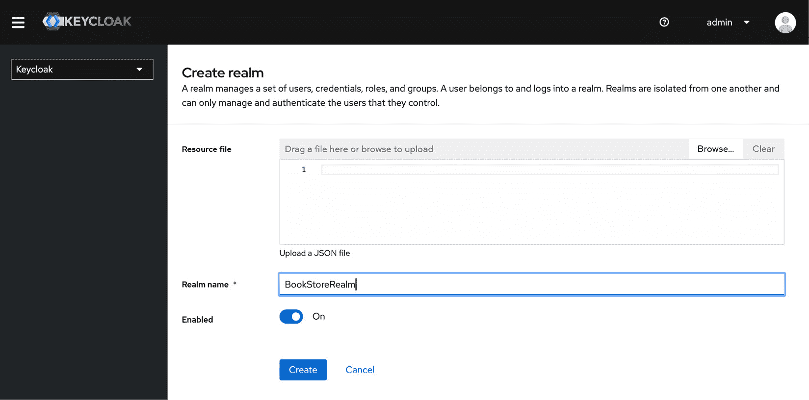
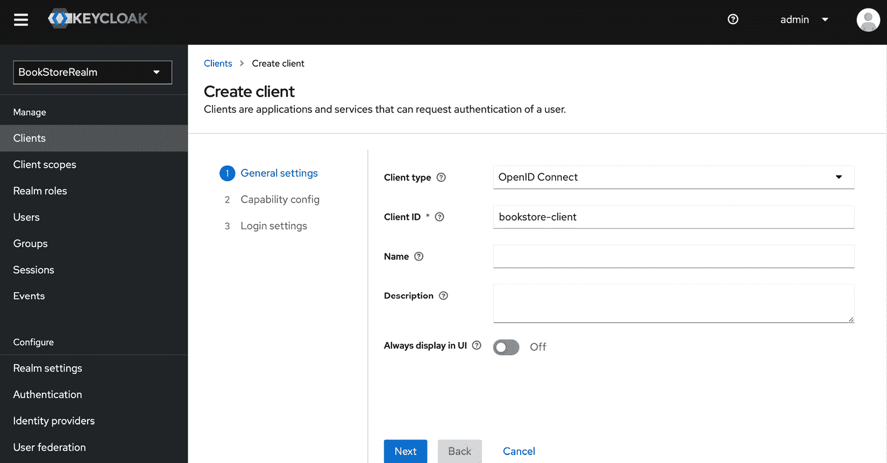
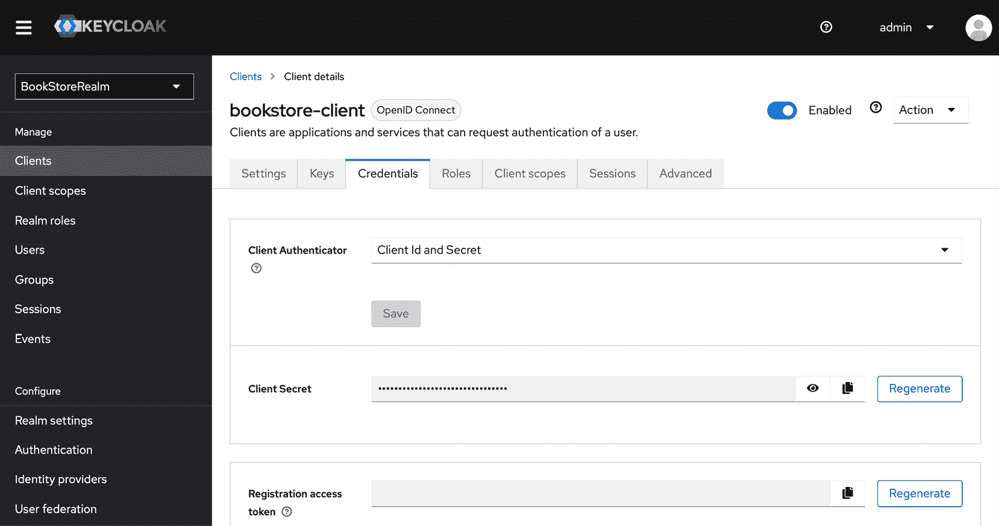
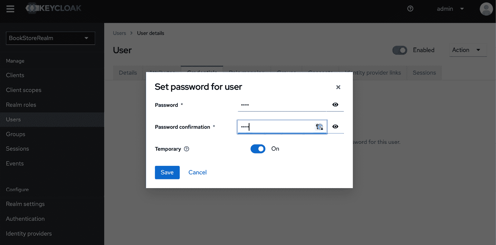
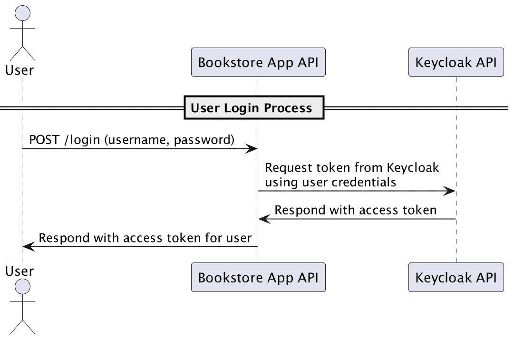
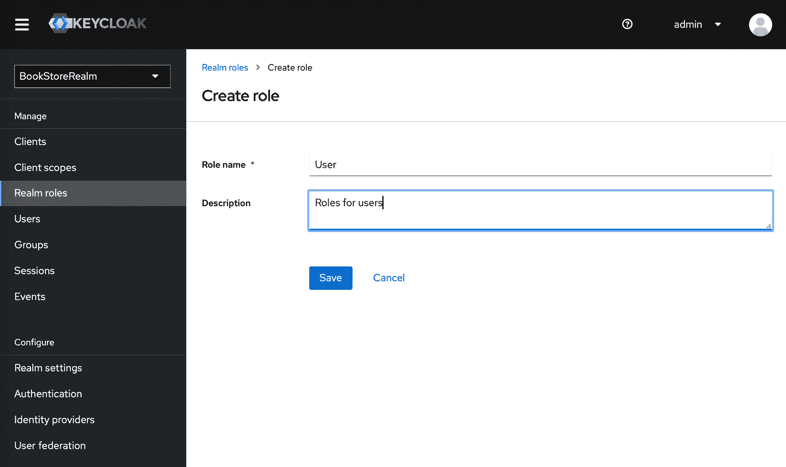
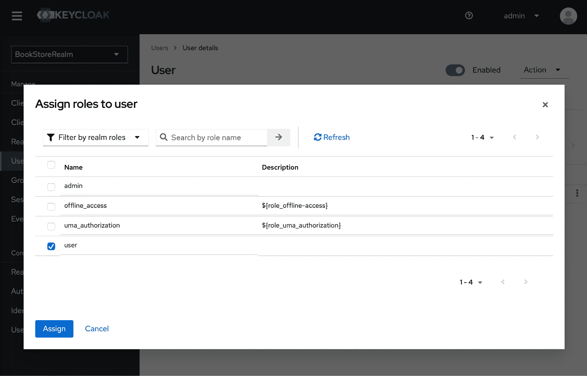

# 5

# 保护您的 Spring Boot 应用程序

欢迎来到您 Spring Boot 学习旅程的重要阶段。在本章中，我们将重点介绍安全性：这是一个至关重要的方面，将帮助您保护您的应用程序免受不断发展的数字威胁。在这里，您将学习如何使用 Spring Boot 3.0 实现强大的安全性，包括使用 **Open Authorization 2.0**（**OAuth2**）、**JSON Web Token**（**JWT**）和 **基于角色的访问控制**（**RBAC**）的技术。我们还将深入了解如何确保反应式应用程序的安全性。

您将学习如何使用 OAuth2 验证用户，并使用 JWT 管理安全令牌。您还将精通 RBAC，其任务是提供正确的访问权限给正确的用户。我们甚至为希望确保他们的反应式应用程序至少与标准 Web 应用程序一样安全的反应式开发者提供了一个专门的章节。

这为什么重要？在我们的数字世界中，安全性不是一个特性；它是一种生活方式。您将掌握的这些概念将帮助您构建安全可靠的应用程序，保护您的数据和用户身份。

最后，您将拥有一个安全、运行中的示例应用程序，该应用程序实现了所提到的所有安全原则。准备好使您的应用程序安全可靠了吗？让我们深入挖掘！

在本章中，我们将涵盖以下主题：

+   在 Spring Boot 3.0 中引入安全性

+   实现 OAuth2 和 JWT

+   在 Spring Boot 中实现 RBAC

+   保护反应式应用程序

让我们开始这段旅程，使您的 Spring Boot 应用程序既安全又稳健！

# 技术要求

对于本章，我们的本地机器需要以下软件：

+   **Java 开发工具包**（**JDK**）17

+   一个现代 **集成开发环境**（**IDE**）；我推荐 IntelliJ IDEA

+   **GitHub 仓库**：您可以从这里克隆与*第五章*相关的所有仓库：[`github.com/PacktPublishing/Mastering-Spring-Boot-3.0`](https://github.com/PacktPublishing/Mastering-Spring-Boot-3.0)

+   Docker Desktop

# 在 Spring Boot 3.0 中引入安全性

在本章中，我们将深入研究 Spring Boot 3.0 的安全性方面。安全性不是一个复选框；它是构建任何应用程序的重要成分。在这里，我们将介绍 Spring Boot 预先集成的安全功能，以从零开始保护我们的应用程序。现在，让我们看看如何自定义和扩展所有这些功能，以满足我们的需求，确保我们不仅实现了一个功能性的应用程序，而且还是一个安全的应用程序。

首先，让我们探索 Spring Boot 的安全架构，它被构建得既强大又灵活。您将看到 Spring Boot 如何使保护应用程序变得简单，它提供了一些合理的默认设置，同时也允许您根据更高级的使用场景进行自定义。到本章结束时，您将意识到为什么安全性如此重要，以及 Spring Boot 3.0 提供了哪些工具来实现有效的安全性。

## 探索 Spring Boot 3.0 的安全特性

当我们开始构建任何类型的 Web 应用程序时，首先想到的便是确保它们的安全性。在这里，Spring Boot 3.0 提供了所有强大的工具来确保我们的应用程序安全。在本节中，我们将深入探讨如何在 Spring Boot 3.0 中构建一个安全架构，以帮助我们实现这一目标，确保我们的 Web 应用程序安全可靠。

Spring Boot 最棒的地方在于设置安全性的过程非常简单。它基于 Spring Security，这是一个用于保护一切的系统框架。将 Spring Security 想象成一个警惕的安全守卫，在门口检查每一个身份证件；这样，它确保只有拥有正确权限的人才能访问应用程序的特定部分。

以下是一些 Spring Boot 3.0 最重要的安全特性：

+   **在我们的应用程序中配置安全性**：使用 Spring Boot 3.0 为您的应用程序设置安全性就像在您的移动设备上配置设置一样。您可以选择您想要开启什么，关闭什么。Spring Boot 允许我们非常容易地定义谁可以访问我们的应用程序中的什么内容。我们通过代码中的简单而强大的配置来实现这一点。

+   **用户认证**：在最基本的意义上，认证是我们验证一个人身份的方式。Spring Boot 3.0 可以帮助我们完成这项工作。这可能通过用户名和密码、通过令牌或以其他方式实现，而 Spring Security 就在那里为您提供帮助。它就像在您的应用程序门口有一个保安，确保只有授权用户才能进入。

+   **授权**：在确定一个人的身份之后，必须定义这个人可以做什么。Spring Security 允许我们为认证用户设置访问规则。这就像根据谁需要去哪里，给你的应用程序的不同门分发钥匙。如您所见，虽然认证是验证用户的身份，但授权决定了用户被允许访问哪些资源和执行哪些操作。

+   **防御常见威胁**：互联网就像一个充满各种威胁的丛林。Spring Boot 3.0 的安全架构旨在保护这些威胁。从**跨站脚本攻击**（XSS）到 SQL 注入，Spring Security 帮助保护您的应用程序免受已知漏洞的侵害。

+   **利用高级安全特性**：深入了解，Spring Boot 3.0 提供了另一套高级安全特性。它添加了 OAuth2 来保护 API 访问，以及**JSON Web Tokens**（JWTs）来进行无状态身份验证。这就像为你的应用程序添加了一个高级安全系统，比如摄像头和探测器。

到目前为止，我们已经理解和应用了 Spring Boot 3.0 的安全架构，我们现在可以开发健壮且安全的应用程序。我们已经看到了基础——从身份验证和授权到保护免受威胁，包括高级特性。这一切都是为了确保我们的应用程序是用户访问和互动的安全场所。

本节展示了 Spring Boot 3.0 在其安全领域下有一套强大的特性，旨在确保我们的应用程序安全。请记住，安全是一个持续的过程。持续监控和更新是必由之路。本章描述了持续监控和更新我们安全措施步骤。这种方法确保我们的应用程序随着时间的推移保持安全，适应新出现的挑战。

在本节中，我们学习了 Spring Boot 3.0 的基本安全特性。在下一节中，我们将开始查看实现 Spring Boot 安全性的代码。

## 设置基本安全配置

让我们逐步设置基本安全配置，确保你的应用程序从一开始就受到保护。以下指导将向你展示如何将安全层引入我们的示例书店应用程序，使其成为用户和数据的安全空间：

1.  `build.gradle`文件：

    ```java
    implementation 'org.springframework.boot:spring-boot-starter-security'
    ```

    现在我们已经将所有必要的库添加到我们的项目中。

1.  **配置 Web 安全**：接下来，我们将创建一个基本安全配置类：

    ```java
    @Configuration
    @EnableWebSecurity
    public class SecurityConfig {
        @Bean
        public SecurityFilterChain securityFilterChain(HttpSecurity http) throws Exception {
            http
                    .csrf(AbstractHttpConfigurer::disable)
                    .sessionManagement(session -> session.sessionCreationPolicy(SessionCreationPolicy.STATELESS))
                    .authorizeHttpRequests(authz -> authz
                            .requestMatchers("/login").permitAll()
                            .anyRequest().authenticated()
                    )
                    .httpBasic(Customizer.withDefaults());
            return http.build();
        }
    }
    DENY response from this request because we have hidden the endpoints behind Spring Security.
    ```

    让我们了解我们通过这个`SecurityConfig.java`类引入了什么：

    +   `@Configuration`: 这个注解将类标记为应用程序上下文 Bean 定义的来源。它告诉 Spring，这个类包含配置信息。

    +   `@EnableWebSecurity`: 这个注解启用了 Spring Security 的 Web 安全支持，并为 Spring MVC 提供了集成。它向 Spring 框架发出信号，开始添加安全配置。

    +   `@Bean`: 这个注解告诉 Spring，该方法将返回一个对象，该对象应注册为 Spring 应用程序上下文中的一个 bean。在这种情况下，它是`SecurityFilterChain` bean。

    +   `public SecurityFilterChain securityFilterChain(HttpSecurity http)`: 这个方法定义了安全过滤器链。它接受一个`HttpSecurity`实例作为参数，允许你为特定的 HTTP 请求配置基于 Web 的安全性。

    +   `.csrf(AbstractHttpConfigurer::disable)`: `.sessionManagement(session -> session.sessionCreationPolicy(SessionCreationPolicy.STATELESS))`: 这配置会话创建策略为无状态。在无状态 API 中，请求之间不存储任何会话信息在服务器上。这对于 REST API 来说是典型的，其中每个请求都是独立的，认证是通过令牌而不是 cookies 完成的。

    +   `.authorizeHttpRequests(authz -> authz`: 这部分开始授权配置。

    +   `.requestMatchers("/login").permitAll()`: 这行代码指定匹配`/login`模式的请求无需认证即可允许。这是在应用程序中定义公开端点的一种方式。

    +   `.anyRequest().authenticated()`: 这确保了任何不匹配先前匹配器的请求都必须进行认证。这是一个通用的安全措施，默认情况下保护了应用程序的其余部分。

    +   `.httpBasic(Customizer.withDefaults())`: 启用 HTTP 基本认证。这是一个简单、无状态的认证机制，允许客户端在每个请求中发送用户名和密码。`Customizer.withDefaults()`部分为 HTTP 基本认证应用默认配置，使设置变得简单直接。

此代码基本上设置了一个安全过滤器链，实际上禁用了 CSRF 保护，非常适合无状态应用程序。它为 REST API 提供了所需的无状态会话管理，并允许对少数 URL（如通过`/login`）进行公开访问。对于所有其他 URL，它强制通过 HTTP 基本认证进行认证。

在本节中，你学习了如何为你的 Spring Boot 应用程序实施基本的安全设置。但我们对安全的调查还没有结束。

通过了解和实施这些基本的安全配置，你正朝着创建安全可信的应用程序迈出重要步伐。始终牢记，一个安全的应用程序不仅意味着保护数据，还意味着在应用方面信任你的用户。

# 实施 OAuth2 和 JWT

接下来，我们将继续讨论应用程序安全的话题，现在我们将讨论一些针对不断变化的环境的更高级机制。这使我们来到了两种重要的技术：OAuth2 和 JWT。它们都是提高现代应用程序安全配置的关键参与者；然而，它们有不同的角色，相互补充以实现安全认证和授权的整体更大图景。

在后续章节中，我们提供了如何为 Keycloak 设置 OAuth2 的详细信息。我们详细介绍了 Keycloak 的 OAuth2 配置，随后是所需的代码片段。我们将使用 Keycloak，这是一个开源平台，完全支持现成的 OAuth2 协议，并具有广泛的定制能力，以提供**身份和访问管理**（**IAM**）。

## 配置 Keycloak 的 OAuth2

进一步深入到高级安全领域，提高应用程序安全性的关键步骤之一是配置 OAuth2。我们将使用 Keycloak 进行 IAM。我们选择 Keycloak 是因为它开源，并且其设置过程非常简单。它是简化我们应用程序安全过程中复杂性的工具。它包括对 OAuth2 的内置支持，因此使得与用户身份管理以及保护用户对应用程序访问相关的所有事情都变得更容易。将 Keycloak 想象成一个已经非常了解您的用户的守门人，并确保只有那些拥有正确权限的人才能访问您应用程序的某些部分。

让我们开始逐步实施。我们将使用 Docker Compose 来运行 Keycloak，同时与我们的 PostgreSQL 和 MongoDB 设置一起。我们将更新当前的 `docker-compose.yml` 文件如下。您也可以在 GitHub 仓库中找到它：[`github.com/PacktPublishing/Mastering-Spring-Boot-3.0/blob/main/Chapter-5-implementing-oauth2-jwt/docker-compose.yml`](https://github.com/PacktPublishing/Mastering-Spring-Boot-3.0/blob/main/Chapter-5-implementing-oauth2-jwt/docker-compose.yml)：

```java
version: '3.1'
services:
  db:
    image: postgres
    restart: always
    environment:
      POSTGRES_PASSWORD: yourpassword
      POSTGRES_DB: bookstore
    ports:
      - "5432:5432"
  mongodb:
    image: mongo
    restart: always
    ports:
      - "27017:27017"
    environment:
      MONGO_INITDB_DATABASE: bookstore
  keycloak_db:
    image: postgres
    restart: always
    environment:
      POSTGRES_DB: keycloak
      POSTGRES_USER: keycloak
      POSTGRES_PASSWORD: keycloakpassword
    ports:
      - "5433:5432"
  keycloak:
    image: bitnami/keycloak:latest
    restart: always
    environment:
      KEYCLOAK_USER: admin
      KEYCLOAK_PASSWORD: admin
      DB_VENDOR: POSTGRES
      DB_ADDR: keycloak_db
      DB_PORT: 5432
      DB_DATABASE: keycloak
      DB_USER: keycloak
      DB_PASSWORD: keycloakpassword
    ports:
      - "8180:8080"
    depends_on:
      - keycloak_db
```

我们保留了我们的 MongoDB 和 PostgreSQL 设置不变，并引入了两个新的镜像：`keycloak_db` 和 `keycloak`。让我们在这里分解参数：

+   `image: postgres`: 指定用于容器的 Docker 镜像。在这种情况下，它使用官方的 PostgreSQL 镜像。

+   `restart: always`: 此设置确保容器在停止时始终重新启动。如果 Docker 重新启动或容器由于任何原因退出，此设置将导致它重新启动。

+   `环境变量`: 为容器定义环境变量。对于 `keycloak_db`，它将 PostgreSQL 数据库 (`POSTGRES_DB`) 设置为 `keycloak`，数据库用户 (`POSTGRES_USER`) 设置为 `keycloak`，以及用户的密码 (`POSTGRES_PASSWORD`) 设置为 `keycloakpassword`。

+   `ports`: 将容器中的端口映射到主机机器。`"5433:5432"` 将容器内的默认 PostgreSQL 端口 (`5432`) 映射到主机的端口 `5433`。这允许您使用端口 `5433` 从主机机器连接到数据库。我们使用 `5433` 是因为我们已经在我们的应用程序的 PostgreSQL 数据库中使用了 `5432`。

+   `image: bitnami/keycloak:latest`: 指定 Keycloak 服务器的 Docker 镜像，使用 `bitnami/keycloak` 镜像的最新版本。*   `restart: always`: 与 `keycloak_db` 类似，确保 Keycloak 容器在停止时由于任何原因始终重新启动。*   `环境变量`: 为 Keycloak 服务器设置特定环境变量：

    +   `KEYCLOAK_USER`: Keycloak 的管理员用户名 (`admin`)。

    +   `KEYCLOAK_PASSWORD`: Keycloak 的管理员密码 (`admin`)。

    +   `DB_VENDOR`: 指定正在使用的数据库类型（在本例中为 `POSTGRES`）。

    +   `DB_ADDR`：数据库容器的地址。使用 `keycloak_db` 服务名称允许 Keycloak 在 Docker 网络中找到数据库。

    +   `DB_PORT`：数据库监听的端口（`5432`）。

    +   `DB_DATABASE`：Keycloak 应使用的数据库名称（`keycloak`）。

    +   `DB_USER` 和 `DB_PASSWORD`：Keycloak 将用于连接到数据库的凭据。*   `ports`：将容器中的 Keycloak 服务器端口映射到主机机器。`"8180:8080"` 将内部端口 `8080`（Keycloak 的默认端口）映射到主机上的 `8180`。这允许您使用端口 `8180` 从主机访问 Keycloak 服务器。我们更改了原始端口，因为我们的 Spring Boot 应用程序正在使用端口 `8080`。*   `depends_on`：

    +   `keycloak_db`：指定 `keycloak` 服务依赖于 `keycloak_db` 服务。Docker Compose 将确保在 `keycloak` 之前启动 `keycloak_db`。

这种设置提供了一个强大且简单的方法来使用 Docker Compose 部署带有 PostgreSQL 数据库的 Keycloak。通过理解这些参数，您可以自定义您的设置以适应您的特定需求，例如更改端口、数据库名称或凭据。

当我们在包含此 `docker-compose.yml` 文件的目录中的终端中运行 `docker-compose up` 命令时，我们的四个服务（PostgreSQL、MongoDB、Keycloak 的 PostgreSQL 和 Keycloak 服务）将在我们的本地机器上启动并运行。在下一步中，我们将根据我们的需求配置 Keycloak 服务器。

### 配置 Keycloak 服务

如我们在 Docker Compose 文件中定义的那样，我们现在有了 Keycloak 服务器的 URL 和端口。打开一个网页浏览器，导航到 `http://localhost:8180/`。使用我们在 Docker Compose 文件中之前设置的管理员凭据登录以访问 Keycloak 管理控制台。在我们的示例中，用户名是 `admin`，密码是 `admin`。按照以下步骤，让我们配置一个 Keycloak 服务：

1.  创建领域：

    1.  点击 `BookStoreRealm`。



图 5.1：添加领域屏幕

1.  点击 **创建**。

1.  创建客户端：

    1.  在您的领域内，导航到 `bookstore-client` 和 **根 URL** 到您的 Spring Boot 应用程序的 URL（对于我们的应用程序，它是 http://localhost:8080）。



图 5.2：客户端创建屏幕

1.  在下一屏幕上，将客户端身份验证设置为 true，并在客户端创建流程的末尾点击保存按钮。

1.  在 **凭据** 下，注意密钥，您将需要在 *配置书店应用程序以* *OAuth2* *部分的应用程序属性中使用它。



图 5.3：客户端凭据屏幕

1.  创建用户：

    导航到 **用户**，添加一个用户，并在 **凭据** 选项卡下设置密码。



图 5.4：用户凭据屏幕

现在，我们将有一个具有用户名、密码和我们的 Keycloak 客户端密钥的用户，这些将在下一节中使用。

重要提示

Keycloak 定期进行更新和改进，这可能会导致用户界面的变化。因此，UI 可能与本章中提供的描述和截图不同。

### 配置图书商店应用程序以使用 OAuth2

我们有一个 Keycloak 服务器，并且已经进行了配置；现在，我们需要配置我们的图书商店应用程序，以便它可以与 Keycloak 服务器通信：

1.  `build.gradle` 文件：

    ```java
    implementation 'org.springframework.boot:spring-boot-starter-oauth2-client'
    implementation 'org.springframework.boot:spring-boot-starter-oauth2-resource-server'
    ```

1.  `application.properties`：将以下属性添加到您的 `application.properties` 文件中，用您的实际 Keycloak 和客户端详细信息替换占位符：

    ```java
    spring.security.oauth2.client.registration.keycloak.client-id=bookstore-client
    spring.security.oauth2.client.registration.keycloak.client-secret=<Your-Client-Secret>
    spring.security.oauth2.client.registration.keycloak.client-name=Keycloak
    spring.security.oauth2.client.registration.keycloak.provider=keycloak
    spring.security.oauth2.client.registration.keycloak.scope=openid,profile,email
    spring.security.oauth2.client.registration.keycloak.authorization-grant-type=authorization_code
    spring.security.oauth2.client.registration.keycloak.redirect-uri={baseUrl}/login/oauth2/code/keycloak
    spring.security.oauth2.client.provider.keycloak.issuer-uri=http://localhost:8180/auth/realms/BookStoreRealm
    spring.security.oauth2.resourceserver.jwt.issuer-uri=http://localhost:8180/auth/realms/BookStoreRealm
    ```

    这些设置用于配置 Spring Boot 应用程序的 OAuth2 客户端注册和资源服务器属性。它们具体配置应用程序使用 Keycloak 作为身份验证提供者。让我们分解每个设置的含义：

    +   `spring.security.oauth2.client.registration.keycloak.client-id`：这是在 Keycloak 中注册的 OAuth2 客户端的唯一标识符。在我们的案例中，`bookstore-client` 是代表我们在 Keycloak 服务器中的应用程序的 ID。

    +   `spring.security.oauth2.client.registration.keycloak.client-secret`：此密钥用于通过 Keycloak 服务器验证客户端。它是一个只有应用程序和 Keycloak 服务器知道的机密字符串，充当密码。

    +   `spring.security.oauth2.client.registration.keycloak.client-name`：客户端的人类可读名称，在我们的配置中是 Keycloak。

    +   `spring.security.oauth2.client.registration.keycloak.provider`：指定此客户端注册的提供者名称。它设置为 `keycloak`，将此客户端注册链接到在属性文件中配置的 Keycloak 提供者。

    +   `spring.security.oauth2.client.registration.keycloak.scope`：定义访问请求的范围。`openid`、`profile` 和 `email` 范围表示应用程序正在请求 ID 令牌以及访问用户的个人资料和电子邮件信息。

    +   `spring.security.oauth2.client.registration.keycloak.authorization-grant-type`：指定要使用的 OAuth2 流。在这里，它设置为 `authorization_code`，这是一种安全且常用的获取访问和刷新令牌的方法。

    +   `spring.security.oauth2.client.registration.keycloak.redirect-uri`：这是用户登录或登出后重定向到的 URI。`{baseUrl}` 是 Spring Security 替换为应用程序基本 URL 的占位符，确保重定向 URI 与应用程序的域名匹配。

    +   `spring.security.oauth2.client.provider.keycloak.issuer-uri`：此 URL 指向您使用的域（`BookStoreRealm`）的 Keycloak 发行者 URI，通常是 Keycloak 的基本 URL 加上`/auth/realms/{realm-name}`。它告诉 Spring Boot 应用程序在哪里可以找到此域的 Keycloak 服务器。

    +   `spring.security.oauth2.resourceserver.jwt.issuer-uri`：类似于提供者发行者 URI，此设置配置 JWT 发行者的发行者 URI。它被资源服务器（您的应用程序）用于验证 JWT。发行者 URI 必须与 JWT 中声明的发行者匹配，才能使令牌被视为有效。

    这些设置将我们的 Spring Boot 应用程序连接到使用 Keycloak 进行身份验证，指定了我们的应用程序应该如何在 Keycloak 中注册，它请求哪些作用域以及如何验证 Keycloak 签发的令牌。

1.  `SecurityConfig` **文件**：我们需要更新`SecurityConfig`文件以使用 Keycloak 的 OAuth2 登录：

    ```java
     @Bean
        public SecurityFilterChain securityFilterChain(HttpSecurity http) throws Exception {
            http
                    .csrf(AbstractHttpConfigurer::disable)
                    .sessionManagement(session -> session.sessionCreationPolicy(SessionCreationPolicy.STATELESS))
                    .authorizeHttpRequests(authz -> authz
                            .requestMatchers("/login").permitAll()
                            .anyRequest().authenticated()
                    )
                    .oauth2ResourceServer(oauth2 -> oauth2.jwt(Customizer.withDefaults()));
            return http.build();
        }
    ```

    基本上，在这个代码中，我们只更改了`build`命令之前的最后一个语句。

    `.oauth2ResourceServer(...)`配置 OAuth2 资源服务器支持，`.jwt(Customizer.withDefaults())`表示资源服务器期望 JWT 进行身份验证。

    后者使用默认的 JWT 解码器配置，这对于大多数场景都是合适的。这一行对于与 OAuth2 集成至关重要，其中应用程序充当资源服务器，验证 JWT。

    此外，我们已将`/login`端点排除在受保护之外，因为此端点应该是公开的，以便用户可以获取凭证。这使我们转向引入一个具有`/login`端点的`LoginController`类。

1.  `login`类，它将用作此`POST`端点的请求体对象，以及一个`LoginController`类。让我们按照下面的方式编写它们。

    这是客户端到服务器的数据传输对象。此对象包含在 Keycloak 服务器中创建的用户登录凭证：

    ```java
    public record LoginRequestDto(String username, String password) {}
    ```

    此外，我们还需要一个额外的配置文件来引入`RestTemplate` bean。我们将在`LoginController`类中使用它：

    ```java
    @Configuration
    public class AppConfig {
        @Bean
        public RestTemplate restTemplate() {
            return new RestTemplate();
        }
    }
    ```

    这是引入到我们应用程序中的`/login`端点的`LoginController`类：

    ```java
    @RestController
    public class LoginController {
        @Value("${spring.security.oauth2.client.registration.keycloak.client-id}")
        private String clientId;
    @Value("${spring.security.oauth2.client.registration.keycloak.client-secret}")
        private String clientSecret;
    @Value("${spring.security.oauth2.resourceserver.jwt.issuer-uri}")
        private String baseUrl;
        @PostMapping("/login")
        public ResponseEntity<?> login(@RequestBody LoginRequestDto loginRequestDto) {
            String tokenUrl = baseUrl + "/protocol/openid-connect/token";
            // Prepare the request body
            MultiValueMap<String, String> requestBody = new LinkedMultiValueMap<>();
            requestBody.add("client_id", clientId);
            requestBody.add("username", loginRequestDto.username());
            requestBody.add("password", loginRequestDto.password());
            requestBody.add("grant_type", "password");
            requestBody.add("client_secret", clientSecret);
            // Use RestTemplate to send the request
            RestTemplate restTemplate = new RestTemplate();
            ResponseEntity<String> response = restTemplate.postForEntity(tokenUrl, requestBody, String.class);
            // Return the response from Keycloak
            return ResponseEntity.ok(response.getBody());
        }
    }
    ```

    让我们了解当用户向`/login`端点发送`POST`请求时，这个控制器做了什么。

    这是我们第一次使用 Spring Boot 的`@Value`注解。这个注解将属性值注入到字段中。在这里，它被用来将 Keycloak 客户端 ID、客户端密钥和 Keycloak 服务器的 URL 从应用程序的属性文件中注入到`clientId`变量中。

    我们的应用程序基本上从请求体中获取用户的用户名和密码，并使用应用程序属性文件中的参数准备对 Keycloak 服务器的 REST 调用。它从 Keycloak 服务器获取响应并将响应返回给用户。为了演示它的工作原理，请参阅以下图示，*图 5*。5*。



图 5.5：使用 Keycloak 服务器的用户登录过程

如图中所示，用户发起一个调用。我们的应用程序准备请求，向 Keycloak API 发起一个 `POST` 调用，并将响应返回给用户。我们将在我们的应用程序调用中使用此访问令牌。我们将在下一节中测试这一点。

## 使用访问令牌测试我们的端点

让我们运行我们的应用程序。如您所记得，在我们之前的测试中，我们从应用程序收到了 HTTP `403 禁止` 消息。现在，在从登录过程获取访问令牌后，我们将对其进行测试：

```java
curl --location "http://localhost:8080/login"
--header "Content-Type: application/json"
--data "{
    \"username\":<username>,
    \"password\":<password>
}"
```

请将用户名和密码值更改为您在 Keycloak 服务器中创建的用户。您将收到以下类似的响应：

```java
{
    "access_token": <JWT Token>
    "expires_in": 300,
    "refresh_expires_in": 1800,
    "refresh_token": <JWT Token>,
    "token_type": "Bearer",
    "not-before-policy": 0,
    "session_state": "043d9823-7ef4-4778-b746-10dd8e75baa4",
    "scope": "email profile"
}
```

我没有在这里放置确切的 JWT，因为它是一个巨大的字母数字值。让我们解释这些值是什么：

+   `access_token`：这是一个客户端应用程序可以使用它通过在 HTTP 请求的授权头中传递它来访问受保护资源的 JWT。它是编码的，并包含有关用户身份验证和授权的声明（或断言）。令牌本身对客户端是透明的，但可以被资源服务器（或任何拥有适当密钥的实体）解码和验证。

+   `expires_in`：指定访问令牌的生存期（以秒为单位）。在此时间之后，访问令牌将不再有效，无法访问受保护资源。在此示例中，访问令牌在 `300` 秒（`5` 分钟）后过期。

+   `refresh_expires_in`：表示刷新令牌的生存期（以秒为单位）。刷新令牌可以在当前访问令牌过期时用于获取新的访问令牌。在这里，它设置为 `1800` 秒（`30` 分钟）。

+   `refresh_token`：这是另一个 JWT，与访问令牌类似，但仅用于获取新的访问令牌，而无需用户再次登录。它比访问令牌有更长的有效期，并且应该安全存储。

+   `token_type`：指定发行的令牌类型。在 OAuth2 中，这通常是 `Bearer`，这意味着持有此令牌的人有权访问资源。客户端应用程序在构造 HTTP 请求的授权头时应使用此令牌类型。

+   `not-before-policy`：此字段是 Keycloak 和类似授权服务器特有的。它表示一个策略或时间戳，在此时间戳之前，令牌不应被视为有效。`0` 的值通常表示令牌在发行时立即有效。

+   `session_state`：与令牌关联的用户会话的唯一标识符。应用程序可以使用此标识符进行会话管理或跟踪目的。

+   `scope`：指定请求的访问范围。范围由空格分隔，表示应用程序已被授予的访问权限。在这种情况下，`email profile` 表示应用程序可以访问用户的电子邮件地址和简介信息。

现在，我们将使用这个访问令牌，并在我们的请求头中使用它：

```java
curl --location "http://localhost:8080/books"
--header "Authorization: Bearer <access_token>"
```

我们将获得一个书籍列表作为响应。您也可以使用相同的令牌对其他端点进行请求。在`5`分钟（`300`秒）后，访问令牌将过期，我们需要再次调用`/login`端点以获取新的访问令牌。

我们终于来到了本节的结尾。我们在本地运行了 Keycloak 服务器，并定义了一个新的领域、客户端和用户。随后，我们配置了我们的 Spring Boot 应用程序以与 Keycloak 服务器通信。经过所有这些配置和实现，我们能够使用我们的用户名和密码获取一个访问令牌，并从我们的受保护端点获得有效的响应。

在下一节中，我们将学习如何定义一个角色，并通过角色过滤请求的角色；这是使用基于角色的安全保护我们的端点的一个重要步骤。

# 在 Spring Boot 中实现 RBAC

在现代 Web 开发领域，确保用户只能访问他们有权访问的资源至关重要。这就是 RBAC 发挥作用的地方。想象一下，在您的应用程序中设置一系列门，每个门都需要只有某些用户才拥有的特定钥匙。这就是 RBAC 的本质——确保基于分配给用户的角色授予访问权限，同时增强安全和可用性。

为什么在您的 Spring Boot 应用程序中使用 Keycloak 优先考虑基于角色的访问控制（RBAC）？首先，它简化了复杂的访问管理任务，使开发人员更容易定义和执行安全策略。这使得您的应用程序能够利用 Keycloak 对 OAuth2 的出色支持，并提供了一种非常结构化、可扩展的方式来保护端点。这将使您的应用程序在控制用户访问时更加安全，其功能也更加清晰。当我们更深入地设置 Keycloak 中的 RBAC 时，请记住，这并不是关于限制本身；它更多的是关于为用户提供无缝和安全的体验，这意味着他们可以获得正确的工具和权限，有效地在您的应用程序中导航。让我们开始这段旅程，挖掘我们 Spring Boot 应用程序中基于角色安全性的全部潜力。

## 在 Keycloak 中定义角色和权限

在 Keycloak 中定义角色和权限对于建立提供非常流畅的用户访问管理功能的 secure 应用程序非常重要。通过这个过程，您将能够具体说明某个用户可以执行的操作，从而增强系统中的安全和生产力。以下是一个关于在 Keycloak 中设置角色和权限的简单指南，以及关于这种配置如何影响您的安全和管理的见解：

1.  首先，使用您的管理员凭据登录 Keycloak 管理控制台（`http://localhost:8180`）。这是我们管理领域、用户、角色和权限的控制面板。

1.  导航到 **角色** 部分——从下拉菜单中选择您希望配置的区域，然后在左侧菜单中点击 **角色**。在这里，您将看到现有角色的列表。



图 5.6：添加角色界面

1.  **添加角色**：点击 **添加角色**。输入用户角色的名称和描述，以帮助您识别角色在应用程序中的用途。

1.  **保存**：点击 **保存**。您现在已创建了一个可以分配给用户的角色。

1.  添加一个名为 `admin` 的角色。

1.  前往 **用户**，选择上一步创建的用户，然后点击 **角色映射**。



图 5.7：用户角色映射界面

1.  在这里，您可以给用户分配 **用户** 角色。选择角色并点击 **分配**。

1.  创建一个新用户，并将 **admin** 角色分配给此用户。

角色定义和分配后，让我们了解将创建的角色包含到应用程序中的过程。

## 为基于角色的访问定制书店应用程序

在您的 Spring Boot 书店应用程序中使用 Keycloak 实现 RBAC 显著增强了其安全性，确保用户只能根据其角色访问允许的内容。这不仅通过设计使您的应用程序更加安全，而且为用户权限的管理设置了一个非常稳固的框架。让我们按照以下步骤将基于角色的设置包含到您的应用程序中，其中引入了一个新类——`KeycloakRoleConverter`——以及特定的安全配置。新类将成为 Keycloak 角色和 Spring Security 角色之间的适配器。让我们一步一步地学习如何将这个结构应用到我们的应用程序中：

1.  对 `/books` 和 `/authors` 的 `POST` 请求向具有 `ROLE_ADMIN` 权限的用户发送，并配置 OAuth2 资源服务器使用自定义 JWT 认证转换器。打开您的安全配置类，并更新 `securityFilterChain` bean，如下所示：

    ```java
    @EnableMethodSecurity
    public class SecurityConfig {
        @Bean
        public SecurityFilterChain securityFilterChain(HttpSecurity http) throws Exception {
            http
                .csrf(AbstractHttpConfigurer::disable)
                .sessionManagement(session -> session.sessionCreationPolicy(SessionCreationPolicy.STATELESS))
                .authorizeHttpRequests(authz -> authz
                    .requestMatchers("/login").permitAll()
                    .requestMatchers(HttpMethod.POST, "/books", "/authors").hasAuthority("ROLE_ADMIN")
    .requestMatchers(HttpMethod.GET, "/books/**","/reviews/**", "/authors/**", "/publishers/**").hasAnyAuthority("ROLE_USER","ROLE_ADMIN")
                    .anyRequest().authenticated()
                )
                .oauth2ResourceServer(oauth2 -> oauth2.jwt(jwt -> jwt.jwtAuthenticationConverter(new KeycloakRoleConverter())));
            return http.build();
        }
    }
    ```

1.  `KeycloakRoleConverter` **类**：这个类至关重要，因为它将 Keycloak JWT 转换为 Spring Security 的认证结构。这个自定义转换器从 JWT 中提取角色，并将它们作为 Spring Security 上下文中的权限分配：

    ```java
    public class KeycloakRoleConverter implements Converter<Jwt, AbstractAuthenticationToken> {
        @Override
        public AbstractAuthenticationToken convert(Jwt jwt) {
            // Default converter for scopes/authorities
            JwtGrantedAuthoritiesConverter defaultAuthoritiesConverter = new JwtGrantedAuthoritiesConverter();
            Collection<GrantedAuthority> defaultAuthorities = defaultAuthoritiesConverter.convert(jwt);
            // Extract realm_access roles and map them to GrantedAuthority objects
            Collection<GrantedAuthority> realmAccessRoles = extractRealmAccessRoles(jwt);
            // Combine authorities
            Set<GrantedAuthority> combinedAuthorities = new HashSet<>();
            combinedAuthorities.addAll(defaultAuthorities);
            combinedAuthorities.addAll(realmAccessRoles);
            return new AbstractAuthenticationToken(combinedAuthorities) {
                @Override
                public Object getCredentials() {
                    return null;
                }
                @Override
                public Object getPrincipal() {
                    return jwt.getSubject();
                }
            };
        }
        public static List<GrantedAuthority> extractRealmAccessRoles(Jwt jwt) {
            Map<String, Object> realmAccess = jwt.getClaimAsMap("realm_access");
            if (realmAccess == null) {
                return Collections.emptyList();
            }
            List<String> roles = (List<String>) realmAccess.get("roles");
            if (roles == null) {
                return Collections.emptyList();
            }
            return roles.stream()
                    .map(roleName -> new SimpleGrantedAuthority("ROLE_" + roleName.toUpperCase()))
                    .collect(Collectors.toList());
        }
    }
    ```

我们引入了一个实现 `Converter` 接口的类，将 JWT 转换为 `AbstractAuthenticationToken` 类，这是 Spring Security 用于认证信息的一个概念。通过这些更改，我们的书店应用程序现在拥有一个非常安全和强大的基于角色的访问控制系统。它只允许具有正确角色的认证用户执行特定操作——这显著提高了应用程序的安全性和完整性。此外，该设置非常细致，它提供了对用户权限的最佳控制，并简化了应用程序中访问权限的管理。

我们现在可以测试我们的应用程序了。当我们使用`user`角色登录并发出对`/books`的`GET`请求时，我们会得到一个成功的响应，但当我们尝试对`/books`发出`POST`请求并创建一本新书时，响应将是`forbidden`。如果我们使用`admin`角色登录，无论请求是`GET`还是`POST`，我们都会一直成功。在我们的 Spring Boot 书店应用程序的 RBAC（基于角色的访问控制）领域确保安全立足点将为我们扩展安全架构开辟一条有利之路。

我们旅程的下一部分是确保反应式应用程序的安全。向前推进，本章将讨论所有安全、身份验证和授权原则如何应用于编程的反应式上下文中。这不仅将帮助我们扩大对实际中可利用的安全方法的了解范围，还将为我们提供帮助，以提供足够的保护来保护我们的反应式应用程序。我们将深入了解反应式安全，以使我们的应用程序具有应对不断发展的网络威胁所需的弹性。

确保反应式应用程序的安全

在软件开发的动态环境中，确保反应式应用程序的安全带来了一组新的挑战和机遇。在更深入地了解了反应式编程的世界之后，我们现在需要调整我们的安全策略，以适应这些应用程序的非阻塞、事件驱动的特性。那些被识别出来处理大量并发数据流的自反应系统强烈要求采取一种强大而灵活的安全方法。本节将尝试揭示确保反应式应用程序的复杂性，并将指导您通过必要的步骤和考虑，以有效地保护您的反应式生态系统。

我们将探讨如何使用 Spring Security 提供的反应式支持来启用这些安全功能，同时不破坏反应式原则，确保高响应性和弹性。

转向反应式编程领域可能意味着在安全方面的一个挑战，尤其是考虑到 Spring Security 提供的强大功能。使用 Spring Security 实现反应式安全实际上是将经典的安全范式适应于反应式应用程序的异步、非阻塞模型。这种重新定位可以描述为一种转变，不是任何技术变化的转变，而是在安全过程与数据流和用户请求交互的方式上的转变。在这个环境中，安全模型需要是功能性的，而不寻求与反应式原则有任何妥协，也不对其施加瓶颈。

在确保响应式应用的安全性方面，一个关键的区别在于认证和授权的方式。与通常将安全上下文绑定到线程本地的基于 servlet 的传统应用不同，响应式安全性必须能够处理这种解耦、无状态的反应式编程特性。Spring Security 提供了一个响应式安全上下文，它被限制在响应流中，确保安全决策在上下文感知的方式上与应用的流程保持一致。

在本系列中，当我们探讨 Spring Security 的响应式部分时，我们将了解如何有效地在我们的应用中包含它们以实现响应式系统的安全性。这包括处理 Spring Security 提供的响应式 API、理解谁作为发布者来做出安全决策（`Mono` 和 `Flux`），并确保您的应用保持安全、响应式和可扩展。本指南通过实际示例和逐步方法，将帮助您导航响应式安全性的复杂性，确保应用不仅安全，而且符合响应式编程模型所设定的性能和扩展期望。

让我们开始将安全性实现到响应式应用中。我们将使用我们在 *第三章* 中开发的项目：

1.  `build.gradle` 文件：

    ```java
    implementation 'org.springframework.security:spring-security-config'
    implementation 'org.springframework.boot:spring-boot-starter-oauth2-client'
    implementation 'org.springframework.boot:spring-boot-starter-oauth2-resource-server'
    ```

1.  `application.properties`：将以下属性添加到您的 `application.properties` 文件中，用您的实际 Keycloak 和客户端详细信息替换占位符：

    ```java
    spring.security.oauth2.client.registration.keycloak.client-id=bookstore-client
    spring.security.oauth2.client.registration.keycloak.client-secret=<Your-Client-Secret>
    spring.security.oauth2.client.registration.keycloak.client-name=Keycloak
    spring.security.oauth2.client.registration.keycloak.provider=keycloak
    spring.security.oauth2.client.registration.keycloak.scope=openid,profile,email
    spring.security.oauth2.client.registration.keycloak.authorization-grant-type=authorization_code
    spring.security.oauth2.client.registration.keycloak.redirect-uri={baseUrl}/login/oauth2/code/keycloak
    spring.security.oauth2.client.provider.keycloak.issuer-uri=http://localhost:8180/auth/realms/BookStoreRealm
    spring.security.oauth2.resourceserver.jwt.issuer-uri=http://localhost:8180/auth/realms/BookStoreRealm
    ```

1.  在您的 `SecurityConfig` 类中指定授权规则并设置 JWT 转换器以提取角色的 `SecurityWebFilterChain` 类：

    ```java
    @Configuration
    public class SecurityConfig {
        @Bean
        public SecurityWebFilterChain securityWebFilterChain(ServerHttpSecurity http) {
            http
                .csrf(ServerHttpSecurity.CsrfSpec::disable)
                .authorizeExchange(exchanges -> exchanges
                    .pathMatchers("/login").permitAll()
                    .pathMatchers(HttpMethod.POST, "/users").hasAuthority("ROLE_ADMIN")
                    .pathMatchers(HttpMethod.GET, "/users/**").hasAnyAuthority("ROLE_ADMIN", "ROLE_USER")
                    .anyExchange().authenticated()
                )
                .oauth2ResourceServer(oauth2ResourceServer ->
                    oauth2ResourceServer.jwt(jwt ->
                        jwt.jwtAuthenticationConverter(jwtAuthenticationConverter()))
                );
            return http.build();
        }
        private Converter<Jwt, ? extends Mono<? extends AbstractAuthenticationToken>> jwtAuthenticationConverter() {
            ReactiveJwtAuthenticationConverter jwtConverter = new ReactiveJwtAuthenticationConverter();
            jwtConverter.setJwtGrantedAuthoritiesConverter(new KeycloakRoleConverter());
            return jwtConverter;
        }
    }
    ```

1.  `KeycloakRoleConverter`：`KeycloakRoleConverter` 类对于将 Keycloak 角色映射到 Spring Security 权限至关重要：

    ```java
    public class KeycloakRoleConverter implements Converter<Jwt, Flux<GrantedAuthority>> {
        @Override
        public Flux<GrantedAuthority> convert(final Jwt jwt) {
            // Extracting roles from realm_access
            return Flux.fromIterable(getRolesFromToken(jwt))
                    .map(roleName -> "ROLE_" + roleName.toUpperCase()) // Prefixing role with ROLE_
                    .map(SimpleGrantedAuthority::new);
        }
        private List<String> getRolesFromToken(Jwt jwt) {
            Map<String, Object> realmAccess = jwt.getClaimAsMap("realm_access");
            if (realmAccess == null) {
                return Collections.emptyList();
            }
            List<String> roles = (List<String>) realmAccess.get("roles");
            if (roles == null) {
                return Collections.emptyList();
            }
            return roles;
        }
    }
    ```

1.  `token` 处理身份验证请求的 `LoginController` 类，利用 Keycloak 的 `token` 端点：

    ```java
    @RestController
    public class LoginController {
        @Value("${spring.security.oauth2.client.registration.keycloak.client-id}")
        private String clientId;
        @Value("${spring.security.oauth2.client.registration.keycloak.client-secret}")
        private String clientSecret;
        @Value("${spring.security.oauth2.resourceserver.jwt.issuer-uri}")
        private String baseUrl;
        @PostMapping("/login")
        public Mono<ResponseEntity<?>> login(@RequestBody LoginRequestDto loginRequestDto) {
            // URL for Keycloak token endpoint
            String tokenUrl = baseUrl + "/protocol/openid-connect/token";
            // Prepare the request body
            MultiValueMap<String, String> requestBody = new LinkedMultiValueMap<>();
            requestBody.add("client_id", clientId);
            requestBody.add("username", loginRequestDto.username());
            requestBody.add("password", loginRequestDto.password());
            requestBody.add("grant_type", "password");
            requestBody.add("client_secret", clientSecret);
            // Use RestTemplate to send the request
            RestTemplate restTemplate = new RestTemplate();
            ResponseEntity<String> response = restTemplate.postForEntity(tokenUrl, requestBody, String.class);
            // Return the response from Keycloak
            return Mono.just(ResponseEntity.ok(response.getBody()));
        }
    }
    ```

现在我们已经将基于角色的安全过滤器引入到我们的响应式应用中。几乎所有内容都与传统应用非常相似，只是响应是在响应式领域，例如 `Mono` 和 `Flux`。我们可以使用我们之前的 `curl` 脚本进行登录，为 `user` 和 `admin` 角色获取访问令牌，并且我们可以测试我们的 `POST` 和 `GET` 端点。

这意味着将响应式安全性集成到 Spring Boot 应用中需要故意配置一系列自定义实现，特别是使用 OAuth2 和 Keycloak。从设置依赖项和配置属性到安全过滤器链，最后到自定义角色转换器——每一步都进行了描述，以便可以遵循以获得我们书店应用的安全响应式环境。这种实现不仅利用了响应式编程的非阻塞特性，而且还确保我们的应用在响应式环境中既安全又可扩展，能够高效地处理需求。

# 摘要

通过这一点，我们将结束本章，本章主要讨论了如何确保 Spring Boot 应用程序的安全性。我们现在已经通过了解上下文和所需的安全工具集，有效地保护我们的应用程序，完成了对 Spring Boot 安全性的探索。让我们总结本章的关键学习内容：

+   **理解 Spring Boot 安全性**：我们理解了保护 Spring Boot 应用程序的需求和 Spring Security 的基本原则。

+   **使用 OAuth2 实现**：我们学习了如何使用 OAuth2 验证用户并使用 JWT 管理安全令牌。

+   **使用 Keycloak 进行 RBAC**：我们详细展示了如何配置 Keycloak 来管理我们系统中的角色和权限，从而增强我们应用程序的安全结构。

+   **针对反应式的修改安全配置**：我们详细阐述了如何针对反应式编程模型定制安全配置，以便我们的应用程序既能保证安全又能具备能力。

+   **使用 Spring Security 实现反应式安全**：为了在反应式环境中实现安全性，需要必要的差异和修改。本章强调了非阻塞和事件驱动的安全机制。

本章简要概述了 Spring Security 的内容。下一章，高级测试策略，将进一步深入 Spring Boot 生态系统，这次将深入探讨测试。本章将更深入地探讨单元测试和集成测试之间的差异，指出测试反应式组件的挑战，进而讨论安全功能测试，并简要介绍 Spring Boot 3.0 的**测试驱动开发（TDD**）方面。从确保安全性到测试我们的应用程序的这一进展，真正强调了在开发能够满足现代应用开发需求的健壮、高质量软件时需要采取的全面方法。
