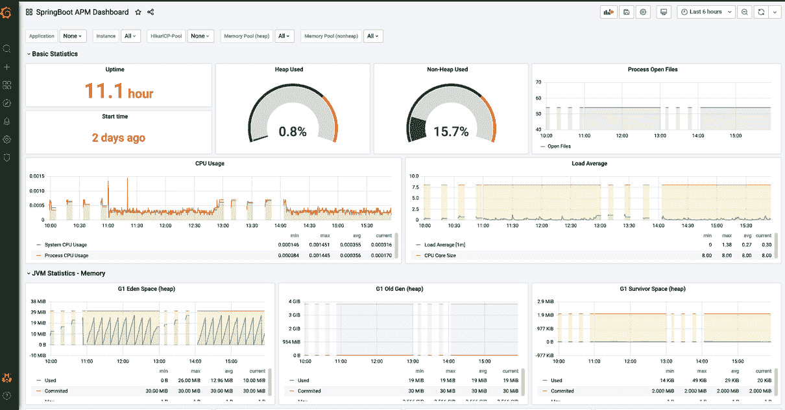

# 7

# Spring Boot 3.0 的容器化和编排功能

在本章中，我们将深入探讨使用 **Spring Boot 3.0** 的 **容器化** 和 **编排** 领域，这对于当代开发者来说是一个关键技能集。随着您翻阅这些页面，您不仅将获得知识，还将获得可以立即应用于您项目的实践经验。对于任何寻求最大化 Spring Boot 能力的开发者来说，这段旅程具有重要意义，他们开发的应用程序不仅高效和可扩展，而且在当今不断发展的数字世界中具有弹性和健壮性。

完成本章后，您将掌握无缝容器化 Spring Boot 应用程序的知识，理解作为容器平台的 Docker 的复杂性，并掌握 Kubernetes 编排您容器化应用程序的概念。这些技能在当今的软件开发领域中至关重要，因为应用程序开发、部署和管理速度和可靠性可以极大地影响项目成功。

在现实世界的场景中，根据需求对环境的适应性、资源效率和可扩展性是软件开发的一些方面。本章通过强调容器化和编排的优势来满足这些要求，以增强您应用程序的可移植性、效率和可管理性。

在本章中，我们将涵盖以下内容：

+   Spring Boot 中的容器化和编排

+   Spring Boot 和 Docker

+   优化 Spring Boot 应用程序以适应 Kubernetes

+   Spring Boot Actuator 与 Prometheus 和 Grafana

让我们开始这段旅程，将您的 Spring Boot 应用程序容器化，并使它们更容易管理！

# 技术要求

对于本章，我们需要在我们的本地机器上做一些设置：

+   **Java 17 开发工具包**（**JDK 17**）

+   一个现代的**集成开发环境**（**IDE**）——我推荐 IntelliJ IDEA

+   GitHub 仓库：您可以从这里克隆与*第七章*相关的所有仓库：[`github.com/PacktPublishing/Mastering-Spring-Boot-3.0/`](https://github.com/PacktPublishing/Mastering-Spring-Boot-3.0/)

+   Docker Desktop

# Spring Boot 中的容器化和编排

欢迎来到容器化的领域，我们将为 Spring Boot 应用程序在任意平台上的部署做好准备。如果您对容器技术如何革命性地改变应用程序的开发和部署流程感兴趣，您就来到了正确的位置。本节将为您提供将 Spring Boot 应用程序打包成容器的见解，确保在环境中的灵活性、一致性和适应性。您将深入了解背后的原因，并学习将重塑您交付应用程序方法的技巧。我们将一起踏上这段旅程，简化您的应用程序部署过程。

## 理解容器化——您的应用程序在一个盒子里

将容器化视为打包应用程序的一种方式。想象一下准备旅行，确保所有必需品都装进一个行李箱。在你的应用程序的上下文中，将“行李箱”想象成一个容器，它容纳的不是你的应用程序，而是必要的代码、库和配置设置。这个容器是通用的——无论它是在你的电脑上、朋友的设备上还是在云端，它都能无缝运行。

这对你有什么好处？想象一下创建一个你想让每个人都能使用的应用程序。没有容器，它可能在你的系统上运行得很好，但可能在其他地方遇到问题——这可能会令人沮丧。有了容器化，如果它对你工作得很好，那么对其他人也是如此。它提供了可靠性，消除了那些令人烦恼的时刻，当有人说，“它对我不起作用。”

容器就像盒子，让你的应用程序能够轻松旅行，没有任何麻烦。这就像一个节省你时间和头痛的技巧。通过接受这个概念，你确保了无论应用程序需要去哪里或需要扩展多少，它都能茁壮成长。

正因如此，了解容器化至关重要；它简化了开发者的生活，并增强了应用程序的灵活性。现在让我们探索如何为 Spring Boot 应用程序准备这次容器之旅。

## 享受收益——负载更轻，启动更快

容器不仅帮助应用程序轻松移动。它们就像是科技世界的背包。不是每个应用程序都携带一个装满运行所需一切物品的行李箱，容器共享资源。这加快了应用程序的启动时间，并在你的电脑上节省空间和内存。这个概念类似于拼车上班。当每个人都一起开车时，你们所有人都能更快地到达目的地，并且更加环保。

这就是使用容器对你有益的原因——当你的应用程序在容器中时，它可以瞬间启动，只需一挥手。你不必等待它开始。此外，由于容器轻量级，你可以在一台机器上运行应用程序而不会发生资源冲突。此外，如果你的应用程序变得流行，创建容器来处理流量很简单——当活动减慢时，停止一些容器是轻而易举的。

使用容器提供了在需求高时将汽车连接到火车上，在需求减少时将其拆卸下来的灵活性。选择容器代表了一种高效管理应用程序的方法。它彻底改变了你创建、测试和发布应用程序的方式，提高了可靠性和响应速度。在下一节中，我们将探讨你的 Spring Boot 应用程序如何利用这些好处。

## 将 Spring Boot 带入比赛——从一开始就支持容器

让我们为您的 Spring Boot 应用程序准备容器环境。Spring Boot 作为您的应用程序的向导，确保在容器内运行。从一开始，Spring Boot 就旨在与容器一起工作。为什么这很重要？这就像拥有一辆随时准备好的汽车，以便您需要时进行长途旅行。

Spring Boot 为您承担了许多重任。它根据其部署位置自动适应您的应用程序需求，使其非常适合高度可移植的环境。使用 Spring Boot，您不需要对每个方面进行微观管理——它本能地理解容器设置并相应地适应。这就像有一个伴侣，每次旅行都能轻松地知道需要携带哪些必需品。

Spring Boot 还确保您的应用程序随时可用——无论您是在自己的电脑上、朋友的设备上还是在云中运行您的应用程序。这使您能够更多地关注增强您的应用程序，而不是处理设置过程。

通过确保您的 Spring Boot 应用程序具有容器友好性，您不仅是在追随潮流；您是在选择一条减少压力并提高成功率的道路。这一切都是为了简化您作为开发者的生活并增强您应用程序的弹性。现在，让我们继续将您的 Spring Boot 应用程序转换为容器。

## 激发 Spring Boot 的超级力量——可移植性、效率和控制

让我们探索 Spring Boot 在容器内部为您的应用程序提供的功能。这些功能包括可移植性、效率和控制。它们旨在简化您作为开发者的生活。这些功能如下：

+   **可移植性**：这就像为您的应用程序配备了一个适配器。无论您将其插入何处，它都能无缝地运行。无论您将应用程序从您的电脑转移到测试环境或云中，它每次都会一致地运行。这消除了当应用程序在一台设备上运行但在另一台设备上不运行时出现的问题。

+   **效率**：这意味着用更少的资源实现。容器通过尽可能共享资源并最小化浪费来利用资源。您的应用程序启动快速且运行顺畅，就像一台调校过的机器。因此，您的应用程序可以同时为许多用户提供服务，而无需大量电力或机器。

+   **控制**：这使您能够轻松地监督您应用程序的所有方面。您可以启动它、停止它、在使用期间扩展它，或在较安静的时间缩小它。这就像拥有您应用程序的遥控器，其中每个按钮都对应您可能需要的每个操作。Spring Boot 通过用户直观的设计方式，使访问所有这些控制变得容易。

当你将 Spring Boot 应用程序打包到容器中时，你不仅仅是把它放入一个盒子；你还在其中配备了增强其灵活性、强度和智能的工具。这使我们的应用程序能够满足当前和未来的用户需求。最好的部分？你正在以允许你专注于改进应用程序本身而不是担心它如何以及在哪里运行的方式设置它。这就是使用容器，特别是 Spring Boot 的美妙之处——它赋予你增强应用程序功能的同时最小化复杂性的能力。现在，让我们继续前进，在我们容器化 Spring Boot 应用程序的过程中实现这些功能。

# Spring Boot 和 Docker

在通过理解容器化和编排及其整体优势打下基础之后，现在是时候深入实践了。本节将指导你将 Docker 集成到示例 Spring Boot 应用程序中，并利用 Spring Boot 3.0 的功能。我们将演示如何将你的 Spring Boot 应用程序转换为一系列容器，这些容器可以高效地编排以实现可伸缩性。

让我们开始这段旅程，我们将在这里将容器化和编排的概念与 Spring Boot 结合起来付诸实践。我们将一起学习如何创建不仅功能强大而且定制以增强你的工作流程的 Docker 镜像，为与容器编排平台的无缝集成铺平道路。

## 使用分层 jar 构建高效的 Docker 镜像

Docker 通过强调创建 Docker 镜像的重要性来简化开发者的生活。Spring Boot 的 jars 概念引起了开发者的注意。想象一下烘焙蛋糕——不是作为一个整体烘焙，而是分别烘焙单独的层次。这种方法允许在不重建整个蛋糕的情况下修改层次。同样，Docker 中的分层 jars 允许你将应用程序分割成可以由 Docker 独立管理和更新的层次。

这种方法通过减少构建时间和生成 Docker 镜像来革新开发过程。通过缓存这些层次，Docker 只在应用程序发生更改时重建修改过的层次。例如，对应用程序代码的修改不需要重建那些保持基本不变的组件，如 JVM 层。

准备开始了吗？以下是一个逐步指南，介绍如何设置你的 Spring Boot 项目以利用分层 jar：

1.  **创建一个新项目**：使用 Spring Initializr ([`start.spring.io/`](https://start.spring.io/)) 创建一个新的 Spring Boot 项目。选择 **Spring Boot 版本 3.2.1**。对于依赖项，添加 **Spring Web** 以创建一个简单的 Web 应用程序。请选择 **Gradle** 作为构建工具。

1.  **生成和下载**：配置完成后，点击 **生成** 下载你的项目骨架。

1.  在适当的包中，在`src/main/java/`目录下创建一个名为`HelloController`的新 Java 类。

1.  **添加 REST 端点**：实现一个简单的 GET 端点，返回一个问候语：

    ```java
    @RestController
    public class HelloController {
        @GetMapping("/")
        public String hello() {
            return "Hello, Spring Boot 3!";
        }
    }
    ```

1.  **启用分层**：首先，配置您的 Spring Boot 构建插件以识别分层功能。这只是一个简单的问题，即在您的构建文件中包含正确的依赖项和配置设置。

1.  `./gradlew build` ```java` ` ```` build/libs` 目录。

现在，我们手中有一个分层 jar。让我们看看我们如何检查其中的层：

```java
> jar xf build/libs/demo-0.0.1-SNAPSHOT.jar BOOT-INF/layers.idx
> cat BOOT-INF/layers.idx
- "dependencies":
  - "BOOT-INF/lib/"
- "spring-boot-loader":
  - "org/"
- "snapshot-dependencies":
- "application":
  - "BOOT-INF/classes/"
  - "BOOT-INF/classpath.idx"
  - "BOOT-INF/layers.idx"
  - "META-INF/"
```

`layers.idx`文件将应用程序组织成逻辑层。典型的层包括以下内容：

+   `dependencies`：应用程序需要的外部库

+   `spring-boot-loader`：负责启动您的应用程序的 Spring Boot 部分

+   `snapshot-dependencies`：任何快照版本的依赖项，它们比常规依赖项更可能更改

+   `application`：您的应用程序的编译类和资源

每个层都旨在优化 Docker 的构建过程。不太可能改变的层（如`dependencies`）与更易变的层（如`application`）分离，允许 Docker 独立缓存这些层。这减少了在只有小改动时重建和重新部署应用程序所需的时间和带宽。

在探讨了分层 jar 的效率之后，接下来我们将看看 Spring Boot 如何使用云原生构建包简化 Docker 镜像的创建。准备好看到即使没有深入的 Docker 专业知识，您也可以创建和管理既健壮又适合云的 Docker 镜像。

## 使用云原生构建包简化 Docker 化

**云原生构建包**标志着我们在为 Docker 准备应用程序方面的进步——把它们视为您的 Docker 化助手。在创建 Dockerfile 时，您需要列出所有构建 Docker 镜像的命令，构建包会自动化这个过程。它们分析您的代码，确定其需求，并将其打包成容器镜像，而无需在 Dockerfile 中编写任何一行代码。

这种自动化对于缺乏 Docker 专业知识或没有时间维护 Dockerfile 的团队特别有益。它还促进了一致性和对实践的遵守，确保构建包生成的镜像符合安全、效率和兼容性的标准。

这就是您如何利用云原生构建包的力量与 Spring Boot 结合使用：

1.  在终端中，导航到我们的 Spring Boot 应用程序的根目录。

1.  使用内置对构建包支持的 Spring Boot Gradle 插件。通过一个简单的命令，`./gradlew bootBuildImage --imageName=demoapp`，您就可以触发构建包开始工作。我们还为我们的镜像起了一个名字——`demoapp`。

1.  构建包检查你的应用程序，将其识别为 Spring Boot 应用程序。然后它自动选择一个基础镜像，并将你的应用程序代码及其依赖项层叠在其上。

1.  接下来，构建包将优化你的镜像以适应云环境。这意味着移除任何不必要的组件，以确保你的镜像尽可能轻量级和安全。

    我们的 Spring Boot 应用程序现在已容器化，并准备好部署到任何 Docker 环境，无论是云环境还是其他环境。你得到了一个强大、标准化的 Docker 镜像，没有任何 Dockerfile 的戏剧性。

我们可以使用 Docker 测试它是否按预期工作。请确保 Docker Desktop 在你的本地机器上已启动并运行。稍后，我们只需运行以下命令：

```java
8080. So, we can easily test the response, which should be curl http://localhost:8080.
With Docker images sorted, let’s turn our attention to ensuring our applications exit gracefully in a Docker environment. In the following section, we’ll dive into why a graceful shutdown is important and how Spring Boot’s enhanced support for this can safeguard your data and user experience during the inevitable shuffling of Docker containers in production environments.
Enhancing graceful shutdown capabilities
When it’s time for your program to finish running, you’ll want it to exit smoothly, like how it started. This is what we call a shutdown – making sure that your containerized apps can properly handle termination signals, complete tasks, and not abruptly stop active processes. In Docker setups, where apps are frequently stopped and moved around due to scaling or updates, graceful shutdown isn’t a nicety; it’s crucial for preserving data integrity and providing a user experience.
Spring Boot 3.0 improves this process by ensuring that your apps can effectively respond to **Signal Terminate** (**SIGTERM**) signals. The method is for instructing a process to stop. Let’s walk through how you can set up and verify that your Spring Boot app gracefully handles shutdowns:

1.  Configure graceful shutdown by adding the following in `'application.properties'`:

    ```

    server.shutdown=graceful

    spring.lifecycle.timeout-per-shutdown-phase=20s

    ```java

    `20s` represents the duration that the application waits before it shuts down.

     2.  Let’s rebuild the image and run it in Docker:

    ```

    ./gradlew bootBuildImage --imageName=demoapp

    docker run –-name demoapp-container -p 8080:8080 demoapp:latest

    ```java

     3.  After starting your app, send a SIGTERM signal to your Docker container and observe the graceful shutdown.

    ```

    docker stop demoapp-container

    ```java

     4.  When you check out the logs of your Docker container, you will see these logs:

    ```

    开始优雅关闭。等待活跃请求完成

    优雅关闭完成

    ```java

As we conclude our exploration of Spring Boot’s containerization capabilities, let’s recap the points and explore how they can be implemented in your projects. You’ll find that whether you want to enhance build efficiency using jars streamline image creation with Buildpacks or ensure smooth shutdowns, Spring Boot 3.0 provides the tools to strengthen your containerized applications for cloud deployment.
Now that we’ve discussed the way to end services gracefully, let’s delve into how Spring Boot 3.0 helps in managing application configurations within Docker and why it is important for containerized applications. We will also discover how Spring Boot applications thrive within the Kubernetes ecosystem.
Optimizing Spring Boot apps for Kubernetes
Picture a harbor where ships come and go non-stop. This harbor relies on a system to manage the traffic smoothly to ensure each ship is in the place at the right time. In the realm of containerized applications, Kubernetes plays the role of this master harbor system. While Docker handles packaging applications into containers, Kubernetes orchestrates which containers should run, scales them as needed, manages traffic flow, and ensures their well-being.
Kubernetes isn’t meant to replace Docker; rather, it complements Docker effectively. Docker excels at containerization and transforming applications into efficient units. On the other hand, Kubernetes takes these units and seamlessly integrates them within the intricate landscape of modern cloud architecture.
By leveraging Kubernetes functionalities, developers can now oversee Spring Boot applications with an unprecedented level of efficiency and reliability. From deployments with no downtime to automated scaling capabilities, Kubernetes empowers your containerized applications to perform optimally under workloads and scenarios.
Let’s dive in by exploring how Spring Boot’s integrated Kubernetes probes collaborate with Kubernetes health check mechanisms to enhance your application’s resilience and uptime.
Integrating Kubernetes probes for application health
In the dynamic realm of Kubernetes, it’s crucial to make sure your application is in shape and prepared to handle requests. This is where readiness and liveness checks come in, serving as the protectors of your application’s health. Liveness checks inform Kubernetes about the status of your application – whether it is functioning or unresponsive, while readiness checks indicate when your app is set to receive traffic. These checks ensure that operational and ready-to-go instances of your application receive traffic and play a vital role in enhancing the robustness of your deployments.
Understanding probes
Probes are diagnostic tools used in Kubernetes. Kubernetes uses them to check the status of the component periodically.
Let’s see what are these probes:

*   **Liveness probe**: This probe checks whether your application is alive. If it fails, Kubernetes restarts the container automatically, offering a self-healing mechanism.
*   **Readiness probe**: This determines whether your application is ready to receive requests. A failing readiness probe means Kubernetes stops sending traffic to that pod until it’s ready again.

Now, we will be activating probes in Spring Boot 3.0, which simplifies the integration of these probes, thanks to its Actuator endpoints:

1.  **Include Spring Boot Actuator**: Ensure the Spring Boot Actuator dependency is included in your project. It provides the necessary endpoints for Kubernetes probes:

    ```

    implementation 'org.springframework.boot:spring-boot-starter-actuator'

    ```java

     2.  `application.properties`, you can specify the criteria for these probes:

    ```

    management.endpoint.health.group.liveness.include=livenessState

    management.endpoint.health.group.readiness.include=readinessState

    ```java

That’s all our application needs to be ready for Kubernetes. Let’s create our first Kubernetes YAML file.
Creating Kubernetes YAML file
Our YAML file includes two main sections. Each section defines a Kubernetes object. The following section is Deployment resource:

```

apiVersion: apps/v1

kind: Deployment

metadata:

name: spring-boot-demo-app

spec:

replicas: 1

selector:

matchLabels:

app: spring-boot-demo-app

template:

metadata:

labels:

app: spring-boot-demo-app

spec:

containers:

- name: spring-boot-demo-app

image: demoapp:latest

imagePullPolicy: IfNotPresent

ports:

- containerPort: 8080

livenessProbe:

httpGet:

path: /actuator/health/liveness

port: 8080

initialDelaySeconds: 10

periodSeconds: 5

readinessProbe:

httpGet:

path: /actuator/health/readiness

port: 8080

initialDelaySeconds: 5

periodSeconds: 5

```java

 Let’s break down what we have introduced in this Deployment resource:

*   `metadata.name: spring-boot-demo-app`: This is the unique name of the deployment within the Kubernetes cluster. It’s specific to the application being deployed, in this case, `spring-boot-demo-app`.
*   `spec:template:metadata:labels:app: spring-boot-demo-app`: This label is crucial for defining which pods belong to this Deployment resource. It must match the selector defined in the Deployment resource and is used by `Service` to route traffic to the pods.
*   `spec:containers:name: spring-boot-demo-app`: The name of the container running in the pod. It’s more for identification and logging purposes.
*   `spec:containers:image: demoapp:latest`: This specifies the Docker image to use for the container, which is pivotal as it determines the version of the application to run. The `latest` tag here can be replaced with a specific version tag to ensure consistent environments through deployments.
*   `spec:containers:ports:containerPort: 8080`: This port number is essential because it must match the application’s configured port. For Spring Boot applications, the default is `8080`, but if your application uses a different port, it needs to be reflected here.
*   `livenessProbe:` and `readinessProbe:` are configured to check the application’s health and readiness at the `/actuator/health/liveness` and `/actuator/health/readiness` endpoints, respectively. These paths are Spring Boot Actuator endpoints, which are specific to Spring Boot applications. Adjusting the probe configurations (such as `initialDelaySeconds` and `periodSeconds`) may be necessary based on the startup time and behavior of your application.

Now, we will add the load balancer part to our YAML file:

```

---

apiVersion: v1

kind: Service

metadata:

name: spring-boot-demo-app-service

spec:

type: LoadBalancer

ports:

- port: 8080

targetPort: 8080

selector:

app: spring-boot-demo-app

```java

 In this part, we have defined the following parameters:

*   `metadata:name: spring-boot-demo-app-service`: This is the name of the `Service` object, which is how you would refer to this service within the Kubernetes cluster. It should be descriptive of the service it provides.
*   `spec:type: LoadBalancer`: This type makes `Service` accessible through an external IP provided by the cloud hosting the Kubernetes cluster. This detail is crucial for applications that need to be accessible from outside the Kubernetes cluster.
*   `spec:ports:port: 8080`: This is the port on which `Service` will listen, which must match `containerPort` if you want external traffic to reach your application. It’s specifically tailored to the application’s configuration.
*   `spec:selector:app: spring-boot-demo-app`: This selector must match the labels of the pods you want `Service` to route traffic to. It’s crucial for connecting `Service` to the appropriate pods.

This file sets up a basic deployment of a Spring Boot application on Kubernetes, with a single replica, and exposes it externally via a `LoadBalancer` service. It includes health checks to ensure traffic is only sent to healthy instances.
Let’s now run our first Kubernetes cluster in our local.
Running Kubernetes cluster
In this book, for everything related to Docker, we have used Docker Desktop. So, we need to enable Kubernetes in our Docker Desktop app first. Please open **Preferences** in Docker Desktop, navigate to **Kubernetes**, check the enable box, and then finally click on the **Save and Restart** button. That’s it! We have Kubernetes in our local machines.
In order to run our YAML file, we need to open a terminal and navigate to the folder where we saved our YAML file. Then, we run the following command:

```

使用 kubectl 命令观察探针的实际操作。这确保它们配置正确并按预期响应。此外，你可以通过以下 curl 命令向 HelloController 发起 GET 请求：

```java
Curl http://localhost:8080/
```

这是我们将获得的响应：

```java
Hello, Spring Boot 3!
```

这意味着我们的应用程序正在运行，并且已成功与 Kubernetes 的 readiness 和 liveness 探针进行通信。

在你的应用程序的健康检查已经稳固设置，确保 Kubernetes 确切知道你的服务何时准备好并能够执行之后，是时候转移我们的焦点了。接下来，我们将深入 Kubernetes 的**ConfigMaps**和**Secrets**领域。这一步将向你展示如何熟练地处理应用程序配置和管理敏感数据，利用 Kubernetes 原生机制进一步提高 Spring Boot 应用程序的操作效率和安全性。

使用 Kubernetes 管理配置和 Secrets

在 Kubernetes 的世界中，有效管理应用程序配置和敏感信息不仅是一种最佳实践；对于安全且可扩展的部署来说，它是一种必要性。Kubernetes 提供了两个强大的工具来完成这个目的：

+   ConfigMaps 允许将配置工件与镜像分离，以实现可移植性

+   Secrets 安全地存储敏感信息，如密码、OAuth 令牌和 SSH 密钥

ConfigMaps 和 Secrets 可以彻底改变你管理应用程序环境特定配置和敏感数据的方式。以下是如何在 Spring Boot 应用程序中利用这些 Kubernetes 原生工具，使用一个新的控制器作为说明性示例。

想象一个简单的 Spring Boot 控制器，当访问特定端点时会返回一条消息和一个 API 密钥：

```java
@RestController
public class MessageController {
    @Value("${app.message:Hello from Spring Boot!}")
    private String message;
    @Value("${api.key:not very secure}")
    private String apiKey;
    @GetMapping("/message")
    public String getMessage() {
        return message;
    }
    @GetMapping("/apikey")
    public String getApiKey() {
        return apiKey;
    }
}
```

`@Value` 注解从应用程序的环境中提取配置值，为消息和 API 密钥都提供了默认值。

接下来，我们将使用 ConfigMap 和 Secret 外部化配置。ConfigMap 存储自定义消息，Secret 安全地存储 API 密钥。

我们将创建一个名为 `app-configmap.yaml` 的新 YAML 文件，内容如下：

```java
apiVersion: v1
kind: ConfigMap
metadata:
  name: app-config
data:
  app.message: 'Hello from ConfigMap!'
```

如您所容易理解的，此配置将为我们的 `app.message` 参数设置一条消息。

现在，让我们创建一个具有 Kubernetes 功能的安全密钥：

```java
kubectl create secret generic app-secret --from-literal=api.key=mysecretapikey
```

现在，我们需要修改应用程序的部署 YAML 文件，将 ConfigMap 和 Secret 中的值注入到 Spring Boot 应用程序的环境：

```java
containers:
  - name: spring-boot-demo-app
    image: demoapp:latest
    imagePullPolicy: IfNotPresent
    ports:
      - containerPort: 8080
    env:
      - name: APP_MESSAGE
        valueFrom:
          configMapKeyRef:
            name: app-config
            key: app.message
      - name: API_KEY
        valueFrom:
          secretKeyRef:
            name: app-secret
            key: api.key
```

此配置将 `ConfigMap` 中的 `app.message` 和 `Secret` 中的 `api.key` 分别注入到 `APP_MESSAGE` 和 `API_KEY` 环境变量中，Spring Boot 将使用这些变量。

现在，我们需要重新生成我们的镜像并重启 Kubernetes 集群：

```java
./gradlew bootBuildImage --imageName=demoapp
kubectl rollout restart deployment/spring-boot-demo-app
```

应用更新后的部署后，您的应用程序现在将返回 `/message` 端点，当访问 `/apikey` 端点时会返回安全的 API 密钥，这证明了配置和敏感数据外部化的成功。

现在，您已经配置了应用程序以保持其秘密安全且配置动态，让我们探索 Spring Boot 为各种 Kubernetes 环境提供的针对特定配置文件的简化方法。此下一步将增强您根据部署环境动态管理应用程序行为的能力，进一步定制应用程序的功能以满足不同的运营需求。

在 Kubernetes 中利用特定配置文件配置

在应用程序部署的领域，根据设置（如开发、测试和生产）定制应用程序以表现出不同的行为不仅是有帮助的；这是至关重要的。Spring Boot 通过提供基于配置文件的配置来简化此过程，允许您根据配置文件设置配置。当与 Kubernetes 一起使用时，此功能为您的部署提供了适应性和多功能性。

在 Spring Boot 中，通过配置文件，你可以将你的应用程序属性组织成针对每个环境的特定文件。例如，你可以有 `application-prod.properties` 用于生产设置和 `application-test.properties` 用于测试环境设置。这种分离允许你分别管理环境配置，如数据库 URL、外部服务端点和功能开关，从而降低环境配置混淆的风险。

让我们考虑一个例子，其中你的 Spring Boot 应用程序需要根据它是在测试或生产环境中运行来从 `/message` 端点返回不同的消息：

1.  首先，让我们定义测试和生产环境的配置：

    +   `application-test.properties`：这是为测试环境设计的：

        ```java
        app.message=Hello from the Test Environment!
        ```

    +   `application-prod.properties`：这是为生产环境设计的：

        ```java
        app.message=Hello from the Production Environment!
        ```

        2.  要在 Kubernetes 中利用这些配置文件，你可以在部署配置中设置一个环境变量，Spring Boot 会自动识别以激活特定的配置文件：

    ```java
       apiVersion: apps/v1
       kind: Deployment
       metadata:
         name: your-application
       spec:
         containers:
         - name: your-application
           image: your-application-image
           env:
             - name: SPRING_PROFILES_ACTIVE
               value: "prod" # Change this to "test" for test environment
    ```

    通过设置 `SPRING_PROFILES_ACTIVE` 环境变量为 prod 或 test，你指示 Spring Boot 激活相应的配置文件并加载其关联的属性。

    3.  现在，我们需要重新生成我们的镜像并重启 Kubernetes 集群：

    ```java
    ./gradlew bootBuildImage --imageName=demoapp
    kubectl rollout restart deployment/spring-boot-demo-app
    ```

    使用激活生产配置文件的方式部署你的应用程序到 Kubernetes。访问 `/message` 端点应返回 `SPRING_PROFILES_ACTIVE` 值以进行测试和重新部署，而相同的端点现在应返回 **来自测试环境的问候！**，展示了配置特定行为的实际应用。

在探索基于配置文件配置之后，让我们花点时间反思我们所走过的旅程以及这些功能如何与 Kubernetes 结合，从而为你和你的 Spring Boot 应用程序带来好处。这种方法不仅简化了环境设置的处理，还提高了应用程序在不同部署场景下的适应性和可靠性。

在本节中，我们讨论了 Spring Boot 3.0 的创新功能如何无缝地与 Kubernetes 结合，以改进应用程序的部署、配置和管理。我们探讨了利用 Kubernetes 探针进行应用程序健康监控、管理配置和机密以保护数据，以及通过配置特定设置轻松适应各种环境。这些功能不仅简化了部署，还增强了应用程序在 Kubernetes 环境中的弹性和灵活性。凭借其对 Kubernetes 的原生支持，Spring Boot 3.0 使开发者能够利用容器编排来确保应用程序可以大规模部署，同时保持可维护性和安全性。

现在，你的 Spring Boot 应用程序已经为在 Kubernetes 中的性能做好了准备，我们接下来的部分将专注于监控这些应用程序。该集成旨在易于使用，提供在 Kubernetes 设置中跟踪和分析数据的帮助。这确保了你拥有提高性能和可靠性的信息。

Spring Boot Actuator 与 Prometheus 和 Grafana

在 Kubernetes 的领域，应用程序在容器组中动态处理，监控和指标的重要性不容忽视。这些洞察是应用程序的心跳，标志着其健康、性能和效率。没有它们，你就像在复杂的迷宫中盲目导航，无法检测或解决可能影响应用程序可靠性和用户体验的问题。监控和指标赋予开发者和运维团队可见性，确保应用程序不仅在 Kubernetes 环境中生存，而且蓬勃发展。

介绍 **Spring Boot Actuator**，这是每个开发者工具箱中用于揭示应用程序丰富细节的工具。Actuator 端点通过提供实时指标、健康检查等功能，让你窥视应用程序的工作原理。这些洞察对于维护应用程序状态、在问题升级之前识别问题以及优化性能以满足要求是无价的。有了 Spring Boot Actuator，你就能了解应用程序的行为及其当前状态，这对于在 Kubernetes 设置中进行有效监控至关重要。

让我们探索 Spring Boot Actuator 如何为 Prometheus 提供所需端点以收集数据，为监控能力铺平道路。这些基础工作将帮助我们解锁 Prometheus 和 Grafana 的功能，并开发一个能够清晰管理大规模应用程序的监控系统。

集成 Prometheus 进行指标收集

**Prometheus** 在 Kubernetes 生态系统中的监控中扮演着角色，作为监控应用程序和基础设施健康和效率的工具。它收集和整合指标的能力非常宝贵，尤其是与 Spring Boot 的 Actuator 端点结合使用时。这些端点揭示了 Prometheus 可以收集的信息，以提供一个关于应用程序操作状况的全面概述。

要将 Prometheus 集成到 Spring Boot 应用程序中，你需要配置 Prometheus 以识别和抓取 Actuator 指标端点。以下是一个使用 Kubernetes ConfigMaps 和部署设置此环境的实用指南：

1.  首先，我们需要更新我们的 Spring Boot 应用程序。我们将在 `gradle.build` 文件中添加一个新的库：

    ```java
    implementation 'io.micrometer:micrometer-registry-prometheus'
    ```

    2. 然后，我们需要在 `application.properties` 文件中将 `prometheus` 添加到 `web.exposure` 列表中，以启用 Prometheus Actuator 端点：

    ```java
    management.endpoints.web.exposure.include=health,info,prometheus
    ```

    3. 首先定义一个包含你的 Prometheus 配置的 `ConfigMap` 资源。这包括指定抓取间隔和 Prometheus 应从哪些目标收集指标。以下是 `prometheus-config.yaml` 的样子：

    ```java
       apiVersion: v1
       kind: ConfigMap
       metadata:
         name: prometheus-config
       data:
         prometheus.yml: |
           global:
             scrape_interval: 15s
           scrape_configs:
             - job_name: 'spring-boot'
               metrics_path: '/actuator/prometheus'
               static_configs:
                 - targets: ['spring-boot-demo-app-service:8080']
    ```

    此配置指示 Prometheus 每 15 秒从你的 Spring Boot 应用程序的 Actuator Prometheus 端点抓取指标。

    4. 在 `ConfigMap` 就位后，使用 `prometheus-deployment.yaml` 部署 Prometheus 服务器。此部署指定了 Prometheus 服务器镜像、端口和卷挂载，以使用之前创建的 `ConfigMap` 进行配置。

    首先，我们需要定义这个 Kubernetes 容器部署的部分如下：

    ```java
       apiVersion: apps/v1
       kind: Deployment
       metadata:
         name: prometheus-deployment
       spec:
         replicas: 1
         selector:
           matchLabels:
             app: prometheus-server
         template:
           metadata:
             labels:
               app: prometheus-server
           spec:
             containers:
               - name: prometheus-server
                 image: prom/prometheus:v2.20.1
                 ports:
                   - containerPort: 9090
                 volumeMounts:
                   - name: prometheus-config-volume
                     mountPath: /etc/prometheus/prometheus.yml
                     subPath: prometheus.yml
             volumes:
               - name: prometheus-config-volume
                 configMap:
                   name: prometheus-config
    ```

    现在，我们可以继续定义这个容器的负载均衡部分如下：

    ```java
       apiVersion: v1
       kind: Service
       metadata:
         name: prometheus-service
       spec:
         type: LoadBalancer
         ports:
           - port: 9090
             targetPort: 9090
             protocol: TCP
         selector:
           app: prometheus-server
    ```

    通过此 YAML 文件，我们定义了一个 Kubernetes 容器，可以在其中运行 Prometheus 镜像，并通过端口 `9090` 提供服务。

    5. 使用以下命令将配置应用到你的 Kubernetes 集群中：

    ```java
    kubectl apply -f prometheus-config.yaml
    kubectl apply -f prometheus-deployment.yaml
    ```

    这些命令创建了必要的 ConfigMap 并在集群内部署 Prometheus，设置它自动从你的 Spring Boot 应用程序中抓取指标。

Prometheus 收集指标只是获取关于应用程序性能的可操作见解的第一步。真正的魔法发生在我们将这些数据可视化时，使其易于访问和理解。接下来，我们将探讨如何使用 Grafana 创建 Prometheus 收集的指标的引人入胜的可视化，将原始数据转化为推动决策和优化的有价值的见解。

使用 Grafana 可视化指标

**Grafana** 像一座灯塔，引导我们穿越今天应用程序产生的指标海洋。它不仅仅是一个工具。它是一个平台，通过其多功能的仪表板将指标数据转化为有价值的见解。Grafana 支持包括 Prometheus 在内的数据源，并在创建查询、设置警报以及以多种格式展示数据方面表现出色。无论你是跟踪系统健康、用户行为还是应用程序性能，Grafana 都提供了做出决策所需的清晰度和即时信息。

要利用 Grafana 监控你的 Spring Boot 应用程序指标，你将首先在 Kubernetes 集群中部署 Grafana：

1.  创建一个 `grafana-deployment.yaml` 文件，该文件定义了 Kubernetes 中的 Grafana 部署和服务。此部署将运行 Grafana，并通过 `LoadBalancer` 暴露它，使 Grafana UI 可访问：

    ```java
       apiVersion: apps/v1
       kind: Deployment
       metadata:
         name: grafana-deployment
       spec:
         replicas: 1
         selector:
           matchLabels:
             app: grafana
         template:
           metadata:
             labels:
               app: grafana
           spec:
             containers:
               - name: grafana
                 image: grafana/grafana:7.2.0
                 ports:
                   - containerPort: 3000
       ---
       apiVersion: v1
       kind: Service
       metadata:
         name: grafana-service
       spec:
         type: LoadBalancer
         ports:
           - port: 3000
             targetPort: 3000
             protocol: TCP
         selector:
           app: grafana
    ```

    此配置将帮助我们创建一个 `grafana` 实例，并通过端口 `3000` 使其可访问。

    2. 使用以下命令应用此配置：

    ```java
    admin/admin).
    ```

1.  导航到 `http://prometheus-service:9090` Prometheus 服务，因为 Prometheus 部署在同一 Kubernetes 集群中。保存并测试连接，以确保 Grafana 可以与 Prometheus 通信。

1.  配置 Prometheus 作为数据源后，您现在可以在 Grafana 中创建仪表板来可视化您的 Spring Boot 应用程序指标。首先点击`12900` ID 的**SpringBoot APM 仪表板**，然后选择您为 Prometheus 创建的数据源。就这样！您拥有一个广泛的仪表板来监控您的应用程序。



图 7.1：展示仪表板外观的示例可视化

在**图 7.1**中，Grafana 仪表板以可视化的方式展示了 Spring Boot 应用程序的性能指标。**SpringBoot APM 仪表板**设计有易于理解的面板，可以一目了然地显示信息。在顶部，您可以查看统计信息，如正常运行时间和内存使用仪表，它们提供了系统健康状况的快照。下面是展示 CPU 使用和 JVM 内存统计信息的图表和图形，提供了对应用程序性能的洞察。仪表板利用仪表、柱状图和折线图以用户友好的方式呈现数据，使用户能够监控和分析应用程序随时间的行为，而不会感到复杂过载。

在讨论了收集和可视化技术之后，让我们探索这些洞察如何增强您应用程序的性能和可靠性。通过利用 Grafana 仪表板，我们可以从反应式方法转变为主动式方法来管理我们的 Spring Boot 应用程序，以确保在 Kubernetes 环境中达到最佳性能。

在我们探索应用程序监控的过程中，我们强调了密切监控我们应用程序的必要性，尤其是在它们在 Kubernetes 环境中运行时。Spring Boot Actuator 已成为一个提供我们检查应用程序迹象的工具。当与 Prometheus 结合使用时，这对组合充当观察者，收集提供应用程序运行视图的指标。

通过集成 Grafana，我们将 Prometheus 收集的数据转化为展示应用程序性能和健康状况的故事，从而完成了我们的监控三重奏。通过用户仪表板，我们不仅能够观察，而且能够深入交互我们的指标，深入挖掘指导我们主动行动的模式。

当我们考虑可用的工具时，我们意识到我们不仅配备了监控工具；我们还获得了预测、调整并确保我们的 Kubernetes 部署以最佳状态运行的能力。这种集成监控策略的具体优势——如提高可见性、更快的响应时间以及对应用程序行为的更深入洞察——是我们努力提供弹性可靠应用程序的资产。

摘要

在我们结束本章关于 Spring Boot 3.0 容器化和编排特性的讨论时，可以说这是一段学习与技能提升的旅程。本章不仅强调了容器化和编排在软件开发中的作用，而且还为您提供了有效利用这些技术的必要工具和知识。

让我们回顾一下您所获得的有价值见解和技能：

+   **理解容器化的基本知识**: 我们从深入了解容器化概念开始，学习了如何将我们的 Spring Boot 应用程序打包到容器中，以实现可移植性和效率

+   **掌握 Docker 与 Spring Boot**: 我们已经讨论了如何为我们的 Spring Boot 应用程序创建和管理 Docker 镜像，使它们在任何环境中都准备就绪，同时强调部署的简便性和容器轻量级的特性

+   **使用 Kubernetes 编排容器**: 我们已经学习了如何使用 Kubernetes 部署和管理我们的 Docker 化 Spring Boot 应用程序，突出了该平台的可扩展性和维护应用程序健康的能力

+   **使用 Prometheus 和 Grafana 进行监控**: 最后，我们探讨了如何设置 Prometheus 进行指标收集和 Grafana 进行可视化，确保您能够监控应用程序的性能并迅速响应任何问题

这些能力和专业知识在当今的技术领域中极为宝贵，使您能够创建不仅强大且适应性强的应用程序，而且易于维护和在不同平台上高效运行。掌握容器化和编排原则为开发前沿的云原生应用程序奠定了基础。

随着我们期待下一章，我们将深入研究 Kafka 与 Spring Boot 的集成，以构建响应式、可扩展的事件驱动系统。

从容器化和编排领域过渡到事件驱动设计，为您提供了提升技能集、进一步应对软件开发挑战和优势的机会。下一章预计将是您在掌握 Spring Boot 及其生态系统旅程中的又一重要步骤。

```java

```
