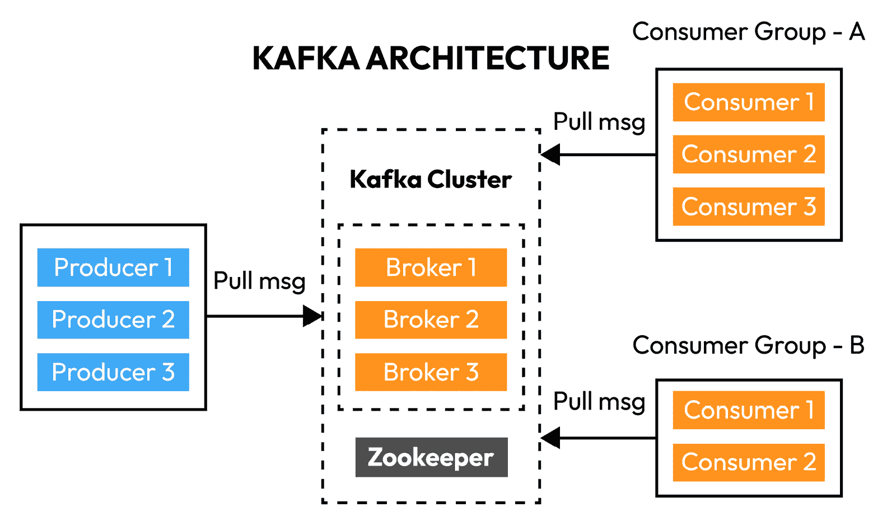
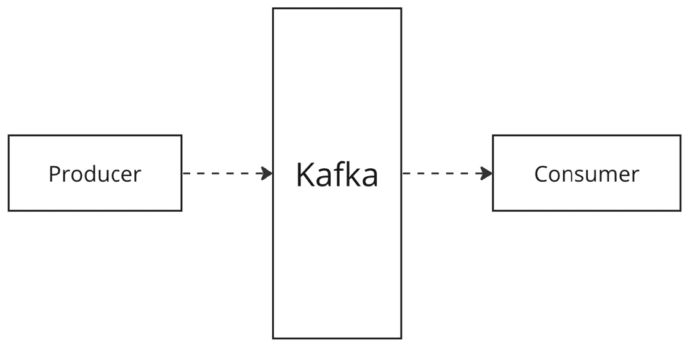
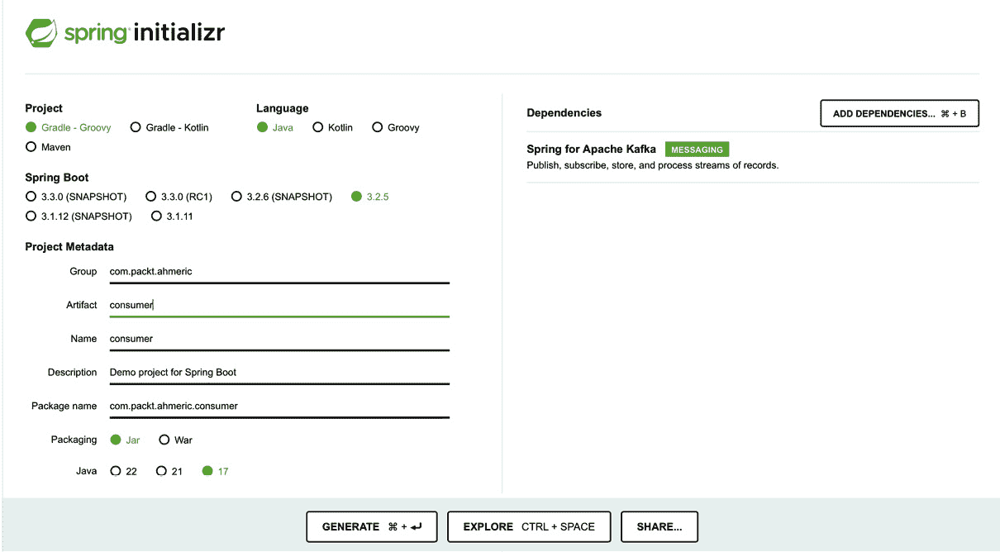
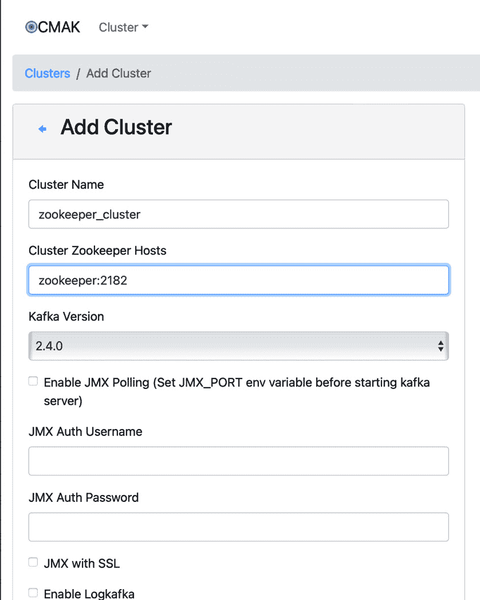
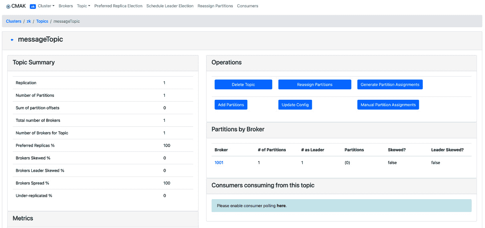

# 第八章：使用 Kafka 探索事件驱动系统

在本章中，我们将深入探讨使用 Kafka 和 Spring Boot 创建事件驱动系统的机制。在这里，我们将发现如何使用 Docker 在您的计算机上配置 Kafka 和 ZooKeeper，为开发能够通过事件无缝通信的微服务奠定基础。您将获得实际操作经验，构建两个 Spring Boot 应用程序：一个用于生成事件，另一个用于消费事件，模拟消息框架中的发送者和接收者的功能。

本章的最终目标是让您掌握设计、部署和监控利用 Kafka 功能并结合 Spring Boot 简单性的 **事件驱动架构**（**EDA**）的技能。这些知识对于您在本书旅程中的进步并非至关重要，但在现实世界中，可扩展和响应性系统不仅受到青睐，而且被视为期望。

掌握这些原则和工具对于创建能够适应、可扩展并能满足当代软件环境不断变化需求的程序至关重要。在本章结束时，您将在本地机器上拥有一个事件驱动设置，这将增强您处理更复杂系统的信心。

以下是该章节的主要主题，您将进行探索：

+   事件驱动架构简介

+   在本地开发中设置 Kafka 和 ZooKeeper

+   使用 Spring Boot 消息构建事件驱动应用程序

+   监控事件驱动系统

# 技术要求

对于本章，我们需要在我们的本地机器上配置一些设置：

+   **Java 开发工具包 17**（**JDK 17**）

+   一个现代 **集成开发环境**（**IDE**）；我推荐 IntelliJ IDEA

+   您可以从以下 GitHub 仓库克隆与*第八章*相关的所有仓库：[`github.com/PacktPublishing/Mastering-Spring-Boot-3.0/`](https://github.com/PacktPublishing/Mastering-Spring-Boot-3.0/)

+   Docker Desktop

# 事件驱动架构简介

**事件驱动架构**，也称为 **EDA**，是一种在软件开发中广泛使用的架构方法。它更侧重于根据事件触发动作，而不是遵循严格的步骤流程。在 EDA 中，当发生特定事件时，系统会迅速做出反应，执行相应的动作或一系列动作。这种方法与依赖于请求-响应模式的其他模型不同，它提供了一个更动态和实时的系统行为。

在我们这个数据不断生成和更新的时代，EDA 具有重要意义。能够迅速响应变化的能力在这样的快节奏环境中是无价的。与传统的系统相比，EDA 使企业能够迅速抓住机会和应对挑战。这种敏捷性在金融、实时分析、**物联网**（**IoT**）和其他快速变化频繁、信息时效性重要的领域尤为重要。

转向 EDA 可以显著改变公司的运作方式，带来以下好处：

+   **响应性**：通过实时处理事件，事件驱动系统提供即时的反馈或行动，这对于时间敏感的任务至关重要。

+   **可扩展性**：事件驱动的设置可以在不造成处理延迟的情况下管理大量事件。这种可扩展性对于处理数据量不断增加和复杂性的企业来说非常重要。

+   **灵活性**：由于 EDA 中的组件松散连接，它们可以独立更新或替换，而不会影响系统。这种灵活性使得升级和功能的集成更加简单。

+   **效率**：通过减少通过轮询或查询检查新数据的需求，可以降低资源消耗，从而提高整体系统效率。

+   **增强的用户体验**：在需要实时信息的应用中，如游戏和实时更新，EDA 有助于提供动态的用户体验。

这些优势突显了为什么许多组织正在转向 EDA 以满足现代技术挑战的需求。

在 EDA 中，我们需要一个**消息代理**。消息代理帮助我们分发组件之间的消息。在本章中，我们将使用 Apache Kafka 作为消息代理。Kafka 是一个开源的流处理平台。它最初由 LinkedIn 开发，后来捐赠给了 Apache 软件基金会。Kafka 主要作为一个高效的、擅长处理大量数据的消息代理。

其设计特性促进了持久消息存储和高效的事件处理，以实现有效的 EDA 实现。这个平台允许分布式数据流及时被消费，使其成为需要广泛数据处理和传输能力的应用的理想解决方案。

使用 Kafka，开发者可以在事件驱动系统的组件之间无缝传输数据，确保即使在复杂的交易场景中也能保持事件完整性和顺序。这一特性使 Kafka 成为许多现代高性能应用架构中的组件，这些应用依赖于实时数据处理。

既然我们已经了解了 EDA 的含义及其带来的好处，以及理解了 Kafka 在此类系统中的作用，我们将通过在 Docker 上设置 Kafka 的过程。这种设置创建了一个受控且可重复的环境，用于探索 Kafka 在 EDA 中的功能。我们的目标是为你提供部署 Kafka 的工具和知识，使你能够利用实时数据处理在项目中的潜力。

通过掌握使用 Docker 部署 Kafka 的技能，你将获得理解和管理事件驱动系统复杂性的必要经验。这种动手实践方法不仅加强了理论概念，而且使你能够有效地处理现实世界中的应用。

# 为本地开发设置 Kafka 和 ZooKeeper

**Kafka** 在事件驱动系统中扮演着角色，促进不同组件之间的顺畅通信。它使服务能够通过消息交换进行通信，就像人们使用即时通讯应用保持联系一样。这种架构通过允许系统的各个部分独立运行并迅速响应事件，促进了可扩展应用程序的开发。我们还将更详细地提及 Kafka 以及其在 *理解 Kafka 代理及其在事件驱动系统中的作用* 部分中的作用。

然而，Kafka 并不单独工作；它与 **ZooKeeper** 协作，ZooKeeper 作为其监管者。ZooKeeper 监控 Kafka 的代理以确保它们正常运行。把它想象成一个协调员，分配任务并确保操作。ZooKeeper 对于管理在高峰负载期间维持 Kafka 的稳定性和可靠性的后台进程至关重要。

在讨论了我们需要组件之后，我还会提到安装。我们将使用 Docker，就像我们在前面的章节中所做的那样。Docker 简化了 Kafka 和 ZooKeeper 在你机器上的设置。它提供了一个易于启动的便携式配置版本，你可以在需要时轻松启动，无需麻烦。

这种设置 Kafka 和 ZooKeeper 的方法不仅是为了方便；它还关乎确保你可以在不担心复杂的安装程序或设置之间的差异的情况下探索、创建和测试你的事件驱动系统。当我们深入研究使用 Docker 设置 Kafka 和 ZooKeeper 的步骤时，请记住，这构成了基础。你正在为应用程序建立一个适应性强的基础设施——这将促进有效的通信和无缝的可扩展性。让我们继续前进，为你的本地开发环境准备 EDA。

## 理解 Kafka 代理及其在事件驱动系统中的作用

在不断变化的 EDA 世界中，**Kafka 代理**作为高效的枢纽，精心管理消息的接收、路由和交付到指定的目的地。在 Kafka 生态系统中，Kafka 代理作为一组协同工作以监控消息流量的代理的一部分发挥作用。简单来说，想象这些代理就像勤奋的邮递员，处理生产者的消息并将它们组织成类似特定邮箱或地址的主题。这些主题可以分成多个分区，以促进可扩展的消息处理。

让我们看看在*图 8.1*中 Kafka 集群是如何工作的。



图 8.1：Kafka 集群架构

在这个图中，你可以看到 Kafka 如何组织其工作流程。生产者是向 Kafka 系统发送数据的来源。它们将消息推送到 Kafka 集群，该集群由多个代理（**代理 1**、**代理 2**和**代理 3**）组成。这些代理存储消息并使其可供消费。ZooKeeper 作为该集群的管理者，跟踪代理的状态并执行其他协调任务。消费者组，标记为**Group-A**和**Group-B**，根据需要从代理中拉取消息。

Kafka 代理的真正魔法在于它们在管理这些主题分区方面的熟练程度。当一条消息到达时，代理根据其重要性等级等标准确定将其放置在分区内的位置。这种方法确保了消息的分布，并在一个分区中将相似的消息（具有共同属性的）分组。这种分区过程对于分配工作负载至关重要，并使消费者应用程序能够并发处理消息，从而实现更高效的数据处理。

此外，Kafka 代理的另一个关键功能是确保 Kafka 系统中的消息重复，以防代理故障导致数据丢失。这种重复过程通过在不同代理之间创建分区副本作为安全措施。如果一个代理离线，另一个可以介入，平滑地保持系统的强大和灵活。

代理擅长存储和为消费者提供消息。他们使用偏移量来跟踪消费者已读取的消息，使消费者能够从消息流中上次离开的地方继续读取。这确保了每条消息都被处理，并给消费者提供了按自己的节奏管理消息的灵活性。

Kafka 集群中由代理监督的消息编排是一个结合了效率和可靠性的过程。由代理执行的这种复杂协调使得事件驱动系统能够高效运行，精确地管理大量数据。通过利用 Kafka 代理的功能，开发者可以创建不仅可扩展和弹性好，而且能够快速、准确地处理消息以满足当今快节奏数字景观需求的系统。

随着我们进一步探索设置和使用 Kafka 的方面，代理作为可靠和高效消息分发基础的作用变得越来越明显。它们处理和引导消息的能力是任何事件驱动架构（EDA）的核心，确保信息能够准时准确地送达目的地。

## 使用 Docker 运行 Kafka 和 ZooKeeper

通过 Docker 在您的计算机上运行 Kafka 和 ZooKeeper，对于开发者来说可能是一个颠覆性的改变。它将曾经繁琐的设置过程简化为简单易操作的过程。Docker 容器作为可携带的空间，可以迅速启动、停止和删除，非常适合开发和测试目的。这种安排使您能够在机器上重新创建生产级环境，而无需设置或专用硬件。

由于我们在几乎所有前面的章节中都使用了 Docker Compose，您将熟悉它。我们将使用 Docker Compose 通过单个命令运行这两个服务。以下是一个简单的`docker-compose.yml`文件示例，用于设置 Kafka 和 ZooKeeper：

```java
version: '2'
services:
  zookeeper:
    image: zookeeper
    ports:
      - "2181:2181"
    networks:
      - kafka-network
  kafka:
    image: confluentinc/cp-kafka
    depends_on:
      - zookeeper
    ports:
      - "9092:9092"
    environment:
      KAFKA_ZOOKEEPER_CONNECT: zookeeper:2181
      KAFKA_ADVERTISED_LISTENERS: PLAINTEXT://localhost:9092
      KAFKA_OFFSETS_TOPIC_REPLICATION_FACTOR: 1
    networks:
      - kafka-network
networks:
  kafka-network:
    driver: bridge
```

`docker-compose.yml`文件就像一个食谱，告诉 Docker 如何运行您的 Kafka 和 ZooKeeper 容器。它告诉 Docker 使用哪些镜像，容器如何在网络上相互通信，哪些端口需要打开，以及需要设置哪些环境变量。在这个文件中，我们告诉 Docker 在端口`2181`上运行 ZooKeeper，在端口`9092`上运行 Kafka。使用这个文件，我们简化了整个过程，使其像按按钮一样简单，以启动您的设置。这是一个出色的开发者工具，减少了手动步骤，让您专注于有趣的部分——构建和实验您的事件驱动应用程序。

将此文件保存为`docker-compose.yml`，并使用以下命令运行：

```java
docker-compose up -d
```

此命令拉取必要的 Docker 镜像，创建容器，并以分离模式启动 Kafka 和 ZooKeeper，使它们在后台运行。

通过遵循这些步骤，您已经为您的应用程序搭建了一个强大、可扩展的消息骨干，以便在此基础上构建。这个基础不仅支持事件驱动系统的开发，还为在受控的本地环境中实验 Kafka 的强大功能铺平了道路。

完成我们对使用 Docker 配置 Kafka 的探索后，很明显，这种组合消除了在您的计算机上运行 Kafka 的障碍。Docker 的容器魔法将可能是一项繁重的工作转变为一个简单的过程，让您能够更多地关注应用程序开发的创造性方面，而不是陷入设置的复杂性中。这种简化的设置不仅关乎便利，还关乎技术民主化和管理的简化，赋予开发者无需处理过于复杂的配置即可进行实验和创新 EDA 的能力。

随着我们从设置 Kafka 和 ZooKeeper 的方面转向探索使用 Spring Boot 消息构建事件驱动应用程序的激动人心领域，我们正从基础设施建设的基石转向应用程序设计的艺术。在本节中，您将亲身体验到您的 Kafka 设置如何赋予您力量，因为我们将引导您创建使用 Spring Boot 生成和消费消息的应用程序。这正是抽象概念转化为创造的地方，让您能够充分利用事件驱动系统的功能。

# 使用 Spring Boot 消息构建事件驱动应用程序

使用 Spring Boot 构建事件驱动应用程序涉及构建一个响应迅速、可扩展并能处理现代软件需求复杂性的系统。本质上，事件驱动应用程序响应的事件范围从用户交互到外部系统的消息。这种方法使您的应用程序组件能够独立交互和操作，从而提高灵活性和效率。由于 Spring Boot 的约定优于配置的哲学以及它从一开始就提供的工具集，使用 Spring Boot 设置此类应用程序变得更加容易。

在整个旅程中，我们将通过介绍两个 Spring Boot 项目来采取动手实践的方法——一个将专注于生成事件，另一个将专注于消费它们。这种分离反映了现实生活中的场景，其中生产者和消费者通常位于系统或微服务中，突出了当代应用程序的去中心化特性。通过参与这些项目，您将获得配置用于发送消息的生产者和用于响应这些消息的消费者在 Spring Boot 和 Kafka 上下文中的经验。这种方法不仅加强了您对事件驱动系统的理解，还为您创建和改进可扩展的应用程序提供了所需的资源。

随着我们继续前进，我们将深入了解创建 Kafka 集成的 Spring Boot 项目的细节。这将为我们的事件驱动应用程序奠定基础，引导您通过配置 Spring Boot 项目使用 Kafka 发送和接收消息的过程。您将了解启动实现所需的设置、库和初始代码结构。在这里，我们的理论想法将转化为可执行代码。所以，让我们开始这段旅程，用 Spring Boot 和 Kafka 开发强大的交互式应用程序。

## 创建用于 Kafka 集成的 Spring Boot 项目

在 Spring Boot 中启动一个专门针对 Kafka 集成的项目是解锁事件驱动应用程序功能的具体步骤。这一步骤结合了 Spring Boot 的便捷性和适应性以及 Kafka 的消息功能，使开发者能够创建可扩展和敏捷的应用程序。通过这次集成，我们正在建立一个基础，它有助于在分布式环境中进行通信和管理大量数据和操作。目标是建立一个框架，该框架不仅满足消息生产和消费需求，而且随着应用程序的发展能够无缝扩展。

我们需要两个不同的项目来演示消费者和生成者。因此，您需要重复执行相同的步骤两次来创建这两个项目。但在 *步骤 2* 中输入项目元数据时，最好选择不同的名称。

在 *图 8.2* 中，我们可以看到我们的应用程序将如何相互通信。



图 8.2：我们的应用程序如何相互通信

如您在 *图 8.2* 中所见，生产者应用程序和消费者应用程序之间没有直接的调用。生产者应用程序向 Kafka 发送消息，Kafka 将此消息发布给消费者应用程序。

这里是创建 Spring Boot 项目的分步指南：

1.  导航到 Spring Initializr ([`start.spring.io/`](https://start.spring.io/)) 以启动您的项目。这是一个在线工具，允许您快速生成带有所选依赖项的 Spring Boot 项目。

1.  输入您项目的元数据，例如 **组**、**工件**和**描述**。为消费者和生成者项目提供不同的名称。根据您的偏好选择 **Maven** 或 **Gradle** 作为构建工具。在我们的示例中，我们将使用 **Gradle**。

1.  选择您的依赖项。对于 Kafka 项目，您需要为生产者项目添加 `Spring Web`。这个依赖项包括将 Kafka 与 Spring Boot 集成的必要库。

1.  生成项目。一旦您填写了所有详细信息并选择了依赖项，请点击 **生成** 下载您的项目模板。

    在**图 8.3**中，我们可以看到我们需要哪些依赖项以及如何配置 Spring Initializr。



图 8.3：Spring Initializr 的截图

1.  提取下载的 ZIP 文件，并在您最喜欢的 IDE 中打开项目，例如 IntelliJ IDEA、Eclipse 或 VS Code。

1.  使用以下行更新`application.properties`文件。为消费者和发布者项目使用不同的端口：

    ```java
    server.port:8181
    ```

当将 Kafka 与 Spring Boot 项目集成时，一个关键组件是**Spring Kafka**，这是由 Spring Initializr 作为 Apache Kafka 的 Spring 版本添加的。这个库通过提供用户抽象简化了基于 Kafka 的消息解决方案的处理。它简化了在 Spring Boot 应用和 Kafka 代理之间发送和接收消息的过程。通过抽象生产者和消费者配置的复杂性，它使您能够专注于实现业务逻辑，而不是处理消息处理的重性代码。

在配置好 Spring Boot 项目并放置了必要的 Kafka 集成依赖项后，您现在可以深入了解生产和消费消息的细节。这个设置是探索通信和 EDAs 的起点，为在应用中管理数据流提供了一种有效的方法。

进入下一小节构建生产者应用标志着从设置到实现的转变。在这里，我们将指导您在 Spring Boot 项目中设置 Kafka 生产者。这是您所有基础工作开始成形的地方，让您能够向 Kafka 主题发送消息，并启动任何事件驱动系统的通信过程。准备好将理论转化为实践，并见证您的应用如何与 Kafka 交互。

## 构建生产者应用

创建生产者应用就像在基于事件框架内建立一个广播中心，您的 Spring Boot 设置已经准备好向世界——或者更确切地说，向 Kafka 主题——发送消息。这一阶段非常重要，因为它标志着系统内信息流的开始，确保数据在正确的时间到达预定的目的地。

在 Spring Boot 中创建 Kafka 生产者涉及几个简单的步骤。首先，您需要配置您的应用以连接到 Kafka。这是在您的生产者 Spring Boot 项目的`application.properties`文件中完成的。您将指定有关 Kafka 服务器地址和您想要发送消息的默认主题的详细信息。

这是我们如何在 Spring Boot 应用中实现 Kafka 生产者的方式：

```java
@RestController
public class EventProducerController {
    private final KafkaTemplate<String, String> kafkaTemplate;
    @Autowired
    public EventProducerController(KafkaTemplate<String, String> kafkaTemplate) {
        this.kafkaTemplate = kafkaTemplate;
    }
    @GetMapping("/message/{message}")
    public String trigger(@PathVariable String message) {
        kafkaTemplate.send("messageTopic", message);
        return "Hello, Your message has been published: " + message;
    }
}
```

在此代码中，`KafkaTemplate`是一个 Spring 提供的类，它简化了向 Kafka 主题发送消息的过程。我们将此模板注入到`MessageProducer`服务中，并使用其`send`方法发布消息。`send`方法接受两个参数——主题的名称和消息本身。

为了确保您的生产者应用程序能够成功地向 Kafka 发送消息，您需要在`application.properties`文件中添加一些配置：

```java
spring.kafka.bootstrap-servers=localhost:9092
spring.kafka.producer.key-serializer=org.apache.kafka.common.serialization.StringSerializer
spring.kafka.producer.value-serializer=org.apache.kafka.common.serialization.StringSerializer
```

这些配置帮助 Spring Boot 识别您的 Kafka 服务器位置（引导服务器）以及如何将消息转换为通过网络传输的格式（键序列化和值序列化）。序列化涉及将您的消息（在这种情况下，是一个字符串）转换为可以在网络上传输的格式。

通过设置和配置您的 Kafka 生产者，您已经朝着开发事件驱动应用程序迈出一步。此配置允许您的应用程序通过发送其他系统部分可以响应和处理的消息，在分布式系统中发起对话。

接下来，让我们将注意力转向这种交互的对应物：构建消费者应用程序。这包括创建监听器，以预测和响应由我们的生产者发送的消息。它在我们的 EDA 内部关闭通信循环中发挥作用，将我们的系统转变为一个能够对实时数据进行响应的动态服务网络。让我们继续我们的探索，揭示我们如何释放事件驱动应用程序的潜力。

## 构建消费者应用程序

一旦我们使用生产者应用程序设置了广播站，就是时候通过开发消费者应用程序调整到正确的频率。这一步骤确保生产者发送的消息不会在太空中丢失，而是真正被接收、理解并付诸行动。在我们的事件驱动结构中，消费者应用程序就像人群中捕捉到针对它的信号并相应处理的听众。通过将 Kafka 消费者集成到 Spring Boot 应用程序中，我们建立了一个渴望等待消息并准备好在消息到来时立即处理它们的元素。这种能力在创建真正交互式并能实时迅速响应变化和事件的系统中发挥作用。

在 Spring Boot 中设置 Kafka 消费者之前，您首先需要配置应用程序以监听感兴趣的 Kafka 主题。这涉及到在`application.properties`文件中指定您的 Kafka 服务器位置以及应用程序应订阅哪些主题。

下面是如何在我们的 Spring Boot 应用程序中实现 Kafka 消费者的方法：

```java
import org.springframework.kafka.annotation.KafkaListener;
import org.springframework.stereotype.Component;
@Component
public class MessageConsumer {
    @KafkaListener(topics = "messageTopic", groupId = "consumer_1_id")
    public void listen(String message) {
        System.out.println("Received message: " + message);
    }
}
```

在这个片段中，`@KafkaListener`注解将`listen`方法标记为`messageTopic`上的消息监听器。`groupId`由 Kafka 用于将消费者分组，这些消费者应被视为一个单一单元。这种设置允许您的应用程序自动从指定的主题中获取并处理消息。

为了确保您的消费者应用程序高效地消费消息，请将以下配置添加到您的`application.properties`文件中：

```java
spring.kafka.bootstrap-servers=localhost:9092
spring.kafka.consumer.group-id= consumer_1_id
spring.kafka.consumer.auto-offset-reset=earliest
spring.kafka.consumer.key-deserializer=org.apache.kafka.common.serialization.StringDeserializer
spring.kafka.consumer.value-deserializer=org.apache.kafka.common.serialization.StringDeserializer
```

这些配置确保您的用户连接到 Kafka 服务器（引导服务器）并正确解码它接收到的消息（键反序列化和值反序列化）。`auto-offset-reset` 选项指导 Kafka 在您的用户组没有偏移量时从何处开始读取消息；将其设置为 `earliest`，我们的应用程序将开始从事件主题的开始消费。

一旦您的消费者应用程序处于活动状态，您的事件驱动系统现在完全运行，能够通过 Kafka 消息管道发送和接收消息。这种双向通信框架为可扩展的应用程序奠定了基础，这些应用程序可以处理实时数据流并迅速对事件做出响应。

展望未来，下一个关键步骤涉及测试生产者和消费者应用程序以确保它们的集成。这一阶段将理论与实践相结合，让您见证您努力的成果。测试不仅用于验证单个组件的功能，还用于验证系统的整体响应性和效率。让我们通过在我们的事件驱动应用程序上启动测试来前进，确保它们准备好应对可能出现的任何挑战。

## 测试整个堆栈 – 使您的事件驱动架构变为现实

在使用 Kafka、Spring Boot 和 Docker 配置我们的基于事件的系统后，我们达到了一个关键的时刻，即测试整个设置以见证我们的系统运行。这一关键阶段确认了我们的各个元素，即生产者和消费者应用程序，已正确设置并按预期进行通信，同时确保由 Docker 管理的 Kafka 有效地在它们之间传输消息。这一测试阶段标志着我们工作的完成，使我们能够直接观察作为任何事件驱动系统核心的消息动态交换。

这里是运行整个堆栈的说明：

1.  定义 Kafka 和 ZooKeeper 服务并运行以下 `docker-compose.yml` 文件：

    ```java
    8282. This can be configured in the application.properties file with the following line:

    ```

    server.port=8282

    ```java

    Start the application through your IDE or by running `./gradlew bootRun` in the terminal within the project directory.
    ```

1.  通过在 `application.properties` 文件中设置 `8181`：

    ```java
    server.port=8181
    ```

    使用您的 IDE 或与生产者相同的 `Gradle` 命令来启动消费者应用程序。

1.  向生产者的消息触发端点发送 `GET` 请求：

    ```java
    http://localhost:8282/message/hello-world
    ```

    将 `hello-world` 替换为您希望发送的消息的任何字符串。触发几个不同的消息以测试各种场景。

1.  **观察消费者的日志**：切换到您的消费者应用程序的控制台或日志输出。您应该看到随着消费而记录的消息，表明从生产者通过 Kafka 到消费者的通信成功。输出将如下所示：

    ```java
    Received message: hello-world
    Received message: hello-world-2
    Received message: hello-world-3
    ```

成功运行测试栈并观察通过 Kafka 从生产者到消费者的消息流是一种宝贵的经验，因为它展示了事件驱动架构（EDA）的强大和灵活性。这种动手测试不仅增加了你对将 Kafka 与 Spring Boot 应用程序集成的理解，还强调了在分布式系统中无缝通信的重要性。正如你所看到的，Docker 在简化开发和测试环境的设置中扮演着关键角色。经过这次实践经验，你将准备好深入研究复杂和可扩展的事件驱动应用程序，这在现代软件开发中是必需的。

现在，我们手头有一个功能齐全的事件驱动应用程序，是时候向前看了。下一步是确保我们的应用程序不仅在各种条件下运行，而且能够成功。这意味着深入监控——这是任何应用程序生命周期中的关键组成部分。在接下来的部分，我们将探讨如何密切关注应用程序的性能，以及如何迅速解决出现的任何问题。这些知识不仅有助于维护应用程序的健康，还有助于优化其效率和可靠性。因此，让我们继续前进，自信地应对这些新的挑战。

# 监控事件驱动系统

在事件驱动系统的动态世界中，应用程序通过持续的流量进行通信，监控在确保一切顺利运行中扮演着关键角色。正如繁忙的机场需要空中交通管制来确保飞机安全高效地移动一样，事件驱动架构（EDA）依赖于监控来维护其组件的健康和性能。这种监督对于在问题发生时及时发现和理解系统在各种负载和条件下的整体行为至关重要。它使开发者和运维团队能够做出明智的决策，优化性能，并在问题影响用户之前预防问题。

对于使用 Kafka 和 Spring Boot 构建的应用，一套强大的监控工具和技术对于监控系统的脉搏至关重要。在核心上，Kafka 被设计来处理大量数据，因此监控如消息吞吐量、代理健康和消费者延迟等特性变得至关重要。Apache Kafka 的 JMX 指标和像 Prometheus 和 Grafana 这样的外部工具提供了对 Kafka 性能的深入洞察。这些工具可以追踪从正在处理的消息数量到消息穿越系统所需时间的所有方面。

如同在*第七章*的[*“Spring Boot Actuator with Prometheus and Grafana”*](https://wiki.example.org/spring_boot_actuator_with_prometheus_and_grafana)部分已经涵盖了 Spring Boot 应用的监控，这里将不再重复。本节我们将专注于 Kafka 的监控。

## 监控你的 Kafka 基础设施

监控 Kafka 设置就像使用工具来仔细检查你的事件驱动系统的核心功能。这全部关乎了解你的 Kafka 环境运行状况，这对于识别问题、优化资源使用以及确保消息及时可靠地传递至关重要。鉴于 Kafka 在管理数据流和事件处理中的作用，任何问题或低效都可能影响整个系统。因此，建立监控系统不仅是有帮助的，而且是维护强大高效架构的必要条件。

这里是 Kafka 中需要监控的关键指标：

+   **代理指标**：这些包括集群中活跃代理的数量及其健康状况。监控每个代理的 CPU、内存使用和磁盘 I/O 帮助识别资源瓶颈。

+   **主题指标**：这里的重要指标包括消息输入率、消息输出率和主题大小。关注这些指标有助于理解数据流并发现任何异常模式。

+   **消费者指标**：消费者延迟，表示消费者组在处理消息方面落后多少，对于确保数据及时处理至关重要。此外，监控活跃消费者的数量有助于检测消费者可扩展性和性能问题。

+   **生产者指标**：监控生产消息的速率以及错误率，可以突出显示数据生成或提交到 Kafka 主题中的问题。

我们将使用 Kafka Manager（现称为 **CMAK**，或 **Apache Kafka 集群管理器**）来监控我们的 Kafka 服务器。在包含 Kafka 和 ZooKeeper 设置的同一 Docker Compose 文件中运行 CMAK，便于本地管理和监控 Kafka 集群。

## 使用 CMAK 监控 Kafka 服务器

以下是您如何在 Docker Compose 设置中包含 CMAK 并在本地机器上运行它的方法：

1.  要在现有的 Docker Compose 设置中包含 CMAK，您需要为其添加一个新的服务定义。打开您的 `docker-compose.yml` 文件，并附加以下服务定义：

    ```java
      kafka-manager:
        image: hlebalbau/kafka-manager:latest
        depends_on:
          - zookeeper
          - kafka
        ports:
          - "9000:9000"
        environment:
          ZK_HOSTS: zookeeper:2181
        networks:
          - kafka-network
    ```

    我们已经在 `docker-compose.yml` 文件中简单地引入了 `kafka-manager` 镜像——CMAK 依赖于 ZooKeeper 和 Kafka，因为它需要监控它们的性能，并且它将在端口 `9000` 上提供服务。

1.  更新了 `docker-compose.yml` 文件后，通过在包含 Docker Compose 文件的目录中的终端运行以下命令来启动服务：

    ```java
    -d flag runs them in detached mode, so they’ll run in the background.
    ```

1.  一旦所有服务都启动并运行，打开网页浏览器并访问 `http://localhost:9000`。你应该会看到 Kafka Manager（CMAK）界面。

    要使用 Kafka Manager 开始监控 Kafka 集群，您需要将您的集群添加到 Kafka Manager UI 中。

1.  点击 **添加** **集群** 按钮。

1.  填写集群信息。如果您在本地运行一切，请使用`zookeeper:2181`，并使用 Docker Compose 文件中的默认 ZooKeeper 设置。请注意，由于 Kafka Manager 运行在由 Docker Compose 创建的同一 Docker 网络中，它可以直接解析 ZooKeeper 主机名。

    在**图 8.4**中，我们可以看到如何通过使用 Kafka Manager 的**添加集群**界面来填写表格。



图 8.4：Kafka Manager 应用程序中添加集群屏幕的截图

1.  保存您的集群配置。

现在您的 Kafka 集群已添加到 Kafka Manager 中，您可以探索各种指标和配置，例如主题创建、主题列表和消费者组。



图 8.5：我们的主题的 Kafka Manager 屏幕

在**图 8.5**中，您可以看到 CMAK 仪表板的截图，该仪表板提供了关于名为`messageTopic`的特定 Kafka 主题的信息。仪表板提供了一个概述，包括主题的复制因子、分区数量以及表示主题中总消息数的分区偏移总和的详细信息。此外，它还提供了管理主题的控件，例如删除主题、添加分区或修改主题配置的选项。仪表板还展示了分区如何在代理之间分布的见解，包括**首选副本百分比**等指标，并标记任何倾斜或低副本分区，这对于诊断和维护 Kafka 集群中的最佳健康和平衡至关重要。

这种设置使您能够轻松地本地管理和监控您的 Kafka 集群，提供了一个强大的界面来处理 Kafka 配置和观察集群性能。

实施涵盖这些关键指标的监控策略，并利用 Kafka Manager 等工具，可以帮助您更好地理解您的 Kafka 基础设施。这不仅有助于主动维护和优化，还能让您准备好迅速有效地应对任何出现的问题。

简而言之，有效地监控 Kafka 对于事件驱动系统至关重要。关注关键指标，如代理健康、分区平衡、消息流和消费者延迟非常重要。CMAK、Prometheus 和 Grafana 等工具不仅简化了这些任务，还提供了深入可见性和分析，将原始数据转化为可操作的见解。通过监控，可以在问题成为大问题之前发现并解决，确保 Kafka 消息管道的平稳运行。

一个被监控的事件驱动系统能够处理现代数据流和负载需求的复杂性。它确保系统的每个部分都能可靠地运行，保持今天应用程序所需的性能。最终，系统的强大之处在于关注运营细节——在这里，监控不仅仅是一项常规工作，而是系统健康和长寿的一个关键方面。

# 摘要

随着本章的结束，让我们花一点时间回顾一下我们共同走过的旅程。我们深入到 Kafka 和 Spring Boot 的世界，组装起我们事件驱动系统的每一块。以下是我们的成就：

+   **设置 Kafka 和 ZooKeeper**：我们使用 Docker 在我们的本地机器上设置了 Kafka 和 ZooKeeper，为我们的消息系统创建了一个强大的骨干。

+   **构建 Spring Boot 应用程序**：我们从零开始构建了两个 Spring Boot 应用程序，一个作为事件生产者，另一个作为消费者，学习了它们如何协同工作形成一个响应式的 EDA。

+   **监控 Kafka 基础设施**：我们学习了监控 Kafka 基础设施的重要性，使用 CMAK 等工具密切关注系统的健康和性能。

本章探讨的见解不仅仅是理论上的；它们可以迅速转化为你在现实场景中可以立即利用的能力。这些能力对于确保你的系统运行并保持弹性至关重要，使它们能够敏捷地适应不断变化的数据景观。在当今快速发展的技术领域，设置、集成和管理系统的能力是不可或缺的。

通过继续与我们一同学习，你不仅获得了技能集的工具；你还改进了你的开发工作流程，使其更加流畅和高效。你还在增强应用程序的耐用性和可管理性，为竞争激烈的技术领域提供优势。

随着我们迈向下一章，我们将深入了解增强开发过程的 Spring Boot 高级功能。你将发现组织代码的面向方面编程的艺术，利用 Feign 客户端实现无缝的 HTTP API 集成，并利用 Spring Boot 复杂的自动配置功能。下一章的重点是简化作为开发者的任务，使它们更加高效和富有成效。让我们携手前进，进一步扩展我们的知识。
