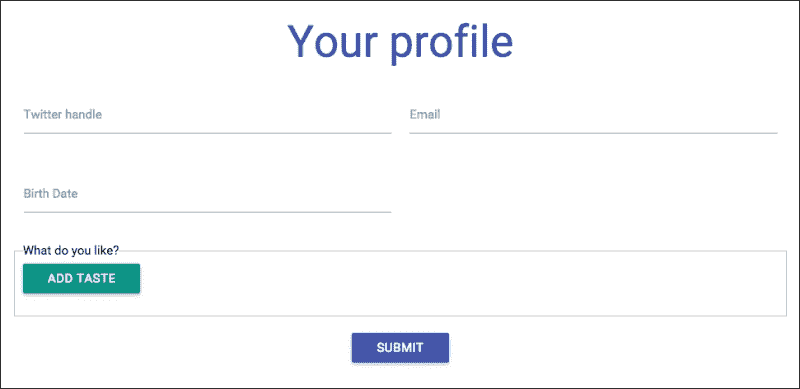
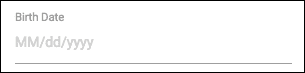
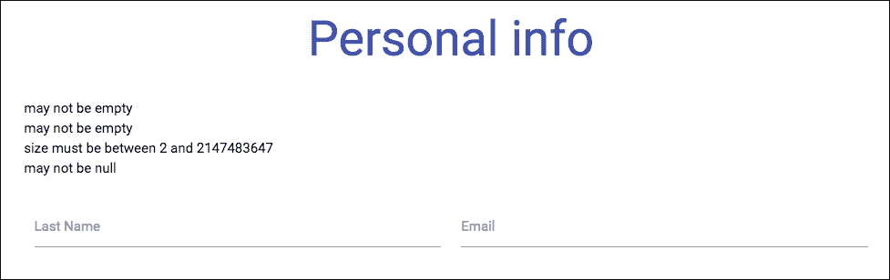
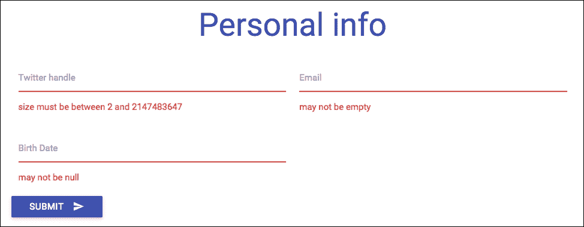
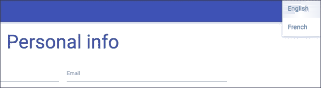
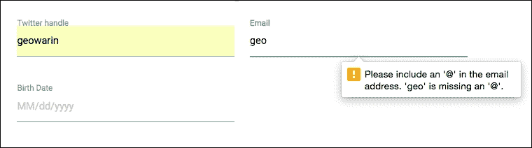
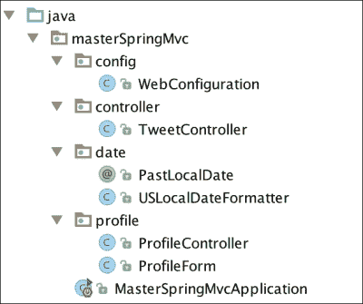
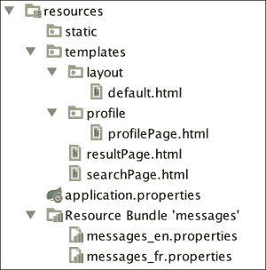

# 第三章：处理表单和复杂 URL 映射

我们的应用程序看起来很漂亮，但我们可以从更多关于我们用户的信息中受益。

我们可以要求他们提供他们感兴趣的领域。

在这一章中，我们将构建一个个人资料页面。它将具有服务器端和客户端验证以及个人照片的上传。我们将把信息保存到用户会话中，并确保我们的受众尽可能广泛，通过将应用程序翻译成多种语言。最后，我们将显示与用户口味匹配的 Twitter 活动的摘要。

听起来不错？让我们开始吧，我们有一些工作要做。

# 个人资料页面 – 一个表单

表单是每个 Web 应用的基石。它们一直是获取用户输入的主要方式，自从互联网开始以来就是如此！

我们在这里的第一个任务是创建一个像这样的个人资料页面：



它将允许用户输入一些个人信息以及一系列口味。然后，这些口味将被输入到我们的搜索引擎中。

让我们在 `templates/profile/profilePage.html` 中创建一个新页面：

```java
<!DOCTYPE html>
<html 

      layout:decorator="layout/default">
<head lang="en">
    <title>Your profile</title>
</head>
<body>
<div class="row" layout:fragment="content">

    <h2 class="indigo-text center">Personal info</h2>

    <form th:action="@{/profile}" method="post" class="col m8 s12 offset-m2">

        <div class="row">
            <div class="input-field col s6">
                <input id="twitterHandle" type="text"/>
                <label for="twitterHandle">Last Name</label>
            </div>
            <div class="input-field col s6">
                <input id="email" type="text"/>
                <label for="email">Email</label>
            </div>
        </div>
        <div class="row">
            <div class="input-field col s6">
                <input id="birthDate" type="text"/>
                <label for="birthDate">Birth Date</label>
            </div>
        </div>
        <div class="row s12">
            <button class="btn waves-effect waves-light" type="submit" name="save">Submit
                <i class="mdi-content-send right"></i>
            </button>
        </div>
    </form>
</div>
</body>
</html>
```

注意 `{@}` 语法，它将通过将服务器上下文路径（在我们的情况下，`localhost:8080`）添加到其参数之前来构建资源的完整路径。

我们还将在 `profile` 包中创建相关的控制器，命名为 `ProfileController`：

```java
package masterspringmvc4.profile;

import org.springframework.stereotype.Controller;
import org.springframework.web.bind.annotation.RequestMapping;

@Controller
public class ProfileController {

    @RequestMapping("/profile")
    public String displayProfile() {
        return "profile/profilePage";
    }
}
```

现在，你可以访问 `http://localhost:8080` 并看到一个美丽的表单，但它什么也不做。那是因为我们没有将任何操作映射到 POST URL。

让我们在与我们的控制器相同的包中创建一个**数据传输对象**（**DTO**）。我们将命名为 `ProfileForm`。它的作用是将我们的网页表单的字段映射并描述验证规则：

```java
package masterSpringMvc.profile;

import java.time.LocalDate;
import java.util.ArrayList;
import java.util.List;

public class ProfileForm {
    private String twitterHandle;
    private String email;
    private LocalDate birthDate;
    private List<String> tastes = new ArrayList<>();

    // getters and setters
}
```

这是一个普通的**普通旧 Java 对象**（**POJO**）。别忘了生成获取器和设置器，没有它们我们的数据绑定将无法正常工作。注意，我们有一个口味列表，我们现在不会填充，稍后才会。

由于我们使用的是 Java 8，用户的出生日期将使用新的 Java 日期时间 API（JSR 310）。这个 API 比旧的 `java.util.Date` API 好得多，因为它在人类日期的所有细微差别之间做出了强烈的区分，并使用流畅的 API 和不可变的数据结构。

在我们的例子中，`LocalDate` 类是一个没有与时间相关联的简单日期。它可以与表示一天中的时间的 `LocalTime` 类区分开来，或者表示两者的 `LocalDateTime` 类，或者使用时区的 `ZonedDateTime` 类。

### 注意

如果你想要了解更多关于 Java 8 日期时间 API 的信息，请参考 Oracle 教程，该教程可在 [`docs.oracle.com/javase/tutorial/datetime/TOC.html`](https://docs.oracle.com/javase/tutorial/datetime/TOC.html) 找到。

### 小贴士

好的建议是始终生成我们数据对象的 `toString` 方法，就像这个表单一样。这对于调试非常有用。

要指示 Spring 将我们的字段绑定到这个 DTO，我们必须在`profilePage`中添加一些元数据。

```java
<!DOCTYPE html>
<html 

      layout:decorator="layout/default">
<head lang="en">
    <title>Your profile</title>
</head>
<body>
<div class="row" layout:fragment="content">

    <h2 class="indigo-text center">Personal info</h2>

    <form th:action="@{/profile}" th:object="${profileForm}" method="post" class="col m8 s12 offset-m2">

        <div class="row">
            <div class="input-field col s6">
                <input th:field="${profileForm.twitterHandle}" id="twitterHandle" type="text"/>
                <label for="twitterHandle">Last Name</label>
            </div>
            <div class="input-field col s6">
                <input th:field="${profileForm.email}" id="email" type="text"/>
                <label for="email">Email</label>
            </div>
        </div>
        <div class="row">
            <div class="input-field col s6">
                <input th:field="${profileForm.birthDate}" id="birthDate" type="text"/>
                <label for="birthDate">Birth Date</label>
            </div>
        </div>
        <div class="row s12">
            <button class="btn waves-effect waves-light" type="submit" name="save">Submit
                <i class="mdi-content-send right"></i>
            </button>
        </div>
    </form>
</div>
</body>
</html>
```

您将注意到两点：

+   表单中的`th:object`属性

+   所有字段中的`th:field`属性

第一个将根据类型将对象绑定到控制器。第二个将实际字段绑定到我们的表单 Bean 属性。

为了使`th:object`字段生效，我们需要向我们的请求映射方法添加一个`ProfileForm`类型的参数：

```java
@Controller
public class ProfileController {

    @RequestMapping("/profile")
    public String displayProfile(ProfileForm profileForm) {
        return "profile/profilePage";
    }

    @RequestMapping(value = "/profile", method = RequestMethod.POST)
    public String saveProfile(ProfileForm profileForm) {
        System.out.println("save ok" + profileForm);
        return "redirect:/profile";
    }
}
```

我们还添加了一个映射，用于处理表单提交时的`POST`方法。在此阶段，如果您尝试提交包含日期（例如 1980/10/10）的表单，它将完全不起作用，并给您一个错误 400，没有有用的日志信息。

### 小贴士

**Spring Boot 中的日志记录**

使用 Spring Boot，日志配置非常简单。只需将`logging.level.{package} = DEBUG`添加到`application.properties`文件中，其中`{package}`是您的应用程序中某个类或包的完全限定名称。当然，您可以用任何您想要的日志级别替换 debug。您还可以添加经典的日志配置。有关更多信息，请参阅[`docs.spring.io/spring-boot/docs/current/reference/html/howto-logging.html`](http://docs.spring.io/spring-boot/docs/current/reference/html/howto-logging.html)。

我们需要稍微调试一下我们的应用程序来了解发生了什么。将以下行添加到您的文件`application.properties`中：

```java
logging.level.org.springframework.web=DEBUG
```

`org.springframework.web`包是 Spring MVC 的基础包。这将允许我们看到 Spring web 生成的调试信息。如果您再次提交表单，您将在日志中看到以下错误：

```java
Field error in object 'profileForm' on field 'birthDate': rejected value [10/10/1980]; codes [typeMismatch.profileForm.birthDate,typeMismatch.birthDate,typeMismatch.java.time.LocalDate,typeMismatch]; … nested exception is org.springframework.core.convert.ConversionFailedException: Failed to convert from type java.lang.String to type java.time.LocalDate for value '10/10/1980'; nested exception is java.time.format.DateTimeParseException: Text '10/10/1980' could not be parsed, unparsed text found at index 8]
```

要了解发生了什么，我们需要查看 Spring 的`DateTimeFormatterRegistrar`类。

在这个类中，您将看到针对 JSR 310 的六七种解析器和打印器。它们都将回退到短风格日期格式，如果您在美国，则是`MM/dd/yy`，否则是`dd/MM/yy`。

这将指示 Spring Boot 在应用程序启动时创建一个`DateFormatter`类。

在我们的情况下，我们需要做同样的事情并创建我们自己的格式化器，因为用两位数写年份有点尴尬。

Spring 中的`Formatter`是一个可以同时`打印`和`解析`对象的类。它将被用来从字符串解码和打印值。

我们将在`date`包中创建一个非常简单的格式化器，名为`USLocalDateFormatter`：

```java
public class USLocalDateFormatter implements Formatter<LocalDate> {
    public static final String US_PATTERN = "MM/dd/yyyy";
    public static final String NORMAL_PATTERN = "dd/MM/yyyy";

    @Override public LocalDate parse(String text, Locale locale) throws ParseException {
        return LocalDate.parse(text, DateTimeFormatter.ofPattern(getPattern(locale)));
    }

    @Override public String print(LocalDate object, Locale locale) {
        return DateTimeFormatter.ofPattern(getPattern(locale)).format(object);
    }

    public static String getPattern(Locale locale) {
        return isUnitedStates(locale) ? US_PATTERN : NORMAL_PATTERN;
    }

    private static boolean isUnitedStates(Locale locale) {
        return Locale.US.getCountry().equals(locale.getCountry());
    }
}
```

这个小类将允许我们根据用户的区域设置以更常见的格式（四位数的年份）解析日期。

让我们在`config`包中创建一个名为`WebConfiguration`的新类：

```java
package masterSpringMvc.config;

import masterSpringMvc.dates.USLocalDateFormatter;
import org.springframework.context.annotation.Configuration;
import org.springframework.format.FormatterRegistry;
import org.springframework.web.servlet.config.annotation.WebMvcConfigurerAdapter;

import java.time.LocalDate;

@Configuration
public class WebConfiguration extends WebMvcConfigurerAdapter {

    @Override public void addFormatters(FormatterRegistry registry) {
        registry.addFormatterForFieldType(LocalDate.class, new USLocalDateFormatter());
    }
}
```

这个类扩展了`WebMvcConfigurerAdapter`，这是一个非常方便的类，可以自定义 Spring MVC 配置。它提供了许多常见的扩展点，您可以通过重写方法（如`addFormatters()`方法）来访问。

这次，提交我们的表单不会产生任何错误，除非你没有使用正确的日期格式输入日期。

目前，用户无法看到他们应该以何种格式输入出生日期，所以让我们将此信息添加到表单中。

在`ProfileController`中，让我们添加一个`dateFormat`属性：

```java
@ModelAttribute("dateFormat")
public String localeFormat(Locale locale) {
    return USLocalDateFormatter.getPattern(locale);
}
```

`@ModelAttribute`注解将允许我们向网页公开一个属性，就像我们在上一章中看到的`model.addAttribute()`方法一样。

现在，我们可以通过向我们的日期字段添加占位符来在我们的页面上使用这些信息：

```java
<div class="row">
    <div class="input-field col s6">
        <input th:field="${profileForm.birthDate}" id="birthDate" type="text" th:placeholder="${dateFormat}"/>
        <label for="birthDate">Birth Date</label>
    </div>
</div>
```

现在，这些信息将显示给用户：



# 验证

我们不希望用户输入无效或空的信息，这就是为什么我们需要在我们的`ProfileForm`中添加一些验证逻辑。

```java
package masterspringmvc4.profile;

import org.hibernate.validator.constraints.Email;
import org.hibernate.validator.constraints.NotEmpty;

import javax.validation.constraints.NotNull;
import javax.validation.constraints.Past;
import javax.validation.constraints.Size;
import java.util.ArrayList;
import java.util.Date;
import java.util.List;

public class ProfileForm {
    @Size(min = 2)
    private String twitterHandle;

    @Email
    @NotEmpty
    private String email;

   @NotNull
    private Date birthDate;

    @NotEmpty
    private List<String> tastes = new ArrayList<>();
}
```

如你所见，我们添加了一些验证约束。这些注解来自 JSR-303 规范，该规范指定了 bean 验证。该规范的流行实现是`hibernate-validator`，它包含在 Spring Boot 中。

你可以看到我们使用了来自`javax.validation.constraints`包（在 API 中定义）的注解和一些来自`org.hibernate.validator.constraints`包（附加约束）的注解。两者都有效，我鼓励你查看`validation-api`和`hibernate-validator` jar 包中那些包中可用的内容。

你也可以查看 hibernate validator 文档中可用的约束，文档地址为[`docs.jboss.org/hibernate/stable/validator/reference/en-US/html_single/#section-builtin-constraints`](http://docs.jboss.org/hibernate/stable/validator/reference/en-US/html_single/#section-builtin-constraints)。

为了使验证工作，我们需要添加一些其他东西。首先，控制器需要表明它在表单提交时想要一个有效的模型。将`javax.validation.Valid`注解添加到表示表单的参数上就可以做到这一点：

```java
@RequestMapping(value = "/profile", method = RequestMethod.POST)
public String saveProfile(@Valid ProfileForm profileForm, BindingResult bindingResult) {
    if (bindingResult.hasErrors()) {
        return "profile/profilePage";
    }

    System.out.println("save ok" + profileForm);
    return "redirect:/profile";
}
```

注意，如果表单包含任何错误，我们不会重定向用户。这将允许我们在同一网页上显示它们。

说到这个，我们需要在网页上添加一个位置来显示那些错误。

在`profilePage.html`表单标签的开始处添加这些行：

```java
<ul th:if="${#fields.hasErrors('*')}" class="errorlist">
    <li th:each="err : ${#fields.errors('*')}" th:text="${err}">Input is incorrect</li>
</ul>
```

这将遍历表单中找到的每个错误，并以列表形式显示它们。如果你尝试提交一个空表单，你会看到一堆错误：



注意，对“口味”上的`@NotEmpty`检查将阻止表单提交。实际上，我们还没有提供它们的方法。

## 自定义验证消息

这些错误消息对我们用户来说还不够有用。我们首先需要做的是将它们正确地关联到它们各自的字段上。让我们修改`profilePage.html`：

```java
<!DOCTYPE html>
<html 

      layout:decorator="layout/default">
<head lang="en">
    <title>Your Profile</title>
</head>
<body>
<div class="row" layout:fragment="content">

    <h2 class="indigo-text center">Personal info</h2>

    <form th:action="@{/profile}" th:object="${profileForm}" method="post" class="col m8 s12 offset-m2">

        <div class="row">
            <div class="input-field col s6">
                <input th:field="${profileForm.twitterHandle}" id="twitterHandle" type="text" th:errorclass="invalid"/>
                <label for="twitterHandle">Twitter handle</label>

                <div th:errors="*{twitterHandle}" class="red-text">Error</div>
            </div>
            <div class="input-field col s6">
                <input th:field="${profileForm.email}" id="email" type="text" th:errorclass="invalid"/>
                <label for="email">Email</label>

                <div th:errors="*{email}" class="red-text">Error</div>
            </div>
        </div>
        <div class="row">
            <div class="input-field col s6">
                <input th:field="${profileForm.birthDate}" id="birthDate" type="text" th:errorclass="invalid" th:placeholder="${dateFormat}"/>
                <label for="birthDate">Birth Date</label>

                <div th:errors="*{birthDate}" class="red-text">Error</div>
            </div>
        </div>
        <div class="row s12">
            <button class="btn indigo waves-effect waves-light" type="submit" name="save">Submit
                <i class="mdi-content-send right"></i>
            </button>
        </div>
    </form>
</div>
</body>
</html>
```

你会注意到我们在表单中的每个字段下方添加了一个 `th:errors` 标签。我们还为每个字段添加了一个 `th:errorclass` 标签。如果字段包含错误，相关的 CSS 类将被添加到 DOM 中。

验证看起来已经好多了：



我们接下来需要做的是自定义错误消息，以便更好地反映我们应用程序的业务规则。

记住 Spring Boot 会为我们创建一个消息源 bean 吗？此消息源默认位置在 `src/main/resources/messages.properties`。

让我们创建这样一个包，并添加以下文本：

```java
Size.profileForm.twitterHandle=Please type in your twitter user name
Email.profileForm.email=Please specify a valid email address
NotEmpty.profileForm.email=Please specify your email address
PastLocalDate.profileForm.birthDate=Please specify a real birth date
NotNull.profileForm.birthDate=Please specify your birth date

typeMismatch.birthDate = Invalid birth date format.
```

### 提示

在开发过程中，将消息源配置为始终重新加载我们的包会非常有用。请将以下属性添加到 `application.properties` 文件中：

`spring.messages.cache-seconds=0`

0 表示始终重新加载，而 -1 表示永不重新加载。

负责在 Spring 中解析错误消息的类是 `DefaultMessageCodesResolver`。在字段验证的情况下，该类会按照以下顺序尝试解析以下消息：

+   code + "." + object name + "." + field

+   code + "." + field

+   code + "." + field type

+   code

在前面的规则中，代码部分可以是两件事：一个注解类型，如 `Size` 或 `Email`，或者一个异常代码，如 `typeMismatch`。记得我们因为不正确的日期格式而引发异常吗？相关的错误代码确实是 `typeMismatch`。

在前面的消息中，我们选择非常具体。一个好的做法是如下定义默认消息：

```java
Size=the {0} field must be between {2} and {1} characters long
typeMismatch.java.util.Date = Invalid date format.
```

注意占位符；每个验证错误都与一些参数相关联。

声明错误消息的最后一 种方式是直接在验证注解中定义错误消息，如下所示：

```java
@Size(min = 2, message = "Please specify a valid twitter handle")
private String twitterHandle;
```

然而，这种方法的一个缺点是不兼容国际化。

## 验证的自定义注解

对于 Java 日期，有一个名为 `@Past` 的注解，它确保日期来自过去。

我们不希望我们的用户假装他们是来自未来的，因此我们需要验证出生日期。为此，我们将在 `date` 包中定义自己的注解：

```java
package masterSpringMvc.date;

import javax.validation.Constraint;
import javax.validation.ConstraintValidator;
import javax.validation.ConstraintValidatorContext;
import javax.validation.Payload;
import java.lang.annotation.*;
import java.time.LocalDate;

@Target({ElementType.FIELD})
@Retention(RetentionPolicy.RUNTIME)
@Constraint(validatedBy = PastLocalDate.PastValidator.class)
@Documented
public @interface PastLocalDate {
    String message() default "{javax.validation.constraints.Past.message}";

    Class<?>[] groups() default {};

    Class<? extends Payload>[] payload() default {};

    class PastValidator implements ConstraintValidator<PastLocalDate, LocalDate> {
        public void initialize(PastLocalDate past) {
        }

        public boolean isValid(LocalDate localDate, ConstraintValidatorContext context) {
            return localDate == null || localDate.isBefore(LocalDate.now());
        }
    }
}
```

简单吗？此代码将验证我们的日期确实来自过去。

我们现在可以将其添加到配置文件中的 `birthDate` 字段：

```java
@NotNull
@PastLocalDate
private LocalDate birthDate;
```

# 国际化

国际化，通常缩写为 i18n，是设计一个可以翻译成各种语言的应用程序的过程。

这通常涉及将翻译放置在以目标区域设置命名的属性包中，例如，`messages_en.properties`、`messages_en_US.properties` 和 `messages_fr.properties` 文件。

通过首先尝试最具体的区域设置，然后回退到不太具体的区域设置，来解析正确的属性包。

对于美国英语，如果您尝试从一个名为 `x` 的包中获取翻译，应用程序将首先查找 `x_en_US.properties` 文件，然后是 `x_en.properties` 文件，最后是 `x.properties` 文件。

我们首先要做的是将我们的错误消息翻译成法语。为此，我们将现有的 `messages.properties` 文件重命名为 `messages_en.properties`。

我们还将创建一个名为 `messages_fr.properties` 的第二个包：

```java
Size.profileForm.twitterHandle=Veuillez entrer votre identifiant Twitter
Email.profileForm.email=Veuillez spécifier une adresse mail valide
NotEmpty.profileForm.email=Veuillez spécifier votre adresse mail
PastLocalDate.profileForm.birthDate=Veuillez donner votre vraie date de naissance
NotNull.profileForm.birthDate=Veuillez spécifier votre date de naissance

typeMismatch.birthDate = Date de naissance invalide.
```

我们在第一章中看到，*快速设置 Spring Web 应用程序*默认情况下，Spring Boot 使用固定的 `LocaleResolver` 接口。`LocaleResolver` 是一个简单的接口，有两个方法：

```java
public interface LocaleResolver {

    Locale resolveLocale(HttpServletRequest request);

    void setLocale(HttpServletRequest request, HttpServletResponse response, Locale locale);
}
```

Spring 提供了这个接口的多个实现，例如 `FixedLocaleResolver`。这个本地解析器非常简单；我们可以通过属性配置应用程序的区域设置，一旦定义就不能更改。要配置应用程序的区域设置，让我们将以下属性添加到我们的 `application.properties` 文件中：

```java
spring.mvc.locale=fr
```

这将添加我们的验证消息的法语版本。

如果我们查看 Spring MVC 中捆绑的不同 `LocaleResolver` 接口，我们将看到以下内容：

+   `FixedLocaleResolver`：这会固定配置中定义的区域设置。一旦固定，就不能更改。

+   `CookieLocaleResolver`：这允许在 cookie 中检索和保存区域设置。

+   `AcceptHeaderLocaleResolver`：这使用用户浏览器发送的 HTTP 头找到区域设置。

+   `SessionLocaleResolver`：这会在 HTTP 会话中查找和存储区域设置。

这些实现涵盖了多个用例，但在更复杂的应用程序中，有人可能会直接实现 `LocaleResolver` 以允许更复杂的逻辑，例如从数据库中获取区域设置并回退到浏览器区域设置，例如。

## 更改区域设置

在我们的应用程序中，区域设置与用户相关联。我们将将其配置文件保存在会话中。

我们将允许用户通过一个小菜单更改站点的语言。这就是为什么我们将使用 `SessionLocaleResolver`。让我们再次编辑 `WebConfiguration`：

```java
package masterSpringMvc.config;

import masterSpringMvc.date.USLocalDateFormatter;
import org.springframework.context.annotation.Bean;
import org.springframework.context.annotation.Configuration;
import org.springframework.format.FormatterRegistry;
import org.springframework.web.servlet.LocaleResolver;
import org.springframework.web.servlet.config.annotation.InterceptorRegistry;
import org.springframework.web.servlet.config.annotation.WebMvcConfigurerAdapter;
import org.springframework.web.servlet.i18n.LocaleChangeInterceptor;
import org.springframework.web.servlet.i18n.SessionLocaleResolver;

import java.time.LocalDate;

@Configuration
public class WebConfiguration extends WebMvcConfigurerAdapter {

    @Override
    public void addFormatters(FormatterRegistry registry) {
        registry.addFormatterForFieldType(LocalDate.class, new USLocalDateFormatter());
    }

    @Bean
    public LocaleResolver localeResolver() {
        return new SessionLocaleResolver();
    }

    @Bean
    public LocaleChangeInterceptor localeChangeInterceptor() {
        LocaleChangeInterceptor localeChangeInterceptor = new LocaleChangeInterceptor();
        localeChangeInterceptor.setParamName("lang");
        return localeChangeInterceptor;
    }

    @Override
    public void addInterceptors(InterceptorRegistry registry) {
        registry.addInterceptor(localeChangeInterceptor());
    }
}
```

我们声明了一个 `LocaleChangeInterceptor` bean 作为 Spring MVC 拦截器。它将拦截对 `Controller` 的任何请求并检查 `lang` 查询参数。例如，导航到 `http://localhost:8080/profile?lang=fr` 将导致区域设置更改。

### 小贴士

**Spring MVC 拦截器**可以与 Web 应用程序中的 Servlet 过滤器相比较。拦截器允许自定义预处理、跳过处理器的执行以及自定义后处理。过滤器更强大，例如，它们允许交换传递给链的请求和响应对象。过滤器在 `web.xml` 文件中配置，而拦截器则在应用程序上下文中声明为 bean。

现在，我们可以通过输入正确的 URL 来更改区域设置，但添加一个允许用户更改语言的导航栏会更好。我们将修改默认布局（`templates/layout/default.html`）以添加一个下拉菜单：

```java
<!DOCTYPE html>
<html 
      >
<head>
    <meta http-equiv="Content-Type" content="text/html; charset=UTF-8"/>
    <meta name="viewport" content="width=device-width, initial-scale=1, maximum-scale=1.0, user-scalable=no"/>
    <title>Default title</title>

    <link href="/webjars/materializecss/0.96.0/css/materialize.css" type="text/css" rel="stylesheet" media="screen,projection"/>
</head>
<body>

<ul id="lang-dropdown" class="dropdown-content">
    <li><a href="?lang=en_US">English</a></li>
    <li><a href="?lang=fr">French</a></li>
</ul>
<nav>
    <div class="nav-wrapper indigo">
        <ul class="right">
            <li><a class="dropdown-button" href="#!" data-activates="lang-dropdown"><i class="mdi-action-language right"></i> Lang</a></li>
        </ul>
    </div>
</nav>

<section layout:fragment="content">
    <p>Page content goes here</p>
</section>

<script src="img/jquery.js"></script>
<script src="img/materialize.js"></script>
<script type="text/javascript">
    $(".dropdown-button").dropdown();
</script>
</body>
</html>
```

这将使用户能够在两种支持的语言之间进行选择。



## 翻译应用程序文本

为了拥有一个完全双语的程序，我们最后需要翻译我们应用程序的标题和标签。为此，我们将编辑我们的网页并使用`th:text`属性，例如在`profilePage.html`中：

```java
<!DOCTYPE html>
<html 

      layout:decorator="layout/default">
<head lang="en">
    <title>Your profile</title>
</head>
<body>
<div class="row" layout:fragment="content">

    <h2 class="indigo-text center" th:text="#{profile.title}">Personal info</h2>

    <form th:action="@{/profile}" th:object="${profileForm}" method="post" class="col m8 s12 offset-m2">

        <div class="row">
            <div class="input-field col s6">
                <input th:field="${profileForm.twitterHandle}" id="twitterHandle" type="text" th:errorclass="invalid"/>
                <label for="twitterHandle" th:text="#{twitter.handle}">Twitter handle</label>

                <div th:errors="*{twitterHandle}" class="red-text">Error</div>
            </div>
            <div class="input-field col s6">
                <input th:field="${profileForm.email}" id="email" type="text" th:errorclass="invalid"/>
                <label for="email" th:text="#{email}">Email</label>

                <div th:errors="*{email}" class="red-text">Error</div>
            </div>
        </div>
        <div class="row">
            <div class="input-field col s6">
                <input th:field="${profileForm.birthDate}" id="birthDate" type="text" th:errorclass="invalid"/>
                <label for="birthDate" th:text="#{birthdate}" th:placeholder="${dateFormat}">Birth Date</label>

                <div th:errors="*{birthDate}" class="red-text">Error</div>
            </div>
        </div>
        <div class="row s12 center">
            <button class="btn indigo waves-effect waves-light" type="submit" name="save" th:text="#{submit}">Submit
                <i class="mdi-content-send right"></i>
            </button>
        </div>
    </form>
</div>
</body>
</html>
```

`th:text`属性将用表达式替换 HTML 元素的 内容。在这里，我们使用`#{}`语法，表示我们想要显示来自属性源（如`messages.properties`）的消息。

让我们在我们的英文包中添加相应的翻译：

```java
NotEmpty.profileForm.tastes=Please enter at least one thing
profile.title=Your profile
twitter.handle=Twitter handle
email=Email
birthdate=Birth Date
tastes.legend=What do you like?
remove=Remove
taste.placeholder=Enter a keyword
add.taste=Add taste
submit=Submit
```

现在转到法语部分：

```java
NotEmpty.profileForm.tastes=Veuillez saisir au moins une chose
profile.title=Votre profil
twitter.handle=Pseudo twitter
email=Email
birthdate=Date de naissance
tastes.legend=Quels sont vos goûts ?
remove=Supprimer
taste.placeholder=Entrez un mot-clé
add.taste=Ajouter un centre d'intérêt
submit=Envoyer
```

一些翻译尚未使用，但很快就会用到。Et voilà！法国市场准备好迎接 Twitter 搜索的洪流了。

## 表单中的列表

现在，我们希望用户输入一个“tastes”列表，实际上这是一个我们将用于搜索推文的关键词列表。

将显示一个按钮，允许我们的用户输入一个新的关键词并将其添加到列表中。这个列表的每一项都将是一个可编辑的输入文本，并且可以通过删除按钮进行删除：


在某些框架中处理表单中的列表数据可能是一项繁琐的工作。然而，当您理解了原理后，使用 Spring MVC 和 Thymeleaf 就相对简单了。

在`profilePage.html`文件中，在包含出生日期的行下方，并在提交按钮上方添加以下行：

```java
<fieldset class="row">
    <legend th:text="#{tastes.legend}">What do you like?</legend>
    <button class="btn teal" type="submit" name="addTaste" th:text="#{add.taste}">Add taste
        <i class="mdi-content-add left"></i>
    </button>

    <div th:errors="*{tastes}" class="red-text">Error</div>

    <div class="row" th:each="row,rowStat : *{tastes}">
        <div class="col s6">
            <input type="text" th:field="*{tastes[__${rowStat.index}__]}" th:placeholder="#{taste.placeholder}"/>
        </div>

        <div class="col s6">
            <button class="btn red" type="submit" name="removeTaste" th:value="${rowStat.index}" th:text="#{remove}">Remove
                <i class="mdi-action-delete right waves-effect"></i>
            </button>
        </div>
    </div>
</fieldset>
```

这个片段的目的是遍历我们的`LoginForm`的`tastes`变量。这可以通过`th:each`属性实现，它看起来很像 Java 中的`for…in`循环。

与我们之前看到的搜索结果循环相比，迭代现在存储在两个变量中，而不是一个。第一个实际上将包含数据中的每一行。`rowStat`变量将包含关于迭代当前状态的附加信息。

新代码中最奇怪的事情是：

```java
th:field="*{tastes[__${rowStat.index}__]}"
```

这是一种相当复杂的语法。你可以自己想出一个更简单的版本，例如：

```java
th:field="*{tastes[rowStat.index]}"
```

嗯，那样是不行的。`${rowStat.index}`变量，它代表迭代循环的当前索引，需要在表达式其余部分之前进行评估。为了实现这一点，我们需要使用预处理。

被双下划线包围的表达式将被预处理，这意味着它将在正常处理阶段之前进行处理，允许它被评估两次。

现在在我们的表单上有两个新的提交按钮。它们都有名称。我们之前有的全局提交按钮被称为`save`。两个新按钮分别称为`addTaste`和`removeTaste`。

在控制器端，这将使我们能够轻松区分来自我们表单的不同操作。让我们向我们的`ProfileController`添加两个新操作：

```java
@Controller
public class ProfileController {

    @ModelAttribute("dateFormat")
    public String localeFormat(Locale locale) {
        return USLocalDateFormatter.getPattern(locale);
    }

    @RequestMapping("/profile")
    public String displayProfile(ProfileForm profileForm) {
        return "profile/profilePage";
    }

    @RequestMapping(value = "/profile", params = {"save"}, method = RequestMethod.POST)
    public String saveProfile(@Valid ProfileForm profileForm, BindingResult bindingResult) {
        if (bindingResult.hasErrors()) {
            return "profile/profilePage";
        }
        System.out.println("save ok" + profileForm);
        return "redirect:/profile";
    }

    @RequestMapping(value = "/profile", params = {"addTaste"})
    public String addRow(ProfileForm profileForm) {
        profileForm.getTastes().add(null);
        return "profile/profilePage";
    }

    @RequestMapping(value = "/profile", params = {"removeTaste"})
    public String removeRow(ProfileForm profileForm, HttpServletRequest req) {
        Integer rowId = Integer.valueOf(req.getParameter("removeTaste"));
        profileForm.getTastes().remove(rowId.intValue());
        return "profile/profilePage";
    }
}
```

我们为每个帖子操作添加了一个`param`参数来区分它们。我们之前有的现在绑定到`save`参数。

当我们点击一个按钮时，它的名称将自动添加到浏览器发送的表单数据中。注意，我们为移除按钮指定了一个特定的值：`th:value="${rowStat.index}"`。这个属性将指示相关参数应该具体取哪个值。如果没有这个属性，将发送一个空白值。这意味着当我们点击移除按钮时，一个`removeTaste`参数将被添加到`POST`请求中，包含我们想要删除的行的索引。然后我们可以使用以下代码将其返回到`Controller`：

```java
Integer rowId = Integer.valueOf(req.getParameter("removeTaste"));
```

这种方法的唯一缺点是，每次我们点击按钮时，即使它不是严格必需的，也会发送整个表单数据。由于我们的表单足够小，所以权衡是可以接受的。

就这样！表单现在完整了，可以添加一个或多个口味。

# 客户端验证

作为一个小奖励，随着 HTML5 表单验证规范的推出，客户端验证现在变得非常简单。如果你的目标浏览器是 Internet Explorer 10 及以上版本，添加客户端验证就像指定正确的输入类型而不是仅仅使用文本一样简单。

通过添加客户端验证，我们可以预先验证表单，避免服务器因我们知道是错误的请求而超载。有关客户端验证规范的更多信息，请参阅[`caniuse.com/#search=validation`](http://caniuse.com/#search=validation)。

我们可以修改我们的输入以启用简单的客户端验证。以下代码显示了之前的输入：

```java
<input th:field="${profileForm.twitterHandle}" id="twitterHandle" type="text" th:errorclass="invalid"/>
<input th:field="${profileForm.email}" id="email" type="text" th:errorclass="invalid"/>
<input th:field="${profileForm.birthDate}" id="birthDate" type="text" th:errorclass="invalid"/>
<input type="text" th:field="*{tastes[__${rowStat.index}__]}" th:placeholder="#{taste.placeholder}"/>
```

这变成：

```java
<input th:field="${profileForm.twitterHandle}" id="twitterHandle" type="text" required="required" th:errorclass="invalid"/>
<input th:field="${profileForm.email}" id="email" type="email" required="required" th:errorclass="invalid"/>
<input th:field="${profileForm.birthDate}" id="birthDate" type="text" required="required" th:errorclass="invalid"/>
<input type="text" required="required" th:field="*{tastes[__${rowStat.index}__]}" th:placeholder="#{taste.placeholder}"/>
```

使用这种方法，您的浏览器将在表单提交时检测到并验证每个属性根据其类型。`required`属性强制用户输入非空白值。`email`类型强制对相应字段执行基本的电子邮件验证规则。



其他类型的验证器也存在。请参阅[`www.the-art-of-web.com/html/html5-form-validation`](http://www.the-art-of-web.com/html/html5-form-validation)。

这种方法的缺点是，我们的添加口味和移除口味按钮现在将触发验证。为了解决这个问题，我们需要在默认布局的底部包含一个脚本，紧接在 jQuery 声明之后。

然而，最好只将其包含在个人资料页面上。为此，我们可以在`layout/default.html`页面的末尾之前添加一个新的片段部分：

```java
<script type="text/javascript" layout:fragment="script">
</script>
```

这将允许我们在需要时在每个页面上包含一个额外的脚本。

现在，我们可以在我们的个人资料页面中添加以下脚本，就在关闭 body 标签之前：

```java
<script layout:fragment="script">
    $('button').bind('click', function(e) {
        if (e.currentTarget.name === 'save') {
            $(e.currentTarget.form).removeAttr('novalidate');
        } else {
            $(e.currentTarget.form).attr('novalidate', 'novalidate');
        }
    });
</script>
```

当表单上存在 `novalidate` 属性时，表单验证不会被触发。这个小脚本会动态地移除 `novalidate` 属性，如果表单的动作名为 `save`，且输入框的名称不同，则 `novalidate` 属性将始终被添加。因此，验证将仅由保存按钮触发。

# 检查点

在进入下一章之前，让我们检查一下所有内容是否都在正确的位置。

在 Java 源代码中，你应该有以下内容：

+   一个新的控制器，`ProfileController`

+   两个与日期相关的新的类：一个日期格式化器和用于验证 `LocalDate` 的注解

+   一个新的 `WebConfiguration` 文件夹，用于自定义 Spring MVC 的配置



在资源中，你应该在配置文件目录中有一个新的模板和两个新的包：



# 摘要

在本章中，你学习了如何制作一个完整的表单。我们使用 Java 8 日期创建了一个模型，并学习了如何格式化来自用户的信息并相应地显示它。

我们确保表单填写了有效的信息，包括我们的验证注解。此外，我们还通过包括一些客户端验证来防止显然错误的信息甚至到达服务器。

最后，我们甚至将整个应用程序翻译成了英语和法语，包括日期格式！

在下一章中，我们将构建一个空间，用户将能够上传他们的图片，并学习更多关于 Spring MVC 应用程序中错误处理的知识。
