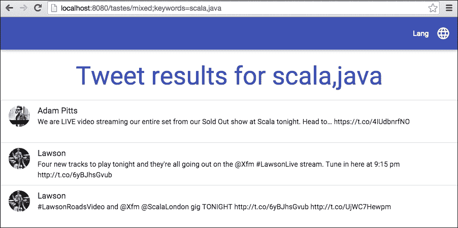
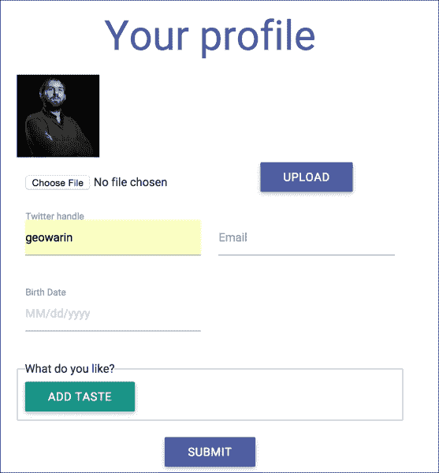
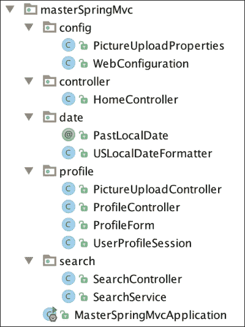

# 第四章 文件上传和错误处理

在本章中，我们将使我们的用户能够上传个人资料图片。我们还将了解如何在 Spring MVC 中处理错误。

# 上传文件

现在，我们将使我们的用户能够上传个人资料图片。这将在稍后的个人资料页面中提供，但现在，我们将简化事情，并在模板目录下的 `profile/uploadPage.html` 中创建一个新的页面：

```java
<!DOCTYPE html>
<html 

      layout:decorator="layout/default">
<head lang="en">
    <title>Profile Picture Upload</title>
</head>
<body>
<div class="row" layout:fragment="content">

    <h2 class="indigo-text center">Upload</h2>

    <form th:action="@{/upload}" method="post" enctype="multipart/form-data" class="col m8 s12 offset-m2">

        <div class="input-field col s6">
            <input type="file" id="file" name="file"/>
        </div>

        <div class="col s6 center">
            <button class="btn indigo waves-effect waves-light" type="submit" name="save" th:text="#{submit}">Submit
                <i class="mdi-content-send right"></i>
            </button>
        </div>
    </form>
</div>
</body>
</html>
```

除了表单上的 `enctype` 属性外，没有太多可看的内容。文件将通过 `POST` 方法发送到 `upload` URL。现在，我们将在 `profile` 包中的 `ProfileController` 旁边创建相应的控制器：

```java
package masterSpringMvc.profile;

import org.apache.tomcat.util.http.fileupload.IOUtils;
import org.springframework.core.io.FileSystemResource;
import org.springframework.core.io.Resource;
import org.springframework.stereotype.Controller;
import org.springframework.web.bind.annotation.RequestMapping;
import org.springframework.web.bind.annotation.RequestMethod;
import org.springframework.web.multipart.MultipartFile;

import java.io.*;
import java.nio.file.Files;
import java.nio.file.Path;
import java.nio.file.Paths;

@Controller
public class PictureUploadController {
    public static final Resource PICTURES_DIR = new FileSystemResource("./pictures");

    @RequestMapping("upload")
    public String uploadPage() {
        return "profile/uploadPage";
    }

    @RequestMapping(value = "/upload", method = RequestMethod.POST)
    public String onUpload(MultipartFile file) throws IOException {
        String filename = file.getOriginalFilename();
        File tempFile = File.createTempFile("pic", getFileExtension(filename), PICTURES_DIR.getFile());

        try (InputStream in = file.getInputStream();
             OutputStream out = new FileOutputStream(tempFile)) {
            IOUtils.copy(in, out);
        }

        return "profile/uploadPage";
    }

    private static String getFileExtension(String name) {
        return name.substring(name.lastIndexOf("."));
    }
}
```

这段代码首先会在 `pictures` 目录中创建一个临时文件，该目录位于项目的根文件夹内；因此，请确保它存在。在 Java 中，临时文件只是用于在文件系统中获取唯一文件标识符的一种商品。用户可以选择性地删除它。

在项目的根目录下创建一个图片目录，并添加一个名为 `.gitkeep` 的空文件，以确保您可以在 Git 中提交它。

### 小贴士

**Git 中的空目录**

Git 是基于文件的，无法提交空目录。一个常见的解决方案是在目录中提交一个空文件，例如 `.gitkeep`，以强制 Git 将其纳入版本控制。

用户上传的文件将被注入到我们的控制器中的 `MultipartFile` 接口中。该接口提供了几种方法来获取文件名、大小和内容。

我们特别感兴趣的方法是 `getInputStream()`。我们将使用 `IOUtils.copy` 方法将这个流复制到 `fileOutputStream` 方法中。将输入流写入输出流的代码相当无聊，所以将 Apache Utils 添加到类路径中很方便（它是 `tomcat-embedded-core.jar` 文件的一部分）。

我们大量使用了相当酷的 Spring 和 Java 7 NIO 功能：

+   字符串的资源类是一个实用工具类，它表示可以通过不同方式找到的资源抽象。

+   `try…with` 块将自动关闭我们的流，即使在异常的情况下也会关闭，从而消除了编写 `finally` 块的样板代码。

在前面的代码中，用户上传的任何文件都将被复制到 `pictures` 目录中。

在 Spring Boot 中有一些可用的属性来定制文件上传。看看 `MultipartProperties` 类。

最有趣的是：

+   `multipart.maxFileSize`：这定义了允许上传文件的最大文件大小。尝试上传更大的文件将导致 `MultipartException` 类异常。默认值是 `1Mb`。

+   `multipart.maxRequestSize`：这定义了多部分请求的最大大小。默认值是 `10Mb`。

默认值对我们的应用程序来说已经足够好了。上传几次之后，我们的图片目录将看起来像这样：


等等！有人上传了一个 ZIP 文件！我简直不敢相信。我们最好在我们的控制器中添加一些检查，以确保上传的文件是真实的图片：

```java
package masterSpringMvc.profile;

import org.apache.tomcat.util.http.fileupload.IOUtils;
import org.springframework.core.io.FileSystemResource;
import org.springframework.core.io.Resource;
import org.springframework.stereotype.Controller;
import org.springframework.web.bind.annotation.RequestMapping;
import org.springframework.web.bind.annotation.RequestMethod;
import org.springframework.web.multipart.MultipartFile;
import org.springframework.web.servlet.mvc.support.RedirectAttributes;

import java.io.*;

@Controller
public class PictureUploadController {
    public static final Resource PICTURES_DIR = new FileSystemResource("./pictures");

    @RequestMapping("upload")
    public String uploadPage() {
        return "profile/uploadPage";
    }

    @RequestMapping(value = "/upload", method = RequestMethod.POST)
    public String onUpload(MultipartFile file, RedirectAttributes redirectAttrs) throws IOException {

 if (file.isEmpty() || !isImage(file)) {
 redirectAttrs.addFlashAttribute("error", "Incorrect file. Please upload a picture.");
 return "redirect:/upload";
 }

        copyFileToPictures(file);

        return "profile/uploadPage";
    }

    private Resource copyFileToPictures(MultipartFile file) throws IOException {
        String fileExtension = getFileExtension(file.getOriginalFilename());
        File tempFile = File.createTempFile("pic", fileExtension, PICTURES_DIR.getFile());
        try (InputStream in = file.getInputStream();
             OutputStream out = new FileOutputStream(tempFile)) {

            IOUtils.copy(in, out);
        }
        return new FileSystemResource(tempFile);
    }

    private boolean isImage(MultipartFile file) {
 return file.getContentType().startsWith("image");
 }

    private static String getFileExtension(String name) {
        return name.substring(name.lastIndexOf("."));
    }
}
```

很简单！`getContentType()`方法返回文件的**多用途互联网邮件扩展**（**MIME**）类型。它将是`image/png`、`image/jpg`等等。所以我们只需要检查 MIME 类型是否以"image"开头。

我们在表单中添加了一个错误消息，所以我们应该在我们的网页中添加一些内容来显示它。将以下代码放在`uploadPage`标题下方：

```java
<div class="col s12 center red-text" th:text="${error}" th:if="${error}">
    Error during upload
</div>
```

下次你尝试上传 ZIP 文件时，你会得到一个错误！如下截图所示：


## 将图片写入响应

上传的图片不是从静态目录中提供的。我们需要采取特殊措施在网页中显示它们。

让我们在表单上方添加以下行：

```java
<div class="col m8 s12 offset-m2">
    
</div>
```

这将尝试从我们的控制器中获取图片。让我们在`PictureUploadController`类中添加相应的方法：

```java
@RequestMapping(value = "/uploadedPicture")
public void getUploadedPicture(HttpServletResponse response) throws IOException {
    ClassPathResource classPathResource = new ClassPathResource("/images/anonymous.png");
    response.setHeader("Content-Type", URLConnection.guessContentTypeFromName(classPathResource.getFilename()));
    IOUtils.copy(classPathResource.getInputStream(), response.getOutputStream());
}
```

这段代码将直接将`src/main/resources/images/anonymous.png`目录中的图片写入响应！多么令人兴奋！

如果我们再次访问我们的页面，我们会看到以下图片：


### 小贴士

我在 iconmonstr([`iconmonstr.com/user-icon`](http://iconmonstr.com/user-icon))上找到了匿名用户头像并将其下载为 128 x 128 的 PNG 文件。

## 管理上传属性

在这个阶段，允许通过`application.properties`文件配置上传目录和匿名用户图片的路径是个好主意。

让我们在新创建的`config`包中创建一个`PicturesUploadProperties`类：

```java
package masterSpringMvc.config;

import org.springframework.boot.context.properties.ConfigurationProperties;
import org.springframework.core.io.DefaultResourceLoader;
import org.springframework.core.io.Resource;

import java.io.IOException;
@ConfigurationProperties(prefix = "upload.pictures")
public class PictureUploadProperties {
    private Resource uploadPath;
    private Resource anonymousPicture;

    public Resource getAnonymousPicture() {
        return anonymousPicture;
    }

    public void setAnonymousPicture(String anonymousPicture) {
        this.anonymousPicture = new DefaultResourceLoader().getResource(anonymousPicture);
    }

    public Resource getUploadPath() {
        return uploadPath;
    }

    public void setUploadPath(String uploadPath) {
        this.uploadPath = new DefaultResourceLoader().getResource(uploadPath);
    }
}
```

在这个类中，我们使用了 Spring Boot 的`ConfigurationProperties`。这将告诉 Spring Boot 以类型安全的方式自动映射在类路径中找到的属性（默认情况下，在`application.properties`文件中）。

注意，我们定义了接受'String'作为参数的 setter，但允许 getters 返回任何类型是最有用的。

现在，我们需要将`PicturesUploadProperties`类添加到我们的配置中：

```java
@SpringBootApplication
@EnableConfigurationProperties({PictureUploadProperties.class})
public class MasterSpringMvc4Application extends WebMvcConfigurerAdapter {
  // code omitted
}
```

我们现在可以在`application.properties`文件中添加属性的值：

```java
upload.pictures.uploadPath=file:./pictures
upload.pictures.anonymousPicture=classpath:/images/anonymous.png
```

由于我们使用了 Spring 的`DefaultResourceLoader`类，我们可以使用`file:`或`classpath:`等前缀来指定我们的资源可以在哪里找到。

这相当于创建一个`FileSystemResource`类或`ClassPathResource`类。

这种方法也有文档化的优势。我们可以很容易地看到图片目录将在应用程序根目录中找到，而匿名图片将在类路径中找到。

就这样。我们现在可以在我们的控制器中使用我们的属性。以下是`PictureUploadController`类的相关部分：

```java
package masterSpringMvc.profile;

import masterSpringMvc.config.PictureUploadProperties;
import org.apache.tomcat.util.http.fileupload.IOUtils;
import org.springframework.beans.factory.annotation.Autowired;
import org.springframework.core.io.Resource;
import org.springframework.stereotype.Controller;
import org.springframework.web.bind.annotation.RequestMapping;
import org.springframework.web.bind.annotation.RequestMethod;
import org.springframework.web.multipart.MultipartFile;
import org.springframework.web.servlet.mvc.support.RedirectAttributes;

import javax.servlet.http.HttpServletResponse;
import java.io.*;
import java.net.URLConnection;

@Controller
public class PictureUploadController {
    private final Resource picturesDir;
 private final Resource anonymousPicture;

 @Autowired
 public PictureUploadController(PictureUploadProperties uploadProperties) {
 picturesDir = uploadProperties.getUploadPath();
 anonymousPicture = uploadProperties.getAnonymousPicture();
 }

    @RequestMapping(value = "/uploadedPicture")
    public void getUploadedPicture(HttpServletResponse response) throws IOException {
        response.setHeader("Content-Type", URLConnection.guessContentTypeFromName(anonymousPicture.getFilename()));
 IOUtils.copy(anonymousPicture.getInputStream(), response.getOutputStream());
    }

  private Resource copyFileToPictures(MultipartFile file) throws IOException {
       String fileExtension = getFileExtension(file.getOriginalFilename());
       File tempFile = File.createTempFile("pic", fileExtension, picturesDir.getFile());
       try (InputStream in = file.getInputStream();
            OutputStream out = new FileOutputStream(tempFile)) {

           IOUtils.copy(in, out);
       }
       return new FileSystemResource(tempFile);
   }    
// The rest of the code remains the same
}
```

在这一点上，如果你再次启动你的应用程序，你会看到结果并没有改变。匿名图片仍然被显示，用户上传的图片仍然位于项目根目录下的`pictures`目录中。

## 显示上传的图片

现在显示用户的图片不是很好吗？为了做到这一点，我们将在`PictureUploadController`类中添加一个模型属性：

```java
@ModelAttribute("picturePath")
public Resource picturePath() {
  return anonymousPicture;
}
```

我们现在可以注入它以在服务上传的图片时检索其值：

```java
@RequestMapping(value = "/uploadedPicture")
public void getUploadedPicture(HttpServletResponse response, @ModelAttribute("picturePath") Path picturePath) throws IOException {
    response.setHeader("Content-Type", URLConnection.guessContentTypeFromName(picturePath.toString()));
    Files.copy(picturePath, response.getOutputStream());
}
```

`@ModelAttribute`注解是一个创建带有注解方法的模型属性的便捷方式。然后，它们可以用相同的注解注入到控制器方法中。使用这段代码，只要我们没有重定向到另一个页面，`picturePath`参数就会在模型中可用。它的默认值是我们定义在属性文件中的匿名图片。

我们需要在文件上传时更新此值。更新`onUpload`方法：

```java
@RequestMapping(value = "/upload", method = RequestMethod.POST)
public String onUpload(MultipartFile file, RedirectAttributes redirectAttrs, Model model) throws IOException {

    if (file.isEmpty() || !isImage(file)) {
        redirectAttrs.addFlashAttribute("error", "Incorrect file. Please upload a picture.");
        return "redirect:/upload";
    }

    Resource picturePath = copyFileToPictures(file);
 model.addAttribute("picturePath", picturePath);

    return "profile/uploadPage";
}
```

通过注入模型，我们可以在上传完成后更新`picturePath`参数。

现在，问题是我们的两个方法，`onUpload`和`getUploadedPicture`，将在不同的请求中发生。不幸的是，模型属性将在每次之间重置。

因此，我们将`picturePath`参数定义为会话属性。我们可以通过向我们的控制器类添加另一个注解来实现这一点：

```java
@Controller
@SessionAttributes("picturePath")
public class PictureUploadController {
}
```

哇！仅仅为了处理一个简单的会话属性，就需要这么多注解。你将得到以下输出：


这种方法使代码组合变得非常容易。此外，我们没有直接使用`HttpServletRequest`或`HttpSession`。此外，我们的对象可以轻松地进行类型化。

## 处理文件上传错误

一定已经让我的细心读者意识到，我们的代码可能会抛出两种类型的异常：

+   `IOException`：如果在将文件写入磁盘时发生错误，则会抛出此错误。

+   `MultipartException`：如果在上传文件时发生错误，则会抛出此错误。例如，当超过最大文件大小时。

这将给我们一个很好的机会来探讨在 Spring 中处理异常的两种方式：

+   在控制器方法中局部使用`@ExceptionHandler`注解

+   使用在 Servlet 容器级别定义的全局异常处理器

让我们在`PictureUploadController`类中通过添加以下方法来使用`@ExceptionHandler`注解处理`IOException`：

```java
@ExceptionHandler(IOException.class)
public ModelAndView handleIOException(IOException exception) {
    ModelAndView modelAndView = new ModelAndView("profile/uploadPage");
    modelAndView.addObject("error", exception.getMessage());
    return modelAndView;
}
```

这是一个简单而强大的方法。每次在我们的控制器中抛出`IOException`时，都会调用此方法。

为了测试异常处理器，由于使 Java IO 代码抛出异常可能很棘手，只需在测试期间替换`onUpload`方法体：

```java
@RequestMapping(value = "/upload", method = RequestMethod.POST)
public String onUpload(MultipartFile file, RedirectAttributes redirectAttrs, Model model) throws IOException {
    throw new IOException("Some message");
}
```

在此更改之后，如果我们尝试上传图片，我们将在上传页面上看到此异常的错误消息：


现在，我们将处理`MultipartException`。这需要在 Servlet 容器级别（即 Tomcat 级别）发生，因为这个异常不是由我们的控制器直接抛出的。

我们需要向我们的配置中添加一个新的`EmbeddedServletContainerCustomizer` bean。将此方法添加到`WebConfiguration`类中：

```java
@Bean
public EmbeddedServletContainerCustomizer containerCustomizer() {
    EmbeddedServletContainerCustomizer 
embeddedServletContainerCustomizer = new EmbeddedServletContainerCustomizer() {
        @Override
        public void customize(ConfigurableEmbeddedServletContainer container) {
            container.addErrorPages(new ErrorPage(MultipartException.class, "/uploadError"));
        }
    };
    return embeddedServletContainerCustomizer;
}
```

这有点冗长。请注意，`EmbeddedServletContainerCustomizer`是一个包含单个方法的接口；因此，它可以被 lambda 表达式替换：

```java
@Bean
public EmbeddedServletContainerCustomizer containerCustomizer() {
    EmbeddedServletContainerCustomizer embeddedServletContainerCustomizer
            = container -> container.addErrorPages(new ErrorPage(MultipartException.class, "/uploadError"));
    return embeddedServletContainerCustomizer;
}
```

因此，我们只需写下以下内容：

```java
@Bean
public EmbeddedServletContainerCustomizer containerCustomizer() {
    return container -> container.addErrorPages(new ErrorPage(MultipartException.class, "/uploadError"));
}
```

这段代码创建了一个新的错误页面，当发生`MultipartException`时将被调用。它也可以映射到 HTTP 状态。`EmbeddedServletContainerCustomizer`接口还有许多其他功能，将允许定制我们的应用程序运行在其中的 Servlet 容器。访问[`docs.spring.io/spring-boot/docs/current/reference/html/boot-features-developing-web-applications.html#boot-features-customizing-embedded-containers`](http://docs.spring.io/spring-boot/docs/current/reference/html/boot-features-developing-web-applications.html#boot-features-customizing-embedded-containers)获取更多信息。

我们现在需要在我们的`PictureUploadController`类中处理这个`uploadError` URL：

```java
@RequestMapping("uploadError")
public ModelAndView onUploadError(HttpServletRequest request) {
    ModelAndView modelAndView = new ModelAndView("uploadPage");
    modelAndView.addObject("error", request.getAttribute(WebUtils.ERROR_MESSAGE_ATTRIBUTE));
    return modelAndView;
}
```

在 Servlet 环境中定义的错误页面包含了一些有趣的属性，这些属性将有助于调试错误：

| 属性 | 描述 |
| --- | --- |
| `javax.servlet.error.status_code` | 这是错误的 HTTP 状态码。 |
| `javax.servlet.error.exception_type` | 这是异常类。 |
| `javax.servlet.error.message` | 这是抛出异常的消息。 |
| `javax.servlet.error.request_uri` | 这是异常发生的 URI。 |
| `javax.servlet.error.exception` | 这是实际的异常。 |
| `javax.servlet.error.servlet_name` | 这是捕获异常的 Servlet 的名称。 |

所有这些属性都可以方便地在 Spring Web 的`WebUtils`类中访问。

如果有人尝试上传太大的文件，他们将收到一个非常清晰的错误消息。

您现在可以通过上传一个非常大的文件（> 1Mb）或将`multipart.maxFileSize`属性设置为更低的值（例如：1kb）来测试错误是否被正确处理：


# 翻译错误消息

对于开发者来说，看到应用程序抛出的异常是非常有用的。然而，对于我们的用户来说，它们的价值很小。因此，我们将翻译它们。为了做到这一点，我们必须在我们的控制器构造函数中注入我们的应用程序的`MessageSource`类：

```java
private final MessageSource messageSource;

@Autowired
public PictureUploadController(PictureUploadProperties uploadProperties, MessageSource messageSource) {
    picturesDir = uploadProperties.getUploadPath();
    anonymousPicture = uploadProperties.getAnonymousPicture();
    this.messageSource = messageSource;
}
```

现在，我们可以从我们的消息包中检索消息：

```java
@ExceptionHandler(IOException.class)
public ModelAndView handleIOException(Locale locale) {
    ModelAndView modelAndView = new ModelAndView("profile/uploadPage");
    modelAndView.addObject("error", messageSource.getMessage("upload.io.exception", null, locale));
    return modelAndView;
}

@RequestMapping("uploadError")
public ModelAndView onUploadError(Locale locale) {
    ModelAndView modelAndView = new ModelAndView("profile/uploadPage");
    modelAndView.addObject("error", messageSource.getMessage("upload.file.too.big", null, locale));
    return modelAndView;
}
```

这里是英文消息：

```java
upload.io.exception=An error occurred while uploading the file. Please try again.
upload.file.too.big=Your file is too big.
```

现在，让我们处理法语消息：

```java
upload.io.exception=Une erreur est survenue lors de l'envoi du fichier. Veuillez réessayer.
upload.file.too.big=Votre fichier est trop gros.
```

# 将配置文件放在会话中

我们接下来想要的是将配置文件存储在会话中，这样每次我们访问配置文件页面时它就不会被重置。这可能会让一些用户感到烦恼，我们必须解决这个问题。

### 小贴士

**HTTP 会话**是存储请求之间信息的一种方式。HTTP 是一个无状态协议，这意味着无法关联来自同一用户的两个请求。大多数 Servlet 容器所做的是，它们将一个名为`JSESSIONID`的 cookie 与每个用户关联。这个 cookie 将在请求头中传输，并允许你在`HttpSession`这个抽象的 map 中存储任意对象。这样的会话通常在用户关闭或切换 Web 浏览器，或者经过预定义的不活动期后结束。

我们刚刚看到了一个使用`@SessionAttributes`注解将对象放入会话中的方法。这在控制器内部工作得很好，但当数据分散在多个控制器之间时，会使数据共享变得困难。我们必须依赖于一个字符串来解析属性名称，这很难重构。出于同样的原因，我们不想直接操作`HttpSession`。另一个会阻止直接使用会话的论点是，依赖于它的控制器进行单元测试是多么困难。

当使用 Spring 在会话中保存东西时，还有一种流行的方法：用`@Scope("session")`注解一个 bean。

然后，你将能够将你的会话 bean 注入到你的控制器和其他 Spring 组件中，以便设置或从中检索值。

让我们在`profile`包中创建一个`UserProfileSession`类：

```java
package masterSpringMvc.profile;

import org.springframework.context.annotation.Scope;
import org.springframework.context.annotation.ScopedProxyMode;
import org.springframework.stereotype.Component;
import java.io.Serializable;
import java.time.LocalDate;
import java.util.ArrayList;
import java.util.List;

@Component
@Scope(value = "session", proxyMode = ScopedProxyMode.TARGET_CLASS)
public class UserProfileSession implements Serializable {
    private String twitterHandle;
    private String email;
    private LocalDate birthDate;
    private List<String> tastes = new ArrayList<>();

    public void saveForm(ProfileForm profileForm) {
        this.twitterHandle = profileForm.getTwitterHandle();
        this.email = profileForm.getEmail();
        this.birthDate = profileForm.getBirthDate();
        this.tastes = profileForm.getTastes();
    }

    public ProfileForm toForm() {
        ProfileForm profileForm = new ProfileForm();
        profileForm.setTwitterHandle(twitterHandle);
        profileForm.setEmail(email);
        profileForm.setBirthDate(birthDate);
        profileForm.setTastes(tastes);
        return profileForm;
    }
}
```

我们提供了一个方便的方法来转换`ProfileForm`对象。这将帮助我们从`ProfileController`构造函数中存储和检索表单数据。我们需要在控制器构造函数中注入我们的`UserProfileSession`变量并将其存储为一个字段。我们还需要将`ProfileForm`作为模型属性暴露，这将消除在`displayProfile`方法中注入它的需要。最后，一旦验证通过，我们就可以保存配置文件：

```java
@Controller
public class ProfileController {

    private UserProfileSession userProfileSession;
    @Autowired
    public ProfileController(UserProfileSession userProfileSession) {
        this.userProfileSession = userProfileSession;
    }

    @ModelAttribute
    public ProfileForm getProfileForm() {
        return userProfileSession.toForm();
    }

    @RequestMapping(value = "/profile", params = {"save"}, method = RequestMethod.POST)
    public String saveProfile(@Valid ProfileForm profileForm, BindingResult bindingResult) {
        if (bindingResult.hasErrors()) {
            return "profile/profilePage";
        }
        userProfileSession.saveForm(profileForm);
        return "redirect:/profile";
    }

    // the rest of the code is unchanged
}
```

这就是使用 Spring MVC 在会话中保存数据所需的所有步骤。

现在，如果你完成配置文件表单并刷新页面，数据将在请求之间持久化。

在进入下一章之前，我想详细说明我们刚刚使用的一些概念。

第一种是通过构造函数进行注入。`ProfileController`构造函数被注解为`@Autowired`，这意味着 Spring 将在实例化 bean 之前从应用程序上下文中解析构造函数参数。另一种稍微不那么冗长的方法是使用字段注入：

```java
@Controller
public class ProfileController {

    @Autowired
    private UserProfileSession userProfileSession;
}
```

构造函数注入可以说是更好的，因为它使得如果我们从`spring-test`框架中移除，我们的控制器单元测试更容易，并且使我们的 bean 的依赖关系更加明确。

关于字段注入和构造函数注入的详细讨论，请参阅 Oliver Gierke 在[`olivergierke.de/2013/11/why-field-injection-is-evil/`](http://olivergierke.de/2013/11/why-field-injection-is-evil/)的优秀博客文章。

另一个可能需要澄清的是`Scope`注解上的`proxyMode`参数：

```java
@Scope(value = "session", proxyMode = ScopedProxyMode.TARGET_CLASS)
```

在 Spring 中，如果我们不计默认的参数，有三个`proxyMode`参数可用：

+   `TARGET_CLASS`：这使用 CGI 代理

+   `INTERFACES`：这会创建一个 JDK 代理

+   `NO`：这不会创建任何代理

代理的优点通常在将某些东西注入到长生命周期的组件（如单例）时体现出来。因为注入只发生在 bean 创建时，所以后续对注入 bean 的调用可能不会反映其实际状态。

在我们的例子中，会话 bean 的实际状态存储在会话中，而不是直接在 bean 上。这就解释了为什么 Spring 必须创建一个代理：它需要拦截对 bean 方法的调用并监听其变化。这样，bean 的状态就可以透明地存储和从底层的 HTTP 会话中检索。

对于会话 bean，我们被迫使用代理模式。CGI 代理会对你的字节码进行操作，并适用于任何类，而 JDK 方法可能更轻量级，但需要你实现一个接口。

最后，我们让`UserProfileSession`bean 实现了`Serializable`接口。这并不是严格必要的，因为 HTTP 会话可以在内存中存储任意对象，但将最终存储在会话中的对象序列化确实是一个好习惯。

事实上，我们可能会改变会话持久化的方式。实际上，我们将在第八章优化您的请求中存储会话到 Redis 数据库，其中 Redis 必须与`Serializable`对象一起工作。始终将通用数据存储的会话视为最佳做法。我们必须提供一种方法来从这个存储系统中写入和读取对象。

为了确保我们的 bean 能够正确地进行序列化，我们还需要确保它的每个字段都是可序列化的。在我们的例子中，字符串和日期是可序列化的，所以我们一切准备就绪。

# 自定义错误页面

Spring Boot 允许你定义自己的错误视图，而不是我们之前看到的 Whitelabel 错误页面。它必须命名为`error`，其目的是处理所有异常。默认的`BasicErrorController`类将公开许多有用的模型属性，你可以在页面上显示这些属性。

让我们在`src/main/resources/templates`中创建一个自定义错误页面。让我们称它为`error.html`：

```java
<!DOCTYPE html>
<html >
<head lang="en">
    <meta charset="UTF-8"/>
    <title th:text="${status}">404</title>

    <link href="/webjars/materializecss/0.96.0/css/materialize.css" type="text/css" rel="stylesheet"
          media="screen,projection"/>
</head>
<body>
<div class="row">
    <h1 class="indigo-text center" th:text="${error}">Not found</h1>

    <p class="col s12 center" th:text="${message}">
        This page is not available
    </p>
</div>
</body>
</html>
```

现在，如果我们导航到一个我们的应用程序未处理的 URL，我们会看到我们的自定义错误页面：


处理错误的一个更高级的选项是定义自己的`ErrorController`类实现，这是一个负责在全局级别处理所有异常的控制器。查看`ErrorMvcAutoConfiguration`类和默认实现`BasicErrorController`类。

# 带有矩阵变量的 URL 映射

我们现在知道用户感兴趣的内容。改进我们的推文控制器，使其能够从关键字列表中进行搜索，将是一个好主意。

在 URL 中传递键值对的一个有趣方式是使用矩阵变量。它与请求参数非常相似。考虑以下代码：

```java
someUrl/param?var1=value1&var2=value2
```

与前面的参数不同，矩阵变量理解以下内容：

```java
someUrl/param;var1=value1;var2=value2
```

它们还允许每个参数都是一个列表：

```java
someUrl/param;var1=value1,value2;var2=value3,value4
```

矩阵变量可以映射到控制器内部的不同对象类型：

+   `Map<String, List<?>>`：这处理多个变量和多个值

+   `Map<String, ?>`：这处理每个变量只有一个值的情况

+   `List<?>`：如果我们对单个变量感兴趣，其名称可以配置，则使用此

在我们的案例中，我们想要处理类似以下内容：

```java
http://localhost:8080/search/popular;keywords=scala,java
```

第一个参数`popular`是 Twitter 搜索 API 所知的结果类型。它可以取以下值：`mixed`、`recent`或`popular`。

我们 URL 的其余部分是关键字列表。因此，我们将它们映射到一个简单的`List<String>`对象。

默认情况下，Spring MVC 会移除 URL 中分号后面的每个字符。为了在我们的应用程序中启用矩阵变量，我们首先需要关闭此行为。

让我们在`WebConfiguration`类中添加以下代码：

```java
@Override
public void configurePathMatch(PathMatchConfigurer configurer) {
    UrlPathHelper urlPathHelper = new UrlPathHelper();
    urlPathHelper.setRemoveSemicolonContent(false);
    configurer.setUrlPathHelper(urlPathHelper);
}
```

让我们在`search`包中创建一个新的控制器，我们将称之为`SearchController`。其作用是处理以下请求：

```java
package masterSpringMvc.search;

import org.springframework.beans.factory.annotation.Autowired;
import org.springframework.social.twitter.api.Tweet;
import org.springframework.stereotype.Controller;
import org.springframework.web.bind.annotation.MatrixVariable;
import org.springframework.web.bind.annotation.PathVariable;
import org.springframework.web.bind.annotation.RequestMapping;
import org.springframework.web.servlet.ModelAndView;

import java.util.List;

@Controller
public class SearchController {
    private SearchService searchService;
    @Autowired
    public SearchController(SearchService searchService) {
        this.searchService = searchService;
    }

    @RequestMapping("/search/{searchType}")
    public ModelAndView search(@PathVariable String searchType, @MatrixVariable List<String> keywords) {
        List<Tweet> tweets = searchService.search(searchType, keywords);
        ModelAndView modelAndView = new ModelAndView("resultPage");
        modelAndView.addObject("tweets", tweets);
        modelAndView.addObject("search", String.join(",", keywords));
        return modelAndView;
    }
}
```

如您所见，我们能够重用现有的结果页面来显示推文。我们还希望将搜索委托给另一个名为`SearchService`的类。我们将在与`SearchController`相同的包中创建此服务：

```java
package masterSpringMvc.search;

import org.springframework.beans.factory.annotation.Autowired;
import org.springframework.social.twitter.api.Tweet;
import org.springframework.social.twitter.api.Twitter;
import org.springframework.stereotype.Service;
import java.util.List;

@Service
public class SearchService {
    private Twitter twitter;

    @Autowired
    public SearchService(Twitter twitter) {
        this.twitter = twitter;
    }

    public List<Tweet> search(String searchType, List<String> keywords) {
        return null;
    }
}
```

现在，我们需要实现`search()`方法。

在`twitter.searchOperations().search(params)`上可访问的搜索操作将`searchParameters`作为高级搜索的参数。此对象允许我们在十几个标准上进行搜索。我们对`query`、`resultType`和`count`属性感兴趣。

首先，我们需要创建一个带有`searchType`路径变量的`ResultType`构造函数。`ResultType`是一个枚举，因此我们可以遍历其不同的值，找到一个与输入匹配的值，忽略大小写：

```java
private SearchParameters.ResultType getResultType(String searchType) {
    for (SearchParameters.ResultType knownType : SearchParameters.ResultType.values()) {
        if (knownType.name().equalsIgnoreCase(searchType)) {
            return knownType;
        }
    }
    return SearchParameters.ResultType.RECENT;
}
```

我们现在可以创建一个带有以下方法的`SearchParameters`构造函数：

```java
private SearchParameters createSearchParam(String searchType, String taste) {

    SearchParameters.ResultType resultType = getResultType(searchType);
    SearchParameters searchParameters = new SearchParameters(taste);
    searchParameters.resultType(resultType);
    searchParameters.count(3);
    return searchParameters;
}
```

现在，创建一个`SearchParameters`构造函数的列表就像执行一个映射操作（取一个关键字列表，并为每个关键字返回一个`SearchParameters`构造函数）一样简单：

```java
List<SearchParameters> searches = keywords.stream()
        .map(taste -> createSearchParam(searchType, taste))
        .collect(Collectors.toList());
```

现在，我们想要获取每个`SearchParameters`构造函数的推文。您可能会想到以下内容：

```java
List<Tweet> tweets = searches.stream()
        .map(params -> twitter.searchOperations().search(params))
        .map(searchResults -> searchResults.getTweets())
        .collect(Collectors.toList());
```

然而，如果您这么想，这将返回一个推文列表。我们想要的却是将所有推文展平，以获得一个简单的列表。结果是调用`map`然后展平结果的操作被称为`flatMap`。因此，我们可以写出：

```java
List<Tweet> tweets = searches.stream()
        .map(params -> twitter.searchOperations().search(params))
        .flatMap(searchResults -> searchResults.getTweets().stream())
        .collect(Collectors.toList());
```

`flatMap`函数的语法，它接受一个流作为参数，一开始可能有点难以理解。让我展示`SearchService`类的整个代码，这样我们可以回顾一下：

```java
package masterSpringMvc.search;

import org.springframework.beans.factory.annotation.Autowired;
import org.springframework.social.twitter.api.SearchParameters;
import org.springframework.social.twitter.api.Tweet;
import org.springframework.social.twitter.api.Twitter;
import org.springframework.stereotype.Service;

import java.util.List;
import java.util.stream.Collectors;

@Service
public class SearchService {
    private Twitter twitter;

    @Autowired
    public SearchService(Twitter twitter) {
        this.twitter = twitter;
    }

    public List<Tweet> search(String searchType, List<String> keywords) {
        List<SearchParameters> searches = keywords.stream()
                .map(taste -> createSearchParam(searchType, taste))
                .collect(Collectors.toList());

        List<Tweet> results = searches.stream()
                .map(params -> twitter.searchOperations().search(params))
                .flatMap(searchResults -> searchResults.getTweets().stream())
                .collect(Collectors.toList());

        return results;
    }

    private SearchParameters.ResultType getResultType(String searchType) {
        for (SearchParameters.ResultType knownType : SearchParameters.ResultType.values()) {
            if (knownType.name().equalsIgnoreCase(searchType)) {
                return knownType;
            }
        }
        return SearchParameters.ResultType.RECENT;
    }

    private SearchParameters createSearchParam(String searchType, String taste) {
        SearchParameters.ResultType resultType = getResultType(searchType);
        SearchParameters searchParameters = new SearchParameters(taste);
        searchParameters.resultType(resultType);
        searchParameters.count(3);
        return searchParameters;
    }
}
```

现在，如果我们导航到`http://localhost:8080/search/mixed;keywords=scala,java`，我们会得到预期的结果。搜索 Scala 关键字，然后是 Java：



# 组合起来

现在一切都独立工作，是时候将它们组合在一起了。我们将分三步完成：

1.  将上传表单移至个人资料页面，并删除旧的上传页面。

1.  将个人资料页面的提交按钮更改为直接触发口味搜索。

1.  更改我们应用程序的首页。它应该立即显示与用户口味匹配的搜索结果。如果它们不可用，则转到个人资料页面。

我鼓励你尝试自己完成。在过程中你会遇到一些非常容易处理的问题，但你应该有足够的知识自己解决它们。我相信你。

好的，现在你已经完成了工作（你已经完成了，不是吗？），让我们看看我的解决方案。

第一步是删除旧的`uploadPage`标题。不要回头，只管做。

接下来，将这些行放在`profilePage`标题下方：

```java
<div class="row">

    <div class="col m8 s12 offset-m2">
        
    </div>

    <div class="col s12 center red-text" th:text="${error}" th:if="${error}">
        Error during upload
    </div>

    <form th:action="@{/profile}" method="post" enctype="multipart/form-data" class="col m8 s12 offset-m2">

        <div class="input-field col s6">
            <input type="file" id="file" name="file"/>
        </div>

        <div class="col s6 center">
            <button class="btn indigo waves-effect waves-light" type="submit" name="upload" th:text="#{upload}">Upload
                <i class="mdi-content-send right"></i>
            </button>
        </div>
    </form>
</div>
```

它与旧的`uploadPage`的内容非常相似。我们只是删除了标题并更改了提交按钮的标签。将相应的翻译添加到资源包中。

英语：

```java
upload=Upload
```

法语：

```java
Upload=Envoyer
```

我们还更改了提交按钮的名称为`upload`。这将帮助我们识别控制器侧的这个动作。

现在，如果我们尝试上传我们的图片，它将重定向我们到旧的上传页面。我们需要在我们的`PictureUploadController`类的`onUpload`方法中修复这个问题：

```java
@RequestMapping(value = "/profile", params = {"upload"}, method = RequestMethod.POST)
public String onUpload(@RequestParam MultipartFile file, RedirectAttributes redirectAttrs) throws IOException {

    if (file.isEmpty() || !isImage(file)) {
        redirectAttrs.addFlashAttribute("error", "Incorrect file. Please upload a picture.");
        return "redirect:/profile";
    }

    Resource picturePath = copyFileToPictures(file);
    userProfileSession.setPicturePath(picturePath);

    return "redirect:profile";
}
```

注意，我们更改了处理 POST 请求的 URL。现在它是`/profile`而不是`/upload`。当`GET`和`POST`请求有相同的 URL 时，表单处理会更简单，这将为我们节省很多麻烦，尤其是在处理异常时。这样，我们就不需要在出错后重定向用户。

我们还删除了模型属性`picturePath`。由于我们现在有一个在会话中代表我们的用户的 bean，即`UserProfileSession`，我们决定将其添加到那里。我们在`UserProfileSession`类中添加了`picturePath`属性以及相关的 getter 和 setter。

不要忘记注入`UserProfileSession`类，并将其作为字段在我们的`PictureUploadController`类中使其可用。

记住，我们会话中的会话 bean 的所有属性必须是可序列化的，与资源不同。因此，我们需要以不同的方式存储它。URL 类似乎是一个很好的选择。它是可序列化的，并且使用`UrlResource`类从 URL 创建资源很容易：

```java
@Component
@Scope(value = "session", proxyMode = ScopedProxyMode.TARGET_CLASS)
public class UserProfileSession implements Serializable {
    private URL picturePath;

    public void setPicturePath(Resource picturePath) throws IOException {
        this.picturePath = picturePath.getURL();
    }

    public Resource getPicturePath() {
        return picturePath == null ? null : new UrlResource(picturePath);
    }
}
```

我最后要做的就是在一个错误发生后使`profileForm`作为模型属性可用。这是因为当它被渲染时，`profilePage`需要它。

总结一下，以下是`PictureUploadController`类的最终版本：

```java
package masterSpringMvc.profile;

import masterSpringMvc.config.PictureUploadProperties;
import org.apache.tomcat.util.http.fileupload.IOUtils;
import org.springframework.beans.factory.annotation.Autowired;
import org.springframework.context.MessageSource;
import org.springframework.core.io.FileSystemResource;
import org.springframework.core.io.Resource;
import org.springframework.stereotype.Controller;
import org.springframework.ui.Model;
import org.springframework.web.bind.annotation.*;
import org.springframework.web.multipart.MultipartFile;
import org.springframework.web.servlet.ModelAndView;
import org.springframework.web.servlet.mvc.support.RedirectAttributes;

import javax.servlet.http.HttpServletResponse;
import java.io.*;
import java.net.URLConnection;
import java.util.Locale;

@Controller
public class PictureUploadController {
    private final Resource picturesDir;
    private final Resource anonymousPicture;
    private final MessageSource messageSource;
    private final UserProfileSession userProfileSession;

    @Autowired
    public PictureUploadController(PictureUploadProperties uploadProperties,
                                   MessageSource messageSource,
                                   UserProfileSession userProfileSession) {
        picturesDir = uploadProperties.getUploadPath();
        anonymousPicture = uploadProperties.getAnonymousPicture();
        this.messageSource = messageSource;
        this.userProfileSession = userProfileSession;
    }

    @RequestMapping(value = "/uploadedPicture")
    public void getUploadedPicture(HttpServletResponse response) throws IOException {
        Resource picturePath = userProfileSession.getPicturePath();
        if (picturePath == null) {
            picturePath = anonymousPicture;
        }
        response.setHeader("Content-Type", URLConnection.guessContentTypeFromName(picturePath.getFilename()));
        IOUtils.copy(picturePath.getInputStream(), response.getOutputStream());
    }

    @RequestMapping(value = "/profile", params = {"upload"}, method = RequestMethod.POST)
    public String onUpload(@RequestParam MultipartFile file, RedirectAttributes redirectAttrs) throws IOException {

        if (file.isEmpty() || !isImage(file)) {
            redirectAttrs.addFlashAttribute("error", "Incorrect file. Please upload a picture.");
            return "redirect:/profile";
        }

        Resource picturePath = copyFileToPictures(file);
        userProfileSession.setPicturePath(picturePath);

        return "redirect:profile";
    }

    private Resource copyFileToPictures(MultipartFile file) throws IOException {
        String fileExtension = getFileExtension(file.getOriginalFilename());
        File tempFile = File.createTempFile("pic", fileExtension, picturesDir.getFile());
        try (InputStream in = file.getInputStream();
             OutputStream out = new FileOutputStream(tempFile)) {

            IOUtils.copy(in, out);
        }
        return new FileSystemResource(tempFile);
    }

    @ExceptionHandler(IOException.class)
    public ModelAndView handleIOException(Locale locale) {
        ModelAndView modelAndView = new ModelAndView("profile/profilePage");
        modelAndView.addObject("error", messageSource.getMessage("upload.io.exception", null, locale));
        modelAndView.addObject("profileForm", userProfileSession.toForm());
        return modelAndView;
    }

    @RequestMapping("uploadError")
    public ModelAndView onUploadError(Locale locale) {
        ModelAndView modelAndView = new ModelAndView("profile/profilePage");
        modelAndView.addObject("error", messageSource.getMessage("upload.file.too.big", null, locale));
        modelAndView.addObject("profileForm", userProfileSession.toForm());
        return modelAndView;
    }

    private boolean isImage(MultipartFile file) {
        return file.getContentType().startsWith("image");
    }

    private static String getFileExtension(String name) {
        return name.substring(name.lastIndexOf("."));
    }
}
```

因此，现在我们可以转到个人资料页面并上传我们的图片，以及提供个人信息，如下面的截图所示：



现在，让我们在完成个人资料后重定向我们的用户到其搜索。为此，我们需要修改`ProfileController`类中的`saveProfile`方法：

```java
@RequestMapping(value = "/profile", params = {"save"}, method = RequestMethod.POST)
public String saveProfile(@Valid ProfileForm profileForm, BindingResult bindingResult) {
    if (bindingResult.hasErrors()) {
        return "profile/profilePage";
    }
    userProfileSession.saveForm(profileForm);
    return "redirect:/search/mixed;keywords=" + String.join(",", profileForm.getTastes());
}
```

现在我们能够从我们的个人资料中搜索推文，我们不再需要之前制作的`searchPage`或`TweetController`。只需删除`searchPage.html`页面和`TweetController`。

最后，我们可以修改我们的主页，以便如果已经完成了我们的个人资料，它将重定向我们到一个匹配我们喜好的搜索。

让我们在控制器包中创建一个新的控制器。它负责将到达我们网站根目录的用户重定向到他们的个人资料（如果它不完整）或到`resultPage`（如果他们的喜好可用）：

```java
package masterSpringMvc.controller;

import masterSpringMvc.profile.UserProfileSession;
import org.springframework.beans.factory.annotation.Autowired;
import org.springframework.stereotype.Controller;
import org.springframework.web.bind.annotation.RequestMapping;

import java.util.List;

@Controller
public class HomeController {
    private UserProfileSession userProfileSession;

    @Autowired
    public HomeController(UserProfileSession userProfileSession) {
        this.userProfileSession = userProfileSession;
    }

    @RequestMapping("/")
    public String home() {
        List<String> tastes = userProfileSession.getTastes();
        if (tastes.isEmpty()) {
            return "redirect:/profile";
        }
        return "redirect:/search/mixed;keywords=" + String.join(",", tastes);
    }
}
```

# 检查点

在本章中，我们添加了两个控制器，`PictureUploadController`，负责将上传的文件写入磁盘并处理上传错误，以及`SearchController`，它可以使用矩阵参数从关键词列表中搜索推文。

此控制器然后将搜索委托给一个新的服务，`SearchService`。

我们删除了旧的`TweetController`。

我们创建了一个会话 bean，`UserProfileSession`，用于存储有关我们用户的信息。

最后，我们在`WebConfiguration`中添加了两项内容。我们添加了我们的 Servlet 容器的错误页面以及矩阵变量的支持。



在资源方面，我们添加了一个代表匿名用户的图片和一个用于处理错误的静态页面。我们将文件上传添加到`profilePage`，并淘汰了旧的`searchPage`。


# 摘要

在本章中，我们讨论了文件上传和错误处理。上传文件实际上并不复杂。然而，一个重大的设计决策是关于上传文件的处理。我们本可以将图像存储在数据库中，但相反，我们选择将其写入磁盘，并在用户的会话中保存每个用户图片的位置。

我们看到了在控制器级别和 servlet 容器级别处理异常的典型方法。有关 Spring MVC 错误处理的更多信息，您可以参考[`spring.io/blog/2013/11/01/exception-handling-in-spring-mvc`](https://spring.io/blog/2013/11/01/exception-handling-in-spring-mvc)博客文章。

我们的应用程序看起来已经相当不错了，但我们不得不编写的代码量非常合理。

请期待下一章，我们将看到 Spring MVC 也是一个构建 REST 应用程序的强大框架。
