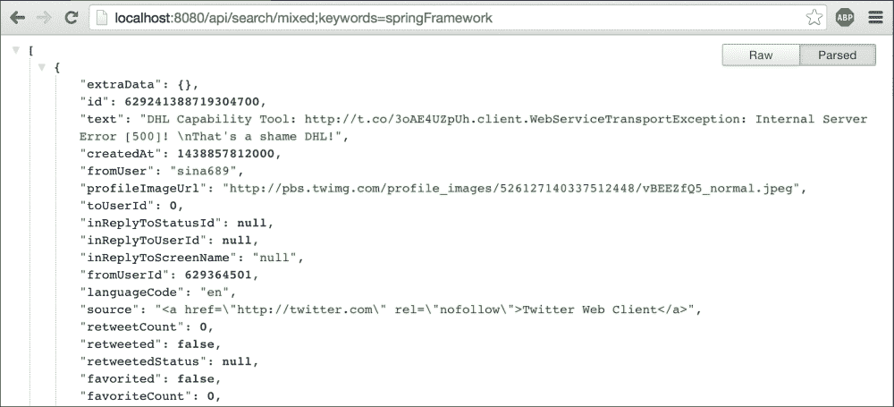
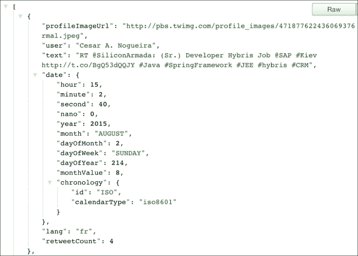
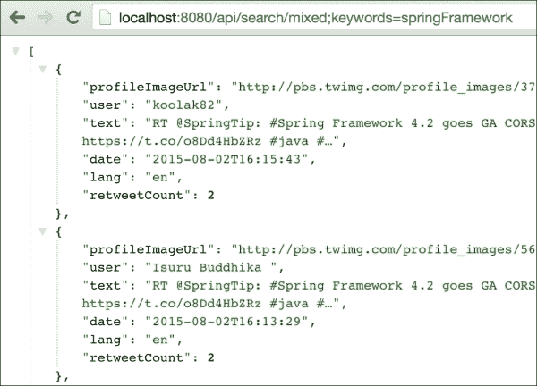
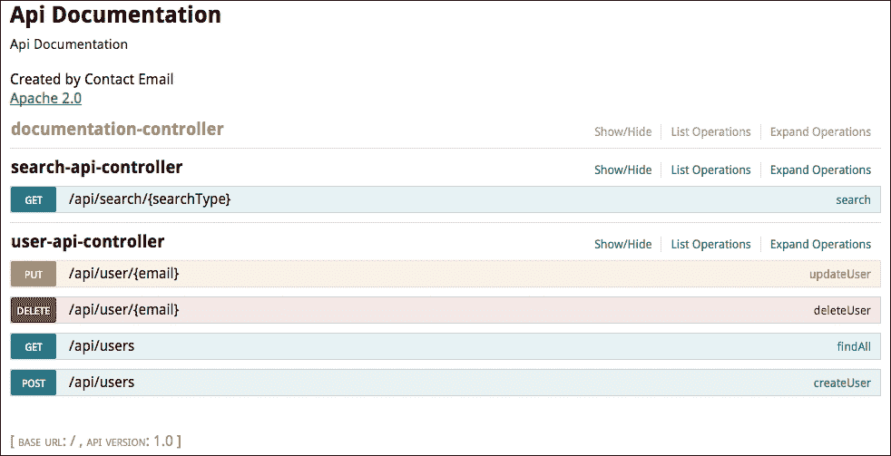
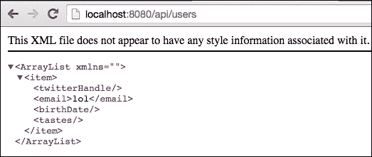
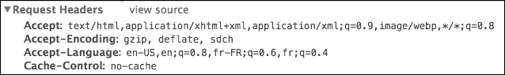
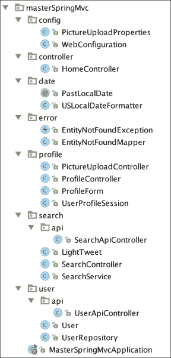

# 第五章. 构建 RESTful 应用程序

在本章中，我们将探讨 RESTful 架构的主要原则。然后，借助非常实用的工具，我们将设计一个友好的 API，利用 Jackson 的能力将我们的模型序列化为 JSON。

我们将使用适当的错误代码和 HTTP 动词来记录我们的应用程序，并通过使用 Swagger UI 自动生成我们应用程序的整洁前端。

最后，我们将探讨其他形式的序列化，并更多地了解 Spring MVC 的内容协商机制。

# 什么是 REST？

**REST**（**表征状态转移**）是一种架构风格，它定义了利用 HTTP 协议功能创建可扩展 Web 服务的最佳实践。

一个 RESTful Web 服务应该自然表现出以下属性：

+   **客户端-服务器**：用户界面与数据存储分离

+   **无状态**：每个请求都包含足够的信息，使服务器能够在不维护任何状态的情况下操作

+   **可缓存**：服务器的响应包含足够的信息，使客户端能够就数据存储做出合理的决策

+   **统一接口**：URI 唯一标识资源，超链接允许 API 被发现

+   **分层**：API 中的每个资源都提供合理的详细程度

这种架构的优势在于它易于维护和发现。它也具有良好的可扩展性，因为不需要在服务器和客户端之间维护持久连接，这消除了负载均衡或粘性会话的需求。最后，服务效率更高，因为信息布局整齐，易于缓存。

让我们看看如何通过使用理查森成熟度模型逐步设计更好的 API。

# 理查森成熟度模型

伦纳德·理查森因定义了四个级别而闻名，这些级别按 0 到 3 的顺序排列，描述了 Web API 的“RESTfulness”程度。每个级别都需要对 API 进行额外的工作和投资，但也提供了额外的收益。

## 第 0 级 – HTTP

第 0 级非常容易达到；你只需通过 HTTP 协议在网络中将你的资源可用。你可以使用最适合你用例的数据表示（XML、JSON 等）。

## 第 1 级 – 资源

当人们听到 REST 这个术语时，大多数人会想到资源。资源是我们模型中元素的唯一标识符，例如用户或推文。使用 HTTP 时，资源显然与统一资源标识符 URI 相关联，如本例所示：

+   `/users` 包含我们所有用户的列表

+   `/user/42` 包含一个特定的用户

+   `/user/42/tweets` 包含与该特定用户关联的所有推文的列表

也许你的 API 可以通过`/user/42/tweet/3`允许访问与用户相关的特定推文，或者也许每个推文都是唯一的，在这种情况下，你可能更喜欢`/tweet/3`。

此级别的目标是通过对多个专用资源进行暴露来处理应用程序的复杂性。

关于服务器可以返回的响应类型没有规则。当您使用`/users`列出所有资源时，可能只想包含少量信息，而在请求特定资源时提供更多细节。一些 API 甚至允许您在提供之前列出感兴趣的字段。

实际上，您需要根据一个简单的规则来定义您的 API 的形式：最小惊讶原则。提供用户期望的内容，您的 API 就已经处于良好状态。

## 第 2 级 – HTTP 动词

此级别是关于使用 HTTP 动词来识别对资源的可能操作。这是描述您可以使用 API 做什么的一个非常好的方法，因为 HTTP 动词在开发者中是一个众所周知的标准。

主要动词列表如下：

+   `GET`：此操作读取特定 URI 上的数据。

+   `HEAD`：此操作与`GET`相同，但没有响应体。这对于获取资源的元数据（缓存信息等）很有用。

+   `DELETE`：此操作用于删除资源。

+   `PUT`：此操作用于更新或创建资源。

+   `POST`：此操作用于更新或创建资源。

+   `PATCH`：此操作用于部分更新资源。

+   `OPTIONS`：此操作返回服务器在特定资源上支持的方法列表。

大多数允许**创建、读取、更新、删除**（**CRUD**）操作的应用程序仅使用三个动词：`GET`、`DELETE`和`POST`。您实现的动词越多，您的 API 就越丰富、语义越强。这有助于第三方通过允许他们输入几个命令并查看结果来与您的服务交互。

`OPTIONS`和`HEAD`操作很少见，因为它们在元数据级别工作，通常对任何应用程序都不是至关重要的。

初看之下，`PUT`和`POST`操作似乎做的是同一件事。主要区别在于，`PUT`操作被认为是幂等的，这意味着发送相同的请求多次应该导致服务器状态相同。该规则的含义基本上是`PUT`操作应该在给定的 URI 上操作，并包含足够的信息以确保请求成功。

例如，客户端可以使用`PUT`数据在`/user/42`上，结果将取决于实体在请求之前是否存在，要么是更新要么是创建。

另一方面，当您不确定应该写入哪个 URI 时，应使用`POST`。您可以在不指定请求 ID 的情况下将`POST`发送到`/users`，并期望创建用户。您也可以将`POST`发送到相同的`/users`资源，这次在请求实体中指定用户 ID，并期望服务器更新相应的用户。

如您所见，这两种方法都有效。一个常见的用例是使用`POST`进行创建（因为，大多数情况下，服务器应该负责 ID），并使用`PUT`来更新已知 ID 的资源。

服务器也可能允许部分修改资源（而不需要客户端发送资源的全部内容）。在这种情况下，它应该对`PATCH`方法做出响应。

在这个层面上，我也鼓励你在提供响应时使用有意义的 HTTP 状态码。我们将在稍后看到最常见的状态码。

## 第 3 级 – 超媒体控制

超媒体控制也被称为**应用状态引擎的超文本**（**HATEOAS**）。在这可怕的缩写背后是 RESTful 服务最重要的属性：通过使用超文本链接使其可发现。这本质上就是服务器告诉客户端它的选项，使用响应头或响应实体。

例如，在创建资源后使用`PUT`，服务器应该返回一个包含代码`201 CREATED`的响应，并发送一个包含创建资源 URI 的`Location`头。

没有标准定义链接到 API 其他部分的链接应该是什么样子。Spring Data REST，这是一个允许你通过最小配置创建 RESTful 后端的 Spring 项目，通常输出如下：

```java
{
 "_links" : {
 "people" : {
 "href" : "http://localhost:8080/users{?page,size,sort}",
 "templated" : true
 }
 }
}

```

然后，转到`/users`：

```java
{
 "_links" : {
 "self" : {
 "href" : "http://localhost:8080/users{?page,size,sort}",
 "templated" : true
 },
 "search" : {
 "href" : "http://localhost:8080/users/search"
 }
 },
 "page" : {
 "size" : 20,
 "totalElements" : 0,
 "totalPages" : 0,
 "number" : 0
 }
}

```

这让你对可以使用 API 做什么有了很好的了解，不是吗？

# API 版本控制

如果第三方客户端使用你的 API，你可以在更新应用程序时考虑对 API 进行版本控制，以避免破坏性更改。

对 API 进行版本控制通常是一个在子域名下提供一组稳定资源的问题。例如，GitLab 维护其 API 的三个版本。它们可以通过`https://example/api/v3`等访问。像软件中的许多架构决策一样，版本控制是一个权衡。

设计这样的 API 并识别 API 中的破坏性更改需要更多的工作。通常，添加新字段不会像删除或转换 API 实体结果或请求那样有问题。

大多数情况下，你将负责 API 和客户端，从而消除了这种复杂性的需要。

### 注意

请参阅这篇博客文章，了解更多关于 API 版本控制的深入讨论：

[`www.troyhunt.com/2014/02/your-api-versioning-is-wrong-which-is.html`](http://www.troyhunt.com/2014/02/your-api-versioning-is-wrong-which-is.html)

# 有用的 HTTP 状态码

一个好的 RESTful API 的另一个重要方面是合理地使用 HTTP 状态码。HTTP 规范定义了许多标准状态码。它们应该覆盖 API 需要与用户通信的 99%。以下列表包含了最重要的状态码，每个 API 都应该使用，每个开发者都应该了解：

| 状态码 | 含义 | 用途 |
| --- | --- | --- |
| **2xx - 成功** | **这些状态码在一切顺利时使用。** |   |
| `200` | 一切正常 | 请求成功。 |
| `201` | 资源已创建 | 资源成功创建。响应应包括与创建相关联的位置列表。 |
| `204` | 没有内容可返回 | 服务器已成功处理请求，但没有内容可返回。 |
| **3xx - 重定向** | **这些代码用于需要客户端进一步操作以完成请求的情况**。 |
| `301` | 永久移动 | 资源有一个更改的 URI，其新位置在 `Location` 标头中指示。 |
| `304` | 资源未修改 | 自上次修改以来，资源没有变化。此响应必须包含日期、ETag 和缓存信息。 |
| **4xx - 客户端错误** | **请求未成功执行是因为客户端的错误**。 |
| `400` | 错误请求 | 客户端发送的数据无法理解。 |
| `403` | 禁止 | 请求已理解但未允许。可以添加描述错误的信息。 |
| `404` | 未找到 | 没有匹配此 URI 的内容。如果不应公开安全信息，则可以使用 403。 |
| `409` | 冲突 | 请求与另一个修改冲突。响应应包括解决冲突的信息。 |
| **5xx - 服务器错误** | **服务器端发生错误**。 |
| `500` | 内部服务器错误 | 服务器意外失败处理请求。 |

### 注意

更详细的信息列表，请参阅 [`www.restapitutorial.com/httpstatuscodes.html`](http://www.restapitutorial.com/httpstatuscodes.html)。

# 客户端是王

我们将允许第三方客户端通过 REST API 获取搜索结果。这些结果将以 JSON 或 XML 格式提供。

我们希望处理形如 `/api/search/mixed;keywords=springFramework` 的请求。这实际上与我们已制作的搜索表单非常相似，只是请求路径以 `api` 开头。在这个命名空间中找到的每个 URI 都应返回二进制结果。

让我们在 `search.api` 包中创建一个新的 `SearchApiController` 类：

```java
package masterSpringMvc.search.api;

import masterSpringMvc.search.SearchService;
import org.springframework.beans.factory.annotation.Autowired;
import org.springframework.social.twitter.api.Tweet;
import org.springframework.web.bind.annotation.*;

import java.util.List;

@RestController
@RequestMapping("/api/search")
public class SearchApiController {
    private SearchService searchService;

    @Autowired
    public SearchApiController(SearchService searchService) {
        this.searchService = searchService;
    }

    @RequestMapping(value = "/{searchType}", method = RequestMethod.GET)
    public List<Tweet> search(@PathVariable String searchType, @MatrixVariable List<String> keywords) {
        return searchService.search(searchType, keywords);
    }
}
```

这与我们的前一个控制器非常相似，但有三个细微的区别：

+   控制器类使用 `@RequestMapping` 注解。这将是我们的基础地址，并将作为此控制器中声明的其他每个映射的前缀。

+   我们不再将请求重定向到视图，而是在搜索方法中返回一个纯对象。

+   控制器使用 `@RestController` 注解而不是 `@Controller`。

`RestController` 是声明将每个响应作为如果它被 `@ResponseBody` 注解一样处理的快捷方式。它告诉 Spring 将返回类型序列化为适当的格式，默认为 JSON。

当与 REST API 一起工作时，一个好的做法是始终指定您将响应的方法。一个请求以相同的方式处理 `GET` 或 `POST` 方法的情况相当不可能。

如果您访问 `http://localhost:8080/api/search/mixed;keywords=springFramework`，您应该会得到一个非常大的结果，如下所示：



事实上，Spring 使用 Jackson 自动处理了整个 `Tweet` 类的所有属性的序列化。

# 调试 RESTful API

使用您的浏览器，您只能在特定的 API 上执行 `GET` 请求。好的工具将使您的开发变得更加简单。有很多工具可以测试 RESTful API。我只会列出我使用并喜爱的工具。

## JSON 格式化扩展

通常，您只会测试 `GET` 方法，您的第一个反应可能是将地址复制到浏览器中检查结果。在这种情况下，您可以使用像 Chrome 的 JSON Formatter 或 Firefox 的 JSONView 这样的扩展程序来获取更多内容，而不仅仅是纯文本。

## 浏览器中的 RESTful 客户端

浏览器是处理 HTTP 请求的自然工具。然而，使用地址栏很少允许您详细测试您的 API。

Postman 是 Chrome 的扩展程序，RESTClient 是其 Firefox 的对应程序。它们都具有类似的功能，例如创建和共享查询集合、修改头部信息以及处理身份验证（基本、摘要和 OAuth）。在撰写本文时，只有 RESTClient 支持 OAuth2。

## httpie

**httpie** 是一个类似于 curl 的命令行工具，但面向 REST 查询。它允许您输入如下命令：

```java
http PUT httpbin.org/put hello=world

```

它比这个丑陋的版本友好得多：

```java
curl -i -X PUT httpbin.org/put -H Content-Type:application/json -d '{"hello": "world"}'

```

# 自定义 JSON 输出

使用我们的工具，我们可以轻松地看到服务器生成的请求。它非常庞大。默认情况下，Spring Boot 使用的 JSON 序列化库 Jackson 将使用 getter 方法可访问的所有内容进行序列化。

我们希望有一种更轻量级的方法，例如：

```java
{
 "text": "original text",
 "user": "some_dude",
 "profileImageUrl": "url",
 "lang": "en",
 "date": 2015-04-15T20:18:55,
 "retweetCount": 42
}

```

通过向我们的 bean 添加注解，可以最轻松地自定义哪些字段将被序列化。您可以在类级别使用 `@JsonIgnoreProperties` 注解来忽略一组属性，或者在对希望忽略的属性的 getter 上添加 `@JsonIgnore`。

在我们的案例中，`Tweet` 类不是我们自己的。它是 Spring Social Twitter 的一部分，我们没有能力对其进行注解。

直接使用模型类进行序列化很少是一个好选择。这会将您的模型绑定到您的序列化库，而序列化库应该保持为实现细节。

当处理不可修改的代码时，Jackson 提供了两种选项：

+   创建一个专门用于序列化的新类。

+   使用混合类，这些是简单的类，将被链接到您的模型。这些将在您的代码中声明，并可以使用任何 Jackson 注解进行注解。

由于我们只需要对我们的模型字段执行一些简单的转换（很多隐藏和一点重命名），我们可以选择使用混入。

这是一个很好的、非侵入性的方法，可以通过简单的类或接口即时重命名和排除字段。

另一个指定应用程序不同部分使用的字段子集的选项是使用 `@JsonView` 注解来注释它们。这在本章中不会涉及，但我鼓励你查看这篇优秀的博客文章 [`spring.io/blog/2014/12/02/latest-jackson-integration-improvements-in-spring`](https://spring.io/blog/2014/12/02/latest-jackson-integration-improvements-in-spring)。

我们希望控制我们 API 的输出，所以让我们创建一个新的类叫做 `LightTweet`，它可以由一条推文构建：

```java
package masterSpringMvc.search;

import org.springframework.social.twitter.api.Tweet;
import org.springframework.social.twitter.api.TwitterProfile;

import java.time.LocalDateTime;
import java.time.ZoneId;
import java.util.Date;

public class LightTweet {
    private String profileImageUrl;
    private String user;
    private String text;
    private LocalDateTime date;
    private String lang;
    private Integer retweetCount;

    public LightTweet(String text) {
        this.text = text;
    }

    public static LightTweet ofTweet(Tweet tweet) {
        LightTweet lightTweet = new LightTweet(tweet.getText());
        Date createdAt = tweet.getCreatedAt();
        if (createdAt != null) {
            lightTweet.date = LocalDateTime.ofInstant(createdAt.toInstant(), ZoneId.systemDefault());
        }
        TwitterProfile tweetUser = tweet.getUser();
        if (tweetUser != null) {
            lightTweet.user = tweetUser.getName();
            lightTweet.profileImageUrl = tweetUser.getProfileImageUrl();
        }
        lightTweet.lang = tweet.getLanguageCode();
        lightTweet.retweetCount = tweet.getRetweetCount();
        return lightTweet;
    }

  // don't forget to generate getters
  // They are used by Jackson to serialize objects
}
```

现在，我们需要让我们的 `SearchService` 类返回 `LightTweets` 类而不是推文：

```java
    public List<LightTweet> search(String searchType, List<String> keywords) {
        List<SearchParameters> searches = keywords.stream()
                .map(taste -> createSearchParam(searchType, taste))
                .collect(Collectors.toList());

        List<LightTweet> results = searches.stream()
                .map(params -> twitter.searchOperations().search(params))
                .flatMap(searchResults -> searchResults.getTweets().stream())
                .map(LightTweet::ofTweet)
                .collect(Collectors.toList());

        return results;
    }
```

这将影响 `SearchApiController` 类的返回类型以及 `SearchController` 类中的 tweets 模型属性。在这两个类中做出必要的修改。

我们还需要更改 `resultPage.html` 文件的代码，因为一些属性已经改变（我们不再有嵌套的 `user` 属性）：

```java
<ul class="collection">
    <li class="collection-item avatar" th:each="tweet : ${tweets}">
        }" alt="" class="circle"/>
        <span class="title" th:text="${tweet.user}">Username</span>

        <p th:text="${tweet.text}">Tweet message</p>
    </li>
</ul>
```

我们几乎完成了。如果你重新启动你的应用程序并转到 `http://localhost:8080/api/search/mixed;keywords=springFramework`，你会看到日期格式不是我们预期的：



这是因为 Jackson 没有内置对 JSR-310 日期的支持。幸运的是，这很容易修复。只需将以下库添加到 `build.gradle` 文件的依赖项中即可：

```java
compile 'com.fasterxml.jackson.datatype:jackson-datatype-jsr310'
```

这确实改变了日期格式，但现在它输出的是一个数组而不是格式化的日期。

要改变这一点，我们需要了解库做了什么。它包括一个名为 JSR-310 模块的新的 Jackson 模块。Jackson 模块是一个扩展点，用于自定义序列化和反序列化。这个模块将在启动时自动由 Spring Boot 在 `JacksonAutoConfiguration` 类中注册，这将创建一个默认的 Jackson `ObjectMapper` 方法，支持已知的模块。

我们可以看到，前一个模块为 JSR-310 中定义的所有新类添加了一堆序列化和反序列化器。这将尽可能尝试将每个日期转换为 ISO 格式。请参阅 [`github.com/FasterXML/jackson-datatype-jsr310`](https://github.com/FasterXML/jackson-datatype-jsr310)。

例如，如果我们仔细看看 `LocalDateTimeSerializer`，我们可以看到它实际上有两种模式，并且可以通过一个名为 `WRITE_DATES_AS_TIMESTAMPS` 的序列化功能在这两种模式之间切换。

要定义这个属性，我们需要自定义 Spring 的默认对象映射器。正如我们可以从自动配置中看到的那样，Spring MVC 提供了一个实用类来创建我们可以使用的 `ObjectMapper` 方法。将以下 bean 添加到你的 `WebConfiguration` 类中：

```java
@Bean
@Primary
public ObjectMapper objectMapper(Jackson2ObjectMapperBuilder builder) {
   ObjectMapper objectMapper = builder.createXmlMapper(false).build();
   objectMapper.configure(SerializationFeature.WRITE_DATES_AS_TIMESTAMPS, false);
   return objectMapper;
}
```

这次，我们已经完成了，日期格式正确，如你所见：



# 用户管理 API

我们的网络搜索 API 相当不错，但让我们做一些更有趣的事情。像许多网络应用程序一样，我们需要一个用户管理模块来识别我们的用户。为此，我们将创建一个新的`user`包。在这个包中，我们将添加一个如下所示的模式类：

```java
package masterSpringMvc.user;

import java.time.LocalDate;
import java.util.ArrayList;
import java.util.List;

public class User {
    private String twitterHandle;
    private String email;
    private LocalDate birthDate;
    private List<String> tastes = new ArrayList<>();

    // Getters and setters for all fields
}
```

由于我们目前不想使用数据库，我们将在同一包中创建一个`UserRepository`类，它由一个简单的`Map`支持：

```java
package masterSpringMvc.user;

import org.springframework.stereotype.Repository;

import java.util.ArrayList;
import java.util.List;
import java.util.Map;
import java.util.concurrent.ConcurrentHashMap;

@Repository
public class UserRepository {
    private final Map<String, User> userMap = new ConcurrentHashMap<>();

    public User save(String email, User user) {
        user.setEmail(email);
        return userMap.put(email, user);
    }

    public User save(User user) {
        return save(user.getEmail(), user);
    }

    public User findOne(String email) {
        return userMap.get(email);
    }

    public List<User> findAll() {
        return new ArrayList<>(userMap.values());
    }

    public void delete(String email) {
        userMap.remove(email);
    }

    public boolean exists(String email) {
        return userMap.containsKey(email);
    }
}
```

最后，在`user.api`包中，我们将创建一个非常简单的控制器实现：

```java
package masterSpringMvc.user.api;

import masterSpringMvc.user.User;
import masterSpringMvc.user.UserRepository;
import org.springframework.beans.factory.annotation.Autowired;
import org.springframework.web.bind.annotation.*;

import java.util.List;

@RestController
@RequestMapping("/api")
public class UserApiController {

    private UserRepository userRepository;

    @Autowired
    public UserApiController(UserRepository userRepository) {
        this.userRepository = userRepository;
    }

    @RequestMapping(value = "/users", method = RequestMethod.GET)
    public List<User> findAll() {
        return userRepository.findAll();
    }

    @RequestMapping(value = "/users", method = RequestMethod.POST)
    public User createUser(@RequestBody User user) {
        return userRepository.save(user);
    }

    @RequestMapping(value = "/user/{email}", method = RequestMethod.PUT)
    public User updateUser(@PathVariable String email, @RequestBody User user) {
        return userRepository.save(email, user);
    }

    @RequestMapping(value = "/user/{email}", method = RequestMethod.DELETE)
    public void deleteUser(@PathVariable String email) {
        userRepository.delete(email);
    }
}
```

我们通过使用用户的电子邮件地址作为唯一标识符，使用 RESTful 仓库实现了所有经典的 CRUD 操作。

在这种情况下，你将很快遇到问题，因为 Spring 会删除点号后面的内容。解决方案与我们在第四章中使用的类似，即在 URL 映射的矩阵变量部分支持分号。

在我们已经在`WebConfiguration`类中定义的`configurePathMatch()`方法中添加`useRegisteredSuffixPatternMatch`属性，并将其设置为 false：

```java
@Override
public void configurePathMatch(PathMatchConfigurer configurer) {
    UrlPathHelper urlPathHelper = new UrlPathHelper();
    urlPathHelper.setRemoveSemicolonContent(false);
    configurer.setUrlPathHelper(urlPathHelper);
    configurer.setUseRegisteredSuffixPatternMatch(true);
}
```

现在我们已经有了我们的 API，我们可以开始与之交互。

下面是一些使用 httpie 的示例命令：

```java
~ $ http get http://localhost:8080/api/users
HTTP/1.1 200 OK
Content-Type: application/json;charset=UTF-8
Date: Mon, 20 Apr 2015 00:01:08 GMT
Server: Apache-Coyote/1.1
Transfer-Encoding: chunked

[]

~ $ http post http://localhost:8080/api/users email=geo@springmvc.com birthDate=2011-12-12 tastes:='["spring"]'
HTTP/1.1 200 OK
Content-Length: 0
Date: Mon, 20 Apr 2015 00:02:07 GMT
Server: Apache-Coyote/1.1

~ $ http get http://localhost:8080/api/users
HTTP/1.1 200 OK
Content-Type: application/json;charset=UTF-8
Date: Mon, 20 Apr 2015 00:02:13 GMT
Server: Apache-Coyote/1.1
Transfer-Encoding: chunked

[
 {
 "birthDate": "2011-12-12",
 "email": "geo@springmvc.com",
 "tastes": [
 "spring"
 ],
 "twitterHandle": null
 }
]

~ $ http delete http://localhost:8080/api/user/geo@springmvc.com
HTTP/1.1 200 OK
Content-Length: 0
Date: Mon, 20 Apr 2015 00:02:42 GMT
Server: Apache-Coyote/1.1

~ $ http get http://localhost:8080/api/users
HTTP/1.1 200 OK
Content-Type: application/json;charset=UTF-8
Date: Mon, 20 Apr 2015 00:02:46 GMT
Server: Apache-Coyote/1.1
Transfer-Encoding: chunked

[]

```

这很好，但还不够出色。状态码尚未处理。我们需要更多的 RESTful 来攀登理查森的阶梯。

# 状态码和异常处理

我们首先想做的事情是正确处理响应状态。默认情况下，Spring 自动处理一些状态：

+   `500 服务器错误`：这表示在处理请求时发生了异常。

+   `405 方法不支持`：当你在一个现有的处理程序上使用不正确的方法时出现。

+   `404 未找到`：当处理程序不存在时出现。

+   `400 错误请求`：这表示请求体或参数与服务器的期望不匹配。

+   `200 正常`：对于没有错误处理的任何请求都会抛出。

使用 Spring MVC，有两种方式来返回状态码：

+   从 REST 控制器返回`ResponseEntity`类

+   抛出一个将在专用处理程序中被捕获的异常

## 带有 ResponseEntity 的状态码

HTTP 协议指定，在创建新用户时，我们应该返回一个`201 已创建`状态。在我们的 API 中，这可以通过`POST`方法实现。我们还需要在操作实体不存在时抛出一些 404 错误。

Spring MVC 有一个类将 HTTP 状态与响应实体关联。它被称为`ResponseEntity`。让我们更新我们的`UserApiController`类来处理错误代码：

```java
package masterSpringMvc.user.api;

import masterSpringMvc.user.User;
import masterSpringMvc.user.UserRepository;
import org.springframework.beans.factory.annotation.Autowired;
import org.springframework.http.HttpStatus;
import org.springframework.http.ResponseEntity;
import org.springframework.web.bind.annotation.*;

import java.util.List;

@RestController
@RequestMapping("/api")
public class UserApiController {

    private UserRepository userRepository;

    @Autowired
    public UserApiController(UserRepository userRepository) {
        this.userRepository = userRepository;
    }

    @RequestMapping(value = "/users", method = RequestMethod.GET)
    public List<User> findAll() {
        return userRepository.findAll();
    }

    @RequestMapping(value = "/users", method = RequestMethod.POST)
    public ResponseEntity<User> createUser(@RequestBody User user) {
        HttpStatus status = HttpStatus.OK;
        if (!userRepository.exists(user.getEmail())) {
            status = HttpStatus.CREATED;
        }
        User saved = userRepository.save(user);
        return new ResponseEntity<>(saved, status);
    }

    @RequestMapping(value = "/user/{email}", method = RequestMethod.PUT)
    public ResponseEntity<User> updateUser(@PathVariable String email, @RequestBody User user) {
        if (!userRepository.exists(user.getEmail())) {
            return new ResponseEntity<>(HttpStatus.NOT_FOUND);
        }
        User saved = userRepository.save(email, user);
        return new ResponseEntity<>(saved, HttpStatus.CREATED);
    }

    @RequestMapping(value = "/user/{email}", method = RequestMethod.DELETE)
    public ResponseEntity<User> deleteUser(@PathVariable String email) {
        if (!userRepository.exists(email)) {
            return new ResponseEntity<>(HttpStatus.NOT_FOUND);
        }
        userRepository.delete(email);
        return new ResponseEntity<>(HttpStatus.OK);
    }
}
```

你可以看到我们正在向 RESTful 的第一级进化，但其中涉及了很多样板代码。

## 带有异常的状态码

在我们的 API 中处理错误的另一种方式是抛出异常。使用 Spring MVC 映射异常有两种方式：

+   在类级别使用 `@ExceptionHandler`，就像我们在第四章中为 `IOException` 在上传控制器中做的那样，第四章：文件上传和错误处理

+   使用 `@ControllerAdvice` 来捕获所有控制器或控制器子集抛出的全局异常

这两个选项帮助你做出一些面向业务的决定，并在你的应用程序中定义一系列实践。

为了将这些处理器与 HTTP 状态码关联起来，我们可以在注解方法中注入响应并使用 `HttpServletResponse.sendError()` 方法，或者只是注解方法为 `@ResponseStatus` 注解。

我们将定义自己的异常，`EntityNotFoundException`。我们的业务仓库在用户正在工作的实体找不到时将抛出这个异常。这将有助于减轻 API 代码的负担。

这里是异常的代码。我们可以将它放在一个名为 `error` 的新包中：

```java
package masterSpringMvc.error;

public class EntityNotFoundException extends Exception {
    public EntityNotFoundException(String message) {
        super(message);
    }

    public EntityNotFoundException(String message, Throwable cause) {
        super(message, cause);
    }
}
```

我们的数据仓库现在将在多个位置抛出异常。我们还将区分保存和更新用户：

```java
package masterSpringMvc.user;

import masterSpringMvc.error.EntityNotFoundException;
import org.springframework.stereotype.Repository;

import java.util.ArrayList;
import java.util.List;
import java.util.Map;
import java.util.concurrent.ConcurrentHashMap;

@Repository
public class UserRepository {
    private final Map<String, User> userMap = new ConcurrentHashMap<>();

    public User update(String email, User user) throws EntityNotFoundException {
        if (!exists(email)) {
            throw new EntityNotFoundException("User " + email + " cannot be found");
        }
        user.setEmail(email);
        return userMap.put(email, user);
    }

    public User save(User user) {
        return userMap.put(user.getEmail(), user);
    }

    public User findOne(String email) throws EntityNotFoundException {
        if (!exists(email)) {
            throw new EntityNotFoundException("User " + email + " cannot be found");
        }
        return userMap.get(email);
    }

    public List<User> findAll() {
        return new ArrayList<>(userMap.values());
    }

    public void delete(String email) throws EntityNotFoundException {
        if (!exists(email)) {
            throw new EntityNotFoundException("User " + email + " cannot be found");
        }
        userMap.remove(email);
    }

    public boolean exists(String email) {
        return userMap.containsKey(email);
    }
}
```

由于我们的控制器不需要处理 404 状态，它变得更加简单。我们现在从我们的控制器方法中抛出 `EntityNotFound` 异常：

```java
package masterSpringMvc.user.api;

import masterSpringMvc.error.EntityNotFoundException;
import masterSpringMvc.user.User;
import masterSpringMvc.user.UserRepository;
import org.springframework.beans.factory.annotation.Autowired;
import org.springframework.http.HttpStatus;
import org.springframework.http.ResponseEntity;
import org.springframework.web.bind.annotation.*;

import java.util.List;

@RestController
@RequestMapping("/api")
public class UserApiController {

    private UserRepository userRepository;

    @Autowired
    public UserApiController(UserRepository userRepository) {
        this.userRepository = userRepository;
    }

    @RequestMapping(value = "/users", method = RequestMethod.GET)
    public List<User> findAll() {
        return userRepository.findAll();
    }

    @RequestMapping(value = "/users", method = RequestMethod.POST)
    public ResponseEntity<User> createUser(@RequestBody User user) {
        HttpStatus status = HttpStatus.OK;
        if (!userRepository.exists(user.getEmail())) {
            status = HttpStatus.CREATED;
        }
        User saved = userRepository.save(user);
        return new ResponseEntity<>(saved, status);
    }

    @RequestMapping(value = "/user/{email}", method = RequestMethod.PUT)
    public ResponseEntity<User> updateUser(@PathVariable String email, @RequestBody User user) throws EntityNotFoundException {
        User saved = userRepository.update(email, user);
        return new ResponseEntity<>(saved, HttpStatus.CREATED);
    }

    @RequestMapping(value = "/user/{email}", method = RequestMethod.DELETE)
    public ResponseEntity<User> deleteUser(@PathVariable String email) throws EntityNotFoundException {
        userRepository.delete(email);
        return new ResponseEntity<>(HttpStatus.OK);
    }
}
```

如果我们不处理这个异常，Spring 默认会抛出一个 500 错误。为了处理它，我们将在错误包中创建一个小的类，紧挨着我们的 `EntityNotFoundException` 类。它将被命名为 `EntityNotFoundMapper` 类，并负责处理这个异常：

```java
package masterSpringMvc.error;

import org.springframework.http.HttpStatus;
import org.springframework.web.bind.annotation.ControllerAdvice;
import org.springframework.web.bind.annotation.ExceptionHandler;
import org.springframework.web.bind.annotation.ResponseStatus;

@ControllerAdvice
public class EntityNotFoundMapper {

    @ExceptionHandler(EntityNotFoundException.class)
    @ResponseStatus(value = HttpStatus.NOT_FOUND, reason = "Entity could not be found")
    public void handleNotFound() {
    }
}
```

`@ControllerAdvice` 注解允许我们通过注解一个 Bean 来向一组控制器添加一些行为。这些控制器建议可以处理异常，也可以使用 `@ModelAttribute` 声明模型属性或使用 `@InitBinder` 声明验证策略。

通过我们刚刚编写的代码，我们在一个地方处理了由我们的控制器抛出的所有 `EntityNotFoundException` 类，并将其与 404 状态关联起来。这样，我们可以抽象这个概念，并确保我们的应用程序在所有控制器中一致地处理它。

在我们的级别，我们不会处理 API 中的超链接。相反，我鼓励你查看 Spring HATEOAS 和 Spring Data REST，它们提供了非常优雅的解决方案，使你的资源更容易被发现。

# 使用 Swagger 进行文档化

Swagger 是一个非常棒的项目，它允许你在 HTML5 网页内对 API 进行文档化和交互。以下截图展示了 API 文档：



Swagger 以前很大（用 Scala 编写）并且与 Spring 配置相对复杂。从 2.0 版本开始，库已经被重写，一个名为 `spring-fox` 的非常棒的项目将允许轻松集成。

### 注意

`spring-fox`，之前被称为`swagger-springmvc`，已经存在了三年多，并且仍然是一个非常活跃的项目。

将以下依赖项添加到您的构建文件中：

```java
compile 'io.springfox:springfox-swagger2:2.1.2'
compile 'io.springfox:springfox-swagger-ui:2.1.2'
```

第一个将提供一个注释来启用您的应用程序中的 Swagger，以及一个 API，使用注释来描述您的资源。然后 Swagger 将生成 API 的 JSON 表示。

第二个是一个 WebJar，它包含通过 Web 客户端消耗生成的 JSON 的静态资源。

现在您需要做的唯一一件事是将`@EnableSwagger2`注释添加到您的`WebConfiguration`类中：

```java
@Configuration
@EnableSwagger2
public class WebConfiguration extends WebMvcConfigurerAdapter {
 }
```

我们刚刚添加的`swagger-ui.jar`文件包含一个位于`META-INF/resources`的 HTML 文件。

当您访问`http://localhost:8080/swagger-ui.html`时，它将自动由 Spring Boot 提供服务。

默认情况下，Springfox 将扫描您的整个类路径，并显示您应用程序中声明的所有请求映射。

在我们的案例中，我们只想公开 API：

```java
@Bean
public Docket userApi() {
    return new Docket(DocumentationType.SWAGGER_2)
        .select()
        .paths(path -> path.startsWith("/api/"))
        .build();
}
```

Springfox 与一组`Docket`s 协同工作，您需要在配置类中将它们定义为 bean。它们是 RESTful 资源的逻辑分组。一个应用程序可以有多个这样的分组。

查看文档([`springfox.github.io/springfox`](http://springfox.github.io/springfox))以了解所有可用的不同设置。

# 生成 XML

RESTful API 有时会以不同的媒体类型（JSON、XML 等）返回响应。负责选择正确媒体类型的机制称为 Spring 中的内容协商。

默认情况下，在 Spring MVC 中，`ContentNegotiatingViewResolver` bean 将负责根据您应用程序中定义的内容协商策略解析正确的内容。

您可以查看`ContentNegotiationManagerFactoryBean`以了解这些策略如何在 Spring MVC 中应用。

内容类型可以通过以下策略解决：

+   根据客户端发送的`Accept`头

+   使用参数例如`?format=json`

+   使用路径扩展名，例如`/myResource.json`或`/myResource.xml`

您可以通过覆盖`WebMvcConfigurerAdapter`类的`configureContentNegotiation()`方法来自定义 Spring 配置中的这些策略。

默认情况下，Spring 将使用`Accept`头和路径扩展名。

要启用 Spring Boot 的 XML 序列化，您可以将以下依赖项添加到类路径中：

```java
compile 'com.fasterxml.jackson.dataformat:jackson-dataformat-xml'
```

如果您使用浏览器探索 API 并访问`http://localhost:8080/api/users`，您将看到以下结果作为 XML：



这是因为您的浏览器通常不会请求 JSON，但 XML 是 HTML 之后的第二选择。这在上面的屏幕截图中有显示：



要获取 JSON，您可以访问`http://localhost:8080/api/users.json`，或者使用 Postman 或 httpie 发送适当的`Accept`头。

# 检查点

在本章中，我们添加了一个搜索`ApiController`类。因为 Twitter API 返回的推文没有适应我们的使用，我们引入了一个`LightTweet`类来将它们转换成更友好的格式。

我们还开发了一个用户 API。`User`类是模型。用户通过`UserRepository`类存储和检索，`UserApiController`类公开 HTTP 端点以对用户执行 CRUD 操作。我们还添加了一个通用的异常和一个映射器，将异常关联到 HTTP 状态。

在配置中，我们添加了一个由 Swagger 文档化的 bean，并自定义了我们的 JSR-310 日期的序列化。我们的代码库应该看起来像以下这样：



# 摘要

在本章中，我们看到了如何使用 Spring MVC 创建 RESTful API。这种后端在性能和维护方面提供了巨大的好处，并且当与 Backbone、Angular JS 或 React.js 等 JavaScript MVC 框架结合使用时，可以产生神奇的效果。

我们看到了如何正确处理错误和异常，并学习了如何利用 HTTP 状态来制作更好的 API。

最后，我们添加了自动文档（Swagger），并增加了生成 XML 和 JSON 的能力。

在下一章中，我们将学习如何确保我们的应用程序的安全，以及如何使用 Twitter API 来注册我们的用户。
