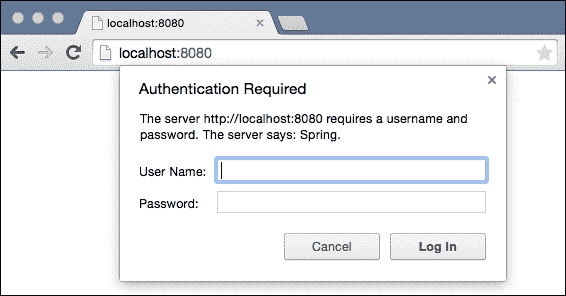
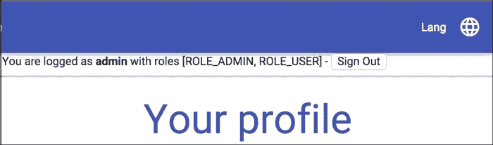
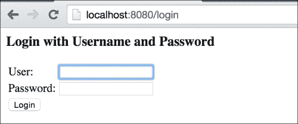
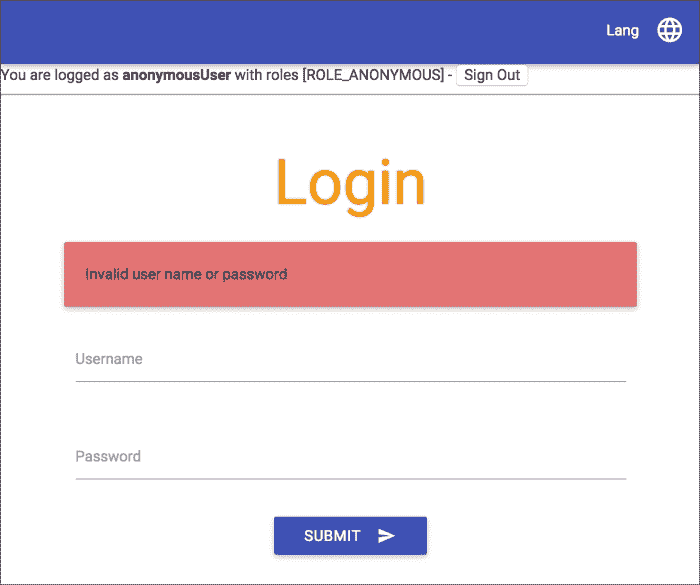
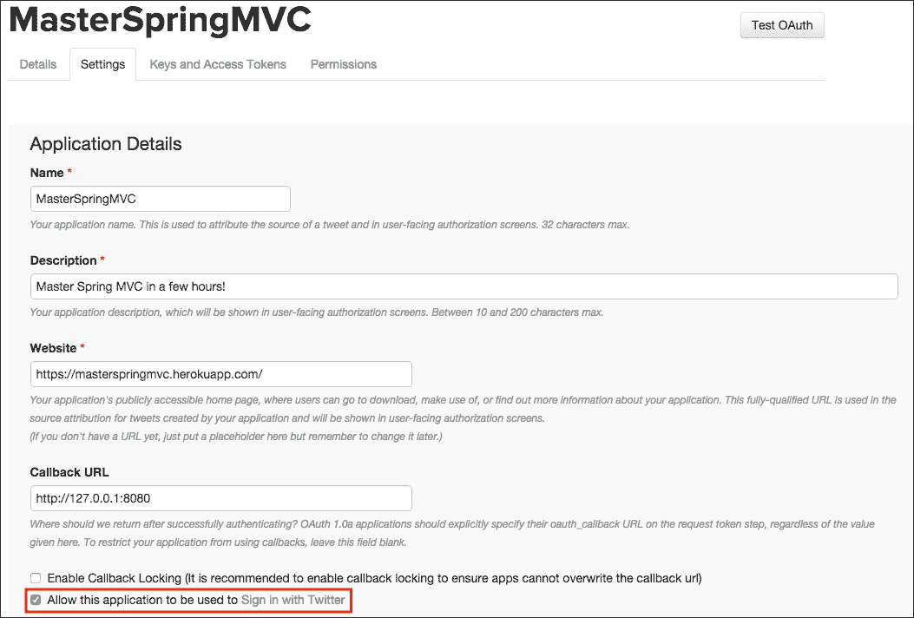
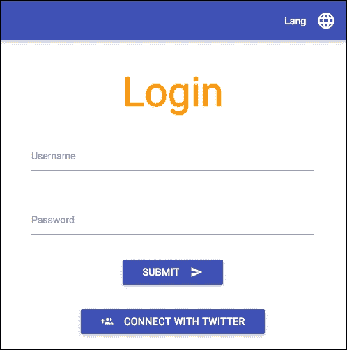
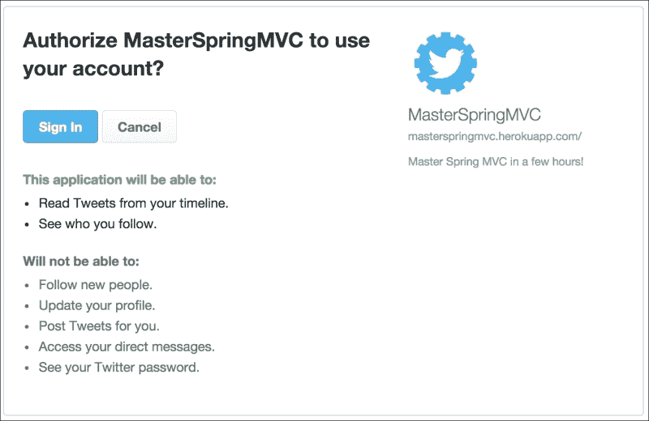
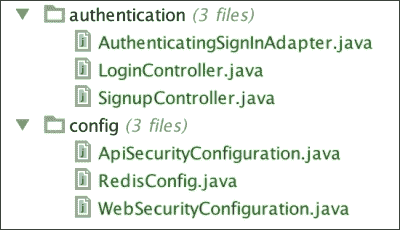

# 第六章。保护您的应用程序

在本章中，我们将学习如何保护我们的 Web 应用程序，以及如何应对现代、分布式 Web 应用程序的安全挑战。

本章将分为五个部分：

+   首先，我们将在几分钟内设置基本的 HTTP 认证

+   然后，我们将为网页设计基于表单的认证，同时保留 RESTful API 的基本认证

+   我们将允许用户通过 Twitter OAuth API 进行注册

+   然后，我们将利用 Spring Session 确保我们的应用程序可以通过分布式会话机制进行扩展

+   最后，我们将配置 Tomcat 通过 SSL 使用安全连接

# 基本认证

最简单的认证机制是基本认证([`en.wikipedia.org/wiki/Basic_access_authentication`](http://en.wikipedia.org/wiki/Basic_access_authentication))。简而言之，没有用户名和密码，我们的页面将不可用。

我们的服务器将通过发送`401 未授权`HTTP 状态码和生成`WWW-Authenticate`头来指示我们的资源受到保护。

为了成功通过安全检查，客户端必须发送包含`Basic`值后跟`user:password`字符串的 base 64 编码的`Authorization`头。浏览器窗口将提示用户输入用户名和密码，如果认证成功，将授予他们访问受保护页面的权限。

让我们向我们的依赖项中添加 Spring Security：

```java
compile 'org.springframework.boot:spring-boot-starter-security'
```

重新启动您的应用程序并导航到应用程序中的任何 URL。您将被提示输入用户名和密码：



如果您未能通过认证，您将看到抛出一个`401`错误。默认用户名是`user`。每次应用程序启动时，正确的密码都会随机生成，并将在服务器日志中显示：

```java
Using default security password: 13212bb6-8583-4080-b790-103408c93115

```

默认情况下，Spring Security 保护了除了一些经典路由（如`/css/`、`/js/`、`/images/`和`**/favicon.ico`）之外的所有资源。

如果您想配置默认凭据，您可以将以下属性添加到`application.properties`文件中：

```java
security.user.name=admin
security.user.password=secret
```

## 授权用户

在我们的应用程序中只有一个用户不允许进行细粒度安全控制。如果我们想要对用户凭据有更多控制，我们可以在`config`包中添加以下`SecurityConfiguration`类：

```java
package masterSpringMvc.config;

import org.springframework.beans.factory.annotation.Autowired;
import org.springframework.context.annotation.Configuration;
import org.springframework.security.config.annotation.authentication.builders.AuthenticationManagerBuilder;
import org.springframework.security.config.annotation.method.configuration.EnableGlobalMethodSecurity;
import org.springframework.security.config.annotation.web.configuration.WebSecurityConfigurerAdapter;

@Configuration
@EnableGlobalMethodSecurity(securedEnabled = true)
public class SecurityConfiguration extends WebSecurityConfigurerAdapter {

    @Autowired
    public void configureAuth(AuthenticationManagerBuilder auth)
            throws Exception {
        auth.inMemoryAuthentication()
                .withUser("user").password("user").roles("USER").and()
                .withUser("admin").password("admin").roles("USER", "ADMIN");
    }
}
```

此代码片段将设置一个包含我们应用程序用户及其角色的内存系统。它将覆盖应用程序属性中先前定义的安全名称和密码。

`@EnableGlobalMethodSecurity`注解将允许我们注释应用程序的方法和类来定义它们的权限级别。

例如，假设只有我们应用程序的管理员可以访问用户 API。在这种情况下，我们只需在我们的资源上添加`@Secured`注解，以允许只有 ADMIN 角色访问：

```java
@RestController
@RequestMapping("/api")
@Secured("ROLE_ADMIN")
public class UserApiController {
  // ... code omitted
}
```

我们可以使用 httpie 轻松测试这一点，通过使用`-a`开关来使用基本认证，以及使用`-p=h`开关，这将只显示响应头。

让我们尝试使用没有管理员配置文件的用户：

```java
> http GET 'http://localhost:8080/api/users' -a user:user -p=h
HTTP/1.1 403 Forbidden
Cache-Control: no-cache, no-store, max-age=0, must-revalidate
Content-Type: application/json;charset=UTF-8
Date: Sat, 23 May 2015 17:40:09 GMT
Expires: 0
Pragma: no-cache
Server: Apache-Coyote/1.1
Set-Cookie: JSESSIONID=2D4761C092EDE9A4DB91FA1CAA16C59B; Path=/; HttpOnly
Transfer-Encoding: chunked
X-Content-Type-Options: nosniff
X-Frame-Options: DENY
X-XSS-Protection: 1; mode=block

```

现在，作为管理员：

```java
> http GET 'http://localhost:8080/api/users' -a admin:admin -p=h
HTTP/1.1 200 OK
Cache-Control: no-cache, no-store, max-age=0, must-revalidate
Content-Type: application/json;charset=UTF-8
Date: Sat, 23 May 2015 17:42:58 GMT
Expires: 0
Pragma: no-cache
Server: Apache-Coyote/1.1
Set-Cookie: JSESSIONID=CE7A9BF903A25A7A8BAD7D4C30E59360; Path=/; HttpOnly
Transfer-Encoding: chunked
X-Content-Type-Options: nosniff
X-Frame-Options: DENY
X-XSS-Protection: 1; mode=block

```

你还会注意到 Spring Security 自动添加了一些常见的安全头：

+   `Cache Control`：这阻止用户缓存受保护资源

+   `X-XSS-Protection`：这告诉浏览器阻止看起来像 CSS 的内容

+   `X-Frame-Options`：这禁止我们的网站被嵌入在 IFrame 中

+   `X-Content-Type-Options`：这阻止浏览器猜测用于伪造 XSS 攻击的恶意资源的 MIME 类型

### 注意

这些头的完整列表可在[`docs.spring.io/spring-security/site/docs/current/reference/htmlsingle/#headers`](http://docs.spring.io/spring-security/site/docs/current/reference/htmlsingle/#headers)找到。

## 授权 URL

注解我们的控制器非常简单，但并不总是最可行的选项。有时，我们只想完全控制我们的授权。

移除`@Secured`注解；我们将想出更好的方法。

让我们看看通过修改`SecurityConfiguration`类，Spring Security 将允许我们做什么：

```java
@Configuration
@EnableGlobalMethodSecurity(securedEnabled = true)
public class SecurityConfiguration extends WebSecurityConfigurerAdapter {

    @Autowired
    public void configureAuth(AuthenticationManagerBuilder auth)
        throws Exception {
        auth.inMemoryAuthentication()
            .withUser("user").password("user").roles("USER").and()
            .withUser("admin").password("admin").roles("USER", "ADMIN");
    }

    @Override
    protected void configure(HttpSecurity http) throws Exception {
        http
            .httpBasic()
            .and()
            .csrf().disable()
            .authorizeRequests()
            .antMatchers("/login", "/logout").permitAll()
            .antMatchers(HttpMethod.GET, "/api/**").hasRole("USER")
            .antMatchers(HttpMethod.POST, "/api/**").hasRole("ADMIN")
            .antMatchers(HttpMethod.PUT, "/api/**").hasRole("ADMIN")
            .antMatchers(HttpMethod.DELETE, "/api/**").hasRole("ADMIN")
            .anyRequest().authenticated();
    }
}
```

在前面的代码示例中，我们使用 Spring Security 的流畅 API 配置了应用程序的安全策略。

此 API 允许我们通过调用与不同安全相关的方法并使用`and()`方法进行链式调用，全局配置 Spring Security。

我们刚才定义的是基本认证，没有 CSRF 保护。对`/login`和`/logout`的请求将允许所有用户。API 上的`GET`请求仅允许具有`USER`角色的用户，而`POST`、`PUT`和`DELETE`请求仅允许具有 ADMIN 角色的用户访问。最后，其他所有请求都需要任何角色的认证。

CSRF 代表**跨站请求伪造**，指的是恶意网站在其网站上显示表单并在你的网站上提交表单数据的一种攻击。如果你的网站用户未注销，`POST`请求将保留用户 cookies，因此会被授权。

CSRF 保护将生成短生命周期的令牌，这些令牌将随表单数据一起发布。我们将在下一节中看到如何正确启用它；现在，让我们先禁用它。有关更多详细信息，请参阅[`docs.spring.io/spring-security/site/docs/current/reference/htmlsingle/#csrf`](http://docs.spring.io/spring-security/site/docs/current/reference/htmlsingle/#csrf)。

### 注意

要了解更多关于授权请求 API 的信息，请查看[`docs.spring.io/spring-security/site/docs/current/reference/htmlsingle/#authorize-requests`](http://docs.spring.io/spring-security/site/docs/current/reference/htmlsingle/#authorize-requests)。

## Thymeleaf 安全标签

有时，您需要显示来自认证层的数据，例如用户的名称和角色，或者根据用户的权限隐藏和显示网页的一部分。`thymeleaf-extras-springsecurity`模块将允许我们这样做。

在您的`build.gradle`文件中添加以下依赖项：

```java
compile 'org.thymeleaf.extras:thymeleaf-extras-springsecurity3'
```

使用这个库，我们可以在`layout/default.html`中的导航栏下方添加一个小块来显示登录用户：

```java
<!DOCTYPE html>
<html 

      >
<head>
  <!-- content trimmed -->
</head>
<body>

<!-- content trimmed -->
<nav>
    <div class="nav-wrapper indigo">
        <ul class="right">
        <!-- content trimmed -->
        </ul>
    </div>
</nav>
<div>
 You are logged as <b sec:authentication="name" /> with roles <span sec:authentication="authorities" />
 -
 <form th:action="@{/logout}" method="post" style="display: inline-block">
 <input type="submit" value="Sign Out" />
 </form>
 <hr/>
</div>

<section layout:fragment="content">
    <p>Page content goes here</p>
</section>

<!-- content trimmed -->
</body>
</html>
```

注意 HTML 声明中的新命名空间和`sec:authentication`属性。它允许访问代表当前登录用户的`org.springframework.security.core.Authentication`对象的属性，如下面的截图所示：



不要点击登出链接，因为它与基本身份验证不兼容。我们将在下一部分让它工作。

`lib`标签还有一些其他标签，例如用于检查用户授权的标签：

```java
<div sec:authorize="hasRole('ROLE_ADMIN')">
    You are an administrator
</div>
```

### 注意

请参阅[`github.com/thymeleaf/thymeleaf-extras-springsecurity`](https://github.com/thymeleaf/thymeleaf-extras-springsecurity)上的文档，了解更多关于该库的信息。

# 登录表单

基本身份验证对我们来说的 RESTful API 很好，但我们更希望我们的团队能够精心设计一个登录页面，以改善网络体验。

Spring Security 允许我们定义我们需要的`WebSecurityConfigurerAdapter`类。我们将把`SecurityConfiguration`类分成两部分：

+   `ApiSecurityConfiguration`：这将首先进行配置。这将使用基本身份验证来保护 RESTful 端点。

+   `WebSecurityConfiguration`：这将配置我们应用程序其余部分的登录表单。

您可以删除或重命名`SecurityConfiguration`并创建`ApiSecurityConfiguration`：

```java
@Configuration
@Order(1)
public class ApiSecurityConfiguration extends WebSecurityConfigurerAdapter {

    @Autowired
    public void configureAuth(AuthenticationManagerBuilder auth)
        throws Exception {
        auth.inMemoryAuthentication()
            .withUser("user").password("user").roles("USER").and()
            .withUser("admin").password("admin").roles("USER", "ADMIN");
    }

    @Override
    protected void configure(HttpSecurity http) throws Exception {
        http
            .antMatcher("/api/**")
            .httpBasic().and()
            .csrf().disable()
            .authorizeRequests()
            .antMatchers(HttpMethod.GET).hasRole("USER")
            .antMatchers(HttpMethod.POST).hasRole("ADMIN")
            .antMatchers(HttpMethod.PUT).hasRole("ADMIN")
            .antMatchers(HttpMethod.DELETE).hasRole("ADMIN")
            .anyRequest().authenticated();
    }
}
```

注意`@Order(1)`注解，它将确保此配置在另一个配置之前执行。然后，创建一个名为`WebSecurityConfiguration`的第二个网络配置：

```java
package masterSpringMvc.config;

import org.springframework.context.annotation.Configuration;
import org.springframework.security.config.annotation.web.builders.HttpSecurity;
import org.springframework.security.config.annotation.web.configuration.WebSecurityConfigurerAdapter;

@Configuration
public class WebSecurityConfiguration extends WebSecurityConfigurerAdapter {

    @Override
    protected void configure(HttpSecurity http) throws Exception {
        http
                .formLogin()
                .defaultSuccessUrl("/profile")
                .and()
                .logout().logoutSuccessUrl("/login")
                .and()
                .authorizeRequests()
                .antMatchers("/webjars/**", "/login").permitAll()
                .anyRequest().authenticated();
    }
}
```

这段代码的结果是，匹配`/api/**`的所有内容都将使用基本身份验证进行保护，没有 CSRF 保护。然后，将加载第二个配置。它将保护其他所有内容。应用程序的这一部分的所有内容都需要客户端进行认证，除了 WebJars 和登录页面的请求（这将避免重定向循环）。

如果未经认证的用户尝试访问受保护的资源，他们将被自动重定向到登录页面。

默认情况下，登录 URL 是`GET /login`。默认登录将通过一个包含三个值的`POST /login`请求进行提交：用户名（`username`）、密码（`password`）和 CSRF 令牌（`_csrf`）。如果登录失败，用户将被重定向到`/login?error`。默认登出页面是一个带有 CSRF 令牌的`POST /logout`请求。

现在，如果您尝试在应用程序中导航，此表单将自动生成！

如果您之前已经登录，请关闭浏览器；这将清除会话。



我们现在可以登录和注销我们的应用程序了！

这很棒，但我们只需付出很少的努力就可以做得更好。首先，我们将在 `WebSecurityConfiguration` 类中定义 `/login` 的登录页面：

```java
@Override
protected void configure(HttpSecurity http) throws Exception {
    http
        .formLogin()
        .loginPage("/login") // <= custom login page
        .defaultSuccessUrl("/profile")
        // the rest of the configuration stays the same
}
```

这将允许我们创建自己的登录页面。为此，我们需要一个非常简单的控制器来处理 `GET login` 请求。您可以在 `authentication` 包中创建一个：

```java
package masterSpringMvc.authentication;

import org.springframework.stereotype.Controller;
import org.springframework.web.bind.annotation.RequestMapping;

@Controller
public class LoginController {

    @RequestMapping("/login")
    public String authenticate() {
        return "login";
    }
}
```

这将触发显示位于模板目录中的 `login.html` 页面。让我们创建它：

```java
<!DOCTYPE HTML>
<html 

      layout:decorator="layout/default">
<head>
    <title>Login</title>
</head>
<body>
<div class="section no-pad-bot" layout:fragment="content">
    <div class="container">

        <h2 class="header center orange-text">Login</h2>

        <div class="row">
            <div id="errorMessage" class="card-panel red lighten-2" th:if="${param.error}">
                <span class="card-title">Invalid user name or password</span>
            </div>

            <form class="col s12" action="/login" method="post">
                <div class="row">
                    <div class="input-field col s12">
                        <input id="username" name="username" type="text" class="validate"/>
                        <label for="username">Username</label>
                    </div>
                </div>
                <div class="row">
                    <div class="input-field col s12">
                        <input id="password" name="password" type="password" class="validate"/>
                        <label for="password">Password</label>
                    </div>
                </div>
                <div class="row center">
                    <button class="btn waves-effect waves-light" type="submit" name="action">Submit
                        <i class="mdi-content-send right"></i>
                    </button>
                </div>
                <input type="hidden" th:name="${_csrf.parameterName}" th:value="${_csrf.token}"/>
            </form>
        </div>
    </div>
</div>
</body>
</html>
```

注意我们处理了错误消息，并发布了 CSRF 令牌。我们还使用了默认的用户名和密码输入名称，但如果需要，这些是可配置的。结果已经看起来好多了！



你可以立即看到，Spring Security 默认将匿名凭证分配给所有未认证用户。

我们不应该向匿名用户显示注销按钮，因此我们可以将相应的 HTML 部分包裹在 `sec:authorize="isAuthenticated()"` 中，仅对认证用户显示，如下所示：

```java
<div sec:authorize="isAuthenticated()">
    You are logged as <b sec:authentication="name"/> with roles <span sec:authentication="authorities"/>
    -
    <form th:action="@{/logout}" method="post" style="display: inline-block">
        <input type="submit" value="Sign Out"/>
    </form>
    <hr/>
</div>
```

# Twitter 认证

我们的应用程序与 Twitter 强烈集成，因此允许通过 Twitter 进行认证似乎是合乎逻辑的。

在继续之前，请确保您已在 Twitter 上启用了您的应用的 Twitter 登录（[`apps.twitter.com`](https://apps.twitter.com)）：



## 设置社交认证

Spring social 通过 OAuth 提供商（如 Twitter）通过登录/注册场景启用认证。它将拦截 `/signin/twitter` 上的 `POST` 请求。如果用户不为 `UsersConnectionRepository` 接口所知，将调用 `signup` 端点。这将允许我们采取必要的措施在我们的系统中注册用户，并可能要求他们提供额外的详细信息。

让我们开始工作。我们首先需要做的是将 `signin/**` 和 `/signup` URL 添加为公开资源。让我们修改我们的 `WebSecurityConfiguration` 类，更改 `permitAll` 行：

```java
.antMatchers("/webjars/**", "/login", "/signin/**", "/signup").permitAll()
```

要启用登录/注册场景，我们还需要一个 `SignInAdapter` 接口，一个简单的监听器，当已知用户再次登录时将被调用。

我们可以在 `LoginController` 旁边创建一个 `AuthenticatingSignInAdapter` 类：

```java
package masterSpringMvc.authentication;

import org.springframework.security.authentication.UsernamePasswordAuthenticationToken;
import org.springframework.security.core.context.SecurityContextHolder;
import org.springframework.social.connect.Connection;
import org.springframework.social.connect.UserProfile;
import org.springframework.social.connect.web.SignInAdapter;
import org.springframework.stereotype.Component;
import org.springframework.web.context.request.NativeWebRequest;

@Component
public class AuthenticatingSignInAdapter implements SignInAdapter {

    public static void authenticate(Connection<?> connection) {
        UserProfile userProfile = connection.fetchUserProfile();
        String username = userProfile.getUsername();
        UsernamePasswordAuthenticationToken authentication = new UsernamePasswordAuthenticationToken(username, null, null);
        SecurityContextHolder.getContext().setAuthentication(authentication);
        System.out.println(String.format("User %s %s connected.", userProfile.getFirstName(), userProfile.getLastName()));
    }

    @Override
    public String signIn(String userId, Connection<?> connection, NativeWebRequest request) {
        authenticate(connection);
        return null;
    }
}
```

如您所见，此处理程序在允许用户使用 Spring Security 进行认证的完美时机被调用。我们稍后会回到这一点。现在，我们需要在同一个包中定义我们的 `SignupController` 类，负责首次访问的用户：

```java
package masterSpringMvc.authentication;

import org.springframework.beans.factory.annotation.Autowired;
import org.springframework.social.connect.Connection;
import org.springframework.social.connect.ConnectionFactoryLocator;
import org.springframework.social.connect.UsersConnectionRepository;
import org.springframework.social.connect.web.ProviderSignInUtils;
import org.springframework.stereotype.Controller;
import org.springframework.web.bind.annotation.RequestMapping;
import org.springframework.web.context.request.WebRequest;

@Controller
public class SignupController {
    private final ProviderSignInUtils signInUtils;

    @Autowired
    public SignupController(ConnectionFactoryLocator connectionFactoryLocator, UsersConnectionRepository connectionRepository) {
        signInUtils = new ProviderSignInUtils(connectionFactoryLocator, connectionRepository);
    }

    @RequestMapping(value = "/signup")
    public String signup(WebRequest request) {
        Connection<?> connection = signInUtils.getConnectionFromSession(request);
        if (connection != null) {
            AuthenticatingSignInAdapter.authenticate(connection);
            signInUtils.doPostSignUp(connection.getDisplayName(), request);
        }
        return "redirect:/profile";
    }
}
```

首先，这个控制器从会话中检索当前连接。然后，它通过之前相同的方法验证用户。最后，它将触发`doPostSignUp`事件，这将允许 Spring Social 存储与我们用户相关的信息在之前提到的`UsersConnectionRepository`接口中。

我们最后需要做的是在我们的登录页面上添加一个胜利的“使用 Twitter 登录”按钮，位于之前的表单下方：

```java
<form th:action="@{/signin/twitter}" method="POST" class="center">
    <div class="row">
        <button class="btn indigo" name="twitterSignin" type="submit">Connect with Twitter
            <i class="mdi-social-group-add left"></i>
        </button>
    </div>
</form>
```



当用户点击**连接到 Twitter**按钮时，他们将被重定向到一个 Twitter 登录页面：



## 说明

代码不多，但理解所有部分有点棘手。了解正在发生什么的第一个步骤是查看 Spring Boot 的`SocialWebAutoConfiguration`类。

在这个类中声明的`SocialAutoConfigurationAdapter`类包含以下 bean：

```java
@Bean
@ConditionalOnBean(SignInAdapter.class)
@ConditionalOnMissingBean(ProviderSignInController.class)
public ProviderSignInController signInController(
        ConnectionFactoryLocator factoryLocator,
        UsersConnectionRepository usersRepository, SignInAdapter signInAdapter) {
    ProviderSignInController controller = new ProviderSignInController(
            factoryLocator, usersRepository, signInAdapter);
    if (!CollectionUtils.isEmpty(this.signInInterceptors)) {
 controller.setSignInInterceptors(this.signInInterceptors);
    }
    return controller;
}
```

如果在我们的配置中检测到一个`ProviderSignInController`类，`ProviderSignInController`类将自动设置。这个控制器是登录过程的基础。看看它做了什么（我将只总结重要部分）：

+   它将处理来自我们连接按钮的`POST /signin/{providerId}`

+   它将用户重定向到我们身份提供者的适当登录 URL

+   它将通过身份提供者的`GET /signin/{providerId}`通知 OAuth 令牌

+   然后，它将处理登录

+   如果在`UsersConnectionRepository`接口中找不到用户，它将使用`SessionStrategy`接口来存储挂起的登录请求，然后重定向到`signupUrl`页面

+   如果找到用户，将调用`SignInAdapter`接口，并将用户重定向到`postSignupUrl`页面

这个身份验证的两个重要组件是负责从某种存储中存储和检索用户的`UsersConnectionRepository`接口，以及将用户连接临时存储以便可以从`SignupController`类中检索的`SessionStrategy`接口。

默认情况下，Spring Boot 为每个认证提供者创建一个`InMemoryUsersConnectionRepository`接口，这意味着我们的用户连接数据将存储在内存中。如果我们重启服务器，用户将变得未知，并将再次经历注册过程。

`ProviderSignInController`类默认使用`HttpSessionSessionStrategy`，这将把连接存储在 HTTP 会话中。我们在`SignupController`类中使用的`ProviderSignInUtils`类也默认使用这种策略。如果我们把我们的应用程序部署在多个服务器上，这可能会成问题，因为会话可能不会在每个服务器上可用。

通过为`ProviderSignInController`和`ProviderSignInUtils`类提供自定义的`SessionStrategy`接口，将数据存储在 HTTP 会话之外，可以很容易地覆盖这些默认设置。

同样，我们可以通过提供`UsersConnectionRepository`接口的另一个实现来为我们的用户连接数据使用另一种存储方式。

Spring Social 提供了一个`JdbcUsersConnectionRepository`接口，它将自动将认证用户保存到数据库中的`UserConnection`表中。本书不会对此进行详细说明，但您应该能够通过添加以下 bean 到您的配置中轻松配置它：

```java
@Bean
@Primary
public UsersConnectionRepository getUsersConnectionRepository(
  DataSource dataSource, ConnectionFactoryLocator connectionFactoryLocator) {
    return new JdbcUsersConnectionRepository(
      dataSource, connectionFactoryLocator, Encryptors.noOpText());
}
```

### 注意

欲了解更多详情，请查看我的博客上的这篇文章 [`geowarin.github.io/spring/2015/08/02/social-login-with-spring.html`](http://geowarin.github.io/spring/2015/08/02/social-login-with-spring.html)。

# 分布式会话

正如我们在前一节中看到的，Spring Social 在几个时刻会将东西存储在 HTTP 会话中。我们的用户配置文件也存储在会话中。这是一种将东西保持在内存中的经典方法，只要用户在导航网站。

然而，如果我们想要扩展应用程序并将负载分配到多个后端服务器，这可能会变得麻烦。我们现在已经进入了云时代，第八章，*优化您的请求*将介绍如何将我们的应用程序部署到云上。

为了使我们的会话在分布式环境中工作，我们有几种选择：

+   我们可以使用粘性会话。这将确保特定用户始终被重定向到同一服务器并保持其会话。这需要额外的部署配置，并且不是一个特别优雅的方法。

+   重构我们的代码，将数据存入数据库而不是会话中。如果我们将其与客户端每次请求发送的 cookie 或 token 关联，就可以从数据库中加载用户数据。

+   使用 Spring Session 项目，可以透明地使用如 Redis 这样的分布式数据库作为底层会话提供者。

在本章中，我们将看到如何设置第三种方法。它设置起来非常简单，并且提供了令人惊叹的好处，即可以关闭它而不会影响我们应用程序的功能。

我们需要做的第一件事是安装 Redis。要在 Mac 上安装它，请使用`brew`命令：

```java
brew install redis

```

对于其他平台，请遵循[`redis.io/download`](http://redis.io/download)上的说明。

您可以使用以下命令启动服务器：

```java
redis-server

```

将以下依赖项添加到您的`build.gradle`文件中：

```java
compile 'org.springframework.boot:spring-boot-starter-redis'
compile 'org.springframework.session:spring-session:1.0.1.RELEASE'
```

在`application.properties`旁边创建一个新的配置文件，命名为`application-redis.properties`：

```java
spring.redis.host=localhost
spring.redis.port=6379
```

Spring Boot 提供了一种方便的方法来将配置文件与配置文件关联。在这种情况下，`application-redis.properties`文件只有在 Redis 配置文件激活时才会被加载。

然后，在`config`包中创建一个`RedisConfig`类：

```java
package masterSpringMvc.config;

import org.springframework.context.annotation.Configuration;
import org.springframework.context.annotation.Profile;
import org.springframework.session.data.redis.config.annotation.web.http.EnableRedisHttpSession;

@Configuration
@Profile("redis")
@EnableRedisHttpSession
public class RedisConfig {
}
```

如你所见，此配置只有在`redis`配置文件开启时才会生效。

我们完成了！现在我们可以使用以下标志启动我们的应用程序：

```java
-Dspring.profiles.active=redis

```

你也可以使用`gradlew build`生成 JAR 文件，并使用以下命令启动它：

```java
java -Dserver.port=$PORT -Dspring.profiles.active=redis -jar app.jar

```

或者，你可以在 Bash 中使用 Gradle 启动它，如下所示：

```java
SPRING_PROFILES_ACTIVE=redis ./gradlew bootRun

```

你也可以简单地将其设置为 IDE 运行配置中的 JVM 选项。

就这样！你现在有一个服务器，用于存储登录用户的详细信息。这意味着我们可以扩展并拥有多个服务器来处理我们的网络资源，而用户不会注意到。而且我们不需要在我们的端上编写任何代码。

这也意味着即使你重启服务器，你也会保持会话。

为了查看它是否工作，使用`redis-cli`命令连接到 Redis。一开始，它不会包含任何键：

```java
> redis-cli
127.0.0.1:6379> KEYS *
(empty list or set)

```

导航到你的应用并开始将东西放入会话中：

```java
127.0.0.1:6379> KEYS *
1) "spring:session:expirations:1432487760000"
2) "spring:session:sessions:1768a55b-081a-4673-8535-7449e5729af5"
127.0.0.1:6379> HKEYS spring:session:sessions:1768a55b-081a-4673-8535-7449e5729af5
1) "sessionAttr:SPRING_SECURITY_CONTEXT"
2) "sessionAttr:org.springframework.security.web.csrf.HttpSessionCsrfTokenRepository.CSRF_TOKEN"
3) "lastAccessedTime"
4) "maxInactiveInterval"
5) "creationTime"

```

### 注意

你可以在[`redis.io/commands`](http://redis.io/commands)上查看可用的命令列表。

# SSL

**安全套接字层**（**SSL**）是一种安全协议，其中数据通过证书加密并发送到一个受信任的方。在本部分，我将向你展示使用 Spring Boot 创建安全连接的不同方法。完成这些步骤不是启动下一章的强制性要求。它们包括为了完整性，如果你急于部署应用程序到云中，可以自由跳过它们。

在第九章，“将你的 Web 应用程序部署到云中”，我们将看到大多数云平台已经处理了 SSL，所以我们不需要在我们的端上配置它。

## 生成自签名证书

通常，X.509 证书由证书颁发机构提供。他们通常为你提供服务收费，所以为了测试目的，我们可以创建我们自己的自签名密钥库文件。

JDK 附带一个名为 keytool 的二进制文件，用于管理证书。使用它，你可以创建密钥库并将证书导入到现有的密钥库中。你可以在项目根目录内执行以下命令来创建一个：

```java
$ keytool -genkey -alias masterspringmvc -keyalg RSA -keystore src/main/resources/tomcat.keystore
Enter keystore password: password
Re-enter new password: password
What is your first and last name?
 [Unknown]:  Master Spring MVC
What is the name of your organizational unit?
 [Unknown]:  Packt
What is the name of your organization?
 [Unknown]:  Packt
What is the name of your City or Locality?
 [Unknown]:  Paris
What is the name of your State or Province?
 [Unknown]:  France
What is the two-letter country code for this unit?
 [Unknown]:  FR
Is CN=Master Spring MVC, OU=Packt, O=Packt, L=Paris, ST=France, C=FR correct?
 [no]:  yes

Enter key password for <masterspringmvc>
 (RETURN if same as keystore password): password2
Re-enter new password: password2

```

这将生成一个名为`masterspringmvc`的密钥库，使用 RSA 算法，并将其存储在`src/main/resources`目录下的密钥库中。

### 小贴士

不要将密钥库推送到你的仓库。它可能被暴力破解，这将使你网站的安保失效。你还应该使用强随机生成的密码来生成密钥库。

## 简单方式

如果你只关心有一个安全的 https 通道而没有 http 通道，那就简单得不能再简单了：

```java
server.port = 8443
server.ssl.key-store = classpath:tomcat.keystore

server.ssl.key-store-password = password
server.ssl.key-password = password2

```

### 小贴士

不要将你的密码推送到你的仓库。使用`${}`符号来导入环境变量。

## 双向方式

如果你想在你的应用程序中同时拥有 http 和 https 通道，你应该在你的应用程序中添加此类配置：

```java
@Configuration
public class SslConfig {

    @Bean
    public EmbeddedServletContainerFactory servletContainer() throws IOException {
        TomcatEmbeddedServletContainerFactory tomcat = new TomcatEmbeddedServletContainerFactory();
        tomcat.addAdditionalTomcatConnectors(createSslConnector());
        return tomcat;
    }

    private Connector createSslConnector() throws IOException {
        Connector connector = new Connector(Http11NioProtocol.class.getName());
        Http11NioProtocol protocol =
                (Http11NioProtocol) connector.getProtocolHandler();
        connector.setPort(8443);
        connector.setSecure(true);
        connector.setScheme("https");
        protocol.setSSLEnabled(true);
        protocol.setKeyAlias("masterspringmvc");
        protocol.setKeystorePass("password");
        protocol.setKeyPass("password2");
        protocol.setKeystoreFile(new ClassPathResource("tomcat.keystore").getFile().getAbsolutePath());
        protocol.setSslProtocol("TLS");
        return connector;
    }
}
```

这将加载先前生成的 keystore，在端口 8080 之外，在端口 8443 上创建一个额外的通道。

您可以使用 Spring Security 通过以下配置自动将连接从`http`重定向到`https`：

```java
@Configuration
public class WebSecurityConfiguration extends WebSecurityConfigurerAdapter {

    @Override
    protected void configure(HttpSecurity http) throws Exception {
        http
            .requiresChannel().anyRequest().requiresSecure()
            .and()
            /* rest of the configuration */;
    }
}
```

## 在受保护的服务器后面

使用 SSL 保护您的应用程序最方便的方式通常是将其放在一个启用了 SSL 的 Web 服务器后面，如 Apache 或 CloudFlare。这些服务器通常会使用既定的头信息来指示连接之前已经通过 SSL 发起。

如果您在`application.properties`文件中告诉 Spring 正确的头信息，Spring Boot 可以理解此协议：

```java
server.tomcat.remote_ip_header=x-forwarded-for
server.tomcat.protocol_header=x-forwarded-proto

```

### 注意

请参阅以下文档以获取更多详细信息：[`docs.spring.io/spring-boot/docs/current/reference/html/howto-embedded-servlet-containers.html#howto-use-tomcat-behind-a-proxy-server`](http://docs.spring.io/spring-boot/docs/current/reference/html/howto-embedded-servlet-containers.html#howto-use-tomcat-behind-a-proxy-server).

# 检查点

在本章中，我们添加了三段配置：`ApiSecurityConfiguration`，它配置我们的 REST API 使用基本 HTTP 认证；`WebSecurityConfiguration`，它为我们的网络用户设置登录表单，用户可以使用账户或 Twitter 登录；以及`RedisConfig`，它允许我们的会话在 Redis 服务器上存储和检索。

在认证包中，我们添加了一个`LoginController`类，它将重定向到我们的登录页面，一个`SignupController`类，它将在用户第一次使用 Twitter 注册时被调用，以及一个`AuthenticatingSignInAdapater`类，它将在每次使用 Twitter 登录时被调用：



# 摘要

使用 Spring 保护我们的 Web 应用程序非常简单。可能性是无限的，并且高级配置，如社交登录，都在您的指尖。分发会话和扩展也只需几分钟。

在下一章中，我们将了解如何测试我们的应用程序并确保它不会退化。
