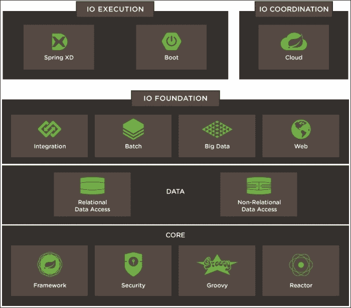

# 第十章。Spring Web 之外

在本章中，我们将看到我们已经走了多远，解决了哪些问题，以及哪些问题有待解决。

我们将一般性地讨论 Spring 生态系统，并特别讨论持久化、部署和单页应用程序。

# Spring 生态系统

从 Web 到数据，Spring 是一个旨在以模块化方式解决各种问题的全面生态系统：

查看 Spring IO 平台[`spring.io/platform`](https://spring.io/platform)。

## 核心内容

在 Spring 框架的核心中，显然有一个依赖注入机制。

我们只是触及了安全特性和框架与 Groovy 的出色集成的表面。

## 执行

我们详细了解了 Spring Boot 的内容——为庞大的子项目网络带来简单性和凝聚力。

它允许您专注于真正重要的事情，即您的业务代码。

Spring XD 项目也非常有趣。其目标是提供处理、分析和转换或导出您数据的工具，并明确关注大数据。更多信息，请访问[`projects.spring.io/spring-xd`](http://projects.spring.io/spring-xd)。

## 数据

在开发我们的应用程序时，我们还没有探讨过如何在数据库中存储数据的问题。在 Pivotal 的参考架构中，有一个层级既用于关系型数据也用于非关系型（NoSQL）数据。

Spring 生态系统在标签`spring-data`下提供了许多有趣的解决方案，可以在[`projects.spring.io/spring-data/`](http://projects.spring.io/spring-data/)找到。

当我们构建缓存时，我们简要地了解了 Spring Data Redis，但 Spring Data 还有更多内容。

所有 Spring Data 项目都共享基本概念，例如模板 API，它是一个从持久化系统中检索和存储对象的抽象。

Spring Data JPA ([`projects.spring.io/spring-data-jpa/`](http://projects.spring.io/spring-data-jpa/)) 和 Spring Data Mongo ([`projects.spring.io/spring-data-mongodb/`](http://projects.spring.io/spring-data-mongodb/)) 是一些最知名的 Spring Data 项目。它们允许您通过仓库操作实体，仓库是提供创建查询、持久化对象等设施的简单接口。

Petri Kainulainen ([`www.petrikainulainen.net/spring-data-jpa-tutorial/`](http://www.petrikainulainen.net/spring-data-jpa-tutorial/)) 在 Spring Data 上有许多详尽的示例。它不使用 Spring Boot 提供的设施，但您应该能够通过指南轻松开始，例如在[`spring.io/guides/gs/accessing-data-jpa/`](https://spring.io/guides/gs/accessing-data-jpa/)可用的指南。

Spring Data REST 也是一个神奇的项目，它将通过 RESTful API 半自动地暴露你的实体。访问 [`spring.io/guides/gs/accessing-data-rest/`](https://spring.io/guides/gs/accessing-data-rest/) 获取详细的教程。

## 其他值得注意的项目

Spring Integration ([`projects.spring.io/spring-integration`](http://projects.spring.io/spring-integration)) 和 Spring Reactor ([`projectreactor.io`](http://projectreactor.io)) 也是我最喜欢的 Spring 项目之二。

Spring Reactor 是 Pivotal 对反应式流的实现，其理念是在服务器端提供完全非阻塞的 IO。

另一方面，Spring Integration 关注企业集成模式，并允许你设计通道来加载和转换来自异构系统的数据。

一个很好的、简单的例子，展示了你可以通过通道完成的事情，可以在这里看到：[`lmivan.github.io/contest/#_spring_boot_application`](http://lmivan.github.io/contest/#_spring_boot_application)。

如果你与异构和/或复杂的子系统进行通信，这些子系统绝对值得一看。

在 Spring 生态系统中的最后一个项目是我们还没有的 Spring Batch，这是一个用于处理企业系统日常运营中大量数据的非常有用的抽象。

# 部署

Spring Boot 提供了将你的 Spring 应用程序作为简单的 JAR 运行和分发的功能，在这方面取得了巨大的成功。

毫无疑问，这是一步正确的方向，但有时你的 Web 应用程序并不是你想要部署的唯一东西。

当处理一个具有多个服务器和数据源的复杂系统时，运维团队的工作可能会变得相当头疼。

## Docker

谁没有听说过 Docker？它是容器世界中的新潮儿，并因其充满活力的社区而取得了巨大的成功。

Docker 背后的想法并不新鲜，它利用 LinuX 容器（LXC）和 cgroups 为应用程序提供一个完全隔离的环境来运行。

你可以在 Spring 网站上找到一个教程，它将指导你使用 Docker 的第一步。[`spring.io/guides/gs/spring-boot-docker`](https://spring.io/guides/gs/spring-boot-docker)。

Pivotal Cloud Foundry 多年来一直在他们的容器管理器 Warden 中使用容器技术。他们最近转向了 Garden，这是一个不仅支持 Linux 容器，还支持 Windows 容器的抽象。

Garden 是 Cloud Foundry 最新版本（称为 Diego）的一部分，它还允许将 Docker 镜像作为部署单元。

Cloud Foundry 的开发者版本也以 Lattice 的名字发布，可以在 [`spring.io/blog/2015/04/06/lattice-and-spring-cloud-resilient-sub-structure-for-your-cloud-native-spring-applications`](https://spring.io/blog/2015/04/06/lattice-and-spring-cloud-resilient-sub-structure-for-your-cloud-native-spring-applications) 找到。

如果你想要在没有命令行烦恼的情况下测试容器，我推荐你看看 Kitematic。有了这个工具，你可以运行 Jenkins 容器或 MongoDB，而无需在你的系统上安装二进制文件。更多信息请访问[`kitematic.com/`](https://kitematic.com/)。

Docker 生态系统中的另一个值得提及的工具是 Docker Compose。它允许你通过单个配置文件运行和链接多个容器。

参考以下链接以了解 Spring Boot 应用程序的示例，该应用程序由两个 Web 服务器、一个用于存储用户会话的 Redis 和一个用于负载均衡的 Nginx 实例组成。[`java.dzone.com/articles/spring-session-demonstration`](http://java.dzone.com/articles/spring-session-demonstration)。当然，关于 Docker Swarm 还有更多要学习的内容，它将允许你通过简单的命令扩展你的应用程序，以及 Docker Machine，它将在任何机器上为你创建 Docker 主机，包括云服务提供商。

Google Kubernetes 和 Apache Mesos 也是从 Docker 容器中受益极大的分布式系统的优秀例子。

# 单页应用程序

大多数今天的 Web 应用程序都是用 JavaScript 编写的。Java 被降级到后端，并承担着处理数据和业务规则的重要角色。然而，现在大部分的 GUI 操作都在客户端进行。

这在响应速度和用户体验方面有很好的理由，但那些应用程序增加了额外的复杂性。

开发者现在必须精通 Java 和 JavaScript，而且框架的数量可能会在最初让人感到有些压倒。

## 参与者

如果你想要深入了解 JavaScript，我强烈推荐 Dave Syer 的 Spring 和 AngularJS 教程，该教程可在[`spring.io/guides/tutorials/spring-security-and-angular-js`](https://spring.io/guides/tutorials/spring-security-and-angular-js)找到。

选择一个 JavaScript MVC 框架也可能有点困难。AngularJS 多年来一直受到 Java 社区的青睐，但人们似乎正在远离它。更多信息，请访问[`gist.github.com/tdd/5ba48ba5a2a179f2d0fa`](https://gist.github.com/tdd/5ba48ba5a2a179f2d0fa)。

其他替代方案包括以下：

+   **BackboneJS**：这是一个非常简单的 MVC 框架，它建立在 Underscore 和 jQuery 之上。

+   **Ember**：这是一个提供更多与数据交互功能的综合性系统。

+   **React**：这是 Facebook 的最新项目。它处理视图的新颖且非常有趣的哲学。它的学习曲线相当陡峭，但它是设计 GUI 框架时一个非常有意思的系统。

React 是目前我最喜欢的项目。它让你专注于视图及其单向数据流使得推理应用程序的状态变得容易。然而，它仍然处于 0.13 版本。这使得它既非常有趣，因为充满活力的社区总是能提出新的解决方案和想法，又有些令人不安，因为即使经过超过 2 年的开源开发，前方的道路仍然似乎很长。有关“通往 1.0 之路”的信息，请访问[`facebook.github.io/react/blog/2014/03/28/the-road-to-1.0.html`](https://facebook.github.io/react/blog/2014/03/28/the-road-to-1.0.html)。

## 未来

我看到很多 Java 开发者抱怨 JavaScript 的宽容性，并且很难接受它不是一个强类型语言的事实。

有其他替代方案，例如**TypeScript**([`www.typescriptlang.org/`](http://www.typescriptlang.org/))，这些方案非常有趣，为我们这些 Java 开发者提供了我们一直用来简化生活的东西：接口、类、IDE 中的有用支持以及自动完成。

许多人对 Angular 的下一个版本（2.0）下注，这个版本将非常著名地打破一切。我认为这是最好的。他们与微软团队的合作，使得 TypeScript 变得非常独特。

当听到 ECMAScript 的一个大新特性，允许开发这个新框架，是装饰器，一种注释机制时，大多数 JEE 开发者都会微笑：

### 注意

要了解注释和装饰器之间的区别，请访问[`blog.thoughtram.io/angular/2015/05/03/the-difference-between-annotations-and-decorators.html`](http://blog.thoughtram.io/angular/2015/05/03/the-difference-between-annotations-and-decorators.html)。

JavaScript 正在快速发展，ECMAScript 6 有很多有趣的功能，使其成为一个真正先进和复杂化的语言。不要错过这个机会；在太晚之前，看看[`github.com/lukehoban/es6features`](https://github.com/lukehoban/es6features)！

网页组件规范也是一个变革者。其目标是提供可重用的 UI 组件，React 团队和 Angular 2 团队都有计划与之接口。谷歌在网页组件之上开发了一个有趣的项目，名为 Polymer，现在已升级到 1.0 版本。

### 注意

参考文章[`ng-learn.org/2014/12/Polymer/`](http://ng-learn.org/2014/12/Polymer/)了解更多关于这些项目状态的信息。

## 转向无状态

当处理 JavaScript 客户端时，依赖于会话 cookie 并不是最佳选择。大多数应用程序选择完全无状态，并用令牌来识别客户端。

如果您想继续使用 Spring Session，请查看`HeaderHttpSessionStrategy`类。它有一个实现，可以通过 HTTP 头发送和检索会话。一个例子可以在[`drissamri.be/blog/2015/05/21/spr`](https://drissamri.be/blog/2015/05/21/spr)找到。

# 摘要

Spring 生态系统非常广泛，为现代网络应用开发者提供了很多资源。

很难找到一个没有被 Spring 项目解决的问题。

是时候说再见了！希望您喜欢我们与 Spring MVC 的这次小旅程，并且它将帮助您愉快地开发，并创造出令人惊叹的项目，无论是在工作中还是在您的业余时间。
