# 第一章。JUnit 4 – 全部回忆

本章涵盖了单元测试的概念、JUnit 4 框架、Eclipse 设置以及 JUnit 4 的高级特性。在 JUnit 4 中，我们将简要介绍 JUnit 框架，以便您能够快速上手。我们将讨论围绕 JUnit 基本概念、注解、断言、`@RunWith`注解和异常处理的概念，以便您对 JUnit 4 的工作原理有足够的了解。高级读者可以跳到下一节。

在 JUnit 4++中，我们将探讨 JUnit 4 的高级主题，深入探讨参数化测试、Hamcrest 匹配器和`assertThat`、假设、理论、超时、类别、规则、测试套件和测试顺序。

# 定义单元测试

测试是对我们知识的评估，是对概念验证，或是对数据的检验。类测试是对我们知识的检验，以确定我们是否可以进入下一个层次。对于软件来说，它是在将软件交付给客户之前对功能和非功能需求的验证。

单元测试代码意味着验证或执行代码的合理性检查。合理性检查是一种基本的测试，用于快速评估计算结果是否可能为真。它是一种简单的检查，用于查看产生的材料是否连贯。

使用主方法中的打印语句或执行应用程序来进行单元测试是一种常见的做法。但这两种方法都不是正确的方法。将生产代码与测试代码混合不是好的做法。在生产代码中测试逻辑是一种代码恶臭，尽管它不会破坏测试中的代码。然而，这增加了代码的复杂性，并可能导致严重的维护问题或系统故障，如果配置出现错误。在生产系统中执行打印语句或日志语句会打印出不必要的信 息。它们增加了执行时间并降低了代码的可读性。此外，垃圾日志信息可能会隐藏一个真正的问题，例如，由于过度记录垃圾信息，你可能会忽略一个关键的死锁或挂起线程警告。

单元测试是**测试驱动开发**（**TDD**）中的常见做法。TDD 是一种进化式开发方法。它提供了一种先测试后开发的模式，其中生产代码仅编写以满足测试，代码被重构以提高其质量。在 TDD 中，单元测试驱动设计。你编写代码以满足失败的测试，因此它限制了你需要编写的代码，只编写所需的代码。测试提供了快速、自动化的重构和新增强的回归。

Kent Beck 是极限编程和 TDD 的创始人。他著有许多书籍和论文。

通常，所有测试都包含在同一个项目中，但位于不同的目录/文件夹下。因此，一个 `org.packt.Bar.java` 类将有一个 `org.packt.BarTest.java` 测试类。这些将在同一个包 (`org.packt`) 中，但分别组织在：`src/org/foo/Bar.java` 和 `test/org/foo/BarTest.java` 目录中。

我们的客户不执行单元测试，所以我们不会向他们提供测试源文件夹。将代码和测试放在同一个包中允许测试访问受保护的和方法/属性。这在处理遗留代码时尤其有用。

可以使用代码驱动的单元测试框架对 Java 代码进行单元测试。以下是 Java 可用的几个代码驱动的单元测试框架：

+   SpryTest

+   Jtest

+   JUnit

+   TestNG

JUnit 是最流行且广泛使用的 Java 单元测试框架。我们将在下一节中探讨 JUnit 4。

# 使用 JUnit 4

**JUnit** 是一个 Java 单元测试框架。它允许开发者优雅地进行单元测试。显然，TestNG 比 JUnit 更简洁，但 JUnit 比 TestNG 更受欢迎。JUnit 有更好的模拟框架支持，如 Mockito，它提供了一个自定义的 JUnit 4 运行器。

JUnit 的最新版本（4.11）可以从 [`github.com/junit-team/junit/wiki/Download-and-Install`](https://github.com/junit-team/junit/wiki/Download-and-Install) 下载。

JUnit 4 是一个基于注解的、灵活的框架。其前身存在许多缺点。以下是 JUnit 4 相比其前身的一些优势：

+   不需要从 `junit.framework.Testcase` 继承，任何类都可以成为测试类

+   `setUp` 和 `tearDown` 方法被 `@before` 和 `@after` 注解所取代

+   任何被标注为 `@test` 的公共方法都可以作为测试方法

在本章中，我们将使用 **Eclipse** 来执行 JUnit 测试；在接下来的章节中，我们将使用 **Ant**、**Maven** 和 **Gradle** 来执行工具。Eclipse 是一个集成开发环境，可以用来开发 Java 应用程序。可以从 [`www.eclipse.org/downloads/`](http://www.eclipse.org/downloads/) 下载。截至今天，最新的 IDE 版本是 KEPLER（4.3）。

### 注意

自 2006 年以来，Eclipse 每年发布一个项目。它以 **Callisto**（以 C 开头）命名。按字典顺序，Eclipse 项目名称依次为 C、E、G、H、I、J、K 和 L。

2014 年，他们将发布 **Luna**（以 L 开头）版本。从 2006 年到如今，他们发布了 **Europa**（E）、**Ganymede**（G）、**Galileo**（G）、**Helios**（H）、**Indigo**（I）、**Juno**（J）和 **Kepler**（K）。

在下一节中，我们将设置 Eclipse 并执行我们的第一个 JUnit 测试。

## 设置 Eclipse

如果你已经知道如何安装 Eclipse 并将 JUnit JAR 添加到 `classpath` 项目中，可以跳过这一节。以下是设置 Eclipse 的步骤：

1.  访问[`www.eclipse.org/downloads/`](http://www.eclipse.org/downloads/)。从下拉菜单中选择操作系统—**Windows**、**Mac**或**Linux**—然后点击硬件架构超链接，即**32 位**或**64 位**，下载二进制文件，如图所示：

1.  提取二进制文件并启动 Eclipse，例如，在 Windows 上点击`Eclipse.exe`来启动 Eclipse。

1.  创建一个新的工作空间（例如，在 Windows 上，输入`C:\dev\junit`或在 Linux 或 Mac 上输入`/user/local/junit`；Eclipse 将创建目录）。一旦工作空间打开，按*Ctrl* + *N*或导航到**文件** | **新建**；它将打开一个向导。选择**Java 项目**并点击**下一步**。输入`JUnitTests`作为项目名称并点击**完成**。这将创建一个名为`JUnitTests`的 Java 项目。

1.  从[`github.com/junit-team/junit/wiki/Download-and-Install`](https://github.com/junit-team/junit/wiki/Download-and-Install)下载`junit.jar`和`hamcrest-core.jar`包，并将 jar 文件复制到`JUnitTests`项目文件夹中。

1.  您可以通过两种方式将 JAR 添加到`classpath`项目；要么在两个 JAR 上右键单击，选择**构建路径**，然后点击**添加到构建路径**。或者，在项目上右键单击并选择**属性**菜单项。在左侧点击**Java 构建路径**并打开**库**标签。然后，点击**添加 JARs...**按钮，它将打开一个弹出窗口。从弹出窗口中展开**JUnitTests**项目，选择两个 JAR（`junit.jar`和`hamcrest-core.jar`），并将它们添加到**库**中。我们现在已经准备好了 Eclipse 的设置。

## 运行第一个单元测试

JUnit 4 是一个基于注解的框架。它不会强制你扩展`TestCase`类。任何 Java 类都可以作为测试。在本节中，我们将揭示 JUnit 4 的注解、断言和异常。

在编写第一个测试之前，我们将检查注解。

### 探索注解

`@Test`注解表示一个测试。任何`public`方法都可以通过添加`@Test`注解来使其成为测试方法，不需要以`test`开头作为方法名。

我们需要数据来验证一段代码。例如，如果一个方法接受一个学生列表并根据获得的分数进行排序，那么我们必须构建一个学生列表来测试该方法。这被称为数据设置。为了执行数据设置，JUnit 3 在`TestCase`类中定义了一个`setUp()`方法。测试类可以重写`setUp()`方法。方法签名如下：

```java
protected void setUp() throws Exception
```

JUnit 4 提供了一个`@Before`注解。如果我们用`@Before`注解任何名为`public void`的方法，那么该方法将在每个测试执行之前执行。

同样，任何带有`@After`注解的方法都会在每个测试方法执行后执行。JUnit 3 为此目的提供了一个`tearDown()`方法。

JUnit 4 提供了两个额外的注解：`@BeforeClass` 和 `@AfterClass`。它们在每个测试类中只执行一次。`@BeforeClass` 和 `@AfterClass` 注解可以与任何公共静态 `void` 方法一起使用。`@BeforeClass` 注解在第一个测试之前执行，`@AfterClass` 注解在最后一个测试之后执行。以下示例解释了注解的使用和注解方法的执行顺序。

让我们按照以下步骤编写第一个测试：

1.  我们将在测试源包下创建一个测试类。创建一个名为 `test` 的**源文件夹**，并在包 `com.packtpub.junit.recap` 下创建一个 `SanityTest.java` Java 类。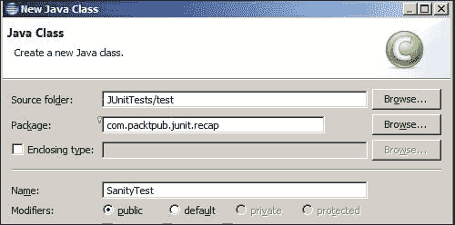

    创建以 `Test` 后缀结尾的测试类是一种良好的实践。因此，一个 `MyClass` 类将有一个 `MyClassTest` 测试类。一些代码覆盖率工具会忽略不以 `Test` 后缀结尾的测试。

1.  将以下代码添加到 `SanityTest` 类中：

    ```java
    import org.junit.After;
    import org.junit.AfterClass;
    import org.junit.Before;
    import org.junit.BeforeClass;
    import org.junit.Test;

    public class SanityTest {

      @BeforeClass
      public static void beforeClass() {
        System.out.println("***Before Class is invoked");
      }

      @Before
      public void before() {
        System.out.println("____________________");
        System.out.println("\t Before is invoked");
      }
      @After
      public void after() {
        System.out.println("\t After is invoked");
        System.out.println("=================");
      }

      @Test
      public void someTest() {
        System.out.println("\t\t someTest is invoked");
      }

      @Test
      public void someTest2() {
        System.out.println("\t\t someTest2 is invoked");
      }

      @AfterClass
      public static void afterClass() {
        System.out.println("***After Class is invoked");
      }
    }
    ```

    ### 提示

    **下载示例代码**

    您可以从您在 [`www.packtpub.com`](http://www.packtpub.com) 的账户中下载您购买的所有 Packt 书籍的示例代码文件。如果您在其他地方购买了这本书，您可以访问 [`www.packtpub.com/support`](http://www.packtpub.com/support) 并注册，以便将文件直接通过电子邮件发送给您。

    在前面的类中，我们创建了六个方法。两个测试方法用 `@Test` 注解。请注意，两个方法（`beforeClass` 和 `afterClass`）是静态的，其他四个是非静态的。用 `@BeforeClass` 注解的静态方法仅在测试类实例化之前调用一次，即 `@AfterClass` 在类完成所有执行后调用。

1.  运行测试。按 *Alt* + *Shift* + *X* 和 *T* 或导航到 **运行** | **运行方式** | **JUnit 测试**。你将看到以下控制台（`System.out.println`）输出：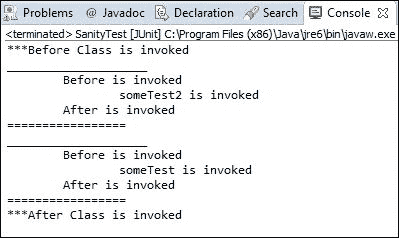

    检查 `before` 和 `after` 方法是否在每个测试运行前后执行。然而，测试方法执行的顺序可能会变化。在某些运行中，`someTest` 可能会在 `someTest2` 之前执行，反之亦然。`afterClass` 和 `beforeClass` 方法只执行一次。

恭喜！我们成功运行了第一个 JUnit 4 测试。

### 注意

`@Before` 和 `@After` 可以应用于任何 `public void` 方法。`@AfterClass` 和 `@BeforeClass` 只能应用于 `public static void` 方法。

### 使用断言验证测试条件

断言是一种工具（一个谓词），用于验证程序实现的实际结果与编程假设（期望）的一致性；例如，程序员可以期望两个正数的相加将得到一个正数。因此，他或她可以编写一个程序来相加两个数，并用实际结果断言期望的结果。

`org.junit.Assert` 包提供了静态重载方法，用于断言所有原始类型、对象和数组的预期和实际值。

以下是有用的断言方法：

+   `assertTrue(condition)` 或 `assertTrue(failure message, condition)`：如果条件变为假，断言失败并抛出 `AssertionError`。当传递失败消息时，将抛出失败消息。

+   `assertFalse(condition)` 或 `assertFalse(failure message, condition)`：如果条件变为真，断言失败并抛出 `AssertionError`。

+   `assertNull`：这个方法检查对象是否为空，如果参数不为空，则抛出 `AssertionError`。

+   `assertNotNull`：这个方法检查参数是否不为空；否则，如果参数不为空，则抛出 `AssertionError`。

+   `assertEquals(string message, object expected, object actual)`，或 `assertEquals(object expected, object actual)`，或 `assertEquals(primitive expected, primitive actual)`：如果传递了原始值并比较这些值，则此方法表现出有趣的行为。如果传递了对象，则调用 `equals()` 方法。此外，如果实际值与预期值不匹配，则抛出 `AssertionError`。

+   `assertSame(object expected, object actual)`: 这个方法只支持对象，并使用 `==` 操作符检查对象引用。如果传递了两个不同的对象，则抛出 `AssertionError`。

+   `assertNotSame`：这是 `assertSame` 的反义词。当两个参数引用相同时，它将失败。

    ### 注意

    有时 `double` 由于 Java 存储双精度浮点数的方式，可能会导致令人惊讶的结果。任何对双精度浮点数值的操作都可能导致意外结果。断言不依赖于双精度比较；因此，`assertEquals(double expected, double actual)` 已被弃用。

    声明一个 `double` 变量 `sum = .999 + .98`。`sum` 变量应该将值相加并存储 1.98，但当你打印机器上的值时，你会得到 `1.9889999999999999` 作为输出。所以，如果你用 `double` 值 1.98 断言 `sum`，测试将失败。

    `assert` 方法提供了一个重载方法用于 `double` 值断言，即 `assertEquals(double expected, double actual, double delta)`。在比较过程中，如果预期值和实际值之间的差异小于 delta 值，则结果被认为是通过的。

    对于货币计算，建议使用 `BigDecimal` 而不是双精度浮点数。

我们将在测试中使用 `assert` 方法如下：

1.  在 `com.packtpub.junit.recap` 下创建一个 `AssertTest` 测试类。将以下行添加到该类中：

    ```java
    package com.packtpub.junit.recap;

    import org.junit.Assert;
    import org.junit.Test;

    public class AssertTest {

      @Test
      public void assertTrueAndFalseTest() throws Exception {
        Assert.assertTrue(true);
        Assert.assertFalse(false);
      }

      @Test
      public void assertNullAndNotNullTest() throws Exception {
        Object myObject = null;
        Assert.assertNull(myObject);

        myObject = new String("Some value");
        Assert.assertNotNull(myObject);
      }
    }
    ```

    在前面的代码中，`assertTrueAndFalseTest` 向 `assertTrue` 发送 `true`，向 `assertFalse` 发送 `false`。因此，测试不应该失败。

    在 `assertNullAndNotNullTest` 中，我们向 `assertNull` 传递 `null`，向 `assertNotNull` 传递非空 `String`；因此，这个测试不应该失败。

    运行测试。它们应该是绿色的。

1.  我们将检查`assertEquals`并添加以下测试和静态导入`assertEquals`方法：

    ```java
      import static org.junit.Assert.assertEquals;

      @Test
      public void assertEqualsTest() throws Exception {
        Integer i = new Integer("5");
        Integer j = new Integer("5");;
        assertEquals(i,j);
      }
    ```

    在前面的代码中，我们定义了两个`Integer`对象，`i`和`j`，并将它们初始化为 5。现在，当我们将它们传递给`assertEquals`时，测试通过，因为`assertEquals`方法调用`i.equals(j)`而不是`i == j`。因此，只比较值，而不是引用。

    `assertEquals`方法适用于所有原始类型和对象。要验证双精度值，可以使用重载的`assertEquals(actual, expected, delta)`方法，或者直接使用`BigDecimal`而不是使用`Double`。

1.  添加一个测试以验证`assertNotSame`的行为并静态导入`assertNotSame`方法：

    ```java
       import static org.junit.Assert.assertNotSame;
      @Test
      public void assertNotSameTest() throws Exception {
        Integer i = new Integer("5");
        Integer j = new Integer("5");;
        assertNotSame(i , j);
      }
    ```

    `assertNotSame`方法仅在预期对象和实际对象引用相同的内存位置时失败。在这里，`i`和`j`持有相同的值，但内存引用不同。

1.  添加一个测试以验证`assertSame`的行为并静态导入`assertSame`方法：

    ```java
      import static org.junit.Assert.assertSame;
      @Test
      public void assertSameTest() throws Exception {
        Integer i = new Integer("5");
        Integer j = i;
        assertSame(i,j);
      }
    ```

    `assertSame`方法仅在预期对象和实际对象引用相同的内存位置时通过。在这里，`i`和`j`持有相同的值并指向相同的地址。

## 与异常处理一起工作

要测试错误条件，异常处理功能很重要。例如，一个 API 需要三个对象；如果任何参数为 null，则 API 应该抛出异常。这可以很容易地测试。如果 API 没有抛出异常，测试将失败。

`@Test`注解接受`expected=<<Exception class name>>.class`参数。

如果预期的异常类与代码抛出的异常不匹配，测试将失败。考虑以下代码：

```java
      @Test(expected=RuntimeException.class)
  public void exception() {
    throw new RuntimeException();
  }
```

这只是一个解决方案。还有几种其他方法通常被认为是更好的解决方案。在 JUnit 4.8+中使用`@Rule`并分配`ExpectedException`是一个更强的解决方案，因为你可以检查消息以及类型。我们在本章的*与 JUnit 4++一起工作*部分中介绍了`@Rule`。

## 探索`@RunWith`注解

测试运行器执行 JUnit 测试。Eclipse 有一个内置的本地图形运行器。JUnit 4 提供定义要运行的套件和显示其结果的工具。

当一个类被`@RunWith`注解或类扩展了一个被`@RunWith`注解的类时，JUnit 将调用它引用的类来运行该类的测试，而不是使用内置的运行器。`@RunWith`注解用于改变测试类的性质。它可以用来运行参数化测试，甚至是 Spring 测试，或者它可以是 Mockito 运行器，用于初始化带有`@Mock`注解的模拟对象。

`@RunWith`注解接受一个参数。该参数必须是一个从`org.junit.runner.Runner`扩展的类。

`JUnit4.class`是一个运行器的例子。这个类将当前默认的 JUnit 4 类运行器别名为。

`Suite`是一个标准运行器，允许我们构建包含来自多个包的测试的套件。以下是一个`@RunWith`的示例：

```java
@RunWith(Suite.class)
public class Assumption {

}
```

# 使用 JUnit 4++

本节探讨了 JUnit 4 框架的高级特性，包括以下主题：参数化测试、Hamcrest 匹配器和 assertThat、假设、理论、超时、类别、规则、测试套件和测试顺序。

## 忽略一个测试

假设一个失败的测试阻止你检查一个关键任务代码，而你又得知代码的所有者正在度假。你该怎么办？你尝试修复测试，或者只是注释掉或删除测试以继续你的检查（将文件提交到源控制如 SVN），或者你等待直到测试被修复。

有时我们注释掉测试是因为功能尚未开发。JUnit 为此提供了解决方案。我们不必注释测试，只需通过使用`@Ignore`注解测试方法来忽略它。注释掉测试或代码是糟糕的，因为它除了增加代码大小并降低其可读性外，什么都不做。此外，当你注释掉测试时，测试报告不会告诉你关于注释掉的测试的任何信息；然而，如果你忽略一个测试，那么测试报告会告诉你需要修复某些被忽略的测试。因此，你可以跟踪被忽略的测试。

使用`@Ignore("Reason: why do you want to ignore?")`。给出适当的描述可以解释忽略测试的意图。以下是一个示例，其中测试方法被忽略是因为假日计算不工作：

```java
@Test
@Ignore("John's holiday stuff failing")
public void when_today_is_holiday_then_stop_alarm() {
}
```

以下是从 Eclipse 中截取的屏幕截图：

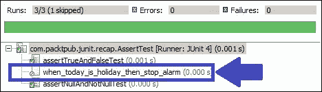

你可以在测试类上放置`@Ignore`注解，从而有效地忽略所有包含的测试。

## 按顺序执行测试

JUnit 被设计为允许随机执行，但通常它们是按线性方式执行的，顺序没有保证。JUnit 运行器依赖于反射来执行测试。通常，测试执行顺序不会随运行而变化；实际上，随机性是环境特定的，并且从 JVM 到 JVM 会有所不同。因此，最好不要假设它们将以相同的顺序执行并依赖于其他测试，但有时我们需要依赖顺序。

例如，当你想编写慢速测试以向数据库中插入一行时，首先更新该行，最后删除该行。在这里，除非插入函数被执行，否则删除或更新函数无法运行。

JUnit 4.11 为我们提供了一个`@FixMethodOrder`注解来指定执行顺序。它接受`enum MethodSorters`。

要更改执行顺序，使用`@FixMethodOrder`注解你的测试类并指定以下可用的`enum MethodSorters`常量之一：

+   `MethodSorters.JVM`：这会保留由 JVM 返回的测试方法顺序。这个顺序可能每次运行都会变化。

+   `MethodSorters.NAME_ASCENDING`: 这将按字典顺序对测试方法进行排序。

+   `MethodSorters.DEFAULT`: 这是默认值，但不保证执行顺序。

我们将编写一些测试来验证这种行为。

添加一个 `TestExecutionOrder` 测试并创建测试，如下面的代码片段所示：

```java
public class TestExecutionOrder {
  @Test   public void edit() throws Exception {
    System.out.println("edit executed");
  }
  @Test   public void create() throws Exception {
    System.out.println("create executed");
  }
  @Test   public void remove() throws Exception {
    System.out.println("remove executed");
  }  
}
```

运行测试。执行顺序可能会变化，但如果我们用 `@FixMethodOrder(MethodSorters.NAME_ASCENDING)` 注解类，测试将按以下顺序执行：

```java
@FixMethodOrder(MethodSorters.NAME_ASCENDING)
public class TestExecutionOrder { … }
```

以下 Eclipse 截图显示了按顺序执行的测试：

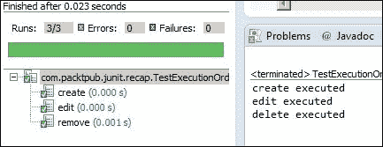

## 学习假设

在多站点项目中，偶尔，日期或时区测试在本地 CI 服务器上失败，但在不同时区的其他服务器上运行良好。我们可以选择不在本地服务器上运行那些自动测试。

有时我们的测试会因为第三方代码或外部软件中的错误而失败，但我们知道在某个特定的构建或版本之后，错误将被修复。我们应该注释掉代码并等待构建可用吗？

在许多项目中，**Jenkins**（用于测试自动化）和**SONAR**（用于代码质量指标）在服务器上运行。观察到由于资源不足，当 SONAR 处理时，自动测试会无限期地运行，并且测试会同时进行。

JUnit 对所有这些问题都有答案。它建议使用 `org.junit.Assume` 类。

与 `Assert` 类似，`Assume` 提供了许多静态方法，例如 `assumeTrue(condition)`、`assumeFalse(condition)`、`assumeNotNull(condition)` 和 `assumeThat(condition)`。在执行测试之前，我们可以使用 `assumeXXX` 方法检查我们的假设。如果我们的假设失败，那么 `assumeXXX` 方法将抛出 `AssumptionViolatedException`，JUnit 运行器将忽略有失败假设的测试。

所以，基本上，如果我们的假设不正确，测试将被忽略。我们可以假设测试是在 EST 时区运行的；如果测试在其他地方运行，它们将被自动忽略。同样，我们可以假设第三方代码版本高于构建/版本 123；如果构建版本较低，测试将被忽略。

让我们编写代码来验证我们对 `Assume` 的假设。

在这里，我们将尝试解决 SONAR 服务器问题。我们将假设 SONAR 没有运行。如果测试执行期间 SONAR 正在运行，假设将失败，测试将被忽略。

创建一个 `Assumption` 测试类。以下是该类的主体：

```java
public class Assumption {

  boolean isSonarRunning = false;
  @Test 
  public void very_critical_test() throws Exception {
    isSonarRunning = true;
    Assume.assumeFalse(isSonarRunning);
    assertTrue(true);
  }

}
```

这里，为了简单起见，我们添加了一个 `isSonarRunning` 变量来复制一个 SONAR 服务器外观。在实际代码中，我们可以调用一个 API 来获取值。我们将变量设置为 `false`。然后，在测试中，我们将重置该值为 `true`。这意味着 SONAR 正在运行。因此，我们的假设 SONAR 没有运行是错误的；因此，测试将被忽略。

以下屏幕截图显示测试被忽略。我们没有使用 `@Ignore` 注解测试：

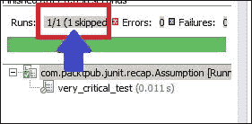

当我们将 `isSonarRunning` 变量的值更改为 `false` 时，如以下代码片段所示，测试将被执行：

```java
public void very_critical_test() throws Exception {
    isSonarRunning = false;
    Assume.assumeFalse(isSonarRunning);
    assertTrue(true);
}
```

持续集成工具，如 Jenkins，可以运行多个工具，如 Sonar，以获取代码质量指标。始终是一个好习惯，在测试通过之后才检查代码质量，这样可以防止在同时进行 CPU 密集型任务。 

假设（Assumption）也用于 `@Before` 方法中，但请注意不要过度使用它。假设在 TDD（测试驱动开发）中很有用，因为它允许提前编写预测试。

## 探索测试套件

要运行多个测试用例，JUnit 4 提供了 `Suite.class` 和 `@Suite.SuiteClasses` 注解。此注解接受一个数组（以逗号分隔）的测试类。

创建一个 `TestSuite` 类，并使用 `@RunWith(Suite.class)` 注解该类。此注解将强制 Eclipse 使用套件运行器。

接下来，使用 `@Suite.SuiteClasses({ AssertTest.class, TestExecutionOrder.class, Assumption.class })` 注解类，并传递以逗号分隔的测试类名称。

以下是一个代码片段：

```java
import org.junit.runner.RunWith;
import org.junit.runners.Suite;

@RunWith(Suite.class)
@Suite.SuiteClasses({ AssertTest.class, TestExecutionOrder.class,Assumption.class })
public class TestSuite {

}
```

在执行过程中，套件将执行所有测试。以下是一个套件运行的屏幕截图。检查它是否从三个测试固定装置 `AssertTest`、`TestExecutionOrder` 和 `Assumption` 中运行了七个测试。

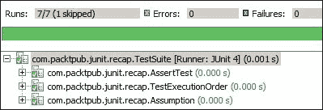

为相关测试组创建测试套件，例如数据访问、API 使用测试组或输入验证逻辑测试组。

## 使用 `assertThat` 进行断言

Joe Walnes 创建了 `assertThat(Object actual, Matcher matcher)` 方法。普遍认为 `assertThat` 比 `assertEquals` 更易读且更有用。`assertThat` 方法的语法如下：

```java
  public static void assertThat(Object actual, Matcher matcher
```

在这里，`Object` 是实际接收到的值，而 `Matcher` 是 `org.hamcrest.Matcher` 接口的一个实现。此接口来自一个名为 `hamcrest.jar` 的独立库。

匹配器允许对期望进行部分或精确匹配，而 `assertEquals` 使用精确匹配。`Matcher` 提供了如 `is`、`either`、`or`、`not` 和 `hasItem` 等实用方法。`Matcher` 方法使用 **建造者模式**，这样我们就可以组合一个或多个匹配器来构建复合匹配器链。就像 `StringBuilder` 一样，它通过多个步骤构建字符串。

以下是一些匹配器和 `assertThat` 的示例：

+   `assertThat(calculatedTax, is(not(thirtyPercent)) );`

+   `assertThat(phdStudentList, hasItem(DrJohn) );`

+   `assertThat(manchesterUnitedClub, both( is(EPL_Champion)).and(is(UEFA_Champions_League_Champion)) );`

前面的例子比 JUnit 测试代码更像是英语。因此，任何人都可以理解代码和测试的意图，而匹配器提高了可读性。

Hamcrest 提供了一个名为`org.hamcrest.CoreMatchers`的实用匹配器类。

`CoreMatchers`的一些实用方法包括`allOf`、`anyOf`、`both`、`either`、`describedAs`、`everyItem`、`is`、`isA`、`anything`、`hasItem`、`hasItems`、`equalTo`、`any`、`instanceOf`、`not`、`nullValue`、`notNullValue`、`sameInstance`、`theInstance`、`startsWith`、`endsWith`和`containsString`。所有这些方法都返回一个匹配器。

我们使用了`assertEquals`；因此，让我们从`equalTo`开始。`equalTo`方法等同于`assertEquals`。

### 比较匹配器 - equalTo、is 和 not

创建一个`AssertThatTest.java` JUnit 测试并静态导入`org.hamcrest.CoreMatchers.*;`如下：

```java
import static org.hamcrest.CoreMatchers.not;
import static org.hamcrest.CoreMatchers.is;
import static org.junit.Assert.assertThat;

import org.junit.Test;

public class AssertThatTest {

  @Test
  public void verify_Matcher() throws Exception {
    int age = 30;
    assertThat(age, equalTo(30));
    assertThat(age, is(30));

    assertThat(age, not(equalTo(33)));
    assertThat(age, is(not(33)));
  }
}
```

将`age`变量设置为`30`，然后同样为`assertEquals`调用`equalTo`，这里它是`Matcher`。`equalTo`方法接受一个值。如果`Matcher`值与实际值不匹配，则`assertThat`抛出`AssertionError`异常。

将`age`变量的值设置为`29`并重新运行测试。以下错误将会发生：

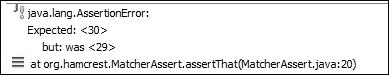

`is(a)`属性接受一个值并返回一个布尔值，其行为类似于`equalTo(a)`。`is(a)`属性等同于`is(equalTo(a))`。

`not`属性接受一个值或一个匹配器。在上面的代码中，我们使用了`assertThat(age, is(not(33)))`。这个表达式不过是`age is not 33`，并且比`assert`方法更易读。

### 处理复合值匹配器 - either、both、anyOf、allOf 和 not

在本节中，我们将使用`either`、`both`、`anyOf`、`allOf`和`not`。将以下测试添加到`AssertThatTest.java`文件中：

```java
@Test
  public void verify_multiple_values() throws Exception {

    double marks = 100.00;
    assertThat(marks, either(is(100.00)).or(is(90.9)));

    assertThat(marks, both(not(99.99)).and(not(60.00)));

    assertThat(marks, anyOf(is(100.00),is(1.00),is(55.00),is(88.00),is(67.8)));

    assertThat(marks, not(anyOf(is(0.00),is(200.00))));

    assertThat(marks, not(allOf(is(1.00),is(100.00), is(30.00))));
  }
```

在前面的例子中，一个名为`marks`的双变量被初始化为`100.00`的值。这个变量的值通过一个`either`匹配器进行断言。

基本上，使用`either`，我们可以将两个值与实际或计算出的值进行比较。如果其中任何一个匹配，则断言通过。如果没有一个匹配，则抛出`AssertionError`异常。

`either(Matcher)`方法接受一个匹配器并返回一个`CombinableEitherMatcher`类。`CombinableEitherMatcher`类有一个`or(Matcher other)`方法，这样`either`和`or`就可以组合使用。

`or(Matcher other)`方法被翻译为`return (new CombinableMatcher(first)).or(other);`，最后变为`new CombinableMatcher(new AnyOf(templatedListWith(other)))`。

使用`both`，我们可以将两个值与实际或计算出的值进行比较。如果其中任何一个不匹配，则抛出`AssertionError`异常。如果两个都匹配，则断言通过。

一个如数学分数这样的数值不能同时等于 60 和 80。然而，我们可以否定这个表达式。如果数学分数是 80，那么使用`both`匹配器，我们可以将表达式写为`assertThat(mathScore, both(not(60)).and(not(90)))`。

`anyOf` 匹配器更像是具有多个值的 `either`。使用 `anyOf`，我们可以将多个值与实际或计算值进行比较。如果其中任何一个匹配，则断言通过。如果没有一个匹配，则抛出 `AssertionError` 异常。

`allOf` 匹配器更像是具有多个值的 `both`。使用 `allOf`，我们可以将多个值与实际或计算值进行比较。如果其中任何一个不匹配，则抛出 `AssertionError` 异常。类似于 `both`，我们可以使用 `allOf` 与 `not` 一起检查一个值是否属于集合。

在前面的示例中，使用 `allOf` 和 `not`，我们检查了 `marks` 属性是否不是 `1`、`100` 或 `30`。

### 使用集合匹配器 – hasItem 和 hasItems

在上一节中，我们针对多个值进行了断言。在本节中，我们将对一组值与一个值或多个值进行断言。

考虑以下示例。一个工资列表被填充了三个值：`50.00`、`200.00` 和 `500.00`。使用 `hasItem` 检查一个值是否存在于集合中，并使用 `hasItems` 检查多个值是否存在于集合中，如下面的代码所示：

```java
   @Test
  public void verify_collection_values() throws Exception {

    List<Double> salary =Arrays.asList(50.0, 200.0, 500.0);

    assertThat(salary, hasItem(50.00));
    assertThat(salary, hasItems(50.00, 200.00));
        assertThat(salary, not(hasItem(1.00)));
  }
```

`hasItem` 匹配器有两个版本：一个接受一个值，另一个接受匹配器。因此，我们可以使用 `hasItem` 检查集合中的一个值，或者使用 `not` 和 `hasItem` 检查一个值是否不存在于集合中。`hasItems` 匹配器对一组值进行操作。

### 探索字符串匹配器 – startsWith、endsWith 和 containsString

在本节中，我们将探索字符串匹配器。`CoreMatchers` 有三个内置的字符串匹配器方法。在以下示例中，一个 `String` 变量 `name` 被赋予一个值，然后我们断言该名称以特定值开头、包含一个值和以一个值结尾：

```java
@Test
  public void verify_Strings() throws Exception {
    String name = "John Jr Dale";
    assertThat(name, startsWith("John"));
    assertThat(name, endsWith("Dale"));
    assertThat(name, containsString("Jr"));
  }
```

`startsWith` 匹配器仅对字符串进行操作。它检查字符串是否以给定的字符串开头。`endsWith` 匹配器检查字符串是否以给定的字符串结尾。`containsString` 匹配器检查字符串是否包含另一个字符串。

有时，一个方法调用返回一个 JSON 响应。使用 `containsString`，可以断言一个特定的值。

### 注意

注意，`startsWith`、`endsWith` 和 `containsStrings` 并不是唯一的字符串匹配器。其他内置匹配器，如 `both`、`either`、`anyOf` 等等，也可以应用于 `String` 对象。

### 探索内置匹配器

`JUnitMatchers` 有内置的匹配器方法，但所有这些方法都已弃用。请使用 Hamcrest 匹配器代替 `JUnitMatchers`。

### 构建自定义匹配器

```java
assertThat works:
```

```java
  if(!matcher.matches(actual)){
         Description description = new StringDescription();
         description.appendText(reason).appendText("\nExpected: ).appendDescriptionOf(matcher).appendText("\n   but: ");

         matcher.describeMismatch(actual, description);
         throw new AssertionError(description.toString());
  }
```

注意，当 `matcher.matches()` 返回 `false` 时，描述是由实际值和匹配器构建的。`appendDescriptionOf()` 方法调用匹配器的 `describeTo()` 方法来构建错误消息。

最后，`matcher.describeMismatch(actual, description)` 将字符串 `but: was <<actual>>` 追加到描述中。

+   `lessThanOrEqual` 类需要比较两个对象，因此 `Matcher` 类应该在 `Comparable` 对象上操作。创建一个通用的类，它可以操作实现 `Comparable` 接口的任何类型，如下所示：

    ```java
    public class LessThanOrEqual<T extends Comparable<T>> extends BaseMatcher<Comparable<T>> {

    }
    ```

    +   现在我们需要实现 `describeTo` 和 `matches` 方法。`assertThat` 方法将实际值传递给匹配器的 `matches(Object o)` 方法，`lessThanOrEqual` 将接受一个与实际值比较的值。因此，在 `matches` 方法中，我们需要两个可比较的对象：一个作为参数传递，另一个传递给匹配器对象。期望值在 `matcher` 对象实例化期间传递，如下所示：

    ```java
    assertThat (actual, matcher(expectedValue)).
    ```

    我们将在创建 `Matcher` 对象期间存储 `expectedValue` 并在 `matches()` 方法中使用它来比较 `expectedValue` 与 `actual`，如下所示：

    ```java
    public class LessThanOrEqual<T extends Comparable<T>> extends BaseMatcher<Comparable<T>> {
      private final Comparable<T> expectedValue;

      public LessThanOrEqual(T expectedValue) {
       this.expectedValue = expectedValue;
      }

      @Override
      public void describeTo(Description description) {
        description.appendText(" less than or equal(<=) "+expectedValue);
      }

      @Override
      public boolean matches(Object t) {
        int compareTo = expectedValue.compareTo((T)t);
        return compareTo > -1;
      }
    }
    ```

    前面的 `LessThanOrEqual` 类应该仅在 `expectedValue.compareTo(actual) >= 0` 时返回 `true`，然后 `describeTo()` 方法将字符串 `"less than or equals (<=) "+ expectedValue` 添加到 `description` 中，这样如果断言失败，则将显示消息 "`less than or equals (<=) "+ expectedValue`"。

    +   `assertThat` 方法接受一个匹配器，但 `new LessThanOrEqual(expectedValue)` 的样子看起来并不好。我们将在 `LessThanOrEqual` 类中创建一个 `static` 方法来创建一个新的 `LessThanOrEqual` 对象。如下从 `assertThat` 方法调用此方法：

    ```java
      @Factory
      public static<T extends Comparable<T>>  Matcher<T>        
        lessThanOrEqual(T t) {
        return new LessThanOrEqual(t);
        }
    ```

    `@Factory` 注解不是必需的，但对于 Hamcrest 工具是必需的。当我们创建许多自定义匹配器时，逐个导入它们会变得很烦人。Hamcrest 随带一个 `org.hamcrest.generator.config.XmlConfigurator` 命令行工具，该工具拾取带有 `@Factory` 注解的谓词，并将它们收集到一个 `Matcher` 类中以方便导入。

    +   静态导入 `LessThanOrEqual` 类，并将测试添加到 `AssertThatTest.java` 中以验证自定义匹配器，如下所示：

    ```java
       @Test
      public void lessthanOrEquals_custom_matcher() throws Exception
      {
        int actualGoalScored = 2;
        assertThat(actualGoalScored, lessThanOrEqual(4));
        assertThat(actualGoalScored, lessThanOrEqual(2));

        double originalPI = 3.14;
        assertThat(originalPI, lessThanOrEqual(9.00));

        String authorName = "Sujoy";
        assertThat(authorName, lessThanOrEqual("Zachary"));
      }
    ```

    这个测试应该通过。

    +   用更大的值测试代码怎么样？在 Java 中，`Integer.MAX_VALUE` 存储最大整数值，`Integer.MIN_VALUE` 存储最小整数值。如果我们期望最大值将大于或等于最小值，那么断言应该失败。考虑以下代码片段：

    ```java
        int maxInt = Integer.MAX_VALUE;
        assertThat(maxInt, lessThanOrEqual(Integer.MIN_VALUE));
    ```

    这将抛出以下错误：

    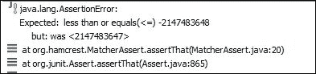

## 创建参数化测试

参数化测试用于对单个输入进行多次迭代以在测试中压力测试对象。主要原因是减少测试代码的数量。

在 TDD 中，代码是为了满足失败的测试而编写的。生产代码逻辑是从一系列测试用例和不同的输入值构建的。例如，如果我们需要构建一个将返回数字阶乘的类，那么我们将传递不同的数据集并验证我们的实现是否通过验证。

我们知道 0 的阶乘是 1，1 的阶乘是 1，2 的阶乘是 2，3 的阶乘是 6，4 的阶乘是 24，依此类推。

因此，如果我们编写像 `factorial_of_1_is_1` 和 `factorial_of_4_is_24` 这样的测试，那么测试类将很容易被污染。我们将编写多少个方法？

我们可以创建两个数组：一个包含期望值，另一个包含原始数字。然后，我们可以遍历数组并断言结果。我们不必这样做，因为 JUnit 4 框架为我们提供了一个类似的解决方案。它为我们提供了一个 `Parameterized` 运行器。

我们在前面的小节中了解了 `@RunWith` 注解。`Parameterized` 是一种特殊的运行器，可以与 `@RunWith` 注解一起使用。

参数化有两种类型：构造函数和方法。

### 使用参数化构造函数

按照以下步骤使用构造函数构建参数化测试：

1.  创建一个源文件夹 `src`，并在 `src/ com.packtpub.junit.recap` 下添加一个 `Factorial.java` 类。

1.  实现阶乘算法。将以下代码添加到 `Factorial.java` 类中：

    ```java
    package com.packtpub.junit.recap;

    public class Factorial {

      public long factorial(long number) {
        if(number == 0) {
          return 1;
        }

        return number*factorial(number-1);
      }
    }
    ```

1.  在 `test/ com.packtpub.junit.recap` 下添加一个 `ParameterizedFactorialTest.java` 测试，并用 `@RunWith(Parameterized.class)` 注解该类，如下所示：

    ```java
    import org.junit.runner.RunWith;
    import org.junit.runners.Parameterized;

    @RunWith(Parameterized.class)
    public class ParameterizedFactorialTest {

    }
    ```

1.  添加一个创建阶乘算法数据集的方法。该方法应返回 `Collection` 的 `Object[]` 方法。我们需要一个二维数组集合来保存数字和阶乘值。为了定义数据参数，用 `@Parameters` 注解该方法。

    ```java
    @parameters method factorialData():
    ```

    ```java
      @Parameters
      public static Collection<Object[]> factorialData() {
        return Arrays.asList(new Object[][] {

          { 0, 1 }, { 1, 1 }, { 2, 2 }, { 3, 6 }, { 4, 24 }, { 5, 120 },{ 6, 720 }  
        });
      }
    ```

    检查数组是否包含数字和期望的阶乘结果（0 的阶乘是 1，5 的阶乘是 120，依此类推）。

1.  `Parameterized` 运行器需要一个构造函数来传递数据集合。对于集合中的每一行，0^(th) 数组元素将作为 1^(st) 构造函数参数传递，下一个索引将作为 2^(nd) 参数传递，依此类推，如下所示：

    ```java
        private int number;
        private int expectedResult;

        public ParameterizedFactorialTest(int input, int expected) {
            number= input;
            expectedResult= expected;
        }
    ```

    在测试类中，我们添加了两个成员来保存数字和期望的阶乘值。在构造函数中设置这些值。`Parameterized` 运行器将遍历数据集合（用 `@Parameters` 注解），并将值传递给构造函数。

    例如，它将以 0 作为输入并期望得到 1，然后以 1 作为输入并期望得到 1，依此类推。

1.  现在，我们需要添加一个测试方法来断言数字和阶乘，如下所示：

    ```java
       @Test
      public void factorial() throws Exception {
        Factorial fact = new Factorial();
        assertEquals(fact.factorial(number),expectedResult);
      }
    ```

    我们创建了一个 `Factorial` 对象，并将数字传递给它以获取实际结果，然后使用 `expectedResult` 断言实际值。在这里，运行者将创建测试类的七个实例并执行测试方法。

    以下截图显示了从 Eclipse 中获取的测试运行结果：

    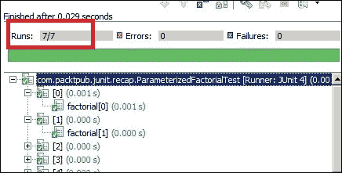

    注意，运行了七个测试，测试名称为 [0] factorial[0]，[1] factorial[1]，等等，直到 [6]。

    ### 注意

    如果数据集返回一个空集合，测试不会失败；实际上，什么也不会发生。

    如果对象数组和构造函数参数的数量不匹配，则抛出`java.lang.IllegalArgumentException: wrong number of arguments`异常。例如，{ 0, 1, 3 }将抛出异常，因为传递了 3 个参数，但构造函数只能接受 2 个。

    如果构造函数未定义但数据集包含值，则抛出`java.lang.IllegalArgumentException: wrong number of arguments`异常。

### 使用参数化方法

我们学习了参数化构造函数；现在我们将运行参数化测试，但不包括构造函数。按照以下步骤使用`@Parameter`注解运行测试：

1.  添加一个`ParameterizeParamFactorialTest.java`测试类。

1.  从构造函数测试复制内容并删除构造函数。将类成员更改为`public`，如下所示：

    ```java
    @RunWith(Parameterized.class)
    public class ParameterizeParamFactorialTest {

      @Parameters
      public static Collection<Object[]> factorialData() {
        return Arrays.asList(new Object[][] {

          { 0, 1 }, { 1, 1 }, { 2, 2 }, { 3, 6 }, { 4, 24 }, { 5, 120 },{ 6, 720 }  
        });
      }

      public int number;
      public int expectedResult;

      @Test
      public void factorial() throws Exception {
        Factorial fact = new Factorial();
      assertEquals(fact.factorial(number),expectedResult);
      }
    }
    ```

1.  如果我们运行测试，它将失败，因为反射过程找不到匹配的构造函数。JUnit 提供了一个注解来遍历数据集并将值设置到类成员中。`@Parameter(value=index)`接受一个值。该值是数据收集对象数组的数组索引。确保`number`和`expectedResult`变量是`public`的；否则，将抛出安全异常。用以下参数注解它们：

    ```java
        @Parameter(value=0)
        public int number;
        @Parameter(value=1)
        public int expectedResult;
    ```

Eclipse 有一个错误，会截断名称。

## 处理超时

JUnit 测试在代码更改后自动执行以获得快速反馈。如果测试运行时间过长，则违反了快速反馈原则。JUnit 在`@Test`注解中提供了一个超时值（以毫秒为单位），以确保如果测试运行时间超过指定值，则测试失败。

以下是一个超时的示例：

```java
  @Test(timeout=10)
  public void forEver() throws Exception {
    Thread.sleep(100000);
  }
```

在这里，测试将在 10 毫秒后自动失败。以下是一个 Eclipse 截图，显示了错误：

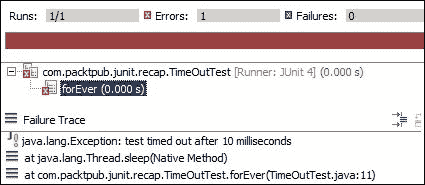

## 探索 JUnit 理论

理论是一种 JUnit 测试，但与典型的基于示例的 JUnit 测试不同，在典型的测试中，我们断言特定的数据集并期望特定的结果。JUnit 理论是 JUnit 参数化测试的替代方案。JUnit 理论封装了测试者对对象通用行为的理解。这意味着理论断言的任何内容都应适用于所有数据集。理论对于在边界值情况下查找错误很有用。

参数化测试允许我们编写灵活的数据驱动测试，并将数据与测试方法分离。理论类似于参数化测试——两者都允许我们在测试用例之外指定测试数据。

参数化测试很好，但它们有以下缺点：

+   参数被声明为成员变量。它们污染了测试类，并使系统变得不必要地复杂。

+   参数需要传递给单个构造函数或变量需要注解，这使类变得难以理解。

+   测试数据不能外部化。

理论提供了许多注解和一个运行器类。让我们检查理论中的重要注解和类，如下所示：

+   `@Theory`：与`@Test`类似，这个注解标识了一个要运行的理论测试。`@Test`注解与理论运行器不兼容。

+   `@DataPoint`：这个注解标识一组单个测试数据（类似于`@Parameters`），即静态变量或方法。

+   `@DataPoints`：这个注解标识多组测试数据，通常是一个数组。

+   `@ParametersSuppliedBy`：这个注解为测试用例提供参数。

+   `Theories`：这个注解是针对基于理论的测试用例的 JUnit 运行器，并扩展了`org.junit.runners.BlockJUnit4ClassRunner`。

+   `ParameterSupplier`：这是一个抽象类，它为我们提供了可以提供给测试用例的参数的句柄。

我们将从简单的理论开始，然后探索更多。执行以下步骤：

1.  创建一个`MyTheoryTest.java`类，并用`@RunWith(Theories.class)`注解该类。要运行一个理论，需要这个特殊的运行器。考虑以下代码：

    ```java
    @RunWith(Theories.class)
    public class MyTheoryTest {

    }
    ```

1.  现在运行测试。它将因为`java.lang.Exception: No runnable methods`错误而失败，因为没有定义任何理论。像`@Test`注解一样，我们将定义一个方法并用`@Theory`注解它，如下所示：

    ```java
    @RunWith(Theories.class)
    public class MyTheoryTest {

      @Theory
      public void sanity() {
        System.out.println("Sanity check");
      }
    }
    ```

    运行理论，它将无错误地执行。因此，我们的理论设置已准备就绪。

1.  定义一个`public static` `String`类型的`name`变量，并用`@DataPoint`注解这个变量。现在执行测试，没有发生任何特别的事情。如果一个理论方法（用`@Theory`注解）接受一个参数，并且用`@DataPoint`注解的变量与该类型匹配，那么该变量将在执行期间传递给理论。因此，修改`sanity`方法并添加一个`String`参数以将`@DataPoint`传递给`sanity()`方法，如下所示：

    ```java
    @RunWith(Theories.class)
    public class MyTheoryTest {
      @DataPoint public static String name ="Jack";

      @Theory
      public void sanity(String aName) {
        System.out.println("Sanity check "+aName);
      }
    }
    ```

    现在运行理论。在执行过程中，它将`@DataPoint`名称传递给`sanity(String aName)`方法，并且名称将被打印到控制台。

1.  现在，添加另一个静态的`@DataPoint`，命名为`mike`，并将`name`变量重命名为`jack`，如下所示：

    ```java
    @RunWith(Theories.class)
    public class MyTheoryTest {
      @DataPoint public static String jack ="Jack";
      @DataPoint public static String mike ="Mike";

      @Theory
      public void sanity(String aName) {
        System.out.println("Sanity check "+aName);
      }
    }
    ```

    在理论执行期间，两个`@DataPoint`变量都将传递给`sanity(String aName)`方法。输出将如下所示：

    

1.  现在，稍微修改一下`sanity()`方法——将`aName`参数重命名为`firstName`并添加第二个`String`参数，`lastName`。因此，现在`sanity`方法接受`String`参数`firstName`和`lastName`。使用以下代码打印这些变量：

    ```java
    @RunWith(Theories.class)
    public class MyTheoryTest {
      @DataPoint public static String jack ="Jack";
      @DataPoint public static String mike ="Mike";

      @Theory
      public void sanity(String firstName, String lastName) {
        System.out.println("Sanity check "+firstName+", "+lastName);
      }
    }
    ```

    当执行时，输出将如下所示：

    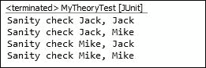

    因此，使用了 2 x 2 = 4 种组合。当在测试中定义多个`@DataPoint`注解时，理论适用于测试参数的所有可能的良好类型的数据点组合。

1.  到目前为止，我们只检查了单维变量。`@DataPoints` 注解用于提供一组数据。添加一个静态的 `char` 数组来存储字符变量，并添加一个 `Theory` 方法来接受两个字符。它将以 9（3²）种可能的组合执行理论如下：

    ```java
      @DataPoints  public static char[] chars = 
              new char[] {'A', 'B', 'C'};
      @Theory
      public void build(char c, char d) {
        System.out.println(c+" "+d);
      }
    ```

    以下输出：

    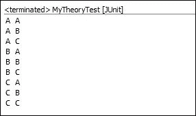

### 使用 @ParametersSuppliedBy 和 ParameterSupplier 外部化数据

到目前为止，我们已经介绍了如何使用 `@DataPoint` 和 `@DataPoints` 来设置测试数据。现在，我们将使用外部类通过 `@ParametersSuppliedBy` 和 `ParameterSupplier` 在测试中提供数据。为此，执行以下步骤：

1.  创建一个 `Adder.java` 类。这个类将有两个重载的 `add()` 方法，用于添加数字和字符串。我们将使用理论进行单元测试。

    以下是 `Adder` 类：

    ```java
      public class Adder {

        public Object add(Number a, Number b) {
          return a.doubleValue()+b.doubleValue();
        }

        public Object add(String a, String b) {
          return a+b;
        }
      }
    ```

1.  创建一个 `ExternalTheoryTest.java` 理论如下：

    ```java
    @RunWith(Theories.class)
    public class ExternalTheoryTest {

    }
    ```

1.  我们将不会使用 `@DataPoints` 来创建数据。相反，我们将创建一个单独的类来提供数字以验证 `add` 操作。JUnit 提供了一个 `ParameterSupplier` 类用于此目的。`ParameterSupplier` 是一个抽象类，它强制你定义一个如下所示的方法：

    ```java
    public abstract List<PotentialAssignment> getValueSources(ParameterSignature parametersignature);
    ```

    `PotentialAssignment` 是一个抽象类，JUnit 理论使用它以一致的方式为测试方法提供测试数据。它有一个静态的 `forValue` 方法，你可以使用它来获取 `PotentialAssignment` 的实例。

    创建一个 `NumberSupplier` 类来提供不同类型的数字：`float`、`int`、`double`、`long` 等。扩展 `ParameterSupplier` 类如下：

    ```java
      import org.junit.experimental.theories.ParameterSignature;
      import org.junit.experimental.theories.ParameterSupplier;
      import org.junit.experimental.theories.PotentialAssignment;

      public  class NumberSupplier extends ParameterSupplier {
        @Override
          public List<PotentialAssignment>       
          getValueSources(ParameterSignature sig) {
            List<PotentialAssignment> list = new ArrayList<PotentialAssignment>();
            list.add(PotentialAssignment.forValue("long", 2L));
            list.add(PotentialAssignment.forValue("float", 5.00f));
            list.add(PotentialAssignment.forValue("double", 89d));
            return list;
      }

    };
    ```

    检查重写的方法是否创建了一个包含不同数字的 `PotentialAssignment` 值的列表。

1.  现在，修改理论以添加两个数字。添加一个理论方法如下：

    ```java
    import org.junit.experimental.theories.ParametersSuppliedBy;
    import org.junit.experimental.theories.Theories;
    import org.junit.experimental.theories.Theory;
    import org.junit.runner.RunWith;

    @RunWith(Theories.class)
    public class ExternalTheoryTest {

      @Theory
      public void adds_numbers(
      @ParametersSuppliedBy(NumberSupplier.class) Number num1,
      @ParametersSuppliedBy(NumberSupplier.class) Number num2) 
      {
        System.out.println(num1 + " and " + num2);
      }

    }
    ```

    检查 `adds_numbers` 方法；两个 `Number` 参数 `num1` 和 `num2` 被注解为 `@ParametersSuppliedBy(NumberSupplier.class)`。

    当此理论执行时，`NumberSupplier` 类将传递一个列表。

1.  执行理论；它将打印以下结果：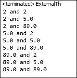

1.  现在，我们可以检查我们的 `Adder` 功能。修改理论以断言结果。

    创建一个 `Adder` 类的实例，并通过传递 `num1` 和 `num2` 调用 `add` 方法。将两个数字相加，并使用 `assert` 断言与 `Adder` 的结果。

    `assertEquals(double, double)` 方法已被弃用，因为双精度值计算结果不可预测。因此，`assert` 类为 `doubles` 添加了另一个版本的 `assertEquals`；它接受三个参数：实际值、预期值和 delta。如果实际值和预期值之间的差异大于或等于 delta，则断言通过如下：

    ```java
    @RunWith(Theories.class)
    public class ExternalTheoryTest {

      @Theory
      public void adds_numbers(
      @ParametersSuppliedBy(NumberSupplier.class) Number num1,
      @ParametersSuppliedBy(NumberSupplier.class) Number num2) {
        Adder anAdder = new Adder();
        double expectedSum = num1.doubleValue()+num2.doubleValue();
        double actualResult = (Double)anAdder.add(num1, num2);
        assertEquals(actualResult, expectedSum, 0.01);
      }

    }
    ```

    `Adder` 类有一个用于 `String` 的 `add` 方法。创建一个 `StringSupplier` 类来为我们的理论提供 `String` 值，并修改理论类以验证 `add (String, String)` 方法的行为。你可以如下断言 `Strings`：

    +   `String expected = str1+str2;`

    +   `assertEquals(expected, actual);`

    在这里，`str1` 和 `str2` 是理论的两个方法参数。

## 处理 JUnit 规则

规则允许非常灵活地添加或重新定义测试类中每个测试方法的行为。规则类似于 **面向切面编程**（**AOP**）；我们可以在实际测试执行之前和/或之后做有用的事情。你可以在 [`en.wikipedia.org/wiki/Aspect-oriented_programming`](http://en.wikipedia.org/wiki/Aspect-oriented_programming) 找到更多关于 AOP 的信息。

我们可以使用内置规则或定义我们的自定义规则。

在本节中，我们将查看内置规则并创建我们的自定义 Verifier 和 WatchMan 规则。

### 玩转超时规则

超时规则将相同的超时应用于类中的所有测试方法。之前，我们在 `@Test` 注解中使用了超时，如下所示：

```java
@Test(timeout=10)
```

以下是对 timeout 规则的语法：

```java
import org.junit.Rule;
import org.junit.Test;
import org.junit.rules.Timeout;

public class TimeoutTest {

    @Rule
    public Timeout globalTimeout =  new Timeout(20);

    @Test
    public void testInfiniteLoop1() throws InterruptedException{
      Thread.sleep(30);
    }

    @Test
    public void testInfiniteLoop2() throws InterruptedException{
      Thread.sleep(30);
    }

}
```

当我们运行这个测试时，它在 20 毫秒后超时。请注意，超时是全局应用于所有方法的。

### 使用 ExpectedException 规则

`ExpectedException` 规则是处理异常的重要规则。它允许你断言期望的异常类型和异常消息，例如，你的代码可能对所有失败条件抛出通用异常（如 `IllegalStateException`），但你可以断言通用异常消息以验证确切原因。

之前，我们使用了 `@Test(expected=Exception class)` 来测试错误条件。

`ExpectedException` 规则允许在测试中指定期望的异常类型和消息。

以下代码片段解释了如何使用异常规则来验证异常类和异常消息：

```java
public class ExpectedExceptionRuleTest {

   @Rule
    public ExpectedException thrown= ExpectedException.none();

    @Test
    public void throwsNothing() {

    }

    @Test
    public void throwsNullPointerException() {
      thrown.expect(NullPointerException.class);
      throw new NullPointerException();
    }

    @Test
    public void throwsIllegalStateExceptionWithMessage() {
      thrown.expect(IllegalStateException.class);
      thrown.expectMessage("Is this a legal state?");

      throw new IllegalStateException("Is this a legal state?");
    }
}
```

`expect` 对象设置期望的异常类，而 `expectMessage` 设置异常中的期望消息。如果消息或异常类与规则的期望不匹配，则测试失败。在每次测试中都会重置抛出的 `ExpectedException` 对象。

### 展开 TemporaryFolder 规则

`TemporaryFolder` 规则允许创建在测试方法结束时（无论通过与否）保证被删除的文件和文件夹。考虑以下代码：

```java
@Rule
  public TemporaryFolder folder = new TemporaryFolder();

  @Test
  public void testUsingTempFolder() throws IOException {
    File createdFile = folder.newFile("myfile.txt");
    File createdFolder = folder.newFolder("mysubfolder");

  }
```

### 探索 ErrorCollector 规则

`ErrorCollector` 规则允许在发现第一个问题后继续执行测试（例如，收集表中的所有错误行并一次性报告它们），如下所示：

```java
import org.junit.rules.ErrorCollector;
import static org.hamcrest.CoreMatchers.equalTo;

public class ErrorCollectorTest {

   @Rule
   public ErrorCollector collector = new ErrorCollector();

   @Test
   public void fails_after_execution() {
   collector.checkThat("a", equalTo("b"));
   collector.checkThat(1, equalTo(2));
   collector.checkThat("ae", equalTo("g"));
   }
}
```

在这个例子中，没有验证通过，但测试仍然完成了执行，并在最后通知所有错误。

以下是对应的日志——箭头指示错误——并且请注意，只有一个测试方法正在执行，但 Eclipse 指示有三次失败：


### 与 `Verifier` 规则一起工作

验证器是 `ErrorCollector` 的基类，否则如果验证检查失败，它可以将通过测试转换为失败测试。以下示例演示了 `Verifier` 规则：

```java
public class VerifierRuleTest {
  private String errorMsg = null;

  @Rule
  public TestRule rule = new Verifier() {
    protected void verify() {
      assertNull("ErrorMsg should be null after each test execution",errorMsg);
    }
  };

  @Test
  public void testName() throws Exception {
    errorMsg = "Giving a value";
  }
}
```

验证器的 `verify` 方法在每个测试执行后执行。如果 `verify` 方法定义了任何断言，并且该断言失败，则测试被标记为失败。

在前面的示例中，测试不应该失败，因为测试方法没有执行任何比较；然而，它仍然失败了。它失败是因为 `Verifier` 规则检查在每次测试执行后，`errorMsg` 字符串应该设置为 null，但测试方法将值设置为 ` Giving a value`；因此，验证失败。

### 学习 `TestWatcher` 规则

`TestWatcher`（以及已弃用的 `TestWatchman`）是记录测试动作的规则的基类，而不修改它。考虑以下代码：

```java
@FixMethodOrder(MethodSorters.NAME_ASCENDING)
public class TestWatcherTest {

  private static String dog = "";

    @Rule
    public TestWatcher watchman = new TestWatcher() {
      @Override
      public Statement apply(Statement base, Description description) {
        return super.apply(base, description);
      }

      @Override
      protected void succeeded(Description description) {
        dog += description.getDisplayName() + " " + "success!\n";
      }

      @Override
      protected void failed(Throwable e, Description description) {
        dog += description.getDisplayName() + " " + e.getClass().getSimpleName() + "\n";
      }

      @Override
      protected void starting(Description description) {
        super.starting(description);
      }

      @Override
      protected void finished(Description description) {
        super.finished(description);
      }
    };

    @Test
    public void red_test() {
      fail();
    }

    @Test
    public void green() {
    }

    @AfterClass
    public static void afterClass() {
      System.out.println(dog);
    }
}
```

我们创建了一个 `TestWatcher` 类来监听每次测试执行，收集失败和成功实例，并在最后，在 `afterClass()` 方法中打印结果。

以下是在控制台上显示的错误：

```java
green(com.packtpub.junit.recap.rule.TestWatcherTest) success!
red_test(com.packtpub.junit.recap.rule.TestWatcherTest) AssertionError

```

### 与 `TestName` 规则一起工作

`TestName` 规则使当前测试名称在测试方法内部可用。`TestName` 规则可以与 `TestWatcher` 规则结合使用，使单元测试框架编译单元测试报告。

以下测试代码片段显示测试名称在测试内部被断言：

```java
public class TestNameRuleTest {

  @Rule
    public TestName name = new TestName();

    @Test
    public void testA() {
      assertEquals("testA", name.getMethodName());
    }

    @Test
    public void testB() {
      assertEquals("testB", name.getMethodName());
    }
}
```

以下部分使用 `TestName` 规则在测试执行前获取方法名称。

### 处理外部资源

有时 JUnit 测试需要与外部资源（如文件、数据库或服务器套接字）进行通信。处理外部资源总是很混乱，因为你需要设置状态并在以后将其拆除。`ExternalResource` 规则提供了一种机制，使资源处理变得更加方便。

在以前，当你需要在测试用例中创建文件或与服务器套接字一起工作时，你必须设置临时目录，或在 `@Before` 方法中打开套接字，然后在 `@After` 方法中删除文件或关闭服务器。但现在，JUnit 提供了一种简单的 AOP 类似的机制，称为 `ExternalResource` 规则，使这种设置和清理工作成为资源的责任。

以下示例演示了 `ExternalResource` 的功能。`Resource` 类代表外部资源，并在控制台打印输出：

```java
class Resource{
  public void open() {
    System.out.println("Opened");
  }

  public void close() {
    System.out.println("Closed");
  }

  public double get() {
    return Math.random();
  }
}
```

以下测试类创建了 `ExternalResource` 并处理资源生命周期：

```java
public class ExternalResourceTest {
  Resource resource;
  public @Rule TestName name = new TestName();

  public @Rule ExternalResource rule = new ExternalResource() {
    @Override protected void before() throws Throwable {
      resource = new Resource();
      resource.open();
      System.out.println(name.getMethodName());
    }

    @Override protected void after()  {
      resource.close();
      System.out.println("\n");
    }
  };

  @Test
  public void someTest() throws Exception {
    System.out.println(resource.get());
  }

  @Test
  public void someTest2() throws Exception {
    System.out.println(resource.get());
  }
}
```

`ExternalResource` 类匿名地覆盖了 `ExternalResource` 类的 `before` 和 `after` 方法。在 `before` 方法中，它启动资源并使用 `TestName` 规则打印测试方法名称。在 `after` 方法中，它仅关闭资源。

以下为测试运行输出：

```java
Opened
someTest2
0.5872875884671511
Closed

Opened
someTest
0.395586457988541
Closed

```

注意，资源在测试执行之前打开，在测试之后关闭。测试名称使用`TestName`规则打印。

## 探索 JUnit 类别

`Categories`运行器仅运行带有`@IncludeCategory`注解提供的类别或该类别的子类型的类和方法。类或接口都可以用作类别。子类型是有效的，所以如果您使用`@IncludeCategory(SuperClass.class)`，标记为`@Category({SubClass.class})`的测试将被运行。

我们可以使用`@ExcludeCategory`注解排除类别。

我们可以使用以下代码定义两个接口：

```java
public interface SmartTests { /* category marker */ }
public interface CrazyTests { /* category marker */ }

public class SomeTest {
  @Test
  public void a() {
    fail();
  }

  @Category(CrazyTests.class)
  @Test
  public void b() {
  }
}

@Category({CrazyTests.class, SmartTests.class})
public class OtherTest {
  @Test
  public void c() {

  }
}

@RunWith(Categories.class)
@IncludeCategory(CrazyTests.class)
@SuiteClasses( { SomeTest.class, OtherTest.class }) // Note that Categories is a kind of Suite
public class CrazyTestSuite {
  // Will run SomeTest.b and OtherTest.c, but not SomeTest.a
}

@RunWith(Categories.class)
@IncludeCategory(CrazyTests.class)
@ExcludeCategory(SmartTests.class)
@SuiteClasses( { SomeTest.class, OtherTest.class }) 
public class CrazyTestSuite {
  // Will run SomeTest.b, but not SomeTest.a or OtherTest.c
}
```

# 摘要

本 JUnit 复习章节涵盖了 JUnit 的基本和高级用法。

基础部分涵盖了基于 JUnit 4 测试的注解、断言、`@RunWith`注解、异常处理，以及 Eclipse 的 JUnit 测试运行设置。

高级部分涵盖了参数化测试、匹配器和`assertThat`，一个自定义的`lessThanOrEqual()`匹配器，假设、理论，一个自定义的`NumberSupplier`类，超时，类别，`TestName`，`ExpectedException`，`TemporaryFolder`，`ErrorCollector`，`Verifier`和`TestWatcher`规则，测试套件，以及按顺序执行测试。

到目前为止，您将能够编写和执行 JUnit 4 测试，并熟悉 JUnit 4 的高级概念。

第二章，*自动化 JUnit 测试*，专注于让您快速入门项目构建工具和测试自动化。它提供了持续集成的概述，探讨了 Gradle 构建和 Maven 构建生命周期的增量构建，Ant 脚本，以及使用 Gradle、Maven 和 Ant 脚本的 Jenkins 自动化。
