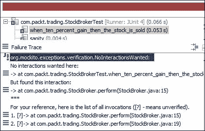
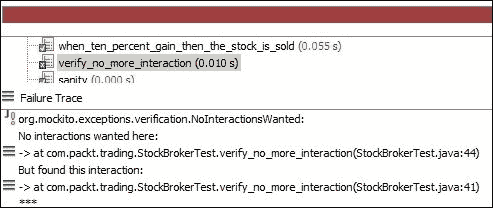
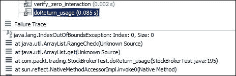
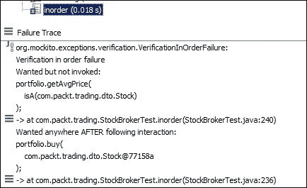
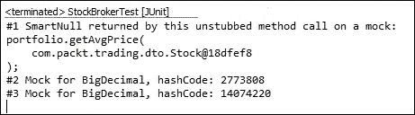
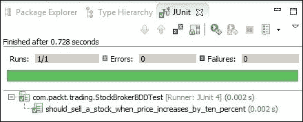

# 第四章。渐进式 Mockito

本章提炼了 Mockito 框架的主要核心，并提供了技术示例。不需要对模拟有任何先前的知识。

本章涵盖了以下主题：

+   Mockito 概述

+   探索 Mockito API

+   高级 Mockito 示例

+   使用 Mockito 进行行为驱动开发（BDD）

# 与 Mockito 一起工作

Mockito 是一个开源的 Java 模拟单元测试框架。在上一章中，我们阅读了有关测试替身和模拟对象的内容。Mockito 允许创建模拟对象、验证和存根。

要了解更多关于 Mockito 的信息，请访问以下链接：

[`code.google.com/p/mockito/`](http://code.google.com/p/mockito/)

## 你为什么应该使用 Mockito？

自动化测试是安全网。它们会运行并通知用户系统是否出现故障，以便可以非常快速地修复有问题的代码。

如果测试套件运行了一个小时，快速反馈的目的就受到了损害。单元测试应作为安全网并提供快速反馈；这是 TDD 的主要原则。

我在一个环境中工作，当一段代码被提交时，自动化测试会运行，需要花费数小时才能完成。因此，开发者必须等待一个小时才能提交新代码，除非之前的构建/测试运行完成。开发者可以在构建过程中提交代码，但最佳实践是在签出之前监控状态；否则，新代码可能会破坏下一个构建并给其他开发者带来问题。因此，开发者必须额外等待一个小时来监控下一个构建。这种缓慢的构建环境阻碍了开发进度。

由于以下原因，测试可能需要花费时间来执行：

+   有时测试会从数据库获取连接以获取/更新数据

+   它连接到互联网并下载文件

+   它与 SMTP 服务器交互以发送电子邮件

+   它执行 I/O 操作

现在的问题是，我们是否真的需要在单元测试代码时获取数据库连接或下载文件？

答案是肯定的。如果它没有连接到数据库或下载最新的股票价格，系统中的许多部分将未经过测试。因此，数据库交互或网络连接对于系统的某些部分是强制性的，这些是集成测试。为了对这些部分进行单元测试，需要模拟外部依赖。

Mockito 在模拟外部依赖方面发挥着关键作用。它模拟数据库连接或任何外部 I/O 行为，以便实际逻辑可以进行单元测试。

单元测试应遵循多个原则以实现灵活性和可维护性。下一节将阐明我们将遵循的原则。

## 单元测试的品质

单元测试应遵循以下原则：

+   **顺序无关和隔离**：`ATest.java` 测试类不应依赖于 `BTest.java` 测试类的输出，或者 `when_an_user_is_deleted_the_associated_id_gets_deleted()` 测试不应依赖于另一个 `when_a_new_user_is_created_an_id_is_returned()` 测试的执行。如果 `BTest.java` 在 `ATest.java` 之后执行，或者 `when_a_new_user_is_created_an_id_is_returned()` 测试在 `when_an_user_is_deleted_the_associated_id_gets_deleted()` 之后执行，测试不应失败。

+   **无障碍设置和运行**：单元测试不应需要数据库连接或互联网连接或清理临时目录。

+   **轻松执行**：单元测试应在所有计算机上运行良好，而不仅仅是特定计算机上。

+   **一级方程式执行**：测试的执行时间不应超过一秒。

Mockito 提供了模拟外部依赖项并实现此处提到的特性的 API。

# 喝 Mockito

从以下链接下载最新的 Mockito 二进制文件并将其添加到项目依赖项中：

[`code.google.com/p/mockito/downloads/list`](http://code.google.com/p/mockito/downloads/list)

截至 2014 年 2 月，最新的 Mockito 版本是 1.9.5。

## 配置 Mockito

```java
http://mvnrepository.com/artifact/org.mockito/mockito-core):
```

```java
<dependency>
  <groupId>org.mockito</groupId>
  <artifactId>mockito-core</artifactId>
  <version>1.9.5</version>
  <scope>test</scope>
</dependency>
```

以下 Gradle 脚本片段将 Mockito 依赖项添加到 Gradle 项目中：

```java
  testCompile 'org.mockito:mockito-core:1.9.5'
```

## 动态模拟

本节通过股票报价示例演示了模拟对象。在现实世界中，人们会在股票市场上投资金钱——购买和出售股票。股票符号是用于在特定市场上唯一标识特定股票的缩写，例如 Facebook 的股票在纳斯达克注册为 FB，而苹果的股票为 AAPL。

我们将构建一个股票经纪人模拟程序。程序将监视市场统计数据，并根据当前市场数据执行以下任何操作：

+   买入股票

+   卖出股票

+   持有股票

程序中将使用的域类有 `Stock`、`MarketWatcher`、`Portfolio` 和 `StockBroker`。

`Stock` 代表现实世界的股票。它有一个符号、公司名称和价格。

`MarketWatcher` 查找股票市场并返回股票报价。一个市场观察者的真实实现可以从 [`www.wikijava.org/wiki/Downloading_stock_market_quotes_from_Yahoo!_finance`](http://www.wikijava.org/wiki/Downloading_stock_market_quotes_from_Yahoo!_finance) 实现。请注意，真实实现将连接到互联网并从提供商下载股票报价。

`Portfolio` 代表用户的股票数据，例如股票数量和价格详情。`Portfolio` 提供了获取平均股票价格和买卖股票的 API。假设第一天某人以 $10.00 的价格购买了一股股票，第二天，客户以 $8.00 的价格购买了同一股股票。因此，第二天这个人有两股股票，平均股价为 $9.00。

```java
 represents the StockBroker class. StockBroker collaborates with the MarketWatcher and Portfolio classes. The perform() method of StockBroker accepts a portfolio and a Stock object:
```

```java
public class StockBroker {
  private final static BigDecimal LIMIT = new BigDecimal("0.10");

  private final MarketWatcher market;

  public StockBroker(MarketWatcher market) {
    this.market = market;
  }

  public void perform(Portfolio portfolio,Stock stock) {
    Stock liveStock = market.getQuote(stock.getSymbol());
    BigDecimal avgPrice = portfolio.getAvgPrice(stock);
    BigDecimal priceGained = liveStock.getPrice().subtract(avgPrice);
    BigDecimal percentGain = priceGained.divide(avgPrice);
    if(percentGain.compareTo(LIMIT) > 0) {
      portfolio.sell(stock, 10);
    }else if(percentGain.compareTo(LIMIT) < 0){
      portfolio.buy(stock);
    }
  }
}
```

看一下 `perform` 方法。它接受一个 `portfolio` 对象和一个 `stock` 对象，调用 `MarketWatcher` 的 `getQuote` 方法并传递一个 `stock` 符号。然后，它从 `portfolio` 获取平均股价并与当前市场价格进行比较。如果当前股价比平均价格高 10%，则 `StockBroker` 程序从 `Portfolio` 中卖出 10 股股票；然而，如果当前股价下跌 10%，则程序从市场上购买股份以平均损失。

为什么我们卖出 10 股股票？这只是一个例子，10 只是一个数字；这可以是任何你想要的东西。

`StockBroker` 依赖于 `Portfolio` 和 `MarketWatcher`；`Portfolio` 的真实实现应该与数据库交互，而 `MarketWatcher` 需要连接到互联网。因此，如果我们为经纪人编写单元测试，我们需要在数据库和互联网连接的情况下执行测试。数据库连接将花费时间，互联网连接取决于互联网提供商。因此，测试执行将依赖于外部实体，并且需要一段时间才能完成。这将违反快速测试执行原则。此外，数据库状态可能不会在所有测试运行中相同。这也适用于互联网连接服务。每次数据库可能返回不同的值，因此在单元测试中断言特定值是非常困难的。

我们将使用 Mockito 模拟外部依赖并独立执行测试。因此，测试将不再依赖于真实的外部服务，因此它将快速执行。

### 模拟对象

可以使用静态 `mock()` 方法创建模拟，如下所示：

```java
import org.mockito.Mockito;

public class StockBrokerTest {
  MarketWatcher marketWatcher = Mockito.mock(MarketWatcher.class);
  Portfolio portfolio = Mockito.mock(Portfolio.class);

}
```

否则，你可以使用 Java 的静态导入功能，并如下静态导入 `org.mockito.Mockito` 类的 `mock` 方法：

```java
import static org.mockito.Mockito.mock;

public class StockBrokerTest {
  MarketWatcher marketWatcher = mock(MarketWatcher.class);
  Portfolio portfolio = mock(Portfolio.class);
}
```

另外还有一个选择；你可以如下使用 `@Mock` 注解：

```java
import org.mockito.Mock;

public class StockBrokerTest {
  @Mock 
  MarketWatcher marketWatcher;
  @Mock 
  Portfolio portfolio;
}
```

```java
MockitoAnnotations to create mocks:
```

```java
import static org.junit.Assert.assertEquals;
import org.mockito.MockitoAnnotations;

public class StockBrokerTest {

  @Mock 
  MarketWatcher marketWatcher;

  @Mock 
  Portfolio portfolio;

  @Before 
  public void setUp() {
    MockitoAnnotations.initMocks(this);
  }

  @Test 
  public void sanity() throws Exception {
    assertNotNull(marketWatcher);
    assertNotNull(portfolio);
  }
}
```

```java
MockitoJUnitRunner JUnit runner:
```

```java
import org.mockito.runners.MockitoJUnitRunner;

@RunWith(MockitoJUnitRunner.class)
public class StockBrokerTest {

  @Mock
    MarketWatcher marketWatcher;
  @Mock 
    Portfolio portfolio;

  @Test 
    public void sanity() throws Exception {
      assertNotNull(marketWatcher);
      assertNotNull(portfolio);
  }
}
```

### 注意

```java
getQuote(String symbol) method of MarcketWatcher and returns a specific Stock object:
```

```java
import static org.mockito.Matchers.anyString;
import static org.mockito.Mockito.when;

@RunWith(MockitoJUnitRunner.class)
public class StockBrokerTest {

  @Mock MarketWatcher marketWatcher;
  @Mock Portfolio portfolio;

  @Test
  public void marketWatcher_Returns_current_stock_status() {
    Stock uvsityCorp = new Stock("UV", "Uvsity Corporation", new BigDecimal("100.00"));

 when(marketWatcher.getQuote(anyString())).
 thenReturn(uvsityCorp);

    assertNotNull(marketWatcher.getQuote("UV"));
  }
}
```

```java
StockBroker class:
```

```java
import com.packt.trading.dto.Stock;
import static org.junit.Assert.assertNotNull;
import static org.mockito.Matchers.anyString;
import static org.mockito.Matchers.isA;
import static org.mockito.Mockito.verify;
import static org.mockito.Mockito.when;

@RunWith(MockitoJUnitRunner.class)
public class StockBrokerTest {
  @Mock   MarketWatcher marketWatcher;
  @Mock   Portfolio portfolio;
  StockBroker broker;

  @Before public void setUp() {
    broker = new StockBroker(marketWatcher);
  }

  @Test
  public void when_ten_percent_gain_then_the_stock_is_sold() {
    //Portfolio's getAvgPrice is stubbed to return $10.00
    when(portfolio.getAvgPrice(isA(Stock.class))).
      thenReturn(new BigDecimal("10.00"));
    //A stock object is created with current price $11.20
    Stock aCorp = new Stock("A", "A Corp", new BigDecimal("11.20"));
    //getQuote method is stubbed to return the stock
    when(marketWatcher.getQuote(anyString())).thenReturn(aCorp);
    //perform method is called, as the stock price increases 
    // by 12% the broker should sell the stocks
    broker.perform(portfolio, aCorp);

  //verifying that the broker sold the stocks
  verify(portfolio).sell(aCorp,10);
 }  
}
```

### 注意

测试方法名为 `when_ten_percent_gain_then_the_stock_is_sold`；测试名称应该解释测试的意图。我们使用下划线使测试名称可读。我们将使用 `when_<<`something happens`>>_then_<<`the action is taken`>>` 测试约定。

在前面的测试示例中，`portfolio` 的 `getAvgPrice()` 方法被模拟以返回 $10.00，然后 `getQuote()` 方法被模拟以返回一个硬编码的 `stock` 对象，其当前股价为 $11.20。当股价上涨 12% 时，`broker` 逻辑应该卖出股票。

`portfolio` 对象是一个模拟对象。因此，除非我们模拟一个方法，否则默认情况下，`portfolio` 的所有方法都会自动模拟以返回默认值，对于 `void` 方法，则不执行任何操作。`sell` 方法是一个 `void` 方法；因此，而不是连接到数据库以更新股票数量，自动模拟将不执行任何操作。

然而，我们如何测试 `sell` 方法是否被调用呢？我们使用 `Mockito.verify`。

`verify()`方法是一个静态方法，用于验证方法调用。如果方法没有被调用，或者参数不匹配，则 verify 方法将引发错误，以指示代码逻辑存在问题。

### 验证方法调用

为了验证冗余方法调用，或者验证被模拟的方法没有被调用但根据测试角度来说很重要，我们应该手动验证调用；为此，我们需要使用静态的`verify`方法。

#### 为什么我们使用 verify？

模拟对象用于模拟外部依赖。我们设置一个期望值，模拟对象返回一个预期值。在某些条件下，模拟对象的行为或方法不应该被调用，或者有时我们可能需要调用方法 N（一个数字）次。`verify`方法用于验证模拟对象的调用。

Mockito 不会自动验证所有模拟调用。

如果一个被模拟的行为不应该被调用，但由于代码中的错误该方法被调用，`verify`会标记错误，尽管我们不得不手动验证。`void`方法不返回值，因此你不能断言返回值。因此，`verify`对于测试`void`方法非常有用。

#### 深入验证

`verify()`方法有一个重载版本，它接受`Times`作为参数。`Times`是`org.mockito.internal.verification`包中的 Mockito 框架类，它接受`wantedNumberOfInvocations`作为整数参数。

如果将`0`传递给`Times`，它意味着在测试路径中方法不会被调用。我们可以将`0`传递给`Times(0)`以确保`sell`或`buy`方法不会被调用。如果将负数传递给`Times`构造函数，Mockito 将抛出`MockitoException - org.mockito.exceptions.base.MockitoException`，这表明**不允许负值**错误。

以下方法与`verify`一起使用：

+   `times(int wantedNumberOfInvocations)`: 这个方法恰好被调用*n*次；如果方法没有被调用`wantedNumberOfInvocations`次，则测试失败。

+   `never()`: 这个方法表示被模拟的方法从未被调用，或者你可以使用`times(0)`来表示相同的情况。如果被模拟的方法至少被调用一次，那么测试将失败。

+   `atLeastOnce()`: 这个方法至少被调用一次，如果多次调用则操作正常。然而，如果没有被调用，则操作失败。

+   `atLeast(int minNumberOfInvocations)`: 这个方法至少被调用*n*次，如果方法被调用次数超过`minNumberOfInvocations`，则操作正常。然而，如果方法没有被调用`minNumberOfInvocations`次，则操作失败。

+   `atMost(int maxNumberOfInvocations)`: 这个方法最多被调用*n*次。然而，如果方法被调用次数超过`minNumberOfInvocations`次，则操作失败。

+   `only()`: 在模拟对象上调用 `only` 方法时，如果模拟对象上还调用了其他方法，则测试失败。在我们的例子中，如果我们使用 `verify(portfolio, only()).sell(aCorp,10);`，测试将失败，输出如下：

    在第 15 行测试失败，因为调用了 `portfolio.getAvgPrice(stock)`。

+   `timeout(int millis)`: 此方法在指定的时间范围内进行交互。

#### 验证零和更多交互

`verifyZeroInteractions(Object... mocks)` 方法验证给定的模拟对象上是否没有发生任何交互。

以下测试代码直接调用 `verifyZeroInteractions` 并传递两个模拟对象。由于没有在模拟对象上调用任何方法，测试通过：

```java
  @Test  public void verify_zero_interaction() {
    verifyZeroInteractions(marketWatcher,portfolio);
  }
```

`verifyNoMoreInteractions(Object... mocks)` 方法检查给定的模拟对象中是否有任何未验证的交互。我们可以在验证模拟方法之后使用此方法，以确保没有在模拟对象上调用其他方法。

以下测试代码演示了 `verifyNoMoreInteractions`：

```java
  @Test  public void verify_no_more_interaction() {
    Stock noStock = null;
    portfolio.getAvgPrice(noStock);
    portfolio.sell(null, 0);
    verify(portfolio).getAvgPrice(eq(noStock));
    //this will fail as the sell method was invoked
    verifyNoMoreInteractions(portfolio);
  }
```

以下是 JUnit 输出：



以下是对参数匹配器的理由和示例。

### 使用参数匹配器

`ArgumentMatcher` 是一个具有预定义的 `describeTo()` 方法的 Hamcrest 匹配器。`ArgumentMatcher` 扩展了 `org.hamcrest.BaseMatcher` 包。它验证对模拟依赖项的间接输入。

`Matchers.argThat(Matcher)` 方法与 `verify` 方法一起使用，以验证方法是否以特定的参数值被调用。

`ArgumentMatcher` 在模拟中扮演着关键角色。以下部分描述了 `ArgumentMatcher` 的上下文。

模拟对象返回预期值，但当它们需要为不同的参数返回不同的值时，参数匹配器就派上用场。假设我们有一个方法，它接受一个玩家名称作为输入，并返回作为输出的总得分（得分是板球比赛中得分的点数）。我们想要模拟它，并为 `Sachin` 返回 `100`，为 `xyz` 返回 `10`。我们必须使用参数匹配器来模拟这个。

Mockito 在方法被模拟时返回预期值。如果方法接受参数，则参数必须在执行期间匹配；例如，以下方式模拟了 `getValue(int someValue)` 方法：

```java
when(mockObject.getValue(1)).thenReturn(expected value);
```

在这里，`getValue` 方法被调用为 `mockObject.getValue(100)`。然后，参数不匹配（预期该方法将以 1 被调用，但在运行时遇到 100），因此模拟对象未能返回预期值。它将返回返回类型的默认值——如果返回类型是布尔型，则返回 false；如果返回类型是对象，则返回 null，依此类推。

Mockito 通过使用 `equals()` 方法以自然 Java 风格验证参数值。有时，当需要额外灵活性时，我们会使用参数匹配器。

Mockito 提供了内置匹配器，如 `anyInt()`、`anyDouble()`、`anyString()`、`anyList()` 和 `anyCollection()`。

更多内置匹配器和自定义参数匹配器或 Hamcrest 匹配器的示例可以在以下链接找到：

[`docs.mockito.googlecode.com/hg/latest/org/mockito/Matchers.html`](http://docs.mockito.googlecode.com/hg/latest/org/mockito/Matchers.html)

### 注意

```java
request object is created and passed to service. Now, from a test, if we call the someMethod method and service is a mocked object, then from test, we cannot stub callMethod with a specific request as the request object is local to the someMethod:
```

```java
public void someMethod(Object obj){
  Request req = new Request();
  req.setValue(obj);
  Response resp = service.callMethod(req);
}
```

### 注意

如果我们使用参数匹配器，所有参数都必须由匹配器提供。

我们传递了三个参数，并且所有参数都是通过匹配器传递的：

```java
verify(mock).someMethod(anyInt(), anyString(), eq("third argument"));
```

以下示例将失败，因为第一个和第三个参数没有使用匹配器传递：

```java
verify(mock).someMethod(1, anyString(), "third argument");
```

#### `ArgumentMatcher`类

`ArgumentMatcher`类允许创建自定义参数匹配器。`ArgumentMatcher`是一个具有预定义的`describeTo()`方法的 Hamcrest 匹配器。

使用`Matchers.argThat(org.hamcrest.Matcher)`方法并传递 Hamcrest 匹配器的实例。

考虑`MarketWatcher`类；它接受一个股票代码，然后从市场获取报价。

我们将为`MarketWatcher.getQuote`方法创建一个模拟，该方法接受一个`String`对象。我们希望使此方法具有条件性。如果传递给方法的股票代码是蓝筹股，则该方法将返回$1000.00；否则，它将返回$5.00。

我们将如何识别蓝筹股？蓝筹股是知名公司的普通股票，其价值和股息可靠且通常对投资安全。例如，如果股票代码是 FB 或 AAPL，我们将该股票视为蓝筹股。

让我们创建一个自定义匹配器来识别蓝筹股。以下代码展示了自定义参数匹配器：

```java
  class BlueChipStockMatcher extends ArgumentMatcher<String>{
    @Override
    public boolean matches(Object symbol) {
       return "FB".equals(symbol) ||  
         "AAPL".equals(symbol);
    }
  }
```

以下类扩展了`BlueChipStockMatcher`，然后否定结果以指示该股票不是蓝筹股：

```java
  class OtherStockMatcher extends BlueChipStockMatcher{
    @Override
    public boolean matches(Object symbol) {
      return !super.matches(symbol);
    }
  }
```

以下测试使用自定义匹配器来卖出股票：

```java
@Test
public void argument_matcher() {
    when(portfolio.getAvgPrice(isA(Stock.class))).
      thenReturn(new BigDecimal("10.00"));

    Stock blueChipStock = new Stock("FB", "FB Corp", new BigDecimal(1000.00));
    Stock otherStock = new Stock("XY", "XY Corp", new BigDecimal(5.00));

    when(marketWatcher.getQuote(argThat(new       BlueChipStockMatcher()))).thenReturn(blueChipStock);
    when(marketWatcher.getQuote(argThat(new       OtherStockMatcher()))).thenReturn(otherStock);

    broker.perform(portfolio, blueChipStock);
    verify(portfolio).sell(blueChipStock,10);

    broker.perform(portfolio, otherStock);
    verify(portfolio, never()).sell(otherStock,10);
  }
```

在前面的代码中，`marketWatcher`被模拟，当股票代码是`FB`或`AAPL`时返回蓝筹股；否则，它返回普通股票。

### 抛出异常

单元测试不仅仅是为了测试成功的路径。我们还应该测试我们的代码的失败条件。Mockito 提供了一个在测试期间引发错误的 API。假设我们正在测试一个流程，其中我们计算一个值然后打印到打印机。如果打印机未配置，或发生网络错误，或页面未加载，系统将抛出异常。我们可以使用 Mockito 的异常 API 来测试这种情况。

我们如何测试异常条件，例如数据库访问失败？

Mockito 提供了一个名为`thenThrow(Throwable)`的方法；当模拟的方法被调用时，此方法将抛出异常。

我们将模拟`getAvgPrice`方法，在调用该方法时抛出异常，如下所示：

```java
  @Test(expected = IllegalStateException.class)
  public void throwsException() throws Exception {
    when(portfolio.getAvgPrice(isA(Stock.class))).thenThrow(new IllegalStateException("Database down"));

    portfolio.getAvgPrice(new Stock(null, null, null));
  }
```

我们正在模拟`portfolio`，在调用`getAvgPrice()`时抛出异常。以下是从返回`void`的方法中抛出异常的语法：

```java
doThrow(exception).when(mock).voidmethod(arguments);
```

`Portfolio` 中的 `buy` 方法是一个 `void` 方法；我们将模拟 `buy` 方法以抛出异常。以下测试代码在调用 `portfolio` 对象上的 `buy` 方法时抛出 `IllegalStateException`。请注意，将使用 `doThrow().when()` 来从 `buy` 方法引发错误：

```java
  @Test(expected = IllegalStateException.class)
  public void throwsException_void_methods() throws Exception {
    doThrow(new IllegalStateException()).
      when(portfolio).buy(isA(Stock.class));
    portfolio.buy(new Stock(null, null, null));
  }
```

### 模拟连续调用

在以下情况下需要为连续调用模拟方法：

+   当在循环中调用模拟方法，需要不同调用返回不同结果时

+   当需要一次调用抛出异常，而其他调用返回值时

我们需要测试一个条件，即第一次调用将返回一个值，下一次调用不应找到任何值，然后再次返回一个值。

`thenReturn(objects...)` 的可变参数版本接受逗号分隔的返回值，并按顺序返回参数，因此如果我们向 `thenReturn` 方法传递两个参数，则模拟方法的第一次调用将返回第一个参数。之后，所有其他调用将返回第二个参数，如下面的代码所示：

```java
   @Test
  public void consecutive_calls() throws Exception {
    Stock stock = new Stock(null, null, null);
    when(portfolio.getAvgPrice(stock)).thenReturn(BigDecimal.TEN, BigDecimal.ZERO);
    assertEquals(BigDecimal.TEN, portfolio.getAvgPrice(stock));
    assertEquals(BigDecimal.ZERO, portfolio.getAvgPrice(stock));
    assertEquals(BigDecimal.ZERO, portfolio.getAvgPrice(stock));
  }
```

注意，`thenReturn` 接受两个值：`BigDecimal.TEN` 和 `BigDecimal.ZERO`。`getAvgPrice` 的第一次调用将返回 `BigDecimal.TEN`，然后每次调用将返回 `BigDecimal.ZERO`。

这也可以用另一种方式完成——Mockito 方法返回模拟对象，并遵循构建器模式以允许一系列调用。

在以下示例中，`thenReturn` 和 `thenThrow` 被组合起来构建响应链。在第二次调用之后，每次 `getAvgPrice` 调用都将抛出异常：

```java
when(portfolio.getAvgPrice(stock)).thenReturn(BigDecimal.TEN).thenReturn(BigDecimal.TEN).thenThrow(new IllegalStateException())
```

### 使用 `Answer` 进行模拟

模拟的方法返回硬编码的值，但不能返回即时结果。Mockito 框架提供了回调来计算即时结果。

Mockito 允许使用泛型 `Answer` 接口进行模拟。这是一个回调；当在模拟对象上调用模拟的方法时，将调用 `Answer` 对象的 `answer(InvocationOnMock invocation)` 方法。此 `Answer` 对象的 `answer()` 方法返回实际对象。

`Answer` 的语法是 `when(mock.someMethod()).thenAnswer(new Answer() {…});` 或 `when(mock.someMethod()).then(answer);`，这与 `thenReturn()` 和 `thenThrow()` 类似。

`Answer` 接口定义如下：

```java
public interface Answer<T> {
   T answer(InvocationOnMock invocation) throws Throwable;
}
```

`InvocationOnMock` 参数是回调的一个重要部分。它可以返回传递给方法的参数，也可以返回模拟对象，如下所示：

```java
Object[] args = invocation.getArguments();
Object mock = invocation.getMock();
```

```java
Answer classes. Add HashMap to the test class:
```

```java
Map<String, List<Stock>> stockMap = new HashMap<String, List<Stock>>();
```

可以购买 10 股 Facebook 或 10 种不同的股票。`stockMap` 对象存储键值对。键是 `Stock` 符号，值是股票列表。10 股 Facebook 股票将添加一个单独的键 `FB` 和一个包含 10 股 Facebook 股票的列表。一股苹果股票将添加另一个条目到映射中，具有 `AAPL` 键和值以及一个包含单一苹果股票的列表。

当调用`buy`方法时，以下`Answer`实现被调用。`invocationOnMock`对象返回参数，而`buy`方法只接受一个参数，即一个`Stock`对象。因此，将 0^(th)参数转换为`Stock`类型。然后，将`Stock`插入到`stockMap`对象中：

```java
class BuyAnswer implements Answer<Object>{
  @Override
  public Object answer(InvocationOnMock invocation) throws Throwable 
   {
    Stock newStock = (Stock)invocation.getArguments()[0];
    List<Stock> stocks = stockMap.get(newStock.getSymbol());
    if(stocks != null) {
      stocks.add(newStock);
    }else {
      stocks = new ArrayList<Stock>();
      stocks.add(newStock);
      stockMap.put(newStock.getSymbol(), stocks);
    }
    return null;
  }
}
```

以下`answer`对象实现了总价计算逻辑：

```java
class TotalPriceAnswer implements Answer<BigDecimal>{
  @Override  
  public BigDecimal answer(InvocationOnMock invocation) throws Throwable  {
    BigDecimal totalPrice = BigDecimal.ZERO;

    for(String stockId: stockMap.keySet()) {
      for(Stock stock:stockMap.get(stockId)) {
        totalPrice = totalPrice.add(stock.getPrice());
      }
    }
    return totalPrice;
  }
}
```

`getCurrentValue()`方法将被模拟以返回前面的答案实现。

以下 JUnit 测试代码使用了`TotalPriceAnswer`方法：

```java
@Test
  public void answering() throws Exception {
    stockMap.clear();
    doAnswer(new BuyAnswer()).when(portfolio).
      buy(isA(Stock.class));

    when(portfolio.getCurrentValue()).
    then(new TotalPriceAnswer());

    portfolio.buy(new Stock("A", "A", BigDecimal.TEN));
    portfolio.buy(new Stock("B", "B", BigDecimal.ONE));

    assertEquals(new BigDecimal("11"), portfolio.getCurrentValue());
  }
```

检查`stockMap`对象是否已清除以删除现有数据。然后，使用`doAnswer`方法模拟`void` `buy`方法以向`stockMap`添加股票，然后模拟`getCurrentValue`方法为`TotalPriceAnswer`答案。

### 间谍对象

Mockito 的`spy`对象允许我们通过用模拟的方法替换一些方法来使用真实对象，而不是使用模拟对象。这种行为允许我们测试遗留代码；不能模拟需要被测试的类。遗留代码带有无法测试的方法，但其他方法使用它们；因此，这些方法需要被模拟以与其他方法一起工作。`spy`对象可以模拟不可测试的方法，以便其他方法可以轻松地进行测试。

一旦为`spy`对象上的方法设置了一个期望值，那么`spy`就不再返回原始值。它开始返回模拟值，但仍然表现出未模拟的其他方法的原始行为。

Mockito 可以创建一个真实对象的`spy`。与模拟不同，当我们使用`spy`时，会调用真实方法（除非方法已被模拟）。

`Spy`也被称为部分模拟；`spy`在现实世界中的一个例子是处理遗留代码。

使用以下代码声明`spy`：

```java
SomeClass realObject = new RealImplemenation();
SomeClass spyObject = spy(realObject);
```

以下是一个自解释的`spy`示例：

```java
@Test public void spying() throws Exception {
    Stock realStock = new Stock("A", "Company A", BigDecimal.ONE);
    Stock spyStock = spy(realStock);
    //call real method from  spy
    assertEquals("A", spyStock.getSymbol());

    //Changing value using spy
    spyStock.updatePrice(BigDecimal.ZERO);

    //verify spy has the changed value
    assertEquals(BigDecimal.ZERO, spyStock.getPrice());

    //Stubbing method
    when(spyStock.getPrice()).thenReturn(BigDecimal.TEN);

    //Changing value using spy
    spyStock.updatePrice(new BigDecimal("7"));

    //Stubbed method value 10.00  is returned NOT 7
    assertNotEquals(new BigDecimal("7"), spyStock.getPrice());
    //Stubbed method value 10.00
    assertEquals(BigDecimal.TEN,  spyStock.getPrice());

}
```

### 模拟 void 方法

在本章的*抛出异常*部分，我们了解到`doThrow`用于为`void`方法抛出异常。本章的*使用 Answer 进行模拟*部分展示了如何使用`doAnswer`对`void`方法进行模拟。

在本节中，我们将探讨其他`void`方法：`doNothing`、`doReturn`、`doThrow`和`doCallRealMethod`。

`doNothing()` API 什么都不做。默认情况下，所有`void`方法都不做任何事情。但是，如果你需要在`void`方法上连续调用，第一次调用是抛出错误，下一次调用是不做任何事情，然后下一次调用使用`doAnswer()`执行一些逻辑，然后遵循以下语法：

```java
 doThrow(new RuntimeException()).
 doNothing().
 doAnswer(someAnswer).
 when(mock).someVoidMethod();

  //this call throws exception
  mock.someVoidMethod(); 
  // this call does nothing 
  mock.someVoidMethod();
```

当你想在模拟或`spy`对象上调用方法的实际实现时，使用`doCallRealMethod()` API，如下所示：

```java
doCallRealMethod().when(mock).someVoidMethod();
```

`doReturn()`方法与模拟方法并返回预期值类似。然而，这仅在`when(mock).thenReturn(return)`无法使用时使用。

`when-thenReturn` 方法比 `doReturn()` 更易读；此外，`doReturn()` 不是一个安全类型。`thenReturn` 方法检查方法返回类型，如果传递了不安全的类型，则会引发编译错误。

```java
doReturn:
```

```java
@Test public void doReturn_is_not_type_safe() throws Exception {
  //then return is type safe- It has to return a BigDecimal
  when(portfolio.getCurrentValue()).thenReturn(BigDecimal.ONE);
   //method call works fine
  portfolio.getCurrentValue();

    //returning a String instead of BigDecimal
  doReturn("See returning a String").
    when(portfolio.getCurrentValue());
    //this call will fail with an error
  portfolio.getCurrentValue();
}
```

以下截图显示了测试失败的情况：


在间谍对象上调用真实方法会产生副作用；为了抵消这种副作用，请使用 `doReturn()` 而不是 `thenReturn()`。

以下代码描述了间谍和调用 `thenReturn()` 的副作用：

```java
@Test
  public void doReturn_usage() throws Exception {
    List<String> list = new ArrayList<String>();
    List<String> spy = spy(list);
    //impossible the real list.get(0) is called and fails
    //with IndexOutofBoundsException, as the list is empty
    when(spy.get(0)).thenReturn("not reachable");
  }
```

在前面的代码中，间谍对象在尝试模拟 `get(index)` 时调用了一个真实方法，并且与模拟对象不同，真实方法被调用并因 `ArrayIndexOutOfBounds` 错误而失败。

以下截图显示了失败信息：



这可以通过以下代码中的 `doReturn()` 进行保护，但请注意，我们通常不会模拟列表或域对象；这只是一个例子：

```java
@Test public void doReturn_usage() throws Exception {
  List<String> list = new ArrayList<String>();
  List<String> spy = spy(list);

  //doReturn fixed the issue
  doReturn("now reachable").when(spy).get(0);
  assertEquals("now reachable", spy.get(0));
}
```

### 使用 ArgumentCaptor 捕获参数

`ArgumentCaptor` 用于验证传递给模拟方法的参数。有时，我们计算一个值，然后使用这个计算值创建另一个对象，接着使用这个新对象调用一个模拟对象。这个计算值不会从原始方法返回，但它被用于其他一些计算。

`ArgumentCaptor` 提供了一个 API，用于访问在测试方法中实例化的对象。

以下代码片段解释了方法参数不可访问的问题：

```java
public void buildPerson(String firstName, String lastName, String middleName, int age){
  Person person = new Person();
  person.setFirstName(firstName);
  person.setMiddleName(middleName);
  person.setLastName(lastName);
  person.setAge(age);
 this,personService.save(person);
}
```

我们向 `buildPerson` 方法传递了名字、中间名、姓氏和年龄。此方法创建一个 `Person` 对象，并将名称和年龄设置到其中。最后，它调用 `personService` 类并将 `person` 对象保存到数据库中。

在这里，由于 `Person` 对象是在方法内部创建的，我们无法从 JUnit 测试中用特定值模拟 `personService` 的 `save` 行为。我们可以使用一个通用匹配器对象，如 `isA(Person.class)` 来模拟 `save`，然后使用参数捕获器验证 `Person` 对象是否包含正确的姓名和年龄。

Mockito 通过使用 `equals()` 方法以自然 Java 风格验证参数值。这也是推荐匹配参数的方式，因为它使测试变得简洁简单。然而，在某些情况下，在验证之后对某些参数进行断言是必要的。

以下代码使用两个 `ArgumentCaptors` 并验证在调用方法时是否使用了特定的股票符号 `A`，而不是任何其他值：

```java
@Test
public void argument_captor() throws Exception {
  when(portfolio.getAvgPrice(isA(Stock.class))).thenReturn(new BigDecimal("10.00"));
  Stock aCorp = new Stock("A", "A Corp", new BigDecimal(11.20));
  when(marketWatcher.getQuote(anyString())).thenReturn(aCorp);
  broker.perform(portfolio, aCorp);

  ArgumentCaptor<String> stockIdCaptor = ArgumentCaptor.forClass(String.class);

  verify(marketWatcher).getQuote(stockIdCaptor.capture());
  assertEquals("A", stockIdCaptor.getValue());

  //Two arguments captured
  ArgumentCaptor<Stock>  stockCaptor = ArgumentCaptor.forClass(Stock.class);
  ArgumentCaptor<Integer> stockSellCountCaptor = ArgumentCaptor.forClass(Integer.class);

  verify(portfolio).sell(stockCaptor.capture(), stockSellCountCaptor.capture());
  assertEquals("A", stockCaptor.getValue().getSymbol());
  assertEquals(10, stockSellCountCaptor.getValue().intValue());
}
```

检查`ArgumentCaptor`在`forClass`方法中接受一个`Class`类型，然后捕获器被传递给`verify`方法以收集参数细节。`sell`方法接受两个参数，`Stock`和`Integer`。因此，创建了两个`ArgumentCaptors`。`stockCaptor`对象捕获`Stock`参数，而`stockSellCountCaptor`捕获股票数量。最后，比较这些值以验证是否将正确的值传递给了`sell`方法。

### 验证调用顺序

Mockito 通过使用`InOrder` API 简化了验证模拟交互是否按给定顺序执行。它允许我们创建模拟的`InOrder`并验证所有模拟的所有调用顺序。

以下测试按顺序调用了`getAvgPrice`、`getCurrentValue`、`getQuote`和`buy`方法，但验证了`buy()`方法是否在`getAvgPrice()`方法之前被调用。因此，验证顺序是错误的，所以测试失败了：

```java
@Test public void inorder() throws Exception {
  Stock aCorp = new Stock("A", "A Corp", new BigDecimal(11.20));
  portfolio.getAvgPrice(aCorp);
  portfolio.getCurrentValue();
  marketWatcher.getQuote("X");
  portfolio.buy(aCorp);
  InOrder inOrder=inOrder(portfolio,marketWatcher);
  inOrder.verify(portfolio).buy(isA(Stock.class));
  inOrder.verify(portfolio).getAvgPrice(isA(Stock.class));
}
```

以下截图显示了错误信息输出：



重新排序验证顺序，我们按以下方式修复了测试：

```java
@Test public void inorder() throws Exception {
  Stock aCorp = new Stock("A", "A Corp", new BigDecimal(11.20));
  portfolio.getAvgPrice(aCorp);
  portfolio.getCurrentValue();
  marketWatcher.getQuote("X");
  portfolio.buy(aCorp);

  InOrder inOrder=inOrder(portfolio,marketWatcher);
  inOrder.verify(portfolio).getAvgPrice(isA(Stock.class));
  inOrder.verify(portfolio).getCurrentValue();
  inOrder.verify(marketWatcher).getQuote(anyString());
  inOrder.verify(portfolio).buy(isA(Stock.class));
}
```

### 更改默认设置

我们了解到模拟对象的非存根方法返回默认值，例如对象为 null，布尔值为 false。然而，Mockito 允许我们更改默认设置。

以下是可以设置的允许值：

+   **RETURNS_DEFAULTS**: 这是默认设置。对于对象返回 null，对于布尔值返回 false，等等。

+   **RETURNS_SMART_NULLS**: 这返回给定类型的`spy`。

+   **RETURNS_MOCKS**: 这返回对象模拟和原语类型的默认值。

+   **RETURNS_DEEP_STUBS**: 这返回一个深度存根。

+   **CALLS_REAL_METHODS**: 这将调用一个实际方法。

以下示例覆盖了默认的 Mockito 设置并使用了不同的返回类型：

```java
@Test
  public void changing_default() throws Exception {
    Stock aCorp = new Stock("A", "A Corp", new BigDecimal(11.20));
    Portfolio pf = Mockito.mock(Portfolio.class);
    //default null is returned
    assertNull(pf.getAvgPrice(aCorp));
    Portfolio pf1 = Mockito.mock(Portfolio.class, Mockito.RETURNS_SMART_NULLS);
    //a smart null is returned
    System.out.println("#1 "+pf1.getAvgPrice(aCorp));
    assertNotNull(pf1.getAvgPrice(aCorp));

    Portfolio pf2 = Mockito.mock(Portfolio.class, Mockito.RETURNS_MOCKS);
    //a mock is returned
    System.out.println("#2 "+pf2.getAvgPrice(aCorp));
    assertNotNull(pf2.getAvgPrice(aCorp));

    Portfolio pf3 = Mockito.mock(Portfolio.class, Mockito.RETURNS_DEEP_STUBS);
    //a deep stubbed mock is returned
    System.out.println("#3 "+pf3.getAvgPrice(aCorp));
    assertNotNull(pf3.getAvgPrice(aCorp));
  }
```

以下截图显示了控制台输出：



### 重置模拟对象

一个静态方法`reset(T…)`可以重置模拟对象。`reset`方法应该特别小心处理；如果你需要重置一个模拟，你很可能还需要另一个测试。

```java
getAvgPrice method to return a value, but reset clears the stub; after reset, the getAvgPrice method returns NULL:
```

```java
@Test 
public void resetMock() throws Exception {
  Stock aCorp = new Stock("A", "A Corp", new BigDecimal(11.20));

  Portfolio portfolio = Mockito.mock(Portfolio.class);
  when(portfolio.getAvgPrice(eq(aCorp))).
    thenReturn(BigDecimal.ONE);
  assertNotNull(portfolio.getAvgPrice(aCorp));

  Mockito.reset(portfolio);
  //Resets the stub, so getAvgPrice returns NULL
  assertNull(portfolio.getAvgPrice(aCorp));
}
```

### 探索 Mockito 注解

我们了解到 Mockito 支持`@Mock`注解进行模拟。就像`@Mock`一样，Mockito 还支持以下三个有用的注解：

+   `@Captor`: 这简化了`ArgumentCaptor`的创建，这在需要捕获的参数是一个超级通用类时很有用，例如`List<Map<String,Set<String>>>`。

+   `@Spy`: 这创建了一个给定对象的`spy`。用它代替`spy (object)`。

+   `@InjectMocks`: 这自动使用构造函数注入、setter 注入或字段注入将`mock`或`spy`字段注入到测试对象中。

### 使用内联存根工作

Mockito 允许我们在存根的同时创建模拟。基本上，它允许在一行代码中创建存根。这有助于保持测试代码的整洁。

例如，可以在测试中创建并初始化字段时模拟一些存根。我们在几乎所有的测试中都使用 `Stock` 对象。我们可以创建一个全局模拟 `Stock` 并在定义时对其进行存根，如下面的代码片段所示：

```java
Stock globalStock =  when(Mockito.mock(Stock.class).getPrice()).thenReturn(BigDecimal.ONE).getMock();

  @Test
  public void access_global_mock() throws Exception {
    assertEquals(BigDecimal.ONE, globalStock.getPrice());
  }
```

### 确定模拟细节

`Mockito.mockingDetails` 识别特定对象是否是模拟或间谍，如下所示：

```java
@Test
public void mocking_details() throws Exception {
  Portfolio pf1 = Mockito.mock(Portfolio.class, Mockito.RETURNS_MOCKS);

  BigDecimal result = pf1.getAvgPrice(globalStock);
  assertNotNull(result);
  assertTrue(Mockito.mockingDetails(pf1).isMock());

  Stock myStock = new Stock(null, null, null);
  Stock spy = spy(myStock);
  assertTrue(Mockito.mockingDetails(spy).isSpy());

}
```

## 使用 Mockito 进行行为驱动开发

BDD 是基于 TDD 的软件工程流程。BDD 结合了 TDD、**领域驱动开发**（**DDD**）和**面向对象编程**（**OOP**）的最佳实践。

在敏捷团队中，确定功能范围是一项艰巨的任务。业务利益相关者讨论业务利益，而开发团队讨论技术挑战。BDD 提供了一种通用语言，允许利益相关者之间进行有用的沟通和反馈。

Dan North 开发了 BDD，创建了 BDD 的 **JBehave** 框架，并提出了以下最佳实践：

+   单元测试名称应该以单词 *should* 开头，并且 *should* 按照业务价值的顺序编写

+   **验收测试**（**AT**）应该以用户故事的方式编写，例如“作为（角色）我想（功能）以便（好处）”

+   验收标准应该以场景的形式编写，并实现为“Given（初始上下文），when（事件发生），then（确保某些结果）”

让我们为我们的股票经纪人模拟编写一个用户故事：

**故事**：股票被卖出

+   **为了** 最大化利润

+   **作为** 股票经纪人

+   **我想** 在价格上升 10% 时卖出股票

以下是一个场景示例：

**场景**：股票价格上升 10% 应该在市场上卖出股票

+   **Given** 客户之前以每股 $10.00 的价格购买了 FB 股票

+   **并且** 他目前在投资组合中还有 10 股剩余

+   **当** Facebook 股票价格变为 $11.00

+   **那么** 我应该卖出所有的 Facebook 股票，并且投资组合应该没有 Facebook 股票

Mockito 支持使用 `given-when-then` 语法编写 BDD 风格的测试。

### 以 BDD 风格编写测试

在 BDD 中，`given` 代表初始上下文，而 `when` 代表事件或条件。然而，Mockito 已经有一个（初始上下文定义）方法存根的 `when` 风格；因此，`when` 与 BDD 不太搭配。因此，`BDDMockito` 类引入了一个别名，这样我们就可以使用 `given(object)` 方法存根方法调用。

以下 JUnit 测试是以 BDD 风格实现的：

```java
@RunWith(MockitoJUnitRunner.class)
public class StockBrokerBDDTest {
  @Mock MarketWatcher marketWatcher;
  @Mock Portfolio portfolio;

  StockBroker broker;

  @Before public void setUp() {
    broker = new StockBroker(marketWatcher);
  }

  @Test
  public void should_sell_a_stock_when_price_increases_by_ten_percent(){
    Stock aCorp = new Stock("FB", "FaceBook", new BigDecimal(11.20));
    //Given a customer previously bought 10 'FB' stocks at  
    //$10.00/per share
    given(portfolio.getAvgPrice(isA(Stock.class))).
      willReturn(new BigDecimal("10.00"));

    given(marketWatcher.getQuote(eq("FB"))).
      willReturn(aCorp);

    //when the 'FB' stock price becomes $11.00
    broker.perform(portfolio, aCorp);

    //then the 'FB' stocks are sold
    verify(portfolio).sell(aCorp,10);
  }
}
```

注意，测试名称以 `should` 语句开头。`Mockito` 的 `given` 语法用于设置初始上下文，即投资组合已经以每股 $10.00 的价格购买了 `FB` 股票，并且当前的 `FB` 股票价格为每股 $11.00。

以下截图显示了测试执行输出：



### BDD 语法

以下方法与 `given` 一起使用：

+   `willReturn`(要返回的值)：这返回一个给定的值

+   `willThrow`(要抛出的异常): 这将抛出一个给定的异常

+   `will`(Answer answer) 和 `willAnswer`(Answer answer): 这与 `then`(answer) 和 `thenAnswer`(answer) 类似

+   `willCallRealMethod()`: 这将在模拟对象或间谍对象上调用实际方法

    ### 注意

    `jMock` 和 `EasyMock` 框架是另外两个支持模拟自动化单元测试的基于 Java 的单元测试框架。

    `jMock` 和 `EasyMock` 框架提供了模拟功能，但其语法不如 Mockito 简单。您可以访问以下网址来探索这些框架：

    +   [`jmock.org/`](http://jmock.org/)

    +   [`easymock.org/`](http://easymock.org/)

    要了解更多关于 BDD 和 JBehave 的信息，请访问 [`jbehave.org/`](http://jbehave.org/).

# 摘要

在本章中，Mockito 将被详细描述，并提供技术示例以展示 Mockito 的功能。

到本章结束时，您将能够使用 Mockito 框架的高级功能，并开始使用 Mockito 进行行为驱动开发 (BDD)。

下一章将解释代码覆盖率的重要性，包括行和分支覆盖率，如何衡量代码覆盖率，Eclipse 插件，设置 Cobertura，以及使用 Ant、Gradle 和 Maven 生成覆盖率报告。
