# 第六章。揭示代码质量

> "仅仅进行测试本身并不能提高软件质量。测试结果只是质量的一个指标，但本身并不能提高质量。试图通过增加测试量来提高软件质量，就像试图通过更频繁地称体重来减肥一样。你在上秤之前吃的食物决定了你的体重，而你使用的软件开发技术决定了测试能发现多少错误。如果你想减肥，不要买新的秤；改变你的饮食。如果你想提高你的软件质量，不要进行更多的测试；而是开发更好的软件。"
> 
> ——史蒂夫·麦克康奈尔

一个开发不良的系统比一个设计良好的系统产生更多的错误。手动测试可以识别软件错误，但不能提高系统的质量；然而，TDD 和 JUnit 测试被认为是自动单元测试框架，并且它们确实有助于提高系统的质量。静态代码质量分析揭示了代码中的质量问题，并提供了改进建议，而持续的健康监控使系统保持健康。

本章将涵盖以下主题：

+   代码质量指标

+   使用 PMD、Checkstyle 和 FindBugs 进行静态代码分析

+   SonarQube 仪表板

+   SonarQube 运行器

+   使用 Ant、Maven 和 Gradle 进行代码质量分析

# 理解静态代码分析

静态代码分析是在不执行代码的情况下分析代码的过程。代码审查也是一种静态代码分析，但由人类或团队成员执行。通常，静态代码分析是由自动化工具执行的。

通常，静态分析包括以下指标：

+   违反编码最佳实践，如方法体过长、参数列表过长、类过大以及变量命名不当。

+   内聚性代表单个模块（类）的责任。如果一个模块或类承担太多的责任，例如税务计算、发送电子邮件和格式化用户输入，那么这个类或模块的内聚性就会降低。执行多个不同的任务会引入复杂性和可维护性问题。高内聚性意味着只执行特定类型的工作。

    假设一个人被分配处理客户工单、编写新功能、设计架构、组织年度办公室派对等工作；这个人将会非常忙碌，并且难免会出错。他或她将很难管理所有的责任。

    在重构的术语中，如果一个类执行太多的任务，那么这个类被称为 GOD 对象或类。

+   耦合度衡量对其他模块或代码的依赖性。低依赖性强制高内聚性。如果模块 C 依赖于两个其他模块，A 和 B，那么 A 或 B 的 API 的任何变化都将迫使 C 发生变化。

    事件驱动架构是松耦合的一个例子。在一个事件驱动系统中，当某个东西发生变化时，会向一个目的地发布一个事件，而无需知道谁将处理该事件；事件消费者消费事件并采取行动。这解耦了事件发布者与事件消费者。因此，消费者中的任何变化都不会强迫发布者发生变化。

+   循环复杂度衡量程序的复杂度。1976 年，托马斯·J·麦卡贝（Thomas J. McCabe, Sr.）开发了循环复杂度。它衡量程序中线性独立路径的数量。这不仅仅限于程序级别的复杂度，也可以应用于程序中的单个函数、模块、方法或类。

    程序的循环复杂度是通过程序的控制流图定义的。复杂度表示为 *M = E-N+2P*，其中 *M* 是复杂度，*E* 是图的边数，*N* 是图的节点数，*P* 是连通分量的数量。任何复杂度大于 10 的方法都存在严重问题。

    没有条件语句的方法具有 1 的循环复杂度。以下图表表示了有向图和复杂度：

    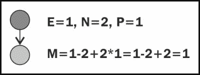

    具有一个条件（IF 语句）或一个循环（FOR 循环）的方法具有 2 的复杂度。以下图表解释了计算方法：

    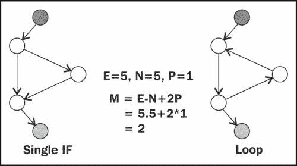

    以下是对应的代码：

    ```java
    public void trim(String input){
        if(input != null){
          return input.trim();
        }
        return null;
    }
    ```

静态代码分析有多种自动化工具可用。此外，内置的 Eclipse 编译器已经可以执行大量的静态代码分析。以下是一些广泛使用的工具：

+   **Checkstyle**：这个工具执行静态代码分析，也可以用来显示配置的编码标准的违规情况。它遵循 GNU 通用公共许可证。您可以在以下链接查看它：[`checkstyle.sourceforge.net`](http://checkstyle.sourceforge.net)。

+   **FindBugs**：这是一个开源的 Java 潜在错误的静态字节码分析器。它为 Eclipse、NetBeans 和 IntelliJ IDEA 提供了插件。它遵循 GNU 通用公共许可证。FindBugs 可以通过 Jenkins 进行配置。以下为 FindBugs 网站链接：[`findbugs.sourceforge.net`](http://findbugs.sourceforge.net)。

+   **PMD**：这是一个基于 Java 源代码分析器的静态规则集，用于识别潜在问题。PMD 有一个 Eclipse 插件，在编辑器中显示错误图标，但 PMD 错误不是真正的错误；而是不高效代码的结果。

在下一节中，我们将检查静态分析工具。

# 使用 Checkstyle 插件

```java
Calculator.java:
```

```java
package com.packt.code.quality;
public class Calculator<T extends Number> {
  public String add(T... numbers) {
    T result = null;
    int x =0;
    for(T t:numbers) { x++;
      if(result == null) {
        if(t instanceof Integer) {
          result = (T) new Integer("0");
        }else if(t instanceof Short) {
          result = (T) new Short("0");
        }else if(t instanceof Long) {
          result = (T) new Long("0");
        }else if(t instanceof Float) {
          result = (T) new Float("0.0");
        }else if(t instanceof Double) {
          result = (T) new Double("0.0");
        }
      }
      if(t instanceof Integer) {
        Integer val = ((Integer)result + (Integer)t);
        result =(T)val;
      }else if(t instanceof Short) {
        Short val = (short) ((Short)result + (Short)t);
        result =(T)val;
      }else if(t instanceof Long) {
        Long val =  ((Long)result + (Long)t);
        result =(T)val;
      }else if(t instanceof Float) {
        Float val =  ((Float)result + (Float)t);
        result =(T)val;
      }else if(t instanceof Double) {
        Double val =  ((Double)result + (Double)t);
        result =(T)val;
      }
      if(x == 1045) {
        System.out.println("warning !!!");
      }
    }
    return result.toString();
  } }
```

这个类，`Calculator.java`，计算一系列数字的总和。它是一个泛型类；我们可以计算整数或双精度浮点数或任何数字的总和。

右键单击`CodeQualityChapter06`并启用**Checkstyle**。以下屏幕截图显示了 Checkstyle 弹出菜单：

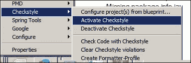

此操作将触发 Checkstyle 验证。它将打开**检查**选项卡（如果**检查**选项卡没有自动打开，则从显示视图菜单中打开视图）并显示违规的图形视图。以下屏幕截图显示了违规的图形饼图：

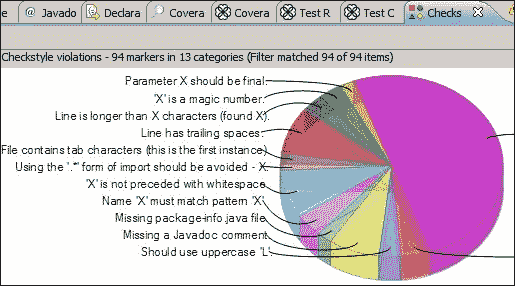

另一个视图以表格格式显示违规。以下屏幕截图显示了以表格格式显示的违规：

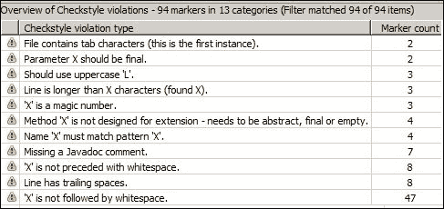

# 探索 FindBugs 插件

本节描述了 FindBugs 插件的配置和使用。

FindBugs 与三种类型的错误一起工作。您可以访问[`findbugs.sourceforge.net/bugDescriptions.html`](http://findbugs.sourceforge.net/bugDescriptions.html)以获取 FindBugs 错误详情。以下是一些 FindBugs 支持的错误类别和错误：

+   **正确性错误**: 这是一种明显的编码错误，导致代码可能是开发者不希望的结果；例如，一个方法忽略了自赋值字段的返回值。以下是一些正确性错误的例子：

    +   该类定义了`tostring()`但应该是`toString()`

    +   在这里检查一个值是否为 null，但这个值不能为 null，因为它之前已经被解引用，如果它是 null，那么在早期解引用时就会发生空指针异常

    +   子类中的方法没有覆盖超类中类似的方法，因为参数的类型与超类中相应参数的类型不完全匹配

    +   类定义了`equal(Object)`但应该是`equals(Object)`

+   **不良实践**: 这包括违反推荐的最佳实践和基本编码实践。以下是不良实践的例子：

    +   **哈希码和 equals 问题**:

        +   类定义了`hashCode()`但应该是`equals()`和`hashCode()`

        +   类定义了`equals()`但应该是`hashCode()`

        +   类定义了`hashCode()`并使用`Object.equals()`

        +   类定义了`equals()`并使用`Object.hashCode()`

    +   **可克隆习语**:

        +   类定义了`clone()`但没有实现`Cloneable`

    +   **可序列化问题**:

        +   类是`Serializable`，但没有定义`serialVersionUID`

        +   比较器没有实现`Serializable`

        +   非序列化类有一个`serializable`内部类

    +   **丢弃的异常**: 在这里，创建了一个异常但没有抛出，例如以下示例中，异常被创建但没有抛出：

        ```java
        if (x < 0)
          new IllegalArgumentException("x must be nonnegative");
        ```

    +   **finalize 方法滥用**:

        +   明确调用`finalize`

        +   清理器没有调用超类的清理器

+   **可疑错误**: 这类代码令人困惑、异常，或以导致错误的方式编写。以下是一些例子：

    +   **类字面量的无效存储**：一条指令将类字面量赋给一个变量，然后从未使用它。

    +   **switch 语句穿透**：由于 switch 语句穿透，这里覆盖了之前 switch 情况中存储的值。很可能你忘记在之前的 case 末尾放置 break 或 return。

    +   **未确认的类型转换** 和 **冗余的空检查**：当值是 `null` 时，会发生此错误，例如，考虑以下代码：

        ```java
        Object x = null;
        Car myCar = (Car)x;
        if(myCar != null){
          //...
        }
        ```

以下是为 FindBugs Eclipse 插件提供的更新站点 URL：[`findbugs.cs.umd.edu/eclipse`](http://findbugs.cs.umd.edu/eclipse)。

您也可以通过 Eclipse Marketplace 安装它。

安装 FindBugs，然后向 `CodeQualityChapter06` 项目添加以下代码以进行验证：

```java
public class Buggy implements Cloneable {
    private Integer magicNumber;
    public Buggy(Integer magicNumber) {
        this.magicNumber = magicNumber;
    }
    public boolean isBuggy(String x) {
        return "Buggy" == x;
    }
    public boolean equals(Object o) {
        if (o instanceof Buggy) {
            return ((Buggy) o).magicNumber == magicNumber;
        }
        if (o instanceof Integer) {
            return magicNumber == ((Integer) o);
        }
        return false;
    }
    Buggy() { }
    static class MoreBuggy extends Buggy {
        static MoreBuggy singleton = new MoreBuggy();
    }
    static MoreBuggy foo = MoreBuggy.singleton;
}
```

右键单击项目并单击 **查找错误** 菜单。以下显示的是弹出菜单：

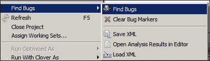

打开源文件；它显示错误图标。以下截图显示了错误：

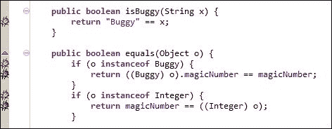

以下截图以表格形式显示了错误类别中的错误：

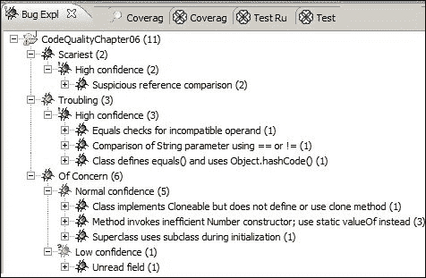

# 使用 PMD 插件

PMD 可以找到重复代码、死代码、空的 if/while 语句、空的 try/catch 块、复杂的表达式、循环复杂度等。

以下是为 Eclipse 提供的更新站点 URL：[`sourceforge.net/projects/pmd/files/pmd-eclipse/update-site/`](http://sourceforge.net/projects/pmd/files/pmd-eclipse/update-site/)。您也可以通过 Eclipse Marketplace 安装它。

安装后，右键单击 `CodeQualityChapter06` 项目并选择 **切换 PMD 性质** 菜单项。它将为 PMD 分析启用项目。以下截图演示了 PMD 弹出菜单选项：

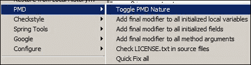

PMD 在 **问题** 选项卡中显示错误。以下截图显示了 **问题** 选项卡中的 PMD 违规：

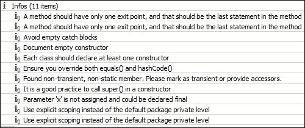

下一节将描述 SonarQube 仪表板，并使用 SonarQube 运行器、Ant、Gradle 和 Maven 分析项目。

# 使用 SonarQube 监控代码质量

SonarQube 是一个基于 Web 的开源持续质量评估仪表板。它附带 GNU 通用公共许可证，支持跨平台，因此可以安装在许多流行的操作系统上。SonarQube 使用 Java 开发。截至 2014 年 3 月，最新版本是 4.1.2。

SonarQube 展示以下功能：

+   它是一个基于 Web 的代码质量仪表板，可以从任何地方访问。

+   它支持多种语言。在 4.1.2 版本中支持的语言和编码平台包括 ABAP、Android、C/C++、C#、COBOL、Erlang、Flex/ActionScript、Groovy、Java、JavaScript、Natural、PHP、PL/I、PL/SQL、Python、VB.NET、Visual Basic 6、Web（包括 HTML、JSP、JSF、Ruby、PHP 等页面上的 HTML 分析）和 XML。

+   它提供了以下指标：

    +   缺陷和潜在缺陷

    +   编码标准违规

    +   重复

    +   缺少单元测试

    +   复杂性分布不均

    +   意大利面式设计

    +   注释不足或过多

+   它在数据库中记录历史，并提供质量指标的按时间顺序的图表。

+   它可以通过众多插件进行扩展。

+   它支持使用 Ant/Maven/Gradle 和 CI 工具（如 Jenkins、CruiseControl 和 Bamboo）进行持续自动化检查。

+   它与 Eclipse 集成。

以下部分涵盖了 SonarQube 的安装和使用。

## 运行 SonarQube

以下是在 SonarQube 中配置的步骤：

1.  从[`www.sonarqube.org/downloads/`](http://www.sonarqube.org/downloads/)下载 SonarQube。

1.  将下载的文件解压缩到您选择的目录中。在接下来的步骤中，我们将将其称为`<sonar_install_directory>`或`SONAR_HOME`。

1.  打开`<sonar_install_directory>/bin`目录。`bin`目录列出了 SonarQube 支持的操作系统。转到特定的 OS 目录，例如为 Windows 64 位机器打开`windows-x86-64`。

1.  运行一个 shell 脚本或批处理文件来启动 Sonar。以下截图显示了 Windows 64 位机器的命令提示符输出。注意，当 Web 服务器启动时，服务器会记录**Web 服务器已启动**的信息：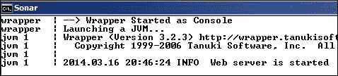

1.  打开 Internet Explorer 并输入`http://localhost:9000`。这将启动 SonarQube 仪表板。最初，仪表板显示一个空的项目列表。首先，我们需要分析项目以在仪表板中显示它们。以下是在仪表板中显示的 SonarQube 仪表板：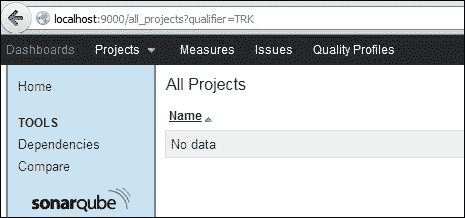

安装完成。接下来，我们需要使用 SonarQube 分析一个项目。

## 使用 SonarQube 运行器分析代码

```java
sonar-runner.properties file. Check whether sonar.host.url and sonar.jdbc.url are enabled:
```

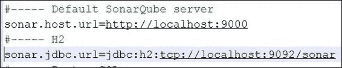*   创建一个新的`SONAR_RUNNER_HOME`环境变量，将其设置为`<runner_install_directory>`。*   将`<runner_install_directory>/bin`目录添加到您的`Path`变量中。*   打开命令提示符并检查运行器是否已安装。输入`sonar-runner –h`命令，您将得到以下输出：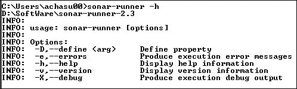*   进入`CodeQualityChapter06`项目文件夹，创建一个名为`sonar-project.properties`的属性文件，并将以下行添加到文件中：

    ```java
    # Required metadata
    sonar.projectKey=packt:CodeQualityChapter06
    sonar.projectName=CodeQualityChapter06
    sonar.projectVersion=1.0
    #source file location 
    sonar.sources=src/main/java
    # The value of the property must be the key of the language.
    sonar.language=java
    # Encoding of the source code
    sonar.sourceEncoding=UTF-8

    ```

    +   打开命令提示符，将目录更改为`CodeQualityChapter06`，并输入`sonar-runner`命令；这将启动项目分析。Sonar 将下载 JAR 文件并将分析数据存储到 H2 数据库中。一旦分析完成，打开`http://localhost:9000`；这将启动 SonarQube 仪表板。

    仪表板中显示的指标包括技术债务、代码详细情况、文档、代码重复、复杂性和覆盖率。

    以下截图显示了**技术债务**指标：

    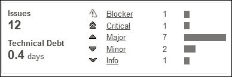

    以下截图显示了代码详细指标：

    

    以下截图显示了**文档**指标：

    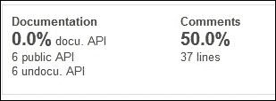

    以下截图显示了循环**复杂度**指标：

    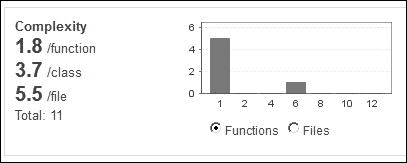*   点击**技术债务**指标中的**问题 12**超链接；这将打开一个带有严重性图例的问题详情。以下为**严重性**图例：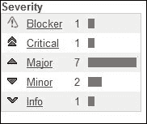

    以下截图显示了问题详情：

    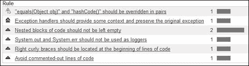*   点击任何三个复杂度超链接。Sonar 将打开文件并显示复杂度详情。

    以下为`Buggy.java`的复杂度示例：

    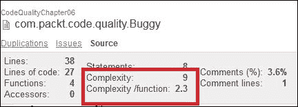

    **热点**视图显示了项目的痛点区域，例如重复行、主要违规、最常违反的规则和最常违反的资源。

    **时间机器**视图显示了项目的按时间顺序视图，例如代码复杂度或代码覆盖率按日或按月进行图形比较。

## 使用 Sonar Eclipse 插件提高质量

Sonar 为 Eclipse 编辑器提供了一个插件，用于访问和修复 Sonar 报告的代码问题。插件可以从[`www.sonarsource.com/products/plugins/developer-tools/eclipse/`](http://www.sonarsource.com/products/plugins/developer-tools/eclipse/)下载。

一旦插件安装完毕，右键单击项目，打开**配置**菜单，然后点击**与 Sonar 关联...**菜单项。以下截图显示了**配置**菜单的详细信息：

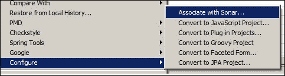

在`sonar-project.properties`文件中，我们存储了`sonar.projectKey=packt:CodeQualityChapter06`项目密钥。

在 Sonar 向导中，输入`GroupId=packt`和`ArtifactId=CodeQualityChapter06`。点击**在服务器上查找**然后点击**完成**。这将连接到本地 Sonar 服务器并将问题详情带入**问题**选项卡。

以下为 Sonar 向导的截图：

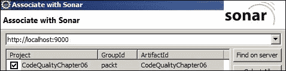

以下是从 Sonar 仓库中获取的违规情况：

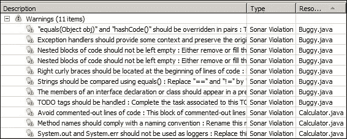

点击任何问题，它将带您到源代码的行并显示问题的工具提示。以下截图显示了`hashCode()`方法未实现的阻塞违规：

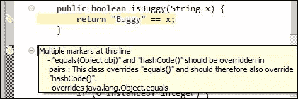

添加一个`hashCode`方法，重新运行 Sonar 运行器，并启动 Sonar Eclipse 向导；它将移除阻塞问题。

## 使用 Gradle 和 SonarQube 监控质量

本节介绍了 Gradle 与 Sonar 的集成。Gradle 有一个内置的 Sonar 插件。在 `/Packt/Chapter06/CodeQualityChapter06` 下创建一个 `build.gradle` 文件。将以下行添加到 `build.gradle` 文件中，并突出显示 Sonar 行：

```java
apply plugin: 'java'
apply plugin: 'sonar-runner'
apply plugin: "jacoco"

repositories {
    flatDir(dir: '../lib', name: 'JUnit Library')
    mavenCentral()
}

dependencies {
    testCompile'junit:junit:4.11', ':hamcrest-core:1.3'
}

jacocoTestReport {
    reports {
        xml.enabled false
        csv.enabled false
        html.destination "${buildDir}/jacocoHtml"
    }
}
sonarRunner {
 sonarProperties {
 property "sonar.projectName", "CodeQualityChapter06"
 property "sonar.projectKey", "packt:CodeQualityChapter06"
 property "sonar.jacoco.reportPath", "${project.buildDir}/jacoco/test.exec"
 }
}

```

注意，`sonar.projectKey` 指的是 `packt:CodeQualityChapter06`。打开命令提示符并执行 `gradle sonarRunner` 命令。这将开始构建项目。以下是在控制台上的输出：

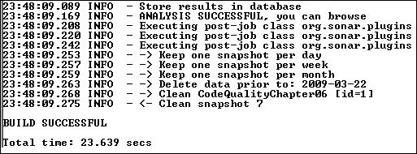

打开 Sonar URL，它将显示 JaCoCo 插件计算出的覆盖率。以下是代码覆盖率和技术债务输出。请注意，项目中新增加了 **+8** 个问题。技术债务从 0.4 天增加到 1.2 天：

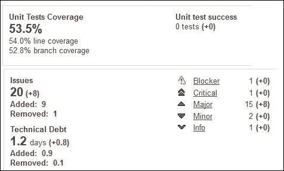

## 使用 Maven 和 SonarQube 监控质量

本节描述了如何将 Maven 与 SonarQube 集成。我们将使用 `CodeQualityChapter06` Eclipse 项目进行分析。Maven 有一个用于 Sonar 的插件。在 `/Packt/Chapter06/CodeQualityChapter06` 下创建一个 `pom.xml` 文件。将以下行添加到 `pom.xml` 文件中：

```java
<project    xsi:schemaLocation="http://maven.apache.org/POM/4.0.0 http://maven.apache.org/xsd/maven-4.0.0.xsd">
  <modelVersion>4.0.0</modelVersion>
  <groupId>packt</groupId>
  <artifactId>Chapter06</artifactId>
  <version>1.0-SNAPSHOT</version>
  <packaging>jar</packaging>
  <name>Chapter06</name>
  <url>http://maven.apache.org</url>
  <properties>
    <project.build.sourceEncoding>UTF-8
    </project.build.sourceEncoding>
  <sonar.language>java</sonar.language>
  </properties>
  <dependencies>
    <dependency>
      <groupId>junit</groupId>
      <artifactId>junit</artifactId>
      <version>4.11</version>
      <scope>test</scope>
    </dependency>
  </dependencies>
```

打开命令提示符，转到项目基本文件夹，并执行 `mvn sonar:sonar` 命令。此命令将从存储库下载 SonarQube 版本的 JAR 文件并开始分析项目。注意前面脚本中突出显示的 `<sonar.language>java<…>` 部分。此 `<sonar.language>` 标签表示 Maven 将分析一个 `java` 项目。

在 Gradle 脚本或 Sonar 运行器中，我们没有提到项目版本；在这里，根据 Maven 项目约定，我们必须在 `POM.xml` 文件中指定 `<version>1.0-SNAPSHOT</version>` 版本。

SonarQube 使用一个密钥（`GroupId` 或 `ArtifactId`）和一个版本来唯一标识一个项目。因此，Maven 分析将在 Sonar 服务器中创建一个新的项目统计信息，因为 Maven 提供了版本号，但 Gradle 和 Sonar 运行器没有。

以下截图显示了 Sonar 仪表板上的 **项目** 部分。请注意，Maven 分析创建了 **版本** **1.0-SNAPSHOT**，而 Gradle 和 Sonar 运行器都更新了项目的 **未指定** 版本：

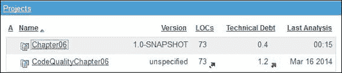

## 使用 Ant 和 SonarQube 监控质量

本节描述了如何配置 Ant 以与 Sonar 集成。Ant 目标需要一个任务来执行构建步骤。SonarQube 提供了一个用于项目分析的 Ant 任务。需要从 [`repository.codehaus.org/org/codehaus/sonar-plugins/sonar-ant-task/2.1/sonar-ant-task-2.1.jar`](http://repository.codehaus.org/org/codehaus/sonar-plugins/sonar-ant-task/2.1/sonar-ant-task-2.1.jar) 下载 Ant 任务 JAR。

我们将使用 Ant 分析 `CodeQualityChapter06` 项目。将下载的 JAR 文件复制到 `\Packt\chapter06\lib` 目录下，并在 `CodeQualityChapter06` 目录下直接创建一个 `build.xml` 文件。您可以复制我们在 第五章，*代码覆盖率* 中使用的现有 `build.xml` 文件，或者下载本章的代码。

### 提示

XML 命名空间类似于 Java 包，为 XML 元素或属性提供一个限定名，以避免名称冲突。命名空间由元素的起始标签中的 `xmlns` 属性定义。命名空间声明具有 `syntax.` 语法。

```

```

```java
<project name="chapter06" default="coverage" basedir="." **>**
  **<property name="sonar.projectKey" value="packt:chapter06_ant" />**
  <property name="sonar.projectName" value="Chapter06" />
  **<property name="sonar.projectVersion" value="2.0" />**
  <property name="sonar.language" value="java" />
  <property name="sonar.sources" value="src/main/java" />
  <property name="sonar.binaries" value="target" />
  <property name="sonar.sourceEncoding" value="UTF-8" />
  **<target name="sonar" depends="compile">**
    **<taskdef uri="antlib:org.sonar.ant" **      **resource="org/sonar/ant/antlib.xml">**
      **<classpath path="${lib.dir}/sonar-ant-task-2.1.jar" />**
    **</taskdef>**
    **<sonar:sonar />**
  **</target>** 
```

```

```

以下是 SonarQube 仪表板输出。第二行带有 **版本** **2.0** 和键 **packt:chapter06_ant** 的行是 Ant 分析结果：

`` `# 熟悉误报    这一节讨论了误报问题。一般来说，静态代码分析工具会根据一组规则分析源代码，并在源代码中找到违规模式时报告违规。然而，当我们审查模式并发现违规在上下文中不正确时，那么报告的违规就是一个误报。    静态分析工具报告违规，但我们必须过滤掉正确的规则集并移除误报规则。SonarQube 的手动代码审查功能允许您审查代码，添加注释，并将违规标记为误报。以下 Sonar URL 描述了如何审查违规并将违规标记为误报：[`www.sonarqube.org/sonar-2-8-in-screenshots/`](http://www.sonarqube.org/sonar-2-8-in-screenshots/)。    # 摘要    本章深入讲解了静态代码分析和代码质量属性。它涵盖了 SonarQube 代码质量仪表板、使用 Eclipse 插件进行的静态代码分析、Sonar 运行器和构建脚本（如 Ant、Maven 和 Gradle），以及代码质量工具（如 PMD、Checkstyle 和 FindBugs）。    到目前为止，读者将能够配置 Sonar 仪表板，设置 Eclipse 插件，并配置 Sonar 运行器和构建脚本，以使用 PMD、FindBugs 和 Checkstyle 分析代码质量。    下一章将介绍使用模拟对象进行单元测试 Web 层代码。`
