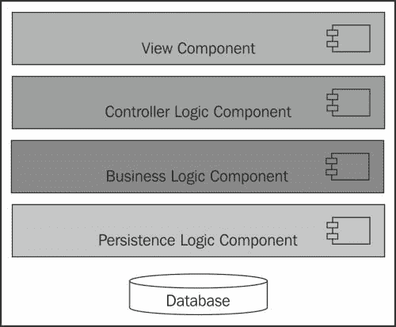
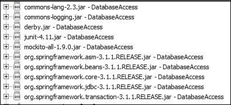

# 第八章。玩转数据

> "任何程序的价值仅在于它的实用性。"
> 
> ——林纳斯·托瓦兹

企业应用程序存储、检索、传输、操作和分析数据。存储、处理和分析数据对任何业务都至关重要。**商业智能**（**BI**）过程将数据转换为对业务有意义的情报。BI 分析统计数据，帮助业务进行决策和预测，例如风险评估、计划和预测以及分析购买趋势。信息可以存储在文件或数据库中。从关系型数据库查询和访问数据比文件系统更容易。本章涵盖了数据库层的单元测试。以下主题将进行深入探讨：

+   分离关注点

+   单元测试持久化层

+   使用 Spring JDBC 编写干净的数据库访问代码

+   JDBC 代码的集成测试

+   Spring JDBC 的集成测试

# 分离关注点

本节详细阐述了分离关注点。企业应用程序的信息可以使用以下构建块表示：

+   **什么**：这代表要存储的信息。我们无法存储一切；因此，对要存储的数据进行分类非常重要。

+   **谁**：这代表参与者。信息是敏感的，控制用户之间的访问权限很重要；例如，员工不应能够访问其他员工的薪酬信息，但经理或人力资源部门的员工可以访问员工的薪酬数据。

+   **数据存储**：这代表信息和其可访问性。

+   **过程**：这代表数据处理。除非对信息执行某些操作，否则任何信息都没有意义。

以下图描述了企业应用程序的关键信息块：


本节涵盖了**存储**块和单元测试数据访问层。

以下图表示了一个松散耦合应用程序的组件：



视图组件代表 JSP、标签库、小部件等。为视图组件编写自动化的 JUnit 测试并不容易，需要手动工作。我们将在本章中跳过视图组件。

我们在第七章中单元测试了控制器逻辑组件，*单元测试 Web 层*。

控制器逻辑组件访问业务逻辑组件。业务逻辑组件执行业务逻辑并将数据访问委托给持久化逻辑组件。我们将在接下来的章节中介绍业务逻辑的单元测试。使用模拟对象来模拟持久化或数据访问层。

持久逻辑层或数据库客户端层负责管理数据库连接，从数据库检索数据，并将数据存储回数据库。对数据访问层进行单元测试非常重要；如果在这个层中出现问题，应用程序将失败。我们可以从数据库中独立地对数据访问逻辑进行单元测试，并执行集成测试以验证应用程序和数据库的完整性。

您可以对数据库访问代码实现 100% 的测试覆盖率。然而，如果控制器和/或视图层误用了此代码，整个应用程序将变得无用。您需要集成测试来验证连接，这将在稍后介绍。

数据库代表一个数据存储或关系数据库。

将数据访问层从业务逻辑层分离出来，有助于我们在不影响业务逻辑层的情况下修改数据库，并允许我们独立于数据库对业务逻辑层进行单元测试。假设您正在使用 MySQL 数据库，并希望迁移到 SQL Server。在这种情况下，您不需要修改业务逻辑层。

# 单元测试持久逻辑

在本节中，我们将构建一个电话簿应用程序并存储电话号码。我们将使用 **Apache Derby** 数据库进行持久化。Derby 可以从 [`db.apache.org/derby/`](http://db.apache.org/derby/) 下载。

您可以使用更好的内置数据库，例如 H2。它具有更多功能，比 Derby 更少限制；然而，我们为了简单起见使用 Derby。

以下是运行 Derby 的步骤：

1.  下载二进制媒体文件并将其提取到首选位置。在接下来的步骤中，我们将将其称为 `DERBY_HOME`。

1.  在 Windows 机器上，转到 `DERBY_HOME\bin` 并执行 `startNetworkServer.bat` 文件。

1.  它将启动一个命令提示符，并在控制台打印一条消息，表明数据库服务器已启动，例如 **已启动并准备好在端口 1527 接受连接**。

我们将创建一个 Java 项目来测试电话簿应用程序。按照以下步骤构建应用程序：

1.  启动 Eclipse 并创建一个名为 **DatabaseAccess** 的 Java 项目。

1.  添加一个 `PhoneEntry` 类来存储电话详情。以下是类的详情：

    ```java
    package com.packt.database.model;

    public class PhoneEntry implements Serializable {

      private static final long serialVersionUID = 1L;

      private String phoneNumber;
      private String firstName;
      private String lastName;

      // getters and setters
    }
    ```

1.  为电话簿创建一个数据访问接口。以下是 API 详情：

    ```java
    package com.packt.database.dao;

    import java.util.List;
    import com.packt.database.model.PhoneEntry;

    public interface PhoneBookDao {
      boolean create(PhoneEntry entry);

      boolean update(PhoneEntry entryToUpdate);

      List<PhoneEntry> searchByNumber(String number);

      List<PhoneEntry> searchByFirstName(String firstName);

      List<PhoneEntry> searchByLastName(String lastName);

      boolean delete(String number);
    }
    ```

1.  创建一个数据库访问接口实现，用于与数据库通信。以下是数据访问对象详情：

    ```java
    public class PhoneBookDerbyDao implements PhoneBookDao {

      private String driver = "org.apache.derby.jdbc.EmbeddedDriver";
      private String protocol = "jdbc:derby:";
      private String userId = "dbo";
      private String dbName = "phoneBook";

      public PhoneBookDerbyDao() {
        loadDriver();
      }

      protected void loadDriver() {
        try {
          Class.forName(driver).newInstance();
        } catch (ClassNotFoundException cnfe) {
          cnfe.printStackTrace(System.err);
        } catch (InstantiationException ie) {
          ie.printStackTrace(System.err);
        } catch (IllegalAccessException iae) {
          iae.printStackTrace(System.err);
        }
      }

      protected Connection getConnection() throws SQLException {
        Connection conn = null;
        Properties props = new Properties();        
        props.put("user", userId);
        conn = DriverManager.getConnection(protocol + dbName + ";create=true",props);
        conn.setAutoCommit(false);
        return conn;
      }
    }
    ```

    注意，`PhoneBookDerbyDao` 类是 dao 的 Derby 实现。它具有配置属性，如 `driver`、`protocol` 和 `dbName`，以及获取器或设置器。`loadDriver()` 方法加载数据库驱动程序，并从 `PhoneBookDerbyDao` 构造函数中调用。`getConnection()` 方法连接到 Derby 数据库并建立连接。

1.  实现以下 `create` 行为：

    ```java
      @Override
      public boolean create(PhoneEntry entry) {
        PreparedStatement preparedStmt = null;
        Connection conn = null;
        try {
        conn = getConnection();
        preparedStmt = conn.prepareStatement("insert into PhoneBook values (?,?,?)");

        preparedStmt.setString(1, entry.getPhoneNumber());
        preparedStmt.setString(2, entry.getFirstName());
        preparedStmt.setString(3, entry.getLastName());
        preparedStmt.executeUpdate();
        // Note that it can cause problems on some dbs if //autocommit mode is on
        conn.commit();
          return true;
        } catch (SQLException e) {
          e.printStackTrace();
        } finally {

          if (preparedStmt != null) {
            try {
              preparedStmt.close();
            } catch (SQLException e) {
              e.printStackTrace();
            }
          }

          if (conn != null) {
            try {
              conn.close();
            } catch (SQLException e) {
              e.printStackTrace();
            }
          }
        }

        return false;
      }
    ```

    `create` 方法首先获取数据库连接，并从 `connection` 创建一个预处理语句。然后，它使用 `PhoneEntry` 值填充预处理语句，执行预处理语句，然后提交连接。在 `finally` 块中关闭资源。然后，关闭预处理语句和连接。

1.  我们需要对 JDBC API 调用进行单元测试，因为我们还没有配置数据库。我们将独立于数据库测试 `create()` 行为。在 `test\com.packt.database.dao` 包下创建一个 `PhoneBookDerbyDaoTest` JUnit 测试。为了独立于数据库运行测试，我们需要绕过 `loadDriver` 和 `getConnection` 方法。因此，我们需要一个假对象来测试该类，并需要模拟对象来模拟 JDBC 配置类，例如 `Connection`、`ResultSet` 和 `PreparedStatement`。

    `TestablePhoneBookDerbyDao` 是 dao 的假对象实现。我们创建了一个模拟的 `Connection` 对象，并从假对象的 `getConnection` 方法返回。以下是对 dao 类的 JUnit 测试：

    ```java
    @RunWith(MockitoJUnitRunner.class )
    public class PhoneBookDerbyDaoTest {
      @Mock
      Connection connection;

      class TestablePhoneBookDerbyDao extends PhoneBookDerbyDao{
        protected void loadDriver() {
        }

        protected Connection getConnection() throws SQLException {
          return connection;
        }
      }
    }
    ```

1.  `PhoneBookDerbyDao` 需要 `PreparedStatement` 来将 `PhoneEntry` 细节传递到数据库。创建模拟的 `PreparedStatement` 和 `connection` 方法。更新测试类并添加以下行：

    ```java
      @Mock
       Connection connection;
      @Mock
      PreparedStatement statement;

      PhoneBookDerbyDao dao;

      @Before
      public void setUp(){
        dao = new TestablePhoneBookDerbyDao();
      }
    ```

    使用 `PhoneEntry` 调用 `create` 方法，并验证 `PhoneEntry` 细节是否传递给了 `statement` 对象。最后，验证 `connection` 是否已提交，以及 `statement` 和 `connection` 是否已关闭，如下所示：

    ```java
      @Test
      public void creates_phone_entry() throws Exception {
        //Setting up sample object
        PhoneEntry johnDoe= new PhoneEntry();
        johnDoe.setFirstName("John");
        johnDoe.setLastName("Doe");
        johnDoe.setPhoneNumber("123");

        //Stubbing the connection obj to return the mocked statement
        when(connection.prepareStatement(anyString())).thenReturn(statement;

        //Calling the actual method
        boolean succeed = dao.create(johnDoe);
        assertTrue(succeed);

        //Creating argument captors  
        ArgumentCaptor<String> stringArgCaptor = ArgumentCaptor.forClass(String.class);
        ArgumentCaptor<Integer> intArgCaptor = ArgumentCaptor.forClass(Integer.class);

        //verifying that the mocked statement's setString is //invoked 3 times for firstName, lastName and //phoneNumber  
        verify(statement, new Times(3)).setString(intArgCaptor.
        capture(), stringArgCaptor.capture());

        //Verify the arguments passed to the statement object
        assertEquals("123", stringArgCaptor.getAllValues().get(0));
        assertEquals("John", stringArgCaptor.getAllValues().get(1));
        assertEquals("Doe", stringArgCaptor.getAllValues().get(2));

        verify(connection).prepareStatement(stringArgCaptor.capture());
        assertEquals(PhoneBookDerbyDao.INSERT_INTO_PHONE_BOOK_VALUES    stringArgCaptor.getValue());

        //verify that the mock resources were used and closed
        verify(statement).executeUpdate();
        verify(connection).commit();
        verify(statement).close();
        verify(connection).close();

    }
    ```

    ### 注意

    过度使用参数捕获器可能导致测试脆弱，因为你的测试系统不再是黑盒。

1.  我们将验证数据检索逻辑，并增强 `searchByNumber()` 方法以按数字检索 `PhoneEntry`。以下是对逻辑的描述：

    ```java
      @Override
      public List<PhoneEntry> searchByNumber(String number) {
        PreparedStatement preparedStmt = null;
        Connection conn = null;
        ResultSet resultSet = null;
        List<PhoneEntry> entries = new ArrayList<PhoneEntry>();
        try {
          conn = getConnection();
          preparedStmt = conn.prepareStatement("SELECT * FROM PhoneBook where num=?");

          preparedStmt.setString(1, number);
          resultSet = preparedStmt.executeQuery();
          while (resultSet.next()) {
            PhoneEntry entry = new PhoneEntry();
            entry.setFirstName(resultSet.getString("fname"));
            entry.setLastName(resultSet.getString("lname"));
            entry.setPhoneNumber(resultSet.getString("num"));
            entries.add(entry);
          }
          return entries;
        } catch (SQLException e) {
          e.printStackTrace();
        } finally {

          try {
            if (resultSet != null) {
              resultSet.close();
              resultSet = null;
            }
          } catch (SQLException e) {
            e.printStackTrace();
          }

          if (preparedStmt != null) {
            try {
              preparedStmt.close();
            } catch (SQLException e) {
              e.printStackTrace();
            }
          }

          if (conn != null) {
            try {
              conn.close();
            } catch (SQLException e) {
              e.printStackTrace();
            }
          }
        }
        return null;
      }
    ```

    在前面的代码中，以下语句按顺序执行：

    1.  获取数据库 `Connection`。然后，从 `Connection` 对象创建 `PreparedStatement`。

    1.  之后，填充 `PreparedStatement`。

    1.  现在，执行 `PreparedStatement` 并返回 `ResultSet`。

    1.  `ResultSet` 被迭代，并从 `ResultSet` 中填充 `PhoneEntry` 对象。

    1.  最后，关闭 JDBC 资源。

1.  为了单元测试这个逻辑，我们需要模拟 `ResultSet`、`PreparedStatement` 和 `Connection` 对象。`ResultSet` 对象将被模拟以返回一个 `PhoneEntry` 对象，`PreparedStatement` 对象将被模拟以返回模拟的 `ResultSet` 对象，而 `Connection` 对象将被模拟以返回模拟的 `PreparedStatement` 对象。

    ### 提示

    在持久化逻辑单元测试中，以下事项被验证：

    +   JDBC API 调用序列，如连接，已被提交

    +   资源已被关闭或清理

    +   将 `ResultSet` 映射到模型对象（POJO）

    以下是对逻辑进行验证的测试代码：

    ```java
      @Test
      public void retrieves_phone_entry() throws Exception {

        //Stub JDBC resources to return mock objects
        when(mockConn.prepareStatement(anyString())).      thenReturn(mockPrepStmt);
        when(mockPrepStmt.executeQuery()).      thenReturn(mockResultSet);
        when(mockResultSet.next()).thenReturn(true).      thenReturn(false);

        //Stub the resultSet to return value
        when(mockResultSet.getString("fname")).thenReturn("John");
        when(mockResultSet.getString("lname")).thenReturn("Doe");
        when(mockResultSet.getString("num")).thenReturn("123");

        //Execute  
        List<PhoneEntry> phoneEntries = dao.searchByNumber("123");

        assertEquals(1, phoneEntries.size());
        PhoneEntry johnDoe = phoneEntries.get(0);

        //verify mapping
        assertEquals("John", johnDoe.getFirstName());
        assertEquals("Doe", johnDoe.getLastName());
        assertEquals("123", johnDoe.getPhoneNumber());

        //Verify Resource Clean up 
        verify(mockResultSet).close();
        verify(mockPrepStmt).close();
        verify(mockConn).close();
      }
    ```

    我们应该为 `update`、`delete` 和 `searchByXXX` 行为编写单元测试。

# 使用 Spring 简化持久化

查看 `PhoneBookDerbyDao` 类。它有 398 行代码来支持创建、读取、更新和删除（CRUD）操作。每个方法执行几乎相似的任务。以下任务是从 CRUD 方法中调用的：

+   传递连接参数

+   打开连接

+   创建语句

+   准备语句

+   执行语句

+   遍历结果（仅在读取方法中）

+   填充模型对象（仅在读取方法中）

+   处理任何异常

+   处理事务

+   关闭 ResultSet（仅在读取方法中）

+   关闭语句

+   关闭连接

Spring 框架提供了 API 来减少 JDBC 代码的重复。Spring JDBC 隐藏了底层细节，使我们能够专注于业务逻辑。我们将使用 Spring JDBC 实现 `PhoneBookDao`。

从 [`maven.springframework.org/release/org/springframework/spring/`](http://maven.springframework.org/release/org/springframework/spring/) 下载最新的 JDBC JAR 及其依赖项。

按照以下步骤实现 Spring JDBC 并简化代码：

1.  启动 Eclipse，打开 `DatabaseAccess` 项目，并编辑 `.classpath` 以添加屏幕截图所示的以下 Spring 依赖项：

1.  创建一个实现 `PhoneBookDao` 接口的 `PhoneBookDerbySpringDao` 类。以下是对 Spring `create` 方法的实现：

    ```java
      public class PhoneBookDerbySpringDao  implements
        PhoneBookDao {

      private final JdbcTemplate jdbcTemplate;

        public PhoneBookDerbySpringDao(JdbcTemplate jdbcTemplate) {
        this.jdbcTemplate = jdbcTemplate;
        }

        @Override
        public boolean create(PhoneEntry entry) {
          int rowCount = jdbcTemplate.update("insert into PhoneBook values (?,?,?)",
     new Object[]{entry.getPhoneNumber(), entry.getFirstName(),
     entry.getLastName()
     });
          return rowCount == 1;
        }
      }
    ```

    `JdbcTemplate` 简化了 JDBC 的使用；它处理资源并帮助避免常见的错误，例如未关闭连接。它创建并填充 `statement` 对象，遍历 `ResultSet` 对象，这使应用程序代码提供 SQL 并提取结果。`PhoneBookDerbySpringDao` 包含一个 `JdbcTemplate` 实例并将数据库任务委托给 `jdbcTemplate`。

    `JdbcTemplate` 有一个用于插入和更新操作的更新方法。它接受一个 SQL 查询和参数。新版本的 Spring `create()` 方法在 `jdbcTemplate` 上调用 `update()` 方法并传递 `PhoneEntry` 详细信息。现在 `create` 方法看起来很简单，只有两行代码。Spring 框架处理资源生命周期。

1.  创建一个名为 `PhoneBookDerbySpringDaoTest` 的 JUnit 类进行单元测试。我们将创建一个 `jdbcTemplate` 模拟对象并将其传递给 dao。以下是对 JUnit 的实现：

    ```java
    @RunWith(MockitoJUnitRunner.class)
    public class PhoneBookDerbySpringDaoTest {

      @Mock
      JdbcTemplate mockJdbcTemplate;

      PhoneBookDerbySpringDao springDao;

      @Before
      public void init() {
        springDao = new PhoneBookDerbySpringDao(mockJdbcTemplate);
      }

      @Test
      public void creates_PhoneEntry() throws Exception {
        //create PhoneEntry
        String charlsPhoneNumber = "1234567";
        String charlsFirstName = "Charles";
        String charlsLastName = "Doe";

        PhoneEntry charles = new PhoneEntry();
        charles.setFirstName(charlsFirstName);
        charles.setLastName(charlsLastName);
        charles.setPhoneNumber(charlsPhoneNumber);

        //Stub jdbcTemplate's update to return 1
        when(mockJdbcTemplate.update(anyString(), anyObject(), anyObject(), anyObject())).thenReturn(1);

        //Execute
        assertTrue(springDao.create(charles));

        //Create argument capture
        ArgumentCaptor<Object> varArgs = ArgumentCaptor.forClass(Object.class);

        ArgumentCaptor<String> strArg = ArgumentCaptor.forClass(String.class);

        //Verify update method was called and capture args
        verify(mockJdbcTemplate).update(strArg.capture(),varArgs.capture(),varArgs.capture(), varArgs.capture());

        //Verify 1st dynamic argument was the phone number
        assertEquals(charlsPhoneNumber, varArgs.getAllValues().get(0));
        //Verify the name arguments
        assertEquals(charlsFirstName, 
          varArgs.getAllValues().get(1));
        assertEquals(charlsLastName, varArgs.getAllValues().get(2));
      }
    }
    ```

    查看新的 Spring dao；它只有 54 行代码。这个类看起来整洁、简单且易于阅读。它不处理资源，而是专注于数据访问。

# 验证系统完整性

集成测试使我们能够找到单元测试无法捕获的错误。我们已经对 JDBC API 的使用进行了单元测试，但我们需要测试数据与数据访问 API 的集成，例如 JDBC 驱动程序、连接和回滚。在本节中，我们将使用数据库测试数据访问层。

在开始编写测试之前，我们需要创建数据库表。从 Packt Publishing 网站下载代码，并将项目 `DatabaseAccess` 导入到您的 Eclipse 工作空间中，转到 `com.packt.database.util` 包并运行 `DatabaseManager` 类。它将创建表。以下为相对简单的表创建代码：

```java
    conn = DriverManager.getConnection(url, props);
    conn.setAutoCommit(false);
    statement = conn.createStatement();
    statement.execute("create table PhoneBook      (num varchar(50), fname varchar(40),lname varchar(40))");
    conn.commit();
```

以下是在测试 JDBC 代码时的步骤：

1.  为数据库相关的测试创建一个名为 `integration` 的源文件夹，例如 `src` 或 `test`。

1.  创建一个名为 `PhoneBookDerbyJdbcDaoIntegrationTest` 的新 JUnit 测试，并添加以下行以测试创建、搜索、更新和删除功能：

    ```java
    public class PhoneBookDerbyJdbcDaoIntegrationTest {
      PhoneBookDerbyDao jdbcDao;

      @Before
      public void init() {
        jdbcDao = new PhoneBookDerbyDao();
      }

      @Test
      public void integration() throws Exception {
        PhoneEntry entry = new PhoneEntry();
        entry.setFirstName("john");
        entry.setLastName("smith");
        entry.setPhoneNumber("12345");

        assertTrue(jdbcDao.create(entry));
        List<PhoneEntry> phoneEntries = 
        jdbcDao.searchByFirstName("john");

        //verify create
        assertFalse(phoneEntries.isEmpty());

        //modify last name
        entry.setLastName("doe");

        //update
        assertTrue(jdbcDao.update(entry));

        //retrieve
        phoneEntries = jdbcDao.searchByFirstName("john");

        //verify update
        assertFalse(phoneEntries.isEmpty());
        assertEquals("doe", phoneEntries.get(0).getLastName());

        //delete
        jdbcDao.delete(entry.getPhoneNumber());

        //retrieve
        phoneEntries = jdbcDao.searchByFirstName("john");

        //verify delete
        assertTrue(phoneEntries.isEmpty());
      }

    }
    ```

集成测试创建一个 `PhoneBookDerbyJdbcDao` 实例，并调用 `PhoneBookDerbyJdbcDao` 方法以断言结果。

# 使用 Spring 编写集成测试

Spring 提供了模块或实用库以进行集成测试。以下是用 Spring 事务管理 API 和 `SpringJUnit4ClassRunner` 编写 JUnit 测试的步骤：

1.  Spring 支持基于 XML 的配置和 Bean 连接。在 `integration` 源包中创建一个名为 `integration.xml` 的 XML 文件。修改 XML 文件并定义 `dataSource`、`transactionManager` 和 `JdbcTemplate` Spring Bean。以下为 XML 内容：

    ```java
    <beans 

      xsi:schemaLocation="http://www.springframework.org/schema/beans http://www.springframework.org/schema/beans/spring-beans-3.0.xsd">

      <bean id="dataSource" class="org.springframework.jdbc.datasource.DriverManagerDataSource">
        <property name="driverClassName" value="org.apache.derby.jdbc.EmbeddedDriver"/>
        <property name="url" value="jdbc:derby:derbyDB;create=true"/>
        <property name="username" value="dbo"/>
      </bean> 

      <bean id="transactionManager" class="org.springframework.jdbc.datasource.DataSourceTransactionManager">
        <constructor-arg ref="dataSource"/>
      </bean>

      <bean id="jdbcTemplate" class="org.springframework.jdbc.core.JdbcTemplate">
        <property name="dataSource" ref="dataSource"/>
      </bean>
    </beans>
    ```

    ### 提示

    要了解更多关于 Spring Bean 的信息，请访问 [`docs.spring.io/spring/docs/1.2.9/reference/beans.html`](http://docs.spring.io/spring/docs/1.2.9/reference/beans.html)。

    定义了一个带有 `driverClassName`、`url` 和 `username` 的 `dataSource` Bean。将 `dataSource` 引用传递给 `jdbcTemplate` 和 `transactionManager` Bean。

1.  Spring 支持在测试执行后自动回滚事务。这有助于我们保护开发数据库免受损坏。测试运行器在测试执行之前需要引用一个事务管理器 Bean。`SpringJUnit4ClassRunner` 处理集成测试。添加一个 `PhoneBookDerbySpringDaoIntegrationTest` JUnit 测试，并向其中添加以下行：

    ```java
    @ContextConfiguration({ "classpath:integration.xml" })
    @TransactionConfiguration(transactionManager = "transactionManager", defaultRollback = true)
    @Transactional
    @RunWith(SpringJUnit4ClassRunner.class)
    public class PhoneBookDerbySpringDaoIntegrationTest {

      @Autowired
      JdbcTemplate jdbcTemplate;

      PhoneBookDerbySpringDao springDao;

      @Before
      public void init() {
        springDao = new PhoneBookDerbySpringDao(jdbcTemplate);
      }

      @Test
      public void integration() throws Exception {
        PhoneEntry entry = newEntry("12345", "John", "Smith");

        //create
        assertTrue(springDao.create(entry));

        //retrieve
        List<PhoneEntry> phoneEntries = 
          springDao.searchByFirstName("John");

        //verify create
        assertFalse(phoneEntries.isEmpty());

        //modify last name
        entry.setLastName("Kallis");

        //update
        assertTrue(springDao.update(entry));

        //retrieve
        phoneEntries = springDao.searchByFirstName("John");

        //verify update
        assertFalse(phoneEntries.isEmpty());
        assertEquals("Kallis", 
          phoneEntries.get(0).getLastName());

        //delete
        springDao.delete(entry.getPhoneNumber());

        //retrieve
        phoneEntries = springDao.searchByFirstName("John");

        //verify delete
        assertTrue(phoneEntries.isEmpty());
      }
    }
    ```

`@ContextConfiguration({ "classpath:integration.xml" })` 注解指示 JUnit 运行器从类路径位置加载 Spring Bean。它将从 `integration.xml` 文件中加载三个 Bean。

类级别的 `@Transactional` 注解使所有方法都具有事务性。

`@TransactionConfiguration(transactionManager = "transactionManager", defaultRollback = true)` 注解定义了事务管理器，`defaultRollback` 属性告诉事务管理器在给定测试结束后回滚所有事务。

当运行 JUnit 测试时，以下事情会发生：

+   Spring Bean 从 `integration.xml` 文件中加载。

+   配置了一个事务管理器以回滚所有事务。

+   `jdbcTemplate` Bean 会自动连接到测试类的成员 `jdbcTemplate`。

+   `init` 方法创建 dao 类的新实例，并将 `jdbcTemplate` Bean 传递给 dao。

+   测试首先执行，然后创建、更新和删除 `PhoneEntry`。

+   测试执行后，事务管理器回滚事务。没有数据被创建、修改或从 `PhoneBook` 表中删除。

当 JUnit 测试运行时，以下 Spring 控制台日志显示：

```java
INFO: Began transaction (1): transaction manager [org.springframework.jdbc.datasource.DataSourceTransactionManager@569c60]; rollback [true]
Apr 11, 2014 10:02:25 PM org.springframework.test.context.transaction.TransactionalTestExecutionListener endTransaction
INFO: Rolled back transaction after test execution for test context [[TestContext@134eb84 testClass = PhoneBookDerbySpringDaoIntegrationTest, testInstance = com.packt.database.dao.PhoneBookDerbySpringDaoIntegrationTest@1522de2, testMethod = integration@PhoneBookDerbySpringDaoIntegrationTest, testException = [null], mergedContextConfiguration = [MergedContextConfiguration@425743 testClass = PhoneBookDerbySpringDaoIntegrationTest, locations = '{classpath:integration.xml}', classes = '{}', activeProfiles = '{}', contextLoader = 'org.springframework.test.context.support.DelegatingSmartContextLoader']]]

```

日志显示，一个事务已经开始，最终事务被回滚。然而，事务回滚并不是由于任何异常，而是由于事务设置 `[defaultRollback = true]`。日志显示 `testException` 等于 `null`，这意味着没有抛出异常。

# 摘要

本章解释了数据库层的单元测试策略；它提供了一个与数据库隔离的单元测试示例，使用 Spring 编写干净的 JDBC 代码，以及使用数据库编写集成测试。我们还了解了在 Spring JDBC 集成测试中配置的自动事务回滚。

现在，你应该能够独立于数据库对数据访问层组件进行单元测试，使用 Spring 编写整洁的 JDBC 代码，并使用 Spring API 编写集成测试。

下一章将涵盖服务层和测试遗留代码。
