# 第九章. 解决测试难题

> “我们通过我们所得到的东西谋生，但我们通过我们所给予的东西创造生活。”
> 
> ——温斯顿·丘吉尔

你可能参与过使用**测试驱动开发**（**TDD**）编写的绿地开发项目，也参与过没有使用 TDD 编写的棕地开发或维护项目。你必须已经注意到，使用 TDD 编写的测试优先代码比没有单元测试或编码后编写的单元测试的代码更容易扩展。

### 小贴士

绿地项目是从零开始构建的，不考虑任何先前的工作。

棕地项目是先前工作的扩展或从现有项目重建项目。

本章涵盖了在绿地和棕地项目中单元测试的重要性。以下主题将进行深入探讨：

+   与遗留代码一起工作

+   设计可测试性

+   与绿地代码一起工作

“*与遗留代码一起工作*”部分涵盖了遗留代码，并解释了如何进行单元测试和重构遗留代码。“*设计可测试性*”部分解释了如何设计可测试性。“*与绿地代码一起工作*”部分详细阐述了 TDD、TDD 生命周期、重构，并以 TDD 的示例结束。

# 与遗留代码一起工作

术语**遗产**经常被用作俚语，用来描述复杂、难以理解、本质上是僵化和脆弱的代码，几乎不可能进行增强。

然而，事实是，任何没有自动单元测试的代码都是遗留代码。一段代码可以写得很好。它也可以遵循编码指南，可能易于理解，可以干净、松散耦合，并且非常容易扩展。然而，如果没有自动单元测试，那么它就是遗留代码。

统计上，修复遗留项目中的错误或添加新功能比在绿地项目中做同样的事情要困难得多。在遗留代码中，要么没有自动单元测试，要么测试很少；代码没有设计为可测试。

我们从其他来源继承了遗留代码，可能来自一个非常古老的项目，来自无法维护代码的其他团队，或者我们从另一家公司获得它，但我们的责任是提高其质量。

单元测试为我们提供了一定程度的保证，即我们的代码正在执行预期的操作，并且允许我们快速更改代码并更快地验证更改。

通常，遗留代码不可测试，需要修改代码结构（重构）才能使其可测试。然而，大多数情况下，遗留系统对业务至关重要，没有人敢触碰代码。除非出现严重问题，否则修改现有关键模块是没有意义的。僵局！除非你有自动测试套件，否则你不能重构代码，而且你不能在代码需要重构时编写测试。

有时感觉即使有单元测试，遗留代码也很难理解、维护和增强；因此，我们需要小心地编写可读性强的测试，并避免与实际实现细节紧密耦合。

## 与测试障碍一起工作

本节解释了使单元测试变得困难的代码的性质或质量。自动测试帮助我们快速开发软件，即使我们有一个庞大的代码库要处理。然而，自动测试应该执行得非常快，以便测试可以给我们提供快速反馈。当代码表现出以下任何特征时，我们无法对代码进行单元测试：

+   它执行长时间运行的操作

+   它连接到数据库并修改数据库记录

+   它执行远程计算

+   它查找 JNDI 资源或 Web/应用程序服务器对象

+   它访问文件系统

+   它与原生对象或图形小部件（UI 组件、警告、Java Swing 组件等）一起工作

+   它访问网络资源，例如局域网打印机，并从互联网下载数据

单元测试不应该等待长时间运行的过程完成；这将违背快速反馈的目的。

单元测试应该是可靠的，并且只有在生产代码出错时才应该失败。然而，如果你的单元测试验证的是一个慢速、易出错且不可预测的 I/O 操作，例如连接到局域网打印机，那么你的单元测试可能会因为某些网络问题而失败，但它将错误地表明代码已损坏。因此，对网络操作进行单元测试违反了测试可靠性原则。

单元测试会自动运行，所以在测试执行期间打开模态对话框或显示警告消息是没有意义的，因为测试将会等待，除非 UI 对话框或警告被关闭。

因此，在生产代码中的前述特性在单元测试期间构成了障碍。以下示例展示了如何避免测试障碍：

```java
public class MovieTicketPro {

 public void book(Movie movie, ShowTime time, int noOfTickets) {
  MovieDao dao = new MovieDao();
  MovieHall hall = dao.findMovie(movie, time);
  if (hall != null) {
    List<String> seats = dao.getAvilableSeats(movie, time);
    if (seats.size() < noOfTickets) {
      BookingErrorController.createAndShowTicketNotAvailableError();
      return;
    }
    int booked = 0;
    String bookedSeats = "";
    for (String aSeat : seats) {
      try {
        dao.book(hall, time, aSeat);
        bookedSeats += " " + aSeat;
        booked++;
        if (booked == noOfTickets) {
          BookingErrorController.createAndShowBookedMsg(bookedSeats);
          break;
        }
      } catch (BookingException e) {
        if (e.getType().equals(ErrorType.SeatAlreadyBooked)) {
          BookingErrorController.createAndShowTicketNotAvailableError();
          if (BookingErrorController.createAndShowAdjacentSeatsNotAvaialble()){
            continue;
          }
          break;
        }
      } catch (Exception e) {
        BookingErrorController.createAndShowDatabaseSaveError();
        break;
      }
    }
  }else{
    BookingErrorController.createAndShowMovieOrShowTimeNotAvailableError();
  }
}
```

在前一个示例中，`book()`方法接受一个电影、一个放映时间和要预订的票数，并预订票或显示错误消息。如果传递给`book`方法的电影或放映时间无效，它将显示一个错误消息，指出电影或放映时间不可用。以下是为票务预订的逻辑：

1.  首先，查找方法会找到电影和电影的放映时间，例如，电影*The HOBBIT*，放映时间为*Evening*，正在*SCREEN 2*放映。如果电影没有放映，则会显示错误消息。

1.  然后它检索可用的座位，例如，晚上在*SCREEN 2*有 40 个座位可用。

1.  如果请求的座位数超过可用座位数，则会显示错误消息，例如，请求 10 张票但只有两个座位可用。

1.  如果请求的座位可用，那么它将遍历座位并预订它们。

1.  如果在座位预订过程中发生任何错误，例如有人同时预订了座位或发生了一些运行时错误，将显示相关的错误信息。

`BookingErrorController`类负责显示错误信息。以下是对`BookingErrorController`类的描述：

```java
public class BookingErrorController {
  public static void createAndShowTicketNotAvailableError() {
    JOptionPane.showMessageDialog(null, "Ticket is not available","Booking message",  JOptionPane.WARNING_MESSAGE);
  }

  public static void createAndShowDatabaseSaveError() {
    JOptionPane.showMessageDialog(null, "Could not book ticket",  "Booking Error", JOptionPane.ERROR_MESSAGE);
  }

  public static void createAndShowBookedMsg(String seats) {
    JOptionPane.showMessageDialog(null, "Following tickets" + seats+ " Booked", "Booking Info", JOptionPane.ERROR_MESSAGE);
  }
  //other methods are ignored for brevity 
}
```

每个方法都调用`JOptionPane`来显示消息。`JOptionPane`显示模态对话框，用户必须点击关闭按钮或**是**/**否**按钮来关闭对话框。如果用户不关闭对话框，程序将保持等待用户操作。

因此，除非将错误信息显示与代码逻辑分离，否则你不能对电影票预订逻辑进行单元测试。

第二个需要注意的事项是`MovieDao`的创建构造函数：

```java
MovieDao dao = new MovieDao();
```

`book()`方法实例化一个数据库访问对象并在其上调用方法。我们应该将直接创建数据库访问对象与代码分离，以便我们可以传递一个模拟数据访问对象并模拟数据库调用；否则，`book()`方法将实例化真实的`MovieDao`对象，测试将需要花费时间执行。目前，我们将使用真实的数据访问逻辑对代码进行单元测试，稍后对代码进行重构以分离`MovieDao`对象的实例化。

创建一个`MovieTicketProTest`测试类，并添加一个检查方法以调用带有 null 对象的`book`方法。以下是对代码片段的描述：

```java
public class MovieTicketProTest {
  MovieTicketPro movieTicketPro= new MovieTicketPro();

  @Test
  public void sanity() throws Exception {
    movieTicketPro.book(null, null, 1);
  }

}
```

当我们在 Eclipse 中执行测试时，会弹出一个错误信息对话框，测试将等待用户操作。以下是 Eclipse 的输出，你可以看到测试正在等待弹出窗口：

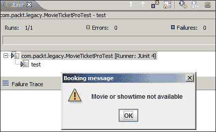

如果我们将测试包含在我们的自动化测试套件中，自动化测试套件将永远运行并等待用户干预。我们可以定位问题；提取每个`BookingErrorController`方法调用中的受保护方法。这个更改将允许我们创建一个`MovieTicketPro`模拟对象并将受保护的方法替换为空实现。然而，问题是怎样验证错误条件？我们可以提取一个错误信息接口，创建一个通用的错误信息方法，并重构`BookingErrorController`类以实现该接口。以下是对接口的详细说明：

```java
package com.packt.legacy;

public interface ErrorMessageDisplayer {
  void showMessage(String title, String message, int messageType);
  boolean showConfirmMessage(String title, String message);
}
```

修改`BookingErrorController`类以实现接口。以下是对实现的描述：

```java
public class BookingErrorController implements ErrorMessageDisplayer{

  @Override
  public void showMessage(String title, String message, int messageType) {
    JOptionPane.showMessageDialog(null, message, title, messageType);
  }

  @Override
  public boolean showConfirmMessage(String title, String message) {
    int output = JOptionPane.showConfirmDialog(null,message, title, JOptionPane.YES_NO_OPTION);
    return output == JOptionPane.YES_OPTION;
  }
  //other methods are ignored for brevity
}
```

修改`MovieTicketPro`类，并在行内修改所有对`BookingErrorController`的调用。以下是一个这样的修改示例：

```java
} catch (Exception e) {
      JOptionPane.showMessageDialog(null, "Could not book ticket", "Booking Error", JOptionPane.ERROR_MESSAGE);
      break;
    }
  }
}else {
  JOptionPane.showMessageDialog(null, "Movie or showtime not available","Booking message", JOptionPane.WARNING_MESSAGE);
}
```

注意，`BookingErrorController.createAndShowDatabaseSaveError()`和`BookingErrorController.createAndShowMovieOrShowTimeNotAvailableError()`方法被原始方法内容替换。

现在从`BookingErrorController`类中删除静态错误信息方法。你不应该得到任何编译错误。

在`MovieTicketPro`中创建一个 getter 方法以返回`ErrorMessageDisplayer`的实现。以下是对方法的描述：

```java
  protected ErrorMessageDisplayer getErrorMessageDisplayer() {
    return new BookingErrorController();
  }
```

将`JOptionPane.showMessageDialog`代码的所有内容替换为`getErrorMessageDisplayer()`。以下是修改后的代码：

```java
public class MovieTicketPro {
  public void book(Movie movie, ShowTime time, int noOfTickets) {
    MovieDao dao = new MovieDao();
    MovieHall hall = dao.findMovie(movie, time);
    if (hall != null) {
      List<String> seats = dao.getAvilableSeats(movie, time);
      if (seats.size() < noOfTickets) {
        getErrorMessageDisplayer().showMessage("Booking message",          "Ticket is not available", JOptionPane.WARNING_MESSAGE);
       return;
      }
      int booked = 0;
      String bookedSeats = "";
      for (String aSeat : seats) {
        try {
          dao.book(hall, time, aSeat);
          bookedSeats += " " + aSeat;
          booked++;
          if (booked == noOfTickets) {
            getErrorMessageDisplayer().showMessage("Booking Info",             "Following tickets" + bookedSeats + " Booked",              JOptionPane.ERROR_MESSAGE);
            break;
          }
        } catch (BookingException e) {
          if (e.getType().equals(ErrorType.SeatAlreadyBooked)) {
            getErrorMessageDisplayer().showMessage(              "Booking message", "Ticket is not available",              JOptionPane.WARNING_MESSAGE);
            boolean yes = getErrorMessageDisplayer().showConfirmMessage("Booking message","Adjacent seats not available.Can I book any other seat?");

            if (yes) {
              getErrorMessageDisplayer().showMessage("Booking information","Going to auto allocate seats.", JOptionPane.INFORMATION_MESSAGE);
              break;
            }

          }
      } catch (Exception e) {
        getErrorMessageDisplayer().showMessage("Booking Error","Could not book ticket", JOptionPane.ERROR_MESSAGE);
        break;
      }
    }
  } else {
    getErrorMessageDisplayer().showMessage("Booking message","Movie or showtime not available",JOptionPane.WARNING_MESSAGE);
    }
  }

  protected ErrorMessageDisplayer getErrorMessageDisplayer() {
    return new BookingErrorController();
  }
}
```

```java
getErrorMessageDisplayer() method to return a ErrorMessageDisplayer mock. We can verify the error messages indirectly from the mock object arguments:
```

```java
@RunWith(MockitoJUnitRunner.class)
public class MovieTicketProTest {
  @Mock   ErrorMessageDisplayer messageDisplayer;

  MovieTicketPro movieTicketPro = new MovieTicketPro() {
    protected ErrorMessageDisplayer getErrorMessageDisplayer() {
 return messageDisplayer;
 }
  };
  @Test   public void when_invalid_movie_shows_error_message(){
    movieTicketPro.book(null, null, 1);
    ArgumentCaptor<String> stringArgCaptor = ArgumentCaptor.forClass(String.class);
    ArgumentCaptor<Integer> intArgCaptor = ArgumentCaptor.forClass(Integer.class);

    verify(messageDisplayer).showMessage(stringArgCaptor.capture(), stringArgCaptor.capture(), intArgCaptor.capture());
 assertEquals("Movie or showtime not available", stringArgCaptor.getAllValues().get(1));
  }
}
```

我们需要分离数据库访问，创建一个返回`MovieDao`对象的 getter 方法，并从`book`方法中调用 getter 方法。从测试中，我们可以创建一个假对象并重写`getMovieDao()`方法以返回一个模拟数据访问对象。

以下是代码中的更改：

```java
  protected MovieDao getMovieDao() {
    return new MovieDao();
  }
  public void book(Movie movie, ShowTime time, int noOfTickets) {
    MovieDao dao = getMovieDao();
    //code ignored for brevity
  }
```

以下是修改后的测试：

```java
@RunWith(MockitoJUnitRunner.class)
public class MovieTicketProTest {
  @Mock ErrorMessageDisplayer messageDisplayer;
 @Mock MovieDao movieDao;

  MovieTicketPro movieTicketPro = new MovieTicketPro() {
    protected ErrorMessageDisplayer getErrorMessageDisplayer() {
      return messageDisplayer;
    }

    protected MovieDao getMovieDao() {
 return movieDao;
 }
  };
  }

```

此更改后，测试执行完成得非常快。以下为测试执行输出：

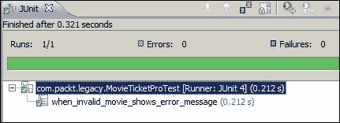

下一节将介绍为可测试性而设计。

# 为可测试性设计

我们学习了测试障碍及其重构方法。当存在测试障碍时，我们无法对代码进行单元测试；我们重构代码，将障碍移出（到另一个类或方法），并在测试期间用模拟对象替换障碍。

然而，有时由于测试不友好的设计，我们无法模拟外部依赖。本节涵盖了可测试性的设计，或者更确切地说，是代码中需要避免的问题。以下 Java 结构违反了模拟测试障碍：

+   构造函数初始化测试障碍

+   类级别变量声明和初始化

+   `private`方法

+   `final`方法

+   `static`方法

+   `final`类

+   `new`的使用

+   静态变量声明和初始化

+   静态初始化块

由于遗留代码要么耦合紧密，要么测试不利的语言结构隐藏了测试障碍，因此您无法对遗留代码进行单元测试。以下部分解释了测试不利的结构。

### 注意

为了展示测试障碍，我们将抛出一个特殊的运行时异常`TestingImpedimentException`。如果您的测试因`TestingImpedimentException`而失败，那么这意味着您无法自动化测试，因为您的代码具有对测试不利的特性。

## 识别构造函数问题

要构建测试，我们需要在测试框架中实例化类，但遗留代码的问题在于很难打破依赖关系并在测试框架中实例化类。一个这样的例子是在构造函数中，类实例化了多个对象，从属性文件中读取，甚至创建数据库连接。可能有多个类调用者，因此您不能更改构造函数以传递依赖关系；否则，将导致一系列编译错误。

我们将查看一个示例遗留代码，并尝试为该类编写测试。

假设我们有一个 `TestingUnfavorableConstructor` 类，它有两个外部依赖 `DatabaseDependency` 和 `FileReadDependency`。这两个依赖都是缓慢的，并且是测试障碍。`TestingUnfavorableConstructor` 在构造函数中创建依赖。理想情况下，这些依赖代表从 `TestingUnfavorableConstructor` 构造函数的数据库访问和文件读取。以下是 `TestingUnfavorableConstructor` 类：

```java
public class TestingUnfavorableConstructor {
  private DatabaseDependency dependency1;
  private FileReadDependency dependency2;

  public TestingUnfavorableConstructor() {
    this.dependency1 = new DatabaseDependency();
    this.dependency2 = new FileReadDependency();
  }

  public Object testMe(Object arg) {
    return arg;
  }

}
```

如果我们想要对类的 `testMe()` 行为进行单元测试，那么我们需要创建一个 `TestingUnfavorableConstructor` 类的实例。然而，当我们尝试在单元测试中创建实例时，类无法从自动化测试套件中实例化，并显示错误。以下是输出：

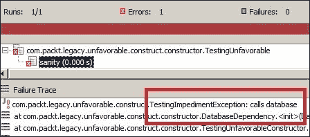

要克服这个问题，你应该通过构造函数注入依赖，而不是在构造函数中创建它们。

我们不能修改默认构造函数，因为类被许多其他客户端调用。我们不能破坏客户端。其他两种选项如下：

+   保持默认构造函数不变。创建另一个构造函数并通过这个新构造函数注入依赖；从测试中，我们可以调用这个新构造函数。

+   创建一个受保护的方法，将依赖实例化移动到那个方法，创建两个设置器方法，并通过设置器注入初始化依赖。在测试中，创建主类的模拟对象并覆盖受保护的方法使其不执行任何操作，并通过设置器方法传递依赖。

第一种方法相对简单。我们将应用第二种方法。

以下是被修改的代码：

```java
public class TestingUnfavorableConstructor {
  private DatabaseDependency dependency1;
  private FileReadDependency dependency2;

  public TestingUnfavorableConstructor() {
    createDependencies();
  }

  protected void createDependencies() {
    this.dependency1 = new DatabaseDependency();
    this.dependency2 = new FileReadDependency();
  }

  public void setDependency1(DatabaseDependency dependency1) {
    this.dependency1 = dependency1;
  }

  public void setDependency2(FileReadDependency dependency2) {
    this.dependency2 = dependency2;
  }

  public Object testMe(Object arg) {
    return arg;
  }
}
```

以下单元测试覆盖了 `TestingUnfavorableConstructor` 并提供了 `createDependencies()` 方法的空实现，创建了模拟依赖，并通过设置器方法设置模拟依赖：

```java
@RunWith(MockitoJUnitRunner.class)
public class TestingUnfavorableConstructorTest {
  @Mock DatabaseDependency dep1;
  @Mock FileReadDependency dep2;
  TestingUnfavorableConstructor unfavorableConstructor;
  @Before  public void setUp() {
    unfavorableConstructor= new TestingUnfavorableConstructor() {
 protected void createDependencies() {
 }
 };

    unfavorableConstructor.setDependency1(dep1);
    unfavorableConstructor.setDependency2(dep2);
  }

  @Test   public void sanity() throws Exception {
  }
}
```

### 提示

不要在构造函数中实例化依赖；依赖可能表现出测试障碍，使类不可测试。而不是在构造函数中实例化依赖，你可以将真实实现（真实依赖）传递给构造函数或被测试代码的设置器方法。

## 认识到初始化问题

在同一时间进行类级别变量声明和对象实例化会引发问题。你将没有机会模拟变量。以下示例解释了这个问题：

`VariableInitialization` 类有一个数据库依赖，并且依赖在其声明的地方实例化，如下所示：

```java
Public class VariableInitialization {
  DatabaseDependency dependency1 = new DatabaseDependency();
  public void testMe(Object obj) {

  }
}
```

当你在测试中实例化 `VariableInitialization` 类时，测试会失败。以下是输出：

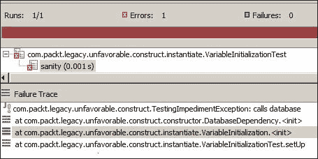

以下是测试类：

```java
public class VariableInitializationTest {
  VariableInitialization initialization;

  @Before public void setUp() throws Exception {
    initialization = new VariableInitialization();
  }
  @Test   public void sanity() throws Exception {
  }
}
```

要克服类级别变量初始化，你可以尝试以下选项：

+   添加一个默认构造函数并将依赖实例化移动到默认构造函数中。创建另一个构造函数并通过这个新构造函数注入依赖；从测试的角度来看，我们可以称这个新构造函数为“新构造函数”。

+   添加一个默认构造函数，并将依赖实例化移动到受保护的方法中，并从默认构造函数中调用该方法。创建一个设置方法并通过设置注入初始化依赖。在测试中，创建主类的一个假对象并覆盖受保护的方法使其不执行任何操作，并通过设置方法传递依赖项。

    ### 小贴士

    不要在类级别实例化变量。

## 与私有方法一起工作

`private` 方法对于隐藏内部状态和封装很有用，但它们也可能隐藏测试障碍。以下示例解释了细节：

`PrivateMethod` 类有一个名为 `showError()` 的 `private` 方法。此 `private` 方法隐藏了一个测试障碍。当我们使用 `null` 对象对 `validate()` 方法进行单元测试时，`validate()` 方法会调用 `showError` 消息，如下所示：

```java
public class PrivateMethod {
  public Object validate(Object arg) {
    if(arg == null) {
      showError("Null input");
    }
    return arg;
  }

  private void showError(String msg) {
    GraphicalInterface.showMessage(msg);
  }
}
```

以下是测试输出：

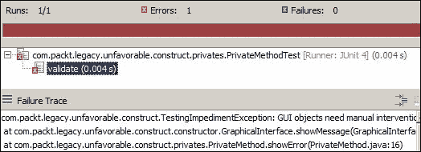

您可以将测试障碍提取到受保护的方法中，或者您可以分离关注点。创建一个新的类，将测试障碍移动到该类中，并将新类作为依赖项注入。

### 小贴士

不要在私有方法中隐藏测试障碍。

以下代码重构了测试障碍并使类可进行单元测试：

```java
public class PrivateMethodRefactored {
  public Object validate(Object arg) {
    if(arg == null) {
      showError("Null input");
    }

    return arg;
  }

  protected void showError(String msg) {
    GraphicalInterface.showMessage(msg);
  }
}
```

`showError` 方法的访问修饰符更改为 `protected`。

以下测试代码通过匿名实现扩展了类，并使用空实现覆盖了受保护的方法。测试代码在 `PrivateMethodRefactored` 类的新匿名实现上调用 `validate()` 方法。反过来，多态行为将调用空实现。因此，测试将通过调用测试障碍的覆盖空实现来绕过测试障碍，但实际的生产代码将始终调用受保护的方法：

```java
public class PrivateMethodRefactoredTest {

  PrivateMethodRefactored privateMethod;

  @Before
  public void setUp() {
    privateMethod = new PrivateMethodRefactored() {
      protected void showError(String msg) {

      }
    };
  }

  @Test
  public void validate() throws Exception {
    privateMethod.validate(null);
  }
}
```

### 小贴士

这种通过覆盖测试障碍的版本来绕过测试障碍的方法被称为模拟或假对象。如果待测试的代码包含许多测试障碍，那么在匿名类中不可能覆盖所有这些障碍。相反，我们可以创建一个内部类，并扩展待测试的代码并覆盖所有不友好的方法。

## 与最终方法一起工作

当一个方法是最终方法时，您不能覆盖它。如果最终方法隐藏了任何测试障碍，您就不能对类进行单元测试。以下示例解释了这个问题：

`FinalDependency` 类有一个名为 `doSomething` 的最终方法。此方法隐藏了一个对测试不友好的特性。以下是该类的定义：

```java
public class FinalDependency {

  public final void doSomething() {
    throw new TestingImpedimentException("Final methods cannot be overriden");
  }
}
```

`FinalMethodDependency` 类依赖于 `FinalDependency`，在 `testMe` 方法中，它按照以下方式调用 `doSomething` 方法：

```java
public class FinalMethodDependency {

  private final FinalDependency dependency;

  public FinalMethodDependency(FinalDependency dependency) {
    this.dependency = dependency;
  }  
  public void testMe() {
    dependency.doSomething();
  }
}
```

在测试中，我们将模拟依赖项并按照以下方式对代码进行单元测试：

```java
@RunWith(MockitoJUnitRunner.class)
public class FinalMethodDependencyTest {
  @Mock
  FinalDependency finalDependency;
  FinalMethodDependency methodDependency;

  @Before
  public void setUp() {
    methodDependency = new FinalMethodDependency(finalDependency);
  }

  @Test
  public void testSomething() throws Exception {
    methodDependency.testMe();
  }
}
```

当我们运行测试时，测试仍然访问测试障碍，因为模拟对象无法模拟最终方法。当我们尝试模拟方法时，我们会得到错误。以下测试模拟了最终方法调用：

```java
  @Test
  public void testSomething() throws Exception {
    doNothing().when(finalDependency).doSomething();
    methodDependency.testMe();
  }
```

当我们运行测试时，Mockito 框架抛出了以下错误信息：

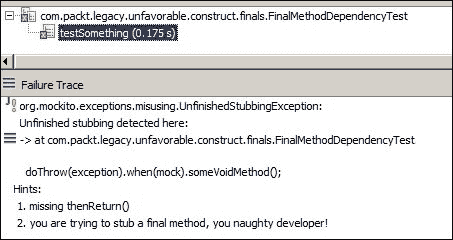

### 提示

不要在最终方法中隐藏测试障碍。你不能重写或模拟最终方法。

解决这个问题的唯一方法是将最终方法的内 容提取到一个 `protected` 方法中；从最终方法中调用 `protected` 方法，并在测试中重写 `protected` 方法。否则，如果你根本无法接触该类，可以使用 PowerMock 或 PowerMockito 框架；例如，当你只有 JAR 文件时。

## 探索静态方法问题

`static` 方法对实用类很有用，但过度使用 `static` 可能会隐藏测试障碍，并在单元测试中造成问题。以下示例说明了这个问题：

`SingletonDependency` 类是 **Gang of Four** (**GoF**) 单例设计模式的实现。它有一个 `private` 构造函数和一个静态 `getInstance()` 方法来创建该类的一个唯一实例。静态 `callMe()` 方法隐藏了一个测试障碍。请注意，GoF 单例模式没有将方法定义为 `static`，但在这个例子中，我们将 `callMe()` 方法定义为 `static` 以显示 `static` 方法的缺点。以下是对单例的实现：

```java
public class SingletonDependency {
  private static SingletonDependency singletonDependency;

  private SingletonDependency() {
  }

  public synchronized static SingletonDependency getInstance() {
    if (singletonDependency == null) {
      singletonDependency = new SingletonDependency();
    }

    return singletonDependency;
  }

  Public static void callMe() {
    throw new TestingImpedimentException("we dont need singleton");
  }
}
```

`VictimOfAPatternLover` 类依赖于 `SingletonDependency`。以下是该类的详细信息：

```java
public class VictimOfAPatternLover {
  private final SingletonDependency dependency;

  public VictimOfAPatternLover(SingletonDependency dependency) {
    this.dependency = dependency;
  }

  public void testMe() {
    dependency.callMe();
  }
}
```

Mockito 无法模拟静态方法。当我们尝试模拟静态 `callMe()` 方法时，它仍然调用原始方法，并因测试障碍而失败。你不能模拟 `static` 方法。

### 提示

不要在静态方法中隐藏测试障碍。你不能模拟静态方法。

解决这个问题的唯一方法是在类中创建一个 `protected` 方法并包装 `static` 调用。从代码中调用包装方法，从测试中重写 `protected` 方法。

在依赖类中添加一个 `static` 包装方法，并从其中调用 `static` 方法，如下面的代码所示：

```java
  public static void callMe() {
    throw new TestingImpedimentException("Common we dont need singleton");
  }

  protected void wrapper() {
    callMe();
  }
```

在代码中，按照以下方式调用 `wrapper` 方法：

```java
  public void testMe() {
    dependency.wrapper();
  }
```

按照以下方式在测试中模拟 `wrapper` 方法：

```java
@Test
  public void testMe() throws Exception {
    Mockito.doNothing().when(dependency).wrapper();
    aPatternLover.testMe();
  }
```

## 与最终类一起工作

你不能重写 `final` 类，因此你可以在 `final` 类中隐藏不利的测试特性。以下示例解释了这个问题：

最终类隐藏了一个测试障碍如下：

```java
public final class FinalDepencyClass {

  public void poison() {
    throw new TestingImpedimentException("Finals cannot be mocked");
  }
}
```

测试中的代码依赖于最终类如下：

```java
public class FinalClassDependency {
  private final FinalDepencyClass finalDepencyClass;

  public FinalClassDependency(FinalDepencyClass     finalDepencyClass) {
    this.finalDepencyClass = finalDepencyClass;
  }

  public void testMe() {
    finalDepencyClass.poison();
  }
}
```

在测试中，我们将尝试按照以下方式模拟 `poison` 方法：

```java
@RunWith(MockitoJUnitRunner.class)
public class FinalClassDependencyTest {
  @Mock
  FinalDepencyClass finalDependency;

  FinalClassDependency test;

  @Before
  public void setUp() {
    test = new FinalClassDependency(finalDependency);
  }
  @Test
  public void testMe() throws Exception {
    Mockito.doNothing().when(finalDependency).poison();
    test.testMe();
  }
}
```

测试失败是因为出现了 **MockitoException**，因为 Mockito 无法模拟一个最终的类。以下是 JUnit 的输出：

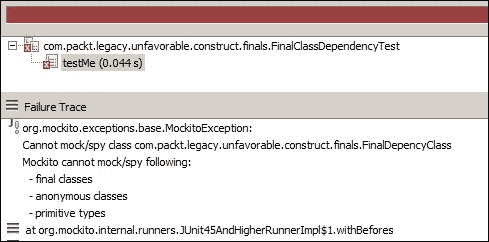

### 小贴士

不要在最终的类中隐藏测试障碍。你不能模拟一个最终的类。

最终类对于框架或架构设计很重要，这样就没有人可以黑客行为，但它可能会为单元测试造成严重问题。在你选择将类设置为最终之前，请考虑这一点。

## 学习新属性

Java 使用 `new` 操作符实例化类，但 `new` 操作符可能会为单元测试带来问题。

以下是一个解释这个问题的例子。`PoisonIvy` 的构造函数有一个测试障碍，比如从数据库表获取数据或从文件系统中读取；我们用 `TestingImpedimentException` 来表示测试障碍：

```java
public class PoisonIvy {

  public PoisonIvy() {
    throw new TestingImpedimentException(
      "Do not instantiate concrete class, use interfaces");
  }

  public void poison() {

  }
}
```

以下调用 `PoisonIvy` 构造函数的代码：

```java
public class NewExpressionDependency {

  public void testMe() {
    PoisonIvy ivy = new PoisonIvy();
    ivy.poison();
  }
}
```

当我们单元测试 `testMe()` 代码时，它失败了。`testMe()` 方法直接创建了一个依赖项的实例并调用了 `poison()` 方法。你不能覆盖这个 `new` 表达式。如果我们想对 `testMe()` 方法进行单元测试，首先我们需要将 `new` 操作符移出 `testMe()`，因为我们不能实例化 `PoisonIvy` 类。`PoisonIvy` 的构造函数会抛出异常。因此，除非我们将对象创建移出 `testMe`，否则我们无法对 `testMe` 的行为进行单元测试。而不是在 `testMe()` 内部创建 `PoisonIvy` 的新实例，我们可以将 `PoisonIvy` 的实例作为方法参数传递，或者创建一个类级别的依赖并将 `PoisonIvy` 作为构造函数或设置器依赖参数传递。

### 小贴士

面向接口编程，而不是面向实现。而不是将子类型的实例化硬编码到代码中，在运行时分配具体的实现对象。

“面向接口编程，而不是面向实现”是什么意思？

这意味着编写面向超类型而不是子类型的程序。你可以在运行时交换实现。在集合框架中，我们有 `List` 接口及其许多实现。在你的类中，始终定义一个 `List` 类型的变量，而不是 `ArrayList`；在运行时，你可以分配任何你想要的实现。

在这个例子中，你可以将 `PoisonIvy` 作为构造函数或设置器依赖项传递，在运行时（测试期间），你可以传递一个模拟或伪造的实现来抑制测试障碍。

## 探索静态变量和块

静态初始化和 `static` 块在类加载期间执行。你不能覆盖它们。如果你在一个 `static` 块中初始化一个测试障碍，那么你将无法对这个类进行单元测试。以下是一个解释这个问题的例子：

`StaticBlockOwner` 类有一个名为 `StaticBlockDependency` 的静态变量，并在一个 `static` 块中初始化这个变量。以下是这个类的代码：

```java
public class StaticBlockOwner {
  private static StaticBlockDependency blockDependency;
  static {
    blockDependency = new StaticBlockDependency();
    blockDependency.loadTime = new Date();
  }
  public void testMe() {
  }
}
```

当我们对类进行单元测试时，它失败了。以下是一个单元测试：

```java
public class StaticBlockOwnerTest {
  StaticBlockOwner owner;
  @Before public void setUp()  {
    owner = new StaticBlockOwner();
  }
  @Test   public void clean() throws Exception {
    owner.testMe();
  }
}
```

测试失败，出现`java.lang.ExceptionInInitializationError`异常，因为它尝试在`static`块中实例化依赖项，而依赖项抛出了异常。

### 小贴士

不要在静态块中实例化依赖项。你不能覆盖测试障碍。

Michael Feathers 所著的《*与遗留代码有效工作*》，由 Pearson Education 出版，解释了遗留代码以及你如何有效地重构遗留代码。你可以在[`www.amazon.com/Working-Effectively-Legacy-Michael-Feathers/dp/0131177052`](http://www.amazon.com/Working-Effectively-Legacy-Michael-Feathers/dp/0131177052)上阅读电子书。

# 与绿色代码一起工作

本节说明了编写一个失败的测试、编写足够的代码使其工作，然后重构它的三步节奏。这是隐含的绿色代码开发，而不是与现有遗留代码一起工作。

TDD 是一种进化式开发方法。它提供了测试优先的开发，生产代码仅编写以满足测试，代码被重构以提高代码质量。在 TDD 中，单元测试驱动设计。你编写代码以满足失败的测试，因此它限制了你要编写的代码仅限于所需的内容。测试提供了快速自动化的回归，用于重构和新增强。

Kent Beck 是极限编程和 TDD 的创始人。他撰写了许多书籍和论文。访问[`en.wikipedia.org/wiki/Kent_Beck`](http://en.wikipedia.org/wiki/Kent_Beck)获取详细信息。

以下图表表示了 TDD 的生命周期：

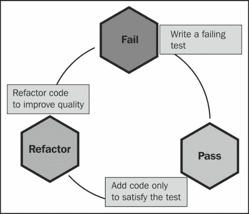

首先，我们编写一个失败的测试，然后添加代码以满足失败的测试，然后重构代码并再次从另一个测试开始。

以下部分提供了一个 TDD 的示例。我们将构建一个进行选举调查并预测结果的程序。该程序将编译调查结果并显示意见调查。

结果应展示区域（地理上）的民意调查意见和总体意见，例如，如果有两个区域，东部和西部，则结果将以以下格式展示：

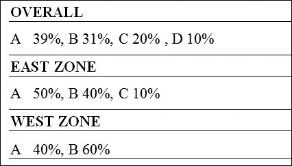

让我们看看以下步骤：

1.  创建一个名为`SurveyResultCompilerTest`的测试类，并添加一个`when_one_opinion_then_result_forecasts_the_opinion()`测试来编译总体调查结果。

    ### 注意

    我们将遵循这种约定来命名测试方法，例如，`when_some_condition_then_this_happens`。我们将使用下划线符号作为分隔符。

1.  在这个新的测试方法中，输入`SurveyResultCompiler()`。编译器会抱怨`SurveyResultCompiler`类不存在。将鼠标悬停在`SurveyResultCompiler`上；Eclipse 会为你提供一个快速修复建议。选择**创建类 'SurveyResultCompiler'**，并在`src`源文件夹下的`com.packt.tdd.survey`包中创建该类，如图所示：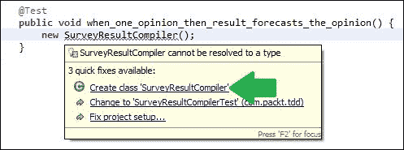

1.  `SurveyResultCompiler` 已经准备好了。我们需要传递一个意见给 `SurveyResultCompiler` 以便它可以编译一个结果。修改测试以调用 `willVoteFor` 并传递一个意见。编译器会抱怨该方法不存在。通过快速修复选项将方法添加到 `SurveyResultCompiler` 中。以下是测试方法：

    ```java
      @Test
      public void when_one_opinion_then_result_forecasts_the_opinion() {
        new SurveyResultCompiler().willVoteFor("Party A");
      } 
    ```

1.  调查后我们需要一个编译好的结果。结果应该给出政党名称和获胜百分比。我们可以考虑使用 `Map` 数据类型。再次修改测试以获取结果。以下是修改后的测试：

    ```java
      @Test
      public void when_one_opinion_then_result_forecasts_the_opinion() {
        SurveyResultCompiler surveyResultCompiler = new     
            SurveyResultCompiler();
        surveyResultCompiler.willVoteFor("Party A");
        Map<String, BigDecimal> result 
          =surveyResultCompiler.forecastResult();
      }
    ```

1.  将 `forecastResult` 方法添加到 `SurveyResultCompiler` 类中。以下是 `SurveyResultCompiler` 类：

    ```java
    public class SurveyResultCompiler {
      public void willVoteFor(String opinion) {
      }
      public Map<String, BigDecimal> forecastResult() {
        return null;
      }
    }
    ```

1.  验证当只有一个人参与调查时，调查结果应该返回该人投票的政党 100%的获胜机会。以下断言验证了我们的假设：

    ```java
    @Test
    public void when_one_opinion_then_result_forecasts_the_opinion() {
      SurveyResultCompiler surveyResultCompiler = new SurveyResultCompiler();
      String opinion = "Party A";
      surveyResultCompiler.willVoteFor(opinion);

      Map<String, BigDecimal> result =surveyResultCompiler.forecastResult();

     assertEquals(new BigDecimal("100"), 
     result.get(opinion));
    }
    ```

1.  当我们运行测试时，它因为 `NullPointerException` 而失败。我们需要修改代码如下以返回一个结果：

    ```java
      public Map<String, BigDecimal> forecastResult() {
        Map<String, BigDecimal> result = new HashMap<String, BigDecimal>();
     return result;
      }
    ```

1.  重新运行测试。它因为 `AssertionError` 而失败。以下是输出：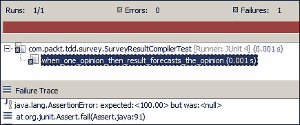

1.  我们需要修改代码以返回 `Party A` 100%。以下是修改后的代码：

    ```java
      public Map<String, BigDecimal> forecastResult() {
        Map<String, BigDecimal> result = new HashMap<String, BigDecimal>();
        result.put("Party A", new BigDecimal("100"));
        return result;
      }
    ```

1.  重新运行测试。它将显示一个绿色条形图。以下是输出：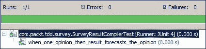

1.  现在我们需要添加另一个测试来验证当两个人参与投票，并且他们为两个不同的政党投票时，结果应该显示每个政党有 50%的机会。添加一个 `when_different_opinions_then_forecasts_50_percent_chance_for_each_party` 测试，并添加以下行来验证假设：

    ```java
      @Test   public void when_different_opinions_then_forecasts_50_percent_chance_for_each_party() {
        SurveyResultCompiler surveyResultCompiler = new SurveyResultCompiler();
        String opinionA = "Party A";
        surveyResultCompiler.willVoteFor(opinionA);
        String opinionB = "Party B";
        surveyResultCompiler.willVoteFor(opinionB);
        Map<String, BigDecimal> result = surveyResultCompiler.forecastResult();
        assertEquals(new BigDecimal("50"), result.get(opinionA));
     assertEquals(new BigDecimal("50"), 
     result.get(opinionB));
      }
    ```

1.  当我们运行测试时，它失败了。它期望得到 50%，但得到了 100%，如下截图所示：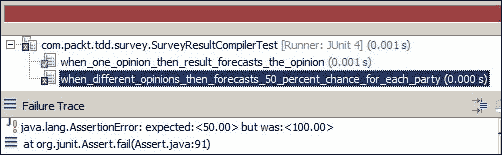

1.  我们需要修改代码以返回 `Party A` 50% 和 `Party B` 50%。以下是修改后的代码：

    ```java
      public Map<String, BigDecimal> forecastResult() {
        Map<String, BigDecimal> result = new HashMap<String, BigDecimal>();
        result.put("Party A", new BigDecimal("50"));
     result.put("Party B", new BigDecimal("50"));
        return result;
      }
    ```

1.  重新运行测试。第二个测试通过，但第一个测试失败，如下截图所示：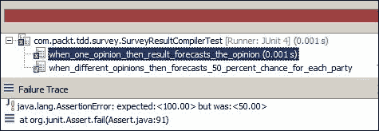

1.  我们破坏了第一个测试。现在我们需要撤销更改，但第二个测试将失败。我们需要一个算法来计算百分比。首先，我们需要存储意见。向 `SurveyResultCompiler` 类中添加一个 `List` 并存储每个意见。以下是代码：

    ```java
    public class SurveyResultCompiler {
      List<String> opinions = new ArrayList<String>();

      public void willVoteFor(String opinion) {
        opinions.add(opinion);
      }
      //the result method is ignored for brevity
    }
    ```

1.  现在我们需要修改 `forecastResult` 方法来计算百分比。首先，遍历意见以获取每个政党的投票计数，例如 10 个选民为 `Party A` 投票，20 个选民为 `Party B` 投票。然后，我们可以计算百分比作为 *投票计数 * 100 / 总投票数*。以下是代码：

    ```java
    public Map<String, BigDecimal> forecastResult() {

      Map<String, BigDecimal> result = new HashMap<String, BigDecimal>();
      Map<String, Integer> countMap = new HashMap<String, Integer>();
      for(String party:opinions) {
        Integer count = countMap.get(party);
        if(count == null) {
          count = 1;
        }else {
          count++;
        }
        countMap.put(party, count);
      }

      for(String party:countMap.keySet()) {
        Integer voteCount = countMap.get(party);
        int totalVotes = opinions.size();
        BigDecimal percentage = new BigDecimal((voteCount*100)/totalVotes);
        result.put(party, percentage);
      }

       return result;
    }
    ```

1.  重新运行测试。你将得到一个绿色条形图，如下截图所示：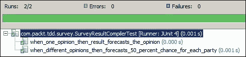

1.  现在添加一个针对三个参与者的测试。以下是这个测试：

    ```java
      @Test
      public void when_three_different_opinions_then_forecasts_33_percent_chance_for_each_party() {
        SurveyResultCompiler surveyResultCompiler = new SurveyResultCompiler();
        String opinionA = "Party A";
        surveyResultCompiler.willVoteFor(opinionA);
        String opinionB = "Party B";
        surveyResultCompiler.willVoteFor(opinionB);
        String opinionC = "Party C";
        surveyResultCompiler.willVoteFor(opinionC);
        Map<String, BigDecimal> result =surveyResultCompiler.forecastResult();
        assertEquals(new BigDecimal("33"), result.get(opinionA));
        assertEquals(new BigDecimal("33"), result.get(opinionB));
        assertEquals(new BigDecimal("33"), result.get(opinionC));
      }
    ```

1.  看一下测试类，你会在每个测试方法中找到重复的代码；清理它们。将`SurveyResultCompiler`对象的实例化移到`setUp`方法中，而不是在每个测试方法中实例化类。内联的是`opinion`变量，例如`opinionA`。以下是被重构的测试类：

    ```java
    public class SurveyResultCompilerTest {

      SurveyResultCompiler surveyResultCompiler;

      @Before
      public void setUp() {
        surveyResultCompiler = new SurveyResultCompiler();
      }

      @Test public void when_one_opinion_then_result_forecasts_the_opinion() {

        surveyResultCompiler.willVoteFor("Party A");
        Map<String, BigDecimal> result =surveyResultCompiler.forecastResult();
        assertEquals(new BigDecimal("100"), result.get("Party A"));
      }

      @Test public void when_two_different_opinions_then_forecasts_50_percent_chance_for_each_party() {

        surveyResultCompiler.willVoteFor("Party A");
        surveyResultCompiler.willVoteFor("Party B");

        Map<String, BigDecimal> result =surveyResultCompiler.forecastResult();

        assertEquals(new BigDecimal("50"), result.get("Party A"));
        assertEquals(new BigDecimal("50"), result.get("Party B"));
      }

      @Test public void when_three_different_opinions_then_forecasts_33_percent_chance_for_each_party() {

        surveyResultCompiler.willVoteFor("Party A");
        surveyResultCompiler.willVoteFor("Party B");
        surveyResultCompiler.willVoteFor("Party C");

        Map<String, BigDecimal> result =surveyResultCompiler.forecastResult();

        assertEquals(new BigDecimal("33"), result.get("Party A"));
        assertEquals(new BigDecimal("33"), result.get("Party B"));
        assertEquals(new BigDecimal("33"), result.get("Party C"));
      }
    }
    ```

1.  测试类现在看起来很干净。重新运行测试以确保没有出错。以下是测试输出：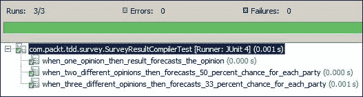

1.  回顾`SurveyResultCompiler`类。它与`List`和两个`Map`属性一起工作。我们真的需要保留`List`属性吗？我们可以在`Map`中直接存储意见而不是从`List`中计算投票，并保持意见计数最新。以下是被重构的代码：

    ```java
    public class SurveyResultCompiler {
      private Map<String, Integer> opinions = new HashMap<String, Integer>();
      private long participationCount = 0;
      public void willVoteFor(String opinion) {
        Integer sameOpinionCount = opinions.get(opinion);
        if (sameOpinionCount == null) {
          sameOpinionCount = 1;
        } else {
          sameOpinionCount++;
        }
        opinions.put(opinion, sameOpinionCount);
        participationCount++;
      }

      public Map<String, BigDecimal> forecastResult() {
        Map<String, BigDecimal> result = new HashMap<String, BigDecimal>();

        for (String opinion : opinions.keySet()) {
          Integer sameOpinionCount = opinions.get(opinion);
          BigDecimal opinionPercentage = new BigDecimal((sameOpinionCount * 100) / participationCount);
          result.put(opinion, opinionPercentage);
        }
        return result;
      }
    }
    ```

1.  重新运行测试以确保没有出错。如果有任何错误，则立即撤销更改。测试应该运行良好，所以我们一切顺利。

1.  一个特性已经完成。现在我们需要开发一个新特性——区域计算。现有的测试用例将保护我们的代码。如果你破坏了任何现有测试，立即回顾你的更改。

我们刚刚完成的是 TDD。它有以下好处：

+   TDD 为我们提供了干净、可测试和可维护的代码。

+   我们记录并更新代码，但忘记更新文档；这造成了混淆。你可以记录代码并保持其更新，或者以任何人都可理解的方式编写代码和单元测试。在 TDD 中，测试是为了提供足够的代码文档。因此，测试是我们的文档，但我们需要清理测试以保持其可读性和可维护性。

+   我们可以编写许多带有边界值条件的测试，如 null、零、负数等，并验证我们的代码。通过传递这些边界值，你试图破坏你自己的代码。无需打包整个应用程序并交付给**质量保证**（**QA**）或客户以发现问题。

+   你还避免了过度设计你编写的类。只需编写使所有测试变绿所需的内容。

+   逐步构建代码的另一个好处是 API 更容易使用，因为代码是在编写和使用的同时编写的。

# 摘要

本章解释了遗留代码和新开发的单元测试策略。它涵盖了遗留代码问题，重构了遗留代码，说明了可测试性设计，描述了 TDD 概念和 TDD 生命周期，演示了 TDD 示例和重构。

现在读者应该能够为遗留代码编写单元测试，重构遗留代码以改进现有代码的设计，并开始编写简单、干净、可维护的代码，遵循 TDD，并重构代码以提高其质量。

下一章将介绍单元测试的最佳实践。
