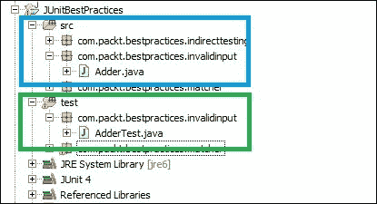
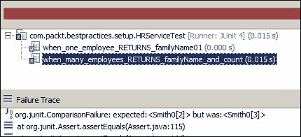
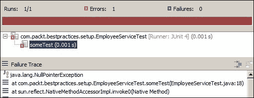
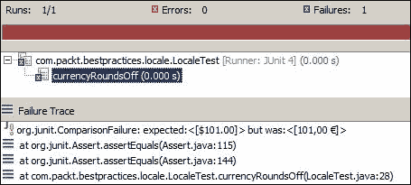
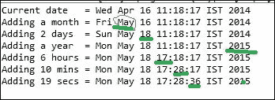
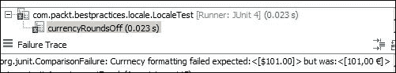
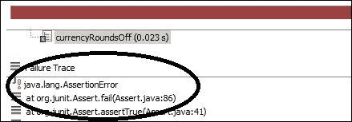
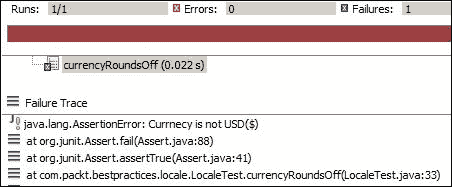

# 第十章。最佳实践

> “继续以同样的方式做事并期望事情变得更好是一种疯狂。”
> 
> ——匿名

就像编写干净的代码一样，编写干净、可读和可维护的 JUnit 测试用例是一门艺术。一个编写良好的单元测试可以防止维护噩梦，并作为系统文档；然而，如果不小心使用，它可能会产生无意义的样板测试用例。只要你不反复犯错误，错误就是学习过程的一部分。JUnit 不是火箭科学，所以我们可以练习、遵循指南并从他人那里学习，使其完美。

本章涵盖了 JUnit 指南和最佳实践。以下类别将深入探讨：

+   编写有意义的测试

+   测试自动化

+   测试配置

+   断言约定

+   异常处理

+   测试异味和重构测试异味

# 编写有意义的测试

单元测试的普遍理解是测试软件中最小可能的组成部分，具体来说是一个方法。实际上，我们并不测试方法；而是测试一个逻辑单元或系统的行为。

逻辑单元可以扩展到单个方法、整个类或多个类的协作。例如，一个标准的计算器程序可以有一个加法方法来添加两个数字。我们可以通过调用`add`方法来验证加法行为，或者我们可以设计计算器程序以拥有一个简单的计算 API，该 API 可以接受两个数字和一个操作（加、减、除等），并根据操作数类型（整数、双精度浮点数等），计算器可能会将计算委托给协作类，例如双精度计算器或长计算器。我们仍然可以单元测试加法行为，但现在涉及到多个类。我们可以称这个新的测试为集成测试。

单元测试验证关于系统行为的假设。除此之外，如果一个测试测试整个系统，它就不能是单元测试——我们称这些测试为**联盟**测试，因为它们设置了整个生态系统，包括设置必要的组件。

以下部分详细阐述了编写有意义的测试。

## 提高可读性

马丁·福勒说：“任何傻瓜都能写出计算机能理解的代码。优秀的程序员编写的是人类能理解的代码。”编写晦涩的代码可能对老手来说很时髦，但这不是标准的 Java 实践。我们应该编写可读性和可维护的代码，以便任何人都能理解代码的目的，并在将来增强或维护代码。

JUnit 测试是编写来测试逻辑单元的。一个测试方法的名字应该表达测试的意图，以便读者可以理解正在测试的内容，例如条件、期望或动作。

假设你正在编写一个基于角色的系统的测试，并且系统拒绝未授权的访问。你可以使用以下模式，但如果你选择遵循一种模式，最好是坚持使用它：

+   `testDenialOfUnauthorizedAccess()`

+   `when_unauthorized_user_then_denies_the_access()`

+   `should_deny_access_for_unauthorized_users()`

我更喜欢下划线 (_) 模式，因为它更易读。

对于边界值条件，你可以遵循以下模式：

+   `testRegisteringNullUser()`

+   `should_not_register_a_null_user()`

+   `should_throw_exception_when_a_null_user_is_registered()`

+   `when_null_user_then_registrar_throws_exception()`

同样，测试类应该描绘测试的意图。通常，我们遵循两种约定，`Test<class name>` 或 `<class name>Test`。假设你正在测试 `UserRegistration` 行为。你可以使用 `UserRegistrationTest` 或 `TestUserRegistration`。一些测试覆盖率工具无法识别没有 `Test` 后缀的类。因此，`UserRegistrationTest` 是一个安全的选择。

## 破坏所有可能出错的东西

极限编程的一个概念是*测试所有可能出错的东西*。这意味着尝试所有不同的输入组合，以确保我们没有错过任何可能导致类生成错误的组合。然而，在实践中这是不可能做到的。我们可以测试边界值条件。我们甚至可以覆盖所有分支和行，但我们不能测试所有可能的输入组合。假设一个方法添加两个整数。我们可以传递 `NULL`、`0`、`Integer.MAX_VALUE`、负数等，但我们实际上不能测试所有可能的整数值。

## 忽略简单的测试用例

编写简单的 JUnit 测试（例如对于 getter 和 setter）通常是时间和金钱的浪费。我们没有写无限测试的奢侈，因为这会消耗我们的开发时间、应用程序构建时间和降低测试的可维护性。如果我们开始为 getter/setter 编写测试，我们可能会错过更多有用的测试用例。通常，单元测试是自动化的，并在构建过程中运行。构建需要尽早完成以提供反馈，但如果我们继续添加简单的测试，这个过程将会延迟。单元测试是系统文档，因此它们描绘了系统行为；然而，如果我们继续为简单的事情添加测试，那么就违背了其目的。编写能够提供信息的测试。

## 验证无效参数

测试每个方法的无效参数。你的代码需要识别和处理无效数据。使用错误数据和边界值条件通过的测试提供了全面的 API 文档。

假设你正在编写一个针对 `add` 方法的测试。它接受两个整数并返回一个整数。以下是一个 `Adder` 类：

```java
public class Adder {
  public Integer add(Integer first, Integer second) {
    if (first == null || second == null) {
      throw new IllegalArgumentException("Invalid inputs first=[" + first+ "], second=[" + second + "]");
    }

    return first + second;
  }
}
```

可以测试的边界值包括 null、零、负数和溢出条件，如下所示：

```java
public class AdderTest {
  Adder adder = new Adder();

 @Test(expected=IllegalArgumentException.class)
 public void should_throw_exception_when_encounters_a_NULL_input(){
 adder.add(null, 1);
 }

 @Test(expected=IllegalArgumentException.class)
 public void should_throw_exception_when_second_input_is_NULL(){
 adder.add(2, null);
 }

  @Test
  public void should_return_zero_when_both_inputs_are_zero(){
    int actual =adder.add(0, 0);
    assertEquals(0, actual);
  }

  @Test
  public void should_return_first_input_when_second_input_is_zero()  {
    int actual =adder.add(1, 0);
    assertEquals(1, actual);
  }

  @Test
  public void should_return_second_input_when_first_input_is_zero()  {
    int actual =adder.add(0, 2);
    assertEquals(2, actual);
  }

  @Test
  public void should_return_zero_when_summation_is_zero(){
    int actual =adder.add(5, -5);
    assertEquals(0, actual);
  }

  @Test public void should_return_a_negative_when_both_inputs_are_negative() {
    int actual =adder.add(-8, -5);
    assertTrue(actual < 0);
  }

  @Test
  public void should_overflow_when_summation_exceeds_integer_limit() {
    int actual =adder.add(Integer.MAX_VALUE, 1);
    assertTrue(actual< 0);
  }
}
```

你的类可能有一个接受用户输入并将输入格式化委托给依赖类或方法的公共 API。你应该只在公共 API 中验证用户输入，而不是在所有方法或依赖类中。

假设类`A`有一个`doSomething(String input)`方法。`A`调用`B`来格式化输入。如果客户端只能调用类`A`，那么你不需要担心在类`B`中验证空输入。然而，如果`A`和`B`都公开，那么`B`肯定应该检查`NULL`值。在所有地方检查`NULL`是防御性编程。

## 依赖于直接测试

假设你有一个依赖于实用工具类的门面类。测试门面类可以覆盖实用工具类。这是一个间接测试的例子。以下`Facade`类依赖于`StringService`类进行格式化；当我们用`String`值测试`Facade`类时，`StringService`类也被测试：

```java
public class Facade {
  private final StringService stringService;
  public Facade(StringService utility) {
    this.stringService= utility;
  }

  public Object doSomething(Object o) {
    if (o instanceof String) {
      return stringService.format((String) o);
    }

    if (o instanceof Integer) {
      return Integer.MIN_VALUE;
    }

    return null;
  }
}
```

尽管其方法也被`Facade`类的测试调用，我们应该直接测试`StringService`。我们应该有两个测试类：`FacadeTest`和`StringServiceTest`。

依赖于间接测试不是一个好主意，因为如果我们更改`Facade`类的实现，那么依赖的类可能会被揭露。假设我们更改`Facade`类的实现，使其不再依赖于`StringService`。`StringServiceTest`中的测试将不再调用`StringService`的方法，因此我们将失去代码覆盖率。

## 避免调试

当我们发现一个错误时，通常的做法是开始调试应用程序——停止这样做。相反，添加更多测试来破坏代码；这将丰富你的测试套件并改进系统文档。同样，不要添加捕获块来打印堆栈跟踪。相反，使用`ExpectedException`规则（在*处理异常*部分中解释）断言异常消息。有时，完全避免调试是不可能的。所以无论如何，在开始调试之前，创建一个（集成）测试来重现问题，然后进行调试。这将缩小问题范围，为最低可能的单元创建单元测试，并保留测试供将来参考。

## 避免使用泛型匹配器

我们倾向于使用通配符匹配器来模拟模拟对象的方法；同样，使用泛型匹配器验证方法调用。这是一个坏习惯；当可能时，你应该追求精确的参数匹配。以下示例演示了通配符参数匹配。

`StringDecorator`类使用感叹号装饰输入：

```java
public class StringDecorator {
  public String decorate(String object) {
    return object+"!";
  }
}
```

`PrinterService`接口连接到局域网打印机，并按如下方式打印输入文本：

```java
public interface PrinterService {
  void print(String text);
}
```

`Facade`类接受一个输入，装饰该输入，并将其发送到`PrinterService`进行打印。为了测试这种行为，我们需要使用以下代码使用模拟对象模拟`PrinterService`：

```java
public class Facade {
  private final Decorator decorator;
  private final PrinterService printerService;

  public Facade(Decorator decorator, PrinterService printerService) {
    this.decorator = decorator;
    this.printerService = printerService;
  }

  public void process(String object) {
    printerService.print(decorator.decorate(object));  
   }

}
```

通常，`PrintService`使用`anyString()`泛型匹配器进行模拟，并使用`verify(mockService).print(anyString());`进行`PrintService`调用的验证，如下所示：

```java
@RunWith(MockitoJUnitRunner.class)
public class FacadeTest {

  @Mock PrinterService mockService;
  Facade facade;

  @Before
  public void setUp() throws Exception {
    facade = new Facade(new StringDecorator(), mockService);
  }

  @Test
  public void test() {
    String input = "hello";
    doNothing().when(mockService).print(anyString());
    facade.process(input);
    verify(mockService).print(anyString());
  }

}
```

我们可以使用 `eq("hello!")` 而不是 `anyString()`，因为我们知道 `StringDecorator` 方法会在 `String` 输入后添加感叹号；如果 `StringDecorator` 方法没有添加感叹号，测试将失败。因此，`StringDecorator` 的副作用可以立即识别。

## 避免使用 @ignore

不要使用 `@ignore` 或 `@exclude` 注解跳过单元测试。正如我们所知，死代码删除是一种重构技术，死代码永远不会被使用。然而，它们会制造混乱。同样，当我们使用 `@ignore` 注解忽略测试时，测试会被跳过，但代码仍然保留在文件中作为死代码，造成混乱。跳过的单元测试没有任何好处。与其跳过单元测试，不如从源代码控制中删除它们。如果你需要测试，你可以从源代码控制的历史记录中获取它。有时人们创建测试以轻松理解某种 API，但他们不希望当测试套件运行时执行测试，或者可能无法在所有平台上运行某些测试。对于 Maven（和 Gradle），你可以有不同的配置文件和不同的测试套件。对于实用程序测试，创建一个特定的模块总是有帮助的。

## 避免调试信息

在早期，我们使用打印（`System.out` 或 `System.err`）消息到控制台进行调试或单元测试代码。单元测试是系统文档，打印语句不适合那里。如果你需要打印某些内容，只需编写一个测试并断言期望的值。此外，你可以添加一个日志工具，如 Log4J，并记录调试信息。如果在生产中出现问题时，只需打开这些日志并查看那里发生了什么，以便能够通过测试更好地重现问题。因此，测试和日志应该相互补充。

# 自动化 JUnit 测试

第二章，*自动化 JUnit 测试*，讨论了测试自动化、持续集成以及使用 Gradle、Maven 和 Ant 进行测试自动化的重要性。本节重申了测试自动化的好处。

以下是一些测试自动化的好处：

+   假设不断得到验证。我们重构代码（在不影响系统输出结构的情况下改变代码的内部结构）以提高代码质量，如可维护性、可读性或可扩展性。如果自动化的单元测试正在运行并提供反馈，我们可以有信心地重构代码。

+   副作用会被立即检测到。这对于脆弱、紧密耦合的系统很有用，当一个模块发生变化时，可能会破坏另一个模块。

+   自动化测试节省时间，不需要立即进行回归测试。假设您正在向现有的计算器程序添加科学计算行为并修改代码。每次更改后，您都执行回归测试以验证系统的完整性。回归测试很繁琐且耗时，但如果您有一个自动化的单元测试套件，那么您可以在功能完成之前推迟回归测试。这是因为自动化套件会在每个阶段通知您是否破坏了现有功能。

总是将您的 JUnit 与构建脚本集成并配置持续集成。

# 配置测试

本节处理测试配置。单元测试不是在测试系统。在 TDD 中，单元测试是为了获得以下好处而编写的：

+   它们驱动着您的设计。您编写一个测试，添加代码以修复测试，有信心地重构代码，并应用设计。这导致了一个简单、干净、易于维护、松散耦合且紧密的设计。您编写代码以满足失败的测试，因此它限制了您编写的代码仅限于所需的内容。

+   测试提供了快速、自动化的重构和代码增强。

您应该配置您的测试以遵循以下原则：

+   单元测试应该执行得非常快，以便它们可以提供快速反馈。您会从需要 10 分钟才能取款的 ATM 机中取款吗？

+   测试应该是可靠的。如果生产代码有误，测试应该失败。在您破坏了生产逻辑但测试通过，或者您没有修改生产代码但测试仍然失败的情况下，您的测试将被视为不可靠。

以下部分涵盖了测试配置。

## 运行内存测试

不要编写执行 HTTP 请求、查找 JNDI 资源、访问数据库、调用基于 SOAP 的 Web 服务或从文件系统中读取的单元测试。这些操作很慢且不可靠，因此不应被视为单元测试；相反，它们是集成测试。您可以使用 Mockito 模拟这些外部依赖。第四章，*渐进式 Mockito*，解释了如何模拟外部依赖。

## 避免使用`Thread.sleep`

`Thread.sleep`在生产代码中用于暂停当前执行一段时间，以便当前执行可以与系统同步，这样当前线程就可以等待另一个线程使用的资源。为什么在单元测试中需要`Thread.sleep`？单元测试的目的是要快速执行。

`Thread.sleep`可以用来等待长时间运行的过程（这通常用于测试并发），但如果在慢速机器上这个过程需要时间呢？尽管代码没有错误，测试仍然会失败，这违反了测试可靠性原则。避免在单元测试中使用`Thread.sleep`；相反，使用模拟对象模拟长时间运行的过程。

## 将单元测试与生产代码隔离开

不要将单元测试交付给客户；他们不会执行这些测试。测试代码应该与生产代码分离。将它们保存在各自的源目录树中，并使用相同的包命名结构。这将确保在构建过程中它们是分开的。

以下 Eclipse 截图显示了单独的源文件夹结构。源文件位于`src`文件夹下，测试文件位于`test`源文件夹下。请注意，`Adder.java`和`AdderTest.java`文件被放置在名为`com.packt.bestpractices.invalidinput`的同一包中：



## 避免使用静态变量

静态变量持有状态。当您在测试中使用静态变量时，这表示您想要保存某个状态。因此，您正在创建测试之间的依赖关系。如果执行顺序改变，即使代码没有出错，测试也会失败，这违反了测试可靠性原则。不要在单元测试中使用静态变量来存储全局状态。

不要将待测试的类初始化为静态，并使用`setUp`方法（带有`@Before`注解）来初始化对象。这将保护您免受意外修改问题的影响。以下示例演示了意外修改的副作用。

`Employee`类存储员工姓名：

```java
public class Employee {
  private String lastName;
  private String name;

  public Employee(String lastName , String name) {
    this.lastName = lastName;
    this.name = name;
  }

  public String getLastName() {
    return lastName;
  }

  public String getName() {
    return name;
  }

}
```

`HRService`类有一个`generateUniqueIdFor(Employee emp)`方法。它根据姓氏返回一个唯一的员工 ID。具有姓氏 Smith 的两个员工将分别具有 ID`smith01`和`smith02`。考虑以下代码：

```java
public class HRService {

  private Hashtable<String, Integer> employeeCountMap = new Hashtable<String, Integer>();

  public String generateUniqueIdFor(Employee emp) {
    Integer count = employeeCountMap.get(emp.getLastName());
    if (count == null) {
      count = 1;
    } else {
      count++;
    }
    employeeCountMap.put(emp.getLastName(), count);
    return emp.getLastName()+(count < 9 ? "0"+count:""+count);
  }
}
```

单元测试类将服务初始化为静态。服务存储了第一个测试的输入，并导致第二个测试失败，如下所示：

```java
public class HRServiceTest {
  String familyName = "Smith";
  static HRService service = new HRService();

  @Test
  public void when_one_employee_RETURNS_familyName01() throws Exception {
    Employee johnSmith = new Employee(familyName, "John");
    String id = service.generateUniqueIdFor(johnSmith);
    assertEquals(familyName + "01", id);
  }

  //This test will fail, to fix this problem remove the static modifier
  @Test
  public void when_many_employees_RETURNS_familyName_and_count() {
    Employee johnSmith = new Employee(familyName, "John");
    Employee bobSmith = new Employee(familyName, "Bob");

    String id = service.generateUniqueIdFor(johnSmith);
    id = service.generateUniqueIdFor(bobSmith);
    assertEquals(familyName + "02", id);
  }

}
```

以下 JUnit 输出显示了错误详情：



## 假设测试执行顺序

JUnit 被设计为以随机顺序执行测试。它依赖于 Java 反射 API 来执行测试。因此，一个测试的执行不应依赖于另一个测试。假设您正在测试`EmployeeService`的数据库集成，其中`createEmployee()`测试创建了一个新的`Employee`，`updateEmployee()`方法更新了在`createEmployee()`中创建的新员工，而`deleteEmployee()`删除了员工。因此，我们依赖于测试执行顺序；如果`deleteEmployee()`或`updateEmployee()`在`createEmployee()`之前执行，测试将失败，因为员工尚未创建。

为了解决这个问题，只需将测试合并为一个名为`verifyEmployeePersistence()`的单个测试即可。

因此，不要相信测试执行顺序；如果您必须更改一个测试用例，那么您需要在多个不必要的测试用例中进行更改。

## 从文件加载数据

JUnit `理论`框架提供了一个用于为测试用例提供测试数据的`抽象`类`ParameterSupplier`。`ParameterSupplier`的实现可以从文件系统读取，例如 CSV 或 Excel 文件。然而，不建议您从文件系统读取。这是因为读取文件是一个 I/O（输入/输出）过程，它是不可预测且缓慢的。我们不希望我们的测试创建延迟。此外，从硬编码的文件路径读取可能会在不同机器上失败。而不是从文件读取，创建一个测试数据提供者类并返回硬编码的数据。

## 调用`super.setUp()`和`super.tearDown()`

有时单元测试的数据设置单调且丑陋。通常，我们创建一个基本测试类，设置数据，并创建子类来使用这些数据。从子类中，始终调用超类的设置和拆卸方法。以下示例显示了未调用超类的方法的错误。

我们有`EmployeeService`和`EmployeeServiceImpl`来执行一些业务逻辑：

```java
public interface EmployeeService {
  public void doSomething(Employee emp);
}
```

`BaseEmployeeTest`类是一个`抽象`类，并为子类设置数据，如下所示：

```java
public abstract class BaseEmployeeTest {

  protected HashMap<String, Employee> employee ;

  @Before
  public void setUp() {
    employee = new HashMap<String, Employee>();
    employee.put("1", new Employee("English", "Will"));
    employee.put("2", new Employee("Cushing", "Robert"));
  }
}
```

`EmployeeServiceTest`类扩展了`BaseEmployeeTest`类并使用`employee`映射，如下所示：

```java
public class EmployeeServiceTest extends BaseEmployeeTest {

  EmployeeService service;
  @Before
  public void setUp() {
    service = new EmployeeServiceImpl();
  }
  @Test
  public void someTest() throws Exception {
    for(Employee emp:employee.values()) {
      service.doSomething(emp);
    }
  }
}
```

测试执行失败，抛出`NullPointerException`。以下是 JUnit 输出：



为了解决这个问题，请在`setUp()`方法中调用`super.setUp()`。以下是在`EmployeeServiceTest`中修改后的`setUp()`方法：

```java
  @Before
  public void setUp() {
    super.setUp();
    service = new EmployeeServiceImpl();
  }
```

## 避免副作用

不要编写影响其他测试用例数据的测试用例，例如，您正在使用内存中的`HashMap`检查 JDBC API 调用，而另一个测试用例清除了该映射，或者您正在测试数据库集成，而另一个测试用例从数据库中删除了数据。这可能会影响其他测试用例或外部系统。当一个测试用例从数据库中删除数据时，任何使用这些数据的应用程序都可能失败。在测试的最后块中回滚更改非常重要，而不仅仅是测试结束时。

## 与区域设置一起工作

在使用`NumberFormat`、`DateFormat`、`DecimalFormat`和`TimeZones`时要注意国际化。如果在一个具有不同区域设置的机器上运行单元测试，测试可能会失败。

以下示例演示了国际化上下文。

假设您有一个格式化货币的类。当您传递 100.99 时，它将金额四舍五入到 101.00。以下格式化器类使用`NumberFormat`添加货币符号并格式化金额：

```java
class CurrencyFormatter{

  public static String format(double amount) {
    NumberFormat format =NumberFormat.getCurrencyInstance();
    return format.format(amount);
  }
}
```

以下 JUnit 测试验证了格式化：

```java
public class LocaleTest {

  @Test
  public void currencyRoundsOff() throws Exception {
    assertEquals("$101.00", CurrencyFormatter.format(100.999));
  }
}
```

如果您在不同的区域设置下运行此测试，测试将失败。我们可以通过更改区域设置并恢复到默认区域设置来模拟这种情况，如下所示：

```java
public class LocaleTest {
  private Locale defaultLocale;
  @Before
  public void setUp() {
    defaultLocale = Locale.getDefault();
    Locale.setDefault(Locale.GERMANY);
  }
  @After
  public void restore() {
    Locale.setDefault(defaultLocale);
  }
  @Test
  public void currencyRoundsOff() throws Exception {
    assertEquals("$101.00", CurrencyFormatter.format(100.999));
  }
}
```

在测试执行之前，默认的区域设置值被存储到 `defaultLocale`，默认的区域设置为 `GERMANY`，在测试执行之后，默认的区域设置被恢复。以下是在 `GERMANY` 中 JUnit 执行失败的输出。在 `GERMANY` 中，货币将被格式化为 **101,00 €**，但我们的测试期望的是 **$101.00**：



你可以将你的代码修改为始终返回美元格式，或者你可以将测试修改为在 US 区域设置下运行，通过将默认区域设置更改为 US，并在测试执行后将其恢复到默认设置。同样，在处理日期和小数格式化时也要小心。

## 使用日期

如果使用不当，日期在测试中可能会表现得异常。在使用硬编码的日期进行单元测试时要小心。你正在处理日期，并使用未来的日期来检查业务逻辑。在 2014 年 1 月 1 日，你将未来的日期设置为 2014 年 4 月 10 日。测试在 4 月 9 日之前运行正常，之后开始失败。

不要使用硬编码的日期。相反，使用 `Calendar` 获取当前日期和时间，并添加 `MONTH`、`DATE`、`YEAR`、`HOUR`、`MINUTE` 或 `SECOND` 来获取未来的日期时间。以下自解释的代码片段演示了如何创建动态的未来日期：

```java
Calendar cal = Calendar.getInstance ();
Date now = cal.getTime();

//Next month
cal.add(Calendar.MONTH,1);
Date futureMonth = cal.getTime();

//Adding two days
cal.add(Calendar.DATE,2);
Date futureDate = cal.getTime();

//Adding a year
cal.add(Calendar.YEAR,1);
Date futureYear = cal.getTime();

//Adding 6 hours
cal.add(Calendar.HOUR,6);
Date futureHour = cal.getTime();

//Adding 10 minutes
cal.add(Calendar.MINUTE,10);
Date futureMinutes = cal.getTime();

//Adding 19 minutes
cal.add(Calendar.SECOND,19);
Date futureSec = cal.getTime();
```

以下是在 2014 年 4 月 16 日运行程序时的未来日期：



# 使用断言

断言是一个用于验证程序员假设（期望）与程序实现的实际结果的谓词。例如，程序员可以期望两个正数的相加将得到一个正数。因此，程序员可以编写一个程序来相加两个数，并用实际结果断言预期的结果。

`org.junit.Assert` 包提供了用于断言所有原始类型、对象和数组的预期和实际值的静态重载方法。

本节介绍了 `Assertion` API 的正确用法。以下是一些最佳实践。

## 使用正确的断言

使用正确的断言方法。JUnit 支持许多断言选项，例如 `assertEquals`、`assertTrue`、`assertFalse`、`assertNull`、`assertNotNull`、`assertSame` 和 `assertThat`。使用最合适的一个。以下是一些示例：

+   使用 `assertTrue(yourClass.someMethod())` 而不是使用 `assertEquals(true, yourClass.someMethod())`

+   使用 `assertFalse(yourClass.someMethod())` 而不是调用 `assertTrue(!yourClass.someMethod())`

+   使用 `assertNull(yourClass.someMethod())` 而不是 `assertEquals(null, yourClass.someMethod())`

+   使用 `assertEquals(expected, yourClass.someMethod())` 而不是使用 `assertTrue(expected.equals(yourClass.someMethod()))`

+   `assertThat(age, is(30))` 方法比 `assertEquals(30, age)` 更易读。

+   同样，`assertThat(age, is(not(33)))` 比起 `assertTrue(age != 33)` 更易读。

## 维护 assertEquals 参数顺序

`assertEquals` 方法是一个非常有用的方法来验证期望。`assertEquals` 方法具有 `assertEquals(Object expected, Object actual)` 签名。

维护参数顺序：首先是期望值，然后是实际结果。以下 JUnit 碎片颠倒了顺序，首先传递实际值，然后是期望结果：

```java
@Test
public void currencyRoundsOff() throws Exception {
  assertEquals(CurrencyFormatter.format(100.999), "$101.00");
}
```

```java
 passes a meaningful error message:
```

```java
@Test
public void currencyRoundsOff() throws Exception {
  assertEquals("Currency formatting failed", $101.00", CurrencyFormatter.format(100.999));
}
```

以下是一个带有信息性消息的 `Assertion` 失败输出：



## 力求每个测试一个断言

力求每个测试方法一个断言。当你检查每个测试的一个断言并且单元测试失败时，确定出了什么问题要容易得多。当一个单元测试有多个断言，并且其中一个断言失败时，需要额外的努力来确定哪个失败了；对于每个测试一个断言，不需要额外的努力。

当单元测试执行多个断言并且抛出运行时异常时，异常之后的断言不会得到验证；JUnit 框架将单元测试标记为错误并继续下一个测试方法。

以下 JUnit 测试断言了三个条件——格式化的金额不为空，格式化的金额包含一个 $ 符号，以及精确的格式：

```java
@Test
public void currencyRoundsOff() throws Exception {
  assertNotNull(CurrencyFormatter.format(100.999));
  assertTrue(CurrencyFormatter.format(100.999).contains("$"));
  assertEquals("$101.00", CurrencyFormatter.format(100.999));
}
```

当任何断言失败时，输出不会告诉你哪里出了问题（尽管你会在源代码文件中得到行号，但这并不非常方便）。以下是 JUnit 输出：



而不是使用三个断言，你可以创建三个测试，或者你可以向断言方法传递有意义的错误信息。以下修改后的 JUnit 测试传递了错误信息：

```java
@Test
public void currencyRoundsOff() throws Exception {
  assertNotNull("Currency is NULL", CurrencyFormatter.format(100.999));
  assertTrue("Currency is not USD($)", CurrencyFormatter.format(100.999).contains("$"));
  assertEquals("Wrong formatting", "$101.00", CurrencyFormatter.format(100.999));
}
```

现在，失败的测试为你提供了关于失败额外的信息。以下是测试输出。它读取为**货币不是 USD($)**，这意味着第二个断言失败了：



# 处理异常

异常处理是 Java 编码的重要部分。Java 社区遵循一套关于异常处理的最佳实践。以下是一些单元测试的异常处理最佳实践：

+   不要编写 catch 块来通过单元测试。考虑以下示例，其中有一个 `Calculator` 程序，它有一个 `divide` 方法。它接受两个整数，进行除法并返回结果。当 `divide` 遇到除以零时，程序应该抛出异常。以下是其代码：

    ```java
    public class Calculator {

      public int divide(int op1, int op2)  {
        return op1/op2;
      }
    }
    ```

    以下是一个测试：

    ```java
    @Test
    public void divideByZero_throws_exception() throws Exception {
      try {
        calc.divide(1, 0);
        fail("Should not reach here");
      } catch (ArithmeticException e) {

      }
    }
    ```

    而不是捕获 `ArithmeticException`，我们可以应用 JUnit 4 模式如下：

    ```java
      @Test(expected = ArithmeticException.class)
      public void divideByZero_throws_exception() throws Exception {
        calc.divide(1, 0);
      }
    ```

    一个更优雅的方法是检查 `ExpectedException` 规则。以下是使用 `ExpectedException` 修改后的测试：

    ```java
    public class CalculatorTest {

      @Rule
      public ExpectedException expectedException= ExpectedException.none();

      Calculator calc = new Calculator();

      @Test
      public void divideByZero_throws_exception(){
        expectedException.expect(ArithmeticException.class);
        expectedException.expectMessage("/ by zero");
        calc.divide(1, 0);
      }
    }
    ```

    `ExpectedException` 期望一个异常和一个错误消息。如果未抛出异常或消息不匹配，则测试失败。

+   不要编写 catch 块来使测试失败；JUnit 框架负责处理运行时异常。以下是一个不必要的 catch 块的示例：

    ```java
      @Test
      public void fails_when_an_exception_is_thrown()  {
        try {
          calc.divide(1, 0);
        }catch(Exception ex) {
          fail("Should not throw an exception");
        }
      }
    ```

    相反，只需写下以下几行。如果抛出任何异常，测试将自动失败：

    ```java
      @Test
      public void fails_when_an_exception_is_thrown()  {
        calc.divide(1, 0);
      }
    ```

+   不要捕获异常并断言失败以通过测试。以下测试代码捕获`ArithmeticException`并设置一个布尔标志，最后断言该标志。如果没有抛出异常，则标志保持为 false，测试失败：

    ```java
      @Test
      public void fails_when_an_exception_is_thrown()  {
        boolean isFailed = false;
        try {
          calc.divide(1, 0);
        }catch(Exception ex) {
          isFailed = true;
        }

        assertTrue(isFailed);
      }
    ```

    使用前面示例中解释的 JUnit 4 模式。

+   不要向抛出**检查**异常的方法添加捕获块。以下示例解释了问题。`sum(int... arg)`方法在整数溢出时抛出检查异常`NumberOverflowException`：

    ```java
    public int sum(int... args) throws NumberOverflowException{
      int sum = 0;
      for(int val:args) {
        if(Integer.MAX_VALUE - sum < val) {
          throw new NumberOverflowException("Number overflow");
        }
        sum+=val;
      }

      return sum;

    }
    ```

    使用捕获块来捕获检查异常并编译测试，如下所示：

    ```java
      @Test
      public void fails_when_an_exception_is_thrown()  {
        try {
          int sum = calc.sum(1,2,3);
          assertEquals(6, sum);
        } catch (NumberOverflowException e) {

        }
      }
    ```

    不要遵循这个模式；相反，使用`throws Exception`。以下 JUnit 测试使用了`throws Exception`子句：

    ```java
      @Test
      public void fails_when_an_exception_is_thrown() throws 
    Exception {
        int sum = calc.sum(1,2,3);
        assertEquals(6, sum);
      }
    ```

+   不要从你的测试中抛出特定的`Exceptions`。相反，使用通用的`throws Exception`。

    以下示例抛出了特定的`NumberOverflowException`异常：

    ```java
    public void fails_when_an_exception_is_thrown() throws NumberOverflowException{

    }
    ```

    假设代码被更改，可能会抛出`NumberOverflowException`或`ParseException`。在这种情况下，我们必须更改测试方法以抛出这两个异常来编译测试。如果我们使用通用的`throws Exception`子句，那么这个问题就不会出现。

# 与测试异味（test smells）一起工作

代码异味是一个技术债务或症状，表明存在更深层次的问题。异味不是错误，或者它们不会使测试失败。相反，它们表明设计或代码中存在一个问题，使得僵化的代码无法增强或可能创建维护问题。本节涵盖了应该重构以进行维护和可读性的测试异味。以下主题被涵盖：

+   测试代码重复

+   测试代码中的条件

+   生成代码中的测试逻辑

+   过度设计

## 重构重复

```java
Person objects for check in, a patient johnPeterson, and his guarantor johnsDad:
```

```java
Person johnsDad = new Person();
   Address newYorkBayArea = new Address();
   newYorkBayArea.setAddressType(AddressType.Residential);
   newYorkBayArea.setCountry("US");
   newYorkBayArea.setState("NY");
   newYorkBayArea.setZip("49355");
   newYorkBayArea.setStreet("12/e xyz Avenue");
   johnsDad.addAddress(newYorkBayArea);
   johnsDad.setEmail("dontDisturb@my.org");
   johnsDad.setFirstName("Freddy");
   johnsDad.setLastName("Peterson");
   daddy.setPerson(johnsDad);

   Person johnPeterson = new Person();
   Address mavernPhilly = new Address();
   mavernPhilly.setAddressType(AddressType.Residential);
   mavernPhilly.setCountry("US");
   mavernPhilly.setState("PA");
   mavernPhilly.setZip("19355");
   mavernPhilly.setStreet("123 Frazer");
   johnPeterson.addAddress(mavernPhilly);
   johnPeterson.setEmail("johnYou12345@gmail.com");
   johnPeterson.setFirstName("John");
   johnPeterson.setLastName("Peterson");
```

创建并初始化了两个`Person`对象和两个`Address`对象。它们是逻辑上重复的语句。许多其他测试可以编写类似的重复语句。提取方法以重构重复异味。按照以下方式提取`Person`和`Address`对象的构建方法：

```java
protected Person newPerson(Address newYorkBayArea, StringlastName, String email, String firstName) {
  Person person = new Person();
  person.addAddress(newYorkBayArea);
  person.setEmail(email);
  person.setFirstName(firstName);
  person.setLastName(lastName);
  return person;
}

protected Address newAddress(String street, String country, String state, String zip, AddressType residential) {
  Address address = new Address();
  address.setAddressType(residential);
  address.setCountry(country);
  address.setState(state);
  address.setZip(zip);
  address.setStreet(street);
  return address;
}
```

从测试代码中，只需传递所需的值并按照以下方式调用构建方法：

```java
Address newYorkBayArea = newAddress("12/e xyz Avenue", "US", "NY","49355", AddressType.Residential);

Person johnsDad = newPerson(newYorkBayArea, "Peterson","dontDisturb@my.org", "Freddy");

Address mavernPhilly = newAddress("123 Frazer", "US", "PA", "19355", AddressType.Residential);

Person johnPeterson = newPerson(mavernPhilly, "Peterson", "johnYou12345@gmail.com", "John");
```

我们可以通过将公共代码移动到基测试类或辅助类来重构许多测试类中的重复代码。

## 重构测试控制逻辑

单元测试代码验证被测试代码的行为，通常不会编写条件逻辑来验证代码。然而，当测试包含基于某些条件的执行代码时，对读者来说会变得复杂。测试执行良好，但会创建维护问题。

当我们将 JMS 消息发布到目的地（如 TIBCO 企业消息服务）时，JMS 提供商内部会发布管理消息，例如消息接收、消息发送和消息确认。然而，每个消息都包含相同的 JMS 消息 ID。如果我们创建一个消息记录程序来监听 JMS 事件（包括管理事件），并将所有事件记录到数据库以供审计跟踪，那么记录器将保存许多具有相同 JMS 消息 ID 的消息。

以下是一个测试控制逻辑的示例。消息定义如下：

```java
public class Message {
  private String jmsMessageID;
  private String header;
  private Object payload;
  private int eventType;
}
```

`eventType` 变量表示管理消息类型（接收的是 1，发送的是 2，确认的是 3）。

`MessagingService` 接口定义如下：

```java
public interface MessagingService {
  String publish(Object message);
  List<Message> retrieveByMessageId(String jmsMessageId);
}
```

我们将按照以下方式验证日志功能：

```java
@RunWith(MockitoJUnitRunner.class)
public class MessagingServiceTest {
  MessagingService service = new MessagingServiceImpl();

  @Test
  public void logs_messages() throws Exception {
    String msgId = service.publish(new String("hello world"));
    for(Message msg:service.retrieveByMessageId(msgId)) {
      if(msg.getEventType() == 2) {
        assertEquals("hello world", msg.getPayload());
        break;
      }
    }
  }
}
```

`Test` 方法遍历消息，找到一条消息，然后验证负载。测试包含逻辑。我们是否需要为这个测试再进行另一个测试？这很令人困惑。

要重构我们的测试，可以将逻辑移动到被测试的代码中。API 应该有一个方法来返回特定类型的消息。这样，我们就可以直接检查消息对象，而不是循环检查。

## 从生产代码中移除测试逻辑

编写可测试的代码是一种质量。通常，我们将测试逻辑放入生产代码中进行单元测试，例如新的构造函数或新方法。为了使代码可测试，测试需要在生产代码中添加额外的逻辑，以便访问代码的内部状态进行测试配置或结果验证。生产代码中的测试逻辑是一种问题，尽管它不会破坏被测试的代码，但会增加代码的复杂性，这可能会在配置错误的情况下造成严重的维护问题或系统故障。

在以下条件下，将测试逻辑插入到生产代码中：

+   在测试期间添加条件逻辑以返回硬编码的值。被测试的代码作为动态存根，如下例所示：

    ```java
    public final class EncounterManager {
      public boolean isHack = false;

      public boolean save(Map data) {
        if(isHack) {
          return true;
        }
        Encounter enc = new EncounterServiceImpl().checkIn(buildCheckinRqst(data));
        return enc != null;
      }
    }
    ```

    `EncounterManager` 不能被覆盖，因为该类被声明为 `final`；因此，您不能创建该类的模拟或伪造对象。如果您的测试代码需要存根 `save()` 行为，那么您需要绕过在 `EncounterServiceImpl` 方法中进行的数据库调用，以将签到数据持久化到数据库中。因此，`save()` 方法有一个 `isHack` 条件逻辑。这个布尔变量是为了测试目的而添加的。从测试中，布尔变量 `isHack` 被设置为 `true`。如果意外地将此变量设置为 `true`，则生产中不会创建遭遇。

+   仅编写用于测试执行的额外代码，或者将私有变量公开。以下是一个示例：

    ```java
    public final class EncounterManager {
      private List<Encounter> retrieveEncounters() {
        if (encounters == null) {
          Patient patient = new Patient();
          patient.setPatientId(patientId);
          new EncounterServiceImpl().retreiveBy(patient);
        }
        return encounters;
      }

      public List<Encounter> encounters;
      public void setEncounters(List<Encounter> encounters) {
        this.encounters = encounters;
      }
    }
    ```

    `retrieveEncounters()` 方法是一个私有方法，用于 `encounters List` 的延迟实例化。然而，出于测试目的，`encounters List` 被公开暴露，并使用了一个公开的 setter 方法。从测试中，要么使用硬编码的 `List` 调用 setter 方法，要么直接设置 `encounters List`。如果意外地将 `encounters List` 设置在生产环境中，用户将在 UI 中看到错误的数据。

+   Mockito 不允许模拟 `equals()` 和 `hashcode()` 方法，因为除非逻辑可理解，否则不应重写它们。然而，对于测试，我们经常重写 `equals()` 和 `hashcode()` 方法并执行测试逻辑或返回硬编码的值。这是非常危险的。在生产环境中，如果我们需要将对象放入集合或需要执行相等性检查，那么系统将以奇怪的方式运行。以下代码片段重写了 `hashcode()` 和 `equals()` 方法：

    ```java
    @Override
    public int hashCode() {
      return isHack ? HACKED_NUMBER : 0;
    }

    @Override
    public boolean equals(Object obj) {
      if (obj instanceof EncounterManager) {
        return isHack && ((EncounterManager) obj).isHack;
      }
      return false;
    }
    ```

在生产代码中，`equals()` 方法返回 `false`，`hashcode()` 返回 `0`。`EncounterManager` 类不能与 Java 集合框架一起使用。

为了重构生产代码，移除 final 关键字，在测试上下文中覆盖类，并返回硬编码的值。然而，永远不要在测试中触摸 `equals()` 和 `hashcode()` 方法。

## 对过度设计的测试进行重构

测试是系统文档。它们应该告诉读者正在执行什么。通常，我们添加过多的文档，使得读者更难理解意图。有时，我们重构测试并提取干净、有意义的函数，将变量传递给提取的函数，并在测试中仅调用这些函数。现在读者无法理解测试用例的效用，所有操作都在其他地方进行。

以下测试示例展示了具有较少或没有信息的 `Test`：

```java
@Test
public void checks_in_patient() throws Exception {
  createCheckInRequestForAPatientWithAGuarantor();
  checkInaPatient();
  assertResult();
}
```

单元测试调用了三个方法：`createCheckInRequestForAPatientWithAGuarantor`、`checkInaPatient` 和 `assertResult`。从测试体中，无法理解正在测试的内容、创建了什么数据以及断言了什么。测试应该配置数据、调用实际方法并断言结果。

以下是一个具有过度详细文档的测试示例：

```java
public void checks_in_patient() throws Exception {
  CheckInRequest request = new CheckInRequest();
  request.setCheckInDate(new Date());
  request.setDisease("Vomiting");
  request.setDoctor("Dr. Mike Hussey");

  String country = "US";
  String johnsStreetAddress = "123 Frazer";
  String johnsState = "PA";
  String johnsZipCode = "19355";
  Address johnsAddressMavernPhilly = buildAddress(johnsStreetAddress, country, johnsState, johnsZipCode,  AddressType.Residential);

  String johnsEmailId = "johnYou12345@gmail.com";
  String johnsFirstName = "John";
  String familyName = "Peterson";

  Person johnPeterson = buildPerson(johnsAddressMavernPhilly, familyName,johnsEmailId, johnsFirstName);

  request.setPerson(johnPeterson);

  Guarantor daddy = new Guarantor();
  daddy.setGuarantorType(GuarantorType.Person);
  String dadsStreetAddress = "12/e xyz Avenue";
  String dadsState = "NY";
  String dadsZipCode = "49355";
  Address dadsAddressNYBayArea =buildAddress(dadsStreetAddress, country, dadsState,dadsZipCode, AddressType.Residential);
  String dadsEmail = "dontDisturb@my.org";
  String dadsFirstName = "Freddy";
  Person johnsDad = buildPerson(dadsAddressNYBayArea, familyName,  dadsEmail, dadsFirstName);
  daddy.setPerson(johnsDad);
  request.setGuarantor(daddy);
}
```

测试构建了两个 `Person` 对象和两个 `Address` 对象。提取了两个构建器方法以实现代码重用。为了更好的文档，创建了变量并设置了硬编码的值，然后将这些值传递给构建器方法。这些硬编码的变量使得理解正在发生的事情变得困难。

而不是在测试类中创建自定义构建器方法，您可以修改主数据类以遵循构建器模式，并在多个步骤中构建对象。这样，我们就不必创建如 `johnsStreetAddress` 这样的硬编码变量，我们可以直接调用所需的函数。

`Person` 类已被修改；setter 方法返回 `this` 实例，如下所示：

```java
public Person setFirstName(String firstName) {
  this.firstName = firstName;
  return this;
}

public Person setLastName(String lastName) {
  this.lastName = lastName;
  return this;
}
```

从测试中，我们可以轻松构建对象。以下测试示例只需要一个电子邮件 ID、姓名和电话号码进行测试，因此不应填充其他值。

我们可以分三步构建对象，并且不再需要硬编码的字符串来记录行为：

```java
Person mark = new Person().setEmail("mark@gmail.com").setFirstName("Mark").setPhoneNumber1("444-999-0090");
```

# 摘要

本章涵盖了 JUnit 的最佳实践并解释了其背后的原理。最佳实践包括编写有意义的测试、自动化单元测试、测试配置、使用断言、测试用例中的异常处理、识别测试异味以及重构测试异味。

现在，你将能够编写干净且易于维护的测试用例。
