# 1

# 微服务简介

本书并不盲目赞扬微服务。相反，它讲述了我们如何利用其优势，同时能够处理构建可扩展、弹性好且可管理的微服务的挑战。

作为本书的介绍，本章将涵盖以下主题：

+   我进入微服务之路

+   什么是基于微服务的架构？

+   微服务的挑战

+   应对挑战的设计模式

+   可以帮助我们处理这些挑战的软件赋能者

+   本书未涵盖的其他重要考虑因素

# 技术要求

本章不需要安装。然而，你可能对查看 C4 模型规范感兴趣，[`c4model.com`](https://c4model.com)，因为本章的插图灵感来源于 C4 模型。

本章不包含任何源代码。

# 我进入微服务之路

当我在 2014 年首次了解到微服务的概念时，我意识到我多年来一直在不知情的情况下开发微服务（好吧，有点像）。我参与了一个 2009 年开始的项目，我们基于一组分离的特性开发了一个平台。该平台被交付给多个客户，他们在本地部署了它。为了使客户能够轻松选择他们想要从平台中使用的功能，每个特性都被开发为一个**自主软件组件**；也就是说，它有自己的持久化数据，并且仅通过定义良好的 API 与其他组件进行通信。

由于我无法讨论项目中具体的功能，我已经将组件的名称进行了泛化，这些组件被标记为从**组件 A**到**组件 F**。平台的**组成**作为一组组件的图示如下：

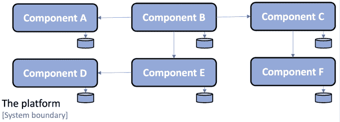

图 1.1：平台组成

从图中我们还可以看到，每个组件都有自己的持久化数据存储，并且不与其他组件共享数据库。

每个组件都是使用 Java 和 Spring 框架开发的，打包为 WAR 文件，并在 Java EE Web 容器中作为 Web 应用部署，例如 Apache Tomcat。根据客户的具体要求，平台可以部署在单个或多个服务器上。一个双节点部署可能如下所示：

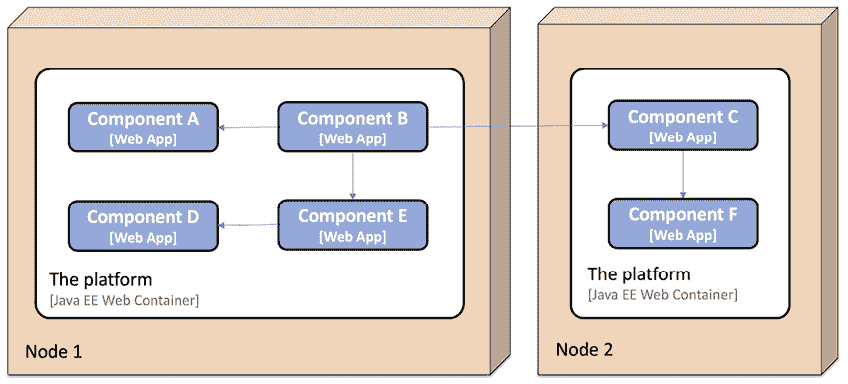

图 1.2：双节点部署场景

## 自主软件组件的好处

从这个项目中，我了解到将平台的职能分解为一系列自主软件组件提供了许多好处：

+   客户可以在自己的系统环境中部署平台的部分，通过其定义良好的 API 将其与其现有系统集成。

    以下是一个示例，其中一位客户决定从平台部署**组件 A**、**组件 B**、**组件 D**和**组件 E**，并将它们与客户系统环境中的两个现有系统**系统 A**和**系统 B**集成：

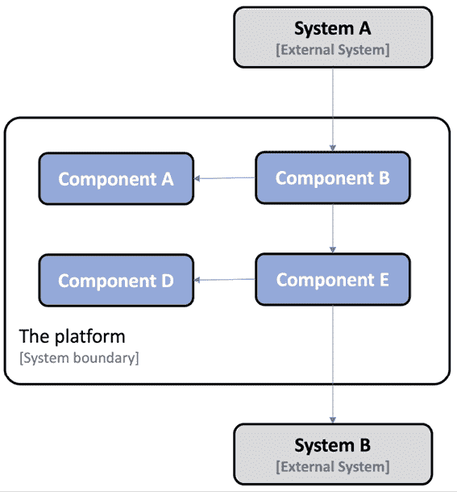

图 1.3：平台的局部部署

+   另一位客户可以选择用客户系统环境中已有的实现来替换平台功能的一部分，这可能会要求在平台 API 中采用一些现有功能。

    以下是一个示例，其中客户已将平台中的**组件 C**和**组件 F**替换为自己的实现：

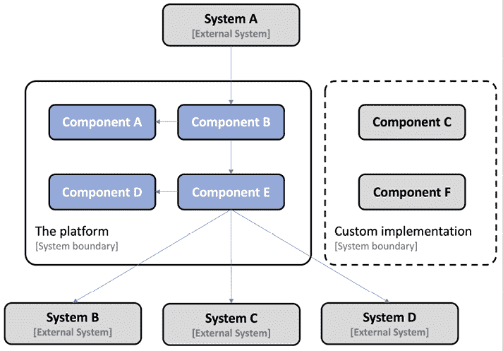

图 1.4：替换平台的部分

+   平台中的每个组件都可以单独交付和升级。得益于使用定义良好的 API，一个组件可以升级到新版本，而无需依赖于其他组件的生命周期。

    以下是一个示例，其中**组件 A**已从版本**v1.1**升级到**v1.2**。调用**组件 A**的**组件 B**不需要升级，因为它使用的是定义良好的 API；也就是说，升级后它仍然是相同的（或者至少是向后兼容的）：

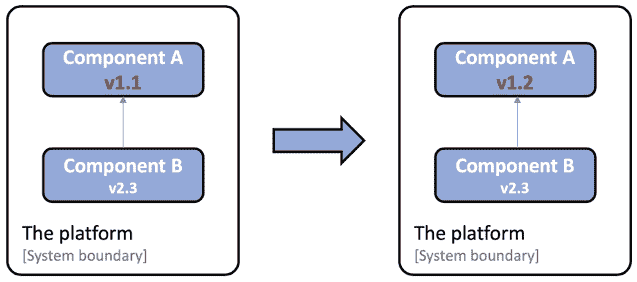

图 1.5：升级特定组件

+   由于使用了定义良好的 API，平台中的每个组件也可以独立于其他组件扩展到多个服务器。扩展可以是满足高可用性要求或处理更高请求量的需要。在这个特定项目中，这是通过在运行 Java EE Web 容器的多个服务器前手动设置负载均衡器来实现的。**组件 A**已扩展到三个实例的示例如下：

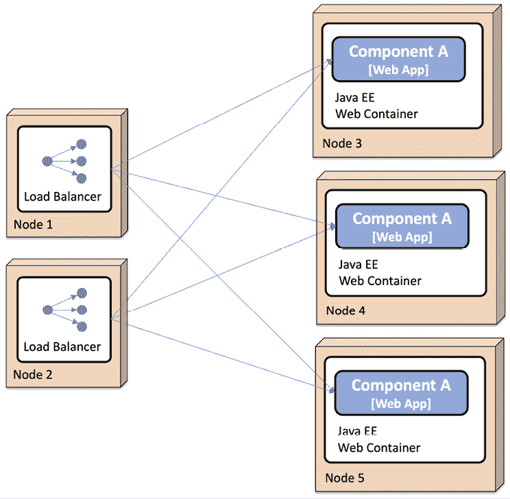

图 1.6：扩展平台

## 自主软件组件的挑战

我的团队还了解到，将平台分解引入了许多新的挑战，这些挑战在我们开发更传统的、单体式应用时并未遇到（至少没有达到同样的程度）：

+   向组件添加新实例需要手动配置负载均衡器并手动设置新节点。这项工作既耗时又容易出错。

+   平台最初容易受到它所通信的其他系统引起的错误的影响。如果一个系统未能及时响应平台发送的请求，平台很快就会耗尽关键资源，例如，操作系统线程，尤其是在面对大量并发请求时。这导致平台中的组件挂起甚至崩溃。由于平台中的大多数通信都是基于同步通信，一个组件崩溃可能导致级联故障；也就是说，崩溃组件的客户端也可能在一段时间后崩溃。这被称为**故障链**。

+   保持所有组件实例的配置一致并更新迅速成为一个问题，导致大量手动和重复性的工作。这有时会导致质量问题。

+   监控平台在延迟问题和硬件使用（例如，CPU、内存、磁盘和网络的使用）方面的状态，与监控单体应用的单一实例相比，要复杂得多。

+   从多个分布式组件收集日志文件并关联相关日志事件也是困难的，但由于组件数量固定且事先已知，因此是可行的。

随着时间的推移，我们通过内部开发的工具和针对手动处理这些挑战的详细说明，解决了前面提到的大多数挑战。操作的规模通常在可以接受的水平上，即使它们不是理想的，手动发布组件新版本和处理运行时问题也是可行的。

## 进入微服务时代

2014 年了解基于微服务的架构让我意识到，其他项目也一直在努力应对类似的挑战（部分原因不同于我之前描述的原因，例如，大型云服务提供商满足 Web 规模需求）。许多微服务先驱已经发布了他们所学到经验教训的细节。从这些经验教训中学习非常有趣。

许多先驱最初开发了单体应用，从商业角度来看，它们非常成功。但随着时间的推移，这些单体应用变得越来越难以维护和演进。它们也变得难以扩展到最大机器的能力之外（也称为**垂直扩展**）。最终，先驱们开始寻找将单体应用拆分成更小组件的方法，这些组件可以独立发布和扩展。可以通过**水平扩展**来实现小组件的扩展，即在多个较小的服务器上部署组件，并在其前面放置一个负载均衡器。如果在云中执行，扩展能力可能是无限的——这仅仅是一个关于你将多少虚拟服务器引入的问题（假设你的组件可以在大量实例上扩展，但关于这一点稍后还会详细说明）。

在 2014 年，我还了解到了一些新的开源项目，它们提供了工具和框架，简化了微服务的开发，并可用于处理基于微服务架构带来的挑战。

其中一些如下：

+   Pivotal 发布了**Spring Cloud**，它封装了**Netflix OSS**的部分功能，以提供动态服务发现、配置管理、分布式跟踪、断路器等功能。

+   我还了解到了**Docker**和容器革命，这对于缩小开发和生产之间的差距非常有帮助。能够将组件打包不仅作为可部署的运行时工件（例如，Java `war`或`jar`文件），而且作为一个完整的镜像，准备好在运行 Docker 的服务器上启动为容器，这对于开发和测试来说是一个巨大的进步。

现在，将容器视为一个隔离的过程。我们将在*第四章*，*使用 Docker 部署我们的微服务*中了解更多关于容器的内容。

+   容器引擎，例如 Docker，仅靠它本身还不足以在生产环境中使用容器。需要某种东西来确保所有容器都处于运行状态，并且能够在多台服务器上扩展容器，从而提供高可用性和增加计算资源。

+   这些类型的产品被称为**容器编排器**。在过去几年中，许多产品已经发展起来，例如 Apache Mesos、Swarm 模式下的 Docker、Amazon ECS、HashiCorp Nomad 和**Kubernetes**。Kubernetes 最初是由 Google 开发的。当 Google 在 2015 年发布 v1.0 版本时，它还将 Kubernetes 捐赠给了**CNCF** ([`www.cncf.io/`](https://www.cncf.io/))。在 2018 年，Kubernetes 成为了一种事实上的标准，既可以作为本地部署的预包装版本使用，也可以作为大多数主要云服务提供商的服务。

如[`kubernetes.io/blog/2015/04/borg-predecessor-to-kubernetes/`](https://kubernetes.io/blog/2015/04/borg-predecessor-to-kubernetes/)中所述，Kubernetes 实际上是一个基于开源的重写，名为**Borg**的内部容器编排器，在 Kubernetes 项目成立之前，Google 已经使用了十多年。

+   2018 年，我开始了解**服务网格**的概念以及服务网格如何补充容器编排器，进一步减轻微服务的责任，使其可管理和有弹性。

## 一个示例微服务景观

由于本书无法涵盖我刚才提到的所有技术方面，我将专注于自 2014 年以来我在客户项目中证明有用的部分。我将描述它们如何一起使用来创建可管理、可扩展和有弹性的协作微服务。

本书中的每一章都将解决一个特定的问题。为了展示事物是如何相互关联的，我将使用一组协作的微服务，我们将在整本书中逐步发展这些微服务。微服务景观将在*第三章*，*创建一组协作微服务*中描述；目前，只需知道它看起来是这样的：

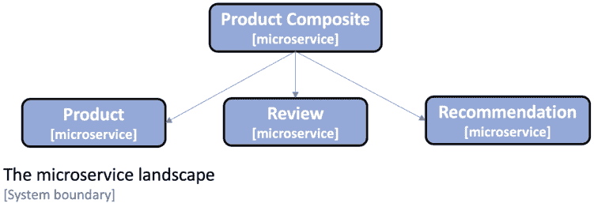

图 1.7：本书中使用的基于微服务的系统景观

注意，这是一个非常小的协作微服务系统景观。我们将在接下来的章节中添加的周围支持服务对于这些微服务来说可能看起来过于复杂。但请记住，本书中提出的解决方案旨在支持一个更大的系统景观。

现在我们已经介绍了微服务的潜在利益和挑战，让我们开始探讨如何定义微服务。

# 定义微服务

微服务架构是将单体应用程序拆分为更小的组件，这实现了两个主要目标：

+   更快的开发，实现持续部署

+   更容易扩展，手动或自动

微服务本质上是一个独立的软件组件，它可以独立升级、替换和扩展。为了能够作为一个自主组件，它必须满足以下某些标准：

+   它必须符合无共享架构；也就是说，微服务之间不共享数据库中的数据！

+   它必须仅通过定义良好的接口进行通信，无论是使用 API 和同步服务，还是最好通过异步发送消息。使用的 API 和消息格式必须是稳定的、有良好文档的，并遵循定义的版本策略。

+   它必须作为独立的运行时进程部署。每个微服务的实例都在一个独立的运行时进程中运行，例如，一个 Docker 容器。

+   微服务实例是无状态的，因此进入微服务的请求可以由其任何实例处理。

使用一组协作的微服务，我们可以部署到多个较小的服务器上，而不是被迫部署到单个大型服务器上，就像部署单体应用程序时必须做的那样。

由于已经满足了上述标准，将单个微服务扩展到更多实例（例如，使用更多虚拟服务器）比扩展大型单体应用程序要容易得多。

利用云中可用的自动扩展功能也是一种可能性，但对于大型单体应用程序来说通常不可行。与升级大型单体应用程序相比，升级或甚至替换单个微服务也更容易。

以下图表说明了这一点，其中单体应用程序已被分割成六个微服务，所有这些微服务都已部署到单独的服务器上。其中一些微服务也独立于其他微服务进行了扩展：

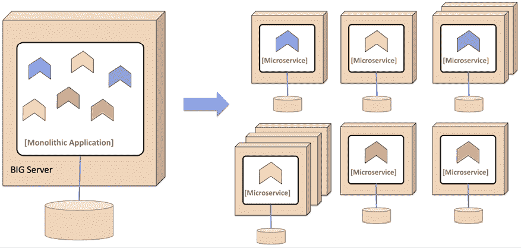

图 1.8：将单体分解为微服务

我经常从客户那里收到的一个非常频繁的问题是：

> 微服务应该有多大？

我尝试使用以下经验法则：

+   足够小，可以放入开发者的脑海中

+   足够大，不会危及性能（即延迟）和/或数据一致性（存储在不同微服务中的数据之间的 SQL 外键不再是你可以理所当然的事情）

因此，总结来说，微服务架构本质上是一种架构风格，我们将单体应用程序分解成一组协作的自主软件组件。其动机是使开发更快，并使扩展应用程序更容易。

在更好地理解如何定义微服务之后，我们可以继续详细说明与微服务系统景观相关的挑战。

# 微服务的挑战

在*自主软件组件的挑战*部分，我们已经看到了自主软件组件可能带来的某些挑战（它们同样适用于微服务），如下所示：

+   许多使用同步通信的小型组件可能会引起*连锁故障*问题，尤其是在高负载下

+   保持许多小型组件的配置更新可能具有挑战性

+   跟踪一个涉及许多组件且正在处理中的请求是很困难的，例如，在进行根本原因分析时，每个组件都本地存储日志记录

+   在组件级别上分析硬件资源的使用也可能具有挑战性

+   手动配置和管理许多小型组件可能会变得成本高昂且容易出错

将应用程序分解成一组自治组件的另一个缺点（但最初可能并不明显）是它们形成了一个**分布式系统**。众所周知，分布式系统由于其本质而非常难以处理。这一点已经为人所知多年（但在许多情况下直到被证明不同才被忽视）。我最喜欢的关于这一事实的引言来自彼得·德克斯特，他在 1994 年提出了以下观点：

> **分布式计算的 8 大谬误**：基本上，每个人在第一次构建分布式应用程序时，都会做出以下八个假设。所有这些假设在长期内都被证明是错误的，并且都导致了巨大的麻烦和痛苦的学习经历：
> 
> 1. 网络是可靠的
> 
> 2. 延迟为零
> 
> 3. 带宽是无限的
> 
> 4. 网络是安全的
> 
> 5. 拓扑结构不会改变
> 
> 6. 只有一个管理员
> 
> 7. 传输成本为零
> 
> 8. 网络是同质的
> 
> ——彼得·德克斯特，1994 年

通常，基于这些错误假设构建的微服务会导致容易受到暂时性网络故障和其他微服务实例中发生的问题的影响。当系统景观中微服务的数量增加时，问题的可能性也会增加。一个很好的经验法则是根据系统景观中始终存在某些问题的假设来设计您的微服务架构。微服务架构需要设计来处理这些问题，包括检测问题和重启失败的组件。此外，在客户端，确保不要向失败的微服务实例发送请求。当问题得到纠正时，应恢复对之前失败的微服务的请求；也就是说，微服务客户端需要具有弹性。当然，所有这些都需要完全自动化。对于大量微服务，操作员手动处理这是不可行的！

本主题的范围很广，但我们将暂时限制自己，并继续学习微服务的设计模式。

# 微服务设计模式

本主题将涵盖使用设计模式来缓解前述部分中描述的微服务挑战。在本书的后续部分，我们将看到如何使用 Spring Boot、Spring Cloud、Kubernetes 和 Istio 来实现这些设计模式。

设计模式的概念实际上相当古老；它是由克里斯托弗·亚历山大在 1977 年发明的。本质上，设计模式是关于在特定上下文中描述一个可重用解决方案来解决问题的。使用设计模式中的经过验证和测试的解决方案可以节省大量时间，并且与自行发明解决方案相比，可以提高实现的品质。

我们将要介绍的设计模式如下：

+   服务发现

+   边缘服务器

+   响应式微服务

+   中央配置

+   中央日志分析

+   分布式跟踪

+   电路断路器

+   控制回路

+   中央监控和警报

此列表并非旨在全面；相反，它是一个最小列表，列出了处理我们之前描述的挑战所需的设计模式。

我们将采用轻量级的方法来描述设计模式，并重点关注以下内容：

+   问题

+   解决方案

+   解决方案的要求

在整本书中，我们将更深入地探讨如何应用这些设计模式。这些设计模式的应用背景是一个由协作微服务组成的系统景观，其中微服务通过同步请求（例如，使用 HTTP）或发送异步消息（例如，使用消息代理）相互通信。

## 服务发现

服务发现模式存在以下问题、解决方案和解决方案要求。

### 问题

客户端如何找到微服务和它们的实例？

微服务实例在启动时通常会分配动态分配的 IP 地址，例如，在容器中运行时。这使得客户端难以向一个例如通过 HTTP 暴露 REST API 的微服务发起请求。考虑以下图表：

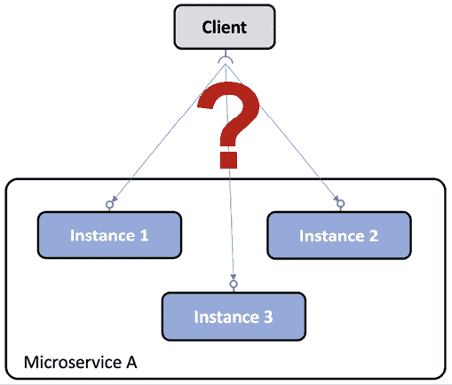

图 1.9：服务发现问题

### 解决方案

向系统景观添加一个新的组件——一个**服务发现**服务——以跟踪当前可用的微服务和其实例的 IP 地址。

### 解决方案要求

一些解决方案的要求如下：

+   自动注册/注销微服务和它们的实例，随着它们的到来和离去。

+   客户端必须能够向微服务的一个逻辑端点发起请求。请求将被路由到可用的微服务实例之一。

+   必须在可用的实例之间对微服务的请求进行负载均衡。

+   我们必须能够检测当前不健康的实例，以便请求不会路由到它们。

**实施说明**：正如我们将在第九章“使用 Netflix Eureka 添加服务发现”、第十五章“Kubernetes 简介”和第十六章“将我们的微服务部署到 Kubernetes”中看到的那样，此设计模式可以使用两种不同的策略实现：

+   **客户端路由**：客户端使用一个库与服务发现服务通信，以找出应向其发送请求的正确实例。

+   **服务器端路由**：服务发现服务的基础设施还公开了一个反向代理，所有请求都发送到该代理。反向代理代表客户端将请求转发到适当的微服务实例。

## 边缘服务器

边缘服务器模式具有以下问题、解决方案和解决方案要求。

### 问题

在微服务系统景观中，在许多情况下，希望将一些微服务暴露给系统景观之外，并将剩余的微服务隐藏对外访问。暴露的微服务必须保护免受恶意客户端的请求。

### 解决方案

向系统景观中添加一个新的组件，一个**边缘服务器**，所有进入的请求都将通过它：

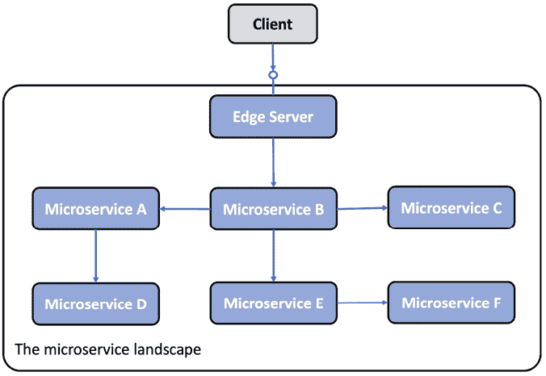

图 1.10：边缘服务器设计模式

**实施说明**：边缘服务器通常表现得像一个反向代理，可以与发现服务集成以提供动态负载均衡功能。

### 解决方案要求

一些解决方案要求如下：

+   隐藏那些不应暴露在其上下文之外的内部服务；也就是说，只将请求路由到配置为允许外部请求的微服务

+   暴露外部服务并保护它们免受恶意请求；也就是说，使用标准协议和最佳实践，如 OAuth、OIDC、JWT 令牌和 API 密钥，以确保客户端是可信的。

## 反应式微服务

反应式微服务模式存在以下问题、解决方案和解决方案要求。

### 问题

传统上，作为 Java 开发者，我们习惯于使用阻塞 I/O 实现同步通信，例如，通过 HTTP 的 RESTful JSON API。使用阻塞 I/O 意味着操作系统为请求的长度分配了一个线程。

如果并发请求数量增加，服务器可能会在操作系统中耗尽可用的线程，导致从响应时间变长到服务器崩溃的问题。使用微服务架构通常会使这个问题更加严重，通常使用一系列协作的微服务来处理请求。参与服务请求的微服务越多，可用的线程就会越快耗尽。

### 解决方案

使用非阻塞 I/O 来确保在等待另一个服务（例如数据库或另一个微服务）的处理过程中不会分配线程。

### 解决方案要求

一些解决方案要求如下：

+   在可行的情况下，使用异步编程模型，发送消息而不等待接收者处理它们。

+   如果更喜欢同步编程模型，请使用可以使用非阻塞 I/O 执行同步请求的响应式框架，在等待响应时不分配线程。这将使微服务更容易扩展以处理增加的工作负载。

+   微服务还必须设计成具有弹性和自我修复能力。弹性意味着即使在它依赖的服务中有一个失败的情况下也能产生响应；自我修复意味着一旦失败的服务再次运行，微服务必须能够重新使用它。

2013 年，在**《反应式宣言》**中确立了设计反应式系统的关键原则([`www.reactivemanifesto.org/`](https://www.reactivemanifesto.org/))。

根据宣言，反应式系统的基础是它们是消息驱动的；它们使用异步通信。这使得它们具有弹性，即可伸缩性，以及弹性，即对失败的容忍性。弹性和弹性共同使反应式系统能够始终及时响应。

## 中央配置

中央配置模式存在以下问题、解决方案和解决方案需求。

### 问题

传统上，应用程序与其配置一起部署，例如，一组环境变量和/或包含配置信息的文件。给定一个基于微服务架构的系统景观，即有大量部署的微服务实例，会出现一些查询：

+   我如何获得所有运行中的微服务实例中配置的完整视图？

+   我如何更新配置并确保所有受影响的微服务实例都正确更新？

### 解决方案

向系统架构中添加一个新的组件，即**配置服务器**，以存储所有微服务的配置，如下所示：

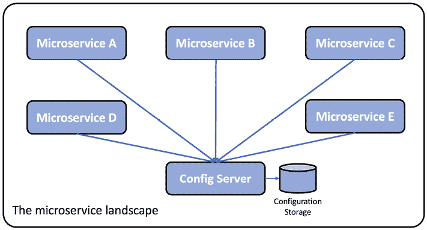

图 1.11：中央配置设计模式

### 解决方案需求

使一组微服务的配置信息能够存储在一个地方，并为不同的环境（例如，**dev**、**test**、**qa**和**prod**）设置不同的配置。

## 集中日志分析

集中日志分析存在以下问题、解决方案和解决方案需求。

### 问题

传统上，应用程序将日志事件写入存储在应用程序运行的服务器本地文件系统中的日志文件。给定一个基于微服务架构的系统景观，即在大量较小的服务器上部署了大量的微服务实例，我们可以提出以下问题：

+   当每个微服务实例将其自己的本地日志文件写入时，我如何获得系统景观中正在发生的事情的概览？

+   我如何知道是否有任何微服务实例遇到麻烦并开始向它们的日志文件中写入错误消息？

+   如果最终用户开始报告问题，我如何找到相关的日志消息；也就是说，我如何确定哪个微服务实例是问题的根本原因？以下图表说明了问题：

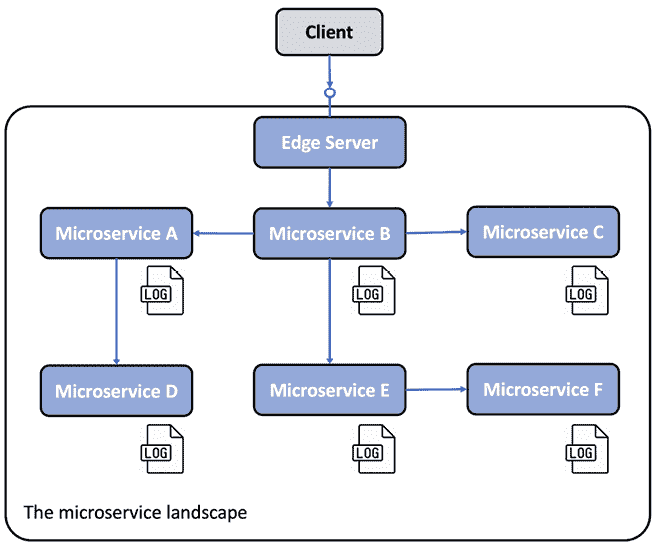

图 1.12：微服务将日志文件写入其本地文件系统

### 解决方案

添加一个新组件，它可以管理**集中式日志记录**，并能够执行以下操作：

+   检测新的微服务实例并从它们收集日志事件

+   在中央数据库中以结构化和可搜索的方式解释和存储日志事件

+   提供查询和分析日志事件的 API 和图形工具

### 解决方案要求

一些解决方案要求如下：

+   微服务将日志事件流式传输到标准系统输出，`stdout`。与将日志事件写入特定微服务的日志文件相比，这使得日志收集器更容易找到日志事件。

+   微服务使用下一节中关于*分布式跟踪*设计模式描述的相关 ID 标记日志事件。

+   定义了一个规范化的日志格式，以便日志收集器可以在将日志事件存储到中央数据库之前，将来自微服务的日志事件转换为规范化日志格式。在规范化日志格式中存储日志事件是能够查询和分析收集到的日志事件所必需的。

## 分布式跟踪

分布式跟踪存在以下问题、解决方案和解决方案要求。

### 问题

必须能够跟踪在处理系统景观外部请求时在微服务之间流动的请求和消息。

一些故障场景的例子如下：

+   如果最终用户开始提交关于特定故障的支持案例，我们如何识别导致问题的微服务，即根本原因？

+   如果某个支持案例提到了与特定实体相关的问题，例如，特定的订单号，我们如何找到与处理此特定订单相关的日志消息——例如，所有参与处理该订单的微服务的日志消息？

+   如果最终用户开始提交关于响应时间过长的问题支持案例，我们如何识别调用链中哪个微服务导致了延迟？

以下图示展示了这一点：

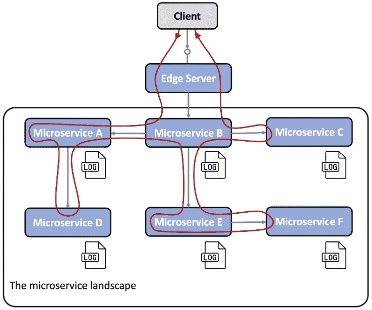

图 1.13：分布式跟踪问题

### 解决方案

为了跟踪协作微服务之间的处理过程，我们需要确保所有相关请求和消息都带有共同的**关联 ID**，并且关联 ID 是所有日志事件的一部分。基于关联 ID，我们可以使用集中式日志服务来查找所有相关的日志事件。如果其中一个日志事件还包含有关业务标识符的信息，例如，客户的 ID、产品或订单，我们可以使用关联 ID 找到该业务标识符的所有相关日志事件。

为了能够分析协作微服务调用链中的延迟，我们必须能够收集请求、响应和消息进入和退出每个微服务的时间戳。

### 解决方案要求

解决方案要求如下：

+   在一个已知位置为所有传入或新的请求和事件分配唯一的关联 ID，例如，带有标准化名称的报头

+   当微服务发出出站请求或发送消息时，它必须将关联 ID 添加到请求和消息中。

+   所有日志事件都必须包含预定义格式的关联 ID，以便集中日志服务可以从日志事件中提取关联 ID 并使其可搜索。

+   当请求、响应和消息进入和退出微服务实例时，必须创建跟踪记录。

## 断路器

断路器模式存在以下问题、解决方案和解决方案需求。

### 问题

使用同步交互的微服务系统景观可能会暴露于**连锁故障**之中。如果一个微服务停止响应，其客户端可能会遇到问题，并停止对客户端的请求做出响应。问题可能会递归地传播到整个系统景观，并使其主要部分失效。

这在同步请求使用阻塞 I/O 执行的情况下尤其常见，即阻塞底层操作系统的线程，在请求处理期间。结合大量并发请求和开始以意外缓慢的速度响应的服务，线程池可能会迅速耗尽，导致调用者挂起和/或崩溃。这种故障会迅速传播到调用者的调用者，依此类推。

### 解决方案

如果检测到调用服务的问题，添加一个**断路器**以阻止调用者发出新的出站请求。

### 解决方案需求

解决方案需求如下：

+   **打开**电路并快速失败（不等待超时），如果检测到服务存在问题。

+   用于故障纠正的探测（也称为**半开**电路）；也就是说，定期允许单个请求通过，以查看服务是否已恢复正常运行。

+   **关闭**电路，如果探测到服务再次正常运行。这种能力非常重要，因为它使系统景观对这些类型的问题具有弹性；换句话说，它能够自我修复。

下图展示了在微服务系统景观中所有同步通信都通过断路器进行的场景。所有断路器都是关闭的；它们允许流量通过，除了检测到请求服务存在问题的一个断路器（针对**微服务 E**）。因此，这个断路器是打开的，并使用快速失败逻辑；也就是说，它不调用失败的服务，并等待超时发生。相反，**微服务 E**可以立即返回响应，在响应前可选地应用一些回退逻辑：

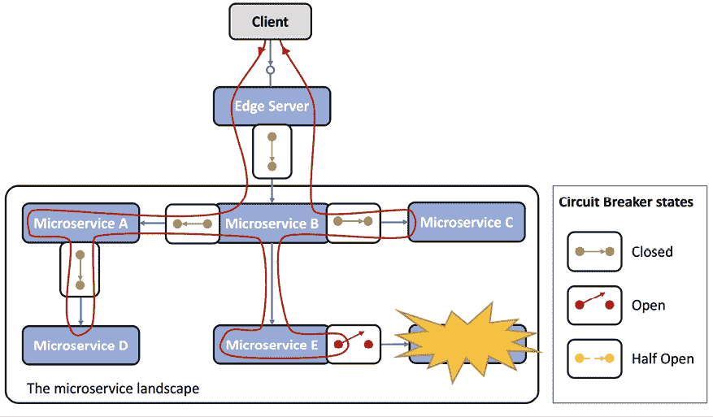

图 1.14：断路器设计模式

## 控制循环

控制循环模式有以下问题、解决方案和解决方案需求。

### 问题

在一个拥有大量微服务实例的系统景观中，这些实例分散在多个服务器上，手动检测和纠正崩溃或挂起的微服务实例等问题非常困难。

### 解决方案

在系统景观中添加一个新的组件，一个**控制循环**。这个过程如下所示：

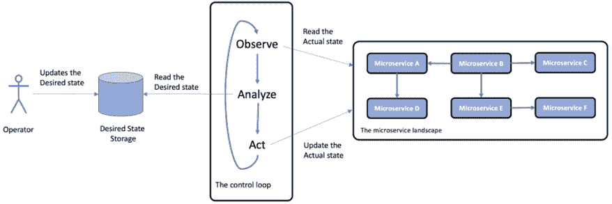

图 1.15：控制循环设计模式

### 解决方案要求

控制循环将不断观察系统景观的**实际状态**，将其与操作员指定的**期望状态**进行比较。如果两个状态不同，它将采取行动使实际状态等于期望状态。

**实施说明**：在容器世界中，通常使用*容器编排器*（如 Kubernetes）来实现此模式。我们将在第十五章“Kubernetes 简介”中了解更多关于 Kubernetes 的内容。

## 集中式监控和警报

对于这个模式，我们遇到了以下问题、解决方案和解决方案要求。

### 问题

如果观察到的响应时间或/和硬件资源的使用变得无法接受地高，很难发现问题的根本原因。例如，我们需要能够分析每个微服务的硬件资源消耗。

### 解决方案

为了遏制这种情况，我们在系统景观中添加了一个新的组件，一个**监控服务**，它能够收集每个微服务实例级别的硬件资源使用指标。

### 解决方案要求

解决方案要求如下：

+   它必须能够从系统景观中使用的所有服务器收集指标，这包括自动扩展服务器。

+   它必须能够检测在可用服务器上启动的新微服务实例，并从它们那里开始收集指标。

+   它必须能够提供 API 和图形工具，用于查询和分析收集的指标。

+   必须能够定义当指定的指标超过指定的阈值时触发的警报。

下面的截图显示了 Grafana，它可视化 Prometheus 的指标，我们将在第二十章“监控微服务”中了解这个监控工具：

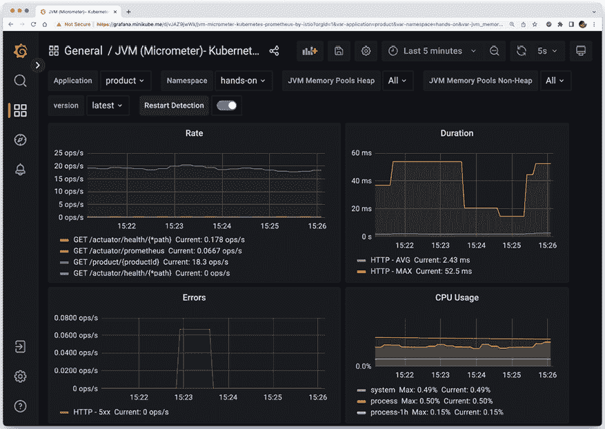

图 1.16：使用 Grafana 进行监控

这是一个详尽的列表！我相信这些设计模式帮助你更好地理解了微服务面临的挑战。接下来，我们将继续学习关于软件使能器的知识。

# 软件使能器

如我们之前提到的，我们有一些非常好的开源工具可以帮助我们满足对微服务的期望，更重要的是，处理随之而来的新挑战：

+   **Spring Boot**，一个应用程序框架

+   **Spring Cloud/Netflix OSS**，一个应用程序框架和现成服务的混合体

+   **Docker**，一个在单个服务器上运行容器的工具

+   **Kubernetes**，一个容器编排器，它管理着一群运行容器的服务器

+   **Istio**，一个服务网格实现

以下表格映射了我们将需要处理这些挑战的设计模式，以及本书中将用于实现这些设计模式的相应开源工具：

| **设计模式** | **Spring Boot** | **Spring Cloud** | **Kubernetes** | **Istio** |
| --- | --- | --- | --- | --- |
| **服务发现** |  | Netflix Eureka 和 Spring Cloud LoadBalancer | Kubernetes `kube-proxy` 和服务资源 |  |
| **边缘服务器** |  | Spring Cloud Gateway 和 Spring Security OAuth | Kubernetes 入口控制器 | Istio 入口网关 |
| **响应式微服务** | Project Reactor 和 Spring WebFlux |  |  |  |
| **中心配置** |  | Spring Config Server | Kubernetes `ConfigMaps` 和 Secrets |  |
| **集中日志分析** |  |  | Elasticsearch、Fluentd 和 Kibana。注意：实际上不是 Kubernetes 的组成部分，但可以轻松地与 Kubernetes 一起部署和配置 |  |
| **分布式追踪** | Micrometer 追踪和 Zipkin |  |  | Jaeger |
| **断路器** |  | Resilience4j |  | 异常检测 |
| **控制循环** |  |  | Kubernetes 控制管理器 |  |
| **集中监控和警报** |  |  |  | Kiali、Grafana 和 Prometheus |

图 1.17：将设计模式映射到开源工具

请注意，Spring Cloud、Kubernetes 或 Istio 中的任何一个都可以用来实现某些设计模式，例如服务发现、边缘服务器和中心配置。我们将在本书的后面讨论使用这些替代方案的优缺点。

在介绍了本书中将使用的模式和工具之后，我们将通过一些相关领域来结束本章，这些领域也很重要，但本书没有涉及。

# 其他重要考虑因素

在实施微服务架构时要想取得成功，还需要考虑许多相关领域。本书不会涵盖这些领域；相反，我将在以下内容中简要提及它们：

+   **DevOps 的重要性**：微服务架构的一个好处是它能够缩短交付时间，在极端情况下，甚至允许**持续交付**新版本。为了能够快速交付，你需要建立一个遵循“你构建它，你就运行它”这一格言的组织。这意味着开发者不再被允许简单地传递软件的新版本给运维团队。相反，开发和运维组织需要更加紧密地合作，组建起对单个微服务（或一组相关微服务）端到端生命周期负责的团队。除了 Dev/ops 的组织部分，团队还需要自动化交付链，即构建、测试、打包和将微服务部署到各种部署环境中的步骤。这被称为建立**交付管道**。

+   **组织方面和康威定律**：微服务架构可能对组织产生影响的另一个有趣方面是**康威定律**，该定律表述如下：

    > “任何设计系统（广义上）的组织都会产生一个结构，其结构与组织的沟通结构相匹配。”
    > 
    > —— Melvyn Conway，1967

    这意味着，基于技术专长（例如，用户体验、业务逻辑和数据库团队）的传统方法来组织大型 IT 团队，将导致一个庞大的三层应用——通常是一个庞大的单体应用，具有一个独立的 UI 部署单元、一个处理业务逻辑的单元和一个大型数据库的部署单元。

    要成功交付基于微服务架构的应用程序，组织需要转变为与一个或一组相关微服务合作的团队。该团队必须具备执行这些微服务所需的技能，例如，业务逻辑的语言和框架以及用于持久化数据的数据库技术。

+   **将单体应用分解为微服务**：最困难的决策之一（如果执行不当则代价高昂）是如何将单体应用分解为一系列协作的微服务。如果这样做的方式不正确，你最终会遇到以下问题：

    +   **缓慢的交付**：业务需求的变化将影响太多的微服务，从而导致额外的工作。

    +   **不良性能**：为了执行特定的业务功能，需要在各种微服务之间传递大量请求，从而导致响应时间过长。

    +   **数据不一致**：由于相关数据被分离到不同的微服务中，随着时间的推移，由不同微服务管理的数据可能会出现不一致性。

    为微服务找到合适的边界的一个好方法是应用**领域驱动设计**及其**边界上下文**的概念。根据埃里克·埃文斯（Eric Evans）的说法，一个**边界上下文**是：

    > “一个边界（通常是子系统或特定团队的作业）的描述，其中定义并适用特定的模型。”

    这意味着由边界上下文定义的微服务将拥有其自身数据的明确模型。

+   **API 设计的重要性**：如果一个微服务组公开了一个通用的、外部可用的 API，那么这个 API 需要易于理解，并遵循以下指南：

    +   如果在多个 API 中使用相同的概念，那么在命名和数据类型方面应该有相同的描述。

    +   允许 API 以独立但受控的方式演变非常重要。这通常需要为 API 应用适当的版本控制方案，例如，[`semver.org/`](https://semver.org/)。这意味着在特定时期内支持 API 的多个主要版本，允许 API 客户端以自己的节奏迁移到新的主要版本。

+   **从本地到云的迁移路径**：许多公司今天在本地运行他们的工作负载，但正在寻找将工作负载的部分迁移到云的方法。由于大多数云提供商今天都提供*Kubernetes as a Service*，一个吸引人的迁移方法可以是将工作负载首先迁移到本地的 Kubernetes（无论是否作为微服务）上，然后重新部署到由首选云提供商提供的 Kubernetes as a Service 服务上。

+   **微服务的良好设计原则，12 因素应用**：12 因素应用([`12factor.net`](https://12factor.net))是一套设计原则，用于构建可以在云中部署的软件。这些设计原则中的大多数都可以独立于部署位置和方式（即在云中或本地）构建微服务。本书将涵盖其中的一些原则，例如配置、进程和日志，但并非全部。

第一章节的内容就到这里！我希望这能给你一个关于微服务及其带来的挑战的良好基本概念，以及我们将在本书中涵盖的内容概述。

# 摘要

在本章的介绍中，我描述了自己进入微服务的方式，并简要探讨了它们的历史。我们定义了微服务是什么——一种具有特定要求的自主分布式组件。我们还探讨了基于微服务的架构的优缺点。

为了应对这些挑战，我们定义了一套设计模式，并简要地将开源产品（如 Spring Boot、Spring Cloud、Kubernetes 和 Istio）的功能映射到设计模式上。

你现在渴望开发你的第一个微服务，对吧？在下一章中，你将介绍 Spring Boot 和我们将使用的互补开源工具，以开发我们的第一个微服务。

# 加入我们的 Discord 社区

加入我们的 Discord 空间，与作者和其他读者进行讨论：

[`packt.link/SpringBoot3e`](https://packt.link/SpringBoot3e)

