# 第四章：使用 Docker 部署我们的微服务

在本章中，我们将开始使用 Docker 并将我们的微服务放入容器中！

到本章结束时，我们将运行完全自动化的微服务测试，这些测试将启动所有微服务作为 Docker 容器，除了 Docker 引擎外不需要任何基础设施。我们还将运行一系列测试以验证微服务按预期协同工作，最后关闭所有微服务，不留任何我们执行的测试痕迹。

能够以这种方式测试多个协作的微服务非常有用。作为开发者，我们可以验证微服务在我们本地的开发者机器上是否正常工作。我们还可以在构建服务器上运行完全相同的测试，以自动验证源代码的更改不会在系统级别破坏测试。此外，我们不需要为运行这些类型的测试分配专门的基础设施。在接下来的章节中，我们将看到如何将数据库和队列管理器添加到我们的测试环境中，所有这些都将作为 Docker 容器运行。

然而，这并不能取代自动单元和集成测试的需求，这些测试在隔离的情况下测试单个微服务。它们和以前一样重要。

对于生产使用，正如我们在本书中之前提到的，我们需要一个容器编排器，如 Kubernetes。我们将在本书的后面部分回到容器编排器和 Kubernetes。

本章将涵盖以下主题：

+   Docker 简介

+   Docker 和 Java – 历史上，Java 对容器的友好度并不高，但这种情况在 Java 10 中发生了变化，因此让我们看看 Docker 和 Java 如何结合在一起

+   使用 Docker 与单个微服务

+   使用 Docker Compose 管理微服务景观

+   自动化协作微服务的测试

# 技术要求

关于如何安装本书中使用的工具以及如何访问本书源代码的说明，请参阅：

+   *第二十一章*，*macOS 安装说明*

+   *第二十二章*，*使用 WSL 2 和 Ubuntu 的 Microsoft Windows 安装说明*

本章中的代码示例全部来自 `$BOOK_HOME/Chapter04` 的源代码。

如果你想查看本章源代码中应用的变化，即查看添加 Docker 支持所需的工作，你可以将其与 *第三章*，*创建一组协作微服务* 的源代码进行比较。你可以使用你喜欢的 `diff` 工具比较两个文件夹，`$BOOK_HOME/Chapter03/2-basic-rest-services` 和 `$BOOK_HOME/Chapter04`。

# Docker 简介

正如我们在 *第二章*，*Spring Boot 简介* 中已经提到的，Docker 在 2013 年使容器作为轻量级虚拟机的替代方案的概念变得非常流行。为了快速回顾：容器实际上是在使用 **Linux 命名空间**提供容器之间隔离的 Linux 主机上处理的，并且使用 **Linux 控制组**（**cgroups**）来限制容器可以消耗的 CPU 和内存量。

与使用虚拟机管理程序在每个虚拟机中运行操作系统的完整副本的虚拟机相比，容器中的开销只是虚拟机开销的一小部分。这导致启动时间更快，占用空间显著降低。然而，容器并不被认为像虚拟机那样安全。看看下面的图示：

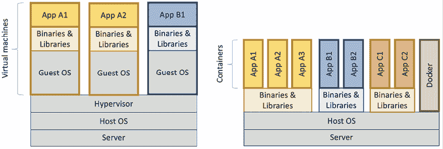

图 4.1：虚拟机与容器对比

该图说明了虚拟机和容器之间的资源使用差异，表明同一类型的服务器可以运行比虚拟机多得多的容器。主要的好处是容器不需要像虚拟机那样运行自己的操作系统实例。

## 运行我们的第一个 Docker 命令

让我们尝试通过使用 Docker 的 `run` 命令启动 Ubuntu 服务器来启动一个容器：

```java
docker run -it --rm ubuntu 
```

使用前面的命令，我们要求 Docker 创建一个运行 Ubuntu 的容器，基于官方 Docker 镜像中可用的最新版本。使用 `-it` 选项是为了我们可以使用终端与容器进行交互，而 `--rm` 选项告诉 Docker 在我们退出终端会话后删除容器；否则，容器将保持 Docker 引擎中的 `Exited` 状态。

第一次使用我们未自行构建的 Docker 镜像时，Docker 将从默认的 Docker 仓库（Docker Hub）下载它（[`hub.docker.com`](https://hub.docker.com)）。这需要一些时间，但后续使用该 Docker 镜像时，容器只需几秒钟就能启动！

一旦下载了 Docker 镜像并启动了容器，Ubuntu 服务器应该会响应如下提示：

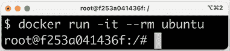

图 4.2：Ubuntu 服务器响应

我们可以通过例如询问它运行的是哪个版本的 Ubuntu 来尝试容器：

```java
cat /etc/os-release | grep 'VERSION=' 
```

应该会响应如下：

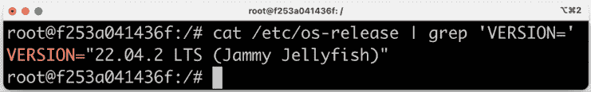

图 4.3：Ubuntu 版本响应

我们可以使用 `exit` 命令退出容器，并使用 `docker ps -a` 命令验证 Ubuntu 容器不再退出。我们需要使用 `-a` 选项来查看已停止的容器；否则，只会显示正在运行的容器。

如果你更喜欢 CentOS 而不是 Ubuntu，你可以尝试使用 `docker run --rm -it centos` 命令。

一旦 CentOS 服务器在其容器中开始运行，例如，你可以使用 `cat /etc/redhat-release` 命令来询问正在运行哪个版本的 CentOS。它应该会响应如下：

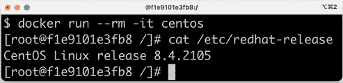

图 4.4：CentOS 版本响应

使用 `exit` 命令离开容器以删除它。

如果在某个时候，你发现 Docker Engine 中有很多不想要的容器，并且你想从零开始，也就是说，删除它们所有，你可以运行以下命令：

```java
docker rm -f $(docker ps -aq) 
```

`docker rm -f` 命令停止并删除由命令指定的容器 ID 的容器。`docker ps -aq` 命令列出 Docker Engine 中所有运行和停止的容器的容器 ID。`-q` 选项减少了 `docker ps` 命令的输出，使其只列出容器 ID。

现在我们已经了解了 Docker 是什么，我们可以继续学习如何在 Docker 中运行 Java。

# 在 Docker 中运行 Java

在过去的几年里，已经尝试了多种方法来在 Docker 中以良好的方式运行 Java。最重要的是，Java 在历史上并不擅长尊重 Docker 容器中为内存和 CPU 设置的限制。

目前，官方的 Java Docker 镜像来自 **OpenJDK** 项目：[`hub.docker.com/_/openjdk/`](https://hub.docker.com/_/openjdk/)。我们将使用来自 **Eclipse** **Temurin** 项目的替代 Docker 镜像。它包含来自 OpenJDK 项目的相同二进制文件，但提供了比 OpenJDK 项目的 Docker 镜像更好地满足我们需求的变体。

在本节中，我们将使用包含完整 **JDK**（**Java 开发工具包**）及其所有工具的 Docker 镜像。当我们开始在“使用 Docker 与单个微服务”部分中打包我们的微服务到 Docker 镜像时，我们将使用一个更紧凑的基于 **JRE**（**Java 运行时环境**）的 Docker 镜像，它只包含运行时所需的 Java 工具。

如前所述，Java 的早期版本并不擅长遵守使用 Linux cgroups 为 Docker 容器指定的配额；它们只是简单地忽略了这些设置。

因此，Java 不是根据容器中可用的内存来在 JVM 内部分配内存，而是像它有权访问 Docker 主机上的所有内存一样分配内存。当尝试分配比允许的更多的内存时，Java 容器会被主机以“内存不足”的错误消息杀死。同样，Java 根据 Docker 主机上的总可用 CPU 核心数来分配与 CPU 相关的资源，如线程池，而不是根据为容器 JVM 运行提供的 CPU 核心数。

在 Java SE 9 中，提供了基于容器的 CPU 和内存限制的初始支持，在 Java SE 10 中得到了很大改进。

让我们看看 Java SE 17 对其运行的容器中设置的限制如何响应！

在接下来的测试中，我们将在 MacBook Pro 上的虚拟机内部运行 Docker 引擎，充当 Docker 主机。Docker 主机被配置为使用**8 个 CPU**核心和**16 GB 的内存**。

我们将首先看看如何将可用的 CPU 数量限制在运行 Java 的容器中。之后，我们将对内存进行同样的限制。

## 限制可用 CPU

让我们先找出 Java 在没有应用任何限制的情况下看到多少可用处理器（即 CPU 核心）。我们可以通过将 Java 语句`Runtime.getRuntime().availableprocessors()`发送到 Java CLI 工具`jshell`来实现。我们将使用包含完整 Java 17 JDK 的 Docker 镜像在容器中运行`jshell`。此镜像的 Docker 标签是`eclipse-temurin:17`。命令如下所示：

```java
echo 'Runtime.getRuntime().availableProcessors()' | docker run --rm -i eclipse-temurin:17 jshell -q 
```

此命令将字符串`Runtime.getRuntime().availableProcessors()`发送到 Docker 容器，该容器将使用`jshell`处理该字符串。我们将得到以下响应：

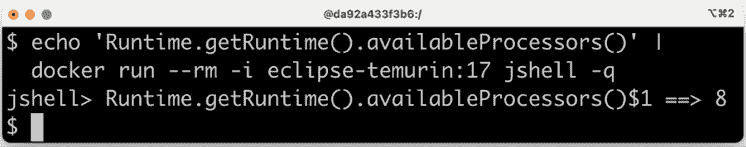

图 4.5：显示可用 CPU 核心数量的响应

`8`核心的响应符合预期，因为 Docker 主机被配置为使用`8`个 CPU 核心。让我们继续，并使用`--cpus 3` Docker 选项将 Docker 容器限制为只能使用三个 CPU 核心，然后询问 JVM 它看到了多少可用处理器：

```java
echo 'Runtime.getRuntime().availableProcessors()' | docker run --rm -i --cpus=3 eclipse-temurin:17 jshell -q 
```

JVM 现在响应为`Runtime.getRuntime().availableProcessors()$1 ==> 3`；这意味着 Java SE 17 尊重容器中的设置，因此能够正确配置如线程池等 CPU 相关资源！

## 限制可用内存

在可用内存的数量方面，让我们询问 JVM 它认为可以为堆分配的最大大小。我们可以通过使用`-XX:+PrintFlagsFinal` Java 选项请求 JVM 额外的运行时信息，然后使用`grep`命令过滤出`MaxHeapSize`参数，如下所示：

```java
docker run -it --rm eclipse-temurin:17 java -XX:+PrintFlagsFinal | grep "size_t MaxHeapSize" 
```

在为 Docker 主机分配了 16 GB 的内存后，我们将得到以下响应：

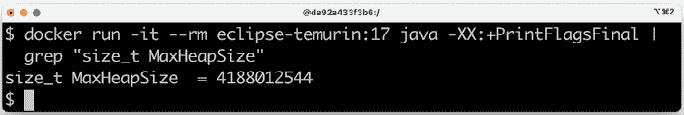

图 4.6：显示 MaxHeapSize 的响应

在没有 JVM 内存限制（即不使用 JVM 参数`-Xmx`）的情况下，Java 将为它的堆分配容器可用内存的四分之一。因此，我们预计它将为堆分配多达 4 GB。从前面的屏幕截图可以看出，响应为 4,188,012,544 字节。这等于*4,188,012,544 / 1024 / 1024* = 3,994 MB，接近预期的 4 GB。

如果我们使用 Docker 选项`-m=1024M`将 Docker 容器限制为只能使用最多 1 GB 的内存，我们预计会看到更低的内存最大分配。运行以下命令：

```java
docker run -it --rm -m=1024M eclipse-temurin:17 java -XX:+PrintFlagsFinal | grep "size_t MaxHeapSize" 
```

将导致响应 268,435,456 字节，这等于 *268,435,456 / 1024 / 1024*= 256 MB。256 MB 是 1 GB 的四分之一，所以，这正如预期的那样。

我们可以像往常一样，自己设置 JVM 的最大堆大小。例如，如果我们想允许 JVM 使用我们为其堆预留的 1 GB 中的 600 MB，我们可以使用 JVM 选项`-Xmx600m`来指定，如下所示：

```java
docker run -it --rm -m=1024M eclipse-temurin:17 java -Xmx600m -XX:+PrintFlagsFinal -version | grep "size_t MaxHeapSize" 
```

JVM 将响应 629,145,600 字节 = *629,145,600 / 1024 / 1024*= 600 MB，再次符合预期。

让我们用一个“内存不足”的测试来结束，以确保这真的有效！

我们将在一个已经分配了 1 GB 内存的容器中运行的 JVM 中使用`jshell`分配一些内存；也就是说，它有一个 256 MB 的最大堆大小。

首先，尝试分配一个 100 MB 的字节数组：

```java
echo 'new byte[100_000_000]' | docker run -i --rm -m=1024M eclipse-temurin:17 jshell -q 
```

命令将响应 `$1 ==>`，这意味着它工作得很好！

通常，`jshell`会打印出命令的结果值，但 100 MB 的字节全部设置为 0 有点太多，所以什么也没有打印出来。

现在，让我们尝试分配一个大于最大堆大小的字节数组，例如，500 MB：

```java
echo 'new byte[500_000_000]' | docker run -i --rm -m=1024M eclipse-temurin:17 jshell -q 
```

JVM 看到它无法执行该操作，因为它尊重容器的最大内存设置，并立即响应`Exception java.lang.OutOfMemoryError: Java heap space`。太好了！

因此，总结一下，我们现在已经看到了 Java 如何尊重其容器中可用的 CPU 和内存设置。让我们继续前进，为我们的一个微服务构建第一个 Docker 镜像！

# 使用 Docker 与一个微服务

现在我们已经了解了 Java 在容器中的工作方式，我们可以开始使用 Docker 与我们的一个微服务一起使用。在我们能够将我们的微服务作为 Docker 容器运行之前，我们需要将其打包到一个 Docker 镜像中。要构建一个 Docker 镜像，我们需要一个 Dockerfile，所以我们将从那里开始。接下来，我们需要为我们的微服务配置一个 Docker 特定的配置。由于在容器中运行的微服务与其他微服务是隔离的——它有自己的 IP 地址、主机名和端口——它需要与在相同主机上与其他微服务一起运行时不同的配置。

例如，由于其他微服务不再运行在相同的主机上，所以不会发生端口冲突。在 Docker 中运行时，我们可以为所有微服务使用默认端口`8080`，而没有任何端口冲突的风险。另一方面，如果我们需要与其他微服务通信，我们就不能再像在相同主机上运行它们时那样使用`localhost`了。

微服务中的源代码不会因为将微服务在容器中运行而受到影响，只有它们的配置！

为了处理在本地运行时（没有 Docker）和作为 Docker 容器运行微服务时所需的不同的配置，我们将使用 Spring 配置文件。自 *第三章*，*创建一组协作微服务* 以来，我们一直在使用默认的 Spring 配置文件在本地运行时（没有 Docker）。现在，我们将创建一个新的名为 `docker` 的 Spring 配置文件，用于我们在 Docker 中以容器形式运行微服务时使用。

## 源代码中的更改

我们将从 `product` 微服务开始，该微服务可以在源代码的 `$BOOK_HOME/Chapter04/microservices/product-service/` 中找到。在下一节中，我们将将其应用于其他微服务。

首先，我们在属性文件 `application.yml` 的末尾添加 Spring 配置文件：

```java
---
spring.config.activate.on-profile: docker
server.port: 8080 
```

Spring 配置文件可以用来指定特定环境的配置，在这种情况下，这是一个仅在运行微服务时在 Docker 容器中使用的配置。其他例子包括特定于 `dev`、`test` 和 `production` 环境的配置。配置文件中的值会覆盖默认配置文件中的值。通过使用 YAML 文件，可以在同一个文件中放置多个 Spring 配置文件，它们之间用 `---` 分隔。

我们现在唯一更改的参数是正在使用的端口；当在容器中运行微服务时，我们将使用默认端口 `8080`。

接下来，我们将创建用于构建 Docker 镜像的 Dockerfile。如 *第二章*，*Spring Boot 简介* 中所述，Dockerfile 可以非常简单：

```java
FROM **openjdk:****17**
EXPOSE **8080**
ADD **./build/libs/*.jar app.jar**
ENTRYPOINT **[****"java"****,****"-jar"****,****"/app.jar"****]** 
```

需要注意的一些事项包括：

+   Docker 镜像将基于官方的 OpenJDK Docker 镜像，并使用版本 17。

+   端口 `8080` 将暴露给其他 Docker 容器。

+   重量级 JAR 文件将被添加到 Docker 镜像中，来自 Gradle 构建库的 `build/libs`。

+   Docker 用于启动基于此 Docker 镜像的容器的命令是 `java -jar /app.jar`。

这种简单的方法有几个缺点：

+   我们正在使用 Java SE 17 的完整 JDK，包括编译器和其他开发工具。这使得 Docker 镜像变得不必要地大，并且从安全角度来看，我们不想将不必要的工具带入镜像中。

    因此，我们更愿意使用一个仅包含运行 Java 程序所需的程序和库的基础镜像来构建 Java SE 17 JRE。不幸的是，OpenJDK 项目没有为 Java SE 17 JRE 提供一个 Docker 镜像。

+   重量级 JAR 文件在 Docker 容器启动时需要时间来解包。更好的方法是，在构建 Docker 镜像时解包重量级 JAR 文件。

+   fat JAR 文件非常大，如下所示，大约有 20 MB。如果我们想在开发过程中对 Docker 镜像中的应用程序代码进行可重复更改，这将导致 Docker `build` 命令的使用次优。由于 Docker 镜像是按层构建的，我们将得到一个非常大的层，每次都需要替换，即使在应用程序代码中只更改了一个 Java 类的情况下也是如此。

+   一个更好的方法是按不同的层划分内容，其中不经常更改的文件添加到第一层，而更改最频繁的文件放置在最后一层。这将导致 Docker 层缓存机制的良好使用。对于在更改某些应用程序代码时不会更改的第一稳定层，Docker 将直接使用缓存而不是重建它们。这将导致微服务 Docker 镜像构建更快。

关于 OpenJDK 项目缺少 Java SE 17 JRE Docker 镜像的问题，还有其他开源项目将 OpenJDK 二进制文件打包到 Docker 镜像中。其中最广泛使用的一个项目是 **Eclipse Temurin** ([`adoptium.net/temurin/`](https://adoptium.net/temurin/))。Temurin 项目提供了他们 Docker 镜像的全 JDK 版本和最小化 JRE 版本。

当涉及到在 Docker 镜像中处理 fat JAR 文件的次优打包时，Spring Boot 在 v2.3.0 版本中解决了这个问题，使得将 fat JAR 文件的内容提取到多个文件夹中成为可能。默认情况下，Spring Boot 在提取 fat JAR 文件后会创建以下文件夹：

+   `dependencies`，包含所有依赖项作为 JAR 文件

+   `spring-boot-loader`，包含知道如何启动 Spring Boot 应用程序的 Spring Boot 类

+   `snapshot-dependencies`，包含任何快照依赖项

+   `application`，包含应用程序类文件和资源

Spring Boot 文档建议为上述列出的每个文件夹创建一个 Docker 层。在用基于 JRE 的镜像替换基于 JDK 的 Docker 镜像并添加将 fat JAR 文件展开到 Docker 镜像中适当层的指令后，Dockerfile 看起来是这样的：

```java
**FROM** **eclipse-temurin:17.0.5_8-jre-focal as builder**
WORKDIR extracted
ADD ./build/libs/*.jar app.jar
RUN java -Djarmode=layertools -jar app.jar extract
**FROM** **eclipse-temurin:17.0.5_8-jre-focal**
WORKDIR application
COPY --from=builder extracted/dependencies/ ./
COPY --from=builder extracted/spring-boot-loader/ ./
COPY --from=builder extracted/snapshot-dependencies/ ./
COPY --from=builder extracted/application/ ./
EXPOSE 8080
ENTRYPOINT ["java", "org.springframework.boot.loader.JarLauncher"] 
```

为了在 Dockerfile 中处理 fat JAR 文件的提取，我们使用 **多阶段构建**，这意味着有一个名为 `builder` 的第一步，用于处理提取。第二个阶段构建实际用于运行时的 Docker 镜像，从第一阶段按需选择文件。使用这种技术，我们可以在 Dockerfile 中处理所有打包逻辑，同时将最终 Docker 镜像的大小保持在最小：

1.  第一个阶段从以下行开始：

    ```java
    FROM eclipse-temurin:17.0.5_8-jre-focal as builder 
    ```

    从这一行开始，我们可以看到使用了来自 Temurin 项目的 Docker 镜像，并且它包含 Java SE JRE for v17.0.5_8。我们还可以看到该阶段被命名为 `builder`。

1.  `builder` 阶段将工作目录设置为 `extracted` 并将来自 Gradle 构建库 `build/libs` 的胖 JAR 文件添加到该文件夹中。

1.  `builder` 阶段接着运行命令 `java -Djarmode=layertools -jar app.jar extract`，这将执行将胖 JAR 文件提取到其工作目录，即 `extracted` 文件夹中的操作。

1.  下一个和最后一个阶段从以下行开始：

    ```java
    FROM eclipse-temurin:17.0.5_8-jre-focal 
    ```

    它使用与第一阶段相同的基 Docker 镜像，并将 `application` 文件夹作为其工作目录。它将 `builder` 阶段的展开文件按文件夹逐个复制到 `application` 文件夹中。这样，每个文件夹创建一个层，如上所述。参数 `--from=builder` 用于指示 Docker 从 `builder` 阶段的文件系统中选择文件。

1.  在公开适当的端口后，在这个例子中是 `8080`，Dockerfile 通过告诉 Docker 运行哪个 Java 类来启动微服务，即 `org.springframework.boot.loader.JarLauncher`，来完成封装。

在了解源代码中所需更改后，我们准备好构建我们的第一个 Docker 镜像。

## 构建 Docker 镜像

要构建 Docker 镜像，我们首先需要为 `product-service` 构建我们的部署工件（即胖 JAR 文件）：

```java
cd $BOOK_HOME/Chapter04
./gradlew :microservices:product-service:build 
```

由于我们只想构建 `product-service` 以及它所依赖的项目（即 `api` 和 `util` 项目），我们不使用正常的 `build` 命令，该命令构建所有微服务。相反，我们使用一个变体，告诉 Gradle 只构建 `product-service` 项目：`:microservices:product-service:build`。

我们可以在 Gradle 构建库中找到胖 JAR 文件，位于 `build/libs`。`ls -l microservices/product-service/build/libs` 命令将报告如下：

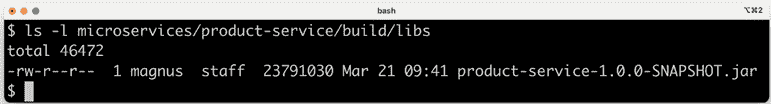

图 4.7：查看胖 JAR 文件详情

如您所见，JAR 文件的大小接近 20 MB – 没有 wonder 他们被称为胖 JAR 文件！

如果你对其实际内容感到好奇，你可以使用 `unzip -l microservices/product-service/build/libs/product-service-1.0.0-SNAPSHOT.jar` 命令来查看。

接下来，我们将构建 Docker 镜像并将其命名为 `product-service`，如下所示：

```java
cd microservices/product-service
docker build -t product-service . 
```

Docker 将使用当前目录中的 Dockerfile 来构建 Docker 引擎。镜像将被标记为 `product-service` 并存储在 Docker 引擎的本地。

使用以下命令验证我们得到了预期的 Docker 镜像：

```java
docker images | grep product-service 
```

预期输出如下：

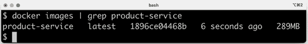

图 4.8：验证我们构建了 Docker 镜像

因此，现在我们已经构建了镜像，让我们看看我们如何启动服务。

## 启动服务

让我们使用以下命令启动 `product` 微服务作为容器：

```java
docker run --rm -p8080:8080 -e "SPRING_PROFILES_ACTIVE=docker" product-service 
```

这是我们可以从命令中推断出的内容：

1.  `docker run`：`docker run` 命令将启动容器并在终端显示日志输出。只要容器运行，终端就会锁定。

1.  我们已经看到了 `--rm` 选项；它将告诉 Docker 在我们从终端使用 *Ctrl* + *C* 停止执行后清理容器。

1.  `-p8080:8080` 选项将容器中的端口 `8080` 映射到 Docker 主机的端口 `8080`，这使得从外部调用它成为可能。在 Docker Desktop for Mac 的情况下，它在一个本地的 Linux 虚拟机中运行 Docker，端口也将被转发到 macOS，并在 `localhost` 上提供。记住，我们只能有一个容器映射到 Docker 主机上的特定端口！

1.  使用 `-e` 选项，我们可以为容器指定环境变量，在这个例子中，是 `SPRING_PROFILES_ACTIVE=docker`。`SPRING_PROFILES_ACTIVE` 环境变量用于告诉 Spring 使用哪个配置文件。在我们的例子中，我们希望 Spring 使用 `docker` 配置文件。

1.  最后，我们有 `product-service`，这是我们上面构建的 Docker 镜像的名称，Docker 将使用它来启动容器。

预期的输出如下：

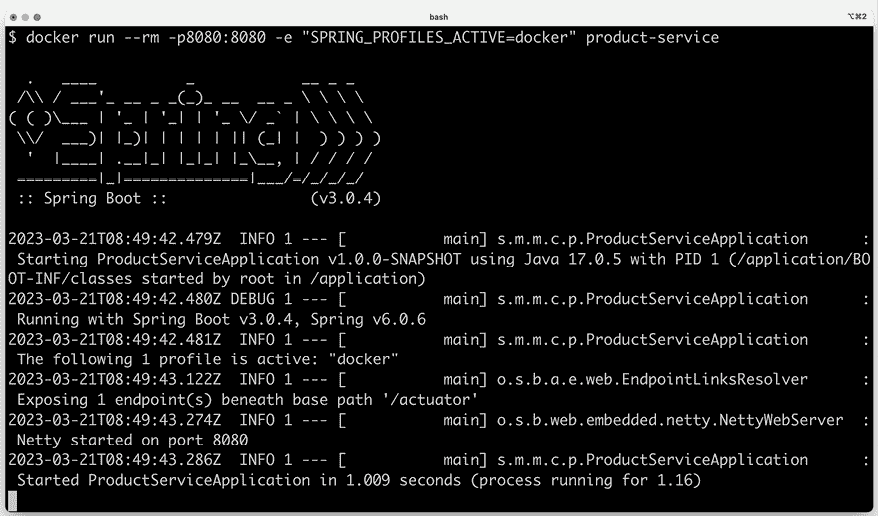

图 4.9：启动产品微服务后的输出

从前面的屏幕截图我们可以看到：

+   Spring 使用的配置文件是 `docker`。在输出中查找 `The following profiles are active: docker` 以验证这一点。

+   容器分配的端口是 `8080`。在输出中查找 `Netty started on port8080` 以验证这一点。

+   一旦写入日志消息 `Started ProductServiceApplication`，微服务就准备好接受请求了！

我们可以使用 `localhost` 上的 `8080` 端口与微服务进行通信，如前所述。在另一个终端窗口中尝试以下命令：

```java
curl localhost:8080/product/3 
```

以下是我们预期的输出：

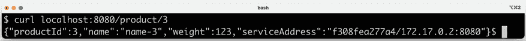

图 4.10：请求产品 3 的信息

这与我们在上一章中收到的输出类似，但有一个主要区别：我们现在有了 `"service Address":"9dc086e4a88b/172.17.0.2:8080"` 的内容，端口是 `8080`，正如预期的那样，IP 地址 `172.17.0.2` 是 Docker 内部网络分配给容器的 IP 地址——但主机名 `9dc086e4a88b` 是从哪里来的？

向 Docker 请求所有正在运行的容器：

```java
docker ps 
```

我们将看到以下内容：

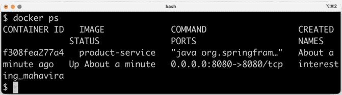

图 4.11：所有正在运行的容器

如前所述，我们可以看到主机名等同于容器的 ID，如果你想知道哪个容器实际响应了你的请求，这是很好的信息！

使用终端中的 *Ctrl* + *C* 命令停止容器，完成这个步骤后，我们现在可以继续在终端中分离运行容器。

## 以分离模式运行容器

好的，那很棒，但如果我们不想从启动容器的终端锁定它怎么办？在大多数情况下，对于每个正在运行的容器，有一个锁定的终端会感到不方便。是时候学习如何以 **分离** 的方式启动容器——在不锁定终端的情况下运行容器了！

我们可以通过添加 `-d` 选项，同时使用 `--name` 选项给它起一个名字来实现这一点。给容器起名字是可选的，如果我们不指定，Docker 会自动生成一个名字，但使用我们指定的名字可以更方便地向分离的容器发送命令。由于我们将在完成容器操作后显式地停止和删除容器，所以不再需要 `--rm` 选项：

```java
docker run -d -p8080:8080 -e "SPRING_PROFILES_ACTIVE=docker" --name my-prd-srv product-service 
```

如果我们再次运行 `docker ps` 命令，我们将看到我们的新容器，名为 `my-prd-srv`：

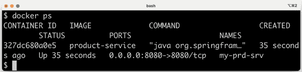

图 4.12：以分离模式启动容器

但我们如何从我们的容器中获取日志输出？

认识 `docker` `logs` 命令：

```java
docker logs my-prd-srv -f 
```

`-f` 选项指示命令跟随日志输出，也就是说，当所有当前日志输出都写入终端时，命令不会结束，而是等待更多输出。如果你期望看到很多你不想看到的旧日志消息，你也可以添加 `--tail 0` 选项，这样你只能看到新的日志消息。或者，你可以使用 `--since` 选项并指定一个绝对时间戳或相对时间，例如，`--since 5m`，以查看最多五分钟前的日志消息。

用一个新的 `curl` 请求来尝试一下。你应该会看到一个新的日志消息已经写入终端的日志输出中。

通过停止和删除容器来完成这个步骤：

```java
docker rm -f my-prd-srv 
```

`-f` 选项强制 Docker 删除容器，即使它正在运行。在删除容器之前，Docker 会自动停止容器。

现在我们知道了如何使用 Docker 与微服务一起使用，我们可以看看如何借助 Docker Compose 来管理微服务景观。

# 使用 Docker Compose 管理微服务景观

我们已经看到如何将单个微服务作为 Docker 容器运行，但关于如何管理整个微服务系统景观呢？

正如我们之前提到的，这就是 `docker-compose` 的目的。通过使用单个命令，我们可以构建、启动、记录和停止作为 Docker 容器运行的多个协作微服务。

## 源代码的更改

要使用 Docker Compose，我们需要创建一个配置文件，`docker-compose.yml`，该文件描述了 Docker Compose 将为我们管理的微服务。我们还需要为剩余的微服务设置 Dockerfile，并为每个微服务添加一个特定的 Docker Spring 配置文件。所有四个微服务都有自己的 Dockerfile，但它们看起来都与前面的相同。

当涉及到 Spring 配置文件时，三个核心服务`product-`、`recommendation-`和`review-service`具有相同的`docker`配置文件，它只指定在作为容器运行时应该使用默认端口`8080`。

对于`product-composite-service`，事情要复杂一些，因为它需要知道核心服务在哪里。当我们在本地上运行所有服务时，它被配置为使用 localhost 和每个核心服务的单独端口号，`7001`-`7003`。当在 Docker 中运行时，每个服务将有自己的主机名，但可以在相同的端口号`8080`上访问。在这里，`product-composite-service`的`docker`配置文件如下所示：

```java
---
**spring.config.activate.on-profile:****docker**
server.port: 8080
app:
  product-service:
    host: product
    port: 8080
  recommendation-service:
    host: recommendation
    port: 8080
  review-service:
    host: review
    port: 8080 
```

此配置存储在属性文件`application.yml`中。

`product`、`recommendation`和`review`主机名是从哪里来的？

这些配置在`docker-compose.yml`文件中指定，该文件位于`$BOOK_HOME/Chapter04`文件夹中。它看起来是这样的：

```java
version: '2.1'
services:
  product:
    build: microservices/product-service
    mem_limit: 512m
    environment:
      - SPRING_PROFILES_ACTIVE=docker
  recommendation:
    build: microservices/recommendation-service
    mem_limit: 512m
    environment:
      - SPRING_PROFILES_ACTIVE=docker
  review:
    build: microservices/review-service
    mem_limit: 512m
    environment:
      - SPRING_PROFILES_ACTIVE=docker
  product-composite:
    build: microservices/product-composite-service
    mem_limit: 512m
    ports:
      - "8080:8080"
    environment:
      - SPRING_PROFILES_ACTIVE=docker 
```

对于每个微服务，我们指定以下内容：

+   微服务的名称。这也将是内部 Docker 网络中容器的主机名。

+   一个`build`指令，指定用于构建 Docker 镜像的 Dockerfile 的位置。

+   512 MB 的内存限制。对于本书的范围，512 MB 应该足够所有我们的微服务使用。对于本章，它可以设置为更低的值，但随着我们在接下来的章节中添加更多功能到微服务中，它们的内存需求将会增加。

+   将为容器设置的环境变量。在我们的情况下，我们使用这些来指定要使用哪个 Spring 配置文件。

对于`product-composite`服务，我们还将指定端口映射 - 我们将公开其端口，以便可以从 Docker 外部访问。其他微服务将无法从外部访问。接下来，我们将看到如何启动微服务景观。

在第*10 章*，*使用 Spring Cloud Gateway 隐藏微服务背后的边缘服务器*，以及第*11 章*，*保护 API 访问*，我们将学习更多关于如何锁定和确保外部访问微服务系统的方法。

## 启动微服务景观

在所有必要的代码更改到位后，我们可以构建我们的 Docker 镜像，启动微服务景观，并运行一些测试以验证其按预期工作。为此，我们需要执行以下操作：

1.  首先，我们使用 Gradle 构建我们的部署工件，然后使用 Docker Compose 构建 Docker 镜像：

    ```java
    cd $BOOK_HOME/Chapter04
    ./gradlew build
    docker-compose build 
    ```

1.  然后，我们需要验证我们是否可以看到我们的 Docker 镜像，如下所示：

    ```java
    docker images | grep chapter04 
    ```

    我们应该看到以下输出：

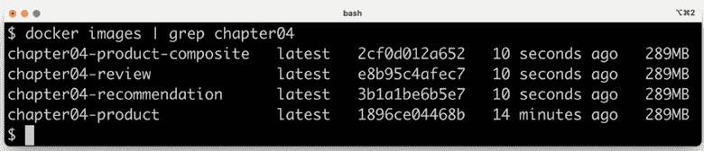图 4.13：验证我们的 Docker 镜像

1.  使用以下命令启动微服务环境：

    ```java
    docker-compose up -d 
    ```

`-d`选项将使 Docker Compose 以分离模式运行容器，与 Docker 相同。

我们可以通过以下命令监控每个容器日志的输出，以跟踪启动过程：

```java
docker-compose logs -f 
```

`docker-compose logs`命令支持与前面描述的`docker logs`相同的`-f`和`--tail`选项。

`docker-compose logs`命令也支持将日志输出限制为容器组。只需在`logs`命令后添加您想查看日志输出的容器的名称。例如，要仅查看`product`和`review`服务的日志输出，请使用`docker-compose logs -f product review`。

当所有四个微服务都报告它们已启动时，我们就准备好尝试微服务环境了。寻找以下内容：

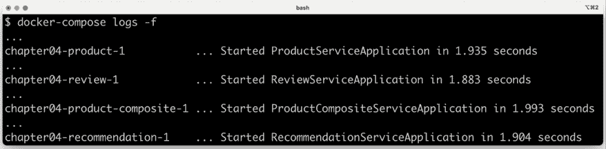

图 4.14：启动所有四个微服务

注意，每个日志消息都带有产生输出的容器的名称作为前缀！

现在，我们已经准备好运行一些测试来验证这是否按预期工作。与我们在上一章中直接在本地主机上运行相比，当我们调用 Docker 中的组合服务时，需要更改的唯一端口是端口号。我们现在使用端口`8080`：

```java
curl localhost:8080/product-composite/123 -s | jq . 
```

我们将得到相同类型的响应：

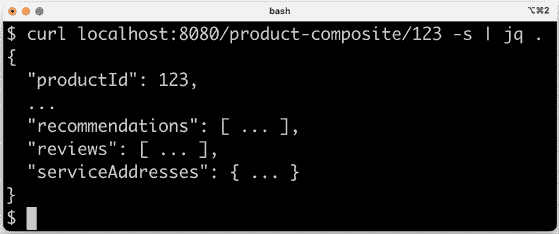

图 4.15：调用组合服务

然而，有一个很大的不同之处——响应中`serviceAddresses`报告的主机名和端口：

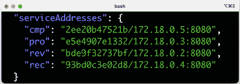

图 4.16：查看服务地址

在这里，我们可以看到分配给每个 Docker 容器的主机名和 IP 地址。

我们完成了；现在只剩下一步了：

```java
docker-compose down 
```

前面的命令将关闭微服务环境。到目前为止，我们已经看到如何通过手动执行 Bash 命令来测试协作微服务。在下一节中，我们将看到如何增强我们的测试脚本来自动化这些手动步骤。

# 自动化协作微服务的测试

当手动管理一组微服务时，Docker Compose 非常有帮助。在本节中，我们将更进一步，将 Docker Compose 集成到我们的测试脚本`test-em-all.bash`中。测试脚本将自动启动微服务环境，运行所有必要的测试以验证微服务环境按预期工作，最后将其关闭，不留任何痕迹。

测试脚本位于`$BOOK_HOME/Chapter04/test-em-all.bash`。

在测试脚本运行测试套件之前，它将检查测试脚本调用中是否存在 `start` 参数。如果找到，它将使用以下代码重新启动容器：

```java
if [[ $@ == *"start"* ]]
then
    echo "Restarting the test environment..."
    echo "$ docker-compose down --remove-orphans"
    docker-compose down --remove-orphans
    echo "$ docker-compose up -d"
    docker-compose up -d
fi 
```

之后，测试脚本将等待 `product-composite` 服务响应 `OK`：

```java
waitForService http://$HOST:${PORT}/product-composite/1 
```

`waitForService` Bash 函数的实现如下：

```java
function testUrl() {
    url=$@
    if curl $url -ks -f -o /dev/null
    then
          return 0
    else
          return 1
    fi;
}
**function****waitForService****() {**
    url=$@
    echo -n "Wait for: $url... "
    n=0
    until testUrl $url
    do
        n=$((n + 1))
        if [[ $n == 100 ]]
        then
            echo " Give up"
            exit 1
        else
            sleep 3
            echo -n ", retry #$n "
        fi
    done
    echo "DONE, continues..."
} 
```

`waitForService` 函数使用 `curl` 向提供的 URL 发送 HTTP 请求。请求会重复发送，直到 `curl` 响应表示它从请求中收到了成功的响应。函数在每次尝试之间等待 `3` 秒，并在 `100` 次尝试后放弃，停止脚本并失败。

接下来，所有测试都像之前一样执行。之后，如果脚本在调用参数中找到 `stop` 参数，它将拆除场景：

```java
if [[ $@ == *"stop"* ]]
then
    echo "We are done, stopping the test environment..."
    echo "$ docker-compose down"
    docker-compose down
fi 
```

注意，如果某些测试失败，测试脚本不会拆除场景；它将简单地停止，留下场景以供错误分析！

测试脚本还更改了默认端口，从我们在不使用 Docker 运行微服务时使用的 `7000`，更改为 Docker 容器使用的 `8080`。

让我们试试看！为了启动场景，运行测试，然后运行以下命令来拆除：

```java
./test-em-all.bash start stop 
```

以下是一些关注启动和关闭阶段的测试运行示例输出。实际测试的输出已被移除（它们与上一章相同）：

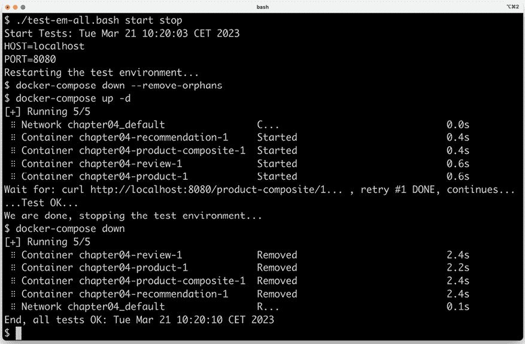

图 4.17：测试运行示例输出

运行这些测试后，我们可以继续了解如何排除失败的测试。

## 故障排除测试运行

如果运行 `./test-em-all.bash start stop` 的测试失败，以下步骤可以帮助您识别问题，并在问题解决后重新启动测试：

1.  首先，使用以下命令检查运行中的微服务状态：

    ```java
    docker-compose ps 
    ```

    如果所有微服务都正常运行且状态良好，您将收到以下输出：

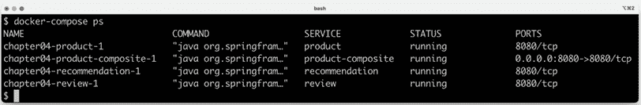

图 4.18：检查运行中的微服务状态

1.  如果任何微服务没有 `Up` 的状态，请使用 `docker-compose logs` 命令检查它们的日志输出中的任何错误。例如，如果您想检查 `product` 服务的日志输出，您将使用以下命令：

    ```java
    docker-compose logs product 
    ```

    在这个阶段，由于微服务非常简单，因此不容易记录错误。相反，这里提供了一个来自 *第六章*，*添加持久性* 中 *product* 微服务的示例错误日志。假设以下内容出现在其日志输出中：

    图 4.19：日志输出中的示例错误信息

    从上面的日志输出中可以看出，`product`微服务无法连接到其 MongoDB 数据库。鉴于数据库也作为由同一 Docker Compose 文件管理的 Docker 容器运行，可以使用`docker-compose logs`命令查看数据库的问题。

    如果需要，可以使用`docker-compose restart`命令重新启动失败的容器。例如，如果你想重新启动`product`微服务，可以使用以下命令：

    ```java
    docker-compose restart product 
    ```

    如果容器丢失，例如由于崩溃，可以使用`docker-compose up -d --scale`命令启动它。例如，对于`product`微服务，你会使用以下命令：

    ```java
    docker-compose up -d --scale product=1 
    ```

    如果日志输出中的错误表明 Docker 正在耗尽磁盘空间，可以使用以下命令回收部分空间：

    ```java
    docker system prune -f --volumes 
    ```

1.  一旦所有微服务都已启动、运行且状态良好，再次运行测试脚本，但不要启动微服务：

    ```java
    ./test-em-all.bash 
    ```

    现在测试应该可以顺利运行了！

1.  测试完成后，记得拆除系统环境：

    ```java
    docker-compose down 
    ```

最后，关于一个组合命令的提示，该命令从源代码构建运行时工件和 Docker 镜像，然后执行 Docker 中的所有测试：

```java
./gradlew clean build && docker-compose build && ./test-em-all.bash start stop 
```

这非常适合在将新代码推送到 Git 仓库或作为构建服务器构建管道的一部分之前检查一切是否正常工作！

# 摘要

在本章中，我们看到了如何使用 Docker 简化一组协作微服务的测试。

我们了解到，自 Java SE v10 以来，Java SE 会尊重我们对容器施加的限制，即它们可以使用多少 CPU 和内存。我们还看到了将基于 Java 的微服务作为 Docker 容器运行所需的最小步骤。多亏了 Spring 配置文件，我们可以在 Docker 中运行微服务而无需对代码进行任何修改。

最后，我们看到了 Docker Compose 如何通过单条命令帮助我们管理一组协作的微服务，无论是手动操作，还是与测试脚本（如`test-em-all.bash`）集成时的自动操作。

在下一章中，我们将研究如何使用 OpenAPI/Swagger 描述添加 API 的一些文档。

# 问题

1.  虚拟机和 Docker 容器之间有哪些主要区别？

1.  Docker 中的命名空间和 cgroups 的目的是什么？

1.  如果一个 Java 应用程序不遵守容器中的最大内存设置并分配了超出允许范围的内存，会发生什么？

1.  我们如何使基于 Spring 的应用程序作为 Docker 容器运行，而无需修改其源代码？

1.  为什么以下 Docker Compose 代码片段无法工作？

    ```java
     review:
        build: microservices/review-service
        ports:
          - "8080:8080"
        environment:
          - SPRING_PROFILES_ACTIVE=docker
      product-composite:
        build: microservices/product-composite-service
        ports:
          - "8080:8080"
        environment:
          - SPRING_PROFILES_ACTIVE=docker 
    ```
