# 7

# 开发反应式微服务

在本章中，我们将学习如何开发反应式微服务，即如何开发非阻塞同步 REST API 和异步事件驱动服务。我们还将学习如何在这两种选择之间进行选择。最后，我们将看到如何创建和运行反应式微服务景观的手动和自动化测试。

如在第一章*微服务简介*中已描述，反应式系统的基石是它们是消息驱动的——它们使用异步通信。这使得它们具有弹性，换句话说，可扩展性和弹性，意味着它们对失败具有容忍度。弹性和弹性共同使反应式系统能够做出响应。

本章将涵盖以下主题：

+   在非阻塞同步 API 和事件驱动的异步服务之间进行选择

+   开发非阻塞同步 REST API

+   开发事件驱动的异步服务

+   运行反应式微服务景观的手动测试

+   运行反应式微服务景观的自动化测试

# 技术要求

关于如何安装本书中使用的工具以及如何访问本书源代码的说明，请参阅：

+   *第二十一章*，*macOS 的安装说明*

+   *第二十二章*，*使用 WSL 2 和 Ubuntu 的 Microsoft Windows 安装说明*

本章中的代码示例均来自 `$BOOK_HOME/Chapter07` 的源代码。

如果你想查看本章源代码中应用的变化，即查看使微服务反应式所需的内容，你可以将其与第六章*添加持久性*的源代码进行比较。你可以使用你喜欢的`diff`工具比较这两个文件夹，即 `$BOOK_HOME/Chapter06` 和 `$BOOK_HOME/Chapter07`。

# 在非阻塞同步 API 和事件驱动的异步服务之间进行选择

在开发反应式微服务时，并不总是明显何时使用非阻塞同步 API，何时使用事件驱动的异步服务。一般来说，为了使微服务健壮和可扩展，重要的是尽可能使其具有自主性，例如，通过最小化其运行时依赖。这也被称为**松耦合**。因此，事件的消息异步传递比同步 API 更可取。这是因为微服务将只依赖于运行时对消息系统的访问，而不是依赖于对多个其他微服务的同步访问。

然而，有一些情况下同步 API 可能是首选的。例如：

+   对于需要等待响应的读取操作

+   当客户端平台更适合消费同步 API 时，例如，移动应用或 SPA 网页应用

+   当客户端将从其他组织连接到服务时——在这些组织中可能难以就跨组织使用的一个通用消息系统达成一致

对于本书中的系统景观，我们将使用以下内容：

+   产品复合微服务公开的创建、读取和删除服务将基于非阻塞同步 API。复合微服务假定在 Web 和移动平台以及来自其他组织的客户端上都有客户端，而不是操作系统景观的客户端。因此，同步 API 看起来是一个自然的选择。

+   核心微服务提供的读取服务也将被开发为非阻塞同步 API，因为最终用户正在等待它们的响应。

+   核心微服务提供的创建和删除服务将被开发为事件驱动的异步服务，这意味着它们将监听每个微服务专属主题上的创建和删除事件。

+   复合微服务提供的同步 API 用于创建和删除聚合产品信息，将在这些主题上发布创建和删除事件。如果发布操作成功，它将返回 202（已接受）响应；否则，将返回错误响应。202 响应与正常的 200（OK）响应不同——它表示请求已被接受，但尚未完全处理。相反，处理将在异步和独立于 202 响应的情况下完成。

如下图所示：

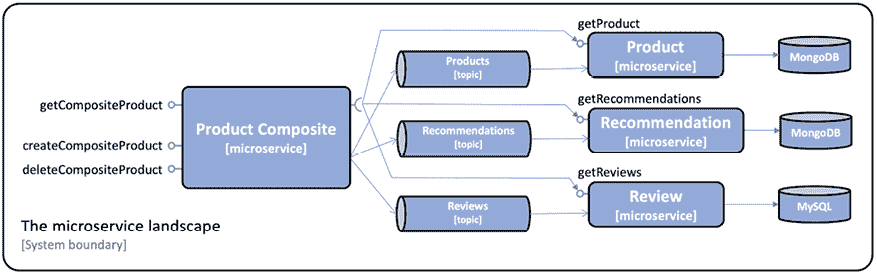

图 7.1：微服务景观

首先，让我们学习如何开发非阻塞同步 REST API，然后我们将探讨如何开发事件驱动的异步服务。

# 开发非阻塞同步 REST API

在本节中，我们将学习如何开发读取 API 的非阻塞版本。复合服务将并行地对三个核心服务进行反应性（即非阻塞）调用。当复合服务从所有核心服务收到响应后，它将创建一个组合响应并将其发送回调用者。如下图所示：

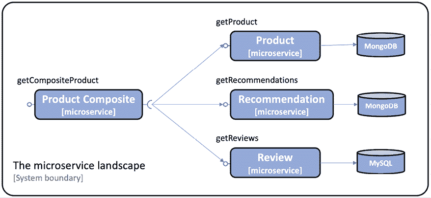

图 7.2：景观中的 getCompositeProduct 部分

在本节中，我们将涵盖以下内容：

+   Project Reactor 简介

+   使用 Spring Data for MongoDB 的非阻塞持久性

+   核心服务中的非阻塞 REST API，包括如何处理基于 JPA 的持久层中的阻塞代码

+   复合服务中的非阻塞 REST API

## Project Reactor 简介

如我们在 *第二章* 中提到的 *Spring WebFlux* 部分，*Spring Boot 简介*，Spring 5 的响应式支持基于 **Project Reactor** ([`projectreactor.io`](https://projectreactor.io))。Project Reactor 基于 *Reactive Streams 规范* ([`www.reactive-streams.org`](http://www.reactive-streams.org))，这是构建响应式应用程序的标准。Project Reactor 是基础的——它是 Spring WebFlux、Spring WebClient 和 Spring Data 依赖以提供其响应式和非阻塞功能的基础。

编程模型基于处理数据流，Project Reactor 的核心数据类型是 **Flux** 和 **Mono**。一个 `Flux` 对象用于处理 *0...n* 元素的流，一个 `Mono` 对象用于处理要么为空要么最多返回一个元素的流。我们将在本章中看到它们使用的许多示例。作为一个简短的介绍，让我们看看以下测试：

```java
@Test
void testFlux() {
  List<Integer> list = Flux.just(1, 2, 3, 4)
    .filter(n -> n % 2 == 0)
    .map(n -> n * 2)
    .log()
    .collectList().block();
  assertThat(list).containsExactly(4, 8);
} 
```

下面是对前面源代码的解释：

1.  我们使用静态辅助方法 `Flux.just()` 以整数 `1`、`2`、`3` 和 `4` 初始化流。

1.  接下来，我们 `filter` 出奇数——我们只允许偶数通过流。在这个测试中，这些是 `2` 和 `4`。

1.  接下来，我们将流中的值通过乘以 `2` 进行转换（或 `map`），因此它们变为 `4` 和 `8`。

1.  然后，我们在 `map` 操作之后 `log` 流中流动的数据。

1.  我们使用 `collectList` 方法将流中的所有项目收集到一个 `List` 中，一旦流完成，就会发出一次。

1.  到目前为止，我们只声明了流的处理。要实际获取处理的流，我们需要有人订阅它。对 `block` 方法的最终调用将注册一个等待处理完成的订阅者。

1.  结果列表被保存在名为 `list` 的成员变量中。

1.  我们现在可以使用 `assertThat` 方法来总结测试，断言流处理后的 `list` 包含预期的结果——整数 `4` 和 `8`。

日志输出将如下所示：

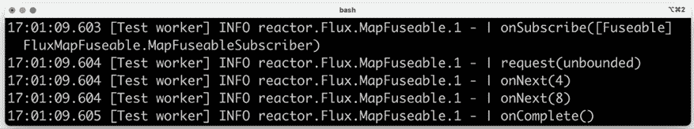

图 7.3：上述代码的日志输出

从前面的日志输出中，我们可以看到：

1.  流的处理由一个订阅流并请求其内容的订阅者启动。

1.  接下来，整数 `4` 和 `8` 通过 `log` 操作。

1.  处理通过在订阅者上调用 `onComplete` 方法结束，通知它流已结束。

要查看完整的源代码，请参阅 `util` 项目中的 `ReactorTests` 测试类。

通常，我们不启动流处理。相反，我们只定义它将如何被处理，并且将由基础设施组件负责启动处理。例如，Spring WebFlux 将作为对传入 HTTP 请求的响应来执行此操作。这个规则的一个例外是，当阻塞代码需要从反应式流中获取响应时。在这些情况下，阻塞代码可以在 `Flux` 或 `Mono` 对象上调用 `block()` 方法以阻塞方式获取响应。

## 使用 Spring Data 为 MongoDB 实现非阻塞持久化

使 `product` 和 `recommendation` 服务的 MongoDB 基础仓库反应式化非常简单：

+   将仓库的基类更改为 `ReactiveCrudRepository`

+   将自定义查找方法更改为返回 `Mono` 或 `Flux` 对象

修改后的 `ProductRepository` 和 `RecommendationRepository` 如下所示：

```java
public interface ProductRepository extends ReactiveCrudRepository <ProductEntity, String> {
    Mono<ProductEntity> findByProductId(int productId);
}
public interface RecommendationRepository extends ReactiveCrudRepository<RecommendationEntity, String> {
    Flux<RecommendationEntity> findByProductId(int productId);
} 
```

对于 `review` 服务的持久化代码没有应用任何更改；它将继续使用 JPA 仓库进行阻塞。有关如何在 `review` 服务的持久化层中处理阻塞代码的详细信息，请参阅以下部分，*处理阻塞代码*。

对于完整源代码，请查看以下类：

+   `ProductRepository` 在 `product` 项目中

+   `RecommendationRepository` 在 `recommendation` 项目中

### 测试代码的更改

当涉及到测试持久化层时，我们必须进行一些更改。由于我们的持久化方法现在返回一个 `Mono` 或 `Flux` 对象，测试方法必须等待返回的反应式对象中响应可用。测试方法可以使用对 `Mono`/`Flux` 对象上的 `block()` 方法的显式调用等待响应可用，或者它们可以使用来自 Project Reactor 的 `StepVerifier` 辅助类声明一个可验证的异步事件序列。

让我们看看如何将以下测试代码更改为适用于仓库的反应式版本：

```java
ProductEntity foundEntity = repository.findById(newEntity.getId()).get();
assertEqualsProduct(newEntity, foundEntity); 
```

我们可以在 `repository.findById()` 方法返回的 `Mono` 对象上使用 `block()` 方法，并保持命令式编程风格，如下所示：

```java
ProductEntity foundEntity = repository.findById(newEntity.getId()).**block();**
assertEqualsProduct(newEntity, foundEntity); 
```

或者，我们可以使用 `StepVerifier` 类来设置一系列处理步骤，这些步骤既执行仓库查找操作，也验证结果。序列通过调用 `verifyComplete()` 方法初始化，如下所示：

```java
**StepVerifier**.create(repository.findById(newEntity.getId()))
  .expectNextMatches(foundEntity -> areProductEqual(newEntity, foundEntity))
  .**verifyComplete**(); 
```

对于使用 `StepVerifier` 类的测试示例，请参阅 `product` 项目的 `PersistenceTests` 测试类。

对于使用 `block()` 方法的测试的相应示例，请参阅 `recommendation` 项目的 `PersistenceTests` 测试类。

## 核心服务中的非阻塞 REST API

在非阻塞持久化层就绪后，是时候使核心服务的 API 也非阻塞了。我们需要进行以下更改：

+   修改 API 以使其仅返回反应式数据类型

+   修改服务实现，使其不包含任何阻塞代码

+   修改我们的测试，以便它们可以测试反应式服务

+   处理阻塞代码 - 将仍然需要阻塞的代码与非阻塞代码隔离

### API 的更改

为了使核心服务的 API 反应式，我们需要更新它们的方法，使它们返回`Mono`或`Flux`对象。

例如，`product`服务中的`getProduct()`现在返回`Mono<Product>`而不是`Product`对象：

```java
Mono<Product> getProduct(@PathVariable int productId); 
```

对于完整的源代码，请查看`api`项目中的以下`core`接口：

+   `ProductService`

+   `RecommendationService`

+   `ReviewService`

### 服务实现中的更改

对于`product`和`recommendation`项目中使用反应式持久化层的服务的实现，我们可以使用 Project Reactor 的流畅 API。例如，`getProduct()`方法的实现如下所示：

```java
public **Mono**<Product> getProduct(int productId) {
    if (productId < 1) {
      throw new InvalidInputException("Invalid productId: " + productId);
    }
    return repository.**findByProductId(productId)**
        .switchIfEmpty(Mono.error(new **NotFoundException**("No product found
         for productId: " + productId)))
        .log(LOG.getName(), FINE)
        .map(e -> **mapper.entityToApi**(e))
        .map(e -> **setServiceAddress**(e));
} 
```

让我们看看代码做了什么：

1.  此方法将返回一个`Mono`对象；处理在这里仅声明。处理由接收此服务请求的 Web 框架 Spring WebFlux 在订阅`Mono`对象时触发！

1.  将使用持久化存储库中的`findByProductId()`方法从底层数据库中通过`productId`检索产品。

1.  如果对于给定的`productId`没有找到产品，将抛出`NotFoundException`。

1.  `log`方法将生成日志输出。

1.  将调用`mapper.entityToApi()`方法将持久化层返回的实体转换为 API 模型对象。

1.  最终的`map`方法将使用辅助方法`setServiceAddress()`来设置处理请求的微服务的 DNS 名称和 IP 地址，并将其存储在模型对象的`serviceAddress`字段中。

成功处理的一些示例日志输出如下：

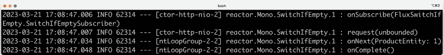

图 7.4：处理成功时的日志输出

以下是一个失败处理（抛出`NotFoundException`）的示例日志输出：

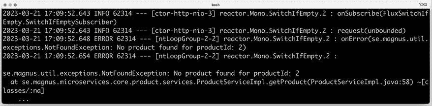

图 7.5：处理失败时的日志输出

对于完整的源代码，请查看以下类：

+   `product`项目中的`ProductServiceImpl`

+   `recommendation`项目中的`RecommendationServiceImpl`

### 测试代码的更改

服务实现的测试代码已经按照我们之前描述的持久化层测试的方式进行了更改。为了处理反应式返回类型`Mono`和`Flux`的异步行为，测试使用了调用`block()`方法和使用`StepVerifier`辅助类的方法组合。

对于完整的源代码，请查看以下测试类：

+   `product`项目中的`ProductServiceApplicationTests`

+   `recommendation`项目中的`RecommendationServiceApplicationTests`

### 处理阻塞代码

在`review`服务的情况下，该服务使用 JPA 从关系型数据库中访问其数据，我们并没有支持非阻塞编程模型。相反，我们可以使用`Scheduler`来运行阻塞代码，这个`Scheduler`能够在一个具有有限线程数的专用线程池上运行阻塞代码。使用线程池来运行阻塞代码可以避免耗尽微服务中的可用线程，并且如果有的话，还可以避免影响微服务中的并发非阻塞处理。

让我们看看以下步骤如何设置：

1.  首先，我们在主类`ReviewServiceApplication`中配置一个调度器 bean 及其线程池，如下所示：

    ```java
    @Autowired
    public ReviewServiceApplication(
      @Value("${**app.threadPoolSize:10**}") Integer threadPoolSize,
      @Value("${**app.taskQueueSize:100**}") Integer taskQueueSize
    ) {
      this.threadPoolSize = threadPoolSize;
      this.taskQueueSize = taskQueueSize;
    }
    @Bean
    public Scheduler **jdbcScheduler**() {
      return Schedulers.newBoundedElastic(threadPoolSize,
        taskQueueSize, "jdbc-pool");
    } 
    ```

    从前面的代码中，我们可以看到调度器 bean 的名称是`jdbcScheduler`，并且我们可以使用以下属性来配置其线程池：

+   `app.threadPoolSize`，指定池中线程的最大数量；默认为`10`

+   `app.taskQueueSize`，指定允许放置在队列中等待可用线程的最大任务数；默认为`100`

1.  接下来，我们将名为`jdbcScheduler`的调度器注入到`review`服务实现类中，如下所示：

    ```java
    @RestController
    public class ReviewServiceImpl implements ReviewService {
      private final Scheduler jdbcScheduler;
      @Autowired
      public ReviewServiceImpl(
        **@Qualifier("jdbcScheduler")**
        **Scheduler jdbcScheduler**, ...) {
        this.jdbcScheduler = jdbcScheduler;
      } 
    ```

1.  最后，我们在`getReviews()`方法的响应式实现中使用调度器的线程池，如下所示：

    ```java
    @Override
    public Flux<Review> getReviews(int productId) {
      if (productId < 1) {
        throw new InvalidInputException("Invalid productId: " + 
          productId);
      }
      LOG.info("Will get reviews for product with id={}", 
        productId);
      return Mono.fromCallable(() -> internalGetReviews(productId))
        .flatMapMany(Flux::fromIterable)
        .log(LOG.getName(), FINE)
        .subscribeOn(jdbcScheduler);
    }
    private List<Review> internalGetReviews(int productId) {
      List<ReviewEntity> entityList = repository.
        findByProductId(productId);
      List<Review> list = mapper.entityListToApiList(entityList);
      list.forEach(e -> e.setServiceAddress(serviceUtil.
        getServiceAddress()));
      LOG.debug("Response size: {}", list.size());
      return list;
    } 
    ```

在这里，阻塞代码被放置在`internalGetReviews()`方法中，并使用`Mono.fromCallable()`方法包装在一个`Mono`对象中。`getReviews()`方法使用`subscribeOn()`方法在`jdbcScheduler`的线程池中的一个线程上运行阻塞代码。

当我们在本章后面运行测试时，我们可以查看`review`服务的日志输出，并看到 SQL 语句是在调度器的专用池中的线程上运行的证据。我们将能够看到如下日志输出：

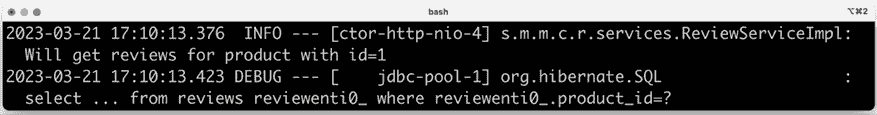

图 7.6：`review`服务的日志输出

从前面的日志输出中，我们可以看到以下内容：

+   第一条日志输出来自`getReviews()`方法中的`LOG.info()`调用，它在名为`ctor-http-nio-4`的 HTTP 线程上执行，这是 WebFlux 使用的线程。

+   在第二条日志输出中，我们可以看到由 Spring Data JPA 生成的 SQL 语句，底层使用 Hibernate。该 SQL 语句对应于`repository.findByProductId()`方法调用。它在名为`jdbc-pool-1`的线程上执行，这意味着它是在预期中的阻塞代码专用线程池中的线程上执行的！

对于完整的源代码，请参阅`review`项目中的`ReviewServiceApplication`和`ReviewServiceImpl`类。

在处理阻塞代码的逻辑就绪后，我们就完成了核心服务中非阻塞 REST API 的实现。让我们继续看看如何也将组合服务中的 REST API 变为非阻塞。

## 组合服务中的非阻塞 REST API

要使组合服务中的 REST API 非阻塞，我们需要做以下操作：

+   修改 API，使其操作仅返回反应式数据类型

+   修改服务实现，使其以并行和非阻塞的方式调用核心服务的 API

+   修改集成层，使其使用非阻塞 HTTP 客户端

+   修改我们的测试，以便它们可以测试反应式服务

### API 的变更

要使组合服务的 API 反应式，我们需要应用与之前应用于核心服务 API 相同的类型变更。这意味着`getProduct()`方法的返回类型`ProductAggregate`需要替换为`Mono<ProductAggregate>`。

`createProduct()`和`deleteProduct()`方法需要更新为返回`Mono<Void>`而不是`void`；否则，我们无法将任何错误响应传播回 API 的调用者。

对于完整的源代码，请参阅`api`项目中的`ProductCompositeService`接口。

### 服务实现的变更

为了能够并行调用三个 API，服务实现使用了`Mono`类的静态`zip()`方法。`zip`方法能够处理多个并发的反应式请求，并在所有请求都完成后将它们压缩在一起。代码如下：

```java
@Override
public Mono<ProductAggregate> getProduct(int productId) {
  return **Mono.zip**(

    **values** -> **createProductAggregate**(
      (Product) values[0], 
      (List<Recommendation>) values[1], 
      (List<Review>) values[2], 
      serviceUtil.getServiceAddress()),

    integration.getProduct(productId),
    integration.getRecommendations(productId).collectList(),
    integration.getReviews(productId).collectList())

    .doOnError(ex -> 
      LOG.warn("getCompositeProduct failed: {}", 
      ex.toString()))
    .log(LOG.getName(), FINE);
} 
```

让我们更详细地看看：

+   `zip`方法的第一个参数是一个 lambda 函数，它将接收一个名为`values`的数组中的响应。该数组将包含一个产品、一个推荐列表和一个评论列表。从三个 API 调用中收集响应的实际聚合操作由与之前相同的辅助方法`createProductAggregate()`处理，没有任何变化。

+   lambda 函数后面的参数是`zip`方法将并行调用的请求列表，每个请求一个`Mono`对象。在我们的情况下，我们发送了三个由集成类中的方法创建的`Mono`对象，每个对象对应于发送到每个核心微服务的每个请求。

对于完整的源代码，请参阅`product-composite`项目中的`ProductCompositeServiceImpl`类。

关于如何在`product-composite`服务中实现`createProduct`和`deleteProduct` API 操作的信息，请参阅后面的*在组合服务中发布事件*部分。

### 集成层的变更

在`ProductCompositeIntegration`集成类中，我们将阻塞的 HTTP 客户端`RestTemplate`替换为 Spring 5 提供的非阻塞 HTTP 客户端`WebClient`。

要创建`WebClient`实例，使用的是**建造者模式**。如果需要定制，例如设置公共头或过滤器，可以使用建造者来完成。有关可用的配置选项，请参阅[`docs.spring.io/spring/docs/current/spring-framework-reference/web-reactive.html#webflux-client-builder`](https://docs.spring.io/spring/docs/current/spring-framework-reference/web-reactive.html#webflux-client-builder)。

`WebClient`的使用方式如下：

1.  在构造函数中，`WebClient`是自动注入的。我们构建`WebClient`实例而不进行任何配置：

    ```java
    public class ProductCompositeIntegration implements ProductService, RecommendationService, ReviewService {
        private final WebClient webClient;
        @Autowired
        public ProductCompositeIntegration(
            **WebClient.Builder webClient**, ...
        ) {
            this.webClient = webClient.build();
        } 
    ```

1.  接下来，我们使用`webClient`实例来对我们的`product`服务进行非阻塞请求：

    ```java
    @Override
    public Mono<Product> getProduct(int productId) {
      String url = productServiceUrl + "/product/" + productId;
      return **webClient**.get().uri(url).retrieve()
        .bodyToMono(Product.class)
        .log(LOG.getName(), FINE)
        .**onErrorMap**(WebClientResponseException.class, 
          ex -> handleException(ex)
        );
    } 
    ```

如果对`product`服务的 API 调用失败并返回 HTTP 错误响应，整个 API 请求将失败。`WebClient`中的`onErrorMap()`方法将调用我们的`handleException(ex)`方法，该方法将 HTTP 层抛出的 HTTP 异常映射到我们自己的异常，例如`NotFoundException`或`InvalidInputException`。

然而，如果对`product`服务的调用成功，但对`recommendation`或`review` API 的调用失败，我们不想让整个请求失败。相反，我们希望将尽可能多的信息返回给调用者。因此，在这些情况下，我们不会传播异常，而是返回一个空的推荐或评论列表。为了抑制错误，我们将调用`onErrorResume(error -> empty())`。为此，代码如下所示：

```java
@Override
public Flux<Recommendation> getRecommendations(int productId) {
  String url = recommendationServiceUrl + "/recommendation?
  productId=" + productId;
  // Return an empty result if something goes wrong to make it 
  // possible for the composite service to return partial responses
  return webClient.get().uri(url).retrieve()
    .bodyToFlux(Recommendation.class)
    .log(LOG.getName(), FINE)
    .**onErrorResume(error -> empty());**
} 
```

来自`util`项目的`GlobalControllerExceptionHandler`类，将像之前一样捕获异常并将它们转换为适当的 HTTP 错误响应，这些响应将发送回复合 API 的调用者。这样我们就可以决定来自底层 API 调用的特定 HTTP 错误响应是否会引发 HTTP 错误响应或只是一个部分为空的响应。

要查看完整的源代码，请参阅`product-composite`项目中的`ProductCompositeIntegration`类。

### 测试代码中的更改

在测试类中需要做的唯一更改是更新 Mockito 及其对集成类的模拟的设置。模拟需要返回`Mono`和`Flux`对象。`setup()`方法使用辅助方法`Mono.just()`和`Flux.fromIterable()`，如下面的代码所示：

```java
class ProductCompositeServiceApplicationTests {
    @BeforeEach
    void setUp() {
        when(compositeIntegration.getProduct(PRODUCT_ID_OK)).
            thenReturn(**Mono.just**(new Product(PRODUCT_ID_OK, "name", 1,
             "mock-address")));
        when(compositeIntegration.getRecommendations(PRODUCT_ID_OK)).
            thenReturn(**Flux.fromIterable**(singletonList(new 
             Recommendation(PRODUCT_ID_OK, 1, "author", 1, "content",
             "mock address"))));
        when(compositeIntegration.getReviews(PRODUCT_ID_OK)).
            thenReturn(**Flux.fromIterable**(singletonList(new
             Review(PRODUCT_ID_OK, 1, "author", "subject", "content",
             "mock address")))); 
```

要查看完整的源代码，请参阅`product-composite`项目中的`ProductCompositeServiceApplicationTests`测试类。

这完成了我们非阻塞同步 REST API 的实现。现在，是时候开发我们的事件驱动异步服务了。

# 开发事件驱动的异步服务

在本节中，我们将学习如何开发创建和删除服务的事件驱动和异步版本。组合服务将在每个核心服务主题上发布创建和删除事件，然后向调用者返回一个 OK 响应，而不必等待核心服务中的处理完成。这如下面的图示所示：

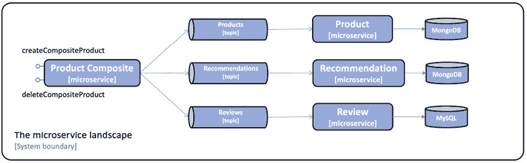

图 7.7：创建组合产品和删除组合产品景观的 createCompositeProduct 和 deleteCompositeProduct 部分

我们将涵盖以下主题：

+   处理消息挑战

+   定义主题和事件

+   Gradle 构建文件中的更改

+   在核心服务中消费事件

+   在组合服务中发布事件

## 处理消息挑战

为了实现事件驱动的创建和删除服务，我们将使用 Spring Cloud Stream。在 *第二章*，*Spring Boot 简介* 中，我们已经看到使用 Spring Cloud Stream 在主题上发布和消费消息是多么容易。

编程模型基于函数式范式，其中实现 `java.util.function` 包中 `Supplier`、`Function` 或 `Consumer` 之一的功能接口的函数可以链接在一起以执行解耦的事件驱动处理。要从非功能代码外部触发基于功能的处理，可以使用辅助类 `StreamBridge`。

例如，要将 HTTP 请求的正文发布到主题，我们只需编写以下代码：

```java
@Autowired
private StreamBridge streamBridge;
@PostMapping
void sampleCreateAPI(@RequestBody String body) {
  **streamBridge.send**("topic", body);
} 
```

辅助类 `StreamBridge` 用于触发处理。它将在主题上发布一条消息。可以通过实现 `java.util.function.Consumer` 功能接口来定义一个从主题消费事件（不创建新事件）的函数，如下所示：

```java
@Bean
public Consumer<String> mySubscriber() {
   return s -> System.out.println("ML RECEIVED: " + s);
} 
```

为了将各种功能结合起来，我们使用配置。我们将在下面的部分 *添加发布事件的配置* 和 *添加消费事件的配置* 中看到此类配置的示例。

此编程模型可以独立于所使用的消息系统使用，例如 RabbitMQ 或 Apache Kafka！

尽管发送异步消息比同步 API 调用更受欢迎，但它也带来了自己的挑战。我们将看到如何使用 Spring Cloud Stream 来处理其中的一些。Spring Cloud Stream 将涵盖以下功能：

+   消费者组

+   重试和死信队列

+   保证订单和分区

我们将在以下章节中研究这些内容。

### 消费者组

这里的问题是，如果我们增加消息消费者实例的数量，例如，如果我们启动两个 `product` 微服务的实例，这两个 `product` 微服务的实例都将消费相同的消息，如下面的图示所示：

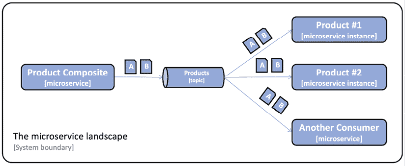

图 7.8：产品 #1 和 #2 消费相同的消息

这可能导致一条消息被处理两次，从而在数据库中可能导致重复或其他不希望的不一致性。因此，我们只想让每个消费者实例处理每条消息。这可以通过引入一个**消费者组**来解决，如下面的图所示：

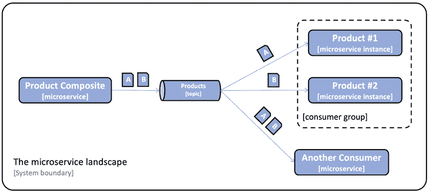

图 7.9：消费者组

在 Spring Cloud Stream 中，消费者组可以在消费者端进行配置。例如，对于`product`微服务，它将看起来像这样：

```java
spring.cloud.stream:
  bindings.messageProcessor-in-0:
    destination: products
    group: productsGroup 
```

从这个配置中，我们可以了解到以下内容：

+   Spring Cloud Stream 默认应用了一个命名约定，将配置绑定到函数。对于发送到函数的消息，绑定名称是`<functionName>-in-<index>`：

    +   `functionName`是函数的名称，在前面的示例中为`messageProcessor`。

    +   `index`被设置为`0`，除非函数需要多个输入或输出参数。我们不会使用多参数函数，所以在我们的示例中`index`将始终设置为`0`。

    +   对于出站消息，绑定名称约定是`<functionName>-out-<index>`。

+   `destination`属性指定了消息将被消费的主题名称，在本例中为`products`。

+   `group`属性指定了要将`product`微服务的实例添加到哪个消费者组，在本例中为`productsGroup`。这意味着发送到`products`主题的消息将只由 Spring Cloud Stream 交付给`product`微服务的某个实例。

### 重试和死信队列

如果消费者无法处理消息，它可能会被重新排队给失败消费者，直到成功处理。如果消息的内容无效，也称为**毒消息**，该消息将阻止消费者处理其他消息，直到手动删除。如果失败是由于临时问题，例如，由于临时网络错误数据库无法访问，经过几次重试后处理可能会成功。

必须能够指定将消息移动到另一个存储进行故障分析和纠正的重试次数。一个失败的消息通常会被移动到一个称为死信队列的专用队列。为了避免在临时故障期间（例如，网络错误）过载基础设施，必须能够配置重试的频率，最好是在每次重试之间增加时间间隔。

在 Spring Cloud Stream 中，这可以在消费者端进行配置，例如，对于`product`微服务，如下所示：

```java
spring.cloud.stream.bindings.messageProcessor-in-0.consumer:
  **maxAttempts:**3
  **backOffInitialInterval:**500
  **backOffMaxInterval:**1000
  backOffMultiplier: 2.0
spring.cloud.stream.rabbit.bindings.messageProcessor-in-0.consumer:
  autoBindDlq: true
  republishToDlq: true
spring.cloud.stream.kafka.bindings.messageProcessor-in-0.consumer:
  enableDlq: true 
```

在前面的示例中，我们指定 Spring Cloud Stream 在将消息放入死信队列之前应该进行`3`次重试。第一次重试将在`500`毫秒后尝试，其他两次尝试将在`1000`毫秒后。

启用死信队列的使用是绑定特定的；因此，我们为 RabbitMQ 和 Kafka 分别有一个配置。

### 保证顺序和分区

如果业务逻辑要求消息的消费和处理顺序与发送顺序相同，我们不能为每个消费者使用多个实例来提高处理性能；例如，我们不能使用消费者组。这可能在某些情况下导致处理传入消息的延迟不可接受。

我们可以使用**分区**来确保消息按照发送顺序交付，同时不损失性能和可伸缩性。

在大多数情况下，对消息处理的严格顺序仅适用于影响相同业务实体的消息。例如，影响产品 ID 为`1`的产品消息，在许多情况下可以独立于影响产品 ID 为`2`的产品消息进行处理。这意味着只需要保证具有相同产品 ID 的消息的顺序。

解决这个问题的方法是使每个消息都可以指定一个**键**，消息系统可以使用它来保证具有相同键的消息之间的顺序。这可以通过在主题中引入子主题，也称为**分区**来实现。消息系统根据其键将消息放置在特定的分区中。

具有相同键的消息总是放置在同一个分区中。消息系统只需要保证同一分区中消息的交付顺序。为了确保消息的顺序，我们在消费者组内为每个分区配置一个消费者实例。通过增加分区的数量，我们可以允许消费者增加其实例数量。这增加了其消息处理性能，同时不丢失交付顺序。这在下图中得到说明：

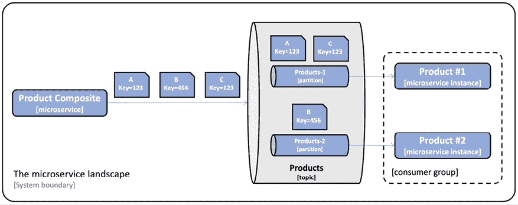

图 7.10：指定消息的键

如前图所示，所有将`Key`设置为`123`的消息总是发送到`Products-1`分区，而将`Key`设置为`456`的消息则发送到`Products-2`分区。

在 Spring Cloud Stream 中，这需要在发布者和消费者两端进行配置。在发布者端，必须指定键和分区数。例如，对于`product-composite`服务，我们有以下配置：

```java
spring.cloud.stream.bindings.products-out-0.producer:
  partition-key-expression: headers[**'partitionKey'**]
  partition-count: 2 
```

此配置意味着键将从名为`partitionKey`的消息头中提取，并且将使用两个分区。

每个消费者可以指定它想要从哪个分区消费消息。例如，对于`product`微服务，我们有以下配置：

```java
spring.cloud.stream.bindings.messageProcessor-in-0:
  destination: products
  group:productsGroup
  consumer:
    partitioned: true
    **instance-index:****0** 
```

此配置告诉 Spring Cloud Stream，此消费者将只从分区号`0`（即第一个分区）消费消息。

## 定义主题和事件

正如我们在第二章“Spring Boot 简介”中的*Spring Cloud Stream*部分所提到的，Spring Cloud Stream 基于发布和订阅模式，其中发布者向主题发布消息，而订阅者订阅他们感兴趣接收消息的主题。

我们将为每种实体类型使用一个**主题**：`products`、`recommendations`和`reviews`。

消息系统处理**消息**，这些消息通常由头和正文组成。一个**事件**是描述已发生某事的邮件。对于事件，消息正文可以用来描述事件类型、事件数据和事件发生的时间戳。

在本书的范围内，事件被定义为以下内容：

+   事件的**类型**，例如，创建或删除事件

+   一个**键**用于标识数据，例如，产品 ID

+   一个**数据**元素，即事件中的实际数据

+   一个**时间戳**，描述事件发生的时间

我们将要使用的事件类如下所示：

```java
public class **Event****<K, T>** {
    public enum Type {**CREATE, DELETE**}
    private Event.Type eventType;
    private K key;
    private T data;
    private ZonedDateTime eventCreatedAt;
    public Event() {
        this.eventType = null;
        this.key = null;
        this.data = null;
        this.eventCreatedAt = null;
    }
    public Event(Type eventType, K key, T data) {
        this.eventType = eventType;
        this.key = key;
        this.data = data;
        this.eventCreatedAt = now();
    }
    public Type getEventType() {
        return eventType;
    }
    public K getKey() {
        return key;
    }
    public T getData() {
        return data;
    }
    public ZonedDateTime getEventCreatedAt() {
        return eventCreatedAt;
    }
} 
```

让我们详细解释前面的源代码：

+   `Event`类是一个泛型类，其`key`和`data`字段由`K`和`T`类型参数化

+   事件类型被声明为一个枚举，具有允许的值，即`CREATE`和`DELETE`

+   该类定义了两个构造函数，一个是空的，另一个可以用来初始化类型、键和值成员

+   最后，该类为其成员变量定义了 getter 方法

对于完整的源代码，请参阅`api`项目中的`Event`类。

## Gradle 构建文件中的更改

要引入 Spring Cloud Stream 及其 RabbitMQ 和 Kafka 的绑定器，我们需要添加两个名为`spring-cloud-starter-stream-rabbit`和`spring-cloud-starter-stream-kafka`的启动依赖项。我们还需要在`product-composite`项目中添加一个测试依赖项`spring-cloud-stream::test-binder`，以引入测试支持。以下代码显示了这一点：

```java
dependencies {
  implementation 'org.springframework.cloud:spring-cloud-starter-stream-rabbit'
  implementation 'org.springframework.cloud:spring-cloud-starter-stream-kafka'
  testImplementation 'org.springframework.cloud:spring-cloud-stream::test-binder'
} 
```

要指定我们想要使用的 Spring Cloud 版本，我们首先声明一个用于版本的变量：

```java
ext {
    springCloudVersion = "2022.0.1"
} 
```

接下来，我们使用变量来设置指定 Spring Cloud 版本的依赖管理，如下所示：

```java
dependencyManagement {
    imports {
        mavenBom "org.springframework.cloud:spring-cloud-
        dependencies:${springCloudVersion}"
    }
} 
```

对于完整的源代码，请参阅每个微服务项目的`build.gradle`构建文件。

在 Gradle 构建文件中添加所需的依赖项后，我们可以开始学习如何在核心服务中消费事件。

## 在核心服务中消费事件

为了能够在核心服务中消费事件，我们需要做以下事情：

+   声明消费核心服务主题上发布的事件的消息处理器

+   将我们的服务实现更改为使用反应式持久化层

+   添加消费事件所需的配置

+   修改我们的测试，以便它们可以测试事件的异步处理

消费事件的源代码在所有三个核心服务中结构相同，因此我们只需查看`product`服务的源代码。

### 声明消息处理器

创建和删除实体的 REST API 已被每个核心微服务中的**消息处理器**所取代，这些微服务消费每个实体主题上的创建和删除事件。为了能够消费已发布到主题的消息，我们需要声明一个实现功能接口`java.util.function.Consumer`的 Spring Bean。

`product`服务的消息处理器声明如下：

```java
**@Configuration**
public class MessageProcessorConfig {
  private final ProductService productService;
  @Autowired
  public MessageProcessorConfig(**ProductService productService**) 
  {
    this.productService = productService;
  }
  @Bean
  public Consumer<Event<Integer,Product>> **messageProcessor**() {
    ... 
```

从前面的代码中，我们可以看到：

+   该类使用`@Configuration`注解，告诉 Spring 在该类中查找 Spring Bean。

+   我们在构造函数中注入了`ProductService`接口的实现。`productService`豆包含执行实际创建和删除产品实体的业务逻辑。

+   我们将消息处理器声明为一个实现功能接口`Consumer`的 Spring Bean，接受一个类型为`Event<Integer,Product>`的事件作为输入参数。

`Consumer`函数的实现如下所示：

```java
return **event** -> {
  switch (event.getEventType()) {
    case CREATE:
      Product product = event.getData();
      **productService.createProduct**(product).block();
      break;
    case DELETE:
      int productId = event.getKey();
      **productService.deleteProduct**(productId).block();
      break;
    default:
      String errorMessage = "Incorrect event type: " + 
        event.getEventType() + 
        ", expected a CREATE or DELETE event";
      **throw****new****EventProcessingException**(errorMessage);
  }
}; 
```

前面的实现执行以下操作：

+   它接受一个类型为`Event<Integer,Product>`的事件作为输入参数

+   使用`switch`语句，根据事件类型，它将创建或删除产品实体

+   它使用注入的`productService`豆来执行实际的创建和删除操作

+   如果事件类型既不是创建也不是删除，将会抛出异常

为了确保我们可以将`productService`豆抛出的异常传播回消息系统，我们在从`productService`豆获取的响应上调用`block()`方法。这确保了消息处理器等待`productService`豆在底层数据库中完成创建或删除操作。如果不调用`block()`方法，我们就无法传播异常，消息系统也无法重新排队失败尝试或将消息移动到死信队列；相反，消息将被静默丢弃。

从性能和可扩展性的角度来看，调用`block()`方法通常被认为是一种不良实践。但在此情况下，我们只会并行处理少量接收到的消息，每个分区一个，如上所述。这意味着我们只会同时阻塞少量线程，这不会对性能或可扩展性产生负面影响。

对于完整的源代码，请参阅`product`、`recommendation`和`review`项目中的`MessageProcessorConfig`类。

### 服务实现中的更改

`product`和`recommendation`服务的创建和删除方法的服务实现已被重写，以使用非阻塞的 MongoDB 反应持久层。例如，创建产品实体如下所示：

```java
@Override
public Mono<Product> createProduct(Product body) {
  if (body.getProductId() < 1) {
    throw new InvalidInputException("Invalid productId: " + 
      body.getProductId());
  }
  ProductEntity entity = mapper.apiToEntity(body);
  Mono<Product> newEntity = repository.save(entity)
    .log(LOG.getName(), FINE)
    .**onErrorMap**(
      DuplicateKeyException.class,
      ex -> new InvalidInputException
        ("Duplicate key, Product Id: " + body.getProductId()))
    .map(e -> mapper.entityToApi(e));
  return newEntity;
} 
```

注意，前面的代码中使用了`onErrorMap()`方法将`DuplicateKeyException`持久化异常映射到我们自己的`InvalidInputException`异常。

对于使用 JPA 的阻塞持久化层的`review`服务，创建和删除方法已经按照*处理阻塞代码部分*中描述的方式进行了更新。

对于完整的源代码，请参阅以下类：

+   `ProductServiceImpl`位于`product`项目中

+   `RecommendationServiceImpl`位于`recommendation`项目中

+   `ReviewServiceImpl`位于`review`项目中

### 添加消费事件的配置

我们还需要为消息系统设置一个配置，以便能够消费事件。为此，我们需要完成以下步骤：

1.  我们声明 RabbitMQ 是默认的消息系统，默认的内容类型是 JSON：

    ```java
    spring.cloud.stream:
      defaultBinder: rabbit
      default.contentType: application/json 
    ```

1.  接下来，我们将输入绑定到具有特定主题名称的消息处理器，如下所示：

    ```java
    spring.cloud.stream:
      bindings.messageProcessor-in-0:
        destination: products 
    ```

1.  最后，我们声明了 Kafka 和 RabbitMQ 的连接信息：

    ```java
    spring.cloud.stream.kafka.binder:
      brokers: 127.0.0.1
      defaultBrokerPort: 9092
    spring.rabbitmq:
      host: 127.0.0.1
      port: 5672
      username: guest
      password: guest
    ---
    spring.config.activate.on-profile: docker
    spring.rabbitmq.host: rabbitmq
    spring.cloud.stream.kafka.binder.brokers: kafka 
    ```

在默认的 Spring 配置文件中，当我们不使用 Docker 在`localhost`上运行我们的系统架构，并使用 IP 地址`127.0.0.1`时，我们指定了要使用的主机名。在`docker` Spring 配置文件中，我们指定了在 Docker 和 Docker Compose 中运行时将使用的主机名，即`rabbitmq`和`kafka`。

在此配置中添加了消费者配置，它还指定了消费者组、重试处理、死信队列和分区，正如在*处理消息挑战*部分中之前所描述的。

对于完整的源代码，请参阅`product`、`recommendation`和`review`项目中的`application.yml`配置文件。

### 测试代码中的更改

由于核心服务现在接收创建和删除其实体的事件，因此测试需要更新，以便它们发送事件而不是调用 REST API，就像在上一章中做的那样。为了能够从测试类中调用消息处理器，我们需要将消息处理器 bean 注入到一个成员变量中：

```java
@SpringBootTest
class ProductServiceApplicationTests {
  @Autowired
  **@Qualifier("messageProcessor")**
  private Consumer<Event<Integer, Product>> messageProcessor; 
```

从前面的代码中，我们可以看到我们不仅注入了任何`Consumer`函数，还使用了`@Qualifier`注解来指定我们想要注入名为`messageProcessor`的`Consumer`函数。

要将创建和删除事件发送到消息处理器，我们在测试类中添加了两个辅助方法，`sendCreateProductEvent`和`sendDeleteProductEvent`。

```java
 private void **sendCreateProductEvent**(int productId) {
    Product product = new Product(productId, "Name " + productId, productId, "SA");
    Event<Integer, Product> event = new Event(CREATE, productId, product);
    messageProcessor.**accept**(event);
  }
  private void **sendDeleteProductEvent**(int productId) {
    Event<Integer, Product> event = new Event(DELETE, productId, null);
    messageProcessor.**accept**(event);
  } 
```

注意，我们在`Consumer`函数接口声明中使用`accept()`方法来调用消息处理器。这意味着我们在测试中跳过了消息系统，直接调用消息处理器。

创建和删除实体的测试已更新，以使用这些辅助方法。

对于完整的源代码，请参阅以下测试类：

+   `ProductServiceApplicationTests`位于`product`项目中

+   `RecommendationServiceApplicationTests`位于`recommendation`项目中

+   `ReviewServiceApplicationTests`位于`review`项目中

我们已经看到了在核心微服务中消费事件所需的内容。现在让我们看看我们如何在组合微服务中发布事件。

## 在组合服务中发布事件

当组合服务接收到创建和删除组合产品的 HTTP 请求时，它将向核心服务在其主题上发布相应的事件。为了能够在组合服务中发布事件，我们需要执行以下步骤：

1.  在集成层发布事件

1.  添加发布事件的配置

1.  修改测试用例，以便它们可以测试事件的发布

注意，在组合服务实现类中不需要进行任何更改——这是由集成层处理的！

### 在集成层发布事件

要在集成层发布事件，我们需要：

1.  根据 HTTP 请求正文创建一个`Event`对象

1.  创建一个`Message`对象，其中使用`Event`对象作为有效负载，并将`Event`对象中的键字段用作头部的分区键

1.  使用辅助类`StreamBridge`在所需主题上发布事件

发送创建产品事件的代码如下：

```java
 @Override
  public Mono<Product> createProduct(Product body) {
    return Mono.fromCallable(() -> {
      sendMessage("products-out-0", 
        new Event(CREATE, body.getProductId(), body));
      return body;
    }).subscribeOn(publishEventScheduler);
  }
  private void sendMessage(String bindingName, Event event) {
    Message message = MessageBuilder.withPayload(event)
      .setHeader("partitionKey", event.getKey())
      .build();
    **streamBridge**.send(bindingName, message);
  } 
```

在前面的代码中，我们可以看到：

+   集成层通过使用辅助方法`sendMessage()`在`ProductService`接口中实现`createProduct()`方法。辅助方法接受输出绑定的名称和事件对象。以下配置中，绑定名称`products-out-0`将被绑定到`product`服务的主题。

+   由于`sendMessage()`使用阻塞代码，当调用`streamBridge`时，它将在由专用调度器`publishEventScheduler`提供的线程上执行。这与在`review`微服务中处理阻塞 JPA 代码的方法相同。有关详细信息，请参阅*处理阻塞代码*部分。

+   辅助方法`sendMessage()`创建一个`Message`对象，并设置如上所述的`payload`和`partitionKey`头。最后，它使用`streamBridge`对象将事件发送到消息系统，该系统将在配置中定义的主题上发布它。

要查看完整源代码，请参阅`product-composite`项目中的`ProductCompositeIntegration`类。

### 添加发布事件的配置

我们还需要设置消息系统的配置，以便能够发布事件；这与我们为消费者所做的类似。将 RabbitMQ 声明为默认消息系统，JSON 作为默认内容类型，以及 Kafka 和 RabbitMQ 作为连接信息与消费者相同。

为了声明应该用于输出绑定名称的主题，我们有以下配置：

```java
spring.cloud.stream:
  bindings:
    products-out-0:
      destination: products
    recommendations-out-0:
      destination: recommendations
    reviews-out-0:
      destination: reviews 
```

当使用分区时，我们还需要指定分区键和将要使用的分区数量：

```java
spring.cloud.stream.bindings.**products-out-**0.producer:
  partition-key-expression: headers[**'partitionKey'**]
  partition-count: 2 
```

在前面的配置中，我们可以看到：

+   该配置适用于绑定名称`products-out-0`

+   将使用的分区键将从消息头`partitionKey`中获取

+   将使用两个分区

要查看完整源代码，请参阅`product-composite`项目中的`application.yml`配置文件。

### 测试代码的更改

由于其本质，测试异步事件驱动的微服务是困难的。测试通常需要以某种方式同步于异步的后台处理，以便能够验证结果。Spring Cloud Stream 提供了一个测试绑定器，可以在测试期间不使用任何消息系统来验证已发送的消息！

关于如何在`product-composite`项目中包含测试支持，请参阅前面提到的*Gradle 构建文件中的更改*部分。

测试支持包括一个`OutputDestination`辅助类，它可以用来获取测试期间发送的消息。已添加一个新的测试类`MessagingTests`，用于运行验证预期消息是否被发送的测试。让我们来看看测试类中最重要的一部分：

1.  为了能够在测试类中注入`OutputDestination`豆，我们还需要从`TestChannelBinderConfiguration`类中引入其配置。这是通过以下代码完成的：

    ```java
    @SpringBootTest
    **@Import({TestChannelBinderConfiguration.class})**
    class MessagingTests {
      @Autowired
      private **OutputDestination target**; 
    ```

1.  接下来，我们声明了一些用于读取消息和清除主题的辅助方法。代码看起来是这样的：

    ```java
    private void **purgeMessages**(String bindingName) {
      getMessages(bindingName);
    }
    private List<String> **getMessages**(String bindingName){
      List<String> messages = new ArrayList<>();
      boolean anyMoreMessages = true;
      while (anyMoreMessages) {
        Message<byte[]> message = 
          getMessage(bindingName);
        if (message == null) {
          anyMoreMessages = false;
        } else {
          messages.add(new String(message.getPayload()));
        }
      }
      return messages;
    }
    private Message<byte[]> **getMessage**(String bindingName){
      try {
        return target.receive(0, bindingName);
      } catch (NullPointerException npe) {
        LOG.error("getMessage() received a NPE with binding = {}", bindingName);
        return null;
      }
    } 
    ```

    从前面的代码中，我们可以看到：

+   `getMessage()`方法使用名为`target`的`OutputDestination`豆返回指定主题的消息。

+   `getMessages()`方法使用`getMessage()`方法返回主题中的所有消息。

+   `purgeMessages()`方法使用`getMessages()`方法从所有当前消息中清除一个主题。

1.  每个测试都以使用带有`@BeforeEach`注解的`setup()`方法清除所有参与测试的主题开始：

    ```java
     @BeforeEach
      void setUp() {
        purgeMessages("products");
        purgeMessages("recommendations");
        purgeMessages("reviews");
      } 
    ```

1.  实际测试可以使用`getMessages()`方法验证主题中的消息。例如，查看以下创建组合产品的测试：

    ```java
    @Test
    void createCompositeProduct1() {
      ProductAggregate composite = new ProductAggregate(1, "name", 1, null, null, null);
      **postAndVerifyProduct**(composite, ACCEPTED);
      final List<String> productMessages = **getMessages**("products");
      final List<String> recommendationMessages = **getMessages**("recommendations");
      final List<String> reviewMessages = **getMessages**("reviews");
      // Assert one expected new product event queued up
      **assertEquals(**1, productMessages.size());
      Event<Integer, Product> expectedEvent =
        new Event(CREATE, composite.getProductId(), new Product(composite.getProductId(), composite.getName(), composite.getWeight(), null));
      assertThat(productMessages.get(0), is(**sameEventExceptCreatedAt**(expectedEvent)));
      // Assert no recommendation and review events
      **assertEquals(****0**, recommendationMessages.size());
      **assertEquals(****0**, reviewMessages.size());
    } 
    ```

从前面的代码中，我们可以看到一个测试的例子：

1.  首先发起一个 HTTP POST 请求，请求创建一个组合产品。

1.  接下来，从三个主题中获取所有消息，每个主题对应一个底层核心服务。

1.  对于这些测试，事件创建的具体时间戳无关紧要。为了能够比较实际事件与预期事件，忽略`eventCreatedAt`字段中的差异，可以使用一个名为`IsSameEvent`的辅助类。`sameEventExceptCreatedAt()`方法是`IsSameEvent`类中的一个静态方法，它比较`Event`对象，如果所有字段都相等（除了`eventCreatedAt`字段），则将它们视为相等。

1.  最后，它验证了预期的事件可以被找到，且没有其他事件。

要查看完整的源代码，请参阅`product-composite`项目中的测试类`MessagingTests`和`IsSameEvent`。

# 运行反应式微服务景观的手动测试

现在，我们拥有了完全反应式的微服务，无论是非阻塞同步 REST API 还是事件驱动的异步服务。让我们试试它们吧！

我们将学习如何使用 RabbitMQ 和 Kafka 作为消息代理来运行测试。由于 RabbitMQ 可以与或不与分区一起使用，我们将测试这两种情况。将使用三种不同的配置，每个配置定义在一个单独的 Docker Compose 文件中：

+   不使用分区使用 RabbitMQ

+   使用 RabbitMQ 时，每个主题有两个分区

+   使用 Kafka 时，每个主题有两个分区

然而，在测试这三个配置之前，我们需要添加两个功能以便能够测试异步处理：

+   在使用 RabbitMQ 时保存事件以供稍后检查

+   一个可以用来监控微服务景观状态的健康 API

## 保存事件

在对事件驱动的异步服务进行了一些测试之后，查看实际发送了哪些事件可能很有趣。当使用 Spring Cloud Stream 与 Kafka 结合时，事件在主题中保留，即使消费者已经处理了它们。然而，当使用 Spring Cloud Stream 与 RabbitMQ 结合时，事件在成功处理后会被移除。

为了能够看到每个主题上已发布的哪些事件，Spring Cloud Stream 被配置为将发布的事件保存到每个主题的单独消费者组`auditGroup`中。对于`products`主题，配置如下所示：

```java
spring.cloud.stream:
  bindings:
    products-out-0:
      destination: products
      producer:
        **required-groups:****auditGroup** 
```

当使用 RabbitMQ 时，这将导致创建额外的队列来存储事件，以便稍后检查。

对于完整的源代码，请参阅`product-composite`项目中的`application.yml`配置文件。

## 添加健康 API

测试一个使用同步 API 和异步消息组合的微服务系统景观具有挑战性。

例如，我们如何知道一个新启动的微服务景观，包括其数据库和消息系统，何时准备好处理请求和消息？

为了更容易知道所有微服务何时就绪，我们已向微服务中添加了健康 API。这些健康 API 基于 Spring Boot 模块**Actuator**提供的**健康端点**支持。默认情况下，基于 Actuator 的健康端点如果微服务本身以及 Spring Boot 所知的所有依赖都可用，则响应`UP`（并返回 HTTP 状态码 200）。Spring Boot 所知的依赖包括数据库和消息系统。如果微服务本身或其任何依赖不可用，健康端点将响应`DOWN`（并返回 HTTP 状态码 500）。

我们还可以扩展健康端点以覆盖 Spring Boot 未知的依赖项。我们将使用此功能扩展到产品组合的`health`端点，使其也包含三个核心服务的健康状态。这意味着产品组合`health`端点只有在自身和三个核心微服务都健康时才会响应`UP`。这可以通过`test-em-all.bash`脚本的自动或手动方式来使用，以找出所有微服务和它们的依赖项何时都处于运行状态。

在`ProductCompositeIntegration`类中，我们添加了检查三个核心微服务健康的辅助方法，如下所示：

```java
public Mono<Health> getProductHealth() {
    return getHealth(productServiceUrl);
}
public Mono<Health> getRecommendationHealth() {
    return getHealth(recommendationServiceUrl);
}
public Mono<Health> getReviewHealth() {
    return getHealth(reviewServiceUrl);
}
private Mono<Health> getHealth(String url) {
    url += "/actuator/health";
    LOG.debug("Will call the Health API on URL: {}", url);
    return webClient.get().uri(url).retrieve().bodyToMono(String.class)
        .map(s -> new Health.Builder().up().build())
        .onErrorResume(ex -> Mono.just(new 
         Health.Builder().down(ex).build()))
        .log(LOG.getName(), FINE);
} 
```

这段代码与我们之前用来调用核心服务读取 API 的代码类似。请注意，健康端点默认设置为`/actuator/health`。

对于完整源代码，请参阅`product-composite`项目中的`ProductCompositeIntegration`类。

在配置类`HealthCheckConfiguration`中，我们使用这些辅助方法通过 Spring Actuator 类`CompositeReactiveHealthContributor`注册一个组合健康检查：

```java
@Configuration
public class HealthCheckConfiguration {
  @Autowired
  ProductCompositeIntegration integration; 
  @Bean
  ReactiveHealthContributor coreServices() {
    final Map<String, ReactiveHealthIndicator> registry = new LinkedHashMap<>();
    registry.put("product", () -> integration.getProductHealth());
    registry.put("recommendation", () -> integration.getRecommendationHealth());
    registry.put("review", () -> integration.getReviewHealth());
    return CompositeReactiveHealthContributor.fromMap(registry);
  }
} 
```

对于完整源代码，请参阅`product-composite`项目中的`HealthCheckConfiguration`类。

最后，在所有四个微服务的`application.yml`配置文件中，我们配置 Spring Boot Actuator 以执行以下操作：

+   显示有关健康状态的所有详细信息，这不仅包括`UP`或`DOWN`，还包括其依赖项的信息

+   通过 HTTP 暴露所有其端点

这两个设置的配置如下：

```java
management.endpoint.health.show-details: "ALWAYS"
management.endpoints.web.exposure.include: "*" 
```

对于完整源代码的示例，请参阅`product-composite`项目中的`application.yml`配置文件。

**警告**：这些配置设置在开发期间很有帮助，但在生产系统中在 Actuator 端点中透露过多信息可能是一个安全问题。因此，计划在生产系统中最小化 Actuator 端点暴露的信息！

这可以通过在上面的`management.endpoints.web.exposure.include`属性设置中将`"*"`替换为例如`health,info`来实现。

有关 Spring Boot Actuator 暴露的端点的详细信息，请参阅[`docs.spring.io/spring-boot/docs/current/reference/html/production-ready-endpoints.html`](https://docs.spring.io/spring-boot/docs/current/reference/html/production-ready-endpoints.html)。

可以使用以下命令手动使用健康端点（现在不要尝试，等待我们启动下面的微服务景观！）：

```java
curl localhost:8080/actuator/health -s | jq . 
```

这将导致包含以下内容的响应：

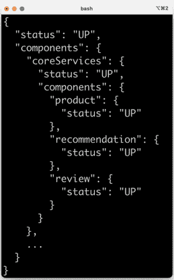

图 7.11：健康端点响应

在前面的输出中，我们可以看到组合服务报告它处于健康状态；也就是说，其状态是`UP`。在响应的末尾，我们可以看到所有三个核心微服务也被报告为健康。

在设置了健康 API 之后，我们就准备好测试我们的响应式微服务了。

## 使用不使用分区的 RabbitMQ

在本节中，我们将与 RabbitMQ 一起测试响应式微服务，但不使用分区。

默认的`docker-compose.yml` Docker Compose 文件用于此配置。以下更改已添加到文件中：

+   如此所示，已添加 RabbitMQ：

    ```java
     rabbitmq:
        image: **rabbitmq:3.11.8-management**
        mem_limit: 512m
        ports:
          **-****5672****:5672**
          **-****15672****:15672**
        **healthcheck**:
          test: ["CMD", "rabbitmqctl", "status"]
          interval: 5s
          timeout: 2s
          retries: 60 
    ```

    从上述 RabbitMQ 的声明中，我们可以看到：

+   我们使用包含管理插件和 Admin Web UI 的 RabbitMQ v3.11.8 Docker 镜像

+   我们公开了连接到 RabbitMQ 和管理 Web UI 的标准端口，分别是`5672`和`15672`

+   我们添加一个健康检查，以便 Docker 可以找出 RabbitMQ 何时准备好接受连接

+   微服务现在在 RabbitMQ 服务上声明了依赖关系。这意味着 Docker 不会启动微服务容器，直到 RabbitMQ 服务报告为健康状态：

    ```java
    depends_on:
      rabbitmq:
        condition: service_healthy 
    ```

要运行手动测试，请执行以下步骤：

1.  使用以下命令构建和启动系统景观：

    ```java
    cd $BOOK_HOME/Chapter07
    ./gradlew build && docker-compose build && docker-compose up -d 
    ```

1.  现在，我们必须等待微服务景观启动并运行。尝试运行以下命令几次：

    ```java
    curl -s localhost:8080/actuator/health | jq -r .status 
    ```

    当它返回`UP`时，我们就准备好运行我们的测试了！

1.  首先，使用以下命令创建一个复合产品：

    ```java
    body='{"productId":1,"name":"product name C","weight":300, "recommendations":[
    {"recommendationId":1,"author":"author 1","rate":1,"content":"content 1"},
     {"recommendationId":2,"author":"author 2","rate":2,"content":"content 2"},
     {"recommendationId":3,"author":"author 3","rate":3,"content":"content 3"}
    ], "reviews":[
     {"reviewId":1,"author":"author 1","subject":"subject 1","content":"content 1"},
     {"reviewId":2,"author":"author 2","subject":"subject 2","content":"content 2"},
     {"reviewId":3,"author":"author 3","subject":"subject 3","content":"content 3"}
    ]}'
    curl -X POST localhost:8080/product-composite -H "Content-Type: application/json" --data "$body" 
    ```

    当使用 Spring Cloud Stream 与 RabbitMQ 一起使用时，它将为每个主题创建一个 RabbitMQ 交换机以及一组队列，具体取决于我们的配置。让我们看看 Spring Cloud Stream 为我们创建了哪些队列！

1.  在网页浏览器中打开以下 URL：`http://localhost:15672/#/queues`。使用默认用户名/密码`guest`/`guest`登录。你应该能看到以下队列：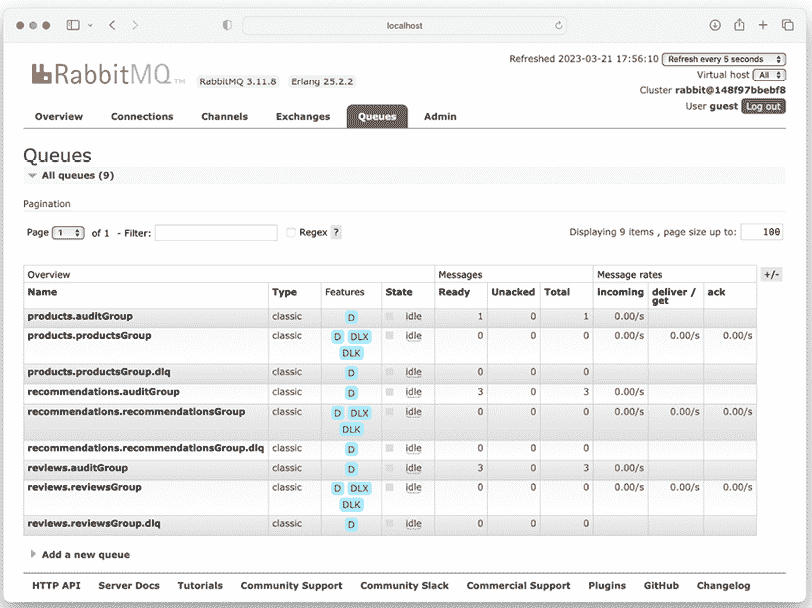图 7.12：队列列表

    对于每个主题，我们可以看到一个用于**auditGroup**的队列，一个用于对应核心微服务的消费者组的队列，以及一个死信队列。我们还可以看到，**auditGroup**队列包含消息，正如预期的那样！

1.  点击**products.auditGroup**队列，并滚动到**获取消息**部分，展开它，然后点击名为**获取消息(s)**的按钮以查看队列中的消息：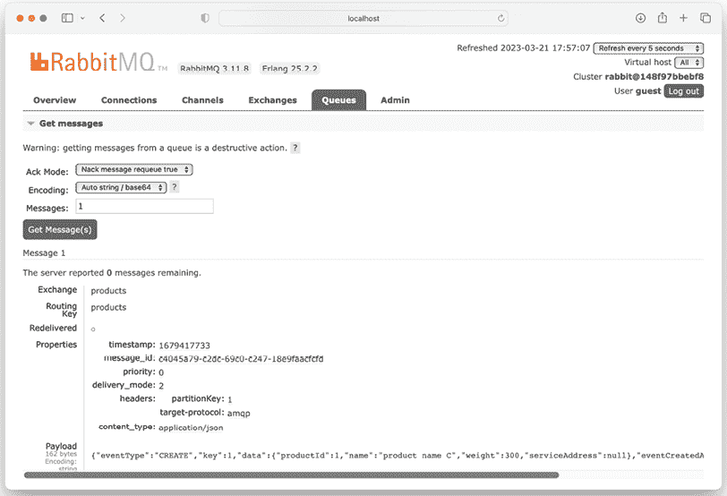图 7.13：查看队列中的消息

    从前面的屏幕截图，注意**Payload**，但也注意头部**partitionKey**，我们将在下一节中尝试使用分区来测试 RabbitMQ。

1.  接下来，尝试使用以下代码获取产品组合：

    ```java
    curl -s localhost:8080/product-composite/1 | jq 
    ```

1.  最后，使用以下命令删除它：

    ```java
    curl -X DELETE localhost:8080/product-composite/1 
    ```

1.  尝试再次获取已删除的产品。这应该导致一个`404 - "NotFound"`响应！

1.  如果您再次查看 RabbitMQ 审计队列，应该能够找到包含删除事件的新的消息。

1.  使用以下命令关闭微服务景观来结束测试：

    ```java
    docker-compose down 
    ```

这完成了我们使用不带分区的 RabbitMQ 的测试。现在，让我们继续测试带有分区的 RabbitMQ。

## 使用带有分区的 RabbitMQ

现在，让我们尝试 Spring Cloud Stream 中的分区支持！

我们为使用每个主题两个分区的 RabbitMQ 准备了一个单独的 Docker Compose 文件：`docker-compose-partitions.yml`。它还将为每个核心微服务启动两个实例，每个分区一个。例如，第二个 `product` 实例配置如下：

```java
 product-p1:
    build: microservices/product-service
    mem_limit: 512m
    environment:
      - SPRING_PROFILES_ACTIVE=docker,**streaming_partitioned**,**streaming_instance_1**
    depends_on:
      mongodb:
        condition: service_healthy
      rabbitmq:
        condition: service_healthy 
```

以下是对先前配置的解释：

+   我们使用与第一个 `product` 实例相同的源代码和 Dockerfile，但进行不同的配置。

+   为了让所有微服务实例都知道它们将使用分区，我们在它们的 `SPRING_PROFILES_ACTIVE` 环境变量中添加了 Spring 配置文件 `streaming_partitioned`。

+   我们使用不同的 Spring 配置文件将两个 `product` 实例分配到不同的分区。第一个产品实例使用 Spring 配置文件 `streaming_instance_0`，第二个实例 `product-p1` 使用 `streaming_instance_1`。

+   第二个 `product` 实例将仅处理异步事件；它不会响应 API 调用。由于它有一个不同的名称，`product-p1`（也用作其 DNS 名称），它不会响应以 `http://product:8080` 开头的 URL 调用。

使用以下命令启动微服务景观：

```java
export COMPOSE_FILE=docker-compose-partitions.yml
docker-compose build && docker-compose up -d 
```

以与上一节测试相同的方式创建一个复合产品，但还要创建一个产品 ID 设置为 `2` 的复合产品。如果您查看 Spring Cloud Stream 设置的队列，您将看到每个分区一个队列，并且产品审计队列现在每个都包含一条消息；产品 ID `1` 的事件被放置在一个分区中，而产品 ID `2` 的事件被放置在另一个分区中。

如果您在网页浏览器中返回到 `http://localhost:15672/#/queues`，您应该看到以下内容：

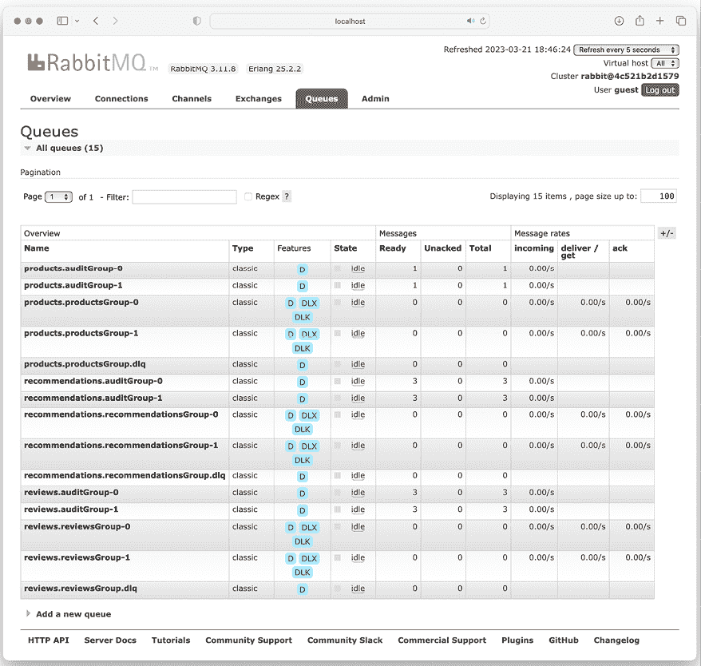

图 7.14：队列列表

要使用分区结束 RabbitMQ 的测试，请使用以下命令关闭微服务景观：

```java
docker-compose down
unset COMPOSE_FILE 
```

我们现在完成了使用 RabbitMQ 的测试，无论是带分区还是不带分区。我们将尝试的最终测试配置是测试与 Kafka 一起的微服务。

## 使用每个主题两个分区的 Kafka

现在，我们将尝试 Spring Cloud Stream 的一个非常酷的功能：将消息系统从 RabbitMQ 更改为 Apache Kafka！

这可以通过简单地更改 `spring.cloud.stream.defaultBinder` 属性的值从 `rabbit` 到 `kafka` 来完成。这由 `docker-compose-kafka.yml` Docker Compose 文件处理，该文件还用 Kafka 和 ZooKeeper 替换了 RabbitMQ。Kafka 和 ZooKeeper 的配置如下所示：

```java
kafka:
  image: confluentinc/cp-kafka:7.3.1
  restart: always
  mem_limit: 1024m
  ports:
    - "9092:9092"
  environment:
    - KAFKA_ZOOKEEPER_CONNECT=zookeeper:2181
    - KAFKA_ADVERTISED_LISTENERS=PLAINTEXT://kafka:9092
    - KAFKA_BROKER_ID=1
    - KAFKA_OFFSETS_TOPIC_REPLICATION_FACTOR=1
  depends_on:
    - zookeeper
zookeeper:
  image: confluentinc/cp-zookeeper:7.3.1
  restart: always
  mem_limit: 512m
  ports:
    - "2181:2181"
  environment:
    - ZOOKEEPER_CLIENT_PORT=2181 
```

Kafka 也被配置为每个主题使用两个分区，并且像之前一样，我们为每个核心微服务启动两个实例，每个分区一个。有关详细信息，请参阅 Docker Compose 文件`docker-compose-kafka.yml`！

使用以下命令启动微服务景观：

```java
export COMPOSE_FILE=docker-compose-kafka.yml
docker-compose build && docker-compose up -d 
```

重复上一节的测试：创建两个产品，一个产品 ID 设置为`1`，另一个产品 ID 设置为`2`。

很遗憾，Kafka 没有附带任何可以用来检查主题、分区以及其中消息的图形工具。相反，我们可以在 Kafka Docker 容器中运行 CLI 命令。

要查看主题列表，请运行以下命令：

```java
docker-compose exec kafka kafka-topics --bootstrap-server localhost:9092 --list 
```

预期输出将类似于以下所示：

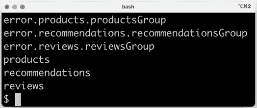

图 7.15：查看主题列表

在前面的输出中我们看到的是：

+   前缀为`error`的主题是对应死信队列的主题。

+   你将找不到像 RabbitMQ 那样的`auditGroup`组。由于事件在 Kafka 中被保留在主题中，即使消费者已经处理了它们，因此不需要额外的`auditGroup`组。

要查看特定主题的分区，例如`products`主题，请运行以下命令：

```java
docker-compose exec kafka kafka-topics --bootstrap-server localhost:9092 --describe --topic products 
```

预期输出将类似于以下所示：

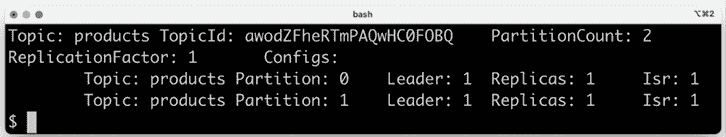

图 7.16：查看产品主题中的分区

要查看特定分区的所有消息，例如`products`主题中的分区`1`，请运行以下命令：

```java
docker-compose exec kafka kafka-console-consumer --bootstrap-server localhost:9092 --topic products --from-beginning --timeout-ms 1000 --partition 1 
```

预期输出将类似于以下所示：

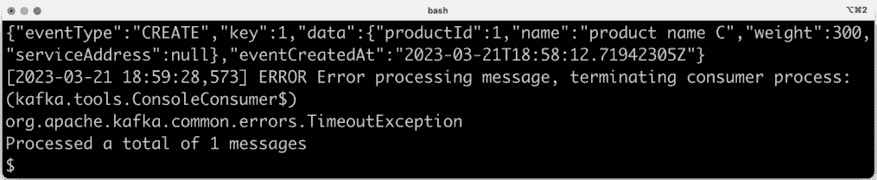

图 7.17：查看产品主题中分区 1 的所有消息

输出将以超时异常结束，因为我们通过指定命令的`1000`毫秒超时来停止命令。

使用以下命令关闭微服务景观：

```java
docker-compose down
unset COMPOSE_FILE 
```

现在，我们已经学会了如何使用 Spring Cloud Stream 将消息代理从 RabbitMQ 切换到 Kafka，而无需在源代码中进行任何更改。只需在 Docker Compose 文件中进行一些更改即可。

让我们继续本章的最后部分，学习如何自动运行这些测试！

# 运行反应式微服务景观的自动化测试

为了能够自动运行反应式微服务景观的测试而不是手动运行，已经增强了自动的`test-em-all.bash`测试脚本。最重要的更改如下：

+   脚本使用新的`health`端点来了解微服务景观何时处于运行状态，如下所示：

    ```java
    waitForService curl http://$HOST:$PORT/actuator/health 
    ```

+   脚本新增了一个`waitForMessageProcessing()`函数，它在测试数据设置完成后被调用。其目的是简单地等待异步创建服务完成测试数据的创建。

要使用测试脚本自动运行带有 RabbitMQ 和 Kafka 的测试，请执行以下步骤：

1.  使用默认的 Docker Compose 文件运行测试，即使用不带分区的 RabbitMQ，以下命令：

    ```java
    unset COMPOSE_FILE
    ./test-em-all.bash start stop 
    ```

1.  使用 Docker Compose `docker-compose-partitions.yml` 文件，通过以下命令为 RabbitMQ 运行测试，每个主题两个分区：

    ```java
    export COMPOSE_FILE=docker-compose-partitions.yml 
    ./test-em-all.bash start stop
    unset COMPOSE_FILE 
    ```

1.  最后，使用 Kafka 和每个主题两个分区，通过以下命令使用 Docker Compose `docker-compose-kafka.yml` 文件运行测试：

    ```java
    export COMPOSE_FILE=docker-compose-kafka.yml 
    ./test-em-all.bash start stop
    unset COMPOSE_FILE 
    ```

在本节中，我们学习了如何使用 `test-em-all.bash` 测试脚本自动运行配置为使用 RabbitMQ 或 Kafka 作为其消息代理的反应式微服务景观的测试。

# 摘要

在本章中，我们看到了我们如何开发反应式微服务！

使用 Spring WebFlux 和 Spring WebClient，我们可以开发非阻塞同步 API，这些 API 可以处理传入的 HTTP 请求并发送出去的 HTTP 请求，而不会阻塞任何线程。使用 Spring Data 对 MongoDB 的反应式支持，我们也可以以非阻塞的方式访问 MongoDB 数据库，即在等待数据库响应时不阻塞任何线程。Spring WebFlux、Spring WebClient 和 Spring Data 依赖于 Project Reactor 来提供它们的反应式和非阻塞特性。当我们必须使用阻塞代码时，例如使用 Spring Data for JPA，我们可以通过在专用线程池中安排阻塞代码的处理来封装阻塞代码的处理。

我们还看到了如何使用 Spring Data Stream 来开发在 RabbitMQ 和 Kafka 作为消息系统上工作的事件驱动异步服务，而无需对代码进行任何更改。通过进行一些配置，我们可以使用 Spring Cloud Stream 中的功能，如消费者组、重试、死信队列和分区来处理异步消息的各个挑战。

我们还学习了如何手动和自动测试由反应式微服务组成的系统景观。

这是关于如何使用 Spring Boot 和 Spring Framework 的基本特性的最后一章。

接下来是 Spring Cloud 的介绍以及如何使用它使我们的服务达到生产就绪、可扩展、健壮、可配置、安全且具有弹性的状态！

# 问题

1.  为什么了解如何开发反应式微服务很重要？

1.  你是如何在非阻塞同步 API 和事件/消息驱动异步服务之间进行选择的？

1.  事件与消息有什么不同？

1.  列举一些与消息驱动异步服务相关的挑战。我们如何处理它们？

1.  为什么以下测试没有失败？

    ```java
    @Test
    void testStepVerifier() {
      StepVerifier.create(Flux.just(1, 2, 3, 4)
        .filter(n -> n % 2 == 0)
        .map(n -> n * 2)
        .log())
        .expectNext(4, 8, 12);
    } 
    ```

    首先，确保测试失败。接下来，修正测试使其成功。

1.  使用 JUnit 编写反应式代码的测试有哪些挑战，我们如何处理它们？
