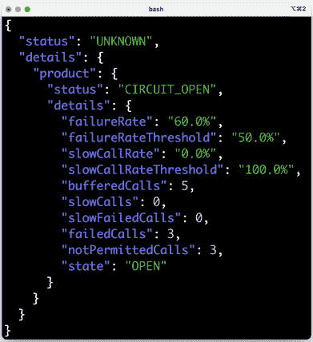

# 8

# Spring Cloud 简介

到目前为止，我们已经看到了如何使用 Spring Boot 来构建具有良好文档的 API 的微服务，以及 Spring WebFlux 和 `springdoc-openapi`；使用 Spring Data for MongoDB 和 JPA 在 MongoDB 和 SQL 数据库中持久化数据；构建响应式微服务，要么作为非阻塞 API 使用 Project Reactor，要么作为使用 RabbitMQ 或 Kafka 的 Spring Cloud Stream 的事件驱动异步服务，同时结合 Docker；以及管理和测试由微服务、数据库和消息系统组成的系统景观。

现在，是时候看看我们如何使用 **Spring Cloud** 来使我们的服务达到生产就绪状态，即可扩展、健壮、可配置、安全且具有弹性。

在本章中，我们将向您介绍如何使用 Spring Cloud 来实现 *第一章*，*微服务简介*，在 *微服务设计模式* 部分中提到的以下设计模式：

+   服务发现

+   边缘服务器

+   集中式配置

+   电路断路器

+   分布式跟踪

# 技术要求

本章不包含任何源代码，因此不需要安装任何工具。

# Spring Cloud 的演变

在 2015 年 3 月的初始 1.0 版本中，Spring Cloud 主要是对 Netflix OSS 工具的包装，具体如下：

+   Netflix Eureka，一个发现服务器

+   Netflix Ribbon，一个客户端负载均衡器

+   Netflix Zuul，一个边缘服务器

+   Netflix Hystrix，一个电路断路器

Spring Cloud 的最初版本也包含了一个配置服务器以及与 Spring Security 的集成，提供了受 OAuth 2.0 保护的 API。2016 年 5 月，Spring Cloud 的 Brixton 版本（v1.1）被公开发布。随着 Brixton 版本的发布，Spring Cloud 获得了基于 Spring Cloud Sleuth 和 Zipkin 的分布式跟踪支持，这两者最初源于 Twitter。这些最初的 Spring Cloud 组件可以用来实现前面的设计模式。更多详情请参阅 [`spring.io/blog/2015/03/04/spring-cloud-1-0-0-available-now`](https://spring.io/blog/2015/03/04/spring-cloud-1-0-0-available-now) 和 [`spring.io/blog/2016/05/11/spring-cloud-brixton-release-is-available`](https://spring.io/blog/2016/05/11/spring-cloud-brixton-release-is-available)。

自从 Spring Cloud 诞生以来，经过多年的发展，它已经增加了对以下内容的支持，以及其他内容：

+   基于 HashiCorp Consul 和 Apache Zookeeper 的服务发现和集中式配置

+   使用 Spring Cloud Stream 的事件驱动微服务

+   云服务提供商，如 Microsoft Azure、Amazon Web Services 和 Google Cloud Platform

查看以下链接以获取完整工具列表：[`spring.io/projects/spring-cloud`](https://spring.io/projects/spring-cloud)

自从 2019 年 1 月 Spring Cloud Greenwich（v2.1）版本发布以来，之前提到的某些 Netflix 工具已被置于 Spring Cloud 的维护模式。

原因是 Netflix 不再向某些工具添加新功能，而 Spring Cloud 添加了更好的替代方案。以下替代方案由 Spring Cloud 项目推荐：

| **当前组件** | **替代组件** |
| --- | --- |
| Netflix Hystrix | Resilience4j |
| Netflix Hystrix Dashboard/Netflix Turbine | Micrometer 和监控系统 |
| Netflix Ribbon | Spring Cloud LoadBalancer |
| Netflix Zuul | Spring Cloud Gateway |

表 8.1：Spring Cloud 工具替代

想要了解更多细节，请参阅：

+   [`spring.io/blog/2019/01/23/spring-cloud-greenwich-release-is-now-available`](https://spring.io/blog/2019/01/23/spring-cloud-greenwich-release-is-now-available)

+   [`github.com/Netflix/Hystrix#hystrix-status`](https://github.com/Netflix/Hystrix#hystrix-status)

+   [`github.com/Netflix/ribbon#project-status-on-maintenance`](https://github.com/Netflix/ribbon#project-status-on-maintenance)

随着 2020 年 12 月 Spring Cloud Ilford（v2020.0.0）的发布，Spring Cloud 中剩下的唯一 Netflix 组件是 Netflix Eureka。

最后，与 Spring Boot 3 一起，Spring Cloud Kilburn（v2022.0.0）于 2022 年 12 月发布。正如在*第二章*，*Spring Boot 介绍*中的*Spring Boot 3.0 新闻*部分所提到的，Spring Cloud Sleuth 已被 Micrometer Tracing 取代以支持分布式跟踪。

在这本书中，我们将使用以下表格中的软件组件来实现之前提到的设计模式：

| **设计模式** | **软件组件** |
| --- | --- |
| 服务发现 | Netflix Eureka 和 Spring Cloud LoadBalancer |
| 边缘服务器 | Spring Cloud Gateway 和 Spring Security OAuth |
| 集中配置 | Spring Cloud Configuration Server |
| 电路断路器 | Resilience4j |
| 分布式跟踪 | Micrometer Tracing 和 Zipkin |

表 8.2：按设计模式划分的软件组件

现在，让我们来探讨设计模式，并介绍将用于实现它们的软件组件！

# 使用 Netflix Eureka 进行服务发现

服务发现可能是使协作微服务景观生产就绪所需的最重要支持功能。正如我们在*第一章*，*微服务介绍*中的*服务发现*部分所描述的，一个服务发现服务（或简称*发现服务*）可以用来跟踪现有的微服务和它们的实例。

Spring Cloud 最初支持的第一个发现服务是*Netflix Eureka*。

我们将在*第九章*，*使用 Netflix Eureka 添加服务发现*中用到它，以及一个基于 Spring Cloud LoadBalancer 的负载均衡器。

我们将看到使用 Spring Cloud 时注册微服务是多么简单。我们还将学习客户端如何发送 HTTP 请求，例如调用 RESTful API，到 Netflix Eureka 中注册的实例之一。此外，本章还将涵盖如何增加微服务实例的数量，以及如何将请求负载均衡到微服务的可用实例上（默认情况下基于轮询调度）。

以下截图展示了 Eureka 的网页界面，我们可以看到我们注册了哪些微服务：


图 8.1：查看当前与 Eureka 注册的微服务

从前面的截图，我们可以看到审查服务有三个可用实例，而其他三个服务每个只有一个实例。

随着 Netflix Eureka 的引入，让我们来看看 Spring Cloud 如何通过使用边缘服务器来帮助保护微服务系统架构。

# 使用 Spring Cloud Gateway 作为边缘服务器

另一个非常重要的支持功能是边缘服务器。正如我们在 *第一章*，*微服务简介*，*边缘服务器* 部分所描述的，它可以用来保护微服务景观，这涉及到隐藏私有服务以防止外部使用，并在外部客户端使用时保护公共服务。

最初，Spring Cloud 使用 Netflix Zuul v1 作为其边缘服务器。自从 Spring Cloud Greenwich 版本发布以来，建议使用 **Spring Cloud Gateway** 代替。Spring Cloud Gateway 提供了对关键功能类似的支撑，例如基于 URL 路径的路由以及通过使用 **OAuth 2.0** 和 **OpenID Connect**（**OIDC**）来保护端点。

Netflix Zuul v1 和 Spring Cloud Gateway 之间的重要区别在于，Spring Cloud Gateway 基于非阻塞 API，使用 Spring 6、Project Reactor 和 Spring Boot 3，而 Netflix Zuul v1 基于阻塞 API。这意味着 Spring Cloud Gateway 应该能够处理比 Netflix Zuul v1 更多的并发请求，这对于所有外部流量都通过边缘服务器来说非常重要。

以下图展示了所有来自外部客户端的请求都通过 Spring Cloud Gateway 作为边缘服务器。基于 URL 路径，它将请求路由到目标微服务：


图 8.2：请求通过边缘服务器进行路由

在前面的图中，我们可以看到边缘服务器将具有以 `/product-composite/` 开头的 URL 路径的外部请求发送到 **产品组合** 微服务。核心服务 **产品**、**推荐** 和 **审查** 对外部客户端不可达。

在 *第十章*，*使用 Spring Cloud Gateway 在边缘服务器后隐藏微服务* 中，我们将探讨如何设置与我们的微服务一起使用的 Spring Cloud Gateway。

在 *第十一章*，*保护 API 访问安全* 中，我们将看到如何使用 Spring Cloud Gateway 与 Spring Security OAuth2 一起使用，以 OAuth 2.0 和 OIDC 保护对边缘服务器的访问。我们还将看到 Spring Cloud Gateway 如何将调用者的身份信息传播到我们的微服务中，例如调用者的用户名或电子邮件地址。

在介绍了 Spring Cloud Gateway 之后，让我们看看 Spring Cloud 如何帮助管理微服务系统景观的配置。

# 使用 Spring Cloud Config 进行集中配置

为了管理微服务系统景观的配置，Spring Cloud 包含 Spring Cloud Config，它根据 *第一章*，*微服务简介*，*集中配置*部分中描述的要求提供集中式配置文件管理。

Spring Cloud Config 支持将配置文件存储在多种不同的后端，例如以下内容：

+   一个 Git 仓库，例如 GitHub 或 Bitbucket

+   本地文件系统

+   HashiCorp Vault

+   一个 JDBC 数据库

Spring Cloud Config 允许我们以分层结构处理配置；例如，我们可以将配置的公共部分放在一个公共文件中，而将特定于微服务的设置放在单独的配置文件中。

Spring Cloud Config 还支持检测配置中的更改并将通知推送到受影响的微服务。它使用 **Spring Cloud Bus** 来传输通知。Spring Cloud Bus 是在 Spring Cloud Stream 之上的一个抽象，我们已经很熟悉了；也就是说，它支持使用 RabbitMQ 或 Kafka 作为传输通知的消息系统。

以下图示说明了 Spring Cloud Config、其客户端、Git 仓库和 Spring Cloud Bus 之间的协作：


图 8.3：Spring Cloud Config 如何融入微服务架构

图中展示了以下内容：

1.  当微服务启动时，它们会向配置服务器请求其配置。

1.  配置服务器从，在这种情况下，Git 仓库中获取配置。

1.  可选地，Git 仓库可以被配置为在 Git 提交推送到 Git 仓库时向配置服务器发送通知。

1.  配置服务器将使用 Spring Cloud Bus 发布更改事件。受更改影响的微服务将做出反应，并从配置服务器检索其更新的配置。

最后，Spring Cloud Config 还支持对配置中的敏感信息进行加密，例如凭证。

我们将在 *第十二章*，*集中配置* 中了解 Spring Cloud Config。

随着 Spring Cloud Config 的引入，让我们看看 Spring Cloud 如何帮助使微服务在面对系统环境中不时发生的故障时更加具有弹性。

# 使用 Resilience4j 提高弹性

在一个相当大规模的系统景观中，合作的微服务，我们必须假设总有什么事情出错。故障必须被视为正常状态，系统景观必须设计来处理它！

初始时，Spring Cloud 随 Netflix Hystrix 一起提供，这是一个经过充分验证的断路器。但如上所述，自 Spring Cloud Greenwich 版本发布以来，建议用 **Resilience4j** 替换 Netflix Hystrix。Resilience4j 是一个基于开源的容错库。它提供的容错机制范围比 Netflix Hystrix 更广：

+   **断路器**用于防止远程服务停止响应时发生连锁故障反应。

+   **限流器**用于在指定时间段内限制对服务的请求数量。

+   **隔离舱**用于限制对服务的并发请求数量。

+   **重试**用于处理可能不时发生的随机错误。

+   **时间限制器**用于避免等待慢或无响应的服务响应时间过长。

你可以在 [`github.com/resilience4j/resilience4j`](https://github.com/resilience4j/resilience4j) 上了解更多关于 Resilience4j 的信息。

在第十三章，*使用 Resilience4j 提高弹性*中，我们将重点关注 Resilience4j 中的断路器。它遵循经典的断路器设计，如下面的状态图所示：


图 8.4：断路器状态图

让我们更详细地看看状态图：

1.  断路器以**关闭**状态开始，允许请求被处理。

1.  只要请求处理成功，它就会保持在**关闭**状态。

1.  如果开始出现故障，计数器开始增加。

1.  如果在指定时间段内达到失败阈值，断路器将**跳闸**，即进入**打开**状态，不允许进一步处理请求。失败阈值和时间段都是可配置的。

1.  相反，一个请求会**快速失败**，意味着它会立即返回一个异常。

1.  在可配置的时间段后，断路器将进入**半开**状态，允许一个请求通过，作为探测，以查看故障是否已解决。

1.  如果探测请求失败，断路器将回到**打开**状态。

1.  如果探测请求成功，断路器将回到初始的**关闭**状态，允许新的请求被处理。

## Resilience4j 中断路器的示例用法

假设我们有一个名为 `myService` 的 REST 服务，该服务使用 Resilience4j 的断路器进行保护。

如果服务开始产生内部错误，例如，因为它无法访问它所依赖的服务，我们可能会从服务中得到如下响应：`500 内部服务器错误`。经过一系列可配置的尝试后，电路将打开，我们将得到一个快速失败，返回错误消息，例如`CircuitBreaker 'myService' is open`。当错误解决后，我们再次尝试（在可配置的等待时间之后），断路器将允许新的尝试作为探测。如果调用成功，断路器将再次关闭；即，正常操作。

当与 Spring Boot 一起使用 Resilience4j 时，我们将能够通过其 Spring Boot Actuator `health` 端点监控微服务中断路器的状态。例如，我们可以使用 `curl` 来查看断路器 `myService` 的状态：

```java
curl $HOST:$PORT/actuator/health -s | jq .components.circuitBreakers 
```

如果它正常工作，即电路是*关闭*的，它将响应如下：


图 8.5：闭路响应

如果出现问题并且电路是*打开*的，它将响应如下：



图 8.6：开路响应

随着 Resilience4j 的引入，我们已经看到了如何使用断路器来处理 REST 客户端的错误示例。让我们以介绍 Spring Cloud 如何用于分布式跟踪来结束这一章。

# 使用 Micrometer 跟踪和 Zipkin 进行分布式跟踪

要了解分布式系统（如协作微服务的系统景观）中正在发生的事情，能够跟踪和可视化在处理对系统景观的外部调用时，请求和消息如何在微服务之间流动至关重要。

有关此主题的更多信息，请参阅*分布式跟踪*部分的*第一章*，*微服务介绍*。

从 Spring Boot 3 开始，分布式跟踪由 **Micrometer 跟踪** 处理，取代了 **Spring Cloud Sleuth**。Micrometer 跟踪可以为属于同一处理流程的请求和消息/事件标记一个共同的 **关联 ID**。

Micrometer 跟踪还可以用来装饰日志记录，添加关联 ID，以便更容易跟踪来自同一处理流程的不同微服务的日志记录。**Zipkin** 是一个分布式跟踪系统 ([`zipkin.io`](http://zipkin.io))，Micrometer 跟踪可以将跟踪数据发送到它进行存储和可视化。在后面的*第十九章*，*使用 EFK 栈进行集中式日志记录*中，我们将学习如何使用关联 ID 来查找和可视化同一处理流程中的日志记录。

Micrometer Tracing 和 Zipkin 中处理分布式跟踪信息的基础设施最初基于 Google Dapper([`ai.google/research/pubs/pub36356`](https://ai.google/research/pubs/pub36356))。在 Dapper 中，完整工作流程的跟踪信息被称为**跟踪树**，树的部分，如工作基本单元，被称为**跨度**。跨度可以进一步由子跨度组成，这些子跨度形成了跟踪树。关联 ID 被称为**TraceId**，一个跨度由其唯一的**SpanId**以及它所属的跟踪树的**TraceId**来识别。

关于实现分布式跟踪标准（或至少是建立开放事实标准的共同努力）的简短历史课：

Google 在 2005 年开始内部使用后，于 2010 年发布了关于 Dapper 的论文。

在 2016 年，**OpenTracing**项目加入了**CNCF**。OpenTracing 深受 Dapper 的影响，并为分布式跟踪提供了供应商中立的 API 和特定语言的库。

在 2019 年，OpenTracing 项目与**OpenCensus**项目合并，形成了一个新的 CNCF 项目，**OpenTelemetry**。OpenCensus 项目提供了一套用于收集指标和分布式跟踪的库。

建议进一步阅读的 URL：

+   [`opentracing.io`](https://opentracing.io)

+   [`opencensus.io`](https://opencensus.io)

+   [`opentelemetry.io`](https://opentelemetry.io)

在第十四章*理解分布式跟踪*中，我们将看到如何使用 Micrometer Tracing 和 Zipkin 来跟踪我们的微服务景观中的处理过程。以下是从 Zipkin UI 中截取的屏幕截图，它可视化了一个创建聚合产品的处理过程中创建的跟踪树：


图 8.7：Zipkin 中的跟踪树

从前面的截图，我们可以看到通过网关（我们的边缘服务器）向**product-composite**服务发送了一个 HTTP `POST`请求，并且它通过向产品、推荐和评论的主题发布创建事件来响应。这些事件由三个核心微服务并行和异步地消费，这意味着**product-composite**服务不会等待核心微服务完成其工作。创建事件中的数据存储在每个微服务的数据库中。

在介绍了 Micrometer Tracing 和 Zipkin 进行分布式跟踪之后，我们看到了一个外部同步 HTTP 请求处理的分布式跟踪示例，该请求包括涉及微服务之间的异步事件传递。

# 摘要

在本章中，我们看到了 Spring Cloud 是如何从相对 Netflix OSS 中心化的状态发展到今天拥有更广泛的应用范围，包括与 Resilience4j 和 Micrometer Tracing 等工具一起使用。我们还介绍了 Spring Cloud 2022 最新版本中的组件如何用于实现我们在*第一章*，“微服务简介”，*微服务设计模式*部分中描述的一些设计模式。这些设计模式是使协作微服务环境生产就绪所必需的。

查看下一章，了解我们如何使用 Netflix Eureka 和 Spring Cloud LoadBalancer 实现服务发现！

# 问题

1.  Netflix Eureka 的目的是什么？

1.  Spring Cloud Gateway 的主要特性有哪些？

1.  Spring Cloud Config 支持哪些后端？

1.  Resilience4j 提供了哪些功能？

1.  分布式追踪中使用的跟踪树和跨度概念是什么，以及最初定义它们的论文叫什么名字？
