# 第九章：使用 Netflix Eureka 添加服务发现

在本章中，我们将学习如何基于 Spring Boot 使用 Netflix Eureka 作为微服务的发现服务。为了使我们的微服务能够与 Netflix Eureka 通信，我们将使用 Spring Cloud 模块中的 Netflix Eureka 客户端。在我们深入细节之前，我们将详细阐述为什么需要一个发现服务以及为什么 DNS 服务器不足以满足需求。

本章将涵盖以下主题：

+   服务发现简介

+   设置 Netflix Eureka 服务器

+   将微服务连接到 Netflix Eureka 服务器

+   设置开发使用的配置

+   尝试使用 Netflix Eureka 作为发现服务

# 技术要求

关于如何安装本书中使用的工具以及如何访问本书源代码的说明，请参阅：

+   *第二十一章*，*使用 macOS 的安装说明*

+   *第二十二章*，*使用 WSL 2 和 Ubuntu 的 Microsoft Windows 安装说明*

本章中的代码示例均来自`$BOOK_HOME/Chapter09`的源代码。

如果你想查看本章源代码中应用的变化，即查看将 Netflix Eureka 作为发现服务添加到微服务领域的具体步骤，你可以将其与*第七章*，*开发响应式微服务*的源代码进行比较。你可以使用你喜欢的`diff`工具比较两个文件夹，即`$BOOK_HOME/Chapter07`和`$BOOK_HOME/Chapter09`。

# 介绍服务发现

服务发现可能是使协作微服务领域生产就绪所需的最重要支持功能。Netflix Eureka 是 Spring Cloud 支持的第一个发现服务器。

我们严格来说是在讨论*服务发现*的*服务*，但不会将其称为*服务发现服务*，而会简单地称为*发现服务*。当提到像 Netflix Eureka 这样的实际*服务发现*实现时，将使用*发现服务器*这个术语。

我们将看到在使用 Spring Cloud 时，将微服务注册到 Netflix Eureka 是多么容易。我们还将学习客户端如何使用 Spring Cloud LoadBalancer 向 Netflix Eureka 中注册的实例之一发送 HTTP 请求。最后，我们将尝试对微服务进行扩缩容，并运行一些破坏性测试以查看 Netflix Eureka 如何处理不同类型的故障场景。

在我们深入实现细节之前，我们将探讨以下主题：

+   基于 DNS 的服务发现的问题

+   服务发现面临的挑战

+   在 Spring Cloud 中使用 Netflix Eureka 进行服务发现

## 基于 DNS 的服务发现的问题

为什么我们不能简单地启动新的微服务实例并依赖轮询 DNS？

轮询 DNS 背后的想法是，微服务的每个实例都在 DNS 服务器下以相同的名称注册其 IP 地址。当客户端请求 DNS 名称的 IP 地址时，DNS 服务器将返回注册实例的 IP 地址列表。客户端可以使用这个 IP 地址列表以轮询的方式向微服务实例发送请求，依次使用 IP 地址。

让我们试试看会发生什么！按照以下步骤操作：

1.  假设你已经遵循了*第七章*，*开发反应式微服务*中的说明，启动系统景观并使用以下命令插入一些测试数据：

    ```java
    cd $BOOK_HOME/Chapter07
    ./test-em-all.bash start 
    ```

1.  将`review`微服务扩展到两个实例：

    ```java
    docker-compose up -d --scale review=2 
    ```

1.  向复合产品服务请求它找到的`review`微服务的 IP 地址：

    ```java
    docker-compose exec product-composite getent hosts review 
    ```

    预期得到如下回答：

    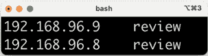

    图 9.1：检查微服务 IP 地址

    太好了，复合产品服务看到了两个 IP 地址——在我的情况下，是`192.168.96.9`和`192.168.96.8`——每个`review`微服务实例一个！

1.  如果你想的话，可以使用以下命令验证这些确实是正确的 IP 地址。这些命令会请求`review`微服务的每个实例的 IP 地址：

    ```java
    docker-compose exec --index=1 review cat /etc/hosts
    docker-compose exec --index=2 review cat /etc/hosts 
    ```

    每个命令输出的最后一行应包含一个 IP 地址，如前述代码所示。例如：

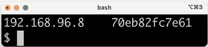

图 9.2：IP 地址输出

1.  现在，让我们尝试调用`product-composite`服务，看看它是否使用了`review`微服务的两个实例：

    ```java
    curl localhost:8080/product-composite/1 -s | jq -r .serviceAddresses.rev 
    ```

不幸的是，我们只会从微服务实例中的一个得到响应，就像这个例子一样：

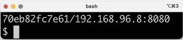

图 9.3：仅一个审查实例的响应

这真令人失望！

好吧，这里发生了什么？

DNS 客户端会请求 DNS 服务器解析 DNS 名称，并接收一个 IP 地址列表。接下来，DNS 客户端会逐个尝试接收到的 IP 地址，直到找到一个可以工作的地址，在大多数情况下是列表中的第一个。DNS 客户端通常会保留一个可以工作的 IP 地址；它不会为每个请求应用轮询方法。此外，典型的 DNS 服务器实现以及 DNS 协议本身都不太适合处理经常来来去去的易变微服务实例。正因为如此，尽管基于 DNS 的轮询在理论上很有吸引力，但在实际中并不实用，用于微服务实例的服务发现。

在我们继续学习如何更好地处理服务发现之前，让我们关闭系统景观：

```java
docker-compose down 
```

## 服务发现挑战

因此，我们需要比普通的 DNS 更强大的东西来跟踪可用的微服务实例！

当我们跟踪许多小部件时，我们必须考虑以下因素，即微服务实例：

+   新实例可以在任何时间点启动。

+   现有的实例可能在任何时间点停止响应并最终崩溃。

+   一些失败的实例可能过一段时间后可以恢复正常，并开始再次接收流量，而另一些则不会，应该从服务注册表中移除。

+   一些微服务实例可能需要一些时间才能启动；也就是说，仅仅因为它们可以接收 HTTP 请求，并不意味着流量应该被路由到它们。

+   不预期的网络分区和其他与网络相关的错误可能随时发生。

至少可以说，构建一个强大且弹性的发现服务器不是一件容易的任务。让我们看看我们如何使用 Netflix Eureka 来处理这些挑战！

## Spring Cloud 中使用 Netflix Eureka 进行服务发现

Netflix Eureka 实现了客户端服务发现，这意味着客户端运行与发现服务器 Netflix Eureka 通信的软件，以获取有关可用微服务实例的信息。

这在下图中得到说明：

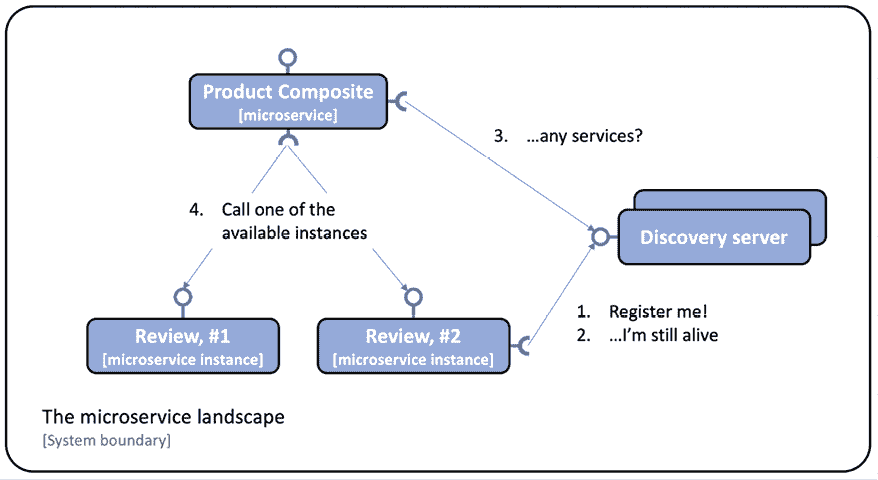

图 9.4：发现服务器图

流程如下：

1.  每当微服务实例启动时——例如，**Review**服务——它会将自己注册到 Eureka 服务器之一。

1.  定期地，每个微服务实例都会向 Eureka 服务器发送心跳消息，告诉它微服务实例一切正常，并准备好接收请求。

1.  客户端——例如，**产品组合**服务——使用一个客户端库，该库定期向 Eureka 服务请求有关可用服务的信息。

1.  当客户端需要向另一个微服务发送请求时，它已经在客户端库中有一个可用实例的列表，并且可以在不询问发现服务器的情况下选择其中一个。通常，可用实例是按轮询方式选择的；也就是说，在第一个实例再次被调用之前，它们一个接一个地被调用。

在第十七章中，我们将探讨使用 Kubernetes 中的**服务器端服务**概念提供发现服务的替代方法。

Spring Cloud 提供了一种与发现服务（如 Netflix Eureka）通信的抽象，并提供了一个名为`DiscoveryClient`的接口。这可以用来与发现服务交互，获取有关可用服务和实例的信息。`DiscoveryClient`接口的实现也能够自动将 Spring Boot 应用程序注册到发现服务器。

Spring Boot 在启动期间可以自动找到 `DiscoveryClient` 接口的实现，因此我们只需要引入相应实现的依赖来连接到发现服务器。在 Netflix Eureka 的情况下，我们微服务使用的依赖项是 `spring-cloud-starter-netflix-eureka-client`。

Spring Cloud 还提供了 `DiscoveryClient` 实现的支持，这些实现支持使用 Apache ZooKeeper 或 HashiCorp Consul 作为发现服务器。

Spring Cloud 还为想要通过负载均衡器向发现服务中注册的实例发送请求的客户端提供了一个抽象——`LoadBalancerClient` 接口。标准的反应式 HTTP 客户端 `WebClient` 可以配置为使用 `LoadBalancerClient` 实现。通过将 `@LoadBalanced` 注解添加到返回 `WebClient.Builder` 对象的 `@Bean` 声明中，将 `LoadBalancerClient` 实现注入到 `Builder` 实例作为 `ExchangeFilterFunction`。在本章的 *将微服务连接到 Netflix Eureka 服务器* 部分，我们将会看到一些如何使用它的源代码示例。

总结来说，Spring Cloud 使得使用 Netflix Eureka 作为发现服务变得非常简单。通过本节对服务发现及其挑战的介绍，以及如何将 Netflix Eureka 与 Spring Cloud 结合使用，我们准备好学习如何设置 Netflix Eureka 服务器。

# 设置 Netflix Eureka 服务器

在本节中，我们将学习如何设置 Netflix Eureka 服务器以进行服务发现。使用 Spring Cloud 设置 Netflix Eureka 服务器非常简单——只需遵循以下步骤：

1.  使用 Spring Initializr 创建一个 Spring Boot 项目，如 *第三章* 中所述，*创建一组协作微服务*，在 *使用 Spring Initializr 生成骨架代码* 部分中描述。

1.  添加对 `spring-cloud-starter-netflix-eureka-server` 的依赖。

1.  将 `@EnableEurekaServer` 注解添加到应用程序类中。

1.  添加一个 Dockerfile，类似于我们用于微服务的 Dockerfile，只是我们导出默认的 Eureka 端口 `8761`，而不是微服务的默认端口 `8080`。

1.  将 Eureka 服务器添加到我们的三个 Docker Compose 文件中，即 `docker-compose.yml`、`docker-compose-partitions.yml` 和 `docker-compose-kafka.yml`，如下所示：

    ```java
    eureka:
      build: spring-cloud/eureka-server
      mem_limit: 512m
      ports:
        - "8761:8761" 
    ```

1.  最后，添加一些配置。请参阅本章中 *设置开发使用的配置* 部分，其中我们将介绍 Eureka 服务器和我们的微服务的配置。

就这么简单！

应用程序类包含一个针对在 [`github.com/spring-cloud/spring-cloud-netflix/issues/4145`](https://github.com/spring-cloud/spring-cloud-netflix/issues/4145) 中描述的错误的解决方案。它影响了本书中使用的 Spring Cloud 版本，2022.0.1。请参阅 `EurekaServerApplication.java` 中的 `CustomErrorController` 类。

您可以在`$BOOK_HOME/Chapter09/spring-cloud/eureka-server`文件夹中找到 Eureka 服务器的源代码。

现在我们已经为服务发现设置了一个 Netflix Eureka 服务器，我们准备好学习如何将微服务连接到它了。

# 将微服务连接到 Netflix Eureka 服务器

在本节中，我们将学习如何将微服务实例连接到 Netflix Eureka 服务器。我们将学习微服务实例在启动期间如何将自己注册到 Eureka 服务器，以及客户端如何使用 Eureka 服务器来查找他们想要调用的微服务实例。

要能够在 Eureka 服务器中注册微服务实例，我们需要执行以下操作：

1.  在构建文件`build.gradle`中添加对`spring-cloud-starter-netflix-eureka-client`的依赖：

    ```java
    Implementation 'org.springframework.cloud:spring-cloud-starter-netflix-eureka-client' 
    ```

1.  当对单个微服务进行测试时，我们不希望依赖于 Eureka 服务器正在运行。因此，我们将禁用所有 Spring Boot 测试中 Netflix Eureka 的使用，即带有`@SpringBootTest`注解的 JUnit 测试。这可以通过在注解中添加`eureka.client.enabled`属性并将其设置为`false`来实现，如下所示：

    ```java
    @SpringBootTest(webEnvironment=RANDOM_PORT, properties = {"eureka.client.enabled=false"}) 
    ```

1.  最后，添加一些配置。请转到*设置开发使用的配置*部分，我们将介绍 Eureka 服务器和我们的微服务的配置。

配置中有一个属性非常重要：`spring.application.name`。它用于为每个微服务提供一个虚拟主机名，这是 Eureka 服务用来识别每个微服务的名称。Eureka 客户端将使用这个虚拟主机名在用于向微服务发起 HTTP 调用的 URL 中，正如我们接下来将要看到的。

要能够在`product-composite`微服务中通过 Eureka 服务器查找可用的微服务实例，我们还需要执行以下操作：

1.  在主应用程序类`ProductCompositeServiceApplication`中添加一个 Spring bean，该 bean 创建一个负载均衡器感知的`WebClient` builder：

    ```java
    @Bean
    @LoadBalanced
    public WebClient.Builder loadBalancedWebClientBuilder() {
        return WebClient.builder();
    } 
    ```

有关如何将`WebClient`实例用作负载均衡器客户端的更多信息，请参阅[`docs.spring.io/spring-cloud-commons/docs/current/reference/html/#webclinet-loadbalancer-client`](https://docs.spring.io/spring-cloud-commons/docs/current/reference/html/#webclinet-loadbalancer-client)。

1.  `WebClient`-builder bean 可以通过集成类`ProductCompositeIntegration`使用，通过将其注入构造函数中：

    ```java
    private WebClient webClient;
    @Autowired
    public ProductCompositeIntegration(
      WebClient.Builder webClientBuilder, 
      ...
    ) {
      this.webClient = webClientBuilder.build();
      ...
    } 
    ```

    构造函数使用注入的 builder 来创建`webClient`。

    一旦构建了`WebClient`，它就是不可变的。这意味着它可以被并发请求重用，而不会相互干扰。

1.  我们现在可以丢弃`application.yml`中硬编码的可用微服务配置。它看起来像这样：

    ```java
    app:
      product-service:
        host: localhost
        port: 7001
      recommendation-service:
        host: localhost
        port: 7002
      review-service:
        host: localhost
        port: 7003 
    ```

1.  处理硬编码配置的集成类`ProductCompositeIntegration`中的相应代码被简化，并替换为对核心微服务 API 的基础 URL 的声明。这将在以下代码中展示：

    ```java
    private static final String PRODUCT_SERVICE_URL = "http://product";
    private static final String RECOMMENDATION_SERVICE_URL = "http://recommendation";
    private static final String REVIEW_SERVICE_URL = "http://review"; 
    ```

上述 URL 中的主机名不是实际的 DNS 名称。相反，它们是微服务在将自己注册到 Eureka 服务器时使用的虚拟主机名，换句话说，是`spring.application.name`属性的值。

现在我们已经看到了如何将微服务实例连接到 Netflix Eureka 服务器，我们可以继续学习如何配置 Eureka 服务器及其连接到的微服务实例。

# 设置开发使用的配置

现在，是设置 Netflix Eureka 作为发现服务中最棘手的部分：为 Eureka 服务器及其客户端（我们的微服务实例）设置一个有效的配置。

Netflix Eureka 是一个高度可配置的发现服务器，可以根据多种不同的用例进行设置，并提供强大、健壮和容错运行时特性。这种灵活性和健壮性的一个缺点是它几乎有压倒性的配置选项数量。

幸运的是，Netflix Eureka 为大多数可配置参数提供了良好的默认值——至少在使用它们的生产环境时是这样的。

当谈到在开发中使用 Netflix Eureka 时，默认值会导致启动时间过长。例如，客户端向注册在 Eureka 服务器中的微服务实例发起初始成功的调用可能需要很长时间。

使用默认配置值时，可能会遇到长达两分钟的等待时间。这个等待时间加在了 Eureka 服务和微服务启动所需的时间上。这种等待时间的原因是涉及到的进程需要相互同步注册信息。微服务实例需要向 Eureka 服务器注册，客户端需要从 Eureka 服务器收集信息。这种通信主要基于心跳，默认情况下每 30 秒发生一次。还有一些缓存也参与其中，这会减慢更新传播的速度。

我们将使用一种配置来最小化这种等待时间，这在开发期间非常有用。在生产环境中，应该将默认值作为起点！

我们将只使用一个 Netflix Eureka 服务器实例，这在开发环境中是可以的。在生产环境中，你应该始终使用两个或更多实例以确保 Netflix Eureka 服务器的高可用性。

让我们开始学习我们需要了解哪些类型的配置参数。

## Eureka 配置参数

Eureka 的配置参数分为三个组：

+   以`eureka.server`为前缀的 Eureka 服务器参数。

+   以`eureka.client`为前缀的 Eureka 客户端参数。这是供想要与 Eureka 服务器通信的客户端使用的。

+   以`eureka.instance`为前缀的 Eureka 实例参数。这是供想要在 Eureka 服务器中注册自己的微服务实例使用的。

一些可用的参数在 Spring Cloud Netflix 文档中有描述：[`docs.spring.io/spring-cloud-netflix/docs/current/reference/html/`](https://docs.spring.io/spring-cloud-netflix/docs/current/reference/html/)。

对于可用的参数的详尽列表，我建议阅读源代码：

+   对于 Eureka 服务器参数，查看`org.springframework.cloud.netflix.eureka.server.EurekaServerConfigBean`类以获取默认值，以及查看`com.netflix.eureka.EurekaServerConfig`接口以获取相关文档。

+   对于 Eureka 客户端参数，查看`org.springframework.cloud.netflix.eureka.EurekaClientConfigBean`类以获取默认值和文档。

+   对于 Eureka 实例参数，查看`org.springframework.cloud.netflix.eureka.EurekaInstanceConfigBean`类以获取默认值和文档。

让我们开始了解 Eureka 服务器的配置参数。

## 配置 Eureka 服务器

要在开发环境中配置 Eureka 服务器，可以使用以下配置：

```java
server:
  port: 8761
eureka:
  instance:
    hostname: localhost
  client:
    registerWithEureka: false
    fetchRegistry: false
    serviceUrl:
      defaultZone: http://${eureka.instance.hostname}:${server.port}/eureka/

  server:
    waitTimeInMsWhenSyncEmpty: 0
    response-cache-update-interval-ms: 5000 
```

配置的第一部分，对于 Eureka `instance`和`client`，是独立 Eureka 服务器的标准配置。有关详细信息，请参阅我们之前提到的 Spring Cloud 文档。用于 Eureka 服务器的最后两个参数`waitTimeInMsWhenSyncEmpty`和`response-cache-update-interval-ms`用于最小化启动时间。

在配置了 Eureka 服务器后，我们就可以看到 Eureka 服务器的客户端，即微服务实例，如何进行配置。

## 配置 Eureka 服务器的客户端

为了能够连接到 Eureka 服务器，微服务有以下配置：

```java
eureka:
  client:
    serviceUrl:
      defaultZone: http://localhost:8761/eureka/
    initialInstanceInfoReplicationIntervalSeconds: 5
    registryFetchIntervalSeconds: 5
  instance:
    leaseRenewalIntervalInSeconds: 5
    leaseExpirationDurationInSeconds: 5
---
spring.config.activate.on-profile: docker
eureka.client.serviceUrl.defaultZone: http://eureka:8761/eureka/ 
```

`eureka.client.serviceUrl.defaultZone`参数用于查找 Eureka 服务器，在没有 Docker 运行时使用主机名`localhost`，在 Docker 容器中运行时使用主机名`eureka`。其他参数用于最小化启动时间和停止的微服务实例注销所需的时间。

现在，我们已经准备好使用 Netflix Eureka 服务器和我们的微服务来实际尝试使用发现服务了。

# 尝试使用发现服务

所有细节都准备就绪后，我们就可以尝试使用 Netflix Eureka 了：

1.  首先，使用以下命令构建 Docker 镜像：

    ```java
    cd $BOOK_HOME/Chapter09
    ./gradlew build && docker-compose build 
    ```

1.  接下来，使用以下命令启动系统景观并运行常规测试：

    ```java
    ./test-em-all.bash start 
    ```

预期输出将与我们在前几章中看到的结果类似：

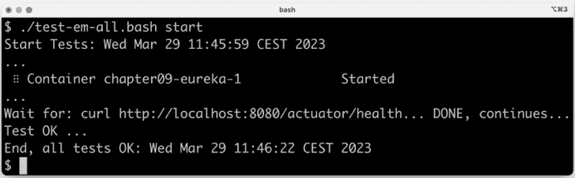

图 9.5：成功的测试输出

系统景观启动并运行后，我们可以开始测试如何增加一个微服务的实例数量。

## 扩展

运行以下命令来尝试扩展服务：

1.  启动两个额外的 `review` 微服务实例：

    ```java
    docker-compose up -d --scale review=3 
    ```

使用前面的命令，我们要求 Docker Compose 运行三个 `review` 服务实例。由于一个实例已经在运行，因此将启动两个新实例。

1.  一旦新实例启动并运行，请浏览到 `http://localhost:8761/` 并预期如下：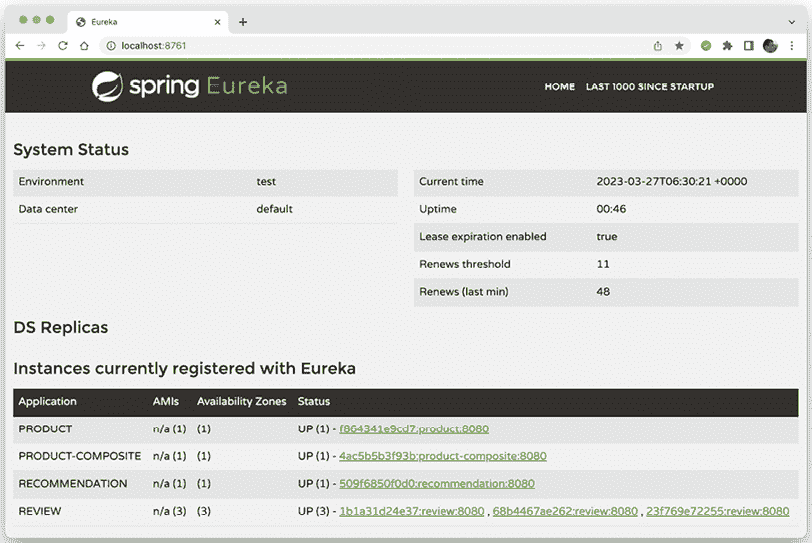

    图 9.6：查看已注册到 Eureka 的实例

    验证你能否在 Netflix Eureka 网页 UI 中看到三个 `review` 实例，如前面的截图所示。

1.  知道新实例何时启动并运行的一种方法就是运行以下命令：

    ```java
    docker-compose logs review | grep Started 
    ```

    预期输出如下：

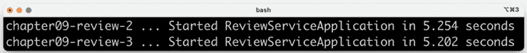

图 9.7：新的 review 实例

1.  我们还可以使用 Eureka 服务公开的 REST API。要获取实例 ID 列表，我们可以发出一个 `curl` 命令，如下所示：

    ```java
    curl -H "accept:application/json" localhost:8761/eureka/apps -s | jq -r .applications.application[].instance[].instanceId 
    ```

    预期将收到类似以下响应：

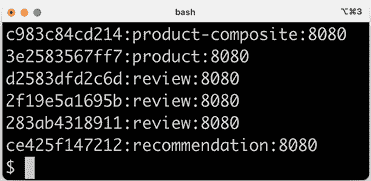

图 9.8：微服务实例 ID 列表

1.  如果你查看测试脚本 `test-em-all.bash`，你会找到新的测试，以验证我们能否到达 Eureka 的 REST API，并且它报告了四个实例：

    ```java
    # Verify access to Eureka and that all four microservices are # registered in Eureka
    assertCurl 200 "curl -H "accept:application/json" $HOST:8761/eureka/apps -s"
    assertEqual 4 $(echo $RESPONSE | jq ".applications.application | length") 
    ```

1.  现在我们已经启动并运行了所有实例，让我们通过发送一些请求并关注响应中 `review` 服务的地址来尝试客户端负载均衡器，如下所示：

    ```java
    curl localhost:8080/product-composite/1 -s | jq -r .serviceAddresses.rev 
    ```

    预期将收到类似以下响应：

    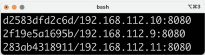

    图 9.9：Review 服务地址

    注意，每次响应中 `review` 服务的地址都会改变；负载均衡器使用轮询逻辑逐个调用可用的 `review` 实例！

1.  我们还可以使用以下命令查看 `review` 实例的日志记录：

    ```java
    docker-compose logs review | grep "Response size" 
    ```

你将看到类似以下输出的内容：

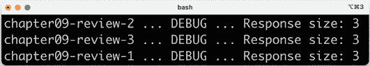

图 9.10：Review 实例日志记录

在前面的输出中，我们可以看到三个 review 微服务实例，`review_2`、`review_3` 和 `review_1` 如何依次响应请求。

我们还可以尝试缩小实例，我们将在下一步进行。

## 缩放

让我们看看如果我们丢失一个 `review` 微服务实例会发生什么。运行以下命令：

1.  我们可以通过运行以下命令来模拟一个实例意外停止：

    ```java
    docker-compose up -d --scale review=2 
    ```

1.  在 `review` 实例关闭后，会有一个短暂的时间段，在此期间调用 API 可能会失败。这是由于关于丢失实例的信息传播到客户端、`product-composite` 服务所需的时间造成的。在此时间段内，客户端负载均衡器可能会选择不再存在的实例。为了防止这种情况发生，可以使用诸如超时和重试等弹性机制。在 *第十三章*，*使用 Resilience4j 提高弹性* 中，我们将看到如何应用这些机制。现在，让我们在我们的 `curl` 命令上指定一个超时，使用 `-m 2` 选项指定我们最多等待两秒钟的响应：

    ```java
    curl localhost:8080/product-composite/1 -m 2 
    ```

    如果发生超时，即客户端负载均衡器尝试调用一个不再存在的实例，那么从 `curl` 预期得到的响应如下：

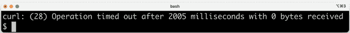

图 9.11：发生超时时 curl 的响应

1.  此外，我们还应期望从剩余的两个实例得到正常响应；也就是说，`serviceAddresses.rev` 字段应包含两个实例的地址，如下所示：

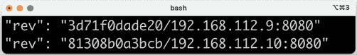

图 9.12：剩余实例的正常响应

在前面的示例输出中，我们可以看到报告了两个不同的容器名称和 IP 地址。这意味着请求是由剩余的两个微服务实例处理的。

在尝试了微服务实例的缩放之后，我们可以尝试一些更具破坏性的操作：停止 Eureka 服务器并查看当发现服务器暂时不可用时会发生什么。

## 使用 Eureka 服务器进行破坏性测试

让我们在 Eureka 服务器上制造一些混乱，看看系统景观是如何处理它的！

首先，如果我们崩溃 Eureka 服务器会发生什么？

只要客户端在停止之前已从 Eureka 服务器读取有关可用微服务实例的信息，客户端就会没事，因为它们已经将信息本地缓存。然而，新实例不会提供给客户端，并且如果任何运行中的实例被终止，它们也不会得到通知。因此，调用不再运行的实例将导致失败。

让我们试试这个！

### 停止 Eureka 服务器

要模拟 Eureka 服务器崩溃，请按照以下步骤操作：

1.  首先，停止 Eureka 服务器并保持两个 `review` 实例运行：

    ```java
    docker-compose up -d --scale review=2 --scale eureka=0 
    ```

1.  尝试几次调用 API 并提取 `review` 服务的服务地址：

    ```java
    curl localhost:8080/product-composite/1 -s | jq -r .serviceAddresses.rev 
    ```

1.  响应将——就像我们在停止 Eureka 服务器之前一样——包含两个 `review` 实例的地址，如下所示：

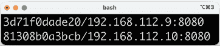

图 9.13：包含两个 review 实例地址的响应

这表明客户端即使 Eureka 服务器不再运行，也可以调用现有实例。

### 启动产品服务的额外实例

作为对崩溃的 Eureka 服务器影响的最终测试，让我们看看如果我们启动 `product` 微服务的新实例会发生什么。执行以下步骤：

1.  让我们尝试启动 `product` 服务的新的实例：

    ```java
    docker-compose up -d --scale review=2 --scale eureka=0 --scale product=2 
    ```

1.  调用 API 几次，并使用以下命令提取 `product` 服务的地址：

    ```java
    curl localhost:8080/product-composite/1 -s | jq -r .serviceAddresses.pro 
    ```

由于没有 Eureka 服务器运行，客户端将不会通知新的 `product` 实例，因此所有调用都将转到第一个实例，如下例所示：

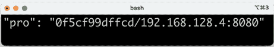

图 9.14：仅第一个产品实例的地址

我们已经看到了没有 Netflix Eureka 服务器运行的一些最重要的方面。让我们通过再次启动 Netflix Eureka 服务器来总结破坏性测试部分，并看看系统景观如何处理自我修复，即弹性。

# 再次启动 Eureka 服务器

在本节中，我们将通过再次启动 Eureka 服务器来总结破坏性测试。我们还将验证系统景观是否能够自我修复，这意味着 `product` 微服务的新实例将注册到 Netflix Eureka 服务器，并且客户端将通过 Eureka 服务器进行更新。执行以下步骤：

1.  使用以下命令启动 Eureka 服务器：

    ```java
    docker-compose up -d --scale review=1 --scale eureka=1 --scale product=2 
    ```

1.  使用以下命令调用几次以提取产品和 `review` 服务的地址：

    ```java
    curl localhost:8080/product-composite/1 -s | jq -r .serviceAddresses 
    ```

    验证以下情况发生：

    +   所有调用都转到剩余的 `review` 实例，这表明客户端已经检测到第二个 `review` 实例已消失。

    +   对 `product` 服务的调用在两个 `product` 实例之间进行负载均衡，这表明客户端已经检测到有两个 `product` 实例可用。

    响应应包含 `review` 实例的相同地址和两个不同的 `product` 实例地址，如下两个示例所示：

    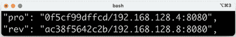

    图 9.15：产品和评论地址

    这是第二个响应：

    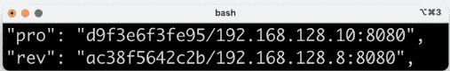

    图 9.16：产品和评论地址

    IP 地址 `192.168.128.4` 和 `192.168.128.10` 属于两个 `product` 实例。`192.168.128.8` 是唯一剩余的 `review` 实例的 IP 地址。

    总结来说，Eureka 服务器提供了一个非常健壮和弹性的服务发现实现。如果需要更高的可用性，可以启动多个 Eureka 服务器，并配置它们相互通信。有关如何设置多个 Eureka 服务器的详细信息，请参阅 Spring Cloud 文档：[`docs.spring.io/spring-cloud-netflix/docs/current/reference/html/#spring-cloud-eureka-server-peer-awareness`](https://docs.spring.io/spring-cloud-netflix/docs/current/reference/html/#spring-cloud-eureka-server-peer-awareness)。

1.  最后，使用以下命令关闭系统环境：

    ```java
    docker-compose down 
    ```

这完成了对服务发现服务器 Netflix Eureka 的测试，我们学习了如何扩展和缩减微服务实例，以及如果 Netflix Eureka 服务器崩溃后再次上线会发生什么。

# 总结

在本章中，我们学习了如何使用 Netflix Eureka 进行服务发现。首先，我们探讨了简单基于 DNS 的服务发现解决方案的不足，以及一个健壮和弹性的服务发现解决方案必须能够处理挑战。

Netflix Eureka 是一个非常强大的服务发现解决方案，它提供了健壮、弹性和容错运行时特性。然而，正确配置可能具有挑战性，特别是为了提供流畅的开发者体验。使用 Spring Cloud，设置 Netflix Eureka 服务器和适配基于 Spring Boot 的微服务变得容易，这样它们就可以在启动时将自己注册到 Eureka，并且当作为其他微服务的客户端时，可以跟踪可用的微服务实例。

在设置了服务发现服务器之后，是时候看看我们如何使用 Spring Cloud Gateway 作为边缘服务器来处理外部流量了。翻到下一章，看看如何操作！

# 问题

1.  要将使用 Spring Initializr 创建的 Spring Boot 应用程序转换为完整的 Netflix Eureka 服务器，需要什么？

1.  要使基于 Spring Boot 的微服务自动注册为 Netflix Eureka 的启动服务，需要什么？

1.  要使基于 Spring Boot 的微服务能够调用在 Netflix Eureka 服务器中注册的另一个微服务，需要什么？

1.  假设你已经有一个 Netflix Eureka 服务器正在运行，以及一个微服务 *A* 的实例和两个微服务 *B* 的实例。所有微服务实例都向 Netflix Eureka 服务器注册自己。微服务 *A* 根据从 Eureka 服务器获得的信息向微服务 *B* 发送 HTTP 请求。如果以下情况发生，会发生什么？

    1.  Netflix Eureka 服务器崩溃

    1.  微服务 *B* 的一个实例崩溃

    1.  一个新的微服务 *A* 实例启动

    1.  一个新的微服务 *B* 实例启动

    1.  Netflix Eureka 服务器再次启动
