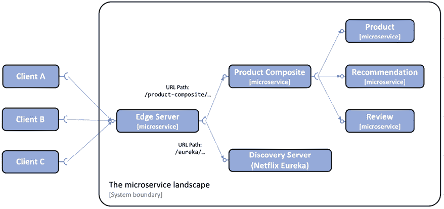
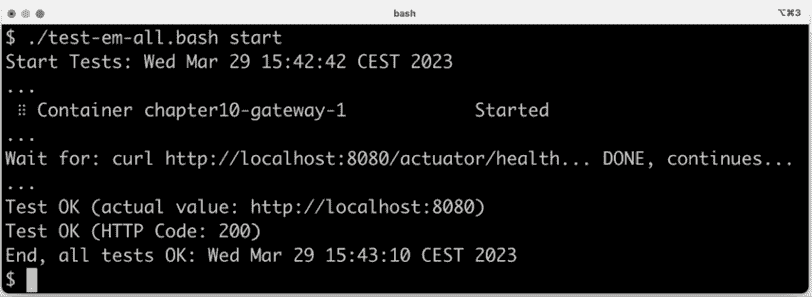
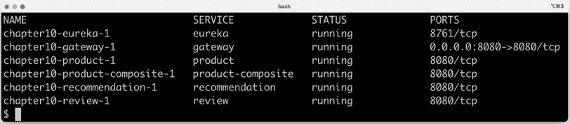
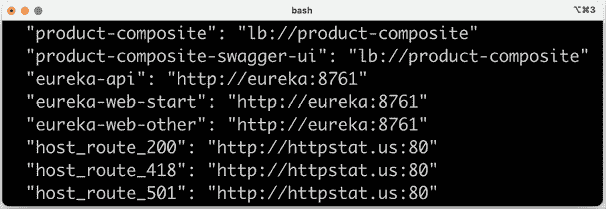
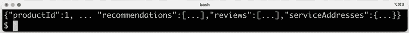
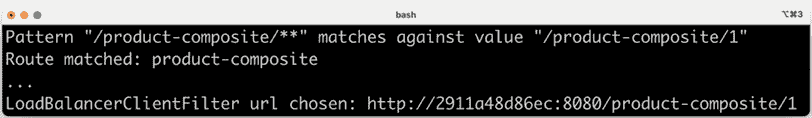
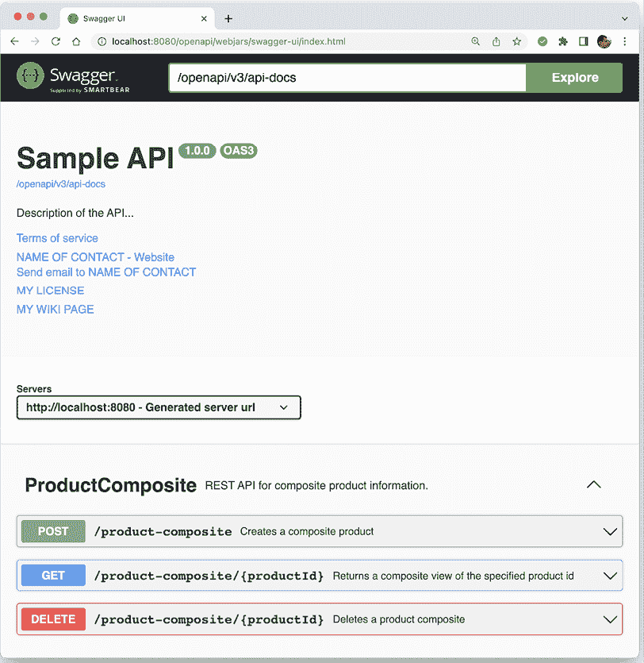
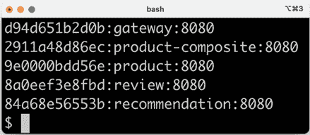
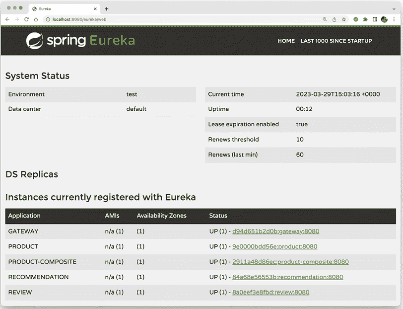

# 10

# 使用 Spring Cloud Gateway 隐藏微服务背后的边缘服务器

在本章中，我们将学习如何使用 Spring Cloud Gateway 作为边缘服务器，以控制从我们的基于微服务系统景观中公开的 API。我们将看到具有公共 API 的微服务如何通过边缘服务器从外部访问，而具有私有 API 的微服务仅从微服务景观的内部访问。在我们的系统景观中，这意味着产品组合服务和发现服务器 Netflix Eureka 将通过边缘服务器公开。三个核心服务`product`、`recommendation`和`review`将对外隐藏。

本章将涵盖以下主题：

+   将边缘服务器添加到我们的系统景观中

+   设置 Spring Cloud Gateway，包括配置路由规则

+   尝试使用边缘服务器

# 技术要求

关于如何安装本书中使用的工具以及如何访问本书源代码的说明，请参阅：

+   *第二十一章*，*macOS 安装说明*

+   *第二十二章*，*使用 WSL 2 和 Ubuntu 的 Microsoft Windows 安装说明*

本章中的所有代码示例都来自`$BOOK_HOME/Chapter10`中的源代码。

如果您想查看对本章源代码所做的更改——即查看将 Spring Cloud Gateway 作为边缘服务器添加到微服务景观中所需的工作——您可以将其与*第九章*，*使用 Netflix Eureka 添加服务发现*的源代码进行比较。

您可以使用您喜欢的`diff`工具比较两个文件夹，`$BOOK_HOME/Chapter09`和`$BOOK_HOME/Chapter10`。

# 将边缘服务器添加到我们的系统景观中

在本节中，我们将看到边缘服务器是如何添加到系统景观中，以及它如何影响外部客户端访问微服务公开的公共 API 的方式。现在，所有传入的请求都将通过边缘服务器路由，如下图所示：



图 10.1：添加边缘服务器

如前图所示，外部客户端将所有请求发送到边缘服务器。边缘服务器可以根据 URL 路径路由传入的请求。例如，以`/product-composite/`开头的请求被路由到产品组合微服务，而以`/eureka/`开头的请求根据 Netflix Eureka 被路由到发现服务器。

要使发现服务与 Netflix Eureka 一起工作，我们不需要通过边缘服务器公开它。内部服务将直接与 Netflix Eureka 通信。公开它的原因是为了使操作员能够检查 Netflix Eureka 的状态，并查看当前在发现服务中注册的实例。

在 *第九章*，*使用 Netflix Eureka 添加服务发现* 中，我们暴露了 `product-composite` 服务和发现服务器 Netflix Eureka 的外部。当我们在本章介绍边缘服务器时，这种情况将不再存在。这是通过从 Docker Compose 文件中删除以下两个服务的端口声明来实现的：

```java
 product-composite:
    build: microservices/product-composite-service
    ports:
      - "8080:8080"
  eureka:
    build: spring-cloud/eureka-server
    ports:
      - "8761:8761" 
```

在引入边缘服务器后，我们将在下一节学习如何基于 Spring Cloud Gateway 设置边缘服务器。

# 设置 Spring Cloud Gateway

将 Spring Cloud Gateway 设置为边缘服务器非常简单，可以按照以下步骤进行：

1.  使用 Spring Initializr 创建一个 Spring Boot 项目，如 *第三章*，*创建一组协作微服务* 中所述 – 请参阅 *使用 Spring Initializr 生成骨架代码* 部分。

1.  添加对 `spring-cloud-starter-gateway` 的依赖。

1.  为了能够通过 Netflix Eureka 定位微服务实例，还需要添加 `spring-cloud-starter-netflix-eureka-client` 依赖。

1.  将边缘服务器项目添加到通用构建文件 `settings.gradle` 中：

    ```java
    include ':spring-cloud:gateway' 
    ```

1.  添加一个与微服务相同的 `Dockerfile`；请参阅 `$BOOK_HOME/Chapter10/microservices` 文件夹中的 `Dockerfile` 内容。

1.  将边缘服务器添加到我们的三个 Docker Compose 文件中：

    ```java
    gateway:
      environment:
        - SPRING_PROFILES_ACTIVE=docker
      build: spring-cloud/gateway
      mem_limit: 512m
      ports:
        - "8080:8080" 
    ```

    从前面的代码中，我们可以看到边缘服务器将端口 `8080` 暴露给 Docker 引擎的外部。为了控制所需的内存量，对边缘服务器应用了一个 `512` MB 的内存限制，这与我们对其他微服务所做的方式相同。

1.  由于边缘服务器将处理所有传入流量，我们将组合健康检查从产品组合服务移动到边缘服务器。这将在下一节 *添加组合健康检查* 中描述。

1.  添加路由规则和更多配置。由于有很多配置项，因此它们在下面的单独部分 *配置 Spring Cloud Gateway* 中处理。

您可以在 `$BOOK_HOME/Chapter10/spring-cloud/gateway` 中找到 Spring Cloud Gateway 的源代码。

## 添加组合健康检查

由于已经设置了边缘服务器，外部健康检查请求也必须通过边缘服务器进行。因此，检查所有微服务状态的组合健康检查已从 `product-composite` 服务移动到边缘服务器。请参阅 *第七章*，*开发反应式微服务* – 请参阅 *添加健康 API* 部分以获取组合健康检查的实现细节。

以下内容已添加到边缘服务器中：

1.  已添加 `HealthCheckConfiguration` 类，它声明了反应式健康贡献者：

    ```java
     @Bean
      ReactiveHealthContributor healthcheckMicroservices() {
        final Map<String, ReactiveHealthIndicator> registry = 
          new LinkedHashMap<>();
        registry.put("product",           () -> 
          getHealth("http://product"));
        registry.put("recommendation",    () -> 
          getHealth("http://recommendation"));
        registry.put("review",            () -> 
          getHealth("http://review"));
        registry.put("product-composite", () -> 
          getHealth("http://product-composite"));
        return CompositeReactiveHealthContributor.fromMap(registry);
      }
      private Mono<Health> getHealth(String baseUrl) {
        String url = baseUrl + "/actuator/health";
        LOG.debug("Setting up a call to the Health API on URL: {}", 
          url);
        return webClient.get().uri(url).retrieve()
          .bodyToMono(String.class)
          .map(s -> new Health.Builder().up().build())
          .onErrorResume(ex -> 
          Mono.just(new Health.Builder().down(ex).build()))
          .log(LOG.getName(), FINE);
      } 
    ```

    从前面的代码中，我们可以看到已为 `product-composite` 服务添加了健康检查，而不是在 *第七章*，*开发反应式微服务* 中使用的健康检查！

1.  主应用程序类 `GatewayApplication` 声明了一个 `WebClient.Builder` 实例，该实例将被用于健康指标的实现，如下所示：

    ```java
     @Bean
      @LoadBalanced
      public WebClient.Builder loadBalancedWebClientBuilder() {
        return WebClient.builder();
      } 
    ```

从前面的源代码中，我们可以看到 `WebClient.builder` 被注解为 `@LoadBalanced`，这使得它知道在发现服务器 Netflix Eureka 中注册的微服务实例。有关更多详细信息，请参阅第九章 *使用 Netflix Eureka 添加服务发现* 中的 *Spring Cloud 中 Netflix Eureka 的服务发现* 部分。

对于边缘服务器，我们已设置复合健康检查，现在可以查看需要为 Spring Cloud Gateway 设置的配置。

## 配置 Spring Cloud Gateway

当涉及到配置 Spring Cloud Gateway 时，最重要的是设置路由规则。我们还需要在配置中设置一些其他事项：

1.  由于 Spring Cloud Gateway 将使用 Netflix Eureka 来查找它将路由流量到的微服务，因此它必须像第九章 *使用 Netflix Eureka 添加服务发现* 中所述的那样配置为 Eureka 客户端 – 请参阅 *配置 Eureka 服务器客户端* 部分。

1.  按照第七章 *开发响应式微服务* 中所述配置 Spring Boot Actuator 以用于开发，请参阅 *添加健康 API* 部分：

    ```java
    management.endpoint.health.show-details: "ALWAYS"
    management.endpoints.web.exposure.include: "*" 
    ```

1.  配置日志级别，以便我们可以看到 Spring Cloud Gateway 内部处理中有趣部分的日志消息，例如，它如何决定将传入的请求路由到何处：

    ```java
    logging:
      level:
        root: INFO
        org.springframework.cloud.gateway.route.
            RouteDefinitionRouteLocator: INFO
        org.springframework.cloud.gateway: TRACE 
    ```

对于完整的源代码，请参阅配置文件 `src/main/resources/application.yml`。

### 路由规则

设置路由规则可以通过两种方式完成：程序化地使用 Java DSL，或通过配置。在规则存储在外部存储（如数据库）或运行时提供（例如，通过 RESTful API 或发送到网关的消息）的情况下，使用 Java DSL 程序化设置路由规则可能很有用。在更静态的使用场景中，我发现将路由声明在配置文件 `src/main/resources/application.yml` 中更为方便。将路由规则与 Java 代码分离，使得无需部署微服务的新版本即可更新路由规则。

路由由以下定义：

+   **断言**，根据传入的 HTTP 请求中的信息选择路由

+   **过滤器**，可以修改请求和/或响应

+   一个 **目标 URI**，它描述了请求应发送到何处

+   一个 **ID**，即路由的名称

对于可用的断言和过滤器的完整列表，请参阅参考文档：[`cloud.spring.io/spring-cloud-gateway/single/spring-cloud-gateway.html`](https://cloud.spring.io/spring-cloud-gateway/single/spring-cloud-gateway.html)。

在以下小节中，我们将首先学习如何将请求路由到 `product-composite` 服 务和 Eureka 服 务器。之后，我们将看到如何使用谓词和过滤器，尽管它们在此书中其他地方没有使用。

#### 路由请求到 product-composite API

例如，如果我们想将 URL 路径以 `/product-composite/` 开头的传入请求路由到我们的 `product-composite` 服 务，我们可以指定一个如下的路由规则：

```java
spring.cloud.gateway.routes:
- id: product-composite
  uri: lb://product-composite
  predicates:
  - Path=/product-composite/** 
```

从前面的代码中需要注意的一些点：

+   `id: product-composite`：路由的名称是 `product-composite`。

+   `uri: lb://product-composite`：如果路由被其谓词选中，请求将被路由到在发现服务 Netflix Eureka 中命名为 `product-composite` 的服务。协议 `lb://` 用于指示 Spring Cloud Gateway 使用客户端负载均衡器在发现服务中查找目标。

+   `predicates: - Path=/product-composite/**` 用于指定此路由应匹配哪些请求。`**` 匹配路径中的零个或多个元素。

为了能够将请求路由到第五章“使用 OpenAPI 添加 API 描述”中设置的 **Swagger UI**，向 `product-composite` 服 务添加了额外的路由：

```java
- id: product-composite-swagger-ui
  uri: lb://product-composite
  predicates:
  - Path=/openapi/** 
```

以 `/openapi/` 开头的 URI 开始发送到边缘服务器的请求将被路由到 `product-composite` 服 务。

当 Swagger UI 在边缘服务器后面呈现时，它必须能够呈现包含正确服务器 URL 的 API 的 OpenAPI 规范 – 即边缘服务器的 URL 而不是 `product-composite` 服务的 URL。为了使 `product-composite` 服 务能够在 OpenAPI 规范中生成正确的服务器 URL，已经向 `product-composite` 服 务添加了以下配置：

```java
server.forward-headers-strategy: framework 
```

更多详情，请参阅 [`springdoc.org/index.html#how-can-i-deploy-springdoc-openapi-ui-behind-a-reverse-proxy`](https://springdoc.org/index.html#how-can-i-deploy-springdoc-openapi-ui-behind-a-reverse-proxy)。

为了验证 OpenAPI 规范中已设置正确的服务器 URL，已在测试脚本 `test-em-all.bash` 中添加了以下测试：

```java
 assertCurl 200 "curl -s  http://$HOST:$PORT/
    openapi/v3/api-docs"
  assertEqual "http://$HOST:$PORT" "$(echo $RESPONSE 
    | jq -r .servers[].url)" 
```

#### 路由请求到 Eureka 服务器 API 和网页

Eureka 向其客户端公开了 API 和网页。为了在 Eureka 中提供 API 和网页之间的清晰分离，我们将设置如下路由：

+   以 `/eureka/api/` 开头的路径发送到边缘服务器的请求应被视为对 Eureka API 的调用。

+   以 `/eureka/web/` 开头的路径发送到边缘服务器的请求应被视为对 Eureka 网页的调用。

API 请求将被路由到 `http://${app.eureka-server}:8761/eureka`。Eureka API 的路由规则看起来像这样：

```java
- id: eureka-api
  uri: http://${app.eureka-server}:8761
  predicates:
  - Path=/eureka/api/{segment}
  filters:
  - SetPath=/eureka/{segment} 
```

`Path` 值中的 `{segment}` 部分与路径中的零个或多个元素匹配，并将用于替换 `SetPath` 值中的 `{segment}` 部分。

网页请求将被路由到 `http://${app.eureka-server}:8761`。网页将加载多个网络资源，例如 `.js`、`.css` 和 `.png` 文件。这些请求将被路由到 `http://${app.eureka-server}:8761/eureka`。Eureka 网页的路由规则如下：

```java
- id: eureka-web-start
  uri: http://${app.eureka-server}:8761
  predicates:
  - Path=/eureka/web
  filters:
  - SetPath=/
- id: eureka-web-other
  uri: http://${app.eureka-server}:8761
  predicates:
  - Path=/eureka/** 
```

从前面的配置中，我们可以得出以下结论。`${app.eureka-server}` 属性通过 Spring 的属性机制解析，取决于激活了哪个 Spring 配置文件：

1.  当在不使用 Docker 的情况下在同一主机上运行服务，例如，出于调试目的时，该属性将使用 `default` 配置文件转换为 `localhost`。

1.  当以 Docker 容器运行服务时，Netflix Eureka 服务器将在一个名为 `eureka` 的容器中运行。因此，该属性将使用 `docker` 配置文件转换为 `eureka`。

定义此翻译的 `application.yml` 文件中的相关部分如下：

```java
app.eureka-server: localhost
---
spring.config.activate.on-profile: docker
app.eureka-server: eureka 
```

通过这种方式，我们已经看到了如何将请求路由到 `product-composite` 和 Eureka 服务器。作为最后一步，让我们看看如何在 Spring Cloud Gateway 中使用谓词和过滤器。

#### 使用谓词和过滤器路由请求

要了解 Spring Cloud Gateway 中路由功能的一些更多信息，我们将尝试 **基于主机的路由**，其中 Spring Cloud Gateway 使用传入请求的主机名来确定请求的路由位置。我们将使用我最喜欢的网站来测试 HTTP 状态码：[`httpstat.us/`](http://httpstat.us/)。

对 `http://httpstat.us/${CODE}` 的调用简单地返回一个包含 `${CODE}` HTTP 状态码和响应体的响应，响应体中也包含 HTTP 状态码和相应的描述性文本。例如，请参阅以下 `curl` 命令：

```java
curl http://httpstat.us/200 -i 
```

这将返回 HTTP 状态码 `200`，以及包含文本 `200 OK` 的响应体。

假设我们想要将 `http://${hostname}:8080/headerrouting` 的调用路由如下：

+   对 `i.feel.lucky` 主机的调用应返回 `200 OK`

+   对 `im.a.teapot` 主机的调用应返回 `418 I'm a teapot`

+   对所有其他主机名的调用应返回 `501 Not Implemented`

要在 Spring Cloud Gateway 中实现这些路由规则，我们可以使用 `Host` 路由谓词来选择具有特定主机名的请求，并使用 `SetPath` 过滤器在请求路径中设置所需的 HTTP 状态码。可以按照以下方式完成：

1.  要使对 `http://i.feel.lucky:8080/headerrouting` 的调用返回 `200 OK`，我们可以设置以下路由：

    ```java
    - id: host_route_200
      uri: http://httpstat.us
      predicates:
      - Host=i.feel.lucky:8080
      - Path=/headerrouting/**
      filters:
      - SetPath=/200 
    ```

1.  要使对 `http://im.a.teapot:8080/headerrouting` 的调用返回 `418 I'm a teapot`，我们可以设置以下路由：

    ```java
    - id: host_route_418
      uri: http://httpstat.us
      predicates:
      - Host=im.a.teapot:8080
      - Path=/headerrouting/**
      filters:
      - SetPath=/418 
    ```

1.  最后，为了使对所有其他主机名的调用返回 `501 Not Implemented`，我们可以设置以下路由：

    ```java
    - id: host_route_501
      uri: http://httpstat.us
      predicates:
      - Path=/headerrouting/**
      filters:
      - SetPath=/501 
    ```

好的，这需要相当多的配置，所以现在让我们来试一试！

# 尝试边缘服务器

要尝试边缘服务器，我们执行以下步骤：

1.  首先，使用以下命令构建 Docker 镜像：

    ```java
    cd $BOOK_HOME/Chapter10
    ./gradlew clean build && docker-compose build 
    ```

1.  接下来，在 Docker 中启动系统景观并使用以下命令运行常规测试：

    ```java
    ./test-em-all.bash start 
    ```

1.  预期输出类似于我们在前面的章节中看到的：



图 10.2：test-em-all.bash 的输出

1.  从日志输出中，注意倒数第二个测试结果，`http://localhost:8080`。这是验证 Swagger UI 的 OpenAPI 规范中服务器 URL 是否正确重写为边缘服务器 URL 的测试输出。

当系统景观，包括边缘服务器，启动并运行时，让我们探索以下主题：

+   检查边缘服务器在 Docker 引擎中运行的系统景观之外暴露的内容。

+   尝试以下最常用的路由规则：

    +   使用基于 URL 的路由来通过边缘服务器调用我们的 API

    +   使用基于 URL 的路由来通过边缘服务器调用 Swagger UI

    +   使用基于 URL 的路由来通过边缘服务器调用 Netflix Eureka，同时使用其 API 和基于 Web 的 UI

    +   使用基于头的路由来查看我们如何根据请求中的主机名来路由请求

## 检查 Docker 引擎外部暴露的内容

要了解边缘服务器向系统景观外部暴露了什么，请执行以下步骤：

1.  使用`docker-compose ps`命令查看我们的服务暴露了哪些端口：

    ```java
    docker-compose ps gateway eureka product-composite product recommendation review 
    ```

1.  如以下输出所示，只有边缘服务器（命名为`gateway`）在其 Docker 引擎外部暴露了其端口（`8080`）：



图 10.3：docker-compose ps 的输出

1.  如果我们想查看边缘服务器设置了哪些路由，可以使用`/actuator/gateway/routes` API。这个 API 的响应相当冗长。为了限制响应只包含我们感兴趣的信息，我们可以应用一个`jq`过滤器。在以下示例中，选择了路由的`id`和请求将被路由到的`uri`：

    ```java
    curl localhost:8080/actuator/gateway/routes -s | jq '.[] | {"\(.route_id)": "\(.uri)"}' | grep -v '{\|}' 
    ```

1.  此命令将响应如下：



图 10.4：Spring Cloud Gateway 路由规则

这为我们提供了边缘服务器中实际配置的路由的良好概述。现在，让我们尝试这些路由！

## 尝试路由规则

在本节中，我们将尝试边缘服务器及其向系统景观外部暴露的路由。让我们首先调用`product-composite` API 及其 Swagger UI。然后，我们将调用 Eureka API 并访问其网页。最后，我们将通过测试基于主机名的路由来结束。

### 通过边缘服务器调用产品组合 API

让我们执行以下步骤来通过边缘服务器调用产品组合 API：

1.  为了能够看到边缘服务器中正在发生的事情，我们可以跟随其日志输出：

    ```java
    docker-compose logs -f --tail=0 gateway 
    ```

1.  现在，在另一个终端窗口中，通过边缘服务器调用`product-composite` API：

    ```java
    curl http://localhost:8080/product-composite/1 
    ```

1.  预期从`product-composite` API 获得正常类型的响应：



图 10.5：检索产品 ID 为 1 的复合产品的输出

1.  我们应该在日志输出中找到以下信息：



图 10.6：边缘服务器的日志输出

1.  从日志输出中，我们可以看到基于我们在配置中指定的断言的模式匹配，并且我们可以看到边缘服务器从发现服务器中的可用实例中选择了哪个微服务实例——在这种情况下，它将请求转发到`http://b8013440aea0:8080/product-composite/1`。

### 通过边缘服务器调用 Swagger UI

要验证我们是否可以通过边缘服务器访问到第五章中介绍的 Swagger UI，即使用 OpenAPI 添加 API 描述，请在网络浏览器中打开 URL `http://localhost:8080/openapi/swagger-ui.html`。生成的 Swagger UI 页面应如下所示：



图 10.7：通过边缘服务器，网关的 Swagger UI

注意服务器 URL：`http://localhost:8080`；这意味着 Swagger UI 返回的 OpenAPI 规范中已经替换了`product-composite` API 自己的 URL，即`http://product-service:8080/`。

如果你想的话，你可以在 Swagger UI 中实际尝试`product-composite` API，就像我们在第五章中做的那样，即使用 OpenAPI 添加 API 描述！

### 通过边缘服务器调用 Eureka

要通过边缘服务器调用 Eureka，请执行以下步骤：

1.  首先，通过边缘服务器调用 Eureka API，以查看当前在发现服务器中注册的实例：

    ```java
    curl -H "accept:application/json" \
    localhost:8080/eureka/api/apps -s | \
    jq -r .applications.application[].instance[].instanceId 
    ```

1.  预期响应将与以下类似：



图 10.8：Eureka 在 REST 调用中列出边缘服务器，网关

注意，边缘服务器（命名为`gateway`）也存在于响应中。

1.  接下来，使用 URL `http://localhost:8080/eureka/web`在网页浏览器中打开 Eureka 网页：



图 10.9：Eureka 在 Web UI 中列出边缘服务器，网关

1.  从前面的屏幕截图，我们可以看到 Eureka 网页报告了与上一步 API 响应中相同的可用实例。

### 基于主机头的路由

让我们通过测试基于请求中使用的主机名配置的路由来结束，以查看正在使用的断言和过滤器！

通常，请求中的主机名会由 HTTP 客户端自动设置在 `Host` 头部。当在本地测试边缘服务器时，主机名将是 `localhost` – 这在测试基于主机名的路由时并不那么有用。然而，我们可以在调用 API 时通过指定 `Host` 头部中的另一个主机名来作弊。让我们看看如何做到这一点：

1.  要调用 `i.feel.lucky` 主机名，请使用以下代码：

    ```java
    curl http://localhost:8080/headerrouting -H "Host: i.feel.lucky:8080" 
    ```

1.  预期响应 `200 OK`。

1.  对于主机名 `im.a.teapot`，请使用以下命令：

    ```java
    curl http://localhost:8080/headerrouting -H "Host: im.a.teapot:8080" 
    ```

1.  预期响应 `418 I'm a teapot`。

1.  最后，如果不指定任何 `Host` 头部，请使用 `localhost` 作为 `Host` 头部：

    ```java
    curl http://localhost:8080/headerrouting 
    ```

1.  预期响应 `501 Not Implemented`。

如果我们将 `i.feel.lucky` 和 `im.a.teapot` 添加到 `/etc/hosts` 文件中，并指定它们应转换为与 `localhost` 相同的 IP 地址，即 `127.0.0.1`，我们也可以将它们用作请求中的真实主机名。为此，请执行以下步骤：

1.  运行以下命令向 `/etc/hosts` 文件添加一行包含所需信息：

    ```java
    sudo bash -c "echo '127.0.0.1 i.feel.lucky im.a.teapot' >> /etc/hosts" 
    ```

1.  现在，我们可以根据主机名执行相同的路由，但无需指定 `Host` 头部。通过运行以下命令来尝试：

    ```java
    curl http://i.feel.lucky:8080/headerrouting
    curl http://im.a.teapot:8080/headerrouting 
    ```

1.  预期与之前相同的响应，`200 OK` 和 `418 I'm a teapot`。

1.  通过以下命令关闭系统景观来结束测试：

    ```java
    docker-compose down 
    ```

1.  清理 `/etc/hosts` 文件中为主机名 `i.feel.lucky` 和 `im.a.teapot` 添加的 DNS 名称转换。编辑 `/etc/hosts` 文件并删除我们添加的行：

    ```java
    127.0.0.1 i.feel.lucky im.a.teapot 
    ```

这些对边缘服务器路由能力的测试结束了本章。

# 摘要

在本章中，我们看到了如何使用 Spring Cloud Gateway 作为边缘服务器来控制哪些服务可以从系统景观外部调用。基于断言、过滤器以及目标 URI，我们可以非常灵活地定义路由规则。如果我们想的话，我们可以配置 Spring Cloud Gateway 使用发现服务，如 Netflix Eureka 来查找目标微服务实例。

我们仍需要解决的一个重要问题是，我们如何防止对边缘服务器暴露的 API 的未授权访问，以及我们如何防止第三方拦截流量。

在下一章中，我们将看到如何使用标准安全机制，如 HTTPS、OAuth 和 OpenID Connect 来保护边缘服务器的访问。

# 问题

1.  用于构建 Spring Cloud Gateway 路由规则中的元素被称为什么？

1.  这些上述元素用于什么？

1.  我们如何指导 Spring Cloud Gateway 通过发现服务，如 Netflix Eureka 来定位微服务实例？

1.  在 Docker 环境中，我们如何确保外部 HTTP 请求只能到达边缘服务器？

1.  我们如何更改路由规则，以便边缘服务器接受对 `http://$HOST:$PORT/api/product` URL 上的 `product-composite` 服务的调用，而不是当前使用的 `http://$HOST:$PORT/product-composite`？

# 加入我们的 Discord 社区

加入我们的 Discord 空间，与作者和其他读者进行讨论：

[`packt.link/SpringBoot3e`](https://packt.link/SpringBoot3e)


