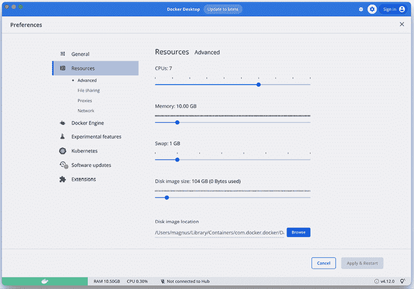
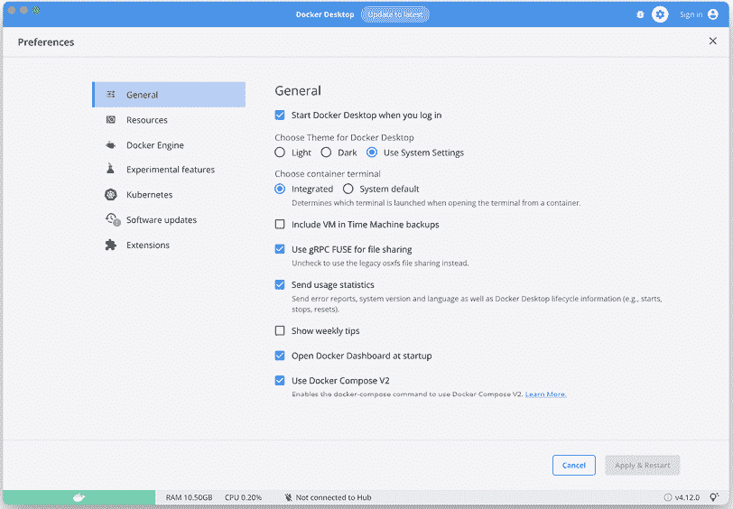
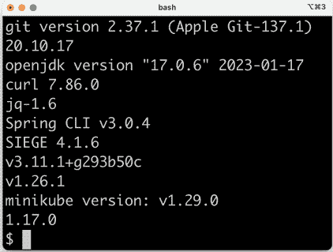

# 第二十一章：macOS 安装说明

在本章中，我们将学习如何设置在 macOS 上运行本书中描述的命令所需的工具。我们还将学习如何获取本书源代码的访问权限。

本章将涵盖以下主题：

+   技术要求

+   安装工具

+   访问源代码

如果您使用的是 Windows PC，应遵循*第二十二章*中关于使用 WSL 2 和 Ubuntu 的 Microsoft Windows 安装说明。

# 技术要求

本书中的所有命令都在配备 macOS Ventura 的 MacBook Pro 上运行，并使用**bash**，一个命令行 shell。所有命令都在基于 Intel 和 Apple 硅的 MacBook Pro 上进行了验证。

如果您使用的是其他 shell，例如**zsh**，我建议在运行本书中的命令之前使用以下命令切换到 bash：

```java
/bin/bash 
```

# 安装工具

在本节中，我们将学习如何安装和配置工具。以下是我们将安装的工具列表，如有需要，附有下载和安装的更多信息链接：

+   **Git**: [`git-scm.com/downloads`](https://git-scm.com/downloads)

+   **Docker Desktop for Mac**: [`hub.docker.com/editions/community/docker-ce-desktop-mac/`](https://hub.docker.com/editions/community/docker-ce-desktop-mac/)

+   **Java**: [`adoptium.net/installation`](https://adoptium.net/installation)

+   **curl**: [`curl.haxx.se/download.html`](https://curl.haxx.se/download.html)

+   **jq**: [`stedolan.github.io/jq/download/`](https://stedolan.github.io/jq/download/)

+   **Spring Boot CLI**: [`docs.spring.io/spring-boot/docs/3.0.4/reference/html/getting-started.html#getting-started.installing.cli`](https://docs.spring.io/spring-boot/docs/3.0.4/reference/html/getting-started.html#getting-started.installing.cli)

+   **Siege**: [`github.com/JoeDog/siege#where-is-it`](https://github.com/JoeDog/siege#where-is-it)

+   **Helm**: [`helm.sh/docs/intro/install/`](https://helm.sh/docs/intro/install/)

+   **kubectl**: [`kubernetes.io/docs/tasks/tools/install-kubectl-macos/`](https://kubernetes.io/docs/tasks/tools/install-kubectl-macos/)

+   **Minikube**: [`minikube.sigs.k8s.io/docs/start/`](https://minikube.sigs.k8s.io/docs/start/)

+   **Istioctl**: [`istio.io/latest/docs/setup/getting-started/#download`](https://istio.io/latest/docs/setup/getting-started/#download)

在编写本书时使用了以下版本：

+   **Git**: v2.37.1

+   **Docker Desktop for Mac**: v4.12.0

+   **Java**: v17.0.6

+   **curl**: v7.86.0

+   **jq**: v1.6

+   **Spring Boot CLI**: v3.0.4

+   **Siege**: v4.1.6

+   **Helm**: v3.11.1

+   **kubectl**: v1.26.1

+   **Minikube**: v1.29.0

+   **Istioctl**: v1.17.0

大多数工具将使用**Homebrew**包管理器（[`brew.sh/`](https://brew.sh/））安装，因此我们将首先安装 Homebrew。之后，我们将使用 Homebrew 安装大多数工具，并以安装剩余工具结束。

对于需要控制安装版本的工具——而不仅仅是安装最新版本——我发现 Homebrew 不足。当涉及到`minikube`、`kubectl`和`istioctl`时，安装相互兼容的版本非常重要，特别是当涉及到它们支持的 Kubernetes 版本时。简单地安装和升级到最新版本可能会导致`minikube`、Kubernetes 和 Istio 使用不兼容的版本。

关于 Istio 支持的 Kubernetes 版本，请参阅[https://istio.io/latest/about/supported-releases/#support-status-of-istio-releases](https://istio.io/latest/about/supported-releases/#support-status-of-istio-releases)。对于`minikube`，请参阅[`minikube.sigs.k8s.io/docs/handbook/config/#selecting-a-kubernetes-version`](https://minikube.sigs.k8s.io/docs/handbook/config/#selecting-a-kubernetes-version)。

## 安装 Homebrew

如果你还没有安装 Homebrew，可以使用以下命令安装：

```java
/bin/bash -c "$(curl -fsSL https://raw.githubusercontent.com/Homebrew/install/HEAD/install.sh)" 
```

安装 Homebrew 也会安装**Xcode**的命令行工具，如果它们尚未安装，可能需要一些时间。

使用以下命令验证 Homebrew 的安装：

```java
brew --version 
```

预期以下响应：

```java
Homebrew 4.0.1 
```

## 使用 Homebrew 安装工具

在 macOS 上，`curl`已经预安装，`git`是作为 Homebrew 所需的 Xcode 命令行工具的一部分安装的。可以使用以下命令使用 Homebrew 安装 Docker、Java、jq、Spring Boot CLI、Helm 和 Siege：

```java
brew tap spring-io/tap && \
brew tap homebrew/cask-versions && \brew install --cask temurin17 && \
brew install jq && \
brew install spring-boot && \
brew install helm && \
brew install siege && \
brew install --cask docker 
```

Brew 在基于 Intel 和 Apple 硅的 Mac 上安装工具到不同的文件夹中，分别在`/usr/local`和`/opt/homebrew`。

Java 使用名为**Eclipse Temurin**的发行版安装；更多信息请参阅[`adoptium.net/temurin/`](https://adoptium.net/temurin/)。

## 无需 Homebrew 安装工具

当涉及到安装`minikube`、`kubectl`和`istioctl`时，我们将避免使用`brew`以更好地控制我们安装的版本。在基于 Intel 和 Apple 硅的 Mac 上，命令看起来略有不同，所以我们将分别介绍它们。

### 在基于 Intel 的 Mac 上安装工具

要安装本书中使用的`kubectl`版本，请运行以下命令：

```java
curl -LO "https://dl.k8s.io/release/v1.26.1/bin/darwin/amd64/kubectl"
sudo install kubectl /usr/local/bin/kubectl
rm kubectl 
```

要安装本书中使用的`minikube`版本，请运行以下命令：

```java
curl -LO https://storage.googleapis.com/minikube/releases/v1.29.0/minikube-darwin-amd64
sudo install minikube-darwin-amd64 /usr/local/bin/minikube
rm minikube-darwin-amd64 
```

要安装本书中使用的`istioctl`版本，请运行以下命令：

```java
curl -L https://istio.io/downloadIstio | ISTIO_VERSION=1.17.0 TARGET_ARCH=x86_64 sh -
sudo install istio-1.17.0/bin/istioctl /usr/local/bin/istioctl
rm -r istio-1.17.0 
```

### 在基于 Apple 硅的 Mac 上安装工具

要安装本书中使用的`kubectl`版本，请运行以下命令：

```java
curl -LO "https://dl.k8s.io/release/v1.26.1/bin/darwin/arm64/kubectl"
sudo install kubectl /usr/local/bin/kubectl
rm kubectl 
```

要安装本书中使用的`minikube`版本，请运行以下命令：

```java
curl -LO https://storage.googleapis.com/minikube/releases/v1.29.0/minikube-darwin-arm64
sudo install minikube-darwin-arm64 /usr/local/bin/minikube
rm minikube-darwin-arm64 
```

要安装本书中使用的`istioctl`版本，请运行以下命令：

```java
curl -L https://istio.io/downloadIstio | ISTIO_VERSION=1.17.0 TARGET_ARCH=arm64 sh -
sudo install istio-1.17.0/bin/istioctl /usr/local/bin/istioctl
rm -r istio-1.17.0 
```

如果你想使用最新版本，存在上述不兼容版本的风险，你应该可以使用以下命令使用 Homebrew 安装`minikube`、`kubectl`和`istioctl`：

```java
brew install kubernetes-cli && \<
brew install istioctl && \<
brew install minikube 
```

在安装了工具之后，我们需要在验证安装之前采取一些安装后操作。

## 安装后操作

安装 Java 和 Docker 后，我们需要采取一些操作来确保它们能正常工作：

1.  **Java**

在您的登录脚本中添加一个命令来设置`JAVA_HOME`环境变量：

```java
echo 'export JAVA_HOME=$(/usr/libexec/java_home -v17)' >> ~/.bash_profile 
```

如果您不是使用`~/.bash_profile`作为您的登录脚本，您需要将其替换为您使用的登录脚本，例如，`~/.zshrc`。

在您的当前终端会话中应用设置：

```java
source ~/.bash_profile 
```

1.  **Docker**

为了能够运行这本书中的示例，建议您配置 Docker，使其能够使用大部分 CPU（除了少数几个，将所有 CPU 分配给 Docker 在测试运行时可能会使计算机无响应）和 10 GB 的内存，如果可用。初始章节使用较少的内存也能正常工作，例如，6 GB。但随着我们在书中添加更多功能，Docker 主机需要的内存将更多，以便能够平稳地运行所有微服务。

在我们配置 Docker 之前，我们必须确保 Docker 守护进程正在运行。您可以在 Mac 上像启动任何应用程序一样启动 Docker，例如，使用**Spotlight**或打开**Finder**中的**应用程序**文件夹并从那里启动它。

要配置 Docker，点击状态栏中的 Docker 图标并选择**首选项…**。转到 Docker 首选项设置中的**资源**选项卡，并设置**CPU**和**内存**，如下面的截图所示：



图 21.1：Docker Desktop 资源配置

如果您不想在系统启动后手动启动 Docker，您可以转到**常规**选项卡并选择**您登录时启动 Docker Desktop**选项，如下面的截图所示：



图 21.2：Docker Desktop 常规配置

通过点击**应用并重启**按钮来最终化配置。

在执行了安装后操作后，我们可以验证工具是否按预期安装。

## 验证安装

为了验证工具安装，运行以下命令以打印每个工具的版本：

```java
git version && \
docker version -f json | jq -r .Client.Version && \
java -version 2>&1 | grep "openjdk version" && \
curl --version | grep "curl" | sed 's/(.*//' && \
jq --version && \
spring --version && \
siege --version 2>&1 | grep SIEGE && \
helm version --short && \
kubectl version --client -o json | jq -r .clientVersion.gitVersion && \
minikube version | grep "minikube" && \
istioctl version --remote=false 
```

这些命令将返回如下输出：



图 21.3：使用的版本

在安装和验证了工具之后，让我们看看我们如何访问这本书的源代码。

# 访问源代码

这本书的源代码可以在 GitHub 仓库中找到：[`github.com/PacktPublishing/Microservices-with-Spring-Boot-and-Spring-Cloud-Third-Edition`](https://github.com/PacktPublishing/Microservices-with-Spring-Boot-and-Spring-Cloud-Third-Edition)。

为了能够运行本书中描述的命令，将源代码下载到文件夹中，并设置环境变量`$BOOK_HOME`，使其指向该文件夹。

示例命令如下：

```java
export BOOK_HOME=~/Documents/Microservices-with-Spring-Boot-and-Spring-Cloud-Third-Edition 
git clone https://github.com/PacktPublishing/Microservices-with-Spring-Boot-and-Spring-Cloud-Third-Edition.git $BOOK_HOME 
```

Java 源代码是为 Java SE 8 编写的，并在 Docker 容器中执行时使用 Java SE 17 JRE。以下版本的 Spring 被使用：

+   **Spring 框架**：6.0.6

+   **Spring Boot**：3.0.4

+   **Spring Cloud**：2022.0.1

每一章中的代码示例都来自 `$BOOK_HOME/ChapterNN` 中的源代码，其中 `NN` 是章节的编号。本书中的代码示例在许多情况下都经过编辑，以删除源代码中不相关的部分，例如注释、导入和日志语句。

## 使用 IDE

我建议您使用支持 Spring Boot 应用程序开发的 IDE 来编写 Java 代码，例如 Visual Studio Code、Spring Tool Suite 或 IntelliJ IDEA Ultimate 版本。然而，您不需要 IDE 就能遵循本书中的说明。

## 代码结构

每一章都包含多个 Java 项目，每个微服务和 Spring Cloud 服务一个，再加上几个其他项目使用的库项目。*第十四章* 包含的项目数量最多；其项目结构如下：

```java
├── api
├── microservices
│   ├── product-composite-service
│   ├── product-service
│   ├── recommendation-service
│   └── review-service
├── spring-cloud
│   ├── authorization-server
│   ├── config-server
│   ├── eureka-server
│   └── gateway
└── util 
```

所有项目都是使用 Gradle 构建的，并且文件结构遵循 Gradle 的标准约定：

```java
├── build.gradle
├── settings.gradle
└── src
    ├── main
    │   ├── java
    │   └── resources
    └── test
        ├── java
        └── resources 
```

有关如何组织 Gradle 项目的更多信息，请参阅 [`docs.gradle.org/current/userguide/organizing_gradle_projects.html`](https://docs.gradle.org/current/userguide/organizing_gradle_projects.html)。

使用这些工具，我们已经为 macOS 安装了所需的工具，并下载了本书的源代码。在下一章中，我们将学习如何在 Windows 环境中设置这些工具。

# 摘要

在本章中，我们学习了如何在 macOS 上安装、配置和验证运行本书中描述的命令所需的工具。对于开发，我们将使用 `git`、`docker`、`java` 和 `spring`。为了在运行时创建 Kubernetes 环境，我们将使用 `minikube`、`helm`、`kubectl` 和 `istioctl`。最后，为了运行测试以验证微服务在运行时按预期工作，我们将使用 `curl`、`jq` 和 `siege`。

我们还学习了如何从 GitHub 访问源代码以及源代码的结构。

在下一章中，我们将学习如何在基于 Microsoft Windows 的环境中设置相同的工具，该环境使用 **Windows Subsystem for Linux v2**（**WSL 2**），我们将使用基于 Ubuntu 的 Linux 服务器。
