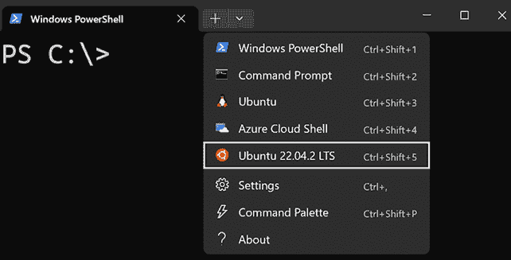
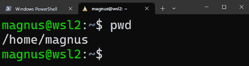
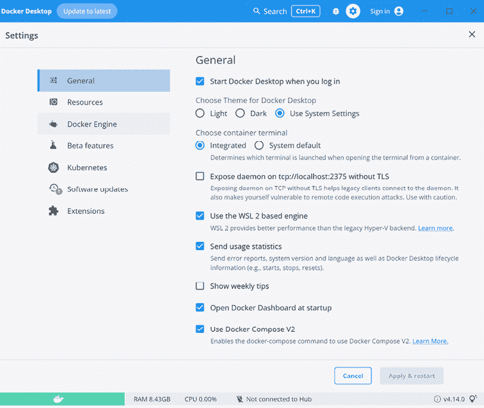
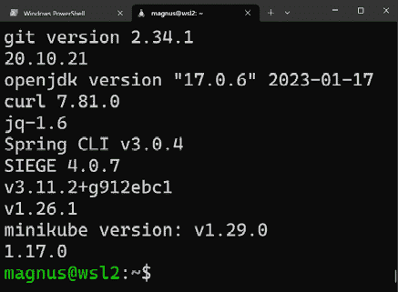
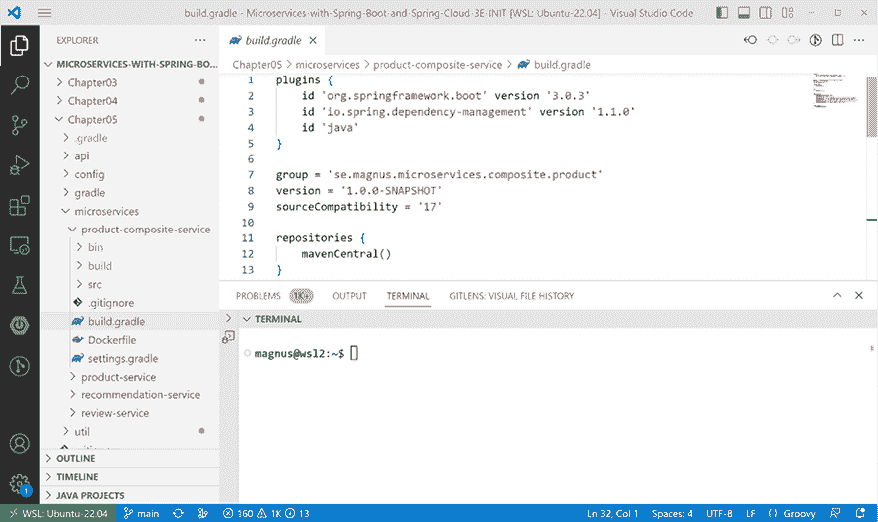

# 22

# 使用 WSL 2 和 Ubuntu 的 Microsoft Windows 安装说明

在本章中，我们将学习如何设置在 Microsoft Windows 上运行本书中描述的命令所需的工具。我们还将学习如何获取本书源代码的访问权限。

本章将涵盖以下主题：

+   技术要求

+   安装工具

+   访问源代码

如果你使用的是 Mac，应遵循 *第二十一章* 中 *macOS 安装说明* 的指示。

# 技术要求

本书描述的所有命令都是在使用 **bash** 作为命令外壳的 MacBook Pro 上运行的。在本章中，我们将学习如何在 Microsoft Windows 中设置一个开发环境，在该环境中可以运行本书中的命令而无需进行任何更改。在少数情况下，必须修改命令才能在 Windows 环境中运行。这一点在每个章节中都有明确指出，并且还指定了在 Windows 环境中应使用的替代命令。

开发环境基于 **Windows 子系统 for Linux v2**，或简称 **WSL 2**，它需要 **Windows 10，版本 2004**（构建 19041）或更高版本。我们将使用 WSL 2 运行基于 **Ubuntu 22.04** 的 Linux 服务器，在那里我们将使用 `bash` 作为命令外壳运行所有命令。

微软提供了 Windows 和在 WSL 2 中运行的 Linux 服务器的集成。Linux 文件可以从 Windows 访问，反之亦然。我们将学习如何在 Windows 中运行的 Visual Studio Code 中访问 Linux 服务器上的文件。Linux 服务器中可从 `localhost` 访问的端口也在 Windows 的 `localhost` 上可用。我们将使用此集成从 Windows 中运行的网页浏览器访问在 Linux 服务器上运行的 Web 应用程序暴露的网页。

更多关于 WSL 2 的信息，请参阅 [`docs.microsoft.com/en-us/windows/wsl/`](https://docs.microsoft.com/en-us/windows/wsl/)。

# 安装工具

在本节中，我们将学习如何安装和配置工具。以下是我们将安装的工具列表，如有需要，附有下载和安装的更多信息链接。

在 Windows 上，我们将安装以下工具：

+   **Windows 子系统 for Linux v2 (WSL 2)**：[`docs.microsoft.com/en-us/windows/wsl/install-win10`](https://docs.microsoft.com/en-us/windows/wsl/install-win10)

+   **WSL 2 中的 Ubuntu 22.04**：[`apps.microsoft.com/store/detail/ubuntu-22042-lts/9PN20MSR04DW`](https://apps.microsoft.com/store/detail/ubuntu-22042-lts/9PN20MSR04DW)

+   **Windows 终端**：[`www.microsoft.com/en-us/p/windows-terminal/9n0dx20hk701`](https://www.microsoft.com/en-us/p/windows-terminal/9n0dx20hk701)

+   **Windows Docker Desktop**：[`hub.docker.com/editions/community/docker-ce-desktop-windows/`](https://hub.docker.com/editions/community/docker-ce-desktop-windows/)

+   **Visual Studio Code**及其**Remote WSL**扩展：[`code.visualstudio.com`](https://code.visualstudio.com) 和 [`marketplace.visualstudio.com/items?itemName=ms-vscode-remote.remote-wsl`](https://marketplace.visualstudio.com/items?itemName=ms-vscode-remote.remote-wsl)

在 Linux 服务器上，我们将安装以下工具：

+   **Git**: [`git-scm.com/downloads`](https://git-scm.com/downloads)

+   **Java**: [`adoptium.net/installation`](https://adoptium.net/installation)

+   **curl**: [`curl.haxx.se/download.html`](https://curl.haxx.se/download.html)

+   **jq**: [`stedolan.github.io/jq/download/`](https://stedolan.github.io/jq/download/)

+   **Spring Boot CLI**: [`docs.spring.io/spring-boot/docs/3.0.4/reference/html/getting-started.html#getting-started.installing.cli`](https://docs.spring.io/spring-boot/docs/3.0.4/reference/html/getting-started.html#getting-started.installing.cli)

+   **Siege**: [`github.com/JoeDog/siege#where-is-it`](https://github.com/JoeDog/siege#where-is-it)

+   **Helm**: [`helm.sh/docs/intro/install/#from-apt-debianubuntu`](https://helm.sh/docs/intro/install/#from-apt-debianubuntu)

+   **kubectl**: [`kubernetes.io/docs/tasks/tools/install-kubectl-linux/`](https://kubernetes.io/docs/tasks/tools/install-kubectl-linux/)

+   **minikube**: [`minikube.sigs.k8s.io/docs/start/`](https://minikube.sigs.k8s.io/docs/start/)

+   **istioctl**: [`istio.io/latest/docs/setup/getting-started/#download`](https://istio.io/latest/docs/setup/getting-started/#download)

在编写本书时使用了以下版本：

+   **Windows Terminal**: v1.16.10261.0

+   **Visual Studio Code**: v1.75.1

+   **Docker Desktop for Windows**: v4.14.0

+   **Git**: v2.34.1

+   **Java**: v17.0.6

+   **curl**: v7.81.0

+   **jq**: v1.6

+   **Spring Boot CLI**: v3.0.4

+   **Siege**: v4.0.7

+   **Helm**: v3.11.2

+   **kubectl**: v1.26.1

+   **minikube**: v 1.29.1

+   **istioctl**: v1.17.0

我们将首先安装 Windows 上所需的工具，然后安装运行在 WSL 2 中的 Linux 服务器上所需的工具。

## 在 Windows 上安装工具

在 Windows 环境中，我们将一起安装 WSL 2、Linux 服务器、Windows 终端、Docker 桌面，最后是带有远程访问 WSL 中文件扩展的 Visual Studio Code。

### 与默认 Ubuntu 服务器一起安装 WSL 2

运行以下命令以使用 Ubuntu 服务器安装 WSL 2：

1.  以管理员身份打开 PowerShell 并运行以下命令：

    ```java
    wsl –install 
    ```

1.  重启 PC 以完成安装。

1.  在 PC 重启后，Ubuntu 服务器将自动在新终端窗口中安装。过一会儿，你会被要求输入用户名和密码。

1.  安装完成后，你可以使用以下命令验证安装的 Ubuntu 版本：

    ```java
    lsb_release -d 
    ```

应该会返回一个类似以下输出的结果：

```java
Description:    Ubuntu 22.04.1 LTS 
```

### 在 WSL 2 上安装新的 Ubuntu 22.04 服务器

如果你已经安装了 WSL 2 但没有 Ubuntu 22.04 服务器，你可以按照以下步骤安装：

1.  从 Microsoft Store 下载安装文件：

    +   要选择可用的 WSL 2 Linux 发行版，请访问 [`aka.ms/wslstore`](https://aka.ms/wslstore)。

    +   要直接进入 Ubuntu 22.04，请访问 [`apps.microsoft.com/store/detail/ubuntu-22042-lts/9PN20MSR04DW`](https://apps.microsoft.com/store/detail/ubuntu-22042-lts/9PN20MSR04DW)。

1.  下载安装文件后，执行它以安装 Ubuntu 20.04。

1.  将打开一个控制台窗口，一分钟后或两分钟内，您将被要求输入用于 Linux 服务器的用户名和密码。

### 安装 Windows Terminal

为了简化对 Linux 服务器的访问，我强烈建议安装 Windows Terminal。它支持：

+   使用多个标签页

+   在标签页内使用多个窗格

+   使用多种类型的 shell：例如，Windows 命令提示符、PowerShell、WSL 2 的 bash 和 Azure CLI

+   …以及更多；有关更多信息，请参阅 [`docs.microsoft.com/en-us/windows/terminal/`](https://docs.microsoft.com/en-us/windows/terminal/)

Windows Terminal 可以从 Microsoft Store 安装；请参阅 [`aka.ms/terminal`](https://aka.ms/terminal)。

当您启动 Windows Terminal 并在菜单中单击 **向下箭头** 时，您会发现它已经配置为在 Linux 服务器中启动终端：



图 22.1：配置 WSL 2 中的 Linux 服务器使用的 Windows Terminal

选择 **Ubuntu-22.04**，并将启动一个 `bash` shell。根据您的设置，您的当前工作目录可能被设置为 Windows 的家目录，例如，`/mnt/c/Users/magnus`。要访问 Linux 服务器的家目录，只需使用 `cd` 和 `pwd` 命令来验证您是否在 Linux 服务器的文件系统中：



图 22.2：使用 bash 访问 Linux 服务器文件的 Windows Terminal

### 安装 Windows Docker Desktop

要安装和配置 Windows Docker Desktop，请执行以下步骤：

1.  从 [`hub.docker.com/editions/community/docker-ce-desktop-windows/`](https://hub.docker.com/editions/community/docker-ce-desktop-windows/) 下载并安装 Docker Desktop for Windows。

1.  如果在安装过程中被要求启用 WSL 2，请回答 **YES****。

1.  安装完成后，从 **开始** 菜单启动 **Docker Desktop**。

1.  从 **Docker** 菜单中选择 **设置**，然后在 **设置** 窗口中选择 **常规** 选项卡：

    +   确保选中 **使用基于 WSL 2 的引擎** 复选框。

    +   为了避免每次重启 PC 时手动启动 Docker Desktop，我还建议选中 **登录时启动 Docker Desktop** 复选框。

    **常规**设置应如下所示：



图 22.3：Docker Desktop 配置

1.  通过点击**应用 & 重新启动**按钮完成配置。

### 安装 Visual Studio Code 及其 Remote WSL 扩展

为了简化在 Linux 服务器内部编辑源代码，我建议使用 Visual Studio Code。通过其名为**Remote WSL**的 WSL 2 扩展，您可以使用在 Windows 中运行的 Visual Studio Code 轻松地在 Linux 服务器内部处理源代码。

要安装和配置 Visual Studio Code 及其 Remote WSL 扩展，请执行以下步骤：

1.  Visual Studio Code 可以从[`code.visualstudio.com`](https://code.visualstudio.com)下载和安装：

    +   当被要求**选择附加任务**时，选择**添加到 PATH**选项。这将使您能够从 Linux 服务器内部使用`code`命令打开 Visual Studio Code 中的文件夹。

1.  安装完成后，从**开始**菜单启动**Visual Studio Code**。

1.  使用此链接安装 Remote WSL 扩展：[`marketplace.visualstudio.com/items?itemName=ms-vscode-remote.remote-wsl`](https://marketplace.visualstudio.com/items?itemName=ms-vscode-remote.remote-wsl).

如果您想了解更多关于 Visual Studio Code 如何与 WSL 2 集成的信息，请参阅这篇文章：[`code.visualstudio.com/docs/remote/wsl`](https://code.visualstudio.com/docs/remote/wsl)。

## 在 WSL 2 的 Linux 服务器上安装工具

现在，是时候在 WSL 2 的 Linux 服务器上安装所需的工具了。

从**开始**菜单启动**Windows Terminal**，并按照*安装 Windows Terminal*部分所述打开 Linux 服务器中的终端。

`git`和`curl`工具已在 Ubuntu 中安装。剩余的工具将使用`apt install`、`sdk install`或`curl`和`install`的组合进行安装。

### 使用 apt install 安装工具

在本节中，我们将安装`jq`、`siege`、Helm 以及其他工具所需的几个依赖项。

使用以下命令安装`jq`、`zip`、`unzip`和`siege`：

```java
sudo apt update
sudo apt install -y jq
sudo apt install -y zip
sudo apt install -y unzip
sudo apt install -y siege 
```

要安装 Helm，请运行以下命令：

```java
curl -s https://baltocdn.com/helm/signing.asc | \
  gpg --dearmor | sudo tee /usr/share/keyrings/helm.gpg > /dev/null sudo apt-get install apt-transport-https --yes echo "deb [arch=$(dpkg --print-architecture) \
  signed-by=/usr/share/keyrings/helm.gpg] \
  https://baltocdn.com/helm/stable/debian/ all main" | \
  sudo tee /etc/apt/sources.list.d/helm-stable-debian.list
sudo apt-get update
sudo apt install -y helm 
```

### 使用 SDKman 安装 Java 和 Spring Boot CLI

要安装 Java 和 Spring Boot CLI，我们将使用**SDKman** ([`sdkman.io`](https://sdkman.io)). 使用以下命令安装 SDKman:

```java
curl -s "https://get.sdkman.io" | bash
source "$HOME/.sdkman/bin/sdkman-init.sh" 
```

使用以下命令验证 SDKman 是否正确安装：

```java
sdk version 
```

预期它会返回类似以下内容：

```java
SDKMAN5.9.2+613 
```

要安装 Java，我们将使用名为**Eclipse Temurin**的发行版 ([`adoptium.net/temurin/`](https://adoptium.net/temurin/))。

使用此命令安装 Java：

```java
sdk install java 17.0.6-tem 
```

最后，安装 Spring Boot CLI：

```java
sdk install springboot 3.0.4 
```

### 使用 curl 和 install 安装剩余的工具

最后，我们将使用`curl`下载可执行文件来安装`kubectl`、`minikube`和`istioctl`。下载完成后，我们将使用`install`命令将文件复制到文件系统的正确位置，并确保`所有者`和`访问权限`配置正确。在涉及这些工具时，安装相互兼容的版本很重要，特别是当涉及到它们支持的 Kubernetes 版本时。简单地安装和升级到最新版本可能会导致使用不兼容的`minikube`、Kubernetes 和 Istio 版本的情况。

关于 Istio 支持的 Kubernetes 版本，请参阅[`istio.io/latest/about/supported-releases/#support-status-of-istio-releases`](https://istio.io/latest/about/supported-releases/#support-status-of-istio-releases)。对于`minikube`，请参阅[`minikube.sigs.k8s.io/docs/handbook/config/#selecting-a-kubernetes-version`](https://minikube.sigs.k8s.io/docs/handbook/config/#selecting-a-kubernetes-version)。

要安装本书中使用的`kubectl`版本，请运行以下命令：

```java
curl -LO "https://dl.k8s.io/release/v1.26.1/bin/linux/amd64/kubectl"
sudo install -o root -g root -m 0755 kubectl /usr/local/bin/kubectl
rm kubectl 
```

要安装本书中使用的`minikube`版本，请运行以下命令：

```java
curl -LO https://storage.googleapis.com/minikube/releases/v1.29.0/minikube-linux-amd64
sudo install -o root -g root -m 0755 minikube-linux-amd64 \
  /usr/local/bin/minikube
rm minikube-linux-amd64 
```

要安装本书中使用的`istioctl`版本，请运行以下命令：

```java
curl -L https://istio.io/downloadIstio | ISTIO_VERSION=1.17.0 TARGET_ARCH=x86_64 sh -
sudo install -o root -g root -m 0755 istio-1.17.0/bin/istioctl /usr/local/bin/istioctl
rm -r istio-1.17.0 
```

现在工具已安装，我们可以验证它们是否已按预期安装。

### 验证安装

要验证工具安装，运行以下命令以打印每个工具的版本：

```java
git version && \
docker version -f json | jq -r .Client.Version && \
java -version 2>&1 | grep "openjdk version" && \
curl --version | grep "curl" | sed 's/(.*//' && \
jq --version && \
spring --version && \
siege --version 2>&1 | grep SIEGE && \
helm version --short && \
kubectl version --client -o json | \
  jq -r .clientVersion.gitVersion && \
minikube version | grep "minikube" && \
istioctl version --remote=false 
```

预期版本信息如下：



图 22.4：WSL 2 中 Linux 服务器使用的版本

工具安装并验证后，让我们看看如何访问本书的源代码。

# 访问源代码

本书源代码可在 GitHub 仓库[`github.com/PacktPublishing/Microservices-with-Spring-Boot-and-Spring-Cloud-Third-Edition`](https://github.com/PacktPublishing/Microservices-with-Spring-Boot-and-Spring-Cloud-Third-Edition)中找到。

要能够在 WSL 2 中的 Linux 服务器上运行本书中描述的命令，请将源代码下载到文件夹中，并设置环境变量`$BOOK_HOME`，使其指向该文件夹。以下是一些示例命令：

```java
export BOOK_HOME=~/Microservices-with-Spring-Boot-and-Spring-Cloud-Third-Edition
git clone https://github.com/PacktPublishing/Microservices-with-Spring-Boot-and-Spring-Cloud-Third-Edition.git $BOOK_HOME 
```

要验证从 Visual Studio Code 下载到 WSL 2 中 Linux 服务器的源代码访问权限，请运行以下命令：

```java
cd $BOOK_HOME
code . 
```

Visual Studio Code 将打开一个窗口，您可以从该窗口开始检查源代码。您还可以从菜单选择**终端**→**新建终端**来启动一个终端窗口，在 Linux 服务器上运行 bash 命令。Visual Studio Code 窗口应类似于以下内容：



图 22.5：从 Visual Studio Code 访问 Linux 服务器中的文件

Java 源代码是为 Java SE 8 编写的，并在 Docker 容器中执行时使用 Java SE 17 JRE。以下版本的 Spring 被使用：

+   Spring 框架：6.0.6

+   Spring Boot：3.0.4

+   Spring Cloud：2022.0.1

每章中的代码示例都来自 `$BOOK_HOME/ChapterNN` 中的源代码，其中 `NN` 是章节的编号。在许多情况下，书中的代码示例都被编辑过，以删除源代码中不相关的部分，例如注释、导入和日志语句。

## 代码结构

每章都包含多个 Java 项目，每个微服务和 Spring Cloud 服务一个，以及一些由其他项目使用的库项目。*第十四章* 包含的项目数量最多；其项目结构如下：

```java
├── api
├── microservices
│   ├── product-composite-service
│   ├── product-service
│   ├── recommendation-service
│   └── review-service
├── spring-cloud
│   ├── authorization-server
│   ├── config-server
│   ├── eureka-server
│   └── gateway
└── util 
```

所有项目都是使用 Gradle 构建的，并且具有根据 Gradle 标准约定构建的文件结构：

```java
├── build.gradle
├── settings.gradle
└── src
    ├── main
    │   ├── java
    │   └── resources
    └── test
        ├── java
        └── resources 
```

关于如何组织 Gradle 项目的更多信息，请参阅 [`docs.gradle.org/current/userguide/organizing_gradle_projects.html`](https://docs.gradle.org/current/userguide/organizing_gradle_projects.html)。

# 摘要

在本章中，我们学习了如何在 WSL 2 和 Windows 上安装、配置和验证运行本书中描述的命令所需的工具。对于开发，我们将使用 `git`、`docker`、`java` 和 `spring`。为了在运行时创建部署我们的微服务所需的 Kubernetes 环境，我们将使用 `minikube`、Helm、`kubectl` 和 `istioctl`。最后，为了运行测试以验证微服务在运行时按预期工作，我们将使用 `curl`、`jq` 和 `siege`。

我们还学习了如何从 GitHub 访问源代码以及源代码的结构。

在下一章和最后一章中，我们将学习如何原生编译微服务，将它们的启动时间缩短到亚秒级。
