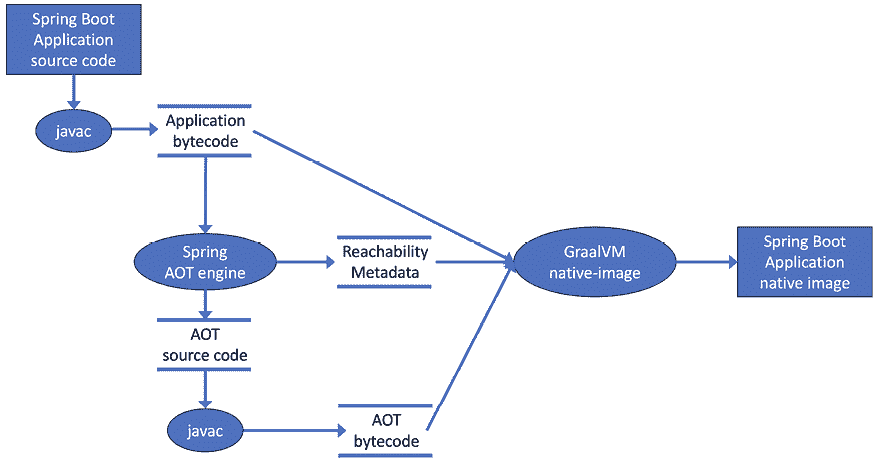
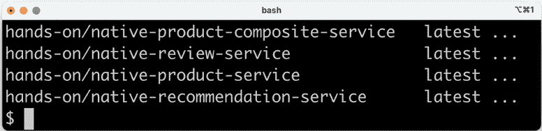
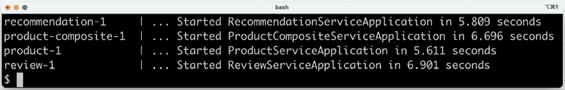
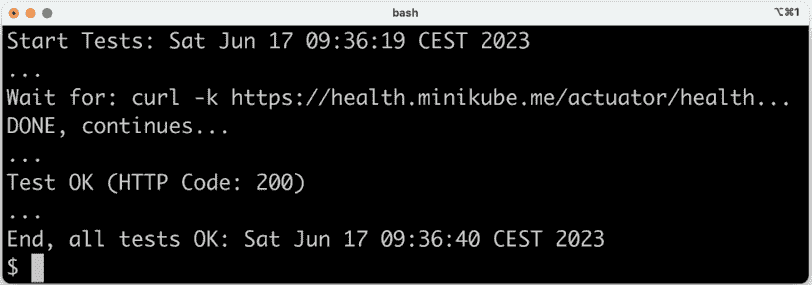
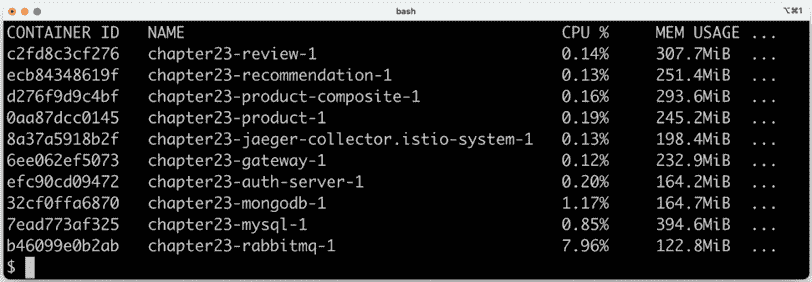
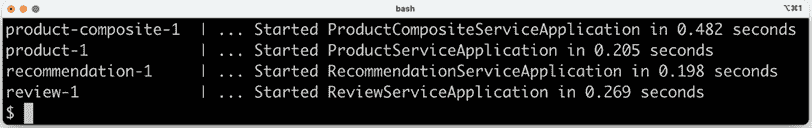
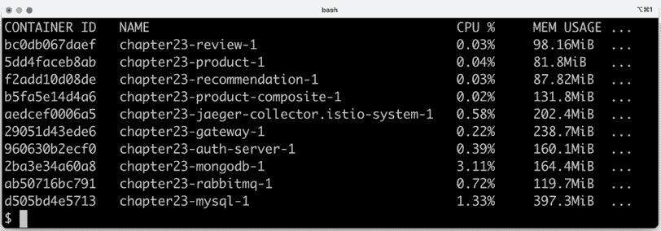
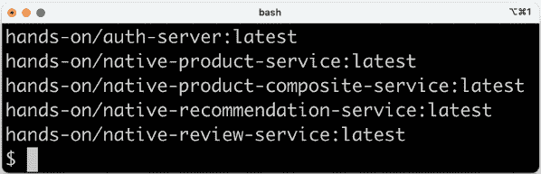

# 第二十三章：原生编译的 Java 微服务

在本章中，我们将学习如何将我们的微服务中的 Java 源代码编译成二进制可执行文件，称为**原生镜像**。与使用 Java VM 相比，原生镜像启动速度显著更快，并且预计还会消耗更少的内存。我们将介绍 Spring Framework 6 中引入的**Spring AOT**引擎以及**GraalVM**项目和它的**原生镜像编译器**，学习如何使用它们。

我们将涵盖以下主题：

+   何时原生编译 Java 源代码

+   介绍 GraalVM 项目和 Spring 的 AOT 引擎

+   处理原生编译中的问题

+   测试和编译原生镜像

+   使用 Docker Compose 进行测试

+   使用 Kubernetes 进行测试

尽管 Spring Framework 6 和 Spring Boot 3 提供了对构建 Spring Boot 应用程序原生可执行文件的支持，即**通用可用性**（**GA**），但这仍处于早期阶段。在撰写本章时，在原生编译本书中的微服务时发现了许多陷阱。由于原生编译微服务对于本书其余部分的内容不是必需的，因此本章被放置在书的末尾，作为额外的一章，描述了一个令人兴奋但尚未完全成熟的技术。

# 技术要求

关于如何安装本书中使用的工具以及如何访问本书源代码的说明，请参阅：

+   *第二十一章*，*macOS 安装说明*

+   *第二十二章*，*使用 WSL 2 和 Ubuntu 的 Microsoft Windows 安装说明*

本章中的所有代码示例均来自`$BOOK_HOME/Chapter23`的源代码。

如果你想查看本章源代码中应用的变化，以便你可以原生编译微服务，你可以将其与*第二十章*，*监控微服务*的源代码进行比较。你可以使用你喜欢的`diff`工具，比较两个文件夹`$BOOK_HOME/Chapter20`和`$BOOK_HOME/Chapter23`。

# 何时原生编译 Java 源代码

Java 一直以其**一次构建，到处运行**的能力而闻名，提供了出色的跨平台支持。Java 源代码编译成一次的字节码。在运行时，Java VM 使用**即时**编译器（也称为 JIT 编译）将字节码转换为针对目标平台的可执行代码。这需要一些时间，会减慢 Java 程序的启动速度。在微服务时代之前，Java 组件通常运行在应用程序服务器上，如 Java EE 服务器。部署后，Java 组件会长时间运行，使得较长的启动时间不再是问题。

随着微服务的引入，这种观点发生了变化。使用微服务，人们期望能够更频繁、更快速地升级它们，并根据其使用情况对微服务的实例进行上下调整。另一个期望是能够**扩展到零**，这意味着当微服务不被使用时，它不应运行任何实例。未使用的微服务不应分配任何硬件资源，更重要的是，不应产生任何运行时成本，例如在云部署中。为了能够满足这些期望，微服务实例能够迅速启动是非常重要的。

此外，随着容器技术的应用，应用程序本身内置的跨平台支持的重要性已经降低。相反，可以使用 Docker 构建包含对多个平台支持的 Docker 镜像，例如，同时支持`arm64`和`amd64`（也称为`x86_64`）的 Linux，或者可以在 Windows 和 Linux 上运行的 Docker 镜像。更多信息，请参阅[`docs.docker.com/build/building/multi-platform/`](https://docs.docker.com/build/building/multi-platform/)。关于包含多平台支持的 Docker 镜像的示例，请参阅本书中使用的 OpenJDK Docker 镜像，[`hub.docker.com/_/eclipse-temurin/tags`](https://hub.docker.com/_/eclipse-temurin/tags)。

由于 Java 程序的启动时间可以显著减少，其他用例也浮现在脑海中；例如，使用 AWS Lambda、Azure Functions 或 Google Cloud Functions 等主要平台开发基于 Java 的**函数即服务**（**FaaS**）解决方案，仅举一些例子。此外，在 Java 中开发 CLI 工具也成为了一种可行的选择。

这些共同导致了一种情况，即更快的启动速度比跨平台支持成为一个更关键的要求。这个要求可以通过在构建时将 Java 源代码编译成目标平台的二进制格式来实现，就像 C 或 Go 程序被编译一样。这被称为**即时编译**或**AOT**编译。GraalVM Native Image 编译器将用于执行 AOT 编译。

正如我们将在下一节中看到的，GraalVM Native Image 编译器带来了一些限制，例如与反射和动态代理的使用相关。将 Java 代码编译成二进制原生镜像也需要相当长的时间。这项技术有其优点和缺点。

在更好地理解何时可能需要原生编译 Java 源代码之后，让我们了解相关的工具：首先，GraalVM 项目，然后是 Spring AOT 引擎。

# 介绍 GraalVM 项目

Oracle 多年来一直在开发高性能 Java VM 和相关工具，这些工具统称为**GraalVM**项目([`www.graalvm.org`](https://www.graalvm.org))。该项目于 2018 年 4 月启动([`medium.com/graalvm/graalvm-in-2018-b5fa7ff3b917`](https://medium.com/graalvm/graalvm-in-2018-b5fa7ff3b917))，但其工作可以追溯到例如 Oracle Labs 在 2013 年关于该主题的研究论文：*Maxine：一个易于接近的 Java 虚拟机，用于 Java 中*；请参阅[`dl.acm.org/doi/10.1145/2400682.2400689`](https://dl.acm.org/doi/10.1145/2400682.2400689)。

**有趣的事实**：Maxine VM 被称为**元循环**Java VM 实现，这意味着它本身是用 Java 编写的。

GraalVM 的 VM 是多语言的，不仅支持传统的 Java VM 语言，如 Java、Kotlin 和 Scala，还支持 JavaScript、C、C++、Ruby、Python，甚至编译成 WebAssembly 的程序。我们将关注的 GraalVM 部分是其**本地图像**编译器，它可以用来将 Java 字节码编译成包含特定**操作系统**（**OS**）和 HW 平台二进制可执行代码的本地图像，例如，在苹果硅上的 macOS（`arm64`）或在 Intel 上的 Linux（`amd64`）。

本地图像可以在没有 Java VM 的情况下运行，包括二进制编译的应用程序类以及其他来自应用程序依赖项所需的类。它还包括一个名为**Substrate VM**的运行时系统，该系统处理垃圾回收、线程调度等。

为了能够构建本地图像，本地编译器基于封闭世界假设执行静态代码分析，这意味着在运行时可以调用的所有字节码必须在构建时可达。因此，在 AOT 编译期间不可用的运行时动态加载或创建类是不可能的。

为了克服这些限制，GraalVM 项目为本地编译器提供了配置选项，我们可以提供**可达性元数据**。使用此配置，我们可以描述动态特性（如反射）的使用和运行时生成代理类。有关更多信息，请参阅[`www.graalvm.org/22.3/reference-manual/Native%20Image/metadata/`](https://www.graalvm.org/22.3/reference-manual/native-image/metadata/)。在本章的后面，我们将学习创建所需可达性元数据的各种方法。

可以使用 CLI 命令`Native Image`或作为 Maven 或 Gradle 构建的一部分来启动 GraalVM 本地图像编译器。GraalVM 为 Maven 和 Gradle 都提供了插件。在本章中，我们将使用 Gradle 插件。

GraalVM 引入后，是时候学习 Spring 的 AOT 引擎了。

# 介绍 Spring 的 AOT 引擎

Spring 团队也一直在努力支持 Spring 应用的原生编译。2021 年 3 月，经过 18 个月的工作，实验性的 **Spring Native** 项目发布了 beta 版本；请参阅 [`spring.io/blog/2021/03/11/announcing-spring-native-beta`](https://spring.io/blog/2021/03/11/announcing-spring-native-beta)。基于 Spring Native 项目的经验，Spring 框架 6 和 Spring Boot 3 中增加了构建 Native Image 的官方支持；请参阅 [`spring.io/blog/2023/02/23/from-spring-native-to-spring-boot-3`](https://spring.io/blog/2023/02/23/from-spring-native-to-spring-boot-3)。实际上进行原生编译时，Spring 在底层使用 GraalVM 的 Native Image 编译器。

最重要的特性是 Spring 的新 **AOT 引擎**，该引擎在构建时分析 Spring Boot 应用程序，并生成 GraalVM Native Image 编译器所需的初始化源代码和可达性元数据。生成的初始化源代码，也称为 **AOT 生成的代码**，替换了使用 Java VM 时执行的基于反射的初始化，消除了大多数动态特性（如反射和运行时生成代理类）的需求。

当执行此 AOT 处理时，会像 GraalVM Native Image 编译器一样做出封闭世界假设。这意味着只有构建时可达的 Spring bean 和类将表示在 AOT 生成的代码和可达性元数据中。必须特别注意那些仅在设置某些配置文件或满足某些条件时才创建的 Spring bean，使用 `@Profile` 或 `@ConditionalOnProperty` 注解。这些配置文件和条件必须在构建时设置；否则，这些 Spring bean 将不会在 Native Image 中表示。

为了执行分析，AOT 引擎通过扫描应用程序的源代码为所有可找到的 Spring bean 创建 bean 定义。但不是实例化 Spring bean，即启动应用程序，而是生成在执行时将实例化 Spring bean 的相应初始化代码。对于所有动态特性的使用，它还将生成所需的可达性元数据。

从 Spring Boot 应用程序的源代码创建 Native Image 的过程由以下数据流图总结：



图 23.1：解释创建 Native Image 的数据流图

创建 Native Image 的步骤如下：

1.  应用程序的源代码由 Java 编译器编译成字节码。

1.  Spring 的 AOT 引擎在封闭世界假设下分析代码，并生成 AOT 源代码和可达性元数据。

1.  AOT 生成的代码使用 Java 编译器编译成字节码。

1.  应用程序的字节码，连同可达性元数据和 AOT 引擎创建的字节码，被发送到 GraalVM 的原生镜像编译器，该编译器创建原生镜像。

有关如何在 Spring Boot 3 中支持创建 GraalVM 原生镜像的更多信息，请参阅[`docs.spring.io/spring-boot/docs/current/reference/html/Native Image.html`](https://docs.spring.io/spring-boot/docs/current/reference/html/native-image.html)。

创建原生镜像可以通过两种方式完成：

+   为当前操作系统创建原生镜像：

    第一种选择使用 Gradle 的`nativeImage`任务。它将使用已安装的 GraalVM 原生镜像编译器为当前操作系统和硬件架构创建一个可执行文件。当在构建文件中声明 GraalVM 的 Gradle-plugin 时，nativeImage 任务可用。

+   将原生镜像作为 Docker 镜像创建

    第二种选择是使用现有的 Gradle 任务`bootBuildImage`来创建 Docker 镜像。鉴于 GraalVM 的 Gradle 插件已在构建文件中声明，`bootBuildImage`任务将创建一个包含原生镜像的 Docker 镜像，而不是包含应用程序 JAR 文件的 Java VM。原生镜像将在 Docker 容器中构建，因此它将为 Linux 构建。这也意味着当使用`bootBuildImage`任务时，不需要安装 GraalVM 的原生镜像编译器。在底层，此任务使用**buildpacks**而不是 Dockerfile 来创建 Docker 镜像。

buildpacks 的概念是由 Heroku 在 2011 年引入的。2018 年，由 Pivotal 和 Heroku 创建的**Cloud Native Buildpacks**项目([`buildpacks.io`](https://buildpacks.io))，并在同年加入了 CNCF。

为了更加正式一点，buildpack 根据 OCI Image Format 规范创建一个**OCI 镜像**：[`github.com/opencontainers/image-spec/blob/master/spec.md`](https://github.com/opencontainers/image-spec/blob/master/spec.md)。由于 OCI 规范基于 Docker 的镜像格式，格式非常相似，并且都由容器引擎支持。

要创建 OCI 镜像，Spring Boot 使用来自**Paketo**项目的 buildpack；有关更多信息，请参阅[`docs.spring.io/spring-boot/docs/3.0.5/reference/html/container-images.html#container-images.buildpacks`](https://docs.spring.io/spring-boot/docs/3.0.5/reference/html/container-images.html#container-images.buildpacks)和[`paketo.io/docs/builders`](https://paketo.io/docs/builders)。遗憾的是，在撰写本章时，Paketo 的 buildpacks 不支持`arm64`，包括苹果硅。基于`amd64`（英特尔）的 buildpack 在技术上可以在苹果硅的 MacBook 上运行，但运行速度非常慢。正如这里所建议的[`www.cloudfoundry.org/blog/arm64-paketo-buildpacks/`](https://www.cloudfoundry.org/blog/arm64-paketo-buildpacks/)，可以使用非官方的`arm64`Docker 镜像作为临时的解决方案。它们在此处可用：[`hub.docker.com/r/dashaun/builder-arm`](https://hub.docker.com/r/dashaun/builder-arm)。

使用本地 OS 的`nativeImage`任务创建本地镜像比创建 Docker 镜像更快。因此，`nativeImage`任务可以在最初尝试成功构建本地镜像时用于快速反馈循环。但是，一旦解决这个问题，创建包含本地镜像的 Docker 镜像是测试本地编译的微服务最有用的替代方案，无论是使用 Docker Compose 还是 Kubernetes。在本章中，我们将使用前面提到的非官方 Docker 镜像，名为`dashaun/builder:tiny`。提供了`arm64`和`amd64`的 Docker 镜像。

有几个工具和项目可以帮助消除本地编译的挑战。下一节将概述它们，在*测试和编译本地镜像*部分，我们将学习如何使用它们。

# 处理本地编译问题

正如之前提到的，使用本地编译 Spring Boot 应用程序还不是主流。因此，当你在自己的应用程序上尝试时，可能会遇到问题。本节将介绍一些可以用来处理这些问题的项目和工具。以下章节将提供如何使用这些工具的示例。

以下项目和工具可用于处理 Spring Boot 应用程序的本地编译问题：

+   Spring AOT 烟雾测试：

    此项目包含一系列测试，用于验证各种 Spring 项目在本地编译时是否正常工作。每当您遇到与本地编译 Spring 功能相关的问题时，您应该开始查找此项目以找到可行的解决方案。此外，如果您想报告关于本地编译 Spring 项目的任何问题，您可以使用此项目的测试作为模板，以可重复的方式展示问题。该项目可在[`github.com/spring-projects/spring-aot-smoke-tests`](https://github.com/spring-projects/spring-aot-smoke-tests)找到。测试结果可在 Spring 的 CI 环境中找到。例如，各种 Spring Cloud 项目的测试可以在这里找到：[`ci.spring.io/teams/spring-aot-smoke-tests/pipelines/spring-aot-smoke-tests-3.0.x?group=cloud-app-tests`](https://ci.spring.io/teams/spring-aot-smoke-tests/pipelines/spring-aot-smoke-tests-3.0.x?group=cloud-app-tests)。

+   GraalVM 可达性元数据仓库：

    此项目包含各种尚未支持本地编译的开放源代码项目的可达性元数据。GraalVM 社区可以提交可达性元数据，这些数据在项目团队审查后获得批准。GraalVM 的 Gradle 插件会自动从该项目查找可达性元数据，并在本地编译时添加它。有关更多信息，请参阅[`graalvm.github.io/native-build-tools/0.9.18/gradle-plugin.html#metadata-support`](https://graalvm.github.io/native-build-tools/0.9.18/gradle-plugin.html#metadata-support)。

+   使用 Java VM 测试 AOT 生成的代码：

    由于本地编译 Spring Boot 应用程序需要几分钟，一个有趣的替代方案是尝试在 Java VM 上运行 Spring AOT 引擎生成的初始化代码。通常，在使用 Java VM 时，会忽略 AOT 生成的代码，但可以通过将系统属性`spring.aot.enabled`设置为`true`来改变这一点。这意味着应用程序的正常基于反射的初始化被替换为执行生成的初始化代码。这可以用作快速验证生成的初始化代码是否按预期工作。另一个积极的影响是应用程序启动速度略有提高。

+   提供自定义提示：

    如果应用程序需要为 GraalVM Native Image 编译器创建原生图像而自定义可达性元数据，它们可以按照*介绍 GraalVM 项目*部分中所述的 JSON 文件提供。Spring 通过使用名为`@RegisterReflectionForBinding`的注解或在类中实现`RuntimeHintsRegistrar`接口来提供 JSON 文件的替代方案，该接口可以通过使用`@ImportRuntimeHints`注解激活。`RegisterReflectionForBinding`注解更容易使用，但实现`RuntimeHintsRegistrar`接口提供了对指定的提示的完全控制。

    使用 Spring 的自定义提示而非 GraalVM JSON 文件的一个重要好处是，自定义提示是类型安全的，并且由编译器进行检查。如果 GraalVM JSON 文件中引用的实体被重命名，但 JSON 文件未更新，那么该元数据将丢失。这将导致 GraalVM Native Image 编译器无法创建原生镜像。

    当使用自定义提示时，源代码甚至无法编译；通常，当实体被重命名时，IDE 会抱怨自定义提示不再有效。

+   运行原生测试：

    尽管使用 Java VM 测试 AOT 生成的代码可以快速指示原生编译是否可行，但我们仍然需要创建应用程序的原生镜像以进行全面测试。基于创建原生镜像、启动应用程序以及最后手动运行一些测试的反馈循环非常慢且容易出错。与此过程相比的一个有吸引力的替代方案是运行**原生测试**，其中 Spring 的 Gradle 插件将自动创建原生镜像，然后使用原生镜像运行应用程序项目中定义的 JUnit 测试。这仍然会因为原生编译而花费时间，但整个过程是全自动且可重复的。在确保原生测试按预期运行后，它们可以被放入 CI 构建管道以进行自动化执行。可以使用以下命令使用 Gradle 启动原生测试：

    ```java
    gradle nativeTest 
    ```

+   使用 GraalVM 的跟踪代理：

    如果确定需要创建一个可工作的原生镜像所需的可达性元数据和/或自定义提示很困难，GraalVM 的跟踪代理可以帮助。如果在 Java VM 中运行应用程序时启用了跟踪代理，它可以根据应用程序如何使用反射、资源和代理来收集所需的可达性元数据。如果与 JUnit 测试一起运行，这特别有用，因为收集所需的可达性元数据将自动化且可重复。

    在介绍了如何处理主要预期挑战的工具和解释之后，让我们看看为了能够原生编译微服务，源代码需要做出哪些更改。

# 源代码的更改

在将微服务的 Java 源代码编译成原生可执行镜像之前，需要更新源代码。为了能够原生编译微服务，以下更改已应用于源代码：

+   通过添加 GraalVM 插件、调整一些依赖项和配置`bootBuildImage`命令，已更新 Gradle 构建文件`build.gradle`。

+   已添加所需的可达性元数据和自定义提示。

+   已添加构建时间属性文件，以确保在构建时 AOT 处理期间所需的 Spring bean 是可达的。

+   已将一些在运行时使用的属性添加到`config-repo`中，以便原生编译的微服务能够成功运行。

+   已添加配置以能够运行 GraalVM 原生镜像跟踪代理。

+   由于 Docker 镜像不再包含 `curl` 命令，验证脚本 `test-em-all.bash` 已被更新。

+   如 *运行原生测试* 部分所述，使用 `@DisabledInNativeImage` 注解在类级别禁用了原生测试。

+   添加了两个新的 Docker Compose 文件，用于使用包含原生镜像的 Docker 镜像。

+   已在微服务的 `Dockerfile` 中添加一个系统属性，以简化切换 AOT 模式。`ENVIRONMENT` 命令已更新，当与 Java VM 一起运行时将禁用 AOT 模式。它看起来像这样：

    ```java
    ENTRYPOINT ["java", "-Dspring.aot.enabled=false", "org.springframework.boot.loader.JarLauncher"] 
    ```

注意，将 `spring.aot.enabled` 指定为一个环境变量或在属性文件中是不起作用的；它必须作为 `java` 命令上的系统属性来设置。

让我们逐个查看这些更改，并从应用于构建文件的更改开始。

## Gradle 构建文件的更新

本节中描述的更改已应用于每个微服务项目的 `build.gradle` 文件，除非另有说明。

以下是一些已应用的更新：

+   为了启用 Spring AOT 任务，已添加 GraalVM 插件：

    ```java
    plugins {
        ...
        id 'org.graalvm.buildtools.native' version '0.9.18'
    } 
    ```

+   `bootBuildImage` 任务被配置为指定创建的 Docker 镜像的名称。与早期章节中使用的命名约定相同，但镜像名称前缀为 `native-` 以区分现有的 Docker 镜像。此外，还指定了一个支持 `arm64`、`dashaun/builder:tiny` 的构建器 Docker 镜像。对于 `product` 微服务，配置如下：

    ```java
    tasks.named('bootBuildImage') {
        imageName = "hands-on/native-product-service"
        builder = "dashaun/builder:tiny"
    } 
    ```

+   为了解决原生编译中的一些问题，Spring Boot 已从其他章节中使用的 v3.0.4 升级到 v3.0.5。出于相同的原因，`springdoc-openapi` 已从 v2.0.2 升级到 v2.1.0。

+   由于 [`github.com/spring-projects/spring-boot/issues/33238`](https://github.com/spring-projects/spring-boot/issues/33238) 中描述的问题，`jar` 任务不再被禁用。

要回顾为什么禁用了 `jar` 任务，请参阅 *第三章* 中的 *实现我们的 API* 部分。

这些就是构建文件所需的所有更改。在下一节中，我们将了解在某些情况下我们需要如何帮助原生编译器编译我们的源代码。

## 提供可达性元数据和自定义提示

在源代码中，有几个地方 GraalVM 原生编译器需要帮助才能正确编译源代码。第一个情况是微服务使用的基于 JSON 的 API 和消息。JSON 解析器 Jackson 必须能够根据微服务接收的 JSON 文档创建 Java 对象。Jackson 使用反射来完成这项工作，我们需要告诉原生编译器 Jackson 将应用反射的类。

例如，`Product` 类的原生提示如下所示：

```java
@RegisterReflectionForBinding({ Event.class, ZonedDateTimeSerializer.class, Product.class})public class ProductServiceApplication { 
```

所有必要的自定义提示注解都已添加到每个微服务的主类中。

当编写本章时，Resilience4J 注解在原生编译时无法正常工作。在问题`#1882`中，通过提供一个`RuntimeHintsRegistrar`接口的实现来提出了解决这个问题的方案。有关详细信息，请参阅[`github.com/resilience4j/resilience4j/issues/1882`](https://github.com/resilience4j/resilience4j/issues/1882)。此方案已应用于`product-service`项目中的`NativeHintsConfiguration`类。该类最核心的部分如下：

```java
@Configuration
@ImportRuntimeHints(NativeHintsConfiguration.class)
public class NativeHintsConfiguration implements RuntimeHintsRegistrar {
  @Override
  public void registerHints(RuntimeHints hints, ClassLoader classLoader) {
    hints.reflection().registerType(CircuitBreakerAspect.class,
      builder -> builder.withMembers(INVOKE_DECLARED_METHODS));
    hints.reflection().registerType(RetryAspect.class,
      builder -> builder.withMembers(INVOKE_DECLARED_METHODS));
    hints.reflection().registerType(TimeLimiterAspect.class,
      builder -> builder.withMembers(INVOKE_DECLARED_METHODS));
  }
} 
```

从上面的源代码中，我们可以看到为`product-composite`微服务中使用的三个注解注册了提示，即断路器、重试和时间限制器。该类还通过使用`ImportRuntimeHints`注解导入自身来提供必要的配置。

一个最终的角落案例是我们必须为 Resilience4J 在`retry`机制声明中使用反射提供可达性元数据。配置看起来是这样的：

```java
resilience4j.retry:
  instances:
    product:
      maxAttempts: 3
      waitDuration: 1000
      retryExceptions:
      - org.springframework.web.reactive.function.client.WebClientResponseException$InternalServerError 
```

此配置将启用`retry`机制重试类型为`InternalServerError`的错误。为了让 GraalVM Native Image 编译器知道必须为此类启用反射，已经使用了提供可达性元数据的第三种方式：通过提供 GraalVM 配置文件。请参阅`product-composite`项目中的`src/main/resources/META-INF/Native Image/reflect-config.json`。

我们现在知道如何为我们自己的源代码提供元数据和自定义提示。接下来，我们将学习如何确保在构建时也存在的运行时所需的 Spring beans，以便 AOT 处理可以内省它们并生成适当的 AOT 代码。

## 在`application.yml`文件中启用构建时的 Spring beans

如上所述，由于静态分析在构建时使用的封闭世界假设，所有运行时所需的 Spring beans 必须在构建时可达。否则，它们不能在运行时激活。鉴于它们在构建时可达，它们可以在运行时进行配置。总结来说，这意味着如果你正在使用仅在设置某些配置文件或满足某些条件（使用`@Profile`或`@ConditionalOnProperty`注解）时创建的 Spring beans，你必须确保这些配置文件和条件在构建时得到满足。

例如，当使用原生编译的微服务时，在运行时指定单独的管理端口的可能性仅当在构建时将管理端口设置为随机端口（不同于标准端口）时才可行。因此，每个微服务在其`src/main/resources`文件夹中都有一个`application.yml`文件，该文件指定：

```java
# Required to make the Spring AOT engine generate the appropriate infrastructure for a separate management port at build time
management.server.port: 9009 
```

在构建时指定此配置后，当创建 Native Image 时，可以在运行时使用`config-repo`文件夹中的属性文件将管理端口设置为任何值。

下面是所有在 `application.yml` 文件中设置的构建时属性列表，以避免各种 Spring 微服务使用时出现这些问题：

```java
# Required to make Springdoc handling forward headers correctly when natively compiled
server.forward-headers-strategy: framework
# Required to make the Spring AOT engine generate the appropriate infrastructure for a separate management port, Prometheus, and K8S probes at build time
management.server.port: 9009
management.endpoint.health.probes.enabled: true
management.endpoints.web.exposure.include: health,info,circuitbreakerevents,prometheus
# Required to make the Spring AOT engine generate a ReactiveJwtDecoder for the OIDC issuer
spring.security.oauth2.resourceserver.jwt.issuer-uri: http://someissuer
# See https://github.com/springdoc/springdoc-openapi/issues/1284#issuecomment-1279854219
springdoc.enable-native-support: true
# Native Compile: Point out that RabbitMQ is to be used when performing the native compilation
spring.cloud.stream.defaultBinder: rabbit
# Native Compile: Required to disable the health check of RabbitMQ when using Kafka
# management.health.rabbit.enabled: false
# Native Compile: Required to disable the health check of Kafka when using RabbitMQ
management.health.kafka.enabled: false
# Native Compile: Required to get the circuit breaker's health check to work properly
management.health.circuitbreakers.enabled: true 
```

如第 `#2255` 号问题所述，当原生编译时，Swagger UI 不显示 **授权** 按钮。请参阅 [`github.com/springdoc/springdoc-openapi/issues/2255`](https://github.com/springdoc/springdoc-openapi/issues/2255)。

也可能存在原生编译的微服务在运行时也需要略微不同的配置的情况；这将在下一节中介绍。

## 更新的运行时属性

在一种情况下，当使用原生编译的图像时，还需要更新运行时属性。这是 `review` 微服务使用的 MySQL 数据库的连接字符串。由于默认情况下 Native Image 并不表示所有字符集，我们必须指定一个在 Native Image 中可用的字符集。我们将使用 UTF-8 字符集。这是在 `review` 配置文件 `config-repo/review.yml` 中所有 MySQL 连接属性中完成的。它看起来是这样的：

```java
spring.datasource.url: jdbc:mysql://localhost/review-db?useUnicode=true&connectionCollation=utf8_general_ci&characterSetResults=utf8&characterEncoding=utf-8 
```

在构建时间和运行时对所需的属性更改都覆盖后，让我们学习如何配置 GraalVM 原生图像跟踪代理。

## GraalVM 原生图像跟踪代理的配置

在难以确定所需的可达性元数据和/或自定义提示的情况下，我们可以使用 GraalVM 原生图像跟踪代理。如前所述，它可以在运行时检测反射、资源和代理的使用，并根据这些信息创建所需的可达性元数据。

要启用跟踪代理以观察 JUnit 测试的执行，可以将以下 `jvmArgs` 添加到 `test` 部分的 `build.gradle` 文件中：

```java
tasks.named('test') {
    useJUnitPlatform()
    jvmArgs "-agentlib:Native Image-agent=access-filter-file=src/test/resources/access-filter.json,config-output-dir=src/main/resources/META-INF/Native Image"
} 
```

由于跟踪代理对于本书中的微服务来说不是必需的，因此该配置在构建文件中被注释掉了。

参数 `Native Image-agent=access-filter-file` 指定了一个文件，列出了跟踪代理应排除的 Java 包和类，通常是我们在运行时没有用到的与测试相关的类。

例如，对于 `product` 微服务，文件 `src/test/resources/access-filter.json` 看起来是这样的：

```java
{ "rules":
  [
    {"excludeClasses": "org.apache.maven.surefire.**"},
    {"excludeClasses": "net.bytebuddy.**"},
    {"excludeClasses": "org.apiguardian.**"},
    {"excludeClasses": "org.junit.**"},
    {"excludeClasses": "org.gradle.**"},
    {"excludeClasses": "org.mockito.**"},
    {"excludeClasses": "org.springframework.test.**"},
    {"excludeClasses": "org.springframework.boot.test.**"},
    {"excludeClasses": "org.testcontainers.**"},
    {"excludeClasses": "se.magnus.microservices.core.product.MapperTests"},
    {"excludeClasses": "se.magnus.microservices.core.product.MongoDbTestBase"},
    {"excludeClasses": "se.magnus.microservices.core.product.PersistenceTests"},
    {"excludeClasses": "se.magnus.microservices.core.product.ProductServiceApplicationTests"}
  ]
} 
```

由 `config-output-dir` 参数指定的文件夹将包含生成的配置文件。指定的文件夹，`src/main/resources/META-INF/Native Image`，是 GraalVM 原生编译器查找可达性元数据的地方。

最后，让我们学习验证脚本是如何被采用以便能够测试原生图像的。

## `test-em-all.bash` 验证脚本的更新

在前几章中，`eclipse-temurin` 被用作 Docker 镜像的基础镜像。验证脚本 `test-em-all.bash` 使用该基础镜像中包含的 `curl` 命令在 `product-composite` 容器内运行断路器测试。

验证脚本在`product-composite`容器内运行`curl`命令，因为用于验证断路器功能的应用程序端点在 Docker 内部网络之外没有暴露。

对于原生编译的微服务，Docker 图像将不再包含像`curl`命令这样的实用工具。为了克服这个问题，`curl`命令是从`auth-server`的容器中执行的，其 Docker 图像仍然基于`eclipse-temurin`，因此包含所需的`curl`命令。

由于断路器的测试是从`auth-server`执行的，因此主机名`localhost`被替换为`product-composite`。

有关详细信息，请参阅验证脚本`test-em-all.bash`。

在解释了源代码中所需更改后，让我们学习如何使用上一节中提到的各种工具来测试和为微服务创建原生图像。

# 测试和编译原生图像

现在，是时候尝试测试和构建原生图像的工具了！

本节将涵盖以下工具：

+   运行跟踪代理

+   执行原生测试

+   为当前操作系统创建原生图像

+   将原生图像作为 Docker 图像创建

由于前三个工具要求本地安装 GraalVM 及其`Native Image`编译器，我们必须首先安装它们。接下来，我们将逐一介绍这些工具。

## 安装 GraalVM 及其原生图像编译器

如果你想在不使用 Docker 的情况下尝试原生测试、跟踪代理或原生编译器，你必须首先安装 GraalVM JDK 及其原生图像编译器。

可以通过以下步骤完成：

1.  要安装 GraalVM，将使用**SDKman** ([`sdkman.io`](https://sdkman.io))。如果尚未安装，可以使用以下命令安装：

    ```java
    curl -s "https://get.sdkman.io" | bash
    source "$HOME/.sdkman/bin/sdkman-init.sh" 
    ```

1.  使用以下命令验证 SDKman 是否正确安装：

    ```java
    sdk version 
    ```

    预期它会返回类似以下内容：

    ```java
    SDKMAN 5.18.1 
    ```

1.  在 Linux 上，GraalVM 的原生图像编译器需要安装 GCC。如果你在 Windows 的 WSL 2 上运行 Ubuntu 实例，你可以使用以下命令安装 GCC 及其所需依赖项：

    ```java
    sudo apt install -y build-essential libz-dev zlib1g-dev 
    ```

1.  现在可以安装 GraalVM 了。本书使用 Java 17 的 22.3.1 版本。可以使用以下命令安装并设置为默认 Java 版本：

    ```java
    sdk install java 22.3.1.r17-grl 
    sdk default java 22.3.1.r17-grl 
    ```

1.  最后，可以使用以下命令安装原生图像编译器：

    ```java
    gu install Native Image 
    ```

1.  要验证安装，请运行以下命令：

    ```java
    java -version
    gu list 
    ```

    预期`java -version`命令的响应如下：

    ```java
    openjdk version "17.0.6" 2023-01-17
    OpenJDK Runtime Environment GraalVM CE 22.3.1 (build 17.0.6+10-jvmci-22.3-b13)
    OpenJDK 64-Bit Server VM GraalVM CE 22.3.1 (build 17.0.6+10-jvmci-22.3-b13, mixed mode, sharing) 
    ```

    对于`gu list`命令，预期：

    ```java
    ComponentId              Version             Component name
    -----------------------------------------------------------
    graalvm                  22.3.1              GraalVM Core  
    Native Image             22.3.1              Native Image 
    ```

现在我们已经准备好尝试这些工具了；让我们从跟踪代理开始！

## 运行跟踪代理

对于本书中的微服务，跟踪代理不是必需的。但了解如何在其他情况下使用它可能很有趣：例如，如果你的某个微服务需要跟踪代理的帮助来生成所需的可达性元数据。

如果你想尝试跟踪代理，你可以按照以下步骤进行：

1.  在所选微服务的`build.gradle`文件部分激活`jvmArgs`参数，通过移除前面的注释字符`//`。

1.  运行`gradle test`命令，在这种情况下为`product`服务：

    ```java
    cd $BOOK_HOME/Chapter23
    ./gradlew :microservices:product-service:test --no-daemon 
    ```

    +   这是一个正常的`gradle test`命令，但为了避免内存不足，我们禁用了 Gradle 守护进程的使用。默认情况下，守护进程的堆大小限制为 512 MB，这对于大多数情况中的跟踪代理来说是不够的。

1.  测试完成后，你应该在`microservices/product-service/src/main/resources/META-INF/Native Image`文件夹中找到以下文件：

    ```java
    jni-config.json
    predefined-classes-config.json
    proxy-config.json
    reflect-config.json
    resource-config.json
    serialization-config.json 
    ```

在浏览完生成的文件后，通过在构建文件中`jvmArgs`参数之前添加回注释来禁用跟踪代理并删除创建的文件。

接下来，我们将继续介绍如何使用原生测试！

## 运行原生测试

如前所述，运行原生测试对于自动化查找创建原生图像的问题过程非常有用。不幸的是，目前有几个问题阻止我们在这本书的微服务中使用原生测试：

+   使用 Testcontainers 的测试无法与原生测试一起使用。

    有关详细信息，请参阅[`github.com/spring-projects/spring-boot/issues/35663`](https://github.com/spring-projects/spring-boot/issues/35663)。

+   使用 Mockito 的测试也无法与原生测试一起使用。

    有关详细信息，请参阅[`github.com/spring-projects/spring-boot/issues/32195`](https://github.com/spring-projects/spring-boot/issues/32195)和[`github.com/mockito/mockito/issues/2435`](https://github.com/mockito/mockito/issues/2435)。

因此，所有测试都已被禁用，使用原生测试在类级别使用`@DisabledInNativeImage`注解。这意味着我们仍然可以运行原生测试命令；所有原生图像都将被创建，但在原生图像中目前不会执行任何测试。随着这些问题的解决，`@DisabledInNativeImage`注解可以逐步移除，并且越来越多的测试将由原生测试命令运行。

要在所有四个微服务上运行原生测试，请运行以下命令：

```java
./gradlew nativeTest 
```

要测试特定的微服务，请运行类似以下命令的命令：

```java
./gradlew :microservices:product-service:nativeTest 
```

在每个微服务的测试之后，原生测试工具会创建一个看起来像以下报告的测试报告：

```java
JUnit Platform on Native Image - report
...
[        13 tests found           ]
[        13 tests skipped         ]
[         0 tests started         ]
[         0 tests aborted         ]
[         0 tests successful      ]
[         0 tests failed          ] 
```

如上报告所示，目前所有测试都被跳过了。

在介绍了测试代理和原生测试之后，让我们看看我们如何创建原生图像。

## 为当前操作系统创建原生图像

创建原生图像的第一个选项是使用 Gradle 的`nativeImage`命令。它将使用已安装的 GraalVM `Native Image`编译器为当前操作系统和硬件架构创建可执行文件。

由于我们只使用 Docker 和 Kubernetes 来测试我们的微服务，因此我们不会使用此命令创建的原生镜像。但为了在`product-composite`微服务上尝试它，请运行以下命令：

1.  使用以下命令创建原生镜像：

    ```java
    ./gradlew microservices:product-composite-service:nativeCompile 
    ```

    可执行文件将创建在`build/native/nativeCompile`文件夹中，文件名为`product-composite-service`。

1.  可执行文件可以使用`file`命令进行检查：

    ```java
    file microservices/product-composite-service/build/native/nativeCompile/product-composite-service 
    ```

    它将响应如下：

    ```java
    …product-composite-service: Mach-O 64-bit executable arm64 
    ```

    在这里，`Mach-O`表示文件是为 macOS 编译的，而`arm64`表示它是为 Apple 硅编译的。

1.  为了尝试它，我们需要手动启动它所需的资源。在这种情况下，只需要 RabbitMQ 才能成功启动。使用以下命令启动它：

    ```java
    docker-compose up -d rabbitmq 
    ```

1.  现在可以在终端中通过指定与`docker-compose`文件中提供的相同环境变量来启动原生镜像：

    ```java
    SPRING_RABBITMQ_USERNAME=rabbit-user-prod \
    SPRING_RABBITMQ_PASSWORD=rabbit-pwd-prod \
    SPRING_CONFIG_LOCATION=file:config-repo/application.yml,file:config-repo/product-composite.yml \
    microservices/product-composite-service/build/native/nativeCompile/product-composite-service 
    ```

    它应该启动得很快，并在日志输出中打印如下内容：

    ```java
    Started ProductCompositeServiceApplication in 0.543 seconds 
    ```

1.  通过调用其存活探测来尝试它：

    ```java
    curl localhost:4004/actuator/health/liveness 
    ```

    预期它会这样回答：

    ```java
    {"status":"UP"} 
    ```

1.  通过按*Ctrl* + *C*停止执行，并使用以下命令停止 RabbitMQ 容器：

    ```java
    docker-compose down 
    ```

尽管这是创建原生镜像最快的方法，但它对本书的范围来说并不很有用。相反，它需要为 Linux 构建并放置在 Docker 容器中。让我们跳到下一节，学习如何做到这一点。

## 将原生镜像作为 Docker 镜像创建

现在，是时候构建包含我们微服务原生镜像的 Docker 镜像了。按照以下步骤进行：

1.  这是一个非常资源密集的过程。因此，首先，请确保 Docker Desktop 被允许至少消耗 10 GB 的内存，以避免内存不足错误。

如果构建失败，并显示类似`<container-name> exited with code 137`的错误消息，那么你在 Docker 中已经耗尽了内存。

1.  如果你的计算机内存少于 32 GB，此时停止`minikube`实例可能是个好主意，以避免在计算机中耗尽内存。使用以下命令：

    ```java
    minikube stop 
    ```

1.  确保 Docker 客户端与 Docker Desktop 通信，而不是与`minikube`实例通信：

    ```java
    eval $(minikube docker-env -u) 
    ```

1.  运行以下命令来编译`product`服务：

    ```java
    ./gradlew :microservices:product-service:bootBuildImage --no-daemon 
    ```

    预期这个过程会花费一些时间。该命令将启动一个 Docker 容器以执行原生编译。第一次运行时，它还会下载用于 Docker 的 GraalVM 原生编译器，这使得编译时间更长。在我的 MacBook 上，第一次编译需要几分钟，主要取决于我的网络容量；之后，只需要大约一分钟左右。

    在编译过程中，预期会有大量的输出，包括各种警告和错误消息。成功的编译将以如下日志输出结束：

    ```java
    Successfully built image 'docker.io/hands-on/native-product-service:latest' 
    ```

1.  使用以下命令使用原生编译剩余的三个微服务：

    ```java
    ./gradlew :microservices:product-composite-service:bootBuildImage --no-daemon
    ./gradlew :microservices:recommendation-service:bootBuildImage --no-daemon
    ./gradlew :microservices:review-service:bootBuildImage --no-daemon 
    ```

1.  为了验证 Docker 镜像是否成功构建，请运行以下命令：

    ```java
    docker images | grep "hands-on/native" 
    ```

    预期输出如下：



图 23.2：包含本机编译可执行文件的 Docker 镜像

现在我们已创建了包含本机编译可执行文件的 Docker 镜像，我们准备尝试它们！我们将从 Docker Compose 开始，然后尝试使用 Kubernetes。

# 使用 Docker Compose 进行测试

我们准备尝试使用本机编译的微服务。为了使用包含本机编译微服务的 Docker 镜像，已创建了两个新的 Docker Compose 文件，`docker-compose-native.yml`和`docker-compose-partitions-native.yml`。它们是`docker-compose.yml`和`docker-compose-partitions.yml`的副本，其中已从微服务的定义中移除了`build`选项。此外，已更改要使用的 Docker 镜像的名称，因此我们之前创建的镜像使用，名称以`native-`开头。

在本章中，我们仅使用`docker-compose-native.yml`；请随意尝试使用`docker-compose-partitions-native.yml`。

我们首先将使用基于 Java VM 的微服务获取基准，以比较启动时间和初始内存消耗。我们将运行以下测试：

+   使用已禁用 AOT 模式的基于 Java VM 的微服务。

+   使用已启用 AOT 模式的基于 Java VM 的微服务。

+   使用包含本机编译微服务的 Docker 镜像。

为了避免端口冲突，我们首先必须使用以下命令停止`minikube`实例：

```java
minikube stop 
```

## 禁用 AOT 模式测试 Java VM-based 微服务

我们将通过忽略 AOT 生成的代码，以与之前章节中相同的方式启动基于 Java VM 的微服务来开始测试。运行以下命令以测试基于 Java VM 的微服务：

1.  首先在 Docker Desktop 中编译源代码并构建基于 Java VM 的 Docker 镜像：

    ```java
    cd $BOOK_HOME/Chapter23
    eval $(minikube docker-env -u)
    ./gradlew build
    docker-compose build 
    ```

1.  使用基于 Java VM 的微服务的默认 Docker Compose 文件：

    ```java
    unset COMPOSE_FILE 
    ```

1.  启动所有容器，除了微服务的容器：

    ```java
    docker-compose up -d mysql mongodb rabbitmq auth-server gateway 
    ```

    等待容器启动，直到 CPU 负载下降。

1.  使用 Java VM 启动微服务：

    ```java
    docker-compose up -d 
    ```

    等待微服务启动，再次监控 CPU 负载。

1.  要找出启动微服务所需的时间，我们可以查找包含`: Started`的日志输出。运行以下命令：

    ```java
    docker-compose logs product-composite product review recommendation | grep ": Started" 
    ```

    预期输出如下：

    

    图 23.3：基于 Java VM 的微服务的启动时间

    在输出中，我们可以看到启动时间从 5.5 秒到 7 秒不等。请记住，所有四个微服务实例是同时启动的，因此与逐个启动相比，启动时间更长。

1.  运行测试以验证系统景观按预期工作：

    ```java
    USE_K8S=false HOST=localhost PORT=8443 HEALTH_URL=https://localhost:8443 ./test-em-all.bash 
    ```

1.  预期测试结果与之前章节中看到的结果相同：



图 23.4：测试脚本的输出

1.  最后，为了找出启动和运行测试后使用的内存量，运行以下命令：

    ```java
    docker stats --no-stream 
    ```

    预期响应如下：

    

    图 23.5：基于 Java 虚拟机的微服务的内存使用情况

    从前面的输出中，我们可以看到微服务消耗了大约 240-310 MB。

1.  关闭系统景观：

    ```java
    docker compose down 
    ```

现在我们知道了在不使用 AOT 生成的代码的情况下微服务启动所需的时间；让我们在 AOT 模式下测试它们。

## 在启用 AOT 模式下测试基于 Java 虚拟机的微服务

现在，我们将启用 AOT 模式，使用 AOT 生成的代码启动基于 Java 虚拟机的微服务。我们预计它们在 AOT 模式下启动会更快。运行以下命令：

1.  启动所有容器，除了微服务的容器：

    ```java
    docker-compose up -d mysql mongodb rabbitmq auth-server gateway 
    ```

1.  通过编辑每个微服务的 Dockerfile 启用 AOT 模式，并在 `ENVIRONMENT` 命令中设置“`-Dspring.aot.enabled=true`"，使其看起来像这样：

    ```java
    ENTRYPOINT ["java", "-Dspring.aot.enabled=true", "org.springframework.boot.loader.JarLauncher"] 
    ```

1.  重新构建微服务：

    ```java
    docker-compose build 
    ```

1.  启动微服务：

    ```java
    docker-compose up -d 
    ```

1.  检查 AOT 模式：

    ```java
    docker-compose logs product-composite product review recommendation | grep "Starting AOT-processed" 
    ```

    预期包含“`Starting AOT-processed`"的四行输出。

1.  检查启动时间：

    ```java
    docker-compose logs product-composite product review recommendation | grep ": Started" 
    ```

    预期输出与上面未启用 AOT 模式时的输出相同，但启动时间略短。在我的情况下，启动时间从 4.5 秒到 5.5 秒不等。与正常 Java 虚拟机启动时间相比，这快了 1 到 1.5 秒。

1.  运行 `test-em-all.bash`:

    ```java
    USE_K8S=false HOST=localhost PORT=8443 HEALTH_URL=https://localhost:8443 ./test-em-all.bash 
    ```

    预期输出与上面未启用 AOT 模式时的输出相同。

1.  在 Dockerfile 中撤销更改并重新构建 Docker 镜像以禁用 AOT 模式。

1.  关闭系统景观：

    ```java
    docker compose down 
    ```

在这个测试中，我们验证了使用 AOT 生成的代码，基于 Java 虚拟机的微服务启动速度略有提升。现在，是时候尝试原生编译的微服务了。

## 测试原生编译的微服务

现在，我们准备重复相同的程序，但这次使用带有原生编译微服务的 Docker 镜像：

1.  切换到新的 Docker Compose 文件：

    ```java
    export COMPOSE_FILE=docker-compose-native.yml 
    ```

1.  启动所有容器，除了微服务的容器：

    ```java
    docker-compose up -d mysql mongodb rabbitmq auth-server gateway 
    ```

    等待容器启动，直到 CPU 负载下降。

1.  使用 Java 虚拟机启动微服务：

    ```java
    docker-compose up -d 
    ```

    等待微服务启动，再次监控 CPU 负载。

1.  为了找出原生编译的微服务启动所需的时间，运行之前运行的相同命令：

    ```java
    docker-compose logs product-composite product review recommendation | grep ": Started" 
    ```

    预期输出如下：

    

    图 23.6：原生编译微服务的启动时间

    在上述输出中，我们可以看到启动时间从 0.2-0.5 秒不等。考虑到所有微服务实例都是同时启动的，与基于 Java VM 的测试需要 5.5 到 7 秒相比，这些数字相当令人印象深刻！

1.  运行测试以验证系统景观按预期工作：

    ```java
    USE_K8S=false HOST=localhost PORT=8443 HEALTH_URL=https://localhost:8443 ./test-em-all.bash 
    ```

    预期与上述测试相同的输出，使用基于 Java VM 的 Docker 镜像。

1.  最后，为了了解启动和运行测试后使用的内存量，请运行以下命令：

    ```java
    docker stats --no-stream 
    ```

    预期如下响应：

    

    图 23.7：原生编译微服务的内存使用情况

    从前面的输出中，我们可以看到微服务消耗了大约 80-130 MB。再次强调，这与 Java VM 容器使用的 240-310 MB 相比，这是一个明显的减少！

1.  关闭系统景观：

    ```java
    docker compose down 
    ```

为了更好地了解原生编译微服务的内存和 CPU 消耗，需要进行更真实的负载测试，但这超出了本书的范围。

在看到原生编译的微服务在启动时比基于 Java VM 的替代方案更快、内存消耗更少之后，让我们看看如何使用 Kubernetes 运行它们。

# 使用 Kubernetes 进行测试

要能够在 Kubernetes 上部署原生编译的微服务，已添加了一个新的环境 Helm 图表，该图表已配置为使用包含原生编译微服务的 Docker 镜像。Helm 图表可以在以下文件夹中找到：

```java
kubernetes/helm/
└── environments
    └── dev-env-native 
```

在将原生编译的微服务部署到 Kubernetes 之前，我们需要考虑的另一件事是如何提供 Docker 镜像。我们不希望再次运行耗时的原生编译命令来在 `minikube` 实例中创建新的 Docker 镜像。如果我们在这本书中使用 Docker 仓库，我们可以将镜像推送到仓库，但我们没有。相反，我们将从 Docker Desktop 中提取 Docker 镜像并将它们导入到 `minikube` 实例中，作为不使用 Docker 仓库的替代方案。

使用以下命令将 Docker 镜像从 Docker Desktop 移动到 `minikube` 实例：

1.  从 Docker Desktop 导出 Docker 镜像：

    ```java
    eval $(minikube docker-env -u)
    docker save hands-on/native-product-composite-service:latest -o native-product-composite.tar
    docker save hands-on/native-product-service:latest -o native-product.tar
    docker save hands-on/native-recommendation-service:latest -o native-recommendation.tar
    docker save hands-on/native-review-service:latest -o native-review.tar 
    ```

1.  再次启动 `minikube` 实例：

    ```java
    minikube start 
    ```

1.  在另一个终端中，启动 `minikube tunnel` 命令：

    ```java
    minikube tunnel 
    ```

注意，此命令需要您的用户具有 `sudo` 权限，并且在启动时需要输入您的密码。在命令请求密码之前可能需要几秒钟，所以很容易错过！

1.  将 Docker 镜像导入到 `minikube` 实例：

    ```java
    eval $(minikube docker-env)
    docker load -i native-product-composite.tar
    docker load -i native-product.tar
    docker load -i native-recommendation.tar
    docker load -i native-review.tar 
    ```

1.  最后，删除导出的 `.tar` 文件：

    ```java
    rm native-product-composite.tar native-product.tar native-recommendation.tar native-review.tar 
    ```

在 Kubernetes 上构建、部署和验证部署的方式与前面的章节相同。运行以下命令：

1.  使用以下命令构建 `auth-server` 的 Docker 镜像：

    ```java
    docker-compose build auth-server 
    ```

1.  重新创建命名空间`hands-on`并将其设置为默认命名空间：

    ```java
    kubectl delete namespace hands-on
    kubectl apply -f kubernetes/hands-on-namespace.yml
    kubectl config set-context $(kubectl config current-context) --namespace=hands-on 
    ```

1.  使用以下命令解决 Helm 图表的依赖项。

    首先，我们更新`components`文件夹中的依赖项：

    ```java
    for f in kubernetes/helm/components/*; do helm dep up $f; done 
    ```

    接下来，我们更新`environments`文件夹中的依赖项：

    ```java
    for f in kubernetes/helm/environments/*; do helm dep up $f; done 
    ```

1.  现在，我们已准备好使用 Helm 部署系统景观。运行以下命令并等待所有部署完成：

    ```java
    helm upgrade -install hands-on-dev-env-native \
      kubernetes/helm/environments/dev-env-native \
      -n hands-on --wait 
    ```

在前面的章节中，我们使用了`helm install`命令。这里使用的`helm upgrade -install`命令是一个更好的脚本选择，因为它在图表未安装时执行`insert`操作，但如果图表已经安装，则执行`upgrade`操作。这在关系数据库世界中有点类似于`upsert`命令。

1.  使用以下命令运行正常测试以验证部署：

    ```java
    ./test-em-all.bash 
    ```

    预期输出将与我们在之前的测试中看到的内容相似。

1.  检查一个 Pod 的启动时间。为了测量特定微服务的实际启动时间，让我们删除它，然后测量 Kubernetes 重新创建它所需的启动时间：

    ```java
    Kubectl delete pod -l app=product-composite
    kubectl logs -l app=product-composite --tail=-1 | grep ": Started" 
    ```

    预期会收到如下响应：

    

    图 23.8：在 Kubernetes 中以 Pod 运行时的启动时间

    预计启动时间将与我们在使用 Docker Compose 时观察到的时间相近，例如上面的示例中的 0.4 秒。由于我们还在启动一个作为 sidecar 的 Istio 代理，可能会有一些额外的延迟。

1.  使用以下命令检查使用的 Docker 镜像：

    ```java
    kubectl get pods -o jsonpath="{.items[*].spec.containers[*].image}" | xargs -n1 | grep hands-on 
    ```

    预期会收到以下响应：

    

    图 23.9：具有本地编译代码的 Docker 镜像

    从输出中，我们可以看到除了`auth-server`之外的所有容器都使用了具有相同前缀`native`的 Docker 镜像，这意味着我们在 Docker 容器内运行的是本地编译的可执行文件。

    这完成了本章关于使用 Spring 的 AOT 引擎和 GraalVM 项目为我们的微服务创建本地编译的可执行文件的内容。

# 摘要

在本章中，我们介绍了新的*Spring AOT 引擎*及其底层的*GraalVM*项目，以及其 Native Image 编译器。在构建文件中声明 GraalVM 的插件，并为 Native Image 编译器提供一些可达性元数据和自定义提示后，它可以用来创建 Native Image。Spring Boot 的 Gradle 任务`buildBootImage`将这些独立的可执行文件打包成可用的 Docker 镜像。

将基于 Java 的源代码编译成原生图像的主要好处是显著更快的启动时间和更少的内存使用。在一个同时启动微服务实例的测试中，我们观察到原生编译的微服务启动时间为 0.2-0.5 秒，而基于 Java VM 的微服务需要 5.5 到 7 秒才能完成相同的测试。此外，在通过脚本`test-em-all.bash`进行验证后，原生编译的微服务所需的内存比基于 Java VM 的微服务少一半。

本书中的大多数库和框架已经支持 GraalVM 的`Native Image`编译器。对于那些不支持的情况，*GraalVM Reachability Metadata Repository*可以通过提供社区中的可达性元数据来提供帮助。GraalVM 的构建插件可以自动检测并从该存储库下载可达性元数据。作为最后的手段，可以使用 GraalVM Native Image 的*跟踪代理*来创建可达性元数据，以帮助原生编译器。跟踪代理被配置为与现有的 JUnit 测试一起运行，根据测试的执行创建可达性元数据。

如果我们发现对于特定的 Spring 功能来说，使原生图像创建正常工作存在问题，我们可以联系*Spring AOT Smoke Tests*项目，以获取每个 Spring 功能的示例。为了验证一旦原生编译，微服务将能够正常工作，我们可以使用 Spring Boot 的 Gradle 任务`nativeTest`运行单元测试。

目前，由于在编写本章时存在的一些问题，`nativeTest`任务与本书中的源代码结合并不十分有用。

我们还看到了如何轻松地用包含原生编译图像的 Docker 镜像替换运行 Java VM 的 Docker 镜像。通过以*AOT 模式*运行 Java VM Docker 镜像，可以稍微减少启动时间，同时确保生成的 AOT 代码按预期工作。最后，我们使用 Docker Compose 和 Kubernetes 测试了原生编译的镜像。

通过这种方式，我们已经到达了本书的结尾。我希望它已经帮助您学习如何使用 Spring Boot、Spring Cloud、Kubernetes 和 Istio 的所有惊人功能来开发微服务，并且您感到鼓励去尝试它们！

# 问题

1.  Spring 的 AOT 引擎和 GraalVM 项目之间有什么关系？

1.  如何使用跟踪代理？

1.  JIT 编译和 AOT 编译之间的区别是什么？

1.  AOT 模式是什么，它如何有益于使用？

1.  什么是原生自定义提示？

1.  原生测试是什么，为什么它有用？

1.  本地编译 Java 代码如何影响初始内存使用和启动时间？

# 加入我们的 Discord 社区

加入我们社区的 Discord 空间，与作者和其他读者进行讨论：

[`packt.link/SpringBoot3e`](https://packt.link/SpringBoot3e)


