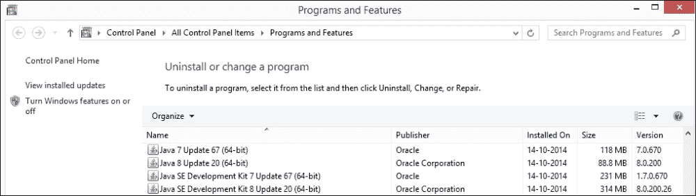
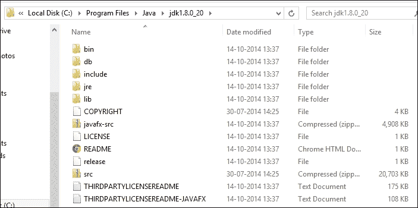
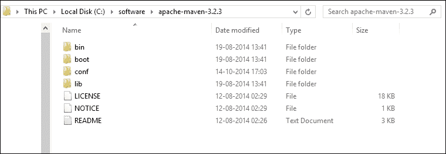
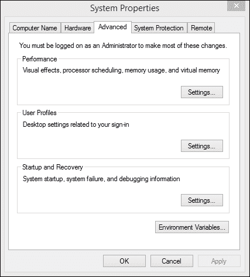
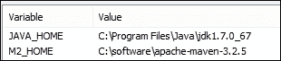
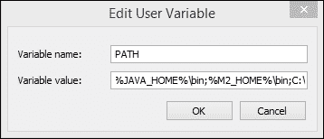
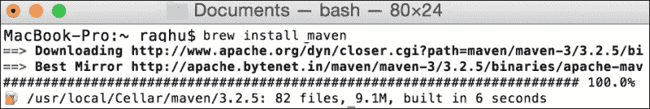
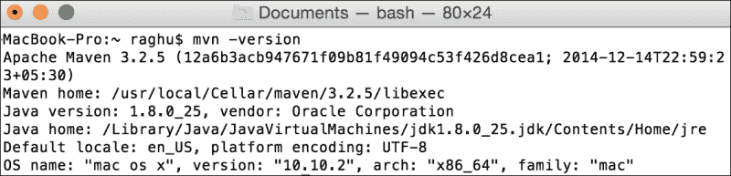
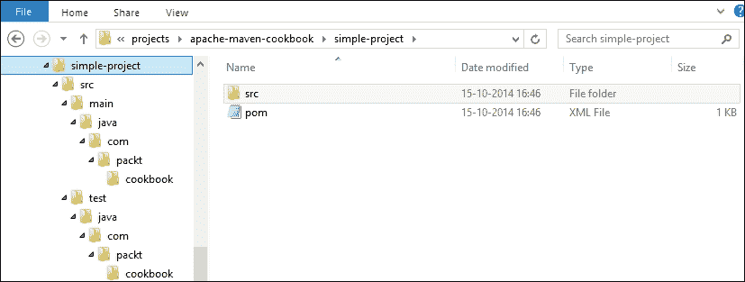
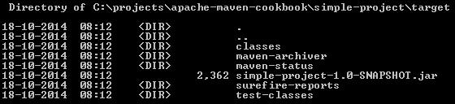

# 第一章. 入门

在本章中，我们将介绍与 Apache Maven 入门相关的基本任务：

+   在 Microsoft Windows 上安装 Maven

+   在 Mac OS X 上安装 Maven

+   在 Linux 上安装 Maven

+   更改 Maven 使用的 JDK

+   使用 Maven 创建一个简单的项目

+   使用 Maven 构建一个简单的项目

+   更改 Maven 仓库的位置

+   在 HTTP 代理服务器后面运行 Maven

+   理解标准目录结构

# 简介

Apache Maven 是构建自动化领域的一个流行工具，主要用于 Java 项目。Maven 解决了构建软件的两个方面。首先，它描述了软件是如何构建的，其次，它描述了其依赖关系。它使用约定来描述构建过程。一个 XML 文件描述了正在构建的软件项目，它对其他外部模块和组件的依赖关系，构建顺序，目录和所需的插件。它包含预定义的目标来执行某些定义明确的任务，例如代码编译和打包。Maven 从一个或多个仓库（如**Maven Central Repository**）动态下载 Java 库和 Maven 插件，并将它们存储在本地。

自从 2004 年 Maven 1.0 版本发布以来，它已经获得了广泛的认可，并且如今已成为大量开源和商业项目的构建工具。

如果你正在阅读这本书，那么你并不是来了解为什么需要 Maven 的。你是来探索 Maven 并释放它所提供的潜力的。本书的目标是让读者了解 Maven 的各种特性，包括安装、配置以及通过示例、插图和工作项目进行简单到复杂的用法。

## 与其他构建自动化工具的简要比较

让我们简要讨论一些构建自动化工具：

+   **Make**：如果你来自 C 编程世界，那么你很可能使用过 Make。Makefiles 不是平台无关的。它们与 Windows 原生不兼容。因此，它们不适合构建 Java 项目。

+   **Ant**：这是基于 Make 的，有目标和依赖关系。每个目标都有一组任务。Ant 没有约定。它是过程性的，并且没有构建生命周期的概念。Maven 有约定，是声明性的，并且有生命周期。

在本章中，我们将介绍 Maven 的基础知识——安装软件、验证安装以及创建、实现和构建一个简单的 Java 项目。我们还将介绍一些高级主题，例如更改仓库位置或在 HTTP 代理服务器后面运行 Maven，这对于那些对 Maven 默认工作方式有问题的用户可能是有用的。

让我们首先设置 Maven。我们将介绍如何在三个流行的操作系统上完成这一操作，即 Microsoft Windows、Mac OS X 和 Linux。

# 在 Microsoft Windows 上安装 Maven

在撰写本书时，Microsoft Windows 8.1 是 Microsoft Windows 的最新版本。虽然截图和输出将是针对 Microsoft Windows 8.1 的，但步骤对于早期（以及可能更晚）的版本也是相似的。

## 准备就绪

由于 Maven 需要一个 Java 平台，首先请确保您已经在系统上安装了 Java 环境，特别是**Java 开发工具包**（**JDK**）；**Java 运行环境**（**JRE**）是不够的。

您可以通过打开 **添加或删除程序** 来验证 Java 是否已安装在您的系统上。如果您看到以下截图类似的内容，JDK 已安装在您的系统上：



您还可以从 Microsoft Windows 资源管理器验证程序文件夹结构：



## 如何操作...

让我们从执行以下步骤开始安装 Java 和 Maven：

1.  将变量 `JAVA_HOME` 设置为指向 Maven 要使用的 Java 安装；例如，您可以通过以下方式设置 `JAVA_HOME` 变量：

    ```java
    C:\projects\apache_maven_cookbook>set JAVA_HOME=C:\Program Files\Java\jdk1.8.0_20

    ```

    ### 注意

    注意，此设置在关闭命令提示符后不会持久化。要持久化此设置，请使用 **控制面板** 选项中的 **环境变量...**，如稍后所述的 `M2_HOME` 变量。

1.  如果您的系统上未安装 JDK，现在是时候从 Oracle Java SE 下载页面 [`www.oracle.com/technetwork/java/javase/downloads/index.html`](http://www.oracle.com/technetwork/java/javase/downloads/index.html) 下载并安装它了。

    安装完成后，请确保 `JAVA_HOME` 已按前面所述设置。

    现在我们已经设置了 Java，让我们下载并设置 Maven。

1.  前往 [`maven.apache.org/`](http://maven.apache.org/) 并点击 **下载** 链接。

1.  显示了 Maven 最新稳定版本的链接。

1.  二进制文件以 `.zip` 和 `.tar.gz` 格式提供。选择其中之一。

1.  将下载的二进制文件解压到您希望 Maven 存放的文件夹中。在这个例子中，我选择了 `C:\software`。

    ### 提示

    最好避免使用含有空格的文件夹，因为 Maven 或其插件的某些功能可能无法正常工作。

1.  确保内容与以下截图类似：

上一张截图显示了 Maven 包含的目录列表。

现在我们简要讨论一下这些目录包含的内容：

+   `bin` 文件夹包含在各个平台上运行 Maven 所需的批处理文件和 shell 脚本。

+   `boot` 文件夹包含 Maven 启动所需的 jar 文件。

+   `conf` 文件夹包含 Maven 使用的默认 `settings.xml` 文件。

+   `lib` 文件夹包含 Maven 使用的库。它还包含一个 `ext` 文件夹，其中可以放置第三方扩展，这些扩展可以扩展或覆盖默认的 Maven 实现。

现在我们来确保可以从命令提示符运行 Maven，通过执行以下步骤：

1.  打开 **控制面板**：

1.  选择 **高级系统设置**：

1.  点击 **环境变量...**。添加 `M2_HOME` 变量并将其设置为 Maven 提取的文件夹。

1.  编辑 `PATH` 变量以包括 Maven 的 `bin` 文件夹。

## 它是如何工作的...

Maven 安装本质上是一组 JAR 文件、配置文件和一个 Microsoft Windows 批处理文件 `mvn.bat`。

`mvn` 命令本质上运行这个批处理文件。它首先检查 `JAVA_HOME`。此文件位于 Maven 安装的 `bin` 文件夹中，因此它需要位于 `PATH` 中。

如果批处理文件找不到 `JAVA_HOME`，它会在其 `PATH` 中查找 `Java`。这可能导致意外结果，因为通常 `PATH` 中的 `Java` 是 JRE 而不是 JDK。

批处理文件接着查找 `M2_HOME`，这是 Maven 安装的位置。它这样做是为了能够加载存在的库。

此外，它还会读取在 `MAVEN_OPTS` 中指定的值。此变量允许您使用额外的堆大小和其他 Java 参数运行 Maven。

使用 `JAVA_HOME`、`M2_HOME` 和 `Maven_OPTS` 的值，批处理文件会运行其主类 `org.codehaus.plexus.classworlds.launcher.Launcher`。

## 更多内容...

使用以下步骤验证您的 Maven 安装：

1.  在 Microsoft Windows 中打开命令提示符并运行以下命令：

    ```java
    C:\software\apache-maven-cookbook>mvn -version

    ```

1.  应该显示以下输出：

    ```java
    Apache Maven 3.2.5 (12a6b3acb947671f09b81f49094c53f426d8cea1; 2014-12-14T22:59:23+05:30)
    Maven home: C:\software\apache-maven-3.2.5
    Java version: 1.7.0_67, vendor: Oracle Corporation
    Java home: C:\Program Files\Java\jdk1.7.0_67\jre
    Default locale: en_IN, platform encoding: Cp1252
    OS name: "windows 8.1", version: "6.3", arch: "amd64", family: "windows"

    ```

## 相关阅读

+   本章中 *使用 Maven 创建简单项目* 的配方

# 在 Mac OS X 上安装 Maven

让我们看看在 Mac OS X 上安装 Maven 的步骤。这适用于最新的 Mac OS X 版本，即 Yosemite。

以前，苹果为 Mac 提供了 Java，但从 Java 7 开始停止了这一做法。苹果 Java 不适用于最新的 Mac OS X 版本。

## 准备中

让我们检查您的 Mac 上是否有 Java 环境：

1.  打开终端并运行以下命令：

    ```java
    /usr/libexec/java_home -v 1.7

    ```

1.  查看您是否得到以下类似的输出：

    ```java
    /Library/Java/JavaVirtualMachines/jdk1.7.0_71.jdk/Contents/Home

    ```

1.  运行以下命令以检查您是否有 Java 8：

    ```java
    /usr/libexec/java_home -v 1.8

    ```

1.  如果存在 Java，这将给出以下输出：

    ```java
    /Library/Java/JavaVirtualMachines/jdk1.8.0_25.jdk/Contents/Home
    ```

    如您所见，我的系统上既有 Java 1.7 也有 1.8。

1.  将 `JAVA_HOME` 设置为所需的 JDK。这可以通过两种方式完成，具体取决于您的需求：

    如果这是会话期间的临时设置，请运行以下命令：

    ```java
    export JAVA_HOME=/Library/Java/JavaVirtualMachines/jdk1.8.0_25.jdk/Contents/Home

    ```

    如果这是永久的，请将前面的行添加到您的 `HOME` 文件夹中的 `.bash_profile`。

### 小贴士

确保您有 JDK 安装而不是 JRE。

如果没有 Java，请从 Oracle Java 下载页面 [`www.oracle.com/technetwork/java/javase/downloads/index.html`](http://www.oracle.com/technetwork/java/javase/downloads/index.html) 下载并安装 Java。

安装完成后，按照前面的步骤验证 Java 安装。

现在，让我们在 Mac OS X 上设置 Maven。

## 如何操作...

按照以下步骤从其官方网站下载 Maven：

1.  前往 [`maven.apache.org/`](http://maven.apache.org/) 并点击 **下载** 链接。将显示 Maven 的最新稳定版本的链接。

1.  二进制文件以 `.zip` 和 `.tar.gz` 格式提供。选择其中之一。

1.  将下载的二进制文件提取到你想让 Maven 存放的文件夹中。对于 Mac 来说，通常是 `/usr/local` 文件夹。

1.  你需要超级用户（su）或管理员权限才能将内容放置在 `/usr/local` 文件夹中。如果没有权限，可以将内容放置在 `HOME` 文件夹的子文件夹中。

1.  通过执行以下命令确保内容与以下输出类似：

    ```java
    /usr/local/apache-maven-3.2.5$ ls -l

    ```

    输出如下所示：

    ```java
    total 27
    -rw-r--r--    1 root    wheel    17464 Aug 12 02:29 LICENSE
    -rw-r--r--    1 root    wheel      182 Aug 12 02:29 NOTICE
    -rw-r--r--    1 root    wheel     2508 Aug 12 02:26 README.txt
    drwxr-xr-x    8 root    wheel     4096 Aug 19 13:41 bin
    drwxr-xr-x    3 root    wheel        0 Aug 19 13:41 boot
    drwxr-xr-x    4 root    wheel        0 Oct 14 17:39 conf
    drwxr-xr-x   67 root    wheel    28672 Aug 19 13:41 lib

    ```

1.  按如下设置 `M2_HOME` 变量：

    ```java
    export M2_HOME=/usr/local/apache-maven-3.2.5

    ```

1.  将 `PATH` 更新为包括 Maven 的 `bin` 文件夹：

    ```java
    export PATH=$PATH:$M2_HOME/bin

    ```

### 小贴士

与 `JAVA_HOME` 一样，前面的设置可以通过更新 `.bash_profile` 中的前几行来持久化。

在前面的步骤中，我们讨论了从官方网站下载 Maven 的步骤。现在，我们将讨论使用 brew 安装 Maven。Brew 是 Mac OS X 上安装开源软件的流行应用程序。如果你在 Mac OS X 上安装了 brew，运行以下命令来安装 Maven：

```java
brew install maven

```

前一个命令的输出将显示如下截图：



## 它是如何工作的...

Maven 安装本质上是一组 JAR 文件、配置文件和一个 Mac OS X shell 脚本，即 `mvn`。

`mvn` 命令本质上运行这个脚本。它首先检查 `JAVA_HOME`。这个文件位于 Maven 安装的 `bin` 文件夹中，因此它需要位于 `PATH` 中。

如果 shell 脚本找不到 `JAVA_HOME`，它会在其 `PATH` 中查找 `Java`。这可能会导致意外结果，因为通常 `PATH` 中的 `Java` 是 JRE 安装，而不是 JDK。

然后 shell 脚本会查找 `M2_HOME`，这是 Maven 安装的位置。这样做是为了能够加载现有的库。

此外，它还会读取在 `MAVEN_OPTS` 中指定的值。这个变量允许你以额外的堆大小和其他 Java 参数运行 Maven。

使用 `JAVA_HOME`、`M2_HOME` 和 `MAVEN_OPTS` 的值，shell 脚本运行其主类 `org.codehaus.plexus.classworlds.launcher.Launcher`。

## 更多内容...

使用以下步骤验证你的 Maven 安装：

1.  打开命令提示符并运行以下命令：

    ```java
    mvn –version

    ```

1.  前一个命令的输出应显示如下截图所示：

## 参见

+   本章中 *使用 Maven 创建简单项目* 的配方

# 在 Linux 上安装 Maven

让我们看看在 Linux 上安装 Maven 的步骤。

尽管有众多 Linux 版本（Ubuntu、Fedora、RHEL、SUSE、CentOS 等），但设置 Maven 的步骤是相似的。

## 准备工作

Maven 需要 Java，特别是 Java 开发工具包 (JDK)。使用以下步骤，让我们检查它是否已安装在你的 Linux 系统中，这有点复杂：

1.  打开终端并运行以下命令：

    ```java
    java -version

    ```

1.  检查你是否得到了以下类似的输出：

    ```java
    java version "1.7.0_65"
    OpenJDK Runtime Environment (rhel-2.5.1.2.el6_5-x86_64 u65-b17)

    ```

    前一个输出仍然无法告诉你 Java 的安装位置，这是设置 `JAVA_HOME` 所必需的。你可以通过执行以下步骤来获取这个信息。

1.  检查 `javac` 是否工作；它只有在 JDK 安装的情况下才会工作，而不是 JRE：

    ```java
    $ javac -version

    ```

    前一个命令的输出如下所示：

    ```java
    javac 1.7.0_65

    ```

1.  查找 `javac` 命令的位置：

    ```java
    $ which javac

    ```

    前一个命令的输出如下所示：

    ```java
    /usr/bin/javac

    ```

1.  在前面的输出中，`javac` 是指向文件实际位置的符号链接。你可以通过以下方式尝试确定这个位置：

    ```java
    $ readlink /usr/bin/javac

    ```

    前一个命令的输出如下所示：

    ```java
    /etc/alternatives/javac

    ```

1.  通过执行前面的命令，我们再次得到了符号链接。要获取 `javac` 位置的路径，我们再次执行以下命令：

    ```java
    $ readlink /etc/alternatives/javac

    ```

    前一个命令的输出如下所示：

    ```java
    /usr/lib/jvm/java-1.7.0-openjdk.x86_64/bin/javac

    ```

1.  我们现在已经找到了 JDK 安装的文件夹：

    ```java
    /usr/lib/jvm/java-1.7.0-openjdk.x86_64/

    ```

1.  将 `JAVA_HOME` 设置为上一个文件夹。这可以通过两种方式完成，具体取决于你的需求：

    如果这是会话期间的临时设置，请运行以下命令：

    ```java
    export JAVA_HOME=/usr/lib/jvm/java-1.7.0-openjdk.x86_64/

    ```

    如果这是永久的，请将前面的行添加到你的 `HOME` 文件夹中的 `.bash_profile` 文件中。

如果 Java 不存在，请从 Oracle Java 下载页面 [`www.oracle.com/technetwork/java/javase/downloads/index.html`](http://www.oracle.com/technetwork/java/javase/downloads/index.html) 下载并安装 Java。

如果你有一个基于 rpm 的 Linux 发行版，你可以下载并安装 `rpm`。否则，你可以下载发行版的 `.tar.gz` 格式并将其解压到你选择的文件夹中。

在前面的例子中，你知道 Java 的确切安装位置，并可以相应地设置 `JAVA_HOME`。一旦安装，可以通过遵循前面的步骤来验证 Java 安装。

现在，让我们在 Linux 上设置 Maven。

## 如何做到这一点...

要在 Linux 上设置 Maven，请执行以下步骤：

1.  前往 [`maven.apache.org/`](http://maven.apache.org/) 并点击 **下载** 链接。将显示 Maven 最新稳定版本的链接。

1.  二进制文件以 `.zip` 和 `.tar.gz` 格式提供。对于 Mac OS X 和 Linux，首选的下载格式是 `.tar.gz`。

1.  将下载的二进制文件解压到你希望 Maven 存放的文件夹中。在 Linux 中，典型的位置是 `/usr/local` 文件夹。

    ### 小贴士

    你需要超级用户 (su) 或管理员权限才能将内容放置在 `/usr/local` 文件夹中。如果你没有权限，你可以在 `HOME` 文件夹的子文件夹中放置它。

1.  执行以下命令，并确保 `apache-maven-3.2.5` 文件夹的内容与以下输出类似：

    ```java
    /usr/local/apache-maven-3.2.5$ ls -l

    ```

    前一个命令的输出如下所示：

    ```java
    total 27
    -rw-r--r--    1 root    root    17464 Aug 12 02:29 LICENSE
    -rw-r--r--    1 root    root      182 Aug 12 02:29 NOTICE
    -rw-r--r--    1 root    root     2508 Aug 12 02:26 README.txt
    drwxr-xr-x    8 root    root     4096 Aug 19 13:41 bin
    drwxr-xr-x    3 root    root        0 Aug 19 13:41 boot
    drwxr-xr-x    4 root    root        0 Oct 14 17:39 conf
    drwxr-xr-x   67 root    root    28672 Aug 19 13:41 lib

    ```

1.  将 `M2_HOME` 变量设置如下：

    ```java
    export M2_HOME=/usr/local/apache-maven-3.2.5

    ```

1.  更新 `PATH` 以包括 Maven 的 `bin` 文件夹：

    ```java
    export PATH=$PATH:$M2_HOME/bin

    ```

与 `JAVA_HOME` 类似，前面的设置可以通过更新 `.bash_profile` 来持久化。

## 它是如何工作的...

Maven 的安装本质上是一组 JAR 文件、配置文件和一个 Linux shell 脚本，即 `mvn`。

`mvn` 命令本质上运行此脚本。它首先检查 `JAVA_HOME`。此文件位于 Maven 安装的 `bin` 文件夹中，因此需要位于 `PATH` 中。

如果 shell 脚本找不到 `JAVA_HOME`，它会在其 `PATH` 中查找 `java`。这可能会导致意外结果，因为通常 `PATH` 中的 `Java` 是 JRE 而不是 JDK。

shell 脚本随后会查找 `M2_HOME`，这是 Maven 安装的位置。它这样做是为了能够加载现有的库。

此外，它还会读取在 `MAVEN_OPTS` 中指定的值。此变量允许您使用额外的堆大小和其他 Java 参数运行 Maven。

使用 `JAVA_HOME`、`M2_HOME` 和 `MAVEN_OPTS` 的值，shell 脚本运行其 `org.codehaus.plexus.classworlds.launcher.Launcher` 主类。

## 还有更多...

使用以下步骤，让我们通过运行 Maven 命令来确认 Maven 是否已正确设置：

1.  打开命令提示符并运行以下命令：

    ```java
    mvn –version

    ```

1.  应显示以下输出：

    ```java
    Apache Maven 3.2.5 (12a6b3acb947671f09b81f49094c53f426d8cea1; 2014-12-14T22:59:23+05:30)
    Maven home: /usr/local/maven
    Java version: 1.7.0_65, vendor: Oracle Corporation
    Java home: /usr/lib/jvm/java-1.7.0-openjdk-1.7.0.65.x86_64/jre
    Default locale: en_US, platform encoding: ANSI_X3.4-1968
    OS name: "linux", version: "2.6.32-279.22.1.el6.x86_64", arch: "amd64", family: "unix"

    ```

如果您遇到错误，请重新检查安装步骤并重复执行。

## 参见

+   本章中 *使用 Maven 创建一个简单项目* 的配方

# 更改 Maven 使用的 JDK

您的系统上可以安装多个 JDK 版本。通过遵循一些简单的步骤，您可以指定和/或更改 Maven 使用的 JDK。

## 如何操作...

您会记得，在早期部分，我们使用了 Java SE 7。现在让我们将其更改为 Java SE 8。要在 Microsoft Windows 上将 JDK 版本更改为 Java SE 8，请执行以下步骤：

1.  从命令提示符运行以下命令：

    ```java
    set JAVA_HOME=C:\Program Files\Java\jdk1.8.0_20

    ```

1.  对于 Linux 或 Mac，命令将是：

    ```java
    export JAVA_HOME=<java-8-home-folder>

    ```

1.  现在，运行以下命令以检查已安装的 Maven 版本：

    ```java
    mvn –version

    ```

1.  要检查 Microsoft Windows 上安装的 Maven 版本，请在命令提示符中运行以下命令。您应该得到以下输出。Linux 和 Mac 的输出将类似：

    ```java
    C:\projects\apache-maven-cookbook>mvn -version

    ```

    前一个命令的输出如下所示：

    ```java
    Apache Maven 3.2.5 (12a6b3acb947671f09b81f49094c53f426d8cea1; 2014-12-14T22:59:23+05:30)
    Maven home: C:\software\apache-maven-3.2.5
    Java version: 1.8.0_20, vendor: Oracle Corporation
    Java home: C:\Program Files\Java\jdk1.8.0_20\jre
    Default locale: en_IN, platform encoding: Cp1252
    OS name: "windows 8.1", version: "6.3", arch: "amd64", family: "windows"

    ```

## 它是如何工作的...

Maven 总是使用由 `JAVA_HOME` 指定的 JDK，无论系统上有多少 JDK 安装。这使用户能够根据需要或基于项目更改 JDK。

因此，确保 `JAVA_HOME` 已定义非常重要。如果没有这个变量，Maven 将尝试从 `PATH` 中检测 Java 的存在。这通常是 JRE 而不是 JDK。

# 使用 Maven 创建一个简单的项目

现在我们已经在我们的首选操作系统上设置了 Maven 并验证了它运行良好，是时候创建一个简单的 Java 项目了。

Maven 通过创建一系列遵循接受惯例的文件和文件夹，使启动新项目变得容易。

## 如何操作...

让我们开始使用 Maven 创建第一个简单项目，按照以下步骤操作：

1.  打开命令提示符，并将目录更改为你想要创建第一个 Maven 项目的文件夹。

1.  运行以下命令：

    ```java
    mvn archetype:generate -DgroupId=com.packt.cookbook -DartifactId=simple-project -DarchetypeArtifactId=maven-archetype-quickstart -DinteractiveMode=false

    ```

    你可以根据需要更改前面命令中的`groupId`和`artifactId`值。

1.  你将看到 Maven 下载了一堆文件：

    ```java
    Downloading: https://repo.maven.apache.org/maven2/org/apache/maven/plugins/maven-clean-plugin/2.5/maven-clean-plugin-2.5.pom
    Downloaded: https://repo.maven.apache.org/maven2/org/apache/maven/plugins/maven-clean-plugin/2.5/maven-clean-plugin-2.5.pom (4 KB at 1.4 KB/sec)

    ```

1.  然后，它将开始生成源代码：

    ```java
    [INFO] >>> maven-archetype-plugin:2.2:generate (default-cli) > generate-sources
    @ standalone-pom >>>

    ```

1.  当 Maven 完成生成源代码后，它将创建我们想要的项目：

    ```java
    [INFO] Using following parameters for creating project from Old (1.x) Archetype:
    maven-archetype-quickstart:1.0
    [INFO] ----------------------------------------------------------------------------
    [INFO] Parameter: groupId, Value: com.packt.cookbook
    [INFO] Parameter: packageName, Value: com.packt.cookbook
    [INFO] Parameter: package, Value: com.packt.cookbook
    [INFO] Parameter: artifactId, Value: simple-project
    [INFO] Parameter: basedir, Value: C:\projects\apache-maven-cookbook
    [INFO] Parameter: version, Value: 1.0-SNAPSHOT
    [INFO] project created from Old (1.x) Archetype in dir: C:\projects\apache-maven-cookbook\simple-project

    ```

### 小贴士

**下载示例代码**

你可以从[`www.packtpub.com`](http://www.packtpub.com)下载示例代码文件，这是你购买的所有 Packt Publishing 书籍的账户。如果你在其他地方购买了这本书，你可以访问[`www.packtpub.com/support`](http://www.packtpub.com/support)并注册，以便将文件直接通过电子邮件发送给你。

## 如何工作...

在运行前面命令创建简单项目时，你是否遇到了错误？

一种可能性是，你的 Maven 位于 HTTP 代理服务器后面。如果是这样，请参阅本章中的“在 HTTP 代理服务器后面运行 Maven”配方。

让我们看看创建的文件夹结构：



你会注意到以下事项：

+   Maven 项目配置文件`pom.xml`在`simple-project`文件夹的根目录下创建。我们将在后续章节中详细探讨这个文件。

+   创建了一堆文件夹：

    +   `src\main\java`：这是用于 Java 源文件的目录

    +   `src\test\java`：这是用于 Java 测试源文件的目录

    +   `src\main\resources`：这是用于项目的资源文件

    +   `src\test\resources`：这是用于测试的资源文件

+   在上述每个文件夹中，创建了一个与`groupId`（`org.packt.cookbook`）相对应的文件夹结构。

以下基本上是 Maven 约定在起作用：

+   Maven 期望所有 Java 源文件都位于`src\main\java`

+   同样，它期望所有 Java 测试文件都位于`src\test\java`

+   它期望所有项目资源都位于`src\main\resources`，测试资源位于`src\test\resources`

+   它期望源文件通常具有与`groupId`参数相同的包结构（尽管这不是强制性的）

+   创建了两个示例类，分别是`App.java`和`AppTest.java`，并且预期它们不会用于测试 Maven 的工作之外

我们在本章的“使用 Maven 创建简单项目”配方中使用的`mvn`命令，试图使用指定的命令行参数调用`archetype`插件的`generate`目标。

默认的 Maven 安装具有最小功能。Maven 的所有功能都作为 Maven 插件提供。当给出插件名称时，Maven 知道从哪里下载它，然后运行它。

在这种情况下，Maven 下载了 `archetype` 插件。此插件反过来又可以依赖于另一个插件。在这种情况下，后者插件被下载。这以递归的方式发生，并且在过程结束时，下载了运行指定命令所需的所有相关插件。

这些插件被放置在你的本地仓库中，这是你的系统中的一个位置。一旦下载，除非被删除，否则将不再下载。

## 相关阅读

+   本章中关于*在 HTTP 代理服务器后面运行 Maven*的配方

# 使用 Maven 构建简单的项目

让我们现在构建前面部分创建的项目。

## 如何做...

要使用 Maven 构建之前创建的简单项目，执行以下步骤：

1.  打开命令提示符并运行以下命令，将目录更改为项目创建的文件夹：

    ```java
    mvn package

    ```

1.  在输出中观察以下内容：

    注意以下警告（我们将在本书的后面部分看到如何解决它）：

    ```java
    [INFO] --- maven-resources-plugin:2.6:resources (default-resources) @ simple-project ---
    [WARNING] Using platform encoding (Cp1252 actually) to copy filtered resources,
    i.e. build is platform dependent!

    ```

    检查源是否已编译：

    ```java
    [INFO] --- maven-compiler-plugin:3.1:compile (default-compile) @ simple-project

    ```

    检查测试是否已运行：

    ```java
    [INFO] --- maven-surefire-plugin:2.12.4:test (default-test) @ simple-project ---
    [INFO] Surefire report directory: C:\projects\apache-maven-cookbook\simple-project\target\surefire-reports
    -------------------------------------------------------
     T E S T S
    -------------------------------------------------------
    Running com.packt.cookbook.AppTest
    Tests run: 1, Failures: 0, Errors: 0, Skipped: 0, Time elapsed: 0.005 sec

    ```

1.  现在已创建了一个 JAR 文件。

## 它是如何工作的...

在 `mvn package` 命令中，`package` 参数是构建生命周期中的一个阶段。Maven 有一个默认的构建生命周期，包含多个阶段。每个阶段将按顺序执行它之前的所有阶段以及指定的阶段。在这种情况下，`package` 阶段按以下顺序执行：

+   验证

+   编译

+   测试

+   包

`validate` 阶段确保项目（特别是描述项目的 `pom.xml` 文件）处于良好状态，并且运行项目所需的所有必要信息都可用。

`compile` 阶段编译源代码。

`test` 阶段编译测试源代码，然后使用合适的测试框架运行测试。在早期示例中，使用 **JUnit** 框架运行测试。

`package` 阶段将工件打包到 `pom.xml` 文件中指定的格式。

# 更改 Maven 仓库的位置

有三种类型的 Maven 仓库：

+   **本地**：这是你的计算机文件系统中的仓库

+   **远程**：这是下载所需 Maven 文件的仓库

+   **镜像**：这些是仓库管理器，例如 **Nexus** 和 **Artifactory**，它们镜像各种仓库

你已经看到 Maven 下载了许多文件（称为 poms 和 jars）。让我们看看它们在你的计算机中的位置：

+   在 Microsoft Windows 中，转到你的 `HOME` 文件夹（`C:\Users\username`），对于 Mac 是 `/Users/username`，对于 Linux 是 `/home/username`（或类似位置）

+   你将注意到 `.m2` 文件夹，在其中，有一个名为 `repository` 的子文件夹

    ### 小贴士

    任何以点（`.`）开头的文件夹通常都会被隐藏起来。你需要更改文件夹查看器设置才能看到它。

+   你将看到许多由 Maven 使用的文件夹和文件

你可能希望出于以下原因更改此位置：

+   您可能想要在 Microsoft Windows 中节省 C 驱动器的空间，并将这些文件夹和文件存储在 D 驱动器上。

+   您可能想要备份内容。备份软件通常会在文件系统的特定文件夹中备份内容。

+   您的组织可能有一项政策，要求所有用户将本地仓库存储在同一个文件夹中。

## 如何操作...

要更改 Maven 仓库的位置，请执行以下步骤：

1.  在 `.m2` 文件夹中创建一个名为 `settings.xml` 的文件。

1.  将以下内容添加到您刚刚创建的 settings.xml 文件中：

    ```java
    <settings 

     xsi:schemaLocation="http://maven.apache.org/SETTINGS/1.0.0
                          http://maven.apache.org/xsd/settings-1.0.0.xsd">
        <localRepository>C:/software/maven</localRepository>
    </settings>
    ```

    注意前面代码中高亮的部分。我们已经将仓库内容的位置更改为 C:\software\maven。您可以将它更改为任何有效的文件夹名称。

1.  删除 `repository` 子文件夹，然后再次运行 `mvn package` 命令。

    您现在会注意到，`repository` 文件夹并没有创建在 `.m2` 文件夹中。相反，它被创建在 `C:\software\maven`。

## 它是如何工作的...

Maven 以以下方式确定本地仓库的位置：

+   如果用户 `.m2` 文件夹中存在 `settings.xml` 文件，其中包含 `<localRepository>` 标签，那么 Maven 将使用其内容来确定位置

+   如果没有，Maven 将检查默认的 `settings.xml` 文件中是否明确定义了 `localRepository`，该文件位于 Maven 安装目录的 `conf` 文件夹中。

+   如果本地仓库不存在，Maven 将使用默认值，即用户的 `.m2` 文件夹

# 在 HTTP 代理服务器后面运行 Maven

大多数组织出于安全和其它原因不允许其网络中的设备直接访问互联网。在这种情况下，通常会出现代理服务器。代理服务器的详细信息在浏览器或任何需要互联网访问的其他位置指定。

## 如何操作...

让我们通过以下步骤在 HTTP 代理服务器后面运行 Maven：

1.  如果您的 `HOME` 目录中的 `.m2` 文件夹中尚未创建 `settings.xml` 文件，请创建一个。

1.  在 `settings` 标签内添加以下代码：

    ```java
      <proxies>
        <proxy>
          <id>myproxy</id>
          <active>true</active>
          <protocol>http</protocol>
          <host>proxy.myorg.com</host>
          <port>8080</port>
          <username>proxyuser</username>
          <password>somepassword</password>
          <nonProxyHosts>*.myorg.com </nonProxyHosts>
        </proxy>
      </proxies>
    ```

如果代理服务器不需要身份验证，可以省略 `username` 和 `password` 标签。

`nonProxyHosts` 标签允许您指定可以直接访问的位置（例如，您的内部网络）。如果不相关，可以跳过。

## 它是如何工作的...

Maven 需要互联网访问来下载插件和依赖项。当 Maven 运行时，它会读取用户的 `settings.xml` 文件（如果存在）。它会检查任何活动的代理设置并应用相同的设置。

Maven 使用代理设置中的值从仓库下载任何工件。如果没有要下载的工件，则不使用这些值。

### 注意

HTTP 代理服务器可能只在您的组织网络中工作。如果您从不同的网络运行 Maven，您可能希望关闭 HTTP 代理服务器。这可以通过在前面代码中将 `active` 标签设置为 `false` 来完成。

# 理解标准目录布局

当我们之前构建我们的示例 Java 项目时，我们看到了文件被编译、测试被执行，以及 JAR 文件被生成。我们不知道这些工件是在哪里创建的。

## 如何操作...

让我们通过以下步骤找到工件创建的位置：

1.  前往包含示例 Maven 项目的文件夹。

1.  打开创建的 `target` 子文件夹：

## 它是如何工作的...

当 Maven 运行时，它会将所有生成的内容放入一个单独的文件夹中。这是为了将其与用户生成的任何内容区分开来。让我们检查这个文件夹的内容：

+   `classes` 文件夹：编译后的源文件放置在这个文件夹中。这个文件夹还将包含资源，例如 XML 和属性文件，这些文件是源代码的一部分，放置在 `src/main/resources` 中。

+   `test-classes` 文件夹：编译后的测试源文件存放在这个文件夹中。此外，它还包含测试资源，这些是用于测试目的但不是用于运行项目的文件。

+   `surefire-reports` 文件夹：测试报告被单独放置在这个文件夹中。通常，这里提供 XML 和 HTML 报告格式。后者可以在浏览器中打开，而前者可以与代码覆盖率工具集成。

+   输出的 `.jar` 文件：生成的项目工件也存在于这个文件夹中。

+   另外两个文件夹——`maven-archiver` 和 `maven-status`——包含 Maven 在构建过程中使用的信息。
