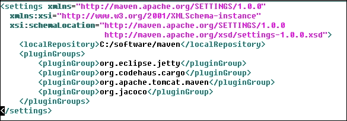
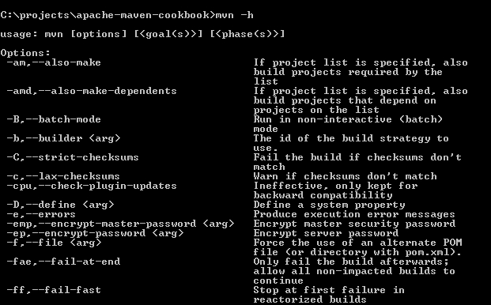

# 第三章：Maven 生命周期

让我们开始使用 Maven。在本章中，我们将介绍以下食谱：

+   理解 Maven 生命周期、阶段和目标

+   理解 pom 文件

+   理解 Maven 设置

+   理解 Maven 的命令行选项

+   理解 Maven 配置文件

+   添加新的 Maven 配置文件

+   激活/停用 Maven 配置文件

+   在 Maven 中使用属性

+   指定平台无关构建的源编码

# 简介

我们已经在我们的计算机上设置了 Maven。我们已经创建了一个简单的 Maven 项目并看到了如何构建它。我们还设置了 Maven 在我们首选的 IDE 上运行。

现在我们更好地理解 Maven 的工作原理以及如何使用它。我们将从理解 Maven 构建生命周期以及构成生命周期的阶段和目标开始。我们还将探索 Maven 的项目配置 pom 文件以及设置文件。我们还将尝试理解 Maven 配置文件是什么以及为什么需要它们。最后，我们将查看 Maven 的属性。

# 理解 Maven 生命周期、阶段和目标

当我们开始使用 Maven 时，我们需要了解 Maven 项目的生命周期。Maven 是基于构建生命周期的概念实现的。这意味着有一个明确的过程来使用 Maven 构建和分发工件。

生命周期由什么组成？生命周期的阶段被称为阶段。在每个阶段，可以执行一个或多个目标。

## 准备工作

Maven 已在您的系统上设置并验证其工作状态。有关设置 Apache Maven 的信息，请参阅第一章的前三个食谱，*入门*。

## 如何做到这一点...

要构建一个 Maven 项目，请执行以下步骤：

1.  打开命令提示符。

1.  运行我们熟悉的 Maven 命令之一：

    ```java
    mvn package

    ```

1.  观察执行的各种步骤。

## 它是如何工作的...

Maven 有三个内置的构建生命周期：

+   `default`：`default` 生命周期处理项目的构建和部署

+   `clean`：`clean` 生命周期清理 Maven 生成的文件和文件夹

+   `site`：`site` 生命周期处理项目文档的创建

您会注意到您不必明确指定生命周期。相反，您指定的是阶段。Maven 根据指定的阶段推断生命周期。

例如，`package` 阶段表明它是 `default` 生命周期。

当 Maven 以 `package` 阶段作为参数运行时，将执行 `default` 构建生命周期。Maven 将按顺序运行所有阶段，直到并包括指定的阶段（在我们的例子中是 `package` 阶段）。

虽然每个生命周期都有多个阶段，但让我们看看每个生命周期的重要阶段：

+   `clean` 生命周期：`clean` 阶段会移除 Maven 在构建过程中创建的所有文件和文件夹

+   `site` 生命周期：`site` 阶段生成项目的文档，可以发布，以及可以进一步定制的模板

+   `default` 生命周期：以下是一些 `default` 生命周期的关键阶段：

    +   `validate`：这个阶段验证所有项目信息是否可用且正确

    +   `process-resources`：这个阶段将项目资源复制到目标位置以打包

    +   `compile`：这个阶段编译源代码

    +   `test`：这个阶段在合适的框架内运行单元测试

    +   `package`：这个阶段将编译后的代码打包成其分发格式

    +   `integration-test`：这个阶段在集成测试环境中处理包

    +   `verify`：这个阶段运行检查以验证包是否有效

    +   `install`：这个阶段将包安装到本地仓库

    +   `deploy`：这个阶段将最终包安装到配置的仓库

每个阶段由插件目标组成。插件目标是一个构建项目的特定任务。一些目标只在特定阶段有意义（例如，Maven Compiler 插件的编译目标在编译阶段有意义，但 Maven Checkstyle 插件的 `checkstyle` 目标可以在任何阶段运行）。因此，一些目标绑定到生命周期的特定阶段，而其他则不是。

这里是一个阶段、插件和目标的表格：

| 阶段 | 插件 | 目标 |
| --- | --- | --- |
| `clean` | Maven Clean 插件 | clean |
| `site` | Maven Site 插件 | site |
| `process-resources` | Maven Resources 插件 | resource |
| `compile` | Maven Compiler 插件 | compile |
| `test` | Maven Surefire 插件 | test |
| `package` | 根据打包方式而异；例如，Maven JAR 插件 | jar（在 Maven JAR 插件的情况下） |
| `install` | Maven Install 插件 | install |
| `deploy` | Maven Deploy 插件 | deploy |

# 理解 pom 文件

每个 Maven 项目都有一个 pom 文件，它定义了项目的内容以及如何构建它。Pom 是 **项目对象模型** 的缩写。让我们看看这个文件。

## 如何操作...

让我们通过以下步骤来理解 pom 文件：

1.  前往我们在前几章中创建的 Maven 项目。

1.  打开名为 `pom.xml` 的文件。

## 它是如何工作的...

pom 文件是一个基于特定架构的 XML 文件，如文件顶部所指定的：

```java
<project 

  xsi:schemaLocation="http://maven.apache.org/POM/4.0.0
                      http://maven.apache.org/xsd/maven-4.0.0.xsd">
```

此外，还有一个 `modelVersion` 元素，它定义了此架构的版本：

```java
<modelVersion>4.0.0</modelVersion>
```

这些是 pom 文件的基本元素。

`groupId` 元素是项目所属组织的唯一标识符。对于我们的示例项目，它是 `org.packt.cookbook`。遵循反向域名表示法来指定这是一个好习惯：

```java
<groupId>...</groupId>
```

`artifactId` 元素是项目的名称。对于我们的示例项目，它是 `simple-project`：

```java
<artifactId>...</artifactId>
```

`version` 元素是项目的特定实例，对应于特定时间点的源代码。在我们的例子中，它是 `1.0-SNAPSHOT`，这是开发期间的一个默认版本：

```java
<version>...</version>
```

我们将在本书的后面部分探讨 **SNAPSHOT** 版本和具体版本之间的区别。

`groupId`、`artifactId`和`version`的组合唯一标识项目。从这个意义上讲，它们是项目的坐标。

`packaging`元素表示项目的工件类型。这通常是`jar`、`war`、`zip`，在某些情况下，是`pom`：

```java
  <packaging>...</packaging>
```

pom 文件中的`dependencies`元素部分定义了此项目的所有依赖项目。这通常是需要构建、测试和运行项目的第三方库：

```java
  <dependencies>...</dependencies>
```

`parent`部分用于表示关系，具体来说是父子关系。如果项目是多模块项目的一部分或从另一个项目继承项目信息，那么详细信息将在此部分中指定：

```java
  <parent>...</parent>
```

Maven 属性是**占位符**。它们的值可以通过使用`${key}`在任何 pom 文件位置访问，其中`key`是属性名称：

```java
  <properties>...</properties>
```

拥有模块的项目被称为多模块或**聚合项目**。模块是 pom 文件中列出的项目，并且作为一个组执行：

```java
  <modules>...</modules>
```

有关多模块项目的更多信息，请参阅第九章，*多模块项目*。

# 理解 Maven 设置

现在我们已经了解了 pom 文件的基本元素，让我们也来检查 Maven 的各种设置属性。

## 如何操作...

要了解 Maven 设置，请执行以下步骤：

1.  如果存在，打开您的`HOME`文件夹的`.m2`子文件夹中的`settings.xml`文件：

1.  否则，打开 Maven 安装目录下的`conf`文件夹中的`settings.xml`文件（如`M2_HOME`中定义的）。

## 它是如何工作的...

Maven 有一个全局设置文件，名为`settings.xml`，位于 Maven 安装目录的`conf`文件夹中。此文件中的值可以在用户设置文件中覆盖——存在于您的`HOME`文件夹`.m2`子文件夹中的`settings.xml`文件。

设置文件包含不是特定于项目的配置，而是具有全局性质。它还包含不打算分发的信息（例如，密码）。

与 pom 文件一样，设置文件也是一个基于 XML 模式的 XML 文件。它以以下方式开始：

```java
<settings 

      xsi:schemaLocation="http://maven.apache.org/SETTINGS/1.0.0
                          http://maven.apache.org/xsd/settings-1.0.0.xsd">
```

现在我们来看一些典型的设置配置：

### `localRepository`元素

以下代码表示设置文件中的`localRepository`元素：

```java
<localRepository>${user.home}/.m2/repository</localRepository>
```

我们在第一章中看到的`Changing the location of the Maven repository`配方中已经看到了这一点，我们想要更改 Maven 依赖项和插件存储的默认位置。

### 离线元素

以下代码表示设置文件中的`offline`元素：

```java
<offline>false</offline>
```

此设置指示 Maven 是否应在离线模式下运行；也就是说，如果不可用，则不应下载更新或依赖项。

### 代理元素

我们在 第一章 的“在 HTTP 代理服务器后面运行 Maven”配方中看到了代理。以下代码表示设置文件中的 `proxies` 元素：

```java
<proxies>
    <proxy>
      <id>myproxy</id>
      <active>true</active>
      <protocol>http</protocol>
      <host>proxy.myorg.com</host>
      <port>8080</port>
      <username>proxyuser</username>
      <password>somepassword</password>
      <nonProxyHosts>*.myorg.com </nonProxyHosts>
    </proxy>
  </proxies>
```

这允许我们指定一个代理服务器以连接到互联网。这在由于安全或其他原因可能阻止直接访问互联网的企业中是相关的。

### 镜像元素

以下代码表示设置文件中的 `mirrors` 元素：

```java
   <mirror>
      <id>nexus</id>
      <name>My Company Mirror</name>
      <url>http://nexus.mycompany.com/pub/maven2</url>
      <mirrorOf>central</mirrorOf>
    </mirror>
```

与从 Maven Central 下载依赖项相比，您可以配置 Maven 从中央仓库的镜像下载依赖项。这在仓库可以在组织内部的仓库管理器中镜像，并且所有用户都可以从这个镜像下载依赖项的组织中非常有用。

### 仓库元素

仓库是 Maven 用于将所需的依赖项填充到本地仓库的远程项目集合。有两种类型的仓库——“发布”和“快照”——Maven 允许为每个仓库进行特定配置，如下面的代码所示：

```java
<repositories>
        <repository>
          <id>codehausSnapshots</id>
          <name>Codehaus Snapshots</name>
          <releases>
            <enabled>false</enabled>
            <updatePolicy>always</updatePolicy>
            <checksumPolicy>warn</checksumPolicy>
          </releases>
          <snapshots>
            <enabled>true</enabled>
            <updatePolicy>never</updatePolicy>
            <checksumPolicy>fail</checksumPolicy>
          </snapshots>
          <url>http://snapshots.maven.codehaus.org/maven2</url>
          <layout>default</layout>
        </repository>
      </repositories>
```

### 插件仓库元素

虽然“仓库”存储项目所需的依赖项，但`pluginRepositories`元素存储插件库和相关文件。Maven 通过为这两个元素提供单独的配置来区分它们。这些元素与仓库的元素相同，只是父元素是 `pluginRepositories`。

### 服务器元素

下载和部署的仓库由 pom 文件中的 `repositories` 和 `distributionManagement` 元素定义。然而，出于保密原因，如 `username` 和 `password` 这样的设置不能在 pom 文件中分发。Maven 提供了一种机制，可以在设置文件中指定这些设置：

```java
<servers>
    <server>
      <id>server001</id>
      <username>my_login</username>
      <password>my_password</password>
      <privateKey>${user.home}/.ssh/id_dsa</privateKey>
      <passphrase>some_passphrase</passphrase>
      <filePermissions>664</filePermissions>
      <directoryPermissions>775</directoryPermissions>
      <configuration></configuration>
    </server>
  </servers>
```

# 理解 Maven 的命令行选项

虽然指定目标是最流行的运行 Maven 的方式，但 Maven 提供了许多命令行选项来自定义其行为。这些选项从指定属性的值到改变 Maven 输出的详细程度不等。了解一些参数是有用的，因为它们通常会帮助解决与 Maven 相关的问题。

## 准备工作

Maven 已在您的系统上设置并验证其工作状态。

## 如何操作...

要理解 Maven 的命令行选项，请执行以下步骤：

1.  打开命令提示符。

1.  运行以下命令：

    ```java
    mvn –h

    ```

1.  您将看到如下截图所示的输出：

Maven 支持的许多选项在上面的屏幕截图中显示。

## 它是如何工作的...

我们将简要讨论 Maven 提供的命令行选项。

### 选项

当运行 Maven 时出现错误，此标志将导致 Maven 显示错误详细堆栈跟踪：

```java
-e –errors

```

当启用`quiet`选项时，只显示错误。其他输出不会打印。这允许加快构建速度，因为在通常显示详细输出的情况下：

```java
-q –quiet

```

我们在第一章的“入门”的前三个菜谱中看到了`version`选项，用于显示 Maven 版本。这也是检查 Maven 是否已安装并正常工作的简单方法：

```java
-v –version

```

当使用`offline`选项调用时，Maven 不会尝试从互联网下载任何依赖或插件。此选项将正确工作，前提是 Maven 拥有构建和运行项目所需的所有信息。我们将看到如何启用项目以离线模式运行：

```java
-o –offline

```

当启用`debug`选项时，Maven 会打印出关于它执行的每个步骤的大量详细输出。这通常用于解决任何构建问题：

```java
-X –debug

```

# 理解 Maven 配置文件

Maven 旨在创建可移植的构建，预期将在不同的平台和不同的运行时环境中工作。

现在，可能存在需要以不同方式构建相同项目的情况。例如，您可能需要为预演和生产目的以不同的方式构建项目。您可能不希望在 Windows 上构建需要 Linux 库的项目。

## 如何操作...

通过以下步骤来理解 Maven 配置文件：

1.  在您的 Maven 安装的`conf`子文件夹中打开`settings.xml`（如`M2_HOME`中指定）。

1.  查看配置文件中的注释部分。

## 它是如何工作的...

Maven 提供了三种类型的配置文件：

+   根据项目 pom 文件定义的项目配置文件

+   根据用户设置文件（位于用户`HOME`文件夹的`.m2`子文件夹中）定义的用户配置文件

+   一个全局配置文件，如全局设置文件（位于`M2_HOME`的`conf`文件夹中）定义

通过为项目构建的不同变体创建不同的配置文件，您可以使用相同的 pom 文件创建不同的构建。

应小心确保这不会导致不可移植的构建。

# 添加新的 Maven 配置文件

让我们添加一个简单的 Maven 配置文件来测试我们对配置文件的理解。

## 如何操作...

让我们通过以下步骤创建一个新的 Maven 配置文件：

1.  使用第一章中“使用 Maven 创建简单项目”菜谱中指定的命令创建一个新的 Maven 项目。

1.  在`pom.xml`文件中添加以下代码：

    ```java
    <profiles>
          <profile>
              <id>dev</id>
              <activation>
                  <activeByDefault>false</activeByDefault>
              </activation>
          </profile>
      </profiles>
    ```

## 它是如何工作的...

创建配置文件有两种方式：在项目的 pom 文件中或在设置文件中。重要的是要注意，如果配置文件从设置文件中激活，其值将覆盖 pom 文件中具有等效 ID 的任何配置文件。

`pom.xml`中的配置文件可以包含以下元素：

```java
<profile>
      <id>test</id>
      <activation>...</activation>
      <build>...</build>
      <modules>...</modules>
      <repositories>...</repositories>
      <pluginRepositories>...</pluginRepositories>
      <dependencies>...</dependencies>
      <reporting>...</reporting>
      <dependencyManagement>...</dependencyManagement>
      <distributionManagement>...</distributionManagement>
    </profile>
```

`settings.xml`中的配置文件只能包含以下元素：

```java
<profile>
      <id>test</id>
      <activation>...</activation>
      <repositories>...</repositories>
      <pluginRepositories>...</pluginRepositories>
      <properties>…</properties>
      </profile>
```

## 参见

+   本章中的*激活/停用 Maven 配置文件*菜谱

# 激活/停用 Maven 配置文件

配置文件可以在 `pom.xml` 或 `settings.xml` 中指定。每个配置文件可能都是为了特定目的而创建的；例如，在特定平台上运行或在集成环境中运行。并非所有配置文件在所有情况下都需要运行。Maven 提供了一种机制，根据需要激活和禁用配置文件。

## 准备工作

使用我们创建配置文件的项目来添加一个新的 Maven 配置文件部分。

## 如何操作...

让我们执行以下步骤来激活/禁用 Maven 配置文件：

1.  要禁用配置文件，在 `activeByDefault` 元素中设置以下值：

    ```java
    <activeByDefault>false</activeByDefault>
    ```

1.  运行 Maven 命令以检查配置文件是否激活：

    ```java
    mvn help:active-profiles

    ```

    前一个命令的输出如下所示：

    ```java
    [INFO] --- maven-help-plugin:2.2:active-profiles (default-cli) @ project-with-profile ---
    [INFO]
    Active Profiles for Project 'com.packt.cookbook:project-with-profile:jar:1.0-SNAPSHOT':
    The following profiles are active:

    ```

1.  要激活配置文件，设置以下值：

    ```java
    <activeByDefault>true</activeByDefault>
    ```

1.  通过执行以下命令来确认配置文件现在已激活：

    ```java
    mvn help:active-profiles

    ```

    前一个命令的输出如下所示：

    ```java
    The following profiles are active:
    - dev (source: com.packt.cookbook:project-with-profile:1.0-SNAPSHOT)

    ```

## 它是如何工作的...

配置文件可以通过以下方式之一被触发：

+   明确：在这里，Maven 提供了一个命令行选项来调用配置文件，如下所示命令：

    ```java
    mvn –P dev package

    ```

    这将调用 `dev` 配置文件

+   通过设置：可以通过将 `<active>` 属性设置为 `true` 在设置文件中激活配置文件。如果激活，当项目构建时，将调用配置文件：

    ```java
      <activeProfiles>
        <activeProfile>dev</activeProfile>
      </activeProfiles>
    ```

+   基于环境变量：配置文件可以根据任何环境变量及其值被激活：

    ```java
    <profile>
        <activation>
          <property>
            <name>debug</name>
          </property>
        </activation>
        ...
    </profile>
    ```

    如果系统属性 `debug` 被定义并且有任意值，则配置文件将被激活

+   根据操作系统设置：以下配置文件仅在 Windows 上运行：

    ```java
    <profile>
        <activation>
          <os>
            <family>Windows</family>
          </os>
        </activation>
        ...
      </profile>
    ```

+   存在或缺失的文件：如果 `target/site` 文件缺失，以下配置文件将被激活：

    ```java
    <profile>
        <activation>
          <file>
            <missing>target/site</missing>
          </file>
        </activation>
      </profile>
    ```

# 在 Maven 中使用属性

Maven 允许我们定义和使用属性。属性允许我们在多个地方避免硬编码值，例如依赖项的版本。它们还通过允许在运行时传递值来为构建工具提供灵活性。

## 如何操作...

让我们通过以下步骤定义和使用 Maven 属性：

1.  打开我们之前创建的项目 pom 文件。

1.  定义一个属性：

    ```java
    <properties>
        <junit.version>3.8.1</junit.version>
    </properties>
    ```

1.  使用属性：

    ```java
    <dependency>
          <groupId>junit</groupId>
          <artifactId>junit</artifactId>
          <version>${junit.version}</version>
          <scope>test</scope>
        </dependency>
    ```

## 它是如何工作的...

属性有不同类型。如下所示：

+   环境变量：在变量前加上 `env.` 将返回 shell 环境变量的值。例如，`${env.PATH}` 将返回 `PATH` 变量的值。

+   pom 变量：在变量前加上 `project.` 将返回 pom 文件中该元素的值。例如，`${project.version}` 将返回 pom 文件 `<version>` 标签中的值。

+   `settings` 变量：在变量前加上 `settings.` 将返回设置文件中该元素的值。例如，`${settings.offline}` 将返回设置文件中的 `<offline>` 值。

+   Java 属性：Java 中的 `System.getProperties()` 方法可用的任何属性都可用。例如，`${java.home}`。

+   正常属性：在`<properties>`标签中指定的值，如下例所示：

    ```java
    <properties>
      <java.version>1.7</java.version>
    </properties>
    ```

    这里，`${java.version}`命令将返回`1.7`

记住，属性和配置文件可能会破坏项目的可移植性。以下是在问题区域查找的两个具体做法：

+   外部属性：这些是在 pom 文件外部（在设置文件中）定义的属性，但作为插件配置的一部分使用。缺少此属性定义将破坏构建。

+   不完整的指定：这是为不同的构建环境定义属性的地方。对于其中一个缺少定义将破坏构建。

## 参见

+   本章中的*为平台无关构建指定源编码*配方。

# 为平台无关构建指定源编码

让我们把对属性的学习应用到实践中。你可能会在构建我们在第一章中创建的简单项目时观察到以下警告，该项目是在[Maven 构建简单项目](https://wiki.example.org/building_a_simple_project_with_maven)的配方中介绍的，*入门*。

```java
[WARNING] Using platform encoding (Cp1252 actually) to copy filtered resources,
i.e. build is platform dependent!

```

如果我们真的不希望构建依赖于平台，就让我们移除这个警告。

## 如何操作...

让我们在 Maven 项目中通过以下步骤指定平台无关构建的源编码：

1.  打开我们之前创建的 pom 文件。

1.  添加以下代码：

    ```java
    <properties>
          <project.build.sourceEncoding>UTF-8 </project.build.sourceEncoding>
      </properties>
    ```

1.  运行以下命令：

    ```java
    mvn package

    ```

1.  观察到警告不再存在。

## 它是如何工作的...

`project.build.sourceEncoding`属性明确指定了源文件的编码。Maven 插件从该属性的值获取编码信息并使用它。

这个值将在项目构建的任何平台上都是相同的，因此构建变得与平台无关。
