# 第七章。报告和文档

在本章中，我们将了解如何使用 Maven Site 插件以及配置网站上的各种报告。我们将涵盖以下配方：

+   使用 Maven Site 插件进行文档编写

+   为网站生成 Javadoc

+   为网站生成源交叉引用

+   为网站生成单元测试报告

+   为网站生成代码覆盖率报告

+   为网站生成代码质量报告

+   生成选择性报告

+   发布网站

# 简介

Maven 最强大的功能之一是能够为项目创建文档。拥有一个可以轻松发布到网站而无需额外努力的自我文档化的项目非常有用。Maven 提供了生成此类文档的能力，称为网站报告，并将其发布到网站。

许多 Maven 插件使用 Site 功能来生成项目文档。实际上，Maven 本身也使用 Site 插件来生成其网站。

# 使用 Maven Site 插件进行文档编写

除了 `clean` 和 `default` 生命周期，Maven 还包含一个 `site` 生命周期。像 `clean` 一样，`site` 也是通过 Maven 插件实现的，在这种情况下，是 Maven Site 插件。

## 准备工作

Maven 已在您的系统上设置并验证其工作。要执行此操作，请参阅第一章的前三个配方，*入门*。

## 如何操作...

使用以下步骤使用 Maven Site 插件生成文档：

1.  打开我们需要生成网站报告的 Maven 项目之一（例如，`project-with-documentation`）。

1.  运行以下命令：

    ```java
    mvn site

    ```

1.  观察以下截图所示的输出：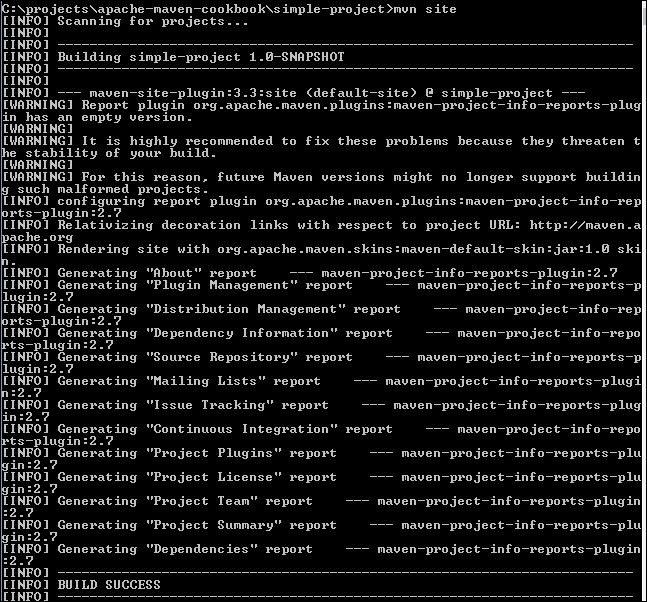

1.  打开在 `target/site` 文件夹中生成的 `index.html` 文件：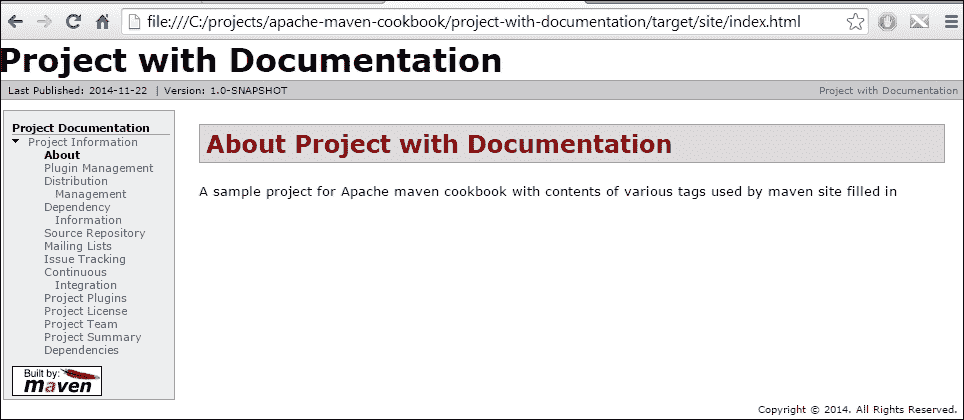

## 工作原理...

`Site` 是 Maven 生命周期之一。当运行 `mvn site` 命令时，它调用 `site` 生命周期的 `site` 阶段。Maven Site 插件的 `site` 目标绑定到这个阶段并被调用。

`site` 目标执行一系列步骤以生成报告。它使用 pom 文件中与此相关的各种元素。让我们看看默认报告中的一些项目：

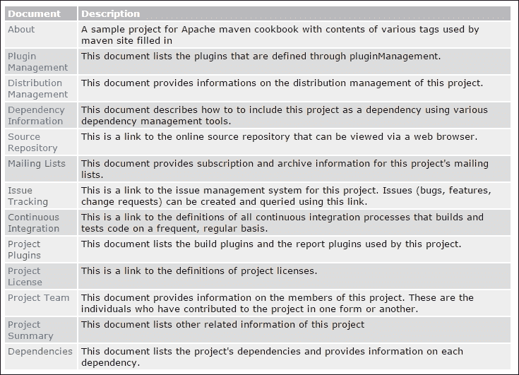

此外，`site` 命令根据 pom 文件中 `reporting` 部分的内 容生成报告：

```java
<reporting>
  <plugins>
    <plugin>
      <artifactId>maven-project-info-reports-plugin</artifactId>
      <version>2.0.1</version>
      <reportSets>
        <reportSet></reportSet>
      </reportSets>
    </plugin>
  </plugins>
</reporting>
```

许多 Maven 插件可以生成在 `reporting` 元素下定义和配置的报告。在以下部分中，我们将看到许多报告。

## 还有更多...

我们只看到了默认的 `site` 命令提供的功能。Maven Site 插件提供了各种配置选项，以进行更多自定义。以下是一些示例：

+   创建不同的文档格式：网站的默认格式是 APT（几乎纯文本），一种类似维基的格式

+   覆盖默认导航树：如果您想在网站上插入额外内容，则需要此操作

+   创建皮肤：如果您想以不同的方式设计站点报告，则需要此操作

让我们看看如何进行一些这些操作：

1.  将包含以下内容的`site.xml`文件添加到`project-with-documentation`项目文件夹的`src\site`文件夹中：

    ```java
    <project   xsi:schemaLocation="http://maven.apache.org/DECORATION/1.6.0 http://maven.apache.org/xsd/decoration-1.6.0.xsd" name="Project with Documentation">
        <bannerLeft>
            <name>Left Banner</name>
            <src>images/packt.png</src>
            <href>http://www.packtpub.com</href>
        </bannerLeft>
        <body>
            <menu name="Project with Documentation">
                <item name="Overview" href="index.html"/>
            </menu>
            <menu ref="reports"/>
        </body>
    </project>
    ```

1.  将名为`packt.png`的图片添加到`src\site\resources\images`文件夹中。

1.  现在，将包含以下内容的`index.apt`文件添加到`src\site\apt`文件夹中：

    ```java
    Welcome to Project with Documentation. This is a maven project created as part of apache maven cookbook by Packt Publishing.

    What is Project with Documentation?

    This maven project contains examples of how to use the site feature of maven.
    ```

1.  运行以下命令：

    ```java
    mvn clean site

    ```

1.  查看生成的站点报告：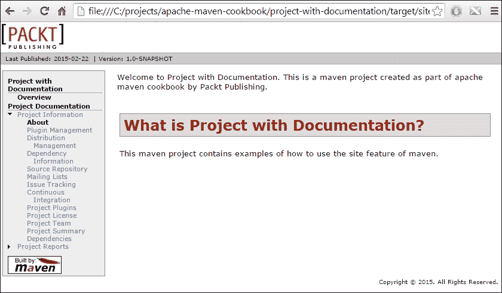

您可以看到一个带有标志和我们所指定的内容的自定义站点页面。

# 为站点生成 Javadocs

使用 Javadocs 创建 Java 项目的文档。Maven 不仅提供生成 Javadocs 的支持，还提供将其作为站点一部分发布。配置在`reporting`元素内的插件将为站点生成内容。当它们配置在`build`元素内时，它们可以生成与站点无关的报告。

## 如何操作...

使用以下步骤生成站点的 Javadocs：

1.  打开 Maven 项目`project-with-documentation`。

1.  在`pom.xml`文件中添加以下部分：

    ```java
    <reporting>
      <plugins>
        <plugin>
          <groupId>org.apache.maven.plugins</groupId>
          <artifactId>maven-javadoc-plugin</artifactId>
          <version>2.10.1</version>
        </plugin>
      </plugins>
    </reporting>
    ```

1.  运行以下命令：

    ```java
    mvn site

    ```

1.  查看生成的报告：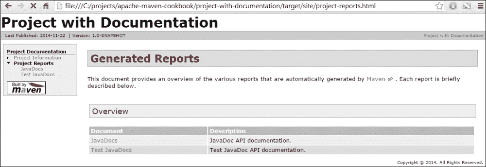

1.  点击**JavaDocs**链接：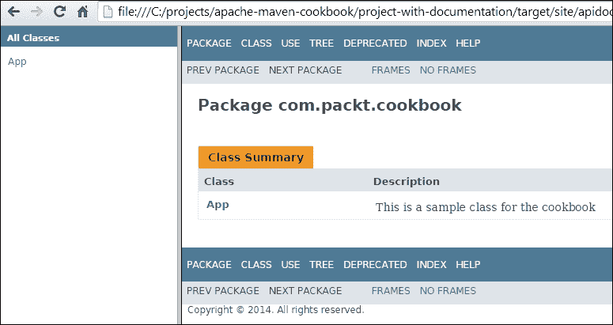

## 它是如何工作的...

我们将 Javadoc 插件添加到`pom`的`reporting`部分。当 Site 插件运行时，它会检查此部分并运行那里配置的报告。在这种情况下，它找到了`javadoc`并运行了相关的插件来为项目生成 Javadoc 报告。

Maven 将来自站点页面的报告链接到**项目报告**部分。

## 还有更多...

如果我们不想对测试类进行文档化，而只想对源代码进行文档化怎么办？我们可以通过以下步骤配置插件来完成此操作：

1.  将以下代码添加到设置`report`元素值为`javadoc`的`reporting`部分：

    ```java
            <reportSets>
              <reportSet>
                <reports>
                  <report>javadoc</report>
                </reports>
               </reportSet>
            </reportSets>
    ```

1.  运行以下命令：

    ```java
    mvn site

    ```

1.  打开生成的 Site 网页。网页上仅存在**JavaDocs**链接。**Test JavaDocs**链接不再存在。

# 为站点生成源交叉引用

在上一章中，我们看到了 Maven JXR 插件如何生成源交叉引用。在发布项目时，除了 Javadocs 之外，提供一种引用源的方法是有用的。让我们看看如何使这部分成为站点报告的一部分。

## 如何操作...

使用以下步骤为站点生成源交叉引用：

1.  打开带有文档的 Maven 项目`project with documentation`。

1.  将以下代码添加到`pom.xml`文件的`reporting`部分：

    ```java
    <plugin>
      <groupId>org.apache.maven.plugins</groupId>
      <artifactId>maven-jxr-plugin</artifactId>
      <version>2.5</version>
    </plugin>
    ```

1.  运行以下命令：

    ```java
    mvn site

    ```

1.  打开生成的站点报告：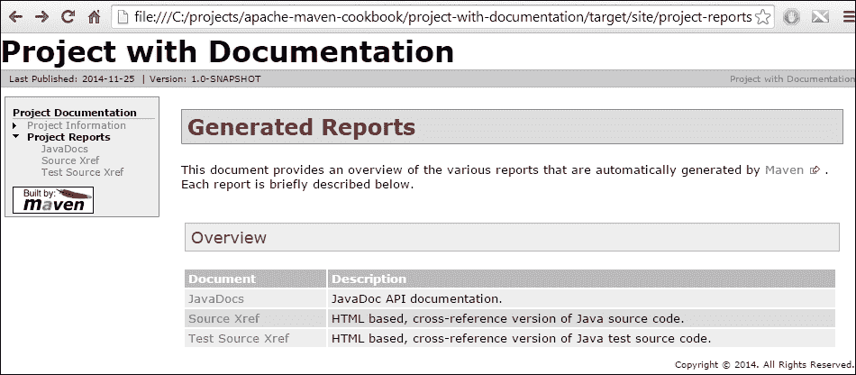

## 它是如何工作的...

将 Maven JXR 插件添加到`pom.xml`文件的`reporting`部分会自动创建项目源交叉引用。默认情况下，会生成源和测试交叉引用。与 Javadoc 一样，如果不想为测试类生成交叉引用，可以配置`reportSet`元素。

# 为网站生成单元测试报告

当我们为项目编写单元测试时，在网站文档中查看测试报告会很好。让我们看看如何做到这一点。

## 如何操作...

使用以下步骤为网站生成单元测试报告：

1.  打开您想要生成网站文档的 Maven 项目（例如，`project-with-documentation`）。

1.  在`pom.xml`文件的 reporting 部分添加以下代码：

    ```java
    <plugin>
        <groupId>org.apache.maven.plugins</groupId>
        <artifactId>maven-surefire-report-plugin</artifactId>
        <version>2.18</version>
    </plugin>
    ```

1.  运行以下命令：

    ```java
    mvn site

    ```

1.  观察生成的网站报告：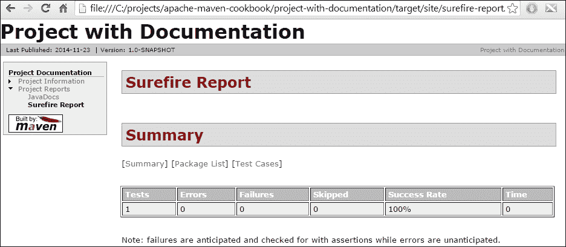

## 它是如何工作的...

如果您还记得，我们使用 Maven Surefire 插件来运行测试。Surefire 提供了一个 Surefire 报告插件。当此插件被添加到`pom.xml`文件的`reporting`部分时，它会将测试报告包含在网站文档中。

报告是相同的，无论使用 JUnit 还是 TestNG 进行单元测试。

### 提示

除了网站报告的格式外，TestNG 还会以不同的格式生成额外的报告。这些报告位于`target`文件夹中，但不属于网站文档。

# 为网站生成代码覆盖率报告

让我们现在将项目单元测试的代码覆盖率包含到网站文档中。

## 如何操作...

使用以下步骤为网站生成代码覆盖率报告：

1.  打开您想要进行此操作的 Maven 项目（例如，`project-with-documentation`）。

1.  在`pom.xml`文件的`<build>`部分添加以下代码：

    ```java
        <plugin>
          <groupId>org.jacoco</groupId>
          <artifactId>jacoco-maven-plugin</artifactId>
          <version>0.7.2.201409121644</version>
          <executions>
              <execution>
              <id>default-prepare-agent</id>
              <goals>
                  <goal>prepare-agent</goal>
              </goals>
              </execution>
          </executions>
        </plugin>
    ```

1.  在`pom.xml`文件的`reporting`部分添加以下代码：

    ```java
    <plugin>
        <groupId>org.jacoco</groupId>
        <artifactId>jacoco-maven-plugin</artifactId>
        <version>0.7.2.201409121644</version>
    </plugin>
    ```

1.  运行以下 Maven 命令：

    ```java
    mvn test site

    ```

1.  观察以下截图所示的网站报告：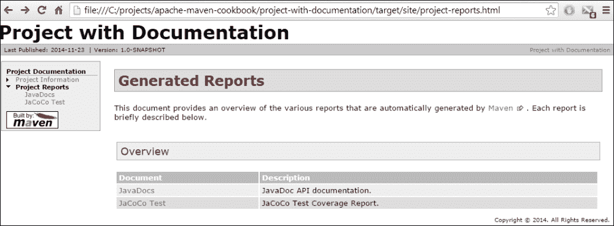

## 它是如何工作的...

由于以下问题，JaCoCo 单元测试覆盖率报告出现在网站文档中：

+   当 JaCoCo 插件的`prepare-agent`目标被添加到`build`部分时，Maven 会运行 JaCoCo 代理

+   当运行`test`目标时，Maven 会运行测试，代理会分析测试覆盖率

+   当 JaCoCo 插件被添加到`pom.xml`文件的`reporting`部分时，覆盖率报告会被生成并链接到网站文档

+   如您所见，相同的插件被添加到`build`和`reporting`部分，但执行不同的操作

## 还有更多...

如果您想用 Cobertura 代替 JaCoCo 来生成测试覆盖率，您可以这样做：

1.  从`build`和`reporting`部分删除与 JaCoCo 相关的行。

1.  将以下代码添加到`pom.xml`文件的 reporting 部分：

    ```java
          <plugin>
            <groupId>org.codehaus.mojo</groupId>
            <artifactId>cobertura-maven-plugin</artifactId>
            <version>2.6</version>
          </plugin>
    ```

1.  运行以下 Maven 命令：

    ```java
    mvn site

    ```

1.  打开网站文档：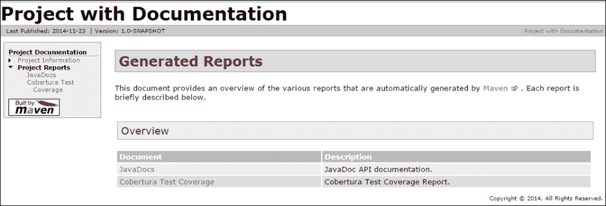

您将注意到两件事：

+   我们不需要在`build`部分中指定任何内容

+   我们不需要显式运行`test`目标；Maven Cobertura 插件已经完成了这项工作。

# 为站点生成代码质量报告

我们已经看到如何使用各种代码质量工具进行静态代码分析。现在让我们看看我们如何使用这些工具的报告来更新我们的站点文档。

## 如何操作...

使用以下步骤为站点生成代码质量报告：

1.  打开我们想要生成站点报告的项目。

1.  将以下代码添加到`pom.xml`文件的`reporting`部分：

    ```java
          <plugin>
            <groupId>org.apache.maven.plugins</groupId>
            <artifactId>maven-pmd-plugin</artifactId>
            <version>3.3</version>
          </plugin>
          <plugin>
            <groupId>org.apache.maven.plugins</groupId>
            <artifactId>maven-checkstyle-plugin</artifactId>
            <version>2.13</version>
          </plugin>
          <plugin>
            <groupId>org.codehaus.mojo</groupId>
            <artifactId>findbugs-maven-plugin</artifactId>
            <version>3.0.0</version>
          </plugin>>
    ```

1.  运行以下 Maven 命令：

    ```java
    mvn test site

    ```

1.  打开生成的站点报告：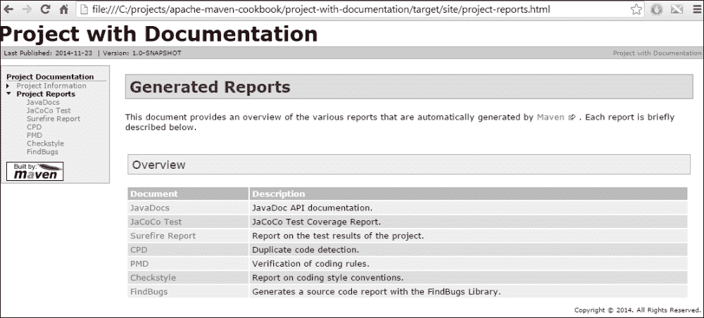

## 工作原理...

对于在`pom.xml`文件的`reporting`部分中指定的每个代码质量工具，`site`目标会运行指定的工具，生成报告，并将其链接到站点文档。

点击每个链接会将用户带到特定的报告。

## 还有更多...

如果您选择使用 SonarQube 进行分析，并希望将 Sonar 报告链接到站点文档，则可以执行以下操作：

1.  在`pom.xml`文件的报告部分添加以下代码：

    ```java
    <plugin>
      <groupId>org.codehaus.sonar-plugins</groupId>
      <artifactId>maven-report</artifactId>
      <version>0.1</version>
    </plugin>
    ```

1.  通过运行以下 Maven 命令生成站点：

    ```java
    mvn test site

    ```

1.  打开站点报告：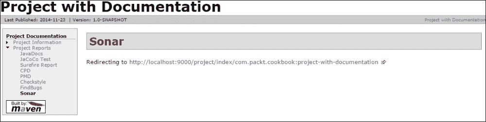

在**项目报告**中新增了一个**Sonar**链接，它自动重定向到默认的 Sonar 安装。如果链接的 URL 不同，则可以自定义此链接。

# 生成选择性报告

我们已经看到默认情况下，`site`命令会生成一些**项目信息**。其中一些，例如**邮件列表**，可能不存在或不适用于项目。让我们看看我们如何避免生成这些信息。Maven 项目信息报告插件是提供 pom 中标准报告的插件。它可以配置为排除特定的报告。

## 如何操作...

使用以下步骤生成选择性站点报告：

1.  打开您想要生成站点报告的项目。

1.  将以下代码添加到`pom.xml`文件的`reporting`部分：

    ```java
      <plugin>
        <groupId>org.apache.maven.plugins</groupId>
        <artifactId>maven-project-info-reports-plugin</artifactId>
        <version>2.7</version>
        <reportSets>
          <reportSet>
            <reports>
              <report>dependencies</report>
              <report>project-team</report>
              <report>license</report>
              <report>scm</report>
            </reports>
          </reportSet>
        </reportSets>
      </plugin>
    ```

1.  运行以下 Maven `site`命令：

    ```java
    mvn test site

    ```

1.  打开生成的报告：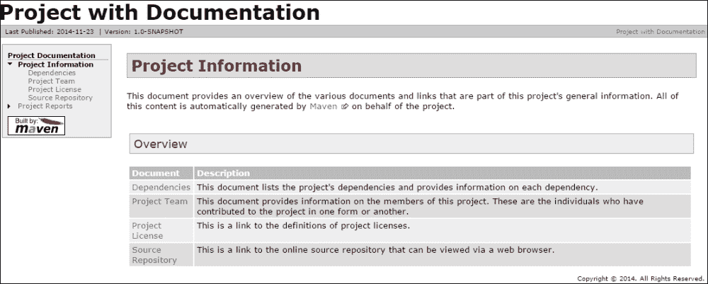

## 工作原理...

我们明确指定了想要在**项目信息**中看到的报告。因此，只有这些报告被生成并显示。

这允许我们避免生成和显示不适用于项目的报告。

# 部署站点

一旦生成站点报告，就需要发布。虽然这可以手动完成，但 Maven 也提供了相应的功能。让我们看看如何操作。

## 准备工作

要发布站点，您需要有权访问部署站点的 Web 服务器。

## 如何操作...

要部署站点，请按照以下步骤操作：

1.  将以下代码添加到您的`pom.xml`文件中。这也可以添加到`settings.xml`中：

    ```java
      <distributionManagement>
        <site>
          <id>myorg</id>
          <url>scp://www.myorg.com/project/</url>
        </site>
      </distributionManagement>
    ```

1.  对于相应的 ID，在你的 `settings.xml` 文件中添加相关的用户名和密码：

    ```java
    <servers>
        <server>
          <id>myorg</id>
          <username>username</username>
          <password>password</password>
          <filePermissions>664</filePermissions>
          <directoryPermissions>775</directoryPermissions>
        </server>
      </servers>
    ```

1.  运行以下 Maven 命令：

    ```java
    mvn site-deploy

    ```

## 它是如何工作的...

当运行 `site-deploy` 目标时，Maven 首先构建网站。然后，它使用 `distributionManagement` 元素中的条目集来确定网站需要如何部署。URL 的前一部分是要使用的传输协议。在这种情况下，它是 `scp`。它使用 `settings.xml` 文件中指定的凭据并将文件传输到目标位置。

## 更多内容...

如果你想在部署前测试你的网站，你可以轻松地按照以下方式操作：

1.  运行以下 Maven 命令：

    ```java
    mvn site:run

    ```

1.  打开浏览器并访问 `http://localhost:8080`：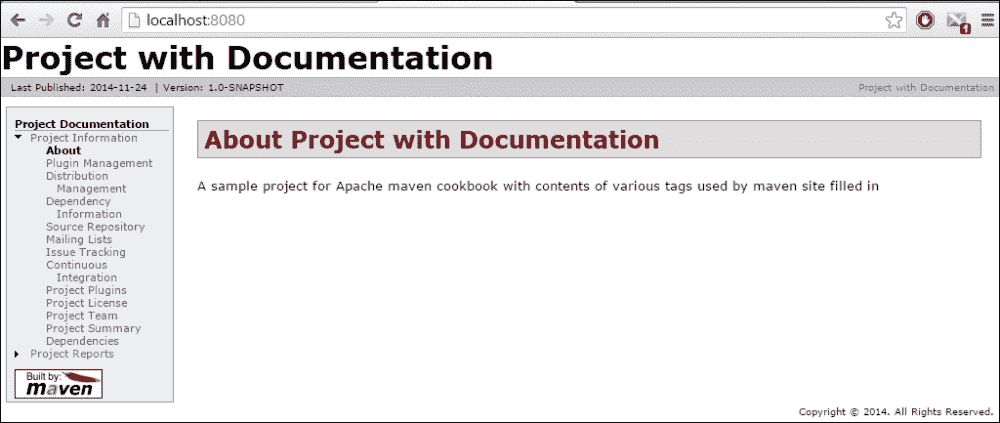

Maven Site 插件的运行目标会在一个 **jetty 服务器**上部署网站，默认情况下，它通过端口 `8080` 启动。这允许你在发布之前查看网站报告并验证它。
