# 第十章：使用 Maven 进行 Java 开发

在本章中，我们将介绍以下食谱：

+   构建 JAR 项目

+   生成可执行的 JAR

+   生成源代码的 JAR

+   生成测试类的 JAR

+   构建 WAR 项目

+   构建 EAR 项目

+   构建 pom 项目

+   使用 Jetty 运行 Web 项目

+   使用 Tomcat 运行 Web 项目

# 简介

Maven 主要是一个用于 Java 项目的构建工具。Java 项目可以生成不同类型的二进制文件。通常，Java 项目的输出是一个 JAR 文件。对于 Web 应用程序，Java 类与其他类型的文件结合，可以生成 WAR 或 EAR 文件。Maven 提供插件和生命周期阶段，用于为 Java 项目生成各种类型的二进制工件。

# 构建 JAR 项目

Maven 默认生成的工件类型是 JAR。如果 `packaging` 元素不存在，或指定为 `jar`，Maven 则将其视为 JAR 项目。JAR 项目将所有源代码以及必要的项目资源合并到一个文件中。这个 JAR 文件可以分发到其他地方使用。

## 准备工作

Maven 已在您的系统上设置并验证了其工作。要完成此操作，请参阅 第一章，*入门*。

## 如何操作...

1.  打开一个简单的 Maven 项目，在我们的例子中是 `simple-project`。

1.  验证类型是否存在或设置为 `jar`：

    ```java
      <modelVersion>4.0.0</modelVersion>
      <groupId>com.packt.cookbook</groupId>
      <artifactId>simple-project</artifactId>
      <packaging>jar</packaging>
    ```

1.  运行以下 Maven 命令：

    ```java
    mvn clean package

    ```

1.  观察输出：

    ```java
    [INFO] --- maven-jar-plugin:2.4:jar (default-jar) @ simple-project ---
    [INFO] Building jar: C:\Users\Deepa\Documents\apache-maven-cookbook\simple-project\target\simple-project-1.0-SNAPSHOT.jar

    ```

## 它是如何工作的...

`package` 选项是 Maven 默认生命周期的一部分。当 Maven 使用 `package` 选项运行时，它会按顺序运行到该选项之前和之前的所有阶段。Maven 首先编译项目，运行测试，然后根据打包类型，调用合适的插件进行打包。在我们的例子中，因为我们指定了打包为 `jar`，所以 Maven 使用 Maven JAR 插件的 `jar` 目标在 `target` 文件夹中创建 JAR 工件。

## 相关内容

+   本章中的 *生成可执行的 JAR* 食谱

# 生成可执行的 JAR

Maven 生成的 JAR 工件在用作其他项目的依赖项时运行良好。然而，如果没有手动指定主类并明确指定项目在类路径中使用的依赖项，则不能作为可执行文件运行。

如果我们想为项目创建一个可执行的 JAR，这可能是有用的，当 JAR 需要测试或项目是一个简单的工具，应该无需额外努力即可调用时。

## 如何操作...

1.  打开一个简单的 Maven 项目（`project-with-executable-jar`）：

1.  在 `pom` 文件中添加以下部分：

    ```java
    <build>
        <plugins>
          <plugin>
            <groupId>org.apache.maven.plugins</groupId>
            <artifactId>maven-jar-plugin</artifactId>
            <version>2.6</version>
            <configuration>
              <archive>
                <manifest>
                  <addClasspath>true</addClasspath>
                  <mainClass>com.packt.cookbook.App</mainClass>
                </manifest>
              </archive>
            </configuration>
          </plugin>
        </plugins>
      </build>
    ```

1.  将插件配置添加到 `target` 文件夹以复制依赖项：

    ```java
    <plugin>
            <groupId>org.apache.maven.plugins</groupId>
            <artifactId>maven-dependency-plugin</artifactId>
            <version>2.9</version>
            <executions>
              <execution>
                <id>copy-dependencies</id>
                <phase>package</phase>
                <goals>
                  <goal>copy-dependencies</goal>
                </goals>
                <configuration>
                <outputDirectory>${project.build.directory}</outputDirectory>
                  <excludeArtifactIds>junit</excludeArtifactIds>
                </configuration>
              </execution>
            </executions>
          </plugin>
    ```

1.  运行以下命令：

    ```java
    mvn clean package

    ```

1.  观察目标文件夹：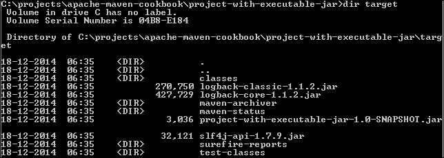

1.  运行生成的 JAR 文件：

    ```java
     java -jar project-with-executable-jar-1.0-SNAPSHOT.jar

    ```

1.  观察输出：

    ```java
    C:\projects\apache-maven-cookbook\project-with-executable-jar\target>java -jar project-with-executable-jar-1.0-SNAPSHOT.jar
    06:40:18.437 [main] INFO  com.packt.cookbook.App - Hello World

    ```

## 它是如何工作的...

我们已经在 `pom` 文件中对 Maven JAR 插件进行了以下配置：

+   **添加类路径**：这会将所有依赖的 JAR 添加到清单类路径部分

+   **指定了主类**：此信息再次更新在清单中

我们还添加了 Maven Dependency 插件的`copy-dependencies`目标，将所需的依赖项复制到生成可执行 JAR 文件的文件夹中。

当我们运行可执行 JAR 时，它使用清单文件来确定主类以及依赖项，加载它们并运行。

让我们看看生成的清单文件：

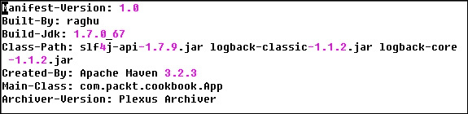

显然，为了使这可行，可执行 JAR 应该附带它所使用的依赖项。在第十一章“高级 Maven 使用”的*创建一个 assembly 配方*中，我们将学习如何创建包含所有依赖项的 assembly，这样就可以更容易地分发。

# 生成源代码的 JAR 文件

对于许多项目来说，生成源代码的 JAR 文件与工件一起非常有用。生成的源代码可以导入到 IDE 中，用于浏览和调试。通常，大多数开源项目的工件都附带源代码和 Javadocs。

## 如何操作...

1.  打开你想要生成和附加源代码的项目（`project-with-source-code`）。

1.  将以下插件配置添加到`pom`文件中：

    ```java
      <build>
        <plugins>
          <plugin>
            <groupId>org.apache.maven.plugins</groupId>
            <artifactId>maven-source-plugin</artifactId>
            <version>2.4</version>
            <executions>
              <execution>
                <id>attach-sources</id>
                <phase>package</phase>
                <goals>
                  <goal>jar-no-fork</goal>
                </goals>
              </execution>
            </executions>
          </plugin>
        </plugins>
      </build>
    ```

1.  运行以下 Maven 命令：

    ```java
    mvn clean package

    ```

1.  观察输出：

    ```java
    [INFO] --- maven-jar-plugin:2.4:jar (default-jar) @ project-with-source-attached ---
    [INFO] Building jar: C:\projects\apache-maven-cookbook\project-with-source-attached\target\project-with-source-attached-1.0-SNAPSHOT.jar
    [INFO]
    [INFO] --- maven-source-plugin:2.4:jar-no-fork (attach-sources) @ project-with-source-attached ---
    [INFO] Building jar: C:\projects\apache-maven-cookbook\project-with-source-attached\target\project-with-source-attached-1.0-SNAPSHOT-sources.jar
    [INFO] ------------------------------------------------------------------------
    [INFO] BUILD SUCCESS
    [INFO] -----------------------------------------------------------------------

    ```

1.  检查`target`文件夹：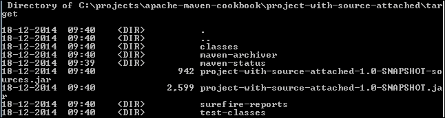

## 它是如何工作的...

我们将 Maven Source 插件添加到`pom`文件中。我们还配置了插件在打包阶段运行`jar-no-fork`目标。该目标创建项目源代码的 JAR 文件，并将其与项目工件一起提供。

`jar-no-fork`目标用于将目标绑定到构建生命周期。要独立于生命周期运行插件并创建 JAR，可以使用以下方式使用`jar`目标：

```java
mvn source:jar

```

后续阶段（如`install`）将源工件与项目工件一起安装。

## 更多...

如果我们想附加 Javadoc 而不是（或与）源代码一起，让我们这样做：

1.  将以下插件添加到`pom`文件中：

    ```java
      <plugin>
          <groupId>org.apache.maven.plugins</groupId>
          <artifactId>maven-javadoc-plugin</artifactId>
          <version>2.10.1</version>
          <executions>
            <execution>
              <id>attach-javadocs</id>
              <phase>package</phase>
              <goals>
                <goal>jar</goal>
              </goals>
            </execution>
          </executions>
        </plugin>
    ```

1.  构建聚合器项目：

    ```java
    mvn clean package

    ```

1.  观察输出：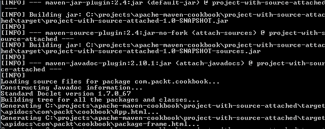

Maven 在运行 Maven Source 插件的`jar-no-fork`目标的同时，还运行 Maven Javadoc 插件的`jar`目标。现在除了项目工件外，还创建了这两个 JAR 文件，并可供分发。

### 小贴士

除了源代码外，如果项目相关，还可以生成和附加测试源代码和测试 Javadocs。

# 生成测试类的 JAR 文件

可能存在这样的情况，你希望将一个项目的测试类和资源作为测试依赖项用于另一个项目。这在多模块项目中很常见，其中一个模块依赖于另一个模块。模块的测试类中可能包含可以在另一个模块中重用的实用代码。

实现这一点的其中一种方法是通过创建一个单独的项目来保存这些类。然而，这样做可能会很繁琐，也可能令人困惑。

Maven 提供了另一种实现方式。

## 如何操作...

1.  打开一个你想为其创建测试 JAR 的项目（`project-with-test-jar`）。

1.  将以下插件配置添加到`pom`文件中：

    ```java
      <build>
        <plugins>
          <plugin>
            <groupId>org.apache.maven.plugins</groupId>
            <artifactId>maven-jar-plugin</artifactId>
            <version>2.5</version>
            <executions>
              <execution>
                <goals>
                  <goal>test-jar</goal>
                </goals>
              </execution>
            </executions>
           </plugin>
        </plugins>
      </build>
    ```

1.  运行以下 Maven 命令：

    ```java
    mvn clean package

    ```

1.  观察输出结果：

    ```java
    [INFO] --- maven-jar-plugin:2.5:jar (default-jar) @ project-with-test-jar ---
    [INFO] Building jar: C:\projects\apache-maven-cookbook\project-with-test-jar\tar
    get\project-with-test-jar-1.0-SNAPSHOT.jar
    [INFO]
    [INFO] --- maven-jar-plugin:2.5:test-jar (default) @ project-with-test-jar ---
    [INFO] Building jar: C:\projects\apache-maven-cookbook\project-with-test-jar\tar
    get\project-with-test-jar-1.0-SNAPSHOT-tests.jar

    ```

1.  检查`target`文件夹：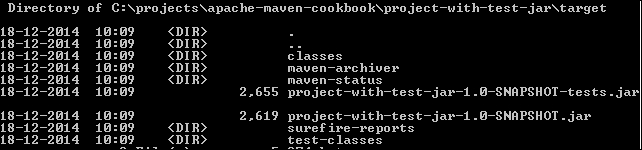

## 它是如何工作的...

我们为 Maven JAR 插件指定了一个`test-jar`目标。这会让 Maven 生成一个测试类和资源的 JAR 文件。这个 JAR 文件可以与项目工件一起安装。它也可以在另一个项目中指定为依赖项，如下所示：

```java
<dependencies>
  <dependency>
    <groupId>com.packt.cookbook</groupId>
    <artifactId>project-with-test-jar</artifactId>
    <version>1.0-SNAPSHOT</version>
    <type>test-jar</type>
    <scope>test</scope>
  </dependency>
</dependencies>
```

### 小贴士

需要注意的一点是，如果你在这个依赖项上添加了依赖，测试 JAR 不会带其传递的测试范围依赖项。如果需要，这些依赖项需要手动指定。

# 构建 WAR 项目

到目前为止，我们一直在构建生成 JAR 工件的项目。当涉及到 Web 应用时，我们通常创建 WAR 工件。Maven 支持 WAR 工件的构建。打包类型`.war`指示 Maven 这是一个 WAR 工件。Maven 会自动调用相应的生命周期绑定。

## 如何操作...

1.  从命令提示符运行以下命令：

    ```java
    mvn archetype:generate –DinteractiveMode=false  -DgroupId=com.packt.cookbook -DartifactId=simple-webapp -DarchetypeArtifactId=maven-archetype-webapp 

    ```

1.  观察输出结果：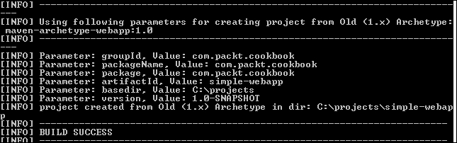

1.  打开创建的`pom`文件：

    ```java
    <modelVersion>4.0.0</modelVersion>
      <groupId>com.packt.cookbook</groupId>
      <artifactId>simple-webapp</artifactId>
      <packaging>war</packaging>
      <version>1.0-SNAPSHOT</version>
      <name>simple-webapp Maven Webapp</name>
      <url>http://maven.apache.org</url>
      <build>
        <finalName>simple-webapp</finalName>
      </build>
    ```

1.  运行命令来构建项目：

    ```java
    mvn clean package

    ```

1.  观察输出结果：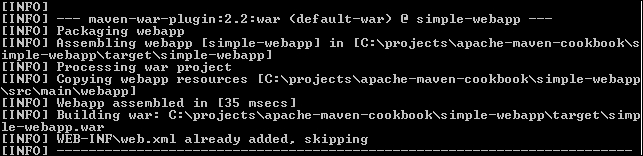

1.  检查`target`文件夹：

    ```java
    Directory of C:\projects\apache-maven-cookbook\simple-webapp\target

    18-12-2014  20:52    <DIR>          .
    18-12-2014  20:52    <DIR>          ..
    18-12-2014  20:52    <DIR>          classes
    18-12-2014  20:52    <DIR>          maven-archiver
    18-12-2014  20:52    <DIR>          simple-webapp
    18-12-2014  20:52             2,226 simple-webapp.war
    ```

## 它是如何工作的...

我们使用 Maven Archetype 插件来启动一个简单的 Web 项目。这生成了一个`pom`文件以及其他 Web 应用的文件内容。当你检查`pom`文件时，你会注意到`packaging`类型被设置为`war`。

Maven 使用这些信息来调用 Maven 插件的`war`目标，以创建项目内容的 WAR 文件。

此外，请注意我们指定了`finalName`元素。Maven 使用这个元素来创建 WAR 工件的名称。如果没有这个元素，Maven 将使用默认名称，即`simple-webapp-1.0-SNAPSHOT.war`。

## 还有更多...

Maven WAR 插件可以用多种方式使用。默认选项创建一个 WAR 文件。在开发过程中，我们可能希望通过生成展开形式的 WAR 文件来加快速度。为此，执行以下步骤：

1.  打开`simple-webapp`项目。

1.  运行以下命令：

    ```java
    mvn war:exploded

    ```

1.  检查`target`文件夹的内容：![还有更多...# 构建 EAR 项目 Maven 提供了生成 Java **EE 企业存档**（**EAR**）文件的支持。这些可以在 JBoss、WebLogic 和 WebSphere 等应用服务器上部署。## 如何操作...1.  从命令提示符运行以下命令：    ```java    mvn archetype:generate -DgroupId=com.packt.cookbook -DartifactId=simple-ear -DarchetypeArtifactId=wildfly-javaee7-webapp-ear-archetype -DarchetypeGroupId=org.wildfly.archetype -DinteractiveMode=false    ```1.  观察结果：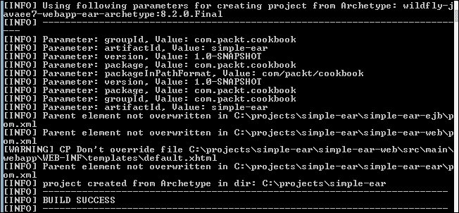

1.  构建生成的项目：

    ```java
    mvn clean package

    ```

1.  观察生成的输出结果：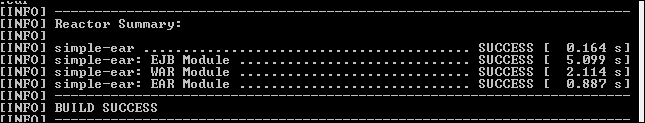

1.  打开 `target` 文件夹：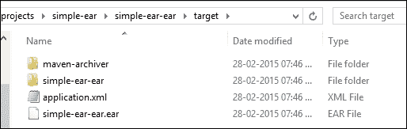

## 它是如何工作的...

我们使用了 Maven 架构插件来启动一个简单的 EAR 项目。它生成一个多模块项目，其中包括一个 EJB 模块、Web 模块和一个 EAR 模块，以及一个聚合 pom 文件。当你检查 EAR 模块的 `pom` 文件时，你会注意到 `packaging` 类型被设置为 `ear`。

一旦构建完成，Maven 会构建所有模块。在 EAR 模块中，它使用打包信息来调用 Maven EAR 插件的 `ear` 目标，以创建项目内容的 EAR。

# 构建 pom 项目

你可能想要将 pom 文件作为艺术品提供的许多原因之一是聚合项目。聚合项目必须具有 `pom` 打包类型。另一个原因可能是可以作为一个依赖项导入的 pom。无论原因如何，Maven 都提供了构建 pom 项目的支持。

## 如何操作...

1.  打开一个简单的 pom 项目（`simple-pom-project`）。

1.  观察打包类型：

    ```java
    <groupId>com.packt.cookbook</groupId>
        <artifactId>simple-pom-project</artifactId>
        <packaging>pom</packaging>
        <version>1.0-SNAPSHOT</version>
        <description>Simple pom project</description>
    ```

1.  构建项目：

    ```java
    mvn clean package

    ```

    注意，只有 `clean` 目标被运行。

1.  运行以下命令：

    ```java
     mvn clean install 

    ```

1.  观察输出：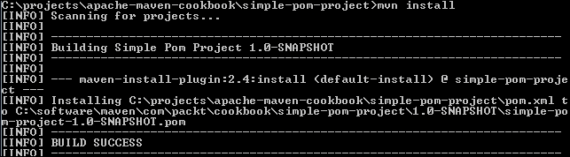

## 它是如何工作的...

以下是 `pom` 打包类型的默认绑定：

+   `package: site:attach-descriptor`：如果适用，这会将描述符附加到站点报告中

+   `install: install:install`：这会在本地仓库中安装项目

+   `deploy: deploy:deploy`：这会将项目部署到远程仓库

如我们所见，Maven 不会为 `pom` 打包类型运行任何其他目标。然而，如果它看到 `module` 元素，它会在所有定义的模块上调用指定的 Maven 目标。

此外，包括 `pluginManagement` 和 `dependencyManagement` 在内的各种配置都会被所有子项目继承。

## 还有更多...

如果你有一个原因需要编译一些源文件或运行一些测试，即使打包类型是 `pom`，怎么办？这可能不是一个常见的场景，但可以通过以下方式显式调用相关插件目标来完成：

1.  打开简单的 pom 项目（`simple-pom-project`）。

1.  运行以下命令：

    ```java
    mvn clean compiler:compile compiler:testCompile surefire:test jar:jar

    ```

1.  观察输出：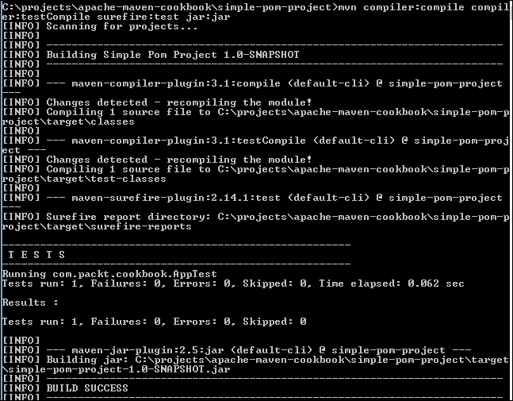

我们现在显式调用以下目标：

+   `compiler:compile`：这会编译源文件

+   `compiler:testCompile`：这会编译测试文件

+   `surefire:test`：这会运行测试

+   `jar:jar`：这会创建一个 JAR 艺术品

Maven 并不会阻止我们这样做。

# 使用 Jetty 运行 Web 项目

在开发 Web 应用程序时，有一个快速的方法来检查应用程序是否成功部署且没有错误是很不错的。IDE 允许用户进行热部署应用程序。Maven 提供了一种机制，可以使用 Jetty 快速运行项目。Jetty 是一个流行的开源应用程序服务器，可以用来部署 Web 项目。Maven Jetty 插件允许将应用程序部署到 Jetty，并在 Maven 构建过程中运行它们。

## 如何操作...

1.  打开一个简单的 Web 项目（`simple-web-project`）。

1.  运行以下 Maven 命令：

    ```java
    mvn org.eclipse.jetty:jetty-maven-plugin:run

    ```

1.  观察结果：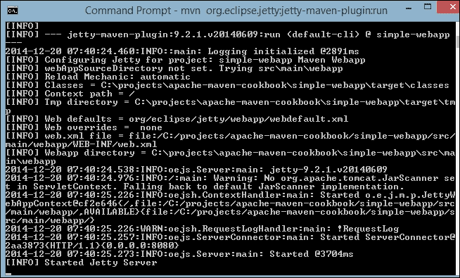

1.  通过访问 `http://localhost:8080` 从浏览器访问 Web 应用程序。![如何操作...]

## 它是如何工作的...

Maven Jetty 插件允许使用 Jetty 部署和测试 Web 应用程序。`run` 目标绑定到 `package` 阶段。Maven 运行它之前的所有阶段。Jetty 从其源代码部署 Web 应用程序；Web 应用程序不需要构建成 WAR 文件。它会在默认的 Maven 位置查找 Web 应用程序的相关部分。以下是一些示例：

+   `src/main/webapp` 中的 `resources`

+   `target/classes` 中的 `classes`

+   `src/main/webapp/WEB-INF` 中的 `web.xml`

Jetty 使用默认值启动服务器。

### 小贴士

由于 Jetty 不是一个官方的 Maven 插件，我们明确指定了 `groupId` (`org.eclipse.jetty`) 和 `artifactId` (`jetty-maven-plugin`)，而不是短插件前缀。要使用短插件前缀，请在设置文件中添加以下内容：

```java
<pluginGroup>org.eclipse.jetty</pluginGroup>
```

然后，可以按如下方式调用 Maven：

```java
mvn jetty:run
```

## 还有更多...

Maven Jetty 插件提供了一些目标和配置，以帮助开发 Web 应用程序。

1.  运行 WAR 文件：

    ```java
    mvn jetty:run-war

    ```

    Jetty 现在构建 WAR 文件然后运行：

    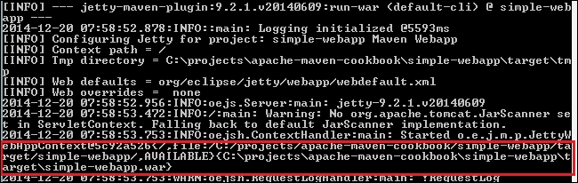

1.  运行展开的 WAR 文件：

    ```java
    mvn jetty:run-exploded

    ```

    Jetty 现在构建 WAR 文件，将其展开，然后运行：

    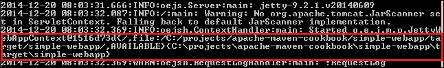

还有一些其他的目标可以使用：

+   `jetty:deploy-war`: 这将部署现有的 WAR 文件而无需构建它

+   `jetty:start`: 这将启动 Jetty 服务器

+   `jetty:stop`: 这将停止 Jetty 服务器

+   `jetty:run-forked`: 这将在与 Maven 不同的 Java 虚拟机进程中运行 Jetty 服务器

# 使用 Tomcat 运行 Web 项目

Tomcat 是一个流行的开源应用程序服务器。Maven Tomcat 插件支持在 Tomcat 中构建和部署 Maven 项目。实际上，有两个 Maven Tomcat 插件，一个用于 Tomcat 6，另一个用于 Tomcat 7。

让我们看看如何使用 Tomcat 7 运行 Web 项目。步骤将与 Tomcat 6 相同，只是插件将是 `tomcat6-maven-plugin` 而不是 `tomcat7-maven-plugin`，插件前缀将是 `tomcat6` 而不是 `tomcat7`。

## 如何操作...

1.  打开一个简单的 Web 项目（`simple-web-project`）。

1.  运行以下 Maven 命令：

    ```java
    mvn org.apache.tomcat.maven:tomcat7-maven-plugin:run

    ```

1.  观察结果：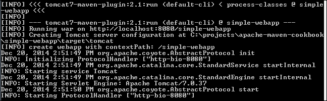

1.  通过访问 `http://localhost:8080/simple-webapp` 浏览已部署的 Web 应用程序。![如何操作...]

## 它是如何工作的...

Maven Tomcat 插件允许使用 Apache Tomcat 部署和测试 Web 应用程序。`run` 目标绑定到 `package` 阶段。Maven 运行它之前的所有阶段。

Tomcat 使用默认值启动服务器。

### 小贴士

由于这不是官方的 Maven 插件，我们明确指定了 `groupId` (`org.apache.tomcat.maven`) 和 `artifactId` (`tomcat7-maven-plugin`)，而不是使用简短的插件前缀。要使用简短的插件前缀，请在设置文件中添加以下内容：

```java
<pluginGroup>org.apache.tomcat.maven</pluginGroup>
```

然后，可以按照以下方式调用 Maven：

```java
mvn tomcat7:run
```

## 还有更多...

Maven Tomcat7 插件也支持启动和停止 Tomcat 的目标，这在运行集成测试时可以使用。

它还支持使用嵌入式 Tomcat 创建可执行 JAR 文件。让我们看看如何做：

1.  打开您想要创建可执行 JAR 文件的 Web 项目（`project-with-executable-webapp`）。

1.  添加以下插件和配置：

    ```java
         <plugins>
           <plugin>
            <groupId>org.apache.tomcat.maven</groupId>
            <artifactId>tomcat7-maven-plugin</artifactId>
            <version>2.1</version>
            <executions>
              <execution>
                <id>tomcat-run</id>
                <goals>
                  <goal>exec-war-only</goal>
                </goals>
                <phase>package</phase>
                <configuration>
                  <path>/</path>
                </configuration>
              </execution>
            </executions>
          </plugin>
        </plugins>
    ```

1.  运行以下命令：

    ```java
    mvn clean package

    ```

1.  运行 `target` 文件夹中创建的 JAR 文件：

    ```java
    java –jar project-with-executable-webapp-1.0-SNAPSHOT-war-exec.jar

    ```

1.  观察输出：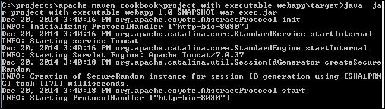

我们现在有一个使用嵌入式 Tomcat 的可分发 Web 应用程序。

### 小贴士

由于存在一个错误，我们需要使用插件的 2.1 版本而不是 2.2 版本才能使其工作。
