# 第十一章. 高级 Maven 使用

让我们看看本章中的以下食谱：

+   创建汇编

+   运行自定义的可执行文件

+   运行 ANT 任务

+   确定 Maven 插件的更新

+   确定 Maven 依赖的更新

+   控制约束

+   生成唯一的构建

+   发布 Maven 项目

# 简介

在本章中，我们探讨使用 Maven 的功能，这些功能可能不是在常规基础上或项目中必需的。这些功能包括为分发组装项目以及发布项目。这些不是典型的构建任务，但却是项目生命周期中的基本要素。

# 创建汇编

一个典型的项目需求是将项目输出及其依赖项、模块和其他文件聚合到一个可分发的存档中。汇编是一组文件、目录和依赖项，它们被组装成存档格式并分发。Maven 提供了预制汇编描述符来构建这些汇编。描述符处理常见的操作，例如打包项目的工件及其依赖项。

## 准备工作

Maven 应该已经设置在你的系统上，并且经过验证可以工作。为此，请参考 第一章, *入门*。

## 如何操作...

1.  打开你想要生成汇编的 Maven 项目；在我们的例子中，是 `project-with-assembly`。

1.  将以下插件和配置添加到 pom 文件中：

    ```java
    <plugin>
      <artifactId>maven-assembly-plugin</artifactId> 
      <version>2.5.3</version>
      <configuration>
        <descriptorRefs>
          <descriptorRef>jar-with-dependencies</descriptorRef>
        </descriptorRefs>
        <archive>
          <manifest>
            <mainClass>com.packt.cookbook.App</mainClass>
          </manifest>
        </archive>
      </configuration>
      <executions>
        <execution>
          <id>make-assembly</id> 
          <phase>package</phase> 
          <goals>
            <goal>single</goal>
          </goals>
        </execution>
      </executions>
    </plugin>
    ```

1.  运行以下 Maven 命令：

    ```java
    mvn clean package

    ```

1.  观察输出：

    ```java
    [INFO] --- maven-assembly-plugin:2.5.3:single (make-assembly) @ project-with-assembly ---
    [INFO] Building jar: C:\projects\apache-maven-cookbook\project-with-assembly\target\project-with-assembly-1.0-SNAPSHOT-jar-with-dependencies.jar

    ```

1.  运行创建的分布 JAR：

    ```java
    C:\projects\apache-maven-cookbook\project-with-assembly\target>java -jar project-with-assembly-1.0-SNAPSHOT-jar-with-dependencies.jar
    07:13:25.660 [main] INFO  com.packt.cookbook.App - Hello World

    ```

## 它是如何工作的...

我们对 pom 文件做了以下更改：

+   我们选择了 `jar-with-dependencies`，这是 Maven 汇编插件提供的预制汇编描述符之一。这创建了一个包含项目所有依赖的单个 JAR 文件。

+   我们还使用了 `archive` 配置来指定项目的主类。这是为了使 JAR 文件可执行。

+   我们指定了汇编的单个目标应该在哪个阶段运行，即 `package` 阶段。

当 Maven 运行时，它使用了前面的配置，在 `package` 阶段组装了一个包含依赖的 JAR 文件。我们可以将其作为一个正常的可执行 JAR 运行。

除了预定义的描述符之外，Maven 汇编插件还允许我们创建自定义描述符，可以精细控制汇编的内容。

汇编插件还可以从多模块项目构建汇编，其中模块可以是最终汇编的一部分。

## 更多内容...

当打开 JAR 文件时，你会观察到所有依赖的 JAR 文件也被解包了。

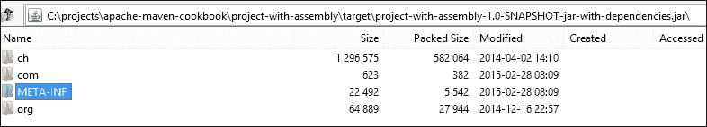

这是因为预定义描述符的默认配置。让我们看看如何创建相同的分发，但保留依赖的 JAR 文件不变。为此，我们现在将使用一个 Maven JAR 插件，该插件使用自定义类加载器在父 JAR 中加载依赖 JAR：

1.  打开你想要创建具有未打包依赖 JAR 文件的可执行文件的项目（`project-with-one-jar`）。

1.  在 pom 文件中添加以下插件：

    ```java
        <plugin>
            <groupId>org.dstovall</groupId>
            <artifactId>onejar-maven-plugin</artifactId>
            <version>1.4.4</version>
            <executions>
              <execution>
                <id>make-assembly</id> 
                <phase>package</phase> 
                <goals>
                  <goal>one-jar</goal>
                </goals>
              </execution>
            </executions>
          </plugin>
    ```

1.  添加 JAR 插件以指定可执行 JAR 的主类：

    ```java
    <plugin>
        <groupId>org.apache.maven.plugins</groupId>
        <artifactId>maven-jar-plugin</artifactId>
        <configuration>
        <archive>
            <manifest>
                     <mainClass>com.packt.cookbook.App</mainClass>
            </manifest>
         </archive>
       </configuration>
    </plugin>
    ```

1.  添加以下代码，因为插件二进制文件不在中央 Maven 仓库中：

    ```java
        <pluginRepositories>
            <pluginRepository>
                <id>onejar-maven-plugin.googlecode.com</id>
                <url>http://onejar-maven-plugin.googlecode.com/svn/mavenrepo</url>
            </pluginRepository>
       </pluginRepositories>
    ```

1.  运行以下命令：

    ```java
    mvn package

    ```

1.  运行生成的可执行文件并观察结果：

    ```java
    java -jar project-with-one-jar-1.0-SNAPSHOT.one-jar.jar
    06:57:45.995 [main] INFO  com.packt.cookbook.App - Hello World

    ```

1.  打开创建的 JAR 文件：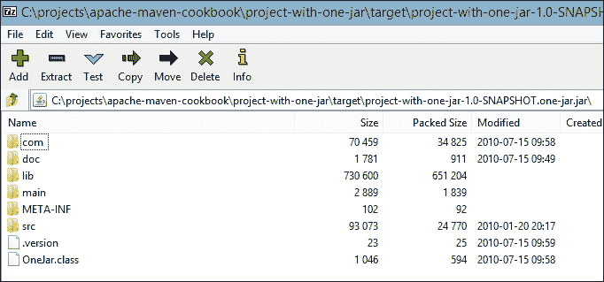

    我们可以看到，与 assembly JAR 相比，可执行 JAR 是在不解包涉及的库（依赖项）的情况下创建的。

1.  导航到 JAR 中的`lib`文件夹：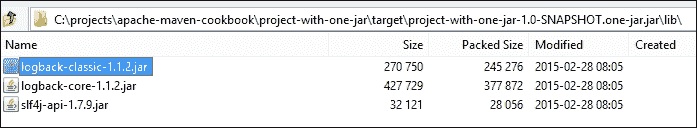

    依赖的 JAR 文件存储在`lib`文件夹中。

## 参考以下内容

+   在第十章“使用 Maven 进行 Java 开发”中的*生成可执行 JAR*配方，*使用 Maven 进行 Java 开发*

# 运行自定义的可执行文件

有许多情况下，你希望 Maven 在你的计算机上运行特定的可执行文件。一个简单的用例就是运行你创建的 JAR 文件。另一个情况是让 Maven 运行不是作为插件提供的命令（例如，创建一个本地的 Windows 安装程序）。

Maven 提供了一种机制，可以在 Maven 运行的同一虚拟机上以单独的进程运行任何可执行的系统，同时与 Java 程序一起运行。Maven Exec 插件使用`exec`目标（在单独的进程中运行）和`java`目标（在同一进程中运行 Java 程序）提供这种支持。

## 如何操作...

1.  打开一个简单的 Maven 项目（`simple-project`）。

1.  运行以下命令：

    ```java
    mvn clean package exec:java –Dexec.mainClass="com.packt.cookbook.App"

    ```

1.  观察结果：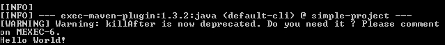

## 它是如何工作的...

我们想在项目中运行我们创建的 JAR 文件。为此，我们调用了 Maven Exec 插件的`java`目标。我们向插件提供了所需的参数（`mainClass`），以便它知道需要运行哪个主类。

## 更多内容...

你可以将可执行文件的运行集成到项目生命周期中。让我们为我们的示例做这个：

1.  打开项目（让我们称它为`project-with-exec`）。

1.  将以下代码添加到 pom 文件中：

    ```java
          <plugin>
              <groupId>org.codehaus.mojo</groupId>
              <artifactId>exec-maven-plugin</artifactId>
              <version>1.3.2</version>
              <executions>
                <execution>
                  <id>hello-world</id>
                  <phase>package</phase>
                  <goals>
                    <goal>java</goal>
                  </goals>
                </execution>
              </executions>
              <configuration>
                <mainClass>com.packt.cookbook.App</mainClass>
              </configuration>
            </plugin>
    ```

1.  运行以下命令：

    ```java
    mvn clean package

    ```

1.  观察结果：

    ```java
    [INFO] --- maven-jar-plugin:2.4:jar (default-jar) @ project-with-exec ---
    [INFO] Building jar: C:\projects\apache-maven-cookbook\project-with-exec\target\
    project-with-exec-1.0-SNAPSHOT.jar
    [INFO]
    [INFO] --- exec-maven-plugin:1.3.2:java (hello-world) @ project-with-exec ---
    [WARNING] Warning: killAfter is now deprecated. Do you need it ? Please comment
    on MEXEC-6.
    06:25:26.005 [com.packt.cookbook.App.main()] INFO  com.packt.cookbook.App - Hell
    o World
    [INFO] ------------------------------------------------------------------------

    ```

项目在包阶段根据我们在插件中指定的配置运行。

对于非 Java 可执行文件也可以这样做；我们需要调用`exec`目标而不是`java`目标。

### 小贴士

运行系统可执行文件会使构建不可移植，所以请谨慎使用。

# 运行一个 ANT 任务

ANT 是一个流行的构建自动化工具，它提供了很高的灵活性。它还提供了诸如`echo`和`touch`之类的任务，这些任务在 Maven 中不可用。尽管如此，将 ANT 任务与 Maven 结合以实现某些目标可能是有利的，尽管最好在不可避免的情况下才这样做。

Maven 通过 Maven AntRun 插件提供了一种机制来运行任意的 ANT 任务。让我们看看如何使用它来在我们的项目中运行一个 ANT 任务。

## 如何操作...

1.  打开你想要运行 ANT 任务的工程（`project-with-ant`）。

1.  将以下插件配置添加到 pom 文件中：

    ```java
         <plugin>
            <artifactId>maven-antrun-plugin</artifactId>
            <version>1.8</version>
            <executions>
              <execution>
                <phase>package</phase>
                <configuration>
                  <target>
                      <echo message="Calling ant task in package phase"/>
                  </target>
                </configuration>
                <goals>
                  <goal>run</goal>
                </goals>
              </execution>
            </executions>
          </plugin>
    ```

1.  运行以下 Maven 命令：

    ```java
    mvn clean package

    ```

1.  观察输出：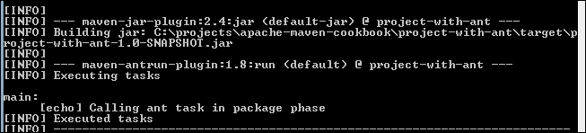

## 它是如何工作的...

我们配置了 Maven AntRun 插件在 `package` 阶段运行一个 ANT 目标。在 ANT 目标中，我们指定了一个简单的 `echo` 任务，它输出了我们想要的一个字符串。

我们可以写更复杂的任务，而不是 `echo` 任务。Maven AntRun 插件还提供了让 ANT 任务引用 Maven 属性、类路径等的方法。

## 还有更多...

将 ANT 任务分离到单独的 ANT 构建脚本（`build.xml`）中，并从 Maven 中调用它是一个好的做法。让我们看看如何做到这一点：

1.  创建一个简单的 ANT 构建脚本，`build.xml`，并添加以下内容：

    ```java
      <project name="project-with-ant" default="echo" basedir=".">
        <description>
            Simple ant task to echo a string
        </description>

        <target name="echo">
            <echo message="Hello World"/>
       </target>
    </project> 
    ```

1.  将 pom 文件中的 `target` 配置替换如下：

    ```java
    <target>
        <ant target="echo"/>
     </target>
    ```

1.  运行以下 Maven 命令：

    ```java
    mvn clean package

    ```

1.  观察输出：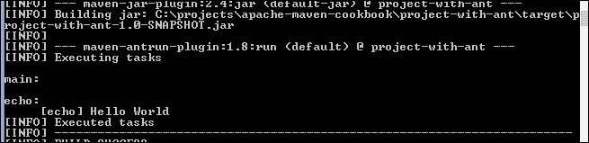

结果相同，但现在 ANT 脚本已经与 Maven 分离。

# 确定 Maven 插件 AntRun 的更新

在我们的构建脚本中，我们明确指定了我们使用的 Maven 插件的版本。这是创建可重复构建所必需的。如果没有指定版本，Maven 会给出如下警告：

```java
[WARNING] Some problems were encountered while building the effective model for
com.packt.cookbook:project-with-exec:jar:1.0-SNAPSHOT
[WARNING] 'build.plugins.plugin.version' for org.codehaus.mojo:exec-maven-plugin is missing. @ line 42, column 17
[WARNING]
[WARNING] It is highly recommended to fix these problems because they threaten the stability of your build.
[WARNING]
[WARNING] For this reason, future Maven versions might no longer support building such malformed projects.

```

在一段时间内，这些插件可能会有更新。了解是否有任何更新以便我们可以相应地更新插件版本会很好。让我们看看如何做到这一点。

## 如何做到这一点...

1.  选择你想要检查插件更新的工程（`project-with-exec`）。

1.  将插件的版本更改为较旧的一个：

    ```java
      <artifactId>exec-maven-plugin</artifactId>
       <version>1.2</version>>
    ```

1.  运行以下命令：

    ```java
    mvn versions:display-plugin-updates

    ```

1.  观察输出：

    ```java
    [INFO] --- versions-maven-plugin:2.0:display-plugin-updates (default-cli) @ proj
    ect-with-exec ---
    [INFO]
    [INFO] All plugins with a version specified are using the latest versions.
    ...
    [WARNING] The following plugins do not have their version specified:
    [WARNING]   maven-clean-plugin .......................... (from super-pom) 2.5
    [WARNING]   maven-compiler-plugin ....................... (from super-pom) 3.1
    ...
    [WARNING] Project does not define minimum Maven version, default is: 2.0
    [INFO] Plugins require minimum Maven version of: 2.2.1
    ...
    [ERROR] Project does not define required minimum version of Maven.
    [ERROR] Update the pom.xml to contain
    [ERROR]     <prerequisites>
    [ERROR]       <maven>2.2.1</maven>
    [ERROR]     </prerequisites>
    ...
    [INFO] Require Maven 2.2.1 to use the following plugin updates:
    [INFO]   maven-jar-plugin ................................................ 2.5
    [INFO]   maven-site-plugin ............................................... 3.2
    [INFO]   org.codehaus.mojo:exec-maven-plugin ........................... 1.3.2

    ```

## 它是如何工作的...

Maven Versions 插件的 `display-plugin-updates` 目标会下载 pom 文件中指定的所有插件的元数据，然后生成一个报告。报告揭示了若干有趣的事情。

+   `prerequisites` 标签缺失。在 pom 文件中的 `prerequisites` 标签指定了构建项目所需的 Maven 的最低版本。如果没有这个标签，Maven 会将最低版本视为 `2.0`。如果不同的开发者使用不同的 Maven 版本，则存在无法重复构建的风险。因此，使用此标签指定最低版本是一个好的做法。

+   有关于插件版本未定义的警告。正如我们所见，pom 文件中的插件不需要明确指定，除非它们需要配置。现在，Maven 仍然使用各种插件来执行（如 clean、resources、compile、test 等），并且它需要确定要使用的版本。它使用 super pom 中指定的版本，这在大多数情况下是可行的。然而，Versions 插件提醒我们这种情况，因此我们可以采取适当的行动。

+   根据 Maven 版本，插件版本存在差异。报告根据使用的 Maven 版本指定了各种插件的版本。这就是为什么指定先决条件的重要性更加凸显。

如输出所示，如果我们指定需要至少`2.2.1`版本的 Maven，那么我们可以看到 Maven Exec 插件的更新版本是`1.3.2`。

## 还有更多...

让我们现在在 pom 文件中指定`prerequisites`元素，看看它如何影响目标输出：

1.  将以下内容添加到 pom 文件中：

    ```java
      <prerequisites>
        <maven>3.2.5</maven>
      </prerequisites>
    ```

1.  运行以下命令：

    ```java
    mvn versions:display-plugin-updates

    ```

1.  观察输出：

    ```java
    [INFO] --- versions-maven-plugin:2.0:display-plugin-updates (default-cli) @ project-with-exec ---
    ...
    [INFO]
    [INFO] The following plugin updates are available:
    [INFO]   org.codehaus.mojo:exec-maven-plugin .................... 1.2 -> 1.3.2
    [INFO]

    ```

我们现在可以看到，插件根据我们指定的先决条件报告插件更新。

确定我们未在 pom 文件中明确定义的插件是否有更新是困难的。例如，根据前面命令的输出，如下所示：

```java
[WARNING] The following plugins do not have their version specified:
[WARNING]   maven-clean-plugin .......................... (from super-pom) 2.5
[WARNING]   maven-compiler-plugin ....................... (from super-pom) 3.1
[WARNING]   maven-deploy-plugin ......................... (from super-pom) 2.7
[WARNING]   maven-install-plugin ........................ (from super-pom) 2.4

```

然而，截至撰写本书时，Maven Clean 插件的最新版本是 2.6.1，Maven Compiler 插件的版本是 3.2，等等。super pom 中有的版本是在创建时必须是最新版本。当新版本中存在错误或新功能时，这些依赖项的版本变得很重要。在这种情况下，我们确实想要获取这些插件的最新版本。通过在 pom 文件中明确指定插件的版本，很容易获取这些版本。

将以下内容添加到 pom 文件中：

```java
        <plugin>
          <groupId>org.apache.maven.plugins</groupId>
          <artifactId>maven-clean-plugin</artifactId>
          <version>2.5</version>
        </plugin>
        <plugin>
          <groupId>org.apache.maven.plugins</groupId>
          <artifactId>maven-compiler-plugin</artifactId>
          <version>3.1</version>
        </plugin>
```

现在，重新运行前面的命令并注意输出：

```java
[INFO] The following plugin updates are available:
[INFO]   maven-clean-plugin ..................................... 2.5 -> 2.6.1
[INFO]   maven-compiler-plugin .................................... 3.1 -> 3.2
[INFO]   org.codehaus.mojo:exec-maven-plugin .................... 1.2 -> 1.3.2

```

# 确定 Maven 依赖项的更新

我们使用许多第三方库来构建我们的项目。如您所忆，我们在 pom 文件中指定了这些依赖库的`groupId`、`artifactId`和`version`元素。在这些依赖库中，可能会有许多更新和版本发布的情况。有一个机制来通知这些发布并相应地更新项目构建文件将是很好的。

## 如何做到这一点...

1.  选择一个你想要检查依赖项更新的项目，例如`simple-project`，这是我们使用 quick-start 存档创建的。

1.  运行以下命令：

    ```java
    mvn versions:display-dependency-updates

    ```

1.  观察输出：

    ```java
    [INFO] --- versions-maven-plugin:2.1:display-dependency-updates (default-cli) @
    simple-project ---
    [INFO] artifact junit:junit: checking for updates from central
    [INFO] The following dependencies in Dependencies have newer versions:
    [INFO]   junit:junit ............................................ 3.8.1 -> 4.12

    ```

## 它是如何工作的...

Maven Versions 插件的`display-dependency-updates`目标使用每个 maven 依赖项的元数据来确定每个依赖项的最新版本。如果不匹配当前版本，它将显示差异报告。

我们之前已经看到，`SNAPSHOT`版本由 Maven 以不同的方式处理，并且它会根据配置自动检查和更新这些依赖项。如果`SNAPSHOT`的版本号发生变化（从`1.0-SNAPSHOT`到`1.1-SNAPSHOT`），那么 Versions 插件会指出这一点。

## 还有更多...

Maven Versions 插件提供了其他一些目标来管理依赖和插件版本的更新。这包括自动将版本更改为最新发布版本，将 `SNAPSHOT` 替换为发布版本等。

# 控制约束

构建工具的一个要求是能够生成可重复的构建。在一个项目中，构建工具应该对所有团队成员的行为保持一致。虽然可以制定关于要使用的 Java 或 Maven 版本的项目指南，但如果可以自动强制执行，那就更容易了。

正是 Maven Enforcer 插件发挥作用的地方。

## 如何实现...

1.  打开一个简单的项目（`project-with-enforcer`）。

1.  添加以下插件配置：

    ```java
          <plugin>
            <groupId>org.apache.maven.plugins</groupId>
            <artifactId>maven-enforcer-plugin</artifactId>
            <version>1.3.1</version>
            <executions>
              <execution>
                <id>enforce-versions</id>
                <goals>
                  <goal>enforce</goal>
                </goals>
                <configuration>
                  <rules>
                    <requireMavenVersion>
                      <version>3.2.3</version>
                    </requireMavenVersion>
                    <requireJavaVersion>
                      <version>1.8</version>
                    </requireJavaVersion>
                  </rules>
                </configuration>
              </execution>
            </executions>
          </plugin>
    ```

1.  使用 Java 7 和 Maven 3.2.3 构建项目：

    ```java
    mvn clean package.

    ```

1.  观察输出：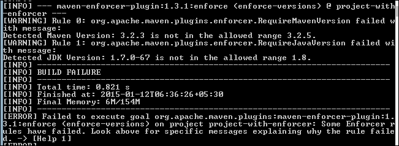

## 它是如何工作的...

Enforcer 插件使用规则配置并验证项目是否符合规则。如果发现违规，它会报告错误并停止构建。

在前面的例子中，我们的项目有两个问题：

+   **Maven 版本**：我们使用的是 3.2.3 版本，但在规则中指定了 3.2.5 版本。

+   **Java 版本**：我们使用的是 Java 7，但在规则中指定了 Java 8。

## 还有更多...

Maven Enforcer 插件有其他一些规则来强制执行各种约束。以下是一些例子：

+   `requireOS`：这确保项目只能在特定的操作系统上构建。

+   `requireFilesExist`：这确保了项目构建需要特定的文件存在。

也可以实现自定义执行规则。其中之一可在[`github.com/ferstl/pedantic-pom-enforcers`](https://github.com/ferstl/pedantic-pom-enforcers)找到。

# 生成唯一构建

正如我们所见，我们使用 `SNAPSHOT` 版本来指定项目处于开发状态。在开发过程中，我们将为项目创建几个构建。在许多情况下，区分这些构建是有用的。例如，当我们使用持续集成时，或者当测试人员需要对构建记录缺陷时。

如果有一种方法可以生成唯一的构建数字来识别 `SNAPSHOT` 版本中的构建，那就太好了。

## 如何实现...

1.  打开你想要有构建数字的项目（`project-with-build-number`）。

1.  添加以下插件配置：

    ```java
        <plugin>
            <groupId>org.codehaus.mojo</groupId>
            <artifactId>buildnumber-maven-plugin</artifactId>
            <version>1.3</version>
            <executions>
              <execution>
                <phase>validate</phase>
                <goals>
                  <goal>create</goal>
                </goals>
              </execution>
            </executions>
            <configuration>
               <shortRevisionLength>5</shortRevisionLength>
            </configuration>
          </plugin>
    ```

1.  添加以下内容以使用创建的唯一构建数字：

    ```java
    <finalName>${project.artifactId}-${project.version}-r${buildNumber}</finalName>
    ```

1.  为项目添加版本控制系统（SCM）配置：

    ```java
    <scm>
         <developerConnection>scm:git:https://bitbucket.org/maruhgar/apache-maven-cookbook</developerConnection>
          <url>https://bitbucket.org/maruhgar/apache-maven-cookbook</url>
      </scm>
    ```

1.  构建项目：

    ```java
    mvn clean package

    ```

1.  观察输出：

    ```java
    [INFO] --- buildnumber-maven-plugin:1.3:create (default) @ project-with-build-nu
    mber ---
    [INFO] ShortRevision tag detected. The value is '5'.
    [INFO] Executing: cmd.exe /X /C "git rev-parse --verify --short=5 HEAD"
    [INFO] Working directory: C:\projects\apache-maven-cookbook\project-with-build-n
    umber
    [INFO] Storing buildNumber: 0950d at timestamp: 1421244408851
    [INFO] Storing buildScmBranch: master
    ...
    [INFO] --- maven-jar-plugin:2.4:jar (default-jar) @ project-with-build-number --
    -
    [INFO] Building jar: C:\projects\apache-maven-cookbook\project-with-build-number
    \target\project-with-build-number-1.0-SNAPSHOT-r0950d.jar

    ```

## 它是如何工作的...

Maven Build Number 插件提供了三种生成唯一数字的方法，即通过使用版本控制系统（SCM）、顺序构建数字或时间戳。

在前面的例子中，我们使用了版本控制系统，因为它很容易将构建映射到相应的版本控制系统版本。我们使用了 `git` 并在 pom 文件的 SCM 标签中指定了 SCM 详细信息。

我们还指定了 Maven Build Number 插件使用五个字符并创建短修订号，因为典型的 git 修订号是一个长的哈希值。我们还配置了插件在生命周期的验证阶段运行。

我们在生成的工件名称中使用了生成的构建号，通过附加它以及版本号。

现在，每次进行新的提交并且构建完成后，都会生成一个具有唯一名称的工件。根据需求，每个这样的工件都可以存档或追溯到相应的源。

# 发布 Maven 项目

任何项目的最终目标都是发布。在开发完成并修复了错误之后，就是发布项目的时候了。不同的项目以不同的方式发布。Web 项目通过部署到 Web 服务器来发布。其他项目可能被打包成可执行的 JAR 文件。还有一些可能被打包成可执行文件或安装程序。如果项目是一个库或被其他项目使用的依赖项，那么它需要以适当的方式提供。

如我们之前所见，我们在开发期间使用`SNAPSHOT`版本。当项目需要发布时，现在需要将这个版本替换为一个具体的版本。

Maven 最先进的功能之一是支持项目发布。让我们来探索这一点。

## 如何操作...

1.  打开您想要发布的项目（`project-with-release`）。

1.  验证 SCM 详细信息是否存在于 pom 文件中：

    ```java
    <scm>
          <developerConnection>scm:git:https://bitbucket.org/maruhgar/apache-maven-cookbook</developerConnection>
           <url>https://bitbucket.org/maruhgar/apache-maven-cookbook</url>
        <tag>HEAD</tag>
      </scm>
    ```

1.  添加插件定义以指定插件的最新版本：

    ```java
       <plugins>
          <plugin>
            <groupId>org.apache.maven.plugins</groupId>
            <artifactId>maven-release-plugin</artifactId>
            <version>2.5.1</version>
          </plugin>
        </plugins>
    ```

1.  运行以下 Maven 命令：

    ```java
    mvn release:prepare –DpushChanges=false

    ```

    默认情况下，插件所做的更改会被推送到仓库。如果您不希望这样做，可以将`pushChanges`配置选项设置为`false`。

1.  在提示时选择默认值。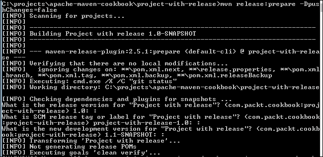

    您可以选择发布版本、SCM 标签和新开发版本的默认值，或者提供您的值。

1.  观察输出：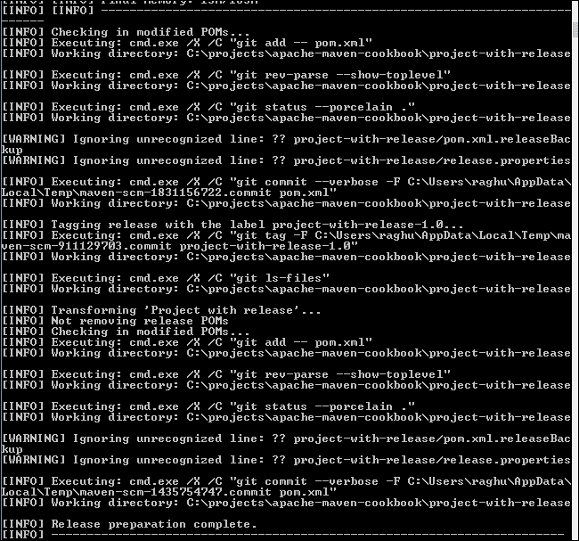

    Maven 运行了多个命令来修改 pom 文件。然后，它将这些更改检查到仓库中。

1.  现在运行以下命令：

    ```java
    mvn release:perform –Dgoals=package –DlocalCheckout=true

    ```

    默认情况下，Maven Release 插件的`perform`目标会运行`deploy`目标，将项目部署到指定的仓库。如果您没有远程仓库可以部署，或者想在发布过程中运行不同的目标，您可以使用`goals`配置来指定它。在前面的例子中，我们将其设置为运行`package`目标。

    此外，为了进行发布，Maven 会从仓库检出`prepare`目标创建的标签。如果您想让 Maven 检出本地副本，可以通过将`localCheckout`配置设置为`true`来实现。

1.  观察输出：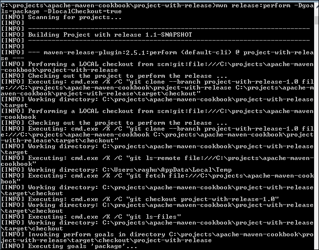

1.  确保发布二进制文件在`target/checkout/project-with-release/target`文件夹中创建：

## 它是如何工作的...

制作发布有两个步骤——准备和执行。

当运行 Maven Release 插件的`prepare`目标时，它执行以下操作：

+   检查没有未提交的更改

+   检查项目没有任何`SNAPSHOT`依赖项

+   更改`SNAPSHOT`项目的版本；您将被提示确认或覆盖默认设置

+   在`scm`元素中添加一个`tag`元素并计算其值（默认为`HEAD`）

+   运行`verify`目标以确保更改不会破坏任何内容

+   将修改后的 pom 提交到 SCM

+   在 SCM 中用版本名称标记代码（您将被提示确认或覆盖默认设置）：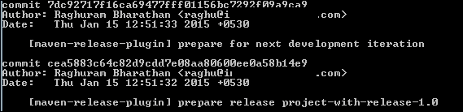

+   将 pom 中的版本提升到新的`SNAPSHOT`值（从`1.0-SNAPSHOT`变为`1.1-SNAPSHOT`）；您将被提示确认或覆盖此设置

+   将修改后的 pom 提交到 SCM

如您所见，一旦目标达成，您将有一个带有发布版本标签的更新后的 SCM，以及带有下一个`SNAPSHOT`版本的`HEAD`。还会创建一个`release.properties`文件。它包含执行`perform`目标所需的信息。

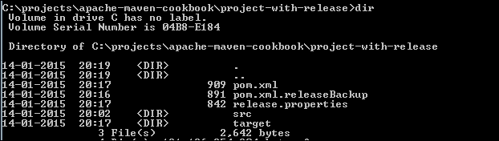

第二个平台执行如下：

+   `perform`目标使用`release.properties`中的信息从之前创建的 SCM 标签检出

+   然后在检出的项目上运行指定的目标（默认为`deploy`）

+   这将生成发布二进制文件

一旦构建成功，Release 插件创建的`release.properties`和其他备份文件将被删除。
