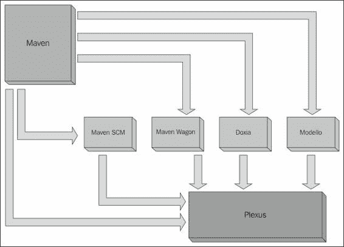
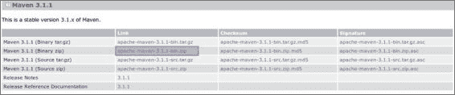
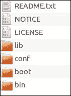
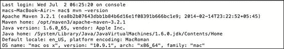

# 第一章. Apache Maven – 简介和安装

“千里之行，始于足下”，老子。正如此，如果你在这里阅读这句话，你已经迈出了迈向 Maven 之旅的第一步，使用 Eclipse 作为这一旅程的一部分。在这一旅程的第一章，我们将向您介绍 Maven 及其基本架构，然后通过以下子主题引导您完成安装过程：

+   Maven 简介

+   Maven 的起源

+   Maven 的原则

+   Maven 的组件架构

+   Maven 与 Ant 的比较

+   下载 Maven

+   安装 Maven

+   在 Windows 上安装 Maven

+   在 Linux 和 Mac OS 上安装 Maven

+   验证 Maven 的安装

# Maven 简介

Apache Maven 的官方网站声明，**Apache Maven**，也称为**Maven**，是一个软件项目管理和理解工具。通常，软件项目管理包括规划、组织、管理资源池和开发资源估算；因此，用 Maven 提供的产品来证明其价值是一种无意义的抽象。简单来说，Maven 是一种将模式应用于构建基础设施的综合方法，其主要目标如下：

+   简化构建过程

+   提供统一的构建系统

+   提供高质量的项目信息

+   提供最佳实践开发的指南

+   允许透明迁移到新功能

为了实现上述目标，Maven 提供了一套构建标准、一个工件仓库模型、一个描述项目的引擎以及一个标准的生命周期来构建、测试和部署项目工件。

## Maven 的起源

Maven，一个意第绪语单词，意为*知识的积累者*，最初是作为简化 Jakarta Turbine 项目中构建过程的尝试而启动的。在 Maven 之前，Ant 是跨项目使用的构建工具，不同项目之间有不同的 Ant 构建文件。此外，没有标准或一致的项目 Ant 构建文件，JAR 文件也需要在子版本控制系统中进行检查。因此，有必要标准化项目的构建过程及其结构，发布项目信息，并在项目之间重用 JAR 文件，这导致了新工具 Maven 的形成。Maven 使开发者的日常工作变得容易，并为任何 Java 项目提供了理解。

## Maven 的原则

Maven 的原则可以概括为以下几点：

+   **约定优于配置**：Maven 定义了默认的项目结构，并构建了一个简化开发负担的生命周期。通过指定一个公开定义的模型，它使得项目更加易于理解。

+   **声明式执行**：Maven 定义了一个包含阶段的生命周期，这些阶段又由插件目标组成。插件和目标可以声明性地包含在`pom`文件中，以自定义项目的执行。

+   **可重用性**：Maven 的构建和执行声明是以可重用性为前提构建的。一个项目的构建和执行声明可以在不同的项目中使用。Maven 还使得创建组件并将其集成到多项目构建系统中变得更加容易。此外，通过 Maven 最佳实践，鼓励整个行业进行开发。

+   **依赖的一致性组织**：Maven 负责依赖管理，从而减轻了开发者的负担。不同依赖之间的冲突也得到了很好的处理。

+   **专注于编写应用程序**：有了标准的项目布局和构建生命周期，就不需要开发构建；重点应该主要放在构建应用程序上。

## Maven 的组件架构

Maven 是围绕以下图所示的各个组件构建的：



**Maven 组件架构（参考 Apache 团队演示）**

### Plexus 容器

Plexus 是一个 IOC 容器，它提供面向组件的编程，以构建模块化、可重用的组件，这些组件可以轻松组装和重用。它支持的一些功能如下：

+   组件生命周期

+   组件实例化策略

+   嵌套容器

+   组件配置

+   自动装配

+   组件依赖

+   包括构造函数注入、setter 注入和私有字段注入在内的各种依赖注入技术

### 注意

更多信息可以在[`plexus.codehaus.org/`](http://plexus.codehaus.org/)找到。

### Wagon

Maven Wagon 是一个在 Maven 工件和仓库处理代码中使用的传输抽象。Wagon 定义了一个统一的 API，并且目前有以下提供者：

+   文件

+   HTTP

+   轻量级 HTTP

+   FTP

+   SSH/SCP

+   WebDAV

### 注意

更多信息可以在[`maven.apache.org/wagon/`](https://maven.apache.org/wagon/)找到。

### Maven Doxia

Doxia 是一个内容生成框架，它为用户提供强大的技术来生成静态和动态内容。Doxia 还用于基于 Web 的发布环境中生成静态站点，同时还集成到动态内容生成系统，如博客、维基和内容管理系统。

### 注意

更多关于 Maven Doxia 的信息，请参阅[`maven.apache.org/doxia/`](https://maven.apache.org/doxia/)。

### Modello

Maven 中的 Modello 组件可以在构建时根据数据模型生成以下类型的工件：

+   数据模型的 Java POJOs

+   Java POJOs 到 XML

+   XML 到 Java POJOs

+   数据模型 Xdoc 文档

+   XML 模式用于验证 XML 内容是否与数据模型匹配

### 注意

更多信息，请参阅[`maven.apache.org/maven-1.x/plugins/modello/`](http://maven.apache.org/maven-1.x/plugins/modello/)。

### Maven 版本控制

此组件提供了一个通用的 API 来执行**源代码管理（SCM**）操作。以下类型的 SCM 得到支持：

+   Bazaar

+   CVS

+   Git

+   Jazz

+   Mercurial

+   Perforce

+   StarTeam

+   Subversion

+   CM 能源

### 注意

更多信息请参阅 [`maven.apache.org/scm/`](http://maven.apache.org/scm/)。

# Maven 与 Ant

在 Maven 出现之前，Ant 是 Java 项目中最广泛使用的构建工具。Ant 从 C/C++ 编程中创建文件的概念发展成为一个平台独立的构建工具。Ant 使用 XML 文件来定义构建过程及其相应的依赖关系。

**另一个实用的工具**（**Ant**）是由 James Duncan Davidson 在准备 Sun 的参考 JSP/Servlet 引擎 Apache Tomcat 时构思的。以下是一个简单的 Ant 构建文件示例（[`ant.apache.org/manual/using.html`](http://ant.apache.org/manual/using.html)）：

```java
<project name="MyProject" default="dist" basedir=".">
    <description>
        simple example build file
    </description>
  <!-- set global properties for this build -->
  <property name="src" location="src"/>
  <property name="build" location="build"/>
  <property name="dist"  location="dist"/>

  <target name="init">
    <!-- Create the time stamp -->
    <tstamp/>
    <!-- Create the build directory structure used by compile -->
    <mkdir dir="${build}"/>
  </target>

  <target name="compile" depends="init"
        description="compile the source " >
    <!-- Compile the java code from ${src} into ${build} -->
    <javac srcdir="${src}" destdir="${build}"/>
  </target>

  <target name="dist" depends="compile"
        description="generate the distribution" >
    <!-- Create the distribution directory -->
    <mkdir dir="${dist}/lib"/>

<!-- Put everything in ${build} into the MyProject-${DSTAMP}.jar file -->
    <jar jarfile="${dist}/lib/MyProject-${DSTAMP}.jar" basedir="${build}"/>
  </target>

  <target name="clean"
        description="clean up" >
    <!-- Delete the ${build} and ${dist} directory trees -->
    <delete dir="${build}"/>
    <delete dir="${dist}"/>
  </target>
</project>
```

### 小贴士

**下载示例代码**

您可以从您在 [`www.packtpub.com`](http://www.packtpub.com) 的账户中下载您购买的所有 Packt 书籍的示例代码文件。如果您在其他地方购买了这本书，您可以访问 [`www.packtpub.com/support`](http://www.packtpub.com/support) 并注册，以便将文件直接通过电子邮件发送给您。

此示例展示了如何构建一个简单的 JAR 文件。注意，必须指定与源文件、类文件和 JAR 文件相对应的所有详细信息。甚至必须指定步骤的顺序。这导致构建文件复杂，并且通常有很多重复的 XML。

让我们看看最简单的 Maven 构建文件，即 `pom` 文件，它将在第三章（part0024_split_000.html#page "第三章. 创建和导入项目”）中更详细地讨论，*创建和导入项目*。

一个简单的 `pom` 文件看起来如下所示：

```java
<project>
    <modelVersion>4.0.0</modelVersion>
    <groupId>com.packt.mvneclipse</groupId>
    <artifactId>mvneclipse</artifactId>
    <version>1.2</version>
</project>
```

这就是我们从一个 Java 项目中构建和打包为 JAR 所需要的一切。前面示例中 Ant 和 Maven 之间的一些差异如下：

+   **约定优于配置**：Ant 需要开发者为从源代码的位置到 JAR 文件的存储配置一切。另一方面，Maven 遵循约定，有一个定义良好的项目结构，并知道如何引用源文件、资源文件以及放置输出。

+   **生命周期**：Ant 没有生命周期，需要定义目标和它们的依赖关系。此外，在 Ant 中，需要指定任务的顺序。Maven 定义了一个生命周期，由构建阶段和目标组成；因此，不需要进行配置。

除了前面简单示例中可以引用的差异之外，Maven 在以下方面优于 Ant：

+   **更高的重用性**：Maven 可以在不同的 Maven 项目中重用构建逻辑。

+   **更少的维护**：有了标准化的结构和可重用选项，它需要更少的维护工作。

+   **依赖管理**：Maven 相对于 Ant 的一个最优越的方面是其管理相应依赖的能力。尽管最近，结合 Apache Ivy 的 Ant 确实简化了依赖管理；然而，Maven 有其他方面超过了这个组合提供的内容。

+   **自动下载**：Maven 会自动下载依赖项；然而，Ant 缺乏这一功能。虽然 Ant 可以使用 Ivy 来复制这种行为，但它需要额外的行为。

+   **仓库管理**：Maven 仓库是任意且可访问的位置，用于存储 Maven 构建的工件。它们将仓库管理为本地与远程（将在第三章的*仓库*部分详细讨论，*创建和导入项目*）。Ant 没有这一功能。

# 下载 Maven

要下载 Maven，请访问[`maven.apache.org/download.cgi`](http://maven.apache.org/download.cgi)。点击最新版本，`apache-maven-x.x.x-bin.zip`；在撰写本文时，当前版本是`apache-maven-3.2.1-bin.zip`。按照以下截图所示下载最新版本：



一旦下载了 ZIP 文件，请将其解压到，比如说，`maven3`。解压后，`maven3`文件夹内将会有一个名为`apache-maven-3.2.1`的文件夹，该文件夹的内容如下所示：



# 安装 Maven

在我们安装 Maven 之前，我们需要安装 JDK。使用以下命令检查 Java 安装：

```java
>javac -version

```

对于 Windows，打开命令提示符，对于 Linux/Mac OS，打开终端，并使用前面的命令查看已安装的 JDK 版本。

如果未安装 JDK，请参考以下链接并安装它：

[`www.oracle.com/technetwork/java/javase/index-137561.html`](http://www.oracle.com/technetwork/java/javase/index-137561.html)

一旦 Java 安装就绪，让我们转向 Maven 的安装。

Maven 的安装是一个简单的两步过程：

+   设置 Maven 家目录，即`M2_HOME`变量

+   将 Maven 家目录添加到`PATH`变量中

## 在 Windows 上安装 Maven

Maven 的安装只是设置解压的 Maven 文件夹中的 Maven 家目录。为了方便，我们假设`maven3`文件夹位于`C:\Program Files`。现在，在命令提示符中使用以下命令设置 Maven 家目录：

```java
set M2_HOME="c:\Program Files\maven3\apache-maven-3.2.1"

```

按照以下方式更新`PATH`变量：

```java
set PATH =%PATH%;%M2_HOME%\bin

```

或者，可以通过导航到**桌面** | **我的电脑** | **属性**来永久设置变量。访问[`www.computerhope.com/issues/ch000549.htm`](http://www.computerhope.com/issues/ch000549.htm)获取更多信息。

## 在 Linux 和 Mac OS 上安装 Maven

假设`maven3`文件夹位于`/opt`文件夹中。由于 Mac OS 没有`/opt`文件夹，让我们在根目录下创建一个名为`opt`的文件夹，即`/opt`。现在，假设我们有一个`maven3`，其中包含解压的文件夹。然后，通过终端执行以下命令设置 Maven 家目录：

```java
export  M2_HOME=/opt/maven3/apache-maven-3.2.1

```

按照以下方式将 Maven 添加到`PATH`变量中：

```java
export PATH=${M2_HOME}/bin:${PATH}

```

要永久添加，请将其添加到`bash`文件中，如下所示：

```java
cd $HOME
vi .bash_profile

```

将前面的变量添加到文件中，即添加两行，然后保存，并执行以下命令：

```java
source  .bash_profile

```

### 验证 Maven 的安装

在执行了前面的步骤之后，现在是时候验证 Maven 的安装了。为了验证安装，请执行以下操作：

+   对于 Windows，打开命令提示符并输入以下命令：

    ```java
    mvn -version

    ```

+   对于 Linux 和 Mac OS，打开终端并输入以下命令：

    ```java
    mvn -version

    ```

应该会显示已安装 Maven 的相应版本，如下面的截图所示：



# 摘要

恭喜！到本章结束时，你已经熟悉了 Maven，并在系统中安装了 Maven。现在你准备好开始这段旅程了。在下一章中，你将学习如何为 Eclipse 安装和设置 m2eclipse 插件。
