# 第二章：安装 m2eclipse

我们通过在前一章中迈出的第一步开始了我们的旅程；在这里，我们将迈出另一步。在本章中，我们将从安装 IDE（即 Eclipse）开始，然后深入了解将 Maven 集成到 Eclipse 插件（即 m2eclipse）的细节。本章涵盖的主题包括：

+   m2eclipse 简介

+   下载 Eclipse

+   安装和启动 Eclipse

+   安装 m2eclipse 的方法

+   设置 Maven 以便使用

# m2eclipse 简介

m2eclipse 是一个插件，它提供了 Maven 与 Eclipse 的集成。它的目的是弥合 Eclipse 和 Maven 之间的差距，帮助使用 Maven 架构创建项目，并使用简单直观的界面启动和管理使用简单编辑器构建的项目。它使得在 IDE 中使用 Maven 变得更加容易。m2eclipse 提供的一些功能如下：

+   创建和导入 Maven 项目

+   在 Eclipse 内启动 Maven 构建

+   Eclipse 构建路径的依赖项管理

+   自动依赖项下载和更新

+   实现一个项目

+   浏览和搜索远程 Maven 仓库

+   支持多模块 Maven 项目

除了上述功能外，结合不同的 m2e 连接器和 Mylyn 插件，它还提供了与代码版本控制仓库和基于任务的界面进行通信的能力。

m2eclipse 自 2006 年以来一直存在，归功于尤金·库列绍夫。它在 2008 年被移至 Eclipse 基金会之前，在 Codehaus 社区开发了两年。

# 下载 Eclipse

如果你已经安装了 Eclipse，你可以跳过这一节和下一节，直接进入 *安装 m2eclipse* 部分。

要下载 Eclipse，请访问以下 URL：

[`www.eclipse.org/downloads/`](https://www.eclipse.org/downloads/)

下一个截图可以可视化。在撰写本书时，Eclipse 的最新版本是 Eclipse Kepler 4.3.2 SR2，我们将下载这个版本并在本书的其余部分使用它。

从下拉菜单中选择一个合适的操作系统，并为相应的架构（即 32 位或 64 位）下载 **Eclipse IDE for Java Developers** 软件包（如图所示）。对于安装在系统中的 32 位 Java，选择 **32 位**；对于 64 位 Java，选择 **64 位**。

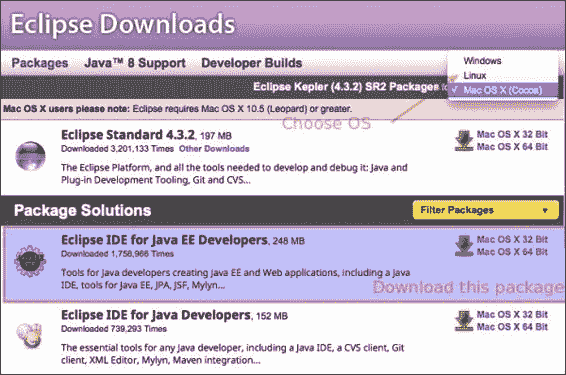

在下一步中，选择您所在位置附近的适当镜像，下载将开始。镜像屏幕可能看起来如下截图所示：

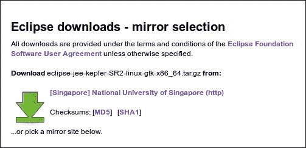

# 安装和启动 Eclipse

前往下载文件的所在位置，如图所示，并将其提取到您选择的位置。提取将生成一个名为 `eclipse` 的文件夹。`eclipse` 文件夹的内容如图所示：

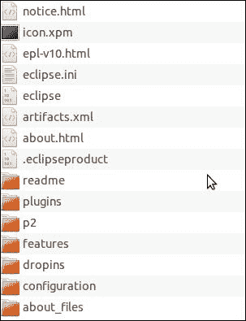

我们可以看到有一个名为`eclipse`的应用程序或可执行文件，双击它将启动 Eclipse IDE。当 Eclipse 启动时，它会提示你输入工作区位置。提供一个合适的位置来存储项目，然后点击**确定**。现在，我们就在 Eclipse 空间中，准备开始操作。你将看到类似于以下截图的内容：

## 安装 m2eclipse 的方法

安装 m2eclipse 相当简单。主要来说，有两种方法在 Eclipse 中安装 m2eclipse 插件：

+   **使用 Eclipse Marketplace**：使用 Eclipse Marketplace 查找并安装插件

+   **使用更新站点**：添加 m2eclipse 更新站点并安装

### 使用 Eclipse Marketplace

使用 Eclipse Marketplace 安装 m2eclipse 的步骤如下：

1.  导航到**帮助** | **Eclipse Marketplace**，如图所示：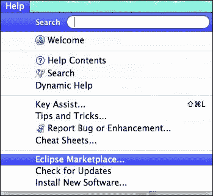

1.  然后，在搜索框中搜索`m2eclipse`，并点击 Eclipse 包的 Maven 集成安装按钮，如图所示：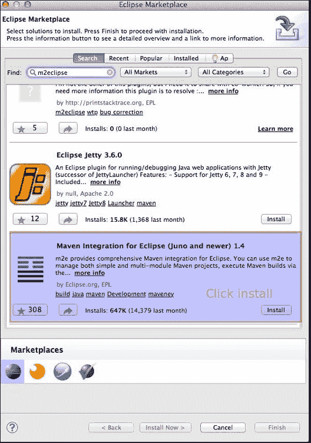

1.  在下一个窗口中，确认要安装的包如下：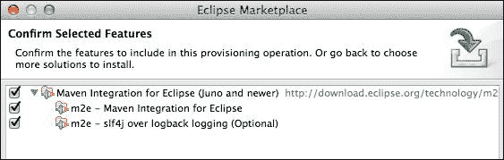

1.  接受条款和条件，然后点击**完成**。安装完成后，将出现以下提示：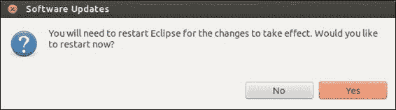

1.  点击**是**以重启 Eclipse 并使更改生效。

1.  对于 Mac 用户，选择**立即重启**选项，对于其他操作系统，选择**是**。

### 使用更新站点

使用更新站点安装 m2eclipse 的步骤如下：

1.  导航到**帮助** | **安装新软件**，你的屏幕将类似于以下截图：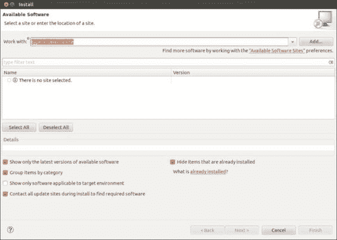

1.  点击**添加...**按钮。将[`download.eclipse.org/technology/m2e/releases`](http://download.eclipse.org/technology/m2e/releases)站点添加为 m2eclipse 更新站点，如图所示，然后点击**确定**：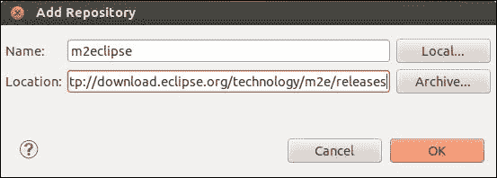

1.  选择如图所示的包：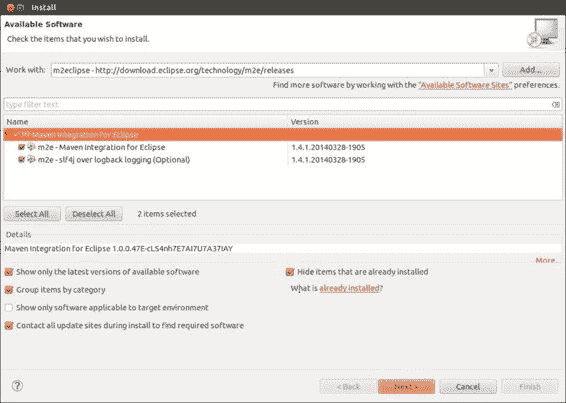

1.  点击**下一步**，同意条款，最后点击**完成**以开始安装。安装完成后，将出现以下提示：

1.  点击**是**以重启 Eclipse 并使更改生效。对于 Mac 用户，选择**立即重启**选项，对于其他操作系统用户，选择**是**。

    ### 注意

    Eclipse Kepler 4.3.2 SR2 已安装 m2eclipse，因此前面的安装步骤将更新插件到最新版本。无论使用上述哪种安装方法，Eclipse Kepler 中打包的 m2eclipse 都将更新。

    因此，在中间阶段，你将看到以下类似的屏幕：

    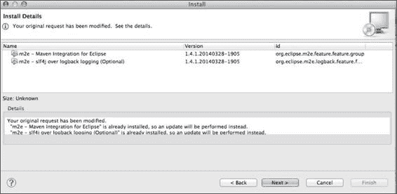

1.  点击 **下一步** 并接受条款，点击 **完成** 以开始安装，然后您需要重新启动以使更改生效。

# 设置 Maven 以便使用

m2eclipse 内置了 Maven 组件，因此 第一章 中讨论的外部 Maven 安装，*Apache Maven – 简介和安装* 是可选的。然而，为了使用 Maven 的最新版本，我们被要求在外部安装 Maven，正如前一章所讨论的那样。我们还需要确保我们的 m2eclipse 插件使用它。此外，现在使用持续集成服务器需要我们在服务器之间有一个共同的 Maven 版本，因此我们使用外部安装的 Maven。

要使 m2eclipse 使用外部 Maven 版本，在 Eclipse 中导航到 **窗口** | **首选项**，将出现 **首选项** 窗口。在左侧窗格的搜索框中搜索 `maven`，然后点击 **安装**，如下面的截图所示：

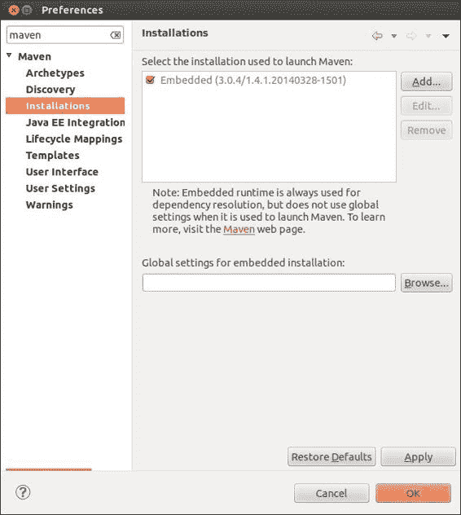

点击 **添加...** 按钮，选择 Maven 目录的位置。从上一章，我们的位置是 `/opt/maven3/apache-maven-3.2.1`。检查相应的外部 Maven 复选框，如图所示，然后点击 **应用**，接着点击 **确定**：

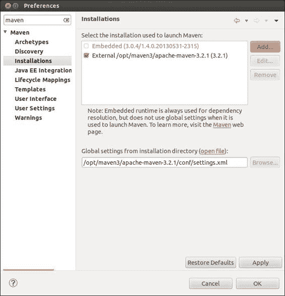

现在，m2eclipse 将使用这个 Maven。

# 摘要

到本章结束时，您已经了解了安装 Eclipse 和 m2eclipse 以及设置 m2eclipse 以使用外部安装的 Maven。在下一章中，我们将探讨 Maven 的重要概念，您将学习如何创建和导入 Maven 项目，并熟悉 Maven 项目的结构。
