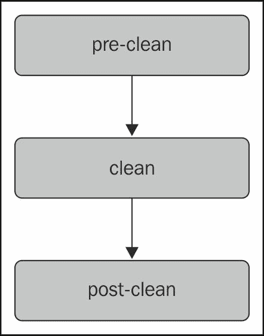
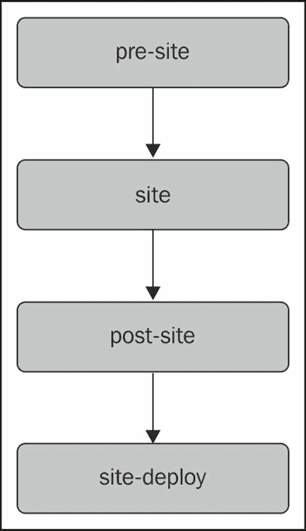
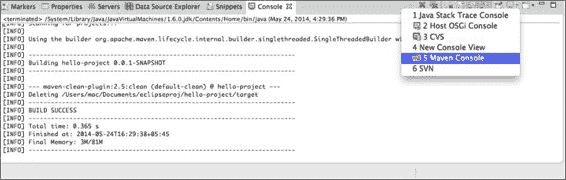
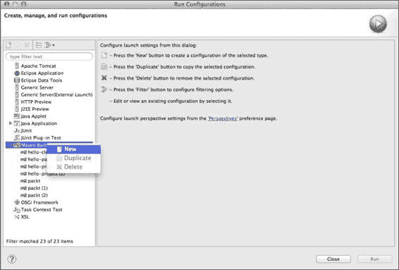
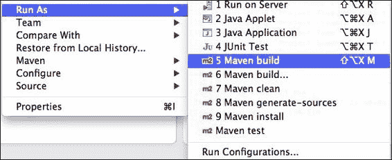
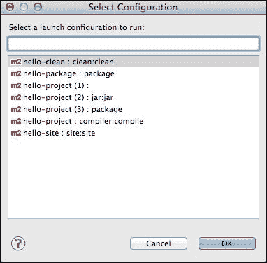
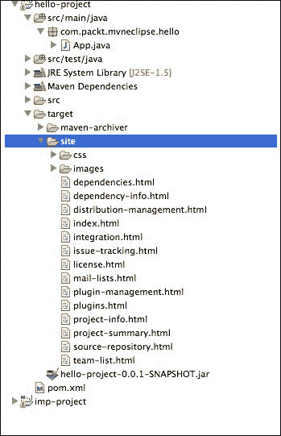

# 第四章。构建和运行项目

恭喜！你已经完成了这本书的一半。正如前面章节所讨论的，Maven 遵循约定优于配置；这意味着有一个默认的构建机制。构建机制，通常称为**构建生命周期**，形成了一系列步骤，这些步骤在阶段（也称为**阶段**）中分组。每个**阶段**都伴随着一组目标，这些目标定义了任务的单元。在本章中，我们将探讨三个标准生命周期——清理、默认和站点——并熟悉其他常见生命周期。你还将了解如何构建和运行在第三章中创建的`hello-project`，即*创建和导入项目*。本章包括以下部分：

+   构建生命周期

    +   默认生命周期

    +   清理生命周期

    +   站点生命周期

+   包特定生命周期

+   Maven 控制台

+   构建和打包项目

+   运行 hello-project

# 构建生命周期

构建 Maven 项目会导致在阶段中分组的目标执行。尽管 Maven 有一个默认的构建周期，但它可以根据我们的需求进行自定义；这就是 Maven 所继承的美。为了确定这一点，了解构建的生命周期是至关重要的。本质上，以下是在 Maven 中的三个标准生命周期：

+   默认

+   清理

+   站点

## 默认生命周期

默认生命周期处理项目的构建和部署。它是 Maven 的主要生命周期，也称为构建生命周期。一般来说，它为 Java 应用程序提供构建过程模型。默认生命周期有 23 个阶段，从验证开始，以部署结束。有关所有 23 个阶段的详细信息，请参阅[`maven.apache.org/guides/introduction/introduction-to-the-lifecycle.html#Lifecycle_Reference`](http://maven.apache.org/guides/introduction/introduction-to-the-lifecycle.html#Lifecycle_Reference)。

然而，在这里我们将看到一些阶段以及与常见应用程序开发相关的默认目标，这些目标如下：

| 生命周期阶段 | 描述 | 插件：目标 |
| --- | --- | --- |
| 验证 | 这验证项目是否正确，并包含执行构建操作所需的所有必要信息 | - |
| 编译 | 这将编译源代码 | `compiler:compile` |
| 测试编译 | 这将在测试目标目录中编译测试源代码 | `compiler:testCompile` |
| 测试 | 使用在`pom`文件中配置的合适的单元测试框架运行测试 | `surefire:test` |
| 打包 | 这将编译后的源代码打包到相应的可分发格式，如 JAR、WAR、EAR 等 | `jar:jar`（用于 JAR 打包） |
| 安装 | 这将在本地仓库中安装包，它可以作为其他项目的依赖项 | `install:install` |
| deploy | 此操作将最终包复制到远程仓库，以便与其他开发者和项目共享 | `deploy:deploy` |

## 清洁生命周期

清洁生命周期是 Maven 中最简单的生命周期，它由以下阶段组成：

+   **pre-clean**：此阶段在项目清理前执行所需的过程

+   **clean**：此阶段删除由早期 `build` (即 `target` 目录) 生成的所有文件

+   **post-clean**：此阶段在项目清理后执行所需的过程

在这些阶段中，引起我们兴趣的是 **clean** 阶段。Maven 的 "`clean:clean`" 目标绑定到清洁阶段。它清理项目的 `build` (通常是 `target`) 目录。执行任何阶段都会导致执行该阶段及其之前的所有阶段，例如，调用清洁阶段会执行第一个 pre-clean 阶段然后是清洁阶段；同样，调用 post-clean 会导致调用 pre-clean、clean 和 post-clean 阶段。以下图表说明了清洁生命周期阶段的执行（参考：Apache Maven 网站）：



我们可以将其他目标绑定到清洁生命周期的阶段。假设我们想在预清洁阶段输出一些消息；我们可以通过将 `maven-antrun-plugin:run` 目标绑定到该阶段来实现，如下所示：

```java
</project>
  ...........
<build>
  <plugins>
    <plugin>
      <groupId>org.apache.maven.plugins</groupId>
      <artifactId>maven-antrun-plugin</artifactId>
      <executions>
        <execution>
          <id>precleanid</id>
          <phase>pre-clean</phase>
          <goals>
            <goal>run</goal>
          </goals>
          <configuration>
            <tasks>
              <echo>Hello am in pre-clean phase</echo>
                </tasks>
          </configuration>
        </execution>
```

## 站点生命周期

站点生命周期处理项目站点文档的创建。站点生命周期的阶段如下图所示：



以下表格描述了站点生命周期阶段按执行顺序。 (参考：Apache Maven 网站)

| 阶段 | 描述 |
| --- | --- |
| pre-site | 此阶段在生成项目站点之前执行所需的过程。 |
| site | 此阶段生成项目站点的文档 |
| post-site | 此阶段在生成站点后执行所需的过程，并为站点部署做准备 |
| site-deploy | 此阶段将生成的站点文档部署到指定的 Web 服务器 |

执行任何阶段都会导致执行该阶段及其之前的所有阶段。例如，调用 post-site 会执行 pre-site、site 和 post-site 阶段。类似于清洁生命周期，我们可以在站点的生命周期中绑定其他目标。

# 包特定的生命周期

每种打包类型都有自己的默认目标。JAR 打包的默认目标与 WAR 打包不同。Maven 为以下内置打包类型提供生命周期：

+   JAR

+   WAR

+   EAR

+   POM

+   EJB

+   Maven 插件

这里描述了 WAR 打包的生命周期和目标绑定。对于其他打包的生命周期和目标绑定，请参阅 [`maven.apache.org/guides/introduction/introduction-to-the-lifecycle.html#Built-in_Lifecycle_Bindings`](http://maven.apache.org/guides/introduction/introduction-to-the-lifecycle.html#Built-in_Lifecycle_Bindings)。

| 阶段 | 插件目标 |
| --- | --- |
| 处理资源 | `resources:resources` |
| 编译 | `compiler:compile` |
| 处理测试资源 | `resources:testResources` |
| 测试编译 | `compiler:testCompile` |
| 测试 | `surefire:test` |
| 打包 | `war:war` |
| 安装 | `install:install` |
| 部署 | `deploy:deploy` |

# Maven 控制台

在我们动手构建和执行 Maven 项目之前，我们需要启用 Maven 控制台。可以通过以下步骤启用 Maven 控制台：

1.  导航到 **窗口** | **显示视图** | **控制台**。这显示了控制台视图。

1.  接下来，点击以下屏幕中所示的 **打开控制台** 小箭头，然后点击 **Maven 控制台**：

Maven 控制台显示了 Maven 构建过程的全部输出。它显示了 Maven 处理的所有详细信息，这对于了解底层发生的事情非常有帮助，您还可以看到调试信息。

# 构建 和打包项目

构建 和打包 Maven 项目需要执行所需阶段，我们已在前面章节中讨论过。让我们从 第三章，*创建和导入项目*，其中我们使用原型生成，构建和打包 `hello-project`。在 *默认生命周期* 部分，打包阶段按以下顺序执行以下阶段：编译、测试和打包阶段。现在，我们将看到如何从 m2eclipse 调用打包阶段。以下步骤将确保这一点：

1.  右键点击 `hello-project` 并选择 **运行**。点击 **运行配置**，**运行配置** 窗口将出现。

1.  右键点击 **Maven 构建** 并选择 **新建**，如图所示：

1.  一旦出现启动配置窗口，填写如图所示的详细信息。对于 **基本目录**，点击 **浏览工作区...** 并从弹出列表中选择 `hello-project`：

1.  接下来，点击 **应用** 并使用 **关闭** 按钮关闭它。

1.  再次右键点击项目并选择 **运行**，然后点击 **Maven 构建**，如图所示：

1.  将出现一个窗口，如图所示，其中包含所有可用的运行配置：

1.  选择 **hello-package** 启动配置并点击 **确定**。它应该编译、运行测试、生成站点文档并在 `target` 目录中打包，如图所示：

# 运行 hello-project

由于上一章中的 `hello-project` 是一个 Java 应用程序，运行它与其他 Java 应用程序类似。右键单击项目，选择**运行方式**，然后点击**Java 应用程序**，选择主 JAVA 类，并点击**确定**。它将在控制台打印 `Hello World!`。

运行一个 Web 应用程序需要一些额外的步骤，我们将在第五章，*为 Maven 项目增色*中讨论这些步骤。

# 摘要

在本章中，你学习了 Maven 项目的清洁、站点和默认构建生命周期，并随后使用这些知识使应用程序打包和运行。

在下一章中，我们将构建一个 Web 应用程序，你将学习如何自定义 `pom` 文件以满足我们的需求。
