# 第六章 创建多模块项目

现在我们已经发射了火箭，让我们更深入地探索它。在本章中，我们将以前一章的`MyDistance`应用程序为基础，将其作为一个多模块 Maven 项目进行开发，并学习如何创建多模块项目、构建和运行它们。本章涵盖的主题如下：

+   简介

+   创建父项目—POM

+   创建核心模块

+   创建 webapp 模块

+   构建多模块项目

# 简介

软件架构将模块化定义为系统组件可能被分离和重新组合的程度。在软件工程中，模块化指的是软件/应用程序可以被划分为多个模块以实现业务目标的程度。模块化提高了可管理和可重用性。随着软件变得越来越复杂，模块化是当务之急。

多模块项目由许多适应模块化的模块组成。一个多模块项目通过一个引用一个或多个`.sub`模块的父/master POM 来识别。

一个多模块项目由以下内容组成：

+   **父项目 POM**：这粘合并引用了项目中的所有其他模块

+   **模块**：这包括服务于应用程序不同功能的子模块，并构成了应用程序

父 POM 是你可以将公共依赖放在一个地方，并让其他模块继承它的地方，即模块的 POM 继承。通常，JUnit 或 log4j 这样的通用依赖是 POM 继承的候选者。

Maven 处理多模块项目的机制被称为**reactor**。Maven 核心的 reactor 具有以下功能：

+   收集所有要构建的模块

+   将项目（模块）排序到当前的构建顺序中

+   按顺序构建排序后的项目

项目模块通过指定每个模块的`<module> </module>`标签被包含在`<modules> </modules>`标签内。同样，父模块通过指定 Maven 坐标被包含在`<parent> </parent>`标签内。

现在，为了说明，我们将从第五章的`MyDistance`应用程序，*为 Maven 项目增色*，将其作为一个多模块项目进行开发。项目的模块如下：

+   `Distance-main`: 这是父项目，也称为父 POM，它将项目的不同模块（如`distance-core`和`distance-webapp`）粘合并引用

+   `distance-core`: 此模块提供了一个简单的距离转换实用工具类

+   `distance-webapp`: 这是一个可以输入依赖于`distance-core`模块的单位进行转换并响应结果的 Web 界面

在接下来的章节中，我们将深入了解前面的模块。

# 创建父项目 – POM

建立多模块项目的第一步是设置父 POM。为此，请按照以下步骤操作：

1.  转到**文件** | **新建**并点击**Maven 项目**。或者，转到**文件** | **新建**并点击**其他...**。在**选择向导**屏幕中，通过搜索框搜索`maven`，选择**Maven 项目**，然后点击**下一步**按钮，如图所示：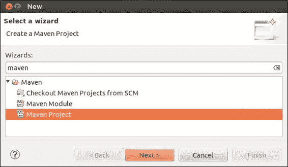

1.  将出现**新建 Maven 项目**向导；确保勾选复选框**创建简单项目（跳过存档选择）**，如图所示，然后点击**下一步**：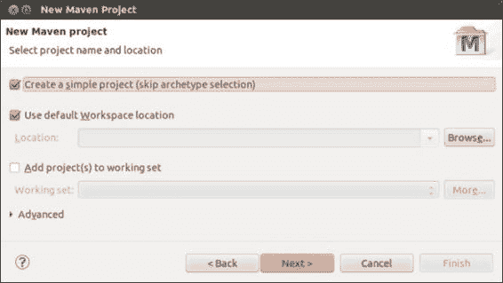

1.  将出现**新建 Maven 项目**配置向导；根据截图填写详细信息，然后点击**完成**：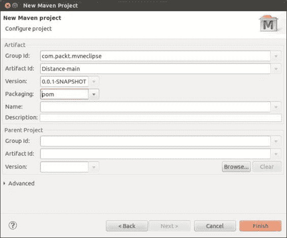

    确保从下拉菜单中选择打包类型为 POM：

    | **字段** | **值** |
    | --- | --- |
    | **组 ID** | `com.packt.mvneclipse` |
    | **工件 ID** | `Distance-main` |
    | **版本** | `0.0.1-SNAPSHOT` |
    | **打包** | `pom` |

1.  将创建相应的项目，最终屏幕将如下所示：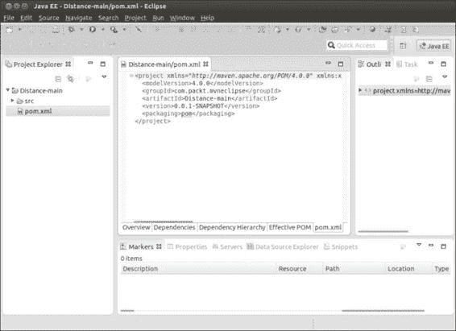

现在我们已经设置了父 POM。

# 创建核心模块

`MyDistance`的核心模块将包含一个可以将不同单位之间的值进行转换的类，即从千米/米到码/英里。让我们将这个核心模块命名为`distance-core`。要创建核心模块，请执行以下步骤：

1.  转到**文件** | **新建**并点击**其他…**。在**选择向导**屏幕中，通过搜索框搜索`maven`，选择**Maven 模块**，然后点击**下一步**按钮，如图所示：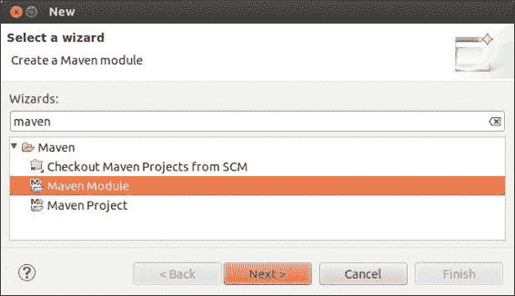

1.  将出现**新建 Maven 模块**向导；确保勾选复选框**创建简单项目（跳过存档选择）**，提供模块名称为`distance-core`，并浏览选择父项目为`Distance-main`，如图所示：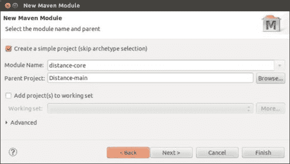

1.  在**配置项目**Maven 模块向导中，填写以下截图后的表格中的详细信息，然后点击**完成**：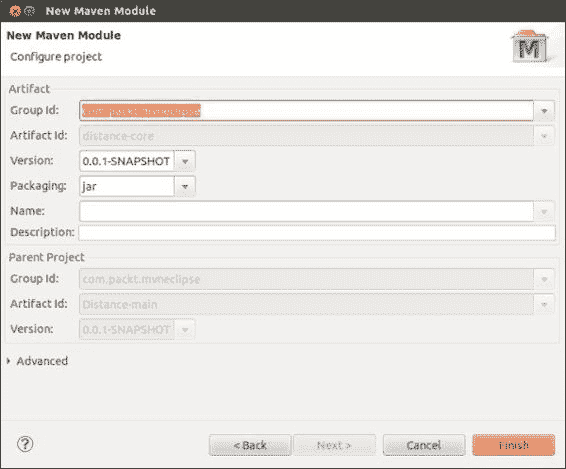

    | **字段** | **值** |
    | --- | --- |
    | **组 ID** | `com.packt.mvneclipse` |
    | **版本** | `0.0.1-SNAPSHOT` |
    | **打包** | `jar` |

    由于核心模块仅包含一个 Java 类，并且可以作为应用程序 Web 模块的库使用，因此打包类型为`jar`。

1.  `distance-core`模块将被创建，POM 的内容将如下所示：

    ```java
    <project   xsi:schemaLocation="http://maven.apache.org/POM/4.0.0 http://maven.apache.org/xsd/maven-4.0.0.xsd">
       <modelVersion>4.0.0</modelVersion>
        <parent>
        <groupId>com.packt.mvneclipse</groupId>
            <artifactId>Distance-main</artifactId>
            <version>0.0.1-SNAPSHOT</version>
        </parent>
        <artifactId>distance-core</artifactId>
        </project>
    ```

    ### 注意

    请注意，模块的父级被包含在`<parent></parent>`标签中。此外，对于模块，`groupId`和`version`标签将不会出现，因为我们已经在**配置 Maven 模块**向导中指定了相同的`groupId`和`version`。我们在创建模块时在前面的代码中做了这件事。

    在任何时候，如果我们想更改或添加`groupId/version/artifactId`，我们都可以始终编辑`pom.xml`文件，因为它是一个 XML 文件。

1.  核心模块由一个执行跨距离单位转换的类文件组成。现在让我们添加一个类；在项目上右键单击，导航到**新建**，选择**包**，并指定包名为`com.packt.chpt6.mydistance.util`。

1.  在前面的包中创建一个名为`ConversionUtil`的类。如果你还记得，我们在第五章，*为 Maven 项目增色*中创建了此类。因此，复制此类的全部内容并保存。

1.  现在让我们放置一个单元测试类。在`src/test/java`中创建一个包，名为`com.packt.chpt6.mydistance.util`。将类`ConversionUtilTest`添加到相应的包中。参考第五章，*为 Maven 项目增色*，其中我们创建了此测试类；复制此类的全部内容并保存。结果`src`结构将如下所示：创建核心模块

你可能会注意到我们有一些错误，这些错误是由于`TestCase`类没有被解析。为了解决这个错误，将`jUnit`作为依赖项添加到父模块，即`pom.xml`文件中，如下所示：

```java
    <dependency>
      <groupId>junit</groupId>
      <artifactId>junit</artifactId>
      <version>3.8.1</version>
      <scope>test</scope>
    </dependency> 
```

### 注意

通常，JUnit 和 log4j 依赖项，即跨模块的通用依赖项，被放置在父 POM 的一个地方，并且模块继承它们。

# 创建一个名为`ConversionUtil`的类。

webapp 模块有一个表单的 JSP 文件，用于接受输入。它还有一个接受请求参数并使用核心模块执行转换并提供响应的 servlet。现在让我们通过以下步骤来查看如何放置 webapp 模块：

1.  导航到**文件** | **新建**，然后点击**其他...**；在**选择向导**屏幕中，通过搜索框搜索`maven`，选择**Maven 模块**，并点击以下截图所示的**下一步**按钮：创建 webapp 模块

1.  在接下来的**新 Maven 模块**窗口中，将模块名称设置为`distance-webapp`，并浏览选择父模块为`Distance-main`。创建 webapp 模块

1.  在**选择存档类型**窗口中，通过搜索框搜索`webapp`，选择**maven-archetype-webapp**，然后点击**下一步**继续，如下所示：创建 webapp 模块

1.  在**新建 Maven 模块**窗口中，填写以下表格中提供的详细信息，然后单击**完成**，如下表所示的截图所示：

    | **字段** | **值** |
    | --- | --- |
    | **Group Id** | `com.packt.mvneclipse` |
    | **版本** | `0.0.1-SNAPSHOT` |
    | **Package** | `com.packt.chpt6.mydistance` |

    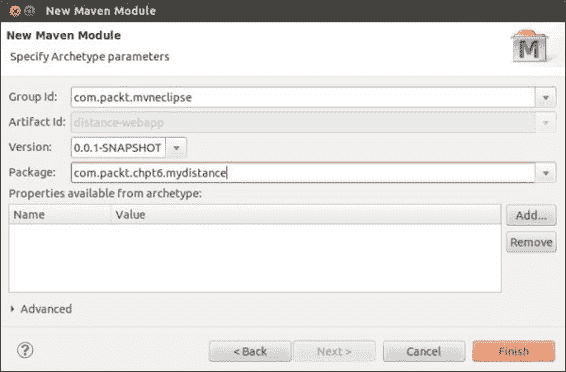

1.  将创建 webapp 模块，生成的结构将如下截图所示：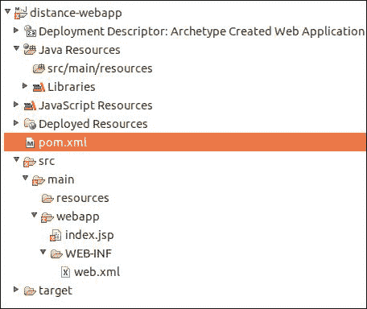

1.  现在如果我们查看父项目的结构，我们可能会注意到它对每个模块都有一个引用，如下面的截图所示：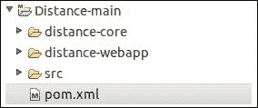

1.  此外，如果我们注意查看父项目的 `pom.xml` 文件，我们会看到模块是如何添加到 `<module>` 标签中的，如下所示：

    ```java
    <modules>
      <module>distance-core</module>
      <module>distance-webapp</module>
    </modules>
    ```

1.  打开 webapp 模块的 `pom.xml` 文件，并添加 `log4j`、servlet 和 Tomcat 的依赖项，如下所示；这也在第五章，*为 Maven 项目添加风味*中进行了更详细的讨论：

    ```java
        <!-- Include servlet  API -->
      <dependency>
        <groupId>javax.servlet</groupId>
        <artifactId>javax.servlet-api</artifactId>
        <version>3.1.0</version>
        <scope>provided</scope>
      </dependency>
      <!-- For logging purpose could be put in parent POM for modules to inherit  -->
        <dependency>
        <groupId>log4j</groupId>
        <artifactId>log4j</artifactId>
        <version>1.2.17</version>
      </dependency>

    <!--  For tomcat  
    <plugins>
        <plugin>
              <groupId>org.apache.tomcat.maven</groupId>
              <artifactId>tomcat7-maven-plugin</artifactId>
              <version>2.1</version>
        </plugin>
        </plugins>
    ```

1.  此外，由于 webapp 使用它进行转换，因此请添加 `distance-core` 作为依赖项，如下所示：

    ```java
      <dependency>
      <groupId>com.packt.mvneclipse</groupId>
        <artifactId>distance-core</artifactId>
        <version>0.0.1-SNAPSHOT</version>
        <scope>compile</scope>
      </dependency>
    ```

1.  将 `log4j.properties` 文件添加到 `resources` 文件夹。请参阅第五章中的*添加资源*部分，*为 Maven 项目添加风味*。

1.  添加表单以获取输入并添加 servlet（请参阅第五章中的*添加获取输入的表单*和*添加 Servlet*部分，*为 Maven 项目添加风味*）。

# 构建多模块项目

现在我们已经完成了模块代码的编写，让我们构建项目。在父项目（在这种情况下为 `Distance-main`）上右键单击，选择**运行**，然后单击**Maven 测试**。这应该会编译并运行单元测试。控制台输出的摘录如下：

```java
[INFO] Scanning for projects...
[INFO] ------------------------------------------------------------------------
[INFO] Reactor Build Order:
[INFO] 
[INFO] Distance-main
[INFO] distance-core
[INFO] distance-webapp Maven Webapp
[INFO] 
[INFO] Using the builder org.apache.maven.lifecycle.internal.builder.singlethreaded.SingleThreadedBuilder with a thread count of 1
[INFO] 
[INFO] ------------------------------------------------------------------------
[INFO] Building Distance-main 0.0.1-SNAPSHOT
[INFO] ---------------------------------------------------------
[INFO] ------------------------------------------------------------------------
[INFO] Building distance-core 0.0.1-SNAPSHOT
[INFO] ----------------------------------------------------------
------------------------------------------------------
 T E S T S
-------------------------------------------------------
Running com.packt.chpt6.mydistance.util.ConversionUtilTest
Tests run: 4, Failures: 0, Errors: 0, Skipped: 0, Time elapsed: 0.009 sec

Results :

Tests run: 4, Failures: 0, Errors: 0, Skipped: 0

[INFO] 
[INFO] ------------------------------------------------------------------------
[INFO] Building distance-webapp Maven Webapp 0.0.1-SNAPSHOT
[INFO] ---------------------------------------------------------
[INFO] ------------------------------------------------------------------------
[INFO] Reactor Summary:
[INFO] 
[INFO] Distance-main ..................................... SUCCESS [  0.002 s]
[INFO] distance-core ..................................... SUCCESS [  2.250 s]
[INFO] distance-webapp Maven Webapp ...................... SUCCESS [  0.161 s]
[INFO] ------------------------------------------------------------------------
[INFO] BUILD SUCCESS
[INFO] ------------------------------------------------------------------------

```

指称为反应器的机制知道构建项目的顺序。现在再次，在**Distance-main**上右键单击，选择**运行**，然后单击**Maven install**以在本地仓库中安装模块。

### 注意

如果有任何更改发生，请始终确保通过**运行**选项运行 Maven `clean` 来清理项目；或者，您可以使用 **Maven install** 重新安装项目。

# 运行应用程序

要运行应用程序，在以下截图中突出显示的父项目的 webapp 模块上右键单击，选择**运行**，然后单击**运行配置...**。在**运行配置**窗口中，指定目标为 `tomcat7:run`，然后单击**运行**按钮。Web 应用程序将在 `http://localhost:8080/distance-webapp/` 运行；将浏览器指向此位置并执行转换：

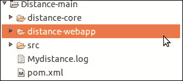

# 摘要

在本章中，我们学习了如何创建一个多模块项目，然后构建和运行应用程序。在下一章中，我们将提前窥视 m2eclipse，并学习如何对其进行自定义。
