# 第七章.一瞥 m2eclipse

我们即将结束这次旅程；现在在这一章中，我们将探讨 m2eclipse 中的其他附加功能，熟悉基于表单的 POM 编辑器，并了解存储库。

本章涵盖的主题如下：

+   m2eclipse 中的其他功能

+   基于表单的 POM 编辑器

+   分析项目依赖项

+   与存储库一起工作

+   m2eclipse 首选项

# m2eclipse 中的其他功能

为了理解 m2eclipse 的其他功能，必须按照以下步骤操作。在 Maven 项目上右键单击，然后导航到**Maven**菜单项。然后，你可以看到以下截图所示的可用功能：

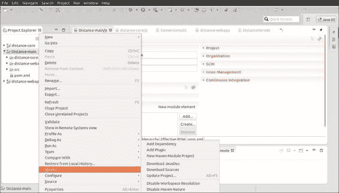

如果你看到截图，可用的功能如下：

+   **添加依赖**

+   **添加插件**

+   **新 Maven 模块项目**

+   **下载 JavaDoc**

+   **下载源代码**

+   **更新项目**

+   **禁用工作空间解析**

+   **禁用 Maven 属性**

同样，在**Maven 依赖项**上右键单击，然后导航到**Maven**菜单项。以下截图显示了可见的功能：

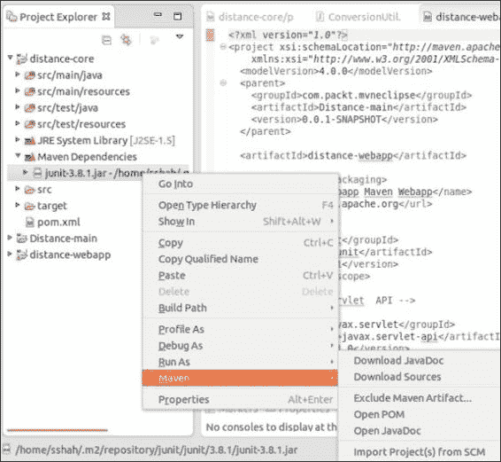

可用的功能如下：

+   **下载 JavaDoc**

+   **下载源代码**

+   **排除 Maven 工件**

+   **打开 POM**

+   **打开 JavaDoc**

+   **从 SCM 导入项目**

在接下来的部分中，我们将共同讨论这些功能。

## 添加依赖

它允许我们向 Maven 项目添加依赖项。以下是这个功能的截图：

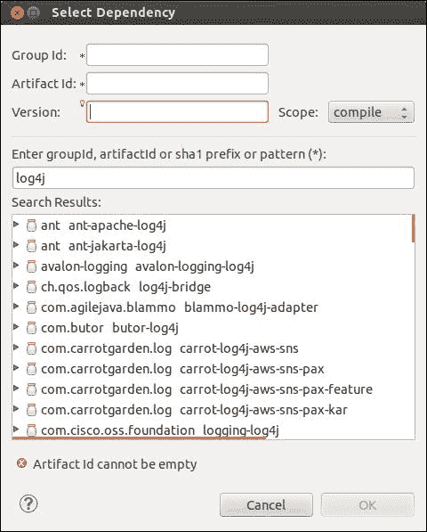

到目前为止，我们一直在编辑`pom.xml`文件并向其中添加依赖项。添加依赖项是使用图形界面实现相同目标的另一种方法。当你使用此选项时，你需要知道的信息更少，也就是说，知道`artifactId`/`groupId`就足以在存储库中搜索并选择合适的项。在先前的方法中，你需要知道完整的 Maven 坐标才能添加依赖项；因此，后者是节省时间的方法。

## 添加插件

与**添加依赖**类似，**添加插件**允许你通过图形界面添加插件。这需要我们拥有最少的信息来搜索存储库并添加插件。以下是这个功能的截图：

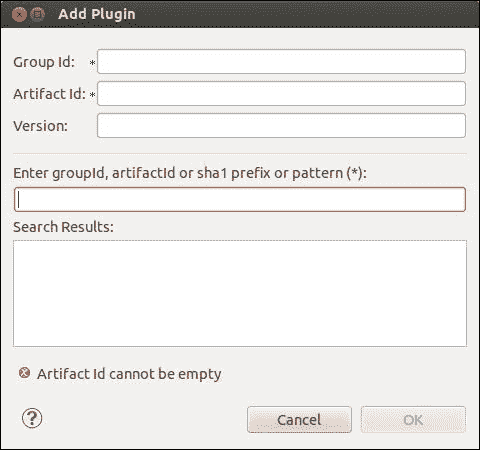

## 新 Maven 模块项目

在第六章中，*创建多模块项目*，我们创建了一个多模块项目并学习了如何创建模块项目。这是调用相同的**添加模块**向导创建模块的另一种方法。以下是这个窗口的截图，它与导航到**新建** | **其他** | **Maven 模块**并右键单击项目时获得的截图相同（如我们在上一章中看到的）：

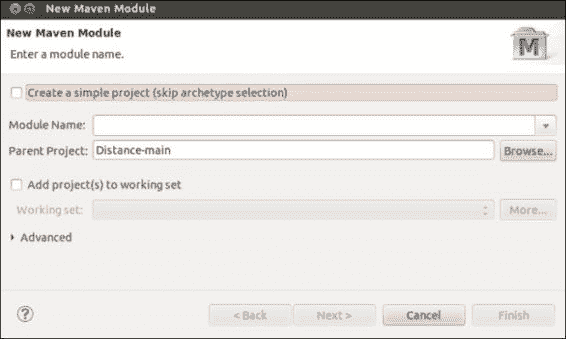

## 下载 JavaDoc

**下载 JavaDoc**用于将项目（如果存在于中央仓库）的 javadoc 下载到本地仓库。例如，在**Maven 依赖项**下右键单击`log4j-1.2.17.jar`文件并单击**下载 JavaDoc**，如下截图所示。javadoc 将与其他构件一起下载到本地仓库，位于`$HOME/.m2/repository/log4j/log4j/1.2.17/`作为`log4j-1.2.17-javadoc.jar`位置：

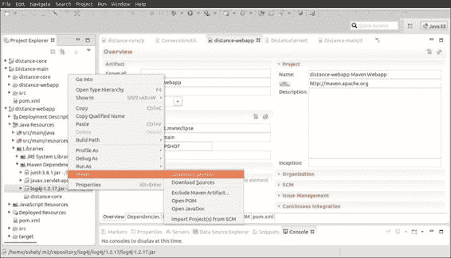

## 下载源代码

如果中央仓库有对应项目的源代码构件，我们可以使用此选项将其下载到本地仓库，并在 Eclipse 环境中使用它。这在调试复杂问题时非常有用，尤其是当我们需要深入依赖项的代码时。例如，`log4j`的源代码将被下载到`$HOME/.m2/repository/log4j/log4j/1.2.17/`作为`log4j-1.2.17-javadoc.jar`位置。下载源代码后，右键单击`log4j-1.2.17.jar`文件并单击**属性**，如下截图所示：

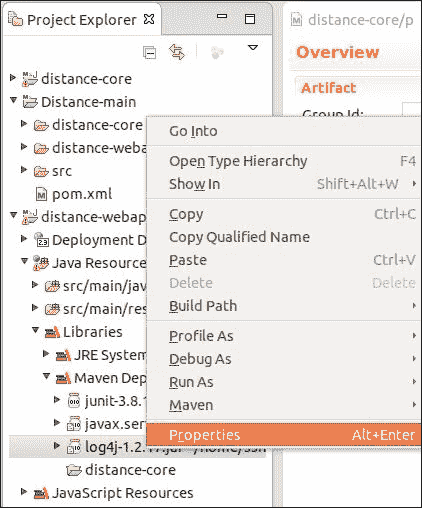

**属性**窗口出现；**Java 源代码附件**导航按钮显示附加源代码位置，如下截图所示：

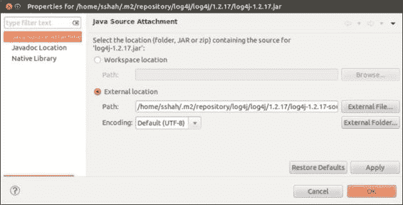

注意，我们还可以通过在左侧面板上单击**Javadoc 位置**导航按钮来找到 javadoc 位置。

## 打开 Javadoc

当我们想要浏览相应项目的 javadoc 时，我们使用此选项。javadoc 作为单独的标签在编辑区域打开，如下截图所示为`log4j`文档：

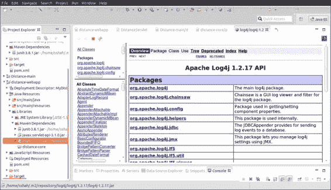

## 打开 POM

在任何时刻，如果需要查看依赖项的 POM 文件，我们可以使用此选项。依赖项的相应 POM 文件在工作区的编辑区域打开。以下截图显示了编辑区域中的`log4j` POM 文件，这是我们第四章中构建的`MyDistance`应用程序的依赖项，*构建和运行项目*：

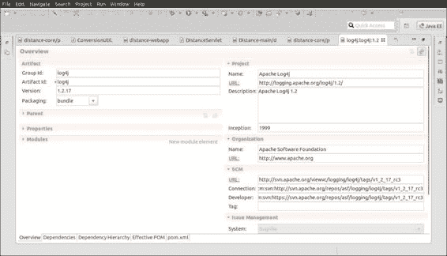

## 更新项目

有时候，我们有一个 Java 项目，我们希望将其转换为 Maven 项目。我们可以通过在项目上右键单击，导航到**配置**|**转换为 Maven 项目**，并添加 POM 文件来完成此操作。现在，**更新项目**用于从其依赖项和资源更新项目。如果你在工作区中有多个 Maven 项目，并且项目相互依赖，那么**更新项目**也非常方便。然后，在你构建（`mvn install`）一个项目后，你可以在其他项目上执行**更新项目**以获取新的构件。更新选项如下截图所示：

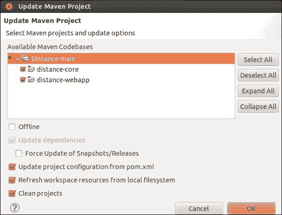

### 注意

选择**离线**将不会检查中央仓库以获取更新。

## 禁用工作区解析

想象一个场景，项目 A 依赖于项目 B，并且它们位于同一个工作区中，通常在多模块项目中。现在，如果禁用了工作区解析，为了使项目 A 成功构建并且项目 B 的工件在本地仓库中，则需要项目 B。然而，如果启用了工作区解析，依赖项将使用 Eclipse 工作区进行解析，并且不需要本地仓库中的工件。

## 禁用 Maven 依赖项

它禁用了项目的 Maven 方面，即 Maven 依赖项从构建路径中移除。在这种情况下，我们可能需要从构建窗口手动将 JAR 包包含到类路径中。

## 从 SCM 导入项目（s）

它允许您将依赖项的源代码拉取到您的 Eclipse 工作区中。换句话说，它允许您基于该依赖项的源代码创建一个新的 Maven 项目。源代码将从定义在依赖项 POM 中的 **源代码管理（SCM**）系统中拉取。如果依赖项 POM 没有提及 SCM，则此选项不起作用。请确保您已为相应的 SCMs 安装了适当的 m2e 连接器。我们已在 第三章 中讨论了导入和安装 Subversion m2e 连接器，*创建和导入项目*。

# 基于表单的 POM 编辑器

m2eclipse 提供了使用基于表单的 POM 编辑器编辑 `pom` 文件的功能。在早期章节中，我们玩转了 XML 标签并编辑了 `pom` 文件。在直接编辑 XML 文件时，需要了解标签知识，并且用户很可能犯一些错误。然而，基于表单的编辑器减少了简单错误的可能性，并简化了 `pom` 文件的编辑，即使没有或只有很少的 XML 知识。我更喜欢玩转 XML 标签并使用该选项，但你可以自由选择你的选项。基于表单的编辑器在以下屏幕截图中显示，并具有五个选项卡：**概览**、**依赖项**、**依赖项层次结构**、**有效 POM** 和 **pom.xml**：

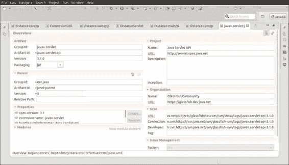

## 概览

概览提供了项目的一般信息。它包括以下部分，并提供了如下所示的信息：

+   **工件**

+   **父级**

+   **项目**

+   **模块**

+   **属性**

+   **组织**

+   **源代码管理（SCM**）

+   **问题管理**

+   **持续集成**

您可以更改此表单中的任何信息，这将反映在 XML 文件中。我们将在下一节讨论 **依赖项** 和 **依赖项层次结构** 选项卡。

# 分析项目依赖

POM 编辑器有一个 **依赖项** 选项卡，它提供了依赖项的概览以及管理项目依赖项的选项。**依赖项** 选项卡有两个部分，如下面的屏幕截图所示：

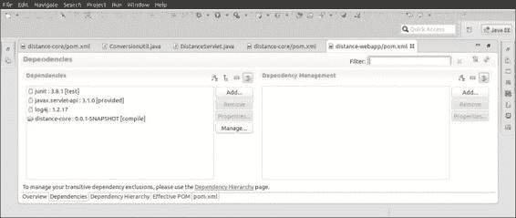

它显示了项目左侧的所有依赖项。我们还可以使用 **依赖项** 部分的 **添加** 按钮将依赖项添加到项目中。**管理** 按钮允许您选择将管理相应依赖项的 POM，以下截图显示了此操作：

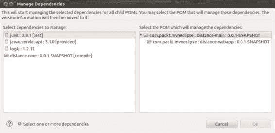

如窗口顶部非常清楚地所述，管理的依赖项版本信息将移动到管理它的 POM 中。例如，让我们选择通过 `Distance-main` POM 来管理 `distance-webapp` 的 `log4j` 依赖项。在列表中选择 `log4j`，然后在右侧列表中选择 `Distance-main`，并点击以下截图所示的 **确定**：

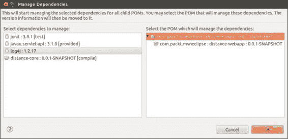

在 `log4j` 文件被管理后，其右侧出现“管理”一词，如下面的截图所示：

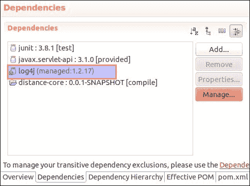

如果我们在 XML 文件中看到其效果，我们可以看到来自 `distance-webapp` POM 的版本信息被移动，并作为依赖项添加到 `Distance-main` POM 中，如下面的代码所示：

```java
<dependencyManagement>
  <dependencies>
    <dependency>
      <groupId>log4j</groupId>
      <artifactId>log4j</artifactId>
      <version>1.2.17</version>
    </dependency>
  </dependencies>
</dependencyManagement>
```

实现相同功能的另一种方法是使用右侧的 **依赖管理** 部分。**依赖层次**选项卡包含两个部分：**依赖层次**和**已解析依赖项**，如下所示：

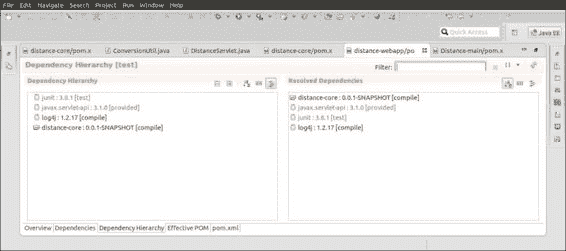

左侧的 **依赖层次** 部分提供了依赖项的树视图。树的第一个级别是项目的直接依赖项，然后每个后续级别显示每个依赖项的依赖项。前面的截图是 `distance-webapp` 模块，其中我们有两个直接依赖项，这些依赖项没有进一步的依赖项，因此树结构不可见。然而，对于大型项目和大型直接依赖项，我们可以轻松地可视化它。jar 图标表示它来自 Maven 仓库，而打开文件夹图标表示它在 Eclipse 工作空间中存在。

右侧的 **已解析依赖项** 部分显示了所有已解析依赖项的列表，即应用所有冲突和作用域后的结果依赖项。它给出了解析链传播和到达 **已解析依赖项** 的路线的一般概念。点击任何已解析依赖项，它将在 **依赖层次** 部分显示依赖链。

关于依赖项的更多信息，请参阅[`books.sonatype.com/m2eclipse-book/reference/dependencies-sect-analyze-depend.html`](http://books.sonatype.com/m2eclipse-book/reference/dependencies-sect-analyze-depend.html)。

# 与仓库一起工作

要浏览仓库，请转到 **窗口** | **显示视图** 并点击以下所示的 **其他...**：

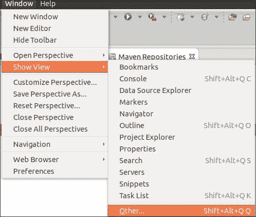

接下来，出现**显示视图**窗口。搜索`maven repository`，如下面的截图所示，然后点击**Maven 仓库**：

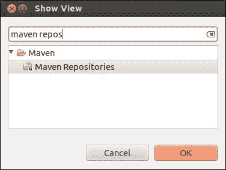

**Maven 仓库**视图由以下类型组成：

+   **本地仓库**

+   **全局仓库**

+   **项目仓库**

+   **自定义仓库**

有兴趣的仓库是本地、全局和项目仓库。

## 本地仓库

它显示了本地仓库的工件，我们可以深入查看其 POM 内容。它还包括 Eclipse 工作空间项目。以下是本地仓库的截图：

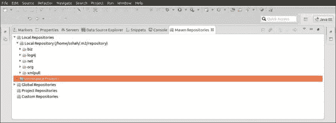

## 全局仓库

它引用中央仓库的工件。我们可以浏览中央仓库的工件并查看其 POM。右键单击**全局仓库**，它提供了从中央仓库重新索引、构建完整索引、最小索引和更新索引的能力。以下截图显示了全局仓库：

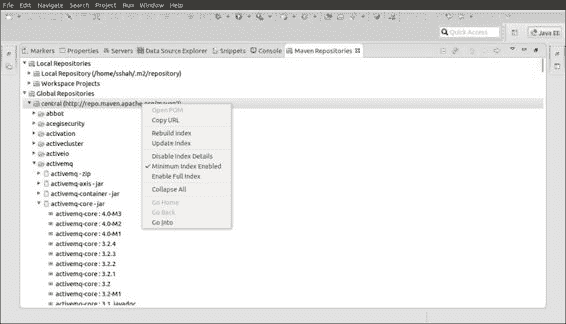

## 项目仓库

```java
pom.xml file:
```

```java
<repositories>
    <repository>
      <id>project-based-repository</id>
      <name>Project-specific jars</name>
      <url>file:///${basedir}/libs</url>
    </repository>
<repositories>
```

通过单击窗口右上角的两个循环箭头刷新**Maven 仓库**窗口。我们可以在以下方式中看到**项目仓库**中的相应引用：


# m2eclipse 首选项

要打开 m2eclipse 首选项，导航到**窗口** | **首选项**。在**首选项**窗口中，在过滤器文本框中搜索`maven`，如下所示：

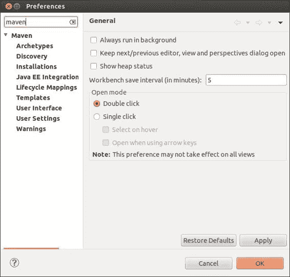

## Maven

点击下面的截图所示的**Maven**；它允许我们为 Maven 设置以下选项：

+   **离线**：此选项不会检查中央仓库的更新

+   **调试输出**：此选项将 Maven 设置为调试模式

+   **下载工件源**：此选项将源代码下载到本地仓库，如 JAR

+   **下载工件 Javadoc**：此选项将 javadoc 下载到本地仓库

+   **启动时更新 Maven 项目**：此选项更新 Maven 项目的依赖项

+   **隐藏物理嵌套模块的文件夹（实验性）**：此选项处于实验模式，隐藏多模块项目的嵌套文件夹

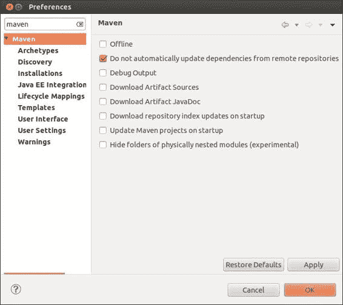

## 发现

发现用于发现可用的 m2e 连接器。请参阅第三章中的*检出 Maven 项目*部分，*创建和导入项目*，了解我们如何使用此功能。

## 原型

原型允许我们添加、删除和编辑 Maven 原型目录，如下面的截图所示：

有关原型的更多信息，请参阅[`maven.apache.org/archetype/index.html`](http://maven.apache.org/archetype/index.html)。

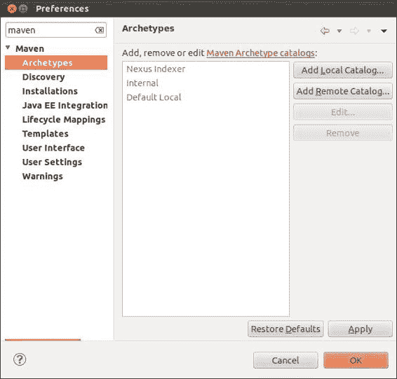

## 用户界面和用户设置

**用户界面** 允许我们设置 XML 文件选项，如下面的截图所示：

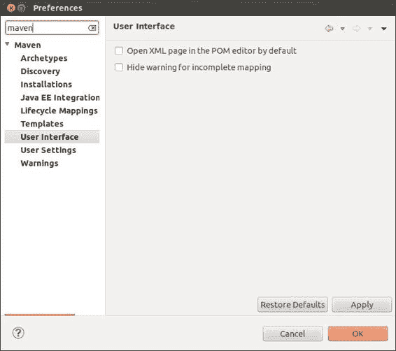

`settings.xml` 文件包含用于定义配置 Maven 执行的值的元素，例如 `pom.xml` 文件。`settings` 文件位于 `$ {M2_HOME}/settings.xml`，其中 `M2_HOME` 是 `{USER_HOME}/.m2`。在 第三章 的 *本地仓库* 部分中，*创建和导入项目*，我们使用此文件设置除默认仓库之外的备用本地仓库。

**用户设置** 允许我们使用自定义设置文件并重新索引本地仓库，如下面的截图所示：

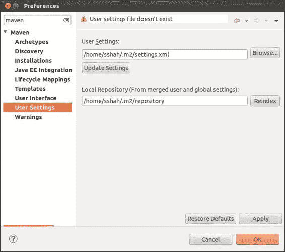

更多关于设置的信息请参阅 [`maven.apache.org/settings.html#Servers`](http://maven.apache.org/settings.html#Servers)。

## 安装

**安装** 显示 Maven 安装并允许我们选择要使用的 Maven。我们使用它来设置 *设置 Maven 以使用* 部分的 第二章 中的外部 Maven 安装；请参阅它以获取更多详细信息。

## 警告

警告允许我们启用/禁用跨父-子 POM 的重复组 ID 和版本的警告。在撰写本文时，尽管此选项已启用，但 m2eclipse 仍然会抱怨重复；希望这个功能将在未来的新版本中正常工作。

## 模板

模板显示了 Maven 所使用的所有模板的列表。它还提供了一个选项来添加新模板、编辑、删除、导入和导出模板，如下面的截图所示：

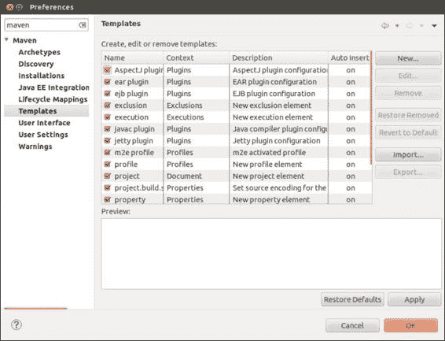

## 生命周期映射

**生命周期映射** 允许我们自定义 m2eclipse 使用的 Maven 项目的项目构建生命周期。在撰写本书时，此功能仍然是实验性的；因此，我们将限制对其的讨论。

更多信息请参阅 [`wiki.eclipse.org/M2E_plugin_execution_not_covered`](http://wiki.eclipse.org/M2E_plugin_execution_not_covered)。

# 摘要

在本章中，你了解了 m2eclipse 中可用的其他附加功能，并熟悉了仓库、基于表单的 POM 编辑器和 m2eclipse 首选项。因此，在这本书中，你学习了 Maven 概念；m2eclipse 和功能；以及创建、构建和运行 Maven 项目的便捷性。
