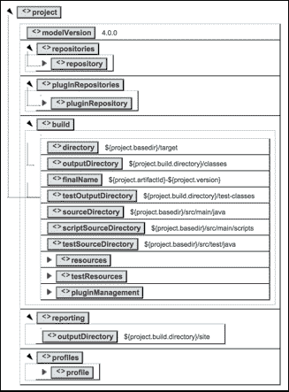

# 第二章 理解项目对象模型（POM）

POM 是任何 Maven 项目的核心。本章重点介绍与 POM 相关的核心概念和最佳实践，这些概念和最佳实践与构建大型、多模块 Maven 项目有关。

随着本章的进行，以下主题将详细讨论：

+   POM 层级、超级 POM 和父 POM

+   扩展和覆盖 POM 文件

+   Maven 坐标

+   管理依赖

+   传递性依赖

+   依赖范围和可选依赖

# 项目对象模型（POM）

任何 Maven 项目都必须有一个 `pom.xml` 文件。POM 是 Maven 项目的描述符，就像您的 Java EE 网络应用程序中的 `web.xml` 文件，或者您的 Ant 项目中的 `build.xml` 文件一样。以下代码列出了 Maven `pom.xml` 文件中的所有关键元素。随着本书的进行，我们将讨论如何以最有效的方式使用每个元素：

```java
<project>

  <parent>...</parent>   

  <modelVersion>4.0.0</modelVersion>     
  <groupId>...</groupId>   
  <artifactId>...</artifactId>   
  <version>...</version>   
  <packaging>...</packaging>

  <name>...</name>   
  <description>...</description>   
  <url>...</url>   
  <inceptionYear>...</inceptionYear>   
  <licenses>...</licenses>   
  <organization>...</organization>   <developers>...</developers>   
  <contributors>...</contributors>    

  <dependencies>...</dependencies>   
  <dependencyManagement>...</dependencyManagement>
  <modules>...</modules>   
  <properties>...</properties>    

  <build>...</build>   
  <reporting>...</reporting> 

  <issueManagement>...</issueManagement>   <ciManagement>...</ciManagement>   <mailingLists>...</mailingLists>   
  <scm>...</scm>   
  <prerequisites>...</prerequisites>     

  <repositories>...</repositories>   <pluginRepositories>...</pluginRepositories>   

  <distributionManagement>...</distributionManagement>  

  <profiles>...</profiles>
</project>
```

以下代码展示了示例 `pom.xml` 文件：

```java
<project>
  <modelVersion>4.0.0</modelVersion>
  <groupId>com.packt</groupId>
  <artifactId>jose</artifactId>
  <version>1.0.0</version>

  <build>
    <plugins>
      <plugin>
        <groupId>org.apache.maven.plugins</groupId>
        <artifactId>maven-scm-plugin</artifactId>
        <version>1.9</version>
        <configuration>
          <connectionType>connection</connectionType>
        </configuration>
	  </plugin>
    </plugins>
  </build>

  <dependencies>
    <dependency>
      <groupId>com.nimbusds</groupId>
      <artifactId>nimbus-jose-jwt</artifactId>
      <version>2.26</version>
    </dependency>
  </dependencies>
</project>
```

# POM 层级

POM 文件之间维护着父子关系。子 POM 文件从其父 POM 继承所有配置元素。使用这个技巧，Maven 坚持其设计哲学*约定优于配置*。任何 Maven 项目的最小 POM 配置非常简单，如下所示：

```java
<project>
  <modelVersion>4.0.0</modelVersion>
  <groupId>com.packt</groupId>
  <artifactId>sample-one</artifactId>
  <version>1.0.0</version>
</project>
```

### 提示

**下载示例代码**

您可以从您在 [`www.packtpub.com`](http://www.packtpub.com) 的账户下载您购买的所有 Packt 书籍的示例代码文件。如果您在其他地方购买了这本书，您可以访问 [`www.packtpub.com/support`](http://www.packtpub.com/support) 并注册，以便将文件直接通过电子邮件发送给您。

# 超级 POM

任何 POM 文件都可以指向其父 POM。如果父 POM 元素缺失，则存在一个系统范围内的 POM 文件，它自动被视为父 POM。这个 POM 文件被称为**超级 POM**。最终，所有应用程序 POM 文件都从超级 POM 扩展而来。超级 POM 文件位于 POM 层级的顶部，并打包在 `MAVEN_HOME/lib/maven-model-builder-3.3.3.jar - org/apache/maven/model/pom-4.0.0.xml` 中。在 Maven 2 中，它打包在 `maven-2.X.X-uber.jar` 中。所有默认配置都在超级 POM 文件中定义。即使是 POM 文件的最简单形式也会继承超级 POM 中定义的所有配置。无论您需要覆盖什么配置，您都可以通过在您的应用程序 POM 文件中重新定义相同的部分来实现。以下代码行显示了与 Maven 3.3.3 一起提供的超级 POM 文件配置：

```java
<project>
  <modelVersion>4.0.0</modelVersion>
```

Maven 中央仓库是在 *repositories* 部分定义的唯一仓库。它将被所有 Maven 应用程序模块继承。Maven 使用在 *repositories* 部分定义的这些仓库在 Maven 构建过程中下载所有依赖项。以下代码片段显示了 `pom.xml` 中的配置块，用于定义仓库：

```java
  <repositories>
    <repository>
      <id>central</id>
      <name>Central Repository</name>
      <url>http://repo.maven.apache.org/maven2</url>
      <layout>default</layout>
      <snapshots>
        <enabled>false</enabled>
      </snapshots>
    </repository>
  </repositories>
```

### 注意

Maven 中有两种类型的仓库：本地和远程。本地仓库存储在您的本地机器上——默认位置为`USER_HOME/.m2/repository`。您使用`mvn install`在本地构建的任何内容都将部署到本地仓库。当您从一个全新的 Maven 仓库开始时，它将是空的。您需要下载所有内容——从最简单的`maven-compiler-plugin`到您项目的所有依赖项。Maven 构建可以是在线或离线构建。默认情况下，它是在线构建，除非您在 Maven 构建命令中添加`-o`。如果是离线构建，Maven 假设所有相关工件都已在本地 Maven 仓库中准备好；如果没有，它将报错。如果是在线构建，Maven 将从远程仓库下载工件并将它们存储在本地仓库中。可以通过编辑`MAVEN_HOME/conf/settings.xml`来更改 Maven 本地仓库的位置，以更新`localRepository`元素的值：

```java
<localRepository>/path/to/local/repo</localRepository>
```

插件仓库定义了查找 Maven 插件的位置。我们将在第四章*Maven 插件*中讨论 Maven 插件。以下代码片段显示了与插件仓库相关的配置：

```java
  <pluginRepositories>
    <pluginRepository>
      <id>central</id>
      <name>Central Repository</name>
      <url>http://repo.maven.apache.org/maven2</url>
      <layout>default</layout>
      <snapshots>
        <enabled>false</enabled>
      </snapshots>
      <releases>
        <updatePolicy>never</updatePolicy>
      </releases>
    </pluginRepository>
  </pluginRepositories>
```

`build`配置部分包括构建项目所需的所有信息：

```java
  <build>
    <directory>${project.basedir}/target</directory>
    <outputDirectory>${project.build.directory}/classes
    </outputDirectory>
    <finalName>${project.artifactId}-${project.version}
    </finalName>
    <testOutputDirectory>${project.build.directory}/test-classes
    </testOutputDirectory>
    <sourceDirectory>${project.basedir}/src/main/java
    </sourceDirectory>
    <scriptSourceDirectory>${project.basedir}/src/main/scripts
    </scriptSourceDirectory>
    <testSourceDirectory>${project.basedir}/src/test/java
    </testSourceDirectory>

    <resources>
      <resource>
        <directory>${project.basedir}/src/main/resources
        </directory>
      </resource>
    </resources>
    <testResources>
      <testResource>
        <directory>${project.basedir}/src/test/resources
        </directory>
      </testResource>
    </testResources>

    <pluginManagement>
      <plugins>
        <plugin>
          <artifactId>maven-antrun-plugin</artifactId>
          <version>1.3</version>
        </plugin>
        <plugin>
          <artifactId>maven-assembly-plugin</artifactId>
          <version>2.2-beta-5</version>
        </plugin>
        <plugin>
          <artifactId>maven-dependency-plugin</artifactId>
          <version>2.8</version>
        </plugin>
        <plugin>
          <artifactId>maven-release-plugin</artifactId>
          <version>2.3.2</version>
        </plugin>
      </plugins>
    </pluginManagement>

  </build>
```

`reporting`部分包括报告插件的详细信息，这些插件用于生成报告，随后在 Maven 生成的网站上显示。超级 POM 仅提供输出目录的默认值：

```java
  <reporting>
    <outputDirectory>${project.build.directory}/site
    </outputDirectory>
  </reporting>
```

以下代码片段定义了默认的构建配置文件。当在应用程序级别没有定义配置文件时，默认构建配置文件将被执行。我们将在第七章*最佳实践*中讨论配置文件：

```java
  <profiles>
    <profile>
      <id>release-profile</id>

      <activation>
        <property>
          <name>performRelease</name>
          <value>true</value>
        </property>
      </activation>

      <build>
        <plugins>
          <plugin>
            <inherited>true</inherited>
            <artifactId>maven-source-plugin</artifactId>
            <executions>
              <execution>
                <id>attach-sources</id>
                <goals>
                  <goal>jar</goal>
                </goals>
              </execution>
            </executions>
          </plugin>
          <plugin>
            <inherited>true</inherited>
            <artifactId>maven-javadoc-plugin</artifactId>
            <executions>
              <execution>
                <id>attach-javadocs</id>
                <goals>
                  <goal>jar</goal>
                </goals>
              </execution>
            </executions>
          </plugin>
          <plugin>
            <inherited>true</inherited>
            <artifactId>maven-deploy-plugin</artifactId>
            <configuration>
              <updateReleaseInfo>true</updateReleaseInfo>
            </configuration>
          </plugin>
        </plugins>
      </build>
    </profile>
  </profiles>

</project>
```

以下图显示了超级 POM 文件的抽象视图，其中包含关键配置元素：



# POM 扩展和覆盖

让我们看看 POM 覆盖是如何工作的。在以下示例中，我们将`repositories`部分扩展以添加比 Maven 超级 POM 中定义的更多仓库：

```java
<project>
  <modelVersion>4.0.0</modelVersion>
  <groupId>com.packt</groupId>
  <artifactId>sample-one</artifactId>
  <version>1.0.0</version>

  <repositories>
 <repository>
 <id>wso2-nexus</id>
 <name>WSO2 internal Repository</name> 
 <url>http://maven.wso2.org/nexus/content/
 groups/wso2-public/
 </url>
 <releases>
 <enabled>true</enabled>
 <updatePolicy>daily</updatePolicy>
 <checksumPolicy>ignore</checksumPolicy>
 </releases>
 </repository>
  </repositories>

</project>
```

从上述 POM 文件所在的目录执行以下命令：

```java
$ mvn help:effective-pom

```

这将显示应用程序的有效 POM，它结合了来自超级 POM 文件的所有默认设置以及您在应用程序 POM 中定义的配置。在以下代码片段中，您可以看到超级 POM 文件中的`<repositories>`部分正被您的应用程序特定配置扩展。现在，`<repositories>`部分包含了超级 POM 中定义的中心仓库以及您应用程序特定的仓库：

```java
<repositories>
  <repository>
    <releases>
      <enabled>true</enabled>
      <updatePolicy>daily</updatePolicy>
      <checksumPolicy>ignore</checksumPolicy>
    </releases>
    <id>wso2-nexus</id>
    <name>WSO2 internal Repository</name>
    <url>
      http://maven.wso2.org/nexus/content/groups/wso2-public/
    </url>
  </repository>
  <repository>
    <snapshots>
      <enabled>false</enabled>
    </snapshots>
    <id>central</id>
    <name>Central Repository</name>
    <url>https://repo.maven.apache.org/maven2</url>
  </repository>
</repositories>
```

如果你想要覆盖从超级 POM 文件继承的 Maven 中央仓库的任何配置元素，那么你必须在你的应用程序 POM 中定义一个具有相同仓库 `id`（与 Maven 中央仓库相同）的仓库，并覆盖你需要的配置元素。

Maven POM 层次结构的一个主要优势是，你可以扩展以及覆盖从顶层继承的配置。比如说，你可能需要保留超级 POM 中定义的所有插件，但只想覆盖 `maven-release-plugin` 的 `version`。以下配置显示了如何操作。默认情况下，在超级 POM 中，`maven-release-plugin` 的版本是 2.3.2，而在这里，我们在应用程序 POM 中将其更新为 2.5。如果你再次对更新的 POM 文件运行 `mvn help:effective-pom`，你会注意到插件 `version` 已更新，而来自超级 POM 的其余插件配置保持不变：

```java
<project>

  <modelVersion>4.0.0</modelVersion>
  <groupId>com.packt</groupId>
  <artifactId>sample-one</artifactId>
  <version>1.0.0</version>

  <build>
    <pluginManagement>
      <plugins>
        <plugin>
          <artifactId>maven-release-plugin</artifactId>
          <version>2.5</version>
        </plugin>
      </plugins>
    </pluginManagement>
  </build>

</project>
```

要覆盖 POM 层次结构中给定元素或工件的配置，Maven 应该能够唯一标识相应的工件。在前面的场景中，插件是通过其 `artifactId` 来识别的。在 第四章 *Maven 插件* 中，我们将进一步讨论 Maven 如何定位插件。

# Maven 坐标

Maven 坐标唯一标识了一个在 POM 中定义的项目、依赖项或插件。每个实体都通过组合一个组标识符、工件标识符和版本（当然，还有打包方式和分类器）来唯一标识。组标识符是一种将不同的 Maven 工件分组的方式。例如，一个公司生产的工件集可以放在同一个组标识符下。工件标识符是识别工件的方式，这可能是一个 JAR、WAR 或任何在给定组内唯一标识的工件。`version` 元素允许你在同一个存储库中保持同一工件的多个版本。

### 注意

一个有效的 Maven POM 文件必须包含 `groupId`、`artifactId` 和 `version`。`groupId` 和 `version` 元素也可以从父 POM 继承。

给定 Maven 工件的三个坐标都用于定义其在 Maven 仓库中的路径。如果我们以以下示例为例，相应的 JAR 文件被安装到本地仓库的路径为 `M2_REPO/repository/com/packt/sample-one/1.0.0/`：

```java
<groupId>com.packt</groupId>
<artifactId>sample-one</artifactId>
<version>1.0.0</version>
```

如果你仔细阅读了超级 POM 文件的内容，可能会注意到它没有之前提到的任何元素——没有 `groupId`、`artifactId` 或 `version`。这难道意味着超级 POM 文件不是一个有效的 POM 文件吗？超级 POM 文件类似于 Java 中的抽象类。它不能单独工作；它必须被子 POM 继承。另一种看待超级 POM 文件的方式是，它是 Maven 分享默认配置的方式。

再次提醒，如果你查看超级 POM 的 `<pluginManagement>` 部分，如以下代码片段所示，你会注意到一个特定的插件工件仅通过其 `artifactId` 和 `version` 元素来识别。这与之前提到的内容相矛盾：一个特定的工件通过 `groupId`、`artifactId` 和 `version` 的组合来唯一标识。这是如何可能的？

```java
<plugin>
  <artifactId>maven-antrun-plugin</artifactId>
  <version>1.3</version>
</plugin>
```

对于插件有一个例外。在 POM 文件中，对于插件不需要指定 `groupId`——它是可选的。默认情况下，Maven 使用 `org.apache.maven.plugins` 或 `org.codehaus.mojo` 作为 `groupId`。请查看 `MAVEN_HOME/conf/settings.xml` 中的以下部分。在这个文件中定义的所有内容都将对在相应机器上运行的所有的 Maven 构建全局有效。如果你想在用户级别（在多用户环境中）保留配置，你可以简单地从 `MAVEN_HOME/conf` 复制 `settings.xml` 文件到 `USER_HOME/.m2`。如果你想为插件查找添加额外的 `groupId` 元素，你必须取消注释以下部分并添加它们：

```java
  <!-- pluginGroups
   | This is a list of additional group identifiers that 
   | will be searched when resolving plugins by their prefix, i.e.
   | when invoking a command line like "mvn prefix:goal". 
   | Maven will automatically add the group identifiers
   | "org.apache.maven.plugins" and "org.codehaus.mojo" 
   | if these are not already contained in the list.
   |-->
  <pluginGroups>
    <!-- pluginGroup
     | Specifies a further group identifier to use for plugin
     | lookup.
    <pluginGroup>com.your.plugins</pluginGroup>
    -->
  </pluginGroups>
```

### 注意

我们将在 第四章 *Maven 插件* 中详细讨论 Maven 插件。

# 父 POM

当我们处理数百个 Maven 模块时，我们需要对项目进行结构化，以避免任何冗余或重复配置。否则，它将导致巨大的维护噩梦。让我们看看一些流行的开源项目。

WSO2 Carbon Turing 项目，可在 [`svn.wso2.org/repos/wso2/carbon/platform/branches/turing/`](https://svn.wso2.org/repos/wso2/carbon/platform/branches/turing/) 找到，包含超过 1000 个 Maven 模块。任何从根目录下载源代码的人都应该能够使用所有组件构建它。根目录下的 `pom.xml` 文件充当模块聚合 POM。它定义了需要在 `<modules>` 元素下构建的所有 Maven 模块。每个模块元素定义了从根 POM 到相应 Maven 模块的相对路径。在定义的相对路径下需要另一个 POM 文件。WSO2 Carbon Turing 项目的根 POM 只充当聚合模块。它不与其他 Maven 模块建立任何父子关系。以下代码片段显示了根 `pom.xml` 中的模块配置：

```java
<modules>
  <module>parent</module>
  <module>dependencies</module>
  <module>service-stubs</module>
  <module>components</module>
  <module>platform-integration/clarity-framework</module>
  <module>features</module>
  <module>samples/shopping-cart</module>               
  <module>samples/shopping-cart-global</module>               
</modules>
```

现在，让我们看看 `parent` 模块内部的 POM 文件。这个 POM 文件定义了插件仓库、分发仓库、插件和一系列属性。它没有依赖项，这是作为所有其他 Maven 子模块父 POM 的 POM 文件。父 POM 文件具有以下坐标：

```java
<groupId>org.wso2.carbon</groupId>
<artifactId>platform-parent</artifactId>
<version>4.2.0</version>
<packaging>pom</packaging>
```

如果你查看`components`模块内的 POM 文件，它将`parent/pom.xml`作为父 Maven 模块。默认情况下，`relativePath`元素的值指向位于其上一级的`pom.xml`文件，即`../pom.xml`。然而，在这种情况下，它不是父 POM；因此，该元素的值必须被覆盖并设置为`../parent/pom.xml`，如下所示：

```java
<groupId>org.wso2.carbon</groupId>
<artifactId>carbon-components</artifactId>
<version>4.2.0</version>
<parent>
  <groupId>org.wso2.carbon</groupId>
  <artifactId>platform-parent</artifactId>
  <version>4.2.0</version>
  <relativePath>../parent/pom.xml</relativePath>
</parent>
```

如果你进入`components`模块并运行`mvn help:effective-pom`，你会注意到一个有效的 POM 会聚合`parent/pom.xml`和`components/pom.xml`中定义的配置。父 POM 文件有助于将公共配置元素传播到下游 Maven 模块，它可以向上传播到许多级别。`components/pom.xml`文件作为其级别以下 Maven 模块的父 POM。例如，让我们看看下面的`components/identity/pom.xml`文件。它引用了`components/pom.xml`文件作为其父文件。请注意，在这里我们不需要使用`relativePath`元素，因为相应的父 POM 位于默认位置：

```java
<groupId>org.wso2.carbon</groupId>
<artifactId>identity</artifactId>
<version>4.2.0</version>
<parent>
  <groupId>org.wso2.carbon</groupId>
  <artifactId>carbon-components</artifactId>
  <version>4.2.0</version>
</parent>
```

### 注意

POM 文件中所有元素的完整列表在[`maven.apache.org/ref/3.3.3/maven-model/maven.html`](http://maven.apache.org/ref/3.3.3/maven-model/maven.html)中详细解释。

# 管理 POM 依赖项

在一个拥有数百个 Maven 模块的大型开发项目中，管理依赖项可能是一项危险的任务。有两种有效的方法来管理依赖项：POM 继承和依赖分组。使用 POM 继承时，父 POM 必须在`dependencyManagement`部分定义其子模块使用的所有公共依赖项。这样，我们可以避免所有重复的依赖项。此外，如果我们必须更新给定依赖项的版本，我们只需在一个地方进行更改。让我们以之前讨论的 WSO2 Carbon Turing 项目为例。让我们看看`parent/pom.xml`中的`dependencyManagement`部分（这里只显示了 POM 文件的一部分）：

```java
<dependencyManagement>
  <dependencies>
    <dependency>
      <groupId>org.apache.axis2</groupId>
      <artifactId>axis2-transport-mail</artifactId>
      <version>${axis2-transports.version}</version>
    </dependency>
    <dependency>                    
      <groupId>org.apache.ws.commons.axiom.wso2</groupId>
      <artifactId>axiom</artifactId>
      <version>${axiom.wso2.version}</version>
     </dependency>        
   </dependencies>
</dependencyManagement>
```

### 注意

要了解更多关于依赖项管理的信息，请参阅[依赖机制简介](http://maven.apache.org/guides/introduction/introduction-to-dependency-mechanism.html)。

让我们来看看`identity/org.wso2.carbon.identity.core/4.2.3/pom.xml`文件中的`dependency`部分，它继承自`components/pom.xml`。在这里，你将只能看到给定依赖项的`groupId`和`artifactId`，而不是`version`。每个依赖项的版本通过父 POM 中的`dependencyManagement`部分进行管理。如果任何子 Maven 模块想要覆盖继承的依赖项的版本，它只需简单地添加`version`元素：

```java
<dependencies>
  <dependency>
    <groupId>org.apache.axis2.wso2</groupId>
    <artifactId>axis2</artifactId>
  </dependency>
  <dependency>
    <groupId>org.apache.ws.commons.axiom.wso2</groupId>
   <artifactId>axiom</artifactId>
  </dependency>
</dependencies>
```

在这里需要强调的另一个最佳实践是，在父 POM 文件中指定依赖项版本的方式，如下所示：

```java
<version>${axiom.wso2.version}</version>
```

与在 `dependency` 元素内部指定版本号不同，这里，我们将它提取出来，并将版本表示为一个属性。该属性的值定义在父 POM 的 `properties` 部分下，如下所示。这使得 POM 维护变得极其简单：

```java
<properties>
  <axis2.wso2.version>1.6.1.wso2v10</axis2.wso2.version>
</properties>
```

管理依赖项的第二种方法是通过依赖项分组。所有常见的依赖项都可以组合到一个单独的 POM 文件中。这种方法比 POM 继承要好得多。在这里，你不需要添加对单个依赖项的引用。让我们通过一个简单的例子来了解。首先，我们需要将所有依赖项逻辑上组合到一个单独的 POM 文件中。

Apache Axis2 是一个开源的 SOAP 引擎。为了构建 Axis2 客户端，你需要将以下所有依赖项添加到你的项目中：

```java
  <dependency>
    <groupId>org.apache.axis2</groupId>
    <artifactId>axis2-kernel</artifactId>
    <version>1.6.2</version>
  </dependency>
  <dependency>
    <groupId>org.apache.axis2</groupId>
    <artifactId>axis2-adb</artifactId>
    <version>1.6.2</version>
  </dependency>
  <dependency>
    <groupId>org.apache.axis2</groupId>
    <artifactId>axis2-transport-http</artifactId>
    <version>1.6.2</version>
  </dependency>
  <dependency>
    <groupId>org.apache.axis2</groupId>
    <artifactId>axis2-transport-local</artifactId>
    <version>1.6.2</version>
  </dependency>
  <dependency>
    <groupId>org.apache.axis2</groupId>
    <artifactId>axis2-xmlbeans</artifactId>
    <version>1.6.2</version>
  </dependency>
```

### 注意

如果你拥有多个 Axis2 客户端模块，在每个模块中，你都需要复制所有这些依赖项。Apache Axis2 项目的完整源代码可在 [`svn.apache.org/viewvc/axis/axis2/java/core/trunk/modules/`](http://svn.apache.org/viewvc/axis/axis2/java/core/trunk/modules/) 找到。

为了避免依赖重复，我们可以创建一个包含之前提到的五个依赖项的 Maven 模块，如下所示的项目。请确保将 `packaging` 元素的值设置为 `pom`：

```java
<project>

  <modelVersion>4.0.0</modelVersion>
  <groupId>com.packt</groupId>
  <artifactId>axis2-client</artifactId>
  <version>1.0.0</version>
  <packaging>pom</packaging>

  <dependencies>
    <dependency>
      <groupId>org.apache.axis2</groupId>
      <artifactId>axis2-kernel</artifactId>
      <version>1.6.2</version>
    </dependency>
    <dependency>
      <groupId>org.apache.axis2</groupId>
      <artifactId>axis2-adb</artifactId>
      <version>1.6.2</version>
    </dependency>
    <dependency>
      <groupId>org.apache.axis2</groupId>
      <artifactId>axis2-transport-http</artifactId>
      <version>1.6.2</version>
    </dependency>
    <dependency>
      <groupId>org.apache.axis2</groupId>
      <artifactId>axis2-transport-local</artifactId>
      <version>1.6.2</version>
    </dependency>
    <dependency>
      <groupId>org.apache.axis2</groupId>
      <artifactId>axis2-xmlbeans</artifactId>
      <version>1.6.2</version>
    </dependency>
  </dependencies>

</project>
```

现在，在你的所有 Axis2 客户端项目中，你只需要添加对 `com.packt.axis2-client` 模块的依赖项，如下所示：

```java
<project>

  <modelVersion>4.0.0</modelVersion>
  <groupId>com.packt</groupId>
  <artifactId>my-axis2-client</artifactId>
  <version>1.0.0</version>

  <dependencies>
    <dependency>
      <groupId>com.packt</groupId>
      <artifactId>axis2-client</artifactId>
      <version>1.0.0</version>
      <type>pom<type>
    </dependency>
  </dependencies>

</project>
```

### 小贴士

请确保在 `dependency` 元素下将 `type` 元素的值设置为 `pom`，因为我们在这里引用的是 `pom` 打包的依赖项。如果它被忽略，Maven 默认将寻找具有 `jar` 打包的工件：

## 传递依赖项

传递依赖项功能是在 Maven 2.0 中引入的，它自动识别你的项目依赖项的依赖项，并将它们全部纳入你的项目构建路径。以下是一个 POM 的例子。它只有一个依赖项：

```java
<project>

  <modelVersion>4.0.0</modelVersion>
  <groupId>com.packt</groupId>
  <artifactId>jose</artifactId>
  <version>1.0.0</version>

  <dependencies>
    <dependency>
      <groupId>com.nimbusds</groupId>
      <artifactId>nimbus-jose-jwt</artifactId>
      <version>2.26</version>
    </dependency>
  </dependencies>

</project>
```

如果你尝试使用 `mvn eclipse:eclipse` 命令从之前的 POM 文件创建 Eclipse 项目，它将生成以下 `.classpath` 文件。在那里你可以看到，除了 `nimbus-jose-jwt-2.26.jar` 文件外，还增加了三个 JAR 文件。这些是 `nimbus-jose-jwt` 依赖项的传递依赖项：

```java
<classpath>
  <classpathentry kind="src" path="src/main/java" including="**/*.java"/>
  <classpathentry kind="output" path="target/classes"/>
  <classpathentry kind="con" path="org.eclipse.jdt.launching.JRE_CONTAINER"/>
  <classpathentry kind="var" path="M2_REPO/com/nimbusds/nimbus-jose-jwt/2.26/nimbus-jose-jwt-2.26.jar"/>
  <classpathentry kind="var" path="M2_REPO/net/jcip/jcip-annotations/1.0/jcip-annotations-1.0.jar"/>
  <classpathentry kind="var" path="M2_REPO/net/minidev/json-smart/1.1.1/json-smart-1.1.1.jar"/>
  <classpathentry kind="var" path="M2_REPO/org/bouncycastle/bcprov-jdk15on/1.50/bcprov-jdk15on-1.50.jar"/>
</classpath>
```

如果你查看 `nimbus-jose-jwt` 项目的 POM 文件，你将看到之前提到的传递依赖项被定义为依赖项。Maven 没有对传递依赖项设置限制。一个传递依赖项可能引用另一个传递依赖项，并且如果没有找到循环依赖项，它可以无限地继续下去。

如果不谨慎使用，传递依赖项也可能带来一些麻烦。如果我们以之前讨论过的同一个 Maven 模块为例，并在`src/main/java`目录内有以下 Java 代码，它将编译得很好，没有任何错误。这只有一个依赖项——`nimbus-jose-jwt-2.26.jar`。然而，`net.minidev.json.JSONArray`类来自传递依赖项，即`json-smart-1.1.1.jar`。构建工作正常，因为 Maven 将所有传递依赖项放入项目构建路径中。一切都会运行得很好，直到有一天，你更新了`nimbus-jose-jwt`的版本，而新版本引用了一个与你的代码不兼容的新版本的`json-smart` JAR。这可能会轻易破坏你的构建，或者可能导致测试用例失败。这会带来风险，找到根本原因将是一场噩梦。

以下 Java 代码使用了来自`json-smart-1.1.1.jar`的`JSONArray`类：

```java
import net.minidev.json.JSONArray;
import com.nimbusds.jwt.JWTClaimsSet;

public class JOSEUtil {

    public static void main(String[] args) {

        JWTClaimsSet jwtClaims = new JWTClaimsSet();

        JSONArray jsonArray = new JSONArray();

        jsonArray.add("maven-book");

        jwtClaims.setIssuer("https://packt.com");

        jwtClaims.setSubject("john");

        jwtClaims.setCustomClaim("book", jsonArray);       

    }
}
```

为了避免这样的噩梦，你需要遵循一个简单的经验法则。如果你在 Java 类中有任何`import`语句，你需要确保对应的依赖项 JAR 文件被添加到项目的 POM 文件中。

Maven 依赖项插件可以帮助你找到你的 Maven 模块中的此类不一致性。运行以下命令并观察其输出：

```java
$ mvn dependency:analyze
[INFO] --- maven-dependency-plugin:2.8:analyze (default-cli) @ jose ---
[WARNING] Used undeclared dependencies found:
[WARNING] net.minidev:json-smart:jar:1.1.1:compile

```

注意前一个输出中的两个警告。它清楚地说明我们有一个未声明的依赖项`json-smart jar`。

### 注意

Maven 依赖项插件有几个目标来查找你在管理依赖项时的不一致性和可能的漏洞。有关更多详细信息，请参阅[`maven.apache.org/plugins/maven-dependency-plugin/`](http://maven.apache.org/plugins/maven-dependency-plugin/)。

## 依赖项范围

Maven 定义了以下六个范围类型。如果给定依赖项没有定义`scope`元素，则将应用默认范围——`compile`。

+   `compile`：这是默认范围。在`compile`范围内定义的任何依赖项都将可在所有类路径中找到。它将被打包到 Maven 项目产生的最终工件中。如果你正在构建 WAR 类型工件，那么带有`compile`范围的引用 JAR 文件将嵌入到 WAR 文件本身中。

+   `provided`：这个范围期望相应的依赖项要么由 JDK 提供，要么由运行应用程序的容器提供。最好的例子是 servlet API。任何带有`provided`范围的依赖项都将可在构建时类路径中找到，但它不会被打包到最终工件中。如果是一个 WAR 文件，servlet API 将在构建时类路径中可用，但不会打包到 WAR 文件中。请参见以下`provided`范围的示例：

    ```java
      <dependency>
        <groupId>javax.servlet</groupId>
        <artifactId>javax.servlet-api</artifactId>
        <version>3.0.1</version>
        <scope>provided</scope>
      </dependency>
    ```

+   `runtime`：在`runtime`作用域下定义的依赖项仅在运行时可用，而不是在构建时类路径中。这些依赖项将被打包到最终工件中。你可能有一个在运行时与 MySQL 数据库通信的基于 Web 的应用程序。你的代码对 MySQL 数据库驱动没有硬依赖。代码是针对 Java JDBC API 编写的，并且在构建时不需要 MySQL 数据库驱动。然而，在运行时，它需要驱动程序与 MySQL 数据库通信。为此，驱动程序应该打包到最终工件中。

+   `test`：依赖项仅用于测试编译（例如 JUnit 和 TestNG），并且必须在`test`作用域下定义。这些依赖项不会打包到最终工件中。

+   `system`：这与`provided`作用域非常相似。唯一的区别是，在使用`system`作用域时，你需要告诉 Maven 如何找到它。当你在 Maven 仓库中没有找到所引用的依赖时，系统依赖很有用。使用这种方式，你需要确保所有系统依赖都能与源代码本身一起下载。总是建议避免使用系统依赖。以下代码片段显示了如何定义一个系统依赖：

    ```java
      <dependency>
        <groupId>com.packt</groupId>
        <artifactId>jose</artifactId>
        <version>1.0.0</version>
        <scope>system</scope>
     <systemPath>${basedir}/lib/jose.jar</systemPath>
      </dependency>
    ```

    ### 注意

    `basedir`是 Maven 中定义的一个内置属性，用于表示具有相应 POM 文件的目录。

+   `import`：这仅适用于在`dependencyManagement`部分定义的依赖项，其打包类型为`pom`。让我们看一下以下 POM 文件；它已将打包类型定义为`pom`：

    ```java
       <project>
         <modelVersion>4.0.0</modelVersion>
         <groupId>com.packt</groupId>
         <artifactId>axis2-client</artifactId>
         <version>1.0.0</version>
         <packaging>pom</packaging>

         <dependencyManagement>
           <dependencies>
             <dependency>
               <groupId>org.apache.axis2</groupId>
               <artifactId>axis2-kernel</artifactId>
               <version>1.6.2</version>
             </dependency>
             <dependency>
               <groupId>org.apache.axis2</groupId>
               <artifactId>axis2-adb</artifactId>
               <version>1.6.2</version>
             </dependency>
           </dependencies>
         </dependencyManagement>
       </project>
    ```

    现在，从不同的 Maven 模块中，我们在上一个模块的`dependencyManagement`部分添加了一个依赖项，作用域值设置为`import`，类型值设置为`pom`：

    ```java
      <project>

        <modelVersion>4.0.0</modelVersion>
        <groupId>com.packt</groupId>
        <artifactId>my-axis2-client</artifactId>
        <version>1.0.0</version>

        <dependencyManagement>
          <dependencies>
            <dependency>
              <groupId>com.packt</groupId>
              <artifactId>axis2-client</artifactId>
              <version>1.0.0</version>
              <type>pom</type>
     <scope>import</scope>
            </dependency>
          </dependencies>
        </dependencyManagement>
      <project>
    ```

    现在，如果我们对上面的 POM 文件运行`mvn help:effective-pom`，我们会看到第一个依赖项被导入如下：

    ```java
      <dependencyManagement>
        <dependencies>
          <dependency>
            <groupId>org.apache.axis2</groupId>
            <artifactId>axis2-kernel</artifactId>
            <version>1.6.2</version>
          </dependency>
          <dependency>
            <groupId>org.apache.axis2</groupId>
            <artifactId>axis2-adb</artifactId>
            <version>1.6.2</version>
          </dependency>
        </dependencies>
      </dependencyManagement>
    ```

## 可选依赖

假设我们有一个必须与两个不同的 OSGi 运行时一起工作的 Java 项目。我们几乎将所有代码都写到了 OSGi API 中，但代码中有某些部分消耗了 OSGi 运行时特定的 API。当应用程序运行时，只有与底层 OSGi 运行时相关的代码路径会被执行，而不是两者都会执行。这产生了在构建时需要两个 OSGi 运行时 JAR 的需求。然而，在运行时，我们不需要两个代码执行路径，只需要与相应的 OSGi 运行时相关的那个。我们可以通过以下所示的可选依赖来满足这些要求：

```java
<project>

  <modelVersion>4.0.0</modelVersion>
  <groupId>com.packt</groupId>
  <artifactId>osgi.client</artifactId>
  <version>1.0.0</version>

  <dependencies>
    <dependency>
      <groupId>org.eclipse.equinox</groupId>
      <artifactId>osgi</artifactId>
      <version>3.1.1</version>
      <scope>compile</scope>
      <optional>true</optional>
    </dependency>
    <dependency>
      <groupId>org.apache.phoenix</groupId>
      <artifactId>phoenix-core</artifactId>
      <version>3.0.0-incubating</version>                     
      <scope>compile</scope>
      <optional>true</optional>
    </dependency>
  </dependencies>

<project>
```

对于任何需要`com.packt.osgi.client`在 Equinox OSGi 运行时中工作的客户端项目，它必须显式地添加对 Equinox JAR 文件的依赖，如下面的代码所示：

```java
<project>

  <modelVersion>4.0.0</modelVersion>
  <groupId>com.packt</groupId>
  <artifactId>my.osgi.client</artifactId>
  <version>1.0.0</version>

  <dependencies>
    <dependency>
      <groupId>org.eclipse.equinox</groupId>
      <artifactId>osgi</artifactId>
      <version>3.1.1</version>
      <scope>compile</scope>
    </dependency>
    <dependency>
      <groupId>com.packt</groupId>
      <artifactId>osgi.client</artifactId>
      <version>1.0.0</version>                     
      <scope>compile</scope>
    </dependency>
  </dependencies>

</project>
```

### 依赖排除

依赖排除有助于避免获取一组选定的传递依赖。比如说，我们有一个包含两个依赖项的以下 POM 文件：一个用于 `nimbus-jose-jwt`，另一个用于 `json-smart` 艺术品：

```java
<project>

  <modelVersion>4.0.0</modelVersion>
  <groupId>com.packt</groupId>
  <artifactId>jose</artifactId>
  <version>1.0.0</version>

  <dependencies>
    <dependency>
      <groupId>com.nimbusds</groupId>
      <artifactId>nimbus-jose-jwt</artifactId>
      <version>2.26</version>
    </dependency>
    <dependency>
      <groupId>net.minidev</groupId>
      <artifactId>json-smart</artifactId>
      <version>1.0.9</version>
    </dependency>
  </dependencies>

</project>
```

如果你尝试在先前的 POM 文件上运行 `mvn eclipse:eclipse`，你会看到以下 `.classpath` 文件，它依赖于 `json-smart` 文件的 1.0.9 版本，正如预期的那样：

```java
<classpathentry kind="var" path="M2_REPO/net/minidev/json-smart/1.0.9/json-smart-1.0.9.jar"/>
```

假设我们还有一个项目，它引用了相同的 `nimbus-jose-jwt` 艺术品，以及一个更新的 `json-smart` JAR 文件版本：

```java
<project>

  <modelVersion>4.0.0</modelVersion>
  <groupId>com.packt</groupId>
  <artifactId>jose.ext</artifactId>
  <version>1.0.0</version>

  <dependencies>
    <dependency>
      <groupId>com.nimbusds</groupId>
      <artifactId>nimbus-jose-jwt</artifactId>
      <version>2.26</version>
    </dependency>
    <dependency>
      <groupId>net.minidev</groupId>
      <artifactId>json-smart</artifactId>
      <version>1.1.1</version>
    </dependency>
  </dependencies>

</project>
```

如果你尝试在先前的 POM 文件上运行 `mvn eclipse:eclipse`，你会看到以下 `.classpath` 文件，它依赖于 `json-smart` 艺术品的 1.1.1 版本：

```java
<classpathentry kind="var" path="M2_REPO/net/minidev/json-smart/1.1.1/json-smart-1.1.1.jar"/>
```

尽管如此，我们并没有看到问题。现在，假设我们构建了一个包含对先前 Maven 模块依赖的 WAR 文件：

```java
<project>

  <modelVersion>4.0.0</modelVersion>
  <groupId>com.packt</groupId>
  <artifactId>jose.war</artifactId>
  <version>1.0.0</version>
  <version>war</version>

  <dependencies>
    <dependency>
      <groupId>com.packt</groupId>
      <artifactId>jose</artifactId>
      <version>1.0.0</version>
    </dependency>
    <dependency>
      <groupId>com.packt</groupId>
      <artifactId>jose.ext</artifactId>
      <version>1.0.0</version>
    </dependency>
  </dependencies>

</project>
```

一旦在 `WEB-INF/lib` 内部创建了 WAR 文件，我们只能看到 `json-smart` JAR 文件的 1.1.1 版本。这是 `com.packt.jose.ext` 项目的传递依赖。可能存在一种情况，WAR 文件在运行时不需要 1.1.1 版本，而是需要 1.0.9 版本。为了实现这一点，我们需要从 `com.packt.jose.ext` 项目中排除 `json-smart` JAR 文件的 1.1.1 版本，如下面的代码所示：

```java
<project>

  <modelVersion>4.0.0</modelVersion>
  <groupId>com.packt</groupId>
  <artifactId>jose.war</artifactId>
  <version>1.0.0</version>
  <version>war</version>

  <dependencies>
    <dependency>
      <groupId>com.packt</groupId>
      <artifactId>jose</artifactId>
      <version>1.0.0</version>
    </dependency>
    <dependency>
      <groupId>com.packt</groupId>
      <artifactId>jose.ext</artifactId>
      <version>1.0.0</version>
      <exclusions>
 <exclusion>
 <groupId>net.minidev</groupId>
 <artifactId>json-smart</artifactId>
 </exclusion>
 </exclusions>
    </dependency>
  </dependencies>

</project>
```

现在，如果你查看 `WEB-INF/lib` 目录，你将只会看到 `json-smart` JAR 文件的 1.0.9 版本。

# 摘要

在本章中，我们围绕 Maven POM 进行了讨论，以及如何遵循行业广泛接受的最佳实践来避免维护噩梦。POM 文件的关键元素、POM 层次和继承、管理依赖以及相关主题在这里都有涉及。

在下一章中，我们将探讨 Maven 架构。
