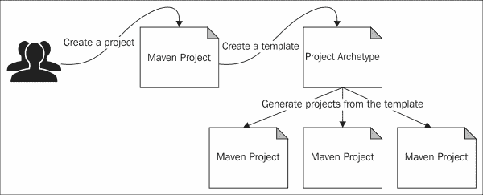

# 第三章。Maven 原型

“原型”这个词的根源在希腊文学中。它来源于两个希腊词，**archein**和**typos**。其中 archein 意味着原始或古老，而 typos 意味着模式。

“原型”这个词意味着原始模式。著名心理学家卡尔·古斯塔夫·荣格在心理学中引入了原型概念。荣格认为有 12 种不同的原型代表了人类的动机，并且他进一步将它们分为三类：自我、灵魂和自我。天真的人、普通人、英雄和照顾者属于自我类型。探险家、叛逆者、恋人和创造者属于灵魂类型。自我类型包括小丑、智者、魔术师和统治者。Maven 原型的概念与荣格在心理学中解释的并没有太大的出入。

下图显示了 Maven 项目、项目原型以及从原型生成的项目之间的关系：



当我们创建一个 Java 项目时，我们需要根据项目的类型以不同的方式来构建它。如果是一个 Java EE Web 应用程序，那么我们需要有一个`WEB-INF`目录和一个`web.xml`文件。如果是一个 Maven 插件项目，我们需要有一个扩展自`org.apache.maven.plugin.AbstractMojo`的`Mojo`类。由于每种类型的项目都有自己的预定义结构，为什么每个人都必须一次又一次地构建相同结构呢？为什么不从模板开始呢？每个项目都可以有自己的模板，开发者可以根据自己的需求扩展模板。Maven 原型解决了这个问题。每个原型都是一个项目模板。

### 注意

Maven 原型的列表可以在[`maven-repository.com/archetypes`](http://maven-repository.com/archetypes)找到。

在本章中，我们将讨论以下主题：

+   Maven 原型插件

+   最常用的原型

# 原型快速入门

Maven `archetype` 本身就是一个插件。我们将在第四章*Maven 插件*中详细讨论插件。`archetype`插件的`generate`目标被用来从一个原型中生成一个 Maven 项目。让我们从一个简单的例子开始：

```java
$ mvn archetype:generate 
 -DgroupId=com.packt.samples 
 -DartifactId=com.packt.samples.archetype 
 -Dversion=1.0.0 
 -DinteractiveMode=false

```

这个命令将调用 Maven `archetype`插件的`generate`目标来创建一个简单的 Java 项目。你会看到已经创建了一个包含示例 POM 文件的项目结构。根目录或基本目录的名称是从`artifactId`参数的值派生出来的：

```java
com.packt.samples.archetype 
               |-pom.xml
               |-src
               |-main/java/com/packt/samples/App.java
               |-test/java/com/packt/samples/AppTest.java    
```

示例 POM 文件将只包含对`junit` JAR 文件的依赖，范围是`test`：

```java
<project>
  <modelVersion>4.0.0</modelVersion>
  <groupId>com.packt.samples</groupId>
  <artifactId>com.packt.samples.archetype</artifactId>
  <packaging>jar</packaging>
  <version>1.0.0</version>
  <name>com.packt.samples.archetype</name>
  <url>http://maven.apache.org</url>
  <dependencies>
    <dependency>
      <groupId>junit</groupId>
      <artifactId>junit</artifactId>
      <version>3.8.1</version>
      <scope>test</scope>
    </dependency>
  </dependencies>
</project>
```

生成的`App.java`类将包含以下模板代码。包名是从提供的`groupId`参数派生出来的。如果我们想将不同的值作为包名，那么我们需要在命令中传递这个值，例如`-Dpackage=com.packt.samples.application`：

```java
package com.packt.samples;

/**
 * Hello world!
 *
 */
public class App 
{
    public static void main( String[] args )
    {
        System.out.println( "Hello World!" );
    }
}
```

这是开始 Maven 项目的最简单方式。在之前的示例中，我们通过设置 `interactiveMode=false` 使用了非交互模式。这将强制插件使用我们在命令本身中传递的任何值，以及默认值。

要在交互模式下调用插件，只需输入 `mvn archetype:generate`。这将提示用户输入，随着插件的执行进行。第一个提示是要求输入筛选条件或原型的类型编号。筛选条件可以指定为 `[groupdId:]artifactId` 的格式，如下所示：

```java
Choose a number or apply filter (format: [groupId:]artifactId, case sensitive contains): 471:

```

当你输入筛选条件时，例如，`org.apache.maven.archetypes:maven-archetype-quickstart`，插件将显示与之关联的数字，如下所示：

```java
Choose a number or apply filter (format: [groupId:]artifactId, case sensitive contains): 471: org.apache.maven.archetypes:maven-archetype-quickstart

Choose archetype:
1: remote -> org.apache.maven.archetypes:maven-archetype-quickstart (An archetype which contains a sample Maven project.)

Choose a number or apply filter (format: [groupId:]artifactId, case sensitive contains): 1:

```

在这种情况下，只有一个 `archetype` 与筛选条件匹配，与之关联的数字是 `1`。如果你在上一输出的最后一行按 *Enter* 键，或者只输入 `1`，插件将开始使用 `org.apache.maven.archetypes:maven-archetype-quickstart` 原型。

你可能已经注意到的某件事是，一旦你输入 `mvn archetype:generate`，插件就会显示一个由插件支持的 Maven 原型长列表，每个原型都有一个与之关联的数字。你可以通过在命令本身中指定筛选条件来避免这个长列表，如下所示：

```java
$ mvn archetype:generate 
 –Dfilter=org.apache.maven.archetypes:maven-archetype-quickstart

Choose archetype:
1: remote -> org.apache.maven.archetypes:maven-archetype-quickstart (An archetype which contains a sample Maven project.)

Choose a number or apply filter (format: [groupId:]artifactId, case sensitive contains): 1:

```

# 批处理模式

`archetype` 插件可以通过将 `interactiveMode` 参数设置为 `false` 或传递 `-B` 作为参数来在批处理模式下运行。在批处理模式下，你需要明确指定你将要使用的原型，使用 `archetypeGroupId`、`archetypeArtifactId` 和 `archetypeVersion` 参数。你还需要明确识别结果工件，使用 `groupId`、`artifactId`、`version` 和 `package` 参数，如下所示：

```java
$ mvn archetype:generate -B 
 -DarchetypeGroupId=org.apache.maven.archetypes 
 -DarchetypeArtifactId=maven-archetype-quickstart 
 -DarchetypeVersion=1.0 
 -DgroupId=com.packt.samples 
 -DartifactId=com.packt.samples.archetype 
 -Dversion=1.0.0 
 -Dpackage=1.5

```

任何好奇的头脑现在都应该提出一个非常有效的问题。

在非交互模式下，我们在第一个示例中并没有输入任何筛选条件或为原型提供任何 Maven 坐标。那么，插件是如何知道原型的呢？当没有指定原型时，插件将使用默认的一个，即 `org.apache.maven.archetypes:maven-archetype-quickstart`。

# 原型目录

插件是如何找到系统中所有可用的原型的？当你只输入 `mvn archetype:generate` 时，插件会显示一个供用户选择的原型列表。完整的列表大约有 1100 个，但这里只展示了前 10 个：

```java
1: remote -> br.com.ingenieux:elasticbeanstalk-service-webapp-archetype (A Maven Archetype Encompassing RestAssured, Jetty, Jackson, Guice and Jersey for Publishing JAX-RS-based Services on AWS' Elastic Beanstalk Service)
2: remote -> br.com.ingenieux:elasticbeanstalk-wrapper-webapp-archetype (A Maven Archetype Wrapping Existing war files on AWS' Elastic Beanstalk Service)
3: remote -> br.com.otavio.vraptor.archetypes:vraptor-archetype-blank (A simple project to start with VRaptor 4)
4: remote -> br.gov.frameworkdemoiselle.archetypes:demoiselle-html-rest (Archetype for web applications (HTML + REST) using Demoiselle Framework)
5: remote -> br.gov.frameworkdemoiselle.archetypes:demoiselle-jsf-jpa (Archetype for web applications (JSF + JPA) using Demoiselle Framework)
6: remote -> br.gov.frameworkdemoiselle.archetypes:demoiselle-minimal (Basic archetype for generic applications using Demoiselle Framework)
7: remote -> br.gov.frameworkdemoiselle.archetypes:demoiselle-vaadin-jpa (Archetype for Vaadin web applications)
8: remote -> ch.sbb.maven.archetypes:iib9-maven-projects (IBM Integration Bus 9 Maven Project Structure)
9: remote -> ch.sbb.maven.archetypes:wmb7-maven-projects (WebSphere Message Broker 7 Maven Project Structure)
10: remote -> co.ntier:spring-mvc-archetype (An extremely simple Spring MVC archetype, configured with NO XML.)

```

回到最初的问题，插件是如何找到这些不同原型的详细信息的？

`archetype` 插件在插件本身附带的一个内部目录中维护不同原型的详细信息。原型目录只是一个 XML 文件。以下展示了 `archetype` 插件的内部目录：

```java
<archetype-catalog>

<!-- Internal archetype catalog listing archetypes from the Apache Maven project. -->

 <archetypes>
  <archetype>
    <groupId>org.apache.maven.archetypes</groupId>
    <artifactId>maven-archetype-archetype</artifactId>
    <version>1.0</version>
    <description>An archetype which contains a sample archetype.</description>
  </archetype>
  <archetype>
    <groupId>org.apache.maven.archetypes</groupId>
    <artifactId>maven-archetype-j2ee-simple</artifactId>
    <version>1.0</version>
    <description>An archetype which contains a simplifed sample J2EE application.</description>
 </archetype>
  <archetype>
    <groupId>org.apache.maven.archetypes</groupId>
    <artifactId>maven-archetype-plugin</artifactId>
    <version>1.2</version>
    <description>An archetype which contains a sample Maven plugin.</description>
  </archetype>
  <archetype>
    <groupId>org.apache.maven.archetypes</groupId>
    <artifactId>maven-archetype-plugin-site</artifactId>
    <version>1.1</version>
    <description>An archetype which contains a sample Maven plugin site.This archetype can be layered upon an existing Maven plugin project.</description>
  </archetype>
  <archetype>
    <groupId>org.apache.maven.archetypes</groupId>
    <artifactId>maven-archetype-portlet</artifactId>
    <version>1.0.1</version>
    <description>An archetype which contains a sample JSR-268 Portlet.</description>
  </archetype>
  <archetype>
    <groupId>org.apache.maven.archetypes</groupId>
    <artifactId>maven-archetype-profiles</artifactId>
    <version>1.0-alpha-4</version>
    <description></description>
  </archetype>
  <archetype>
    <groupId>org.apache.maven.archetypes</groupId>
    <artifactId>maven-archetype-quickstart</artifactId>
    <version>1.1</version>
    <description>An archetype which contains a sample Maven project.</description>
  </archetype>
  <archetype>
    <groupId>org.apache.maven.archetypes</groupId>
    <artifactId>maven-archetype-site</artifactId>
    <version>1.1</version>
    <description>An archetype which contains a sample Maven site which demonstrates some of the supported document types like APT, XDoc, and FML and demonstrates how to i18n your site. This archetype can be layered upon an existing Maven project.</description>
  </archetype>
  <archetype>
    <groupId>org.apache.maven.archetypes</groupId>
    <artifactId>maven-archetype-site-simple</artifactId>
    <version>1.1</version>
    <description>An archetype which contains a sample Maven site.</description>
  </archetype>
  <archetype>
    <groupId>org.apache.maven.archetypes</groupId>
    <artifactId>maven-archetype-webapp</artifactId>
    <version>1.0</version>
    <description>An archetype which contains a sample Maven Webapp project.</description>
  </archetype>
 </archetypes>
</archetype-catalog>
```

### 小贴士

除了内部目录外，你还可以维护一个`local`架构原型目录。它位于`USER_HOME/.m2/archetype-catalog.xml`，默认情况下，它是一个空文件。

### 注意

还有一个远程目录可供使用，地址为[`repo1.maven.org/maven2/archetype-catalog.xml`](http://repo1.maven.org/maven2/archetype-catalog.xml)。

默认情况下，`archetype`插件将从`local`和`remote`目录中加载所有可用的架构原型。如果我们回到插件显示的架构列表，并输入`mvn archetype:generate`，然后通过查看每个条目，我们可以确定给定的架构是从`internal`、`local`还是`remote`目录加载的。

例如，以下架构是从`remote`目录加载的：

```java
1: remote -> br.com.ingenieux:elasticbeanstalk-service-webapp-archetype (A Maven Archetype Encompassing RestAssured, Jetty, Jackson, Guice and Jersey for Publishing JAX-RS-based Services on AWS' Elastic Beanstalk Service)

```

如果你想强制`archetype`插件只列出内部目录中的所有架构原型，那么你需要使用以下命令：

```java
$ mvn archetype:generate -DarchetypeCatalog=internal

```

要只列出`local`目录中的所有架构原型，你需要使用以下命令：

```java
$ mvn archetype:generate -DarchetypeCatalog=local

```

要列出`internal`、`local`和`remote`目录中的所有架构原型，你需要使用以下命令：

```java
$ mvn archetype:generate -DarchetypeCatalog=internal,local,remote

```

## 构建架构原型目录

除了`internal`、`local`和`remote`目录外，你还可以构建自己的目录。比如说，你已经开发了自己的 Maven 架构原型集，并需要构建一个目录，可以通过公开托管与他人共享。一旦构建了架构原型，它们将可在你的`local` Maven 仓库中找到。以下命令将遍历`local` Maven 仓库，并从所有可用的架构原型中构建一个架构原型目录。在这里，我们使用`archetype`插件的`crawl`目标：

```java
$ mvn archetype:crawl -Dcatalog=my-catalog.xml

```

## 公开架构原型目录

为他们的项目开发原型的人会将它们列在公开的架构原型目录中。以下列表显示了一些公开可用的 Maven 架构原型目录：

+   **Fuse**：可以在[`repo.fusesource.com/nexus/content/groups/public/archetype-catalog.xml`](http://repo.fusesource.com/nexus/content/groups/public/archetype-catalog.xml)找到 Fuse 架构原型目录。

+   **Java.net**：可以在[`java.net/projects/maven2-repository/sources/svn/content/trunk/repository/archetype-catalog.xml`](https://java.net/projects/maven2-repository/sources/svn/content/trunk/repository/archetype-catalog.xml)找到 Java.net 架构原型目录。

+   **Cocoon**：可以在[`cocoon.apache.org/archetype-catalog.xml`](http://cocoon.apache.org/archetype-catalog.xml)找到 Cocoon 架构原型目录。

+   **MyFaces**：可以在[`myfaces.apache.org/archetype-catalog.xml`](http://myfaces.apache.org/archetype-catalog.xml)找到 MyFaces 架构原型目录。

+   **Apache Synapse**：可以在[`synapse.apache.org/archetype-catalog.xml`](http://synapse.apache.org/archetype-catalog.xml)找到 Apache Synapse 架构原型目录。

以 Apache Synapse 为例。Synapse 是一个开源的 Apache 项目，用于构建 **企业级** **服务总线**（**ESB**）。以下命令使用 Apache Synapse 架构生成 Maven 项目：

```java
$ mvn archetype:generate 
 -DgroupId=com.packt.samples 
 -DartifactId=com.packt.samples.synapse 
 -Dversion=1.0.0 
 -Dpackage=com.packt.samples.synapse.application 
 -DarchetypeCatalog=http://synapse.apache.org 
 -DarchetypeGroupId=org.apache.synapse 
 -DarchetypeArtifactId=synapse-package-archetype
 -DarchetypeVersion=2.0.0
 -DinteractiveMode=false

```

之前的命令将生成以下目录结构。如果您查看 `pom.xml` 文件，您会注意到它包含构建 Synapse 项目所需的所有必要指令以及所需的依赖项：

```java
com.packt.samples.synapse 
                       |-pom.xml
                       |-src/main/assembly/bin.xml
                       |-conf/log4j.properties
                       |-repository/conf
                                      |-axis2.xml
                                      |-synapse.xml
```

让我们看看之前我们用来使用 Synapse 架构构建项目的 Maven 命令。最重要的参数是 `archetypeCatalog`。`archetypeCatalog` 参数的值可以直接指向 `archetype-catalog.xml` 文件或指向包含 `archetype-catalog.xml` 文件的目录。以下配置显示了与 Synapse 架构对应的 `archetype-catalog.xml` 文件。它只有一个架构，但有两个不同的版本：

```java
<archetype-catalog>
 <archetypes>
  <archetype>
    <groupId>org.apache.synapse</groupId>
    <artifactId>synapse-package-archetype</artifactId>
    <version>1.3</version>
    <repository>http://repo1.maven.org/maven2</repository>
    <description>Create a Synapse 1.3 custom package</description>
  </archetype>
  <archetype>
    <groupId>org.apache.synapse</groupId>
 <artifactId>synapse-package-archetype</artifactId>
    <version>2.0.0</version>
    <repository>
      http://people.apache.org/repo/m2-snapshot-repository
    </repository>
    <description>Create a Synapse 2.0.0 custom package</description>
  </archetype>
 </archetypes>
</archetype-catalog>
```

### 注意

`archetypeCatalog` 参数的值可以是一个以逗号分隔的列表，其中每个项目指向一个 `archetype-catalog.xml` 文件或指向一个包含 `archetype-catalog.xml` 的目录。默认值是 `remote` 和 `local`，其中架构从 `local` 仓库和 `remote` 仓库加载。如果您想从本地文件系统加载 `archetype-catalog.xml` 文件，那么您需要将文件的绝对路径前缀为 `file://`。`local` 的值只是 `file://~/.m2/archetype-catalog.xml` 的快捷方式。

在之前的 Maven 命令中，我们使用了非交互模式的 `archetype` 插件，因此我们必须非常具体地指定所需的架构来生成 Maven 项目。这是通过以下三个参数完成的。这三个参数的值必须与关联的 `archetype-catalog.xml` 文件中定义的相应元素相匹配：

```java
-DarchetypeGroupId=org.apache.synapse 
-DarchetypeArtifactId=synapse-package-archetype
-DarchetypeVersion=2.0.0
```

## 架构 - 目录.xml 的结构

我们已经浏览了一些示例 `archetype-catalog.xml` 文件及其用途。`archetype-catalog.xml` 文件的 XML 架构可在 [`maven.apache.org/xsd/archetype-catalog-1.0.0.xsd`](http://maven.apache.org/xsd/archetype-catalog-1.0.0.xsd) 找到。以下是一个包含所有关键元素的 `archetype-catalog.xml` 文件骨架：

```java
<archetype-catalog>
  <archetypes>
    <archetype>
      <groupId></groupId>
      <artifactId></artifactId>
      <version></version>
      <repository></repository>
      <description></description>
    </archetype>
    ...
  </archetypes>
</archetype-catalog>
```

`archetypes`父元素可以包含一个或多个`archetype`子元素。每个`archetype`元素都应该唯一标识与它对应的 Maven 工件。这是通过组合工件的`groupId`、`artifactId`和`version`元素来实现的。这三个元素携带与我们讨论的 Maven 坐标相同的精确含义。`description`元素可以用来描述原型。描述元素的值将在`archetype`插件列出原型时显示。例如，当你输入`mvn archetype:generate`时，根据`archetype-catalog.xml`文件的模式生成的以下输出——`groupId:artifactId (description)`：

```java
Choose archetype:
1: remote -> org.apache.maven.archetypes:maven-archetype-quickstart (An archetype which contains a sample Maven project.)

```

每个`archetype`子元素都可以为`repository`元素携带一个值。这指示`archetype`插件在哪里找到相应的工件。当未指定值时，工件将从包含目录文件的仓库中加载。

# 原型插件的目标

到目前为止，在本章中，我们只讨论了`archetype`插件的`generate`和`crawl`目标。Maven 构建过程中的所有有用功能都是作为插件开发的。一个给定的 Maven 插件可以有多个目标，其中每个目标执行一个非常具体的任务。我们将在第四章“Maven 插件”中详细讨论插件。第四章。

以下目标与`archetype`插件相关：

+   `archetype:generate`：`generate`目标创建一个与所选原型对应的 Maven 项目。它接受`archetypeGroupId`、`archetypeArtifactId`、`archetypeVersion`、`filter`、`interactiveMode`、`archetypeCatalog`和`baseDir`参数。我们已经在详细讨论了几乎所有这些参数。

+   `archetype:update-local-catalog`：`update-local-catalog`目标必须在 Maven 原型项目上执行。这将使用新的原型更新`local`原型目录。`local`原型目录位于`~/.m2/archetype-catalog.xml`。

+   `archetype:jar`：`jar`目标必须在 Maven 原型项目上执行，这将从中创建一个 JAR 文件。它接受`archetypeDirectory`参数，其中包含类；它还接受`finalName`参数，即要生成的 JAR 文件的名称，以及`outputDirectory`参数，即最终输出被复制到的位置。

+   `archetype:crawl`：`crawl`目标会遍历一个本地或基于文件系统的 Maven 仓库（不是远程或通过 HTTP），并创建一个原型目录文件。它接受`catalogFile`作为参数（映射到`catalog`系统属性），即要创建的目录文件的名称。默认情况下，它会遍历`local` Maven 仓库，要覆盖位置，我们需要通过`repository`参数传递相应的仓库 URL。

+   `archetype:create-from-project`: `create-from-project` 目标可以从现有项目创建一个架构项目。如果您将其与 `generate` 目标进行比较，那么实际上 `generate` 是从头开始创建一个与所选架构相对应的新 Maven 项目，而 `create-from-project` 则是从现有项目创建 Maven 架构项目。换句话说，`create-from-project` 是从一个现有的 Maven 项目生成一个模板。

+   `archetype:integration-test`: `integration-test` 目标将执行与 Maven 架构项目相关的集成测试。

+   `archetype:help`: `help` 目标将显示与 `archetype` 插件相关的手册，列出所有可用的目标。如果您想获取所有目标的详细描述，请使用 `-Ddetail=true` 参数与命令一起使用。也可以为给定的目标获取帮助。例如，以下命令将显示与 `generate` 目标相关的帮助：

    ```java
    $ mvn archetype:help -Ddetail=true -Dgoal=generate

    ```

# 使用架构插件的 Java EE Web 应用程序

如果您想从 Java EE Web 应用程序开始，可以使用 `maven-archetype-webapp` 架构来生成 Maven 项目骨架，如下所示：

```java
$ mvn archetype:generate -B 
 -DgroupId=com.packt.samples 
 -DartifactId=my-webapp 
 -Dpackage=com.packt.samples.webapp 
 -Dversion=1.0.0 
 -DarchetypeGroupId=org.apache.maven.archetypes 
 -DarchetypeArtifactId=maven-archetype-webapp 
 -DarchetypeVersion=1.0

```

上述命令将生成以下目录结构。这里的一个问题是它没有在 `src/main` 之后立即创建 `java` 目录。如果您想添加任何 Java 代码，您需要确保首先创建一个 `src/main/java` 目录，并在其中创建您的 Java 包；否则，使用默认的配置设置，Maven 不会选择您的类进行编译。默认情况下，Maven 在 `src/main/java` 内查找源代码：

```java
my-webapp
     |-pom.xml
     |-src/main/webapp
                  |-index.jsp
                  |-WEB-INF/web.xml
     |- src/main/resources
```

`maven-archetype-webapp` 架构并不是唯一使用 `archetype` 插件生成 Java EE 项目的架构。Codehaus，一个构建开源项目的协作环境，也提供了一些架构来生成 Web 应用程序。以下示例使用了 Codehaus 的 `webapp-javaee6` 架构：

```java
$ mvn archetype:generate -B 
 -DgroupId=com.packt.samples 
 -DartifactId=my-webapp 
 -Dpackage=com.packt.samples.webapp 
 -Dversion=1.0.0 
 -DarchetypeGroupId=org.codehaus.mojo.archetypes 
 -DarchetypeArtifactId=webapp-javaee6 
 -DarchetypeVersion=1.3

```

上述命令将生成以下目录结构。这解决了 `maven-archetype-webapp` 架构中的一个问题，并创建了 `src/main/java` 和 `src/test/java` 目录。这里唯一的问题是它没有创建 `src/main/webapp/WEB-INF` 目录，您需要手动创建它：

```java
my-webapp
     |-pom.xml
     |-src/main/webapp/index.jsp         
     |-src/main/java/com/packt/samples/webapp/
     |-src/test/java/com/packt/samples/webapp/
```

## 将 Web 应用程序部署到远程 Apache Tomcat 服务器

现在，我们已经使用 `maven-archetype-webapp` 或 `webapp-javaee6` 架构创建了一个模板 Web 应用程序。让我们看看如何从 Maven 本身将这个 Web 应用程序部署到远程 Apache Tomcat 应用程序服务器。大多数开发者都会喜欢这样做而不是手动复制。

### 注意

这假设您已经在环境中安装了 Apache Tomcat。如果没有，您可以从 [`tomcat.apache.org/download-70.cgi`](http://tomcat.apache.org/download-70.cgi) 下载 Tomcat 7.x 发行版并设置它。

要部署 Web 应用程序，请执行以下步骤：

1.  由于我们打算将 Web 应用程序部署到远程 Tomcat 服务器，我们需要一个有效的用户账户，该账户具有部署 Web 应用程序的权限。将以下条目添加到`TOMCAT_HOME/conf/tomcat-users.xml`文件下的`tomcat-users`根元素中。这将创建一个名为`admin`的用户，密码为`password`，并具有`manager-gui`和`manager-script`角色：

    ```java
    <role rolename="manager-gui"/>
    <role rolename="manager-script"/>
    <user username="admin" password="password" roles="manager-gui,manager-script" />
    ```

1.  现在，我们需要配置 Maven 以与远程 Tomcat 服务器通信。将以下配置添加到`USER_HOME/.m2/settings.xml`文件下的`servers`元素中，如下所示：

    ```java
    <server>
      <id>apache-tomcat</id>
      <username>admin</username>
      <password>password</password>
    </server>
    ```

1.  进入我们之前生成的模板 Web 应用程序的根目录（`my-webapp`），然后向该目录下的`pom.xml`文件添加`tomcat7-maven-plugin`。完整的`pom.xml`文件将如下所示：

    ```java
    <project >
      <modelVersion>4.0.0</modelVersion>
      <groupId>com.packt.samples</groupId>
      <artifactId>my-webapp</artifactId>
      <packaging>war</packaging>
      <version>1.0.0</version>
      <name>my-webapp Maven Webapp</name>
      <url>http://maven.apache.org</url>

      <dependencies>
        <dependency>
          <groupId>junit</groupId>
          <artifactId>junit</artifactId>
          <version>3.8.1</version>
          <scope>test</scope>
        </dependency>
      </dependencies>

      <build>
        <finalName>my-webapp</finalName>
        <plugins>
          <plugin>
             <groupId>org.apache.tomcat.maven</groupId>
             <artifactId>tomcat7-maven-plugin</artifactId>
             <version>2.2</version>
             <configuration>
                <url>http://localhost:8080/manager/text</url>
                <server>apache-tomcat</server>
                <path>/my-webapp</path>
             </configuration>
          </plugin>
       </plugins>
      </build>
    </project>
    ```

1.  使用以下 Maven 命令构建并部署示例 Web 应用程序到 Tomcat 服务器。一旦部署，你可以通过`http://localhost:8080/my-webapp/`访问它：

    ```java
    $ mvn clean install tomcat7:deploy

    ```

1.  要重新部署，使用以下命令：

    ```java
    $ mvn clean install tomcat7:redeploy

    ```

1.  要卸载，使用以下命令：

    ```java
    $ mvn clean install tomcat7:undeploy

    ```

# 使用原型插件构建 Android 移动应用程序

如果你是一名希望从骨架 Android 项目开始的 Android 应用程序开发者，你可以使用 akquinet 开发的`android-quickstart`原型，如下所示：

```java
$ mvn archetype:generate -B 
 -DarchetypeGroupId=de.akquinet.android.archetypes 
 -DarchetypeArtifactId=android-quickstart 
 -DarchetypeVersion=1.0.4 
 -DgroupId=com.packt.samples 
 -DartifactId=my-android-app 
 -Dversion=1.0.0

```

此命令将生成以下骨架项目：

```java
my-android-app
      |-pom.xml
      |-AndroidManifest.xml
      |-android.properties
      |-src/main/java/com/packt/samples/HelloAndroidActivity.java
      |-res/drawable-hdpi/icon.png
      |-res/drawable-ldpi/icon.png
      |-res/drawable-mdpi/icon.png
      |-res/layout/main.xml
      |-res/values/strings.xml
      |-assets
```

要构建 Android 骨架项目，从`my-android-app`目录运行以下 Maven 命令：

```java
$ mvn clean install -Dandroid.sdk.path=/path/to/android/sdk

```

之前的命令看起来很简单，但它基于你的 Android SDK 版本；因此，你可能会遇到某些问题。以下是一些可能的问题和解决方案：

+   如果你向`android.sdk.path`参数传递一个无效的值，你会看到以下错误：

    ```java
    [ERROR] Failed to execute goal com.jayway.maven.plugins.android.generation2:maven-android-plugin:2.8.3:generate-sources (default-generate-sources) on project my-android-app: Execution default-generate-sources of goal com.jayway.maven.plugins.android.generation2:maven-android-plugin:2.8.3:generate-sources failed: Path "/Users/prabath/Downloads/adt-bundle-mac-x86_64-20140702/platforms" is not a directory.

    ```

    路径将指向 Android 的`sdk`目录，并且就在这个目录下面，你会找到`platforms`目录。通过将`android.sdk.path`设置为正确的路径，你可以避免这个错误。

+   默认情况下，`android-quickstart`原型假定 Android 平台为`7`。如果你的本地机器上安装的 Android 平台与此不同，你会看到以下错误：

    ```java
    [ERROR] Failed to execute goal com.jayway.maven.plugins.android.generation2:maven-android-plugin:2.8.3:generate-sources (default-generate-sources) on project my-android-app: Execution default-generate-sources of goal com.jayway.maven.plugins.android.generation2:maven-android-plugin:2.8.3:generate-sources failed: Invalid SDK: Platform/API level 7 not available.

    ```

    要修复这个问题，打开`pom.xml`文件，并使用`<sdk><platform>20</platform></sdk>`设置正确的平台版本。

+   默认情况下，`android-quickstart`原型假定`aapt`工具位于`sdk/platform-tools`下。然而，随着最新`sdks`的更新，它被移动到了`sdk/build-tools/android-4.4W`；你将得到以下错误：

    ```java
    [ERROR] Failed to execute goal com.jayway.maven.plugins.android.generation2:maven-android-plugin:2.8.3:generate-sources (default-generate-sources) on project my-android-app: Execution default-generate-sources of goal com.jayway.maven.plugins.android.generation2:maven-android-plugin:2.8.3:generate-sources failed: Could not find tool 'aapt'.

    ```

    要修复错误，你需要更新`maven-android-plugin`的`version`和`artifactId`。

    打开`my-android-app`目录中的`pom.xml`文件，并找到以下插件配置。将`artifactId`更改为`android-maven-plugin`，版本更改为`4.0.0-rc.1`，如下所示：

    ```java
      <plugin>
        <groupId>
               com.jayway.maven.plugins.android.generation2
        </groupId>
        <artifactId>android-maven-plugin</artifactId>
        <version>4.0.0-rc.1</version>
        <configuration></configuration>
        <extensions>true</extensions>
      </plugin>
    ```

一旦构建完成，`android-maven-plugin`将在`target`目录内生成`my-android-app-1.0.0.apk`和`my-android-app-1.0.0.jar`工件。

要将骨架 Android 应用程序（apk）部署到连接的设备上，请使用以下 Maven 命令：

```java
$ mvn android:deploy -Dandroid.sdk.path=/path/to/android/sdk

```

# 使用架构插件生成的 EJB 归档

在这里，我们将讨论如何使用由 Codehaus 开发的 `ejb-javaee6` 架构创建 Maven **企业 JavaBeans**（**EJB**）项目，Codehaus 是一个构建开源项目的协作环境：

```java
$ mvn archetype:generate -B 
 -DgroupId=com.packt.samples 
 -DartifactId=my-ejbapp 
 -Dpackage=com.packt.samples.ejbapp 
 -Dversion=1.0.0 
 -DarchetypeGroupId=org.codehaus.mojo.archetypes 
 -DarchetypeArtifactId=ejb-javaee6 
 -DarchetypeVersion=1.5

```

上一个命令会生成以下骨架项目。您可以在 `src/main/java/com/packt/samples/ejbapp/` 目录内创建您的 EJB 类：

```java
my-ejbapp
      |-pom.xml
      |-src/main/java/com/packt/samples/ejbapp/
      |-src/main/resources/META-INF/MANIFEST.MF
```

如果您查看 `my-ejbapp` 目录中的以下 `pom.xml` 文件，您会注意到内部使用了 `maven-ejb-plugin` 来生成 EJB 产物：

```java
<plugin>
  <groupId>org.apache.maven.plugins</groupId>
  <artifactId>maven-ejb-plugin</artifactId>
  <version>2.3</version>
  <configuration:
    <ejbVersion>3.1</ejbVersion>
  </configuration>
</plugin>
```

尽管我们已突出显示 `ejb-javaee6`，但它并不是生成 Maven EJB 项目的最佳选择。由 Oracle WebLogic 开发的 `ejb-javaee6` 架构生成的模板非常基础。Oracle WebLogic 开发了一个更好的 EJB 架构——`basic-webapp-ejb`。以下示例展示了如何使用 `basic-webapp-ejb` 架构：

```java
$ mvn archetype:generate -B
 -DarchetypeGroupId=com.oracle.weblogic.archetype
 -DarchetypeArtifactId=basic-webapp-ejb
 -DarchetypeVersion=12.1.3-0-0
 -DgroupId=com.packt.samples 
 -DartifactId=my-ejbapp 
 -Dpackage=com.packt.samples.ejbapp 
 -Dversion=1.0.0 

```

在执行上一个命令之前，还有更多作业要做。`basic-webapp-ejb` 架构在任何一个公共 Maven 仓库中都是不可用的。首先，您需要从 [`www.oracle.com/webfolder/technetwork/tutorials/obe/java/wls_12c_netbeans_install/wls_12c_netbeans_install.html`](http://www.oracle.com/webfolder/technetwork/tutorials/obe/java/wls_12c_netbeans_install/wls_12c_netbeans_install.html) 下载 WebLogic 发行版，然后按照 `README.txt` 文件中的说明进行本地安装。安装完成后，`basic-webapp-ejb` 架构和 `weblogic-maven-plugin` 可以安装到本地 Maven 仓库中，如下所示：

1.  前往 `wls12130/wlserver/server/lib` 目录并执行以下命令。这将使用 WebLogic JarBuilder 工具构建插件 JAR 文件：

    ```java
    $ java -jar wljarbuilder.jar -profile weblogic-maven-plugin

    ```

1.  上一个命令将创建 `weblogic-maven-plugin.jar` 文件。现在，我们需要将其提取出来以获取 `pom.xml` 文件。从 `wls12130/wlserver/server/lib` 目录执行以下命令：

    ```java
    $ jar xvf weblogic-maven-plugin.jar

    ```

1.  现在，我们需要将 `pom.xml` 文件复制到 `wls12130/wlserver/server/lib`。从 `wls12130/wlserver/server/lib` 目录执行以下命令：

    ```java
    $ cp META-INF/maven/com.oracle.weblogic/weblogic-maven-plugin/pom.xml .

    ```

1.  现在，我们可以将 `weblogic-maven-plugin.jar` 安装到 `local` Maven 仓库中。从 `wls12130/wlserver/server/lib` 目录执行以下命令：

    ```java
    $ mvn install:install-file -Dfile=weblogic-maven-plugin.jar -DpomFile=pom.xml

    ```

1.  除了插件之外，我们还需要安装 `basic-webapp-ejb` 架构。为此，请前往 `wls12130/oracle_common/plugins/maven/com/oracle/maven/oracle-maven-sync/12.1.3` 并执行以下两个命令。请注意，`oracle_common` 是一个隐藏目录。如果您使用的是 WebLogic 的不同版本而不是 12.1.3，请使用与您的版本相关的数字：

    ```java
    $ mvn install:install-file -DpomFile=oracle-maven-sync-12.1.3.pom -Dfile=oracle-maven-sync-12.1.3.jar
    $ mvn com.oracle.maven:oracle-maven-sync:push -Doracle-maven-sync.oracleHome=/Users/prabath/Downloads/wls12130  -Doracle-maven-sync.testingOnly=false

    ```

完成这些步骤后，您可以使用 WebLogic 的`basic-webapp-ejb`存档来生成 EJB 模板项目。请确保您有正确的`archetypeVersion`版本；这应该与您 WebLogic 发行版中包含的存档版本相匹配：

```java
$ mvn archetype:generate -B
 -DarchetypeGroupId=com.oracle.weblogic.archetype
 -DarchetypeArtifactId=basic-webapp-ejb
 -DarchetypeVersion=12.1.3-0-0
 -DgroupId=com.packt.samples 
 -DartifactId=my-ejbapp 
 -Dpackage=com.packt.samples.ejbapp 
 -Dversion=1.0.0 

```

此命令生成以下项目骨架：

```java
my-ejbapp
  |-pom.xml
  |-src/main/java/com/packt/samples/ejbapp                
                                |-entity/Account.java
                                |-service/AccountBean.java
                                |-service/AccountManager.java
                                |-service/AccountManagerImpl.java
                                |-interceptor/LogInterceptor.java
                                |-interceptor/OnDeposit.java
  |-src/main/resources/META-INF/persistence.xml
  |-src/main/scripts
  |-src/main/webapp/WEB-INF/web.xml
  |-src/main/webapp/WEB-INF/beans.xml
  |-src/main/webapp/css/bootstrap.css
  |-src/main/webapp/index.xhtml
  |-src/main/webapp/template.xhtml
```

要打包 EJB 存档，请从`my-ejbapp`目录执行以下命令。这将生成`target`目录中的`basicWebappEjb.war`。现在，您可以将这个 WAR 文件部署到支持 EJB 的 Java EE 应用程序服务器中。

```java
$ mvn package

```

# 使用存档插件的 JIRA 插件

JIRA 是由 Atlassian 开发的一个问题跟踪系统。它在许多开源项目中非常受欢迎。JIRA 的一个扩展点是它的插件。在这里，我们将看到如何使用 Atlassian 开发的`jira-plugin-archetype`生成骨架 JIRA 插件：

```java
$ mvn archetype:generate -B
 -DarchetypeGroupId=com.atlassian.maven.archetypes
 -DarchetypeArtifactId=jira-plugin-archetype
 -DarchetypeVersion=3.0.6
 -DgroupId=com.packt.samples 
 -DartifactId=my-jira-plugin 
 -Dpackage=com.packt.samples.jira 
 -Dversion=1.0.0 
 -DarchetypeRepository=
 http://repo.jfrog.org/artifactory/libs-releases/

```

此命令将生成以下项目模板：

```java
my-jira-plugin
         |-pom.xml
         |-README
         |-LICENSE
         |-src/main/java/com/packt/samples/jira/MyPlugin.java
         |-src/main/resources/atlassian-plugin.xml
         |- src/test/java/com/packt/samples/jira/MyPluginTest.java 
         |-src/test/java/it/MyPluginTest.java          
         |-src/test/resources/TEST_RESOURCES_README
         |-src/test/xml/TEST_XML_RESOURCES_README
```

# 使用存档插件构建的 Spring MVC 应用程序

Spring **模型视图控制器**（**MVC**）是在 Spring 框架下开发的一个 Web 应用程序框架，Spring 是一个开源的应用程序框架，也是一个控制反转容器。在这里，我们将看到如何使用`spring-mvc-quickstart`存档生成模板 Spring MVC 应用程序。

### 注意

要了解更多关于 Spring MVC 框架的信息，请参阅[`docs.spring.io/spring/docs/current/spring-framework-reference/html/mvc.html`](http://docs.spring.io/spring/docs/current/spring-framework-reference/html/mvc.html)。

目前，`spring-mvc-quickstart`存档在任何一个公共 Maven 仓库中都不可用，因此我们必须从 GitHub 下载它并从源代码构建，如下所示：

```java
$ git clone https://github.com/kolorobot/spring-mvc-quickstart-archetype.git
$ cd spring-mvc-quickstart-archetype
$ mvn clean install

```

一旦从源代码构建存档并在本地 Maven 仓库中可用，您可以通过执行以下命令来生成模板 Spring MVC 应用程序：

```java
$ mvn archetype:generate -B
 -DarchetypeGroupId=com.github.spring-mvc-archetypes
 -DarchetypeArtifactId=spring-mvc-quickstart
 -DarchetypeVersion=1.0.0-SNAPSHOT
 -DgroupId=com.packt.samples 
 -DartifactId=my-spring-app 
 -Dpackage=com.packt.samples.spring
 -Dversion=1.0.0 

```

这将生成以下项目模板：

```java
my-spring-app
         |-pom.xml
         |-src/main/java/com/packt/samples/spring/Application.java
         |-src/main/webapp/WEB-INF/views
         |-src/main/webapp/resources
         |-src/main/resources
         |-src/test/java/com/packt/samples/spring
         |-src/test/resources
```

让我们看看如何通过 Maven 本身运行模板 Spring MVC 应用程序，并通过内嵌的 Tomcat。一旦服务器启动，您可以通过`http://localhost:8080/my-spring-app`浏览 Web 应用程序。可以通过`tomcat7`插件的`run`目标启动内嵌的 Tomcat，如下所示：

```java
$ mvn test tomcat7:run

```

### 注意

关于`tomcat7`插件的更多详细信息可在[`tomcat.apache.org/maven-plugin-trunk/tomcat7-maven-plugin/`](http://tomcat.apache.org/maven-plugin-trunk/tomcat7-maven-plugin/)找到。

# 摘要

在本章中，我们专注于 Maven 存档。Maven 存档提供了一种减少构建 Maven 项目重复工作的方法。有成千上万的存档可供公开使用，以帮助您构建不同类型的项目。本章涵盖了常用的一组存档。

在下一章中，我们将探讨 Maven 插件。
