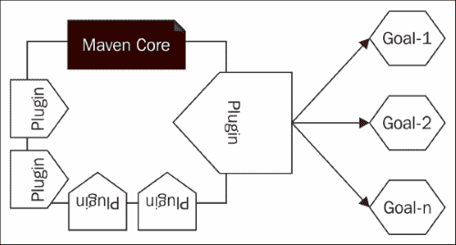

# 第四章。Maven 插件

Maven 的根源可以追溯到 *Jakarta Turbine* 项目，该项目最初是为了简化 Jakarta Turbine 的构建过程。Maven 的美妙之处在于其设计。它并不试图自己完成所有事情，而是委托给一个插件框架。当你从其网站下载 Maven 时，它只有核心框架，插件是按需下载的。构建过程中的所有有用功能都是作为 Maven 插件开发的。你还可以将 Maven 称为一个插件执行框架。以下图显示了 Maven 插件：



Maven 插件可以独立执行，也可以作为 Maven 生命周期的一部分执行。我们将在第五章*构建生命周期*中讨论 Maven 生命周期。

### 注意

Maven 构建生命周期由一系列定义良好的阶段组成。每个阶段都包含由 Maven 插件定义的一组目标，生命周期定义了执行顺序。Maven 提供了三个标准生命周期：**default**、**clean**和**site**。每个生命周期定义了自己的阶段集。

每个插件都有自己的目标集，每个目标都负责执行特定的操作。让我们看看如何执行 Maven `clean`插件的`clean`目标。`clean`目标将尝试清理工作目录和构建过程中创建的相关文件：

```java
$ mvn clean:clean

```

### 注意

Maven 插件可以作为`mvn plugin-prefix-name:goal-name`执行。

同样的`clean`插件可以通过`clean`生命周期执行，如下命令所示：

```java
$ mvn clean

```

Maven `clean`插件的`clean`目标与`clean`生命周期的`clean`阶段相关联。`clean`生命周期定义了三个阶段：`pre-clean`、`clean`和`post-clean`。生命周期中的一个阶段只是构建执行路径中的一个有序占位符。例如，`clean`生命周期中的`clean`阶段本身不能做任何事情。在 Maven 架构中，它有两个关键元素：名词和动词。与特定项目相关的名词和动词都在 POM 文件中定义。项目的名称、父项目的名称、依赖项和打包类型都是名词。插件将动词引入 Maven 构建系统，并通过其目标定义构建执行期间需要执行的操作。插件是一组目标。每个插件的目标都可以独立执行，也可以注册为 Maven 构建生命周期中某个阶段的一部分。这里的一个区别是，当你独立执行 Maven 插件时，它只运行命令中指定的目标；然而，当你将其作为生命周期的一部分运行时，Maven 将执行与相应生命周期关联的所有插件目标，直到指定的阶段（包括该阶段）。

当你输入 `mvn clean` 时，它将执行 `clean` 生命周期中定义的所有阶段，包括并限于 `clean` 阶段。不要混淆；在这个命令中，`clean` 不是生命周期的名称，而是阶段的名称。阶段名称恰好与生命周期名称相同只是一个巧合。在 Maven 中，你不能简单地通过名称执行生命周期——它必须是阶段名称。Maven 将找到相应的生命周期，并将执行其中直到给定阶段的所有阶段（包括该阶段）。

在本章中，我们将讨论以下主题：

+   常用 Maven 插件及其用法

+   插件发现和执行过程

# 常用 Maven 插件

Maven 插件主要在 Apache Maven 项目本身以及 Codehaus 和 Google Code 项目下开发。以下几节列出了常用 Maven 插件及其用法。

## 清理插件

如前所述，`clean` 插件执行 Maven `clean` 插件的 `clean` 目标，以删除在构建过程中创建的任何工作目录和其他资源，如下所示：

```java
$ mvn clean:clean

```

Maven `clean` 插件也与 `clean` 生命周期相关联。如果你只是执行 `mvn clean`，`clean` 插件的 `clean` 目标将被执行。

你不需要在项目的 POM 文件中显式定义 Maven `clean` 插件。你的项目从 Maven 超级 POM 文件中继承它。在 第二章") *理解项目对象模型 (POM)* 中，我们详细讨论了 Maven 超级 POM 文件。以下超级 POM 文件中的配置将 Maven `clean` 插件与所有 Maven 项目关联起来：

```java
<plugin>
  <artifactId>maven-clean-plugin</artifactId>
  <version>2.5</version>
  <executions>
    <execution>
      <id>default-clean</id>
      <phase>clean</phase>
      <goals>
        <goal>clean</goal>
      </goals>
    </execution>
  </executions>
</plugin>
```

### 注意

Maven `default` 生命周期包括以下阶段：validate、initialize、generate-sources、process-sources、generate-resources、process-resources、compile、process-classes、generate-test-sources、process-test-sources、generate-test-resources、process-test-resources、test-compile、process-testclasses、test、prepare-package、package、pre-integration-test、integration-test、post-integration-test、verify、install、deploy。

默认情况下，`clean` 插件的 `clean` 目标在 Maven `clean` 生命周期的 `clean` 阶段下运行。如果你的项目想要默认运行 `clean` 插件，那么你可以将其与 Maven `default` 生命周期的 `initialize` 阶段关联起来。你可以在应用程序 POM 文件中添加以下配置：

```java
<project>
  [...]
  <build>
    <plugins>
      <plugin>
        <artifactId>maven-clean-plugin</artifactId>
        <version>2.5</version>
        <executions>
          <execution>
            <id>auto-clean</id>
            <phase>initialize</phase>
            <goals>
              <goal>clean</goal>
            </goals>
          </execution>
        </executions>
      </plugin>
    </plugins>
  </build>
  [...]
</project>
```

现在，当你执行 Maven `default`生命周期的任何阶段时，`clean`插件的`clean`目标将被执行；没有必要显式执行`clean`生命周期的`clean`阶段。例如，`mvn install`将在其`initialize`阶段运行`clean`目标。这样，你可以覆盖 Maven `clean`插件的默认行为。一个包含先前插件配置的完整 Maven 示例项目可在[`svn.wso2.org/repos/wso2/people/prabath/maven-mini/chapter04/jose`](https://svn.wso2.org/repos/wso2/people/prabath/maven-mini/chapter04/jose)找到。

## 编译器插件

`compiler`插件用于编译源代码。它有两个目标：`compile`和`testCompile`。`compile`目标绑定到 Maven `default`生命周期的`compile`阶段。当你输入`mvn clean install`时，Maven 将执行`default`生命周期中的所有阶段，直到`install`阶段，这包括`compile`阶段。这反过来将运行`compiler`插件的`compile`目标。

以下命令显示了如何单独执行`compiler`插件的`compile`目标。这将简单地编译你的源代码：

```java
$ mvn compiler:compile

```

所有 Maven 项目都从父 POM 文件继承了`compiler`插件。如下配置所示，父 POM 定义了`compiler`插件。它将`testCompile`和`compile`目标与 Maven 的`default`生命周期的`test-compile`和`compile`阶段关联起来：

```java
<plugin>
  <artifactId>maven-compiler-plugin</artifactId>
  <version>3.1</version>
  <executions>
    <execution>
      <id>default-testCompile</id>
      <phase>test-compile</phase>
      <goals>
        <goal>testCompile</goal>
      </goals>
    </execution>
    <execution>
      <id>default-compile</id>
      <phase>compile</phase>
      <goals>
        <goal>compile</goal>
      </goals>
    </execution>
  </executions>
</plugin>
```

默认情况下，Maven 的`compiler`插件假定`source`和`target`元素都使用 JDK 1.5。JVM 通过`source`配置参数识别源代码的 Java 版本，通过`target`配置参数识别编译代码的版本。如果你想打破 Maven 的假设并指定自己的`source`和`target`版本，你需要在你的应用程序 POM 文件中覆盖`compiler`插件配置，如下所示：

```java
<project>
  [...]
  <build>
    [...]
    <plugins>
      <plugin>
        <groupId>org.apache.maven.plugins</groupId>
        <artifactId>maven-compiler-plugin</artifactId>
        <version>3.1</version>
        <configuration>
          <source>1.7</source>
          <target>1.7</target>
        </configuration>
      </plugin>
    </plugins>
    [...]
  </build>
  [...]
</project>
```

你可以在`compiler`插件下的`compilerArgument`元素中传递任何参数，而不仅仅是源和目标元素。当 Maven 的`compiler`插件没有为相应的 JVM 参数定义元素时，这更有用。例如，相同的`source`和`target`值也可以以下方式传递：

```java
<project>
  [...]
  <build>
    [...]
    <plugins>
      <plugin>
        <groupId>org.apache.maven.plugins</groupId>
        <artifactId>maven-compiler-plugin</artifactId>
        <version>3.1</version>
        <configuration>
          <compilerArgument>-source 1.7 –target 1.7</compilerArgument>
        </configuration>
      </plugin>
    </plugins>
    [...]
  </build>
  [...]
</project>
```

## 安装插件

`install`插件将最终项目工件部署到在`MAVEN_HOME/conf/settings.xml`下定义的`local` Maven 仓库中，默认位置是`USER_HOME/.m2/repository`。`install`插件的`install`目标绑定到 Maven `default`生命周期的`install`阶段。当你输入`mvn clean install`时，Maven 将执行`default`生命周期中的所有阶段，包括`install`阶段。

以下命令显示了如何单独执行`install`插件的`install`目标：

```java
$ mvn install:install

```

所有 Maven 项目都从超级 POM 文件继承了`install`插件。如下配置所示，超级 POM 定义了`install`插件。它将`install`目标与 Maven `default`生命周期的`install`阶段关联起来：

```java
    <plugin>
      <artifactId>maven-install-plugin</artifactId>
      <version>2.4</version>
      <executions>
        <execution>
          <id>default-install</id>
          <phase>install</phase>
          <goals>
            <goal>install</goal>
          </goals>
        </execution>
      </executions>
    </plugin>
```

`install`插件的`install`目标在项目级别没有需要覆盖的配置。

## `deploy`插件

`deploy`插件将最终项目工件部署到远程 Maven 仓库。`deploy`插件的`deploy`目标与`default` Maven 生命周期的`deploy`阶段相关联。要通过`default`生命周期部署工件，仅执行`mvn clean install`是不够的。必须执行`mvn clean deploy`。有什么猜测吗？

`default` Maven 生命周期的`deploy`阶段在`install`阶段之后。执行`mvn clean deploy`将执行`default`生命周期的所有阶段，包括`deploy`阶段，这也包括`install`阶段。以下命令展示了如何单独执行`deploy`插件的`deploy`目标：

```java
$ mvn deploy:deploy

```

所有 Maven 项目都从超级 POM 文件继承了`deploy`插件。如下配置所示，超级 POM 定义了`deploy`插件。它将`deploy`目标与 Maven `default`生命周期的`deploy`阶段关联起来：

```java
   <plugin>
     <artifactId>maven-deploy-plugin</artifactId>
     <version>2.7</version>
     <executions>
       <execution>
         <id>default-deploy</id>
         <phase>deploy</phase>
         <goals>
           <goal>deploy</goal>
         </goals>
       </execution>
     </executions>
   </plugin>
```

在执行`mvn deploy:deploy`或`mvn deploy`之前，你需要在项目 POM 文件中的`distributionManagement`部分设置远程 Maven 仓库的详细信息，如下所示：

```java
[...]
  <distributionManagement>
    <repository>
      <id>wso2-maven2-repository</id>
      <name>WSO2 Maven2 Repository</name>
      <url>scp://dist.wso2.org/home/httpd/dist.wso2.org/maven2/</url>
    </repository>
  </distributionManagement>
[...]
```

在此示例中，Maven 通过`scp`连接到远程仓库。**安全复制**（**scp**）定义了在计算机网络中两个节点之间安全传输文件的方式，它建立在流行的 SSH 之上。为了验证远程服务器，Maven 提供了两种方式；一种基于用户名和密码，另一种基于 SSH 认证密钥。为了配置 Maven 仓库的用户名/密码凭据，我们需要在`USER_HOME/.m2/settings.xml`中添加以下`<server>`配置元素。`id`元素的值必须包含远程仓库主机名的值：

```java
<server>
  <id>dist.wso2.org</id>
  <username>my_username</username> 
 <password>my_password</password>
</server>
```

如果远程仓库只支持 SSH 认证密钥，那么我们需要指定私钥的位置，如下所示：

```java
<server>
  <id>dist.wso2.org</id>
  <username>my_username</username>       
  <privateKey>/path/to/private/key</privateKey>
</server>
```

`deploy`插件的`deploy`目标在项目级别没有需要覆盖的配置。

## `surefire`插件

`surefire`插件将运行与项目关联的单元测试。`surefire`插件的`test`目标绑定到`default` Maven 生命周期的`test`阶段。当你输入`mvn clean install`时，Maven 将执行`default`生命周期中的所有阶段，包括`install`阶段，这也包括`test`阶段。

以下命令展示了如何执行`surefire`插件的`test`目标：

```java
$ mvn surefire:test

```

所有 Maven 项目都从父 POM 文件继承 `surefire` 插件。如下所示配置，父 POM 定义了 `surefire` 插件。它将 `test` 目标与 Maven `default` 生命周期的 `test` 阶段相关联：

```java
<plugin>
  <artifactId>maven-surefire-plugin</artifactId>
  <version>2.12.4</version>
  <executions>
    <execution>
      <id>default-test</id>
      <phase>test</phase>
      <goals>
        <goal>test</goal>
      </goals>
    </execution>
  </executions>
</plugin>
```

由于 `surefire` 插件定义在父 POM 文件中，因此您不需要显式将其添加到您的应用程序 POM 文件中。但是，您需要添加对 `junit` 的依赖，如下所示：

```java
<dependencies>
  [...]
    <dependency>
      <groupId>junit</groupId>
      <artifactId>junit</artifactId>
      <version>4.8.1</version>
      <scope>test</scope>
    </dependency>
  [...]
</dependencies>
```

`surefire` 插件不仅与 JUnit 相关联，还可以与其他测试框架一起使用。如果您使用 TestNG，则需要添加对 `testng` 的依赖，如下所示：

```java
<dependencies>
  [...]
    <dependency>
      <groupId>org.testng</groupId>
      <artifactId>testng</artifactId>
      <version>6.3.1</version>
      <scope>test</scope>
    </dependency>
  [...]
</dependencies>
```

`surefire` 插件引入了一个称为测试提供者的概念。您可以在插件内部指定一个测试提供者；如果没有指定，它将来自依赖 JAR 文件。例如，如果您想使用 `junit47` 提供者，那么在插件配置中，您可以指定如下。`surefire` 插件默认支持四个测试提供者：`surefire-junit3`、`surefire-junit4`、`surefire-junit47` 和 `surefire-testng`：

```java
<plugins>
[...]
  <plugin>
    <groupId>org.apache.maven.plugins</groupId>
    <artifactId>maven-surefire-plugin</artifactId>
    <version>2.17</version>
    <dependencies>
      <dependency>
        <groupId>org.apache.maven.surefire</groupId>
        <artifactId>surefire-junit47</artifactId>
        <version>2.17</version>
      </dependency>
    </dependencies>
  </plugin>
[...]
</plugins>
```

由于所有 Maven 项目都从父 POM 文件继承 `surefire` 插件，因此除非绝对必要，否则您不需要在应用程序 POM 文件中覆盖其配置。覆盖父配置的原因之一是覆盖默认测试提供者选择算法。

## 站点插件

`site` 插件为 Maven 项目生成静态 HTML 网页内容，包括在项目中配置的报告。这定义了八个目标，其中每个目标在 Maven `site` 生命周期的四个阶段之一中运行：`pre-site`、`site`、`post-site` 和 `site-deploy`，可以描述如下：

+   `site:site`: 此目标为单个 Maven 项目生成站点

+   `site:deploy`: 此目标通过 Wagon 支持的协议将生成的站点部署到 POM 文件 `<distributionManagement>` 部分中指定的站点 URL

+   `site:run`: 此目标使用 Jetty 网络服务器打开站点

+   `site:stage`: 此目标根据 POM 文件 `<distributionManagement>` 部分中指定的站点 URL 在本地预发布或模拟目录中生成站点

+   `site:stage-deploy`: 此目标将生成的站点部署到 POM 文件 `<distributionManagement>` 部分中指定的站点 URL 的预发布或模拟目录

+   `site:attach-descriptor`: 此目标将站点描述符（`site.xml`）添加到要安装/部署的文件列表中

+   `site:jar`: 此目标将站点输出捆绑到一个 JAR 文件中，以便可以部署到仓库

+   `site:effective-site`: 此目标在继承和插值 `site.xml` 之后计算有效站点描述符

所有 Maven 项目都从父 POM 文件继承 `site` 插件。如下所示配置，父 POM 定义了 `site` 插件。它将 `site` 和 `deploy` 目标与 Maven `default` 生命周期的 `site` 和 `site-deploy` 阶段相关联：

```java
<plugin>
  <artifactId>maven-site-plugin</artifactId>
  <version>3.3</version>
  <executions>
    <execution>
      <id>default-site</id>
      <phase>site</phase>
      <goals>
        <goal>site</goal>
      </goals>
      <configuration>
        <outputDirectory>
          PROJECT_HOME/target/site</outputDirectory>
        <reportPlugins>
          <reportPlugin>
            <groupId>org.apache.maven.plugins</groupId>
            <artifactId>
                maven-project-info-reports-plugin
            </artifactId>
          </reportPlugin>
        </reportPlugins>
      </configuration>
    </execution>
    <execution>
      <id>default-deploy</id>
      <phase>site-deploy</phase>
      <goals>
        <goal>deploy</goal>
      </goals>
      <configuration>
        <outputDirectory>
          PROJECT_HOME/target/site</outputDirectory>
        <reportPlugins>
          <reportPlugin>
            <groupId>org.apache.maven.plugins</groupId>
            <artifactId>
              maven-project-info-reports-plugin
           </artifactId>
          </reportPlugin>
        </reportPlugins>
      </configuration>
    </execution>
  </executions>
  <configuration>
    <outputDirectory>
      PROJECT_HOME/target/site</outputDirectory>
    <reportPlugins>
      <reportPlugin>
        <groupId>org.apache.maven.plugins</groupId>
        <artifactId>
          maven-project-info-reports-plugin
        </artifactId>
      </reportPlugin>
    </reportPlugins>
  </configuration>
</plugin>
```

如前配置所述，当你运行 `mvn site` 或 `mvn site:site` 时，生成的 HTML 网页内容将被创建在项目主目录下的 `target/site` 目录中。`site` 插件的 `site` 目标仅生成 HTML 网页内容；要部署它，你需要使用 `deploy` 目标。要将 `site` 部署到远程应用程序服务器，你需要在应用程序 POM 文件的 `distributionManagement` 部分下指定远程机器的详细信息，如下所示：

```java
<project>
  ...
  <distributionManagement>
    <site>
      <id>mycompany.com</id>
      <url>scp://mycompany/www/docs/project/</url>
    </site>
  </distributionManagement>
  ...
</project>
```

要配置凭证以连接到远程计算机，你需要在 `USER_HOME/.m2/settings.xml` 的 `<servers>` 父元素下添加以下 `<server>` 配置元素：

```java
<server>
  <id>mycompany.com</id>
  <username>my_username</username> 
 <password>my_password</password>
</server>
```

通过执行 Maven `site` 插件的 `deploy` 目标，可以将生成的站点或网页内容部署到远程位置，如下所示：

```java
$ mvn site:deploy

```

在大多数情况下，你不需要覆盖 `site` 插件配置。

## `jar` 插件

`jar` 插件可以从你的 Maven 项目中创建一个 JAR 文件。`jar` 插件的 `jar` 目标绑定到 Maven `default` 生命周期的 `package` 阶段。当你输入 `mvn clean install` 时，Maven 将执行 `default` 生命周期中的所有阶段，包括 `install` 阶段，这也包括 `package` 阶段。

以下命令显示了如何执行 `jar` 插件的 `jar` 目标：

```java
$ mvn jar:jar

```

所有 Maven 项目都从超级 POM 文件继承了 `jar` 插件。如下所示配置，超级 POM 定义了 `jar` 插件。它将 `jar` 目标与 Maven `default` 生命周期的 `package` 阶段关联起来。

```java
 <plugin>
   <artifactId>maven-jar-plugin</artifactId>
   <version>2.4</version>
   <executions>
     <execution>
       <id>default-jar</id>
       <phase>package</phase>
       <goals>
         <goal>jar</goal>
       </goals>
     </execution>
   </executions>
 </plugin>
```

在大多数情况下，你不需要覆盖 `jar` 插件配置，除非你需要创建一个可执行的 JAR 文件。

### 注意

使用 `maven-jar-plugin` 创建一个可执行的 JAR 文件，可以在 [`maven.apache.org/shared/maven-archiver/examples/classpath.html`](http://maven.apache.org/shared/maven-archiver/examples/classpath.html) 找到。

## `source` 插件

`source` 插件创建一个包含项目源代码的 JAR 文件。它定义了五个目标：`aggregate`、`jar`、`test-jar`、`jar-no-fork` 和 `test-jar-no-fork`。这五个 `source` 插件的目标都在 `default` 生命周期的 `package` 阶段下运行。

与我们之前讨论的任何插件不同，如果你想使用 Maven `default` 生命周期执行 `source` 插件，它必须在项目 POM 文件中定义，如下所示。超级 POM 文件没有定义 `source` 插件；它必须定义在你的 Maven 项目内部：

```java
<project>   
...   
   <build>     
    <plugins>       
     <plugin>         
      <groupId>org.apache.maven.plugins</groupId>
      <artifactId>maven-source-plugin</artifactId>         
      <version>2.3</version>         
      <configuration>            
       <outputDirectory>
          /absolute/path/to/the/output/directory
       </outputDirectory>           
       <finalName>filename-of-generated-jar-file</finalName> 
       <attach>false</attach>         
      </configuration>       
     </plugin>
    </plugins>   
   </build>   
... 
</project>
```

`jar` 插件和 `source` 插件之间的区别是什么？两者都创建 JAR 文件；然而，`jar` 插件从二进制工件创建 JAR 文件，而 `source` 插件从源代码创建 JAR 文件。小型开源项目使用这种方法来分发相应的源代码和二进制工件。

## `resources` 插件

`resources`插件将主项目关联的资源以及测试资源复制到项目输出目录。`resources`插件的`resources`目标将主资源复制到主输出目录，并在 Maven `default`生命周期的`process-resources`阶段运行。`testResources`目标将所有与测试关联的资源复制到测试输出目录，并在 Maven `default`生命周期的`process-test-resources`阶段运行。`copyResources`目标可以被配置为将任何资源复制到项目输出目录，并且这不受 Maven `default`生命周期中任何阶段的限制。

所有 Maven 项目都从父 POM 文件继承了`resources`插件。如下配置所示，父 POM 定义了`resources`插件。它将`resources`和`testResources`目标与 Maven `default`生命周期的`process-resources`和`process-test-resources`阶段关联。当你输入`mvn clean install`时，Maven 将执行`default`生命周期中的所有阶段，包括`install`阶段，这也包括`process-resources`和`process-test-resources`阶段。

```java
<plugin>
  <artifactId>maven-resources-plugin</artifactId>
  <version>2.6</version>
  <executions>
    <execution>
      <id>default-resources</id>
      <phase>process-resources</phase>
      <goals>
        <goal>resources</goal>
      </goals>
    </execution>
    <execution>
      <id>default-testResources</id>
      <phase>process-test-resources</phase>
      <goals>
        <goal>testResources</goal>
      </goals>
    </execution>
  </executions>
</plugin>
```

在大多数情况下，你不需要覆盖`resources`插件配置，除非你有特定的需求来过滤`resources`。

### 注意

关于使用`maven-resources-plugin`进行资源过滤的更多详细信息，可以在[`maven.apache.org/plugins/maven-resources-plugin/examples/filter.html`](http://maven.apache.org/plugins/maven-resources-plugin/examples/filter.html)找到。

## 发布插件

发布一个项目需要执行许多重复的任务。Maven `release`插件的目标是自动化这些任务。`release`插件定义了以下八个目标，这些目标在两个阶段执行：准备发布和执行发布：

+   `release:clean`：此目标在发布准备后进行清理

+   `release:prepare`：此目标在**软件配置管理**（**SCM**）中准备发布

+   `release:prepare-with-pom`：此目标在 SCM 中准备发布，并通过完全解析依赖关系生成发布 POM

+   `release:rollback`：此目标回滚到之前的发布

+   `release:perform`：此目标执行 SCM 中的发布

+   `release:stage`：此目标将 SCM 中的发布执行到一个暂存文件夹/仓库中

+   `release:branch`：此目标创建一个包含所有更新版本的当前项目分支

+   `release:update-versions`：此目标更新 POM 中的版本

准备阶段将使用`release:prepare`目标完成以下任务：

+   它验证源代码中的所有更改都已提交。

+   它确保没有 SNAPSHOT 依赖项。在项目开发阶段，我们使用 SNAPSHOT 依赖项；然而，在发布时，所有依赖项都应该更改为每个依赖项的最新发布版本。

+   项目 POM 文件版本将从快照版本更改为具体的版本号。

+   项目 POM 文件中的 SCM 信息将更新，以包含标签的最终目的地。

+   它对修改后的 POM 文件执行所有测试。

+   它将修改后的 POM 文件提交到源代码管理（SCM）并使用版本名称标记代码。

+   它将主分支（trunk）中的 POM 文件版本更改为快照版本，并将修改后的 POM 文件提交到主分支。

最后，将使用 `release:perform` 目标执行发布。这将从源代码管理（SCM）中的 `release` 标签检出代码，并运行一系列预定义的目标：`site` 和 `deploy-site`。

`maven-release-plugin` 在父 POM 文件中未定义；它应该在您的应用程序 POM 文件中显式定义。`releaseProfiles` 配置元素定义了要发布的配置文件，而 `goals` 配置元素定义了在 `release:perform` 期间要执行的插件目标，如下所示：

```java
<plugin>
  <artifactId>maven-release-plugin</artifactId>
  <version>2.5</version>
  <configuration>
    <releaseProfiles>release</releaseProfiles>
    <goals>deploy assembly:single</goals>
  </configuration>
</plugin>
```

# 插件发现和执行

要将插件与您的 Maven 项目关联，您必须在您的应用程序 POM 文件中显式定义它，或者应该从父 POM 或超级 POM 文件中继承它。让我们看看 Maven 的 `jar` 插件。`jar` 插件由超级 POM 文件定义，所有 Maven 项目都继承它。要定义一个插件（不是从 POM 层次继承的），或将插件与您的 Maven 项目关联，您必须在应用程序 `pom.xml` 的 `build/plugins/plugin` 元素下添加插件配置。这样，您可以将任意数量的插件与项目关联，如下所示：

```java
<project>   
...   
   <build>     
    <plugins>       
      <plugin>
        <artifactId>maven-jar-plugin</artifactId>
        <version>2.4</version>
        <executions>
          <execution>
            <id>default-jar</id>
            <phase>package</phase>
            <goals>
              <goal>jar</goal>
            </goals>
          </execution>
        </executions>
      </plugin>
    </plugins>   
   </build>   
... 
</project>
```

在 Maven 执行环境中，重要的是不仅您的应用程序 POM 文件，还有有效 POM 文件。有效 POM 文件是由项目 POM 文件、任何父 POM 文件和超级 POM 文件构建的。

Maven 插件可以通过两种方式执行：

+   使用生命周期

+   直接调用插件目标

如果通过生命周期执行，则与生命周期的不同阶段相关联的插件目标。当每个阶段执行时，所有插件目标也将执行，前提是项目的有效 POM 文件在其插件配置下定义了相应的插件。即使您尝试直接调用插件目标（例如，`mvn jar:jar`），目标也只有在相应的插件与项目相关联时才会执行。

无论哪种方式，Maven 如何找到与提供的插件目标对应的插件？

与 Maven 中的任何其他依赖项一样，插件也通过三个坐标唯一标识：`groupId`、`artifactId` 和 `version`。然而，对于插件，你不需要显式指定 `groupId`。Maven 默认假设两个 `groupId` 元素：`org.apache.maven.plugins` 和 `org.codehaus.mojo`。首先，它会尝试从 `USER_HOME/.m2/repository/org/apache/maven/plugins` 中定位插件，如果失败，则从 `USER_HOME/.m2/repository/org/codehaus/mojo` 中定位。

在之前的示例插件配置中，你可能找不到 `groupId`。`jar` 插件位于 `USER_HOME/.m2/repository/org/apache/maven/plugins/maven-jar-plugin`。

Maven 还允许你添加自己的插件组，并且它们可以被包含在插件发现中。你可以通过更新 `USER_HOME/.m2/settings.xml` 或 `MAVEN_HOME/conf/settings.xml` 来实现，如下所示：

```java
<pluginGroups>
  <pluginGroup>com.packt.plugins</pluginGroup>
</pluginGroups>
```

Maven 将始终优先考虑之前的配置，然后开始寻找已知的 `groupId` 元素：`org.apache.maven.plugins` 和 `org.codehaus.mojo`。

让我们看看一些在流行的开源项目中使用的示例插件配置。

Apache Felix 为 Maven 提供了一个 `bundle` 插件，该插件可以将 Maven 项目转换成 OSGi 打包。另一个开源项目 WSO2 Carbon 在其开发中使用了这个 `bundle` 插件。你可以在 [`svn.wso2.org/repos/wso2/carbon/platform/branches/turing/service-stubs/org.wso2.carbon.qpid.stub/4.2.0/pom.xml`](https://svn.wso2.org/repos/wso2/carbon/platform/branches/turing/service-stubs/org.wso2.carbon.qpid.stub/4.2.0/pom.xml) 找到示例 POM 文件，该文件使用了插件。这是一个自定义插件，不属于 Maven 默认已知的任何 `groupId` 元素。在这种情况下，任何使用该插件的人都必须使用 `groupId` 进行限定，或者他们必须添加前面讨论过的相应 `groupId` 元素到 `pluginGroups` 配置元素中。

以下代码展示了 WSO2 Carbon 项目的插件配置：

```java
<plugin>
  <groupId>org.apache.felix</groupId>
  <artifactId>maven-bundle-plugin</artifactId>              
  <extensions>true</extensions>
  <configuration>
    <instructions>
      <Bundle-SymbolicName>
      ${project.artifactId}</Bundle-SymbolicName>
      <Bundle-Name>${project.artifactId}</Bundle-Name>
      <Carbon-Component>UIBundle</Carbon-Component>
      <Import-Package>
             org.apache.axis2.*; version="${axis2.osgi.version.range}",
             org.apache.axiom.*; version="${axiom.osgi.version.range}",
             *;resolution:=optional
      </Import-Package>
      <Export-Package>
             org.wso2.carbon.qpid.stub.*;version="${carbon.platform.package.export.version}",
      </Export-Package>
    </instructions>
  </configuration>
</plugin>
```

## 插件管理

如果你仔细查看之前的配置，你不会看到 `bundle` 插件的版本。这就是 `pluginManagement` 元素发挥作用的地方。通过 `pluginManagement` 配置元素，你可以避免重复使用插件版本。一旦在 `pluginManagement` 下定义了一个插件，所有子 POM 文件都将继承该配置。

WSO2 Carbon 项目在其子项目的 `pluginManagement` 部分 [`svn.wso2.org/repos/wso2/carbon/platform/branches/turing/parent/pom.xml`](https://svn.wso2.org/repos/wso2/carbon/platform/branches/turing/parent/pom.xml) 中定义了所有使用的插件，所有项目都继承它。配置的一部分如下：

```java
<pluginManagement>
  <plugin>
    <groupId>org.apache.felix</groupId>
    <artifactId>maven-bundle-plugin</artifactId>
    <version>2.3.5</version>
    <extensions>true</extensions>
  </plugin>
</pluginManagement>
```

### 注意

我们将在 第七章 *最佳实践* 中详细讨论插件管理。

## 插件仓库

当 Maven 在其本地仓库中找不到插件时，会按需下载插件。默认情况下，Maven 会在由超级 POM 文件定义的 Maven 插件仓库中查找任何本地不可用的插件（这是默认行为；你也可以在你的应用程序 POM 文件中定义插件仓库）。以下代码片段展示了如何定义插件仓库：

```java
<pluginRepositories>
  <pluginRepository>
    <id>central</id>
    <name>Maven Plugin Repository</name>
    <url>http://repo1.maven.org/maven2</url>
    <layout>default</layout>
    <snapshots>
      <enabled>false</enabled>
    </snapshots>
    <releases>
      <updatePolicy>never</updatePolicy>
    </releases>
  </pluginRepository>
</pluginRepositories>
```

如果你开发了一个自定义插件，就像 Apache Felix 的`bundle`插件一样，你必须通过插件仓库使其对其他人可用，并且任何其他该插件的消费者，例如 WSO2 Carbon 项目，必须在它的 POM 文件或父 POM 文件中定义相应的插件仓库。

### 注意

WSO2 Carbon 项目在其父 POM 文件中定义了两个插件仓库，位于[`svn.wso2.org/repos/wso2/carbon/platform/branches/turing/parent/pom.xml`](https://svn.wso2.org/repos/wso2/carbon/platform/branches/turing/parent/pom.xml)。

Apache Felix `bundle`插件可在[`dist.wso2.org/maven2/org/apache/felix/maven-bundle-plugin/`](http://dist.wso2.org/maven2/org/apache/felix/maven-bundle-plugin/)找到。

以下配置是 WSO2 Carbon 项目`parent/pom.xml`的一部分，它定义了两个插件仓库：

```java
<pluginRepositories>
  <pluginRepository>
    <id>wso2-maven2-repository-1</id>
    <url>http://dist.wso2.org/maven2</url>
  </pluginRepository>
  <pluginRepository>
    <id>wso2-maven2-repository-2</id>
    <url>http://dist.wso2.org/snapshots/maven2</url>
  </pluginRepository>
</pluginRepositories>
```

## 插件作为扩展

如果你查看 Apache Felix `bundle`插件的定义，你可能已经注意到了`extensions`配置元素，它被设置为`true`：

```java
<plugin>
   <groupId>org.apache.felix</groupId>
   <artifactId>maven-bundle-plugin</artifactId> 
   <extensions>true</extensions>
</plugin>
```

如我们之前讨论的，`bundle`插件的目标是从 Maven 项目构建一个 OSGi 包。换句话说，Apache Felix `bundle`插件引入了一个新的打包类型，具有现有的文件扩展名`.jar`。如果你查看消费`bundle`插件的 WSO2 Carbon 项目的 POM 文件，你可以看到项目的打包被设置为`bundle`（[`svn.wso2.org/repos/wso2/carbon/platform/branches/turing/service-stubs/org.wso2.carbon.qpid.stub/4.2.0/pom.xml`](https://svn.wso2.org/repos/wso2/carbon/platform/branches/turing/service-stubs/org.wso2.carbon.qpid.stub/4.2.0/pom.xml)），如下所示：

```java
<packaging>bundle</packaging>
```

如果你将一个插件与你的项目关联，该插件引入了新的打包类型或自定义的生命周期，那么你必须将`extensions`配置元素的值设置为`true`。一旦这样做，Maven 引擎将进一步查找对应`jar`插件的`META-INF/plexus`目录中的`components.xml`文件。

# 摘要

在本章中，我们专注于 Maven 插件。Maven 只提供了一个构建框架，而 Maven 插件执行实际的任务。Maven 有一套庞大且丰富的插件，你需要编写自己的自定义插件的可能性非常小。本章涵盖了最常用的 Maven 插件，并稍后解释了插件是如何被发现和执行的。如果你想了解自定义插件开发，请参阅由 Packt Publishing 出版的《Mastering Apache Maven 3》一书。

在下一章中，我们将重点关注 Maven 构建生命周期。
