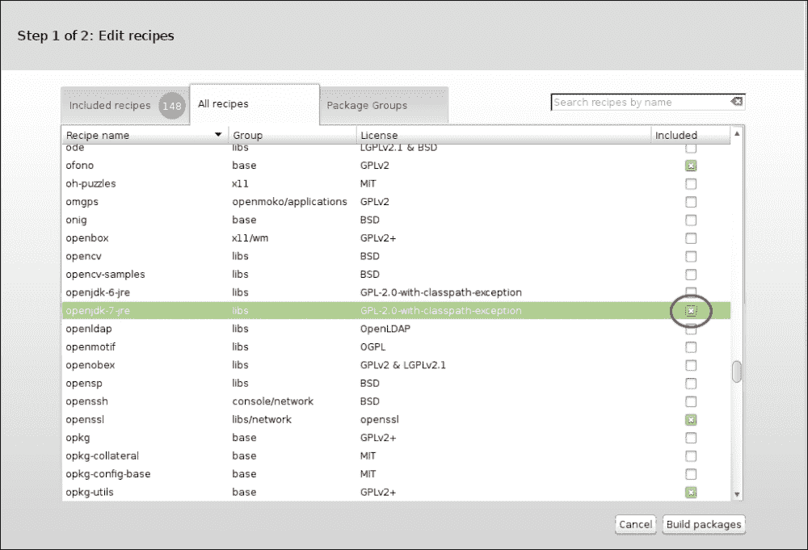
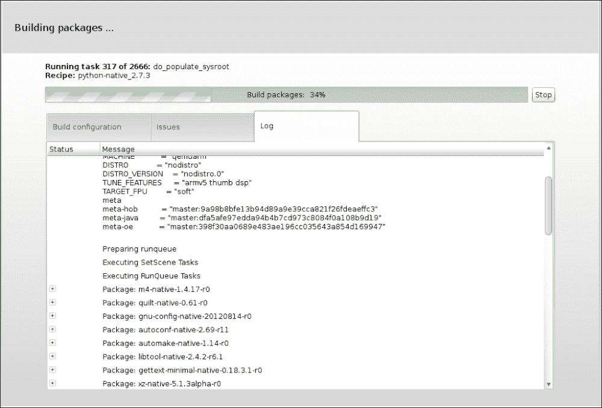
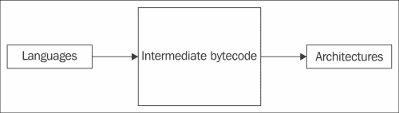
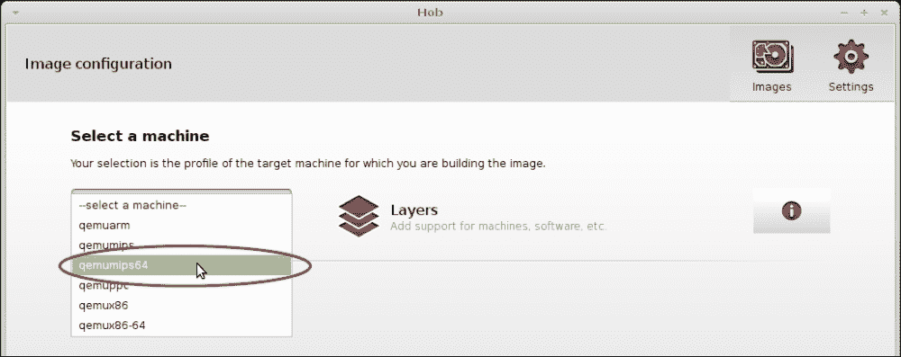

# 第六章：使用其他 VM 实现构建 IcedTea

在本章中，我们将涵盖以下主题：

+   配置 ARM 和 x86 之间的交叉编译

+   使用集成 CACAO VM 为 ARM 构建 IcedTea

+   将 JamVM 移植到使用 OpenJDK

+   使用 Shark 编译器配置 Zero 汇编器以使用 OpenJDK

+   使用 OpenEmbedded 食谱构建 MIPS 和其他架构

# 简介

虽然各种 x86 兼容平台广泛使用且常见，但还有其他架构需要考虑。Java 语言本身被设计成尽可能的跨平台。在 x86 兼容的世界里，这意味着 Java 将在大多数操作系统上以相同的方式和可预测性工作。对于更多架构而言，它应该能在其中许多架构上运行。

ARM 架构是最受欢迎的架构中的第二位。它在省电和性能之间提供了很好的平衡，主要用于嵌入式和便携式设备。有几个操作系统支持 ARM，例如各种 Linux 发行版、Android、Symbian、MeeGo 以及许多 Windows 版本。

在本章中，我们将讨论在 ARM 上构建 IcedTea，使用非官方的虚拟 Java 机器，它们不是 OpenJDK 社区的一部分。它们是为了不同的目的而构建的——学术、性能等。

不幸的是，如今，唯一同时支持 ARM 和 OpenJDK 的操作系统是 Linux。在 Linux 上构建 IcedTea 的细微差别因发行版而异，尽管主要思想和哲学是相同的。

在本章中，我们将尽可能多地使用基于不同发行版和设备细微差别的不同示例，尽管最彻底测试的将是以下几对：

+   树莓派和 Raspbian

+   Nexus 7 和 Ubuntu touch

本章还将涵盖使用基于 x86 的系统进行交叉编译的主题，因为可能需要比 ARM 处理器能够提供的更快的编译速度，尤其是在树莓派这类小型计算机的情况下。

本章中我们将介绍三种虚拟机：ZeroVM、CACAO VM 和 Jam VM。然而，只有 Zero 汇编器是 OpenJDK 项目的一员。Zero 汇编器是一个旨在消除平台特定汇编语言并构建仅包含解释器的虚拟机的努力。它将使任何 Java 可执行文件移植到任何操作系统变得异常简单，但由于缺乏 JIT，性能会有显著影响。然而，有一个名为 Shark 的 JIT 编译器，它使用 LLVM 将 Zero 汇编器编译成特定平台的代码。但很明显，Shark 只适用于 LLVM 本身支持的架构。

JamVM 也因为其实际上非常小的尺寸而闻名，这个尺寸取决于架构，在 200 到 250 千字节之间。在这个空间内，它实现了 Oracle 发布的完整 JVM 规范，被称为**蓝皮书**。

# 配置 ARM 和 x86 之间的交叉编译

尽管许多最近的 ARM 设备具有出色的性能和与桌面设备相同的核心数量，但总有一些设备的性能不足以在合理的时间内完成复杂的工作。不想被无休止的编译时间无聊吗？使用 OpenEmbedded 构建。**OpenEmbedded**是一个构建框架，用于创建 Linux 发行版，并且可以为大量架构进行交叉编译。

## 准备工作

我们需要一个真实或模拟的 ARM 设备，上面安装了 Linux。以下配方主要用于基于 deb 的发行版，但对于任何运行基于 GNU 工具的 Linux 内核的 ARM 设备，基本思想是相同的。

此外，我们还需要另一台装有 Linux 或安装了 Cygwin 的 Windows 设备，以执行主要的编译工作。

此配方还假设您将使用基于 deb 的发行版。如果您使用的是基于 ebuild 的发行版，请使用它们自己的交叉编译工具。在基于 rpm 的发行版中，过程相当类似。

## 如何做...

首先，我们需要利用 OpenEmbedded 项目。OpenEmbedded 是一个旨在构建特定平台环境并构建各种已知包的项目。请查看以下步骤，了解如何使用 OpenEmbedded 项目构建各种包：

1.  为了使用它，我们将安装一些包：

    ```java
    sudo apt-get install git g++ gawk zip diffstat texi2html texinfo subversion chrpath libgl1-mesa-dev libglu1-mesa-dev libsdl1.2-dev

    ```

1.  之后，我们需要获取一个 OpenEmbedded 环境：

    ```java
    git clone git://git.openembedded.org/openembedded-core oe-core

    ```

1.  然后，我们需要在`oe-core`目录中创建三个更多项目：

    ```java
    cd oe-core

    ```

1.  接下来，让我们将一些层克隆到我们的根目录中：

    ```java
    git clone git://git.openembedded.org/bitbake bitbake

    git clone git://git.openembedded.org/meta-openembedded

    git clone https://github.com/woglinde/meta-java.git

    ```

1.  最后，初始化一个 OpenEmbedded 环境：

    ```java
    . ./oe-init-build-env

    ```

现在我们已经拥有了一个完全可操作的 OpenEmbedded 环境。我们只需配置我们的构建。有两种方法可以做到这一点：手动编辑配置文件或通过 Hob GUI。

### 手动配置 OpenEmbedded 构建

您需要编辑两个配置文件：第一个配置文件是 Java 层，第二个是通用的，易于将其包含在构建中，如下面的步骤所示：

1.  首先，编辑`conf/local.conf`文件。

1.  我们将设置 JamVM 为首选虚拟机：

    ```java
    PREFERRED_PROVIDER_virtual/java-native = "jamvm-native"

    ```

1.  根据需要设置其他版本（例如版本 1.8.11）：

    ```java
    PREFERRED_PROVIDER_virtual/javac-native = "ecj-bootstrap-native"
    PREFERRED_VERSION_cacaoh-native = "<version_number>"
    PREFERRED_VERSION_icedtea6-native = "<version_number>"

    ```

1.  我们需要一个 ARM 构建版本，因此我们将选择 qemu-arm 作为目标机器：

    ```java
    MACHINE ?= "qemuarm"

    ```

1.  我们还需要提到可以同时进行多少个编译过程：

    ```java
    PARALLEL_MAKE = "-j 2"

    ```

1.  此外，我们可以为单个编译包重新配置多个线程。对于四核计算机，它将是`2`：

    ```java
    BB_NUMBER_THREADS = "2"

    ```

1.  然后，我们将编辑`conf/bblayers.conf`文件。

1.  以下参数是文件格式的版本。这意味着在此之前有 3 个不兼容的格式：

    ```java
    LCONF_VERSION = "4"

    ```

1.  然后，我们将设置层以命令 OpenEmbedded 系统确切地构建什么：

    ```java
    BBFILES ?= ""
    BBLAYERS = " \
     /home/user/oe-core/meta \
     /home/user/oe-core/meta-openembedded/meta-oe \
     /home/user/oe-core/meta-java \
    "

    ```

### 使用 Hob 工具配置 OpenEmbedded 构建

Hob 是 BitBake 的图形用户界面。请查看以下步骤，了解如何使用 Hob 工具配置 OpenEmbedded 构建：

1.  让我们从构建目录中运行一个`hob`可执行文件：

    ```java
    hob

    ```

    这只能在环境初始化之后完成。否则，您将收到找不到命令的消息。

    ```java
    No command 'hob' found, did you mean:
     Command 'bob' from package 'python-sponge' (universe)
     Command 'hoz' from package 'hoz' (universe)
     Command 'tob' from package 'tob' (universe)
     Command 'hnb' from package 'hnb' (universe)
    hob: command not found

    ```

1.  将出现一个启动屏幕，如图所示：

1.  首先，我们将选择一个虚拟机。对于 ARM 处理器，最方便的是 qemu-arm 机器。

1.  之后，我们需要选择两个额外的层。一个是**meta-oe**层，另一个是**meta-java**。

    ### 小贴士

    虽然`meta-java`文件夹位于 OpenEmbedded 的根目录中，但`meta-oe`的路径是`meta-openembedded/meta-oe/`。

1.  当选择了一台机器时，工具将解析所有配方并计算所有所需的依赖项。然后，窗口应如下所示：

1.  然后选择一个配方。这里有一个与 Java 相关的配方：**java-test-image**。尽管如此，最好不选择它，而是选择**core-image-basic**。

    ### 小贴士

    您可以尝试从头开始组装您的镜像。您可以选择您想要的包，依赖项将自动计算。

在高级配置部分，您可以选择输出的确切内容。您甚至可以以`.deb`格式获得它，如图所示：

1.  您需要编辑配方并将**openjdk-7-jre**添加到其中，如图所示：

    此外，您还可以添加一些必要的依赖项以进行构建。

1.  当一切准备就绪时，请按**构建包**按钮，将出现以下屏幕：

如果出现问题，**问题**标签页将不会为空。

### 构建之后

您需要将构建输出从**tmp-eglibc**文件夹复制到您的 ARM 设备上。

## 它是如何工作的...

OpenEmbedded 是一系列针对各种工具的交叉编译配方，编译需要花费很多时间。OpenEmbedded 将从头开始创建根文件系统。然后，它将构建您想要构建的包。OpenEmbedded 提供了一组抽象层，从开发者到核心层。这些层包括构建环境和目标项目的配方和工具。

因此，在完成配置后，该工具将构建一个环境，并在其中构建一些项目。

## 更多...

构建 OpenEmbedded 配方不是一项简单任务。它通常需要一些问题解决技能。当您尝试构建一个标准的 Java-test 镜像时，即使花费数小时构建的构建过程被一些错误中断，这也是不寻常的。

虽然配方构建和纠正的基本知识将在以下配方中给出，但我们可以在本节中提供处理一些问题的路线图。

### 小贴士

一些作者发现并克服的情况将在第八章 *黑客 OpenJDK* 中找到。

### 配置问题 - 当找不到头文件时

虽然构建过程与从头开始创建一个维护良好的 Linux 仓库相似，但它并不简单。这是一个从源代码构建整个系统的任务，某些小包中的头文件移动可能是一个重大的问题，这对您的构建是致命的，如下所示：

1.  因此，这是一个依赖问题。首先，尝试找出，您是否需要该包，是否找不到头文件。

1.  如果是这样，找出您是否可以通过标准的 `./configure` 属性（在 `make` 之前指定的）来禁用它。

1.  如果您能这样做，那您很幸运。只需找到您包的配方并编辑 `.bb` 或 `.inc` 文件。对于 OpenJDK，它是 `openjdk-7-common.inc`。

1.  将所需的 `./configure` 属性添加（或删除）到 `EXTRA_OECONF` 中。不要忘记筛选 `\`。如果您需要该依赖项或无法禁用它，那又是另一回事。

1.  首先，考虑切换到 `.bb` 文件的较旧/较新版本。这可能会解决一些问题，但也可能轻易地增加问题。

1.  如果这不可能或不会有所帮助，尝试找到源代码的补丁并应用它。

### 获取问题 - 您的包无法通过任何可用的镜像访问

首先，尝试检查是否所有使用的镜像都永久离线。如果不是，只需等待一会儿，直到其中一个变得可访问。

### 编译问题 - 发生编译错误的地方

总是有解决这类问题的方法，这可以通过互联网搜索找到。

这可能是一个错误的依赖版本，甚至是一个编译问题，这个问题从维护者的眼中溜走了。解决方案是使用一些已知的补丁或甚至您自己的补丁来修补您的构建，或者更改包的源参数。

### 解析问题 - 您的配方无法解析

这不是一个常见问题，但确实遇到了，例如在 `meta-java` 仓库的 `openjdk-7` 分支中。通常这并不意味着某些东西完全损坏。检查配方文件中指示的行，以查找缺失的、部分注释和其他格式问题。如果问题仍然存在，考虑更改您当前的分支。

# 构建 ARM 版本的 IcedTea，集成了 CACAO 虚拟机

这个配方承诺相当简单，因为 CACAO 虚拟机的集成已经是 IcedTea 本身的一部分。它不需要任何修补或其他复杂的事情。

## 准备工作

我们可能需要一个真实或模拟的 ARM 设备，该设备已安装 Linux 和任何 Java 环境。我们需要 Java 来执行 `javac` 编译，这是 IcedTea 构建过程的一个必要部分。

## 如何做...

我们将下载 IcedTea，解压它，并使用指定的参数构建它，仅此而已。

1.  首先，让我们从服务器获取最新的 IcedTea 源代码：

    ```java
    wget http://icedtea.wildebeest.org/download/source/icedtea-<icedtea_version>.tar.gz

    ```

    它将下载一个存档。

1.  如有必要，执行校验和检查。

1.  让我们解压存档并将其复制到 `icedtea` 目录：

    ```java
    tar -xzf icedtea-XXXX
    cd icedtea-XXXX

    ```

1.  然后，您可能需要安装一些制作 IcedTea 所需的依赖包。

1.  给定的包是在作者第一次构建时在机器上缺失的包：

    ```java
    sudo apt-get install zip gawk xsltproc libjpeg8-dev libgif-dev libpng-dev liblcms2-dev libgtk2-dev cups libcups2-dev libc6-dev libattr1-dev alsa-ocaml-dev

    ```

1.  然后，我们将为构建配置创建一个链接以找到 Java 主目录：

    ```java
    sudo ln -s /usr/lib/jvm/java-7-openjdk-armhf/ /usr/lib/jvm/java-1.7.0-openjdk

    ```

    ### 提示

    如果您有推荐的方式来更改默认的 Java 主目录，请按照它来做。

1.  然后，我们将在配置中启用 CACAO 虚拟机。此外，我们将配置新构建的 IcedTea 使用 CACAO 虚拟机，不仅作为构建配置，而且作为默认配置：

    ```java
     ./configure --enable-cacao --with-icedtea —with-icedtea-home=<your_openjdk_home>

    ```

1.  当运行 `configure` 时，您可能会遇到一些错误，错误信息表明某些程序或库缺失。没关系，您只需使用您的包管理器安装它们即可。

1.  在完成这些后，我们将使用一个简单的命令构建 IcedTea：

    ```java
    make

    ```

这是一个漫长的过程，即使使用交叉编译，所以最好喝杯茶或类似的东西。

## 它是如何工作的…

IcedTea 现在支持 CACAO 虚拟机作为默认的构建配置。我们只需要启用此选项来配置并添加缺失的依赖项。通常，IcedTea 在 ARM 上使用 ZeroVM，但没有 Shark JIT 编译。然而，在底层，它实际上应用了数百个补丁，并使用了在嵌入式设备上不可接受的内存量。

## 更多内容...

由于您可能在某些设备上构建 IcedTea 时遇到一些困难，您可能需要使用我们之前使用过的交叉编译方式。

您可能只需要设置一个变量到本地配置文件：

```java
 PREFERRED_PROVIDER_virtual/java-native = "cacao-native"

```

# 将 JamVM 移植到使用 OpenJDK

对于不支持 JIT 的平台，另一个 Zero HotSpot 的替代方案是 JamVM——这是一个极小的虚拟机，在支持蓝皮书规范（以书籍形式发布的）的虚拟机中是最小的。

## 准备中

我们可能需要一个真实或模拟的具有 Linux 和任何 Java 环境安装的 ARM 设备。我们需要 Java 来执行 `javac` 编译，这是 IcedTea 构建过程中的必要部分。

## 如何做到这一点...

尽管 JamVM 补丁可以手动应用，但我们将使用更简单的方法：

1.  首先，让我们从仓库克隆源代码：

    ```java
    git clone git://git.berlios.de/jamvm

    ```

1.  然后，我们将其配置为使用 OpenJDK 作为 Java 运行时库：

    ```java
    ./autogen.sh –with-java-runtime-library=openjdk

    ```

1.  然后，我们将使用 `make` 命令从源代码实际构建它：

    ```java
    make && make install

    ```

1.  接下来，我们需要将 `libjvm` 复制到 `lib` 目录下：

    ```java
    cp libjvm.so  /usr/local/jamvm/lib.

    ```

1.  然后，让我们复制 OpenJDK 内容：

    ```java
    cd /usr/lib/jvm
    cp -r java-7-openjdk jamvm-openjdk
    cp /usr/local/jamvm/lib/libjvm.so jamvm-openjdk/jre/lib/armv6/server

    ```

1.  然后，让我们运行我们的编译后的 Java：

    ```java
    /usr/lib/jvm/jamvm-openjdk/jre/bin/java -version

    ```

1.  我们将看到如下输出：

    ```java
    java version "1.7.0_20"
    OpenJDK Runtime Environment (IcedTea7 1.9.5) (7b20-1.9.5-0ubuntu1)
    JamVM (build 1.7.0-devel, inline-threaded interpreter)

    ```

## 更多内容

此外，Jam M 支持 是 OpenEmbedded Java 层的一部分。为了添加它，您需要移除 ZeroVM 支持，并添加 JamVM 支持。虽然这可能是一个简单的任务，但在配置和构建过程中您可能会遇到错误。

此外，您可以使用 JamVM 运行任何选择的 Java 程序，即使您的 IcedTea 构建未配置为使用它。

只需输入以下命令：

```java
java  -jamvm <other parameters and program name>

```

# 使用 Shark 编译器配置 Zero-assembler 以使用 OpenJDK

零汇编器 HotSpot 端口是 Java 8 之前所有在 ARM 上新建的 OpenJDK 实例的默认 Java 虚拟机。它是许多 JIT 不支持平台的默认 Java 虚拟机。然而，有人正在努力将其 JIT 功能提升，名为 Shark。

## 准备工作

我们可能需要一个真实的或模拟的 ARM 设备，该设备已安装 Linux 和任何 Java 环境。我们需要 Java 来执行`javac`编译，这是 IcedTea 构建过程的必要部分。

## 如何做到这一点...

1.  让我们下载 IcedTea 源代码。

    ```java
    wget http://icedtea.wildebeest.org/download/source/icedtea-<icedtea_version>.tar.gz

    ```

    它将下载一个存档。

1.  然后，你可以检查校验和。

1.  让我们解压它并将其复制到`icedtea`目录中：

    ```java
    tar -xzf icedtea-XXXX
    cd icedtea-XXXX

    ```

1.  然后，你可能需要安装一些制作 IcedTea 所需的依赖包。

    以下是在我的机器上第一次构建时缺失的包。

    ```java
    sudo apt-get install zip gawk xsltproc libjpeg8-dev libgif-dev libpng-dev liblcms2-dev libgtk2-dev cups libcups2-dev libc6-dev libattr1-dev alsa-ocaml-dev

    ```

1.  然后，我们将为构建配置创建一个链接以找到 Java 主目录：

    ```java
    sudo ln -s /usr/lib/jvm/java-7-openjdk-armhf/ /usr/lib/jvm/java-1.7.0-openjdk

    ```

    ### 小贴士

    如果你有一个推荐的更改默认 Java 主目录的发行版方式，请遵循它。

1.  然后，我们将在配置中启用 Zero-Shark。此外，我们将配置新构建的 IcedTea，不仅用于构建，还作为默认使用 Shark 虚拟机：

    ```java
     ./configure --enable-zero  --enable-shark --with-icedtea —with-icedtea-home=<your_openjdk_home>

    ```

    当运行`configure`时，你可能会遇到错误，显示某些程序或库缺失。没关系，你只需要使用你的包管理器安装它们。

1.  在完成这些之后，我们将使用一条简单的命令来构建 IcedTea：

    ```java
    make

    ```

## 如何工作…

通常，IcedTea 在 ARM 上使用 ZeroVM，但没有 Shark JIT 编译。我们只需要命令它使用 ZeroVM 和 Shark JIT 编译器。

Shark 是一个项目，它使用一个著名的 LLVM 支持的平台列表，以在所有这些平台上启用 JIT 支持，这相当令人印象深刻。它可能不如本地 JIT 快，但总比没有好。

### 小贴士

在 ARM 上，有一个可以使用 HotSpot 中的 JIT 编译的 OpenJDK，但它是早期访问模式，并且由于它是 JDK 8，因此在此之前的支持将不会移植。

LLVM 项目的目标是实现尽可能多的语言和平台的跨平台编译。它使用前端和后端转换来提供工具的灵活性，如下面的图所示：



由于这种结构，LLVM 可以将 Java 类方法的代码编译成中间语言，然后再编译成本地代码。它将最简单的功能如反射等留给虚拟机。

## 还有更多

此外，你始终可以交叉编译具有 Zero-Shark 支持的 IcedTea。为了做到这一点，请参考本章的最后一条配方。

# 使用 OpenEmbedded 配方为 MIPS 和其他架构构建

当基于 ARM 的设备广泛流行时，总有其他架构。Java 的强大之处在于其跨平台性，所以让我们尝试为其他一些架构构建。

## 准备工作

您需要一个互联网连接，以及安装了 Cygwin 的 Linux 或 Windows 电脑。根据作者的实践经验，您至少需要 4GB 的 RAM。

为了舒适地构建，建议您拥有强大的硬件和快速的硬盘。

此外，您在构建过程中可能会遇到一些延迟，甚至 OOM-kills，所以请确保您的所有数据都已保存。

此外，您还需要配置一个 OpenEmbedded 项目，如本章第一道菜谱中所述。

## 如何操作...

首先，我们将了解如何将架构和软件添加到 OpenEmbedded 中：

1.  打开您的浏览器，并访问[`layers.openembedded.org/layerindex/branch/master/layers/`](http://layers.openembedded.org/layerindex/branch/master/layers/)。

    您将找到支持的架构列表和您可以安装的软件列表。

1.  克隆包含您需要的代码的仓库（例如`meta-asus`或`meta-htc`）。

1.  然后，准备您的构建环境，并打开如图所示的 Hob GUI：

1.  从下拉列表中选择机器。

1.  然后，您可能需要设置一些特定于架构的`./configure`选项。为了做到这一点，您需要更改一个`bitbake`文件，添加或纠正`EXTRA_OECONF`变量。别忘了添加尾随的\s。

## 它是如何工作的…

这个项目的目标是从头开始创建仓库和发行版，包括预编译的镜像和依赖项。它由称为`.bb`文件的元数据组成，以及它们之间众多的依赖关系。

如果这个项目运行得不是很顺利，您可能需要做一些更改才能顺利通过。`.bb`文件是一个具有以下结构的文件：

```java
#A description of this recipe.
 DESCRIPTION = ""
#A homepage, if any
 HOMEPAGE = ""
#A license
 LICENSE = ""
#Dependecies
 DEPENDS = ""
#URI of the sources
 SRC_URI = " \
 "
 # SRC_URI could also point to a git repository, eg:
 # SRC_URI = "git://host:port/path/to/repo.git;branch=win;protocol=ssh;user=username"

 # any .patch files included here will be auto-magically applied, increasing the -p level until it sticks.
 # SRC_URI = "file://some.patch"

#package revision. This is a really important thing, you will change it each time when you update the recipe.
 PR = "r0"

#checksums for tarball packages
 SRC_URI[md5sum] = ""
 SRC_URI[sha256sum] = ""
 S = "${WORKDIR}/CHANGEME-${PV}"

#Action which will be performed on oe_configure stage
 do_configure () {
   ./configure --prefix=${prefix}
 }

#Action which will be performed on oe_make stage
 do_compile () {
   make
 }

 #Action which will be performed on install stage
do_install () {
   DESTDIR=${D} oe_runmake install
 }
```

这是一个普通的配方模板，您可以通过它添加任何想要的依赖项。此外，您还可以将补丁添加到配方目录中，甚至将其添加到源代码中。

## 还有更多...

您始终可以通过使用标准的 HotSpot Zero 端口在其他架构上构建 OpenJDK。它是完全可解释的，可以使您的程序运行得非常慢，但总比没有好。只需遵循标准程序：

```java
./configure
make

```

这种方法有其缺点，因为除了英特尔和 ARM 之外的大多数架构都是嵌入式架构，所以您可能无法制作出快速的产品，甚至可能根本无法制作出来。例如，在搭载新构建的 Raspbian 和 512 Mb RAM 的树莓派上，由于内存不足，构建 IcedTea 会随机崩溃，即使有大的交换文件。
