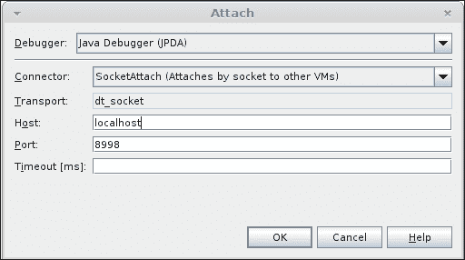

# 第八章. 破解 OpenJDK

在本章中，我们将涵盖以下内容：

+   使用 NetBeans 设置开发环境

+   与 Mercurial 森林协同工作

+   理解 OpenJDK 6 和 7 增量构建

+   使用 NetBeans 调试 Java 代码

+   使用 NetBeans 调试 C++代码

+   使用 NetBeans 编译 HotSpot

+   使用 HotSpot 开发参数

+   向 HotSpot 添加新的内建函数

+   从源代码构建 VisualVM

+   为 VisualVM 创建插件

+   从 AdoptOpenJDK 项目中获得收益

# 简介

OpenJDK 真正的美在于其开放性，这意味着开发者不仅可以使用它来运行应用程序，还可以根据需要对其进行更改或为其开发做出贡献。源代码的可用性和易于访问为有特殊要求的人或只是想了解更多关于 JVM 内部工作方式的人提供了巨大的机会，他们希望将其适应任何特殊要求。本章将帮助您进入这一领域，并提供一些食谱，使设置所需开发环境的过程尽可能简单。

首先，它将涵盖如何设置开发环境以及启动所需的工具。它将涵盖 IDE 设置，以及启动 JVM 和开始调试所需的调整。下一步是更改代码并重新构建，后者将略不同于第五章中描述的正常构建，即第五章，*构建 IcedTea*，第六章，*使用其他虚拟机实现构建 IcedTea*，和第七章，*使用 WebStart 和浏览器插件*。该部分剩余的内容将包含一些有用的技术，可用于调试更改。

本章假设读者对 C++和 Java 有合理的了解。对 JVM 的了解是理想的，因为读者应该知道 JIT 是什么以及它是如何工作的。

JIT 部分的大多数食谱都是独立的，可以单独执行，因此读者只需选择他们需要的部分并继续即可。

# 使用 NetBeans 设置开发环境

本食谱将涵盖在 NetBeans IDE 中安装、运行和设置项目的步骤。NetBeans 是一个开源 IDE，主要用于 Java 开发。它还提供了对 C++的丰富支持，这使得它成为 OpenJDK 开发的良好工具，因为 OpenJDK 使用这两种语言。本食谱使用 NetBeans IDE v.7。

## 准备工作

从[`www.netbeans.org/downloads`](http://www.netbeans.org/downloads)下载适用于您平台的最新 NetBeans `All`捆绑包。`All`捆绑包必须在同一 IDE 中具有 C/C++和 Java 支持。还必须在机器上检出并可用 OpenJDK 代码。

确保 OpenJDK 构建的设置已经完成，并且可以无错误地执行。如何做到这一点在第二章、*构建 OpenJDK 6*、第三章、*构建 OpenJDK 7*和第四章、*构建 OpenJDK 8*中有描述。

## 如何操作...

我们将安装并配置 OpenJDK 项目中使用的 NetBeans IDE 作为标准 IDE。

1.  首先，我们需要安装 NetBeans IDE。这是一个非常简单的过程，包括几个简单的步骤。运行下载的可执行文件，在第一个屏幕的底部，选择**自定义**按钮。这将显示以下窗口：

    确保已选择**基本 IDE**、**Java SE**、**C/C++**和**需求功能**。其余的都是可选的，不是运行和调试 OpenJDK 所必需的，但安装该功能并无害处。

1.  设置完成后，您应该更新所有插件到最新版本。更新可通过**帮助/检查更新**菜单项进行。

1.  当 NetBeans 设置完成后，需要对其配置进行轻微的修改。

    OpenJDK 是一个大型项目，其内存需求比默认设置中定义的要大。为了增加 IDE 可用的内存：

    1.  前往`$HOME/.netbeans/NETBEANS_VERSION/etc`文件夹（在 Windows 中`$HOME`是`%HOMEPATH%`）。

    1.  如果文件夹不存在，请创建它。

    1.  然后，如果该文件夹中没有`netbeans.conf`文件，请从 Netbeans 安装目录中复制它，该目录位于`etc`文件夹中。

    1.  使用任何文本编辑器打开文件，并定位看起来类似于以下的`netbeans_default_options`参数：

        ```java
        netbeans_default_options="-J-client -J-Xss2m -J-Xms32m -J-XX:PermSize=32m -J-Dapple.laf.useScreenMenuBar=true -J-Dapple.awt.graphics.UseQuartz=true -J-Dsun.java2d.noddraw=true -J-Dsun.java2d.dpiaware=true -J-Dsun.zip.disableMemoryMapping=true"

        ```

1.  当找到参数时，添加`-J-Xmx2g`，或者如果该选项已经存在，更新它到一个不小于`2G`（2 千兆字节）的值。这将增加 JDK 可用的内存到`2G`。如果 IDE 之前正在运行，请重新启动以应用该更改。

    ### 小贴士

    值得注意的是，由于 Netbeans IDE 对内存需求较大，建议在能够为进程提供至少 2GB 内存的系统上运行。基本上，这意味着它应该是一个 64 位操作系统，并拥有大约 4 到 6GB 的 RAM。

1.  现在，Netbeans IDE 已准备好设置项目。运行它，并在对话框中转到**文件** | **新建项目**，选择**使用现有源文件的 C/C++项目**：

1.  然后按**下一步**，在随后的对话框中，选择 OpenJDK 源根目录所在的文件夹：

    ### 小贴士

    您可以通过输入`hg clone http://hg.openjdk.java.net/jdk6/jdk6 && ./get_source.sh`来获取您的 OpenJDK 代码。

1.  按 **完成** 按钮，Netbeans 将尝试清理和构建项目。清理，很可能会无问题执行，但构建将不会工作，因为它需要一些环境设置，我们将在稍后进行。

    在尝试构建项目后，Netbeans 将花费相当多的时间（分钟）扫描源代码和构建索引。这时喝杯咖啡是个不错的选择。

1.  下一步是配置 Netbeans 以构建项目。如前所述，构建脚本需要一些环境设置。以下是一个简单的 bash 脚本，可以用来创建适当的环境：

    ```java
    #!/bin/sh
    export LANG=C
    export ALT_BOOTDIR=/usr/lib/jvm/java
    ./jdk/make/jdk_generic_profile.sh
    make $*

    ```

1.  在 OpenJDK 源树的根目录下创建一个名为 `build.sh` 的文件，并将此脚本保存在该文件夹中。

1.  然后导航到 **运行** | **设置项目配置** | **自定义** 菜单项，在左侧的树状结构中，选择 **构建** | **构建**。在那里，您将看到以下对话框：

1.  如截图所示，将 **构建命令** 和 **清理命令** 变量设置为执行您的 `./build.sh`，分别使用 `debug_build` 和 `clean` 命令。

1.  如果需要 OpenJDK 的 `product` 版本，那么只需创建另一个配置，包含 `product_build` 和 `build.sh` 的参数。

## 参见

Netbeans 不是唯一支持 Java 和 C++ 的 IDE。还有其他类似功能的 IDE。一个例子是 Eclipse IDE，它也是一个用 Java 编写的强大多平台 IDE，并且具有类似的功能。

# 使用 Mercurial forest 进行工作

Mercurial 是一个跨平台版本控制系统。它被设计用于处理大型项目和大量代码，这在 OpenJDK 项目中无疑是存在的。OpenJDK 的官方仓库是一个 Mercurial 仓库。

Forest 插件是用于各种 OpenJDK 子项目合并和共存的插件。它与嵌套的 Mercurial 仓库一起工作，这些仓库通常被视为独立的。主要思想是从根仓库传播更改到嵌套的仓库。

它的主要目的是允许开发者在不需要对整个仓库（例如更改修订号）进行任何更改的情况下，与代码一起工作，这仅仅是完整 OpenJDK 项目仓库的一个小部分。

## 准备工作

首先，我们需要安装 Mercurial 本身。在 Windows 上，可以通过访问官方 Mercurial 网站并从 [`mercurial.selenic.com/wiki/Download`](http://mercurial.selenic.com/wiki/Download) 下载它。

对于 Linux 发行版，通常在它们的官方仓库中有 Mercurial 版本。

例如，在 Debian 和 Debian 衍生发行版中，Mercurial 的安装方式如下：

```java
sudo apt-get install mercurial

```

如果您在 Mercurial 安装过程中遇到任何问题，请参考官方网站或您的 Linux 发行版资源。

## 如何操作...

让我们用一个简单、非 Java 相关的例子来解释它。我们将假设在 OS 中已经存在一个 Mercurial 实例。由于 Mercurial 有一个命令行工具，我们将使用命令行做所有事情。

1.  让我们创建两个仓库：

    ```java
    mkdir repo-one
    cd repo-one
    hg init
    echo "hello" > hello.txt
    hg ci -m"init one"
    cd ..

    mkdir repo-two
    cd repo-two
    hg init
    echo "hello" > hello.txt
    hg ci -m"init two"
    cd ..

    ```

1.  我们需要找到 `.hgrc` 文件：

    ```java
    locate hgrc

    ```

1.  让我们从 [`bitbucket.org/gxti/hgforest/src`](https://bitbucket.org/gxti/hgforest/src) 复制 `forest.py` 文件。

1.  然后，让我们编辑你的 `.hgrc` 文件：

    ```java
    [extensions]
    forest = patch/to/forest.py

    ```

我们现在在我们的仓库中有一个全新的 `fclone` 命令。

1.  让我们将第一个仓库复制到第二个仓库中：

    ```java
    hg clone repo-one repo-two/one

    ```

    `repo-two` 仓库不是 `repo-one` 的一个整体部分，它只是位于其中。

1.  让我们使用 `fclone` 命令克隆一个 `repo-two` 仓库并将 `repo-one` 附接到它上：

    ```java
    hg fclone repo-two wc-two

    ```

    我们刚刚复制了 `repo-two`，包括 `repo-two/one`。

1.  让我们对 `repo-two/hello.txt` 和 `repo-two/one/hello.txt` 进行一些修改：

    ```java
    echo some >> repo-two/hello.txt  &&  echo some1 >> repo-two/hello.txt

    ```

1.  我们将使用单独的命令提交每个更改：

    ```java
    cd wc-two/ && ls
    hg ci -m"edited hello.txt"
    cd one/
    hg ci -m"edited hello.txt"
    cd ..

    ```

1.  让我们将结果推回 `repo-two`：

    ```java
     hg fpush

    ```

    我们将在 `repo-one` 中有两个更改的文件。

1.  让我们将其中一个推送到 `repo-two`：

    ```java
    cd ../repo-two
    hg fpush

    ```

1.  现在，`repo-two/one` 的更改已传播到 `repo-one`。

## 它是如何工作的…

Mercurial 是一个相对简单的控制系统。它可以通过不同的插件进行大量扩展，这些插件通过 `.hgrc` 文件进行配置。

Mercurial 的 `forest` 插件将嵌套仓库中的更改传播到根仓库，并将父仓库的内容与嵌套仓库同步。

# 理解 OpenJDK 6 和 7 的增量构建

OpenJDK 的编译过程非常耗时。这非常无聊，尤其是在开发整个项目的一个小部分时，为了测试目的需要完全重新编译。为了简单地进行编译，并且只编译必要的部分，存在增量构建。

## 准备工作

我们需要下载 OpenJDK（6 或 7）的源代码。你可能需要安装 `libmotif`。Windows 用户可能需要安装 Cygwin。

## 如何做…

我们将看到 OpenJDK 是如何进行增量构建的，以避免添加任何讨厌的虫子。

1.  首先，让我们第一次构建 OpenJDK：

    ```java
    make all

    ```

1.  这将花费一些时间，所以喝杯茶吧。

1.  然后，我们将第二次构建它：

    ```java
    make all

    ```

1.  从输入中你可以看到实际上并没有构建任何东西。

1.  然后，让我们对一些源文件（例如，`cardTableModRefBS.cpp`）进行微小的更改。

1.  让我们再次 `make` OpenJDK，但这次我们将 `grep` 输出：

    ```java
    make all | grep -i .cpp

    ```

1.  我们看到，在输出中，实际上只编译了两个文件，`hotspot/src/share/vm/memory/cardTableModRefBS.cpp` 和 `hotspot/src/share/vm/runtime/vm_version.cpp`。

## 它是如何工作的…

构建程序会检查更新的文件，并只编译那些在最后一次编译运行之后更新的文件。但是，如果任何 `.hpp` 文件被修改，构建将以干净模式执行，例如，不会进行优化。

## 还有更多…

在使用增量构建时，往往会发生奇怪的事情。这种事情的概率与构建时间成比例增加。

基本上有两种执行清理构建的方法：

+   清理所有文件，从头开始重新编译成为必要：

    ```java
    make clean && make all

    ```

+   第二种方法是指定参数，这将强制构建的清理模式。

# 使用 NetBeans 调试 Java 代码

显然，当有人编写任何代码时，都需要进行一些调试。NetBeans 作为一款高标准的 IDE，提供了一些工具来完成这项工作。本食谱将展示如何使用 NetBeans 调试 Java 代码。

## 准备工作

您需要安装 NetBeans 并设置一个开发环境，如本章先前所述。

## 如何操作...

我们将使用 NetBeans 调试我们自己的 OpenJDK Java 代码。我们需要重新构建 OpenJDK 并带有调试符号，并配置 NetBeans 以便进行调试：

1.  首先，让我们创建一个带有调试符号的 OpenJDK 实例：

    ```java
    bash ./configure --enable-debug
    make all CONF=linux-x86_64-normal-server-fastdebug

    ```

1.  让我们确保构建了一个可调试的版本：

    ```java
    ./build/linux-x86_64-normal-server-fastdebug/jdk/bin/java -version
    openjdk version "1.8.0-internal-fastdebug"
    OpenJDK Runtime Environment (build 1.8.0-internal-fastdebug-dsmd_2014_03_27_05_34-b00)
    OpenJDK 64-Bit Server VM (build 25.0-b70-fastdebug, mixed mode)

    ```

1.  现在我们有了可调试的 OpenJDK。让我们将其设置为 NetBeans 的默认版本。

1.  让我们在 NetBeans 安装路径中打开 `etc/netbeans.conf` 文件。

1.  我们将更改一行：

    ```java
    netbeans_jdkhome="<path_to_jdkhome>"

    ```

1.  之后，我们将启动 NetBeans 并确保我们的 JDK 已正确加载。

1.  我们将选择 **工具** | **Java 平台**，随后会出现以下屏幕：

1.  让我们尝试调试 `java.lang.String` 类。我们将断点设置在这个类的不可避免部分——其中一个构造函数，如以下截图所示：

1.  这组断点足以连接到迄今为止启动的几乎所有 Java 可执行文件。但如果我们决定更进一步并附加调试器，我们将得到一个错误消息：

    ```java
    Not able to submit breakpoint LineBreakpoint String.java : 138, reason: No source root found for URL 'file:/home/dsmd/00experimental/java_build/jdk8intr/jdk8/jdk/src/share/classes/java/lang/String.java'. Verify the setup of project sources.
    Invalid LineBreakpoint String.java : 138

    ```

1.  为了避免这种情况，我们需要直接将我们的 Java 源代码指定给 NetBeans。我们的项目是一个 C++ 项目，它倾向于忽略 Java 文件。

1.  对于 `String` 类的结果将如以下截图所示：

1.  然后，只需启动一些使用字符串的 Java 可执行文件：

    ```java
    build/linux-x86_64-normal-server-fastdebug/jdk/bin/java -Xdebug -Xrunjdwp:transport=dt_socket,address=8998,server=y -jar /path/to/jar.jar

    ```

1.  按照以下步骤连接 Java 调试器：

1.  享受吧，您现在可以从内部看到 OpenJDK 的动态：

## 工作原理…

这只是一个带有几个简单细微之处的调试器。

## 更多内容...

在某些 Linux 发行版中，您可以使用 ZIP 文件中提供的源代码安装 OpenJDK 的调试版本。这些源代码会被 NetBeans 自动获取。

# 使用 NetBeans 调试 C++ 代码

如果您计划修改 HotSpot 或 OpenJDK 的任何其他 C++ 部分，那么您肯定需要逐步调试代码。本食谱将解释如何设置 NetBeans IDE 以实现此目的。

## 准备工作

要开始，只需要几样东西——下载的 Open JDK 源代码和安装的 NetBeans IDE。假设 OpenJDK 项目已经设置好并且可以构建源代码。

## 如何操作...

1.  第一步是设置一个可运行的执行文件。转到**运行** | **设置项目配置** / **自定义**，然后**构建** | **Make**，并将**build/linux-amd64-debug/hotspot/outputdir/linux_amd64_compiler2/jvmg/gamma**设置为构建结果，如下面的截图所示：

1.  然后在左侧树形结构中选择**运行**选项，并将**运行命令**设置为**"${OUTPUT_PATH}" –version**：

1.  这里的`–version`标志只是你可以运行的 simplest thing——获取 Java 版本。你可以稍后将其更改为你想要的任何内容，例如，运行 Java 程序。

1.  下一步是设置一些 Java 运行所需的环境变量。这可以通过在以下对话框的**环境**部分设置它们来完成。将`LD_LIBRARY_PATH`设置为`build/linux-amd64-debug/hotspot/outputdir/linux_amd64_compiler2/jvmg`，将`JAVA_HOME`设置为`build/linux-amd64-debug/j2sdk-server-image`。

1.  现在一切准备就绪，可以开始调试。为了检查它是否工作，在`hotspot/src/share/tools/launcher/java.c`中`main`函数的开始处设置一个断点，然后转到**调试** | **调试主项目**或使用快捷键*Ctrl* + *F5*。

## 它是如何工作的…

仔细的读者可能已经注意到，**调试**使用了`gamma` JVM 启动器，而不是通常运行 Java 时使用的`java`。这是为了简化事情；`gamma`是`java`的轻量级版本，它不会执行调试目的不必要的检查。

# 使用 NetBeans 编译 HotSpot

在进行 HotSpot 开发时，等待完整的 OpenJDK 构建执行是非常令人烦恼的。因此，排除其他部分并仅编译我们感兴趣的部分，即 HotSpot 部分，是有意义的。这个配方将解释如何做到这一点。

## 准备工作

这个配方的唯一先决条件是机器上可用的源代码，已安装 Netbeans，并已创建 OpenJDK 项目。

## 如何操作...

这是一个非常简单的配方，可以遵循。如果你已经完成了*使用 NetBeans 设置开发环境*，唯一需要做的事情是更改`hotspot_build`参数并添加另一个参数`DEBUG_NAME=debug`，整个构建命令行应该看起来像这样：

```java
build.sh hotspot-build DEBUG_NAME=debug

```

在这种情况下，**项目属性**对话框的**构建/Make**屏幕将看起来像这样：


## 它是如何工作的…

幸运的是，在`make`配置中已经创建了仅构建 HotSpot 位的目标。这些目标可以在`./make/hotspot-rules.gmk`文件中找到。

创建非优化版本或 HotSpot 的`debug`命令不是`DEBUG_NAME`变量的唯一选项。`fastdebug`命令是另一个选项，其中构建将创建一个带有断言的优化版本。当`DEBUG_NAME`未设置时，将构建 HotSpot 的产品版本。

# 使用 HotSpot 开发参数

HotSpot 有其他选项，这些选项可能会显著改变其行为。在这里，我们将使用其中一些选项，这些选项仅在 OpenJDK 的开发版本中使用。

## 准备工作

为了使用这些选项，我们需要编译一个开发 OpenJDK 版本。

## 如何操作...

我们将使用 OpenJDK 开发版本中可用的参数。在生产构建中，它们被禁用或设置为常量值。

要使用这些参数，我们将按照以下方式运行 Java：

```java
java - -XX:<optionName>

```

这里是一些可用的开发选项列表：

+   `InlineUnsafeOps`：如果启用此选项，将内联来自 `sun.misc.Unsafe` 的原生内存操作。在某些情况下，它可能提供一些性能改进。

+   `DieOnSafepointTimeout`：此选项如果安全点未达到但超时，则会终止进程。默认情况下是禁用的。

+   `ZapResourceArea`：此选项将使用 `0xABABABAB` zaps 释放的资源/区域空间。在调试模式下是真实的，但在生产 VM 中被取消选中。尽管它有一些性能影响，但它可能用于真正的偏执安全原因。

+   `ZapJNIHandleArea`：此选项将使用 `0xFEFEFEFE` zaps 释放的 JNI 处理空间。它仅具有调试值。

+   `ZapUnusedHeapArea`：此选项将使用 `0xBAADBABE` zaps 未使用的堆空间。它可能用于安全原因。

+   `Verbose`：此选项从其他模式打印额外的调试信息。它是开发 HotSpot 的主要日志选项。

+   `UsePrivilegedStack`：此选项启用安全 JVM 功能。默认情况下是 `true`，但在开发模式下，您仍然有机会以禁用安全的方式运行 HotSpot。

+   `MemProfiling`：此选项将内存使用分析写入日志文件。默认情况下是 `false`，可以用于一些内存分析问题。

+   `VerifyParallelOldWithMarkSweep`：此选项将使用`MarkSweep` GC 代码来验证并行老代的阶段。在更改 JVM 内存处理机制时，此选项可能用于调试目的。

+   `ScavengeWithObjectsInToSpace`：此选项非常有趣。Java 使用两空间 GC，在幸存空间方面，此选项允许在 `to_space` 包含对象时进行清除。在这样做的时候，如果启用了 `ZapUnusedHeapArea`，它还会清除一个未使用的区域。

+   `FullGCALot`：此选项强制在从运行时系统退出时进行完全 GC（`N=FullGCALotInterval`）。这可能是一个非常昂贵的操作，但一些开发者可能将其构建到用于桌面应用的 JDK 中。它可能比使用交换空间吸收不断增长的堆中的兆字节更便宜。

+   `AdaptiveSizePolicyReadyThreshold`：此选项是在开始自适应大小调整之前的收集次数。默认值是 `5`，但在桌面系统中，将其设置为 `1` 可能更有意义，因为这些系统的最大瓶颈是交换空间，特别是如果在一台机器上同时运行多个 Java 程序的话。

+   `EagerInitialization`: 这个选项如果可能的话会积极初始化类。默认值是`false`，所以可能不安全将其打开。但这个想法似乎很好，尤其是在服务器机器上。

+   `GuaranteedSafepointInterval`: 这个选项保证每隔几毫秒（`0`表示没有）至少有一个安全点。默认值是`1000`。它可以用来调整停止世界状态问题。选项值越大，这些停止的时间越长；如果我们把值设置得太小，将会出现过多的不必要的停止。

+   `MaxTrivialSize`: 这个选项是内联平凡方法的最大字节码大小。默认值是`6`。它与 C++编译器的内联选项类似，但针对字节码编译器。

+   `MinInliningThreshold`: 这个选项是方法需要的最小调用次数才能进行内联。默认值是`250`。

+   `SharedOptimizeColdStartPolicy`: 这个选项是`SharedOptimizeColdStart`的重排序策略。`0`值优先考虑类加载时的局部性，`1`使用平衡策略，而`2`则优先考虑运行时局部性。

默认值是`2`，很少需要更改它，但在某些情况下，如果你的应用程序启动后有太多可能加载的类，将其设置为`1`可能是有意义的。

# 将新的内联函数添加到 HotSpot

内联函数是一个由编译器特别处理的函数。通常这意味着函数调用被自动生成的指令所替换。这与内联函数非常相似，但编译器对内联函数了解得更多，因为它们是编译器本身的一部分，所以它可以更明智地使用它们。

内联函数通常比原生函数更注重性能，因为没有 JNI 开销。

## 准备工作

要开始，我们只需要安装 NetBeans IDE 用于代码编辑和 OpenJDK 源代码。用户应该能够阅读 C++代码，并且对汇编语言有一点了解会有所帮助。

值得检查一下 CPU 是否支持 SSE4.2（一个包含六个新命令的扩展指令集，主要用于字符搜索和比较）。这个指令集在 2009 年随着 Core i7 英特尔芯片的推出而引入，所以如果你使用的是英特尔 CPU，它应该存在。AMD 第一次引入是在 2011 年的 Bulldozer 芯片上，所以你应该有相对较新的芯片来支持它。如果你的 CPU 不兼容该指令，请不要担心。这个方法适用于你可能想要引入的任何内联函数；除了你想要内联的代码的实际实现之外，没有区别。

## 如何做...

添加新的内联函数不是一个简单的过程。仔细遵循这些说明。确保在每一步之后编译代码；这样做可能会节省一些时间。

我们将要内联的指令是 CRC32 计算，它由`java.util.zip.CRC32`实现。

首先，让我们对负责 CRC32 计算的 Java 类进行一个小修改。我们将添加一个将被 HotSpot 内建的方法。打开`jdk/src/share/classes/java/util/zip/CRC32.java`文件，并添加一个新的方法`doUpdateBytes`：

```java
private static int doUpdateBytes(int crc, byte[] b, int off, int len) {
    return updateBytes(crc, b, off, len);
}
```

该实现只是调用当前使用的`updateBytes`本地方法。这是 Java 中唯一的更改。其余的将是 HotSpot 的 C++内部实现。

打开`hotspot/src/share/vm/precompiled/precompiled.hpp`文件，并在其中添加以下行：

```java
#include "smmintrin.h"
```

`smmintrin.h`文件包含 GCC 内建函数，这些函数将用于我们 CRC32 函数的实现。

然后，因为我们使用 SSE4.2 指令，我们需要通知编译器。为此，打开`hotspot/make/linux/makefiles/gcc.make`文件（假设你在 Linux 上构建），找到包含`CFLAGS += -fno-rtti`的行。就在该行之后，添加`-msse4.2`标志，使其看起来像这样：

```java
CFLAGS += -fno-rtti # locate that line
CFLAGS += -msse4.2  # add this new line here
```

现在我们准备在 C++中实现我们的 CRC32 函数。在`hotspot/src/cpu/x86/vm/`文件夹中，创建`CRC32Calc`类和`static_calcCrc32`静态方法。以下是包含类声明的`CRC32Calc.hpp`文件：

```java
#ifndef CRC32CALC_HPP
#define  CRC32CALC_HPP

class CRC32Calc {
public:
    CRC32Calc() {};
    virtual ~CRC32Calc() {};

    static int static_calcCrc32(int crc, const char* data, int dataOffset, int dataLen);
};
#endif  /* CRC32CALC_HPP */
```

`CRC32Calc.cpp`文件及其实现如下所示：

```java
#include "CRC32Calc.hpp"
#include "precompiled.hpp"
int CRC32Calc::static_calcCrc32(int crc, const char* data, int dataOffset, int dataLen) {
    const int dataSize = dataLen - dataOffset;
    int result = crc;
    int uints32 = (int)(dataSize / sizeof(int));
    int units8 = dataSize % sizeof(int);

    const int* pUint32 = (const int*)data;
    while (uints32--) {
        result = ::_mm_crc32_u32(result, *pUint32);
        pUint32++;
    }

    const char* pUnit8 = (const char*)pUint32;
    while (units8--) {
        result = ::_mm_crc32_u8(result, *pUnit8);
        pUnit8++;
    }

    return result;
}
```

以下指令告诉 HotSpot 如何内建我们的方法。

定位到`hotspot/src/share/vm/classfile/vmSymbols.hpp`文件。这是包含所有内建函数声明的文件，并向其中添加以下定义：

```java
do_class(java_util_zip_crc32,      "java/util/zip/CRC32")                                                        \
do_intrinsic(_crc32_doUpdateBytes, java_util_zip_crc32, doUpdateBytes_name, int_byteArray_int_int_signature, F_R)  \
do_name(     doUpdateBytes_name,                                 "doUpdateBytes")                                  \
do_signature(int_byteArray_int_int_signature,             "(I[BII)I")                                              \
```

这是将 Java 方法与将在运行时替换它的代码映射的内建函数声明。添加时要小心。它基于宏，这意味着，如果存在拼写错误或其他错误，将很难找出问题所在。

下一步是定义我们将为内建函数生成哪种代码。在这里我们不会特别聪明，因为这只是一个练习，看看功能是如何工作的。所以我们的汇编器将要做的只是生成对 C 函数的调用。将以下内容添加到`hotspot/src/cpu/x86/vm/stubGenerator_x86_64.cpp`和`hotspot/src/cpu/x86/vm/stubGenerator_x86_32.cpp`文件中：

```java
#include "CRC32Calc.hpp"
```

现在有点棘手，需要一些底层代码。我们将告诉 HotSpot 如何为我们的方法生成汇编代码。要做到这一点，将`generator`方法添加到在`hotspot/src/cpu/x86/vm/stubGenerator_x86_64.cpp`和`hotspot/src/cpu/x86/vm/stubGenerator_x86_32.cpp`中声明的`StubGenerator`类中，分别对应 x86_64 和 x86 架构。该方法的代码如下：

```java
  // Arguments:
  //
  // Inputs:
  //   c_rarg0   - input crc
  //   c_rarg1   - byte array with data for calculation
  //   c_rarg2   - offset in the input array
  //   c_rarg3   - number of data bytes after offset
  //
  // Output:
  //    eax - result crc
  address generate_crc32_doUpdateBytes() {
    __ align(CodeEntryAlignment);
    StubCodeMark mark(this, "StubRoutines", "crc32_doUpdateBytes");
    address start = __ pc();

    __ enter(); // required for proper stackwalking of RuntimeStub frame
    __ pusha();
    // no need to put params in regr - they are already there
    // after this call rax should already have required return value
    __ call_VM_leaf(CAST_FROM_FN_PTR(address, CRC32Calc::static_calcCrc32), 4);
    __ popa();

    __ leave(); // required for proper stackwalking of RuntimeStub frame
    return start;
  }
```

现在我们需要一个变量来包含生成方法的地址。为此，将以下静态成员声明添加到`hotspot/src/share/vm/runtime/stubRoutines.hpp`文件中：

```java
static address _crc32_doUpdateBytes;
```

向同一文件添加以下方法，该方法仅返回声明的变量值：

```java
static address crc32_doUpdateBytes() { return _crc32_doUpdateBytes; }
```

然后，在`hotspot/src/share/vm/runtime/stubRoutines.cpp`中，为`_crc32_doUpdateBytes`分配一个默认值：

```java
address StubRoutines::_crc32_doUpdateBytes = NULL;
```

然后，在`hotspot/src/cpu/x86/vm/stubGenerator_x86_64.cpp`和`hotspot/src/cpu/x86/vm/stubGenerator_x86_32.cpp`中，找到`generate_all`方法，并将以下值赋给变量`_crc32_doUpdateBytes`：

```java
StubRoutines::_crc32_doUpdateBytes = generate_crc32_doUpdateBytes();
```

下一步是添加创建描述符的方法。描述符是我们函数的定义——它需要多少个参数，它接受哪些类型的参数，等等。第一步是将方法声明添加到`hotspot/src/share/vm/opto/runtime.hpp`文件中的`OptoRuntime`类中：

```java
static const TypeFunc* crc32_Type();
```

这将是创建我们方法调用类型信息的函数——它描述了参数并返回参数。实现后，它创建了一个输入参数的类型数组以及返回值的类型。将其放置在`hotspot/src/share/vm/opto/runtime.cpp`文件中：

```java
const TypeFunc* OptoRuntime::crc32_Type() {
  // create input type (domain): int, pointer, int, int
  int num_args      = 4;
  int argcnt = num_args;
  const Type** fields = TypeTuple::fields(argcnt);
  int argp = TypeFunc::Parms;
  fields[argp++] = TypeInt::INT;      // crc
  fields[argp++] = TypePtr::NOTNULL;  // data
  fields[argp++] = TypeInt::INT;      // offset
  fields[argp++] = TypeInt::INT;      // len
  const TypeTuple* domain = TypeTuple::make(TypeFunc::Parms+argcnt, fields);

  // create return value
  fields = TypeTuple::fields(1);
  fields[TypeFunc::Parms+0] = TypeInt::INT;

  const TypeTuple* range = TypeTuple::make(TypeFunc::Parms+1, fields);

  return TypeFunc::make(domain, range);
}
```

现在我们将实现内联代码的方法。在`hotspot/src/share/vm/opto/library_call.cpp`文件中，找到`LibraryCallKit`类的定义，并添加以下方法声明：

```java
bool inline_crc32();
```

同样，在同一个文件中，添加实现：

```java
bool LibraryCallKit::inline_crc32() {
  address stubAddr = StubRoutines::crc32_doUpdateBytes();
  const char *stubName = "crc32_doUpdateBytes";
  Node* inputCrc = argument(0);
  Node* in_data  = argument(1);
  Node* offset   = argument(2);
  Node* len      = argument(3);

  // Call the stub.
  make_runtime_call(RC_LEAF|RC_NO_FP, OptoRuntime::crc32_Type(),
                    stubAddr, stubName, TypePtr::BOTTOM,
                    inputCrc, in_data, offset, len);

  return true;
}
```

最后告诉 HotSpot 我们确实想要内联我们的方法调用，并调用内联方法`inline_crc32`。

要告诉 HotSpot 我们想要内联该方法，`hotspot/src/share/vm/opto/library_call.cpp`文件中的`Compile::make_vm_intrinsic`方法必须返回一个非空指针到`CallGenerator`。要做到这一点，在该方法的`switch(id)`选择语句中添加以下行：

```java
  case vmIntrinsics::_crc32_doUpdateBytes:
    break;
```

并非严格要求有那个 case 和 break，默认设置也完全可以；但它使得我们使用内建方法进行 CRC32 计算方法更为明确。

然后，为了调用内联方法，在相同的`hotspot/src/share/vm/opto/library_call.cpp`文件中，定位`LibraryCallKit::try_to_inline`，找到`switch (intrinsic_id())`，并添加以下代码行：

```java
case vmIntrinsics:: _crc32_doUpdateBytes: return inline_crc32();
new line.
```

## 它是如何工作的…

要检查方法是否内联，使用 Java 参数`-XX:+PrintCompilation`和`-XX:+PrintInlining`。要查看内建函数编译成了什么，使用`-XX:+PrintAssembly`（当在产品构建上运行时，应在前面加上`-XX:+UnlockDiagnosticsVMOptions`）。

## 还有更多…

要检查是否支持 SSE4.2，只需编译并运行以下代码：

```java
// This is Linux version
#include <cpuid.h>T
#include <stdio.h>
void main () {
    unsigned int eax, ebx, ecx, edx;
    __get_cpuid(1, &eax, &ebx, &ecx, &edx);
    if (ecx & bit_SSE4_2)
        printf ("SSE4.2 is supported\n");
    return;
}

// And this is the version for windows
#include <intrin.h>
int _tmain(int argc, _TCHAR* argv[])
{
  int cpuInfo[4] = { -1 };
  __cpuid(cpuInfo, 1);
  bool bSSE42Extensions = (cpuInfo[2] & 0x100000) || false;
  if (bSSE42Extensions) {
    printf("SSE4.2 is supported\n");
  }
  return 0;
}
```

有很多内建方法。参见`library_call.cpp`和`vmSymbols.hpp`：

+   `Object.getClass`给出一个或两个指令。

+   当操作数是常量时，`Class.isInstance`和`Class.isAssignableFrom`与字节码实例一样便宜，否则不会比 aastore 类型检查更昂贵。

+   大多数单比特类查询都很便宜，甚至可以常数折叠。

+   反射数组创建与`newarray`或`anewarray`指令一样便宜。

+   `Object.clone`在 Java6 之后与`Arrays.copyOf`共享代码，且成本较低。

Java 不是唯一使用内建的编程语言，它们在 C++的 SSE 操作中也广泛使用。

有趣的是，`_mm_crc32_u32` 和 `_mm_crc32_u8` 本身就是内联函数，由 GCC 或 MS 编译器所知，在编译后的代码中直接被汇编指令替换。

# 从源代码构建 VisualVM

VisualVM 是一个开源项目，它不是 OpenJDK 的一部分。它是一个强大的工具，对任何使用基于 JDK 的应用程序的人来说都很有帮助。它允许我们监控系统参数，浏览堆转储，创建线程转储等等。由于该工具是开源的，因此可以获取源代码并根据需要对其进行定制，或者只是简单地看看它是如何工作的。本食谱将介绍下载源代码并从中构建 VisualVM 所需的步骤。

## 准备工作

本食谱需要安装了 Subversion 和 Ant 的机器。此外，由于 VisualVM 是一个图形应用程序，需要一个图形环境来运行它。可以在不启动应用程序的情况下执行构建。

## 如何操作...

第一步是获取源代码：

1.  为源文件创建一个文件夹，例如，`/home/user/visualvm`。

1.  前往新创建的文件夹，假设您需要从`trunk`获取源代码，请运行以下命令：

    ```java
    svn checkout https://svn.java.net/svn/visualvm~svn/trunk

    ```

1.  这将在当前目录中创建一个包含源代码的`trunk`文件夹。

首先，我们需要下载 NetBeans 平台的二进制文件。所需版本取决于我们将要构建的 VisualVM 版本。在这个例子中，我们将使用`trunk`，当前的开发版本，它需要 NetBeans 平台 v.8；但鉴于这可能会改变，建议使用链接[`visualvm.java.net/build.html`](http://visualvm.java.net/build.html)咨询适当的版本页面。这些二进制文件可以直接从 VisualVM 网站获取，而不是从 NetBeans 网站获取。在这个例子中，URL 是[`java.net/projects/visualvm/downloads/download/dev/nb80_visualvm_27062014.zip`](https://java.net/projects/visualvm/downloads/download/dev/nb80_visualvm_27062014.zip)。当文件下载完成后，将其解压到`trunk/visualvm`文件夹中，如下所示：

1.  现在，执行 Ant 以运行构建。

    ```java
    ant build-zip

    ```

1.  构建完成后，我们应该在命令提示符中看到以下类似的输出：

    ```java
    BUILD SUCCESSFUL
    Total time: 34 seconds

    ```

    这表示构建成功。如果我们只需要运行 VisualVM，这一步不是必需的，因为 Ant 也会运行构建目标；但如果不需要运行，只需要构建，这一步可能很有用。

1.  要运行 VisualVM，请运行以下命令：

    ```java
    ant run

    ```

1.  如果应用程序尚未构建，那么 Ant 将首先构建它，然后运行它。由于 VisualVM 是一个 GUI 应用程序，我们将看到以下屏幕：

这是 VisualVM 的登录屏幕。我们能看到它意味着应用程序已构建并正常工作。包含分发的压缩存档文件可以在`visualvm/dist`文件夹中找到。

## 参见

+   关于 VisualVM 构建的更多信息可在主页[`visualvm.java.net/build.html`](http://visualvm.java.net/build.html)上找到。每个版本都有一个不同的页面，因为构建说明因版本而异。例如，每个构建可能需要 NetBeans 平台的不同版本。

# 为 VisualVM 创建插件

VisualVM 只是一个具有预定义和有限功能的应用程序。它是一个框架，这意味着可以扩展它。VisualVM 提供扩展的方式是通过插件 API，这允许我们创建新的插件，然后通过应用程序访问它们。这样的插件可以执行各种操作，但主要用于提供监控或控制 JVM 应用程序的新方法。

## 准备工作

当前（在撰写本文时）VisualVM 的分支版本需要 NetBeans 平台和 IDE v.8。因此，我们需要确保当前版本的平台在机器上可用。如果有任何疑问，请检查 VisualVM 分支构建说明页面[`visualvm.java.net/build/build.html`](http://visualvm.java.net/build/build.html)。

## 如何操作...

让我们从我们要监控的内容开始。看起来我们能做的最简单的事情就是构建一个组件，它会更新我们可以读取的数据。例如，看看下面的类：

```java
package org.openjdk.cookbook;

import javax.management.MBeanServer;
import javax.management.ObjectName;
import java.lang.management.ManagementFactory;

public class SleepProbe implements SleepProbeMBean {
    private volatile long lastSleepSampleMs = 100;

    public static void main(String[] args) throws Exception {
        MBeanServer mbs = ManagementFactory.getPlatformMBeanServer();
        ObjectName name = new ObjectName("org.openjdk.cookbook:type=SleepProbe");
        SleepProbe mbean = new SleepProbe();
        mbean.start();
        mbs.registerMBean(mbean, name);
        System.out.println("Started MBean");
        Thread.sleep(Long.MAX_VALUE);
    }

    @Override
    public long getActualSleepTime() {
        return lastSleepSample;
    }

    public void start() {
        new Thread(new Runnable() {
            @Override
            public void run() {
                while ( !Thread.currentThread().isInterrupted() ) {
                    try {
                        final long start = System.nanoTime();
                        Thread.sleep(100);
                        final long end = System.nanoTime();
                        lastSleepSampleMs = (long)((double)(end-start))/1000000;
                    } catch (InterruptedException e) {
                        Thread.currentThread().interrupt();
                        break;
                    }
                }
            }
        }).start();
    }
}
```

此代码休眠 100 毫秒并测量实际休眠的时间。这个值不会非常精确，但大约是`100`。它通过`lastSleepSample`变量发布最后一次休眠时间的测量结果，该变量可通过`SleepProbeMBean`接口访问：

```java
package org.openjdk.cookbook;
public interface SleepProbeMBean {
    public long getActualSleepTime();
}
```

这个类和接口应该放入一个单独的项目中，这样你就可以独立于 VirtualVM 插件项目运行它们：

1.  要开始，我们需要在 IDE 中创建一个插件项目。启动 IDE，转到**文件** | **新建项目**，从项目类型中选择**NetBeans 平台应用程序**：

1.  在下一屏上，选择**VisualVM**作为**NetBeans 平台**（如果不可用，请参阅后续说明），项目名称和位置，如图所示：

1.  如果**VisualVM**不在平台列表中，请点击管理图标，在显示的对话框中，通过指向 VisualVM 发行版的文件夹添加一个新的平台，如图所示：

1.  在这个例子中，发行版是从源代码构建的（请参阅*从源代码构建 VisualVM*配方）。按**下一步**然后按**完成**。

1.  现在只需完成向导，你将拥有一个带有一些属性和构建脚本的全新空项目。

1.  注意，NetBeans 的一些版本中存在一个已知错误（[`netbeans.org/bugzilla/show_bug.cgi?id=242564`](https://netbeans.org/bugzilla/show_bug.cgi?id=242564)），这会导致依赖项问题，并且不允许我们稍后添加所需的依赖项。为了解决这个问题，右键单击项目，然后点击**属性**。在**项目属性**对话框中，选择**库**：

1.  在平台组件下取消选中**JavaFX 包装器**。确保所有其他复选框都已选中，包括**配置文件**和**visualvm**节点。

1.  现在我们需要为我们的插件创建一个模块。在项目树中的**模块**项上右键单击并选择**添加新…**：

1.  将其命名为`SamplingModule`并点击**下一步**。在下一屏幕上，将`net.cookbook.openjdk`作为`代码名称基础`并点击**完成**。这将创建一个空模块，我们需要在其中添加一些组件。

1.  下一步是向模块添加依赖项。在模块上右键单击并选择**属性**，然后转到**库** | **模块依赖项**，并点击**添加依赖项**。在**添加模块依赖项**对话框中，将`VisualVM`放入**过滤器**字段中，如图所示：

1.  选择**VisualVM-Application**、**VisualVM-Core**和**VisualVM-Tools**（在截图上不可见），然后点击**确定**。

1.  下一步是添加安装程序和一些源代码。为此，在新创建的模块上右键单击并转到**新建** | **其他**。这将显示一个对话框，可以选择文件类型。点击**安装程序/激活器**并点击**下一步**，如图所示：

1.  然后只需通过点击**完成**来完成向导。这将创建一个名为`Installer`的类，位于`net.cookbook.openjdk`包中。目前，请保持该类不变，我们将在后面的步骤中更新它。

1.  下一步是创建一个为我们绘制图表的组件。为此，我们将创建一个简单的面板，该面板将每半秒刷新一次，使用来自`sampler MBean`的新样本。在`net.cookbook.openjdk`包中创建一个新类，并将其命名为`SamplingGraphPanel`：

    ```java
    package net.cookbook.openjdk;

    import com.sun.tools.visualvm.application.Application;
    import com.sun.tools.visualvm.tools.jmx.*;
    import java.awt.*;
    import java.util.LinkedList;
    import javax.management.*;
    import javax.swing.JPanel;
    import org.openide.util.Exceptions;

    public class SamplingGraphPanel extends JPanel implements Runnable {
        private static final int MAX_DATA_POINTS = 20;
        private static final int MAX_VALUE = 110;
        private static final int GAP = 30;

        private final LinkedList<Long> samples = new LinkedList<Long>();
        private final Application application;
        private Thread refreshThread;

        public SamplingGraphPanel(Application application) {
            this.application = application;
            this.setBackground(Color.black);
        }

        @Override
        public void paintComponent(Graphics gr) {
            super.paintComponent(gr);

            Graphics2D g2 = (Graphics2D)gr;
            g2.setRenderingHint(RenderingHints.KEY_ANTIALIASING, RenderingHints.VALUE_ANTIALIAS_ON);

            final double xScale = ((double) getWidth()-2*GAP)/(samples.size()-1);
            final double yScale = ((double) getHeight()-2*GAP)/(MAX_VALUE-1);

            Stroke oldStroke = g2.getStroke();
            g2.setColor(Color.green);
            g2.setStroke(new BasicStroke(3f));
            for (int i = 0; i < samples.size()-1; ++i) {
                final int x1 = (int) (i * xScale + GAP);
                final int y1 = (int) ((MAX_VALUE-samples.get(i))*yScale+GAP);
                final int x2 = (int) ((i+1) * xScale + GAP);
                final int y2 = (int) ((MAX_VALUE - samples.get(i+1)) * yScale + GAP);
                g2.drawLine(x1, y1, x2, y2);         
            }
        }

    public void start() {
           refreshThread = new Thread(this);
           refreshThread.start();
        }

        public void stop() {
            if ( refreshThread != null ) {
                refreshThread.interrupt();
                refreshThread = null;
            }
        }

        @Override
        public void run() {
            JmxModel jmx = JmxModelFactory.getJmxModelFor(application);
            MBeanServerConnection mbsc = null;
            if (jmx != null && jmx.getConnectionState() == JmxModel.ConnectionState.CONNECTED) {
                mbsc = jmx.getMBeanServerConnection();
            }

            try {
                while ( mbsc != null && !Thread.currentThread().isInterrupted() ) {
                    if ( samples.size() == MAX_DATA_POINTS ) {
                        samples.remove();
                    }
                    Long val = (Long)mbsc.getAttribute(new ObjectName("org.openjdk.cookbook:type=SleepProbe"), "ActualSleepTime");
                    samples.add(val);
                    repaint();
                    try {
                        Thread.sleep(500);
                    } catch (InterruptedException e) { break; }
                }
            } catch (Exception e) {
                Exceptions.printStackTrace(e);
            }
        }
    }
    ```

1.  此类将每隔 500 毫秒从本食谱第一步中实现的`MBean`读取一个值，并将其添加到包含样本的列表中。然后它刷新图表，进行重绘。基本上，这段代码只是一个 Java Swing 代码，可以在任何应用程序中运行。这里 VisualVM 特有的部分是一些辅助类，用于从`Application`对象中获取`MBean`。

1.  现在，在`SamplingModule`中创建一个负责显示数据的类。将其命名为`SamplingView`并将其放入`net.cookbook.openjdk`包中，如下所示：

    ```java
    package net.cookbook.openjdk;

    import com.sun.tools.visualvm.application.Application;
    import com.sun.tools.visualvm.core.ui.DataSourceView;
    import com.sun.tools.visualvm.core.ui.components.DataViewComponent;
    import javax.swing.*;
    import org.openide.util.Utilities;

    public class SamplingView extends DataSourceView {
        private DataViewComponent dvc;
        private SamplingGraphPanel panel;
        public static final String IMAGE_PATH = "net/cookbook/openjdk/icon.png";

        public SamplingView(Application application) {
            super(application,"Sampling Application", new ImageIcon(Utilities.loadImage(IMAGE_PATH, true)).getImage(), 60, false);
        }

        protected DataViewComponent createComponent() {
            //Data area for master view:
            JEditorPane generalDataArea = new JEditorPane();
            generalDataArea.setBorder(BorderFactory.createEmptyBorder(14, 8, 14, 8));

            panel = new SamplingGraphPanel(SamplingProvider.getSleepProbeInstance((Application)getDataSource()));        DataViewComponent.MasterView masterView = new DataViewComponent.MasterView("Sampling Overview", null, generalDataArea);
            DataViewComponent.MasterViewConfiguration masterConfiguration = new DataViewComponent.MasterViewConfiguration(false);
            dvc = new DataViewComponent(masterView, masterConfiguration);
            //Add detail views to the component:
            dvc.addDetailsView(new DataViewComponent.DetailsView("Sampling Graph", null, 10, panel, null), DataViewComponent.TOP_LEFT);

            return dvc;
        }

        @Override
        protected void removed() {
            super.removed();
            panel.stop();
        }
    }
    ```

1.  重要的一点是，由 `IMAGE_PATH` 引用的文件实际上必须存在，否则插件将无法启动并会抛出异常。您可以做的最简单的事情是从互联网上下载任何可用的免费图标，例如在 [`www.iconfinder.com/icons/131715/download/png/32`](https://www.iconfinder.com/icons/131715/download/png/32) 上，并将其放入与 `SamplingView` 类相同的包文件夹中。

1.  下一步是创建一个提供者，该提供者将创建视图实例并识别我们连接的应用程序是否由插件支持。在 `net.cookbook.openjdk` 包中，创建一个名为 `SamplingProvider` 的类，并具有以下实现：

    ```java
    package net.cookbook.openjdk;

    import com.sun.tools.visualvm.application.Application;
    import com.sun.tools.visualvm.core.ui.*;
    import com.sun.tools.visualvm.tools.jmx.*;
    import javax.management.*;
    import org.openide.util.Exceptions;

    public class SamplingProvider extends DataSourceViewProvider<Application> {
        private static DataSourceViewProvider instance = new SamplingProvider();
        @Override
        public boolean supportsViewFor(Application application) {
            boolean result = false;
            JmxModel jmx = JmxModelFactory.getJmxModelFor(application);
            if (jmx != null && jmx.getConnectionState() == JmxModel.ConnectionState.CONNECTED) {
                MBeanServerConnection mbsc = jmx.getMBeanServerConnection();
                if (mbsc != null) {
                    try {
                        mbsc.getObjectInstance(new ObjectName("org.openjdk.cookbook:type=SleepProbe"));
                        result = true; // no exception - bean found
                    }catch (InstanceNotFoundException e) {
                        // bean not found, ignore
                    } catch (Exception e1) {
                        Exceptions.printStackTrace(e1);
                    }
                }
            }
            return result;
        }

        @Override
        protected DataSourceView createView(Application application) {
            return new SamplingView(application);
        }

        static void initialize() {
            DataSourceViewsManager.sharedInstance().addViewProvider(instance, Application.class);
        }

        static void unregister() {
            DataSourceViewsManager.sharedInstance()
                         .removeViewProvider(instance);
        }

        public static Object getSleepProbeInstance(Application application) {
            ObjectInstance instance = null;
            JmxModel jmx = JmxModelFactory.getJmxModelFor(application);
            if (jmx != null && jmx.getConnectionState() == JmxModel.ConnectionState.CONNECTED) {
                MBeanServerConnection mbsc = jmx.getMBeanServerConnection();
                if (mbsc != null) {
                    try {
                        instance = mbsc.getObjectInstance(new ObjectName("org.openjdk.cookbook:type=SleepProbe"));
                    } catch (InstanceNotFoundException e) {
                        // bean not found, ignore
                    } catch (Exception e) {
                        Exceptions.printStackTrace(e);
                    }
                }
            }
            return instance;
        }
    }
    ```

1.  该类的主要方法为 `supportsViewFor` 和 `createView`。`createView` 方法很小且简单，它只是创建一个视图实例，并通过应用程序传递，以便视图可以从其中获取数据。`supportsViewFor` 类稍微大一些，但它并不真正匹配。它通过 JMX 连接到指定的应用程序，并尝试获取我们插件感兴趣的 `MBean` 实例。如果 `MBean` 不存在，则表示该应用程序不受支持，方法返回 `false`。

1.  现在是时候看看插件是如何工作的了。为此，首先启动本食谱第一步创建的应用程序。然后右键单击 **SamplingModule** 并选择 **运行**。这将启动带有我们插件的 VisualVM。从 VisualVM 中的进程列表中选择我们的进程，并点击 **Sampling Application** 选项卡。在那里，您将看到我们的图表，显示睡眠时间略有变化，如下面的截图所示：

在遵循这些步骤之后，读者应该能够扩展此示例，并在 VisualVM 中使用任何他们想要的监控应用程序。

## 参考信息

VisualVM 网站上有一些文档可供参考，这些文档有助于创建 VisualVM 插件，并详细介绍了在此食谱中使用的一些类，请参阅 [`visualvm.java.net/api-quickstart.html`](http://visualvm.java.net/api-quickstart.html)。

值得一看的是现有的插件源代码和一些示例。这些可以在 `<code_root>/plugins` 和 `<code_root>/samples` 分别找到。有关如何下载源代码的说明，请参阅 *从源代码构建 VisualVM* 的食谱。

# 从 AdoptOpenJDK 项目中获得收益

AdoptOpenJDK 是一个项目，最初由一小群爱好者开发，但后来成为官方 OpenJDK 社区的一部分。其中一些目的是澄清和简化 OpenJDK 的构建、安装和使用，但还有更多。它提供构建自动化、报告生成器、构建测试等。我们将介绍一些对每个人都有用的基本功能。

## 准备工作

要遵循这个食谱，我们需要安装一个 OpenJDK 实例，并建立互联网连接。

## 如何操作...

AdoptOpenJDK 是一个非常有帮助且非常复杂的项目集，包含许多不同的子项目。其中许多与测试和宣传有关，所以我们无法在这里作为食谱包含它们。

### 可视化 JIT 日志

在 AdoptOpenJDK 中有一个名为 Jitwatch 的项目。它的目的是可视化 JIT 编译器的日志。它有助于发现我们项目中的一些性能缺陷，并检查原生汇编输出，因为毕竟这很有趣。以下是一些要点：

1.  首先，让我们下载一个可执行的 jar 文件[`www.chrisnewland.com/images/jitwatch.jar`](http://www.chrisnewland.com/images/jitwatch.jar)。

1.  为了分析一个可执行文件，我们需要用以下开关运行它：

    ```java
    -XX:+UnlockDiagnosticVMOptions -XX:+TraceClassLoading -XX:+LogCompilation -XX:+PrintAssembly
    ```

    `UnlockDiagnosticVMOptions`参数提供了访问其他诊断选项的权限，例如`SharedOptimizeColdStart`、`PauseAtStartup`等等。

    `LogCompilation`详细记录编译活动到`hotspot.log`或`LogFile`，这是另一个 VM 选项。

    `TraceClassLoading`参数让 JVM 确保所有加载的类都是可见的，即使是没有与之相关的任何 JIT 编译代码的类。

    `PrintAssembly`参数让我们看到 JIT 编译的汇编输出。它使用`hsdis`，这是一个 HotSpot 反汇编器，它是 OpenJDK 的一部分。

1.  启动分析器：

    ```java
     java -jar ./jitwatch.jar

    ```

    你将看到以下屏幕：

    

1.  打开`hotspot.log`，然后按**开始**。

享受体验。

### 保护你的 javadoc

1.  我们将尝试消除似乎存在于 Java 7u22 之前版本中的 javadoc 漏洞（CVE-2013-1571）。

1.  要做到这一点，我们需要克隆一个仓库，例如：

    ```java
    git clone https://github.com/AdoptOpenJDK/JavadocUpdaterTool.git && cd JavadocUpdaterTool

    ```

    构建项目

    ```java
    mvn clean install

    ```

1.  我们将从包含`JavadocPatchTool.jar`文件的目录中运行以下命令来扫描潜在漏洞：

    ```java
    java -jar JavadocPatchTool.jar -R -C <directory>

    ```

    如果工具找到任何适用 HTML 文件，它将打印出此类文件的列表。

1.  要修复单个适用文件，我们将运行以下命令：

    java -jar JavadocPatchTool.jar <path>

    这里，`<path>`是包含适用文件的目录的路径。

1.  要修复树中所有适用文件，请运行以下命令：

    ```java
    java -jar JavadocPatchTool.jar -R <path_to_tree>

    ```

    ### 小贴士

    要了解 AdoptOpenJDK 项目带来的更多好处，请访问[`java.net/projects/adoptopenjdk/pages/Benefits`](https://java.net/projects/adoptopenjdk/pages/Benefits)的相关页面。

## 它是如何工作的...

JIT 日志可视化器只是一个处理由 OpenJDK 生成的日志的工具。但它是一个非常有用的工具，可能会显著提高性能。

Java 被用于各种需要安全性的项目中，因此 javadoc 中的漏洞对仍然使用 Java 6 且无法将其更改为 Java 7 的用户产生了影响。因此，无需技术转换即可修复它的工具确实非常宝贵。

## 还有更多...

AdoptOpenJDK 中有更多项目。其中大多数是传教士或测试性质的项目；因此，它们略超出了本书的范围。

然而，你总可以在各种 AdoptOpenJDK 网站上找到它们。本书无需提及所有这些项目，它们之间紧密相连。为了找到它们，只需四处看看就足够了。
