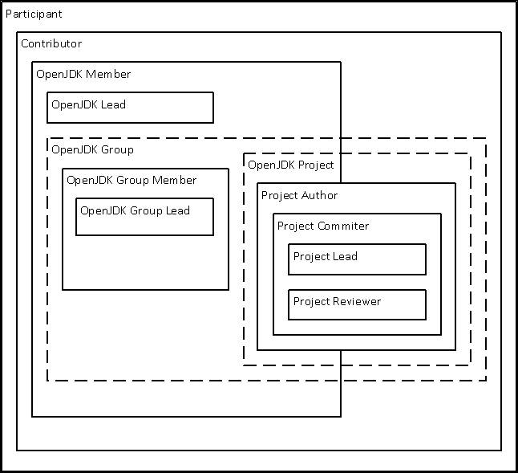
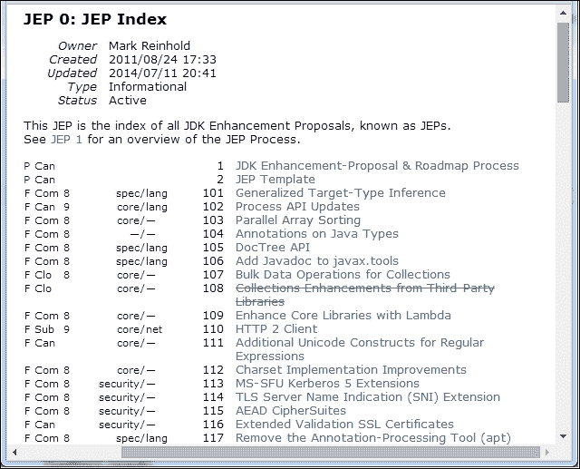
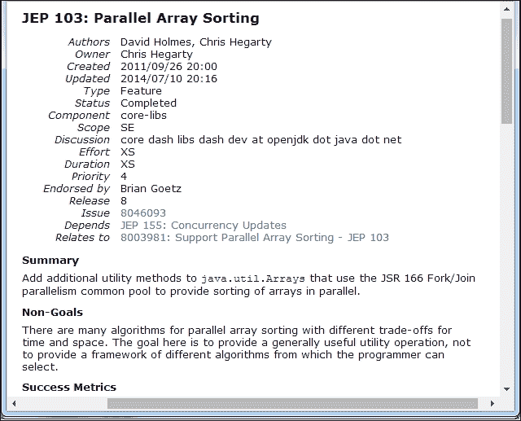

# 第十章。为 OpenJDK 贡献

在本章中，我们将涵盖以下主题：

+   成为贡献者

+   使用 webrev 生成补丁

+   将 OpenJDK v9 补丁回滚到 OpenJDK v8

+   理解 OpenJDK 小组

+   理解 OpenJDK 项目

+   提出新 JSR

+   提出新 JEP

# 简介

OpenJDK 社区由许多人在项目中扮演不同角色和承担不同责任的人组成。这种结构是项目规模和重要性的结果，否则它将无法控制，也无法进一步发展。OpenJDK 的管理和结构可以用两个层次来描述：一个是功能性的，另一个是治理性的。这两个层次相互交叉，但交叉不多。唯一在两者中都存在的角色是**JDK 领导者**，这是 Oracle 指派的 OpenJDK 成员，负责管理 Java 发布项目。

功能性层次控制变更和开发过程。它定义了所有参与在 OpenJDK 中提出和实施变更的社区成员之间的关系。总的来说，它可以由以下图中所示的结构表示：



参与者可以是任何参与过 OpenJDK 项目的任何人，这可以是任何类型的参与。例如，它可以是邮件列表上的讨论或创建补丁来修复错误。任何参与者都可以签署**Oracle 贡献者协议**（**OCA**），成为贡献者。

贡献者可以参与任何 OpenJDK 项目，如果项目领导批准，可以成为**项目作者**。项目作者不能将代码推送到仓库，而必须请求项目提交者之一来做。在作者获得提交者的信任后，他或她可以被选为其中之一。所有代码更改都必须在进入仓库前获得批准。这项任务由经验丰富的提交者（项目审查员）完成，他们拥有很大的权限。有些项目可能没有项目审查员的角色。

此外，贡献者可以成为 OpenJDK 成员并参与 OpenJDK 小组。要成为 OpenJDK 成员，贡献者需要证明有显著的贡献历史，并且应由现有的 OpenJDK 成员投票选举。成为成员后，可以通过加入一个或多个小组成为 OpenJDK 小组成员。小组成员由现有小组成员提名，因此，要加入一个小组，成员必须对该小组有一些贡献历史。值得一提的是，成员资格的顺序可以颠倒——贡献者可以被选为小组成员，这可以成为成为 OpenJDK 成员的途径。

每个 OpenJDK 小组负责 JDK 的领域。例如，有一个*Swing 小组*、*安全小组*等等。每个小组都有一个小组负责人和小组成员。一个小组可以赞助项目，例如，如前所述，Swing 小组是*OpenJFX*和*Swing 应用程序框架*等项目的赞助商。正如我们之前提到的，任何贡献者都可以参与赞助项目。贡献者不需要是 Open JDK 成员或小组成员才能这样做。

管理结构由*管理委员会*表示，该委员会由几个角色组成，如下所示：

+   **主席**：这个角色由 Oracle 任命。这个人是管理委员会的负责人。

+   **副主席**：这个角色由 IBM 任命

+   **OpenJDK 负责人**：这个角色由 Oracle 任命。这个人还领导 Java 发布项目。

+   **两名非正式成员**：这两名成员是通过 OpenJDK 成员的投票选择的。

管理委员会的职责是定义新的流程或改进现有的流程，并更新和支持章程。管理委员会有权在社区内解决程序性争议，但它不是一个执行机构。这意味着它对技术或发布决策没有直接权威。有趣的是，管理委员会和 OpenJDK 小组也可以赞助项目。

对于那些对 OpenJDK 角色、组、项目及其关系的层次结构细节感兴趣的人来说，查看*章程*([`openjdk.java.net/bylaws`](http://openjdk.java.net/bylaws))是值得的，它详细涵盖了所有这些内容。

# 成为贡献者

成为参与者非常容易。唯一需要的是对 OpenJDK 感兴趣，并且至少参与邮件列表上的讨论。参与者可以向 OpenJDK 成员请求将代码添加到代码库中，但他们自己不能这样做。然而，贡献者有一个更复杂的角色，这些人可以提交补丁，并对项目有更大的影响力。

## 准备工作

准备遵循这个食谱很容易；所需的一切只是一个成为参与者的愿望。重要的是要理解这不是一个快速的过程，可能需要几周甚至几个月。所以，要有耐心，不要放弃。

准备补丁需要运行 Kron shell 脚本，因此需要安装该 shell。如果使用 Windows 机器，则系统需要 Cygwin。

## 如何操作...

下一步将描述如何成为 OpenJDK 的参与者。请记住，这不是一个确定性的过程，在实践中，可能需要几个额外的步骤，或者以下步骤中的一些可能不需要：

1.  第一步是让其他 OpenJDK 社区成员看到你。这可以通过参与邮件列表上的讨论来实现，并且提出一两个小修复并请求 OpenJDK 成员或贡献者提交它们是个好主意。这将表明你对 OpenJDK 感兴趣以及如何为其做出贡献。

1.  然后，通过填写 [`java.net/people/new`](https://java.net/people/new) 上的表格在 [Java.net](http://Java.net) 创建一个账户。这个账户用于 [Java.net](http://Java.net)、OpenJDK 错误跟踪和源代码库。

1.  下一步是签署**Oracle 贡献协议**（**OCA**）。需要从 [`www.oracle.com/technetwork/oca-405177.pdf`](http://www.oracle.com/technetwork/oca-405177.pdf) 下载。在签署之前，仔细阅读并理解协议。幸运的是，它只有一页长。然后，签署并扫描电子邮件发送到 `<oracle-ca_us@oracle.com>`。可能需要几周时间才能收到回复。所以，如果规定的时间已经过去，而你还没有收到回复，那么发送一个提醒是值得的。

1.  一旦你从 Oracle 收到 OCA 的回复，就是时候了解你的贡献将是什么了。可能最简单的事情就是找到一个错误并为它修复。错误可以在 OpenJDK JIRA [`bugs.openjdk.java.net/`](https://bugs.openjdk.java.net/) 上找到。选择一个尚未分配给任何人的错误。务必选择一个不需要接口更改或任何重大开发的错误。

1.  在实际工作之前，最好在适当项目的邮件列表上讨论这个错误和提出的修复方案。建议使用格式，`<bugid>: <bug_description>` 作为主题，例如，`JDK-8042253: StressRedefine 测试超时`。

1.  执行修复。对于在修复范围内所做的任何工作，进行 jtreg 回归测试是个好主意。

1.  使用 `webrev:[user@localhost hotspot]$ ksh ../make/scripts/webrev.ksh` 生成一个用于审查的补丁。确保生成的 `webrev.zip` 文件可供相关社区使用。例如，可以将其放在一个公开访问的文件托管上。常规贡献者更喜欢使用 `cr.openjdk.java.net` 来实现这一目的。有关 webrev 的更多详细信息，请参阅 *使用 webrev 生成补丁* 菜单。

1.  要发布补丁，请使用格式 `RFR <bugid>: <bug_description>` 作为邮件列表的主题。例如，`RFR JDK-8042253 StressRedefine 测试超时`，其中 **RFR** 代表 **请求审查**。提供补丁的描述并提供上一步生成的 `webrev` 文件的链接。

1.  审查总意味着将有一些清理、代码更改、更多测试等等。执行更新，更新 `webrev`，并通知其他成员已进行更改。准备好，因为这个过程可能需要多次迭代。

1.  一旦所有人都同意修复质量良好，发起人会将修复推送到仓库。在这个阶段，你可能会被要求生成一个变更集。请注意，这一步骤可能需要几周时间才能执行。

## 参见

+   关于代码审查过程的更多信息可在[`openjdk.java.net/guide/codeReview.html`](http://openjdk.java.net/guide/codeReview.html)找到。关于整个变更过程的文档也是可用的。值得一看的是[`openjdk.java.net/guide/changePlanning.html`](http://openjdk.java.net/guide/changePlanning.html)。

# 使用 webrev 生成补丁

在软件产品中进行任何更新通常都需要某种形式的审查过程。代码不应提交到仓库，除非有人已经查看过它。在 OpenJDK 中，用于此目的的工具是 webrev，它允许你创建可以与其他社区成员共享的代码审查。

## 准备工作

Webrev 是一个 Korn shell 脚本，这意味着在使用它之前，必须在机器上安装 Korn shell。在 Linux 机器上，运行`yum install ksh`或等效命令。在 Windows 机器上，确保 Cygwin 安装中包含了`ksh`。

除了设置用于创建补丁审查的环境之外，还必须在源代码中进行一些更改。作为一个简单的例子，我们可以修改文件中的某些注释，如以下所述。打开文件`hotspot/src/os/linux/vm/jvm_linux.cpp`并更新头文件或仅添加注释。

## 如何操作...

由于 webdev 是一个 shell 脚本，请先启动你的 shell，然后按照给定的步骤操作。假设当前文件夹是`jdk`源根目录，修改的文件是`hotspot/src/os/linux/vm/jvm_linux.cpp`：

1.  首先，将当前文件夹更改为`hostpot`；这不是严格必要的，但它会使 webrev 脚本的工作量减少：

    ```java
    cd ./hostpot
    ```

1.  运行 webrev 脚本：

    ```java
    [user@localhost hotspot]$ ksh ../make/scripts/webrev.ksh
     SCM detected: mercurial
     No outgoing, perhaps you haven't commited.
     Workspace: /home/user/openjdk/jdk7u/hotspot
     Compare against: http://hg.openjdk.java.net/jdk7u/jdk7u/hotspot
     Output to: /home/user/openjdk/jdk7u_clean/hotspot/webrev
     Output Files:
     src/os/linux/vm/jvm_linux.cpp
     patch cdiffs udiffs sdiffs frames old new
     index.html: grep: /home/user/.hgrc: No such file or directory
    Done.
    Output to: /home/user/openjdk/jdk7u/hotspot/webrev

    ```

    如输出所示，它检测到`jvm_linux.cpp`已更改，并生成了放在`hotspot/webrev`文件夹中的审查文件。

1.  现在，在`hotspot`文件夹中找到`webrev.zip`文件，并将其提供给任何对您刚刚所做的更改感兴趣的人。此文件将具有与`webrev`文件夹相同的内容。

## 它是如何工作的...

正如你已经注意到的，webrev 只是一个 shell 脚本，如果你需要了解它是如何工作的，那么相对容易做到。它所做的只是扫描你的磁盘以查找更改，并将它们与父 Mercurial 森林进行比较。然后，根据比较结果，它生成各种报告和一个补丁文件。最后，所有文件都被打包成一个 ZIP 文件，这使得与其他社区成员或只是想查看更改的人分享变得容易。

## 还有更多...

Webrev 有一些命令选项，如果你输入一个它不理解的命令，就会显示出来。例如，尝试运行这个：

```java
[stas@localhost hotspot]$ ksh ../make/scripts/webrev.ksh ?

```

这将打印出所有可用的命令行选项和环境变量，它们可能会影响脚本的执行。

## 参见

+   更多信息和几个示例可在 [openjdk.java.net](http://openjdk.java.net) 网站上的 [`openjdk.java.net/guide/webrevHelp.html`](http://openjdk.java.net/guide/webrevHelp.html) 找到。

+   整体 OpenJDK 代码审查过程描述在 [`openjdk.java.net/guide/codeReview.html`](http://openjdk.java.net/guide/codeReview.html)

# 将 OpenJDK v9 补丁回滚到 OpenJDK v8

在改进源代码结构的倡议之一（[`bugs.openjdk.java.net/browse/JDK-8051619`](https://bugs.openjdk.java.net/browse/JDK-8051619)）的范围内，OpenJDK v9 中源文件的定位方式发生了重大变化。这意味着如果有人为 OpenJDK v9 制作补丁，并希望这些更改应用于 OpenJDK v8，他/她必须遵循一个特殊的程序。该程序将在更改文件的路径上执行所需的转换。

## 准备工作

我们需要一个可以运行 bash shell 的计算机，即带有 Cygwin 的 Linux 或 Windows 计算机，以及 OpenJDK v9 和 OpenJDK v8 的源代码。

## 如何做到这一点…

按照以下步骤，开发者可以学习如何将 OpenJDK v9 的更改移植到 OpenJDK v8：

1.  有一个特殊的脚本被创建出来，用于帮助将 OpenJDK v9 的补丁移植到 OpenJDK v8。此脚本位于 `common/bin/unshuffle_patch.sh`。使用 `--help` 参数运行此脚本以查看其用法：

    ```java
    [user@localhost jdk9]$ common/bin/unshuffle_patch.sh --help
    Usage: common/bin/unshuffle_patch.sh [-h|--help] [-v|--verbose] <repo> <input_patch> <output_patch>
    where:
    <repo>            is one of: corba, jaxp, jaxws, jdk, langtools, nashorn
     [Note: patches from other repos do not need updating]
    <input_patch>     is the input patch file, that needs shuffling/unshuffling
    <output_patch>    is the updated patch file

    ```

    如果你能看到帮助输出，这意味着脚本可用，应该可以正常工作。

1.  现在，只需在源代码树中进行必要的更改，提交代码，并生成补丁。在我们的例子中，我们将编辑 `Sockets.java` 文件。只需添加一行带有几个注释的新行，如下所示：

    ```java
    [user@localhost jdk9]$ vi ./jdk/src/java.base/share/classes/jdk/net/Sockets.java
    now commit the change:
    [user@localhost jdk9]$ cd jdk
    [user@localhost jdk]$ hg commit

    ```

1.  接下来，获取更改集的修订号：

    ```java
    [user@localhost jdk]$ hg log -l 1
    changeset:    11063:9742f66b011
    tag:          tip
    user:         User <user@user.org>
    date:         Sun Dec 14 21:16:27 2014 +0000
    summary:      test commit

    ```

1.  现在，将我们刚刚创建的更改集导出为扩展 GIT 格式的补丁文件：

    ```java
    [user@localhost jdk]$ hg export -r 11063 --git > 11064.patch

    ```

1.  然后，运行脚本以使补丁与 OpenJDK 8 源代码树兼容：

    ```java
    [user@localhost jdk]$ ../common/bin/unshuffled_patch.sh jdk 11063.patch 11063_updated.patch

    ```

1.  最后，将当前文件夹更改为 `jdk8u` 源根目录中的 `jdk` 目录，将更新的补丁复制到其中并应用：

    ```java
    [user@localhost jdk]$ cp ../../jdk9/jdk9/11063_updated.patch ./
    [user@localhost jdk]$ hg import 11063_updated.patch

    ```

就这样。现在所需做的就是提交更改，然后遵循在 OpenJDK 中进行更改的正常流程。

## 参见

+   要获取更多信息并了解实用工具的变化，建议访问其主页 [`cr.openjdk.java.net/~chegar/docs/portingScript.html`](http://cr.openjdk.java.net/~chegar/docs/portingScript.html)

# 理解 OpenJDK 组

OpenJDK 小组审视 OpenJDK 的广泛领域，并定义支持这些领域所需的项目。例如，编译器小组资助的项目 Coin 为 JDK7 添加了新的语言特性，而 HotSpot 小组资助的项目 Graal 通过一组 API 使 VM 功能可用。小组通常比项目寿命更长，并且不会经常出现和消失。

## 准备工作

所需的只是能够访问互联网的电脑、一个网络浏览器和一些耐心。

## 如何操作…

以下步骤展示了 OpenJDK 中的文档和一些小组的示例。它们还将展示小组是什么，如何管理、创建以及它们做什么：

1.  要熟悉 OpenJDK 中小组的定义，请访问 [`openjdk.java.net/groups/`](http://openjdk.java.net/groups/)。那里有关于支持小组并使它们良好运行所需的各种流程和程序的信息。这些程序包括以下主题：

    +   提议成立一个新的小组。

    +   指定一个贡献者成为小组成员。

    +   指定一个小组成员成为 OpenJDK 成员

    +   指定一个小组负责人

1.  每个小组都有一些公开的网页内容。您可以在左侧的 [`openjdk.java.net/`](http://openjdk.java.net/) 找到这些内容，在 **Groups** 下。通常，小组页面上的内容具有相对标准的结构，并包含介绍、小组支持的规范列表、文档、一些关于如何贡献的指南、查找源代码的地方等信息。此外，还有邮件列表、博客和联系方式的链接。例如，您可以查看 JMX 小组网页 [`openjdk.java.net/groups/jmx/`](http://openjdk.java.net/groups/jmx/)。

1.  我们还建议您查看项目列表，看看它们属于哪些小组。这将有助于了解小组和项目之间的关系。项目列表可以在 [`openjdk.java.net/`](http://openjdk.java.net/) 的左侧 **Groups** 下找到。

## 参考以下内容

值得花些时间去探索 [`openjdk.java.net/`](http://openjdk.java.net/)，看看有什么可用以及哪些小组存在。正如我们之前提到的，小组的创建并不经常发生，自 2007 年以来没有创建新的小组。最后一个是在 2007 年 9 月提出的符合性小组。您可以在邮件列表存档 [`mail.openjdk.java.net/pipermail/announce/2007-September.txt`](http://mail.openjdk.java.net/pipermail/announce/2007-September.txt) 中找到该提案电子邮件。查看该文件中的最后一条消息。

# 理解 OpenJDK 项目

OpenJDK 项目旨在交付某种形式的成果，这可能是一段源代码、文档或其他内容。项目由一个或多个 OpenJDK 小组赞助。根据其性质，项目通常比小组存在的时间更短，并且通常可以涵盖 JEPs 或 JSRs 的实现。

## 如何操作…

这个食谱将带你了解关于 OpenJDK 项目的一些信息来源，并提供了关于它们的一些高层次信息：

1.  与 OpenJDK 小组类似，有一个网页提供了关于项目和它们如何运作的一些定义。这个页面可在[`openjdk.java.net/projects/`](http://openjdk.java.net/projects/)找到。在流程列表中，你会找到以下内容：

    +   成为作者

    +   指派贡献者为作者

    +   指派贡献者或作者成为提交者

    +   指派提交者成为审阅者

    +   提出新项目

1.  与小组非常相似，每个项目在[`openjdk.java.net/`](http://openjdk.java.net/)上也有自己的页面。项目列表及其页面链接可以在网站左侧的**项目**部分找到。项目页面可能不是很信息丰富，但可能包含指向 wiki 的链接，通常包含大量信息。

1.  作为项目创建的一个例子，我们可以看看项目“Sumatra”的提案，该提案可在[`mail.openjdk.java.net/pipermail/announce/2012-September/000135.html`](http://mail.openjdk.java.net/pipermail/announce/2012-September/000135.html)找到。这个帖子还包含了投票结果，因此，创建该项目的决定也是基于这个投票。

## 参见

+   如同往常，建议你花些时间探索[`openjdk.java.net/`](http://openjdk.java.net/)，看看有哪些项目可供选择。

# 提出新 JSR

**Java 规范请求**（**JSR**）是对 Java 语言、APS、JVM 等规范的变更请求。此类变更由**Java 社区进程**（**JCP**）管理，社区中的每个成员都可以注册并参与审查。

这个食谱是按照提交 JSR 的方式来写的，但请记住，JSR 通常不是由单个个人提交的，而是由一群提出提案的专家团队提交的。该团队有一个规范负责人负责提交 JSR。因此，这个食谱更多的是为了让你对整个过程有一个高层次的理解，帮助你了解 JSR 是如何运作的，以及它涉及的内容。要获得更深入的见解，请参阅“参见”部分提供的相关资源。

在以下食谱中，我们可以看到，成为 JSR 的规范负责人不仅是一个技术职位，还涉及到与人们做大量工作，并需要具备一定量的软技能和领导力。领导者必须推动项目前进，并能够处理困难情况。可能会出现某些专家组成员由于某些原因不能再参与的情况，或者存在个性冲突。另一种可能的情况是，JSR 本身面临复杂的问题，并受到其他社区成员的挑战。这些问题必须得到清晰且知识丰富、充满热情的回答，以便人们相信继续前进并将该 JSR 纳入 JDK 是值得的。

## 准备工作

由于这是一个更程序化的食谱，所需的一切仅是一台可以访问互联网的计算机和浏览器。

## 如何去做...

以下步骤从高层次上概述了 JSR 生命周期的各个阶段，从想法开始，到实际实施变更结束：

1.  首先，创建一个 JCP 账户是个不错的选择。这是提交 JSR 提案和参与 JCP 任何部分所必需的。这个过程非常简单。只需访问[`jcp.org/en/home/index`](https://jcp.org/en/home/index)，然后按照注册链接中的步骤操作。

1.  好的想法是探索网站，看看那里已经有什么。所有 JSR 的列表可在[`www.jcp.org/en/jsr/all`](https://www.jcp.org/en/jsr/all)找到。由于整个列表可能包含太多信息，有选项可以按审批流程的阶段([`www.jcp.org/en/jsr/stage`](https://www.jcp.org/en/jsr/stage))、技术([`www.jcp.org/en/jsr/tech`](https://www.jcp.org/en/jsr/tech))、委员会([`www.jcp.org/en/jsr/ec`](https://www.jcp.org/en/jsr/ec))或平台([`www.jcp.org/en/jsr/platform`](https://www.jcp.org/en/jsr/platform))来过滤 JSR。还有一个按投票结果列出的 JSR 列表，你可以在[`www.jcp.org/en/jsr/vote_summary`](https://www.jcp.org/en/jsr/vote_summary)找到每年投票的结果。

1.  如果你的提案是值得做的事情，那么，类似于所有 OpenJDK 变更流程，你需要在相关的邮件列表上描述你的提案。这将确保整个流程合理，并有助于提高材料的质量。作为规范负责人，你需要有追随者，也就是说，一群将参与 JCR 并推动其前进的专家。这样的人可以在邮件列表、相关论坛上找到，或者可以是任何有正确心态并认为你的想法值得去做的人。

1.  要进行实际提交，请填写 **Java 规范请求提案**，该提案可在 [`jcp.org/en/jsr/proposal`](https://jcp.org/en/jsr/proposal) 获取。提交后，JSR 必须经过 **JSR 审批投票**，这将决定初始 JSR 提交是否应该被批准。

1.  在下一阶段，该小组必须开始作为一个团队工作，推进提案，讨论它，并回答来自社区其他成员的问题。定期进行团队电话会议和定期的面对面讨论也可能有益。这个阶段可能是最重要的，因为它形成了 JSR 的精确形状。

1.  所有讨论都必须公开进行，提出 JSR 的专家小组必须公开回答所有提出的问题。这也意味着必须有一个公开可用的所有相关通信的存档。

1.  当收到所有评论和问题的所有回复，并且 JSR 已相应更新后，它就准备好进行最终提交。规范负责人负责完成并提交 **技术兼容性套件**（**TCK**）和 **参考实现**（**RI**）。如果 JSR 针对多个环境，则可能需要为每个平台提交一个 TCK 和 RI。提交必须遵循 JCP 2 流程中 *最终发布* 部分所述的过程，见 [`jcp.org/en/procedures/jcp2#4`](https://jcp.org/en/procedures/jcp2#4)。

1.  在最终成功通过投票后，规范负责人将成为维护负责人，JSR 将进入维护阶段。有关详细信息，请参阅 JCP 2 流程中的 *维护* 部分，见 [`jcp.org/en/procedures/jcp2#5`](https://jcp.org/en/procedures/jcp2#5)。

## 参见

由于整个过程由 JCP 管理，因此您最好查阅 [`jcp.org/en/procedures/jcp2`](https://jcp.org/en/procedures/jcp2) 上的文档，该文档描述了流程的最新版本。在撰写本文时，最新版本为 2.9。

在 JCP 网站 [`jcp.org/en/resources/speclead_life`](https://jcp.org/en/resources/speclead_life) 上，有一篇关于成为规范负责人的好文章，其中包含一些有价值的见解和建议。它涵盖了该角色的几乎所有方面，从 JSR 的提交开始，到建立团队和与人沟通结束。它绝对值得一读。

作为 JSR 流程的一部分，需要提交 **技术兼容性套件**（**TCK**）。这是设计用来确保特定实现符合 JSR 的测试套件。这部分可以被认为是 JSR 申请中最复杂的一部分。实现测试套件的最常见工具是 JT Harness，但也有一些情况下 TCK 可能基于 JUnit 或 TestNG 实现。

下一个 JCP 版本将更新一些当前流程。这次修订由 JSR 358 负责。要了解更多信息，请访问其主页[`java.net/projects/jsr358/pages/Home`](https://java.net/projects/jsr358/pages/Home)和 JRS 页面[`jcp.org/en/jsr/detail?id=358`](https://jcp.org/en/jsr/detail?id=358)。

# 提出新 JEP

JEP 是 JDK Enhancement Proposal 的缩写。它意味着 OpenJDK 中相对较大的变更，需要大量的实施工作，但它并不暗示 Java 规范的变化。JEP 的定义包含在*JEP 1 JDK Enhancement-Proposal & Roadmap Process*中，该文档解释了 JEP 定义的细节、流程以及所需的文档。根据 JEP 1([`openjdk.java.net/jeps/1`](http://openjdk.java.net/jeps/1))的定义，JEP 必须满足以下至少一项标准：

+   需要两周或更长时间的工程努力

+   它对 JDK 或其开发流程和基础设施做出了重大改变

+   受到开发人员或客户的强烈需求

此食谱将涵盖 JEP 的定义、其生命周期以及如何找到有关它们的最新信息。它还将介绍创建 JEP 所需的步骤。这种方法将使您对流程有一个良好的理解，并了解 JEP 是什么。

## 准备中

此食谱不需要任何特殊工具。你只需要这本书，以及最好有一台带有网络浏览器的电脑。

## 如何做...

首先，查看已经提交的 JEP 是一个好主意。要获取 JEP 的完整列表，只需访问[`openjdk.java.net/jeps/`](http://openjdk.java.net/jeps/)。在那里，您可以找到 JEP 的完整列表，包括其状态、名称以及更多相关信息。以下是一个示例：



如您从列表中看到的，JEP 表有多个列，提供了简要概述和一些附加信息。例如，第一列是 JEP 的类型，`P`代表`Process`，`F`代表`Feature`等。如果您点击**JEP**并查看其标题，就不难找出特定值的含义：



假设我们有一些完全新的内容，不在列表中，但肯定需要成为 OpenJDK 的一部分：

1.  下一步是阅读*JEP 1: JDK Enhancement-Proposal & Roadmap Process*，该文档可在[`openjdk.java.net/jeps/1`](http://openjdk.java.net/jeps/1)找到。它涵盖了流程和流程的一些机制。

1.  下一步是进行更多阅读。*JEP 2: JEP 模板* 包含了 JEP 的模板。这个模板必须填写提案的详细信息。这些细节将包括概述、测试、依赖关系等。查看其他 JEP 示例以填写模板是值得的。还有一个样本草案，可在 [`cr.openjdk.java.net/~mr/jep/draft-mcimadamore-inference-01.md`](http://cr.openjdk.java.net/~mr/jep/draft-mcimadamore-inference-01.md) 找到。

1.  在尝试发布 JEP 之前，将提案提交给适当的 OpenJDK 邮件列表进行讨论是个好主意。这将帮助您制作出高质量的提案。

1.  当提案准备提交时，请将其发送到 `<jep-submit@openjdk.java.net>`。在此之后，假设提案质量足够，它将可在存储库 ([`hg.openjdk.java.net/jep/jeps`](http://hg.openjdk.java.net/jep/jeps)) 和本食谱第 1 步中提到的网页上找到。

1.  在此之后，将会有几轮更新和讨论，这最终可能导致 JEP 被批准，其状态变为 `Candidate`。这意味着它被接受并包含在内，并且有很大机会被资助用于下一个版本。值得一提的是，JEP 也可能被拒绝，这意味着它被认为根本不值得实施。

1.  当一个 JEP 转变为 `Funded` 状态时，这意味着小组或区域负责人愿意资助它。这意味着实际的实施现在可以开始，并将被包含在未来的某个版本中。

## 它是如何工作的…

如前所述，详细流程在 *JEP 1: JDK 增强提案 & 路线图流程* 中描述。与所有 OpenJDK 变更一样，此流程需要社区和 OpenJDK 成员的大量参与。

## 另请参阅

+   *JEP 1: JDK 增强提案 & 路线图流程* 在 [`openjdk.java.net/jeps/1`](http://openjdk.java.net/jeps/1)

+   *JEP 2: JEP 模板* 在 [`openjdk.java.net/jeps/2`](http://openjdk.java.net/jeps/2)

+   您可以查看一些关于 JEP 的激动人心的讨论，这些讨论在 [`mail.openjdk.java.net/pipermail/jdk9-dev/2014-May/000781.html`](http://mail.openjdk.java.net/pipermail/jdk9-dev/2014-May/000781.html) 的邮件列表上。

+   在 [`cr.openjdk.java.net/~mr/jep/jep-2.0-02.html`](http://cr.openjdk.java.net/~mr/jep/jep-2.0-02.html) 有一个 JEP 建议对现有流程进行一些更改。当前状态是 *草案*，但最终大多数提案都将应用于当前流程。
