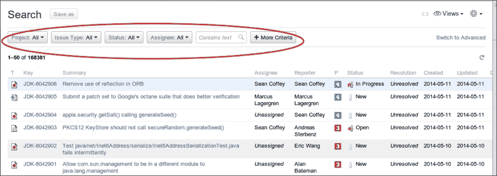
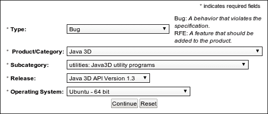
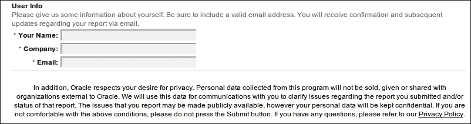
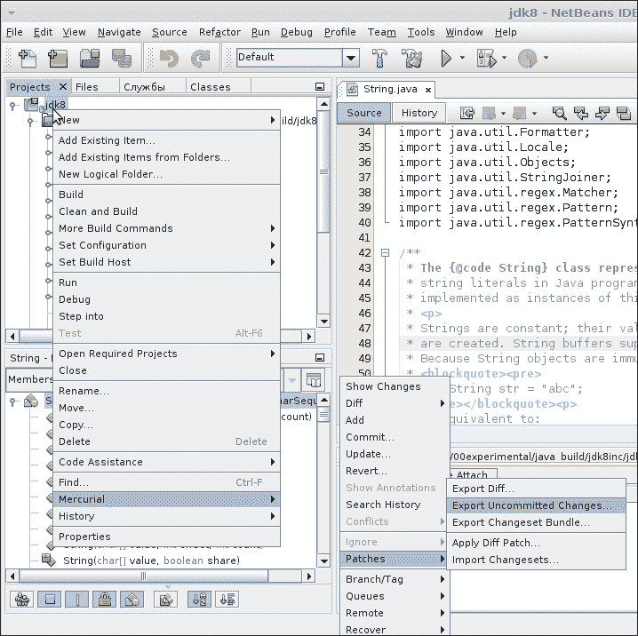
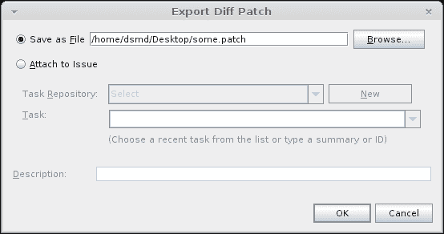
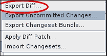
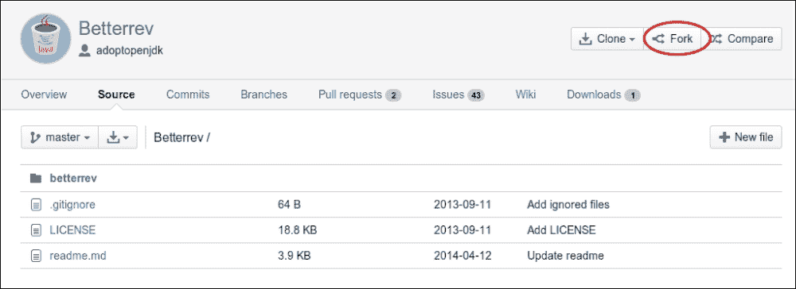
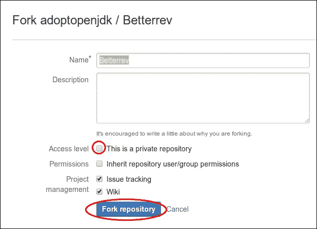
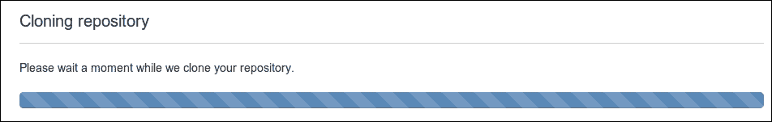
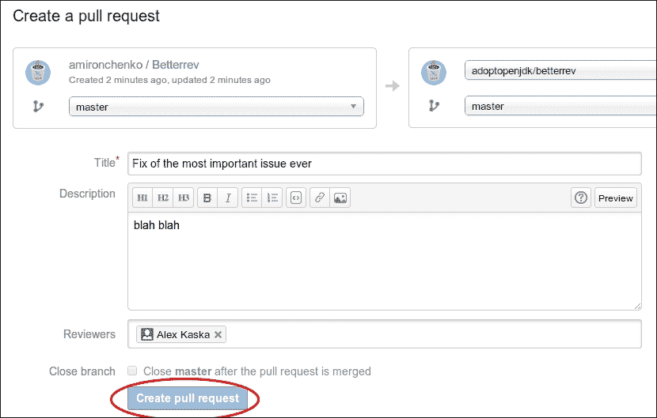

# 第十一章。故障排除

在本章中，我们将涵盖以下主题：

+   在流程工作流程中导航

+   向 OpenJDK 错误系统提交缺陷

+   使用 NetBeans 创建补丁

+   创建代码审查

# 简介

OpenJDK 的开放性是我们快节奏世界中最有价值的特性。我们可以确信，当需要时，它永远不会消失并被遗忘。如果其支持被终止，我们可以自己支持它。由于代码是开放的，我们可以独立修复错误。

然而，OpenJDK 以及 Oracle Java 实现仍然存在许多问题。其中一些是安全问题，应尽快修复。一些问题可能几乎看不见，甚至只对几乎不存在的百分之一的客户有价值。它们可能在生产 JDK 中永远不会被修复，但每个人都有机会尝试自己修复。

过去的 OpenJDK 使用 Bugzilla 错误跟踪器来跟踪错误。Bugzilla 是一个知名但道德上过时的项目，最初由 Terry Weissman 于 1998 年编写。它从一开始就是开源的，现在全世界有成千上万的人在使用它。它非常简单且易于使用。

然而，在一段时间前，OpenJDK 基金会决定从 Bugzilla 切换到 JIRA，这是一个私有但强大的错误跟踪系统，主要用 Java 编写。JIRA 支持不同的工作流程类型，如 Scrum、Kanban 以及自定义敏捷工作流程，同时还包含了所有 Bugzilla 的功能。

有时有机会扩展 OpenJDK 的功能，并创建一个功能齐全的 JSR 原型，以对 OpenJDK 开发做出贡献，这对你的项目有很大好处。有时你需要切换到其他实现，如 GNU 类路径，甚至将一些解决方案合并到你的特定版本中。

在本章中，我们将了解流程工作流程是如何组织的，需要遵循哪些步骤，以及如何应对社区流程。我们还将了解如何提交错误，并在其上创建补丁。

# 在流程工作流程中导航

对于开发者来说，了解流程工作流程以及像 OpenJDK 这样的复杂项目中是如何做事的至关重要。在本食谱中，我们将解释在贡献 OpenJDK 时是如何做事的。我们将解释工作是如何组织的，团队是如何合作的。

## 准备工作

我们需要一个互联网连接和一个浏览器。

## 如何操作...

我们将遍历 OpenJDK 流程工作流程，看看如何为 OpenJDK 做出贡献。在开始工作流程之前，你需要遵循一些初步步骤：

1.  首先，你需要成为一名贡献者。为此，你需要签署一份 Oracle 贡献者协议，并将其电子邮件发送给 Oracle。

    ### 注意

    你可能会发现以下链接很有用：

    如何成为[`openjdk.java.net/contribute/`](http://openjdk.java.net/contribute/)的贡献者

    了解在 [`mail.openjdk.java.net/mailman/listinfo`](http://mail.openjdk.java.net/mailman/listinfo) 上讨论的内容。

1.  然后，你需要找到一些有趣的事情来工作。

1.  现在，你可以自由地使用 JIRA 缺陷跟踪系统讨论和提交补丁。

假设你发现了一个缺陷：

1.  当发现缺陷时，检查它是否已经在 JIRA 中。

1.  点击 **问题** 并搜索问题。你将看到以下屏幕：

1.  在高亮部分，你可以看到一个过滤器面板。结合关键字搜索使用它。注意右下角的 **切换到高级** 链接。

1.  如果缺陷尚未在 JIRA 中存在，请创建一个 JIRA 问题。

    ### 小贴士

    JIRA 是一个常用的缺陷跟踪工具。你可以在 [`confluence.atlassian.com/display/JIRA/`](https://confluence.atlassian.com/display/JIRA/) 找到如何添加问题的方法。

1.  如果你不知道如何解决这个问题，这是你参与的圆满结局。OpenJDK 团队将感激了解有关此问题的所有可用信息。如果你有任何补充，欢迎在评论中发布信息。

1.  然而，如果你觉得你可以解决这个问题，请在评论中说明，并指出你正在努力解决解决方案。在某些情况下，你可能需要等待 JIRA 工单分配给你。个人工作流程在这方面采用不同的方法。

1.  然后，解决解决方案并创建补丁。

    补丁创建过程在本章的 *使用 NetBeans 创建补丁* 菜单中描述。你还可以在 第八章 中找到有关构建、调试和编辑 OpenJDK 代码的一些有用信息，*Hacking OpenJDK*。

1.  如果你是一个提交者（例如，你有提交权限到 OpenJDK 仓库），你可以自由地使用 webrev 创建代码审查（使用 [`bitbucket.org/adoptopenjdk/betterrev`](https://bitbucket.org/adoptopenjdk/betterrev) 中的信息来学习如何创建代码审查）。当它被批准后，你可以将你的更改提交到仓库，并将你的问题标记为已解决。

1.  如果你不是提交者，你也可以创建一个 webrev 审查，但提交过程略有不同。你可能需要将你的代码更改推送到 Bitbucket 仓库，并附带一个 `pull` 请求。这已经在 *创建代码审查* 菜单中详细描述。更多关于 OpenJDK 测试过程的信息，请参阅 第九章，*测试 OpenJDK*。

## 它是如何工作的…

OpenJDK 有一个既定的工作流程，这可能会因项目而异。尽管所有情况下都有团队合作规则，但为了使工作富有成效，每个人都应该遵循这些规则。

在这个过程的底层，还有其他团队成员，他们的职能是审查和测试这些更改。

# 向 OpenJDK 缺陷系统提交缺陷

本指南将向您展示如何向 OpenJDK 错误系统提交缺陷。此错误系统供没有 OpenJDK 开发者访问权限的人使用。对于 OpenJDK 开发者，有 JIRA。

## 如何操作...

我们将考虑提交缺陷到 OpenJDK 的必要步骤。

首先，我们将描述填写错误报告的一些先决条件：

1.  首先，快速搜索错误。可能已经创建了类似甚至相同的错误。即使您对这个主题有更多要说的，也请在现有主题中发表，而不要创建新的主题。

1.  然后，考虑缺陷的可重现性。需要详细描述如何重现您的缺陷以及可以和不可以重现的情况。

1.  此外，您还可以创建并添加日志、跟踪和其他调试信息。

    ### 小贴士

    请包括尽可能完整的日志，不要有删减。日志中的任何字符串都可能至关重要。

1.  此外，您还可以将截图与日志一起包含，尤其是在您描述 UI 问题的时候。

1.  尽可能多地包含系统信息。例如，对于 *Sumatra* 项目，甚至您的显卡驱动程序版本也可能有帮助。

如果我们需要报告一个问题，而不需要引用代码片段来描述它，而是一般性地描述，不具体说明，我们可以填写标准错误报告，如下所示：

1.  按照以下截图所示填写字段：

1.  然后，点击**继续**。

您将需要提供一些信息以获得团队的反馈：

## 它是如何工作的…

OpenJDK 项目有一个非开发者错误报告系统，您可以在其中提交您的更改，方便地提交更改。然而，它有一个 JIRA 错误跟踪器，开发者使用它以更复杂的方式处理各种错误。

# 使用 NetBeans 创建补丁

本节将向您展示如何使用 NetBeans 创建 OpenJDK 项目的补丁。

## 准备工作

您需要一个配置好的开发环境。最好使用 NetBeans，因为 NetBeans 是开发 OpenJDK 和调试的标准工具。

## 如何操作...

我们将通过以下步骤使用 Mercurial 和 NetBeans 进行简单的补丁创建：

1.  使用 NetBeans 打开 OpenJDK 项目。

1.  按照以下截图所示在项目代码中进行一些更改：

1.  然后，按照前面截图所示的上下文菜单链进行操作。

1.  点击**确定**按钮。

1.  您的补丁将保存到指定的目录。稍后，您可以使用 Mercurial 上下文菜单中的 **应用差异补丁** 项应用补丁。

## 它是如何工作的

NetBeans 调用一个程序，该程序将差异（您的未提交更改与存储库中的最新版本）导出到一个文件，可以在需要时读取和应用。

## 另请参阅...

此外，不同分支之间的差异也可以导出。要这样做，只需单击突出显示的项目：

# 创建代码审查

OpenJDK 使用 webrev 作为代码审查工具。创建代码审查和处理过程由 AdoptOpenJDK 社区承担，该社区开发了一个名为 **Betterrev** 的网络工具。也可以使用 Review Board 以及 Mercurial 插件。它自动生成代码审查，与 Oracle 仓库同步，并执行其他有用任务。

## 准备工作

我们需要一个能够构建 OpenJDK 且能够处理大量代码的计算机。此外，我们还需要安装一个开发环境，如第八章中所述的*黑客 OpenJDK*，以及互联网接入。

## 如何操作...

我们将通过遵循给定的步骤使用 Betterrev 工具创建代码审查：

1.  首先，让我们从 Bitbucket 克隆一个仓库。

1.  前往 Betterrev Bitbucket 网址 [`bitbucket.org/adoptopenjdk/betterrev/src`](https://bitbucket.org/adoptopenjdk/betterrev/src)：

1.  使用高亮按钮进行 Fork 操作：

1.  在 **名称** 字段中指定仓库名称，如有需要，添加描述。

1.  如果您想使您的仓库私有，请勾选 **这是一个私有仓库** 复选框。

1.  点击 **Fork 仓库** 按钮。

1.  您将看到以下界面一段时间。这需要一些时间，但请放心，一切都在顺利进行。

1.  对代码中需要审查的更改进行修改。

1.  将它们提交到您的本地仓库。

1.  按照所示进行拉取请求：

Betterrev 将自动为您的问题生成一个审查。
