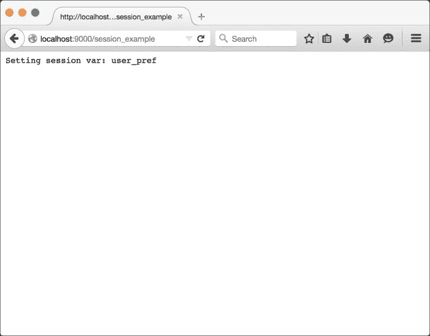
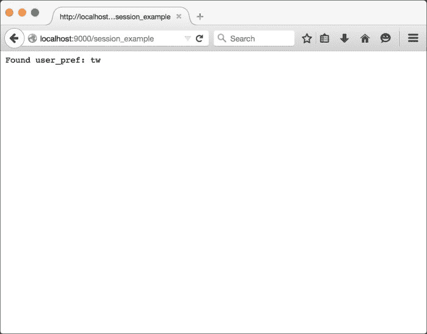

# 第二章 使用控制器

在本章中，我们将介绍以下食谱：

+   使用 HTTP 头

+   使用 HTTP cookies

+   使用会话

+   使用自定义操作

+   使用过滤器

+   使用路径绑定器

+   提供 JSON

+   接收 JSON

+   上传文件

+   使用 futures 和 Akka actors

# 简介

在本章中，我们将更深入地探讨 Play 控制器，并讨论关于 Web 应用程序中控制器的一些高级主题。我们还将了解 Play 如何处理和解决除了数据操作和数据检索等常见用例之外更现代的 Web 应用程序需求。由于我们依赖于控制器来路由 Web 请求和响应，我们希望确保我们的控制器尽可能轻量级和松耦合，以确保页面响应性和可预测的页面加载时间。从模型和其他数据相关处理和服务中提供清晰的分离，也为开发者提供了对每一层职责的更清晰理解。

# 使用 HTTP 头

对于这个食谱，我们将探讨 Play 应用程序如何操作 HTTP 头。我们将使用`curl`工具来验证我们对 HTTP 响应头所做的更改是否正确应用。对于 Windows 用户，建议安装 Cygwin 以在 Windows 机器上获得类似 Unix 的环境（[`www.cygwin.com/`](https://www.cygwin.com/))。

## 如何操作…

对于 Java，我们需要采取以下步骤：

1.  以启用热重载的方式运行`foo_java`应用程序：

    ```java
    <span class="strong"><strong>    activator  "~run"</strong></span>
    ```

1.  通过添加以下操作修改`foo_java/app/controllers/Application.java`：

    ```java
    public static Result modifyHeaders() {
           response().setHeader("ETag", "foo_java");
          return ok("Header Modification Example");
        }
    ```

1.  在`foo_scala/conf/routes`中为新增的操作添加一个新的`routes`条目：

    ```java
    <span class="strong"><strong>  GET   /header_example    controllers.Application.modifyHeaders</strong></span>
    ```

1.  请求我们的新路由并检查响应头以确认我们对 HTTP 响应头的修改：

    ```java
    <span class="strong"><strong>$ curl -v http://localhost:9000/header_example</strong></span>
    <span class="strong"><strong>* Hostname was NOT found in DNS cache</strong></span>
    <span class="strong"><strong>*   Trying ::1...</strong></span>
    <span class="strong"><strong>* Connected to localhost (::1) port 9000 (#0)</strong></span>
    <span class="strong"><strong>&gt; GET /header_example HTTP/1.1</strong></span>
    <span class="strong"><strong>&gt; User-Agent: curl/7.37.1</strong></span>
    <span class="strong"><strong>&gt; Host: localhost:9000</strong></span>
    <span class="strong"><strong>&gt; Accept: */*</strong></span>
    <span class="strong"><strong>&gt;</strong></span>
    <span class="strong"><strong>&lt; HTTP/1.1 200 OK</strong></span>
    <span class="strong"><strong>&lt; Content-Type: text/plain; charset=utf-8</strong></span>
    <span class="strong"><strong>&lt; ETag: foo_java</strong></span>
    <span class="strong"><strong>&lt; Content-Length: 27</strong></span>
    <span class="strong"><strong>&lt;</strong></span>
    <span class="strong"><strong>* Connection #0 to host localhost left intact</strong></span>
    <span class="strong"><strong>Header Modification Example%</strong></span>
    ```

对于 Scala，我们需要采取以下步骤：

1.  以启用热重载的方式运行`foo_scala`应用程序：

    ```java
    <span class="strong"><strong>  activator "~run"</strong></span>
    ```

1.  通过添加以下操作修改`foo_scala/app/controllers/Application.scala`：

    ```java
    def modifyHeaders = Action {
        Ok("Header Modification Example")
          .withHeaders(
            play.api.http.HeaderNames.ETAG -&gt; "foo_scala"
          )
      }
    ```

1.  在`foo_scala/conf/routes`中为新增的操作添加一个新的`routes`条目：

    ```java
    GET   /header_example    controllers.Application.modifyHeaders
    ```

1.  请求我们的新`routes`并检查响应头以确认我们对 HTTP 响应头的修改：

    ```java
    <span class="strong"><strong>$ curl -v http://localhost:9000/header_example</strong></span>
    <span class="strong"><strong>* Hostname was NOT found in DNS cache</strong></span>
    <span class="strong"><strong>*   Trying ::1...</strong></span>
    <span class="strong"><strong>* Connected to localhost (::1) port 9000 (#0)</strong></span>
    <span class="strong"><strong>&gt; GET /header_example HTTP/1.1</strong></span>
    <span class="strong"><strong>&gt; User-Agent: curl/7.37.1</strong></span>
    <span class="strong"><strong>&gt; Host: localhost:9000</strong></span>
    <span class="strong"><strong>&gt; Accept: */*</strong></span>
    <span class="strong"><strong>&gt;</strong></span>
    <span class="strong"><strong>&lt; HTTP/1.1 200 OK</strong></span>
    <span class="strong"><strong>&lt; Content-Type: text/plain; charset=utf-8</strong></span>
    <span class="strong"><strong>&lt; ETag: foo_scala</strong></span>
    <span class="strong"><strong>&lt; Content-Length: 27</strong></span>
    <span class="strong"><strong>&lt;</strong></span>
    <span class="strong"><strong>* Connection #0 to host localhost left intact</strong></span>
    <span class="strong"><strong>Header Modification Example%</strong></span>
    ```

## 它是如何工作的…

在这个食谱中，我们创建了一个新的 URL 路由和操作。在操作内部，我们添加了一个新的 HTTP 头并为其分配了一个任意值。然后我们使用命令行工具`curl`访问这个新操作，以便我们可以查看以纯文本形式显示的响应 HTTP 头。输出应包含我们的自定义头键及其分配的任意值。

# 使用 HTTP cookies

对于这个食谱，我们将探讨 Play 应用程序如何操作 HTTP cookies。我们将使用`curl`工具来验证我们对包含我们添加到响应中的新 cookie 的 HTTP 响应头所做的更改。

## 如何操作…

对于 Java，我们需要采取以下步骤：

1.  以启用热重载的方式运行`foo_java`应用程序。

1.  通过添加以下操作修改`foo_java/app/controllers/Application.scala`：

    ```java
    public static Result modifyCookies() {
            response().setCookie("source", "tw", (60*60));
            return ok("Cookie Modification Example");
         }
    ```

1.  在`foo_java/conf/routes`中为新增的操作添加一个新的路由条目：

    ```java
    GET   /cookie_example    controllers.Application.modifyCookies
    ```

1.  请求我们的新路由并检查响应头以确认我们对 HTTP 响应头的修改：

    ```java
    <span class="strong"><strong>$ curl -v http://localhost:9000/cookie_example</strong></span>
    <span class="strong"><strong>* Hostname was NOT found in DNS cache</strong></span>
    <span class="strong"><strong>*   Trying ::1...</strong></span>
    <span class="strong"><strong>* Connected to localhost (::1) port 9000 (#0)</strong></span>
    <span class="strong"><strong>&gt; GET /cookie_example HTTP/1.1</strong></span>
    <span class="strong"><strong>&gt; User-Agent: curl/7.37.1</strong></span>
    <span class="strong"><strong>&gt; Host: localhost:9000</strong></span>
    <span class="strong"><strong>&gt; Accept: */*</strong></span>
    <span class="strong"><strong>&gt;</strong></span>
    <span class="strong"><strong>&lt; HTTP/1.1 200 OK</strong></span>
    <span class="strong"><strong>&lt; Content-Type: text/plain; charset=utf-8</strong></span>
    <span class="strong"><strong>&lt; Set-Cookie: source=tw; Expires=Sun, 23 Oct 2014 10:22:43 GMT; Path=/</strong></span>
    <span class="strong"><strong>&lt; Content-Length: 27</strong></span>
    <span class="strong"><strong>&lt;</strong></span>
    <span class="strong"><strong>* Connection #0 to host localhost left intact</strong></span>
    <span class="strong"><strong>Cookie Modification Example%</strong></span>
    ```

对于 Scala，我们需要采取以下步骤：

1.  以启用热重载的方式运行`foo_scala`应用程序。

1.  通过添加以下操作修改`foo_scala/app/controllers/Application.scala`：

    ```java
    def modifyCookies = Action {
          val cookie = Cookie("source", "tw", Some(60*60))
          Ok("Cookie Modification Example")
            .withCookies(cookie)
         }
    ```

1.  在`foo_scala/conf/routes`中为新增的操作添加一个新的路由条目：

    ```java
    GET   /cookie_example    controllers.Application.modifyCookies
    ```

1.  请求我们的新路由并检查响应头以确认我们对 HTTP 响应头的修改：

    ```java
    <span class="strong"><strong>$ curl -v http://localhost:9000/cookie_example</strong></span>
    <span class="strong"><strong>* Hostname was NOT found in DNS cache</strong></span>
    <span class="strong"><strong>*   Trying ::1...</strong></span>
    <span class="strong"><strong>* Connected to localhost (::1) port 9000 (#0)</strong></span>
    <span class="strong"><strong>&gt; GET /cookie_example HTTP/1.1</strong></span>
    <span class="strong"><strong>&gt; User-Agent: curl/7.37.1</strong></span>
    <span class="strong"><strong>&gt; Host: localhost:9000</strong></span>
    <span class="strong"><strong>&gt; Accept: */*</strong></span>
    <span class="strong"><strong>&gt;</strong></span>
    <span class="strong"><strong>&lt; HTTP/1.1 200 OK</strong></span>
    <span class="strong"><strong>&lt; Content-Type: text/plain; charset=utf-8</strong></span>
    <span class="strong"><strong>&lt; Set-Cookie: source=tw; Expires=Sun, 23 Oct 2014 09:27:24 GMT; Path=/; HTTPOnly</strong></span>
    <span class="strong"><strong>&lt; Content-Length: 27</strong></span>
    <span class="strong"><strong>&lt;</strong></span>
    <span class="strong"><strong>* Connection #0 to host localhost left intact</strong></span>
    <span class="strong"><strong>Cookie Modification Example%</strong></span>
    ```

## 它是如何工作的…

在这个菜谱中，我们创建了一个新的 URL 路由和操作。在操作中，我们添加了一个名为`source`的新 cookie，并为其分配了一个任意值"`tw`"和一个可选的过期时间（在这个菜谱中，是一个小时）：

```java
val cookie = Cookie("source", "tw", Some(60*60))
```

然后，我们使用命令行工具`curl`访问这个新的操作，以便我们可以查看操作中分配的原始文本 HTTP 响应头。输出应该包含我们分配的 cookie 名称和值的`Set-Cookie`头。

# 使用会话

对于这个菜谱，我们将探讨 Play 应用程序如何处理会话状态。这听起来有些反直觉，因为 Play 声称是一个无状态和轻量级的 Web 框架。然而，由于会话和会话状态已成为 Web 应用程序的主要组件，Play 将会话实现为 cookie，因此实际上存储在客户端或用户浏览器上。

## 如何做到这一点…

对于 Java，我们需要采取以下步骤：

1.  以启用热重载的方式运行`foo_java`应用程序。

1.  通过添加以下操作修改`foo_java/app/controllers/Application.scala`：

    ```java
    public static Result modifySession() {
            final String sessionVar = "user_pref";
            final String userPref = session(sessionVar);
            if (userPref == null) {
            session(sessionVar, "tw");
            return ok("Setting session var: " + sessionVar);
            } else {
            return ok("Found user_pref: " + userPref);
            }
         }
    ```

1.  在`foo_java/conf/routes`中为新增的操作添加一个新的路由条目：

    ```java
    GET   /session_example    controllers.Application.modifySession
    ```

    

1.  使用网络浏览器访问这个新的 URL 路由（`http://localhost:9000/session_example`）。您应该看到文本**设置会话变量：user_pref**：

1.  再次使用相同的网络浏览器访问这个新的 URL 路由，您会看到文本**找到 userPref: tw**。

1.  我们使用`curl`分配了新的会话变量：

    ```java
    <span class="strong"><strong>$ curl -v http://localhost:9000/session_example</strong></span>
    <span class="strong"><strong>* Hostname was NOT found in DNS cache</strong></span>
    <span class="strong"><strong>*   Trying ::1...</strong></span>
    <span class="strong"><strong>* Connected to localhost (::1) port 9000 (#0)</strong></span>
    <span class="strong"><strong>&gt; GET /session_example HTTP/1.1</strong></span>
    <span class="strong"><strong>&gt; User-Agent: curl/7.37.1</strong></span>
    <span class="strong"><strong>&gt; Host: localhost:9000</strong></span>
    <span class="strong"><strong>&gt; Accept: */*</strong></span>
    <span class="strong"><strong>&gt;</strong></span>
    <span class="strong"><strong>&lt; HTTP/1.1 200 OK</strong></span>
    <span class="strong"><strong>&lt; Content-Type: text/plain; charset=utf-8</strong></span>
    <span class="strong"><strong>&lt; Set-Cookie: PLAY_SESSION="cadbcca718bbfcc11af40a2cfe8e4c76716cca1f-user_pref=tw"; Path=/; HTTPOnly</strong></span>
    <span class="strong"><strong>&lt; Content-Length: 30</strong></span>
    <span class="strong"><strong>&lt;</strong></span>
    <span class="strong"><strong>* Connection #0 to host localhost left intact</strong></span>
    <span class="strong"><strong>Setting session var: user_pref%</strong></span>
    ```

对于 Scala，我们需要采取以下步骤：

1.  以启用热重载的方式运行`foo_scala`应用程序。

1.  通过添加以下操作修改`foo_scala/app/controllers/Application.scala`：

    ```java
    def modifySession = Action { request =&gt;
          val sessionVar = "user_pref"
          request.session.get(sessionVar) match {
            case Some(userPref) =&gt; {
              Ok("Found userPref: %s".format(userPref))
            }
            case None =&gt; {
          Ok("Setting session var: %s".format(sessionVar))
                .withSession(
                  sessionVar -&gt; "tw"
            )
            }
          }
         }
    ```

1.  在`foo_scala/conf/routes`中为新增的`Action`添加一个新的路由条目：

    ```java
    GET   /session_example    controllers.Application.modifySession
    ```

1.  使用网络浏览器访问这个新的 URL 路由（`http://localhost:9000/session_example`），您应该看到文本**设置会话变量：user_pref**

1.  再次使用相同的网络浏览器访问这个新的 URL 路由，您会看到文本**找到 userPref: tw**。

1.  您也可以使用`curl`查看我们新的会话变量是如何分配的：

    ```java
    <span class="strong"><strong>$ curl -v http://localhost:9000/session_example</strong></span>
    <span class="strong"><strong>* Hostname was NOT found in DNS cache</strong></span>
    <span class="strong"><strong>*   Trying 127.0.0.1...</strong></span>
    <span class="strong"><strong>* Connected to localhost (127.0.0.1) port 9000 (#0)</strong></span>
    <span class="strong"><strong>&gt; GET /session_example HTTP/1.1</strong></span>
    <span class="strong"><strong>&gt; User-Agent: curl/7.37.1</strong></span>
    <span class="strong"><strong>&gt; Host: localhost:9000</strong></span>
    <span class="strong"><strong>&gt; Accept: */*</strong></span>
    <span class="strong"><strong>&gt;</strong></span>
    <span class="strong"><strong>&lt; HTTP/1.1 200 OK</strong></span>
    <span class="strong"><strong>&lt; Content-Type: text/plain; charset=utf-8</strong></span>
    <span class="strong"><strong>&lt; Set-Cookie: PLAY_SESSION="64c6d2e0894a60dd28101e37b742f71ae332ed13-user_pref=tw"; Path=/; HTTPOnly</strong></span>
    <span class="strong"><strong>&lt; Content-Length: 30</strong></span>
    <span class="strong"><strong>&lt;</strong></span>
    <span class="strong"><strong>* Connection #0 to host localhost left intact</strong></span>
    <span class="strong"><strong>Setting session var: user_pref%</strong></span>
    ```

## 它是如何工作的…

在这个菜谱中，我们创建了一个新的 URL 路由和操作。在操作中，我们添加了一些逻辑来理解会话变量"`user_pref`"是否已经在会话中存在。如果会话变量确实已设置，我们将在响应体中打印出会话变量的值。如果当前会话中没有找到会话变量，它将添加会话变量到会话中并显示文本，通知请求者它没有找到会话变量。我们通过使用网络浏览器并请求相同的 URL 路由两次来验证这一点；首先，设置会话变量，其次，打印会话变量的值。我们还使用`curl`来查看会话变量是如何设置为当前会话的 HTTP cookie 头部的。

# 使用自定义操作

对于这个菜谱，我们将探索 Play Framework 如何提供创建可重用、自定义操作的构建块。

## 如何做到这一点…

对于 Java，我们需要采取以下步骤：

1.  启用 Hot-Reloading 运行`foo_java`应用程序。

1.  通过添加以下操作修改`foo_java/app/controllers/Application.java`：

    ```java
    @With(AuthAction.class)
        public static Result dashboard() {
            return ok("User dashboard");
        }
         public static Result login() {
            return ok("Please login");
        }
    ```

1.  将我们的新操作类添加到`foo_java/app/controllers/AuthAction.java`中：

    ```java
    package controllers;
     import play.*;
    import play.mvc.*;
    import play.libs.*;
    import play.libs.F.*;
     public class AuthAction extends play.mvc.Action.Simple {
        public F.Promise&lt;Result&gt; call(Http.Context ctx) throws Throwable {
            Http.Cookie authCookie = ctx.request().cookie("auth");
             if (authCookie != null) {
              Logger.info("Cookie: " + authCookie);
              return delegate.call(ctx);
             } else {
              Logger.info("Redirecting to login page");
              return Promise.pure(redirect(controllers.routes.
    Application.login()));
            }
        }
    }
    ```

1.  在`foo_java/conf/routes`中为新添加的操作添加新路由：

    ```java
    GET   /dashboard      controllers.Application.dashboard
      GET   /login      controllers.Application.login
    ```

1.  使用网络浏览器访问仪表板 URL 路由，并注意它会重定向您到登录 URL 路由。您还会在我们的控制台中注意到一条日志条目，其中请求即将被重定向到登录页面：

    ```java
    [info] application - Redirecting to login page
    ```

对于 Scala，我们需要采取以下步骤：

1.  启用 Hot-Reloading 运行`foo_scala`应用程序。

1.  通过添加以下操作修改`foo_scala/app/controllers/Application.scala`：

    ```java
    def dashboard = AuthAction {
           Ok("User dashboard")
         }
          def login = Action {
           Ok("Please login")
         }
    ```

1.  还将我们的新操作添加到`foo_scala/app/controllers/Application.scala`中：

    ```java
    object AuthAction extends ActionBuilder[Request] {
      import play.api.mvc.Results._
      import scala.concurrent.Future
       def invokeBlockA =&gt;     Future[Result]) = {
        request.cookies.get("auth") match {
          case Some(authCookie) =&gt; {
            Logger.info("Cookie: " + authCookie)
            block(request)  
          }
          case None =&gt; {
            Logger.info("Redirecting to login page")
            Future.successful(Redirect(routes.Application.login()))
          }
        }
      }
    }
    ```

1.  在`foo_scala/conf/routes`中为新添加的操作添加新路由：

    ```java
    GET   /dashboard      controllers.Application.dashboard
      GET   /login      controllers.Application.login
    ```

1.  使用网络浏览器访问仪表板 URL 路由，并注意它会重定向您到登录 URL 路由。您还会在我们的控制台中注意到一条日志条目，其中请求即将被重定向到登录页面：

    ```java
    [info] application - Redirecting to login page
    ```

## 它是如何工作的…

在这个菜谱中，我们创建了两个新的 URL 路由和操作；一个用于显示用户仪表板，另一个作为我们的登录页面。在仪表板操作中，我们使用了我们的新操作`AuthAction`。`AuthAction`对象检查`auth`cookie 的存在，如果它在请求中找到了该 cookie，它将调用链中的`ActionBuilder`：

```java
// Java
return delegate.call(ctx);
 // Scala
block(request)
```

如果请求中没有找到`auth`cookie，`AuthAction`将重定向当前请求到`login`URL 路由，并用`Future.successful()`包装成一个完成的`Future[Result]`对象：

```java
// Java
return Promise.pure(redirect(controllers.routes.Application.login()));
 // Scala
Future.successful(Redirect(routes.Application.login()))
```

# 使用过滤器

对于这个菜谱，我们将探索 Play Framework 如何提供 HTTP 请求和响应过滤器的 API。HTTP 过滤器提供了一种透明地装饰 HTTP 请求或响应的方法，对于底层服务（如响应压缩）、收集指标和更深入的日志记录非常有用。

### 注意

值得注意的是，目前（截至 Play 2.3.7 版本），HTTP 过滤器最好使用 Play Scala API 中的 *play.api.mvc.EssentialFilter* 特性来实现。因此，对于这个菜谱，我们将为 Java 菜谱实现一个基于 Scala 的过滤器。

## 如何操作...

对于 Java，我们需要采取以下步骤：

1.  启用热重载功能运行 `foo_java` 应用程序。

1.  通过创建文件 `foo_java/app/ResponseTimeLogFilter.scala` 并添加以下内容来创建一个新的过滤器对象：

    ```java
    import play.api.mvc._
       object ResponseTimeLogFilter {
          def apply(): ResponseTimeLogFilter = {
             new ResponseTimeLogFilter()
           }
         }
       class ResponseTimeLogFilter extends Filter {
          import play.api.Logger
          import scala.concurrent.Future
          import play.api.libs.concurrent.Execution.Implicits.defaultContext
            def apply(f: (RequestHeader) =&gt; Future[Result])(rh: RequestHeader): Future[Result] = {
             val startTime = System.currentTimeMillis
             val result = f(rh)
             result.map { result =&gt;
               val currDate = new java.util.Date
               val responseTime = (currDate.getTime() - startTime) / 1000F
                Logger.info(s"${rh.remoteAddress} - [${currDate}] - ${rh.method} ${rh.uri}" +
               s" ${result.header.status} ${responseTime}")
                result
             }
           }
         }
    ```

1.  通过在 `app/Global.java` 文件中声明它来使用这个新的过滤器：

    ```java
    import play.GlobalSettings;
        import play.api.mvc.EssentialFilter;
         public class Global extends GlobalSettings {
          public &lt;T extends EssentialFilter&gt; Class&lt;T&gt;[] filters() {
            return new Class[]{
        ResponseTimeLogFilter.class
         };
          }
        }
    ```

1.  使用网络浏览器访问我们定义的任何之前的 URL 路由（`http://localhost:9000/session_example`）。你将能够看到一个包含我们响应统计的新日志条目：

    ```java
    <span class="strong"><strong>[info] application - 0:0:0:0:0:0:0:1 - [Mon Oct 24 23:58:44 PHT 2014] - GET /session_example 200 0.673</strong></span>
    ```

对于 Scala，我们需要采取以下步骤：

1.  启用热重载功能运行 `foo_scala` 应用程序。

1.  通过创建文件 `foo_scala/app/controllers/ResponseTimeLogFilter.scala` 并添加以下内容来创建一个新的过滤器对象：

    ```java
    import play.api.Logger
      import play.api.mvc._
      import play.api.libs.concurrent.Execution.Implicits.defaultContext
       object ResponseTimeLogFilter extends EssentialFilter {
          def apply(nextFilter: EssentialAction) = new EssentialAction {
            def apply(requestHeader: RequestHeader) = {
              val startTime = System.currentTimeMillis
              nextFilter(requestHeader).map { result =&gt;
                val currDate = new java.util.Date
                val responseTime = (currDate.getTime() - startTime) / 1000F
                 Logger.info(s"${requestHeader.remoteAddress} - [${currDate}] - ${requestHeader.method} ${requestHeader.uri}" +
                s" ${result.header.status} ${responseTime}")
                 result
              }
            }
          }
        }
    ```

1.  通过在 `app/Global.scala` 文件中声明它来使用这个新的过滤器：

    ```java
    import play.api._
        import play.api.mvc._
        import controllers.ResponseTimeLogFilter
         object Global extends WithFilters(ResponseTimeLogFilter) {
          override def onStart(app: Application) {
         Logger.info("Application has started")
          }
          override def onStop(app: Application) {
            Logger.info("Application shutdown...")
          }
        }
    ```

1.  使用网络浏览器访问我们定义的任何之前的 URL 路由（`http://localhost:9000/session_example`）。你将能够看到一个包含我们响应统计的新日志条目：

    ```java
    <span class="strong"><strong>[info] application - 0:0:0:0:0:0:0:1 - [Mon Oct 24 23:58:44 PHT 2014] - GET /session_example 200 0.673</strong></span>
    ```

## 它是如何工作的...

在这个菜谱中，我们创建了一个新的基于 Scala 的过滤器。该过滤器简单地计算请求的总响应时间并在日志文件中打印出来。然后，我们通过在全局应用程序配置类 `Global.java/Global.scala` 中引用它来使用过滤器。这将应用于 Play 应用程序的所有请求。

# 使用路径绑定

对于这个菜谱，我们将探讨 Play 应用程序如何允许我们使用自定义绑定器来处理路径参数。当您想通过在路由文件中处理模型类和方法签名而不是单独的属性和字段来简化路由和相应操作的声明时，这些绑定器非常有用。

## 如何操作...

对于 Java，我们需要采取以下步骤：

1.  启用热重载功能运行 `foo_java` 应用程序。

1.  创建一个新的产品控制器作为 `foo_java/app/controllers/Products.scala`。一旦创建，添加产品 case 类和伴随对象、产品表单对象以及两个路由（第一个用于在表单中显示所选产品，第二个作为表单更新提交的 PUT 操作）：

    ```java
    package controllers;
     import play.*;
    import play.mvc.*;
    import play.data.*;
    import views.html.*;
    import models.*;
     public class Products extends Controller {
      private static Form&lt;Product&gt; productForm = Form.form(Product.class);
       public static Result edit(Product product) {
        return ok(views.html.products.form.render(product.sku, productForm.fill(product)));
      }
       public static Result update(String sku) {
        return ok("Received update request");
      }
    }
    ```

1.  在 `foo_java/app/models/Product.java` 中添加我们的新产品模型：

    ```java
    package models;
     import play.mvc.*;
     public class Product implements PathBindable&lt;Product&gt; {
      public String sku;
      public String title;
       private static final java.util.Map&lt;String, String&gt; productMap = new java.util.HashMap&lt;String, String&gt;();
      static {
        productMap.put("ABC", "8-Port Switch");
        productMap.put("DEF", "16-Port Switch");
        productMap.put("GHI", "24-Port Switch");
      }
         public static void add(Product product) {
          productMap.put(product.sku, product.title);
        }  
         public static java.util.List&lt;Product&gt; getProducts() {
          java.util.List&lt;Product&gt; productList = new java.util.ArrayList&lt;Product&gt;();
          for (java.util.Map.Entry&lt;String, String&gt; entry : productMap.entrySet()) {
            Product p = new Product();
            p.sku = entry.getKey();
            p.title = entry.getValue();
            productList.add(p);    
          }
          return productList;
        }
       public Product bind(String key, String value) {
        String product = productMap.get(value);
        if (product != null) {
          Product p = new Product();
          p.sku = value;
          p.title = product;
           return p;
        } else {
          throw new IllegalArgumentException("Product with sku " + value + " not found");
        }
      }
       public String unbind(String key) {
        return sku;
      }
       public String javascriptUnbind() {
        return "function(k,v) {\n" +
            "    return v.sku;" +
            "}";
      }
    }
    ```

1.  在 `foo_java/conf/routes` 中为新增的操作添加新的路由：

    ```java
    GET   /products/:product   controllers.Products.edit(product: models.Product)
      PUT   /products/:sku     controllers.Products.update(sku)
    ```

1.  在 `foo_java/app/views/products/form.scala.html` 中创建产品表单视图模板，内容如下：

    ```java
    @(sku: String, productForm: Form[models.Product])
     @helper.form(action = routes.Products.update(sku)) {
      @helper.inputText(productForm("sku"))
      @helper.inputText(productForm("title"))
       &lt;input type="submit" /&gt;
    }
    ```

1.  访问我们编辑的产品 URL 路由（`http://localhost:9000/products/ABC`）。你应该能够查看我们第一个产品的编辑表单。访问我们的下一个编辑产品 URL 路由（`http://localhost:9000/products/DEF`），你应该能在表单中看到相关产品详情的加载。

1.  访问 URL `http://localhost:9000/products/XYZ`，看看 Play 如何自动生成我们指定的自定义错误消息：

    ```java
    For request 'GET /products/XYZ' [Product with sku XYZ not found]
    ```

对于 Scala，我们需要采取以下步骤：

1.  使用 Hot-Reloading 功能运行`foo_scala`应用程序。

1.  创建一个新的产品控制器作为`foo_scala/app/controllers/Products.scala`。一旦创建，添加一个产品 case 类和伴随对象、产品表单对象以及两个路由（第一个用于在表单中显示所选产品，第二个作为表单更新提交的 PUT 操作）：

    ```java
    package controllers
       import play.api._
      import play.api.data._
      import play.api.data.Forms._
      import play.api.mvc._
       case class Product(sku: String, title: String)
       object Product {
        implicit def pathBinder(implicit stringBinder: PathBindable[String]) = new PathBindable[Product] {
          override def bind(key: String, value: String): Either[String, Product] = {
            for {
              sku &lt;- stringBinder.bind(key, value).right
              product &lt;- productMap.get(sku).toRight("Product not found").right
            } yield product
          }
          override def unbind(key: String, product: Product): String = {
            stringBinder.unbind(key, product.sku)
          }
        }
         def add(product: Product) = productMap += (product.sku -&gt; product)
         val productMap = scala.collection.mutable.Map(
          "ABC" -&gt; Product("ABC", "8-Port Switch"),
          "DEF" -&gt; Product("DEF", "16-Port Switch"),
          "GHI" -&gt; Product("GHI", "24-Port Switch")
        )
      }
       object Products extends Controller {
        val productForm: Form[Product] = Form(
          mapping(
            "sku" -&gt; nonEmptyText,
            "title" -&gt; nonEmptyText
          )(Product.apply)(Product.unapply)
        )
         def edit(product: Product) = Action {
          Ok(views.html.products.form(product.sku, productForm.fill(product)))
        }
         def update(sku: String) = Action {
          Ok("Received update request")
        }
      }
    ```

1.  在`foo_scala/conf/routes`中为新增的操作添加新路由：

    ```java
    GET   /products/:product   controllers.Products.edit(product: controllers.Product)
      PUT   /products/:sku     controllers.Products.update(sku)
    ```

1.  在`foo_scala/app/views/products/form.scala.html`中创建产品表单视图模板，内容如下：

    ```java
    @(sku: String, productForm: Form[controllers.Product])
     @helper.form(action = routes.Products.update(sku)) {
      @helper.inputText(productForm("sku"))
      @helper.inputText(productForm("title"))
       &lt;input type="submit" /&gt;
    }
    ```

1.  访问我们的编辑产品 URL 路由（`http://localhost:9000/products/ABC`），你应该能够查看我们第一个产品的编辑表单。访问我们的下一个编辑产品 URL 路由（`http://localhost:9000/products/DEF`），你应该能在表单中看到相关产品详情的加载。

1.  访问 URL `http://localhost:9000/products/XYZ`，看看 Play 如何自动生成我们指定的自定义错误消息：

    ```java
    For request 'GET /products/XYZ' [Product not found]
    ```

## 它是如何工作的...

在这个菜谱中，我们使用了 Play 的`PathBindable`接口来使用自定义路径绑定器。我们创建了一个新的路由、控制器和模型来表示产品。我们实现了产品的`PathBindable`绑定和解绑方法：

对于 Java，表单绑定相当直接：

```java
// Java 
    private static Form&lt;Product&gt; productForm = Form.form(Product.class);
    public static Result edit(Product product) {
    return ok(views.html.products.form.render(product.sku, productForm.fill(product)));
   }
```

对于 Scala，我们在`PathBindable`类中覆盖了两个方法。在表单绑定过程中，我们首先检索产品标识符`sku`，然后将这个相同的`sku`传递给产品映射以检索对应的产品：

```java
// Scala 
    implicit def pathBinder(implicit stringBinder: PathBindable[String]) = new PathBindable[Product] {
    override def bind(key: String, value: String): Either[String, Product] = {
      for {
        sku &lt;- stringBinder.bind(key, value).right
        product &lt;- productMap.get(sku).toRight("Product not found").right
      } yield product
    }
    override def unbind(key: String, product: Product): String = {
      stringBinder.unbind(key, product.sku)
    }
  }
```

我们定义了一个需要自定义路径绑定的路由：

```java
GET   /products/:product   controllers.Products.edit(product: controllers.Product)
```

你会注意到在定义早期路由时，我们将产品参数映射到了一个产品实例。`PathBindable`类在这里完成了所有工作，将传递的`sku`转换为产品实例。

# 提供 JSON

对于这个菜谱，我们将探索 Play 框架如何让我们轻松地将我们的模型对象转换为 JSON。能够编写以 JSON 数据格式提供数据的 Web 服务，是现代 Web 应用的非常常见需求。Play 提供了一个 JSON 处理库，我们将在本菜谱中使用它。

## 如何做到这一点...

对于 Java，我们需要采取以下步骤：

1.  使用 Hot-Reloading 功能运行`foo_java`应用程序。

1.  在`foo_java/app/controllers/Products.java`中修改产品控制器，通过添加我们的产品列表操作：

    ```java
    public static Result index() {
        return ok(Json.toJson(Product.getProducts()));
      }
    ```

1.  我们需要为 Play 的 JSON 库添加以下导入语句：

    ```java
    import play.libs.Json;
    ```

1.  在`foo_java/conf/routes`中为产品列表操作添加一个新的路由：

    ```java
    GET   /products       controllers.Products.index
    ```

1.  使用`curl`访问我们的产品列表 URL 路由（`http://localhost:9000/products`）：

    ```java
    <span class="strong"><strong>$ curl -v http://localhost:9000/products</strong></span>
    <span class="strong"><strong>* Hostname was NOT found in DNS cache</strong></span>
    <span class="strong"><strong>*   Trying ::1...</strong></span>
    <span class="strong"><strong>* Connected to localhost (::1) port 9000 (#0)</strong></span>
    <span class="strong"><strong>&gt; GET /products HTTP/1.1</strong></span>
    <span class="strong"><strong>&gt; User-Agent: curl/7.37.1</strong></span>
    <span class="strong"><strong>&gt; Host: localhost:9000</strong></span>
    <span class="strong"><strong>&gt; Accept: */*</strong></span>
    <span class="strong"><strong>&gt;</strong></span>
    <span class="strong"><strong>&lt; HTTP/1.1 200 OK</strong></span>
    <span class="strong"><strong>&lt; Content-Type: application/json; charset=utf-8</strong></span>
    <span class="strong"><strong>&lt; Content-Length: 117</strong></span>
    <span class="strong"><strong>&lt;</strong></span>
    <span class="strong"><strong>* Connection #0 to host localhost left intact</strong></span>
    <span class="strong"><strong>[{"sku":"ABC","title":"8-Port Switch"},{"sku":"DEF","title":"16-Port Switch"},{"sku":"GHI","title":"24-Port Switch"}]%</strong></span>
    ```

1.  当我们查看`curl`命令的输出时，你会注意到我们的内容类型被自动设置为相应的内容（`application/json`），并且响应体包含一个 JSON 产品数组。

对于 Scala，我们需要采取以下步骤：

1.  使用 Hot-Reloading 启用运行`foo_scala`应用程序。

1.  通过在`foo_scala/app/controllers/Products.scala`中添加我们的产品列表动作来修改产品控制器：

    ```java
    def index = Action {
        Ok(toJson(Product.productMap.values))
      }
    ```

1.  我们需要添加以下导入语句以使用 Play 的 JSON 库：

    ```java
    import play.api.libs.json._
        import play.api.libs.json.Json._
    ```

1.  我们还需要在我们的产品控制器中添加我们产品模型的写入实现：

    ```java
    implicit val productWrites = new Writes[Product] {
          def writes(product: Product) = Json.obj(
            "sku" -&gt; product.sku,
            "title" -&gt; product.title
          )
        }
    ```

1.  在`foo_scala/conf/routes`中为产品列表动作添加一个新的路由：

    ```java
    GET   /products       controllers.Products.index
    ```

1.  使用`curl`通过我们的产品列表 URL 路由（`http://localhost:9000/products`）进行访问：

    ```java
    <span class="strong"><strong>$ curl -v http://localhost:9000/products</strong></span>
    <span class="strong"><strong>* Hostname was NOT found in DNS cache</strong></span>
    <span class="strong"><strong>*   Trying ::1...</strong></span>
    <span class="strong"><strong>* Connected to localhost (::1) port 9000 (#0)</strong></span>
    <span class="strong"><strong>&gt; GET /products HTTP/1.1</strong></span>
    <span class="strong"><strong>&gt; User-Agent: curl/7.37.1</strong></span>
    <span class="strong"><strong>&gt; Host: localhost:9000</strong></span>
    <span class="strong"><strong>&gt; Accept: */*</strong></span>
    <span class="strong"><strong>&gt;</strong></span>
    <span class="strong"><strong>&lt; HTTP/1.1 200 OK</strong></span>
    <span class="strong"><strong>&lt; Content-Type: application/json; charset=utf-8</strong></span>
    <span class="strong"><strong>&lt; Content-Length: 117</strong></span>
    <span class="strong"><strong>&lt;</strong></span>
    <span class="strong"><strong>* Connection #0 to host localhost left intact</strong></span>
    <span class="strong"><strong>[{"sku":"ABC","title":"8-Port Switch"},{"sku":"DEF","title":"16-Port Switch"},{"sku":"GHI","title":"24-Port Switch"}]%</strong></span>
    ```

1.  当我们查看`curl`命令的输出时，你会注意到我们的内容类型已自动设置为相应值（`application/json`），并且响应体包含了一个 JSON 产品数组。

## 它是如何工作的…

在这个菜谱中，我们修改了我们的产品控制器并添加了一个新的路由，该路由以 JSON 格式返回产品数组。我们在控制器中创建了动作，并在`conf/routes`文件中添加了新的路由条目。然后我们声明了一个隐式的`writes`对象，它告诉 Play 如何以 JSON 格式渲染我们的产品模型：

```java
implicit val productWrites = new Writes[Product] {
      def writes(product: Product) = Json.obj(
        "sku" -&gt; product.sku,
        "title" -&gt; product.title
      )
    }
```

在前面的代码片段中，我们明确声明了渲染 JSON 的 JSON 键标签。

动作然后将检索到的产品转换为 JSON 作为对动作请求的响应：

```java
Ok(toJson(Product.productMap.values))
```

# 接收 JSON

对于这个菜谱，我们将探索 Play 框架如何使我们轻松接收 JSON 对象，并自动将它们转换为模型实例。

## 如何做到这一点…

对于 Java，我们需要采取以下步骤：

1.  使用 Hot-Reloading 启用运行`foo_java`应用程序。

1.  通过在`foo_java/app/controllers/Products.java`中添加我们的产品创建动作来修改产品控制器：

    ```java
    @BodyParser.Of(BodyParser.Json.class)
      public static Result postProduct() {
        JsonNode json = request().body().asJson();
        String sku = json.findPath("sku").textValue();
        String title = json.findPath("title").textValue();
         Product p = new Product();
        p.sku = sku;
        p.title = title;
        Product.add(p);
        return created(Json.toJson(p));
      }
    ```

1.  我们需要添加以下导入语句以使用 Play 的 JSON 库：

    ```java
    import com.fasterxml.jackson.databind.JsonNode;
    ```

1.  在`foo_java/conf/routes`中为产品列表动作添加一个新的路由：

    ```java
    POST   /products       controllers.Products.postProduct
    ```

1.  使用`curl`通过我们的产品创建 URL 路由（`http://localhost:9000/products`）进行访问：

    ```java
    <span class="strong"><strong>$ curl -v -X POST http://localhost:9000/products --header "Content-type: application/json" --data '{"sku":"JKL", "title":"VPN/Router"}'</strong></span>
    <span class="strong"><strong>* Hostname was NOT found in DNS cache</strong></span>
    <span class="strong"><strong>*   Trying ::1...</strong></span>
    <span class="strong"><strong>* Connected to localhost (::1) port 9000 (#0)</strong></span>
    <span class="strong"><strong>&gt; POST /products HTTP/1.1</strong></span>
    <span class="strong"><strong>&gt; User-Agent: curl/7.37.1</strong></span>
    <span class="strong"><strong>&gt; Host: localhost:9000</strong></span>
    <span class="strong"><strong>&gt; Accept: */*</strong></span>
    <span class="strong"><strong>&gt; Content-type: application/json</strong></span>
    <span class="strong"><strong>&gt; Content-Length: 35</strong></span>
    <span class="strong"><strong>&gt;</strong></span>
    <span class="strong"><strong>* upload completely sent off: 35 out of 35 bytes</strong></span>
    <span class="strong"><strong>&lt; HTTP/1.1 201 Created</strong></span>
    <span class="strong"><strong>&lt; Content-Type: application/json; charset=utf-8</strong></span>
    <span class="strong"><strong>&lt; Content-Length: 34</strong></span>
    <span class="strong"><strong>&lt;</strong></span>
    <span class="strong"><strong>* Connection #0 to host localhost left intact</strong></span>
    <span class="strong"><strong>{"sku":"JKL","title":"VPN/Router"}%</strong></span>
    ```

1.  当我们查看`curl`命令的输出时，你会注意到我们的响应体现在包含了我们新添加的产品。

对于 Scala，我们需要采取以下步骤：

1.  使用 Hot-Reloading 启用运行`foo_scala`应用程序。

1.  通过在`foo_scala/app/controllers/Products.scala`中添加我们的产品创建动作来修改产品控制器：

    ```java
    def postProduct = Action(BodyParsers.parse.json) { request =&gt;
        val post = request.body.validate[Product]
        post.fold(
          errors =&gt; {
            BadRequest(Json.obj("status" -&gt;"error", "message" -&gt; JsError.toFlatJson(errors)))
          },
          product =&gt; {
            Product.add(product)
            Ok(toJson(product))
          }
        )
      }
    ```

1.  我们需要添加以下导入语句以使用 Play 的 JSON 库：

    ```java
    import play.api.libs.functional.syntax._
    ```

1.  我们还需要在我们的产品控制器中添加我们产品模型的读取实现：

    ```java
    implicit val productReads: Reads[Product] = (
        (JsPath \ "sku").read[String] and
        (JsPath \ "title").read[String]
      )(Product.apply _)
    ```

1.  在`foo_scala/conf/routes`中为产品列表动作添加一个新的路由：

    ```java
    POST   /products       controllers.Products.postProduct
    ```

1.  使用`curl`通过我们的产品创建 URL 路由（`http://localhost:9000/products`）进行访问：

    ```java
    <span class="strong"><strong>$ curl -v -X POST http://localhost:9000/products --header "Content-type: application/json" --data '{"sku":"JKL", "title":"VPN/Router"}'</strong></span>
    <span class="strong"><strong>* Hostname was NOT found in DNS cache</strong></span>
    <span class="strong"><strong>*   Trying ::1...</strong></span>
    <span class="strong"><strong>* Connected to localhost (::1) port 9000 (#0)</strong></span>
    <span class="strong"><strong>&gt; POST /products HTTP/1.1</strong></span>
    <span class="strong"><strong>&gt; User-Agent: curl/7.37.1</strong></span>
    <span class="strong"><strong>&gt; Host: localhost:9000</strong></span>
    <span class="strong"><strong>&gt; Accept: */*</strong></span>
    <span class="strong"><strong>&gt; Content-type: application/json</strong></span>
    <span class="strong"><strong>&gt; Content-Length: 35</strong></span>
    <span class="strong"><strong>&gt;</strong></span>
    <span class="strong"><strong>* upload completely sent off: 35 out of 35 bytes</strong></span>
    <span class="strong"><strong>&lt; HTTP/1.1 201 Created</strong></span>
    <span class="strong"><strong>&lt; Content-Type: application/json; charset=utf-8</strong></span>
    <span class="strong"><strong>&lt; Content-Length: 34</strong></span>
    <span class="strong"><strong>&lt;</strong></span>
    <span class="strong"><strong>* Connection #0 to host localhost left intact</strong></span>
    <span class="strong"><strong>{"sku":"JKL","title":"VPN/Router"}%</strong></span>
    ```

1.  当我们查看`curl`命令的输出时，你会注意到我们的响应体现在包含了我们新添加的产品。

## 它是如何工作的…

在这个菜谱中，我们探讨了如何使用 Play 通过 JSON `BodyParser` 消费 JSON 对象，并将它们转换为适当的模型对象。对于 Java，我们遍历 JSON 树，检索每个属性值，并将其分配给我们的局部变量：

```java
JsonNode json = request().body().asJson();
    String sku = json.findPath("sku").textValue();
   String title = json.findPath("title").textValue();
```

对于 Scala，这要简单一些，使用 Play 的 JSON `BodyParser`：

```java
val post = request.body.validate[Product]
     post.fold(
      errors =&gt; {
        BadRequest(Json.obj("status" -&gt;"error", "message" -&gt; JsError.toFlatJson(errors)))
      },
      product =&gt; {
        Product.add(product)
        Ok(toJson(product))
      }
    )
```

# 上传文件

对于这个菜谱，我们将学习如何在 Play 应用程序中上传文件。上传文件的能力是网络应用中更为重要的方面之一，我们将在这里看到 Play 如何使文件上传变得简单易处理。

## 如何操作...

对于 Java，我们需要采取以下步骤：

1.  以启用热重载的方式运行 `foo_java` 应用程序。

1.  在 `foo_java/app/views/form.scala.html` 中添加一个新的视图模板，用于文件上传表单，内容如下：

    ```java
    @helper.form(action = routes.Application.handleUpload, 'enctype -&gt; "multipart/form-data") {
        Profile Photo: &lt;input type="file" name="profile"&gt;

        &lt;div&gt;
            &lt;input type="submit"&gt;
        &lt;/div&gt;

    }
    ```

1.  通过添加以下操作修改 `foo_java/app/controllers/Application.java`：

    ```java
    import play.mvc.Http.MultipartFormData;
        import play.mvc.Http.MultipartFormData.FilePart;
        import java.nio.file.*;
        import java.io.*;    public static Result uploadForm() {
            return ok(form.render());
        }
         public static Result handleUpload() {
            MultipartFormData body = request().body().asMultipartFormData();
            FilePart profileImage = body.getFile("profile");
             if (profileImage != null) {
                try {
                    String fileName = profileImage.getFilename();
                    String contentType = profileImage.getContentType();
                    File file = profileImage.getFile();
                     Path path = FileSystems.getDefault().getPath("/tmp/" + fileName);
                    Files.write(path, Files.readAllBytes(file.toPath()));
                    return ok("Image uploaded");
                } catch(Exception e) {
                    return internalServerError(e.getMessage());
                }
            } else {
                flash("error", "Please upload a valid file");
                return redirect(routes.Application.uploadForm());    
            }
        }
    ```

1.  在 `foo_java/conf/routes` 中为新增的操作添加一个新的路由条目：

    ```java
    GET   /upload_form    controllers.Application.uploadForm
      POST   /upload      controllers.Application.handleUpload
    ```

1.  使用网络浏览器访问上传表单 URL 路由（`http://localhost:9000/upload_form`）。现在你将能够在文件系统中选择要上传的文件。

1.  你可以通过查看 `/tmp` 目录来验证文件确实已上传：

    ```java
    <span class="strong"><strong>$ ls /tmp</strong></span>
    <span class="strong"><strong>B82BE492-0BEF-4B2D-9A68-2664FB9C2A97.png</strong></span>
    ```

对于 Scala，我们需要采取以下步骤：

1.  以启用热重载的方式运行 `foo_scala` 应用程序。

1.  在 `foo_scala/app/views/form.scala.html` 中添加一个新的视图模板，用于文件上传表单，内容如下：

    ```java
    @helper.form(action = routes.Application.handleUpload, 'enctype -&gt; "multipart/form-data") {

        Profile photo: &lt;input type="file" name="profile"&gt;

        &lt;div&gt;
            &lt;input type="submit"&gt;
        &lt;/div&gt;

    }
    ```

1.  通过添加以下操作修改 `foo_scala/app/controllers/Application.scala`：

    ```java
    def uploadForm = Action {
        Ok(views.html.form())
      }
       def handleUpload = Action(parse.multipartFormData) { request =&gt;
        import java.io.File
         request.body.file("profile") match {
          case Some(profileImage) =&gt; {
            val filename = profileImage.filename
            val contentType = profileImage.contentType
            profileImage.ref.moveTo(new File(s"/tmp/$filename"))
            Ok("Image uploaded")
          }
          case None =&gt; {
            Redirect(routes.Application.uploadForm).flashing(
              "error" -&gt; "Please upload a valid file")
          }
        }
      }
    ```

1.  在 `foo_scala/conf/routes` 中为新增的操作添加一个新的路由条目：

    ```java
    GET   /upload_form    controllers.Application.uploadForm
      POST   /upload      controllers.Application.handleUpload
    ```

1.  使用网络浏览器访问上传表单 URL 路由（`http://localhost:9000/upload_form`）。现在你将能够在文件系统中选择要上传的文件。

1.  你可以通过查看 `/tmp` 目录来验证文件确实已上传：

    ```java
    <span class="strong"><strong>$ ls /tmp</strong></span>
    <span class="strong"><strong>B82BE492-0BEF-4B2D-9A68-2664FB9C2A97.png</strong></span>
    ```

## 它是如何工作的...

在这个菜谱中，我们创建了两个新的操作和 URL 路由；第一个用于显示我们的上传表单模板，第二个用于处理实际的文件上传操作。我们在 `app/views` 目录中添加了我们的上传视图表单模板 `form.scala.html`。然后我们通过使用 Play 的辅助方法来检索上传的文件，并将其存储在预定义的位置来处理实际的文件上传提交。

# 使用 Akka actors 与 futures

对于这个菜谱，我们将探讨 Play 框架如何允许我们使用 futures 和 Akka actors 创建异步控制器。创建异步控制器为开发者提供了一种触发后台作业和异步执行长时间运行操作的方法，而不会牺牲端点的响应性。将 Akka 加入其中为容错、健壮的数据服务带来了新的维度，这些服务在成熟和复杂的网络应用需求时代成为了开发者工具链中的宝贵工具。

## 如何操作...

对于 Java，我们需要采取以下步骤：

1.  启用热重载功能运行`foo_java`应用程序。

1.  通过添加以下内容修改`foo_java/app/controllers/Application.java`中的应用控制器：

    ```java
    public static Promise&lt;Result&gt; asyncExample() {
          ActorRef fileReaderActor = Akka.system().actorOf(Props.create(FileReaderActor.class));
          FileReaderProtocol words = new FileReaderProtocol("/usr/share/dict/words");
           return Promise.wrap(ask(fileReaderActor, words, 3000)).map(
                new Function&lt;Object, Result&gt;() {
                    public Result apply(Object response) {
                        return ok(response.toString());
                    }
                }
            );
        }
    ```

1.  我们需要添加以下导入语句以包含必要的库，特别是我们将为本菜谱使用的`Akka`库：

    ```java
    import java.util.*;
        import play.libs.Akka;
        import play.libs.F.Function;
        import static play.mvc.Results.*;
        import static akka.pattern.Patterns.ask;
        import play.libs.F.Promise;
        import akka.actor.*;
    ```

1.  我们还需要在`foo_java/app/actors/FileReaderActor.java`中添加我们的 Akka actor，内容如下：

    ```java
    package actors;
         import java.util.*;
        import java.util.concurrent.Callable;
        import java.nio.charset.*;
        import java.nio.file.*;
        import java.io.*;
        import scala.concurrent.ExecutionContext;
        import scala.concurrent.Future;
        import scala.concurrent.Await;
        import scala.concurrent.duration.*;
        import akka.dispatch.*;
        import akka.util.Timeout;
        import akka.actor.*;
        import play.libs.Akka;
         import static akka.dispatch.Futures.future;
         public class FileReaderActor extends UntypedActor {
          public void onReceive(Object message) throws Exception {
            if (message instanceof FileReaderProtocol) {
              final String filename = ((FileReaderProtocol) message).filename;
               Future&lt;String&gt; future = future(new Callable&lt;String&gt;() {
             public String call() {
           try {
             Path path = Paths.get(filename);
              List&lt;String&gt; list = Files.readAllLines(path, StandardCharsets.UTF_8);
             String[] contents = list.toArray(new String[list.size()]);
               return Arrays.toString(contents);
            } catch(Exception e) {
          throw new IllegalStateException(e);
            }
        }
            }, Akka.system().dispatcher());
          akka.pattern.Patterns.pipe(
        future, Akka.system().dispatcher()).to(getSender());
          }
        }
      }
    ```

1.  我们还需要在`foo_java/app/actors/FileReaderProtocol.java`中为`FileReaderActor`创建我们的 actor 协议类，内容如下：

    ```java
    package actors;
         public class FileReaderProtocol implements java.io.Serializable {
          public final String filename;
          public FileReaderProtocol(String filename) { this.filename = filename; }
        }
    ```

1.  在`foo_java/conf/routes`中为异步示例操作添加新路由：

    ```java
    GET   /async_example     controllers.Application.asyncExample
    ```

1.  在`foo_java/conf/application.conf`中添加默认的`Akka`配置：

    ```java
    akka.default-dispatcher.fork-join-executor.pool-size-max = 64
        akka.actor.debug.receive = on
    ```

1.  使用网络浏览器访问异步示例 URL 路由（`http://localhost:9000/async_example`）。你应该在浏览器中看到本地文件`/usr/share/dict/words`的内容。

对于 Scala，我们需要采取以下步骤：

1.  启用热重载功能运行`foo_scala`应用程序。

1.  通过添加以下内容修改`foo_scala/app/controllers/Application.scala`中的应用控制器：

    ```java
    val fileReaderActor = Akka.system.actorOf(Props[FileReaderActor], name = "fileReader")    
          def asyncExample = Action.async {
          implicit val timeout = Timeout(3 seconds)

           (fileReaderActor ? FileReaderProtocol("/usr/share/dict/words")).mapTo[String].map{ words =&gt;
            Ok("Words: \n" + words)
          }
        }
    ```

1.  我们还需要添加以下导入语句以包含必要的库，特别是我们将为本菜谱使用的`Akka`库：

    ```java
    import play.api.libs.concurrent.Akka
        import play.api.Play.current
        import akka.pattern.ask
        import akka.pattern.pipe
        import akka.util.Timeout
        import akka.actor.{Props, Actor, ActorLogging}
        import scala.concurrent.duration._
        import scala.concurrent._
        import play.api.libs.concurrent.Execution.Implicits.defaultContext
    ```

1.  为了方便起见，我们还在应用程序控制器中添加了我们的 Akka actor。

    ```java
    case class FileReaderProtocol(filename: String)
         class FileReaderActor extends Actor with ActorLogging {

           def receive = {
            case FileReaderProtocol(filename) =&gt; {
              val currentSender = sender
              val contents = Future {
                scala.io.Source.fromFile(filename).mkString
              }
              contents pipeTo currentSender
            }
          }
        }
    ```

1.  在`foo_scala/conf/routes`中为异步示例操作添加新路由：

    ```java
    GET   /async_example     controllers.Application.asyncExample
    ```

1.  在`foo_scala/conf/application.conf`中添加默认的`Akka`配置：

    ```java
    akka.default-dispatcher.fork-join-executor.pool-size-max = 64
        akka.actor.debug.receive = on
    ```

1.  使用网络浏览器访问异步示例 URL 路由（`http://localhost:9000/async_example`）。你应该在浏览器中看到本地文件`/usr/share/dict/words`的内容。

## 它是如何工作的...

在本菜谱中，我们修改了应用程序控制器并添加了一个新路由，该路由返回本地文件`/usr/share/dict/words`的内容。我们在控制器中创建了动作，并在`conf/routes`文件中创建了新的路由条目。然后我们创建了将执行读取文件并返回其内容的实际工作的 Akka actor 类和协议类。

对于 Java，我们需要采取以下步骤：

```java
// Java
    Path path = Paths.get(filename);
    List&lt;String&gt; list = Files.readAllLines(path, StandardCharsets.UTF_8);
```

对于 Scala，我们需要采取以下步骤：

```java
// Scala
    val contents = Future {
      scala.io.Source.fromFile(filename).mkString
    }
```

然后我们配置了新的动作以调用`Actor`，并以异步方式返回结果：

```java
// Java
    return Promise.wrap(ask(fileReaderActor, words, 3000)).map(
      new Function&lt;Object, Result&gt;() {
        public Result apply(Object response) {
          return ok(response.toString());
        }
      }
    );
     // Scala
   (fileReaderActor ? FileReaderProtocol("/usr/share/dict/words"))       .mapTo[String].map{ words =&gt;
       Ok("Words: \n" + words)
     }
```

我们还在`conf/application.conf`中添加了默认的`Akka`配置设置：

```java
akka.default-dispatcher.fork-join-executor.pool-size-max =64
    akka.actor.debug.receive = on
```

上述设置允许我们设置默认分发器线程池的最大大小。在本菜谱中，它被设置为 64。有关 Akka 分发器的更多信息，请参阅[`doc.akka.io/docs/akka/snapshot/java/dispatchers.html`](http://doc.akka.io/docs/akka/snapshot/java/dispatchers.html)。
