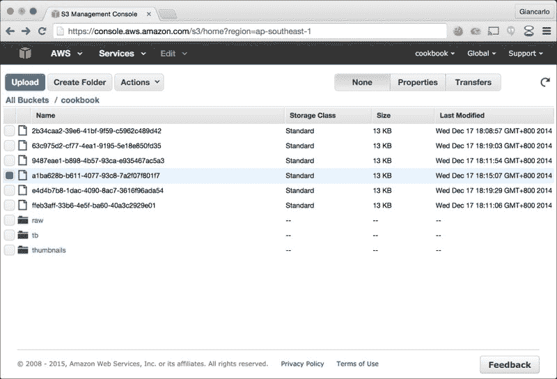
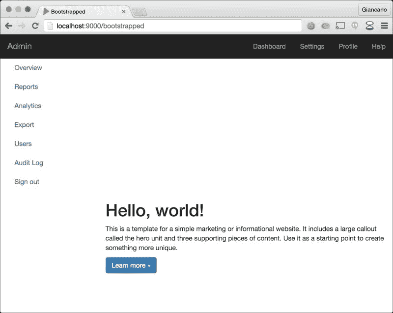
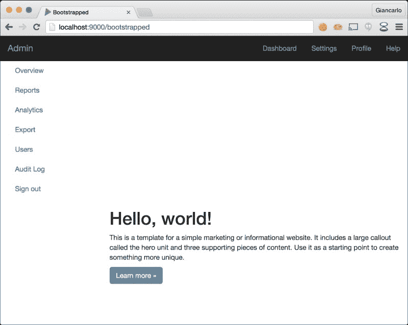

# 第三章：利用模块

在本章中，我们将介绍以下菜谱：

+   使用 Spring 进行依赖注入

+   使用 Guice 进行依赖注入

+   利用 MongoDB

+   利用 MongoDB 和 GridFS

+   利用 Redis

+   将 Play 应用程序与 Amazon S3 集成

+   将 Play 应用程序与 Typesafe Slick 集成

+   利用 play-mailer

+   集成 Bootstrap 和 WebJars

# 简介

在本章中，我们将探讨如何利用 Play 和其他第三方模块来处理现代 Web 应用程序的常见功能。随着 Web 应用程序和 Web 应用程序框架的成熟和演变，作为核心 Web 应用程序框架一部分的模块化和可扩展系统变得越来越重要。这可以通过 Play Framework 2.0 轻松实现。

# 使用 Spring 进行依赖注入

对于这个菜谱，我们将探讨如何将流行的 Spring 框架与 Play 应用程序集成。我们将使用 Spring 通过 Play 控制器和服务类进行 bean 实例化和注入。

## 如何做到这一点…

对于 Java，我们需要采取以下步骤：

1.  启用热重载运行`foo_java`应用程序：

    ```java
    <span class="strong"><strong>    activator "~run"</strong></span>
    ```

1.  在`build.sbt`中将 Spring 声明为项目依赖项：

    ```java
    "org.springframework" % "spring-context" % "3.2.2.RELEASE",
        "org.springframework" % "spring-aop" % "3.2.2.RELEASE",
        "org.springframework" % "spring-expression" % "3.2.2.RELEASE"
    ```

1.  在`foo_java/app/controllers/AdminController.java`中创建一个新的管理控制器，代码如下：

    ```java
    package controllers;
         import play.*;
        import play.mvc.*;
        import org.springframework.beans.factory.annotation.Autowired;
        import services.AdminService;
         @org.springframework.stereotype.Controller
        public class AdminController {
           @Autowired
          private AdminService adminService;
           public Result index() {
            return play.mvc.Controller.ok("This is an admin-only resource: " + adminService.getFoo());
          }
        }
    ```

1.  在`foo_java/app/services/AdminServices.java`中创建一个管理服务接口类，并在`foo_java/app/services/AdminServicesImpl.java`中创建一个模拟管理服务实现类，内容如下：

    ```java
    // AdminService.java
        package services;
         public interface AdminService {
          String getFoo();
        }
         // AdminServiceImpl.java
        package services;
         import org.springframework.stereotype.Service;
         @Service
        public class AdminServiceImpl implements AdminService {
          @Override
          public String getFoo() {
            return "foo";
          }
        }
    ```

1.  在`foo_java/conf/routes`中为新增的操作添加一个新的路由条目：

    ```java
    GET     /admins     @controllers.AdminController.index
    ```

1.  在`foo_java/app/Global.java`文件中添加一个`Global`设置类，内容如下：

    ```java
    import org.springframework.context.ApplicationContext;
        import org.springframework.context.annotation.AnnotationConfigApplicationContext;
        import play.Application;
        import play.GlobalSettings;
           public class Global extends GlobalSettings {
          private ApplicationContext ctx;
           @Override
          public void onStart(Application app) {
            ctx = new AnnotationConfigApplicationContext(SpringConfig.class);
          }
           @Override
          public &lt;A&gt; A getControllerInstance(Class&lt;A&gt; clazz) {
            return ctx.getBean(clazz);
          }
        }
    ```

1.  在`foo_java/app/SpringConfig.java`中添加 Spring 配置类，内容如下：

    ```java
    import org.springframework.context.annotation.ComponentScan;
        import org.springframework.context.annotation.Configuration;
         @Configuration
        @ComponentScan({"controllers", "services"})
        public class SpringConfig {
        }
    ```

1.  请求我们的新路由并检查响应体以确认：

    ```java
    <span class="strong"><strong>    $ curl -v http://localhost:9000/admins</strong></span>
    <span class="strong"><strong>    * Hostname was NOT found in DNS cache</strong></span>
    <span class="strong"><strong>    *   Trying ::1...</strong></span>
    <span class="strong"><strong>    * Connected to localhost (::1) port 9000 (#0)</strong></span>
    <span class="strong"><strong>    &gt; GET /admins HTTP/1.1</strong></span>
    <span class="strong"><strong>    &gt; User-Agent: curl/7.37.1</strong></span>
    <span class="strong"><strong>    &gt; Host: localhost:9000</strong></span>
    <span class="strong"><strong>    &gt; Accept: */*</strong></span>
    <span class="strong"><strong>    &gt;</strong></span>
    <span class="strong"><strong>    &lt; HTTP/1.1 200 OK</strong></span>
    <span class="strong"><strong>    &lt; Content-Type: text/plain; charset=utf-8</strong></span>
    <span class="strong"><strong>    &lt; Content-Length: 35</strong></span>
    <span class="strong"><strong>    &lt;</strong></span>
    <span class="strong"><strong>    * Connection #0 to host localhost left intact</strong></span>
    <span class="strong"><strong>    This is an admin-only resource: foo%</strong></span>
    ```

对于 Scala，我们需要采取以下步骤：

1.  启用热重载运行`foo_scala`应用程序：

    ```java
    <span class="strong"><strong>    activator "~run"</strong></span>
    ```

1.  在`build.sbt`中将 Spring 声明为项目依赖项：

    ```java
    "org.springframework" % "spring-context" % "3.2.2.RELEASE"
    ```

1.  在`foo_scala/app/controllers/AdminController.scala`中创建一个新的管理控制器，内容如下：

    ```java
    package controllers
            import play.api.mvc.{Action, Controller}
           import services.AdminService
            class AdminController(implicit adminService: AdminService) extends Controller {
             def index = Action {
               Ok("This is an admin-only resource: %s".format(adminService.foo))
             }
           }
    ```

1.  在`foo_scala/app/services/AdminServices.scala`中创建一个管理服务类，内容如下：

    ```java
    package services
         class AdminService {
          def foo = "foo"
        }
    ```

1.  在`foo_scala/conf/routes`中为新增的操作添加一个新的路由条目：

    ```java
    GET     /admins                    @controllers.AdminController.index
    ```

1.  在`foo_scala/app/Global.scala`中添加一个`Global`设置类，内容如下：

    ```java
    import org.springframework.context.ApplicationContext
        import org.springframework.context.annotation.AnnotationConfigApplicationContext
         object Global extends play.api.GlobalSettings {
           private val ctx: ApplicationContext = new AnnotationConfigApplicationContext(classOf[SpringConfig])
           override def getControllerInstanceA: A = {
            return ctx.getBean(clazz)
          }
        }
    ```

1.  添加 Spring 配置类到`foo_scala/app/SpringConfig.scala`，内容如下：

    ```java
    import org.springframework.context.annotation.Configuration
        import org.springframework.context.annotation.Bean
        import controllers._
        import services._
         @Configuration
        class SpringConfig {
          @Bean
          implicit def adminService: AdminService = new AdminService
           @Bean
          def adminController: AdminController = new AdminController
        }
    ```

1.  请求我们的新路由并检查响应体以确认：

    ```java
    <span class="strong"><strong>    $ curl -v http://0.0.0.0:9000/admins</strong></span>
    <span class="strong"><strong>    * Hostname was NOT found in DNS cache</strong></span>
    <span class="strong"><strong>    *   Trying 0.0.0.0...</strong></span>
    <span class="strong"><strong>    * Connected to 0.0.0.0 (127.0.0.1) port 9000 (#0)</strong></span>
    <span class="strong"><strong>    &gt; GET /admins HTTP/1.1</strong></span>
    <span class="strong"><strong>    &gt; User-Agent: curl/7.37.1</strong></span>
    <span class="strong"><strong>    &gt; Host: 0.0.0.0:9000</strong></span>
    <span class="strong"><strong>    &gt; Accept: */*</strong></span>
    <span class="strong"><strong>    &gt;</strong></span>
    <span class="strong"><strong>    &lt; HTTP/1.1 200 OK</strong></span>
    <span class="strong"><strong>    &lt; Content-Type: text/plain; charset=utf-8</strong></span>
    <span class="strong"><strong>    &lt; Content-Length: 35</strong></span>
    <span class="strong"><strong>    &lt;</strong></span>
    <span class="strong"><strong>    * Connection #0 to host 0.0.0.0 left intact</strong></span>
    <span class="strong"><strong>    This is an admin-only resource: foo%</strong></span>
    ```

## 它是如何工作的…

在这个菜谱中，我们配置了我们的 Play 应用程序，使用 Spring 在我们的控制器和服务类中进行依赖注入。我们在`Global`设置文件中配置了 Spring，并加载了`SpringConfig`类，它将包含我们的 Spring 特定配置。

# 使用 Guice 进行依赖注入

对于这个菜谱，我们将探讨如何将 Google Guice 与 Play 应用程序集成。我们将使用 Guice 进行 Bean 实例化和通过 Play 控制器和服务类进行注入。

## 如何操作...

对于 Java，我们需要采取以下步骤：

1.  启用 Hot-Reloading 运行`foo_java`应用程序：

    ```java
    <span class="strong"><strong>    activator "~run"</strong></span>
    ```

1.  在`build.sbt`中将`guice`模块声明为项目依赖项：

    ```java
    "com.google.inject" % "guice" % "3.0"
    ```

1.  通过修改`Global`设置类的内容来配置 Guice：

    ```java
    import com.google.inject.AbstractModule;
        import com.google.inject.Guice;
        import com.google.inject.Injector;
        import com.google.inject.Singleton;
        import play.GlobalSettings;
        import services.*;
         public class Global extends GlobalSettings {
          private Injector injector = Guice.createInjector(new AbstractModule() {
            @Override
            protected void configure() {
               bind(CategoryService.class).to(
          CategoryServiceImpl.class).in(Singleton.class);
            }
          });
           @Override
          public &lt;T&gt; T getControllerInstance(Class&lt;T&gt; clazz) {
            return injector.getInstance(clazz);
          }
       }
    ```

1.  在`foo_java/app/controllers/CategoryController.java`中创建一个分类控制器，通过添加以下内容：

    ```java
    package controllers;
         import com.google.inject.Inject;
        import play.libs.Json;
        import play.mvc.Controller;
        import play.mvc.Result;
        import services.CategoryService;
         public class CategoryController extends Controller {
          @Inject
          private CategoryService categoryService;
           public Result index() {
            return ok(Json.toJson(categoryService.list()));
          }
        }
    ```

1.  在`foo_java/app/services/CategoryService.java`中创建一个分类服务接口，通过添加以下内容：

    ```java
    package services;
         import java.util.List;
         public interface CategoryService {
          List&lt;String&gt; list();
        }
    ```

1.  在`foo_java/app/services/CategoryServicesImpl.java`中创建一个分类服务实现类，通过添加以下内容：

    ```java
    package services;
         import java.util.Arrays;
        import java.util.List;
         public class CategoryServiceImpl implements CategoryService {
          @Override
          public List&lt;String&gt; list() {
            return Arrays.asList(new String[] {"Manager", "Employee", "Contractor"});
          }
        }
    ```

1.  在`foo_java/conf/routes`中为新增的操作添加一个新的路由条目：

    ```java
    GET  /categories    @controllers.CategoryController.index
    ```

1.  请求我们的新路由并检查响应头以确认我们对 HTTP 响应头的修改：

    ```java
    $ curl -v http://localhost:9000/categories
        * Hostname was NOT found in DNS cache
        *   Trying ::1...
        * Connected to localhost (::1) port 9000 (#0)
        &gt; GET /categories HTTP/1.1
        &gt; User-Agent: curl/7.37.1
        &gt; Host: localhost:9000
        &gt; Accept: */*
        &gt;
        &lt; HTTP/1.1 200 OK
        &lt; Content-Type: application/json; charset=utf-8
        &lt; Content-Length: 35
        &lt;
        * Connection #0 to host localhost left intact
        ["Manager","Employee","Contractor"]%
    ```

对于 Scala，我们需要采取以下步骤：

1.  启用 Hot-Reloading 运行`foo_scala`应用程序：

    ```java
    <span class="strong"><strong>    activator "~run"</strong></span>
    ```

1.  在`build.sbt`中将`securesocial`模块声明为项目依赖项：

    ```java
    "com.google.inject" % "guice" % "3.0"
    ```

1.  通过修改`Global`设置类的内容来配置 Guice：

    ```java
    import com.google.inject.{Guice, AbstractModule}
        import play.api.GlobalSettings
        import services._
         object Global extends GlobalSettings {
          val injector = Guice.createInjector(new AbstractModule {
            protected def configure() {
              bind(classOf[CategoryService]).to(classOf[CategoryServiceImpl])
            }
          })
           override def getControllerInstanceA: A = {
            injector.getInstance(controllerClass)
          }
        }
    ```

1.  在`foo_scala/app/controllers/CategoryController.scala`中创建一个分类控制器，通过添加以下内容：

    ```java
    package controllers
            import play.api.mvc._
           import play.api.libs.json.Json._
           import com.google.inject._
           import services._
            @Singleton
           class CategoryController @Inject()(categoryService: CategoryService) 
          extends Controller {
           def index = Action {
        Ok(toJson(categoryService.list))
          }
           }
    ```

1.  在`foo_scala/app/services/CategoryService.scala`中创建一个分类服务，通过添加以下内容：

    ```java
    package services
         trait CategoryService {
       def list: Seq[String]
        }
         class CategoryServiceImpl extends CategoryService {
       override def list: Seq[String] = Seq("Manager", "Employee", "Contractor")
        }
    ```

1.  在`foo_scala/conf/routes`中为新增的操作添加一个新的路由条目：

    ```java
    GET  /categories    @controllers.CategoryController.index
    ```

1.  请求我们的新路由并检查响应头以确认我们对 HTTP 响应头的修改：

    ```java
    $ curl -v http://localhost:9000/categories
        * Hostname was NOT found in DNS cache
        *   Trying ::1...
        * Connected to localhost (::1) port 9000 (#0)
        &gt; GET /categories HTTP/1.1
        &gt; User-Agent: curl/7.37.1
        &gt; Host: localhost:9000
        &gt; Accept: */*
        &gt;
        &lt; HTTP/1.1 200 OK
        &lt; Content-Type: application/json; charset=utf-8
        &lt; Content-Length: 35
        &lt;
        * Connection #0 to host localhost left intact
        ["Manager","Employee","Contractor"]%
    ```

## 它是如何工作的...

在这个菜谱中，我们配置了我们的 Play 应用程序，使用 Google Guice 在我们的控制器和服务类中实现依赖注入。我们在`Global`设置文件中配置了 Guice，它将包含我们的 Guice 特定配置。

# 利用 MongoDB

对于这个菜谱，我们将探讨如何在 Play 应用程序中利用流行的 NoSQL 库 MongoDB。MongoDB 是最广泛使用的 NoSQL 数据库之一，它无疑已经成为许多现代 Web 应用程序的数据存储的有效选择。我们将使用 Scala 模块，play-plugins-salat，这是一个使用官方 MongoDB Scala 驱动程序 Casbah 的对象关系映射工具。这将是一个仅限 Scala 的菜谱。

有关 Casbah 的更多信息，请参阅[`github.com/mongodb/casbah`](https://github.com/mongodb/casbah)。

## 如何操作...

让我们采取以下步骤：

1.  启用 Hot-Reloading 运行`foo_scala`应用程序：

    ```java
    <span class="strong"><strong>    activator "~run"</strong></span>
    ```

1.  在`build.sbt`中将 play-plugins-salat 声明为项目依赖项：

    ```java
    "se.radley" %% "play-plugins-salat" % "1.5.0"
    ```

1.  在`build.sbt`中添加额外的 salat 和 MongoDB 指令：

    ```java
    import play.PlayImport.PlayKeys._
        import play.twirl.sbt.Import.TwirlKeys
         routesImport += "se.radley.plugin.salat.Binders._"
        TwirlKeys.templateImports += "org.bson.types.ObjectId"
    ```

1.  在`foo_scala/conf/play.plugins`中声明 salat 插件：

    ```java
    500:se.radley.plugin.salat.SalatPlugin
    ```

1.  在`foo_scala/conf/application.conf`中声明 MongoDB 实例信息：

    ```java
    mongodb.default.db = "cookbookdb"
    ```

1.  通过添加以下内容修改`foo_scala/app/controllers/WarehouseController.scala`：

    ```java
    package controllers
         import models._
        import play.api.libs.json._
        import play.api.mvc.{BodyParsers, Action, Controller}
        import se.radley.plugin.salat.Binders.ObjectId
         object WarehouseController extends Controller {
          implicit val objectIdReads = se.radley.plugin.salat.Binders.objectIdReads
          implicit val objectIdWrites = se.radley.plugin.salat.Binders.objectIdWrites
          implicit val warehouseWrites = Json.writes[Warehouse]
          implicit val warehouseReads = Json.reads[Warehouse]
           def index = Action {
            val list = Warehouse.list
            Ok(Json.toJson(list))
          }
           def create = Action(BodyParsers.parse.json) { implicit request =&gt;
            val post = request.body.validate[Warehouse]
            post.fold(
              errors =&gt; {
                BadRequest(Json.obj("status" -&gt;"error", "message" -&gt; JsError.toFlatJson(errors)))
              },
              warehouse =&gt; {
                Warehouse.create(warehouse)
                Created(Json.toJson(warehouse))
              }
            )
          }
        }
    ```

1.  将新添加的操作的新路由添加到 `foo_scala/conf/routes`：

    ```java
    GET     /warehouses  controllers.WarehouseController.index
        POST    /warehouses      controllers.WarehouseController.create
    ```

1.  将仓库模型的集合映射添加到 `foo_scala/app/models/Warehouse.scala`：

    ```java
    package models
         import play.api.Play.current
        import com.mongodb.casbah.commons.MongoDBObject
        import com.novus.salat.dao._
        import se.radley.plugin.salat._
        import se.radley.plugin.salat.Binders._
        import mongoContext._
         case class Warehouse(id: Option[ObjectId] = Some(new ObjectId), name: String, location: String)
         object Warehouse extends ModelCompanion[Warehouse, ObjectId] {
          val dao = new SalatDAOWarehouse, ObjectId) {}
           def list = dao.find(ref = MongoDBObject()).toList
          def create(w: Warehouse) = dao.save(w)
        }
    ```

1.  将 Mongo 上下文添加到 `foo_scala/app/models/mongoContext.scala`：

    ```java
    package models
         import com.novus.salat.dao._
        import com.novus.salat.annotations._
        import com.mongodb.casbah.Imports._
         import play.api.Play
        import play.api.Play.current
         package object mongoContext {
          implicit val context = {
            val context = new Context {
              val name = "global"
              override val typeHintStrategy = StringTypeHintStrategy(when = TypeHintFrequency.WhenNecessary, typeHint = "_t")
            }
            context.registerGlobalKeyOverride(remapThis = "id", toThisInstead = "_id")
            context.registerClassLoader(Play.classloader)
            context
          }
        }
    ```

1.  通过使用 `curl` 访问仓库 post 端点来添加新的仓库记录：

    ```java
    <span class="strong"><strong>    $ curl -v -X POST http://localhost:9000/warehouses --header "Content-type: application/json" --data '{"name":"Warehouse A", "location":"Springfield"}'</strong></span>
    <span class="strong"><strong>    * Hostname was NOT found in DNS cache</strong></span>
    <span class="strong"><strong>    *   Trying ::1...</strong></span>
    <span class="strong"><strong>    * Connected to localhost (::1) port 9000 (#0)</strong></span>
    <span class="strong"><strong>    &gt; POST /warehouses HTTP/1.1</strong></span>
    <span class="strong"><strong>    &gt; User-Agent: curl/7.37.1</strong></span>
    <span class="strong"><strong>    &gt; Host: localhost:9000</strong></span>
    <span class="strong"><strong>    &gt; Accept: */*</strong></span>
    <span class="strong"><strong>    &gt; Content-type: application/json</strong></span>
    <span class="strong"><strong>    &gt; Content-Length: 48</strong></span>
    <span class="strong"><strong>    &gt;</strong></span>
    <span class="strong"><strong>    * upload completely sent off: 48 out of 48 bytes</strong></span>
    <span class="strong"><strong>    &lt; HTTP/1.1 201 Created</strong></span>
    <span class="strong"><strong>    &lt; Content-Type: application/json; charset=utf-8</strong></span>
    <span class="strong"><strong>    &lt; Content-Length: 47</strong></span>
    <span class="strong"><strong>    &lt;</strong></span>
    <span class="strong"><strong>    * Connection #0 to host localhost left intact</strong></span>
    <span class="strong"><strong>    {"name":"Warehouse A","location":"Springfield"}</strong></span>
    ```

1.  通过使用 `curl` 访问仓库索引端点来查看所有仓库记录：

    ```java
    <span class="strong"><strong>    $ curl -v http://localhost:9000/warehouses</strong></span>
    <span class="strong"><strong>    * Hostname was NOT found in DNS cache</strong></span>
    <span class="strong"><strong>    *   Trying ::1...</strong></span>
    <span class="strong"><strong>    * Connected to localhost (::1) port 9000 (#0)</strong></span>
    <span class="strong"><strong>    &gt; GET /warehouses HTTP/1.1</strong></span>
    <span class="strong"><strong>    &gt; User-Agent: curl/7.37.1</strong></span>
    <span class="strong"><strong>    &gt; Host: localhost:9000</strong></span>
    <span class="strong"><strong>    &gt; Accept: */*</strong></span>
    <span class="strong"><strong>    &gt;</strong></span>
    <span class="strong"><strong>    &lt; HTTP/1.1 200 OK</strong></span>
    <span class="strong"><strong>    &lt; Content-Type: application/json; charset=utf-8</strong></span>
    <span class="strong"><strong>    &lt; Content-Length: 241</strong></span>
    <span class="strong"><strong>    &lt;</strong></span>
    <span class="strong"><strong>    * Connection #0 to host localhost left intact</strong></span>
    <span class="strong"><strong>    [{"id":"5490fde9e0820cf6df38584c","name":"Warehouse A","location":"Springfield"}]%</strong></span>
    ```

## 它是如何工作的...

在这个菜谱中，我们创建了一个新的 URL 路由和操作，用于从 MongoDB 实例中插入和检索仓库记录。我们使用了 Play 模块 play-plugins-salat，并在 `foo_scala/conf/application.conf` 中配置了连接。然后我们在仓库模型类中映射了我们的 Mongo 集合：

```java
case class Warehouse(id: Option[ObjectId] = Some(new ObjectId), name: String, location: String)
```

接下来，我们从仓库控制器中调用了适当的仓库伴生对象方法：

```java
val list = Warehouse.list
    Warehouse.create(warehouse)
```

我们还在仓库控制器中声明了我们的 JSON 绑定器，用于仓库模型和 MongoDB 的 `ObjectId`：

```java
implicit val objectIdReads = se.radley.plugin.salat.Binders.objectIdReads
    implicit val objectIdWrites = se.radley.plugin.salat.Binders.objectIdWrites
    implicit val warehouseWrites = Json.writes[Warehouse]
    implicit val warehouseReads = Json.reads[Warehouse]
```

# 利用 MongoDB 和 GridFS

对于这个菜谱，我们将探索如何通过使用 MongoDB 和 GridFS 来存储和交付文件，通过 Play 应用程序。我们将继续添加到之前的菜谱。与之前的菜谱一样，这个菜谱将只使用 Scala。

## 如何操作...

让我们采取以下步骤：

1.  以启用热重载的方式运行 `foo_scala` 应用程序：

    ```java
    <span class="strong"><strong>    activator "~run"</strong></span>
    ```

1.  通过添加以下内容修改 `foo_scala/app/controllers/WarehouseController.scala`：

    ```java
    import java.text.SimpleDateFormat
        import play.api.libs.iteratee.Enumerator
         def upload = Action(parse.multipartFormData) { request =&gt;
            request.body.file("asset") match {
              case Some(asset) =&gt; {
                val gridFs = Warehouse.assets
                val uploadedAsset = gridFs.createFile(asset.ref.file)
                uploadedAsset.filename = asset.filename
                uploadedAsset.save()
                 Ok("Asset is available at http://localhost:9000/warehouses/assets/%s".format(uploadedAsset.id))
              }
              case None =&gt; {
                BadRequest
              }
            }
          }
           def retrieveFile(id: ObjectId) = Action {
            import com.mongodb.casbah.Implicits._
            import play.api.libs.concurrent.Execution.Implicits._
             val gridFs = Warehouse.assets
             gridFs.findOne(Map("_id" -&gt; id)) match {
              case Some(f) =&gt; Result(
                ResponseHeader(OK, Map(
                  CONTENT_LENGTH -&gt; f.length.toString,
                  CONTENT_TYPE -&gt; f.contentType.getOrElse(BINARY),
                  DATE -&gt; new SimpleDateFormat("EEE, dd MMM yyyy HH:mm:ss 'GMT'", java.util.Locale.US).format(f.uploadDate)
                )),
                Enumerator.fromStream(f.inputStream)
              )
               case None =&gt; NotFound
            }
          }
    ```

1.  将新添加的操作的新路由添加到 `foo_scala/conf/routes`：

    ```java
    POST /warehouses/assets/upload controllers.WarehouseController.upload
       GET  /warehouses/assets/:id controllers.WarehouseController.retrieveFile(id: ObjectId)
    ```

1.  修改仓库模型在 `foo_scala/app/models/Warehouse.scala` 中的集合映射：

    ```java
    val assets = gridFS("assets")
         def upload(asset: File) = {
          assets.createFile(asset)
        }
         def retrieve(filename: String) = {
          assets.find(filename)
        }
    ```

1.  通过使用 `curl` 访问仓库上传端点来上传新的仓库资产文件：

    ```java
    <span class="strong"><strong>    $ curl -v http://localhost:9000/warehouses/assets/upload -F "asset=@/tmp/1.jpg"</strong></span>
    <span class="strong"><strong>    * Hostname was NOT found in DNS cache</strong></span>
    <span class="strong"><strong>    *   Trying ::1...</strong></span>
    <span class="strong"><strong>    * Connected to localhost (::1) port 9000 (#0)</strong></span>
    <span class="strong"><strong>    &gt; POST /warehouses/assets/upload HTTP/1.1</strong></span>
    <span class="strong"><strong>    &gt; User-Agent: curl/7.37.1</strong></span>
    <span class="strong"><strong>    &gt; Host: localhost:9000</strong></span>
    <span class="strong"><strong>    &gt; Accept: */*</strong></span>
    <span class="strong"><strong>    &gt; Content-Length: 13583</strong></span>
    <span class="strong"><strong>    &gt; Expect: 100-continue</strong></span>
    <span class="strong"><strong>    &gt; Content-Type: multipart/form-data; boundary=------------------------4a001bdeff39c089</strong></span>
    <span class="strong"><strong>    &gt;</strong></span>
    <span class="strong"><strong>    &lt; HTTP/1.1 100 Continue</strong></span>
    <span class="strong"><strong>    &lt; HTTP/1.1 200 OK</strong></span>
    <span class="strong"><strong>    &lt; Content-Type: text/plain; charset=utf-8</strong></span>
    <span class="strong"><strong>    &lt; Content-Length: 86</strong></span>
    <span class="strong"><strong>    &lt;</strong></span>
    <span class="strong"><strong>    * Connection #0 to host localhost left intact</strong></span>
    <span class="strong"><strong>    Asset is available at http://localhost:9000/warehouses/assets/549121fbe082fc374fa6cb63%</strong></span>
    ```

1.  通过在 Web 浏览器中访问前一步输出的 URL 来验证我们的文件交付 URL 路由是否正常工作：

    ```java
    <code class="literal">http://localhost:9000/warehouses/assets/549121fbe082fc374fa6cb63</code>
    ```

## 它是如何工作的...

在这个菜谱中，我们创建了新的 URL 路由和操作，这些操作将用于在 MongoDB 实例中使用 GridFS 上传和检索仓库资产文件。我们在 `foo_scala/app/models/Warehouse.scala` 中的集合映射文件中添加了 GridFS 引用：

```java
val assets = gridFS("assets")
```

然后我们添加了文件上传和检索的相关方法：

```java
def upload(asset: File) = {
      assets.createFile(asset)
    }
     def retrieve(filename: String) = {
      assets.find(filename)
    }
```

接下来，我们在 `foo_scala/app/controllers/WarehouseController.scala` 中创建了操作，这些操作将处理实际的文件上传和检索请求。

# 利用 Redis

对于这个菜谱，我们将探索 Play 应用程序如何通过 Play 缓存与 Redis 集成。Redis 是一个广泛使用的键值数据库，通常用作现代 Web 应用程序的中介对象缓存。这个菜谱需要一个正在运行的 Redis 实例，我们的 Play 2 Web 应用程序可以与之交互。

## 如何操作...

对于 Java，我们需要采取以下步骤：

1.  以启用热重载的方式运行 `foo_java` 应用程序：

    ```java
    <span class="strong"><strong>    activator "~run"</strong></span>
    ```

1.  在 `build.sbt` 中将 Redis 声明为项目依赖项：

    ```java
    "com.typesafe.play.plugins" %% "play-plugins-redis" % "2.3.1"
    ```

1.  在 `build.sbt` 中声明托管 Sedis 的存储库，它是 play-plugins-redis 的库依赖项：

    ```java
    resolvers += "Sedis repository" at "http://pk11-scratch.googlecode.com/svn/trunk/"
    ```

1.  通过在 `foo_java/conf/play.plugins` 中声明它来启用 play-mailer 插件：

    ```java
    550:com.typesafe.plugin.RedisPlugin
    ```

1.  在 `foo_java/conf/application.conf` 中指定您的 Redis 主机信息：

    ```java
    ehcacheplugin=disabled
        redis.uri="redis://127.0.0.1:6379"
    ```

1.  通过在 `foo_java/app/controllers/Application.java` 中添加以下代码来修改 `foo_java`：

    ```java
    import play.cache.*;

         public static Result displayFromCache() {
             final String key = "myKey";
             String value = (String) Cache.get(key);
              if (value != null &amp;&amp; value.trim().length() &gt; 0) {
               return ok("Retrieved from Cache: " + value);
             } else {
               Cache.set(key, "Let's Play with Redis!");
               return ok("Setting key value in the cache");
             } 
           }
    ```

1.  在 `foo_java/conf/routes` 中为新增的动作添加一个新的路由条目：

    ```java
    GET     /cache  controllers.Application.displayFromCache
    ```

1.  请求我们的新路由并检查响应体以确认我们的 `displayFromCache` 动作是第一次设置键值：

    ```java
    <span class="strong"><strong>    $ curl -v http://localhost:9000/cache</strong></span>
    <span class="strong"><strong>    * Hostname was NOT found in DNS cache</strong></span>
    <span class="strong"><strong>    *   Trying 127.0.0.1...</strong></span>
    <span class="strong"><strong>    * Connected to localhost (127.0.0.1) port 9000 (#0)</strong></span>
    <span class="strong"><strong>    &gt; GET /cache HTTP/1.1</strong></span>
    <span class="strong"><strong>    &gt; User-Agent: curl/7.37.1</strong></span>
    <span class="strong"><strong>    &gt; Host: localhost:9000</strong></span>
    <span class="strong"><strong>    &gt; Accept: */*</strong></span>
    <span class="strong"><strong>    &gt;</strong></span>
    <span class="strong"><strong>    &lt; HTTP/1.1 200 OK</strong></span>
    <span class="strong"><strong>    &lt; Content-Type: text/plain; charset=utf-8</strong></span>
    <span class="strong"><strong>    &lt; Content-Length: 30</strong></span>
    <span class="strong"><strong>    &lt;</strong></span>
    <span class="strong"><strong>    * Connection #0 to host localhost left intact</strong></span>
    <span class="strong"><strong>    Setting key value in the cache%</strong></span>
    ```

1.  再次请求 `/cache` 路由以查看缓存键的值：

    ```java
    <span class="strong"><strong>    $ curl -v http://localhost:9000/cache</strong></span>
    <span class="strong"><strong>    * Hostname was NOT found in DNS cache</strong></span>
    <span class="strong"><strong>    *   Trying 127.0.0.1...</strong></span>
    <span class="strong"><strong>    * Connected to localhost (127.0.0.1) port 9000 (#0)</strong></span>
    <span class="strong"><strong>    &gt; GET /cache HTTP/1.1</strong></span>
    <span class="strong"><strong>    &gt; User-Agent: curl/7.37.1</strong></span>
    <span class="strong"><strong>    &gt; Host: localhost:9000</strong></span>
    <span class="strong"><strong>    &gt; Accept: */*</strong></span>
    <span class="strong"><strong>    &gt;</strong></span>
    <span class="strong"><strong>    &lt; HTTP/1.1 200 OK</strong></span>
    <span class="strong"><strong>    &lt; Content-Type: text/plain; charset=utf-8</strong></span>
    <span class="strong"><strong>    &lt; Content-Length: 43</strong></span>
    <span class="strong"><strong>    &lt;</strong></span>
    <span class="strong"><strong>    * Connection #0 to host localhost left intact</strong></span>
    <span class="strong"><strong>    Retrieved from Cache: Let's Play with Redis!%</strong></span>
    ```

对于 Scala，我们需要采取以下步骤：

1.  启用 Hot-Reloading 运行 `foo_scala` 应用程序：

    ```java
    <span class="strong"><strong>    activator "~run"</strong></span>
    ```

1.  在 `build.sbt` 中声明 Redis 为项目依赖项：

    ```java
    "com.typesafe.play.plugins" %% "play-plugins-redis" % "2.3.1"
    ```

1.  在 `build.sbt` 中声明托管 Sedis 的仓库，它是 play-plugins-redis 的库依赖项：

    ```java
    resolvers += "Sedis repository" at "http://pk11-scratch.googlecode.com/svn/trunk/"
    ```

1.  通过在 `foo_scala/conf/play.plugins` 中声明启用 play-mailer 插件：

    ```java
    550:com.typesafe.plugin.RedisPlugin
    ```

1.  在 `foo_scala/conf/application.conf` 中指定您的 Redis 主机信息：

    ```java
    ehcacheplugin=disabled
        redis.uri="redis://127.0.0.1:6379"
    ```

1.  通过在 `foo_scala/app/controllers/Application.scala` 中添加以下代码来修改 `foo_scala`：

    ```java
    import scala.util.Random
           import play.api.cache._
           import play.api.Play.current
         def displayFromCache = Action {
             val key = "myKey"
             Cache.getAsString match {
               case Some(myKey) =&gt; {
                 Ok("Retrieved from Cache: %s".format(myKey))
               }
               case None =&gt; {
                 Cache.set(key, "Let's Play with Redis!")
                 Ok("Setting key value in the cache")
               }
             }
           }
    ```

1.  在 `foo_scala/conf/routes` 中为新增的 `action` 添加一个新的路由条目：

    ```java
    GET     /cache  controllers.Application.displayFromCache
    ```

1.  请求我们的新路由并检查响应体以确认我们的 `displayFromCache` 动作是第一次设置键值：

    ```java
    <span class="strong"><strong>    $ curl -v http://localhost:9000/cache</strong></span>
    <span class="strong"><strong>    * Hostname was NOT found in DNS cache</strong></span>
    <span class="strong"><strong>    *   Trying ::1...</strong></span>
    <span class="strong"><strong>    * Connected to localhost (::1) port 9000 (#0)</strong></span>
    <span class="strong"><strong>    &gt; GET /cache HTTP/1.1</strong></span>
    <span class="strong"><strong>    &gt; User-Agent: curl/7.37.1</strong></span>
    <span class="strong"><strong>    &gt; Host: localhost:9000</strong></span>
    <span class="strong"><strong>    &gt; Accept: */*</strong></span>
    <span class="strong"><strong>    &gt;</strong></span>
    <span class="strong"><strong>    &lt; HTTP/1.1 200 OK</strong></span>
    <span class="strong"><strong>    &lt; Content-Type: text/plain; charset=utf-8</strong></span>
    <span class="strong"><strong>    &lt; Content-Length: 30</strong></span>
    <span class="strong"><strong>    &lt;</strong></span>
    <span class="strong"><strong>    * Connection #0 to host localhost left intact</strong></span>
    <span class="strong"><strong>    Setting key value in the cache%</strong></span>
    ```

1.  再次请求 `/cache` 路由以查看缓存键的值：

    ```java
    <span class="strong"><strong>    $ curl -v http://localhost:9000/cache</strong></span>
    <span class="strong"><strong>    * Hostname was NOT found in DNS cache</strong></span>
    <span class="strong"><strong>    *   Trying 127.0.0.1...</strong></span>
    <span class="strong"><strong>    * Connected to localhost (127.0.0.1) port 9000 (#0)</strong></span>
    <span class="strong"><strong>    &gt; GET /cache HTTP/1.1</strong></span>
    <span class="strong"><strong>    &gt; User-Agent: curl/7.37.1</strong></span>
    <span class="strong"><strong>    &gt; Host: localhost:9000</strong></span>
    <span class="strong"><strong>    &gt; Accept: */*</strong></span>
    <span class="strong"><strong>    &gt;</strong></span>
    <span class="strong"><strong>    &lt; HTTP/1.1 200 OK</strong></span>
    <span class="strong"><strong>    &lt; Content-Type: text/plain; charset=utf-8</strong></span>
    <span class="strong"><strong>    &lt; Content-Length: 43</strong></span>
    <span class="strong"><strong>    &lt;</strong></span>
    <span class="strong"><strong>    * Connection #0 to host localhost left intact</strong></span>
    <span class="strong"><strong>    Retrieved from Cache: Let's Play with Redis!%</strong></span>
    ```

## 它是如何工作的…

在这个菜谱中，我们创建了一个新的 URL 路由和动作，它将与我们 Redis 实例交互。为了继续这个菜谱，你需要以下正在运行的 Redis 实例来连接：

```java
<span class="strong"><strong>$ redis-server /usr/local/etc/redis.conf</strong></span>
<span class="strong"><strong>[2407] 14 Apr 12:44:20.623 * Increased maximum number of open files to 10032 (it was originally set to 2560).</strong></span>
<span class="strong"><strong>                _._</strong></span>
<span class="strong"><strong>           _.-''__ ''-._</strong></span>
<span class="strong"><strong>      _.-''    '.  '_.  ''-._           Redis 2.8.17 (00000000/0) 64 bit</strong></span>
<span class="strong"><strong>  .-'' .-'''.  '''\/    _.,_ ''-._</strong></span>
<span class="strong"><strong> (    '      ,       .-'  | ',    )     Running in stand alone mode</strong></span>
<span class="strong"><strong> |'-._'-...-' __...-.''-._|'' _.-'|     Port: 6379</strong></span>
<span class="strong"><strong> |    '-._   '._    /     _.-'    |     PID: 2407</strong></span>
<span class="strong"><strong>  '-._    '-._  '-./  _.-'    _.-'</strong></span>
<span class="strong"><strong> |'-._'-._    '-.__.-'    _.-'_.-'|</strong></span>
<span class="strong"><strong> |    '-._'-._        _.-'_.-'    |           http://redis.io</strong></span>
<span class="strong"><strong>  '-._    '-._'-.__.-'_.-'    _.-'</strong></span>
<span class="strong"><strong> |'-._'-._    '-.__.-'    _.-'_.-'|</strong></span>
<span class="strong"><strong> |    '-._'-._        _.-'_.-'    |</strong></span>
<span class="strong"><strong>  '-._    '-._'-.__.-'_.-'    _.-'</strong></span>
<span class="strong"><strong>      '-._    '-.__.-'    _.-'</strong></span>
<span class="strong"><strong>          '-._        _.-'</strong></span>
<span class="strong"><strong>              '-.__.-'</strong></span>
 <span class="strong"><strong>[2407] 14 Apr 12:44:20.631 # Server started, Redis version 2.8.17</strong></span>
<span class="strong"><strong>[2407] 14 Apr 12:44:20.632 * DB loaded from disk: 0.001 seconds</strong></span>
<span class="strong"><strong>[2407] 14 Apr 12:44:20.632 * The server is now ready to accept connections on port 6379</strong></span>
```

有关安装和运行 Redis 服务器的更多信息，请参阅 [`redis.io/topics/quickstart`](http://redis.io/topics/quickstart)。

我们通过在 `build.sbt` 中声明必要的依赖项和仓库设置来配置了 Play Redis 模块。然后我们在 `conf/application.conf` 中配置了到 Redis 实例的连接。最后，我们在 `conf/play.plugins` 中加载了 Redis play-plugin：

```java
550:com.typesafe.plugin.RedisPlugin
```

当 `displayFromCache` 动作被调用时，有两个不同的功能。首先，它尝试从缓存中检索一个值。如果它能够从 Redis 缓存中检索到一个值，它将在响应体中打印该值的正文。如果它无法从 Redis 缓存中检索到一个值，它将设置一个随机字符串值到键，并在响应体中打印一个状态消息。

我们随后使用 `curl` 测试这条新路由，并访问了两次该路由；动作在响应体中打印出两条不同的消息。

# 将 Play 应用程序与 Amazon S3 集成

对于这个菜谱，我们将探讨 Play 应用程序如何直接将文件上传到 **Amazon Web Services** (**AWS**) S3，这是一个流行的云存储解决方案。

有关 S3 的更多信息，请参阅 [`aws.amazon.com/s3/`](http://aws.amazon.com/s3/)。

## 如何做到这一点…

对于 Java，我们需要采取以下步骤：

1.  启用 Hot-Reloading 运行 `foo_java` 应用程序：

    ```java
    <span class="strong"><strong>    activator "~run"</strong></span>
    ```

1.  在 `build.sbt` 中将 play-s3 声明为项目依赖项：

    ```java
    "com.amazonaws" % "aws-java-sdk" % "1.3.11"
    ```

1.  在 `foo_java/conf/application.conf` 中指定您的 AWS 凭据：

    ```java
    aws.accessKeyId="YOUR S3 ACCESS KEY"
        aws.secretKey="YOUR S3 SECRET KEY"
         fooscala.s3.bucketName="YOUR S3 BUCKET NAME"
    ```

1.  通过添加以下代码修改`foo_java/app/controllers/Application.java`：

    ```java
    import com.amazonaws.auth.*;
           import com.amazonaws.services.s3.*;
           import com.amazonaws.services.s3.model.*;
            public static Result s3Upload() {
             return ok(views.html.s3.render());
           }
            public static Result submitS3Upload() {
             Http.MultipartFormData body = request().body().asMultipartFormData();
             Http.MultipartFormData.FilePart profileImage = body.getFile("profile");
              if (profileImage != null) {
                try {
                    File file = profileImage.getFile();
                    String filename = profileImage.getFilename();
                     String accessKey = Play.application().configuration().getString("aws.accessKeyId");
                    String secret = Play.application().configuration().getString("aws.secretKey");
                    String bucketName = Play.application().configuration().getString("fooscala.s3.bucketName");
                     try {
                        AWSCredentials awsCredentials = new BasicAWSCredentials(accessKey, secret);
                        AmazonS3 s3Client = new AmazonS3Client(awsCredentials);
                        AccessControlList acl = new AccessControlList();
                        acl.grantPermission(GroupGrantee.AllUsers, Permission.Read);
                        s3Client.createBucket(bucketName);
                        s3Client.putObject(new PutObjectRequest(bucketName, filename, file).withAccessControlList(acl));
                         String img = "http://" + bucketName+ ".s3.amazonaws.com/" + filename;
                        return ok("Image uploaded: " + img);
                    } catch (Exception e) {
                        e.printStackTrace();
                        return ok("Image was not uploaded");
                    }
                 } catch(Exception e) {
                    return internalServerError(e.getMessage());
                }
             } else {
                return badRequest();
             }
           }
    ```

1.  在`foo_java/conf/routes`中为新增的动作添加新的路由条目：

    ```java
    GET     /s3_upload      controllers.Application.s3Upload
        POST    /s3_upload      controllers.Application.submitS3Upload
    ```

1.  将 S3 文件上传提交视图模板添加到`foo_java/app/views/s3.scala.html`：

    ```java
    @helper.form(action = routes.Application.submitS3Upload, 'enctype -&gt; "multipart/form-data") {
          &lt;input type="file" name="profile"&gt;
          &lt;p&gt;
            &lt;input type="submit"&gt;
          &lt;/p&gt;
        }
    ```

对于 Scala，我们需要采取以下步骤：

1.  以启用热重载的方式运行`foo_scala`应用程序：

    ```java
    <span class="strong"><strong>    activator "~run"</strong></span>
    ```

1.  在`build.sbt`中将 play-s3 声明为项目依赖项：

    ```java
    "nl.rhinofly" %% "play-s3" % "5.0.2",
    ```

1.  声明 play-s3 模块托管的自定义仓库：

    ```java
    resolvers += "Rhinofly Internal Repository" at "http://maven-   repository.rhinofly.net:8081/artifactory/libs-release-local"
    ```

1.  在`foo_scala/conf/application.conf`中指定您的 AWS 凭证：

    ```java
    aws.accessKeyId="YOUR S3 ACCESS KEY"
        aws.secretKey="YOUR S3 SECRET KEY"
         fooscala.s3.bucketName="YOUR S3 BUCKET NAME"
    ```

1.  修改`foo_scala/app/controllers/Application.scala`文件，添加以下代码：

    ```java
    import play.api.Play.current
           import fly.play.s3._
           def s3Upload = Action {
             Ok(s3())
           }
            def submitS3Upload = Action(parse.multipartFormData) { request =&gt;
             import play.api.Play
              request.body.file("profile") match {
               case Some(profileImage) =&gt; {
                 val bucketName = Play.current.configuration.getString("fooscala.s3.bucketName").get
                 val bucket = S3(bucketName)
                  val filename = profileImage.filename
                 val contentType = profileImage.contentType
                 val byteArray = Files.toByteArray(profileImage.ref.file)
                  val result = bucket.add(BucketFile(filename, contentType.get, byteArray, Option(PUBLIC_READ), None))
                 val future = Await.result(result, 10 seconds)
                 Ok("Image uploaded to: http://%s.s3.amazonaws.com/%s".format(bucketName, filename))
              }
                case None =&gt; {
                  BadRequest
                }
              }
            }
    ```

1.  在`foo_scala/conf/routes`中为新增的动作添加新的路由条目：

    ```java
    GET     /s3_upload      controllers.Application.s3Upload
        POST    /s3_upload      controllers.Application.submitS3Upload
     Add the s3 file upload submission view template in foo_scala/app/views/s3.scala.html:
        @helper.form(action = routes.Application.submitS3Upload, 'enctype -&gt; "multipart/form-data") {
          &lt;input type="file" name="profile"&gt;
          &lt;p&gt;
            &lt;input type="submit"&gt;
          &lt;/p&gt;
        }
    ```

## 它是如何工作的…

在本菜谱中，我们创建了一个新的 URL 路由和动作，用于接收上传的文件。然后我们通过在`conf/application.conf`中提供 S3 访问密钥和秘密密钥，使用 RhinoFly S3 模块将此文件推送到 Amazon S3。我们还指定了`conf/application.conf`中的 S3 存储桶名称以供将来使用。我们可以通过使用 Play 的配置 API 来检索此值：

```java
val bucketName = Play.current.configuration.getString("fooscala.s3.bucketName").get
```

我们随后将上传文件的存储位置打印到响应体中，以便于验证：

```java
Ok("Image uploaded to: http://%s.s3.amazonaws.com/%s".format(bucketName, filename))
```

您现在应该在网页浏览器中看到以下文本的响应：

```java
Image uploaded to: http://&lt;YOUR_BUCKET_NAME&gt;.s3.amazonaws.com/&lt;FILENAME&gt;
```

您还可以使用 AWS 管理控制台在 S3 部分验证文件上传：



# 将 Typesafe Slick 集成到 Play 应用程序中

在本菜谱中，我们将探讨如何使用`play-slick`模块将 Typesafe Slick 与 Play 应用程序集成。Typesafe Slick 是一个基于 Scala 构建的关系映射工具，对于管理类似原生 Scala 类型的数据库对象来说非常方便。

## 如何做到这一点…

我们需要采取以下步骤：

1.  以启用热重载的方式运行`foo_scala`应用程序：

    ```java
    <span class="strong"><strong>    activator "~run"</strong></span>
    ```

1.  在`build.sbt`中将 play-slick 声明为项目依赖项：

    ```java
    "com.typesafe.play" %% "play-slick" % "0.8.1"
    ```

1.  在`foo_scala/conf/application.conf`中指定您的数据库主机信息：

    ```java
    db.default.driver=org.h2.Driver
        db.default.url="jdbc:h2:mem:play"
        db.default.user=sa
        db.default.password=""
        slick.default="models.*"
    ```

1.  使用以下内容创建新的供应商控制器`foo_scala/app/controllers/SupplierController.scala`：

    ```java
    package controllers
            import play.api.mvc.{BodyParsers, Controller}
           import play.api.db.slick._
           import play.api.libs.json._
           import play.api.Play.current
           import models._
            object SupplierController extends Controller {
             implicit val supplierWrites = Json.writes[Supplier]
             implicit val supplierReads = Json.reads[Supplier]
              def index = DBAction { implicit rs =&gt;
               Ok(Json.toJson(Suppliers.list))
             }
              def create = DBAction(BodyParsers.parse.json) { implicit rs =&gt;
               val post = rs.request.body.validate[Supplier]
               post.fold(
                 errors =&gt; {
                   BadRequest(Json.obj("status" -&gt;"error", "message" -&gt; JsError.toFlatJson(errors)))
                 },
                 supplier =&gt; {
                   Suppliers.create(supplier)
                   Created(Json.toJson(supplier))
                 }
               )
             }
           }
    ```

1.  在`foo_scala/app/models/Suppliers.scala`文件中创建供应商的 Slick 映射，内容如下：

    ```java
    package models
         import scala.slick.driver.H2Driver.simple._
        import scala.slick.lifted.Tag
         case class Supplier(id: Option[Int], name: String, contactNo: String)
         class Suppliers(tag: Tag) extends TableSupplier {
          def id = columnInt
          def name = columnString
          def contactNo = columnString
           def * = (id.?, name, contactNo) &lt;&gt; (Supplier.tupled, Supplier.unapply)
        }
         object Suppliers {
          val suppliers = TableQuery[Suppliers]
           def list(implicit s: Session) = suppliers.sortBy(m =&gt; m.name.asc).list
          def create(supplier: Supplier)(implicit s: Session) = suppliers.insert(supplier)
        }
    ```

1.  在`foo_scala/conf/routes`中添加`Supplier`控制器的新的路由：

    ```java
    GET  /suppliers    controllers.SupplierController.index
        POST  /suppliers    controllers.SupplierController.create
    ```

1.  请求新的`Post`路由并检查响应头和体，以确认记录已插入数据库：

    ```java
    <span class="strong"><strong>    $ curl -v -X POST http://localhost:9000/suppliers --header "Content-type: application/json" --data '{"name":"Ned Flanders", "contactNo":"555-1234"}'</strong></span>
    <span class="strong"><strong>    * Hostname was NOT found in DNS cache</strong></span>
    <span class="strong"><strong>    *   Trying ::1...</strong></span>
    <span class="strong"><strong>    * Connected to localhost (::1) port 9000 (#0)</strong></span>
    <span class="strong"><strong>    &gt; POST /suppliers HTTP/1.1</strong></span>
    <span class="strong"><strong>    &gt; User-Agent: curl/7.37.1</strong></span>
    <span class="strong"><strong>    &gt; Host: localhost:9000</strong></span>
    <span class="strong"><strong>    &gt; Accept: */*</strong></span>
    <span class="strong"><strong>    &gt; Content-type: application/json</strong></span>
    <span class="strong"><strong>    &gt; Content-Length: 47</strong></span>
    <span class="strong"><strong>    &gt;</strong></span>
    <span class="strong"><strong>    * upload completely sent off: 47 out of 47 bytes</strong></span>
    <span class="strong"><strong>    &lt; HTTP/1.1 201 Created</strong></span>
    <span class="strong"><strong>    &lt; Content-Type: application/json; charset=utf-8</strong></span>
    <span class="strong"><strong>    &lt; Content-Length: 46</strong></span>
    <span class="strong"><strong>    &lt;</strong></span>
    <span class="strong"><strong>    * Connection #0 to host localhost left intact</strong></span>
    <span class="strong"><strong>    {"name":"Ned Flanders","contactNo":"555-1234"}%</strong></span>
    ```

1.  请求列表路由并验证它确实正在从数据库返回记录：

    ```java
    <span class="strong"><strong>    $ curl -v http://localhost:9000/suppliers</strong></span>
    <span class="strong"><strong>    * Hostname was NOT found in DNS cache</strong></span>
    <span class="strong"><strong>    *   Trying ::1...</strong></span>
    <span class="strong"><strong>    * Connected to localhost (::1) port 9000 (#0)</strong></span>
    <span class="strong"><strong>    &gt; GET /suppliers HTTP/1.1</strong></span>
    <span class="strong"><strong>    &gt; User-Agent: curl/7.37.1</strong></span>
    <span class="strong"><strong>    &gt; Host: localhost:9000</strong></span>
    <span class="strong"><strong>    &gt; Accept: */*</strong></span>
    <span class="strong"><strong>    &gt;</strong></span>
    <span class="strong"><strong>    &lt; HTTP/1.1 200 OK</strong></span>
    <span class="strong"><strong>    &lt; Content-Type: application/json; charset=utf-8</strong></span>
    <span class="strong"><strong>    &lt; Content-Length: 110</strong></span>
    <span class="strong"><strong>    &lt;</strong></span>
    <span class="strong"><strong>    * Connection #0 to host localhost left intact</strong></span>
    <span class="strong"><strong>    [{"id":1,"name":"Maud Flanders","contactNo":"555-1234"},{"id":2,"name":"Ned Flanders","contactNo":"712-1234"}]%</strong></span>
    ```

## 它是如何工作的…

在本菜谱中，我们创建了一个新的 URL 路由和动作，用于从`H2`数据库中创建和检索供应商。我们使用 Typesafe Slick 作为关系映射工具来创建查询和插入。我们首先在`build.sbt`中声明了所需的依赖项。接下来，我们在`foo_scala/app/models/Supplier.scala`中定义了供应商的映射属性。

在映射文件中，我们声明了我们的 case class 供应商。我们还声明了我们的 Slick 表映射类。最后，我们添加了我们的供应商对象类，该类应包含所有数据插入和查询所需的功能。我们将适当的路由添加到`conf/routes`文件中，并运行数据库演变。这允许 Slick 自动管理表创建和列同步。为了测试我们的实现，我们使用 curl 请求我们的`POST`和`GET`端点，以便能够查看响应头和正文。

# 利用 play-mailer

对于这个菜谱，我们将探讨 Play 应用程序如何发送电子邮件。我们将使用 Play 模块 play-mailer 来实现这一点。我们将使用 Mandrill，一个云电子邮件服务，来发送电子邮件。有关 Mandrill 的更多信息，请参阅[`mandrill.com/`](https://mandrill.com/)。

## 如何做到这一点...

对于 Java，我们需要采取以下步骤：

1.  启用 Hot-Reloading 后运行`foo_java`应用程序：

    ```java
    <span class="strong"><strong>    activator "~run"</strong></span>
    ```

1.  在`build.sbt`中将 play-mailer 声明为项目依赖项：

    ```java
    "com.typesafe.play.plugins" %% "play-plugins-mailer" % "2.3.1"
    ```

1.  通过在`foo_java/conf/play.plugins`中声明它来启用 play-mailer 插件：

    ```java
    1500:com.typesafe.plugin.CommonsMailerPlugin
    ```

1.  在`foo_java/conf/application.conf`中指定你的`smtp`主机信息：

    ```java
    smtp.host=smtp.mandrillapp.com
        smtp.port=25
        smtp.user="YOUR OWN USER HERE"
        smtp.password="YOUR OWN PASSWORD HERE"
        smtp.mock=true
    ```

1.  通过在`foo_java/app/controllers/Application.java`中添加以下代码来修改`foo_java/app/controllers/Application.java`：

    ```java
    import play.libs.F;
        import play.libs.F.Function;
        import play.libs.F.Promise;
        import com.typesafe.plugin.*;
         public static Promise&lt;Result&gt; emailSender() {
            Promise&lt;Boolean&gt; emailResult = Promise.promise(
                new F.Function0&lt;Boolean&gt;() {
                    @Override
                    public Boolean apply() throws Throwable {
                        try {
                            MailerAPI mail = play.Play.application().plugin(MailerPlugin.class).email();
                            mail.setSubject("mailer");
                            mail.setRecipient("ginduc@dynamicobjx.com");
                            mail.setFrom("Play Cookbook &lt;noreply@email.com&gt;");
                            mail.send("text");
                             return true;
                        } catch (Exception e) {
                            e.printStackTrace();
                            return false;
                        }
                    }
                }
            );
             return emailResult.map(
                new Function&lt;Boolean, Result&gt;() {
                    @Override
                    public Result apply(Boolean sent) throws Throwable {
                        if (sent) {
                            return ok("Email sent!");
                        } else {
                            return ok("Email was not sent!");
                        }
                    }
                }
            );
        }
    ```

1.  在`foo_java/conf/routes`中为新增的操作添加一个新的路由条目：

    ```java
    POST  /send_email    controllers.Application.emailSender
    ```

1.  请求我们的新路由并检查响应头以确认我们对 HTTP 响应头的修改：

    ```java
    <span class="strong"><strong>    $ curl -v -X POST http://localhost:9000/send_email</strong></span>
    <span class="strong"><strong>    * Hostname was NOT found in DNS cache</strong></span>
    <span class="strong"><strong>    *   Trying ::1...</strong></span>
    <span class="strong"><strong>    * Connected to localhost (::1) port 9000 (#0)</strong></span>
    <span class="strong"><strong>    &gt; POST /send_email HTTP/1.1</strong></span>
    <span class="strong"><strong>    &gt; User-Agent: curl/7.37.1</strong></span>
    <span class="strong"><strong>    &gt; Host: localhost:9000</strong></span>
    <span class="strong"><strong>    &gt; Accept: */*</strong></span>
    <span class="strong"><strong>    &gt;</strong></span>
    <span class="strong"><strong>    &lt; HTTP/1.1 200 OK</strong></span>
    <span class="strong"><strong>    &lt; Content-Type: text/plain; charset=utf-8</strong></span>
    <span class="strong"><strong>    &lt; Content-Length: 11</strong></span>
    <span class="strong"><strong>    &lt;</strong></span>
    <span class="strong"><strong>    * Connection #0 to host localhost left intact</strong></span>
    <span class="strong"><strong>    Email sent!%</strong></span>
    ```

对于 Scala，我们需要采取以下步骤：

1.  启用 Hot-Reloading 后运行`foo_scala`应用程序：

    ```java
    <span class="strong"><strong>    activator "~run"</strong></span>
    ```

1.  在`build.sbt`中将 play-mailer 声明为项目依赖项：

    ```java
    "com.typesafe.play.plugins" %% "play-plugins-mailer" % "2.3.1"
    ```

1.  通过在`foo_scala/conf/play.plugins`中声明它来启用 play-mailer 插件：

    ```java
    1500:com.typesafe.plugin.CommonsMailerPlugin
    ```

1.  在`foo_scala/conf/application.conf`中指定你的`smtp`主机信息：

    ```java
    smtp.host=smtp.mandrillapp.com
        smtp.port=25
        smtp.user="YOUR OWN USER HERE"
        smtp.password="YOUR OWN PASSWORD HERE"
        smtp.mock=true
    ```

1.  通过在`foo_scala/app/controllers/Application.scala`中添加以下操作来修改`foo_scala/app/controllers/Application.scala`：

    ```java
    import scala.concurrent._
           import com.typesafe.plugin._
           import play.api.libs.concurrent.Execution.Implicits._
        import play.api.Play.current
         def emailSender = Action.async {
              sendEmail.map { messageId =&gt; 
            Ok("Sent email with Message ID: " + messageId)
             }
           }
         def sendEmail = Future {  
          val mail = use[MailerPlugin].email
           mail.setSubject("Play mailer")
          mail.setRecipient("ginduc@dynamicobjx.com")
          mail.setFrom("Play Cookbook &lt;noreply@email.com&gt;")
          mail.send("text")
        }
    ```

1.  在`foo_scala/conf/routes`中为新增的操作添加一个新的路由条目：

    ```java
    POST  /send_email    controllers.Application.emailSender
    ```

1.  请求我们的新路由并检查响应头以确认我们对 HTTP 响应头的修改：

    ```java
    <span class="strong"><strong>    $ curl -v -X POST http://localhost:9000/send_email</strong></span>
    <span class="strong"><strong>    * Hostname was NOT found in DNS cache</strong></span>
    <span class="strong"><strong>    *   Trying ::1...</strong></span>
    <span class="strong"><strong>    * Connected to localhost (::1) port 9000 (#0)</strong></span>
    <span class="strong"><strong>    &gt; POST /send_email HTTP/1.1</strong></span>
    <span class="strong"><strong>    &gt; User-Agent: curl/7.37.1</strong></span>
    <span class="strong"><strong>    &gt; Host: localhost:9000</strong></span>
    <span class="strong"><strong>    &gt; Accept: */*</strong></span>
    <span class="strong"><strong>    &gt;</strong></span>
    <span class="strong"><strong>    &lt; HTTP/1.1 200 OK</strong></span>
    <span class="strong"><strong>    &lt; Content-Type: text/plain; charset=utf-8</strong></span>
    <span class="strong"><strong>    &lt; Content-Length: 30</strong></span>
    <span class="strong"><strong>    &lt;</strong></span>
    <span class="strong"><strong>    * Connection #0 to host localhost left intact</strong></span>
    <span class="strong"><strong>    Sent email with Message ID: ()%</strong></span>
    ```

## 它是如何工作的...

在这个菜谱中，我们创建了一个新的 URL 路由和操作，该操作将调用我们新添加的`sendMail`函数。我们在`foo_scala/build.sbt`中声明了模块依赖，并在`foo_scala/conf/application.conf`中指定了我们的`smtp`服务器设置。之后，我们使用终端中的`curl`调用了 URL 路由来测试我们的电子邮件发送者。你现在应该能在你的电子邮件客户端软件中收到电子邮件。

# 集成 Bootstrap 和 WebJars

对于这个菜谱，我们将探讨如何将流行的前端框架 Bootstrap 与 Play 2 Web 应用程序集成和利用。我们将使用 WebJars 来集成 Bootstrap，这是一个将前端库打包成 JAR 文件的工具，然后可以轻松管理（在我们的情况下，通过`sbt`）。

## 如何做到这一点...

对于 Java，我们需要采取以下步骤：

1.  启用 Hot-Reloading 后运行`foo_java`应用程序：

    ```java
    <span class="strong"><strong>    activator "~run"</strong></span>
    ```

1.  在`build.sbt`中将 Bootstrap 和 WebJars 声明为项目依赖项：

    ```java
    "org.webjars" % "bootstrap" % "3.3.1",
        "org.webjars" %% "webjars-play" % "2.3.0"
    ```

1.  通过添加以下代码修改`foo_java/app/controllers/Application.java`：

    ```java
    public static Result bootstrapped() {
             return ok(views.html.bootstrapped.render());
           }
    ```

1.  将新的路由条目添加到`foo_java/conf/routes`：

    ```java
    GET     /webjars/*file        controllers.WebJarAssets.at(file)
        GET     /bootstrapped         controllers.Application.bootstrapped
    ```

1.  创建新的布局视图模板`foo_java/app/views/mainLayout.scala.html`，内容如下：

    ```java
    @(title: String)(content: Html)&lt;!DOCTYPE html&gt;
     &lt;html&gt;
    &lt;head&gt;
        &lt;meta charset="utf-8"&gt;
        &lt;meta http-equiv="X-UA-Compatible" content="IE=edge"&gt;
        &lt;meta name="viewport" content="width=device-width, initial-scale=1"&gt;
        &lt;meta name="description" content=""&gt;
        &lt;meta name="author" content=""&gt;
        &lt;title&gt;@title&lt;/title&gt;
        &lt;link rel="shortcut icon" type="image/png" href='@routes.Assets.at("images/favicon.png")'&gt;
        &lt;link rel="stylesheet" media="screen" href='@routes.WebJarAssets.at(WebJarAssets.locate("css/bootstrap.min.css"))' /&gt;
        &lt;link rel="stylesheet" media="screen" href='@routes.Assets.at("stylesheets/app.css")'/&gt;
        &lt;style&gt;
            body {
              padding-top: 50px;
            }
        &lt;/style&gt;
    &lt;/head&gt;
    &lt;body&gt;
    &lt;nav class="navbar navbar-inverse navbar-fixed-top" role="navigat   ion"&gt;
        &lt;div class="container-fluid"&gt;
            &lt;div class="navbar-header"&gt;
                &lt;button type="button" class="navbar-toggle collapsed" data-toggle="collapse" data-target="#navbar" aria-expanded="false" aria-controls="navbar"&gt;
                    &lt;span class="sr-only"&gt;Toggle navigation&lt;/span&gt;
                    &lt;span class="icon-bar"&gt;&lt;/span&gt;
                    &lt;span class="icon-bar"&gt;&lt;/span&gt;
                    &lt;span class="icon-bar"&gt;&lt;/span&gt;
                &lt;/button&gt;
                &lt;a class="navbar-brand" href="#"&gt;Admin&lt;/a&gt;
            &lt;/div&gt;
            &lt;div id="navbar" class="navbar-collapse collapse"&gt;
                &lt;ul class="nav navbar-nav navbar-right"&gt;
                    &lt;li&gt;&lt;a href="#"&gt;Dashboard&lt;/a&gt;&lt;/li&gt;
                    &lt;li&gt;&lt;a href="#"&gt;Settings&lt;/a&gt;&lt;/li&gt;
                    &lt;li&gt;&lt;a href="#"&gt;Profile&lt;/a&gt;&lt;/li&gt;
                    &lt;li&gt;&lt;a href="#"&gt;Help&lt;/a&gt;&lt;/li&gt;
                &lt;/ul&gt;
            &lt;/div&gt;
        &lt;/div&gt;
    &lt;/nav&gt;
     &lt;div class="container-fluid"&gt;
        &lt;div class="row"&gt;
            &lt;div class="col-sm-3 col-md-2 sidebar"&gt;
                &lt;ul class="nav nav-sidebar"&gt;
                    &lt;li class="active"&gt;&lt;a href="#"&gt;Overview &lt;span class="sr-only"&gt;(current)&lt;/span&gt;&lt;/a&gt;&lt;/li&gt;
                    &lt;li&gt;&lt;a href="#"&gt;Reports&lt;/a&gt;&lt;/li&gt;
                    &lt;li&gt;&lt;a href="#"&gt;Analytics&lt;/a&gt;&lt;/li&gt;
                    &lt;li&gt;&lt;a href="#"&gt;Export&lt;/a&gt;&lt;/li&gt;
                &lt;/ul&gt;
                &lt;ul class="nav nav-sidebar"&gt;
                    &lt;li&gt;&lt;a href=""&gt;Users&lt;/a&gt;&lt;/li&gt;
                    &lt;li&gt;&lt;a href=""&gt;Audit Log&lt;/a&gt;&lt;/li&gt;
                &lt;/ul&gt;
                &lt;ul class="nav nav-sidebar"&gt;
                    &lt;li&gt;&lt;a href=""&gt;Sign out&lt;/a&gt;&lt;/li&gt;
                &lt;/ul&gt;
            &lt;/div&gt;
            &lt;div class="col-sm-9 col-sm-offset-3 col-md-10 col-md-offset-2 main"&gt;
                @content
            &lt;/div&gt;
        &lt;/div&gt;
    &lt;/div&gt;
     &lt;/body&gt;
    &lt;/html&gt;
    ```

1.  在`foo_java/app/views/bootstrapped.scala.html`中创建自举视图模板，内容如下：

    ```java
    @mainLayout("Bootstrapped") {
    &lt;div class="hero-unit"&gt;
        &lt;h1&gt;Hello, world!&lt;/h1&gt;
        &lt;p&gt;This is a template for a simple marketing or informational website. It includes a large callout called the hero unit and three supporting pieces of content. Use it as a starting point to create something more unique.&lt;/p&gt;
        &lt;p&gt;&lt;a href="#" class="btn btn-primary btn-large"&gt;Learn more &amp;raquo;&lt;/a&gt;&lt;/p&gt;
    &lt;/div&gt;
    }
    ```

1.  使用网络浏览器请求我们的新自举路由（`http://localhost:9000/bootstrapped`）并检查使用 Bootstrap 模板渲染的页面：

对于 Scala，我们需要采取以下步骤：

1.  启用热重载运行`foo_scala`应用程序：

    ```java
    <span class="strong"><strong>    activator "~run"</strong></span>
    ```

1.  在`build.sbt`中将 Bootstrap 和 WebJars 声明为项目依赖项：

    ```java
    "org.webjars" % "bootstrap" % "3.3.1",
        "org.webjars" %% "webjars-play" % "2.3.0"
    ```

1.  通过添加以下操作修改`foo_scala/app/controllers/Application.scala`：

    ```java
    def bootstrapped = Action {
             Ok(views.html.bootstrapped())
           }
    ```

1.  将新的路由条目添加到`foo_scala/conf/routes`：

    ```java
    GET     /webjars/*file        controllers.WebJarAssets.at(file)
        GET     /bootstrapped         controllers.Application.bootstrapped
    ```

1.  创建新的布局视图模板`foo_scala/app/views/mainLayout.scala.html`，内容如下：

    ```java
    @(title: String)(content: Html)&lt;!DOCTYPE html&gt;
     &lt;html&gt;
    &lt;head&gt;
        &lt;meta charset="utf-8"&gt;
        &lt;meta http-equiv="X-UA-Compatible" content="IE=edge"&gt;
        &lt;meta name="viewport" content="width=device-width, initial-scale=1"&gt;
        &lt;meta name="description" content=""&gt;
        &lt;meta name="author" content=""&gt;
        &lt;title&gt;@title&lt;/title&gt;
        &lt;link rel="shortcut icon" type="image/png" href='@routes.Assets.at("images/favicon.png")'&gt;
        &lt;link rel="stylesheet" media="screen" href='@routes.WebJarAssets.at(WebJarAssets.locate("css/bootstrap.min.css"))' /&gt;
        &lt;link rel="stylesheet" media="screen" href='@routes.Assets.at("stylesheets/app.css")'/&gt;
        &lt;style&gt;
            body {
              padding-top: 50px;
            }
        &lt;/style&gt;
    &lt;/head&gt;
    &lt;body&gt;
    &lt;nav class="navbar navbar-inverse navbar-fixed-top" role="navigat   ion"&gt;
        &lt;div class="container-fluid"&gt;
            &lt;div class="navbar-header"&gt;
                &lt;button type="button" class="navbar-toggle collapsed" data-toggle="collapse" data-target="#navbar" aria-expanded="false" aria-controls="navbar"&gt;
                    &lt;span class="sr-only"&gt;Toggle navigation&lt;/span&gt;
                    &lt;span class="icon-bar"&gt;&lt;/span&gt;
                    &lt;span class="icon-bar"&gt;&lt;/span&gt;
                    &lt;span class="icon-bar"&gt;&lt;/span&gt;
                &lt;/button&gt;
                &lt;a class="navbar-brand" href="#"&gt;Admin&lt;/a&gt;
            &lt;/div&gt;
            &lt;div id="navbar" class="navbar-collapse collapse"&gt;
                &lt;ul class="nav navbar-nav navbar-right"&gt;
                    &lt;li&gt;&lt;a href="#"&gt;Dashboard&lt;/a&gt;&lt;/li&gt;
                    &lt;li&gt;&lt;a href="#"&gt;Settings&lt;/a&gt;&lt;/li&gt;
                    &lt;li&gt;&lt;a href="#"&gt;Profile&lt;/a&gt;&lt;/li&gt;
                    &lt;li&gt;&lt;a href="#"&gt;Help&lt;/a&gt;&lt;/li&gt;
                &lt;/ul&gt;
            &lt;/div&gt;
        &lt;/div&gt;
    &lt;/nav&gt;
     &lt;div class="container-fluid"&gt;
        &lt;div class="row"&gt;
            &lt;div class="col-sm-3 col-md-2 sidebar"&gt;
                &lt;ul class="nav nav-sidebar"&gt;
                    &lt;li class="active"&gt;&lt;a href="#"&gt;Overview &lt;span class="sr-only"&gt;(current)&lt;/span&gt;&lt;/a&gt;&lt;/li&gt;
                    &lt;li&gt;&lt;a href="#"&gt;Reports&lt;/a&gt;&lt;/li&gt;
                    &lt;li&gt;&lt;a href="#"&gt;Analytics&lt;/a&gt;&lt;/li&gt;
                    &lt;li&gt;&lt;a href="#"&gt;Export&lt;/a&gt;&lt;/li&gt;
                &lt;/ul&gt;
                &lt;ul class="nav nav-sidebar"&gt;
                    &lt;li&gt;&lt;a href=""&gt;Users&lt;/a&gt;&lt;/li&gt;
                    &lt;li&gt;&lt;a href=""&gt;Audit Log&lt;/a&gt;&lt;/li&gt;
                &lt;/ul&gt;
                &lt;ul class="nav nav-sidebar"&gt;
                    &lt;li&gt;&lt;a href=""&gt;Sign out&lt;/a&gt;&lt;/li&gt;
                &lt;/ul&gt;
            &lt;/div&gt;
            &lt;div class="col-sm-9 col-sm-offset-3 col-md-10 col-md-offset-2 main"&gt;
                @content
            &lt;/div&gt;
        &lt;/div&gt;
    &lt;/div&gt;
     &lt;/body&gt;
    &lt;/html&gt;
    ```

1.  在`foo_scala/app/views/bootstrapped.scala.html`中创建自举视图模板，内容如下：

    ```java
    @mainLayout("Bootstrapped") {
    &lt;div class="hero-unit"&gt;
        &lt;h1&gt;Hello, world!&lt;/h1&gt;
        &lt;p&gt;This is a template for a simple marketing or informational website. It includes a large callout called the hero unit and three supporting pieces of content. Use it as a starting point to create something more unique.&lt;/p&gt;
        &lt;p&gt;&lt;a href="#" class="btn btn-primary btn-large"&gt;Learn more &amp;raquo;&lt;/a&gt;&lt;/p&gt;
    &lt;/div&gt;
    }
    ```

1.  使用网络浏览器请求我们的新自举路由（`http://localhost:9000/bootstrapped`）并检查使用 Bootstrap 模板渲染的页面：

## 它是如何工作的……

在这个菜谱中，我们不是单独下载 Bootstrap 并手动管理不同版本，而是使用了 Play 模块和 WebJars，在`build.sbt`中将 Bootstrap 声明为前端依赖。我们创建了包含 Bootstrap 模板的新视图模板。然后我们创建了一个新的 URL 路由，将利用这些基于 Bootstrap 的新视图。
