# 第七章 部署 Play 2 Web 应用

在本章中，我们将涵盖以下菜谱：

+   在 Heroku 上部署 Play 应用

+   在 AWS Elastic Beanstalk 上部署 Play 应用

+   使用 CoreOS 和 Docker 部署 Play 应用

+   使用 Dokku 部署 Play 应用

+   使用 Nginx 部署 Play 应用

# 简介

在本章中，我们将探讨 Play 2.0 Web 应用的多种部署选项。在众多基于云的服务，如**基础设施即服务**（**IaaS**）和**平台即服务**（**PaaS**）服务提供的情况下，我们有多种选择来部署我们的 Play 2.0 到不同的环境，无论是开发、测试、集成还是生产。

我们通过流行的开发者服务，如 Heroku 和亚马逊网络服务，来探索这一点。我们还将探讨使用流行的开发者工具，如**Docker**和**Dokku**来部署 Play 2 Web 应用。

我们还将使用两种不同的操作系统作为我们的基础操作系统，**CentOS**和**CoreOS**。

在本章中，我们的目标是展示使用云服务部署 Web 应用与手动使用原始虚拟机部署 Web 应用所需的努力之间的对比。我们还将探讨现代工具如何通过更多地专注于开发而不是基础设施来帮助开发者提高效率。

# 在 Heroku 上部署 Play 应用

在这个菜谱中，我们将部署一个 Play Web 应用到**Heroku**，特别是支持 Play 框架的 Heroku Cedar 堆栈。在 Heroku 上部署需要一些 Git，即流行的源代码管理软件的知识。

## 如何做到这一点...

1.  首先，通过以下链接注册 Heroku 账户：

    [`signup.heroku.com/`](https://signup.heroku.com/)

1.  安装 Heroku CLI 工具（更多信息请参阅[`devcenter.heroku.com/articles/heroku-command`](https://devcenter.heroku.com/articles/heroku-command))。安装完成后，你现在应该可以使用 CLI 工具登录 Heroku，如下所示：

    ```java
    <span class="strong"><strong>    $ heroku login</strong></span>
    <span class="strong"><strong>    Enter your Heroku credentials.</strong></span>
    <span class="strong"><strong>    Email: &lt;YOUR_HEROKU_USER&gt;</strong></span>
    <span class="strong"><strong>    Password (typing will be hidden):</strong></span>
    <span class="strong"><strong>    Authentication successful.</strong></span>
    ```

1.  使用 activator 模板`computer-database-scala`创建我们的 Play Web 应用：

    ```java
    <span class="strong"><strong>    activator new play2-heroku computer-database-scala</strong></span>
    ```

1.  一旦我们的 Web 应用生成后，切换到`play2-heroku`的项目根目录，并在项目上初始化 Git：

    ```java
    <span class="strong"><strong>     cd play2-heroku</strong></span>
    <span class="strong"><strong>     git init</strong></span>
    ```

1.  创建一个新的`heroku`应用。Heroku 将分配默认的应用名称，对于这个菜谱，`shielded-dusk-8715`：

    ```java
    <span class="strong"><strong>    $ heroku create --stack cedar-14</strong></span>
    <span class="strong"><strong>    Creating shielded-dusk-8715... done, stack is cedar-14</strong></span>
    <span class="strong"><strong>    https://shielded-dusk-8715.herokuapp.com/ | https://git.heroku.com/shielded-dusk-8715.git</strong></span>
    <span class="strong"><strong>    Git remote heroku added</strong></span>
    ```

1.  在项目根目录中添加 Heroku 特定的配置。可选地，你可以创建一个名为`system.properties`的文件，包含以下内容，以指定我们需要 JDK 版本 8：

    ```java
    <span class="strong"><strong>    java.runtime.version=1.8</strong></span>
    ```

1.  在项目根目录中创建 Heroku 文件`Procfile`，这是 Heroku 的标准基于文本的文件，用于声明你的应用以及运行命令和其他环境变量，内容如下：

    ```java
    <span class="strong"><strong>    web: target/universal/stage/bin/play2-heroku -Dhttp.port=${PORT} -DapplyEvolutions.default=true</strong></span>
    ```

1.  使用以下命令验证我们新的 Heroku git 远程位置：

    ```java
    <span class="strong"><strong>    $ git remote show heroku</strong></span>
    <span class="strong"><strong>    * remote heroku</strong></span>
    <span class="strong"><strong>      Fetch URL: https://git.heroku.com/shielded-dusk-8715.git</strong></span>
    <span class="strong"><strong>      Push  URL: https://git.heroku.com/shielded-dusk-8715.git</strong></span>
    <span class="strong"><strong>      HEAD branch: unknown</strong></span>
    <span class="strong"><strong>      Remote branch:</strong></span>
    <span class="strong"><strong>        master tracked</strong></span>
    <span class="strong"><strong>      Local branch configured for 'git pull':</strong></span>
    <span class="strong"><strong>        master merges with remote master</strong></span>
    <span class="strong"><strong>      Local ref configured for 'git push':</strong></span>
    <span class="strong"><strong>        master pushes to master (up to date)</strong></span>
    ```

1.  将我们的 Web 应用样板代码添加到 git 并提交：

    ```java
    <span class="strong"><strong>    git add &#x2013;-all &amp;&amp; git commit -am "Initial commit"</strong></span>
    ```

1.  最后，让我们通过将本地仓库推送到 Heroku 的 git origin 来部署我们的 Web 应用：

    ```java
    <span class="strong"><strong>    $ git push heroku master</strong></span>
    <span class="strong"><strong>    Counting objects: 40, done.</strong></span>
    <span class="strong"><strong>    Delta compression using up to 8 threads.</strong></span>
    <span class="strong"><strong>    Compressing objects: 100% (35/35), done.</strong></span>
    <span class="strong"><strong>    Writing objects: 100% (40/40), 1.01 MiB | 0 bytes/s, done.</strong></span>
    <span class="strong"><strong>    Total 40 (delta 1), reused 0 (delta 0)</strong></span>
    <span class="strong"><strong>    remote: Compressing source files... done.</strong></span>
    <span class="strong"><strong>    remote: Building source:</strong></span>
    <span class="strong"><strong>    remote:</strong></span>
    <span class="strong"><strong>    remote: -----&gt; Play 2.x - Scala app detected</strong></span>
    <span class="strong"><strong>    remote: -----&gt; Installing OpenJDK 1.7... done</strong></span>
    <span class="strong"><strong>    remote: -----&gt; Priming Ivy cache (Scala-2.11, Play-2.3)... done</strong></span>
    <span class="strong"><strong>    remote: -----&gt; Running: sbt compile stage</strong></span>
    <span class="strong"><strong>    ..</strong></span>
    <span class="strong"><strong>    ..</strong></span>
    <span class="strong"><strong>    remote:        Default types for Play 2.x - Scala -&gt; web</strong></span>
    <span class="strong"><strong>    remote:</strong></span>
    <span class="strong"><strong>    remote: -----&gt; Compressing... done, 95.0MB</strong></span>
    <span class="strong"><strong>    remote: -----&gt; Warning: This app's git repository is large.</strong></span>
    <span class="strong"><strong>    remote:        Large repositories can cause problems.</strong></span>
    <span class="strong"><strong>    remote:        See: https://devcenter.heroku.com/articles/git#repo-size</strong></span>
    <span class="strong"><strong>    remote: -----&gt; Launching... done, v6</strong></span>
    <span class="strong"><strong>    remote:        https://shielded-dusk-8715.herokuapp.com/ deployed to Heroku</strong></span>
    <span class="strong"><strong>    remote:</strong></span>
    <span class="strong"><strong>    remote: Verifying deploy.... done.</strong></span>
    <span class="strong"><strong>    To https://git.heroku.com/shielded-dusk-8715.git</strong></span>
    ```

1.  使用网络浏览器，我们现在可以访问部署在 Heroku 上的`computer-database-scala`网络应用：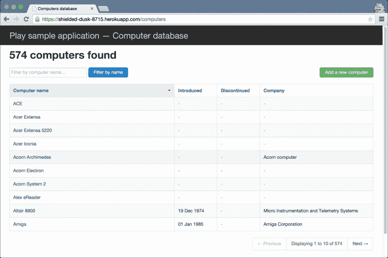

1.  实际的 Heroku URL 可能会有所不同；请确保您在 URL 中替换了 Heroku 生成的应用名称，但在这个菜谱中，它应该部署在以下位置：

    [`shielded-dusk-8715.herokuapp.com`](https://shielded-dusk-8715.herokuapp.com)

## 它是如何工作的...

在这个菜谱中，我们在流行的 PaaS 平台 Heroku 上部署了 Play 2.0 网络应用。部署到 Heroku 需要非常少的定制和配置，这使得开发者能够轻松地将 Play 2.0 网络应用快速部署到像 Heroku 这样的稳固平台上。

在这个菜谱中，我们使用了 activator 模板`computer-database-scala`，并将其用作我们的示例网络应用，然后我们将其部署到 Heroku 的 Cedar 堆栈。在设置好网络应用模板的样板代码后，我们添加了两个文件，作为 Heroku 的配置文件：

### Procfile

在**Procfile**中，我们指定了网络应用的入口点，Heroku 使用它来初始化和运行网络应用，在这个菜谱中是`bin/play2-heroku`。我们还在这里指定了网络应用将使用的端口号，这由 Heroku 运行时决定，指定在环境变量`${PORT}`中：

```java
<span class="strong"><strong>    web: target/universal/stage/bin/play2-heroku -Dhttp.port=${PORT} -DapplyEvolutions.default=true</strong></span>
```

最后，我们设置了一个由 Play 使用的 jvm 属性，用于确定是否执行数据库演变脚本。

```java
<span class="strong"><strong>    -DapplyEvolutions.default=true</strong></span>
```

### system.properties

```java
<span class="strong"><strong>    java.runtime.version=1.8</strong></span>
```

作为可选步骤，在`system.properties`中，我们简单地指定了用于我们的 Play 网络应用的 JDK 版本。

## 还有更多...

有关 Git 和 post-commit 钩子的更多信息，请参阅官方 Git 文档：

+   [`git-scm.com/documentation/`](http://git-scm.com/documentation/)

+   [`git-scm.com/book/en/v2/Customizing-Git-Git-Hooks`](http://git-scm.com/book/en/v2/Customizing-Git-Git-Hooks)

# 在 AWS Elastic Beanstalk 上部署 Play 应用

在这个菜谱中，我们将部署一个 Play 2 网络应用到亚马逊网络服务的 Elastic Beanstalk。**Elastic Beanstalk**是亚马逊的 PaaS 服务，允许开发者以与其他 PAAS 服务（如 Heroku）相同的简便性部署网络应用。

我们将我们的 Play 2 网络应用打包成 Docker 镜像，并将其作为 ZIP 包上传到 Elastic Beanstalk。我们将主要通过网络浏览器与 AWS 管理控制台进行交互。

确保您已在以下位置注册了 AWS 账户：

[`aws.amazon.com`](http://aws.amazon.com)

## 如何操作...

1.  使用 activator 模板创建我们的 Play 2 网络应用`computer-database-scala`：

    ```java
    <span class="strong"><strong>    activator new play2-deploy-72 computer-database-scala</strong></span>
    ```

1.  编辑`conf/application.conf`以启用自动数据库演变：

    ```java
    <span class="strong"><strong>    applyEvolutions.default=true</strong></span>
    ```

1.  编辑`build.sbt`以指定网络应用的 Docker 设置，注意维护者和`dockerExposedPorts`设置，分别使用您的 Docker Hub 用户名和网络应用端口号：

    ```java
    import NativePackagerKeys._
        import com.typesafe.sbt.SbtNativePackager._
         name := """play2-deploy-72"""
         version := "0.0.1-SNAPSHOT"
         scalaVersion := "2.11.4"
         maintainer := "ginduc"
         dockerExposedPorts in Docker := Seq(9000)
         libraryDependencies ++= Seq(
          jdbc,
          anorm,
          "org.webjars" % "jquery" % "2.1.1",
          "org.webjars" % "bootstrap" % "3.3.1"
        )     
         lazy val root = (project in file(".")).enablePlugins(PlayScala)
    ```

1.  在项目根目录中创建一个新的 JSON 配置文件，专门针对 Elastic Beanstalk 和 Docker 应用，文件名为`Dockerrun.aws.json.template`，内容如下：

    ```java
    {
          "AWSEBDockerrunVersion": "1",
          "Ports": [
            {
              "ContainerPort": "9000"
            }
          ]
        }
    ```

1.  使用`activator`生成 Docker 镜像：

    ```java
    <span class="strong"><strong>    $ activator clean docker:stage</strong></span>
    ```

1.  将`Dockerrun.aws.json.template`文件复制到`target/docker`中的 Docker 根目录：

    ```java
    <span class="strong"><strong>    $ cp Dockerrun.aws.json.template target/docker/Dockerrun.aws.json</strong></span>
    ```

1.  将`target/docker`目录打包，以便上传到 Elastic Beanstalk。注意输出 ZIP 文件的位置：

    ```java
    <span class="strong"><strong>    $ cd target/docker &amp;&amp;  zip -r ../play2-deploy-72.zip .</strong></span>
    ```

1.  一旦`docker`包准备就绪，前往 AWS 管理控制台创建一个 Elastic Beanstalk (EB)应用程序，确保我们选择 Docker 作为平台！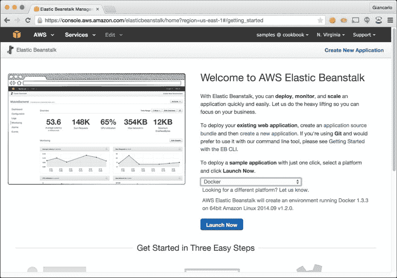

1.  一旦初始化了初始 EB 应用程序，我们需要导航到**配置**标签，点击**实例**旁边的齿轮图标来编辑环境并选择不同的 EC2 实例类型，选择**t2.medium**而不是**t2.micro**（选择除**t2.micro**之外的实例类型意味着您将使用非免费 EC2 实例）：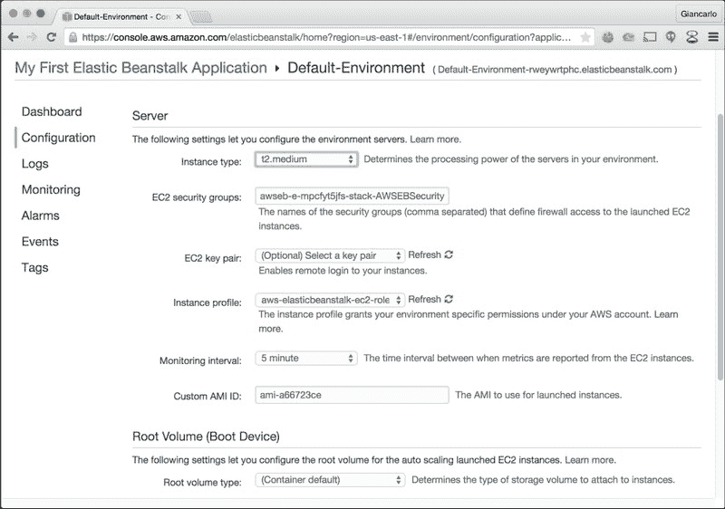

1.  一旦应用了此环境更改，导航回仪表板页面，以便我们可以上传我们之前构建的`docker`包：

1.  点击**部署**。

1.  指定版本标签和部署限制；在我们的菜谱中，我们将保持默认设置。上传和初始化可能需要几分钟，但一旦 Play 2 网络应用程序已部署，我们就可以通过仪表板标签下**默认环境**旁边的链接使用网络浏览器访问它！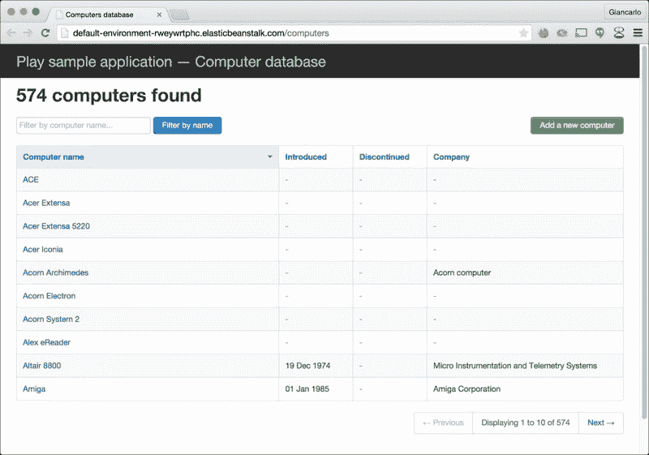

## 工作原理...

在这个菜谱中，我们将 Play 2 网络应用程序部署到了 AWS Elastic Beanstalk。我们将 Play 2 网络应用程序打包成 Docker 镜像，并打包后通过网络浏览器上传到 AWS 管理控制台。有关 sbt 和 Docker 集成的更多信息，请在此处查看：

[`github.com/sbt/sbt-native-packager`](https://github.com/sbt/sbt-native-packager)

我们对`build.sbt`文件进行了非常小的修改，以指定在构建阶段所需的特定 Docker 设置：

```java
import NativePackagerKeys._
    import com.typesafe.sbt.SbtNativePackager._
    /* ... */
     maintainer := "ginduc"
     dockerExposedPorts in Docker := Seq(9000)
```

我们导入了包含 sbt 和 Docker 集成的必要包，并将它们放在文件顶部，`build.sbt`。然后我们指定了 docker 容器将使用的维护者和端口号，在这个菜谱中，端口号为 9000。

我们在项目根目录中添加了一个 Elastic Beanstalk-Docker 配置文件，`Dockerrun.aws.json`，该文件指定了运行版本和我们将要使用的 docker 容器端口，格式为 JSON：

```java
{
      "AWSEBDockerrunVersion": "1",
      "Ports": [
        {
          "ContainerPort": "9000"
        }
      ]
    }
```

值得注意的是，最后的部署配置步骤是修改 Elastic Beanstalk 默认设置的 EC2 实例类型，从`t2.micro`改为`t2.medium`实例类型。`t2.medium`实例是一个非免费 EC2 实例，这意味着您将使用此 EC2 实例类型时产生费用。这是必要的，因为我们可能会在使用小于 2GB RAM 的实例类型时遇到 JVM 问题。应用此环境更改将需要 Elastic Beanstalk 重新初始化环境，并可能需要几分钟才能完成。然后我们可以继续使用 AWS 管理控制台上传和部署我们预先打包的 Docker 镜像。

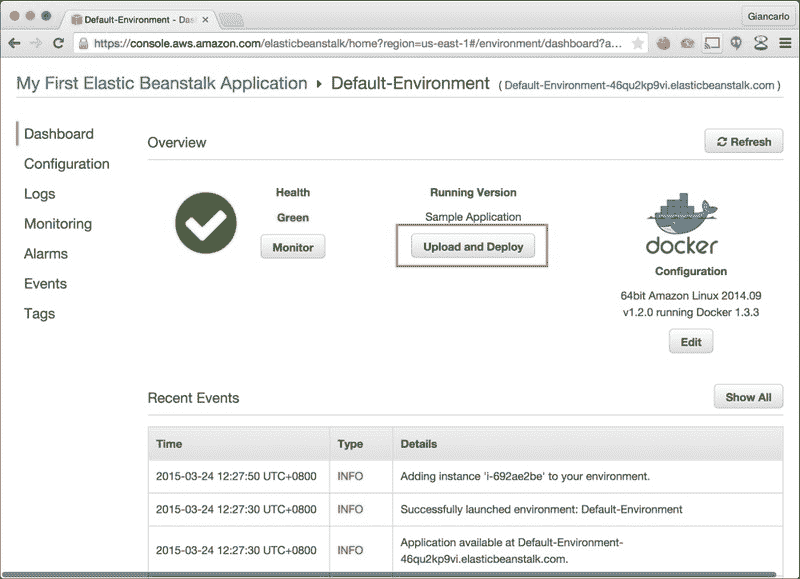

一旦在 AWS 管理控制台中完成部署，我们就可以通过 Web 浏览器访问`computer-database-scala` web 应用程序的 Elastic Beanstalk URL。

## 更多内容...

请参考在线文档以获取有关 AWS Elastic Beanstalk 的更多信息：

[AWS Elastic Beanstalk 开发者资源](http://aws.amazon.com/elasticbeanstalk/developer-resources/)

# 在 CoreOS 和 Docker 上部署 Play 应用程序

在这个食谱中，我们将使用 CoreOS 和 Docker 部署一个 Play 2 web 应用程序。**CoreOS**是一个新的、轻量级的操作系统，非常适合现代应用程序堆栈。与 Docker 软件容器管理系统结合使用，这形成了一个强大的部署环境，为 Play 2 web 应用程序提供了简化的部署、进程隔离、易于扩展等功能。

对于这个食谱，我们将使用流行的云 IaaS，Digital Ocean。确保您在此处注册账户：

[Digital Ocean 注册](https://cloud.digitalocean.com/registrations/new)

此食谱还需要在开发者的机器上安装 Docker。有关安装的官方 Docker 文档请参阅：

[Docker 安装指南](https://docs.docker.com/installation/)

## 如何做到这一点...

1.  使用 CoreOS 作为基础操作系统创建一个新的 Digital Ocean droplet。确保您使用至少有 1 GB RAM 的 droplet，以便食谱可以正常工作。请注意，Digital Ocean 没有免费层，所有都是付费实例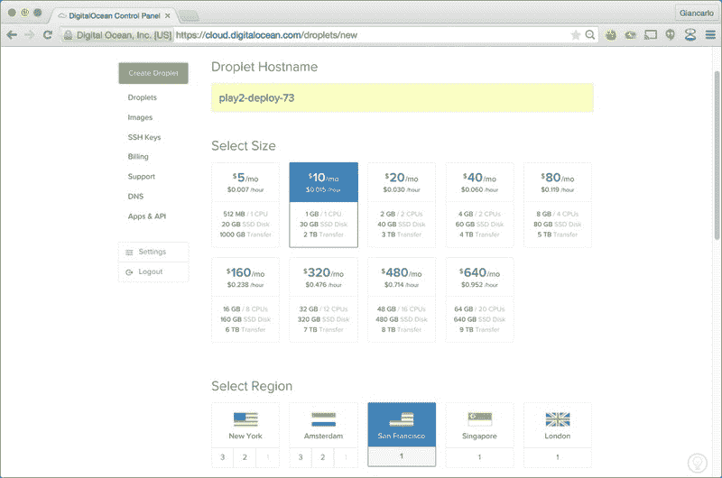

1.  确保您选择了适当的 droplet 区域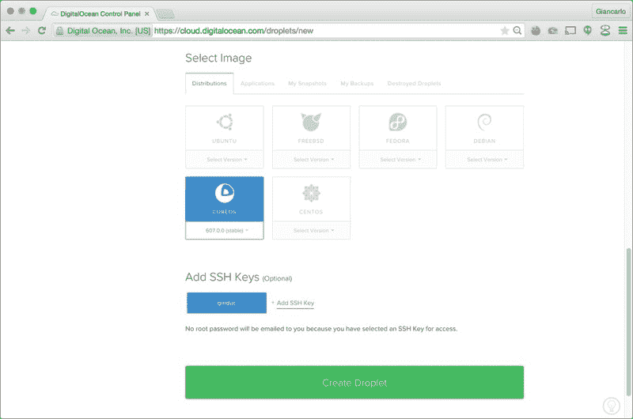

1.  选择**CoreOS 607.0.0**并指定要使用的**SSH 密钥**。如果您需要有关 SSH 密钥生成的更多信息，请访问以下链接：

    [如何设置 SSH 密钥](https://www.digitalocean.com/community/tutorials/how-to-set-up-ssh-keys--2):

1.  一旦创建 Droplet，请特别记录 Droplet 的 IP 地址，我们将使用它登录到 Droplet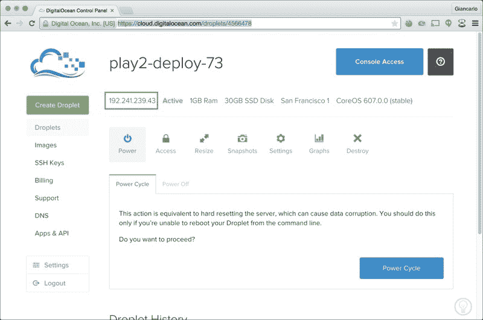

1.  接下来，在[Docker.com](http://Docker.com)上创建一个新的账户，[`hub.docker.com/account/signup/`](https://hub.docker.com/account/signup/)

1.  创建一个新的存储库来存放我们将用于部署的**play2-deploy-73** docker 镜像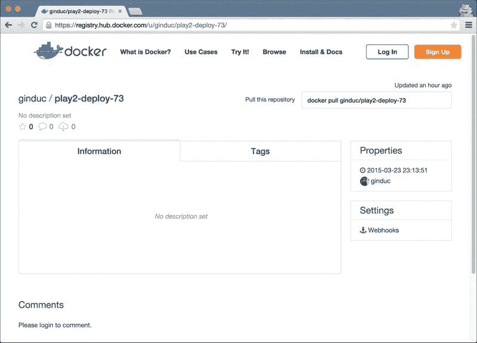

1.  使用 activator 模板`computer-database-scala`创建一个新的 Play 2 webapp，并切换到项目根目录：

    ```java
    <span class="strong"><strong>    activator new play2-deploy-73 computer-database-scala &amp;&amp; cd  play2-deploy-73</strong></span>
    ```

1.  编辑`conf/application.conf`以启用自动数据库演变：

    ```java
    applyEvolutions.default=true
    ```

1.  编辑`build.sbt`以指定 web 应用的 Docker 设置：

    ```java
    import NativePackagerKeys._
        import com.typesafe.sbt.SbtNativePackager._
         name := """play2-deploy-73"""
         version := "0.0.1-SNAPSHOT"
         scalaVersion := "2.11.4"
         maintainer := "&lt;YOUR_DOCKERHUB_USERNAME HERE&gt;"
         dockerExposedPorts in Docker := Seq(9000)
         dockerRepository := Some("YOUR_DOCKERHUB_USERNAME HERE ")
         libraryDependencies ++= Seq(
          jdbc,
          anorm,
          "org.webjars" % "jquery" % "2.1.1",
          "org.webjars" % "bootstrap" % "3.3.1"
        )     
         lazy val root = (project in file(".")).enablePlugins(PlayScala)
    ```

1.  接下来，我们构建 Docker 镜像并将其发布到 Docker Hub：

    ```java
    <span class="strong"><strong>    $ activator clean docker:stage docker:publish</strong></span>
    <span class="strong"><strong>    ..</strong></span>
    <span class="strong"><strong>    [info] Step 0 : FROM dockerfile/java</strong></span>
    <span class="strong"><strong>    [info]  ---&gt; 68987d7b6df0</strong></span>
    <span class="strong"><strong>    [info] Step 1 : MAINTAINER ginduc</strong></span>
    <span class="strong"><strong>    [info]  ---&gt; Using cache</strong></span>
    <span class="strong"><strong>    [info]  ---&gt; 9f856752af9e</strong></span>
    <span class="strong"><strong>    [info] Step 2 : EXPOSE 9000</strong></span>
    <span class="strong"><strong>    [info]  ---&gt; Using cache</strong></span>
    <span class="strong"><strong>    [info]  ---&gt; 834eb5a7daec</strong></span>
    <span class="strong"><strong>    [info] Step 3 : ADD files /</strong></span>
    <span class="strong"><strong>    [info]  ---&gt; c3c67f0db512</strong></span>
    <span class="strong"><strong>    [info] Removing intermediate container 3b8d9c18545e</strong></span>
    <span class="strong"><strong>    [info] Step 4 : WORKDIR /opt/docker</strong></span>
    <span class="strong"><strong>    [info]  ---&gt; Running in 1b150e98f4db</strong></span>
    <span class="strong"><strong>    [info]  ---&gt; ae6716cd4643</strong></span>
    <span class="strong"><strong>    [info] Removing intermediate container 1b150e98f4db</strong></span>
    <span class="strong"><strong>    [info] Step 5 : RUN chown -R daemon .</strong></span>
    <span class="strong"><strong>    [info]  ---&gt; Running in 9299421b321e</strong></span>
    <span class="strong"><strong>    [info]  ---&gt; 8e15664b6012</strong></span>
    <span class="strong"><strong>    [info] Removing intermediate container 9299421b321e</strong></span>
    <span class="strong"><strong>    [info] Step 6 : USER daemon</strong></span>
    <span class="strong"><strong>    [info]  ---&gt; Running in ea44f3cc8e11</strong></span>
    <span class="strong"><strong>    [info]  ---&gt; 5fd0c8a22cc7</strong></span>
    <span class="strong"><strong>    [info] Removing intermediate container ea44f3cc8e11</strong></span>
    <span class="strong"><strong>    [info] Step 7 : ENTRYPOINT bin/play2-deploy-73</strong></span>
    <span class="strong"><strong>    [info]  ---&gt; Running in 7905c6e2d155</strong></span>
    <span class="strong"><strong>    [info]  ---&gt; 47fded583dd7</strong></span>
    <span class="strong"><strong>    [info] Removing intermediate container 7905c6e2d155</strong></span>
    <span class="strong"><strong>    [info] Step 8 : CMD</strong></span>
    <span class="strong"><strong>    [info]  ---&gt; Running in b807e6360631</strong></span>
    <span class="strong"><strong>    [info]  ---&gt; c3e1999cfbfd</strong></span>
    <span class="strong"><strong>    [info] Removing intermediate container b807e6360631</strong></span>
    <span class="strong"><strong>    [info] Successfully built c3e1999cfbfd</strong></span>
    <span class="strong"><strong>    [info] Built image ginduc/play2-deploy-73:0.0.2-SNAPSHOT</strong></span>
    <span class="strong"><strong>    [info] The push refers to a repository [ginduc/play2-deploy-73] (len: 1)</strong></span>
    <span class="strong"><strong>    [info] Sending image list</strong></span>
    <span class="strong"><strong>    [info] Pushing repository ginduc/play2-deploy-73 (1 tags)</strong></span>
    <span class="strong"><strong>    [info] Pushing tag for rev [c3e1999cfbfd] on {https://cdn-registry-1.docker.io/v1/repositories/ginduc/play2-deploy-73/tags/0.0.2-SNAPSHOT}</strong></span>
    <span class="strong"><strong>    [info] Published image ginduc/play2-deploy-73:0.0.2-SNAPSHOT</strong></span>
    ```

1.  一旦 Docker 镜像发布，使用 SSH 登录到 Digital Ocean droplet 以拉取上传的 docker 镜像。您需要使用`core`用户登录您的 CoreOS Droplet：

    ```java
    <span class="strong"><strong>    ssh core@&lt;DROPLET_IP_ADDRESS HERE&gt;</strong></span>
    <span class="strong"><strong>    core@play2-deploy-73 ~ $ docker pull &lt;YOUR_DOCKERHUB_USERNAME HERE&gt;/play2-deploy-73:0.0.1-SNAPSHOT</strong></span>
    <span class="strong"><strong>    Pulling repository ginduc/play2-deploy-73</strong></span>
    <span class="strong"><strong>    6045dfea237d: Download complete</strong></span>
    <span class="strong"><strong>    511136ea3c5a: Download complete</strong></span>
    <span class="strong"><strong>    f3c84ac3a053: Download complete</strong></span>
    <span class="strong"><strong>    a1a958a24818: Download complete</strong></span>
    <span class="strong"><strong>    709d157e1738: Download complete</strong></span>
    <span class="strong"><strong>    d68e2305f8ed: Download complete</strong></span>
    <span class="strong"><strong>    b87155bee962: Download complete</strong></span>
    <span class="strong"><strong>    2097f889870b: Download complete</strong></span>
    <span class="strong"><strong>    5d2fb9a140e9: Download complete</strong></span>
    <span class="strong"><strong>    c5bdb4623fac: Download complete</strong></span>
    <span class="strong"><strong>    68987d7b6df0: Download complete</strong></span>
    <span class="strong"><strong>    9f856752af9e: Download complete</strong></span>
    <span class="strong"><strong>    834eb5a7daec: Download complete</strong></span>
    <span class="strong"><strong>    fae5f7dab7bb: Download complete</strong></span>
    <span class="strong"><strong>    ee5ccc9a9477: Download complete</strong></span>
    <span class="strong"><strong>    74b51b6dcfe7: Download complete</strong></span>
    <span class="strong"><strong>    41791a2546ab: Download complete</strong></span>
    <span class="strong"><strong>    8096c6beaae7: Download complete</strong></span>
    <span class="strong"><strong>    Status: Downloaded newer image for &lt;YOUR_DOCKERHUB_USERNAME HERE&gt;/play2-deploy-73:0.0.2-SNAPSHOT</strong></span>
    ```

1.  现在我们已经准备好使用以下`docker`命令运行我们的 Docker 镜像：

    ```java
    <span class="strong"><strong>    core@play2-deploy-73 ~ $ docker run -p 9000:9000 &lt;YOUR_DOCKERHUB_USERNAME_HERE&gt;/play2-deploy-73:0.0.1-SNAPSHOT</strong></span>
    ```

1.  使用网页浏览器，通过我们在本菜谱早期步骤中记录的 IP 地址（`http://192.241.239.43:9000/computers`）访问 computer-database 网页应用：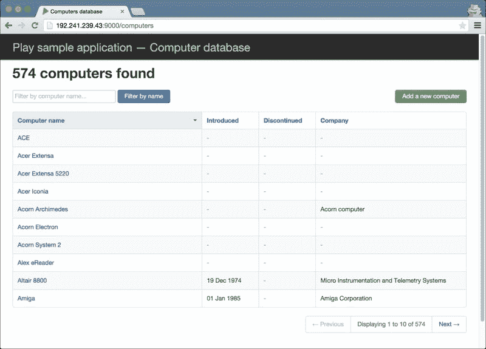

## 它是如何工作的...

在这个菜谱中，我们通过打包成 Docker 镜像并在 Digital Ocean Droplet 中安装和运行相同的 Docker 镜像来部署 Play 2 网页应用。首先，我们需要在 [DigitalOcean.com](http://DigitalOcean.com) 和 [Docker.com](http://Docker.com) 上有一个账户。

一旦我们的账户准备就绪并经过验证，我们创建一个基于 CoreOS 的 droplet。CoreOS 默认安装了 Docker，所以我们只需要在 droplet 中安装 Play 2 网页应用 Docker 镜像。

Play 2 网页应用 Docker 镜像基于 activator 模板，`computer-database-scala`，我们将其命名为 `play2-deploy-73`。

我们对样板代码进行了两项修改。第一项修改在 `conf/application.conf` 中：

```java
applyEvolutions.default=true
```

此设置默认启用数据库演变。其他修改需要在 `build.sbt` 中进行。我们导入包含 Docker 特定设置的所需包：

```java
import NativePackagerKeys._
    import com.typesafe.sbt.SbtNativePackager._
```

下一个设置是指定存储库维护者、暴露的 Docker 端口和 [Docker.com](http://Docker.com) 上的 Docker 存储库；在这种情况下，将您自己的 Docker Hub 用户名作为维护者和 Docker 存储库值：

```java
maintainer := "&lt;YOUR DOCKERHUB_USERNAME&gt;"
     dockerExposedPorts in Docker := Seq(9000)
     dockerRepository := Some("&lt;YOUR_DOCKERHUB_USERNAME&gt;")
```

我们现在可以使用 `activator` 命令构建 Docker 镜像，这将生成构建 Docker 镜像所需的所有文件：

```java
<span class="strong"><strong>    activator clean docker:stage</strong></span>
```

现在，我们将使用 activator docker 命令上传并发布到您指定的 [Docker.com](http://Docker.com) 存储库：

```java
<span class="strong"><strong>    activator clean docker:publish</strong></span>
```

要在我们的 Digital Ocean Droplet 中安装 Docker 镜像，我们首先使用 `core` 用户登录到 droplet：

```java
<span class="strong"><strong>    ssh core@&lt;DROPLET_IP_ADDRESS&gt;</strong></span>
```

然后，我们使用 `docker pull` 命令从 [Docker.com](http://Docker.com) 下载 `play2-deploy-73` 镜像，指定标签：

```java
<span class="strong"><strong>    docker pull &lt;YOUR_DOCKERHUB_USERNAME&gt;/play2-deploy-73:0.0.1-SNAPSHOT</strong></span>
```

最后，我们可以使用 `docker run` 命令运行 Docker 镜像，暴露容器端口 `9000`：

```java
<span class="strong"><strong>    docker run -p 9000:9000 &lt;YOUR_DOCKERHUB_USERNAME&gt;/play2-deploy-73:0.0.1-SNAPSHOT</strong></span>
```

## 更多内容...

参考以下链接获取有关 Docker 和 Digital Ocean 的更多信息：

+   [`www.docker.com/whatisdocker/`](https://www.docker.com/whatisdocker/)

+   [`www.digitalocean.com/community/tags/docker`](https://www.digitalocean.com/community/tags/docker)

# 使用 Dokku 部署 Play 应用程序

在这个菜谱中，我们将使用基于 Docker 的工具 Dokku 来管理我们的 Play 2 网页应用部署。**Dokku** 提供了一个非常直接的部署界面，与 Heroku 的部署界面非常相似，并允许开发者快速部署 Play 2 网页应用。

我们将运行 Dokku 并在 Digital Ocean Droplet 中部署我们的 Play 2 网页应用。我们需要一个至少有 2GB RAM 的 Droplet 来运行我们的示例网页应用。确保您注册了 Digital Ocean 账户以遵循此菜谱：

[`cloud.digitalocean.com/registrations/new`](https://cloud.digitalocean.com/registrations/new)

## 如何操作...

1.  通过创建一个新的 2GB RAM Droplet 并预安装 **Dokku v0.3.15 on 14.04** 或更高版本的应用选项来准备你的部署 Droplet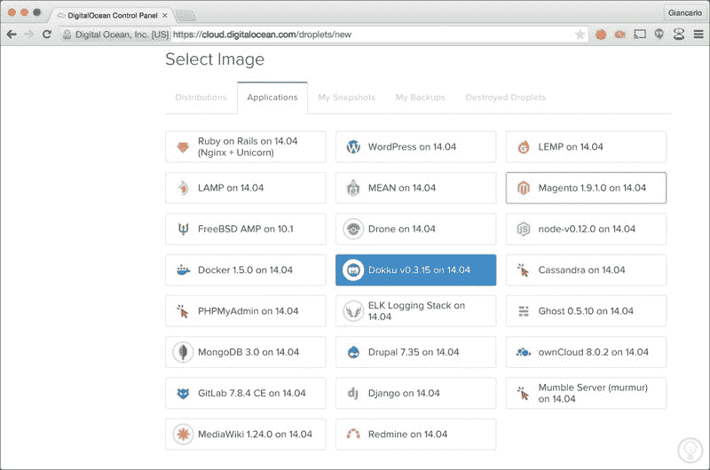

1.  一旦 Droplet 创建完成，你可以在仪表板上验证 Droplet 设置，确保它配置了 2GB 的 RAM，并记录分配给 Droplet 的 IP 地址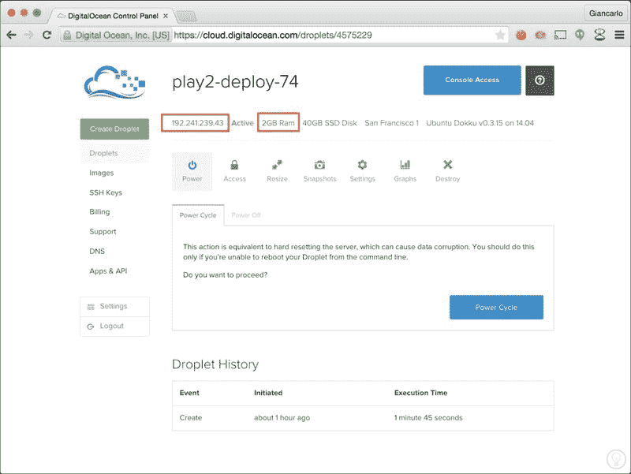

1.  接下来，我们需要通过访问新创建的 Droplet 的网络端口来完成 Dokku 安装；这可以通过使用网络浏览器访问 Droplet 分配的 IP 地址来完成，以确认 Dokku 设置，如你的公钥、主机名等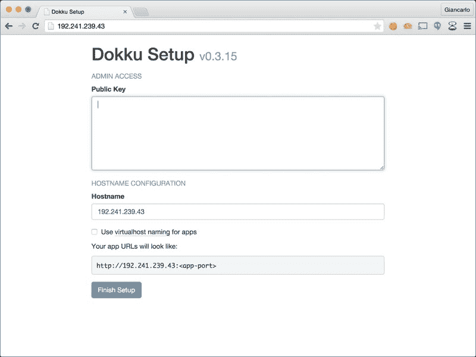

1.  一旦我们的 Droplet 设置完成，我们需要使用 activator 模板 `computer-database-scala` 在本地开发机器上准备我们的 Play 2 网络应用，并切换到项目根目录：

    ```java
    <span class="strong"><strong>    $ activator new play2-deploy-74 computer-database-scala &amp;&amp; cd  play2-deploy-74</strong></span>
    ```

1.  编辑 `conf/application.conf` 以启用自动数据库演变：

    ```java
    applyEvolutions.default=true
    ```

1.  我们需要在项目根目录上初始化 git：

    ```java
    <span class="strong"><strong>    git init &amp;&amp; git add &#x2013;-all &amp;&amp; git commit -am "initial"</strong></span>
    ```

1.  现在我们将向代码库添加一个新的 git 远程，指向我们的 Dokku Droplet：

    ```java
    <span class="strong"><strong>    git remote add dokku dokku@&lt;YOUR_DOKKU_IP_ADDRESS&gt;::play2-deploy-74</strong></span>
    ```

1.  作为最后的部署步骤，我们将我们的提交推送到我们的 Dokku 远程。Dokku 将然后自动使用 git post-commit hooks 来部署网络应用：

    ```java
    <span class="strong"><strong>    $ git push dokku master</strong></span>
    <span class="strong"><strong>    Counting objects: 5, done.</strong></span>
    <span class="strong"><strong>    Delta compression using up to 8 threads.</strong></span>
    <span class="strong"><strong>    Compressing objects: 100% (3/3), done.</strong></span>
    <span class="strong"><strong>    Writing objects: 100% (3/3), 293 bytes | 0 bytes/s, done.</strong></span>
    <span class="strong"><strong>    Total 3 (delta 2), reused 0 (delta 0)</strong></span>
    <span class="strong"><strong>    -----&gt; Cleaning up...</strong></span>
    <span class="strong"><strong>    -----&gt; Building play2-deploy-74 from buildstep...</strong></span>
    <span class="strong"><strong>    -----&gt; Adding BUILD_ENV to build environment...</strong></span>
    <span class="strong"><strong>    -----&gt; Play 2.x - Scala app detected</strong></span>
    <span class="strong"><strong>    -----&gt; Installing OpenJDK 1.6...done</strong></span>
    <span class="strong"><strong>    -----&gt; Running: sbt compile stage</strong></span>
    <span class="strong"><strong>    ..</strong></span>
    <span class="strong"><strong>    -----&gt; Dropping ivy cache from the slug</strong></span>
    <span class="strong"><strong>    -----&gt; Dropping compilation artifacts from the slug</strong></span>
    <span class="strong"><strong>    -----&gt; Discovering process types</strong></span>
    <span class="strong"><strong>       Default process types for Play 2.x - Scala -&gt; web</strong></span>
    <span class="strong"><strong>    -----&gt; Releasing play2-deploy-74...</strong></span>
    <span class="strong"><strong>    -----&gt; Deploying play2-deploy-74...</strong></span>
    <span class="strong"><strong>    -----&gt; Running pre-flight checks</strong></span>
    <span class="strong"><strong>       check-deploy: /home/dokku/play2-deploy-74/CHECKS not found. attempting to retrieve it from container ...</strong></span>
    <span class="strong"><strong>       CHECKS file not found in container. skipping checks.</strong></span>
    <span class="strong"><strong>    -----&gt; Running post-deploy</strong></span>
    <span class="strong"><strong>    -----&gt; NO_VHOST config detected</strong></span>
    <span class="strong"><strong>    -----&gt; Shutting down old container in 60 seconds</strong></span>
    <span class="strong"><strong>    =====&gt; Application deployed:</strong></span>
    <span class="strong"><strong>       http://&lt;YOUR_DOKKU_IP&gt;:&lt;YOUR_DOKKU_ASSIGNED PORT</strong></span>
     <span class="strong"><strong>    To dokku@192.241.239.43:play2-deploy-74</strong></span>
    <span class="strong"><strong>       77a951d..a007b6b  master -&gt; master</strong></span>
    ```

我们现在可以使用网络浏览器访问我们的 Dokku 部署的 Play 2 网络应用：`http://<YOUR_DOKKU_IP_ADDRESS>:<YOUR_DOKKU_PORT>`

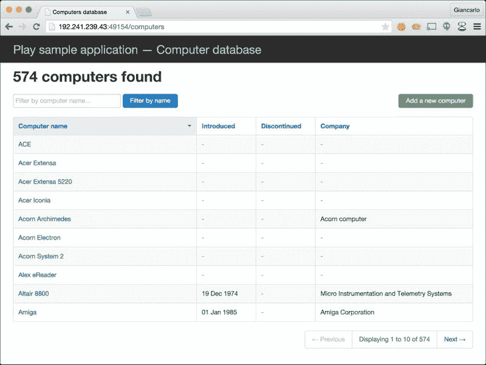

## 它是如何工作的...

在这个菜谱中，我们探讨了使用 Dokku 在 Digital Ocean Droplet 上部署我们的 Play 2 网络应用。经过一些非常直接的初始化和配置后，我们能够以最小的摩擦和轻松的方式部署我们的 Play 2 网络应用。

这个菜谱的关键是预先在虚拟机上安装 Dokku。基于 Docker 的部署工具 Dokku 为开发者提供了一个非常简单的部署过程，最终归结为一个 `git push` 命令：

```java
<span class="strong"><strong>    $ git push dokku master</strong></span>
```

Dokku 配置了 git post-commit hooks 来检测对代码库的提交，随后对每个检测到的代码提交运行部署脚本。

```java
<span class="strong"><strong>    -----&gt; Discovering process types</strong></span>
<span class="strong"><strong>           Default process types for Play 2.x - Scala -&gt; web</strong></span>
<span class="strong"><strong>    -----&gt; Releasing play2-deploy-74...</strong></span>
<span class="strong"><strong>    -----&gt; Deploying play2-deploy-74...</strong></span>
<span class="strong"><strong>    -----&gt; Running pre-flight checks</strong></span>
<span class="strong"><strong>           check-deploy: /home/dokku/play2-deploy-74/CHECKS not found. attempting to retrieve it from container ...</strong></span>
<span class="strong"><strong>           CHECKS file not found in container. skipping checks.</strong></span>
<span class="strong"><strong>    -----&gt; Running post-deploy</strong></span>
<span class="strong"><strong>    -----&gt; NO_VHOST config detected</strong></span>
<span class="strong"><strong>    -----&gt; Shutting down old container in 60 seconds</strong></span>
<span class="strong"><strong>    =====&gt; Application deployed:</strong></span>
<span class="strong"><strong>           http://192.241.239.43:49154</strong></span>
```

这种易用性使得开发者和非开发者都能快速启动开发和测试实例。

然而，要到达这个开发生命周期中的这个点，我们需要遵循一些步骤来初始化和配置我们的 Dokku 设置。对于这个菜谱，我们依赖于流行的云基础虚拟机提供商 Digital Ocean 和其预定义的 Dokku 应用程序实例来启动一个可用的 Dokku VM 实例。

下一步必要的步骤是配置我们的 Play 2 网络应用以启用 git，通过初始化代码库，将所有代码库文件添加到 git 仓库，并提交网络应用的初始状态：

```java
<span class="strong"><strong>    $ git init &amp;&amp; git add &#x2013;all &amp;&amp; git commit -am "initial"</strong></span>
```

此外，为我们的示例应用添加一些必要的应用程序配置，特别是 `conf/application.conf` 文件，包含以下设置：

```java
applyEvolutions.default=true
```

我们还需要将此更改提交到本地仓库：

```java
<span class="strong"><strong>    $ git commit -am "enabled automatic db evolutions"</strong></span>
```

现在的最终步骤是将我们的提交推送到我们刚刚创建的 Dokku 实例，这将触发部署：

```java
<span class="strong"><strong>    $ git push dokku master</strong></span>
```

## 更多内容...

有关 Dokku 的更多信息，请参阅以下链接：

+   [`progrium.viewdocs.io/dokku/index`](http://progrium.viewdocs.io/dokku/index)

+   [`www.digitalocean.com/community/tags/dokku`](https://www.digitalocean.com/community/tags/dokku)

# 部署使用 Nginx 的 Play 应用程序

在这个菜谱中，我们将手动使用基于 CentOS 6.5 的虚拟机部署 Play 2 网络应用程序，其中**Nginx**作为我们的 Play 2 网络应用程序的前端服务器。我们将使用 Digital Ocean；请确保您在此处注册账户：

[`cloud.digitalocean.com/registrations/new`](https://cloud.digitalocean.com/registrations/new)

## 如何做到这一点...

1.  登录 Digital Ocean 并创建一个新的 Droplet，选择 CentOS 作为基础操作系统，并至少有 2GB 的 RAM：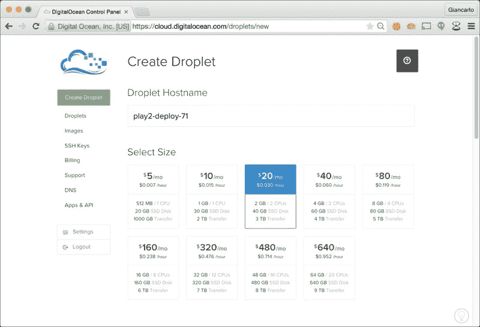

1.  选择**CentOS 6.5 x64**作为 Droplet 镜像，并指定您的**SSH 密钥**：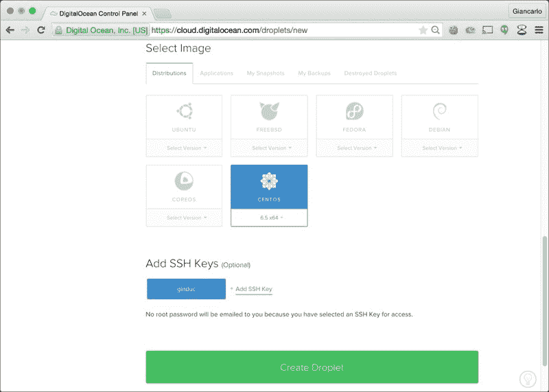

1.  一旦创建了水滴，请特别记下虚拟机的 IP 地址：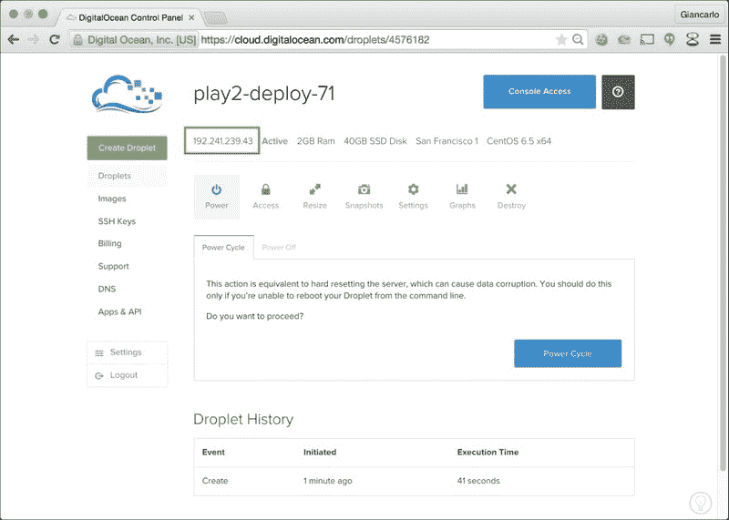

1.  使用 SSH 登录我们新创建的基于 Centos 的 Droplet：

    ```java
    <span class="strong"><strong>    ssh root@&lt;YOUR_DROPLET_IP_ADDRESS&gt;</strong></span>
    ```

1.  使用`adduser`命令创建非 root 用户，使用`passwd`命令为其分配密码，最后将我们的新用户添加到`sudoers`组，该组是具有特殊系统权限的用户列表：

    ```java
    <span class="strong"><strong>    $ adduser deploy</strong></span>
    <span class="strong"><strong>    $ passwd deploy</strong></span>
    <span class="strong"><strong>    $ echo "deploy ALL=(ALL) ALL" &gt;&gt; /etc/sudoers</strong></span>
    ```

1.  使用非 root 用户重新登录我们的 Droplet：

    ```java
    <span class="strong"><strong>    ssh deploy@&lt;YOUR_DROPLET_IP_ADDRESS&gt;</strong></span>
    ```

1.  使用`Yum`，CentOS 包管理器安装必要的工具，以继续我们的虚拟机设置：

    ```java
    <span class="strong"><strong>    sudo yum install -y yum-plugin-fastestmirror</strong></span>
    <span class="strong"><strong>    sudo yum install -y git unzip wget</strong></span>
    ```

1.  使用以下命令安装 JDK：

    ```java
    <span class="strong"><strong>    curl -LO 'http://download.oracle.com/otn-pub/java/jdk/7u51-b13/jdk-7u51-linux-x64.rpm' -H 'Cookie: oraclelicense=accept-securebackup-cookie'</strong></span>
    <span class="strong"><strong>    sudo rpm -i jdk-7u51-linux-x64.rpm</strong></span>
    <span class="strong"><strong>    sudo /usr/sbin/alternatives --install /usr/bin/java java /usr/java/default/bin/java 200000</strong></span>
    ```

1.  验证 Oracle JDK 是否已安装且可访问：

    ```java
    <span class="strong"><strong>    # Verify installed jdk</strong></span>
    <span class="strong"><strong>    $ java -version</strong></span>
    <span class="strong"><strong>    java version "1.7.0_51"</strong></span>
    <span class="strong"><strong>    Java(TM) SE Runtime Environment (build 1.7.0_51-b13)</strong></span>
    <span class="strong"><strong>    Java HotSpot(TM) 64-Bit Server VM (build 24.51-b03, mixed mode)</strong></span>
    ```

1.  使用以下命令安装`activator`：

    ```java
    <span class="strong"><strong>    cd ~</strong></span>
    <span class="strong"><strong>    wget http://downloads.typesafe.com/typesafe-activator/1.3.2/typesafe-activator-1.3.2-minimal.zip</strong></span>
    <span class="strong"><strong>    unzip typesafe-activator-1.3.2-minimal.zip</strong></span>
    <span class="strong"><strong>    chmod u+x ~/activator-1.3.2-minimal/activator</strong></span>
    <span class="strong"><strong>    export PATH=$PATH:~/activator-1.3.2-minimal/</strong></span>
    ```

使用以下命令添加官方 Nginx yum 仓库：

```java
<span class="strong"><strong>    echo -e "[nginx]\nname=nginx repo\nbaseurl=http://nginx.org/packages/centos/\$releasever/\$basearch/\ngpgcheck=0\nenabled=1" &gt; /tmp/nginx.repo &amp;&amp; sudo mv /tmp/nginx.repo /etc/yum.repos.d/nginx.repo</strong></span>
```

1.  使用`yum`安装 Nginx：

    ```java
    <span class="strong"><strong>    sudo yum install -y nginx</strong></span>
    ```

1.  使用以下内容将自定义配置文件添加到`/etc/nginx/conf.d/computer-database-scala.conf`：

    ```java
    upstream playapp1 {
          server 127.0.0.1:9000;
        }
         server {
          listen       80;
          server_name computer-database-scala.com;
          location / {
            proxy_pass http://playapp1;
          }
        }
    ```

1.  重启 Nginx 以加载我们的新配置：

    ```java
    <span class="strong"><strong>    sudo service nginx restart</strong></span>
    ```

1.  配置`iptables`仅允许访问最小的一组端口（端口 22 和 80）：

    ```java
    <span class="strong"><strong>    sudo /sbin/iptables -P INPUT ACCEPT</strong></span>
    <span class="strong"><strong>    sudo /sbin/iptables -F</strong></span>
    <span class="strong"><strong>    sudo /sbin/iptables -A INPUT -i lo -j ACCEPT</strong></span>
    <span class="strong"><strong>    sudo /sbin/iptables -A INPUT -m state --state ESTABLISHED,RELATED -j ACCEPT</strong></span>
    <span class="strong"><strong>    sudo /sbin/iptables -A INPUT -p tcp --dport 22 -j ACCEPT</strong></span>
    <span class="strong"><strong>    sudo /sbin/iptables -A INPUT -p tcp --dport 80 -j ACCEPT</strong></span>
    <span class="strong"><strong>    sudo /sbin/iptables -P INPUT DROP</strong></span>
    <span class="strong"><strong>    sudo /sbin/iptables -P FORWARD DROP</strong></span>
    <span class="strong"><strong>    sudo /sbin/iptables -P OUTPUT ACCEPT</strong></span>
    <span class="strong"><strong>    sudo /sbin/iptables -L -v</strong></span>
    <span class="strong"><strong>    sudo /sbin/service iptables save</strong></span>
    <span class="strong"><strong>    sudo /sbin/service iptables restart</strong></span>
    <span class="strong"><strong>    sudo /sbin/service iptables status</strong></span>
    ```

1.  在`~/apps`目录中克隆`computer-database-scala` Play2 网络应用程序：

    ```java
    <span class="strong"><strong>    $ mkdir ~/apps &amp;&amp; cd $_ &amp;&amp; git clone https://github.com/typesafehub/activator-computer-database-scala.git</strong></span>
    ```

1.  编辑`conf/application.conf`以启用自动数据库演变：

    ```java
    applyEvolutions.default=true
    ```

1.  我们现在可以使用`activator`启动 web 应用程序：

    ```java
    <span class="strong"><strong>    $ activator start</strong></span>
    <span class="strong"><strong>    [info] Loading project definition from /home/deploy/apps/activator-computer-database-scala/project</strong></span>
    <span class="strong"><strong>    [info] Set current project to computer-database-scala (in build file:/home/deploy/apps/activator-computer-database-scala/)</strong></span>
    <span class="strong"><strong>    [info] Packaging /home/deploy/apps/activator-computer-database-scala/target/scala-2.11/computer-database-scala_2.11-0.0.1-SNAPSHOT-sources.jar ...</strong></span>
    <span class="strong"><strong>    [info] Done packaging.</strong></span>
    <span class="strong"><strong>    [warn] There may be incompatibilities among your library dependencies.</strong></span>
    <span class="strong"><strong>    [warn] Here are some of the libraries that were evicted:</strong></span>
    <span class="strong"><strong>    [warn]   * org.webjars:jquery:1.11.1 -&gt; 2.1.1</strong></span>
    <span class="strong"><strong>    [warn] Run 'evicted' to see detailed eviction warnings</strong></span>
    <span class="strong"><strong>    [info] Wrote /home/deploy/apps/activator-computer-database-scala/target/scala-2.11/computer-database-scala_2.11-0.0.1-SNAPSHOT.pom</strong></span>
    <span class="strong"><strong>    [info] Packaging /home/deploy/apps/activator-computer-database-scala/target/scala-2.11/computer-database-scala_2.11-0.0.1-SNAPSHOT.jar ...</strong></span>
    <span class="strong"><strong>    [info] Done packaging.</strong></span>
     <span class="strong"><strong>    (Starting server. Type Ctrl+D to exit logs, the server will remain in background)</strong></span>
     <span class="strong"><strong>    Play server process ID is 3094</strong></span>
    <span class="strong"><strong>    [info] play - database [default] connected at jdbc:h2:mem:play</strong></span>
    <span class="strong"><strong>    [info] play - Application started (Prod)</strong></span>
    <span class="strong"><strong>    [info] play - Listening for HTTP on /0:0:0:0:0:0:0:0:9000</strong></span>
    ```

1.  使用网络浏览器，我们现在可以通过 Droplet 的 IP 地址访问 Play 2 网络应用程序，在我们的例子中，`http://&lt;YOUR_DROPLET_IP ADDRESS&gt;/computers`：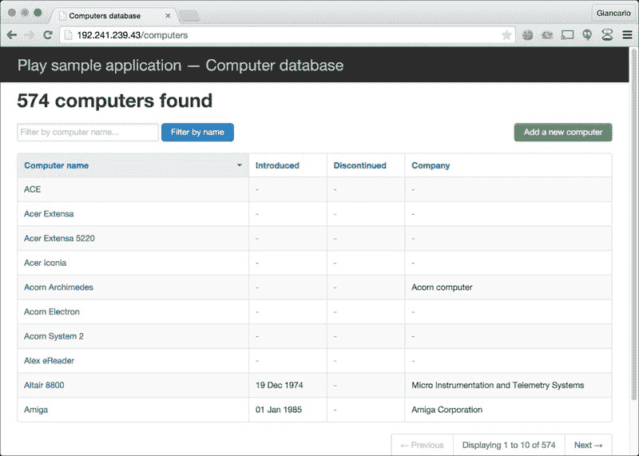

我们可以使用`curl`和响应头验证 Nginx 确实在为我们提供 HTTP 请求服务：

```java
<span class="strong"><strong>    $ curl -v http://192.241.239.43/computers</strong></span>
<span class="strong"><strong>    * Hostname was NOT found in DNS cache</strong></span>
<span class="strong"><strong>    *   Trying 192.241.239.43...</strong></span>
<span class="strong"><strong>    * Connected to 192.241.239.43 (192.241.239.43) port 80 (#0)</strong></span>
<span class="strong"><strong>    &gt; GET /computers HTTP/1.1</strong></span>
<span class="strong"><strong>    &gt; User-Agent: curl/7.37.1</strong></span>
<span class="strong"><strong>    &gt; Host: 192.241.239.43</strong></span>
<span class="strong"><strong>    &gt; Accept: */*</strong></span>
<span class="strong"><strong>    &gt;</strong></span>
<span class="strong"><strong>    &lt; HTTP/1.1 200 OK</strong></span>
<span class="strong"><strong>    * Server nginx/1.6.2 is not blacklisted</strong></span>
<span class="strong"><strong>    &lt; Server: nginx/1.6.2</strong></span>
<span class="strong"><strong>    &lt; Date: Tue, 24 Mar 2015 08:23:04 GMT</strong></span>
<span class="strong"><strong>    &lt; Content-Type: text/html; charset=utf-8</strong></span>
<span class="strong"><strong>    &lt; Content-Length: 7371</strong></span>
<span class="strong"><strong>    &lt; Connection: keep-alive</strong></span>
```

## 它是如何工作的...

在这个菜谱中，我们手动在远程基于 CentOS 的虚拟机上部署了 Play 2 网络应用程序，我们使用 Digital Ocean 初始化了它。然后我们继续安装和配置各种软件组件，如 Java 开发工具包、Nginx、IPTables 等：

```java
<span class="strong"><strong>    $ java -version</strong></span>
<span class="strong"><strong>    java version "1.7.0_51"</strong></span>
 <span class="strong"><strong>    $ activator --version</strong></span>
<span class="strong"><strong>    sbt launcher version 0.13.8-M5</strong></span>
 <span class="strong"><strong>    $ nginx -v</strong></span>
<span class="strong"><strong>    nginx version: nginx/1.6.2</strong></span>
 <span class="strong"><strong>    $ iptables --version</strong></span>
<span class="strong"><strong>    iptables v1.4.7</strong></span>
<span class="strong"><strong>    $ curl --version</strong></span>
<span class="strong"><strong>    curl 7.19.7</strong></span>
 <span class="strong"><strong>    $ git --version</strong></span>
<span class="strong"><strong>    git version 1.9.5</strong></span>
```

一旦我们安装并配置了必要的服务，我们需要启动我们的 Play 2 网络应用程序：

```java
<span class="strong"><strong>    $ cd apps/activator-computer-database-scala/ &amp;&amp; activator clean start</strong></span>
<span class="strong"><strong>    Play server process ID is 3917</strong></span>
<span class="strong"><strong>    [info] play - database [default] connected at jdbc:h2:mem:play</strong></span>
<span class="strong"><strong>    [info] play - Application started (Prod)</strong></span>
<span class="strong"><strong>    [info] play - Listening for HTTP on /0:0:0:0:0:0:0:0:9000</strong></span>
```

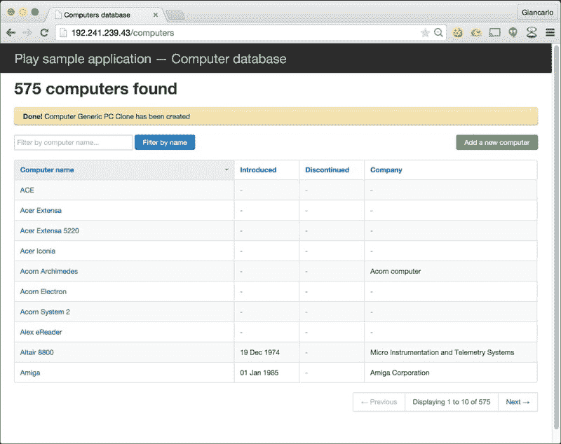

我们随后成功地在适当的端口，即端口 80，使用网页浏览器和`curl`访问了我们部署的 Play 2 网络应用程序。我们还可以通过尝试使用`curl`直接访问端口 9000 来验证，我们只能通过 Nginx 访问 Play 2 网络应用程序：

```java
<span class="strong"><strong>    $ curl -v http://192.241.239.43:9000/computers</strong></span>
<span class="strong"><strong>    * Hostname was NOT found in DNS cache</strong></span>
<span class="strong"><strong>    *   Trying 192.241.239.43...</strong></span>
<span class="strong"><strong>    * connect to 192.241.239.43 port 9000 failed: Operation timed out</strong></span>
<span class="strong"><strong>    * Failed to connect to 192.241.239.43 port 9000: Operation timed out</strong></span>
<span class="strong"><strong>    * Closing connection 0</strong></span>
<span class="strong"><strong>    curl: (7) Failed to connect to 192.241.239.43 port 9000: Operation timed out</strong></span>
```

在本章中，我们展示了手动部署 Play 2 应用程序是多么复杂，而与之相比，使用云服务如 Heroku、AWS Beanstalk 以及 Docker 和 Dokku 等工具在云中部署 Play 2 应用程序是多么方便和简单。虽然手动部署 Play 网络应用程序可能有其优点，但毫无疑问，云 PAAS 服务极大地提高了开发者的生产力和效率，并允许开发者专注于实际的软件开发。
