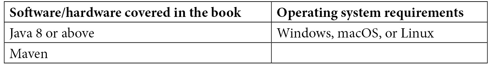

# 前言

MicroProfile 提供了一套 API，以促进使用最佳实践构建云原生应用。一旦您学会了 MicroProfile，您就可以开发一个标准化的云原生应用，它可以部署到许多运行时，无需担心迁移问题。

本书提供了一种实用的方法来实现和相关的方法论，让您能够迅速上手并变得高效。它附带了一个端到端的应用程序，演示了如何使用 MicroProfile 4.1 构建云原生应用并将其部署到云中。

在本书结束时，您将能够理解 MicroProfile，并自信地使用 API 进行云原生应用开发。

# 本书面向的对象

这本书是为那些希望使用在云中表现良好的开放标准框架构建高效应用的 Java 应用开发者和架构师而写的。希望了解云原生应用工作原理的 DevOps 工程师也会发现这本书很有用。为了充分利用这本书，需要具备 Java、Docker、Kubernetes 和云的基本理解。

# 本书涵盖的内容

*第一章*, *云原生应用*，定义了云原生应用的概念，并简要讨论了最佳实践。

*第二章*, *MicroProfile 如何融入云原生应用开发？*，概述了 MicroProfile，然后从满足云原生应用需求的角度描述了 MicroProfile 的规范。

*第三章*, *介绍 IBM 股票交易云原生应用*，展示了具有高级架构的股票交易应用，并描述了其功能和设计。

*第四章*, *开发云原生应用*，解释了 JAX-RS、JSON-B、JSON-P、CDI 和 MicroProfile Rest Client 的细节，然后通过一些代码示例演示如何使用它们来构建云原生应用。

*第五章*, *增强云原生应用*，解释了如何使用 MicroProfile Config 配置您的云原生应用，确保应用在各种条件下都能正常运行，使用 MicroProfile 容错机制。最后，您将了解如何使用 MicroProfile JWT 来保护应用。

*第六章*, *观察和监控云原生应用*，从如何观察云原生应用的健康状态和操作状态，以及如何使用 MicroProfile Open Tracing 识别故障的角度，讨论了第 2 天的操作。

*第七章*，*使用 Open Liberty、Docker 和 Kubernetes 的 MicroProfile 生态系统*，解释了如何将云原生应用程序部署到云中以及它与 Docker、Kubernetes 和 Istio 等云基础设施的交互。

*第八章*，*构建和测试您的云原生应用程序*，涵盖了如何从头开始构建现实世界的云原生应用程序 Stock Trader，并逐步利用 MicroProfile 规范来满足云原生应用程序的最佳实践。

*第九章*，*部署和第二天操作*，讨论了如何通过 Operator 部署 Stock Trader 应用程序，并讨论了第二天操作，例如部署后的维护。

*第十章*，*响应式云原生应用程序*，解释了命令式和响应式应用程序之间的区别，并演示了如何使用响应式消息构建响应式应用程序。

*第十一章*，*MicroProfile GraphQL*，扩展了为什么需要使用 MicroProfile GraphQL 进行查询，并随后演示了如何使用 GraphQL 构建查询。

*第十二章*，*MicroProfile LRA 和 MicroProfile 的未来*，解释了云原生应用程序事务是什么，并演示了如何使用 MicroProfile LRA 执行云原生事务，随后是 MicroProfile 的未来路线图。

# 为了充分利用本书

您需要在您的计算机上安装 Java 8 或 11。为了运行示例代码，您需要安装 Maven 的最新版本。



**如果您正在使用本书的数字版，我们建议您亲自输入代码或从本书的 GitHub 仓库（下一节中有一个链接）获取代码。这样做将帮助您避免与代码复制和粘贴相关的任何潜在错误。**

# 下载示例代码文件

您可以从 GitHub 下载本书的示例代码文件：[`github.com/PacktPublishing/Practical-Cloud-Native-Java-Development-with-MicroProfile`](https://github.com/PacktPublishing/Practical-Cloud-Native-Java-Development-with-MicroProfile)。如果代码有更新，它将在 GitHub 仓库中更新。

我们还有其他来自我们丰富的图书和视频目录的代码包，可在 [`github.com/PacktPublishing/`](https://github.com/PacktPublishing/) 获取。查看它们！

# 下载彩色图像

我们还提供了一份包含本书中使用的截图和图表彩色图像的 PDF 文件。您可以从这里下载：[`static.packt-cdn.com/downloads/9781801078801_ColorImages.pdf`](https://static.packt-cdn.com/downloads/9781801078801_ColorImages.pdf)。

# 使用的约定

本书使用了多种文本约定。

`文本中的代码`: 表示文本中的代码单词、数据库表名、文件夹名、文件名、文件扩展名、路径名、虚拟 URL、用户输入和 Twitter 昵称。以下是一个示例：“将下载的 `WebStorm-10*.dmg` 磁盘镜像文件挂载为系统中的另一个磁盘。”

代码块设置如下：

```java
@Provider
public class ColorParamConverterProvider   implements ParamConverterProvider {
  @Override
  public <T> ParamConverter<T> getConverter(Class<T> rawType,    Type genericType, Annotation[] annotations) {
    if (rawType.equals(Color.class)) {
        return (ParamConverter<T>) new ColorParamConverter();
    }
    return null;
  }
}
```

当我们希望您注意代码块中的特定部分时，相关的行或项目将以粗体显示：

```java
  global:
    auth: basic
    healthCheck: true
    ingress: false
    istio: false
    istioNamespace: mesh
    route: true
 traceSpec: "com.ibm.hybrid.cloud.sample.stocktrader.broker.      BrokerService=fine:*=info"
 jsonLogging: true
    disableLogFiles: false
    monitoring: true
    specifyCerts: false
```

任何命令行输入或输出都应如下编写：

```java
kubectl create configmap app-port --from-literal port=9081
```

**粗体**: 表示新术语、重要单词或屏幕上看到的单词。例如，菜单或对话框中的单词以粗体显示。以下是一个示例：“我们已经了解到有一些有用的工具，例如 **GraphiQL**，可以简化测试。”

小贴士或重要注意事项

看起来像这样。

# 联系我们

我们欢迎读者的反馈。

**一般反馈**: 如果您对本书的任何方面有疑问，请通过 customercare@packtpub.com 发送电子邮件给我们，并在邮件主题中提及书名。

**勘误**: 尽管我们已经尽最大努力确保内容的准确性，但错误仍然可能发生。如果您在这本书中发现了错误，如果您能向我们报告，我们将不胜感激。请访问 www.packtpub.com/support/errata 并填写表格。

**盗版**: 如果您在互联网上发现我们作品的任何非法副本，如果您能提供位置地址或网站名称，我们将不胜感激。请通过 copyright@packt.com 联系我们，并提供材料的链接。

**如果您有兴趣成为作者**: 如果您在某个领域有专业知识，并且您有兴趣撰写或为书籍做出贡献，请访问 authors.packtpub.com。

# 分享您的想法

一旦您阅读了《使用 MicroProfile 的实用云原生 Java 开发》，我们非常乐意听到您的想法！请[点击此处直接访问此书的亚马逊评论页面](https://packt.link/r/1-801-07880-7)并分享您的反馈。

您的评论对我们和科技社区都很重要，并将帮助我们确保我们提供高质量的内容。
