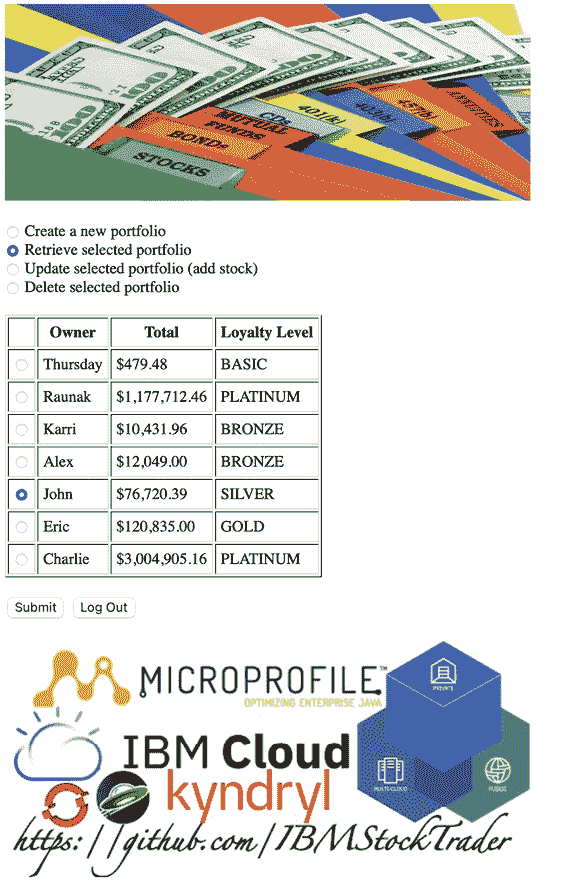
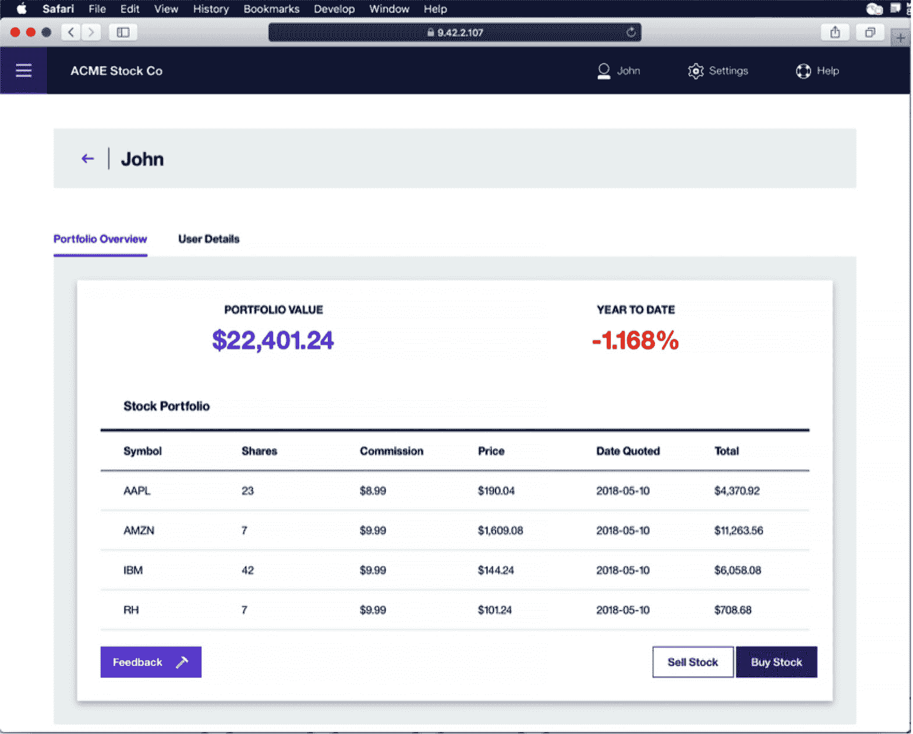
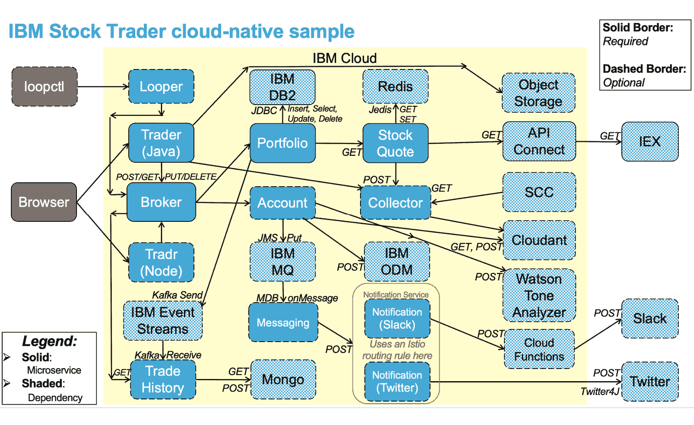
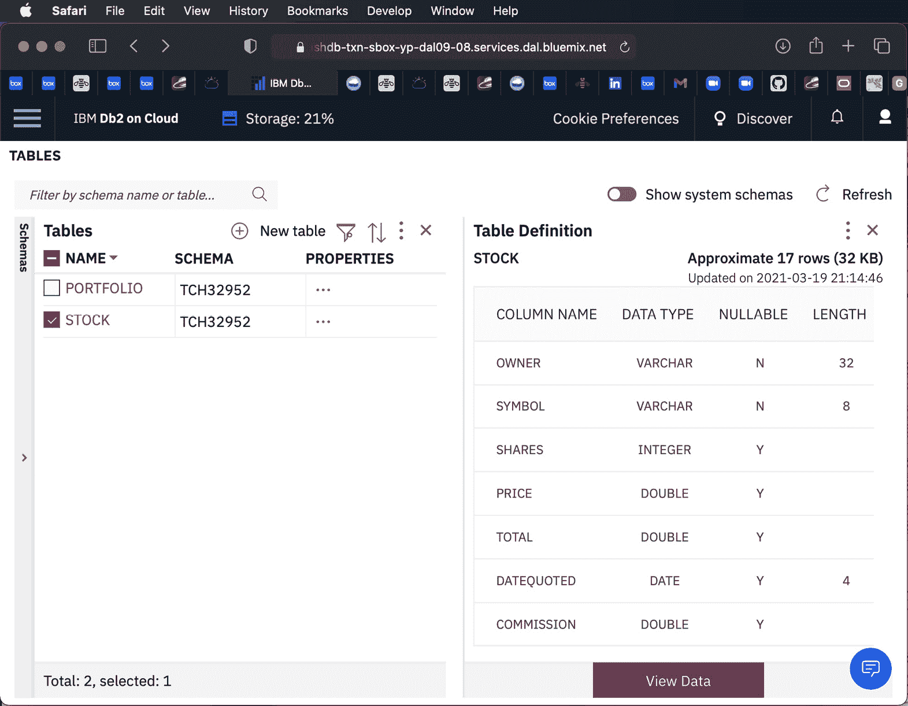
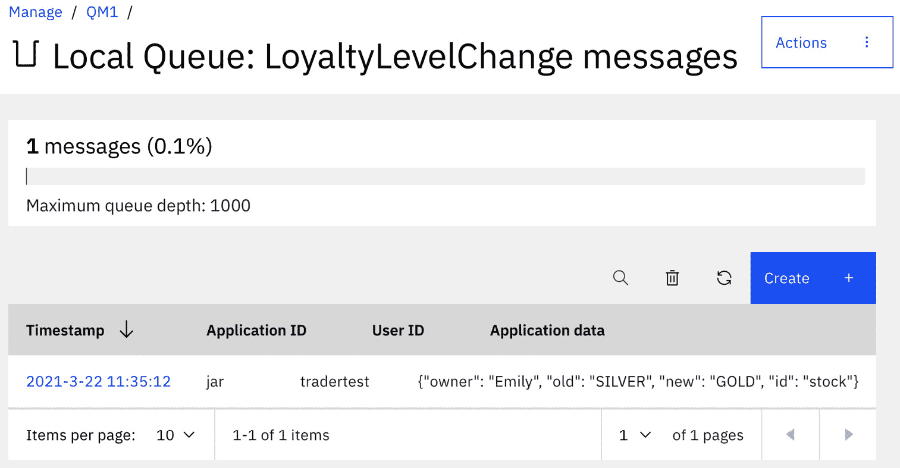
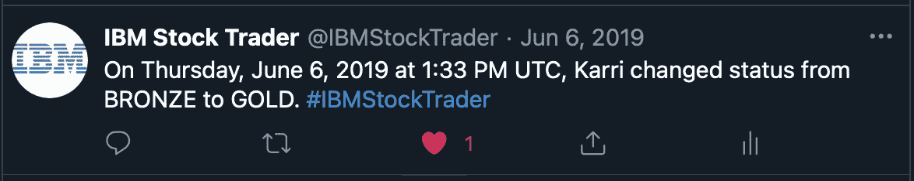
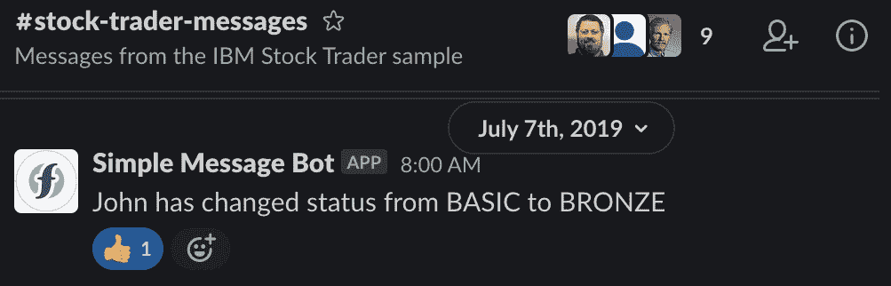

# *第三章*：介绍 IBM 股票交易员云原生应用

在整本书中，我们将使用一个名为**IBM 股票交易员**的示例应用来演示各种概念和技术。这个开源示例旨在向人们展示如何开发、部署和使用一个由各种微服务组成且利用各种外部服务（如数据库、消息系统和服务）的典型云原生应用。所有微服务都是容器化的，并通过操作员部署到 Kubernetes 集群，例如**OpenShift 容器平台**。

如其名所示，IBM 股票交易员示例存在于金融领域，模拟了一个跟踪客户在其投资组合中购买的股票的经纪应用。虽然它实际上不购买或出售任何东西，但它确实会查找指定股票的当前实际价格，并计算映射到客户忠诚度级别的整体投资组合价值。它还模拟了一个账户余额，从中扣除每次交易的佣金，并跟踪每个投资组合的**投资回报率**（ROI）。此外，它还包括一些可选部分，例如在新忠诚度级别达到时发送通知，并分析提交的反馈以查看是否应授予免费（无佣金）交易，展示了它如何与 Slack、Twitter 或**国际商业机器公司**（**IBM**）的 Watson 等现实世界系统交互。

在接下来的章节中，我们将讨论每个 MicroProfile 4.x 技术时，会回过头来看这个示例是如何演示每个技术的使用。我们将包括来自构成示例的各种微服务的代码片段，解释应用程序从使用每个 MicroProfile 技术中获得的益处。

本章将涵盖以下主要内容：

+   IBM 股票交易员应用的概述

+   强制性微服务和外部服务

+   可选微服务和外部服务

到本章结束时，你将熟悉该应用的应用方式、如何使用它、各个部分如何组合成一个复合应用，以及如果你时间紧迫可以忽略哪些部分。

# IBM 股票交易员应用的概述

在过去 3-4 年中创建和改进的这种多语言示例演示了如何创建容器化微服务，针对各种应用程序运行时。大部分微服务被故意保持简单，以免读者陷入可能存在于真实经纪应用中的深奥技术复杂性。尽管如此，它非常旨在比云原生编程初学者文档中经常展示的各种*Hello World*级别示例具有更显著的教育意义。

该示例由大约一打微服务组成，这些微服务与大约一打外部依赖项（其中大部分是可选的）进行交互。此外，还有一个 Helm 图表和一个 OpenShift 操作符（它封装了 Helm 图表），用于部署示例，这将在*第九章*，“部署和第二天操作”中介绍。

在本节中，我们将提供一个关于应用程序、构成它的微服务以及它们所做的高层次概述。让我们首先看看**用户界面**（**UIs**）。

## UIs

在深入探讨在云中运行的全部后端微服务之前，让我们看看作为客户端提供给你在网页浏览器中使用的有哪些。实际上，对于这个示例，有几种**图形用户界面**（**GUI**）客户端可供选择。有一个简单的基于 Java servlet / JSP 的 UI 称为**Trader**，它故意使用非常简单的**超文本标记语言**（**HTML**）来渲染结果，以便 servlet 代码易于理解。让我们在下面的屏幕截图中看看这个简单的客户端：



图 3.1 – 简单基于 Java servlet 的 UI：Trader

如您所见，这个客户端提供了一个投资组合列表，并允许您查看一个投资组合的详细信息、修改一个、创建一个新的或删除一个。您必须成功登录才能使用客户端，并且可以选择提交反馈，这可能导致免费（无佣金）交易。它将显示您的当前忠诚度级别、您的账户余额和您的投资回报率。

此外，还有一个更华丽的用户界面称为**Tradr**，它使用**Vue.js UI 框架**编写，并提供了一个更现代的体验；这需要在您的浏览器中启用 JavaScript。让我们也看看这个——您可以在下面的屏幕截图中看到它：



图 3.2 – 奢华的基于 Node.js 的 UI：Tradr

这两个客户端具有相同的功能。更华丽的那个在阅读其代码时理解起来稍微复杂一些，但它提供了一个看起来更加专业、响应式的体验。Trader 看起来像是 20 世纪末编写的，而 Tradr 看起来像是现代编写的。

此外，还有一个名为`loopctl`的命令行客户端，它运行指定次数的迭代（在并行线程上）的操作，可以对投资组合进行性能和吞吐量测试，如下所示：

```java
sh-4.4$ ./loopctl.sh 1 1
1:  GET /broker
[{"owner": "Raunak", "total": 1,160,209.07, "loyalty": "PLATINUM", "balance": -89.82, "commissions": 139.82, "free": 0, "nextCommission": 5.99, "sentiment": "Unknown", "stocks": {}}, {"owner": "Karri", "total": 10,413.06, "loyalty": "BRONZE", "balance": 31.02, "commissions": 18.98, "free": 0, "nextCommission": 8.99, "sentiment": "Unknown", "stocks": {}}, {"owner": "Alex", "total": 12,049.00, "loyalty": "BRONZE", "balance": 41.01, "commissions": 8.99, "free": 0, "nextCommission": 8.99, "sentiment": "Unknown", "stocks": {}}, {"owner": "John", "total": 79,544.03, "loyalty": "SILVER", "balance": 16.04, "commissions": 33.96, "free": 0, "nextCommission": 7.99, "sentiment": "Unknown", "stocks": {}}, {"owner": "Eric", "total": 120,835.00, "loyalty": "GOLD", "balance": 43.01, "commissions": 6.99, "free": 0, "nextCommission": 6.99, "sentiment": "Unknown", "stocks": {}}, {"owner": "Charlie", "total": 3,004,905.16, "loyalty": "PLATINUM", "balance": 34.02, "commissions": 15.98, "free": 0, "nextCommission": 5.99, "sentiment": "Unknown", "stocks": {}}]
2:  POST /broker/Looper1
{"owner": "Looper1", "total": 0.00, "loyalty": "Basic", "balance": 50.00, "commissions": 0.00, "free": 0, "nextCommission": 9.99, "sentiment": "Unknown", "stocks": {}}
3:  PUT /broker/Looper1?symbol=IBM&shares=1
{"owner": "Looper1", "total": 127.61, "loyalty": "Basic", "balance": 40.01, "commissions": 9.99, "free": 0, "nextCommission": 9.99, "sentiment": "Unknown", "stocks": {"IBM": {"symbol": "IBM", "shares": 1, "price": 127.61, "date": "2021-03-12", "total": 127.61, "commission": 9.99}}}
4:  PUT /broker/Looper1?symbol=AAPL&shares=2
{"owner": "Looper1", "total": 369.67, "loyalty": "Basic", "balance": 30.02, "commissions": 19.98, "free": 0, "nextCommission": 9.99, "sentiment": "Unknown", "stocks": {"AAPL": {"symbol": "AAPL", "shares": 2, "price": 121.03, "date": "2021-03-12", "total": 242.06, "commission": 9.99}{"IBM": {"symbol": "IBM", "shares": 1, "price": 127.61, "date": "2021-03-12", "total": 127.61, "commission": 9.99}}}
```

为了简洁起见，前一个输出中只显示了每个迭代中的前 4 个步骤。简而言之，它创建一个新的投资组合，在其中买卖股票，然后删除它，并且根据您的请求，在尽可能多的并行线程上重复这些步骤，并报告时间。

无论您使用哪三个客户端，它们都会向同一个**经纪人**微服务发出**表示性状态转移（REST**）调用，而该微服务随后根据需要与其他微服务进行交互，正如我们将在下一节中看到的。

## 架构图

让我们看看一个展示所有组件如何组合在一起的图。一开始可能会觉得有点令人不知所措，但根据《银河系漫游指南》的建议，“**不要慌张**”！在下面的图中，您看到的多数微服务和依赖项都是可选的：



图 3.3 – 架构图

对于*图 3.3*中显示的每个实色框，都有一个位于[`github.com/IBMStockTrader`](https://github.com/IBMStockTrader)的 GitHub 仓库。根据标准的 GitHub 命名约定，每个微服务名称被转换为全部小写，多词名称中的单词之间用连字符分隔；例如，**股票报价**微服务可在[`github.com/IBMStockTrader/stock-quote`](https://github.com/IBMStockTrader/stock-quote)找到。

对于这些微服务，每个都有一个位于[`hub.docker.com/u/ibmstocktrader`](https://hub.docker.com/u/ibmstocktrader)的 Docker Hub 仓库。当然，您可以从 GitHub（我们将在*第八章*，*构建和测试您的云原生应用程序）中的源代码构建每个微服务，并将镜像推送到您想要的任何镜像仓库，例如集成到您的 OpenShift 集群中的那个。但为了更容易部署示例，也提供了预构建的镜像。如果您使用操作员部署示例，它将默认从 Docker Hub 拉取镜像，但您可以替换每个微服务的默认镜像和标签字段，以从任何镜像仓库拉取。

在以下各节中，我们将查看应用程序中的每个微服务及其依赖项。

# 必需的微服务和外部服务

如前所述，本例的核心部分仅仅是创建投资组合和买卖股票的基本操作所需的部分。这些部分的示例都有坚固的边框，如图*图 3.3*所示。

以下小节将描述构成**IBM 股票交易员**应用程序主要功能（即创建投资组合和在其中买卖股票的能力）所需的每个微服务及其依赖项。

## 交易员

**交易员**是本例的标准 UI 客户端。如前文*图 3.1*所示，它展示了一个现有投资组合列表，允许您创建新的投资组合，更新现有的投资组合（通过买卖股票），以及删除投资组合。它通过 REST 服务调用与经纪人微服务进行通信，传递用于**单点登录（SSO**）的**JavaScript 对象表示法（JSON）Web 令牌（JWT**）。

它通过一组简单的 Java servlets 和 JSP 实现，就像大多数股票交易员微服务一样，在开源 Open Liberty 应用程序服务器上运行，该服务器在**通用基础镜像**（**UBI**）上运行，这是一个**Red Hat Enterprise Linux**（**RHEL**） 8.4 容器，带有 Open J9 Java 11 **虚拟机**（**VM**）。

对于此客户端如何执行认证，有一些选择。默认且最简单的方式是在交易微服务的`server.xml`文件中的`basicRegistry`部分定义的硬编码凭据列表中进行登录，例如`stock`/`trader`作为**标识符**（**ID**）/密码。

### LDAP

您还可以选择使用交易微服务对公司的**轻量级目录访问协议**（**LDAP**）服务器进行登录。这样，您的员工可以使用他们的公司用户注册信息进行登录，例如使用序列号或电子邮件地址。请注意，如果您将示例部署到公共云中的 OpenShift 集群，并且您的用户注册服务器在防火墙后面的本地数据中心运行，那么您需要设置一个**虚拟专用网络**（**VPN**）连接回该 LDAP 服务器。

### OIDC

使用交易微服务的最终认证选项是使用**OpenID Connect**（**OIDC**）服务器进行登录。如果您想通过互联网上的第三方提供者进行认证，例如通过 Facebook、Twitter 或 GitHub 凭据登录，通常会使用此选项。出于测试目的，您还可以在 OpenShift 集群中本地部署自己的 OIDC 服务器，例如使用 OperatorHub 中的**Red Hat SSO**（**RH-SSO**）操作符，该操作符基于开源的**Keycloak**项目。

## 经纪人

架构师通常建议使用**模型-视图-控制器**（**MVC**）架构的多层应用程序。在股票交易员示例中，JSON 是**模型**，交易员（或可选的 Tradr 或 Looper）是**视图**，而**经纪人**微服务充当**控制器**。

这是一个无状态的微服务，就像本例中的大多数微服务一样，通过**Jakarta RESTful Web Services**（**JAX-RS**）暴露 REST 接口。它协调对各种其他微服务的调用，例如**投资组合**以及可选的**账户**和**交易历史**。它不直接依赖于任何外部服务。

## 投资组合

此微服务负责处理特定投资组合的所有股票相关操作。它联系**股票报价**微服务以获取所需股票的当前价格。

从概念上讲，它是一个有状态的微服务；然而，它不在内存中维护任何状态。相反，它连接到关系数据库以持久化和访问其数据。该数据库可以运行在您的 OpenShift 集群本地，或在云中，或在本地数据中心（如果是这样，则需要 VPN 连接才能访问）。微服务使用 **Java 数据库连接**（**JDBC**）与数据库交互，并可选择使用 **Kafka** 向一个主题发布消息。

### JDBC 数据库

`Portfolio` 和 `Stock`。`Portfolio` 表中有一行对应于客户端表中看到的每一行。对于每支购买的股票，`Stock` 表中也有一个行。`Stock` 表有一个外键回指 `Portfolio` 表，并且在该关系上有一个 `级联删除` 规则，如果删除该投资组合，将删除该投资组合的所有股票。

由于此示例是由 IBM 员工创建的，并且经常被用来演示如何将云原生应用程序连接到各种 IBM 产品，因此通常需要更新 IBM 的 `server.xml` 文件和 `Dockerfile`（将 JDBC **Java 归档**（**JAR**）文件复制到容器中），以便选择不同的关系数据库供应商。

下面是 Portfolio 在 IBM 云中托管的 **Db2-as-a-Service** 数据库所使用的资源的图形视图：



图 3.4 – Portfolio 所使用的 IBM Db2 云数据库的详细信息

在前面的屏幕截图中，您可以查看包含已购买股票详细信息的表；**OWNER** 列是一个外键，回指包含股票的投资组合。

### Kafka

Portfolio 还有一个可选的依赖项 **Kafka**。如果配置了，每当股票交易时，Portfolio 将向 Kafka 主题发布一条消息。可选的 Trade History 微服务将订阅此主题，使用 MicroProfile Reactive Messaging（我们将在 *第十章*，*反应式云原生应用程序*）进行讨论），并对消息采取行动。

通常，选择作为 Kafka 提供商的是来自 IBM *云集成包* 的 **IBM Event Streams** 产品。然而，如果需要，也可以使用其他提供商，例如来自 Red Hat 的 **AMQ Streams**。

## 股票报价

这是示例中最简单的微服务。它仅仅调用云中的 REST **应用程序编程接口**（**API**），返回指定股票的当前价格（报价比这个免费服务晚 15 分钟；更实时的报价需要付费）。还有一个可选的缓存服务，可以用来快速返回相同股票代码（在可配置的默认为 1 小时的配置期间内）的调用，而无需再次调用互联网。

注意，这是唯一配置在 Red Hat 的**Quarkus**应用程序框架上运行的微服务。所有其他基于 Java 的微服务都在 Open Liberty 上运行。无论是哪种方式，Java 代码都是相同的；唯一的区别在于它的构建和配置方式以及它运行的起始点 Docker 容器。

### API Connect

股票报价调用的 REST API 是在**API Connect**（IBM Cloud Pak for Integration 的一部分）中实现的。你可以简单地接受默认设置，它将使用预先配置的实例，其中所有设置都已就绪。此 API 面向**IEX Cloud**中的免费服务，该服务以 15 分钟的延迟返回股票价格（获取更实时的价格需要付费）。有关如何在 API Connect 的自己的实例中设置此 API 的信息，请参阅[`medium.com/cloud-engagement-hub/introducing-api-connect-a0218c906ce4`](https://medium.com/cloud-engagement-hub/introducing-api-connect-a0218c906ce4)。

注意

此 API 曾经使用来自 Quandl 的不同免费股票价格服务，但该服务已下线；好事是，股票交易示例中的任何内容都不需要更改——这只是 API Connect 实现的一个更新，它仍然提供了相同的操作签名。

### Redis

股票报价使用**Redis**作为其可选缓存服务。如果没有提供，那么每次调用都会导致访问互联网以获取股票价格。通过在 Redis 中缓存每只股票的价格，这意味着你可以将股票报价微服务扩展到任意数量的 Pod，并确保无论每次路由到哪个 Pod，你都会得到一致的答案。这也意味着在真正的**无服务器**风格中（其中不经常使用的东西会被停止以节省金钱，并在新请求到达时**即时**（JIT）重新启动），当不需要时，你可以将 Pod 扩展到零，并确保当你扩展回以处理新请求时，你仍然可以受益于之前缓存的资料。

# 可选微服务和外部服务

示例中还有一些可选部分，你只有在想要某些额外功能（例如，当你从**银色**升级到**金色**时发送推文）时才会设置。这些部分在架构图中带有虚线边框。

大多数人在设置示例时都会跳过许多（有时甚至全部）以下部分，以追求简单性。但每个部分都展示了如何以云原生的方式执行一些额外操作，因此它们作为如何利用额外的**Java 企业版**（**EE**）/**Jakarta EE**和**MicroProfile**技术的良好示例。

在本节中，我们将查看这些可选微服务和它们的依赖关系。首先是我们在之前看到的备用 UI。

## Tradr

更吸引人的用户界面称为 **Tradr**。它的源代码（示例中唯一的非 Java 微服务）读起来稍微复杂一些，但它提供了一个更加现代、响应式的界面，这是如今专业网站普遍期望的。它调用来自经纪人微服务的相同 REST 服务——只是以更吸引人的方式呈现结果。

注意，虽然 Trader 提供了认证方法的选项，默认方法是一个非常简单的无需额外设置的方法，但 Tradr 客户端需要使用 OIDC。这意味着您必须进行额外设置，要么在自己的 OpenShift 集群中建立自己的 OIDC 服务器，要么调整外部 OIDC 服务器的配置（这通常需要注册一个回调**统一资源定位符**（**URL**），指向 Tradr 的 OpenShift 路由）。

## 账户

这个可选的微服务负责处理与投资组合相关的事务，这些事务超出了它持有的股票列表。这包括忠诚度等级、账户余额、支付的佣金、所有者的情绪以及他们赚取的任何免费交易。如果这个微服务未配置，这些字段将仅显示`未知`（对于字符串）或`-1`（对于数字）。

尽管投资组合微服务选择使用老式的**结构化查询语言**（**SQL**）数据库，但这个示例展示了使用更现代的 NoSQL 数据库来存储每个 JSON 文档：IBM **Cloudant**（来自 IBM *Cloud Pak for Data*）。

### Cloudant

注意，虽然投资组合微服务必须进行对象到关系映射（例如，将 `Portfolio` 和 `Stock` 之间的一对多包含关系转换为外键，并具有`级联删除`规则），但对于账户微服务来说这不是必要的。这个基于 JAX-RS 的微服务上每个 REST 操作返回的精确 JSON 就是存储在 Cloudant 数据库中的内容，正如我们在这里可以看到的：

![图 3.5 – 存储在 IBM Cloudant 中的一个示例账户文档

![img/Figure_1.5_B17377.jpg]

图 3.5 – 存储在 IBM Cloudant 中的一个示例账户文档

在前面的屏幕截图中，我们可以看到账户管理的数据，包括忠诚度等级和账户余额。请注意，`_id` 和 `_rev` 字段是由 Cloudant 本身添加的，用于管理如何找到特定文档（`_id`）以及文档的修订版本（`_rev`）。

### ODM

与在 Java 中硬编码确定忠诚度等级的业务规则不同，这个微服务将这个规则外部化到一个业务规则引擎中。这使得我们可以通过仪表板实时调整阈值，例如，投资组合的总价值必须达到多高才能实现**金**级状态，而无需更改和重新部署微服务。

示例使用 IBM 的**操作决策管理器**（**ODM**），来自 IBM *自动化云包*，作为其业务规则引擎。在账户 Git 仓库中有一个规则集 ZIP 文件（[`github.com/IBMStockTrader/account/blob/master/stock-trader-loyalty-decision-service.zip`](https://github.com/IBMStockTrader/account/blob/master/stock-trader-loyalty-decision-service.zip)），你可以将其导入决策中心 UI 并部署到决策服务器。如果 ODM 没有配置，忠诚度级别将永远保持在起始值。

让我们看一下以下截图中的**决策中心**UI：

![Figure 3.6 – The IBM ODM Decision Center UI, showing our decision table

![img/Figure_1.6_B17377.jpg]

图 3.6 – IBM ODM 决策中心 UI，显示我们的决策表

在这里，我们可以看到决策表，显示了各种阈值。例如，一旦你的投资组合总价值超过**美元**（**USD**）50,000，其忠诚度级别将从**青铜**变为**银**。

### 雅加达消息

当忠诚度级别发生变化（这意味着你已经配置了 ODM 并且购买了足够的股票——例如，默认阈值，如你在*图 3.6*中看到的，是 10 万美元以达到**金**级别）时，账户微服务将向一个**雅加达消息队列**发送消息。有下游微服务会对此消息做出反应。

通常，IBM 的`server.xml`文件和`Dockerfile`中的一个行，用于将雅加达消息`.rar`文件复制到容器中。

### Watson Tone Analyzer

通常，无论何时买卖股票，都会从你的账户余额中扣除佣金。然而，通过使用`sentiment`将确定并返回，你可以赚取免费（零佣金）交易。提交大多数类型的反馈，你将获得一次免费交易，但有一条规则，如果它确定你的情绪是**愤怒**，将给你三次免费交易以安慰你。

如果你没有配置 Watson Tone Analyzer，你将得到**未知**并且没有免费交易。

## 交易历史

这个微服务记录了你所进行的每一次交易，交易时间以及你交易时的股票价格。没有这个微服务，示例只能知道汇总信息。例如，如果你一个月前以 100 美元的价格购买了 10 股 IBM 股票，一周前以 110 美元的价格购买了 5 股，今天又以 120 美元的价格购买了 2 股，投资组合微服务只会知道你现在有 17 股，以及它们现在的价值（在这个例子中是 2040 美元）。交易历史微服务记得所有细节，所以它会知道你花费了 1790 美元，因此投资回报率为 14%。如果这个微服务没有配置，交易员和 Tradr 客户端将只会说**未知**作为投资回报率。

如同在投资组合微服务的讨论中提到的，这个微服务订阅并消费了投资组合发布到 Kafka 主题的消息，例如由*IBM 事件流*管理。它是通过**MicroProfile 反应式消息**来做到这一点的。

### Mongo

这个微服务使用`Ready`状态，因此永远不会从主题中消费消息。

## 消息

这个微服务消费来自 Account 微服务的关于忠诚度级别变化的 JMS 队列中的 JSON 消息。这个微服务在本例中只有一个 Jakarta **企业 Bean**，使用**消息驱动 Bean**（**MDB**）接收消息。然后通过**Notification**微服务通知您达到的新级别。与 Account 微服务一样，这个微服务也需要一个 Jakarta Messaging 提供者，如 IBM MQ，如下面的屏幕截图所示：



图 3.7 – IBM MQ UI，显示由 Account 微服务发送的消息

这里，我们看到一个简单的 JSON 消息在 MQ 队列上，该消息由 Messaging 微服务处理以提供通知——在这种情况下，关于**Emily**将忠诚度级别从**银色**提升到**金色**的通知。

## 通知

Notification 微服务有两种不同的版本——一个发送推文，另一个发布到 Slack 频道。两者都有相同的 REST 接口，因此您只需在部署示例时选择您想要使用的版本即可。

### Notification-Twitter

**Notification-Twitter**版本使用来自[twitter4j.org](http://twitter4j.org)的开源库与 Twitter 的 REST API 交互以发送推文。

与本例中的大多数微服务在 Open Liberty 上运行不同，这个微服务在 Docker 容器中运行**传统 WebSphere 应用服务器**（**tWAS**）。

关于如何设置此信息的更多信息，请参阅[`medium.com/cloud-engagement-hub/experiences-using-the-twas-docker-container-557a9b044370`](https://medium.com/cloud-engagement-hub/experiences-using-the-twas-docker-container-557a9b044370)。

要配置示例以通过您的账户发送推文，您需要获取您的 Twitter 账户的**开放授权**（**OAuth**）凭证。您需要消费者密钥和消费者密钥，以及访问令牌和访问令牌密钥。以下是从 Notification-Twitter 发送的示例推文：



图 3.8 – 由 Notification-Twitter 发送的示例推文

在*图 3.8*中，您可以看到当忠诚度级别从**青铜**提升到**金色**时，由`@IBMStockTrader`账户发送的推文。

### Notification-Slack

这种 Notification 微服务会将消息发布到 Slack 频道。与 Twitter 版本一样，每当处理关于忠诚度级别变化的 JMS 消息时，它都会这样做。微服务调用一个*无服务器*函数，将实际帖子发送到 Slack，正如我们在这里看到的：



图 3.9 – 由 Notification-Slack 发送的示例 Slack 消息

如您所见，消息与发送到 Twitter 的消息非常相似，但在这个案例中，它是发送到 Slack 频道的。

**无服务器**函数是通过**Apache OpenWhisk**框架实现的。您可以将 OpenWhisk 部署到您的 OpenShift 集群或使用 IBM 的**函数即服务**（**FaaS**）称为*IBM Cloud Functions*。有关创建将消息发布到 Slack 频道的操作序列的详细信息，请参阅[`medium.com/cloud-engagement-hub/serverless-computing-and-apache-openwhisk-164676af8972`](https://medium.com/cloud-engagement-hub/serverless-computing-and-apache-openwhisk-164676af8972)。

注意

此外，还有一个亚马逊网络服务（AWS）Lambda 无服务器函数，Notification-Slack 可以调用它，将消息发布到 Slack 频道。它期望与 OpenWhisk 函数相同的 API 定义，因此无需对 Notification-Slack 微服务进行任何更改——您只需通过操作员配置不同的 URL 和凭据即可。无论您选择 IBM Cloud Functions 还是 AWS Lambda，这都表明 Kubernetes 和无服务器框架可以和谐地协同工作。

## 收集器

此微服务从其他微服务接收证据，将其持久化到 IBM Cloudant，并使其可供安全/合规工具定期抓取，例如`Trader`可以配置为发送有关登录尝试的证据，而`Stock Quote`可以配置为发送有关缓存命中的证据（在 Redis 中）。它通过 REST（一个`POST`请求）接收证据，并通过 REST（一个`GET`请求）公开证据。

与其他微服务不同，这个微服务不使用 `/collector` 端点。这类似于 `/metrics` 端点。

## Looper

在此示例中，如果未指定，最后一个可选的微服务在其路由 URL 上称为`1`，您可以指示它运行一系列操作的指定迭代次数，这些操作展示了在 Broker 微服务上可用的所有**创建、检索、更新和删除**（**CRUD**）操作。

例如，此示例的操作员（将在第九章中详细描述，*部署和第 2 天操作*）有一个复选框来设置**水平 Pod 自动缩放器**（**HPA**），如果微服务达到某些**中央处理器**（**CPU**）阈值，则将其扩展到额外的 Pod（当 CPU 使用率下降时将缩减）。通过使用 Looper 对示例进行负载测试，您可以看到 HPA 的实际操作，并且您可以看到 OpenShift 控制台中的资源使用图显示了活动。

### loopctl

请求`Looper` servlet 的大量迭代次数的一个问题是，您在它们全部完成之前看不到任何输出。实际上，大多数浏览器默认情况下，如果请求返回所需的时间不合理，将会超时。

为了解决这个问题，有一个名为`loopctl`的 Looper servlet 命令行客户端，它循环调用`Looper` servlet。

你可以告诉它在一个指定的并行线程数上运行指定次数的迭代。你之前已经看到了这个命令行客户端的输出。要自己运行它，请求在 4 个并行线程上运行 25 次迭代，最简单的方法是进入`./loopctl.sh 25 4`，这将运行总共 100 次迭代（临时创建名为`Looper1`、`Looper2`、`Looper3`和`Looper4`的投资组合），并将输出每次迭代的平均毫秒数。

# 摘要

现在，你应该对本书中将使用的云原生示例有了感觉。尽管一开始可能看起来有些令人畏惧，但强制性的部分设置起来相当简单（尤其是如果你使用 Docker Hub 中的预构建镜像），所以你可以在几分钟内启动示例的基本功能。然后，你可以根据自己的节奏添加任何你想要的可选功能。

在即将到来的章节中，将详细讨论各种 MicroProfile 技术。每个都将展示这个示例中特定微服务的片段。正如你所见，不同的微服务旨在展示 Jakarta EE 和 MicroProfile 的不同功能，并提供一个真实运行的教程，说明如何与各种外部服务集成。

在*第八章*，*构建和测试你的云原生应用程序*中，我们将检查这些微服务是如何开发的，以便你可以学习如何自己开发这样的微服务。在第*第九章*，*逐步股票交易者开发*中，我们将详细介绍示例的部署，以及你可以执行的*第二天*操作。

在下一章中，我们将开始查看每个 MicroProfile 技术本身，并了解它们如何帮助 Java 开发者创建可以在公共或私有云中运行并深度集成的云原生应用程序。
