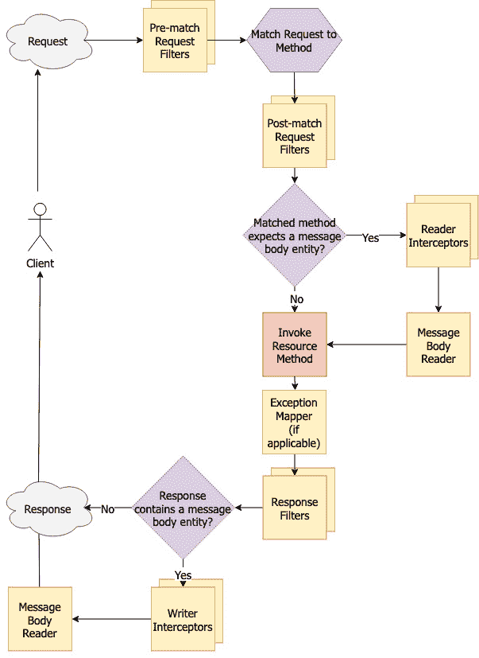
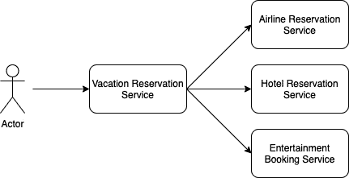

# *第四章*：开发云原生应用程序

MicroProfile 4.1 基于某些 **Jakarta EE**（以前称为 **Java Enterprise Edition**）**应用程序编程接口**（**API**）——具体来说，是 **Jakarta RESTful Web Services**（**JAX-RS**）、**Jakarta Contexts and Dependency Injection**（**CDI**）、**JavaScript Object Notation Processing**（**JSON-P**）和 **JSON Binding**（**JSON-B**）。仅使用这些技术，就可以开发一个完全能够胜任的云原生应用程序。MicroProfile 社区增加了一个用于调用 RESTful 服务的类型安全机制，称为 **MicroProfile Rest Client**。这些技术对于构建可以在云中互操作的基于 Java 的微服务至关重要。学习使用这些技术将使您能够构建健壮且安全的 Java 微服务。

在本章中，我们将探讨以下所有主题：

+   使用 JAX-RS 开发 RESTful 服务

+   使用 JSON-P 和 JSON-B 管理有效载荷

+   使用 MicroProfile Rest Client 消费 RESTful 服务

+   使用 CDI 管理生命周期和 **依赖注入**（**DI**）

本章涵盖了广泛的技术以及每个技术中的功能。当您完成本章后，您应该对如何构建可靠、健壮的 RESTful 应用程序，并使用 JSON 互相通信有广泛而深入的理解。

# 技术要求

为了构建和运行本章中提到的示例，您需要一个装有以下软件的 Mac 或 PC（Windows 或 Linux）：

+   **Java 开发工具包**（**JDK**）版本 8 或更高 ([`ibm.biz/GetSemeru`](http://ibm.biz/GetSemeru))

+   Apache Maven ([`maven.apache.org/`](https://maven.apache.org/))

+   Git 客户端 ([`git-scm.com/`](https://git-scm.com/))

+   本章中使用的所有源代码均可在 GitHub 上找到，网址为 [`github.com/PacktPublishing/Practical-Cloud-Native-Java-Development-with-MicroProfile/tree/main/Chapter04`](https://github.com/PacktPublishing/Practical-Cloud-Native-Java-Development-with-MicroProfile/tree/main/Chapter04)。

一旦您已经克隆了 GitHub 仓库，您可以通过进入 `Chapter04` 目录并在命令行中运行以下命令来启动 Open Liberty 服务器，这些代码示例将在其中执行：

```java
 mvn clean package liberty:run
```

您可以通过在相同的命令窗口中按 *Ctrl + C* 来停止服务器。

现在我们已经处理好了先决条件，让我们先构建一个基本的 RESTful 服务。

# 使用 JAX-RS 开发 RESTful 服务

在本节中，我们将使用 JAX-RS 开发几个 RESTful 服务。我们将从一个简单的例子开始，然后添加更复杂和强大的技术，如异常处理、将 **超文本传输协议**（**HTTP**）数据高级转换为 Java 对象（反之亦然）、横切关注点、异步方法和 DI。

JAX-RS 是围绕 **请求-响应** 管道这一理念构建的。在服务器端，一个 HTTP 请求进入管道，然后 JAX-RS 服务器在请求上调用任何预匹配的 **过滤器**。然后它尝试将请求与 JAX-RS **资源方法** 匹配。

当 JAX-RS 容器收到一个传入请求时，它将执行以下过程：

1.  调用任何已注册的预匹配过滤器。

1.  尝试将请求与 `resource` 方法匹配。如果无法匹配，容器将响应适当的 `not found` HTTP 响应。

1.  调用任何已注册的匹配后过滤器。

1.  如果需要，执行 HTTP 数据（如 HTTP 实体有效负载或参数、头等）到资源方法可消费的 Java 对象的转换。

1.  调用 `resource` 方法。

1.  如果需要，执行异常处理。

1.  调用任何已注册的响应过滤器。

1.  如果需要，执行 Java 对象到 HTTP 响应数据的转换。

1.  将 HTTP 响应返回给客户端。

以下图表展示了该管道流程：



](img/Figure_4.1_-_B17377.jpg)

图 4.1 – JAX-RS 服务器管道流程

在 JAX-RS 中，有三种类型的组件，如下概述：

+   **资源**：资源是使 RESTful 服务成为其自身的最终因素，因为它们包含业务逻辑。

+   `MessageBodyReader`、`MessageBodyWriter`、`ParamConverter`、`ExceptionMapper`、`ReaderInterceptor` 和 `WriterInterceptor` 都是提供者。

+   使用 `Application` 子类来为 JAX-RS 应用程序提供配置。

现在我们已经了解了基本流程，让我们创建一个简单的 JAX-RS 应用程序。

## Hello World！

一个 JAX-RS 应用程序必须至少包含一个资源类。提供者可选。只有在没有指定应用程序路径的 `web.xml` 文件时，才需要 `Application` 子类。因此，一个非常简单的应用程序可能看起来像这样：

```java
@ApplicationPath("/rest")
public class HelloWorldApp extends Application {}
@Path("/hello")
public class HelloWorldResource {
    @GET
    public String helloWorld() {
        return "Hello World!";
    }
}
```

如果我们将此代码构建成一个名为 `myApp.war` 的 Web 应用程序，并将其部署到 Open Liberty 等 JAX-RS 容器中，我们可以通过浏览到 `http://localhost:9080/myApp/rest/hello` 来快速使用 HTTP 客户端测试它，我们会看到文本 **Hello World**！。

这之所以有效，是因为 `helloWorld()` 方法上的 `@GET` 注解告诉 JAX-RS 容器，当客户端向 `/rest` 应用程序路径下的 `.war` 扩展名的 `/hello` 路径发出 `GET` 请求时，应该调用此方法。默认情况下，大多数 HTTP 客户端（浏览器、`curl` 等）使用 `GET`，除非指定其他方式。这提出了关于工具的一个很好的观点。在开发 RESTful 应用程序时，拥有一个可以发出不同类型 HTTP 请求的客户端工具非常有价值。命令行工具如 `curl` 非常有用，还有基于浏览器扩展的工具也可以使用。

## 一个更贴近现实世界的例子

现在我们已经构建了一个简单的 JAX-RS 应用程序，让我们构建一个更复杂的应用程序——一个同义词服务，客户端可以搜索和更新同义词。我们将从一个 **异常映射器** 开始，如下所示：

```java
@Provider
public class NoSuchWordExceptionMapper implements 
  ExceptionMapper<NoSuchWordException> {
    @Override
    public Response toResponse(NoSuchWordException ex) {
        return Response.status(404)                   .entity(ex.getMessage()).build();
    }
}
```

大多数应用程序都会遇到 `NoSuchWordException` 异常，该异常可以用来指示搜索的单词不存在。在应用程序中，有人指定了一个不存在的单词是明确的，但对于 HTTP 客户端来说则不是。`NoSuchWordExceptionMapper` 提供器类使得这一点成为可能。它使得资源类方法能够抛出 `NoSuchWordException` 异常，JAX-RS 容器会将该异常映射到一个 HTTP 响应（在这种情况下，是一个 `404 Not Found` 错误）。

接下来是资源类（完整的源代码可在 [`github.com/PacktPublishing/Practical-Cloud-Native-Java-Development-with-MicroProfile/blob/main/Chapter04/src/main/java/com/packt/microprofile/book/ch4/thesaurus/ThesaurusResource.java`](https://github.com/PacktPublishing/Practical-Cloud-Native-Java-Development-with-MicroProfile/blob/main/Chapter04/src/main/java/com/packt/microprofile/book/ch4/thesaurus/ThesaurusResource.java) 找到）的示例，如下代码片段所示：

```java
@Path("/thesaurus/{word}")
@Consumes(MediaType.TEXT_PLAIN)
@Produces(MediaType.TEXT_PLAIN)
public class ThesaurusResource { // ... 
```

资源类上有几个新的注解：`@Produces` 和 `@Consumes`。这些注解可以放置在资源类或方法上——与 JAX-RS 中此类注解的大多数注解一样，方法上的注解优先于类上的注解。这些注解有助于控制请求的匹配以及用于从请求反序列化 HTTP 实体或响应中序列化 HTTP 实体的实体提供者（`MessageBodyReaders` 和 `MessageBodyWriters`）。

HTTP 请求和响应可能包含一个表示 `Content-Type` 的头信息。HTTP 请求也可能包含一个头信息，指定它期望在响应中接收的媒体类型（或多个媒体类型）——`Accept`。如果没有这些头信息，则允许所有媒体类型（用 `*/*` 表示）。

在前面的例子中，资源类指定了 `MediaType.TEXT_PLAIN` 或 `text/plain`。其他媒体类型包括 `text/html`、`application/json`、`application/xml`、`image/jpeg` 以及更多。指定 `text/plain` 将会阻止资源方法在请求包含如 `Content-Type: application/pdf` 或 `Accept: image/png` 等头信息时被调用——在这种情况下，JAX-RS 容器会返回一个 `415 Unsupported Media Type` 错误。

最佳实践

总是使用 `@Produces` 和 `@Consumes` 来限制媒体类型。这将限制你的服务将响应的类型。这将确保你的应用程序（如果经过适当测试）可以处理指定媒体类型的请求。

此示例还介绍了新的方法级 HTTP 动词注解：`@POST`、`@PUT`、`@DELETE` 和 `@PATCH`。与 `@GET` 一样，这些注解指定应根据 HTTP 请求的 `@HEAD` 和 `@OPTIONS`（较少使用）调用哪个方法。

特别注意

如果资源类包含一个带有 `@GET` 注解但没有 `@HEAD` 注解的方法，JAX-RS 容器将调用 `@GET` 方法来匹配 HTTP `HEAD` 请求，但会移除实体。同样，如果资源类包含除 `@OPTIONS` 之外的其他 HTTP 动词注解，JAX-RS 容器将返回一个响应，指示可以匹配该请求的所有有效动词。使用前面的示例，`OPTIONS` 请求将导致一个包含类似 `Allow: DELETE, HEAD, GET, OPTIONS, PATCH, POST, PUT` 的响应头。

此示例还介绍了 HTTP 参数的概念——特别是 `@PathParam("word") String word;`。

这个注解可以放置在字段或方法参数上。`@PathParm` 的值是 `word`，它对应资源类 `@Path` 值中的模板变量（`"/thesaurus/{word}"`）。这意味着对于像 `http://localhost:9080/myApp/rest/thesaurus/funny` 这样的 HTTP 请求，注入到 `word` 字段的值将是 `funny`。

在 JAX-RS 中可以使用其他 HTTP 参数类型，包括 `@QueryParam`、`@FormParam`、`@CookieParam`、`@HeaderParam` 和 `@MatrixParam`，它们都对应 HTTP 请求的不同部分。JAX-RS 还允许在单个 Java 类上聚合多个 HTTP 参数注解，然后在资源类或方法中作为 `@BeanParam` 参数类型引用。以下是一个示例：

```java
public class ParamBean {
    private int id;
    @QueryParam("id")
    public void setId(int id) {
        this.id = id;
    }
    @HeaderParam("X-SomeHeader")
    public String someHeaderValue;
    @PathParam("path")
    public String pathParamValue;
    @Override
    public String toString() {
        return "ID: " + id + " X-SomeHeader: "            + someHeaderValue + " path: " + pathParamValue;
    }
} 
```

`ParamBean` 实体只是一个 `@*Param` 注解。然后，这个 POJO 被注入到一个资源中，如下所示：

```java
@GET
@Path("/beanparam/{path}")
public Response get(@BeanParam ParamBean params) {
    return Response.ok(params.toString()).build();
}
```

`@BeanParam` 可以非常有助于聚合常见的 RESTful 参数集合，以避免编写重复的代码。让我们使用 `curl` 从命令行测试此示例，如下所示：

```java
$ curl "http://localhost:9080/rest/beanparam/  myPath?id=1234" -H "X-SomeHeader: MyHeaderValue"
ID: 1234 X-SomeHeader: MyHeaderValue path: myPath
```

有一个需要注意的事情是，并非所有参数都不会为空，因此您需要检查空值，或者可以使用 `@DefaultValue` 注解。这也适用于方法参数。这里提供了一个示例：

```java
@GET public String get(@QueryParam("startPage") 
@DefaultValue("1") Integer startPage) { // ...
```

注意，`@DefaultValue` 注解中的值始终是字符串，但只要它可以从字符串转换为参数类型（在这种情况下是 `Integer`），它就会工作。在下一节中，我们将学习如何将客户端发送的数据转换为我们的应用程序代码中的 Java 对象。

## 实体提供者和参数转换器

到目前为止，我们的资源方法主要处理字符串或其他原始数据。JAX-RS 容器负责序列化和反序列化这些对象，但如果我们想发送和接收更复杂的对象怎么办？在这些情况下，我们可能需要实现一些 `ParamConverter`。

### 实体提供者

实体提供者包括`MessageBodyReader`和`MessageBodyWriter`，它们分别负责将 HTTP 实体数据反序列化为 Java 对象，以及将 Java 对象序列化为 HTTP 实体。

假设我们有一个`Person`对象，如下所示：

```java
public class Person {
    public enum Color {
        RED, BLUE, YELLOW, GREEN, ORANGE, PURPLE
    }
    private String firstName;
    private String lastName;
    private int age;
    private Color favoriteColor;
    //public getters/setters
}
```

再假设我们有一个`service`对象，如下所示：

```java
@Path("/person")
@Produces(MediaType.APPLICATION_JSON)
@Consumes(MediaType.APPLICATION_JSON)
public class PersonService {
    static List<Person> people = new ArrayList<>();
    @GET
    @Path("/{id}")
    public Person getPerson(@PathParam("id") int id) {
        try {
            return people.get(id);
        } catch (IndexOutOfBoundsException ex) {
            throw new WebApplicationException               (Response.status(404).entity("ID " + id + "                 not found.").build());
        }
    }
    @POST
    public int postPerson(Person person) {
        people.add(person);
        return people.lastIndexOf(person);
    }
}
```

这里需要注意的一点是，`getPerson(…)`方法抛出了一个新的`WebApplicationException`异常，并将其作为`404`响应传递。这是将异常映射到响应而不需要`ExceptionMapper`实例的另一种方式。

最佳实践

当多个资源方法可能抛出相同的异常时，请使用`ExceptionMappers`。只有在没有合适的业务异常可以抛出，或者你只从单个资源方法中抛出异常的情况下，才使用带有传入的`Response`对象的`WebApplicationException`异常。

另一点需要注意是，这个资源使用`APPLICATION_JSON`作为它产生的和消费的媒体类型。`application/json`媒体类型是微服务中最常用的内容类型。以下是从上一个示例代码中获取的`Person`对象：

```java
{
 "firstName": "John",
 "lastName": "Doe",
 "age": 33,
 "favoriteColor":"RED"
}
```

为了使客户端能够通过`POST`方法创建一个新的`Person`对象，我们需要一个`MessageBodyReader`实例。有一些内置的读取器可以很好地处理这个问题，但到目前为止，我们将编写并注册自己的，如下所示（完整的源代码可在[`github.com/PacktPublishing/Practical-Cloud-Native-Java-Development-with-MicroProfile/blob/main/Chapter04/src/main/java/com/packt/microprofile/book/ch4/entityandparamproviders/MyJsonReader.java`](https://github.com/PacktPublishing/Practical-Cloud-Native-Java-Development-with-MicroProfile/blob/main/Chapter04/src/main/java/com/packt/microprofile/book/ch4/entityandparamproviders/MyJsonReader.java)）：

```java
@Provider
@Consumes(MediaType.APPLICATION_JSON)
public class MyJsonReader implements MessageBodyReader<Person> {
    @Override
    public boolean isReadable(Class<?> type, Type         genericType, Annotation[] annotations, MediaType             mediaType) {
        return type.equals(Person.class) &&            mediaType.isCompatible(MediaType                 .APPLICATION_JSON_TYPE);
    }
    @Override
    public Person readFrom(Class<Person> type,         Type genericType, Annotation[] annotations,             MediaType mediaType,
        MultivaluedMap<String, String> httpHeaders,           InputStream entityStream)
                 throws IOException, WebApplicationException {
        String s = new BufferedReader(new InputStreamReader             (entityStream)).lines().collect                 (Collectors.joining(" ")).trim();
        if (!s.startsWith("{") || !s.endsWith("}")) {
            throw new WebApplicationException(Response                 .status(400).build());
        }
        Person p = new Person();
        // ... parse string into Peron object ...
        return p;
    }
}
```

此外，为了将`Person`对象作为 JSON 写入响应实体，我们必须注册一个 JSON 的`MessageBodyWriter`实例，如下所示（完整的源代码可在[`github.com/PacktPublishing/Practical-Cloud-Native-Java-Development-with-MicroProfile/blob/main/Chapter04/src/main/java/com/packt/microprofile/book/ch4/entityandparamproviders/MyJsonWriter.java`](https://github.com/PacktPublishing/Practical-Cloud-Native-Java-Development-with-MicroProfile/blob/main/Chapter04/src/main/java/com/packt/microprofile/book/ch4/entityandparamproviders/MyJsonWriter.java)）：

```java
@Provider
@Produces(MediaType.APPLICATION_JSON)
public class MyJsonWriter implements 
  MessageBodyWriter<Person> {
    @Override
    public boolean isWriteable(Class<?> type, Type         genericType, Annotation[] annotations, MediaType             mediaType) {
        return type.equals(Person.class) && mediaType             .isCompatible(MediaType.APPLICATION_JSON_TYPE);
    }
    @Override
    public void writeTo(Person p, Class<?> type, Type         genericType, Annotation[] annotations, MediaType             mediaType, MultivaluedMap<String, Object>              httpHeaders, OutputStream entityStream)
        throws IOException, WebApplicationException {
            PrintStream ps = new PrintStream(entityStream);
            // print Person object to entity stream
    }
}
```

这些提供者可以很容易地合并成一个实现两个接口的 `MyJsonEntityProvider` 类。这两个实现都使用 `InputStream` 从客户端请求中读取实体，并使用 `OutputStream` 来写入响应实体。这两个提供者都有一个布尔检查，以验证这是否是应该调用的正确实体提供者——除了指定的泛型类型（`Person`）和 `@Consumes`/`@Produces` 值之外，返回 `true` 或 `false` 对于 `isReadable` 或 `isWriteable` 方法将告诉 JAX-RS 容器是否应该使用此提供者来序列化/反序列化数据。

选择多个提供者的另一个标准将是 `@Priority` 注解——JAX-RS 容器将选择具有最高优先级的提供者（优先级值最低——因此，`@Priority(1)` 将在 `@Priority(2)` 之前被选中）。

最终，从读取者的 `readFrom` 方法返回的值将被注入到资源方法的 `@Context`（更多内容请参阅 *上下文注入* 部分）或 `@*Param`。资源方法可能包含零个或一个实体参数——任何更多都将导致部署失败。

在响应方面，写入到写入者的 `writeTo` 实体流中的内容将被写入发送回客户端的 HTTP 响应。

如果此时编写和读取 JSON 的代码复杂度看起来有点令人畏惧，不要担心！我们将在下一节中介绍一个更简单的方法。

因此，实体提供者负责将 HTTP 实体序列化和反序列化为对象，但参数如查询参数、路径参数等怎么办？这些参数使用 `ParamConverter` 进行反序列化。

### ParamConverter

在我们的 `PersonService` 示例的基础上，让我们添加一个 `PATCH` 方法，允许客户端更改一个人的最喜欢的颜色，如下所示：

```java
    @PATCH
    @Path("/{id}")
    public Person updateFavoriteColor(@PathParam("id") int         id, @QueryParam("color") Color color) { // ...
```

我们可以从命令行像这样调用此方法：

```java
$ curl http://localhost:9080/rest/person/0?color=BLUE -X PATCH
{
 "firstName": "John",
 "lastName": "Doe",
 "age": 33,
 "favoriteColor":"BLUE"
}
```

我们能够更新约翰最喜欢的颜色，因为 JAX-RS 容器能够识别出 `Color` 是一个枚举类型，因此它会调用其 `valueOf(String)` 方法来获取在调用 `updateFavoriteColor` 方法时注入的 `Color` 对象。但是当我们指定小写的 `color` 时会发生什么？让我们看一下以下输出以了解情况：

```java
$ curl http://localhost:9080/rest/person/0?color=blue -X PATCH -v
...
< HTTP/1.1 404 Not Found
...
<
```

哎呀！JAX-RS 容器无法将请求与资源方法匹配（导致返回 `404 Not Found` 响应），因为它无法将 `blue` 转换为 `Color.BLUE`。为了使我们的服务更具弹性或处理更复杂的参数，我们必须像这样使用 `ParamConverterProvider` 和 `ParamConverter`：

```java
@Provider
public class ColorParamConverterProvider implements   ParamConverterProvider {
  @Override
  public <T> ParamConverter<T> getConverter(Class<T>     rawType, Type genericType, Annotation[] annotations) {
    if (rawType.equals(Color.class)) {
        return (ParamConverter<T>) new ColorParamConverter();
    }
    return null;
  }
}
```

`ParamConverterProvider` 负责返回一个实现 `ParamConverter` 接口的类的实例，例如如下所示：

```java
public class ColorParamConverter implements   ParamConverter<Color> {
  @Override
  public Color fromString(String value) {
    return Color.valueOf(value.toUpperCase());
  }
  @Override
  public String toString(Color value) {
    return value.name();
  }
}
```

第一类，`ColorParamConverterProvider`是已注册的提供者类。当一个资源方法有一个需要从`String`转换为对象的参数时，JAX-RS 容器将调用任何已注册的`ParamConverterProvider`类的`getContainer`方法，直到其中一个返回非空的`ParamConverter`实例。

`ColorParamConverter`类简单地将字符串值转换为大写，以确保枚举的`valueOf`方法将返回`Color.BLUE`颜色，无论客户端请求的查询参数是`BLUE`、`Blue`、`blue`、`bLuE`等。

如示例所示，`ParamConverter`适用于`@QueryParam`参数，但也适用于`@CookieParam`、`@FormParam`、`@HeaderParam`、`@MatrixParam`和`@PathParam`参数，并且可以将字符串转换为任何对象，反之亦然。在客户端，从对象到`String`的转换非常重要。我们将在*使用 MicroProfile Rest Client 消费 RESTful 服务*这一节中讨论这个问题。

## 请求和响应的拦截

在某些情况下，您可能需要在`MessageBodyReader`实体提供者处理请求之前或之后检查输入流。同样，也可能会出现您想在`MessageBodyWriter`实体提供者处理输出流之前或之后执行额外处理的情况。`ReaderInterceptors`和`WriterInterceptors`就是为了这类任务而设计的。

### ReaderInterceptors 和 WriterInterceptors

在我们的`MessageBodyReader`实体提供者中，我们进行了大量的字符串修剪调用，这在性能方面可能是昂贵的。我们可能减少此类调用的一种方法是在`ReaderInterceptor`提供者中从实体流中删除空白字符，这样`MessageBodyReader`提供者就可以始终假设流中不包含空白字符。以下是一个示例：

```java
@Provider
public class WhiteSpaceRemovingReaderInterceptor implements   ReaderInterceptor {
    @Override
    public Object aroundReadFrom(ReaderInterceptorContext       context) throws IOException, WebApplicationException {
        InputStream originalStream = context.getInputStream();
        String entity = // convert stream to string
        entity = entity.replaceAll("\\s","");
        context.setInputStream(new ByteArrayInputStream           (entity.getBytes()));
        return context.proceed();
    }
}
```

当客户端发送包含空格、换行符或其他空白字符的多行请求实体时，您可以看到这将与系统输出一起转换，如下所示：

```java
PRE: {
 "firstName": "John",
 "lastName": "Doe",
 "age": 33,
 "favoriteColor":"RED"
}
POST: {"firstName":"John","lastName":"Doe","age":33,  "favoriteColor":"RED"}
```

`WriterInterceptors`的一个常见用途是使用 GZIP 压缩来减少响应实体的大小——请参阅[`github.com/PacktPublishing/Practical-Cloud-Native-Java-Development-with-MicroProfile/blob/main/Chapter04/src/main/java/com/packt/microprofile/book/ch4/interceptorsandfilters/GzipWriterInterceptor.java`](https://github.com/PacktPublishing/Practical-Cloud-Native-Java-Development-with-MicroProfile/blob/main/Chapter04/src/main/java/com/packt/microprofile/book/ch4/interceptorsandfilters/GzipWriterInterceptor.java)的完整示例。

关于实体流的特殊说明

虽然你可以从多个地方读取实体流（实体提供者、读取器或写入拦截器、过滤器——我们将在稍后介绍这些），但在这样做时可能会遇到问题。例如，你的初始请求实体流可能不支持重新读取，所以如果你尝试读取两次，你可能会遇到 `IOException` 异常。在这种情况下，你可能需要重置流（如果流支持重置——每个 JAX-RS 容器可能略有不同）或完全复制并替换流，就像我们在 `ReaderInterceptor` 示例中所做的那样。

### 过滤器

在 `ReaderInterceptors` 和 `WriterInterceptors` 截获实体流的读取和写入时，**过滤器**截获整体请求和响应。过滤器在 RESTful 应用程序中启用了一些强大的横切能力。那么，我们可以用过滤器做什么呢？我们可能可以用这本书的其余部分来填充有用的示例，从管理身份验证、授权请求、重定向请求、管理头信息、在浪费服务器资源之前终止无效请求、审计日志请求/响应、检测可疑活动、提供应用程序统计信息、跟踪请求/响应、限制特定客户端的请求，等等。

让我们从以下示例开始，该示例检查传入的 API 密钥请求，如果没有找到 API 密钥、API 密钥不可识别或该 API 密钥已超过当天最大请求数量（完整源代码可在[`github.com/PacktPublishing/Practical-Cloud-Native-Java-Development-with-MicroProfile/blob/main/Chapter04/src/main/java/com/packt/microprofile/book/ch4/interceptorsandfilters/ApiKeyCheckFilter.java`](https://github.com/PacktPublishing/Practical-Cloud-Native-Java-Development-with-MicroProfile/blob/main/Chapter04/src/main/java/com/packt/microprofile/book/ch4/interceptorsandfilters/ApiKeyCheckFilter.java)找到）。请查看以下代码片段：

```java
@PreMatching
@Provider
public class ApiKeyCheckFilter implements 
    ContainerRequestFilter {
    private final Map<String, Integer> apiInvocations = new 
      ConcurrentHashMap<>();
    @Override
    public void filter(ContainerRequestContext       requestContext) throws IOException {
        String apiKey = requestContext.getHeaderString            (API_KEY_HEADER);
        if (apiKey == null) {
            requestContext.abortWith(Response.status(              Status.UNAUTHORIZED).build());
            return;
        }
        // get count of recent invocations for this API key 
        int currentInvocations = // ...
        if (currentInvocations == -1) {
            requestContext.abortWith(                Response.status(Status.FORBIDDEN).build());
            return;
        }
        if (currentInvocations > MAX_REQUESTS_PER_INTERVAL) {
            requestContext.abortWith(                Response.status(Status.TOO_MANY_REQUESTS)                        .header(HttpHeaders.RETRY_AFTER, 5)                        .build());
            return;
        }
    }
}
```

此示例检查客户端是否通过 HTTP 头发送了 API 密钥，API 密钥是否有效（通过其在映射中的存在），以及用户的密钥是否未超过其请求配额。如果发生任何这些条件，过滤器将终止请求并返回对客户端有用的响应。如果过滤器方法正常退出，则请求将继续，JAX-RS 容器将尝试将请求与资源类和方法匹配。

一旦请求与资源方法匹配，JAX-RS 容器将调用匹配后请求过滤器。这些过滤器在作为预匹配过滤器执行 `ContainerRequestFilter` 时很有用，但没有 `@PreMatching` 注解。匹配后过滤器还启用了 `RequestContext` 对象的更多方法，以便它知道将调用哪个资源。这在你的过滤器可能根据它将调用的资源类/方法而表现不同的场合很有用。

响应过滤器与请求过滤器类似，但在资源方法完成后被调用。然后，响应过滤器可以进一步细化或转换响应。它们可以添加或修改响应头或 cookie。它们也可以完全替换响应实体，尽管`MessageBodyWriter`提供者和/或`WriterInterceptor`提供者可能更适合这种情况。

## 动态提供者

到目前为止，我们讨论的所有提供者都将应用于所有请求——或者至少是所有匹配的请求——唯一的例外是实体提供者，它将应用于请求指定的所有媒体类型（s）的请求。但如果我们希望某些提供者只在特定情况下执行，例如在调用特定资源方法或请求包含特定内容，或者客户端的用户是特殊群体的一部分时，怎么办呢？JAX-RS 提供了一些不同的机制来实现更动态的提供者。首先，我们将看看名称绑定。

**名称绑定**允许用户在一个或多个提供者类以及一个或多个资源类或方法上放置自定义注解。JAX-RS 容器将识别这个注解，并且只有在目标资源方法或类也被注解的情况下才会调用提供者。例如，如果我们想记录某些请求，我们可能会创建一个这样的注解：

```java
@NameBinding
@Retention(RetentionPolicy.RUNTIME)
@Target({ElementType.METHOD, ElementType.TYPE})
public @interface Logged {}
```

`@NameBinding`注解是告诉 JAX-RS 容器注意这个注解的。我们现在可以创建一个记录请求方法、**统一资源标识符**（**URI**）以及请求和响应实体的过滤器（完整的源代码可在[`github.com/PacktPublishing/Practical-Cloud-Native-Java-Development-with-MicroProfile/blob/main/Chapter04/src/main/java/com/packt/microprofile/book/ch4/dynamicbinding/LoggingFilter.java`](https://github.com/PacktPublishing/Practical-Cloud-Native-Java-Development-with-MicroProfile/blob/main/Chapter04/src/main/java/com/packt/microprofile/book/ch4/dynamicbinding/LoggingFilter.java)找到）。看看下面的代码片段：

```java
@Logged
@Provider
public class LoggingFilter implements 
  ContainerRequestFilter, ContainerResponseFilter {
    @Override
    public void filter(ContainerRequestContext       requestContext) throws IOException {
        int requestID = idCounter.incrementAndGet();
        requestContext.setProperty("request.id", requestID);
        System.out.println(">>> " + requestID + " "            + requestContext.getRequest().getMethod() + " "             + requestContext.getUriInfo().getRequestUri()            + " " + getAndReplaceEntity(requestContext));
    }
    @Override
    public void filter(ContainerRequestContext         requestContext, ContainerResponseContext             responseContext)
            throws IOException {
        int requestID = (int) requestContext.getProperty             ("request.id");
        System.out.println("<<< " + requestID + " "            + requestContext.getUriInfo().getRequestUri()            + " " + responseContext.getEntity());
    }
    //...
}
```

这个`filter`类既是请求过滤器也是响应过滤器。虽然将请求和响应过滤器（或者甚至其他提供者类型）组合在一起非常方便，但重要的是要注意，生命周期行为可能从一个 JAX-RS 容器变化到另一个容器。一般来说，被认为是一种最佳实践，不要在实例变量中存储数据。如果您想从请求的过滤器方法存储一些数据以在响应的过滤器方法中使用，一个更便携的方法是将该数据存储在`requestContext`中作为一个属性，就像我们在前面的例子中为请求**标识符**（**ID**）所做的那样。

现在，我们只需将`@Logged`注解添加到需要记录的类（类中的所有方法）或方法上，所以在这个例子中，只有`POST`方法会被记录（完整的源代码可在[`github.com/PacktPublishing/Practical-Cloud-Native-Java-Development-with-MicroProfile/blob/main/Chapter04/src/main/java/com/packt/microprofile/book/ch4/dynamicbinding/DynamicResource.java`](https://github.com/PacktPublishing/Practical-Cloud-Native-Java-Development-with-MicroProfile/blob/main/Chapter04/src/main/java/com/packt/microprofile/book/ch4/dynamicbinding/DynamicResource.java)找到）：

```java
@Path("/dynamic")
public class DynamicResource {
    @GET
    public String getMessage() { // ...
    @POST
    @Logged
    public String postMessage(String message) { // ...
}
```

另一种动态应用提供者的方法是使用`configure`，它提供了一个`ResourceInfo`对象，用于确定匹配资源的具体信息，以及一个`FeatureContext`对象，用于配置提供者和属性或查看每个请求的应用程序配置。以下示例将`LoggingFilter`类添加到所有以`get`开头的方法资源中：

```java
@Provider
public class MyDynamicFeature implements DynamicFeature {
    @Override
    public void configure(ResourceInfo resourceInfo,       FeatureContext context) {
        Method m = resourceInfo.getResourceMethod();
        if (m.getName().startsWith("get")) {
            context.register(LoggingFilter.class);
        }
    }
}
```

由于`ResourceInfo`对象将返回匹配的类和方法，因此也可以检查匹配资源的注解。这使得动态功能可以为特定 HTTP 动词的所有请求（`if (resourceInfo.getResourceMethod().getAnnotation(GET.class) != null) { //…`）或没有`@NameBinding`注解的方法注册提供者变得容易。

名称绑定注解和动态过滤器是控制请求和响应处理的有效方法。

## 异步

足够了，关于提供者！让我们回到 RESTful 服务的核心——资源。在许多情况下，JAX-RS 请求/响应流的同步特性效率低下。例如，假设你的资源倾向于将请求传递给一个数据存储，该数据存储在数据库中查找或修改数据。如果你的数据存储逻辑有一组固定的线程执行数据库操作，那么当服务负载较高时，传入的请求可能会排队。使用我们迄今为止一直在使用的同步流程，这意味着执行流程会在资源方法内部阻塞，等待数据存储逻辑完成，然后才能完成流程。这可能会效率低下，因为一个线程实际上在等待另一个线程完成。如果这个初始线程在数据存储操作进行时执行其他任务，可能会更有效率。使用 JAX-RS 中的**异步**API 可以获得更高的效率。

### 异步响应

在 JAX-RS 中创建异步方法是通过在资源方法中添加一个`AsyncResponse`参数并使用`@Suspended`注解来实现的。一旦从数据存储中获取了数据，`AsyncResponse`对象就可以用来*恢复*请求。让我们看一个例子。假设我们有一个跟踪人员的服务，就像我们在*实体提供者*部分使用的那样。我们将稍微修改资源类，以便数据存储访问使用一个单独的`Executor`类来检索数据（完整的源代码可在[`github.com/PacktPublishing/Practical-Cloud-Native-Java-Development-with-MicroProfile/blob/main/Chapter04/src/main/java/com/packt/microprofile/book/ch4/async/AsyncPersonService.java`](https://github.com/PacktPublishing/Practical-Cloud-Native-Java-Development-with-MicroProfile/blob/main/Chapter04/src/main/java/com/packt/microprofile/book/ch4/async/AsyncPersonService.java)找到））。看看下面的代码片段：

```java
@Path("/person")
public class AsyncPersonService {
    static ExecutorService executor =         Executors.newFixedThreadPool(5);
    @GET
    @Path("sync/{id}")
    public Person getPersonSync(@PathParam("id") int id)       throws InterruptedException, ExecutionException {
        Future<Person> someData = executor.submit(() ->            getPerson(id));
        return someData.get();
    }

    private Person getPerson(int id) {//...
}
```

在这个版本的代码中，`getPersonSync`方法将向执行器服务提交一个请求以检索具有指定 ID 的`Person`对象，然后它将阻塞，直到执行器服务完成操作。在这种情况下（为了代码的简洁性），它只是从哈希表中拉取数据，但如果它要从远程数据库中拉取数据，那么在`someData.get()`调用中阻塞的时间可能会更长。

因此，让我们尝试提高效率，这样我们就不必阻塞。我们可以将`getPersonSync()`方法重写如下：

```java
    @GET
    @Path("async/{id}")
    public void getPersonAsync(@PathParam("id") int id,
      @Suspended AsyncResponse ar) {
        executor.submit(() -> {
            ar.resume(getPerson(id));
        });
    }
```

现在，执行器服务正在调用`getPerson(id)`方法，然后将结果传递给`ar.resume(…)`，这将从上次停止的地方恢复请求/响应流程并返回一个响应。调用`getPersonAsync(…)`方法的请求线程立即返回，可以用来处理另一个请求。

`AsyncResponse`对象也可以用来处理异常。假设我们希望在指定的 ID 与数据库中的任何`Person`实例不匹配时抛出`NoSuchPersonException`异常。我们可能将代码修改如下：

```java
executor.submit(() -> {
    Optional<Person> p = Optional.ofNullable(getPerson(id));
    if (p.isPresent())
        ar.resume(p.get());
    else ar.resume(new NoSuchPersonException());
});
```

当我们用一个异常恢复响应时，JAX-RS 容器将尝试将异常映射到一个合适的响应，就像在同步情况下所做的那样。

### 服务器端发送事件

服务器端异步的另一种形式是**服务器端发送事件**（**SSEs**）。SSEs 是**超文本标记语言 5**（**HTML 5**）规范的一部分，为客户端提供了一种从服务器异步注册和接收事件的方式。

JAX-RS 有两种发送 SSEs 的方式——直接向每个客户端流式传输和 **广播** 到所有客户端。让我们看看如何实现第一种方式，如下所示（完整源代码可在 [`github.com/PacktPublishing/Practical-Cloud-Native-Java-Development-with-MicroProfile/blob/main/Chapter04/src/main/java/com/packt/microprofile/book/ch4/async/SseService.java`](https://github.com/PacktPublishing/Practical-Cloud-Native-Java-Development-with-MicroProfile/blob/main/Chapter04/src/main/java/com/packt/microprofile/book/ch4/async/SseService.java) 找到）：

```java
@Path("/sse")
@Produces(MediaType.SERVER_SENT_EVENTS)
public class SseService {
    @GET
    public void stream3Events(@Context SseEventSink sink,                               @Context Sse sse) {
        Executors.newSingleThreadExecutor().submit(() -> {
            try (SseEventSink sinkToClose = sink) {
                sink.send(sse.newEventBuilder()
                             .mediaType(TEXT_PLAIN_TYPE)
                             .data("foo")
                             .name("fooEvent")
                             .id("1")
                             .build());
                Thread.sleep(500);
                // repeat for 2/bar
                Thread.sleep(500);
                // repeat for 3/baz
            } catch (InterruptedException ex) {}
        });
    }
}
```

这是一个虚构的例子，但它显示了方法在启动一个新线程后立即返回，该线程以半秒的延迟向客户端发送一些文本事件。

这个例子向我们展示了，为了使 JAX-RS 资源能够发送服务器端事件（SSEs），它必须生成 SSE 媒体类型（`MediaType.SERVER_SENT_EVENTS` 或 `text/event-stream`），并且该方法必须接收 `Sse` 和 `SseEventSink` 参数，这两个参数都带有 `@Context` 注解。`Sse` 类型是一个实用类，可以创建事件和广播器。`SseEventSink` 类型代表服务器和客户端之间的连接，因此调用 `send(…)` 方法会将新事件发送给特定的客户端，而调用 `close()` 方法（这是通过 try-with-resources 逻辑隐式执行的）将优雅地关闭与客户端的连接。

我们发送的事件具有 `text/plain` 媒体类型——媒体类型用于确定应该使用哪个 `MessageBodyWriter` 提供程序来序列化传递给数据方法的那个对象。`name(…)` 和 `id(...)` 方法可以为每个发送的事件提供额外的上下文。尽管 `data(…)` 方法是必需的，但始终指定媒体类型是一个最佳实践。

如果我们使用 `curl` 调用此服务，我们会看到如下内容：

```java
$ curl http://localhost:9080/rest/sse
event: fooEvent
id: 1
data: foo
event: barEvent
id: 2
data: bar
event: bazEvent
id: 3
data: baz
```

发送事件的另一种方法是使用 `SseEventSinks`，它将事件发送给所有已注册的客户端。让我们看看我们可能添加到 `SseService` 类中的代码示例，如下所示：

```java
    static SseBroadcaster broadcaster;
    static ScheduledExecutorService executor =         Executors.newSingleThreadScheduledExecutor();
    private void startBroadcasting(Sse sse) {
        if (broadcaster == null) {
            broadcaster = sse.newBroadcaster(); //...
        }
    }
    @GET
    @Path("/broadcast")
    public void broadcast(@Context SseEventSink sink,                          @Context Sse sse) {
        startBroadcasting(sse);
        broadcaster.register(sink);
        broadcaster.broadcast(sse.newEventBuilder()
            .mediaType(TEXT_PLAIN_TYPE)
            .data("new registrant")
            .build());
    }
```

与直接流方法一样，这种方法也要求方法生成 `SERVER_SENT_EVENTS` 媒体类型，并且方法具有 `SseEventSink` 和 `Sse` 参数类型。

首先，我们需要将 `SseBroadcaster` 设置为静态字段。我们这样做是因为 JAX-RS 资源默认的生命周期是每个请求。我们将在 *使用 CDI 管理生命周期和 DI* 部分讨论替代生命周期——这将简化此代码并提高性能。

一旦我们设置了广播器，我们就会将其与事件接收器注册。一旦注册，与该事件接收器关联的客户端将接收到从该广播器发送的所有事件。在这个例子中，每当有新的客户端注册以及每 5 秒钟，我们都会广播一个事件。让我们看看当我们是第一个客户端时，使用 `curl` 在命令行上看起来是什么样子，以及当第二个客户端注册（从一个单独的命令窗口）时的情况，如下所示：

```java
$ curl http://localhost:9080/rest/sse/broadcast
    UnnamedEvent
data: new registrant
    UnnamedEvent
data: ping
    UnnamedEvent
data: ping 
```

关于这个输出的一个需要注意的事项是 `未命名的 Event` 文本——这是因为 SSE 必须有一个名称，所以如果在构建时没有提供名称，JAX-RS 容器会为其创建一个名称。如果没有指定，其他 JAX-RS 容器可能会使用不同的名称。

## 上下文注入

我们已经讨论了在使用 `@Context` 注解 SSE 对象时的注入，但这个注解可以用在很多地方。**上下文注入**可以在资源和提供者中发生。你可以注入很多有用的事物，如下所述：

+   `ResourceContext`: 用于初始化子资源定位器

+   `ResourceInfo`: 用于确定匹配的资源类和方法

+   `HttpHeaders`: 用于读取客户端请求中的 HTTP 头

+   `SecurityContext`: 用于确定当前用户、他们的安全角色等

+   `UriInfo`: 用于读取客户端请求的 URI

+   `应用程序`: 用于获取表示此 RESTful 服务的应用程序

+   `提供者`: 用于访问其他 JAX-RS 提供者

+   `Sse` 和 `SseEventSink`: 在上一节中讨论

    最佳实践

    在大多数情况下，建议上下文注入发生在字段而不是参数中。原因是 Jakarta REST 项目打算废弃 `@Context` 注解，转而使用 CDI 的 `@Inject` 注解，该注解不针对方法参数。

**Javadoc** ([`jakarta.ee/specifications/restful-ws/2.1/apidocs/overview-summary.html`](https://jakarta.ee/specifications/restful-ws/2.1/apidocs/overview-summary.html)) 是理解这些可注入类型功能的最佳资源。以下是一些基本示例：

```java
@Context
SecurityContext secCtx;
@GET
public Response getSomeData() {
    if (secCtx.isUserInRole("special")) {
        return getSpecialResponse();
    }
    return getNormalResponse();
} 
```

此示例使用客户端用户主体的角色来确定要返回的实体响应。以下示例使用 `ResourceInfo` 类来确定是否应该使用 `MessageBodyWriter` 提供者：

```java
@Provider
@Produces(MediaType.APPLICATION_JSON)
public class MySpecialJsonWriter implements   MessageBodyWriter<Person> {
    @Context
    ResourceInfo resInfo;
    @Override
    public boolean isWriteable(Class<?> type, Type       genericType, Annotation[] annotations, MediaType        mediaType) {
        Class<?> resourceClass = resInfo.getResourceClass();
        return resourceClass.equals(SpecialResource.class)           && type.equals(Person.class) && mediaType             .isCompatible (APPLICATION_JSON_TYPE);
    }
```

将上下文对象注入资源和提供者使我们能够开发强大且灵活的应用程序。现在，让我们将注意力转向格式化应用程序需要发送和接收的数据。 

# 使用 JSON-P 和 JSON-B 管理有效载荷

虽然一般来说 RESTful 服务和具体来说 JAX-RS 应用可以提供任何媒体类型的实体（纯文本、**可扩展标记语言**（**XML**）、**可移植文档格式**（**PDF**）、二进制等），但 JSON 是云原生应用的**当红炸子鸡**。JSON 流行是因为它既易于阅读又易于解析——几乎在所有现代语言中都有 JSON 解析和绑定的库。

在 *实体提供者* 部分，我们体验了将 Java 对象（`Person`）序列化和反序列化为 JSON 的过程。在那个部分，我们通过字符串操作手动执行了这一操作。虽然手动方法可以工作，但现在我们将讨论两个 API，它们可以简化并增强 Java 中对 JSON 的控制。

JSON-P 是一个用于操作 JSON 的程序性 API，而 JSON-B 是一个声明性（基于注解）的 API，用于快速轻松地将对象映射到 JSON 或相反。

## JSON-P

`JsonObject`、`JsonArray` 等，这些都是对象模型 API 的一部分。

假设我们有一些这样的对象：

```java
public class Starship {
    private String name;
    private boolean hasHyperdrive;
    private List<Weapon> weapons;
    private int speedRating;
    //with public getters and setters
}
public class Weapon {
    private String name;
    private String type;
    private int damageRating;
    //with public getters and setters
}
```

假设我们想要将其转换为类似以下的 JSON 内容：

```java
{
  "name": "Coreillian Freighter",
  "hasHyperdrive": true,
  "speedRating": 22,
  "weapons": [
    {
      "name":"Quad Blaster Turret",
      "type":"Laser",
      "damageRating":24
    }
  ]
}
```

我们将从将 `Starship` 实例转换为 JSON 字符串开始。我们可以通过使用 `Json` 类来创建对象构建器和数组构建器来完成此操作。这些构建器可以通过添加属性或对象来创建对象。因此，为了创建飞船的 JSON，我们需要一个飞船的对象构建器，以及每个武器的对象构建器，然后是一个用于所有武器的数组构建器。一个这样的例子可以在[`github.com/PacktPublishing/Practical-Cloud-Native-Java-Development-with-MicroProfile/blob/main/Chapter04/src/main/java/com/packt/microprofile/book/ch4/jsonp/JsonpConverter.java`](https://github.com/PacktPublishing/Practical-Cloud-Native-Java-Development-with-MicroProfile/blob/main/Chapter04/src/main/java/com/packt/microprofile/book/ch4/jsonp/JsonpConverter.java)找到。

每个对象都需要自己的 `JsonObjectBuilder` 实例，每个数组或集合都需要自己的 `JsonArrayBuilder` 实例。然后，你只需向它们添加项目即可。

将 JSON 字符串反序列化为对象的方式相反。首先，你必须从 `JsonReader` 中提取 `JsonObject` 实例，如下所示：

```java
JsonReader reader = Json.createReader(new StringReader(json));
JsonObject shipObject = reader.readObject();
```

然后，你必须创建一个 `Starship` 实例，并从 `JsonObject` 的属性中填充它，如下所示：

```java
Starship ship = new Starship();
ship.setName(shipObject.getString("name"));
ship.setHasHyperdrive(shipObject.getBoolean
  ("hasHyperdrive"));
//...
```

此方法使用对象模型，它需要在将其转换为对象之前将整个 JSON 流加载到内存中。对于小 JSON 文件，这不会成为问题，并且允许模型存储在内存中并重新访问。它还允许在将 JSON 写回流之前更改模型。

流式方法需要的内存远少于对象模型，并且能够读取非常大的 JSON 流而不会耗尽内存。它是通过在读取 JSON 时触发事件，然后丢弃该部分的 JSON 来实现这一点的。这种方法非常高效，性能优于对象模型，但需要更复杂的编码，并且由于对象模型不在内存中，你无法稍后回过头来询问：“现在，那个值是什么来着？”

使用与之前相同的 Java 对象和 JSON 流，以下是序列化代码的示例（完整源代码可在[`github.com/PacktPublishing/Practical-Cloud-Native-Java-Development-with-MicroProfile/blob/main/Chapter04/src/main/java/com/packt/microprofile/book/ch4/jsonp/JsonpStreamingConverter.java`](https://github.com/PacktPublishing/Practical-Cloud-Native-Java-Development-with-MicroProfile/blob/main/Chapter04/src/main/java/com/packt/microprofile/book/ch4/jsonp/JsonpStreamingConverter.java)找到）：

```java
StringWriter sw = new StringWriter();
JsonGenerator generator = Json.createGenerator(sw);
generator.writeStartObject()
         .write("name", ship.getName())
         .write("hasHyperdrive", ship.isHasHyperdrive())
         .write("speedRating", ship.getSpeedRating())
         .writeStartArray("weapons");
for (Weapon w : ship.getWeapons()) {
    generator.writeStartObject()
             .write("name", w.getName())
             .write("type", w.getType())
             .write("damageRating", w.getDamageRating())
             .writeEnd();
}
generator.writeEnd()
         .writeEnd();
generator.close();
```

与 `JsonObjectBuilder` 和 `JsonArrayBuilder` 类似，`JsonGenerator` 可以传入类似映射的值来构建 JSON 对象。与对象模型构建器 API 不同，`JsonGenerator` 无法进行更改——一旦 JSON 被写入，就无法更改值。这两个构建器都有 `remove` 方法，而 `JsonArrayBuilder` API 有设置方法，允许您更改之前配置的值。存在这两种方法的原因是让您在灵活性和效率之间做出选择。

将 JSON 解析到对象中，基于流的方案甚至更复杂，如下所示：

```java
Starship ship = new Starship();
JsonParser parser = Json.createParser(new StringReader(json));
while (parser.hasNext()) {
    Event event = parser.next();
    if (event == Event.KEY_NAME) {
    String keyName = parser.getString();
    parser.next();
    switch(keyName) {
    case "name": ship.setName(parser.getString()); break;
    //...
    case "weapons": ship.setWeapons(parseWeapons(parser)); 
    }
}
```

解析器的工作方式类似于 Java 迭代器，返回事件以指示诸如对象开始（`{`）、对象结束（`}`）、数组开始（`[`）、数组结束（`]`）、键名（例如，`name` 和 `speedRating`）以及键值（例如，`Coreillian Freighter` 和 `24`）等信息。每个事件在其上下文中被解释是很重要的。例如，一个数组可能包含多个对象，因此需要跟踪当前正在解析的对象，以避免数据混淆。`parseWeapons` 方法通过分别解析数组中的每个项目来提供示例，如下面的代码片段所示：

```java
private List<Weapon> parseWeapons (JsonParser parser) {
   List<Weapon> weapons = new ArrayList<>();
   Event event = null;
   while ((event = parser.next()) != Event.END_ARRAY) {
      Weapon w = new Weapon();
      while (event != Event.END_OBJECT) {
         if (event == Event.KEY_NAME) {
             String keyName = parser.getString();
             parser.next();
             switch(keyName) {
             case "name": w.setName(parser.getString()); //...
             }
         }
         event = parser.next();
      }
      weapons.add(w);
   }
   return weapons;
}
```

JSON-P 提供了一套非常强大的 API，用于程序化地读取和写入 JSON。不过，代码可能会有些冗长。这正是 JSON-B 可以帮助解决的问题。

## JSON-B

虽然 JSON-P 非常强大且灵活，但 **JSON-B** 在序列化和反序列化对象到 JSON 方面非常简单且高效。JSON-B 有一些程序化 API，但总体而言，它采用声明式方法来编写/读取 JSON。这意味着对象到 JSON 的转换将基于对象类型的 getter 方法——同样，JSON 到对象的转换将基于对象类型的 setter 方法。

如果我们使用来自 JSON-P 的`Starships`和`Weapons`的示例对象，对象到 JSON 以及相反的转换非常简单，如下所示：

```java
StringWriter sw = new StringWriter();
Jsonb jsonb = JsonbBuilder.create();
jsonb.toJson(ship, sw);
String json = sw.getBuffer().toString();
```

直接转换为字符串是可能的，但使用`OutputStream`或`Writer`更可取，尤其是在处理大型 JSON 对象时。这里的主要对象是`Jsonb`和`toJson(…)`方法。你可以在这里看到输出：

```java
{"hasHyperdrive":true,"name":"Coreillian Freighter","speedRating":22,"weapons":[{"damageRating":24,"name":"Quad Blaster Turret","type":"Laser"}]}
```

这看起来与我们使用 JSON-P 创建的非常相似，但它都在一行中，难以区分一个对象在哪里结束，下一个对象在哪里开始。对于大多数 JSON 消费者来说，这应该不是问题，但如果我们想让它更易于阅读，我们可以通过用以下代码替换`JsonbBuilder.create()`方法调用来添加一些配置：

```java
Jsonb jsonb = JsonbBuilder.create(
    new JsonbConfig().withFormatting(true));
```

这将产生以下输出：

```java
{
    "hasHyperdrive": true,
    "name": "Coreillian Freighter",
    "speedRating": 22,
    "weapons": [
        {
            "damageRating": 24,
            "name": "Quad Blaster Turret",
            "type": "Laser"
        }
    ]
}
```

你可以使用几种其他配置选项来处理 Java 对象的序列化。例如，你也可以添加自己的`JsonParser`从 JSON-P，以你自己的方式将对象转换为 JSON。

将 JSON 转换回对象同样简单，如下所示：

```java
Starship shipFromJson = jsonb.fromJson(json,Starship.class);
```

与`toJson(…)`方法一样，你可以使用字符串或流。

那么，如果你有一个对象，但你想 JSON 字段的名字与 Java 属性名不同呢？或者，也许你根本不想将某些字段暴露为 JSON？这时，`@JsonbProperty("someOtherName")`和`@JsonbTransient`这样的注解就派上用场了，而且根据你放置注解的位置，它会产生不同的效果。如果注解在 getter 上，那么它只会应用于序列化（从 Java 到 JSON 的转换）。如果注解在 setter 上，那么它只会应用于反序列化。如果注解在字段本身上，那么它将应用于两者。让我们考虑以下代码片段：

```java
public class Person {
    private String firstName;
    @JsonbTransient
    private String middleName;
    @JsonbProperty("familyName")
    private String lastName;
    private String favoriteColor;
    private int age;
    //...all other public unannotated getters/setters
    @JsonbProperty("favouriteColour")
    public String getFavoriteColor() {
        return favoriteColor;
    }
    @JsonbProperty("yearsOld")
    public void setAge(int age) {
        this.age = age;
    }
}
```

我们将创建一个`Person`实例并将其打印为 JSON，如下所示：

```java
Person p = new Person();
p.setFirstName("John");
p.setMiddleName("Tiberius");
p.setLastName("Doe");
p.setFavoriteColor("Green");
p.setAge(25);
String jsonPerson = jsonb.toJson(p);
System.out.println(jsonPerson);
```

输出将看起来像这样：

```java
{
    "age": 25,
    "familyName": "Doe",
    "favouriteColour": "Green",
    "firstName": "John"
}
```

`lastName`字段已转换为`familyName`，`middleName`字段根本未打印，而`favoriteColor`字段已被英国化为`favouriteColour`。但如果我们尝试从这个 JSON 创建一个新的`Person`实例，我们会得到一个不完整的`Person`实例。让我们看一下，如下所示：

```java
Person p2 = jsonb.fromJson(jsonPerson, Person.class);
System.out.println(p2.getFirstName());
System.out.println(p2.getMiddleName());
System.out.println(p2.getLastName());
System.out.println(p2.getFavoriteColor());
System.out.println(p2.getAge());
```

这将产生以下输出：

```java
John
null
Doe
null
0
```

`middleName`字段在 JSON 中缺失，所以它为 null 并不奇怪。由于`@JsonbProperty("favouriteColour")`注解只存在于 getter 上，JSON-B 不会将英国化的 JSON 字段转换为美国化的 Java 字段。而且，由于`@JsonbProperty("yearsOld")`注解应用于`setAge(…)`方法，它将不会被设置，因为 JSON 仍在使用`age`字段名。

使用 JSON-B 时，注意注解放置的位置导致的差异行为是很重要的。

现在，让我们将这一点与 JAX-RS 相关联。JAX-RS 规范说明，支持 JSON-P 的产品必须为 `JsonStructure`、`JsonObject`、`JsonArray`、`JsonString` 和 `JsonNumber` 实体类型提供 `MessageBodyReaders` 和 `MessageBodyWriters`。此外，支持 JSON-B 的产品必须在媒体类型为 `application/json`、`text/json`、`*/json` 或 `*/*+json` 时为任何对象类型提供 `MessageBodyReaders` 和 `Writers`。任何实现整个 MicroProfile 规范集的产品都将包含 JAX-RS、JSON-P 和 JSON-B。这意味着在大多数情况下，你可以依赖你的 JAX-RS 容器来处理 JSON 到对象以及对象到 JSON 的转换。

现在我们已经学会了轻松处理 JSON 的方法，让我们学习如何使用客户端 API 发送请求并消费结果。

# 使用 MicroProfile Rest Client 消费 RESTful 服务

到目前为止，我们已经介绍了如何设计复杂的 RESTful 服务，以及如何轻松地将 JSON 转换为 Java 对象，反之亦然。接下来，我们需要使用客户端 API 来消费这些服务。在微服务架构中，RESTful 客户端对于调用远程服务至关重要。

## JAX-RS 客户端 API

消费 RESTful 服务的一种方式是使用 **JAX-RS 客户端 API**。与 JSON-P（与 JSON-B 相反），这些 API 通常更程序化，对单个选项（如头部、路径构建等）有更多的控制。让我们看看一些使用本章前面提到的同义词例子的代码，如下所示：

```java
String uri = "http://localhost:9080/rest/thesaurus";
Client client = ClientBuilder.newBuilder().build();
WebTarget target = client.target(uri).path(word);
Builder builder = target.request(MediaType.TEXT_PLAIN);
try (Response response = builder.get()) {
    int status = response.getStatus();
    assert status == 200;
} finally {
    client.close();
}
```

客户端实例是通过 `ClientBuilder` 构建的。在这个例子中，它只是构建了一个 `Client` 实例，但你也可以使用 `ClientBuilder` 来设置配置属性或注册客户端提供者。`Client` 实例在使用完毕后应显式关闭——它们目前没有实现 `AutoCloseable` 接口，但 JAX-RS 规范的未来版本将添加该接口，允许在 try-with-resources 块中关闭 `Client` 实例。

`WebTarget` 表示客户端请求的目的地。它有用于附加路径元素、解析路径模板变量、添加查询或矩阵参数或指定预期响应媒体类型的方法。在先前的例子中，我们使用以下行代码将 `word` 变量附加到 `uri` 变量：

```java
WebTarget target = client.target(uri).path(word);
```

或者，我们可以将 `uri` 变量更改为 `http://localhost:9080/rest/thesaurus/{word}`，然后我们可以使用以下行代码：

```java
WebTarget target = client.target(uri).resolveTemplate   ("word", word);
```

根据具体情况，两者可能都更易使用。

通过在 `WebTarget` 上调用 `request(…)` 方法创建一个 `Invocation.Builder` 对象——一个可选的媒体类型参数用于确定期望的响应媒体类型；它将设置 `Accept` 头。`Invocation.Builder` 对象具有 `get(…)`、`post(…)`、`put(…)`、`delete(…)` 以及其他表示请求中使用的 HTTP 动词的方法。您可以使用 `method(…)` 方法指定 API 中未内置的 HTTP 动词。它还具有设置 cookie 或头的其他方法。

`Invocation.Builder` 对象还具有 `async()` 和 `rx()` 方法，分别返回异步调用器和响应式调用器。这些调用器使用户能够异步检索响应，这通常可以提高性能。

`Response` 对象代表来自远程服务器的 HTTP 响应。从 `Response` 对象中，您可以检查响应的状态码（如 `200`、`204`、`400`、`404`、`500` 等）和响应头，读取响应实体，等等。请注意，`Response` 对象是 `AutoCloseable` 的——始终关闭 `Response` 和 `Client` 对象是一个好习惯。

## MicroProfile Rest Client

如果 JAX-RS 客户端类似于 JSON-P，那么 `@Path`、`@GET`、`@PUT`、`@POST`、`@DELETE` 等注解。MicroProfile Rest Client 实现提供了一个接口实例，然后您可以通过调用该接口来调用远程服务。

让我们来看一个例子，如下（完整的源代码可在[`github.com/PacktPublishing/Practical-Cloud-Native-Java-Development-with-MicroProfile/blob/main/Chapter04/src/main/java/com/packt/microprofile/book/ch4/client/ThesaurusClient.java`](https://github.com/PacktPublishing/Practical-Cloud-Native-Java-Development-with-MicroProfile/blob/main/Chapter04/src/main/java/com/packt/microprofile/book/ch4/client/ThesaurusClient.java)找到）：

```java
@Path("/thesaurus/{word}")
@Consumes(MediaType.TEXT_PLAIN)
@Produces(MediaType.TEXT_PLAIN)
public interface ThesaurusClient {
    @GET
    String getSynonymsFor(@PathParam("word") String word)        throws NoSuchWordException;
    @POST
    String setSynonymsFor(@PathParam("word") String word,         String synonyms) throws WordAlreadyExistsException;
    // other methods matching ThesaurusResource ...
}
```

这里的方法与 `ThesaurusResource` 类中的五个资源方法相匹配，但 `@PathParam` 参数是一个方法参数。这些方法都返回一个 `String` 对象，但它们也可以返回 `Response` 对象，如果查看响应中的内容（如头或状态码等）很重要的话。通常，这些内容可以被抽象出来，以便返回实际的数据类型。这种接口方法允许我们通过简单地调用这些方法来调用服务。但首先，我们需要构建这个客户端的一个实例。如果我们处于使用 CDI（见下一节）和 MicroProfile Config（见*第五章*，*增强云原生应用程序*）的环境，那么框架可以自动构建和注入客户端实例。否则（或者如果您只想程序化地构建实例），您可以使用 `RestClientBuilder` API，如下所示：

```java
ThesaurusClient thesaurus = RestClientBuilder.newBuilder()  .baseUri(URI.create("http://localhost:9080/rest"))
            .build(ThesaurusClient.class);
```

这设置了`baseUri`，即添加`@Path`注解之前的 URI 路径。类似于 JAX-RS `ClientBuilder` API，我们也可以使用`RestClientBuilder` API 来指定客户端实例的属性或注册提供者。一旦我们构建了客户端实例，我们就可以这样调用它：

```java
thesaurus.getSynonymsFor(word);
```

## 客户端提供者

这是一种调用服务的好方法——代码更少，阅读起来也更简单！你可能正在想：*那个方法会抛出异常——实现如何知道何时抛出它呢？* 这是一个很好的问题！答案是`ResponseExceptionMapper`。它基本上是 JAX-RS `ExceptionMapper`的逆过程——不是将异常映射到响应，而是将响应映射到异常。默认情况下，MicroProfile Rest Client 实现将在任何状态码为`400`或更高的响应上抛出`WebApplicationException`——这些代码是客户端错误或服务器错误。要将更具体的响应映射到异常，你需要注册一个或多个`ResponseExceptionMapper`，如下所示：

```java
public class NoSuchWordResponseMapper implements     ResponseExceptionMapper<NoSuchWordException> {
    @Override
    public boolean handles(int status,MultivaluedMap<String,       Object> headers) {
        return status == 404;
    }
    @Override
    public NoSuchWordException toThrowable(Response resp) {
        return new NoSuchWordException();
    }
}
```

此响应异常映射器实现了两种方法。第一种，`handles(…)`, 用于通知客户端实现是否应该使用此映射器处理当前响应。如果它返回`true`，则客户端实现将调用`toThrowable(…)`方法来获取它应该抛出的异常。如果`handles(…)`方法返回`false`，则客户端实现将在假定响应成功并简单地返回一个有效值给客户端调用者而不是抛出异常之前检查任何其他已注册的响应异常映射器。

特别注意

`toThrowable(…)`方法应该*返回*异常，而不是抛出它。客户端实现实际上会抛出异常；它只需要知道应该抛出哪个异常。

与服务器端提供者一样，客户端提供者需要被注册。有两种方式可以注册客户端提供者。首先，你可以在构建客户端之前从`RestClientBuilder` API 注册它们，如下面的代码片段所示：

```java
ThesaurusClient thesaurus = RestClientBuilder.newBuilder()  .baseUri(URI.create("http://localhost:9080/rest"))
            .register(NoSuchWordResponseMapper.class)
            .build(ThesaurusClient.class);
```

注册客户端提供者的第二种方式是在客户端接口上使用一个或多个`@RegisterProvider`注解，如下所示：

```java
@RegisterProvider(NoSuchWordResponseMapper.class)
public interface ThesaurusClient { //...
```

你可以在客户端注册与服务器端相同类型的提供者，包括`MessageBodyReader`和`Writer`、`Reader`和`WriterInterceptors`。你无法注册`ExceptionMappers`或服务器端过滤器（`ContainerRequestFilter`或`ContainerResponseFilter`）。然而，你可以注册客户端过滤器（`ClientRequestFilter`或`ClientResponseFilter`）——它们与服务器端过滤器的工作方式非常相似。

小贴士

`ClientRequestFilter`过滤器的`ClientRequestContext`有一个类似于`ContainerRequestFilter`过滤器的`abortWith(Response)`方法。这个方法在测试代码中模拟不同的服务器响应时非常有用。

所有这些客户端提供程序都将与 JAX-RS 客户端和 MicroProfile Rest 客户端一起工作，除了`ResponseExceptionMapper`——这些只与 MicroProfile Rest 客户端一起工作。

## 异步

JAX-RS 客户端和 MicroProfile Rest 客户端都能够异步调用服务。这可能对客户端来说甚至更强大，因为客户端通常在资源受限的环境中运行，并且可能需要执行多个请求以实现其目标。

JAX-RS 客户端通过创建一个将产生引用响应对象的`java.util.concurrent.Future`对象的`AsyncInvoker`实例来异步调用服务。这允许用户指定一个当响应可用（或在请求/响应过程中发生异常时）被通知的`InvocationCallback`。以下是一个`Future`方法的示例：

```java
AsyncInvoker invoker = builder.async();
Future<Response> future = invoker.get();
// do something else while waiting for the response...
try (Response response = future.get()) {
    // handle response...
} finally {
    client.close();
}
```

这段代码看起来与本章早些时候的同步代码非常相似，提供了一种执行异步客户端请求的简单方法。接下来，让我们看看如何使用`InvocationCallbacks`，如下所示（此方法和`Future`方法的完整源代码可在[`github.com/PacktPublishing/Practical-Cloud-Native-Java-Development-with-MicroProfile/blob/main/Chapter04/src/main/java/com/packt/microprofile/book/ch4/client/JAXRSClient.java`](https://github.com/PacktPublishing/Practical-Cloud-Native-Java-Development-with-MicroProfile/blob/main/Chapter04/src/main/java/com/packt/microprofile/book/ch4/client/JAXRSClient.java)找到）：

```java
String uri = "http://localhost:9080/rest/thesaurus";
Client client = ClientBuilder.newBuilder().build();
for (String word : words) {
    WebTarget target = client.target(uri).path(word);
    Builder builder = target.request(MediaType.TEXT_PLAIN);
    AsyncInvoker invoker = builder.async();
    invoker.get(new InvocationCallback<String>() {
        @Override
        public void completed(String response) {
            sb.append(response + "\n");
        }
        @Override
        public void failed(Throwable th) {
            th.printStackTrace();
        }
    });
}
```

这个例子展示了如何查找多个单词。它向服务器并行发送多个请求，当响应可用时，会调用`InvocationCallback`的`completed`方法。

MicroProfile Rest 客户端的异步请求略有不同。客户端接口方法必须返回包装了预期返回类型的`CompletionStage`。因此，我们将修改我们的客户端接口，如下所示（完整源代码可在[`github.com/PacktPublishing/Practical-Cloud-Native-Java-Development-with-MicroProfile/blob/main/Chapter04/src/main/java/com/packt/microprofile/book/ch4/client/ThesaurusAsyncClient.java`](https://github.com/PacktPublishing/Practical-Cloud-Native-Java-Development-with-MicroProfile/blob/main/Chapter04/src/main/java/com/packt/microprofile/book/ch4/client/ThesaurusAsyncClient.java)找到）：

```java
@Path("/thesaurus/{word}")
@RegisterProvider(NoSuchWordResponseMapper.class)
@Consumes(MediaType.TEXT_PLAIN)
@Produces(MediaType.TEXT_PLAIN)
public interface ThesaurusAsyncClient {
    @GET
    CompletionStage<String> getSynonymsFor(@PathParam       ("word") String word);
    @POST
    CompletionStage<String>setSynonymsFor       (@PathParam("word") String word, String synonyms);
    //...similar methods for PUT, DELETE, and PATCH
}
```

注意，这些方法中没有任何一个声明会抛出任何异常。这是因为任何异常处理都是在返回的`CompletionStage`处理之后发生的。这就是我们可能调用此客户端的方式：

```java
StringBuffer sb = new StringBuffer();
CountDownLatch latch = new CountDownLatch(wordsArr.length);
ThesaurusAsyncClient client = RestClientBuilder.newBuilder()
    .baseUri(URI.create("http://localhost:9080/rest"))
    .register(NoSuchWordResponseMapper.class)
    .build(ThesaurusAsyncClient.class);
Arrays.stream(wordsArr).parallel()
                       .map(client::getSynonymsFor)
                       .forEach(cs -> {
    cs.exceptionally(t -> {
        t.printStackTrace();
        return "unable to complete request";
    }).thenAccept(s -> {
        sb.append(s + "\n");
        latch.countDown();
    });
});
latch.await(5, TimeUnit.SECONDS);
```

与 JAX-RS 客户端回调示例类似，此示例同时查找多个单词的同义词。通过使用`CompletionStage`，我们可以轻松处理异常或执行额外的内联处理。

记住另一种异步操作的形式是 SSEs。JAX-RS 客户端 API 允许你以 `InboundSseEvent` 对象的形式接收事件。MicroProfile Rest Client 进一步允许你使用 `Publisher` 对象接收事件。事件可以是允许你在每个事件上读取额外元数据的 `InboundSseEvent` 对象，或者是一个特定的 Java 类型，只要你有 `MessageBodyReader` 将事件转换为该类型。

如果我们想消费在“使用 Jakarta REST 构建 RESTful 服务”部分末尾编写的服务的 SSE 事件，我们可能会编写一个看起来像这样的客户端接口：

```java
@Path("/sse")
@Produces(MediaType.SERVER_SENT_EVENTS)
public interface SseClient {
    @GET
    Publisher<String> receiveSSEs();
```

客户端接口很简单，对吧？所以，这就是你可能使用它的方法（完整的源代码可在 [`github.com/PacktPublishing/Practical-Cloud-Native-Java-Development-with-MicroProfile/blob/main/Chapter04/src/main/java/com/packt/microprofile/book/ch4/async/MPSseConsumerResource.java`](https://github.com/PacktPublishing/Practical-Cloud-Native-Java-Development-with-MicroProfile/blob/main/Chapter04/src/main/java/com/packt/microprofile/book/ch4/async/MPSseConsumerResource.java) 找到）：

```java
client.receiveSSEs().subscribe(new Subscriber<String>() {
    @Override
    public void onSubscribe(Subscription s) {
        s.request(3);
    }
    @Override
    public void onNext(String s) {
        // handle event
    }
    @Override
    public void onError(Throwable t) {
        // exception while processing event
    }
    @Override
    public void onComplete() {
        // done receiving events
    }
});
```

一旦从客户端接口返回 `Publisher`，调用者可以订阅它，并通过 `Subscription` 的 `request(int)` 方法控制 SSEs 的流动。对于每个新事件（只要它已被请求），都会调用 `onNext` 回调方法。当发生错误时（例如，找不到可以反序列化事件的 `MessageBodyReader`），会调用 `onError` 回调。当与服务器的连接关闭时，会调用 `onComplete` 回调。

## 从服务器到客户端传播 HTTP 头部

很常见的情况是，你可能需要构建一个需要消费其他 RESTful 服务的 RESTful 服务。这可能是网关或委托模式的一部分，或者可能是你的服务需要聚合其他服务，例如以下服务，其中休假服务可能需要为航空公司、酒店、娱乐场所等预订：



图 4.2 – 服务聚合

在这些情况下，从原始请求传播头部到委托请求通常很有用。例如，假设你想要在后续请求中重用原始请求上发送的认证凭据；MicroProfile Rest Client 有一些内置机制使得这变得容易实现。

首先，你必须使用 `@RegisterClientHeaders` 注解你的客户端接口，然后指定一个以逗号分隔的头部列表，该列表应该由容器自动传播到一个 MicroProfile Config 属性中，如下所示：

```java
org.eclipse.microprofile.rest.client.propagateHeaders=Authorization,X-RequestID
```

接下来，你可以在客户端接口中声明性地指定头部，如下所示：

```java
@RegisterRestClient
@ClientHeaderParam(name="AgentID", value="Bob's Travel Co.")
public interface AirlineReservationClient {
    @GET
    Reservation getReservation(String reservationID);
    @POST
    @ClientHeaderParam(name = "RequestID", value = "{newId}")
    String makeReservation(Reservation r);
    default String newId() {
        return UUID.randomUUID().toString();
    }
}
```

在此代码中，带有硬编码值 `Bob's Travel Co.` 的 `AgentID` 标头将随着每个请求从该客户端发送，因为接口上应用了 `@ClientHeaderParam` 注解。当调用 `makeReservation` 方法时，MicroProfile Rest Client 实现将调用 `newId` 方法以获取 `RequestID` 标头的值——标头的值是方法的返回值，因为注解值被大括号包围。

这两种方法都允许发送标头而无需修改客户端接口方法的签名。

# 使用 CDI 管理生命周期和 DI

默认情况下，JAX-RS 资源为每个请求创建。虽然这在某些情况下可能很有用，但如果它们是单例的，效率会更高。这样，我们就不会为每个请求创建新的对象实例（这是一个昂贵的操作），也不会在请求完成后产生多余的垃圾。

虽然我们可以创建一个返回资源的 `Application` 子类，通过 `getSingletons()` 方法，但这将阻止容器自动发现和注册资源及提供者。避免这种方法的另一个原因是 `getSingletons()` 方法在 JAX-RS 的未来版本中已被弃用，并最终将被移除。

相反，我们可以使用 **上下文和依赖注入**（**CDI**）。CDI 使用注解允许开发者声明式地管理对象生命周期并执行字段、构造函数和设置方法的注入。

## 范围

CDI 包含几个内置的注解 `@ApplicationScoped`、`@RequestScoped` 和 `@Dependent`。正如你可能猜到的，被 `@ApplicationScoped` 注解的对象将 *存活* 在应用程序的生命周期内，而被 `@RequestScoped` 注解的对象则只会在单个请求的生命周期内存活。

`@Dependent` 注解有点特殊。基本上，被这个注解注解的对象将继承它被注入的对象的作用域。对于实际上没有注入任何东西的 JAX-RS 资源类，它继承 JAX-RS 容器的作用域。对于资源对象，这是 **每个请求**，但对于提供者对象，这是 **每个应用程序**。

这意味着我们可以用 `@ApplicationScoped` 注解我们的 JAX-RS 资源类，然后我们可以摆脱那些讨厌的静态字段，只使用正常的实例字段。

## 注入

DI 是 CDI 的另一个强大功能。使用注解，你可以指定你的依赖关系，并让容器处理所有的连接。在最基本的案例中，如果你想注入一个类或接口的一个实例，其中只有一个管理 Bean 实现该接口，你可以使用 `@Inject`，CDI 会完成其余的工作。

让我们来看一个例子。假设我们有一个类，如下所示，我们想要注入（所有 CDI 示例的完整源代码可以在 [`github.com/PacktPublishing/Practical-Cloud-Native-Java-Development-with-MicroProfile/tree/main/Chapter04/src/main/java/com/packt/microprofile/book/ch4/cdi`](https://github.com/PacktPublishing/Practical-Cloud-Native-Java-Development-with-MicroProfile/tree/main/Chapter04/src/main/java/com/packt/microprofile/book/ch4/cdi) 找到）：

```java
public interface MyDependency {
    int getInstanceId();
}
@RequestScoped
public class MyDependencyImpl implements MyDependency {
    static AtomicInteger COUNTER = new AtomicInteger();
    private final int instanceId = COUNTER.getAndIncrement();
    @Override
    public int getInstanceId() {
        return instanceId;
    }
}
```

我们有一个请求作用域的 Bean，当实例化时，将有一个唯一的实例 ID。现在，假设我们想要将其注入到一个由 CDI 管理的 JAX-RS 资源类中，但我们希望资源类是应用程序作用域的，以获得更好的性能。它可能看起来像这样：

```java
@ApplicationScoped
@Path("/cdi")
public class MyCdiResource {
    @Inject
    MyDependency dependency;
    //...
}
```

这个对象，`MyCdiResource`，在整个应用程序的生命周期中只会实例化一次，没有额外的对象创建或多余的垃圾。但是注入的 `MyDependency` 对象是一个返回依赖实例 ID 的 `GET` 方法，因为依赖的实例 ID 在每次请求时都会增加，如图所示：

```java
$ curl http://localhost:9080/rest/cdi
1
$ curl http://localhost:9080/rest/cdi
2
$ curl http://localhost:9080/rest/cdi
3
```

有时候，你可能想要创建自己的注入 Bean。CDI 提供了一种机制，你可以使用 `@Produces` 注解（与 JAX-RS 的 `@Produces` 注解同名但不同包，用于指定媒体类型）。要使用这个注解，你需要在 CDI 管理的 Bean 上的一个方法上应用这个注解；该方法返回的对象将被适当地注入。让我们看看在代码示例中这会是什么样子，如下所示：

```java
@ApplicationScoped
public class SomeOtherBean {
    @Produces
    public MyProducedDependency produceDependency() {
        return new MyProducedDependency(Math.random() * 10);
    }
}
@ApplicationScoped
@Path("/cdi")
public class MyCdiResource {
    //...
    @Inject
    MyProducedDependency producedDependency;
    //...
}
```

在这种情况下，由于 `MyCdiResource` 类被注解为 `@ApplicationScoped`，`MyProducedDependency` 对象在整个应用程序的生命周期中只构建和注入一次。如果我们把 `MyCdiResource` 改为 `@RequestScoped`，那么随机数会随着每个请求而改变。`producer` 方法在需要时由 *消费* Bean 调用。

那么，如果你有多个可能的 Bean 可以注入，会发生什么？你的应用程序可能会因为 `DeploymentException` 异常而无法启动，这表明存在模糊的依赖关系。为了解决这个问题，你可以使用 `@Named` 注解或 *限定符* 注解。

`@Named` 注解可能看起来像这样：

```java
@ApplicationScoped
@Named("max")
public class MyOtherDependencyImpl implements MyDependency {
    //...
}
@ApplicationScoped
@Path("/cdi")
public class MyCdiResource {
    @Inject
    @Named("max")
    MyDependency dependency;
}
```

值相同的 `@Named` 注解应用于实现类 *和* 注入点。

限定符稍微复杂一些，但提供了更多的灵活性。它首先涉及到创建一个新的注解，如下所示：

```java
@Documented
@Retention(RetentionPolicy.RUNTIME)
@Qualifier
public @interface Minimal { }
```

然后，我们只需在类和注入目标上添加这个注解，如下所示：

```java
@ApplicationScoped
@Minimal
public class MyThirdDependencyImpl implements MyDependency {
    //...
}
@ApplicationScoped
@Path("/cdi")
public class MyCdiResource {
    @Inject
    @Minimal
    MyDependency dependency;
}
```

在其他 CDI 艺术品（如拦截器和可移植扩展）中可以更广泛地使用限定符。其中一个扩展内置在 MicroProfile Rest Client 实现中，它允许构建客户端实例并将其注入到您的 CDI 容器中。它使用 `@RestClient` 限定符。为了使其工作，您需要将 `@RegisterRestClient` 注解添加到客户端接口上。使用此注解，您还可以指定 `baseUri` 路径。或者，您可以使用 MicroProfile Config 来指定客户端实例的 `baseUri` 路径和其他配置选项。下面是一个示例：

```java
@Path("/thesaurus/{word}")
@RegisterProvider(NoSuchWordResponseMapper.class)
@RegisterRestClient(baseUri = "http://localhost:9080/rest")
public interface ThesaurusClient {
    @GET
    String getSynonymsFor(@PathParam("word") String word)        throws NoSuchWordException;
    //...
}
```

然后，我们可以注入客户端实例并像这样使用它：

```java
@ApplicationScoped
@Path("/cdi")
public class MyCdiResource {
    @Inject
    @RestClient
    ThesaurusClient thesaurusClient;
    @GET
    @Path("/thesaurus/{word}")
    public String lookup(@PathParam("word") String word) {
        try {
            return thesaurusClient.getSynonymsFor(word);
        } catch (NoSuchWordException ex) {
            return "Sorry, that word is not found.";
        }
    }
```

虽然创建一个 RESTful 服务然后使用客户端访问同一应用程序中的另一个 RESTful 服务可能看起来很愚蠢，但这个原则对于微服务架构来说非常常见。这个服务可能是真实同义词服务的网关，或者完整的同义词可能分布在几个 **虚拟机**（**VMs**）上。提供或消费那些服务生命周期和依赖关系声明式管理的 RESTful 服务的能力确实非常强大。

# 摘要

在本章中，我们学习了如何使用行业标准 API（如 JAX-RS、CDI、JSON-P、JSON-B 和 MicroProfile Rest Client）创建和消费基本和复杂的 RESTful 服务。我们了解到，其中一些 API 提供了非常简洁和类型安全的途径，而其他 API 则以增加代码复杂性的代价提供了额外的灵活性。完成本章后，我们现在可以创建利用 REST 和 JSON 的完整功能的微服务。我们还可以通过使用异步客户端和适当的生命周期范围来提高这些服务的效率。

在下一章中，我们将探讨如何通过其他 MicroProfile API 来提高这些服务的可配置性和鲁棒性。
