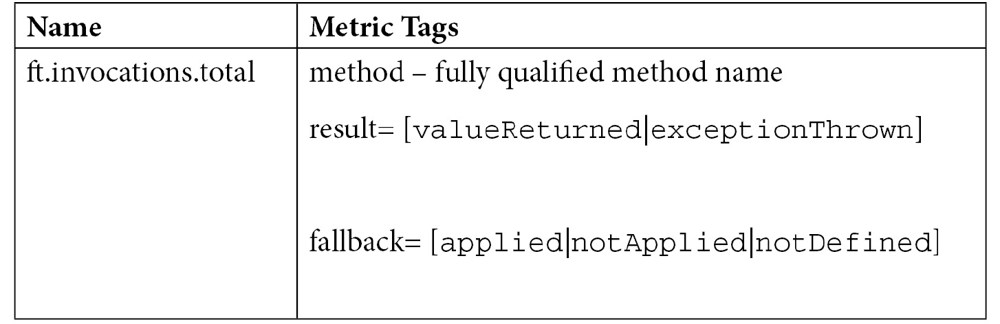
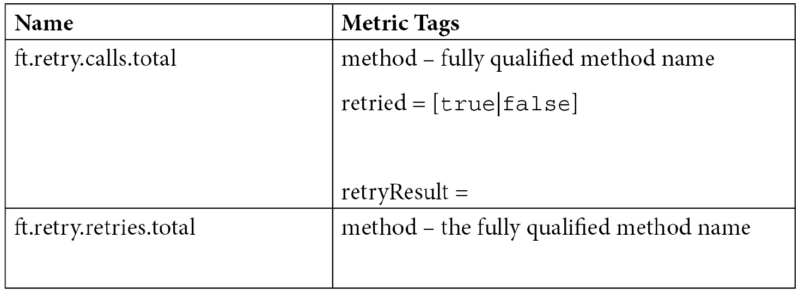
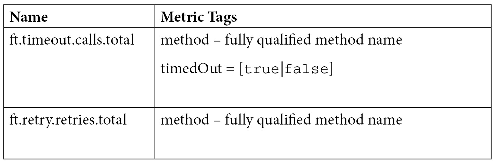
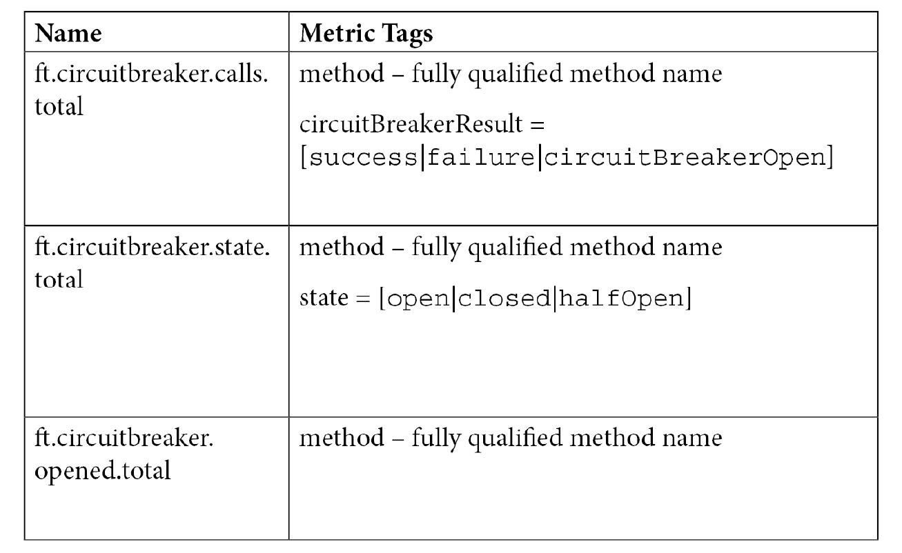
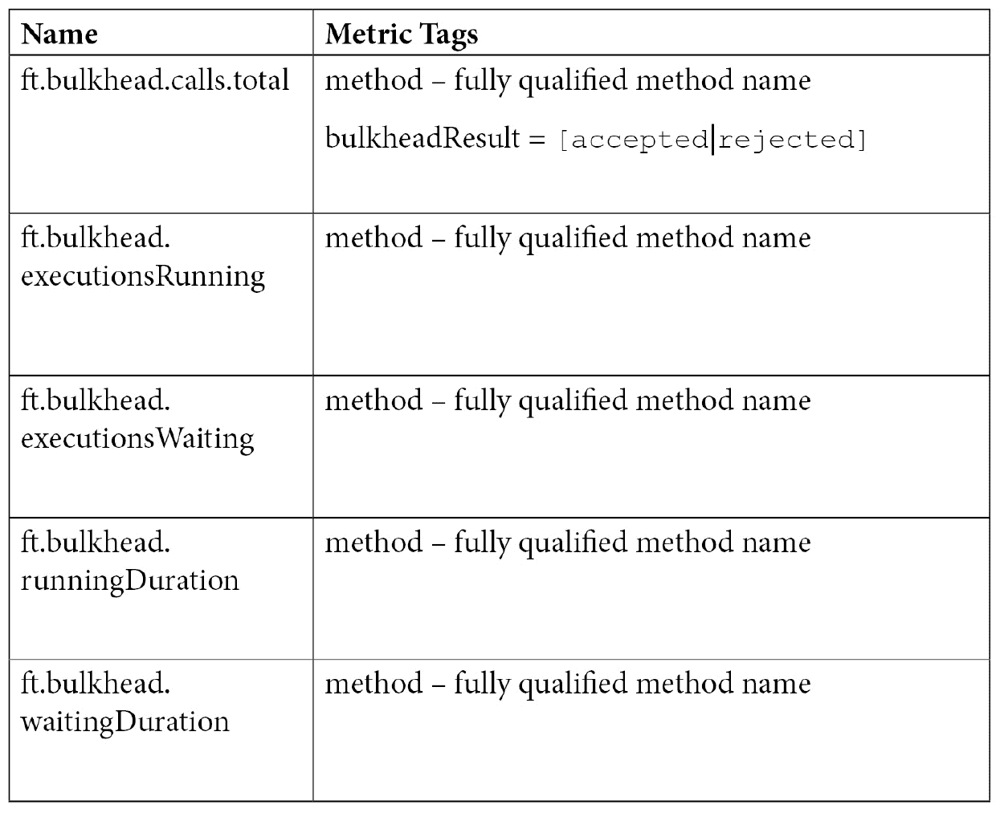
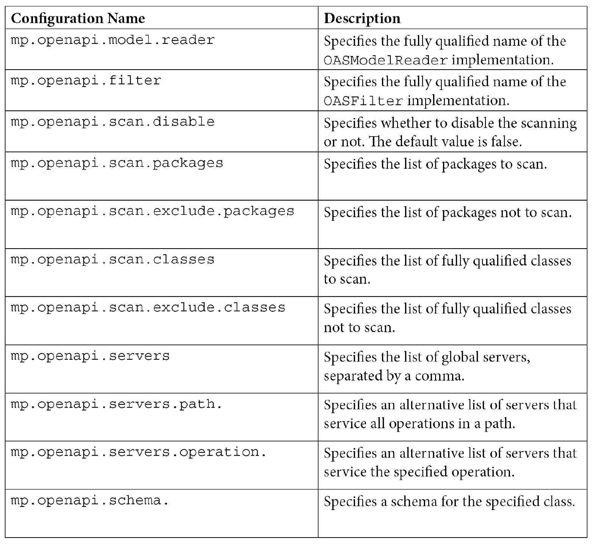
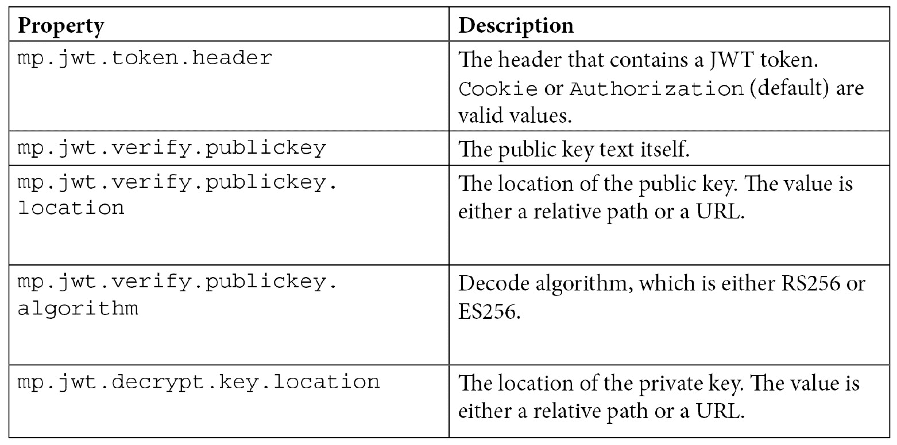

# 第五章：增强云原生应用

在上一章*第四章*，*开发云原生应用*中，我们学习了如何构建云原生应用。然而，构建云原生应用只是开始。下一步是增强应用，使其可配置、具有弹性、可文档化和安全。在本章中，你将学习如何使用 MicroProfile 配置配置你的云原生应用，使用 MicroProfile 故障容错使应用具有弹性，使用 MicroProfile OpenAPI 文档其 API，最后，使用 MicroProfile JWT 保护应用。在本章之后，你应该能够使用这些技术来提高你云原生应用的质量。为了完全理解本章，你需要具备一些 Java、Maven 和 Gradle 的基本知识。

我们将涵盖以下主题：

+   使用 MicroProfile 配置配置云原生应用

+   使用 MicroProfile 故障容错使云原生应用具有弹性

+   使用 MicroProfile OpenAPI 文档云原生应用

+   使用 MicroProfile JWT 保护云原生应用

# 使用 MicroProfile 配置配置云原生应用

**MicroProfile 配置**（源代码位于[`github.com/eclipse/microprofile-config`](https://github.com/eclipse/microprofile-config)）是 MicroProfile 社区创建的第一个规范。配置的概念已经存在十年了。你可能还记得在*第一章*，*云原生应用*中，我们简要讨论了**十二要素应用**，其中第三要素*III.* *配置* ([`12factor.net/config`](https://12factor.net/config))建议将十二要素应用的配置存储在与应用程序代码分离的环境中。这是因为任何配置值的更新都不会导致应用程序代码的重建。但是，有时在那种环境中存储所有配置，如安全凭证等，在现实中并不现实。将一些配置存储在数据库中也很常见。由于配置可能存在于许多不同的地方，因此需要一个获取配置的机制。许多库都提供了这种机制，例如 Apache *DeltaSpike 配置* ([`deltaspike.apache.org/documentation/configuration.html`](http://deltaspike.apache.org/documentation/configuration.html))、*Apache Tamaya* ([`tamaya.incubator.apache.org/`](http://tamaya.incubator.apache.org/))等。

MicroProfile 配置被创建为一个标准，这样你就不必担心将哪个库拉入你的应用程序。

在本节中，我们将学习 MicroProfile 配置如何定义云原生应用存储和检索配置的方式。

## 存储配置

在 MicroProfile Config 中，配置存储在`ConfigSource`，这是一个您可以放置配置值的地方。环境变量、系统属性、属性文件、数据库、ZooKeeper 等都可以用作配置源。每个`ConfigSource`都有一个关联的序号，用于指示`ConfigSource`的重要性。序号较高的`ConfigSource`意味着它指定的配置值将覆盖序号较低的指定相同配置的`ConfigSource`。

例如，`customer_name`属性在序号为 200 的`ConfigSource`（`ordinal = 200`）中指定为`Bob`，而在另一个序号为 120 的`ConfigSource`中指定为`Alice`。然后当云原生应用程序查找`customer_name`时，应该检索到`Bob`的值。`ConfigSource`的序号可以通过相应的`ConfigSource`中的`config_ordinal`属性来定义，这表示包含的配置源的排名顺序。如果没有指定，则默认配置序号为 100。

有两种类型的配置源：**默认配置源**和**自定义配置源**，我们将在下一小节中讨论。

### 默认配置源

**默认配置源**是由 MicroProfile Config 规定的，所有 MicroProfile Config 实现都必须提供这些配置源。MicroProfile Config 规定必须支持三个默认配置源：

+   默认序号为 400 的系统属性

+   默认序号为 300 的环境变量

+   在类路径上找到的属性文件`META-INF/microprofile-config.properties`，默认序号为 100

默认配置源的序号可以通过在配置源内部定义属性`config_ordinal`来覆盖。例如，如果您想将环境变量的序号设置为 500，您可以简单地定义一个环境变量的`config_ordinal`值为`500`。

#### 环境变量映射规则

一些属性名不满足有效环境变量的条件，因为在某些情况下，`app.name`在环境变量中。搜索将在以下列表中找到匹配项后终止：

+   精确找到的属性名，例如`app.name`。

+   如果属性名包含一些不是字母或数字的字符，将这些字符转换为`_*`，然后转换所有字母为大写，转换后的属性名（`app_name`）将被找到。

+   如果属性名包含一些不是字母或数字的字符，将这些字符转换为`_*`，然后转换所有字母为大写，转换后的属性名（`APP_NAME`）将被找到。

除了开箱即用的配置源之外，您可以使用文件、数据库等创建自己的配置源。这些配置源被称为自定义配置源，我们将在下一节中讨论。

### 自定义配置源

**自定义配置源** 是除了默认配置源之外您在应用程序中定义的配置源。要定义自定义配置源，您可以按照以下步骤操作：

1.  按如下方式实现 `ConfigSource` 接口：

    ```java
    public interface ConfigSource {
        String CONFIG_ORDINAL = "config_ordinal";
        int DEFAULT_ORDINAL = 100;
        default Map<String, String> getProperties() {
            Map<String, String> props = new HashMap<>();
            getPropertyNames().forEach((prop) ->             props.put(prop, getValue(prop)));
            return props;
        }
        Set<String> getPropertyNames();
        default int getOrdinal() {
            String configOrdinal =             getValue(CONFIG_ORDINAL);
            if (configOrdinal != null) {
                try {
                    return Integer.parseInt(configOrdinal);
                } catch (NumberFormatException ignored) {
              }
            }
            return DEFAULT_ORDINAL;
        }
        String getValue(String propertyName);
        String getName();
    }
    ```

    `getPropertyNames()`、`getValue(String propertyName)` 和 `getName()` 方法是需要实现的方法。

1.  使用以下任一方法注册这些函数的实现：

    a). 创建一个 `META-INF/services/org.eclipse.microprofile.config.spi.ConfigSource` 文件，其中包含自定义实现的完全限定类名。

    b). 通过以下方式程序化地向 `ConfigBuilder` 添加：

    ```java
    ConfigBuider.withSources(ConfigSource… configSource)
    ```

有时，您有敏感的配置，需要将其存储在安全的地方。您可能需要考虑使用 **HashiCorp Vault** ([`www.vaultproject.io/`](https://www.vaultproject.io/))，它管理密钥并存储敏感数据。如果您在 *Vault* 中存储了一些密钥属性，您可以将 *Vault* 添加为自定义配置源。接下来，我们将探讨另一种使用 Kubernetes ConfigMaps 和 Secrets 存储配置的方法，它们存储配置。

### Kubernetes ConfigMaps 和 Secrets

**Kubernetes** **ConfigMaps** 和 **Secrets** 通常用于存储云原生应用程序的属性。您可以使用以下命令声明 Kubernetes ConfigMaps 或 Secrets：

+   创建一个名为 `app-port` 的 ConfigMap：

    ```java
    app-port, in your cluster, and that ConfigMap contains a key called port with a value of 9081. The –-from-literal is used to store individual name-value pairs in this ConfigMap.
    ```

+   创建一个名为 `app-credentials` 的 Secret：

    ```java
    kubectl create secret generic app-credentials --from-literal username=Bob --from-literal password=TheBuilder
    ```

    此命令类似于创建 ConfigMap。Secret 与 ConfigMap 的主要区别在于，Secret 只显示文本的 Base64 编码版本，而不是明文。

在指定 Kubernetes ConfigMap 或 Secret 后，您可以通过 `deployment yaml` 文件将 ConfigMap 或 Secret 映射到环境变量：

```java
env:
        - name: PORT
          valueFrom:
            configMapKeyRef:
              name: app-port
              key: port
              optional: true
        - name: APP_USERNAME
          valueFrom:
            secretKeyRef:
              name: app-credentials
              key: username
        - name: APP_PASSWORD
          valueFrom:
            secretKeyRef:
              name: app-credentials
              key: password
```

您可以使用以下代码来查找属性：

```java
@Inject @ConfigProperty(name="port", defaultValue="9080")   int port;
@Inject @ConfigProperty(name="app.username") String user;
@Inject @ConfigProperty(name="app.password") String pwd;
```

根据在环境变量中查找属性时定义的映射规则，`port` 将首先被搜索，然后是 `PORT`。由于 ConfigMap 属性 `app_port` 是可选的，因此它不需要在 ConfigMap 中定义。如果未找到，则将默认值 `9080` 分配给变量 `port`。至于其他属性 `app.username`，将首先搜索 `app.username`，然后是 `app_username`，最后是 `APP_USERNAME`。

到目前为止，我们已经学习了属性值的存储位置，但有时您可能需要删除属性值。在下一节中，我们将学习如何删除属性。

## 删除属性

为了删除属性，您只需从配置源中删除属性条目即可。然而，您可能无法更新配置源。在这种情况下，您可以定义一个具有更高序号的配置源，并使用空值定义属性。这实际上会删除配置属性。因此，任何对此属性的查找都将解析为异常。

我们已经介绍了在哪里指定配置属性。当我们存储配置属性值时，它们都是通过字符串表达的。你可能希望将字符串转换为其他类型，如**int**、**float**等。为了实现这一点，我们需要一些转换器。

## 转换器

**转换器**将字符串转换为目标类型。如果向转换器传递了 null 值，将抛出**NullPointerException**（NPE）。

正如存在多种配置源一样，也存在几种类型的转换器：

+   **内置转换器**：它们可以将字符串转换为原始类型、包装类型以及类类型。

+   **数组转换器**：它们可以将逗号分隔的字符串转换为数组。

+   `T`是从一个类派生的，该类包含以下之一：

    ```java
    public static T of(String value) 
    public static T valueOf(String value)
    public static T parse(CharSequence value )
    public T(String value)
    ```

    如果找到多个方法，将使用上述列表中顶部的方法进行转换。

+   `org.eclipse.microprofile.config.spi.Converter`。

    2) 通过创建一个包含自定义实现完全限定类名的`META-INF/services/org.eclipse.microprofile.config.spi.Converter`文件或通过以下方式之一在程序中添加到`ConfigBuilder`来注册转换器：

    ```java
    ConfigBuider.withConverters(converter) 
    ConfigBuilder.withConverter (Class<T> type,  int priority, Converter<T> converter
    ```

存在多种类型的转换器。对于给定类型可能有多个转换器。但是问题来了，哪个转换器将被用来将配置字符串值转换为给定类型？这由转换器优先级决定。

### 转换器优先级

`@javax.annotation.Priority`注解。如果不存在，自定义转换器的优先级将默认为 100。优先级较高的转换器会覆盖优先级较低的转换器。

我们已经介绍了如何使用字符串指定配置属性的值，然后如何将字符串转换为特定类型。在下一节中，我们将学习如何在云原生应用程序中查找配置属性。

## 配置查找

我们已经了解到配置源包含以字符串指定的属性，转换器可以将字符串转换为目标类型。但是问题来了，如何检索配置属性？这可以通过程序化方式或通过注入来完成：

+   使用`getValue`方法检索`customer.age`并将它转换为整数，这是通过程序化查找完成的：

    ```java
    Config = ConfigProvider.getConfig();
    int age = config.getValue("customer.age", int.class);
    ```

+   `customer.age`：

    ```java
    @Inject @ConfigProperty(name="customer.age") int age;
    ```

在你的云原生应用程序中，有时在项目不同阶段会指定不同的值。例如，你可能在不同的项目阶段使用不同的数据库。当项目通过不同的阶段时，与这些阶段相关的值将被注入到相应的配置属性中。这被称为**配置配置文件**。我们将在下一节中更详细地介绍这一内容。

### 理解配置配置文件

配置配置文件是一个重要的概念，可以用来表示项目阶段，如开发、测试、生产等。我们首先将讨论如何定义使用配置配置文件的属性，然后学习如何激活特定的配置文件。

### 配置文件感知属性

定义配置文件感知属性有两种方式：

+   使用命名约定*%<profile name>.<property name>*)，例如，在一个配置源中定义一个名为`%dev.customer.name`的属性。

+   在`microprofile-config-<profile name>.properties`文件中定义属性。

### 激活配置文件

使用属性`mp.config.profile`指定活动配置文件，该属性可以包含在任何配置源中。如果有多个配置源指定此属性，则使用具有最高序号的配置源的值。

让我们看看几个例子。假设我们有一个以下配置源，包含以下属性：

```java
%dev.discount=0.1
%testing.discount=0.6
%live.discount=0.2
discount=0.15
```

如果`mp.config.profile`的值设置为`dev`，则属性`discount`的值将解析为`%dev.discount`的值，即`0.1`。同样，如果活动配置文件是`live`，则属性`discount`的值将是`0.2`。如果没有定义活动配置文件，则属性`discount`的值将是`0.15`。

配置配置文件也适用于`micorprofile-config.properties`配置源文件。考虑以下由您的应用程序提供的`properties`文件：

```java
META-INF\microprofile-config.properties
META-INF\microrpofile-config-dev.properties
META-INF\microprofile-config-testing.properties
META-INF\microprofile-config-live.properties
```

如果`mp.config.profile`的值设置为`dev`，则配置文件`META-INF\microrpofile-config-dev.properties`将被激活。其内容将合并到`META-INF\microrpofile-config.properties`中，并覆盖两个文件中存在的相同属性的属性值。

有时候一个属性的值引用另一个属性。我们称这种引用为配置引用。我们将在下一小节中介绍这个主题。

### 配置引用

属性值可能引用另一个属性的值，这被称为**配置引用**，也称为属性表达式。属性表达式的语法是*${another.property}*。

考虑以下示例：

```java
customer.name=${forename}-${surname}
forename = Bob
surname = Johnson
```

`customer.name`的值将是`Bob-Johnson`。属性表达式也可以嵌套，格式为*${a${n}}*。在嵌套表达式中，内部表达式将首先被解析。

如前所述，一个属性可以在多个配置源中指定。

有时候你需要确定哪个配置源提供了值，以便在需要时更新有效值。在下一小节中，我们将学习如何找出哪个配置源是获胜的配置源。

### 我的属性值从哪里来？

有时候你可能想知道特定属性的值是由哪个配置源提供的，因为相同的属性可能存在于多个配置源中。如果你需要更新属性值，你需要更新获胜配置源的值。MicroProfile Config 提供了一个 API，`ConfigValue`，它允许你找到获胜的配置源。有几种方法可以获取指定属性的`ConfigValue`对象。你可以使用以下程序性查找来查找属性`host`的配置值：

```java
ConfigValue configValueHost=ConfigProvider.getConfig()
.getConfigValue("host");
```

或者，您可以使用 CDI 来获取`host`属性的`config`值，如下所示：

```java
@Inject @ConfigProperty(name="host") ConfigValue   configValueHost;
```

然后，我们可以使用以下方法来检索有关获胜配置源及其值的一些信息：

```java
String configSourceForHost = configValueHost.getSourceName();
String valueOfHost = configValueHost.getValue();
```

通常，一些属性是相关的，并且它们经常一起查找。如果这些属性被聚合并映射到特定的 Java 类型，这将非常有用。

### 聚合配置属性

当查找多个相关属性时，重复相同的配置查找语句可能会很繁琐。它们可能出现在不同的类中，其中一些属性可能是动态的，而另一些可能是静态的，这可能会导致不一致的状态。在这种情况下，将相关的配置属性聚合到一个 CDI bean 中，并使用`@ConfigProperties`注解该 CDI bean，以便同时执行属性查找，是一种最佳实践。

让我们通过一个例子来看看`@ConfigProperties`是如何工作的。以下是一个自定义的`ConfigSource`：

```java
config_ordinal=220
customer.forename=Bob
customer.surname=Builder
```

要查找与特定客户相关的属性，我们可以使用`@ConfigProperites`，如下所示：

```java
@ApplicationScoped
@ConfigProperties(prefix = "customer")
public class ConfigProps {
    private String forename;
    private String surname;
    public String getForename() {
        return forename;
    }
    public String getSurname() {
        return surname;
    }
}
```

在查找属性时，您需要使用`@ConfigProperites(prefix="customer")`注解。如果前缀值与 CDI bean 前缀相同，则可以省略前缀。如果您指定了不同的前缀值，则指定的前缀值将覆盖 CDI bean 上定义的值，并使用指定的前缀来查找属性。

到目前为止，`config`对象是由一个配置规范实现提供的，它加载可用的配置源和转换器。对于一些需要控制使用哪些配置源和转换器的先进用例，您可能想自己构建`config`对象。MicroProfile Config 也为这种用例提供了灵活性。

## 自己构建 Config 实例

要构建一个 Config 实例，您需要提供配置源和转换器。MicroProfile Config 提供了一个构建器，用于构建配置对象，按照以下步骤进行：

1.  首先，我们需要创建一个构建器，如下面的代码片段所示，通过创建`ConfigProviderResolver`的一个实例，然后调用`getBuilder()`方法来创建一个构建器的实例：

    ```java
    ConfigProviderResolver resolver =   ConfigProviderResolver.instance();
    ConfigBuilder builder = resolver.getBuilder();
    ```

1.  然后，我们将添加配置源和转换器到构建器中，然后调用`build()`方法来构建一个`config`对象，如下所示：

    ```java
    Config = builder.addDefaultSources().withSources(aSource)
      .withConverters(aConverter).build();
    ```

1.  接下来，我们需要注册`config`对象，以便我们始终可以向相同的`classloader`对象提供相同的`config`对象，如下所示：

    ```java
    //register the config with the specified classloader
    resolver.registerConfig(config, classloader);
    ```

1.  最后，当我们完成对`config`对象的使用后，我们需要将其释放，如下所示：

    ```java
    //release this config when no longer needed. 
    resolver.releaseConfig(config);
    ```

如果一个配置对象与多个类加载器相关联，在释放配置对象时，必须删除它的所有实例。

我们已经涵盖了 MicroProfile Config 最有用的功能。要使用 MicroProfile Config 的 API，你需要指定 Maven 或 Gradle 依赖项。我们将在下一节中更详细地介绍这一点。

## 使 MicroProfile Config API 可用

MicroProfile Config API JARs 可以为 Maven 和 Gradle 项目提供。如果你创建了一个 Maven 项目，你可以直接将以下内容添加到你的`pom.xml`中：

```java
<dependency>
  <groupId>org.eclipse.microprofile.config</groupId>
  <artifactId>microprofile-config-api</artifactId>
  <version>2.0</version>
</dependency>
```

或者，如果你创建了一个 Gradle 项目，你需要添加以下依赖项：

```java
dependencies {
providedCompile org.eclipse.microprofile.config     :microprofile-config-api:2.0
}
```

你已经学会了如何配置你的云原生应用。下一步是让你的应用具有弹性。在下一节中，我们将详细介绍如何使用 MicroProfile 容错性来让你的应用具有弹性。

# 使用 MicroProfile 容错性使云应用具有弹性

为什么你需要关注弹性？对于关键任务应用，非常短暂的中断可能会给你带来巨大的损失。此外，如果你的应用过于脆弱且不具有弹性，客户满意度将会下降。因此，你应该考虑构建具有弹性的应用，这意味着它们将在各种情况下无中断地运行。MicroProfile 容错性（源代码位于[`github.com/eclipse/microprofile-fault-tolerance`](https://github.com/eclipse/microprofile-fault-tolerance)）引入了几个弹性策略，可以帮助你构建具有弹性的应用。这些策略可以应用于 CDI beans。它还提供了一种通过`@Asynchronous`注解异步执行方法调用的方式。

## @Asynchronous

`@Asynchronous`注解可以放置在 CDI bean 类或 CDI bean 类的方法上。如果放置在类上，这意味着这个类上声明的所有方法都将在一个单独的线程上执行。使用`@Asynchronous`注解的方法必须返回一个`Future`或`CompletionStage`值，否则将抛出`FaultToleranceDefinitionException`。以下是一个代码片段来展示其用法：

```java
@Asynchronous
public CompletionStage<String> serviceA() {
  return CompletableFuture.completedFuture("service a");
}
```

上述示例意味着`serviceA()`的调用将在不同的线程上执行，然后返回`CompletionStage`。如果方法返回`Future`，方法调用始终被视为成功，除非方法抛出异常。如果方法返回`CompletionStage`，方法调用只有在`CompletionStage`完成且没有任何异常的情况下才被视为成功。

注意

当使用`@Asynchronous`注解时，最佳实践是返回`CompletionStage`，这允许在异常返回时调用其他容错策略。

但是当你遇到暂时的网络故障时，你会怎么做？第一反应是再试一次，这正是下一个注解所帮助的。

## @Retry

MicroProfile 容错性通过`@Retry`注解提供重试功能。当使用此注解时，你可以指定以下属性：

+   `maxRetries`：这表示最大重试次数。

+   `delay`：这表示每次重试之间的延迟。

+   `delayUnit`：这指定了延迟的时间单位。

+   `maxDuration`：这表示整体重试的最大持续时间。

+   `durationUnit`：这指定了持续时间单位。

+   `jitter`：这表示每个延迟的随机间隔。

+   `jitterDelayUnit`：这指定了抖动延迟单位。

+   `retryOn`：这表示导致重试的失败。

+   `abortOn`：这指定了跳过重试的失败。

您可以在任何类或业务方法上添加 `@Retry` 注解（[`docs.jboss.org/cdi/spec/2.0/cdi-spec.html#biz_method`](https://docs.jboss.org/cdi/spec/2.0/cdi-spec.html#biz_method)）。让我们看看以下示例：

```java
@Retry(maxRestries=5, delay=400, maxDuaration=4000,   jitter=200, retryOn=Exception.class, abortOn=
    IllegalArgumentException.class)
public void callService(){
    //do something     doSomething();
}
```

在上述代码片段中，`@Retry` 注解表示以下内容：

+   除了 `IllegalArgumentException` 之外的异常将触发 `Retry` 操作。

+   最大重试次数为 `5`，最大持续时间为 `4000` 毫秒（毫秒）。当满足任一条件时，`Retry` 操作将终止。

+   重试之间的延迟是 `200` 毫秒（抖动）和 `600` 毫秒（延迟+抖动）。

有时您可能不想不断重试；您可能希望快速失败并在时间限制内返回给调用者，例如，如果调用者只分配了有限的等待时间，无法承担等待请求返回的时间。`@Timeout` 注解被引入来强制操作在指定期间内返回。

## @Timeout

`@Timeout` 注解指定了最大响应时间。如果没有指定超时时间，可能会发生不确定的等待。使用 `@Timeout` 注解后，受影响的操作需要在指定的时间段内返回，否则将抛出 `TimeoutException`。此注解可以用于类或任何业务方法。让我们看看以下代码示例：

```java
@Timeout(700)
public String getServiceName() {
   //retrieve the backend service name
}
```

在上述代码片段中，`getServiceName()` 操作将在 `700` 毫秒内返回，或者如果操作计算时间超过 `700` 毫秒，将抛出 `TimeoutException`。

如果服务不工作，您可能不想等待指定的超时时间，然后反复得到 `TimeoutException`。在一定的失败时间后快速失败会更好。快速失败为后端恢复提供时间，请求可以立即得到反馈。这正是 `@CircuitBreaker` 所做的。

## @CircuitBreaker

**断路器**模式帮助调用快速失败，并通过防止请求到达后端为后端恢复提供时间。断路器模式是如何工作的？它非常简单。断路器模式中的电路就像一个电路。如果电路是断开的，就没有电。闭合电路意味着正常服务。断路器有三个状态：

+   在连续请求或滚动窗口（称为 `requestVolumeThreshold`）中的 `failureRatio` 数量，当断路器跳闸时，断路器将从关闭状态转换为打开状态。

+   `CircuitBreakerOpenException`。在指定延迟期后，断路器将转换为半开状态。

+   当 `successThreshold` 被满足时，断路器将转换为 **关闭** 状态。

断路器有以下参数：

+   `requestVolumeThreshold` 指定了断路器将被评估的滚动窗口的大小。如果 `requestVolumeThreshold` 的值为 10，这意味着断路器只有在 10 次请求之后才会进行检查。

+   `failureRatio` 控制滚动窗口内的失败率。如果失败率等于或高于 `failureRatio` 参数，则断路器将跳闸打开。

+   `successThreshold` 指定了当断路器从半开状态转换为关闭状态时的标准。如果 `successThreshold` 的值为 `2`，这意味着在 2 次成功请求之后，断路器将从半开状态转换为关闭状态。

+   `delay` 和 `delayUnit` 指示断路器保持打开状态的时间。断路器不会永远保持打开。

+   `failOn` 指定了一些被认为是失败的异常。

+   `skipOn` 指定了一些异常，这些异常不会被计入断路器的贡献。

可以通过 `@CircuitBreaker` 注解指定断路器模式。`@CircuitBreaker` 注解可以放置在类或业务方法上，以避免重复失败。您可以在注解上配置参数，如下所示：

```java
@CircuitBreaker(requestVolumeThreshold = 10,   failureRatio=0.5, successThreshold = 3, delay = 2,     delayUnit=ChronoUnit.SECONDS, failOn={ExceptionA.class,         ExceptionB.class}, skipOn=ExceptionC.class)
```

在上述代码片段中，这意味着如果连续 10 次请求中有 5 次或更多（10*0.5）失败，则断路器将跳闸打开。在参数 `delay` 和 `delayUnit` 指定的 2 秒后，电路将转换为半开状态。在 3 次（`successThreshold`）连续成功之后，断路器将转换为关闭状态。

在决定一个调用是否应该被视为失败时，标准是调用中抛出的异常必须可以分配给 `ExceptionA` 或 `ExceptionB`，但不能分配给 `ExceptionC`。如果一个异常可以分配给 `ExceptionC`，那么在计算断路器时，这次执行将被视为成功而不是失败。

断路器的成功

由 `@CircuitBreaker` 注解标记的成功并不意味着操作返回正常。它仅意味着返回被断路器视为成功。例如，如果返回的异常可以分配给 `skipOn` 中的任何异常，则该异常不计为失败，而是计为成功。

`@CircuitBreaker`注解的作用域是每个类每个方法，这意味着特定类的所有实例对于相同的方法共享同一个断路器。当在 CDI bean 上应用`@CircuitBreaker`注解时，bean 的 CDI 作用域无关紧要。特定方法的调用共享同一个断路器。

在一个关键任务服务中，确保服务具有故障隔离能力，防止系统某一部分的故障级联到整个系统，这一点非常重要。这被称为**舱壁模式**。

## 舱壁模式

舱壁模式是为了防止一个故障级联，从而导致整个应用程序崩溃。舱壁模式是通过限制访问资源的并发请求数量来实现的。有两种不同的舱壁类型：**信号量**隔离和**线程池**隔离。

### 信号量隔离

信号量隔离限制了并发请求数量到指定的数量。你可以直接使用`@Bulkhead(n)`来限制最大请求，其中`n`是并发请求数量。额外的请求`n+1`将因`BulkheadException`而失败。

然而，有时你可能希望为额外的请求提供一个等待队列。对于这个需求，你需要使用线程池隔离。

### 线程池隔离

线程池隔离也限制了并发请求数量。它为方法执行分配一个新的线程。此外，它还有一个等待队列来存储额外的请求。只有当等待队列满时，才会抛出`BulkheadException`异常。

要定义线程池隔离，你需要使用`@Bulkhead`与`@Asynchronous`一起使用，如下所示：

```java
@Asynchronous
@Bulkhead(value=5, waitingTaskQueue=6)
public CompletionStage<String> serviceA() {
}
```

如上述代码片段所示，舱壁的大小为`5`，允许 5 个并发请求访问`serviceA()`方法。额外的请求将被排队在等待队列中。当等待队列满时，额外的请求将导致抛出`BulkheadException`异常。

与`@CircuitBreaker`注解类似，`@Bulkhead`注解的作用域是每个类每个方法，这意味着特定类的所有实例对于相同的方法共享同一个舱壁。当在 CDI bean 上应用`@Bulkhead`注解时，bean 的 CDI 作用域无关紧要。特定方法的调用共享同一个舱壁。

除了重试之外，我们之前讨论的容错策略都是关于优雅地失败。然而，有时你可能想向调用者返回一个合理的响应。在这些情况下，你应该提供一个替代答案。这就是回退策略的作用。

## 回退

`@Fallback`注解。`@Fallback`注解具有以下参数：

+   `value`：这指定了一个实现`FallbackHandler`接口的类。

+   `fallbackMethod`：此方法指定回退方法名称。回退方法必须在应用`@Fallback`注解的方法所在的同一类中定义。

+   `applyOn`：这定义了回退策略应该应用的标准。

+   `skipOn`：这定义了回退策略应该跳过的标准。

`value`和`fallbackMethod`参数是互斥的。如果你在`@Fallback`注解上同时指定了这两个参数，将会抛出`FaultToleranceDefinitionException`异常。要指定备份操作，你需要定义`fallbackMethod`或`value`参数之一。

`fallbackMethod`签名和返回类型必须与定义回退策略的方法相匹配。如果你想定义一个处理多个回退策略的处理程序，应该使用`value`参数。

你可以使用`skipOn`或`applyOn`来指定应该触发回退操作的异常。正如其名，所有在`skipOn`下列出的异常及其子类都将绕过回退，而`applyOn`列出的异常及其子类应该触发回退操作。当`skipOn`和`applyOn`一起使用时，`skipOn`具有优先权。

让我们看看以下代码片段，以了解回退策略的示例：

```java
@Fallback(fallbackMethod="myFallback", 
  applyOn={ExceptionA.class, ExceptionB.class},    skipOn={ExceptionAsub.class})
public String callService() {
...
}
public String myFallback() {
...
}
```

在上述代码片段中，如果`callService()`方法抛出异常，并且这个异常可以被赋值给`ExceptionAsub`，那么异常将被重新抛出，回退方法`myFallback`将不会执行。然而，如果抛出的异常不能被赋值给`ExceptionAsub`，但可以被赋值给`ExceptionA`或`ExceptionB`，那么回退方法`myFallback`将被触发。

到目前为止，我们已经涵盖了所有的回退策略。你可能已经意识到所有策略都是注解。实际上，这些注解是 CDI 拦截器绑定，这意味着它们仅在 CDI bean 的业务方法调用上工作，如[`jakarta.ee/specifications/cdi/2.0/cdi-spec-2.0.html#biz_method`](https://jakarta.ee/specifications/cdi/2.0/cdi-spec-2.0.html#biz_method)中所述。

CDI 拦截器有优先级。在容错中，一些实现可能为所有拦截器绑定提供一个拦截器，而其他实现可能提供多个拦截器。容错规范声明基本优先级为`Priority.PLATFORM_AFTER (4000)+10`，即`4010`。如果实现提供了多个拦截器，优先级范围应在基本优先级和基本优先级+40 之间，以便其他应用程序拦截器可以根据它们是否希望在容错拦截器之前或之后调用来相应地定义它们的优先级。你可以通过属性`mp.fault.tolerance.interceptor.priority`更新基本优先级。

带有容错注解的方法也可以指定任何其他的**拦截器绑定**。拦截器的调用顺序将由拦截器的优先级决定。

到目前为止，我们已经涵盖了所有的容错注解。你可能想知道是否可以一起使用这些注解。当然可以。我们将在下一节中详细讨论。

## 使用容错注解一起使用

使用注解一起实现多个容错能力，例如同时设置`Retry`和`Timeout`，是可行的。让我们看看以下示例：

```java
@GET
@Path("/{parameter}")
@Asynchronous
@CircuitBreaker
@Retry
@Bulkhead
@Timeout(200)
@Fallback(fallbackMethod = "myFallback")
public CompletionStage<String> doSomething(@PathParam
  ("parameter") String parameter) {
//do something
}
```

上述代码片段表示`doSomething()`操作应用了所有的容错策略。如果此方法抛出异常，将按以下顺序应用以下容错策略：

1.  检查`CircuitBreaker`是否开启。

1.  如果没有开启，计时器将开始记录时间长度。

1.  尝试在`Bulkhead`中获取一个槽位。

1.  如果已经有 10 个正在运行的任务，它将在等待队列中排队，该队列有 10 个槽位。然而，如果没有空闲槽位在等待队列中，将抛出`BulkheadException`异常。如果有槽位在等待队列中，它将等待被调度。在等待期间，如果超时时间超过`200`毫秒，将抛出`TimeoutException`。抛出的异常将被记录在`CircuitBreaker`记录中，然后触发`Retry`。回到`步骤 1`进行`Retry`。

在`Retry`尝试耗尽后，将触发回退策略。

你可能已经注意到每个注解的参数都有默认值。你还可以在注解上指定值。你在想这些值是否可配置吗？我们将在下一节中讨论这个问题！

## 容错配置

好消息是，注解上的所有参数都是可配置的。这些值可以是全局覆盖或单独覆盖。这是通过**MicroProfile Config**实现的。所有参数都是属性。它们的值可以在任何配置的配置源中指定。

### 覆盖参数值

要覆盖单个注解参数，你可以使用方法级别配置、类级别配置或全局配置，如这里所述：

+   **方法级别配置**：使用格式*<完全限定的类名>/<方法名>/<注解名>/<参数名>*进行指定。

+   **类级别配置**：使用格式*<完全限定的类名>/<注解名>/<参数名>*进行指定。

+   **全局配置**：使用格式*<注解名>/<参数名>*进行指定。

让我们通过一个示例来进一步解释：

```java
package cloudnative.sample.fault.tolerance;
public class FaultToleranceDemo {
    @Timeout(500)
    @Retry(maxRetries = 6)
    @GET
    public String invokeService() {
        //do something
    }
}
```

此代码片段将`Timeout`设置为`500`毫秒，最多重试`6`次。要设置`Timeout`为`300`毫秒且最多重试`10`次，您可以在任何配置源中指定以下方法级别配置属性：

```java
cloudnative.sample.fault.tolerance.FaultToleranceDemo/invokeService/Timeout/value=300
cloudnative.sample.fault.tolerance.FaultToleranceDemo/invokeService/Retry/maxRetries=10
```

或者，如果你想更新此类的所有超时和最大重试次数，你可以省略方法名称，这意味着配置适用于所有具有相应注解的方法。然后，在配置的配置源中指定以下类级别配置：

```java
cloudnative.sample.fault.tolerance.FaultToleranceDemo/Timeout/value=300
cloudnative.sample.fault.tolerance.FaultToleranceDemo/Retry/maxRetries=10
```

有时，你可能想为单个应用程序下的所有类指定相同的超时值。这很简单。只需省略完全限定的类名。因此，你可以使用以下全局配置来实现这一点：

```java
Timeout/value=300
Retry/maxRetries=10
```

有时，你的云基础设施，例如**Istio**，我们将在*第七章*“与 Open Liberty、Docker 和 Kubernetes 一起的 MicroProfile 生态系统”中讨论，提供一些容错能力。然而，云基础设施无法提供回退能力，因为基础设施需要业务知识。如果你更喜欢使用 Istio 提供的容错能力，你可能想关闭一些 MicroProfile 容错能力。如果不关闭，你将获得两种容错功能，它们将相互干扰。

### 禁用容错策略

如果你想使用 Istio 提供的容错策略，你可以指定以下属性来关闭除`Fallback`之外的所有容错策略：

```java
MP_Fault_Tolerance_NonFallback_Enabled=false
```

要在方法上禁用特定策略，请指定以下方法级别属性：

```java
<fully.qualified.class.name>/<method.name>/<annotation>/enabled=false
```

在前面的例子中，为了在`invokeService()`方法上关闭`Timeout`，请指定以下方法级别配置：

```java
cloudnative.sample.fault.tolerance.FaultToleranceDemo/invokeService/Timeout/enabled=false
```

或者，为了在类中关闭`Timeout`，请指定以下类级别配置。

```java
cloudnative.sample.fault.tolerance.FaultToleranceDemo/Timeout/enabled=false
```

要禁用云原生应用的`Timeout`功能，请指定以下属性：

```java
Timeout/enabled=false
```

如果指定了多个配置，方法级别的配置具有更高的优先级，其次是类级别配置，然后是全球配置。

到目前为止，你已经学习了如何将容错策略应用于某些操作并配置策略。然而，这些策略是为了在某些标准下被触发的。很可能没有任何策略被利用。你可能非常想了解是否有任何容错策略被激活。为了满足这一需求，我们有了容错指标。让我们在下一节中看看它们。

### 容错指标

当与 MicroProfile Metrics 一起使用时，MicroProfile Fault Tolerance 能够为 Retry、Timeout、CircuitBreaker、Bulkhead 和 Fallback 策略提供一些有用的指标。在以下表格中，我列出了所有相关的指标。

以下表格显示了应用容错时的一般指标：



表 5.1 – 方法调用指标

如果使用了`@Retry`，将提供重试的指标：



表 5.2 – 重试指标

如果使用`@Timeout`，将提供以下指标：



表 5.3 – 超时指标

如果使用`@CircuitBreaker`，您将看到以下指标：



表 5.4 – 电路断路器指标

如果使用`@Bulkhead`，您将能够看到以下指标：



表 5.5 – 防火墙指标

您已经了解了所有容错功能。您可能想知道如何开始使用容错提供的 API。我们将在下一节中讨论这个问题。

## 使 MicroProfile 容错 API 可用

MicroProfile 容错 API JAR 可以为 Maven 和 Gradle 项目提供。如果您创建了一个 Maven 项目，您可以直接将以下内容添加到您的`pom.xml`中：

```java
<dependency>
  <groupId>
    org.eclipse.microprofile.fault.tolerance
  </groupId>
  <artifactId>microprofile-fault-tolerance-api</artifactId>
  <version>3.0</version>
</dependency>
```

如果您创建了一个 Gradle 项目，您需要添加以下依赖项：

```java
dependencies {
providedCompile org.eclipse.microprofile.fault.tolerance:  microprofile-fault-tolerance-api:3.0
}
```

您现在已经学会了如何使您的云原生应用程序具有弹性。下一步是记录您的应用程序。您将在下一节中学习如何使用 MicroProfile OpenAPI 记录您的应用程序。

# 使用 MicroProfile OpenAPI 记录云原生应用程序

如同在*第二章*中提到的，*MicroProfile 如何适应云原生应用程序？*，当您管理数十或数百个云原生应用程序时，您可能会难以记住特定云原生应用程序的功能。您将需要为它们提供文档。有了文档化的端点，一些客户端可以发现并调用它们。

**MicroProfile OpenAPI**（源代码位于[`github.com/eclipse/microprofile-open-api/`](https://github.com/eclipse/microprofile-open-api/)）提供了一套注解和编程模型，使您能够记录云原生应用程序，然后生成符合**OpenAPI** v3 规范的文档（[`github.com/OAI/OpenAPI-Specification`](https://github.com/OAI/OpenAPI-Specification)）。OpenAPI v3 规范定义了一组用于记录和公开 RESTful API 的接口。MicroProfile OpenAPI 采用了 OpenAPI 规范，并进一步简化了 OpenAPI 模型，使得 Java 开发者更容易记录他们的云原生应用程序。

MicroProfile OpenAPI 提供了三种方式来记录云原生应用程序：

+   通过在 JAX-RS 操作上应用**MicroProfile OpenAPI**注解

+   使用**MicroProfile OpenAPI**的编程模型来提供**OpenAPI**模型树

+   使用预先生成的**OpenAPI**文档

在下一节中，我们将更详细地介绍这三个机制。

## 在 JAX-RS 操作上应用 MicroProfile OpenAPI 注解

为您的 JAX-RS 操作生成文档的简单方法是添加 MicroProfile OpenAPI 注解。以下列出了一些有用且广泛使用的注解：

![Table 5.6 – MicroProfile OpenAPI annotations

![Table 5.6.jpg]

Table 5.6 – MicroProfile OpenAPI annotations

以下是在 IBM StockTrader 应用程序 **Trade-History** 中使用 OpenAPI 注解记录操作的示例：

```java
@APIResponses(value = {
        @APIResponse(
            responseCode = "404",
            description = "The Mongo database cannot be               found. ", content = @Content(                        mediaType = "text/plain")),
        @APIResponse(
            responseCode = "200",
            description = "The latest trade has been               retrieved successfully.",
            content = @Content(mediaType = "application/json",                        schema = @Schema(implementation =                           Quote.class)))})
    @Operation(
        summary = "Shows the latest trade.",
        description = "Retrieve the latest record from the           mongo database."
    )
public String latestBuy() {
. . .
}
```

上述代码片段使用 `@APIResponse` 注解记录了两个响应：`404` 和 `200`。`@Operation` 注解记录了操作的目的。使用前面的注解生成的 OpenAPI 文档的详细信息如下：

```java
---
openapi: 3.0.3
info:
  title: Generated API
  version: "1.0"
servers:
- url: http://localhost:9080
- url: https://localhost:9443
paths:
  /data/latestBuy:
    get:
      summary: Shows the latest trade.
      description: Retrieve the latest record from the         mongo database.
      responses:
        "404":
          description: 'The Mongo database cannot be found'
          content:
            text/plain: {}
        "200":
          description: The latest trade has been retrieved             successfully.
          content:
            application/json:
              schema:
                $ref: '#/components/schemas/Quote'
components:
  schemas:
    Quote:
      type: object
      properties:
        date:
          type: string
        price:
          format: double
          type: number
        symbol:
          type: string
        time:
          format: int64
          type: integer
```

在上述文档中，使用 `@Operation` 注解中的信息解释了端点路径和 `get` 操作描述。进一步地，从 `@APIResponse` 注解提供的信息中描述了 `200` 和 `404` 的响应。至于返回代码 `200` 的响应，通过 `@Schema` 注解引用了模式 `Quote`，因此 `$ref: '#/components/schemas/Quote'` 显示为模式引用。该引用指向 `components/schemas/Quote` 部分，显示了模式 `Quote` 的详细信息。

在不使用任何 MicroProfile OpenAPI 注解的情况下，MicroProfile OpenAPI 仍然为所有 JAX-RS 端点生成 OpenAPI 文档，并包含最小信息。以下是在未应用 OpenAPI 注解的情况下 `latestBuy` 端点的示例。它只列出了成功返回代码 `200` 的最小信息：

```java
---
openapi: 3.0.3
info:
  title: Generated API
  version: "1.0"
servers:
- url: http://localhost:9080
- url: https://localhost:9443
paths:
  /data/latestBuy:
    get:
      responses:
        "200":
          description: OK
          content:
            application/json:
              schema:
                type: string
```

除了使用 MicroProfile OpenAPI 注解外，您还可以使用编程模型生成文档。我们将在下一节中讨论这个问题。

## 使用编程模型生成文档

有时，可能无法在 JAX-RS 操作上放置 MicroProfile OpenAPI 注解。在这种情况下，您可以从 MicroProfile OpenAPI 提供自己的 `OASModelReader` 实现。OASModelReader API 提供了一种从头开始构建 OpenAPI 文档的方法。按照提到的步骤构建 OpenAPI 模型树：

1.  实现 `org.eclipse.microprofile.openapi.OASModelReader` 接口。您可以在以下示例中看到：[`github.com/eclipse/microprofile-open-api/wiki/OASModelReader-Samples`](https://github.com/eclipse/microprofile-open-api/wiki/OASModelReader-Samples)。

1.  使用 `mp.openapi.model.reader` 配置键注册实现，并将配置存储在配置源中。

1.  如果提供完整的 OpenAPI 模型树，设置配置 `mp.openap.scan.disabled=true`。

链接 [`github.com/eclipse/microprofile-open-api/wiki/OASModelReader-Samples`](https://github.com/eclipse/microprofile-open-api/wiki/OASModelReader-Samples) 提供了实现 `OASModelReader` 的示例。在 *步骤 2* 和 *步骤 3* 中，您可以在 `META-INF/microprofile-config.properties` 或作为系统属性中指定属性。

## 使用预生成的 OpenAPI 文档

有时，您会首先使用像 Swagger Editor（[`editor.swagger.io/`](https://editor.swagger.io/)）这样的编辑器来编写 OpenAPI 文档。文档必须命名为 `openapi`，并带有 `yml`、`yaml` 或 `json` 文件扩展名，并放置在 `MEAT-INF` 目录下。如果文档完整，您可以设置属性 `mp.openap.scan.disabled=true`。否则，将执行扫描操作以发现任何 MicroProfile OpenAPI 注解。

到目前为止，我们简要介绍了创建 OpenAPI 文档的三种方法。这些文档可以通过 URL [`host_name/port_number/openapi`](http://host_name/port_number/openapi) 查看。Open Liberty，将在*第七章*中讨论，即 *使用 Open Liberty、Docker 和 Kubernetes 的 MicroProfile 生态系统*，集成了 Swagger UI，因此您可以访问 [`host_name/port_number/openapi/ui`](http://host_name/port_number/openapi/ui) 以获得图形用户界面视图，在那里您可以提供参数然后直接调用单个端点。有关此 UI 的更多信息将在*第九章*中介绍，即 *部署和第 2 天操作*。

Cloud-native 应用程序开发人员可能希望删除或更新 OpenAPI 文档的某些元素。这是通过过滤器完成的，该过滤器在 OpenAPI 文档创建后调用。我们将在下一节中讨论过滤器。

## 应用过滤器到 OpenAPI 文档

如果您想向 OpenAPI 文档添加一些信息，您可以创建一个过滤器。该过滤器需要实现 OASFilter 接口，它提供了一种更新 OpenAPI 文档的方式。让我们看看以下过滤器：

```java
public class MyOASFilter implements OASFilter {
  @Override
  public void filterOpenAPI(OpenAPI openAPI) {
    openAPI.setInfo(OASFactory.createObject(Info.class)      .title("Stock App").version("1.0").description         ("App for displaying stocks.").license           (OASFactory.createObject(License.class)            .name("Apache License 2.0").url               ("https://www.apache.org/licenses/                LICENSE-2.0"))); //1
    openAPI.addServer(OASFactory.createServer()      .url("http://localhost:{port}").description         ("Open Liberty Server.").variables(Collections           .singletonMap("port",OASFactory             .createServerVariable().defaultValue("9080")              .description("HTTP port.")))); //2   
  }
}
```

在上述代码片段中，`filterOpenAPI()` 方法过滤 OpenAPI 元素。该方法仅作为特定过滤器的最后一个方法被调用。它提供了 OpenAPI 文档的 `info` 和 `servers` 元素。

在您创建了过滤器类之后，下一步是在配置源中指定配置 `mp.openapi.filter=com.acme.MyOASFilter`，例如 `microprofile-config.properties`。

MicroProfile OpenAPI 实现按以下顺序生成文档：

1.  实现通过 `mp.openapi` 前缀检索配置值。

1.  然后，它调用 `OASModelReader`。

1.  它检索名为 `openapi.yml`、`openapi.yaml` 或 `openapi.json` 的静态 OpenAPI 文件。

1.  它处理 MicroProfile OpenAPI 注解。

1.  最后，它通过 `OASFilter` 过滤 OpenAPI 文档。

如[*步骤 1*]所述，MicroProfile OpenAPI 可以定义带有 `mp.openapi` 前缀的几个配置。我们将在下一节中介绍这些配置。

## MicroProfile OpenAPI 配置

MicroProfile OpenAPI 为应用程序开发者提供了在生成 OpenAPI 文档时配置过程的灵活性。配置项列在以下表格中：



表 5.7 – MicroProfile OpenAPI 配置

现在我们已经了解了**MicroProfile OpenAPI**的工作原理。MicroProfile OpenAPI 的实现将基于 MicroProfile OpenAPI 策略生成一个 OpenAPI 文档。你可以在哪里查看完全处理后的 OpenAPI 文档？在下一节中，我们将讨论 OpenAPI 文档的访问位置。

## 查看 OpenAPI 文档

完全处理后的 OpenAPI 文档必须在根 URL `/openapi` 上可用，作为一个 HTTP `Get`操作，例如`http://localhost:9080/openapi`。默认的文档格式是 YAML。如果响应包含值为`application/json`的`Content-Type`头，则需要支持 JSON 格式。Open Liberty 支持查询参数格式，允许你指定你想要 YAML 还是 JSON 格式。例如，端点`http://localhost:9080/openapi?format=JSON`以 JSON 格式显示 OpenAPI 文档，而端点[`localhost:9080/openapi?format=YAML`](http://localhost:9080/openapi?format=YAML)则以 YAML 格式显示 OpenAPI 文档。

Open Liberty 提供了一个用于 OpenAPI 文档的 UI，你可以调用其中的端点。该 UI 在根 URL `/openapi/ui` 上可用。

你已经学会了 MicroProfile OpenAPI 的工作原理以及在哪里可以找到 OpenAPI 文档。现在，你准备好使用 MicroProfile OpenAPI 了。在下一节中，我们将讨论如何使 API 对你的 Maven 和 Gradle 项目可用。

## 使 MicroProfile OpenAPI API 可用

要使用 MicroProfile OpenAPI API，你需要使这些 API 对你的应用程序可用。如果你创建了一个 Maven 项目，你可以直接将以下内容添加到你的`pom.xml`文件中：

```java
<dependency>
  <groupId>org.eclipse.microprofile.openapi</groupId>
  <artifactId>microprofile-openapi-api</artifactId>
  <version>2.0</version>
</dependency>
```

或者，如果你创建了一个 Gradle 项目，你需要添加以下依赖项：

```java
dependencies {
providedCompile org.eclipse.microprofile.openapi:
  microprofile-openapi-api:2.0
}
```

通过这种方式，你已经学会了如何记录你的云原生应用程序。下一步是保护你的应用程序。我们将学习如何借助 MicroProfile JWT（[`github.com/eclipse/microprofile-jwt-auth`](https://github.com/eclipse/microprofile-jwt-auth)）来保护你的应用程序。

# 使用 MicroProfile JWT 保护云原生应用程序

MicroProfile JWT 利用**JSON Web Token**（**JWT**）和一些额外的声明，用于端点的基于角色的访问控制，以帮助保护云原生应用。保护云原生应用通常是必须具备的功能。通常情况下，云原生应用提供敏感信息，这些信息只能由特定用户组访问。如果不保护云原生应用，任何人都可以访问信息。**Jakarta Security**（源代码位于[`github.com/eclipse-ee4j/security-api`](https://github.com/eclipse-ee4j/security-api)），是 Jakarta EE 下的一个规范（[`jakarta.ee/specifications/security/`](https://jakarta.ee/specifications/security/)），可用于保护云原生应用。

在以下示例中，`checkAccount` 方法通过 Jakarta Security API 的`@RolesAllowed`进行安全保护。此方法只能由具有`StockViewer`或`StockTrader`访问组的客户端调用。所有其他用户都会被拒绝，如下所示：

```java
@RolesAllowed({ "StockViewer", "StockTrader" })
@GET
public String checkAccount() {
    return "CheckAccount";
}
```

或者，您可以使用`web.xml`配置直接保护端点。在以下代码片段中，它定义了两个角色，`StockViewer`和`StockTrader`，并且它们可以访问所有`GET`操作，其中`StockViewer`只能访问只读操作，而`StockTrader`可以访问所有操作：

```java
<security-role>
        <description>Group with read-only access to stock 
          portfolios</description>
        <role-name>StockViewer</role-name>
    </security-role>
    <security-role>
        <description>Group with full access to stock 
          portfolios</description>
        <role-name>StockTrader</role-name>
    </security-role>
<security-constraint>
        <display-name>Account read-only security</display-name>
        <web-resource-collection>
            <web-resource-name>Account read-only               methods</web-resource-name>
            <description>Applies to all paths under the               context root (this service specifies the                 account as a path param)</description>
            <url-pattern>/*</url-pattern>
            <http-method>GET</http-method>
        </web-resource-collection>
        <auth-constraint>
            <description>Roles allowed to access read-only               operations on accounts</description>
            <role-name>StockViewer</role-name>
            <role-name>StockTrader</role-name>
        </auth-constraint>
    </security-constraint>
```

在端点被保护之后，我们接下来需要考虑如何让客户端调用受保护的后端。为了回答这个问题，我们首先将讨论云原生应用的独特应用安全方面。

云原生应用安全与传统应用不同，因为云原生应用通常是无状态的，服务器端可能无法在客户端持久化任何状态。此外，后端可能有不同的实例，每个后续客户端请求可能不会击中相同的后端实例。正如您所看到的，在后端存储客户端数据是有问题的。因此，建议的方法是通过每个请求传递安全相关信息。

后端服务将为每个请求创建一个安全上下文，并执行认证和授权检查。这意味着安全相关信息需要包括认证和授权的详细信息。在下一节中，我们将探讨实现此目标所使用的技术。

### 我们使用什么技术来保护云原生应用？

用于云原生应用安全的技术基于**OAuth2**、**OpenID Connect**和**JSON Web Token**（**JWT**）标准：

+   **OAuth2**：一个授权框架，用于控制对受保护资源（如云原生应用）的授权。OAuth2 是关于用户授权的。

+   **OpenID Connect (OIDC)**：一个建立在 OAuth 2.0 协议之上的认证框架。它允许第三方应用程序（如 Google 或 Facebook）验证最终用户的身份，并获取一些用户信息。OIDC 是关于用户认证的。

+   **JWT**：一种紧凑、URL 安全的方式来在双方之间传输声明。它包含一组声明，表示为一个 JSON 对象，该对象是 base64url 编码的、数字签名的（**JWS**），并且可选地加密（**JWE**）。

## JWT 格式

JWT 可以用于传播身份验证的 ID 和授权的用户权限。它被 OAuth2 和 OpenID Connect 所使用。JWT 最重要的特性是数据本身是自我描述和可验证的。它提供了一种防篡改的方式来传递信息。在 JWT 创建时，**发行者**使用其 **私钥** 对 JWT 进行签名。在接收到 JWT 后，**接收者**可以使用匹配的 **公钥** 来验证 JWT，以确保 JWT 没有被篡改。

JWT 是一个通用抽象术语。它可以是 **签名 JWT** 或 **加密 JWT**。签名 JWT 被称为 **JWS**（**JSON Web 签名**），而加密 JWT 被称为 **JWE**（**JSON Web 加密**）。**JSON Web 密钥**（**JWK**）是一个表示加密密钥的 JSON 对象，用于解密 JWE 或 JWS 以验证签名。

在生成安全令牌 - JWT - 之后，通常使用基于令牌的认证来允许系统根据安全令牌做出认证和授权决策。对于云原生应用程序，基于令牌的认证机制为安全控制和安全令牌在云原生应用程序之间传播用户和权限信息提供了一种轻量级的方法。由于 JWT 令牌用于认证和授权目的，MicroProfile JWT 引入了两个新的声明：

+   **upn**：此声明指定用户主体。

+   **groups**：此声明列出组名。

JWT 中可以包含许多声明。以下声明是 MicroProfile JWT 所必需的，而从 MicroProfile JWT Propagation 版本 1.2 开始，组声明是可选的：

+   `iss`：此声明指定令牌发行者。

+   `iat`：此声明指定了令牌签发的时间。

+   `exp`：此声明表示令牌的过期时间。

+   `upn`（或`preferred_username`或`sub`）：此声明指定主体名称。如果`upn`不存在，则回退到`preferred_username`。如果`preferred_username`不存在，则回退到`sub`。

除了上述必需的声明外，还有一些可选的声明列在这里：

+   `aud`：JWT 可以评估的端点。

+   `jti`：此 JWT 的唯一标识符。

+   `sub`：此 JWT 的主体的唯一标识符。

+   `preferred_user_name`：此 JWT 的首选用户名。

如前所述，JWT 有两种不同类型：JWS 和 JWE。JWS 非常流行。我们将更详细地讨论它。

### JWS 的详细说明

JWS 是 JWT 的一个突出格式。JWS 有三个部分，它们由点分隔。以下是一个 JWS 的示例，您可以在第一行找到第一个点，在第七行找到第二个点：

```java
eyJ0eXAiOiJKV1QiLCJhbGciOiJSUzI1NiJ9.eyJpc3MiOiJodHRwczovL3NlcnZlci5leGFtcGxlLmNvbSIsImF1ZCI6ImNsb3V kLW5hdGl2ZS1hcHAiLCJqdGkiOiIwZmQwODljYi0xYzQ1LTRjMzAtOWIyMy02YW E0ZmQ1ZTcwYjUiLCJleHAiOjE2MTk2OTk5MDYsImlhdCI6MTYxOTY5OTg3Niwic 3ViIjoiRW1pbHkiLCJ1cG4iOiJFbWlseSIsInByZWZlcnJlZF91c2VybmFtZSI6 bnVsbCwiYm9vayI6IlByYWN0aWNpYWwgTWljcm9Qcm9maWxlIiwiZ3JvdXBzIjp bInVzZXIiLCJwcm90ZWN0ZWQiXX0.d0BF1qTrjlQPnb5tppM4LP1T2QWvs9sh6Q lsXcKbFUsHvdzXGDSXkkZTqZl67EkJcUBPy9-I4i5913r9LTBbLIR_bataTVSL9 AcMsSY6tk_B4IU69IjV1GRohGf_LXHyFu_iWGfSWO7TV3-tX43E5Yszvik5sial OrqgVF9uYUy_UaOOY7TEQynpHv4oCTwNKg48-Nlw15Yfz__i7CaOmiRNROp6_cD Zhn1t_aFndplxv4Q-A-p_j2gPpsEldl5mbnBi73-cQvuImawBxA1srRYQSj6aAK JDCBcCj4wh338Nb93l61_PxET8_blXZywJszmLQllJfi2SeR3WucxJ3w
```

这三个点分隔的部分是头部、有效载荷和签名。您可以将前面的编码形式粘贴到 https://jwt.io/ 以检索三个部分的可读文本。我们将在下面更详细地审查这三个部分：

+   `alg`（RS256 或 ES256）、`enc`（用于加密声明的加密算法）、`typ`（JWT）和 `kid`（用于保护 JWT 的密钥）。以下是一个头部示例。它表示 `JWT` 作为 `typ`，`RS256` 作为 `alg`：

    ```java
    {
      "typ": "JWT",
      "alg": "RS256"
    }
    ```

+   **有效载荷**：这包含多个声明。以下是一个有效载荷的示例：

    ```java
    {
      "iss": "https://server.example.com",
      "aud": "cloud-native-app",
      "jti": "0fd089cb-1c45-4c30-9b23-6aa4fd5e70b5",
      "exp": 1619699906,
      "iat": 1619699876,
      "sub": "Emily",
      "upn": "Emily",
      "preferred_username": null,
      "book": "Practicial MicroProfile",
      "groups": [
        "user",
        "protected"
      ]
    }
    ```

+   **签名**：签名用于验证消息在传输过程中未被更改。它使用编码的头部、编码的有效载荷、密钥、头部中指定的算法进行创建，然后进行签名。以下是一个验证签名的示例，它基于头部和有效载荷计算签名，然后将其与传入的签名进行比较。如果它们匹配，则表示令牌在传输过程中未被篡改：

    ```java
    RSASHA256(
      base64UrlEncode(header) + "." +
      base64UrlEncode(payload), <paste-public-key>
      , <paste-private-key>
    )
    ```

在下一节中，我们将讨论 MicroProfile JWT 的工作原理。

## MicroProfile JWT 如何工作？

我们一起学习了 MicroProfile JWT 的外观以及 MicroProfile JWT 的基本概念。要使用 JWT，我们首先需要创建一个令牌。

### 发布 MicroProfile JWT 令牌

MicroProfile JWT 令牌可以由支持创建 MicroProfile JWT 或受信任的 OpenID Connect 提供商的运行时发布。MicroProfile JWT 可以由受信任的服务器自行发布，其中提供了一组令牌发布 API。Open Liberty、Eclipse Vert.x 和其他运行时都提供了这样的 API。以下是一个使用 Open Liberty API 创建 JWT 令牌的示例：

```java
import com.ibm.websphere.security.jwt.JwtBuilder;
import com.ibm.websphere.security.jwt.Claims;
private String buildJwt(String userName, Set<String> roles)   throws Exception {
        return JwtBuilder.create("jwtBuilder")
                         .claim(Claims.SUBJECT, userName)
                         .claim("upn", userName)
                         .claim("groups", roles.toArray(new 
                           String[roles.size()]))
                         .buildJwt()
                         .compact();
    }
```

此 JWT 令牌包含声明 `sub (Claims.SUBJECT)`、`upn` 和 `groups`。在生产环境中，MicroProfile JWT 通常由一些受信任的 OpenID Connect 提供商发布，如 Auth0、Keycloak、Azure、Okta 等。

支持的 JWT 算法只有 RS256 和 ES256。如果使用其他算法，令牌将被拒绝。

JWT 生成

由于 MicroProfile JWT 比 JWT 多两个声明，因此这些声明需要手动添加为自定义声明到 OpenID Connect 提供商，如 Keycloak、Okta 等。

#### 从客户端传输 MicroProfile JWT 到服务器

MicroProfile JWT 通过 HTTP 请求进行传输。它们可以通过 HTTP 授权头部或 HTTP 饼干传递：

+   `mp.jwt.token.header` 可以用于以下格式存储 JWT：

    ```java
    mp.jwt.token.header=Bearer as14efgscd31qrewtadg
    ```

+   `mp.jwt.token.cookie` 可以用于以下格式存储 JWT：

    ```java
    mp.jwt.token.cookie=Bearer= as14efgscd31qrewtadg
    ```

#### 服务器通过验证 MicroProfile JWT

MicroProfile JWT 必须签名（JWSes）。为了解码 JWSes，必须指定相应的公钥。公钥的位置可以通过属性 `mp.jwt.verify.publickey.location` 提供。或者，可以通过属性 `mp.jwt.verify.publickey` 提供公钥本身。这两个属性不允许同时指定。否则，将抛出 `DeploymentException`。

签名的 JWT 可以进一步加密（JWE）。当服务器收到 MicroProfile JWT 时，它将验证 JWT。如果 JWT 是 JWE，它需要使用相应的私钥来解密 JWE。私钥的位置可以在属性 `mp.jwt.decrypt.key.location` 中指定。如果此属性存在，则接收到的 JWT 必须是 JWE。否则，JWT 将被拒绝。

在 JWT 的签名被验证或令牌被解密后，可以执行一些进一步的验证，例如 `iss` 和 `aud` 验证。`mp.jwt.verify.issuer` 属性指定预期的 `iss` 值，而 `mp.jwt.verify.audiences` 属性指定 `aud` 值。

在 JWT 被验证后，对象 `JsonWebToken` 将作为后端提供给云原生应用程序。

一些 MicroProfile JWT 实现可能还提供额外的验证机制。在 Open Liberty 中，您可以在 `server.xml` 中指定以下行以验证 `issuer` 和 `audiences`，如果相应的属性不存在：

```java
<mpJwt id="stockTraderJWT" audiences="${JWT_AUDIENCE}" issuer="${JWT_ISSUER}" keyName="jwtSigner" ignoreApplicationAuthMethod="false" />
```

此机制将由 **股票交易员** 应用程序使用，该应用程序将在第 *8 章*，*构建和测试您的云原生应用程序* 中更详细地介绍。

在前面的示例中，当收到并解码 JWT 时，其 `aud` 和 `iss` 声明将与在 `${JWT_AUDIENCE}` 和 `${JWT_ISSUER}` 中定义的受众进行对比。如果它们匹配，JWT 将被接受，然后执行进一步的认证和授权检查。

#### 访问 JsonWebToken

云原生应用程序可以通过以下方式访问 `JsonWebToken`：

+   通过 `SecurityContext` 访问 `JsonWebToken`。以下代码片段演示了如何从注入的 `SecurityContext` 中检索 `JsonWebToken` 对象：

    ```java
        @GET
        @Path("/getAud")
        public Set<String> getAudience(@Context       SecurityContext sec) 
            Set<String> auds = null;
            Principal user = sec.getUserPrincipal();
            if (user instanceof JsonWebToken) {
                JsonWebToken jwt = (JsonWebToken) user;
                auds = jwt.getAudience();
            }
            return auds;
        }
    ```

    注意

    `JsonWebToken` 包含所有声明。`JsonWebToken` 是 `Principal` 的子类。

+   您可以使用 CDI 注入来注入整个 `JsonWebToken`：

    ```java
    @Inject private JsonWebToken jwt;
    ```

+   您可以使用 CDI 注入来注入特定的声明。以下示例演示了将 `raw_token` 字符串赋值给 `rawToken` 变量：

    ```java
    @Inject @Claim(standard= Claims.raw_token) private String rawToken; 
    ```

    此行用于将 `iat` 声明（类型为 `Long`）注入到 `dupIssuedAt` 变量中：

    ```java
    @Inject @Claim("iat") private Long dupIssuedAt;
    ```

+   以下行将 `sub` 声明（类型为 `ClaimValue`）注入到 `optSubject` 变量中。此查找是动态的：

    ```java
    @Inject @Claim("sub") private ClaimValue<Optional<String>> optSubject;
    ```

    注意

    `ClaimValue` 是 `JsonWebToken` 中声明的表示，它是一个用于指定声明的包装类。

由于 JWT 附属于特定的请求，因此预期该令牌绑定到 `RequestScoped` 的生命周期。当将 `JsonWebToken` 或 `Claims` 注入生命周期大于 `RequestScoped` 的作用域，例如 `ApplicationScoped` 或 `SessionScoped` 时，你应该使用 `Provider`、`Instance` 或 `ClaimValue` 类型，因为这些是包装器，并且将始终为指定的请求动态检索 JWT。一般来说，你可以使用以下代码片段来检索指定的声明 `a_claim`：

```java
@Inject @Claim("a_claim") <Claim_Type> private myClaim;
```

`<Claim_Type>` 可以是 `String`、`Long`、`long`、`Boolean`、`Set<String>`、`JsonValue.TRUE`、`JsonValue.FALSE`、`JsonString`、`JsonNumber`、`JsonArray` 或 `JsonObject`。它可以是这些类型的可选包装器或 `ClaimValue` 的类型，包括 `Optional`。

如果通过 MicroProfile Rest Client (MicroProfile Rest Client 在 *第四章*，*开发云原生应用程序*）进行调用，MicroProfile JWT 可以传播到下游服务。传播将通过设置以下配置自动处理：

```java
org.eclipse.microprofile.rest.client.propagateHeaders=  Authorization/Cookie
```

如果 JWT 被指定为授权头，其值将是 `Authentication`。如果 JWT 被指定为 cookie，其值将是 `Cookie`。

## 公钥和私钥的查找位置

当谈到安全问题时，你马上会想到密钥。这里也不例外。在 MicroProfile JWT 中，你需要一个公钥来解码 JWS，以及一个私钥来解密 JWE。如果你收到了 JWE，你需要首先使用你的私钥来解密它。解密后，你将得到一个 JWS。然后你需要使用你的公钥来解码 JWS 以验证签名。MicroProfile JWT 为你提供了以下配置来检索密钥：



表 5.8 – MicroProfile JWT 配置

如果设置了 `mp.jwt.decrypt.key.location` 属性，并且 `mp.jwt.verify.publickey.location` 或 `mp.jwt.verify.publickey` 之一被设置，则只能接受加密的 JWT。

上表中提到的属性是常规的 MicroProfile 配置。它们可以在任何配置源中指定，例如 *META-INF/microprofile-config.properties*、*系统属性*、*环境变量* 或其他自定义配置源。

我们已经介绍了 MicroProfile JWT 的工作原理。在下一节中，我们将讨论如何使 API 对你的 Maven 或 Gradle 项目可用。

## 如何使 MicroProfile JWT 对应用程序可用？

要使用 MicroProfile JWT API，你需要使这些 API 对你的应用程序可用。如果你创建了一个 Maven 项目，你可以在你的 `pom.xml` 中直接添加以下内容：

```java
<dependency>
    <groupId>org.eclipse.microprofile.jwt</groupId>
    <artifactId>microprofile-jwt-auth-api</artifactId>
    <version>1.2</version>
</dependency>
```

或者，如果你创建了一个 Gradle 项目，你需要添加以下依赖项：

```java
dependencies {
providedCompile org.eclipse.microprofile.jwt:   microprofile-jwt-auth-api:1.2
}
```

# 摘要

在本章中，我们学习了 MicroProfile Config，它使你能够将配置外部化，以实现灵活高效的云原生架构，这也被十二要素应用高度推荐。

然后，我们继续探索如何使用 MicroProfile Fault Tolerance 创建一个具有弹性的云原生应用，这样应用开发者就可以专注于他们的业务逻辑，而 MicroProfile Fault Tolerance 则处理可能出现的故障，然后通过简单的容错性注解执行重试或限制资源消耗等等。

在我们介绍了容错性之后，我们接着深入探讨了 MicroProfile OpenAPI，学习如何使用 MicroProfile OpenAPI 记录你的云原生应用。我们讨论了几种生成 OpenAPI 文档的方法。一些 MicroProfile OpenAPI 实现，如 Open Liberty，还提供了 UI 集成，让你可以通过 UI 直接访问端点。

最后，我们学习了使用 MicroProfile JWT 保护云原生应用的主题。我们一般讨论了保护云原生应用的独特要求，然后解释了如何使用 MicroProfile JWT 以便携和互操作的方式促进云原生应用的安全保护。

到目前为止，你已经了解了许多你需要开发云原生应用的技术。接下来的任务是考虑如何通过构建一个智能和智能的云原生应用来改善你的日常运营体验，这意味着当应用准备好接收请求时，它可以自动与云基础设施进行通信等等。如果应用能够提供一些指标，那么在为时已晚之前，日常运营可以采取一些预防措施。我们都知道错误无法完全消除。如果出现问题，日常运营将提供简单直观的诊断方法来立即识别故障。MicroProfile Health、MicroProfile Metrics 和 MicroProfile OpenTracing 是满足这些要求的技术。

在下一章中，我们将讨论为什么以及如何使用 MicroProfile Health、MicroProfile Metrics 和 MicroProfile OpenTracing 来帮助处理日常运营。
