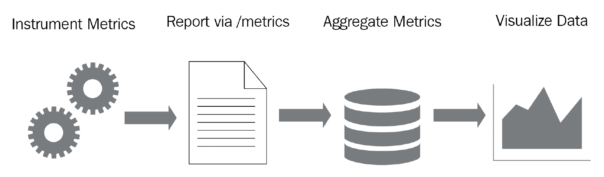
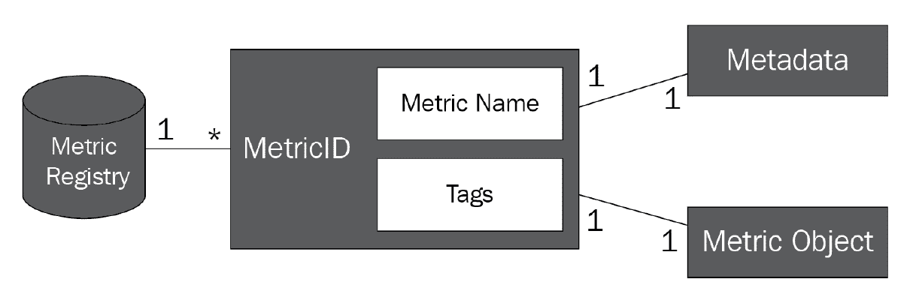
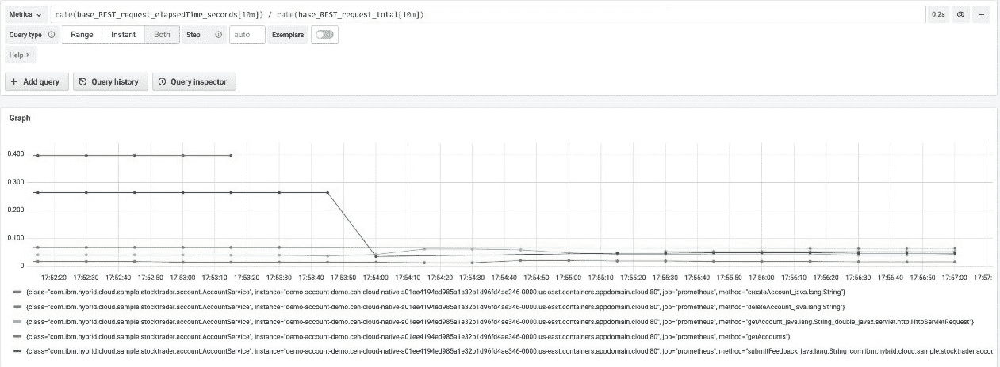
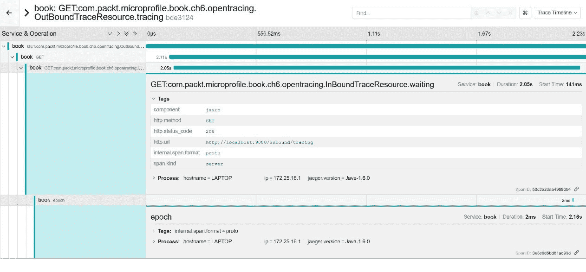

# *第六章*：观察和监控云原生应用程序

在前两章中，我们讨论并解释了 MicroProfile 4.1 平台在构建和增强您的云原生应用程序方面的各种功能。此时，您的云原生应用程序建立在强大的基础核心之上，这得益于 Jakarta EE 平台的经过验证的组件。在此基础上，您添加了一些功能，使您的应用程序更具弹性、安全性、可配置性和可文档化。从所有目的和意义上讲，您已经拥有了一个完全有能力的云原生应用程序，准备部署。但作为您这样的精明开发者，您知道一旦部署了您的云原生应用程序，故事还没有结束。没有任何事情是真正完美的，并且根据您的应用程序生态系统的复杂性，让您的应用程序随意运行可能会造成灾难。

这带来了监控应用程序的重要任务。您、您的团队或您的运维团队需要能够监控应用程序的活动和性能，以识别任何潜在的问题。有效的监控可以用作即将到来的麻烦的早期预警，揭示可能需要优化的区域，或在事后分析中查看可能出错的地方。或者，从更乐观的角度来看，有效的监控可以简单地提供关于应用程序性能的美丽数据。

这就引出了本章的内容，我们将介绍 MicroProfile 平台发布范围内包含的最后三个规范。为了观察和监控您的云原生应用程序，MicroProfile 平台提供了 **MicroProfile Health**、**MicroProfile Metrics** 和 **MicroProfile OpenTracing** 技术。

尤其是以下内容：

+   使用 MicroProfile Health 确定您的云原生应用程序的健康状况

+   使用 MicroProfile Metrics 对您的云原生应用程序进行仪表化和使用指标

+   使用 MicroProfile OpenTracing 跟踪您的云原生应用程序

# 技术要求

要构建和运行本章中提到的示例，您需要一个装有以下软件的 Mac 或 PC（Windows 或 Linux）：

+   Java 开发工具包，版本 8 或更高：[`adoptium.net/`](https://adoptium.net/)

+   Apache Maven：[`maven.apache.org/`](https://maven.apache.org/ )

+   Git 客户端：[`git-scm.com/`](https://git-scm.com/)

本章中使用的所有源代码均可在 GitHub 上找到

一旦您已经克隆了 GitHub 仓库，您可以通过进入 `ch6` 目录并在命令行中输入以下命令来启动 Open Liberty 服务器，这些代码示例将在其中执行：

```java
mvn clean package liberty:run
```

您可以通过在相同的命令窗口中按 *Ctrl* + *C* 来停止服务器。

部署到 Open Liberty 服务器的应用程序将被分配一个上下文根 `ch6`。例如，一个 JAX-RS 资源的完整 URL 将是 `http://localhost:9080/ch6/path/to/resource`。这一点将在本章中展示如何向端点发送请求的代码示例中得到体现。

# 使用 MicroProfile Health 确定您的云原生应用程序的健康状况

为了开始我们关于 MicroProfile 可观察性工具包的三部分之旅，我们将检查 MicroProfile Health 技术。我们选择首先检查这项技术，因为与本章中的其他两项技术相比，其优势和用例范围更广。MicroProfile Health 技术报告有关您的微服务健康或状态的信息。预期的健康状态是 *UP* 或 *DOWN*。

## MicroProfile Health 在云原生应用程序中的重要性

我们现在知道了 MicroProfile Health 技术能做什么。但它有什么作用呢？为了找出答案，我们必须退一步。开发使用 MicroProfile 技术的应用程序的驱动力是它们将是云原生的。如果您还记得 *第一章*，*云原生应用程序*，云原生应用程序与非云原生应用程序之间的重要区别在于其利用云提供的功能的能力。MicroProfile Health 技术是这一点的完美例子。

在其核心，MicroProfile Health 技术致力于向某些外部观察者报告应用程序的健康状况。由于我们正在开发一个云原生应用程序，该应用程序将在您云平台上部署的容器中运行其生命周期。其任期是短暂还是长久，将由健康状况来决定。实际上，这些健康状况报告了容器健康状态给您的云平台。利用容器状态报告，云平台的监控服务可以使用这些数据来做出决定，终止并替换任何有问题的容器。您的容器何时终止和重启最终取决于您，即开发者。您的云平台可能对容器健康状况下的操作有规则，但这些健康状况报告的上下文取决于 MicroProfile Health 技术在您的应用程序中的使用方式。

在本章的后面部分，我们将探讨使用**Kubernetes**应用程序/容器的健康状态的示例场景。Kubernetes 是一个开源项目，它为部署、扩展和管理容器提供了一种容器编排解决方案。作为更知名的容器编排平台之一，它将为展示使用 MicroProfile Health 技术的优势提供一个极好的工具。Kubernetes 以及其他云基础设施主题将在*第七章**，*与 Open Liberty、Docker 和 Kubernetes 的 MicroProfile 生态系统*中更详细地介绍。

## MicroProfile Health 技术概述

MicroProfile Health 提供了三种类型的健康或状态检查：**存活**、**就绪**和**启动**健康检查。我们将在稍后详细解释这些健康检查，但现在是，要知道它们的目的是报告应用程序是否存活、就绪，或者它是否甚至已经完成了启动。应用程序中健康检查的实现和存在被定义为**流程**。这个流程被调用以检查应用程序是否已启动，以及其存活状态或就绪状态对于应用程序中实现组件。从现在开始，我们将把健康检查称为健康检查、流程或两者的组合。

健康检查流程可以在您的微服务中实现，并将返回*UP*或*DOWN*状态，以指示应用程序各个组件的存活状态或就绪状态，以及应用程序是否已完成初始化。存活状态、就绪状态和启动健康检查将通过`http://host:port/health/live`、`http://host:port/health/ready`和`http://host:port/health/started`端点分别报告。每个端点都提供了一个总体状态，它是所有流程的逻辑合取。如果您的应用程序中有五个就绪流程被实现，但只有一个流程返回*UP*，那么您应用程序的总体就绪状态将是*DOWN*。还有一个`http://host:port/health`端点，它提供了整个应用程序的总体状态，这是通过存活状态、就绪状态和启动健康检查的健康检查流程的合取得到的。当使用`http://host:port/health`端点时，存活状态、就绪状态或启动健康检查之间没有区别。所有健康检查流程，无论其类型如何，都必须返回*UP*，`http://host:port/health`端点才能返回*UP*。需要注意的是，调用流程的顺序是任意的，因此可以按任何顺序调用。从现在开始，当提到健康端点时，我们将为了简洁省略`http://host:port`。

在我们继续之前，让我们更深入地了解这三种健康检查类型。

### 存活健康检查

活跃性健康检查程序的目的，正如其名称所暗示的，是报告应用程序是否处于活跃状态。在云环境中，这种状态可以被监控服务用来确定应用程序是否按预期运行。如果健康检查失败，可能会触发您的云平台监控服务终止应用程序的容器。根据您配置的策略，这可能会导致应用程序的容器被重新启动。

注意，失败的活跃性程序并不意味着应用程序不再运行。相反，它意味着用于检查的已采用策略认为应用程序已经或正在遭受服务质量的下降，并且不能再被视为操作上有效。例如，活跃性程序可以用来检测 JVM 中的内存泄漏以及内存损失的速度，因此现在终止此容器比以后更明智。因此，将返回*DOWN*状态。

### 启动健康检查

启动健康检查的目的在于提供一个中间检查，它是活跃性健康检查的前奏。在容器环境中，并非所有容器都是平等的。可以理解的是，某些容器可能由于容器内运行的应用程序的复杂性而启动和初始化较慢。在兼容的云环境中，启动检查可以在执行活跃性检查之前进行一个*UP*检查。

### 准备性健康检查

准备性健康检查程序的目的在于允许外部观察者（例如，云监控服务）确定应用程序是否已准备好接收并执行业务逻辑。尽管活跃性检查表明应用程序已经有效启动并且运行良好，没有问题，但应用程序可能还没有准备好接收流量。这可能是因为应用程序仍在尝试初始化资源或连接到它所依赖的其他应用程序。准备性检查将在其尝试建立连接的过程中报告*DOWN*状态。

关于默认健康检查的特殊说明

根据您底层的 MicroProfile 运行时，您的运行时可能提供`mp.health.disable-default-procedures`配置元素，并设置其值为`true`。

## 健康检查程序的仪表化

健康检查程序由 MicroProfile 运行时调用，以找出应用程序特定组件的健康状况，无论是存活、就绪还是启动程序。但健康检查报告也可能同时报告存活、就绪和启动程序。这是由于 MicroProfile Health 运行时在底层的工作方式。像其他 MicroProfile 技术一样，MicroProfile Health 与`@Liveness`、`@Readiness`和`@Startup`限定符注解内在集成。使用这些注解之一可以让 MicroProfile Health 运行时知道正在报告哪些健康状态。但在我们过于领先之前，应用程序代码中的健康检查究竟是什么？

每个健康检查程序的基础是名为`HealthCheck`的功能接口。它由一个函数`call()`组成，该函数返回一个`HealthCheckResponse`。在应用程序中，`HealthCheck`实现至少注解了`@Liveness`、`@Readiness`或`@Startup`之一。记住，MicroProfile Health 与 CDI 的集成意味着每个健康检查程序（即`HealthCheck`实现）都是一个 CDI bean，并在应用程序的生命周期上下文中有一个位置。为你的健康检查程序定义一个 CDI 作用域也是明智的。在我们的示例中，我们将使用`@ApplicationScoped`。

以下代码片段演示了如何在同一程序中配置存活、就绪和启动健康检查。你可以通过使用一个注解来配置单个健康检查：

```java
@ApplicationScoped
@Liveness
@Readiness
@Startup
public class LivenessCheck implements HealthCheck {
    public HealthCheckResponse call() {
        [...]
    }
}
```

因此，现在我们已经知道了如何创建和定义不同类型的健康检查，我们可以学习如何构建健康检查响应，其数据将通过`/health/*`端点之一被外部观察者消费。

正如我们之前提到的，我们将返回一个`HealthCheckResponse`对象。这个数据对象包含我们需要的所有信息，用于唯一标识健康检查，最重要的是，你的云原生应用程序的健康状况。

`HealthCheckResponse`由三个字段组成：

+   一个`String`字段，用于区分这个健康检查程序与其他健康检查程序。

+   一个具有*UP*或*DOWN*值的`enum`字段。

+   `Map<String, Object>`。当`String`键及其值可以是`String`、`long`或`boolean`时。

现在，让我们看看构建健康检查程序的不同方法。

### 使用 HealthCheckResponseBuilder

要创建一个`HealthCheckResponse`，你可以在`HealthCheckResponse`中调用两种静态方法之一，这将返回一个`HealthCheckResponseBuilder`。这两种方法是`builder()`和`named(String name)`。后者创建一个已指定名称的`HealthCheckResponseBuilder`，而前者提供一个*干净的*实例。

`HealthCheckResponseBuilder` 提供了一个构建模式，用于构建包含所需和可选字段的 `HealthCheckResponse`。如果您打算提供可选数据，这是首选方法。

以下代码示例展示了基于 JVM 堆内存使用情况执行存活健康检查的场景。

`LivenessCheck` 的完整源代码可以在 [`bit.ly/2WbiVyV`](https://bit.ly/2WbiVyV) 找到：

```java
@ApplicationScoped
@Liveness
public class LivenessCheck implements HealthCheck {
    public HealthCheckResponse call() {
    //Percentage value from 0.0-1.0
        Double memoryUsage = getMemUsage();
    HealthCheckResponseBuilder builder =       HealthCheckResponse.named("LivenessCheck");
    if (memoryUsage < 0.9) {
        builder.up();
    } else {
        builder.down();
    }
    builder = builder.withData("MemoryUsage",       memoryUsage.toString());
    return builder.build();
    }
}
```

在这个示例中，我们使用了 `named(String name)` 静态方法为健康检查提供名称。然后，我们使用了 `HealthCheckResponseBuilder` 类的 `up()`、`down()` 和 `withData(String key, String value)` 方法来指定健康检查的状态并提供任何额外的上下文数据。`withData(…)` 方法是一个重载方法，可以接受 `String`、`long` 和 `boolean` 类型的值。在这个示例中，如果内存使用率低于 90%（即 `getMemUsage()` 方法返回的值小于 `0.9`），我们将返回 *UP* 状态。否则，我们将返回 *DOWN* 状态。

或者，如果您使用的是 `HealthCheckResponse.builder()`，您将需要使用 `HealthCheckResponseBuilder` 类的 `name(String name)` 为健康检查提供名称。

现在，我们不再需要一行多的 `if`-`else` 块，我们可以使用 `HealthCheckResponseBuilder.status(boolean status)` 在一行中完成：

```java
    return HealthCheckResponse.builder()
      .name("LivenessCheck")
      .status(memoryUsage < 0.9)
      .withData("MemoryUsage", memoryUsage
      .toString()).build()
```

如您所见，我们将八行代码缩减到了一行！

### 使用 HealthCheckResponse

我们可以不用 `HealthCheckResponseBuilder`，也可以使用 `HealthCheckResponse` 类的两个静态方法，它们方便地创建 *UP* 或 *DOWN* 的 `HealthCheckResponse`，如下例所示。

`ReadinessCheck` 的完整源代码可以在 [`bit.ly/3iV3WBP`](https://bit.ly/3iV3WBP) 找到：

```java
@ApplicationScoped
@Readiness
public class ReadinessCheck implements HealthCheck { 
    public final String NAME = "evenNumberPhobic";
    public HealthCheckResponse call() {
        long time = System.currentTimeMillis();
        if (time % 2 == 0) 
            return HealthCheckResponse.down(NAME);
        else
            return HealthCheckResponse.up(NAME);
    }
}
```

这里使用的方法名称恰如其分，分别是 `up(String name)` 和 `down(String name)`，它们接受一个 `String` 参数，用于定义健康检查的名称。这种方法假设没有额外的可选数据需要与这个健康检查过程结合。在以下示例中，我们将检索当前系统时间，如果它是偶数，我们将返回 *DOWN* 状态（否则，将返回 *UP* 状态）。

### CDI 生产者

由于 MicroProfile Health 对 CDI 的隐式依赖，健康检查过程也可以使用 CDI 方法生产者进行监控。您可以使用 CDI 方法生产者在单个类中监控多个健康检查过程。以下示例展示了存活、就绪和启动健康检查过程作为 CDI 方法生产者进行监控。

`CDIMethodProducerCheck` 的完整源代码可以在 [`bit.ly/3k9GrUT`](https://bit.ly/3k9GrUT) 找到：

```java
@ApplicationScoped
public class CDIMethodProducerChecks {
  @Produces
  @Liveness
  HealthCheck livenessCDIMethodProducer() {
    return () -> HealthCheckResponse.named("cdiMemUsage")      .status(getMemUsage() < 0.9).build();
  }
  @Produces
  @Readiness
  HealthCheck readinessCDIMethodProducer() {
    return () -> HealthCheckResponse.named("cdiCpuUsage")      .status(getCpuUsage() < 0.9).build();
  }
  @Produces
  @Startup
  HealthCheck startupCDIMethodProducer() {
    return () -> HealthCheckResponse.named       ("cdiStartStatus").status(getStatus()).build();
  }
}
```

由`livenessCDIMethodProducer`方法封装的存活性程序，如果内存使用率低于 90%（即`getMemUsage()`方法返回的值小于 0.9），则返回*UP*。由`readinessCDIMethodProducer`方法封装的准备性程序，如果 CPU 使用率低于 90%（即`getCpuUsage()`方法返回的值小于 0.9），则返回*UP*。由`startupCDIMethodProducer`方法封装的启动程序将执行`getStatus()`业务方法来评估应用程序启动状态的条件，并将返回`true`或`false`以调用*UP*或*DOWN*状态，分别。

## 获取健康检查数据

正如我们之前提到的，我们可以通过`/health`、`/health/liveness`、`/health/readiness`和`/health/started`端点查看数据。因此，这些健康检查可以通过 HTTP/REST 请求进行消费。通过 HTTP/REST 调用，健康检查程序以 JSON 格式呈现。根级别包含总体健康状态，有一个`status`字段，它是从`checks` JSON 列表中定义的所有健康检查程序的交集计算得出的。

总体状态决定了 HTTP 响应代码。*UP*状态返回 HTTP 200，而*DOWN*状态返回 HTTP 500。健康检查程序遇到的任何故障或错误将导致返回 HTTP 503 错误代码，这相当于*DOWN*状态。请记住，如果任何健康检查报告处于*DOWN*状态，则总体状态为*DOWN*。列表中的每个健康检查 JSON 对象都显示`HealthCheckReponse`的内容（即其名称、状态和可选的键值映射）。如果没有健康检查程序，则自动返回*UP*（即 HTTP 200）。之前列出的格式结构和行为适用于所有四个端点。使用响应代码很重要，因为这可能是外部观察者确定您的应用程序健康状态的方法（即云平台）。

以下示例输出可以应用于任何四个健康端点，因此我们不会定义它是从哪个端点来的：

```java
{
  "status": "DOWN",
  "checks": [
    {
      "name": "goodCheck",
      "status": "UP"
    },
    {
      "name": "questionableCheck",
      "status": "DOWN",
      "data": {
        "application": "backend",
        "locale": "en"
      }
    }
  ]
}
```

输出报告称我们有一个名为`"goodCheck"`的健康检查程序报告*UP*。我们还有一个名为`"questionableCheck"`的程序报告*DOWN*。这导致总体状态报告*DOWN*，并将导致返回 HTTP 500 错误。如输出所示，`"questionableCheck"`程序已包含额外的上下文映射数据；即`"application": "backend"`和`"locale": "en"`。

关于默认就绪和启动程序的特别说明

MicroProfile Health 运行时提供了一个配置值（通过 MicroProfile Config），称为 `mp.health.default.readiness.empty.response`。其值可以是 *UP* 或 *DOWN*。默认值是 *DOWN*。当应用程序仍在启动且就绪程序尚未调用时，此值用于报告微服务的就绪状态。如果应用程序代码中没有定义就绪健康检查程序，则不适用。如果是这种情况，则没有健康检查程序的默认行为是在 `/health/readiness` 端点上返回带有 *UP* 状态的 HTTP 200 响应。

对于启动健康检查，也存在一个配置值，称为 `mp.health.default.startup.empty.response`。如果没有启动健康检查，则 `/health/started` 端点将返回默认的 *UP* 状态。

另一方面，存活检查没有可配置的值。它们遵循简单的规则：如果应用程序仍在启动且存活检查尚未准备好被调用，则返回带有 *UP* 状态的 HTTP 200 响应。

### 其他连接和有效载荷格式

根据您选择的运行时，健康检查程序的结果可能可以通过其他方式获得（例如，TCP 或 JMX）。我们在这里使用“额外”一词，因为至少，MicroProfile Health 运行时必须支持 HTTP/REST 请求。然而，作为一种云原生技术，MicroProfile Health 了解可能更倾向于其他获取数据的方法。MicroProfile Health 规范定义了一组协议和线格式规则，用于如何消费和展示数据。尽可能以 JSON 格式展示健康检查数据。如果不行，则必须提供相同的数据有效载荷。

本书将不会讨论在 MicroProfile Health 规范中定义的协议和线格式语义的复杂性。您可以在 [`bit.ly/3ecI6Gz`](https://bit.ly/3ecI6Gz) 查阅 MicroProfile Health 规范以获取此类信息。

## MicroProfile 健康检查与 Kubernetes 的存活、就绪和启动探测

现在我们将探讨如何在实际场景中消费健康检查程序报告的健康检查数据。为此，我们将使用 Kubernetes。由于这是更知名的云容器编排平台之一，这将成为一个出色的演示工具。我们将使用 Kubernetes 术语，并尽力在本节中描述这些术语。我们将在 *第七章*，*使用 Docker、Kubernetes 和 Istio 的 MicroProfile 生态系统* 中更深入地探讨 Kubernetes 和云基础设施。

在云环境中，您部署的容器存在于物理或虚拟机的互联网络中。Kubernetes 通过无缝管理和集成驻留在 Kubernetes 的 **Pods** 中的容器部署来提供服务。Pod 可以包含一个或多个容器。为了了解这个网络（即您的云）中 Pods 的活动情况，每个机器上都有一个 **kubelet**。它充当节点代理，管理机器上的 Pods 并与中央 Kubernetes 管理设施通信。作为其职责的一部分，它可以确定这些 Pods 内的容器何时过时或损坏，并在需要时有权停止和重启它们。Kubelets 还被赋予评估容器何时准备好接收流量或不准备接收流量的任务。最基本的是，它们可以检查容器是否已初始化完成。它们通过检查 Pods 内容器的存活、就绪和启动状态来完成这些任务，使用存活、就绪和启动探测。

这种行为是容器特定的，必须在每个容器的基础上启用。这通过在 Pod 的配置 YAML 文件中配置容器来实现。以下示例使用了来自 `broker.yaml` 文件的片段，该文件配置了我们在 *第三章* 中介绍的 StockTrader 应用程序的 Broker 微服务，即 *介绍 IBM 股票交易云原生应用程序*，我们将在 *第八章* 中再次探讨，*逐步开发股票交易应用程序*。YAML 文件包含 Kubernetes `Deployment` 定义，它提供了将容器（s）部署到 Pod 上的配置，包括要使用的容器镜像、环境变量，当然还有，当然，存活、就绪和启动探测，可以为每个定义的容器进行配置。我们省略了文件的其他部分，只显示存活、就绪和启动探测的配置。

`broker.yaml` 的完整源代码可以在 [`bit.ly/3sEvHAa`](https://bit.ly/3sEvHAa) 找到：

```java
apiVersion: apps/v1
kind: Deployment
[...]
spec:
  [...]
  readinessProbe:
    httpGet:
      path: /health/ready
      port: 9080
    initialDelaySeconds: 60
    periodSeconds: 15
    failureThreshold: 2
  livenessProbe:
    httpGet:
      path: /health/live
      port: 9080
    periodSeconds: 15
    failureThreshold: 3
  startupProbe:
    httpGet:
      path: /health/started
      port: 9080
    periodSeconds: 30
    failureThreshold: 4
[...]
```

存活性、就绪性和启动端点分别在 `livenessProbe`、`readinessProbe` 和 `startupProbe` 部分定义。探测被配置为使用 HTTP/S 通过 `httpGet`。在我们的例子中，我们将使用一个未加密的 HTTP 端点。如果你想建立一个安全连接，你需要在 `httpGet` 下添加一个新的字段，命名为 `scheme`，并将其值设置为 `HTTPS`。我们使用 `path` 字段指定 `/health/live`、`/health/ready` 和 `/health/started`，并使用 `port` 指定到达它的端口。就绪性探测使用 `initialDelaySeconds` 字段配置了 60 秒的初始延迟，这可以防止就绪性探测在此时之前触发，以便容器及其应用程序启动。当探测正在触发时，就绪性和存活性探测每 15 秒发送一次请求，启动探测每 30 秒发送一次请求，这是通过 `periodSeconds` 配置的。然而，在这个例子中没有定义的 `timeoutSeconds` 字段。默认情况下，值为 1 秒，它定义了 kubelet 在超时之前应该等待的时间。`failureThreshold` 定义了探测在被视为失败之前将重试多少次。

你可能会注意到存活性探测没有指定 `initialDelaySeconds` 字段。你可以这样做，但这是不必要的，因为我们正在使用 `startUpProbe`。请记住，（如果已定义）启动探测将首先被查询，直到它提供 *UP* 状态，然后才会检查存活性探测。这是 Kubernetes 提供的行为。

如果任何一个探测完全失败，即所有尝试都失败了，那么容器将面临重启。

现在可能不会让人感到惊讶，MicroProfile Health 技术在设计时考虑到了 Kubernetes 平台，提供了存活性、就绪性和启动端点，所有这些都与 Kubernetes 的特定存活性、就绪性和启动探测相匹配。然而，简单的 `/health` 端点的存在使得它能够被只关心单个健康端点的其他平台使用。但请记住，当使用 `/health` 端点时，存活性、就绪性和启动的概念可能不再适用。除此之外，MicroProfile Health 的简单协议和线缆格式规则允许其健康检查数据被任何外部观察者（无论是有意识的还是无意识的）轻松消费。

我们现在已经到达了 MicroProfile Health 部分的结尾。正如我们之前提到的，在 MicroProfile Health 的介绍中，这项技术旨在满足广泛的监控范围。在下一节中，我们将开始详细介绍 MicroProfile Metrics 的监控范围。

# 使用 MicroProfile Metrics 在你的云原生应用程序上度量指标

这是我们的 MicroProfile 可观察性三部曲的第二部分，在这一部分中，我们发现自己正深入 MicroProfile Metrics 的细节。我们之前讨论的技术——MicroProfile Health——努力通过允许开发者有策略地在应用中放置健康检查来报告云原生应用的整体健康。另一方面，MicroProfile Metrics 努力通过你在应用中配置的指标以及 MicroProfile Metrics 运行时提供的指标来报告应用及其环境的性能和内部工作。这提供了可以记录和/或聚合以供专用监控工具分析的实时统计数据。为了实现这一点，MicroProfile Metrics 技术配备了七种不同类型和功能的指标。随着我们通过本章的这一部分继续前进，我们将非常熟悉它们。

## 微服务指标在云原生应用中的重要性

能够监控应用中特定组件的统计和性能数据，并不是一个云原生或开发特定的想法。这应该是一种健康的实践，无论你的努力是否在云上。然而，当我们谈论一个高度可扩展和多样化的应用拓扑时，能够监控你的微服务是至关重要的。即使你管理的不是一个应用集群，而是几个应用，收集指标的好处也是无可争议的宝贵。这是你的微服务与你交流并告诉你它感受的方式。这为你提供了机会，在应用的生命活力健康检查意外宣布它处于*DOWN*状态之前，识别任何令人担忧的模式。例如，在前一节中，我们演示了一个场景，其中生命活力健康检查过程依赖于正在使用的内存量。一旦超过某个阈值，它就会失败并报告*DOWN*。仅仅使用 MicroProfile Health，我们不会知道出了什么问题，直到为时已晚，那时，你的云平台可能已经重启了容器。也许你可能完全不知道发生了任何事情。

MicroProfile Metrics 报告此类统计数据允许你提前预见此类灾难，并了解应用的表现。作为另一个例子，我们可以让指标报告对微服务中 REST 端点发出的请求数量以及平均完成请求所需的时间。这些指标信息可以揭示你的微服务有多受欢迎，以及你的微服务表现得好还是不好。这可以促使采取必要的步骤来修订和修改部署环境，甚至可能是应用本身。

然而，MicroProfile Metrics 只能报告指标的瞬时值。为了正确利用这一信息流，我们需要在时间上聚合指标数据，实际上将其转换为**时间序列指标**。MicroProfile Metrics 本身，以及任何其他 MicroProfile 技术，都不用于完成这项任务。MicroProfile Metrics 的存在只是为了提供一个无缝且有效的将指标仪器化的方式到您的微服务中。已经存在一个专门用于聚合指标和可视化的工具和平台生态系统。一个流行的监控堆栈是利用**Prometheus**和**Grafana**的。

Prometheus 是一个开源的监控解决方案，用于收集、存储和查询时间序列指标。Prometheus 通常与另一个名为 Grafana 的工具结合使用。Grafana 是另一个开源监控解决方案，它通过使用针对时间序列数据库（例如 Prometheus）进行的定制查询，通过图表、表格和其他类型的可视化来显示和可视化时间序列指标。这可以为您提供或您的运维团队以人性化的方式通过有意义的可视化监控微服务的性能的能力。

在本节的结尾，我们将演示如何使用 Grafana 来可视化 MicroProfile Metrics 运行时收集的指标数据。能够战略性地仪器化指标以提供有意义的信息是战斗的一半；有效地使用这些信息才是赢得战斗的方式。

## MicroProfile Metrics 技术概述

你可能已经注意到，在本节的介绍中，我们提到指标可以来自应用程序或运行时本身。就像 MicroProfile Health，其中可能提供默认的健康检查一样，MicroProfile Metrics 运行时也可以提供默认的即用型指标。运行时必须在很大程度上提供它希望提供的任何可选指标之上的某些指标集。这些指标被称为**基本指标**和**供应商指标**。然而，并非所有基本指标都是严格必需的，我们将在稍后解释这一点。开发者在应用程序中通过仪器化的指标被称为**应用程序指标**。所有这些不同的指标集都分别独立存在，不受彼此影响，在不同的**指标注册表**下。指标注册表是 MicroProfile Metrics 技术的控制中心和核心。指标注册表是指标注册、存储、检索和删除的地方。这种将不同类型的指标逻辑分组到它们自己的独特指标注册表中，简化了处理不同范围的指标，最重要的是，避免了如果它们在一个单一的指标注册表中存在时可能发生的任何指标名称冲突。

要检索指标数据，MicroProfile Metrics 运行时提供了四个 HTTP/REST 端点。第一个是一个通用的 `http://host:port/metrics` 端点，它显示所有作用域和注册表中的所有指标。指标以它们各自指标注册表的名字为前缀，以避免混淆。其他三个端点是 `http://host:port/metrics` 端点的子资源，它们报告每个特定注册表中的指标。它们是 `http://host:port/metrics/base`、`http://host:port/metrics/vendor` 和 `http://host:port/metrics/application` HTTP/REST 端点。指标可以以 JSON 或 Prometheus 展示格式报告。我们将在稍后详细介绍这两种格式。在接下来的讨论中，当提到指标端点时，我们将为了简洁省略 `http://host:port`。

总结来说，以下图表展示了指标生命周期的总体流程。首先，指标被配置到您的微服务中（或由运行时提供！）。这些指标在 `/metrics` 端点上进行报告。然后，使用某些监控工具或平台（例如 Prometheus）检索指标数据并将其存储，从而将其转换为时间序列指标。然后，使用另一个监控工具或平台（例如 Grafana）来可视化这些数据：



图 6.1 – 指标的生命周期

我们现在将更详细地描述三种不同的指标作用域；即，**基础指标**、**供应商指标**和**应用指标**。

### 基础指标

基础指标是一组所有 MicroProfile Metrics 运行时必须提供的指标。然而，也有一些例外情况，其中指标可以可选实现。这种轻微的变异性是由于基础指标旨在实现的目标。基础指标列表的创建是为了捕捉和报告每个运行时可能拥有的指标。由运行时定义和实现基础指标可以减轻开发者需要自己配置指标以捕获基本和/或常用统计数据的负担。通过提供这些基础指标，它们将始终可用，无论是否需要。

基础指标显然的目标是包括 **Java 虚拟机**（**JVM**）的统计数据。基础指标覆盖了针对内存统计、垃圾回收统计、线程使用、线程池统计、类加载统计以及操作系统统计的众多指标。然而，并非每个 JVM 都是相同的，其中一些指标是可选的，因为底层的 JVM 可能不保留此类统计数据。基础指标还包括可选的 REST 指标，这些指标跟踪请求计数、未映射异常计数以及每个 REST/JAX-RS 端点上的时间。我们鼓励您通过查看 MicroProfile Metrics 规范来审查基础指标及其定义，规范链接为 [`bit.ly/3mXpL42`](https://bit.ly/3mXpL42)。

MicroProfile Metrics 规范仅明确定义了上述 JVM 和 REST 指标作为基础指标，但 MicroProfile 故障恢复生成的指标也被归类为基础指标。我们在上一章的“故障恢复指标”部分介绍了 MicroProfile 故障恢复指标。

### 供应商指标

供应商指标是供应商为其 MicroProfile Metrics 的实现提供的指标。不同的 MicroProfile Metrics 实现将包含不同的供应商指标集。供应商指标是完全可选的，并且可能存在您选择的 MicroProfile Metrics 运行时不提供任何供应商指标的情况。供应商指标的目的在于允许供应商的实现提供任何可以增强最终用户对特定 MicroProfile Metrics 运行时监控能力的指标。例如，如果您使用的运行时也符合 Jakarta EE 标准，那么它可能能够提供与该平台下组件相关的指标。供应商指标可以通过 `/metrics/vendor` 端点独家访问，或者与 `/metrics` 端点上的其他作用域的指标结合访问。

### 应用指标

应用指标是您，即开发者，在您的应用程序中实现的指标。这些指标报告了您和您的团队感兴趣并用于观察和监控应用程序性能的统计数据。这是您在实现指标时将主要与之交互的指标作用域。应用指标可以通过 `/metrics/application` 端点独家访问，或者与 `/metrics` 端点上的其他作用域的指标结合访问。

## 七种指标类型

现在我们了解了可用的指标的不同作用域，我们可以列出七种应用指标类型：

+   计数器

+   度量

+   并发度量

+   直方图

+   计数器

+   计时器

+   简单计时器

根据名称，很容易推断出不同类型的指标旨在实现什么。如果不清楚，请不要担心——在我们介绍如何在不同指标上实现时，我们将在“实现指标”部分详细讨论这些指标。

## 指标模型

现在我们已经知道了有哪些类型的指标以及它们可能存在的范围，现在是时候让我们了解其背后的指标模型了。这听起来可能像是一个枯燥的话题，你可能会有跳过它的冲动，但如果你希望了解如何有效地进行指标监控和处理，理解这一点是至关重要的。

一个指标，除了是七种指标类型之一外，还包括一个名称，一组可选的键值`/metrics/*`端点。

命名的目的是相当明显的：它是为了唯一地识别出与其他指标不同的指标。然而，在某些情况下，这可能还不够，因为不同的指标可能具有相同的名称。这是因为 MicroProfile Metrics 支持带有键值标签的多维指标。

指标的名称及其标签的组合封装在指标注册表中的`MetricID`对象中。`MetricID`是指标的标识符。它在指标注册表中与指标实例本身紧密耦合。对于指标的标签使用是可选的，并且可能存在你应用程序中的所有指标都使用没有标签的独立指标名称的情况。这导致`MetricID`只有一个名称而没有标签。然而，如果你需要利用多维指标的力量，这可能是有用的。这种需求可能出现在你试图从多个类似来源记录相同类型的数据（例如，一个计数器来计数某些东西）时。你可以使用相同的指标名称并提供一个标签，以唯一地识别它与其他来源的不同。一个例子是，如果你正在使用指标来计数特定类中的方法被调用的次数。你可以将指标命名为`classMethodInvocations`，并为每个方法提供一个标签，其中键是`method`，值是方法的名称。

当使用可用的可视化监控工具之一，如 Grafana 时，这种多维指标的使用最能发挥其优势。你可以通过一个简单的查询快速检索和显示所有具有相同名称的指标，无论它们的标签是什么。

用于识别指标的最后一项是它的元数据。元数据包括指标名称、其类型、指标的度量单位（如果适用）、可选的描述和可选的易读显示名称。对于每个唯一的指标名称，只有一个元数据。因此，可以有多个 MetricID 与一个元数据相关联。能够在元数据中重复使用指标的名称有助于将 MetricIDs 和元数据关联起来，因为它们在指标注册表中是松散耦合的。之前描述的关系在以下图中表示。*****表示 0 到多个：



图 6.2 – 指标注册表指标模型

获取指标数据

在我们继续讨论指标仪表化的主题之前，我们将介绍指标是如何提供的。在 *仪表化指标* 部分，我们将逐个介绍每个指标并提供其输出的示例，特别是其 Prometheus 输出。因此，首先，我们必须了解我们将要查看的内容。

如我们之前提到的，指标可以通过向 `/metrics`、`/metrics/base`、`/metrics/vendor` 或 `/metrics/application` 端点发送 HTTP/REST 请求以 JSON 或 Prometheus 展示格式获取。可以通过向 `/metrics/<scope>/<metric_name>` 发送请求来检索特定指标名称的指标输出。

### JSON 格式

指标的 JSON 格式输出分为两部分。我们可以通过指定 `Accept` 报头为 `application/json` 来调用带有 `GET` 报头的请求，以获取指标及其数据。如果我们发出 `OPTION` 请求，我们将能够检索与指标关联的元数据。

让我们看看向 `/metrics` 发送 `GET` 请求会返回什么。注意，来自不同作用域的指标都位于它们自己的 JSON 数组列表中。我们只展示基本指标，并在示例输出中隐藏任何供应商或应用程序指标。我们还将通过使用基本作用域中列出的前两个指标来查看多维指标的一个示例。存在两个 `gc.total` 指标，其键值对为 `"name=scavenge"` 和 `"name=global"`：

```java
{
  "base": {
    "gc.total;name=scavenge": 361,
    "gc.total;name=global": 9,
    "classloader.loadedClasses.count": 9448,
    "gc.time;name=global": 33,
    "gc.time;name=scavenge": 368,
    "cpu.systemLoadAverage": -1,
    "thread.count": 73,
    "classloader.unloadedClasses.total": 0,
    "jvm.uptime": 52938,
    "cpu.processCpuTime": 23359375000,
    "memory.committedHeap": 53805056,
    "thread.max.count": 89,
    "cpu.availableProcessors": 12,
    "classloader.loadedClasses.total": 9448,
    "thread.daemon.count": 69,
    "memory.maxHeap": 536870912,
    "cpu.processCpuLoad": 0.0023284173808607016,
    "memory.usedHeap": 41412992
  },
  "vendor": {
    [..]
  },
  "application": {
    [..]
  },
}
```

要找出 `gc.total` 指标的目的，我们可以通过向 `/metrics` 发送 `OPTIONS` 请求来获取指标的元数据。由于此请求的输出将很长，我们只展示 `gc.total` 指标并模糊其余部分。像 `GET` 请求一样，每个作用域/注册表的指标都分开到它们自己的 JSON 数组中：

```java
{
  "base": {
    "gc.total": {
      "unit": "none",
      "displayName": "Garbage Collection Count",
      "name": "gc.total",
      "description": "Displays the total number of        collections that have occurred. This attribute lists         -1 if the collection count is undefined for this 
        collector.",
      "type": "counter",
      "tags": [
        [
          "name=global"
        ],
        [
          "name=scavenge"
        ]
      ]
    },
    [...]
  },
  "vendor": {
    [...]
  },
  "application": {
    [...]
  }
}
```

如我们从元数据中看到的，`gc.total` 指标是一个计数器，用于统计在这个 JVM 中发生的垃圾回收次数。标签用于识别系统上两个不同的垃圾回收器，这两个指标正在监控。

向 `/metrics` 发送请求是为了展示如何从不同作用域中划分指标。我们也可以调用 `/metrics/base/gc.total` 来特别检索 `gc.total` 指标的元数据。

### Prometheus 展示格式

使用 Prometheus 展示格式，所有指标数据都通过向 `/metrics/*` 端点发送 `GET` 请求一起提供。如果没有指定 `application/json`，则默认返回 Prometheus 格式。正如其名称所暗示的，这种格式可以直接由 Prometheus 监控工具使用。

格式化指标必须遵循特定的模板。为了描述这一点，我们只看一下 `gc.total` 指标的输出。这里只使用片段，因为完整的输出会太长：

```java
# TYPE base_gc_total counter
# HELP base_gc_total Displays the total number of collections that have occurred. This attribute lists -1 if the collection count is undefined for this collector.
base_gc_total{name="global"} 9
base_gc_total{name="scavenge"} 372
[...]
```

在 Prometheus 展示格式中，指标按其指标名称组织。第一组是针对 `base_gc_total` 指标。这对应于我们在前面提到的 JSON 格式示例中看到的 `gc.total` 指标。真正的指标名称是 `gc.total`，但必须转换为 `gc_total`，因为 Prometheus 格式的指标是包含下划线的字母数字字符。MicroProfile Metrics 运行时还会在指标名称前添加指标所属的注册表作用域的名称。这可能是 `base_`、`vendor_` 或 `application_`。请注意，标签附加到指标名称的末尾，在波浪线括号内。

每个按指标名称唯一分组的指标前都有一个 `# TYPE` 行和一个 `# HELP` 行。这两行定义了指标的类型和描述（如果有的话）。请记住，描述是指标元数据中的一个可选字段。

对于某些指标，存在额外的格式化规则。我们将在下一节中介绍。

## 配置指标

MicroProfile Metrics 技术提供了一个丰富的 Java API，用于编程配置指标，并提供 CDI 注解，以便轻松为方法、字段甚至整个类配置指标。我们不会涵盖使用 Java API 和其注解的所有可能场景，特别是关于 `MetricRegistry` 类的使用。相反，本节将解释 API 和注解的主要用途，以便您能够自信地使用这项技术。我们鼓励您在希望完全掌握所有内容时，查阅 MicroProfile Metrics 的 Java 文档。

在本节中，我们将介绍如何通过编程和注释来配置每个指标。这将随后通过 Prometheus 展示格式中 `/metrics` 端点的输出示例。在此之前，我们将介绍指标注册表、元数据、标签和 `MetricID` 的技术方面。它们提供了有效配置指标所需的基本知识。

如您从 *MicroProfile Metrics 技术概述* 部分中回忆的那样，指标注册表是 MicroProfile Metrics 运行时的操作核心。除非您严格使用注解在您的微服务中配置指标，否则您将需要获取一个 `MetricRegistry`（CDI）bean。正是通过这个 `MetricRegistry`，我们可以编程地创建、注册和检索指标。即使您严格使用注解来配置指标，您也会在底层与 `MetricRegistry` 交互。

本节包含大量内容。以下是我们将要涵盖的摘要：

+   获取指标注册表

+   创建、注册和检索指标：

    a) 元数据、标签和 MetricIDs

    b) 计数器

    c) 并发仪表

    d) 计量器

    e) 计时器和简单计时器

    f) 仪表

+   `@Metric` 注解

让我们开始吧！

### 获取指标注册表

要获取`MetricRegistry`，我们可以使用注入，如下面的代码示例所示：

```java
    @Inject
    MetricRegistry metricRegistry;
```

请记住，存在三种类型的指标注册表作用域：基本指标注册表、供应商指标注册表和应用指标注册表。默认情况下，当你将`MetricRegistry`注入到你的应用程序中时，MicroProfile Metrics 运行时会提供一个应用注册表。如果你愿意，你可以注入其他类型的注册表。你需要使用`@RegistryType`注解来注解你的注入，并使用一个注解参数指定要注入的注册表类型。以下示例说明了`@RegistryType`的使用，其中我们指定类型为`MetricRegistry.Type.Application`：

```java
    @Inject
    @RegistryType(type=MetricRegistry.Type.APPLICATION)
    MetricRegistry metricRegistry;
```

如果你指定了`@RegistryType(type=MetricRegistry.Type.BASE)`或`@RegistryType(type=MetricRegistry.Type.VENDOR)`注解，则可以注入基本指标注册表和供应商指标注册表。然而，在你的应用程序中，你不应该注册指标或操作基本或供应商指标。这两个指标注册表应仅用于检索指标，以便你可以查看其数据。

关于`MetricRegistry`和注解使用的说明

当使用注解来配置指标时，你将只与应用程序的指标注册表进行交互。你将无法选择指标注解应用于哪个`MetricRegistry`。

### 创建、注册和检索指标

使用`MetricRegistry`，你可以使用针对每种指标类型特定的方法来创建和注册指标。除了度量表（Gauge）之外，每种指标类型都将具有以下方法签名。从`MetricRegistry`调用此类方法将在注册表中不存在具有给定名称、元数据和标签的指标时创建、注册并返回该指标的实例。如果已经存在，则返回现有指标。需要注意的是，使用指标注解（除了度量表注解之外）的工作方式类似。我们将使用`Counter`指标类型来演示方法签名模式：

```java
Counter counter(String name);

Counter counter (String name, Tag... tags);

Counter counter (MetricID metricID);

Counter counter (Metadata metadata);

Counter counter (Metadata metadata, Tag... tags);
```

其他指标类型的名称为`concurrentGauge`、`timer`、`simpleTimer`、`histogram`和`meter`。我们将在特定于指标的章节中演示这些方法的多种用法。度量表（Gauge）也有其自己的方法集，由`MetricRegistry`提供，但我们将这些内容放在*度量表（Gauge）*部分进行介绍。

关于指标重用性的说明

不论你是使用`MetricRegistry`还是使用指标注解来配置你的指标，你可以通过指定匹配的元数据或`MetricID`值来重用现有的指标。

如果只想检索指标，你可以从`MetricRegistry`调用`getMetrics()`、`getCounters()`、`getGauges()`、`getConcurrentGauges()`、`getHistograms()`、`getMeters()`、`getTimers()`或`getSimpleTimers()`方法之一。这些调用将返回一个包含所需指标的映射，其中`MetricID`作为键。

有其他方法用于创建、注册、检索和从指标注册表中删除指标，其中一些使用`MetricFilter`，以及其他与检索元数据和指标 ID 有关的方法。你甚至可以创建自己的指标实现并将其注册到 MicroProfile Metrics 运行时提供的实例上。然而，这些方法将不会在本节中介绍，因为它们太多了！我们鼓励你查阅`MetricRegistry`类的 Java 文档。我们之前提供的关于使用`MetricRegistry`的信息是为了帮助你理解后续章节。

### 元数据、标签和`MetricID`

正如你在上一节中可能已经注意到的，元数据、标签和`MetricID`可以被指标注册表在你的应用程序代码中使用。然而，在我们学习如何配置和使用它们之前，我们必须了解如何创建和使用它们。

每个指标都必须包含元数据信息。正如你可能记得的，元数据信息包括其名称、指标类型、度量单位、描述和显示名称。这个集合中必需的字段是名称和指标类型。其他元数据字段是可选的。所有这些信息都包含在一个`Metadata`对象中。`Metadata`对象中的每个字段都是`String`类型。对于指标类型字段，你需要指定来自`MetricType`枚举的一个`enum`值。对于单位字段，你需要指定`MetricUnits`中的静态字段之一。

如果你正在配置多维指标，那么你还需要为你的指标提供标签。每个标签都是一个`String`值的键值对，并由一个`Tag`对象表示。标签的名称必须匹配正则表达式`[a-zA-Z_][a-zA-Z0-9_]*`。标签的值可以是任何内容。一个指标可以包含 0 个或多个标签。然后这个`Tag`被设置到一个包含指标`String`名称的`MetricID`中。

关于可配置标签的说明

使用 MicroProfile Config，我们可以为设置 MicroProfile Metrics 运行时中所有指标的标签值定义两个配置值。`mp.metrics.appName`接受一个用于标识应用程序名称的单个字符串值。这将作为键值标签`_app=<application_name>.`附加到所有指标上。`mp.metrics.tags`配置允许以`tag1=value1,tag2=value2`的形式定义逗号分隔的键值标签列表。这些标签将被应用到所有指标上。

#### 使用元数据和标签进行编程

当程序化度量指标时，我们需要创建一个 `Metadata` 对象。为了完成这个任务，我们需要通过调用静态的 `Metadata.builder()` 方法来检索 `MetadataBuilder`。使用这个 `MetadataBuilder`，我们可以使用构建器模式构造一个 `Metadata` 对象。至少，我们希望指定其名称和度量类型。在以下示例中，我们不会注册任何度量，所以我们将使用 `MetricType.INVALID` 度量类型。在接下来的部分中，我们将演示如何为每个单独的度量使用适当的 `MetricType`：

```java
  @Inject
  MetricRegistry metricRegistry;
  public void metaDataExample() {
    Metadata metadata = Metadata.builder()
    .withName("testMetadata")
    .withType(MetricType.INVALID)
    .build();
    }
```

要创建一个包含所有字段的 `Metadata` 对象，你可以这样做。再次强调，由于这个例子是为了演示，我们将使用 `MetricUnits.NONE` 值。由于即将到来的部分不会大量使用单位字段，我们鼓励你通过查看源文件 [`bit.ly/3ds4IDK`](https://bit.ly/3ds4IDK) 来探索可用的单位值。以下示例还包括了使用标签和 `MetricID`。创建一个 `Tag` 是一个简单的过程，你只需要使用 `String` 名称和值参数调用 `Tag` 构造函数。然后，你可以通过将度量名称和可变长度的 `Tag` 参数传递给 `MetricID` 构造函数来构造一个 `MetricID`。

`MetricsResource` 的完整源代码可以在 [`bit.ly/2UzoczI`](https://bit.ly/2UzoczI) 找到：

```java
@ApplicationScoped
@Path("/metricsResource")
public class MetricsResource {
    @Inject
    MetricRegistry metricRegistry;
    public void metadataTagMetricIDExample() {
        String metricName = "myMetric";
        Metadata metadata = Metadata.builder()
        .withName(metricName)
        .withType(MetricType.INVALID)
        .withDisplayName("Human readable display name")
        .withDescription("This metadata example"
                + " demonstrates how to create a"
                + " Metadata object")
        .withUnit(MetricUnits.NONE).build();
        Tag tag = new Tag("tagKey", "tagValue");
        Tag anotherTag = new Tag("anotherTag", "tagValue");
        MetricID metricID = new MetricID(metricName, tag,           anotherTag);
    }
}
```

通过组合 `MetricID`、标签和元数据，你可以创建、注册并从 `MetricRegistry` 中检索度量。如你所回忆的，在前面的部分中，列出了不同的方法签名，`MetricID` 和 `Metadata` 从不作为参数一起使用。然而，我们知道度量注册表使用它们来分类和识别已注册的度量。这是因为度量注册表将在处理过程中推断出构建其他对象（无论是 `MetricID` 还是元数据）所需的最小必要数据。

#### 使用注解与元数据和标签

当使用注解来度量指标时，元数据和标签通过注解参数提供。可能根本不需要指定任何参数。当使用 CDI 时，MicroProfile Metrics 运行时可以推断出必要的信息。这种类型的注解已经提供了一个度量类型，如果没有提供名称，则将使用包名、类名和方法名生成一个名称。或者，在注解用于构造函数的情况下，它将是包名、类名和构造函数名的组合（即类名再次！）。

即使提供了名称，完整的度量名称也是类名和度量名称的组合。然而，这可能会证明是不理想的。为了解决这个问题，每个度量注解参数都包含一个 `absolute` 参数，你可以将其设置为 `true`，这样度量就会使用提供的度量名称。

为了演示如何使用注解提供元数据信息，以下代码片段将使用 Counter 类的 `@Counted` 注解：

```java
@ApplicationScoped
@Path("/metricsResource")
public class MetricsResource {
    @Counted(name="sample.metric", displayName="sample       metric", description="This sample counter metric         illustrates how to instrument a metric annotation",           unit=MetricUnits.NONE, absolute=true, tags=            {"tag1=value1", "tag2=value2")
    public void someMethod() {
        //logic
    }
}
```

如我们所见，存在接受 `String` 值的 `name`、`displayName` 和 `description` 参数。`absolute` 参数接受一个 `Boolean` 值。单位接受来自 `MetricUnits` 的静态字段，标签以 *键值* 格式接受为 `String` 值列表。

### 计数器

我们终于到达了我们的第一个指标：计数器。计数器指标，正如其名称所暗示的，是一个记录指标数量的指标。计数器只能单调递增。你可以使用它来跟踪一个方法或业务逻辑块被调用的次数，或者接收或发送请求的次数。

#### 使用编程方式对计数器进行度量

以下代码示例演示了如何使用两个 `GET` 请求创建和检索名为 `counterMetric` 的计数器指标。在第一个 `GET` 资源，即 `/counter1` URI 中，我们通过调用 `MetricRegistry.counter(Metadata metadata, Tags… tags)` 创建 `counterMetric`。这将返回一个新的计数器指标，我们可以通过调用 `counter.inc()` 来递增计数器，这将计数器递增 1。在第二个 `GET` 资源，即 `/counter2` URI 中，我们做了一些不同的事情，并调用 `MetricRegistry.counter(MetricID metricID)`。在这里，`MetricID` 与我们在首次创建和注册 `counterMetric` 时由度量注册器生成的 `MetricID` 属性相匹配。由于它已经存在，我们通过度量注册器返回现有的 `counterMetric`。然后我们通过调用 `inc(long value)` 方法来递增计数器，以指定的数量递增。在我们的示例中，我们递增了 3。在两个 `GET` 资源中，我们通过调用 `getCount()` 返回一个包含计数器当前计数的字符串。

`CounterResource` 的完整源代码可以在 [`bit.ly/2XGDDXZ`](https://bit.ly/2XGDDXZ) 找到：

```java
  @GET
  @Path("/counter1")
  public String getCounter1(){
      Metadata counterMetadata = Metadata.builder()
              .withName(COUNTER_METRIC_NAME)
              .withType(MetricType.COUNTER).build();

      Counter counter = metricRegistry
              .counter(counterMetadata, COUNTER_TAG);
      counter.inc(); //increments by one

      return "A counter metric has been created and         incremented" + "by 1, the total is now " +           counter.getCount();  }

  @GET
  @Path("/counter2")
  public String getCounter2(){
      MetricID counterMetricID = new 
        MetricID(COUNTER_METRIC_NAME, 
              COUNTER_TAG);
      Counter counter =         metricRegistry.counter(counterMetricID);

      counter.inc(3);
      return "A counter metric was retrieve and         incremented" + " by 3, the total is now " +           counter.getCount();
  }
```

现在，让我们看看当我们向两个 `GET` 资源发送请求，然后通过 `/metrics/application/counterMetric` 直接查看结果时会发生什么：

```java
$ curl http://localhost:9080/ch6/counterResource/counter1
A counter metric has been created and incremented by 1, the total is now 1
$ curl http://localhost:9080/ch6/counterResource/counter2
A counter metric was retrieve and incremented by 3, the total  is now 4
$ curl http://localhost:9080/metrics/application/counterMetric
# TYPE application_counterMetric_total counter
application_counterMetric_total{metricType="counter"} 4
```

在输出中，我们向 `/ch6/counterResource/counter1` 和 `/ch6/counterResource/counter2` 端点发出 `GET` 请求，计数器指标分别递增 1 和 3。然后我们向 `/metrics/application/counterMetric` 发出 `GET` 请求，直接查看计数器指标的 Prometheus 格式输出。返回 `application_counterMetric_total{metricType="counter"}`，它代表具有 `metricType="counter"` 标签的计数器指标。其值为 4，正如预期的那样。

关于计数器的 Prometheus 格式说明

Prometheus 展示格式中的计数器指标将在指标名称后附加 `_total` 后缀。

#### 使用注解对计数器进行度量

使用注解是一个更简单的事情。您可以在方法、构造函数甚至整个类上注解`@Counted`注解。当注解的元素被调用时，计数器增加 1。

在我们的示例中，我们将使用`@Counted`注解来注解`MetricsResource`类。当一个度量注解注解在类上时，它将应用于该注解的所有适用目标。对于`@Counted`，这意味着所有构造函数和方法都将被度量。此示例还将演示生成的度量名称。请注意，由于我们使用注解，我们不需要注入`MetricRegistry`。

`CounterAnnotatedResource`的完整源代码可以在[`bit.ly/3iZiL6D`](https://bit.ly/3iZiL6D)找到：

```java
@ApplicationScoped
@Path("/counterResource")
@Counted
public class CounterAnnotatedResource {

  @GET
  @Path("/getResource")
  public String getResource() {
      return "Counting the class";
  }
}
```

让我们驾驶一下应用程序。我们将省略显示到应用程序 REST 端点的`curl`命令，只显示查询`/metrics/application`的输出：

```java
$ curl http://localhost:9080/metrics/application
# TYPE application_metrics_demo_CounterAnnotatedResource
_getResource_total counter
application_metrics_demo_CounterAnnotatedResource_getResource_total 1
# TYPE application_metrics_demo_CounterAnnotatedResource
_CounterAnnotatedResource_total counter
application_metrics_demo_CounterAnnotatedResource_CounterAnnotatedResource_total 1
```

在向`/ch6/counterResource/getResource`发出单个`GET`请求后，我们应该在查看`/metrics/application`端点的度量数据时看到上述值。`application_metrics_demo_CounterAnnotatedResource_getResource_total`是针对`getResource()`方法创建的计数器度量，而`application_metrics_demo_CounterAnnotatedResource_CounterAnnotatedResource_total`是针对类构造函数创建的计数器度量。两个值都是*1*，正如预期的那样。

### 并发度量

并发度量指标是一种用于计算被测量组件的并行调用的度量。其值可以增加或减少。此度量可以用来计算方法、业务逻辑、请求等的并行调用次数。除了计算并行调用次数外，并发度量指标还跟踪之前**已完成的完整分钟**内记录的最高和最低计数。一个完成的完整分钟表示时钟从 0:00:00.9999999 到 0:00:59.99999999 的时间段。一个完成的完整分钟并不意味着从当前瞬时时间的最后 60 秒。

#### 以编程方式对并发度量指标进行度量

在本节中，我们将演示如何使用并发量规。它们通常使用名为 `sleeper` 的 `Runnable` 并行调用。这创建并随后检索一个名为 `concurrentGaugeMetric` 的并发量规。在这个例子中，我们将使用 `MetricRegistry.concurrentGauge(String name)` 与度量注册表进行交互。这是度量注册表提供的最简单的创建或检索方法，因为您只需要提供名称。这表示与此度量没有关联的标签。然后，`sleeper` `Runnable` 将增加并发量规（例如，使用 `inc()`），睡眠 10 秒，然后减少它（例如，使用 `dec()`）。您只能增加或减少 1。我们将使用 `for` 循环和 `ExecutorService` 进行并行调用。然而，在此代码示例中没有显示三个值的获取方法；即 `getCount()`、`getMin()` 和 `getMax()`。

`ConcurrentGaugeResource` 的完整源代码可以在 [`bit.ly/3ghFyZz`](https://bit.ly/3ghFyZz) 找到：

```java
  @GET
  @Path("/concurrentGauge")
  public String getConcurrentGage(){
      ExecutorService executorService = 
        Executors.newCachedThreadPool();
        Runnable sleeper = () -> {
            ConcurrentGauge concurrentGauge =               metricRegistry.concurrentGauge
               (CONCURRENTGAUGE_METRIC_NAME);
            concurrentGauge.inc();
            try {
                Thread.sleep(10000);
            } catch (InterruptedException e) {
                e.printStackTrace();
            }
            concurrentGauge.dec();
        };
        for (int i = 0; i < 10; i++) {
            executorService.submit(sleeper);
        }

      return "Concurrent Gauge created and invoked in         parallel";
  }
```

对于这个例子，我们将发送一个名为 `/ch6/concurrentGaugeResource/concurrentGauge` 的 `GET` 请求。一旦当前分钟完成，我们将通过 `/metrics/application` 查看输出：

```java
$ curl http://localhost:9080/ch6/concurrentGaugeResource
/concurrentGauge
Concurrent Gauge created and invoked in parallel
$ curl http://localhost:9080/metrics/application
# TYPE application_concurrentGaugeMetric_current gauge
application_concurrentGaugeMetric_current 10
# TYPE application_concurrentGaugeMetric_min gauge
application_concurrentGaugeMetric_min 0
# TYPE application_concurrentGaugeMetric_max gauge
application_concurrentGaugeMetric_max 0
## after a complete full minute…
$ curl http://localhost:9080/m**etrics/application**
# TYPE application_concurrentGaugeMetric_current gauge
application_concurrentGaugeMetric_current 0
# TYPE application_concurrentGaugeMetric_min gauge
application_concurrentGaugeMetric_min 0
# TYPE application_concurrentGaugeMetric_max gauge
application_concurrentGaugeMetric_max 10
```

在前面的输出中，我们向 `/ch6/concurentGaugeResource/concurrentGauge` 发出了一个 `GET` 请求。然后，我们跟进了一个 `GET` 请求，`/metrics/application`，以查看输出。`application_concurrentGaugeMetric_current` 显示了预期的当前值 `10`。`application_concurrentGaugeMetric_max` 和 `application_concurrentGaugeMetric_min`，显示了上一分钟记录的最大和最小值，都是预期的 `0`。在当前整分钟完成之后，我们再次查看结果，我们看到当前、最大和最小值都是预期的 `0`、`0` 和 `10`。

关于具有多个值的度量注意事项

并发量规是我们第一个具有多个输出值的度量。为了使用相同的度量名称显示所有值，每个度量值都分配了自己的后缀。我们将在其他复杂度量中看到这种模式。

在我们向 `/ch6/concurrentGaugeResource/concurrentGaugeParallel` 发出 `GET` 请求后立即，我们将看到并发量规的当前计数为 `10`。当每个线程的 10 秒已过并且已经过去整整一分钟时，我们将看到当前值是 `0`，最大值是 `10`。

#### 使用注解仪表化并发量规

要使用注解对并发量规进行仪表化，您必须使用 `@ConcurrentGauge` 注解。这适用于方法、构造函数和类。当目标被调用时，并发量规注解将增加，当它完成时将减少。

我们将以与程序示例类似的方式演示 `@ConcurrentGauge` 的用法。`sleeper` 可运行对象将调用带有 `@ConcurrentGauge` 注解的 `sleeper()` 方法。在这个例子中，我们将指定 `absolute=true`，这将导致 MicroProfile Metrics 运行时使用指标名称。`/metrics/*` 输出将与程序示例相同，因此在此处不会展示。

`ConcurrentGaugeAnnotatedResource` 的完整源代码可以在 [`bit.ly/3xZZhD0`](https://bit.ly/3xZZhD0) 找到：

```java
    @GET
    @Path("/concurrentGuage")
    public String getConcurrentGauge(){
        ExecutorService executorService =           Executors.newCachedThreadPool();
        Runnable sleeper = () -> sleeper(); 
        for (int i = 0; i < 10; i++) {
            executorService.submit(sleeper);
        }
        return "Concurrent Gauge created and invoked in           parallel";
    }
    @ConcurrentGauge(name = CONCURRENTGAUGE_METRIC_NAME,       absolute = true)
    public void sleeper() {
        try {
            Thread.sleep(10000);
        } catch (InterruptedException e) {
            e.printStackTrace();
        }
    }
```

### 直方图

直方图指标，就像直方图图表一样，以统计分布的方式处理它所提供的数据。直方图指标输出 12 个值：计数、总和、最小值、最大值、平均值、标准差以及第 50、75、95、98、99 和 99.9 个百分位数。与其他指标不同，直方图指标只能通过编程方式进行仪表化。没有注解支持。您可以使用直方图指标来记录和计算应用程序在处理过程中接收到的数据大小的分布。

在我们的演示中，我们将生成 1,000 个介于 *0-999* 范围内的随机数，并将它们输入到我们的直方图中。这次，我们将使用 `metricRegistry.histogram(Metadata metadata)` 来创建我们的直方图。我们不会展示 `getCount()`、`getSum()` 和 `getSnapshot()` 获取器方法，这些方法返回包含剩余统计值获取器方法的 `Snapshot` 对象。由于这会太长而无法列出，您可以在以下位置查看 `Snapshot` 类及其方法：[`bit.ly/2QndNFf`](https://bit.ly/2QndNFf)。

`HistogramResource` 的完整源代码可以在 [`bit.ly/3y4AoWK`](https://bit.ly/3y4AoWK) 找到：

```java
    @GET
    @Path("/histogram")
    public String getHistogram()  {
      Metadata histogramMetadata = Metadata.builder()
      .withName(HISTOGRAM_METRIC_NAME)
      .withUnit(MetricUnits.MILLISECONDS)
      .withDescription("This histogram tracks random 
        millesconds")
      .withType(MetricType.HISTOGRAM).build();

      Histogram histogram =         metricRegistry.histogram(histogramMetadata);

      Random random = new Random();
      for (int i = 0; i < 1000 ; i++) {
          int randomInt = random.nextInt(1000);
          histogram.update(randomInt);
      }
      int count = (int) histogram.getCount(); //returns         long value of count
      Snapshot snapshot = histogram.getSnapshot(); //rest         of the stats

       return "Histogram created/retrieved and is tracking          random milliseconds";
    }
}
```

让我们看看我们会得到什么结果：

```java
$ curl http://localhost:9080/ch6/histogramResource
/histogram
Histogram created/retrieved and is tracking random milliseconds
$ curl http://localhost:9080/metrics/application
# TYPE application_histogramMetric_mean_seconds gauge
application_histogramMetric_mean_seconds 0.5048109999999999
# TYPE application_histogramMetric_max_seconds gauge
application_histogramMetric_max_seconds 0.998
# TYPE application_histogramMetric_min_seconds gauge
application_histogramMetric_min_seconds 0.0
# TYPE application_histogramMetric_stddev_seconds gauge
application_histogramMetric_stddev_seconds 0.2884925116515156
# TYPE application_histogramMetric_seconds summary
# HELP application_histogramMetric_seconds This histogram tracks random millesconds
application_histogramMetric_seconds_count 1000
application_histogramMetric_seconds_sum 504.81100000000004
application_histogramMetric_seconds{quantile="0.5"} 0.507
application_histogramMetric_seconds{quantile="0.75"} 0.755
application_histogramMetric_seconds{quantile="0.95"} 0.9510000000000001
application_histogramMetric_seconds{quantile="0.98"} 0.974
application_histogramMetric_seconds{quantile="0.99"} 0.981
application_histogramMetric_seconds{quantile="0.999"} 0.995
```

在前面的输出中，我们向 `/ch6/histogramResource/histogram` 发出了一个 `GET` 请求，并随后向 `/metrics/application` 发出了一个 `GET` 请求以查看结果。正如预期的那样，计数为 1,000，这是由 `application_histogramMetric_seconds_count` 值报告的。剩余的指标值是计算得出的值。由于值数量众多，我们不会明确覆盖所有这些值。提供的指标值名称是自解释的，以表明它们代表什么值。

关于使用直方图的 Prometheus 格式说明

如果已定义了单位，则将指标名称附加到单位上作为 `_<unit>`。Prometheus 只接受某些 **基本单位**，因此 MicroProfile Metrics 运行时将值缩放到适当的基单位。例如，如果指定了毫秒作为单位，则值将缩放到秒的基单位。

此外，请注意，分位数指标值具有相同的名称，但使用标签来标识它代表的是哪个百分位数。

### 计数器

仪表度量，就像直方图度量一样，聚合输入值并执行计算以产生结果。仪表计算的是每秒的速率，而不是统计分布。指定的度量单位将被忽略。这仅适用于 Prometheus 输出。仪表输出平均速率以及 1、5 和 15 分钟的指数加权移动平均速率。仪表对于监控微服务中特定方法或组件的流量非常有用。

#### 以编程方式对仪表进行配置

在我们的示例中，我们将演示使用仪表度量来监控两个 `GET` 资源 `/meter` 和 `/meter2` 的请求速率。对于第一个 `GET` 资源，我们将使用我们尚未与 `MetricRegistry.meter(String metricName, Tags… tags)` 一起使用的注册/检索方法的最后一个变体。一旦创建或检索到度量，我们将调用 `mark()` 方法，该方法将仪表记录的点击次数增加 1。对于第二个 `GET` 资源，我们可以传递一个长参数值，以便调用 `mark(long value)`，这将按指定值增加仪表的点击次数。注意，我们在 `/meter2` `GET` 资源中使用 `MetricID` 来检索在 `/meter` 资源中创建和注册的度量。

`MeterResource` 的完整源代码可以在 [`bit.ly/3ASCV8j`](https://bit.ly/3ASCV8j) 找到：

```java
    private final Tag METER_TAG = new Tag("metricType",       "meter");

    @GET
    @Path("/meter")
    public String getMeter(){     
     Meter meter = metricRegistry.meter(METER_METRIC_NAME,       METER_TAG);
        meter.mark();
        return "Meter created/retrieved and marked by 1";
    }
    @GET
    @Path("/meter2")
    public String getMeter2(@QueryParam("value") 
      @DefaultValue("1") int value){      
        MetricID meterMetricID = new           MetricID(METER_METRIC_NAME, METER_TAG); 
        Meter meter = metricRegistry.meter(meterMetricID);
        meter.mark(value);
        return "Meter created/retrieved and marked by " +           value;
    }
}
```

未显示的是值的获取方法；即 `getCount()`、`getMeanRate()`、`getOneMinuteRate()`、`getFiveMinuteRate()` 和 `getFifteenMinuteRate()`。让我们运行一下对 `GET` 资源的访问，并在 `/metrics/application` 查看结果：

```java
$ curl http://localhost:9080/ch6/meterResource/meter
Meter created/retrieved and marked by 1
$ curl http://localhost:9080/ch6/meterResource/meter2?value=3
Meter created/retrieved and marked by 3
$ curl http://localhost:9080/metrics/application
# TYPE application_histogramMetric_total counter
application_histogramMetric_total{metricType="meter"} 4
# TYPE application_histogramMetric_rate_per_second gauge
application_histogramMetric_rate_per_second{metricType="meter"} 0.4348951236275281
# TYPE application_histogramMetric_one_min_rate_per_second gauge
application_histogramMetric_one_min_rate_per_second{metricType="meter"} 0.8
# TYPE application_histogramMetric_five_min_rate_per_second gauge
application_histogramMetric_five_min_rate_per_second{metricType="meter"} 0.8
# TYPE application_histogramMetric_fifteen_min_rate_per
_second gauge
application_histogramMetric_fifteen_min_rate_per_second{metricType="meter"} 0.8
```

在前面的输出中，我们向 `/ch6/meterResource/` 仪表发送了一个 `GET` 请求，将其增加 1，然后向 `/ch6/meterResource/meter2` 发送了一个 `GET` 请求，并提供了参数值以将仪表增加 3。然后我们在 `/metrics/application` 中查看了结果输出。`application_histogramMetric_total` 显示计数为 4，正如预期的那样，其余的值是计算值。再次强调，与剩余度量值相关的名称是自解释的，将不会进行明确解释。

#### 使用注释对仪表进行配置

要使用注释对仪表度量进行配置，必须使用 `@Metered` 注解。此注解适用于方法、构造函数和类。与其他注解度量一样，使用注解只能增加单个值。我们将演示一个使用 `@Metered` 注解的示例，并省略显示结果。

`MeterAnnotatedResource` 的完整源代码可以在 [`bit.ly/3mhnHpk`](https://bit.ly/3mhnHpk) 找到：

```java
    @GET
    @Path("/meter")
    @Metered(name=METER_METRIC_NAME, tags={"metricType=meter"})
    public String getMeterWithAnnotations() {
        return "Meter created/retrieved and marked by 1           with annotations";
    }
```

### 计时器和简单计时器

由于计时器和简单计时器度量非常相似，我们将演示如何一起使用这两个度量。

**计时器**指标，正如其名称所暗示的，记录通过仪器组件所花费的时间。在其核心，它跟踪总经过时间。此外，它还提供了记录的击中次数的吞吐量/速率，以及记录时间的统计分布。这些输出的值与直方图和计量指标相同。

另一方面，**简单计时器**指标是一个计时器，但去掉了额外的功能。它只报告计数、总经过时间，以及，类似于并发计量器，上一完整分钟的最高和最低记录时间。如果你不需要计时器提供的所有额外值，或者打算稍后自己计算它们，那么简单计时器应该是你的首选指标。

#### 以编程方式仪器化计时器和简单计时器

在我们的示例中，我们将在各自的`GET`资源中仪器化计时器和简单计时器。在这两个资源中，我们将提供一个使用`Context`对象记录时间的示例。这允许我们通过从计时器或简单计时器调用`time()`方法来显式标记我们想要计时的开始和结束，以开始计时，然后调用`Context`对象的`close()`方法来停止计时。请注意，`Context`对象是`Timer`和`SimpleTimer`类的内部接口，并且你需要使用适当的`Context`对象。计时器和简单计时器指标都可以计时`Runnable`或`Callable`对象或 lambda 表达式的执行。以下两个代码片段来自同一个`TimersResource`类，完整的源代码可以在[`bit.ly/37YaWYy`](https://bit.ly/37YaWYy)找到。

以下代码片段显示了名为`/timer`的`GET`资源，它使用计时器指标演示了使用`Runnable`对象进行计时：

```java
    @GET
    @Path("/timer")
    public String getTimer() {
        Timer timer = metricRegistry.timer(TIMER_METRIC_NAME);
        Timer.Context timerContext = timer.time();
        timerContext.close();
        Runnable runnableTimer = () -> {
            try {
                Thread.sleep(2000);
            } catch (InterruptedException e) {
                e.printStackTrace();
            }
        };
        // Time a Runnable
        timer.time(runnableTimer);
        return "Timer created/retrieved and recorded total           elapsed time of " + timer.getElapsedTime();
    }
```

以下代码片段显示了名为`/simpleTimer`的`GET`资源，它使用简单计时器指标演示了使用`Callable`对象进行计时：

```java
    @GET
    @Path("/simpleTimer")
    public String getSimpleTimer(){
      SimpleTimer simpleTimer =        metricRegistry.simpleTimer(SIMPLETIMER_METRIC_NAME);
      SimpleTimer.Context simpleTimerContext =        simpleTimer.time();
        simpleTimerContext.close();
        // Time a Callable
        Callable<String> callable = () -> {
            Thread.sleep(2000);
            return "Finished Callable";
        };
        simpleTimer.time(callable);
        return "SimpleTimer created/retrieved and recorded           total elapsed time of " + simpleTimer             .getElapsedTime();
    }
```

未显示的是获取指标值的获取方法。对于计时器，你可以调用`getCount()`、`getElapsedTime()`、`getSnapshot()`、`getMeanRate()`、`getOneMinuteRate()`、`getFiveMinuteRate()`和`getFifteenMinuteRate()`。对于简单计时器，你可以调用`getCount()`、`getElapsedTime()`、`getMinTimeDuration()`和`getMaxTimeDuration()`。

让我们来看看`GET`资源，并查看结果：

```java
$ curl http://localhost:9080/ch6/timersResource/timer
Timer created/retrieved and recorded total elapsed time of 2001 milliseconds
$ curl http://localhost:9080/ch6/timersResource/simpleTimer
SimpleTimer created/retrieved and recorded total elapsed time of 2000 milliseconds
$ curl http://localhost:9080/metrics/application
# TYPE application_simpleTimerMetric_total counter
application_simpleTimerMetric_total 1
# TYPE application_simpleTimerMetric_elapsedTime_seconds gauge
application_simpleTimerMetric_elapsedTime_seconds 2.0005379000000003
# TYPE application_simpleTimerMetric_maxTimeDuration
_seconds gauge
application_simpleTimerMetric_maxTimeDuration_seconds NaN
# TYPE application_simpleTimerMetric_minTimeDuration
_seconds gauge
application_simpleTimerMetric_minTimeDuration_seconds NaN
```

首先，我们向`/ch6/timersResource/timer`和`/ch6/timersResource/simpleTimer`发送`GET`请求以调用我们的两个计时器。然后，我们向`/metrics/application`发送请求以查看结果。由于我们已经展示了并发仪表的最大和最小行为的相似性，因此我们在此不会演示简单计时器的该行为。此外，由于计时器指标输出记录时间的统计分布（包括总记录持续时间）和请求吞吐量，类似于直方图和仪表指标，因此计时器指标的输出将被省略。剩下的就是简单计时器的输出。请注意，`application_simpleTimerMetric_maxTimeDuration_seconds`和`application_simpleTimerMetric_minTimeDuration_seconds`的值报告为`NaN`。这是因为之前完成的分钟内没有记录的值。如果您想查看完整的输出，我们鼓励您直接尝试样本。请查看本章开头的*技术要求*部分，了解如何运行样本的说明。

#### 使用注解仪表化计时器和简单计时器

要对计时器和简单计时器指标进行仪表化，您需要分别使用`@Timed`和`@SimplyTimed`。这些注解适用于方法、构造函数和类。它们都会记录目标注解元素执行所需的时间。

我们将展示一个简单示例，演示如何在 JAX-RS 端点上注解`@Timed`和`@SimplyTimed`。

`TimersAnnotatedResource`的完整源代码可以在[`bit.ly/3xVroDb`](https://bit.ly/3xVroDb)找到：

```java
    @GET
    @Path("/timers")
    @Timed(name=ANNOTATED_TIMER_METRIC_NAME)
    @SimplyTimed(name= ANNOTATED_SIMPLETIMER_METRIC_NAME)
    public String getTimerWithAnnotations() {
        //some business logic to time
        return "Timer with annotations";
    }
```

### 仪表

仪表指标用于报告应用程序提供的某些值。这可以是任何值，但强烈建议该值是一个数字，因为 Prometheus 仅支持数字仪表。这并不是 JSON 输出的限制。此外，您只能使用指标注册表的创建仪表的方法来创建数字仪表。

#### 程序化仪表化仪表

如我们之前提到的，仪表指标不遵循与其他指标相同的注册和检索方法签名模式。这是由于仪表指标的性质所致。在注册或检索仪表时，您需要指定一个`Supplier`或`Function`对象或 lambda 表达式。

以下是为注册或检索仪表指标的方法签名：

```java
<T, R extends Number> Gauge<R> gauge(String name, T object, Function<T, R> func, Tag... tags);
<T, R extends Number> Gauge<R> gauge(MetricID metricID, T object, Function<T, R> func);
<T, R extends Number> Gauge<R> gauge(Metadata metadata, T object, Function<T, R> func, Tag... tags);
<T, R extends Number> Gauge<R> gauge(Metadata metadata, T object, Function<T, R> func, Tag... tags);
<T extends Number> Gauge<T> gauge(MetricID metricID, Supplier<T> supplier);
<T extends Number> Gauge<T> gauge(Metadata metadata, Supplier<T> supplier, Tag... tags);
```

您可以使用仪表指标调用的唯一显著方法是`getValue()`。由于您应该熟悉`MetricID`类、`Metadata`类、如何创建指标以及 Java 函数（我们假设您熟悉），因此我们不会提供任何用于程序化仪表化仪表指标的示例代码。

#### 使用注解仪表化仪表

要对量规指标进行仪表化，您需要使用 `@Gauge` 注解。此注解只能应用于方法。使用量规注解时，您必须指定单位参数。我们将展示一个简单示例，其中方法（因此是量规）将返回自上次纪元以来的当前毫秒数。

`GaugeResource` 的完整源代码可以在 [`bit.ly/3mfj6Ux`](https://bit.ly/3mfj6Ux) 找到：

```java
@ApplicationScoped
@Path("/metricsResource")
public class MyMetricsResource {
    @Gauge(name="time.since.epoch", unit =       MetricUnits.MILLISECONDS)
    public long getGaugeWithAnnotations() {
        return System.currentTimeMillis();
    }
}
```

我们假设一个 `GET` 请求调用此方法，所以我们只在这里展示结果 `/metrics/application` 输出：

```java
$ curl http://localhost:9080/metrics/application
# TYPE application_metrics_demo_gaugeResource_time_since
_epoch_seconds gauge
application_metrics_demo_gaugeResource_time_since_epoch
_seconds 1.6181035765080001E9
```

关于 Prometheus 格式化量规的注意事项

为该量规定义的单位附加为 `_<unit>` 并将其缩放到适当的基单位。

### `@Metric` 注解

`@Metric` 注解是一种独特的注解，允许您注入与被注解的字段或参数类型相对应的指标。`@Metric` 注解包含与其他指标注解相同的注解参数。如果存在匹配的元数据，它将返回一个指标；否则，将创建、注册并注入指定类型的新指标。让我们看看使用两种注入策略的示例。

`MetricsResource` 的完整源代码可以在 [`bit.ly/3iBAz7E`](https://bit.ly/3iBAz7E) 找到：

```java
    @Inject
    @Metric(name="fieldInjectedCounter")
    Counter fieldInjectedCounter;

    Counter parameterInjectedCounter;
    @Inject
    public void setCounterMetric(@Metric(name =       "parameterInjectedCounter") Counter         parameterInjectedCounter) {
        this.parameterInjectedCounter =           parameterInjectedCounter;
    }
```

在上述示例中，`fieldInjectedCounter` 使用字段注入进行注入，而 `parameterInjectedCounter` 使用参数注入进行注入。

## 使用 Prometheus 和 Grafana 可视化指标数据

MicroProfile 指标运行时只能报告瞬时指标值。为了有效地使用这些数据用于监控目的，我们需要使用 Prometheus 等工具聚合这些数据。然后，使用 Grafana 等工具，我们可以创建各种可视化，展示可配置时间段内的指标数据。Prometheus 可以从多个来源抓取数据，然后 Grafana 通过对 Prometheus 执行查询（使用 `REST.request`），从 StockTrader 应用程序的代理微服务中获取数据。

理解 `REST.request` 指标

`REST.request` 指标是一个简单的计时器，由 MicroProfile 指标运行时自动仪表化到所有 REST 端点。仪表化的 `REST.request` 指标通过与类名和方法签名相关的标签区分彼此。

### 代理微服务

代理服务包含多个 JAX-RS/REST 端点，用于创建、检索和删除代理对象，以及使用 `GET`、`POST` 和 `DELETE` 请求检索投资组合回报。所有这些都在 `AccountService` 类中发生。完整源代码可以在 [`bit.ly/3sBGvPE`](https://bit.ly/3sBGvPE) 找到。

首先，我们将查看`REST.request`指标的样本输出，以便在演示如何使用 Grafana 查询它之前，了解指标名称的格式及其标签。我们将展示一个`GET`端点的输出，该端点查询所有方法为`getAccounts()`的账户。其他基本指标（`REST.request`的最大时间和最小时间值以及指标描述）已从输出中省略：

```java
$ curl http://localhost:9080/metrics/base
# TYPE base_REST_request_total counter
base_REST_request_total{class="com.ibm.hybrid.cloud.sample.stocktrader.account.AccountService",method="getAccounts"} 45
# TYPE application_simpleTimerMetric_elapsedTime_seconds gauge
base_REST_request_elapsedTime_seconds{class="com.ibm.hybrid.cloud.sample.stocktrader.account.AccountService",method="getAccounts"} 1.7304427800000002
```

### 使用 Grafana 进行可视化

在 Grafana 中，我们可以通过查询指标名称来创建每个指标的可视化。例如，我们可以简单地查询`base_REST_request_total`，Grafana 将显示该指标的所有实例，该指标计算对 REST 端点的请求调用次数。或者，如果我们只想查看单个微服务（如`AccountService`）的指标，我们可以发出以下查询：

```java
base_REST_request_total{class=" com.ibm.hybrid.cloud.sample.  stocktrader.account.AccountService"} 
```

然而，仅仅计数器的总计数并不能告诉我们太多。我们更感兴趣的是知道在过去 10 分钟内指标增加了多少次。在这里，我们可以执行以下查询：

```java
increase(base_REST_request_total[10m]).
```

或者，也许我们想知道在过去 10 分钟内请求增加的速率：

```java
rate(base_REST_request_total[10m])
```

当使用简单的计时器时，我们最感兴趣的是计时数据。然而，仅凭经过的时间本身并没有什么意义，但我们可以计算一个新的值，这可能会更有用。使用经过的时间和计数，我们可以使用以下查询计算每个请求的平均持续时间：

```java
rate(base_REST_request_elapsedTime_seconds[10m]) / rate(base_REST_request_total[10m]).
```

以下是对上述查询的图形可视化。快照的详细信息并不重要；快照的作用是说明使用 Grafana 时您期望看到的布局。查询输入在顶部，可视化显示在中间，底部是查询的指标表格或列表：



图 6.3 – Grafana 图形可视化

这些示例仅展示了使用 Prometheus 和 Grafana 的潜在能力的一小部分。在前面的图中，我们只使用了图形可视化。存在大量适合您可能需要的特定可视化需求的可视化。除此之外，还有大量可用于与 PromQL 一起使用的函数，以计算您和您的团队可能发现有用的任何特定值。还应注意的是，前面的图只显示了单个可视化的直接视图。请记住，您可以使用多个可视化同时显示的仪表板。

现在我们已经到达了 MicroProfile Metrics 部分的结尾。在您的微服务中配置了指标后，您可以详细监控应用程序的不同部分。在下一节中，我们将学习如何使用 MicroProfile OpenTracing 观察跨越多个微服务的请求。

# 使用 MicroProfile OpenTracing 跟踪您的云原生应用程序

我们将通过探讨 MicroProfile OpenTracing 技术来结束我们的 MicroProfile 可观察性之旅。与本章中我们检查的其他两种技术相比，MicroProfile OpenTracing 要轻量得多。我们将概述这项技术的重要性，并直接学习如何使用 MicroProfile OpenTracing。

## 微服务原生应用中 MicroProfile OpenTracing 的重要性及概述

MicroProfile OpenTracing 技术与**分布式跟踪**的概念相结合。在云环境中，应用程序或微服务相互通信和交互，反过来，它们还可以与其他微服务交互。这种交互链可能相当长，具体取决于应用程序部署的性质和上下文。当出现意外故障时，在如此复杂和分布式的拓扑结构中诊断问题可能是一个困难和麻烦的任务。

这就是分布式跟踪发挥作用的地方。分布式跟踪使我们能够跟踪和监控请求或过程，它在从应用程序到另一个应用程序的导航过程中。在其旅程中，被称为**跟踪**，性能数据（例如，花费的时间）、以标签形式存在的上下文数据以及任何重要的日志都会为**跨度**检索。跨度定义了构成**跟踪**的个体分层段。每个跨度都可以通过名称进行识别。

例如，调用一个方法会创建一个名为*method1*的跨度。然后，这个方法可以调用另一个方法，这将创建一个新的**子跨度**，名为*method2*，它位于第一个方法的**父跨度**范围内。当子跨度完成（即，方法完成调用）时，它返回到第一个方法，当第一个方法完成时，跟踪完成。子跨度的数量没有限制。生成的跟踪记录将被发送到外部工具或平台，这些工具或平台收集并存储这些记录，并提供一种方式，使我们能够查看所有跟踪及其包含的跨度。

通过这种方式，我们可以分析和理解请求的性能和延迟，以及从单个跨度中检索的任何附加上下文信息，当它通过多个微服务导航时。有了分布式跟踪，我们可以轻松地分析请求的性能和延迟，并诊断发生的任何错误或故障。

要使分布式跟踪在系统中有效，所有应用程序都必须使用相同的分布式跟踪库。现在，你可能认为这正是 MicroProfile OpenTracing 旨在满足的。但这并非事实。MicroProfile OpenTracing 技术建立在现有的 **OpenTracing** 技术之上。OpenTracing 技术是一个定义了用于在应用程序中实施分布式跟踪的供应商中立 API 的外观。这种 OpenTracing 技术被整合到 MicroProfile OpenTracing 运行时中。为了能够将跟踪仪器应用于您的应用程序，您需要使用兼容的 **跟踪器** 实现。您可以在 [`opentracing.io/docs/supported-tracers/`](https://opentracing.io/docs/supported-tracers/) 查看兼容的跟踪器。然而，请注意，不同的 MicroProfile OpenTracing 运行时与不同的跟踪库集兼容。请查阅您选择的运行时的文档以获取更多详细信息。甚至可能的情况是，您选择的运行时可能支持 OpenTracing 官方支持跟踪器列表之外的跟踪器。

系统中的每个应用程序都需要配置以使用相同的跟踪库。不同的跟踪库在如何传达跟踪的上下文识别数据方面可能有所不同，这被称为 **span 上下文**。span 上下文包含伴随请求在网络微服务中导航的状态信息。这使得 OpenTracing 技术能够在跨越应用程序边界时将 span 链接在一起形成一个单一的跟踪。

MicroProfile OpenTracing 通过定义一个额外的 `@Traced` 注解来完善 OpenTracing 技术。然而，MicroProfile OpenTracing 的主要好处是您可以在入站和出站 JAX-RS 请求上自动检测跟踪。任何 JAX-RS 应用都将被跟踪，而无需开发者处理 MicroProfile OpenTracing API 或 OpenTracing API。本书中我们将不涵盖如何使用 OpenTracing API，只介绍 MicroProfile OpenTracing 提供的修改。我们将探索 OpenTracing API 及其文档的任务留给你。您可以在 [`bit.ly/3gEHLis`](https://bit.ly/3gEHLis) 查看相关信息。

实现库的制作者也可能提供一个平台/服务器，用于聚合跟踪记录。我们将在本节末尾使用 Jaeger 跟踪平台来演示这一点。

关于 OpenTracing 的特别说明

在撰写本文时，OpenTracing 项目已与 OpenCensus 合并，形成 OpenTelemetry。OpenTelemetry 是一种全能技术，将满足您在跟踪、日志记录和指标方面的监控需求。MicroProfile 平台的未来迭代可能会看到 OpenTelemetry 及其子组件的整合。

## 自动检测 JAX-RS 请求

MicroProfile OpenTracing 允许您在客户端和服务器端自动插装 JAX-RS 请求的跟踪。当通过 JAX-RS 客户端或使用 MicroProfile Rest Client 发送请求时，将自动创建一个跨度。如果已存在活动跨度，则它将是活动跨度的子跨度。此跨度从客户端发送请求时开始。

类似地，当接收到传入的 JAX-RS 请求时，将创建一个跨度。如果请求是跟踪的一部分，MicroProfile OpenTracing 运行时将通过尝试从传入请求中提取跨度上下文信息来自动确定这一点。如果存在此类数据，则新创建的跨度将是此跟踪中先前跨度的子跨度。如果没有活动跨度或可提取的跨度上下文信息，则将创建一个新的跨度，随后创建一个新的跟踪。此跨度从接收到请求时开始，并与 JAX-RS 资源方法相关联。这种在 JAX-RS 资源方法上自动插装的默认行为可以通过使用 `@Traced` 注解来覆盖，这将在 *插装 @Traced 注解和注入 Tracer* 部分中介绍。

我们将在描述如何自动插装出站和传入 JAX-RS 请求之后，介绍有关名称和标签的一些附加规则。

### 出站的 JAX-RS 请求

在出站的 JAX-RS 请求中，创建的跨度将使用要调用的 HTTP 方法的名称。例如，一个 `GET` 请求将导致名为 `GET` 的跨度。

关于使用 JAX-RS 客户端的说明

如果您正在使用 JAX-RS 客户端创建出站请求，则需要将您创建的 `ClientBuilder` 传递给 `ClientTracingRegistrar`，以便 MicroProfile OpenTracing 运行时为其创建一个跨度。您可以调用 `configure(ClientBuilder clientBuilder)` 或 `configure(ClientBuilder clientBuilder, ExecutorService executorService)` 静态方法，这将返回一个 `ClientBuilder` 对象，您可以使用它。MicroProfile OpenTracing 运行时的实现可能已经被配置，以便任何使用的 `ClientBuilder` 都将创建一个跨度，因此不需要调用 `configure(…)` 方法。有关详细信息，请参阅您的 MicroProfile OpenTracing 运行时文档。

### 传入的 JAX-RS 请求

在传入的 JAX-RS 请求中，创建的跨度将使用以下格式的名称：

```java
 <HTTP method>:<package name>.<class name>.<method name>
```

这被称为 **类-方法** 命名格式，是默认格式。或者，您可以使用 **http-path** 命名格式，它使用以下格式：

```java
<HTTP method>:<@Path value of endpoint's class>/<@Path value of endpoint's method>. 
```

要启用 http-path 格式，请使用名为 `mp.opentracing.server.operation-name-provider` 的 MicroProfile Config 配置元素，并指定 `http-path`。

### 跨度标签

在传入和出站请求中创建的跨度使用以下标签：

+   `"Tags.SPAN_KIND_CLIENT"`。传入请求的值为 `"Tags.SPAN_KIND_SERVER"`。

+   **Tags.HTTP_METHOD**：这个值是已调用的 HTTP 方法。

+   **Tags.HTTP_URL**：这是请求已发送到的 HTTP URL 的值。

+   **Tags.HTTP_STATUS**：这是 HTTP 请求的状态。它指定了客户端收到的响应或服务器返回的响应。

+   `jaxrs.`

+   `event=error`和`error.object=<error object instance>`。

## 仪器化`@Traced`注解并注入跟踪器

MicroProfile OpenTracing 提供了`@Traced` CDI 注解。这个注解可以应用于方法和类。当应用于类时，类中的每个方法都被注解为`@Traced`。`@Traced`注解可以用来进一步微调构成跟踪的跨度。它也可以用来覆盖 JAX-RS 资源方法的默认自动仪器化，例如禁用或重命名跨度，或者进一步指定应用程序中其他方法的跨度。

`@Traced`注解包含两个参数：

+   **value**：这是一个布尔参数。默认值为 true，这意味着被注解的方法将被自动用于跟踪。false 值将禁用方法的自动跟踪。这可以用来在 JAX-RS 端点上禁用自动仪器化。

+   `String`并定义了当方法被调用时将创建的跨度的名称。

注意，当类及其内部的方法都使用了`@Traced`注解时，方法注解及其参数具有优先级。

MicroProfile OpenTracing 运行时还可以注入一个可选的`io.opentracing.Tracer`对象。使用这个 OpenTracing 对象，你可以使用 OpenTracing API 编程创建和操作跨度。你可以添加自己的标签、日志和行李。我们不会在本书中介绍如何使用 OpenTracing API。

以下示例展示了如何注入 OpenTracing 的`Tracer`对象，以及如何在 JAX-RS 端点和普通业务方法上使用`@Traced`。

`TraceResource`的完整源代码可以在[`bit.ly/3AXmiIr`](https://bit.ly/3AXmiIr)找到：

```java
@Path("/traceResource")
public class TraceResource {

    @Inject
    io.opentracing.Tracer tracer;
    @GET
    @Path("automaticTracing")
    @Traced(value=false)
    public String doNotTraceMe(){
        return "Do NOT trace me!";
    }
    @Traced(operationName="traceMe")
    public void traceMe(){
       System.out.println("Trace me!");
    }
}
```

在上述示例中，`doNotTraceMe()`被注解为`@Traced(value=false)`，这会通知 OpenTracing 运行时不要跟踪这个 JAX-RS 端点。"traceMe()"是一个普通业务方法，并注解为`@Traced(operationName="traceMe")`，以通知 OpenTracing 运行时如果代码路径到达此方法，则将其跟踪为一个跨度。这个跨度被称为"traceMe"。

## 使用 Jaeger 可视化跟踪

在此演示中，我们将使用一个由两个名为`OutboundRequestResource`和`InboundRequestResource`的 JAX-RS 资源组成的简单应用程序。我们将向`OutboundRequestResource`的[`localhost:9080/outbound/tracing`](http://localhost:9080/outbound/tracing)发出 GET 请求，这将创建一个`ClientBuilder`来向`InboundRequestResource`发送`GET`请求。这将反过来调用一个带有`@Traced(operationName="epoch")`注解的`TracedExample`类中的`epoch()`方法。生成的跟踪可视化可以在此处看到：



图 6.4 – 在 Jaeger 中的跟踪检查

注意

您可以在[`bit.ly/3swFZEb`](https://bit.ly/3swFZEb)找到`OutBoundTraceResource`的完整源代码。

您可以在[`bit.ly/3xZxrXz`](https://bit.ly/3xZxrXz)找到`InBoundTraceResource`的完整源代码。

您可以在[`bit.ly/3y6pHmM`](https://bit.ly/3y6pHmM)找到`TracedExample`的完整源代码。

这是在 Jaeger 网络客户端检查跟踪时您可能期望看到的快照。前面的图可能难以辨认，因此我们将对其进行描述。左上角显示了跟踪的名称。跟踪被命名为*book: GET:com.packt.microprofile.book.ch6.opentracing.OutBoundTraceResource.tracing*。跟踪被赋予了此跟踪中第一个 span 的名称，即我们向`OutBoundTraceResource`中的`/tracing`端点发出的`GET`请求。

接口的其他部分由构成跟踪的 span 的顺序列表组成。当最小化时，它将显示每个 span 的持续时间以及与其他 span 相比的活跃持续时间，以实心水平条的形式显示。当您点击一个 span 条目时，它将展开以显示更多详细信息，例如其上下文数据。在上文提到的图中，从`InBoundTraceResource`的入站 JAX-RS 请求创建的 span，以及从`epoch()`方法的`@Traced`注解中仪器化的 span 已被展开。

让我们描述第一个展开的 span，即由入站请求创建的 span。它被称为*GET:com.packt.microprofile.book.ch6.opentracing.InBoundTraceResource.waiting*。在详细信息中包括我们在此部分前面讨论过的标签；即，*component*、*http.method*、*http.status_code*、*http.url*和*span.kind*。Jaeger 附加的标签在*internal.span.format*中。仪器化的 span 不包含除 Jaeger 提供的标签之外的其他标签。

结合对追踪的摘要视图和查看构成追踪的各个跨度（span）的能力，使用分布式追踪来剖析请求所采取的路径对于分析性能和延迟非常有用。在前面提到的示例中，我们展示了使用 Jaeger 平台进行分布式追踪。另一个提供仪表化库以及查看和分析追踪功能的分布式追踪平台是**Zipkin**。Zipkin 并未包含在 OpenTracing 文档中官方追踪器的列表中，但您可能会发现您选择的 MicroProfile OpenTracing 运行时支持它。请查阅您运行时的文档，了解其支持的库列表以及配置它的必要步骤。

# 摘要

在本章中，我们探讨了 MicroProfile 平台提供的三种可观测性技术；即 MicroProfile Health、MicroProfile Metrics 和 MicroProfile OpenTracing。从通过健康检查报告应用程序的整体健康状况，到提供详细统计数据的指标，再到通过分布式追踪跟踪和剖析请求在微服务中的传输路径，每种技术都有其不可估量的用途，满足了监控和观察云原生应用程序的重要任务。现在，您的应用程序已经充分利用了 MicroProfile 发布平台所能提供的所有功能和能力。MicroProfile 的独立发布还包含其他技术。我们将在本书的最后一章中介绍这些技术。

在下一章中，我们将探讨将您的云原生应用程序部署到云上的主题。我们将看到它如何与 Docker、Kubernetes 和 Istio 等云基础设施交互。
