# 第九章：部署和第二天操作

到目前为止，我们已经看到了许多示例应用程序的代码片段和截图，即**IBM 股票交易员**。现在，让我们学习如何将其部署到您自己的**OpenShift Container Platform**集群或您选择的任何**Kubernetes**平台。虽然让它运行很重要，但学习如何维护它并调整它以满足您的需求也同样重要。

与您在网上可能看到的许多 *Hello World* 示例不同，这些示例要么根本没有任何操作员（只是手动应用 `.yaml` 文件进行安装），要么每个微服务可能只有一个非常简单的操作员，而**IBM 股票交易员**示例有一个**组合操作员**，它不仅安装所有微服务，还配置了与所有先决服务的连接性，包括用于身份验证的所有凭证。

此组合操作员还提供了由操作员定义的自定义资源的先进形式 `.yaml` 文件。

在本章中，我们将涵盖以下主要主题：

+   理解操作员的作用

+   通过 OpenShift 控制台安装操作员

+   通过操作员表单 UI 部署应用程序

+   通过命令行部署应用程序

+   第二天操作

到本章结束时，您将熟悉使用操作员从 UI 或 CLI 部署应用程序，以及如何使用它来维护应用程序的后续操作。

# 技术要求

要使用本节中描述的操作员，您需要安装以下工具：

+   Git 客户端 – [`git-scm.com`](https://git-scm.com)

+   Kubernetes 客户端 (`kubectl`) – https://kubernetes.io/docs/tasks/tools/#kubectl

此外，您还需要有一个可用的 Kubernetes 集群。对于本章的 CLI 部分，您可以使用您喜欢的任何 Kubernetes 发行版。但为了尝试本章的 UI 部分，Kubernetes 发行版需要是 OpenShift Container Platform (OCP)，因为所有截图都是从 OpenShift 控制台获取的。请向您的管理员询问如何为您的集群提供 `kubectl` 访问权限，以及如果使用 OCP，控制台的 URL。

# 理解操作员的作用

在深入探讨 IBM 股票交易员操作员的详细信息之前，让我们稍微退后一步，考虑一下操作员的作用以及为什么它们是好事。为此，重要的是要回忆起从 *第七章*，*Open Liberty、Docker 和 Kubernetes 的 MicroProfile 生态系统*，Kubernetes 定义了一个模型，其中包含几个内置对象类型，例如 Deployments、Services、Ingresses、ConfigMaps 和 Secrets。在真正的面向对象哲学中，这些对象不仅具有数据，还具有行为；操作员的职责是参与并指导它们所管理的对象的完整**创建、检索、更新和删除**（**CRUD**）生命周期。

一个关键点是，Kubernetes 不仅有其内置对象，还有一个可扩展模型，其中供应商可以向该*词汇*添加内容，定义额外的对象类型以及它们在 Kubernetes 环境中的行为。Kubernetes 称这为**自定义资源定义**（**CRD**）。CRD 本质上是一个模式，描述了特定实例的**自定义资源**（**CR**）配置的字段。我经常把它想象成*CR*对应于它的*CRD*，就像*XML*对应于它的*XSD*。

在操作员兴起之前，一种称为`yaml`文件的技术为应用程序需要的每个 Kubernetes 内置对象提供，并具有在`yaml`文件中参数化字段的一些能力。股票交易应用本身在 OpenShift 版本 4 到来之前有一个 Helm 图表（在[`github.com/IBMStockTrader/stocktrader-helm`](https://github.com/IBMStockTrader/stocktrader-helm)），OpenShift 版本 4 是一个相当大的架构重设计，操作员是其核心。

尽管 Helm 工作得很好，但它是一种有限的技术，因为它在安装应用后没有提供任何帮助。另一方面，操作员始终在监听，并准备好对它所操作的 CRD 类型的 CR 的任何变化做出反应。操作员还可以提供*第二天*操作，正如我们将在本章后面看到的那样。

注意

编写操作员有不同的方法，其中一种是将 Helm 图表包装起来。股票交易应用的操作员就是这样一种基于 Helm 的操作员。查看（或克隆）[`github.com/IBMStockTrader/stocktrader-operator`](https://github.com/IBMStockTrader/stocktrader-operator)存储库以浏览其源代码，打开问题，或提交**拉取请求**（**PR**）以改进操作员。

另一种思考方式是，操作员扩展了 Kubernetes 知道如何管理的对象类型；例如，一个管理`PacktBook`类型 CRD 的操作员将启用诸如`kubectl get PacktBooks`或`kubectl describe PacktBook microprofile`之类的命令，就像您会对内置的 Kubernetes 对象（如`Deployments`或`Services`）进行操作一样。

现在，让我们学习如何使用操作员来构建我们的股票交易应用。我们将从 OpenShift 控制台 UI 方法开始，然后我们将探讨如何从 CLI 使用它。

# 通过 OpenShift 控制台安装操作员

作为对*第三章*的快速回顾，*介绍 IBM 股票交易云原生应用*，**IBM 股票交易**应用由大约一打微服务（其中许多是可选的）以及大约相同数量的先决资源组成，例如数据库和消息系统。组合操作员引导您为每个微服务提供所有设置，并配置它们与各种后端资源的连接，正如我们在这里可以看到的：

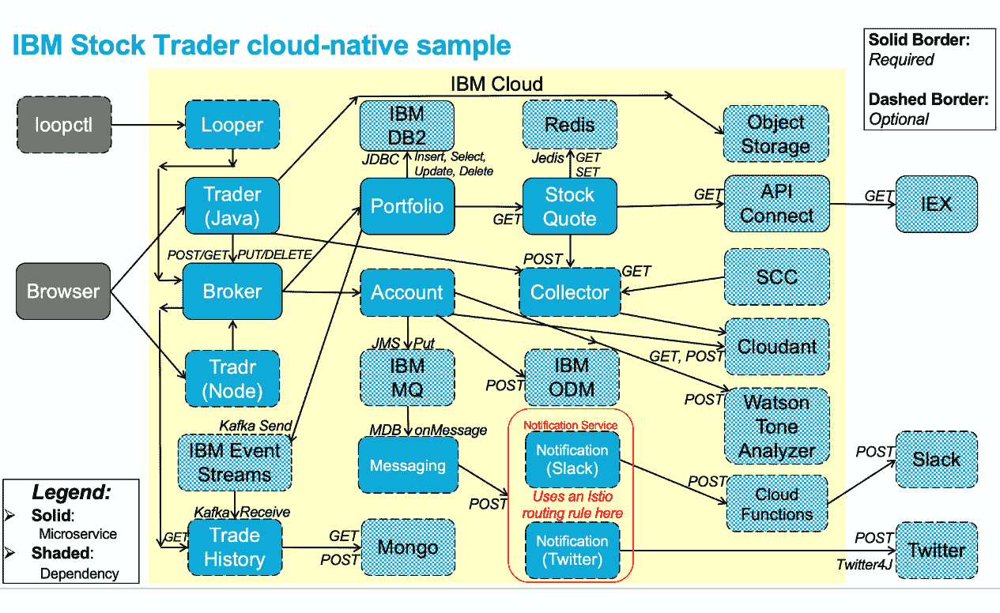

图 9.1 – 架构图

如我们所见，需要配置很多部分才能使一切正常工作。操作符引导我们为每个部分提供此类配置信息（尽管它实际上并不安装后端资源——它只是请求连接到现有资源的端点和凭证详细信息，这些资源可能正在您的集群中运行，或可以从其他地方访问，例如云中的 **DB2-as-a-Service** （**DB2aaS**））。在接下来的两个部分中，我们将了解 OperatorHub 以及如何在我们的集群中安装操作符。

## OperatorHub

**OpenShift** 4.x 控制台包含一个名为 **OperatorHub** 的操作符目录。这里有几个内置的目录源，管理员可以添加额外的源，以便在目录中显示更多他们从供应商（如各种 IBM Cloud Paks 的目录源）购买或他们自己的开发者创建的操作符。让我们通过点击左侧导航菜单中的 **Operators** | **OperatorHub** 来查看 OpenShift 控制台的 **OperatorHub** 部分：

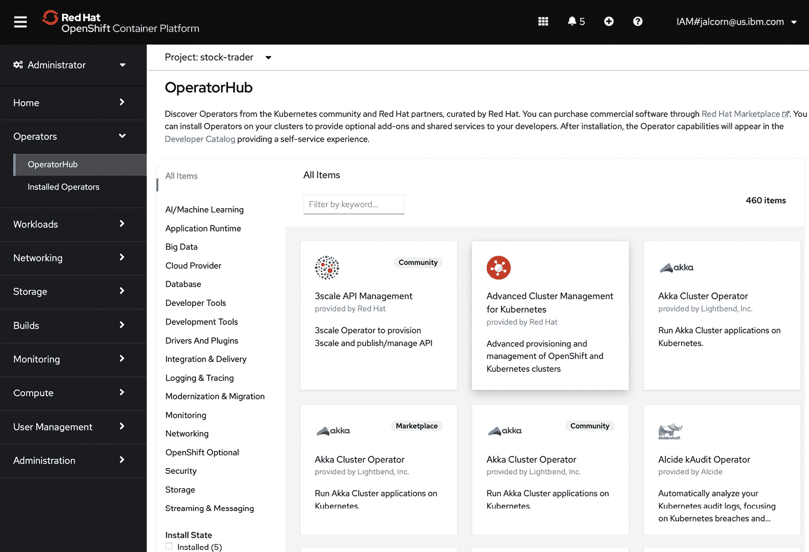

图 9.2 – OperatorHub

在这里，我们可以看到我们有 460 个操作符可用，其中 5 个目前安装在我们的集群中。让我们学习如何安装我们自己的目录源，以便我们可以使我们的操作符（们）在这里显示：

1.  我们将首先点击左侧导航菜单中的 **管理** | **集群设置**。

1.  然后，在过滤器字段中，我们选择 `Hub`，列表将过滤出仅包含该字符串的条目）：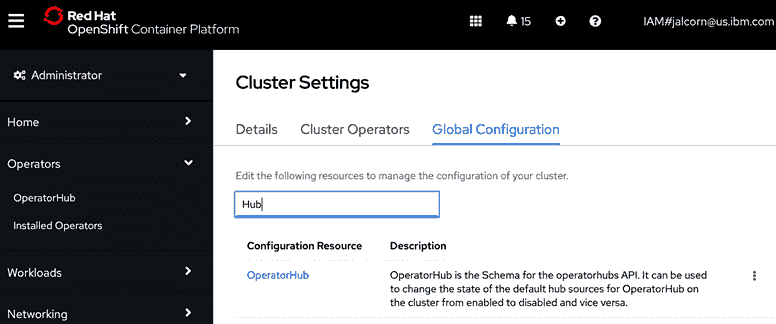

    图 9.3 – 集群设置

1.  然后，在结果页面上，点击 **源** 选项卡。

    您会看到有四个预先配置的源（全部来自 Red Hat），以及每个源贡献的操作符数量：

    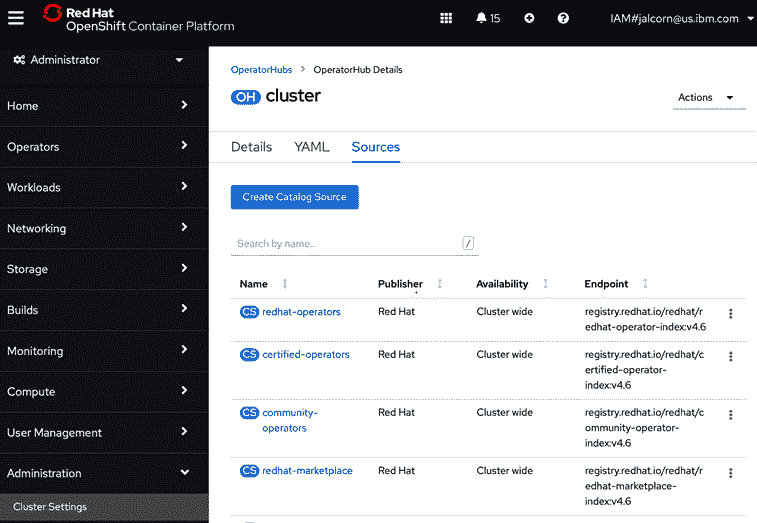

    图 9.4 – 目录源

    如果您的管理员已将您的集群设置为显示默认操作符之外的操作符，您可能会看到超过最初的四个。

1.  然后，只需点击 **创建目录源** 按钮提供我们新源包含 **IBM 股票交易员** 应用程序的操作符的详细信息：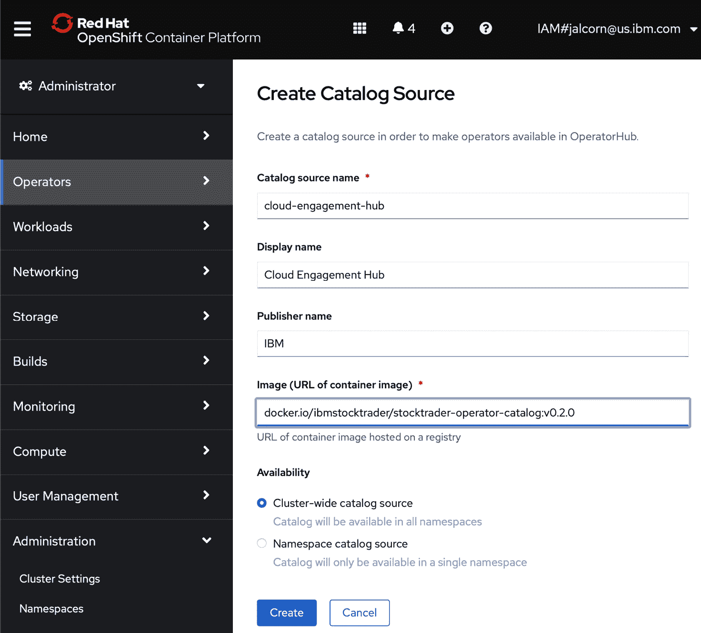

    图 9.5 – IBM 股票交易员目录源的详细信息

    注意

    我们选择将其设置为 **集群范围内的目录源**，这样无论您在集群中使用哪个命名空间，它都是可用的。如果您更喜欢（或只在特定命名空间中拥有权限），您可以选择 **命名空间目录源**。请注意，如果您在一个使用有限安全权限的 ID 的真正受限环境中，您可能需要要求管理员为您执行此操作。

1.  您可以在前三个字段中输入您想要的任何值（我选择了我的团队名称，`Cloud Engagement Hub`）。

1.  最后一个字段，指定在哪里找到目录源的 Docker 镜像，是最重要的，需要设置为`docker.io/ibmstocktrader/stocktrader-operator-catalog:v0.2.0`。

    注意

    当然，您可以从 GitHub 仓库`IBMStockTrader/stocktrader-operator`克隆并构建自己的镜像（按照[`github.com/IBMStockTrader/stocktrader-operator/blob/master/bundle/README.md`](https://github.com/IBMStockTrader/stocktrader-operator/blob/master/bundle/README.md)中的说明）并将其推送到您自己的镜像仓库，并在此处指定它，但为了简化操作，我们使用预先构建的版本，它托管在**Docker Hub**上，以便方便使用。

1.  点击**创建**按钮后，它将带您回到目录源列表。

    初始时，来自该新源的运算符数量将只显示一个短横线，直到 OpenShift 能够下载指定的 Docker 容器镜像并解析其内容。一旦完成，它将更新以显示正确的运算符数量，在我们的例子中只有一个，如图所示：

    ![图 9.6 – IBM 股票交易员目录源详细信息

    ![图 9.7 – 我们集群的 OperatorHub 中的 IBM 股票交易员操作符

    图 9.6 – IBM 股票交易员目录源详细信息

1.  现在如果您回到`股票`，在过滤器字段中，它将只显示包含该字符串的条目：

![图 9.7 – 我们集群的 OperatorHub 中的 IBM 股票交易员操作符

![图 9.7 – IBM 股票交易员操作符信息页面

图 9.7 – 我们集群的 OperatorHub 中的 IBM 股票交易员操作符

恭喜！您现在已将 IBM 股票交易员应用程序的操作符添加到 OperatorHub 目录中。在下一节中，我们将探讨如何安装操作符。

## 安装操作符

现在我们已经将操作符添加到我们集群的目录中，让我们来使用它：

1.  只需点击操作符的瓷砖。这样做将显示有关我们刚刚在上一节中提供的操作符的更多详细信息：![图 9.8 – IBM 股票交易员操作符信息页面

    ![图 9.8 – IBM 股票交易员操作符信息页面

    图 9.8 – IBM 股票交易员操作符信息页面

    如您所见，这显示了关于操作符的一些基本信息，包括其 readme 文件。在此对话框中无需执行任何操作，只需点击**安装**按钮。

    ![图 9.9 – IBM 股票交易员操作符订阅页面

    ![图 9.9 – IBM 股票交易员操作符订阅页面

    图 9.9 – IBM 股票交易员操作符订阅页面

    在这里，我们可以看到关于操作符在我们集群中如何表现的信息；例如，我们可以看到，像所有安装到您集群所有命名空间中工作的 OperatorHub 集成操作符一样，操作符实际运行的命名空间被称为**openshift-operators**。请注意，*安装*操作符在技术上是指对该操作符进行*订阅*（有关更多信息，请参阅下一节*通过 CLI 部署应用程序*）。

1.  一旦您点击**安装**按钮，您将短暂地看到一个对话框，显示正在安装（直到其 pod 启动并通过就绪性检查），然后它会告诉您是否已成功安装。

![图 9.10 – IBM 股票交易员运营商已安装

![图片 B17377_09_10.jpg]

图 9.10 – IBM 股票交易员运营商已安装

恭喜！您现在已安装了**IBM 股票交易员**应用程序的运营商。在下一节中，我们将探讨如何使用该运营商部署应用程序。

# 通过运营商表单 UI 部署应用程序

部署应用程序时，我们将遵循以下步骤：

1.  点击*图 9.10*中显示的**查看运营商**按钮。您将被带到显示运营商信息的页面，当然，它看起来与我们第一次在**运营商中心**点击运营商时看到的非常相似。![图 9.11 – IBM 股票交易员运营商详细信息页面

    ![图片 B17377_09_11.jpg]

    图 9.11 – IBM 股票交易员运营商详细信息页面

1.  我们可以使用*图 9.11*中显示的**创建实例**链接来启动安装我们的**IBM 股票交易员**应用程序实例的对话框：![图 9.12 – IBM 股票交易员运营商表单 UI

    ![图片 B17377_09_12.jpg]

    图 9.12 – IBM 股票交易员运营商表单 UI

1.  接下来，我们将提供一个`microprofile`作为实例名称在此处使用，然后创建的配置文件部署将被命名为`microprofile-portfolio`。

    由于这是一个复合运营商——也就是说，它安装整个应用程序，而不是仅针对特定微服务的运营商——它使用可展开/可折叠的部分来分隔每个微服务的配置设置。它还为它所依赖的每个服务（如**数据库**部分和**IBM MQ 设置**部分）提供这样的部分。在最上面是一个**全局**部分，用于适用于所有选定微服务的设置。请注意，大多数设置都有很好的、合理的默认值，只有在特殊情况下才需要调整。一个例外是**数据库**部分，所以让我们展开它，看看我们需要填写什么，因为这是我们无法在没有的情况下运行的一个强制性先决服务：

    ![图 9.13 – IBM 股票交易员运营商表单 UI 的数据库部分

    ![图片 B17377_09_13.jpg]

    图 9.13 – IBM 股票交易员运营商表单 UI 的数据库部分

1.  如您所见，必须提供标准**端点**类型信息，例如数据库服务器的**数据库主机名（或 IP 地址）**和用于连接它的**数据库端口号**，以及用于认证所需凭证信息。对于每个后续部分，如**Cloudant**、**ODM**或**MQ**，都需要请求非常类似的信息。

让我们展开一个可选的微服务，例如**账户微服务**：

![图 9.14 – IBM 股票交易员运营商表单 UI 的账户微服务部分

![图片 B17377_09_14.jpg]

图 9.14 – IBM 股票交易操作员表单 UI 的账户微服务部分

注意顶部的真/假开关，你可以在这里指定是否要启用此可选微服务。该部分的其他设置只有在选择启用此微服务时才会生效。还要注意指定此微服务的 Docker 容器镜像位置的选项卡；默认情况下，它将预先填充在*Docker Hub*中的位置，我们在这里托管每个微服务的预构建版本以方便使用，尽管如果你自己构建了微服务（如前一章所述）并将其推送到自己的镜像仓库，你也可以在这里输入自己的值。

注意，第一次或第二次安装应用程序时，有表单 UI 引导你完成整个过程是非常有帮助的，但过了一段时间，这可能会变得有点无聊，因为需要为每个微服务和它们依赖的每个先决服务填写每个值。因此，你也可以选择将这些问题的答案简单地放在一个`.yaml`文件中，你可以直接将其拖放到此表单的第二选项卡（**YAML 视图**）：

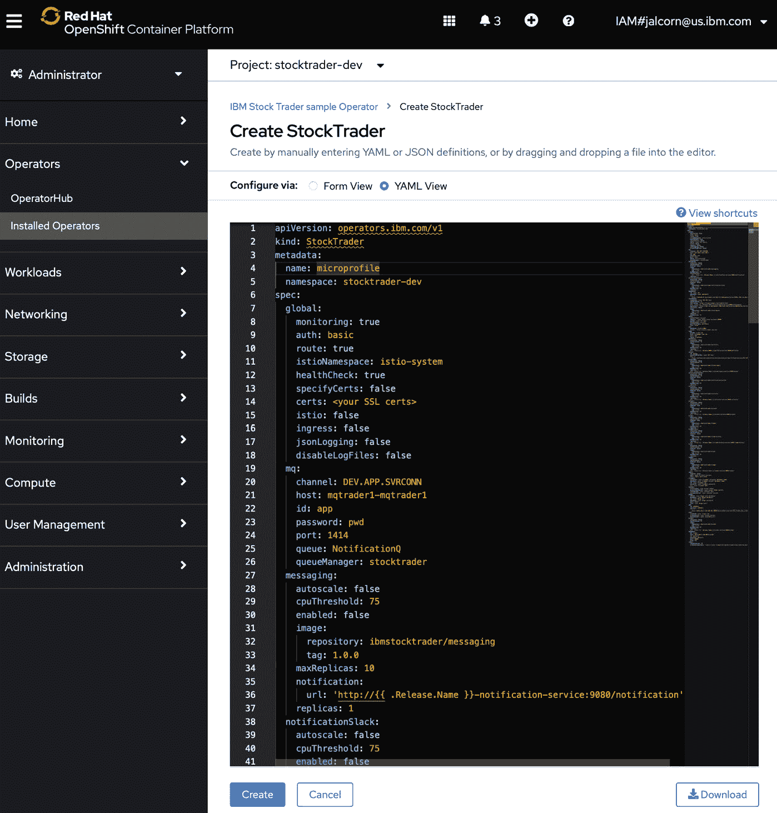

图 9.15 – IBM 股票交易操作员表单 UI 的 YAML 视图选项卡

无论你以何种方式提供输入，一旦你在页面底部点击**创建**按钮，就会得到相同的结果。你应该会看到你提供**名称**的新实例出现在**IBM 股票交易**应用程序实例列表中：

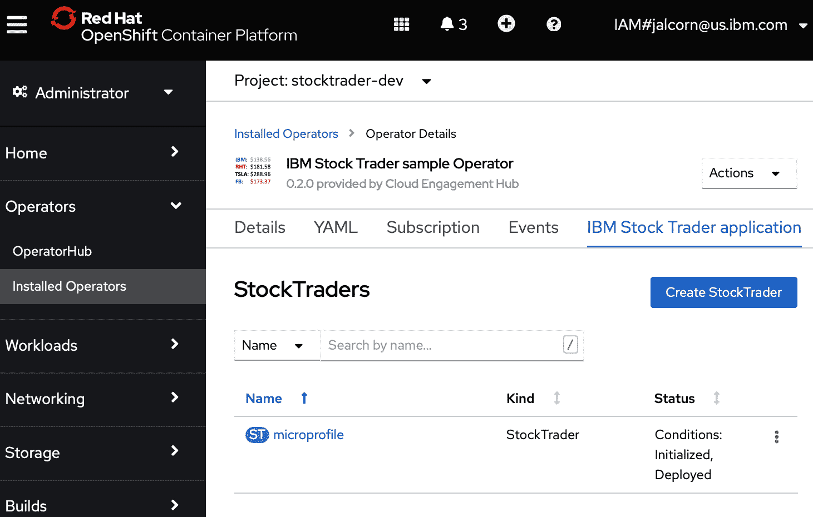

图 9.16 – IBM 股票交易操作员 UI 的**StockTraders**部分

如果我们点击那个名称，我们将看到关于我们新部署实例的信息。有几个选项卡；**资源**选项卡特别有用，可以查看在*第七章*，“使用 Open Liberty、Docker 和 Kubernetes 的 MicroProfile 生态系统”中讨论的哪些 Kubernetes 资源是由操作员创建的：

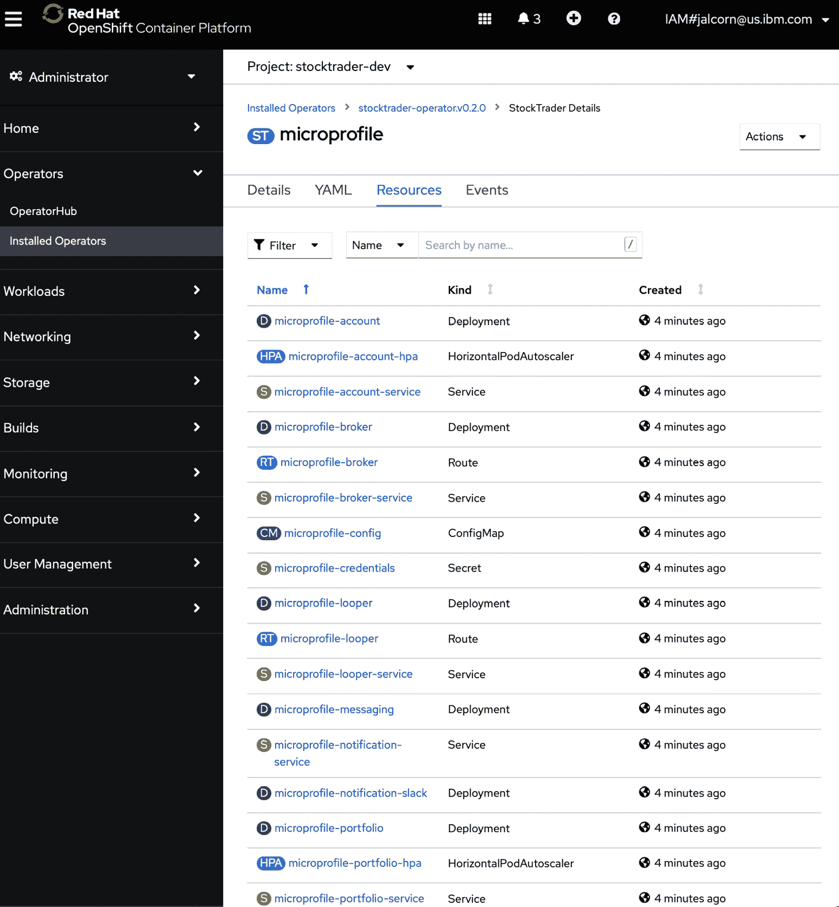

图 9.17 – IBM 股票交易操作员 UI 的“资源”选项卡

这里显示的内容取决于你选择启用哪些微服务。由于这可能是一个很长的列表，因此顶部左侧有一个**过滤器**按钮，可以用来过滤列表，只显示特定类型的 Kubernetes 对象：

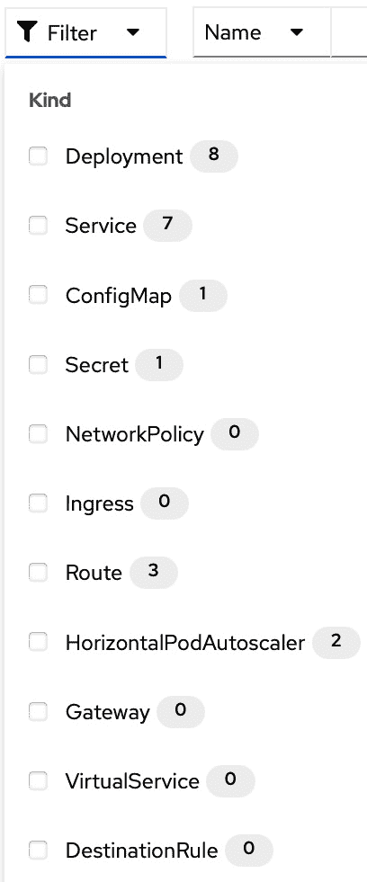

图 9.18 – IBM 股票交易操作员表单 UI 的过滤器对话框

在这里，我们可以看到在这个实例中，我们有 8 个 Deployment（微服务），7 个 Service（其中一个微服务是一个没有 HTTP 端点的 MDB，因此没有 Service），1 个 ConfigMap，1 个 Secret，3 个 Route，和 2 个 HorizontalPodAutoscalers。如果我们启用了其他选项，例如在表单/yaml 的 **全局** 部分的 **Istio** 真假设置，那么我们会看到像 **Gateway**、**VirtualService**、**DestinationRule** 和 **NetworkPolicy** 这样的额外项，这些项的值不为零。我们还可以通过在 OpenShift 控制台中点击 **工作负载** | **Pods** 来查看资源，以查看所有正在运行的 pod：

![图 9.19 – 组成 IBM 股票交易应用的每个微服务的 pod]

![img/B17377_09_19.jpg]

图 9.19 – 组成 IBM 股票交易应用的每个微服务的 pod

我们已经看到了如何通过 OpenShift 控制台安装 IBM 股票交易应用。在下一节中，我们将探讨如何通过 `kubectl` **命令行界面**（**CLI**）来使用操作符。

# 通过 CLI 部署应用

有时候你需要通过除了使用图形用户界面以外的其他方法来完成某些事情。也许你只是更喜欢使用 CLI。或者，也许你想要在 **持续集成/持续部署**（**CI/CD**）管道的步骤中自动化此类工作。或者，也许你正在使用除了 **Red Hat OpenShift 容器平台**（**OCP**）以外的 Kubernetes 发行版，例如来自超大规模提供商之一，如 **Amazon Web Services**（**AWS**）或 **Microsoft Azure**。要在没有 OpenShift 控制台的好处下部署应用，请按照以下步骤操作：

1.  你首先需要做的是确保通过遵循 [`olm.operatorframework.io/docs/getting-started/`](https://olm.operatorframework.io/docs/getting-started/) 中的说明来安装 `brew install operator-sdk`。

    注意

    `operator-sdk` 用于生成像 IBM 股票交易应用那样的操作符。生成此操作符起点确切的命令是 `operator-sdk init --plugins helm --group operators --kind StockTrader --domain ibm.com --version v1 --helm-chart ../stocktrader-helm/stocktrader-1.5.0.tgz`。

1.  下一步是创建包含以下内容的 `.yaml` 文件的目录源：

    ```java
    apiVersion: operators.coreos.com/v1alpha1
    kind: CatalogSource
    metadata:
      name: cloud-engagement-hub
    spec:
      publisher: IBM
      displayName: Cloud Engagement Hub
      image: 'docker.io/ibmstocktrader/stocktrader-    operator-catalog:v0.2.0'
    ```

    唯一真正重要的值是 `image` 字段 – 你可以为其他字段指定任何你想要的值。将文件命名为你想要的任何名称，例如 `catalog-source.yaml`。确保你从终端窗口登录到你的集群，然后运行命令 `kubectl apply -f catalog-source.yaml`。大约一分钟后，目录源将可用，就像通过 OpenShift 控制台完成的那样。

1.  接下来，你将通过目录源安装操作符。创建另一个包含以下内容的 `.yaml` 文件：

    ```java
    apiVersion: operators.coreos.com/v1alpha1
    kind: Subscription
    metadata:
      name: stocktrader-operator
      namespace: openshift-operators
    spec:
      channel: alpha
      installPlanApproval: Automatic
      name: stocktrader-operator
      source: cloud-engagement-hub
      sourceNamespace: openshift-marketplace
      startingCSV: stocktrader-operator.v0.2.0
    ```

    你可以取任何你想要的名称，例如 `subscription.yaml`。然后，运行 `kubectl apply -f subscription.yaml`。一旦完成，操作员将被安装并可用。

1.  最后一步是应用你想要创建的 IBM 股票交易员应用程序实例的 yaml 文件。正如在 *理解操作员角色* 部分中讨论的那样，操作员定义了一个 CRD – 在这种情况下，为 `StockTrader` 类型的对象 – 而在这里我们正在创建该类型的 CR。

    股票交易员 CR yaml 的结构与我们在 OpenShift 控制台中看到的是相同的；每个可展开的部分映射到 .yaml 文件中的缩进级别。例如，每个微服务都有一个部分，以及它们所依赖的每个先决服务。以下是一个示例 `CR yaml` 的片段，其中大部分内容已被裁剪以避免出现许多页的 yaml 内容：

    ```java
    apiVersion: operators.ibm.com/v1
    kind: StockTrader
    metadata:
      name: microprofile
    spec:
      global:
        auth: basic
        healthCheck: true
        ingress: false
        istio: false
        istioNamespace: mesh
        route: true
        traceSpec: "*=info"
        jsonLogging: false
        disableLogFiles: false
        monitoring: true
        specifyCerts: false
      database:
        type: db2
        db: BLUDB
        host: dashdb-txn-sbox-yp-dal09-
          08.services.dal.bluemix.net
        id: my-id-goes-here
        password: my-password-goes-here
        port: 50000
      account:
        enabled: true
        replicas: 1
        autoscale: false
        maxReplicas: 10
        cpuThreshold: 75
        image:
          repository: ibmstocktrader/account
          tag: 1.0.0
        url: http://{{ .Release.Name }}-account-
          service:9080/account
    ```

    在你传递的 yaml 中未指定的任何字段将使用其默认值，所以你实际上只需要填写你想要设置为非默认值的字段。要查看完整的 `Stock Trader CR yaml 文件` 示例，你可以复制/粘贴操作员页面（如图 9.15 所示）切换到 **YAML 视图** 选项卡时出现的文本，或者去 GitHub 上查看 [`github.com/IBMStockTrader/stocktrader-operator/blob/master/config/samples/operators_v1_stocktrader.yaml`](https://github.com/IBMStockTrader/stocktrader-operator/blob/master/config/samples/operators_v1_stocktrader.yaml)。

1.  一旦你的 CR yaml 文件填写完毕，保存它，使用你喜欢的任何文件名，例如 `stock-trader.yaml`，然后部署 IBM 股票交易员应用程序的实例就像运行 `kubectl apply -f stock-trader.yaml` 那么简单。这需要几分钟才能完成。

    一旦完成，你可以通过运行简单的 `kubectl get pods` 命令来查看为你所选微服务运行的哪些 pod：

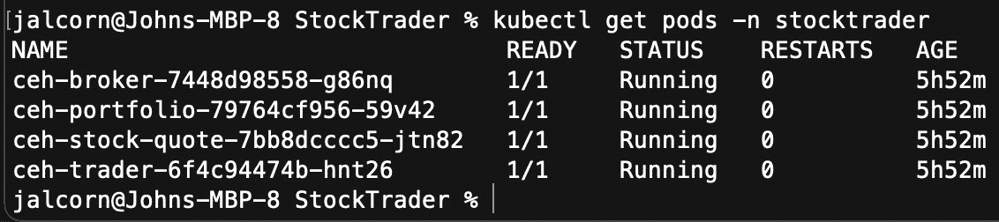

图 9.20 – 控制台输出

恭喜！你已确认部署了 IBM 股票交易员应用程序，只需创建并应用了三个 yaml 文件！现在你已经学会了如何部署应用程序，让我们学习通过操作员可以做什么。

# 理解第二天操作

Kubernetes 社区的人常说部署是 *第一天*，而你之后为维护应用程序所做的事情是 *第二天* 操作。以下是一些 *第二天* 操作的例子：

+   扩展或缩减特定微服务的规模

+   升级到微服务的新版本

+   设置跟踪字符串以执行问题确定

让我们详细看看每一个。

## 扩展微服务

微服务架构的一个好处是你可以独立扩展每个微服务。你不必一次性扩展单体应用程序的所有部分，而只需扩展遇到吞吐量或响应时间问题的部分。

当使用由操作员生成的资源时，需要注意的一点是操作员本身 *拥有* 这些资源，并且不会让您直接更改它们。例如，如果您想编辑 Portfolio 部署以扩展 pod 的数量，尝试这样做可能会暂时看起来有效，但实际上，操作员会持续监控，并将任何在其权限之外被编辑的资源还原。有一个称为 **reconciliation** 的过程，高级操作员可以使用它来决定是否以及如何合并请求的更改，但像 Stock Trader 这样的简单基于 Helm 的操作员将拒绝直接编辑其生成的任何 Kubernetes 资源。

正确进行此类更改的方法是编辑 Stock Trader 部署实例的 CR yaml 文件。您可以通过 OpenShift 控制台或 CLI 来这样做。如果使用 CLI，您可以通过设置 `KUBE_EDITOR` 环境变量来选择您想要的任何基于文本的编辑器。例如，如果您在 Mac 上开发，并且更喜欢它的 `nano` 编辑器而不是老式的 `vi` 编辑器，只需运行命令 `export KUBE_EDITOR=nano`。

因此，如果您想将您的 Portfolio 部署从单个 pod 扩展到两个，您只需运行 `kubectl edit StockTrader microprofile`，这将将其当前的 yaml 文件加载到指定的编辑器中，在那里您会进入 `portfolio` 部分，将 `replicas` 字段的值更改为 `2`，保存文件并退出，这将导致生成的 Portfolio 部署更新为具有两个 pod：

```java
  portfolio:
    replicas: 2
    autoscale: false
    maxReplicas: 10
    cpuThreshold: 75
    image:
      repository: ibmstocktrader/portfolio
      tag: 1.0.0
    url: http://{{ .Release.Name }}-portfolio-      service:9080/portfolio
```

注意

除了硬编码副本数量外，您还可以启用 `autoscale: true` 来启用 HPA，如果达到阈值，Kubernetes 将增加 pod 的数量，当活动减少时将缩减。

## 升级微服务

您可能还希望对已部署的 Stock Trader 实例进行的一项更改是升级到给定微服务的新版本。例如，如果开发人员构建并推送了 Account 微服务的新版本到您的 Docker 镜像仓库，您将使用操作员指向新版本。同样，您不会直接编辑 Account 部署，而是编辑 `Stock Trader CR yaml 文件`，然后操作员会代表您对 Account 部署进行更改。

如果你之前使用的是为账户微服务提供的`1.0.0`标签的镜像，并且你想升级到`1.0.1`版本，你将使用之前用于扩展的方法，但这次，当你将 CR yaml 文件导入到你的`nano`编辑器时，你需要将版本号改为`1.0.1`。当你保存`CR yaml`文件并退出编辑器后，操作员将更新账户部署以使用新的`tag image`。这将导致一个新的账户 pod 使用`1.0.1`标签启动，一旦它通过就绪检查，原始的`1.0.0`级别的 pod 将被终止（Kubernetes 称这为**滚动升级**，因为它避免了任何应用程序版本不可用的停机时间）：

```java
  account:
    enabled: true
    replicas: 1
    autoscale: false
    maxReplicas: 10
    cpuThreshold: 75
    image:
      repository: ibmstocktrader/account
      tag: 1.0.1
    url: http://{{ .Release.Name }}-account-      service:9080/account
```

通过始终对整个`StockTrader CR yaml`文件采取行动，而不是担心每个微服务的生成 yaml 文件，操作员使你专注于业务应用层面，同时仍然给你提供独立版本化各个部分的灵活性。

## 执行问题确定

对于应用程序，你经常需要做的一件事是，当某些事情没有按预期工作时要尝试找出原因。这个过程被称为**问题确定**（**PD**），或者在事后分析以找出导致失败的原因时，有时被称为**根本原因分析**（**RCA**）。再次强调，操作员可以在这里帮助你，例如，通过允许你在每个微服务托管的 Open Liberty 容器中开启额外的跟踪。

如前所述，你编辑 CR yaml 文件以实现这种更改。CR yaml 文件的`global`部分有一个`traceSpec`字段，你可以编辑它以提供所需的跟踪规范。例如，如果你想为代理微服务开启细粒度跟踪，你将把`traceSpec`字段设置为代理微服务的完全限定类名，即`com.ibm.hybrid.cloud.sample.stocktrader.broker.BrokerService`，并将其设置为`fine`。请注意，你可能仍然希望保留其他所有内容的`info`级别跟踪，因此你将使用冒号来分隔跟踪规范的两个部分。

为了帮助进行 PD（问题确定），你可能还想开启 JSON 日志记录。这会导致日志以可以被工具如*ElasticSearch*消费的格式输出，这样你就可以轻松地在一个单一的联邦日志仪表板，如*Kibana*中过滤来自各个微服务 pod 的日志。

注意

*ElasticSearch*、*LogStash* 和 *Kibana* 的组合通常被称为 **ELK Stack**；有时，*FluentD* 会替代 *LogStash*，那么组合就被称为 **EFK**；有关使用 OperatorHub 操作员在您的集群中设置 **ELK**/**EFK** 的详细信息，请参阅 [`docs.openshift.com/container-platform/4.6/logging/cluster-logging-deploying.html`](https://docs.openshift.com/container-platform/4.6/logging/cluster-logging-deploying.html)。请注意，还有其他更多企业级日志分析工具，例如 *LogDNA* 或 *Instana*。

让我们看看一个 *Kibana* 仪表板：

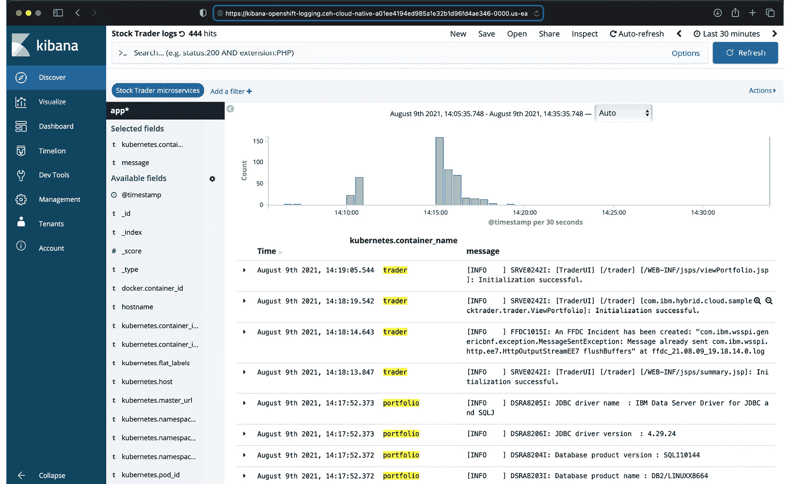

图 9.21 – 为 IBM 股票交易微服务过滤的联邦可观察性仪表板

在 *图 9.21* 中，我们看到来自构成 IBM 股票交易应用程序的各个微服务的日志消息，这些消息根据每个 JSON 日志消息发送的时间戳进行交错。能够在单个仪表板中看到所有来自云原生应用程序中所有微服务的日志，而不是必须分别查看每个微服务的输出，这极大地增强了问题确定体验。

JSON 日志的另一个好处是它让您能够控制哪些源将它们的日志发送到 Kubernetes 集群的日志分析工具。除了 HTTPS 访问日志或审计记录等选择之外，还有一个选择是将跟踪记录发送到那里，就像我们刚才讨论的 *traceSpec* 设置一样（否则，您将不得不使用 `kubectl cp` 将 `trace.log` 文件从 pod 复制出来以调查跟踪日志，或者将您自己的 *持久卷* (*PV*) 挂载到容器的 `/logs` 位置，跟踪日志就会放在那里）：

```java
  global:
    auth: basic
    healthCheck: true
    ingress: false
    istio: false
    istioNamespace: mesh
    route: true
    traceSpec: "com.ibm.hybrid.cloud.sample.stocktrader       .broker.BrokerService=fine:*=info"
    jsonLogging: true
    disableLogFiles: false
    monitoring: true
    specifyCerts: false
```

您可以使用操作员执行许多其他日常 2 运维操作。但这一点应该足以说明操作员是控制您应用程序所有配置的，因此当需要时，它被用来实施任何更改。

# 摘要

我们现在已经探讨了拥有一个操作员帮助您在 Kubernetes 集群中部署复合应用程序以及日常 2 运维的一些好处。虽然在不使用操作员的情况下部署特定的微服务是可能的，但有一个操作员引导您就像有一个副驾驶在适当的时候建议好的默认值，以确保您的应用程序以最佳配置设置部署。在部署后阶段拥有一个操作员，帮助您进行如扩展、升级和问题确定等日常 2 运维操作，确保您在生产使用中维护应用程序时拥有最佳体验。

我们现在已经涵盖了所有核心的 MicroProfile 特性，并在运行在 Kubernetes 平台（如 OCP）的基于微服务的实际应用中展示了它们的使用。展望未来，接下来的章节将涵盖一些辅助的 MicroProfile 特性（例如反应式消息传递），并展望 MicroProfile 在当前 4.x 状态之外的未来。
