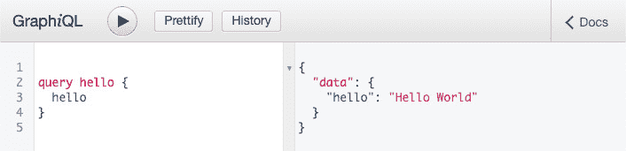
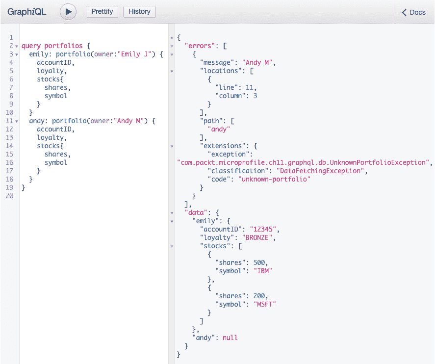
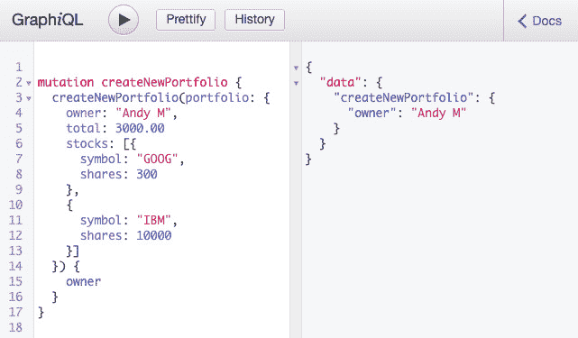
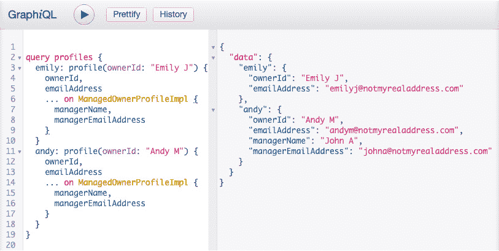
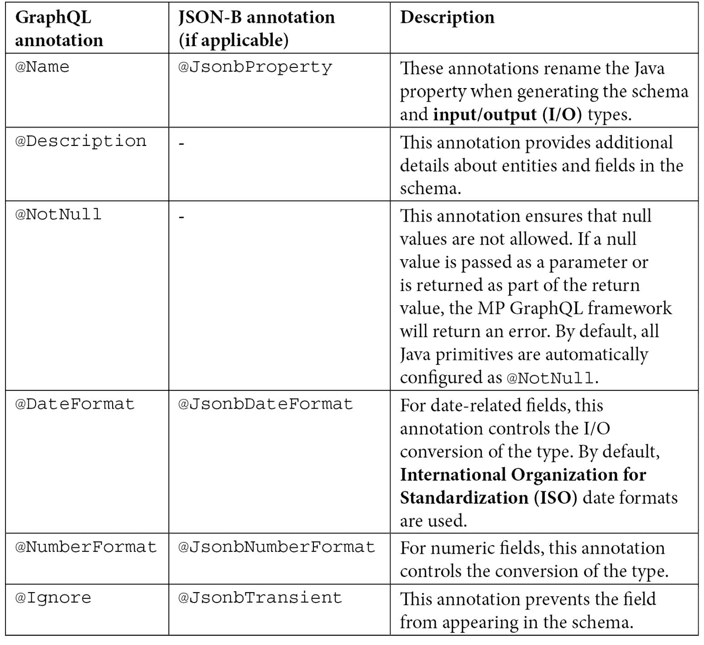

# 第十一章**：MicroProfile GraphQL**

**GraphQL** 是一种分布式查询语言，它解决了 **REpresentational State Transfer** （**REST**） 的一些缺点。特别是，GraphQL 解决了 **过度获取**（接收比客户端预期更多的数据）和 **不足获取**（要求客户端发出多个请求以获取所需的数据）的概念。GraphQL 应用程序利用一个模式文件，向客户端展示其可用的查询和突变，以及它可以访问和操作的对象。

GraphQL 的易用性和健壮性解释了为什么它的受欢迎程度在增长，尤其是在云原生应用中。**MicroProfile GraphQL** （**MP GraphQL**） 使得创建基于 GraphQL 的应用变得简单。

在本章中，我们将涵盖以下主要主题：

+   理解 GraphQL 基础知识及其适用场景

+   使用 MP GraphQL 构建服务

+   使用客户端 **应用程序编程接口** （**APIs**） 消费 GraphQL 服务

到本章结束时，您将了解 GraphQL 是什么以及何时适合使用它，并且您将能够构建自己的 GraphQL 应用程序，准备在开源、云就绪服务器（如 Open Liberty）上部署。

# 技术要求

要构建和运行本章中提到的示例，您需要一个装有以下软件的 Mac 或 PC（Windows 或 Linux）：

+   **Java 开发工具包** （**JDK**） 版本 8 或更高 ([`ibm.biz/GetSemeru`](http://ibm.biz/GetSemeru))

+   Apache Maven ([`maven.apache.org/`](https://maven.apache.org/))

+   Git 客户端 ([`git-scm.com/`](https://git-scm.com/))

本章中使用的所有源代码都可以在 GitHub 上找到，网址为 [`github.com/PacktPublishing/Practical-Cloud-Native-Java-Development-with-MicroProfile/tree/main/Chapter11`](https://github.com/PacktPublishing/Practical-Cloud-Native-Java-Development-with-MicroProfile/tree/main/Chapter11)。

一旦您已经克隆了 GitHub 仓库，您可以通过进入 `Chapter11` 目录并在命令行中执行以下命令来启动 Open Liberty 服务器，这些代码示例将在其中执行：

```java
 mvn clean package liberty:run
```

然后，您可以通过按 *Ctrl + C* 在同一个命令窗口中停止服务器。

现在我们已经处理好了先决条件，让我们从学习 GraphQL 的基础知识开始。

# 理解 GraphQL 基础知识及其适用场景

与 REST 一样，GraphQL 是通过基于 Web 的传输访问和修改远程数据的一种方式。它使用一个公开可见的模式，允许客户端确切地知道它可以查询哪些实体，哪些字段可以修改，等等。这与 OpenAPI 描述 RESTful API 的方式相似。该模式充当客户端和服务的合同。GraphQL 严格强制执行模式，防止客户端访问或修改未在该模式中定义的实体或字段。这种严格性为客户端和服务端开发者提供了很多自由，我们将在本节稍后介绍。

GraphQL 支持以下操作：

+   REST 中的`GET`请求。

+   **变更**：变更用于修改数据——即创建、更新和/或删除它。

+   **订阅**：订阅用于使客户端能够接收特定事件的通知，例如当某个特定实体被创建或某个字段低于某个特定阈值，或者甚至是无关的事件。

与 REST 不同，在 REST 中，API 的不同部分分散在多个**超文本传输协议**（**HTTP**）端点，GraphQL 应用程序通常使用单个 HTTP 端点，并且操作嵌入在 HTTP 请求的主体中。

GraphQL 操作和模式使用它们自己的语法，但响应以**JavaScript 对象表示法**（**JSON**）格式。这允许 GraphQL 服务和客户端用任何语言编写。虽然我们计划介绍如何在 Java 中创建服务，但目前也可以用 JavaScript、Python、Go、Haskell、Perl、Ruby、Scala 以及许多其他语言编写服务和客户端应用程序。

模式定义了服务可访问的实体类型以及可以执行的操作。内置或原始的 GraphQL 类型被称为**标量**。任何服务都可以自由定义自己的标量类型，但 GraphQL 规范指出，所有服务都必须至少使用以下五个标准标量：

+   `int`—32 位有符号整数

+   `float`—有符号双精度浮点数

+   `string`—使用**Unicode 转换格式-8**（**UTF-8**）编码的字符序列

+   `boolean`—`true`或`false`

+   `ID`—一个旨在作为实体的唯一**标识符**（**ID**）的字符串；它不打算供人类阅读

GraphQL 对象可以由标量或其他对象组成。每个操作必须明确指定它希望在响应中查看的所有字段。对于复杂类型（包含其他类型或标量的类型），这可能意味着指定多层深度的字段。

要求客户端在查询中指定所有字段，确保在向现有对象添加新字段时保持向后兼容性。如果对象上出现新字段，而客户端现有的查询没有指定它，那么客户端就不会感到意外！

要求客户端指定他们感兴趣的所有字段的好处之一是避免了**过度获取**。过度获取发生在通过网络发送的数据多于所需的情况。REST 中过度获取的一个常见例子是天气数据。如果你向多个天气网站发出 RESTful 请求，以检查特定位置的当前条件，你会看到大量的信息，但当你只想知道室外温度以及是否下雨时，大部分数据都是未使用的。

通过将查询作为 HTTP 请求的有效负载发送，GraphQL 还避免了**不足获取**。正如你可能猜到的，不足获取发生在返回的数据不足的情况下。使用天气示例，假设你还想了解其他城市朋友家的温度。你必须为每个位置向天气网站发出类似的 RESTful 请求。但在 GraphQL 中，你可以在单个 HTTP 请求中发出多个查询，使你能够通过单次往返服务器获取所需的确切数据，从而使其快速高效！

查询和突变有自己的语法，尽管它与 JSON 和其他查询语言相似。通常，这些操作以`query`或`mutation`开头，然后是操作的标签，然后在大括号内指定要调用的查询或突变，以及括号内的任何参数。然后，你会在大括号内添加你感兴趣的字段。我们将在本章后面看到一些查询和突变的示例。

GraphQL 还允许`503`（服务不可用）错误。有些数据总比没有好，对吧？

由于模式对客户端是公开的，各种工具可以内省模式，使用户能够构建查询和突变并在实时中测试它们。我们将稍后讨论的一个这样的工具被称为**GraphiQL**([`github.com/graphql/graphiql`](https://github.com/graphql/graphiql))。

虽然 REST 仍然是云中更广泛使用的通信架构，但 GraphQL 正迅速获得人气，因为它解决了 REST 中的许多差距。那么，哪种方法适合你？答案，就像大多数事情一样，是*取决于*。GraphQL 主要只与 JSON 作为响应类型一起工作；如果你想使用其他数据类型，你可能需要考虑 REST 或另一种方法。如果你的数据本质上是分层的，它可能更适合 REST。

另一个考虑因素是针对`/public/*`的安全限制，同时限制对其他实体的访问（例如，`/private/*`）。在 GraphQL 中，如果不将服务拆分为单独的公共和私有服务，这是不可能实现的，这可能不是最佳方案。

类似地，与 GraphQL 一起，HTTP 缓存也更加复杂。由于 REST 使用 URI 路径，客户端和服务器都可以根据使用的路径缓存实体结果。在 GraphQL 中，根据路径进行缓存是可能的，但这将要求客户端将它们的查询作为 HTTP `GET` 查询参数传递。这可能对客户端来说很麻烦，同时也可能是一个潜在的安全风险，因为代理服务器将能够看到查询参数，并且您可能仍然会因查询的间距和格式问题而遇到缓存问题。幸运的是，大多数 GraphQL 的实现都在服务器端使用查询缓存来减少不必要的重复工作。

那么，您何时会使用 GraphQL 呢？GraphQL 在服务器端（为了过滤结果以获取客户端所需的确切内容）可能会稍微昂贵一些，但这种权衡意味着客户端处理显著减少。因此，如果您有很多客户端或希望优化客户端性能，GraphQL 是一个好的选择。

GraphQL 通常可以减少网络流量，因为它避免了数据获取不足和过度获取。在网络带宽昂贵的环境中，GraphQL 是理想的解决方案。

还应注意的是，没有任何东西阻止您为同一服务同时编写 GraphQL 和 RESTful API。这可能会增加更多的维护工作，但它允许您的客户端进行选择。

现在我们已经了解了什么是 GraphQL 以及何时应该使用它，接下来让我们探讨如何使用 MicroProfile 来构建 GraphQL 应用程序。

# 使用 MP GraphQL 构建服务

在本节中，我们将学习如何使用 MP GraphQL API 和运行时框架开发 GraphQL 应用程序。我们将涵盖构建查询和突变，以及如何使用一个名为 **GraphiQL** 的交互式网络工具来调用它们。我们还将涵盖实体和枚举类型。最后，我们将介绍一种减少不必要的服务器端计算并传递部分结果的技术。

大多数针对 Java 的 GraphQL API 都需要您首先编写一个模式，然后围绕它构建 Java 代码。这种方法往往会导致一定程度的双重维护，并且随着您应用的发展，它可能会减慢开发速度。MP GraphQL 使用一个 `Hello World` 查询服务。

## 开发查询

与 JAX-RS 一样，MP GraphQL 也是基于注解的。首先需要考虑的注解是 `@GraphQLApi`。这个注解是一个 **Contexts and Dependency Injection** (**CDI**) 的 bean 定义注解，这意味着当您将此注解应用于一个类时，它就变成了一个 CDI bean。这使 CDI 框架能够管理其生命周期并注入依赖项。这个注解对于包含查询或突变方法的类是必需的。

我们接下来要考虑的下一个注解是 `@Query`。当这个注解应用于方法时，它告诉 MP GraphQL 运行时在模式中创建一个顶级查询。让我们看看一个简单的例子，如下所示：

```java
@GraphQLApi
public class SimpleApi {
    @Query
    public String hello() {
        return "Hello World";
    }
}
```

`@GraphQLApi`注解告诉运行时管理此 bean 的生命周期，而`@Query`注解告诉运行时在模式中生成一个无参数的查询，该查询返回一个`String`标量。如果我们在一个 MP GraphQL 服务器（如 Open Liberty）上运行此示例，然后我们可以通过浏览到`http://localhost:9080/ch11/graphql/schema.graphql`来查看模式文件。然后，我们会看到类似这样的：

```java
"Query root"
type Query {
  hello: String
}
```

使用`http://localhost:9080/ch11/graphql-ui`然后输入以下查询字符串：

```java
query hello {
  hello
}
```

然后，点击三角形的*播放*按钮查看结果。你应该看到类似这样的：



图 11.1 – GraphiQL 中的简单查询

注意，结果是带有标签`data`的 JSON 对象。查询的结果始终位于`data`字段下。如果发生错误，将会有一个单独的`errors`字段，而不是`data`字段，或者与`data`字段一起。该字段将包括错误详情。

这是一个很好的开始，你可能会猜到在这个类中可以有多个查询方法，它们可以返回不同的数据，但带有参数的查询要强大得多。在之前的章节中，我们一直在处理**股票交易员**应用程序。让我们在我们的后续示例中将该应用程序 GraphQL 化。

如果我们想让客户端能够指定查询的参数，我们只需将 Java 方法参数添加到`@Query`注解的方法中。让我们看看`Portfolio`服务可能的做法，如下所示：

```java
@GraphQLApi
public class PortfolioGraphQLApi {
    @Inject
    private PortfolioDatabase portfolioDB;
    @Query
    @Description("Returns the portfolio of the given       owner.")
    public Portfolio portfolio(@Name("owner") String owner)
        throws UnknownPortfolioException {
        return Optional.ofNullable(portfolioDB.getPortfolio           (owner)).orElseThrow(() -> new                UnknownPortfolioException(owner));
    }
    //...
}
```

这里有一些新事物需要考虑。首先，我们注入`PortfolioDatabase`实例。这不过是一个`HashMap`的包装器，但它也可以访问真实的 SQL 或 NoSQL 数据库来检索股票投资组合数据。CDI 为我们注入了它。*非常感谢！*

接下来，`portfolio`查询方法也应用了`@Description`注解。这允许我们指定一个人类可读的描述，该描述将出现在生成的模式中，这对于描述查询及其参数的意图很有用。

说到参数，该方法接受一个名为`owner`的`String`参数。`@Name`注解告诉运行时在生成模式时使用哪个名称。

最佳实践

使用`@Name`注解在参数上以实现可移植性。某些 MP GraphQL 实现可能无法从代码中确定参数名称，并最终使用`arg0`、`arg1`等参数名称编写模式。`@Name`注解确保运行时将在模式中生成指定的参数名称。

在上述代码中还有一点值得注意，那就是我们不是返回一个 `string` 或其他原始数据类型，而是返回一个 `Portfolio` 对象。这是我们应用程序中的一个自定义对象。通过这样做，运行时会反射 `Portfolio` Java 对象，并将其作为模式中的实体生成。它还会生成它引用的任何其他对象。让我们看看从这个代码生成的模式，如下所示：

```java
type Portfolio {
  accountID: ID
  loyalty: Loyalty
  owner: String
  stocks: [Stock]
  total: Float!
}
"Query root"
type Query {
  "Returns the portfolio of the given owner."
  portfolio(owner: String): Portfolio
}
type Stock {
type Stock {
  commission: Float!
  dateOfLastUpdate: String
  pricePerShare: Float!
  shares: Int!
  symbol: String!
  total: Float!
}
}
enum Loyalty {
  BRONZE
  GOLD
  SILVER
}
```

首先，我们看到 `Portfolio` 类型（实体）及其各种字段及其类型。因此，`accountID` 字段是一个 `string`；`total` 字段是一个 `float`，感叹号表示该字段的值必须非空；`stocks` 字段是一个 `Stock` 对象的数组，方括号表示这是一个 **数组**。

我们还看到了我们查询的文本描述。查询部分表明，`portfolio` 查询接受一个名为 `owner` 的单个 `String` 参数，并返回一个 `Portfolio` 对象。

`Stock` 类型被引入是因为它被 `Portfolio` 类型所引用。同样，`Loyalty` `Portfolio` 类型。GraphQL 中的枚举是从 Java `枚举` 生成的，并且行为类似。

让我们再次查看生成此模式的代码，我们会看到 `portfolio` 方法抛出 `UnknownPortfolioException` 异常。这个异常由框架处理。当异常被抛出时，框架将向客户端返回一个错误响应。让我们看看当我们查询两个投资组合——一个存在的和一个不存在的——会发生什么，如下所示：



图 11.2 – 多个查询：一个成功，一个失败并抛出预期异常

*图 11.2* 显示我们可以在同一个请求中发送多个查询。它还显示我们可以接收部分结果。在这种情况下，查询 `Emily J` 的投资组合详情是成功的，但查询 `Andy M` 的投资组合详情失败了，因为他的投资组合尚未在数据库中。

现在我们已经基本了解了如何创建查询方法，让我们看看我们如何创建突变。

## 开发突变

当我们想到 **创建、读取、更新和删除** (**CRUD**) 操作时，查询是 *读取* 部分，而突变是其他所有操作。尽管如此，查询和突变只是标签——一个 GraphQL 查询当然可以创建、更新或删除实体，而突变可以简单地返回实体的视图，但这不是预期的实践。

最佳实践

查询方法永远不应该操作实体数据。使用查询来返回实体的当前状态，使用突变来更改这些数据。

要创建一个变异方法，你只需将`@Mutation`注解应用到你的 Java 方法上。在大多数情况下，变异方法将接受参数来指示要进行的更改类型，以及/或者指定要更新或删除的实体。让我们看看我们如何使用变异方法来创建一个`Portfolio`对象，如下所示：

```java
@GraphQLApi
public class PortfolioGraphQLApi {
    //...
    @Mutation
    public Portfolio createNewPortfolio(@Name("portfolio") 
      Portfolio portfolio)
        throws DuplicatePortfolioOwnerException,             UnknownPortfolioException {
        portfolioDB.addPortfolio(portfolio);
        return portfolio(portfolio.getOwner());
    }
```

这里有几个需要注意的地方。首先，`createNewPortfolio`方法返回它刚刚创建的`Portfolio`对象——它实际上调用了我们在上一节中编写的`portfolio`方法，以确保新的`Portfolio`对象在数据库中成功创建。变异，就像查询一样，必须始终返回某些内容。不允许有空的变异或查询方法。

建议

如果你真的不想返回任何内容，可以考虑返回一个`boolean`类型的值来表示变异是否成功完成，或者考虑返回一个`int`类型的值，表示创建了/更新了/删除了多少实体。

关于此代码的第二个需要注意的地方是它接受一个复杂对象作为参数。这将在模式中生成一些新的条目。让我们看看如下：

```java
input PortfolioInput {
  accountID: ID
  loyalty: Loyalty
  owner: String
  stocks: [StockInput]
  total: Float!
}
input StockInput {
  commission: Float!
  shares: Int!
  symbol: String
}
```

这些输入类型与我们生成查询方法模式时看到的类型非常相似。不同之处在于这些类型后面附加了`input`。GraphQL 区分用于输入的类型和用于输出的类型。这有一个优点，即这意味着客户端可能可以查看他们无法修改或反之亦然的内容。那么，变异在**GraphiQL**中看起来会是什么样子呢？让我们看看如下：

![图 11.3 – 创建新投资组合的变异]



图 11.3 – 创建新投资组合的变异

*图 11.3* 展示了如何指定一个复杂的参数，`portfolio`。语法与 JSON 非常相似，但并不完全一样——注意字段名没有引号。还要注意变异指定了一个返回值，`owner`——一个有效的查询或变异必须包含至少一个返回值。

关于参数和分页的说明

查询或变异中的参数不需要与底层业务实体相关。你也可以使用参数来指定`pageNumber`和`entriesPerPage`，这样客户端就可以根据自己的节奏处理投资组合。

现在我们已经涵盖了查询和变异，让我们更深入地看看实体以及我们如何在 GraphQL 世界中塑造它们！

## 编写实体

实体都是用于输入或输出的复杂类型（不是**标量**）。MP GraphQL 运行时会计算所有由根级查询和突变引用的实体，并将它们自动添加到模式中。它将区分用作参数（输入）的实体和用作返回值（输出）的实体。而且，正如我们在上一节中发现的那样，框架还会添加由其他实体引用的实体，这些实体可能不是由根级查询和突变直接引用的。这包括类、枚举和**接口**。

### 使用 GraphQL 接口

我们已经介绍了作为实体的基本类和枚举，现在让我们看看接口。与 Java 中的接口一样，GraphQL 接口可以被具体的 GraphQL 类型实现。一个区别是输入类型不能实现接口，这可能会使事情变得复杂。让我们通过一个例子来更好地理解。假设我们想要一个包含账户所有者联系信息的投资组合所有者*配置文件*。由于一些投资组合账户可能由除所有者之外的人管理，我们可能想要两种不同的配置文件类型——一种用于单人所有者，另一种用于指定管理员的账户。为了满足这个要求，我们可能编写如下代码：

```java
@Interface
public interface OwnerProfile {
    String getOwnerId();
    String getEmailAddress();
    void setEmailAddress(String emailAddress);
}
public class OwnerProfileImpl implements OwnerProfile {
    private String ownerId;
    private String emailAddress;
    // ... public getters / setters
}
public class ManagedOwnerProfileImpl extends 
  OwnerProfileImpl implements OwnerProfile {
    private String managerName;
    private String managerEmailAddress;
    // ... public getters / setters
}
```

在前面的代码片段中，我们看到 `@Interface` 注解应用于 `OwnerProfile` 接口。这告诉 MP GraphQL 框架将此接口作为模式中的 GraphQL 接口处理。然后，框架将搜索此接口的实现，并将它们也添加到模式中。

接下来，让我们看看 API 类可能的样子，如下所示：

```java
@GraphQLApi
public class ProfileGraphQLApi {
    @Inject
    OwnerProfileDatabase db;
    @Query
    public OwnerProfile profile(String ownerId) {
        return db.getProfile(ownerId);
    }
    @Mutation
    public boolean addProfile(OwnerProfileImpl profile)           throws DuplicatePortfolioOwnerException {
        db.addProfile(profile);
        return true;
    }
    @Mutation
    public boolean addManagedProfile
      (ManagedOwnerProfileImpl profile)           throws DuplicatePortfolioOwnerException {
        db.addProfile(profile);
        return true;
    }
}
```

注意，API 类为创建每种类型的配置文件提供了单独的突变方法。这是 GraphQL 不允许输入类型实现接口的一个不幸副作用——尽管 Java 代码实现了接口，但 GraphQL 代码并没有。这意味着参数不能是接口。另一方面，输出类型没有这种限制，因此我们可以使用一个查询方法来处理两种配置文件类型。这个 API 类与实体接口和类的组合将生成一个如下所示的模式（简化版）：

```java
interface OwnerProfile {
  emailAddress: String
  ownerId: String
}
type ManagedOwnerProfileImpl implements OwnerProfile {
  emailAddress: String
  managerEmailAddress: String
  managerName: String
  ownerId: String
}
type OwnerProfileImpl implements OwnerProfile {
  emailAddress: String
  ownerId: String
}
input ManagedOwnerProfileImplInput {
  emailAddress: String
  managerEmailAddress: String
  managerName: String
  ownerId: String
}
input OwnerProfileImplInput {
  emailAddress: String
  ownerId: String
}
```

如我们所预期，`ManagedOwnerProfileImpl` 类型实现了 `OwnerProfile` 接口。它具有与接口相同的字段，并且还有一些额外的字段。那么，我们如何在查询中访问这些额外的字段呢？魔法发生在查询的*第 6 行*和*第 14 行*，如下面的截图所示：



图 11.4 – 使用接口的查询

如 *图 11.4* 所示，`… on ManagedOwnerProfileImpl` 代码类似于将接口转换为实现类，然后调用仅在实现类上存在的 getter 方法。注意在输出中，为 `Emily J` 返回的配置文件类型不是 `ManagedOwnerProfileImpl` 类型，因此它不包含额外的字段。

就像 Java 一样，接口对于组织和重用实体非常有用。现在，让我们看看我们如何进一步细化实体。

### 使用实体注解

在 GraphQL 模式中将实体类公开是很常见的，但可能需要重命名一个字段（或排除一个）或使一个字段为只读，或者进行其他修改。这可以通过在实体字段和/或 getter/setter 方法上使用注解来实现。由于 MP GraphQL 与 **JSON 绑定**（**JSON-B**）集成，许多 MP GraphQL 特定的注解可以被 JSON-B 注解所替代，以避免注解过载。

我们已经看到了在查询/突变方法中的参数上使用 `@Name` 注解，但我们也可以在实体字段和 getters/setters 上使用此注解来 *重命名* 在生成的 GraphQL 模式中字段。与本章中描述的所有注解一样，如果您将注解放在 getter 方法上，它将仅应用于输出类型。如果您将注解放在 setter 方法上，它将仅应用于输入类型。如果您将其放在字段上，它将应用于两者。

下表列出了在向您的 GraphQL 应用程序添加实体时可能非常有用的注解：



表 11.1 – MP GraphQL 实体注解及其 JSON-B 等价物

将这些注解应用于您的实体类型可以使您更好地控制模型类的外部视图，并更好地重用现有类。

## 外包

假设您有一个具有计算成本高昂的字段的实体——可能需要复杂的数学计算，或者可能需要查询远程数据库等。当客户端对它不感兴趣时计算该字段似乎是浪费的。幸运的是，可以通过 `@Source` 注解避免昂贵的计算。

例如，假设配置文件服务需要能够检查特定投资组合所有者的忠诚度级别，但该信息位于投资组合数据库中，而不是配置文件数据库中。因此，在这个例子中，想要查看配置文件数据的客户端最终会要求服务器连接到两个不同的数据库以获取结果。我们可以通过仅在客户端请求忠诚度字段时检查投资组合数据库来优化这种情况。我们通过在 `ProfileGraphQLApi` 类中添加一个 `getLoyalty(@Source OwnerProfileImpl profile)` 方法来实现这一点，如下所示：

```java
@GraphQLApi
public class ProfileGraphQLApi {
    @Inject
    PortfolioDatabase portfolioDB;
    public Loyalty getLoyalty(@Source OwnerProfileImpl       profile) throws UnknownPortfolioException {
        String ownerId = profile.getOwnerId();
        Portfolio p = portfolioDB.getPortfolio(ownerId);
        return p.getLoyalty();
    }
    // ... 
}
```

这所做的操作是在模式中的`OwnerProfileImpl`实体中*添加*了一个新的字段，`loyalty`。从客户端的角度来看，这个新字段就像任何其他字段一样，但只有当客户端明确请求该字段时，`getLoyalty`方法才会被调用。这是一种避免在客户端不需要结果数据时支付昂贵操作费用的有用方式。

最佳实践

使用`@Source`注解进行昂贵的数据获取，以优化服务器端性能。这也使得你能够减少大型查询在服务器上的内存消耗。

如果`@Source`方法抛出异常，MP GraphQL 框架将为该字段返回一个 null 结果，并将发送错误数据，但将继续发送来自其他字段的数据作为部分结果。

## 使用 GraphQLException 发送部分结果

我们已经看到了两种方法可以将`@Source`注解发送出去以外包字段的数据获取器。

通过使用`GraphQLException`异常，还有一种发送部分结果的方法。这个异常允许你在抛出异常回 MP GraphQL 框架之前包含部分结果。然后框架将尝试将部分结果与错误数据一起发送回客户端。以下是一个示例：

```java
@Mutation
public Collection<Portfolio> createNewPortfolios(
        @Name("portfolios") List<Portfolio> newPortfolios)
        throws GraphQLException, UnknownPortfolioException {
    Tuple<Collection<Portfolio>, Collection<String>>      tuple = portfolioDB.addPortfolios(newPortfolios);
    if (!tuple.second.isEmpty()) {
       // some of the portfolios to be added already exist;
        // throw an exception with partial results
        throw new GraphQLException(
            "The following portfolios already exist and "             + "cannot be re-added: " + tuple.second,              tuple.first); // here are the partial results
    }
    return tuple.first;
}
```

这个变更允许客户端在一次请求中创建多个新的投资组合。如果客户端尝试为已存在的所有者创建投资组合，这将引发异常，但所有其他投资组合仍然会被创建，并将它们的结果以及无法创建的投资组合列表发送回客户端。

在本节中，我们学习了如何使用 MP GraphQL 在 Java 中构建服务器端 GraphQL 应用程序。虽然本节没有具体涉及，但应注意的是，MP GraphQL 与 MicroProfile 的其他功能，如容错和度量，很好地集成。MP GraphQL 1.0 规范已正式发布，并得到开源 Java 服务器（如 Open Liberty、Quarkus 和 WildFly）的支持。规范的未来版本将添加新的功能，例如支持订阅、定义自定义标量、联合类型、内置分页支持和客户端 API。

在本节中，我们学习了如何使用 MicroProfile API 编写简单和高级的 GraphQL 服务。到目前为止，我们只使用**GraphiQL**工具调用了这些服务。在下一节中，我们将学习如何使用 Java API 调用这些服务。

# 使用客户端 API 消费 GraphQL 服务

客户端 API 目前还不是 MP GraphQL 规范的官方部分。在撰写本文时，这些 API 仍在**SmallRye GraphQL**项目中开发，目的是将它们正式纳入规范。

免责声明

由于这些 API 尚未官方发布，它们可能会发生变化。本节中的信息适用于 SmallRye GraphQL 版本 1.2.3 客户端 API。当这些 API 添加到官方 MP GraphQL 规范中时，它们可能会发生变化，因此请查阅[`github.com/eclipse/microprofile-graphql`](https://github.com/eclipse/microprofile-graphql)的官方文档以了解任何更改。

MP GraphQL 项目旨在支持两种客户端 API 的版本。类似于 JAX-RS 客户端和 MicroProfile REST 客户端（见*第四章*，*开发云原生应用*），存在一个**动态客户端**API 和一个**类型安全的客户端**API。与 JAX-RS 客户端一样，动态客户端允许用户指定请求的细节，而类型安全的客户端允许用户构建一个接口来模拟远程服务，并在需要发送新请求时简单地调用它。

这两个客户端 API 在 GitHub 仓库的集成测试中得到了演示，仓库地址为[`github.com/PacktPublishing/Practical-Cloud-Native-Java-Development-with-MicroProfile/tree/main/Chapter11/src/test/java/com/packt/microprofile/ch11/client`](https://github.com/PacktPublishing/Practical-Cloud-Native-Java-Development-with-MicroProfile/tree/main/Chapter11/src/test/java/com/packt/microprofile/ch11/client)。它们测试了一个`allProfiles`查询，该查询返回服务器所知的所有配置文件。在我们的例子中，我们创建了两个用于测试的配置文件。让我们首先看看动态客户端。

## 动态客户端

动态客户端通过构建一个`DynamicGraphQLClient`实例，然后将其作为`Request`或`Document`对象传递来工作。`Request`对象通常包含一个包含您要执行的查询或变异的纯文本字符串，而`Document`对象必须通过编程方式构建。让我们首先看看`Request`方法，如下所示：

```java
@Test
public void testAllProfilesWithStringDocument()
  throws Exception {
    verify(() -> executeSync(
        new RequestImpl("query allProfiles {"
                       +"  allProfiles {"
                       +"     ownerId, emailAddress"
                       +"  }"
                       +"}")));
}
private Response executeSync(Request req) {
    try (DynamicGraphQLClient client = newClient()) {
        return client.executeSync(req);
    } catch (Exception ex) {
        throw new IllegalStateException(ex);
    }
}
private DynamicGraphQLClient newClient() {
    return DynamicGraphQLClientBuilder.newBuilder()
        .url(URL)
        .build();
}
private void verify(Supplier<Response> responseSupplier)        throws Exception {
    Response resp = responseSupplier.get();
    JsonObject data = resp.getData();
    assertNotNull(data);
    JsonArray allProfiles =         data.getJsonArray("allProfiles");
    assertNotNull(allProfiles);
    JsonObject emily = allProfiles.getJsonObject(0);
    assertNotNull(emily);
    assertEquals("Emily J", emily.getString("ownerId"));
    assertEquals("emilyj@notmyrealaddress.com",        emily.getString("emailAddress"));
    JsonObject andy = allProfiles.getJsonObject(1);
    assertNotNull(andy);
    assertEquals("Andy M", andy.getString("ownerId"));
    assertEquals("andym@notmyrealaddress.com",        andy.getString("emailAddress"));
}
```

在这个代码片段中，我们使用建造者模式创建一个新的`DynamicGraphQLClient`实例，并指定`http://localhost:9080/ch11/graphql`。然后，我们在该客户端实例上调用`executeSync`方法，将带有我们的查询的纯文本字符串作为`RequestImpl`传递。这返回一个`Response`对象，我们可以从中提取包含 GraphQL 结果的 JSON-P `JsonObject`实例。

我们还可以用更类似于建造者模式的方式来编写这个，其中我们使用 Java 代码将查询的每一部分构建成一个`Document`对象。以下是一个例子：

```java
@Test
public void testAllProfilesWithConstructedDocument() throws   Exception {
    Field query = field("allProfiles");
    query.setFields(Arrays.asList(field("ownerId"),         field("emailAddress")));
    verify(() -> executeSync(document(operation
        (OperationType.QUERY, "allProfiles",query))));
}
```

在此代码中，我们为查询本身创建了一个 `allProfiles` 字段，然后创建了我们所感兴趣的子字段：`ownerId` 和 `emailAddress`。然后，我们从查询字段构造一个 `Operation`，并从 `Operation` 构造一个 `Document` 对象。然后，我们将 `Document` 对象传递给 `executeSync` 方法以调用查询，我们的 `Response` 对象与之前的代码片段相同。这可能会比简单地用纯文本编写查询看起来更复杂，但优点是你可以根据情况使用这种方法构建更复杂的查询——例如，你可以根据某些情况在查询中程序化地请求额外的字段。

动态客户端是一种编写可能需要根据调用时间进行更改的 GraphQL 查询和变异的好方法。对于预期查询相对静态的情况，类型安全的客户端更为合适。接下来，让我们看看它是什么样子。

## 类型安全客户端

类型安全的客户端借鉴了 MicroProfile REST 客户端的设计。它使用注解和接口来表示远程服务，然后使用构建器模式或 CDI 注入来创建客户端实例。让我们看看我们如何在集成测试用例中实现这一点。首先，我们需要表示实际的响应对象，即 `OwnerProfile` 对象，如下所示：

```java
class OwnerProfile {
    String ownerId;
    String emailAddress;
    // public getters/setters
}
```

这与服务器端的相同类非常相似。现在，让我们看看客户端接口的样子，如下所示：

```java
@GraphQLClientApi
interface ProfileApi {
    List<OwnerProfile> allProfiles();
}
```

此接口使用 `@GraphQLClientApi` 注解来表示它代表远程服务。因为我们只对 `allProfiles` 查询感兴趣，所以我们只有一个方法：`allProfiles`。我们可以添加其他方法来匹配其他查询或变异。由于这是一个单查询方法，我们不需要用 `@Query` 注解它，但如果我们想包括变异，那么我们就需要使用 `@Query` 和 `@Mutation` 注解来指定哪些方法是哪些。

现在，让我们通过构建代码和执行来整合所有这些内容，如下所示：

```java
@Test
public void testAllProfiles() throws Exception {
    ProfileApi api = TypesafeGraphQLClientBuilder         .newBuilder()
        .endpoint(URL)
        .build(ProfileApi.class);
    List<OwnerProfile> allProfiles = api.allProfiles();
    assertNotNull(allProfiles);
    assertEquals(2, allProfiles.size());
    assertEquals("Emily J",         allProfiles.get(0).getOwnerId());
    assertEquals("emilyj@notmyrealaddress.com",        allProfiles.get(0).getEmailAddress());
    assertEquals("Andy M",allProfiles.get(1).getOwnerId());
    assertEquals("andym@notmyrealaddress.com",        allProfiles.get(1).getEmailAddress());
}
```

我们使用 `TypesafeGraphQLClientBuilder` 构建一个 `ProfileApi` 客户端接口的实例。然后，一旦我们在该接口上调用一个方法，查询就会被发送到服务器，并返回与上一节中动态客户端返回的相同的数据列表。

这两种客户端选项都为调用远程 GraphQL 服务提供了大量的功能和灵活性，即使这些服务不是用 MicroProfile 或 Java 构建的。

# 摘要

在本章中，我们学习了 GraphQL 以及它是如何填补 REST 中的一些空白的。我们还学习了如何使用 MP GraphQL 创建和消费 GraphQL 服务，而无需额外维护一个与 Java 代码并存的模式。我们了解到，通过在 API 类上应用注解，我们可以构建查询和突变，并通过添加描述、参数、格式化等功能来丰富它们。通过外包，我们学会了在不需要时避免执行昂贵的操作。我们还学习了在发生异常时如何发送部分结果。我们还了解到，有一些有用的工具，如 **GraphiQL**，可以简化测试。尽管客户端 API 在规范中并未得到完全支持，但我们已经能够查看两个不同的客户端，并看到我们如何可以使用它们进行集成测试或消费 GraphQL 服务。

结合本章所学，再加上我们可用的工具，我们现在能够开发和测试云原生 GraphQL 应用，或者将 GraphQL 前端应用到我们的现有应用中。我们的微服务现在可以避免过度获取和不足获取，减少网络流量，并为客户提供他们真正需要的内容。

在下一章中，我们将探讨 MicroProfile 的未来，并看看我们未来几年可以期待看到哪些变化。
